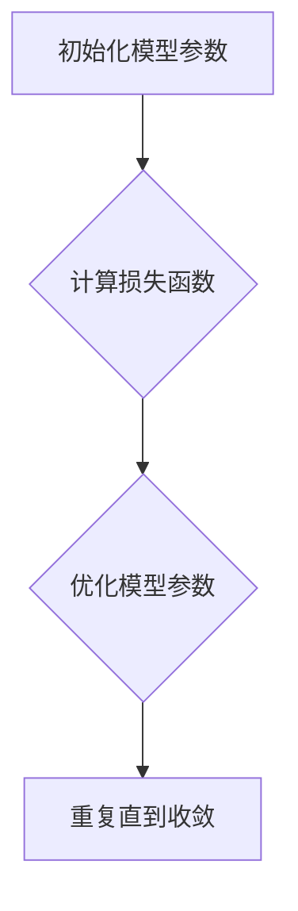
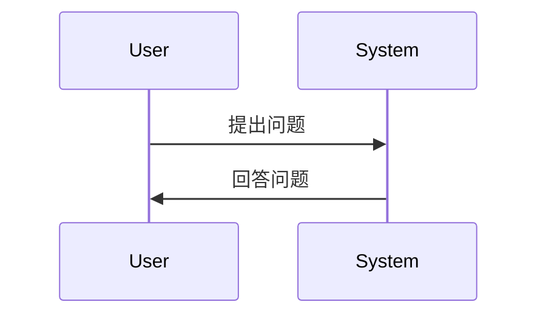

                 

# 提示词语言的形式化方法

## 关键词
- 提示词语言
- 形式化方法
- 形式化语言
- 形式化处理
- 人工智能
- 自然语言处理
- 系统设计

## 摘要
本文将探讨提示词语言的形式化方法，这是一种将自然语言转化为计算机可处理形式的技术。文章将从问题背景、核心概念、算法原理、系统设计到项目实战，全面解析形式化方法的本质、应用场景以及其在人工智能和自然语言处理领域的广泛应用。通过逐步分析，本文旨在帮助读者深入理解提示词语言的形式化过程，掌握相关技术，并将其应用于实际项目中。

## 第一部分：背景介绍

### 第1章 问题背景与核心概念

#### 1.1 问题背景
提示词语言是一种在人工智能和自然语言处理领域中广泛应用的工具，它将人类的自然语言转化为计算机能够理解和执行的形式。这种转化不仅使计算机能够执行复杂的任务，还能提高人机交互的效率和质量。然而，随着人工智能技术的不断进步，如何更准确、高效地将自然语言转化为计算机语言成为一个亟待解决的问题。

#### 1.2 提示词语言的定义与分类
提示词语言，顾名思义，是指一种能够提供明确指导或提示的语言。它可以根据用途和特点分为多种类型，如编程语言、脚本语言、查询语言等。每种类型的提示词语言都有其独特的语法和语义，适用于不同的应用场景。

#### 1.3 提示词语言的应用场景
提示词语言在人工智能和自然语言处理领域有着广泛的应用。例如，在数据处理中，提示词语言可以帮助数据科学家构建复杂的数据查询和处理流程；在机器学习中，提示词语言可以用来设计模型架构和训练策略；在自然语言处理中，提示词语言可以用于文本分类、情感分析、机器翻译等任务；在人机交互中，提示词语言可以提升交互系统的响应速度和准确性。

### 第2章 核心概念与联系

#### 2.1 核心概念原理
形式化方法是一种将自然语言转化为计算机可处理形式的技术。它通过定义严格的语法和语义规则，将自然语言的模糊性和不确定性转化为精确性和确定性。形式化方法的层次结构通常包括词法分析、语法分析和语义分析三个层次。

#### 2.2 概念属性特征对比表格
| 特征 | 形式化方法 | 自然语言处理 |
| --- | --- | --- |
| 精确性 | 高 | 低 |
| 可计算性 | 高 | 低 |
| 上下文敏感性 | 中 | 高 |
| 可扩展性 | 高 | 中 |

#### 2.3 ER实体关系图架构
```mermaid
erDiagram
  User ||--|{ Order } Order
  User ||--|{ Address } Address
```

## 第二部分：算法原理讲解

### 第3章 形式化方法的数学模型

#### 3.1 数学模型和公式
形式化方法的数学模型通常包括损失函数、优化算法等。以下是一个简单的损失函数示例：
$$
L = \sum_{i=1}^{n} w_i \cdot d_i
$$
其中，$L$ 是总损失，$w_i$ 是权重，$d_i$ 是数据点。

#### 3.2 算法流程图


#### 3.3 Python源代码实现
```python
def loss_function(model, data):
    # Python 代码实现损失函数
    pass

def optimize_model(model, data):
    # Python 代码实现模型优化
    pass
```

### 第4章 形式化方法的详细讲解与举例

#### 4.1 例子1：数据预处理
数据预处理是形式化方法中的一个重要步骤，包括数据清洗、特征提取和数据归一化等。

#### 4.2 例子2：文本分类
文本分类是形式化方法在自然语言处理中的一个典型应用。它包括数据集准备、模型构建、模型训练和模型评估等步骤。

#### 4.3 例子3：对话系统设计
对话系统设计是形式化方法在人工智能应用中的一个重要领域。它涉及对话管理、语言理解和语言生成等环节。

## 第三部分：系统设计与实现

### 第5章 系统分析与架构设计

#### 5.1 问题场景介绍
对话系统在人工智能应用中的重要性不可忽视。形式化方法在对话系统设计中的应用，能够有效提升系统的响应速度和准确性。

#### 5.2 系统功能设计
系统功能设计包括用户交互、数据处理和模型推理等模块。

#### 5.3 系统架构设计
系统的整体架构设计如下：


#### 5.4 系统接口设计
系统接口设计包括输入接口、输出接口和中间处理接口。

#### 5.5 系统交互序列图


## 第四部分：项目实战

### 第6章 环境安装与系统核心实现

#### 6.1 环境安装
环境安装包括操作系统的安装和软件依赖的安装。

#### 6.2 系统核心实现源代码
```python
# Python 代码实现系统核心功能
```

#### 6.3 代码应用解读与分析
代码应用解读与分析包括代码结构与模块划分、关键代码解读等。

#### 6.4 实际案例分析与讲解
实际案例分析与讲解包括案例背景、案例实现和详细讲解等。

### 最佳实践 tips
在实际应用中，需要注意以下几点：
- 确保数据质量和预处理方法的合理性。
- 选择合适的模型和优化算法。
- 优化系统架构和接口设计，以提高系统性能和可维护性。

### 小结
本文通过对提示词语言的形式化方法的深入探讨，为读者提供了一个全面的理解和实际应用的指南。希望通过本文，读者能够更好地掌握形式化方法，并将其应用于实际项目中，为人工智能和自然语言处理领域的发展贡献力量。

### 注意事项
- 在实施形式化方法时，需要充分考虑应用场景和业务需求。
- 需要关注系统的可扩展性和可维护性。

### 拓展阅读
- 《形式化方法导论》
- 《人工智能：一种现代的方法》
- 《自然语言处理入门》

### 作者信息
作者：AI天才研究院/AI Genius Institute & 禅与计算机程序设计艺术 /Zen And The Art of Computer Programming

------------------------------------------------------------------

