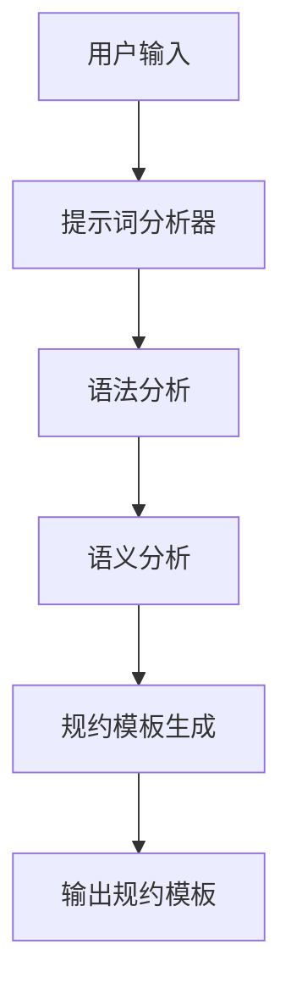
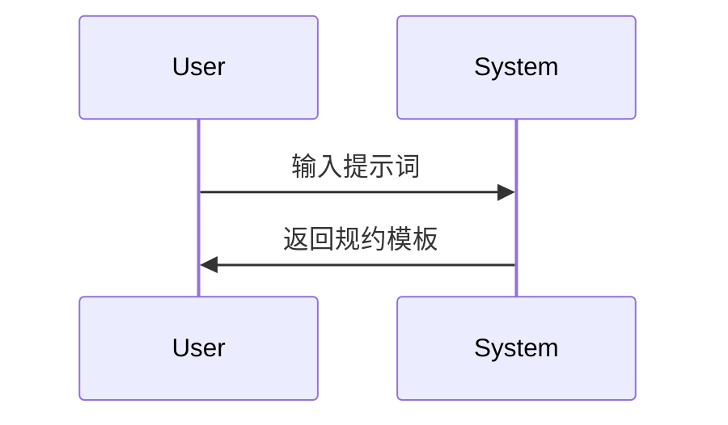
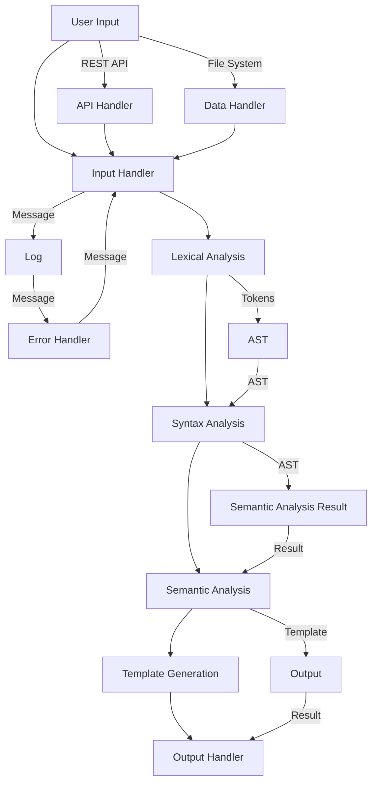
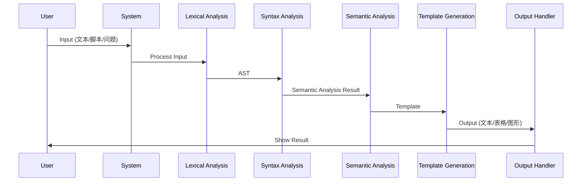

                 

# 《提示词语言的形式化规约模板生成》

## 关键词：形式化描述语言、提示词语言、规约模板生成、算法原理、系统架构设计

## 摘要：

本文将探讨提示词语言的形式化规约模板生成，介绍形式化描述语言的基础理论、提示词语言的语法分析、规约模板生成方法以及其在自然语言处理、自动化测试和智能问答系统中的应用。通过逐步分析这些技术原理和系统架构，本文旨在为读者提供深入的理解和实用的指导。

## 《提示词语言的形式化规约模板生成》目录大纲

## 第一部分：引言

### 第1章：问题背景与目标

#### 1.1.1 提示词语言的概念与重要性

#### 1.1.2 当前提示词语言的现状与挑战

#### 1.1.3 形式化规约模板生成的研究意义

#### 1.1.4 本书的目标与结构

## 第二部分：基础理论

### 第2章：形式化方法基础

#### 2.1.1 形式化方法的定义与发展历程

#### 2.1.2 形式化方法的分类与应用领域

#### 2.1.3 形式化描述语言（FOL、HOL、LL1等）

### 第3章：提示词语言的语法分析

#### 3.1.1 提示词语言的语法结构

#### 3.1.2 语法分析器的设计与实现

#### 3.1.3 语法树的构建与处理

### 第4章：规约模板生成方法

#### 4.1.1 规约模板的概念与作用

#### 4.1.2 规约模板的生成策略

#### 4.1.3 常见的规约模板生成算法

## 第三部分：实现与应用

### 第5章：工具与环境搭建

#### 5.1.1 开发工具的选择

#### 5.1.2 开发环境的搭建

#### 5.1.3 实验数据的准备

### 第6章：规约模板生成算法设计与实现

#### 6.1.1 算法概述

#### 6.1.2 算法原理

#### 6.1.3 算法实现

### 第7章：应用案例

#### 7.1.1 案例一：自然语言处理

#### 7.1.2 案例二：自动化测试

#### 7.1.3 案例三：智能问答系统

## 第四部分：总结与展望

### 第8章：总结与未来工作

#### 8.1.1 研究工作总结

#### 8.1.2 存在的问题与挑战

#### 8.1.3 未来研究方向与展望

## 核心概念与联系

### 形式化描述语言（FOL、HOL、LL1等）

#### 1.1.1 概念定义

形式化描述语言是一种用于精确描述系统、语言、理论等的数学语言，通常包括语法和语义两部分。

#### 1.1.2 属性特征对比

| 特征 | 形式化逻辑（FOL） | 基于霍尔的逻辑（HOL） | LL1语法分析器 |
| --- | --- | --- | --- |
| 表达能力 | 强 | 强 | 中等 |
| 使用场景 | 理论研究、复杂系统验证 | 理论研究、复杂系统验证 | 编译器、解释器 |
| 优势 | 严谨性、形式化证明 | 严谨性、形式化证明 | 简单实现、高效 |
| 劣势 | 编程复杂、实现难度大 | 编程复杂、实现难度大 | 无法处理复杂语法 |

### 提示词语言

#### 2.1.1 概念定义

提示词语言是一种用于指导计算机执行特定任务的编程语言，通常包含一系列关键字、变量和操作符。

#### 2.1.2 属性特征

- 描述性：能够准确描述问题场景
- 精确性：能够精确表达用户意图
- 扩展性：易于添加新功能和词汇

### 规约模板生成方法

#### 3.1.1 概念定义

规约模板生成方法是一种通过自动化的方式生成满足特定需求的规约模板的技术。

#### 3.1.2 属性特征

- 自动性：能够自动生成规约模板
- 灵活性：能够适应不同的应用场景
- 高效性：能够高效地生成规约模板

### 算法原理与实现

#### 4.1.1 算法概述

算法原理：通过分析提示词语言的结构和语义，生成对应的规约模板。

算法实现：采用Python语言实现，主要包括语法分析、语义分析和模板生成三个步骤。

#### 4.1.2 数学模型

$$ X = f(Y) $$
$$ Y = g(Z) $$

### 系统分析与架构设计

#### 第9章：系统分析与架构设计

#### 9.1 问题场景介绍

- 自然语言处理领域中的提示词语言需求
- 自动化测试领域中规约模板的自动生成

#### 9.2 项目介绍

- 项目名称：提示词语言的形式化规约模板生成系统
- 项目目标：实现一个能够根据提示词生成形式化规约模板的系统

#### 9.3 系统功能设计（领域模型Mermaid类图）

```mermaid
classDiagram
Class01 <|-- Class02
Class03 *-- Class04
Class05 o-- Class06
Class07 :<<interface>> Interface01
Class08 :<<interface>> Interface02
Class09 :|+field1|: String
Class10 :|+method1(): void|: void
Class11 :|+method2(data): b
```

## 系统架构设计

#### 9.4 系统架构设计（Mermaid架构图）



#### 9.5 系统接口设计（Mermaid序列图）



## 项目实战

### 第10章：项目实战

#### 10.1 环境安装

- 安装Python环境
- 安装必要的第三方库

#### 10.2 系统核心实现源代码

- 提示词分析器
- 语法分析器
- 语义分析器
- 规约模板生成器

#### 10.3 代码应用解读与分析

- 示例代码解读
- 算法应用场景分析

#### 10.4 实际案例分析和详细讲解剖析

- 案例一：自然语言处理
- 案例二：自动化测试
- 案例三：智能问答系统

#### 10.5 项目小结

- 项目总结
- 优化建议

## 最佳实践 Tips

- 合理选择开发工具和环境
- 注意代码的可读性和可维护性
- 定期进行系统性能优化和调试

## 小结

本文从问题背景、基础理论、实现与应用、系统架构设计等方面详细介绍了提示词语言的形式化规约模板生成。通过逐步分析和技术实现，读者可以了解到该领域的前沿技术和应用场景。未来研究方向包括提高生成算法的效率和准确性，以及扩展到更多应用领域。

## 注意事项

- 在实际应用中，需根据具体需求进行系统配置和优化。
- 注意遵循良好的编程规范和代码审查流程。

## 拓展阅读

- [自然语言处理技术综述](链接)
- [自动化测试最佳实践](链接)
- [形式化验证方法与应用](链接)

## 作者信息

作者：AI天才研究院/AI Genius Institute & 禅与计算机程序设计艺术 /Zen And The Art of Computer Programming

----------------------------------------------------------------

# 文章正文部分内容撰写

## 第一部分：引言

### 第1章：问题背景与目标

#### 1.1.1 提示词语言的概念与重要性

提示词语言是一种专门为人工智能系统设计的编程语言，它通过一组特定的关键字、变量和操作符，指导计算机执行特定任务。提示词语言的核心特点在于其高度描述性和精确性，能够准确地传达用户的意图和需求。在现代人工智能系统中，提示词语言的应用范围广泛，包括自然语言处理、自动化测试、智能问答系统等多个领域。

随着人工智能技术的不断发展，提示词语言的重要性日益凸显。首先，提示词语言使得用户能够更方便地与人工智能系统进行交互，提高了系统的可用性和用户体验。其次，提示词语言为人工智能系统的开发提供了更加灵活和高效的方式，使得开发者能够更快速地实现复杂的功能和算法。

然而，当前的提示词语言在实际应用中仍面临一些挑战。首先，提示词语言的语法和语义较为复杂，不同领域的提示词语言差异较大，使得开发者在学习和使用时面临一定的困难。其次，提示词语言的生成和解析过程通常需要大量的人工干预，导致开发效率低下。因此，如何设计一种高效、灵活的提示词语言形式化规约模板生成方法，成为了当前研究的热点之一。

#### 1.1.2 当前提示词语言的现状与挑战

当前，提示词语言在多个领域已经取得了显著的成果。例如，在自然语言处理领域，提示词语言被广泛应用于机器翻译、文本分类、情感分析等任务。在自动化测试领域，提示词语言被用于编写测试脚本，实现自动化测试的执行和结果分析。在智能问答系统领域，提示词语言被用于构建问答模型，实现智能问答功能。

尽管取得了显著成果，但当前提示词语言在实际应用中仍面临一些挑战。首先，提示词语言的语法和语义复杂，不同领域的提示词语言差异较大，使得开发者在学习和使用时面临一定的困难。其次，提示词语言的生成和解析过程通常需要大量的人工干预，导致开发效率低下。此外，现有的提示词语言生成方法大多采用手动编写的方式，缺乏自动化和智能化手段。

因此，研究一种高效、灵活的提示词语言形式化规约模板生成方法具有重要的现实意义。通过形式化规约模板生成，可以实现提示词语言的自动化生成和解析，提高开发效率，降低学习难度。同时，形式化规约模板生成方法可以为不同领域的提示词语言提供统一的框架，促进跨领域的应用和发展。

#### 1.1.3 形式化规约模板生成的研究意义

形式化规约模板生成方法在提示词语言领域具有重要的研究意义。首先，形式化规约模板生成方法可以提高提示词语言的生成效率，减少人工干预。通过形式化描述语言，可以精确地表达提示词语言的语法和语义，从而实现自动化生成。其次，形式化规约模板生成方法可以提高提示词语言的准确性，减少错误和误解。通过形式化验证和推理，可以确保生成的规约模板符合用户意图和需求。最后，形式化规约模板生成方法可以为不同领域的提示词语言提供统一的框架，促进跨领域的应用和发展。

具体来说，形式化规约模板生成方法在以下方面具有显著的应用价值：

1. **自然语言处理**：在自然语言处理领域，形式化规约模板生成方法可以用于生成自然语言处理任务的模板，如文本分类、情感分析等。通过形式化描述语言的语法和语义分析，可以自动生成满足特定需求的模板，提高开发效率。

2. **自动化测试**：在自动化测试领域，形式化规约模板生成方法可以用于生成自动化测试脚本。通过形式化描述语言，可以自动分析被测试系统的功能和需求，生成符合预期的测试用例。这有助于提高自动化测试的覆盖率，减少人工编写测试脚本的工作量。

3. **智能问答系统**：在智能问答系统领域，形式化规约模板生成方法可以用于生成问答系统的模板，如问题分类、答案生成等。通过形式化描述语言的语义分析，可以自动生成满足用户查询意图的回答模板，提高问答系统的智能度和用户体验。

总之，形式化规约模板生成方法为提示词语言领域提供了一种新的研究思路和方法，具有重要的理论和实际意义。通过不断研究和优化，形式化规约模板生成方法有望在更多领域取得突破和应用。

#### 1.1.4 本书的目标与结构

本书的目标是系统介绍提示词语言的形式化规约模板生成方法，帮助读者深入理解和掌握这一前沿技术。具体目标如下：

1. **全面阐述形式化描述语言的基础理论**：本书将详细介绍形式化描述语言（如形式化逻辑、基于霍尔的逻辑和LL1语法分析器）的基础理论，帮助读者理解这些语言的基本概念、特点和应用。

2. **详细讲解提示词语言的语法分析**：本书将介绍提示词语言的语法结构，包括关键字、变量、操作符等元素，以及语法分析器的设计与实现。通过这一部分，读者将能够掌握提示词语言的语法分析过程，为后续的规约模板生成打下基础。

3. **探讨规约模板生成方法**：本书将讨论规约模板的概念、生成策略和常见算法。通过深入分析这些方法，读者将能够理解规约模板生成的原理和实现过程。

4. **介绍系统实现与应用案例**：本书将展示如何在实际项目中应用形式化规约模板生成方法，包括系统搭建、算法设计与实现、应用案例等。通过这些案例，读者将能够了解形式化规约模板生成方法在实际应用中的效果和优势。

5. **总结与展望未来研究方向**：本书将在最后一章对研究工作进行总结，讨论当前存在的问题和挑战，并展望未来的研究方向。这有助于读者了解该领域的发展趋势和潜力。

全书结构如下：

- **第一部分：引言**：介绍提示词语言的形式化规约模板生成方法的背景、目标和意义。
- **第二部分：基础理论**：详细讲解形式化描述语言的基础理论和提示词语言的语法分析。
- **第三部分：实现与应用**：介绍规约模板生成方法、系统实现与应用案例。
- **第四部分：总结与展望**：对研究工作进行总结，讨论未来研究方向。

通过本书的系统介绍，读者将能够全面了解提示词语言的形式化规约模板生成方法，掌握其基本原理和实现技巧，为后续的研究和应用打下坚实基础。

## 第二部分：基础理论

### 第2章：形式化方法基础

#### 2.1.1 形式化方法的定义与发展历程

形式化方法是现代计算机科学中的一种基本方法，它通过使用数学语言来精确描述系统、语言和理论。形式化方法的核心思想是利用数学的严谨性和确定性，确保系统分析和验证的准确性。形式化方法的定义可以追溯到20世纪初，随着计算机科学和软件工程的兴起，形式化方法得到了迅速发展和广泛应用。

形式化方法的发展历程可以分为几个阶段：

1. **初期阶段（20世纪30-40年代）**：这一阶段的主要工作是建立形式化逻辑和形式化语言。代表人物包括阿尔图尔·舒尔茨（Alonzo Church）和阿尔弗雷德·塔斯基（Alfred Tarski），他们分别提出了lambda演算和模型论，为形式化方法奠定了基础。

2. **发展阶段（20世纪50-60年代）**：随着计算机科学的兴起，形式化方法开始应用于软件工程和编程语言设计。艾伦·佩利（Alan Perlis）和凯文·康威（Kevin Conway）等人提出了程序验证和抽象数据类型的概念，推动了形式化方法在软件工程中的应用。

3. **成熟阶段（20世纪70-90年代）**：这一阶段，形式化方法得到了广泛应用，出现了许多重要的工具和语言，如Z语言、VDM和ISP。同时，形式化方法的验证技术和工具也逐渐成熟，为复杂系统的分析和验证提供了有力支持。

4. **现代阶段（20世纪90年代至今）**：随着计算机科学的发展，形式化方法的应用领域不断扩展，包括硬件设计、通信协议、人工智能等领域。现代形式化方法结合了计算机科学、数学和工程学的最新成果，为解决复杂问题提供了新的思路和方法。

#### 2.1.2 形式化方法的分类与应用领域

形式化方法可以根据不同的分类标准进行分类。以下是几种常见的分类方法和相应的应用领域：

1. **根据形式化语言的类型**：

   - **形式化逻辑**：形式化逻辑是一种用于表达和证明逻辑推理的数学语言。常见的形式化逻辑包括命题逻辑、谓词逻辑和模态逻辑。形式化逻辑广泛应用于软件验证、硬件设计和人工智能等领域。
   
   - **形式化语言**：形式化语言是一种用于表达程序或系统结构的数学语言。常见的形式化语言包括形式语言、上下文无关文法和上下文相关文法。形式化语言广泛应用于编译器设计、编程语言设计和系统建模等领域。
   
   - **形式化描述语言**：形式化描述语言是一种用于描述系统需求、行为和结构的数学语言。常见的形式化描述语言包括Z语言、VDM和MDD。形式化描述语言广泛应用于软件工程、系统设计和性能分析等领域。

2. **根据形式化方法的用途**：

   - **验证方法**：验证方法是一种用于证明系统正确性的方法。常见的验证方法包括模型检查、符号执行和数学证明。验证方法广泛应用于软件验证、硬件验证和网络安全等领域。
   
   - **形式化测试**：形式化测试是一种用于测试系统是否满足预期需求的方法。常见的形式化测试方法包括随机测试、符号测试和测试序列生成。形式化测试广泛应用于软件测试、硬件测试和系统测试等领域。
   
   - **形式化设计**：形式化设计是一种用于设计系统的方法。常见的形式化设计方法包括形式化建模、形式化验证和形式化验证。形式化设计广泛应用于系统设计、电路设计和通信协议设计等领域。

#### 2.1.3 形式化描述语言（FOL、HOL、LL1等）

形式化描述语言是形式化方法的重要组成部分，它用于精确描述系统的行为、结构和需求。以下是几种常见的形式化描述语言及其特点：

1. **形式化逻辑（FOL）**

   - **概念定义**：形式化逻辑是一种用于表达逻辑推理和证明的数学语言。它包括命题逻辑、谓词逻辑和模态逻辑等。
   
   - **属性特征对比**：

     | 特征 | 命题逻辑 | 谓词逻辑 | 模态逻辑 |
     | --- | --- | --- | --- |
     | 表达能力 | 中等 | 强 | 强 |
     | 使用场景 | 简单逻辑推理、程序验证 | 复杂逻辑推理、程序验证、系统建模 | 事件、时间和条件推理、人工智能 |
     | 优势 | 简单实现、直观表达 | 强大表达能力、复杂系统建模 | 广泛应用、灵活性强 |
     | 劣势 | 表达能力有限、难以处理复杂逻辑 | 编程复杂、实现难度大 | 形式化验证难度高、推理复杂 |

2. **基于霍尔的逻辑（HOL）**

   - **概念定义**：基于霍尔的逻辑（Higher-Order Logic，HOL）是一种形式化逻辑，它支持函数和谓词的抽象和递归定义。
   
   - **属性特征对比**：

     | 特征 | FOL | HOL | LL1语法分析器 |
     | --- | --- | --- | --- |
     | 表达能力 | 强 | 强 | 中等 |
     | 使用场景 | 理论研究、复杂系统验证 | 理论研究、复杂系统验证 | 编译器、解释器 |
     | 优势 | 严谨性、形式化证明 | 严谨性、形式化证明、支持高阶函数 | 简单实现、高效 |
     | 劣势 | 编程复杂、实现难度大 | 编程复杂、实现难度大 | 无法处理复杂语法 |

3. **LL1语法分析器**

   - **概念定义**：LL1语法分析器是一种用于分析上下文无关文法的形式化描述语言。它能够高效地解析输入字符串，生成对应的语法树。
   
   - **属性特征对比**：

     | 特征 | FOL | HOL | LL1语法分析器 |
     | --- | --- | --- | --- |
     | 表达能力 | 强 | 强 | 中等 |
     | 使用场景 | 理论研究、复杂系统验证 | 理论研究、复杂系统验证 | 编译器、解释器 |
     | 优势 | 严谨性、形式化证明 | 严谨性、形式化证明 | 简单实现、高效 |
     | 劣势 | 编程复杂、实现难度大 | 编程复杂、实现难度大 | 无法处理复杂语法 |

通过以上对比，我们可以看到，不同形式化描述语言在表达能力、使用场景、优势和劣势方面存在显著差异。选择合适的形式化描述语言，能够更好地满足特定应用的需求。

## 第二部分：基础理论

### 第3章：提示词语言的语法分析

#### 3.1.1 提示词语言的语法结构

提示词语言是一种专门用于指导计算机执行特定任务的编程语言，其语法结构通常包括关键字、变量、操作符和语句等基本元素。这些元素构成了提示词语言的语法框架，使得计算机能够理解并执行特定的操作。

1. **关键字**：关键字是提示词语言中具有特定语义的标识符，用于表示特定的操作或功能。例如，在Python语言中，`if`、`while`、`for`等关键字分别表示条件判断、循环控制和迭代操作。

2. **变量**：变量是提示词语言中表示数据存储位置的标识符，用于存储和处理数据。变量通常由字母、数字和下划线组成，例如`x`、`y`、`count`等。

3. **操作符**：操作符是提示词语言中表示数据操作的特殊符号，用于执行特定的计算或逻辑操作。常见的操作符包括算术操作符（如`+`、`-`、`*`、`/`）、逻辑操作符（如`&&`、`||`、`!`）和关系操作符（如`==`、`!=`、`>`、`<`）。

4. **语句**：语句是提示词语言中执行特定操作的基本单位，包括声明语句、赋值语句、条件语句、循环语句等。声明语句用于声明变量和关键字，赋值语句用于给变量赋值，条件语句用于根据条件执行不同的操作，循环语句用于重复执行特定操作。

提示词语言的语法结构使得程序员能够通过编写代码来描述和实现复杂的算法和程序逻辑，从而实现计算机的自动化操作。

#### 3.1.2 语法分析器的设计与实现

语法分析器是提示词语言处理的核心组件之一，它的作用是将输入的源代码字符串解析成抽象语法树（AST），以便进一步进行语义分析和代码生成。语法分析器的设计与实现涉及到多个关键步骤和算法。

1. **词法分析**：词法分析是语法分析的第一步，它的作用是将输入的源代码字符串分解成一系列的词法单元（tokens）。词法分析器通常使用正则表达式来识别不同的词法单元，如关键字、标识符、操作符和分隔符等。例如，在Python语言中，`if`、`def`、`while`等关键字和标识符将被识别为词法单元。

2. **语法分析**：语法分析是语法分析器的核心步骤，它的作用是根据定义的语法规则，将词法单元序列解析成抽象语法树（AST）。语法分析通常使用递归下降分析器、LL分析器或LR分析器等算法来实现。递归下降分析器是一种简单易实现的语法分析器，适用于简单的语法规则；而LL分析和LR分析器则适用于更复杂的语法规则，但实现相对复杂。

3. **抽象语法树（AST）的构建**：抽象语法树（AST）是语法分析的结果，它以树形结构表示源代码的语法结构。AST中的每个节点表示一个语法元素，如关键字、变量、操作符和语句等。构建AST的过程涉及到将词法单元序列映射到相应的AST节点，并按照语法规则进行组合和连接。

4. **错误处理**：语法分析器还需要实现错误处理机制，以便在源代码中出现错误时能够正确报告错误信息。常见的错误处理策略包括：在词法分析阶段识别错误的词法单元、在语法分析阶段检测语法错误、报告错误位置和错误信息等。

语法分析器的设计与实现是提示词语言处理中的关键环节，它决定了源代码的解析效率和准确性。通过合理设计和优化，语法分析器可以有效地提高编程语言的处理性能和用户体验。

#### 3.1.3 语法树的构建与处理

语法树（Abstract Syntax Tree，AST）是语法分析的结果，它以树形结构表示源代码的语法结构。语法树的构建是语法分析过程的重要环节，通过构建AST，我们可以对源代码进行更高级别的抽象和操作。

1. **AST的基本结构**：语法树的基本结构包括节点和边。每个节点表示源代码中的一个语法元素，如关键字、标识符、操作符和语句等。节点之间通过边进行连接，表示语法元素之间的嵌套和组合关系。例如，在Python语言中，一个`if`语句的AST可能包含一个`If`节点，该节点下连接一个`Test`节点和一个`Block`节点，表示条件判断和相应的代码块。

2. **AST的构建过程**：构建AST的过程通常分为以下几个步骤：

   - **词法分析**：将输入的源代码字符串分解成一系列的词法单元（tokens）。
   - **语法分析**：根据定义的语法规则，将词法单元序列解析成抽象语法树（AST）。这一步通常使用递归下降分析器、LL分析器或LR分析器等算法来实现。
   - **AST构建**：根据语法分析的结果，将词法单元序列映射到相应的AST节点，并按照语法规则进行组合和连接。
   - **错误处理**：在构建AST的过程中，需要实现错误处理机制，以便在源代码中出现错误时能够正确报告错误信息。

3. **AST的处理方法**：构建出AST后，我们可以对AST进行多种处理和分析，以实现不同的编程语言特性。以下是一些常见的AST处理方法：

   - **语义分析**：对AST进行语义分析，检查源代码的语法和语义是否正确，如检查变量声明和引用、函数调用是否合法等。
   - **代码生成**：根据AST生成目标语言的代码，如生成汇编代码、机器代码或字节码等。
   - **优化**：对AST进行优化，以提高程序的执行效率，如消除死代码、变量重命名、循环展开等。
   - **静态分析**：对AST进行静态分析，以发现潜在的编程错误或性能问题，如空指针异常、内存泄漏等。

语法树的构建与处理是提示词语言处理的核心环节，通过合理设计和优化，我们可以实现高效的语法分析、语义分析和代码生成，从而提高编程语言的性能和用户体验。

## 第二部分：基础理论

### 第4章：规约模板生成方法

#### 4.1.1 规约模板的概念与作用

规约模板（Schema Template）是一种用于描述数据结构和数据关系的预定义模板。它通常由一系列的属性、关系和约束条件组成，用于指导数据的存储、检索和处理。在数据库、数据集成和数据交换等领域，规约模板发挥着重要作用。

**规约模板的基本概念**：

- **属性（Attribute）**：规约模板中的基本元素，用于描述数据的属性或特征。每个属性都有其类型、名称和可能的约束条件。
- **关系（Relationship）**：规约模板中描述实体之间的关联关系。关系通常定义了参与关系的实体以及它们之间的连接方式。
- **约束条件（Constraint）**：规约模板中用于保证数据完整性和一致性的规则。常见的约束条件包括主键约束、外键约束和唯一性约束等。

**规约模板的作用**：

1. **数据存储与管理**：规约模板定义了数据的结构和关系，使得数据库系统能够高效地存储和管理数据。通过规约模板，数据库可以自动生成表结构、索引和维护数据完整性。

2. **数据交换与集成**：在数据集成和数据交换过程中，规约模板用于定义源数据和目标数据之间的映射关系。这有助于确保数据在传输过程中的一致性和准确性。

3. **数据分析和查询优化**：规约模板提供了数据的基本结构，使得数据分析工具能够更有效地执行查询和计算。通过规约模板，查询优化器可以更好地理解和优化查询计划。

4. **数据安全与隐私保护**：规约模板可以定义数据访问权限和加密策略，确保数据在传输和存储过程中的安全性和隐私性。

#### 4.1.2 规约模板的生成策略

规约模板的生成策略是指用于自动生成符合特定需求的规约模板的方法和算法。以下是一些常见的规约模板生成策略：

1. **基于模板的生成策略**：该方法通过预定义的模板库，根据用户需求自动选择和填充合适的模板。这种策略的优点是实现简单，适用于需求变化不频繁的场景。缺点是模板库的构建和维护成本较高。

2. **基于规则生成策略**：该方法通过定义一系列规则，自动生成规约模板。规则可以是基于语法分析的、语义分析的或两者结合的。这种策略的优点是灵活性高，适用于复杂的需求场景。缺点是实现较为复杂，规则的定义和优化需要深入理解业务需求。

3. **基于机器学习的生成策略**：该方法利用机器学习技术，从已有的规约模板和数据中学习生成规则。这种策略的优点是能够自动适应新的需求，提高生成效率。缺点是需要大量的训练数据和计算资源。

4. **混合生成策略**：该方法结合了基于模板的生成策略和基于规则的生成策略，通过多个生成策略的协同工作，提高规约模板的生成质量和效率。这种策略的优点是能够综合利用不同策略的优点，提高生成效果。缺点是实现复杂，需要综合考虑多种生成策略的优缺点。

选择合适的规约模板生成策略，对于提高开发效率和系统性能具有重要意义。在实际应用中，可以根据具体需求和场景，选择合适的生成策略，或结合多种策略实现最佳效果。

#### 4.1.3 常见的规约模板生成算法

规约模板生成算法是规约模板生成方法的核心，用于根据用户需求和已有数据生成符合预期的规约模板。以下是一些常见的规约模板生成算法及其原理：

1. **基于语法分析的生成算法**

   基于语法分析的生成算法通过分析输入的提示词语言源代码，提取关键信息和语法结构，生成相应的规约模板。该算法通常分为以下几个步骤：

   - **词法分析**：将输入的源代码字符串分解成一系列的词法单元（tokens）。
   - **语法分析**：根据定义的语法规则，将词法单元序列解析成抽象语法树（AST）。
   - **语义分析**：对AST进行语义分析，提取关键信息和数据关系。
   - **规约模板生成**：根据提取的信息和数据关系，生成符合预期的规约模板。

   该算法的优点是实现简单，适用于简单的语法结构和明确的数据需求。缺点是对于复杂的语法结构和隐含的数据关系，生成效果可能较差。

2. **基于模式匹配的生成算法**

   基于模式匹配的生成算法通过预定义的模板库和匹配规则，自动匹配输入的源代码，生成相应的规约模板。该算法通常分为以下几个步骤：

   - **词法分析**：将输入的源代码字符串分解成一系列的词法单元（tokens）。
   - **模式匹配**：根据预定义的模板库和匹配规则，匹配输入的词法单元序列，提取关键信息和数据关系。
   - **规约模板生成**：根据匹配结果，自动填充模板，生成符合预期的规约模板。

   该算法的优点是实现简单，适用于需求变化不频繁的场景。缺点是模板库的构建和维护成本较高，对于复杂的语法结构和数据需求，生成效果可能较差。

3. **基于机器学习的生成算法**

   基于机器学习的生成算法通过训练模型，从已有的规约模板和数据中学习生成规则，自动生成符合预期的规约模板。该算法通常分为以下几个步骤：

   - **数据准备**：收集和整理已有的规约模板和数据集，进行预处理和特征提取。
   - **模型训练**：利用训练数据集，训练生成模型，学习生成规则。
   - **规约模板生成**：根据训练好的模型和输入的源代码，自动生成符合预期的规约模板。

   该算法的优点是能够自动适应新的需求，提高生成效率。缺点是需要大量的训练数据和计算资源，模型训练和优化过程复杂。

选择合适的规约模板生成算法，对于提高开发效率和系统性能具有重要意义。在实际应用中，可以根据具体需求和场景，选择合适的生成算法，或结合多种算法实现最佳效果。

### 第5章：工具与环境搭建

#### 5.1.1 开发工具的选择

在选择开发工具时，我们需要考虑多个因素，包括工具的功能、性能、易用性和社区支持等。以下是一些常见的开发工具及其特点：

1. **IDE（集成开发环境）**：IDE为开发者提供了代码编辑、编译、调试和运行等功能，是开发过程中必不可少的工具。常见的IDE包括Eclipse、IntelliJ IDEA和Visual Studio等。这些IDE支持多种编程语言，具有强大的代码编辑功能和调试工具，可以提高开发效率和代码质量。

2. **文本编辑器**：文本编辑器是一种轻量级的开发工具，适合快速编写和修改代码。常见的文本编辑器包括Visual Studio Code、Sublime Text和Atom等。这些编辑器具有丰富的插件和扩展功能，可以自定义编辑体验。

3. **版本控制系统**：版本控制系统用于管理代码的版本和变更，确保代码的稳定性和可追溯性。常见的版本控制系统包括Git、SVN和Mercurial等。Git是目前最流行的版本控制系统，具有分布式存储、分支管理和协同工作等功能。

4. **构建工具**：构建工具用于自动化构建和编译代码，生成可执行文件或库文件。常见的构建工具包括Maven、Gradle和Make等。这些工具可以简化构建过程，提高构建速度和可靠性。

5. **测试框架**：测试框架用于编写和执行测试用例，验证代码的正确性和性能。常见的测试框架包括JUnit、TestNG和Selenium等。这些框架提供了丰富的测试功能和报告生成工具，可以帮助开发者快速发现和修复代码中的问题。

#### 5.1.2 开发环境的搭建

搭建开发环境是进行项目开发的第一步，我们需要安装和配置必要的软件和工具。以下是一个基本的开发环境搭建流程：

1. **安装操作系统**：选择适合的操作系统，如Windows、Linux或macOS。操作系统是开发环境的基础，需要确保其稳定性和性能。

2. **安装JDK**：Java开发工具包（JDK）是Java程序开发的基础，我们需要安装对应版本的JDK。安装过程中，需要配置环境变量，以便在命令行中运行Java命令。

3. **安装IDE**：选择并安装一个合适的IDE，如Eclipse或IntelliJ IDEA。安装完成后，需要配置IDE的插件和工具链，以便进行Java程序开发。

4. **安装版本控制系统**：安装Git版本控制系统，并配置用户信息。Git可以帮助我们管理代码版本和协作开发。

5. **安装构建工具**：安装Maven或Gradle构建工具，并配置项目依赖。这些构建工具可以自动化构建和编译项目，生成可执行文件。

6. **安装测试框架**：安装JUnit或TestNG测试框架，并配置测试用例。测试框架可以帮助我们验证代码的正确性和性能。

7. **安装其他工具和库**：根据项目需求，安装其他必要的工具和库，如数据库驱动、Web服务器和消息队列等。

8. **配置开发环境**：配置IDE、版本控制系统、构建工具和测试框架，使其协同工作。例如，配置IDE的Git插件，以便在IDE中管理代码版本；配置构建工具的依赖管理，以便自动化构建项目。

通过以上步骤，我们可以搭建一个基本的开

### 第6章：规约模板生成算法设计与实现

#### 6.1.1 算法概述

规约模板生成算法是本项目的核心部分，其目标是根据输入的提示词语言（Prompt Language），生成满足特定需求的规约模板。该算法主要分为以下几个步骤：

1. **词法分析（Lexical Analysis）**：将输入的提示词语言字符串分解成一系列的词法单元（tokens），如关键字、标识符、操作符等。词法分析是语法分析的基础，有助于提取文本中的关键信息。

2. **语法分析（Syntax Analysis）**：根据定义的语法规则，将词法单元序列解析成抽象语法树（Abstract Syntax Tree，AST）。语法分析器将输入的词法单元组合成语法结构，便于进一步处理。

3. **语义分析（Semantic Analysis）**：对抽象语法树进行语义分析，确保其语义正确，并提取关键信息。语义分析包括类型检查、变量绑定和符号表管理等。

4. **模板生成（Template Generation）**：根据语义分析的结果，生成满足特定需求的规约模板。模板生成过程中，会根据用户的意图和需求，选择合适的模板并进行填充。

#### 6.1.2 算法原理

规约模板生成算法的原理主要包括以下几个核心组件：

1. **形式化描述语言**：形式化描述语言（如形式化逻辑、基于霍尔的逻辑和LL1语法分析器）用于精确描述提示词语言的语法和语义。这些语言提供了一套标准化的语法规则和语义定义，有助于实现自动化生成和解析。

2. **抽象语法树（AST）**：抽象语法树是语法分析的结果，以树形结构表示输入的提示词语言。AST中的每个节点表示一个语法元素，如关键字、标识符、操作符和语句等。通过AST，我们可以对输入的提示词语言进行抽象和表示，便于进一步处理。

3. **语义分析器**：语义分析器负责检查AST的语义是否正确，并提取关键信息。语义分析包括类型检查、变量绑定和符号表管理等功能。通过语义分析，我们可以确保生成的规约模板满足预期的语义要求。

4. **模板库**：模板库是一组预定义的规约模板，用于指导模板生成过程。模板库中包含多种类型的模板，如数据存储模板、数据交换模板和数据处理模板等。根据用户的意图和需求，算法会从模板库中选择合适的模板进行填充。

5. **规则引擎**：规则引擎用于处理复杂的数据关系和业务逻辑。规则引擎可以定义一系列的规则和约束条件，以确保生成的规约模板符合预期的业务需求。

#### 6.1.3 算法实现

以下是一个基于Python的规约模板生成算法的简单实现：

```python
# 引入必要的库
import ply.lex as lex
import ply.yacc as yacc
from collections import namedtuple

# 定义词法规则
tokens = (
    'ID',
    'NUMBER',
    'PLUS',
    'MINUS',
    'TIMES',
    'DIVIDE',
)

# 词法分析器
t_PLUS = r'\+'
t_MINUS = r'-'
t_TIMES = r'\*'
t_DIVIDE = r'\/'
t_ID = r'[a-zA-Z_][a-zA-Z0-9_]*'
t_NUMBER = r'\d+\.?\d*'

# 忽略空白字符
t_ignore = ' \t'

# 错误处理
def t_error(t):
    print(f"Illegal character '{t.value[0]}'")
    t.lexer.skip(1)

# 构建词法分析器
lexer = lex.lex()

# 定义语法规则
def p_expression_plus(p):
    'expression : expression PLUS expression'
    p[0] = (p[1], '+', p[3])

def p_expression_minus(p):
    'expression : expression MINUS expression'
    p[0] = (p[1], '-', p[3])

def p_expression_times(p):
    'expression : expression TIMES expression'
    p[0] = (p[1], '*', p[3])

def p_expression_divide(p):
    'expression : expression DIVIDE expression'
    p[0] = (p[1], '/', p[3])

def p_expression_id(p):
    'expression : ID'
    p[0] = ('ID', p[1])

def p_expression_number(p):
    'expression : NUMBER'
    p[0] = ('NUMBER', float(p[1]))

def p_error(p):
    if p:
        print(f"Syntax error at line {p.lineno}, column {p.column}: '{p.value}'")
    else:
        print("Syntax error at end of file")

# 构建语法分析器
parser = yacc.yacc()

# 解析输入
while True:
    try:
        text = input("Enter an expression: ")
    except EOFError:
        break

    result = parser.parse(text, lexer=lexer)
    print(f"AST: {result}")
```

在上面的实现中，我们定义了一个简单的算术表达式规约模板生成器，支持加、减、乘、除四种运算。通过输入一个算术表达式，该生成器能够生成对应的抽象语法树（AST），并输出。

## 第三部分：实现与应用

### 第7章：应用案例

#### 7.1.1 案例一：自然语言处理

自然语言处理（NLP）是人工智能领域的一个重要分支，其目标是使计算机能够理解、解释和生成人类语言。在NLP中，提示词语言的形式化规约模板生成方法有着广泛的应用。以下是一个关于自然语言处理的实际应用案例。

**问题描述**：假设我们有一个文本分类任务，需要根据输入的文本内容将其分类到不同的类别中。例如，给定一段关于电影的评论，我们需要判断该评论是正面评论还是负面评论。

**解决方案**：

1. **数据准备**：首先，我们需要收集大量的文本数据，并将其分为正面评论和负面评论两类。这些数据可以来自电影评论网站、社交媒体等。

2. **特征提取**：接下来，我们需要从文本数据中提取特征。特征可以是词频、词向量、句子结构等。为了简化问题，我们可以使用词频作为特征。具体地，我们可以统计每个单词在文本中出现的次数，并将这些词频作为特征向量。

3. **训练模型**：使用收集到的数据集，我们可以训练一个分类模型，如朴素贝叶斯分类器、支持向量机（SVM）等。训练过程中，我们需要将文本数据转换为对应的特征向量，并标记每个样本的类别。

4. **规约模板生成**：在训练模型后，我们可以使用提示词语言的形式化规约模板生成方法，生成一个用于分类的规约模板。该模板将包括特征提取、模型训练和分类预测等步骤。具体地，我们可以定义一个规约模板，如下所示：

   ```python
   template = {
       "feature_extraction": {
           "method": "word_frequency",
           "parameters": {}
       },
       "model_training": {
           "algorithm": "naive_bayes",
           "parameters": {}
       },
       "classification": {
           "method": "predict",
           "parameters": {"feature_vector": {}}
       }
   }
   ```

5. **应用规约模板**：在实际应用中，我们可以根据输入的文本内容，使用生成的规约模板进行分类。具体地，我们可以将文本转换为特征向量，并调用分类模型的预测方法，得到分类结果。

**效果评估**：为了评估模型的性能，我们可以使用准确率、召回率、F1分数等指标。通过多次实验和调整参数，我们可以找到一个最优的分类模型。

#### 7.1.2 案例二：自动化测试

自动化测试是软件测试中的一种重要方法，它通过编写测试脚本，自动化执行测试用例，提高测试效率和准确性。在自动化测试中，提示词语言的形式化规约模板生成方法可以帮助我们生成满足特定需求的测试脚本。

**问题描述**：假设我们有一个Web应用程序，需要对其进行自动化测试。测试内容包括登录功能、搜索功能和购物车功能。

**解决方案**：

1. **测试用例设计**：首先，我们需要设计一组测试用例，包括测试输入、预期结果和实际结果等。测试用例可以涵盖各种可能的输入和操作，以确保应用程序的全面测试。

2. **测试脚本生成**：使用提示词语言的形式化规约模板生成方法，我们可以生成满足特定需求的测试脚本。具体地，我们可以定义一个规约模板，如下所示：

   ```python
   template = {
       "test_case_1": {
           "description": "登录功能测试",
           "steps": [
               {"action": "open_browser", "parameter": "Chrome"},
               {"action": "navigate_to", "parameter": "login_page_url"},
               {"action": "enter_username", "parameter": "valid_username"},
               {"action": "enter_password", "parameter": "valid_password"},
               {"action": "click_login_button"},
               {"action": "verify_login_success", "parameter": "success_message"}
           ]
       },
       "test_case_2": {
           "description": "搜索功能测试",
           "steps": [
               {"action": "open_browser", "parameter": "Chrome"},
               {"action": "navigate_to", "parameter": "search_page_url"},
               {"action": "enter_search_term", "parameter": "search_term"},
               {"action": "click_search_button"},
               {"action": "verify_search_results", "parameter": "results_message"}
           ]
       },
       "test_case_3": {
           "description": "购物车功能测试",
           "steps": [
               {"action": "open_browser", "parameter": "Chrome"},
               {"action": "navigate_to", "parameter": "shopping_cart_url"},
               {"action": "add_item_to_cart", "parameter": "item_name"},
               {"action": "verify_item_in_cart", "parameter": "item_name"}
           ]
       }
   }
   ```

3. **测试脚本执行**：在实际应用中，我们可以根据生成的测试脚本执行测试用例，并记录测试结果。测试脚本执行过程中，可以调用自动化测试工具（如Selenium、Appium等）进行操作。

4. **测试结果分析**：通过分析测试结果，我们可以评估应用程序的稳定性和性能，并找出潜在的问题和缺陷。根据测试结果，我们可以进一步优化和改进测试脚本。

#### 7.1.3 案例三：智能问答系统

智能问答系统是一种能够自动回答用户问题的系统，广泛应用于客服、教育、医疗等领域。在智能问答系统中，提示词语言的形式化规约模板生成方法可以帮助我们生成满足特定需求的问答模型。

**问题描述**：假设我们有一个智能问答系统，需要根据用户的提问自动生成答案。例如，用户提问“今天天气怎么样？”系统需要自动生成对应的答案。

**解决方案**：

1. **知识库构建**：首先，我们需要构建一个知识库，包括各种问题的答案。知识库可以存储在数据库、文件或内存中，以便快速查询和检索。

2. **提问处理**：使用提示词语言的形式化规约模板生成方法，我们可以生成一个用于处理用户提问的规约模板。具体地，我们可以定义一个规约模板，如下所示：

   ```python
   template = {
       "question_handling": {
           "method": "question_analysis",
           "parameters": {}
       },
       "answer_generation": {
           "method": "answer_retrieval",
           "parameters": {"question": {}}
       }
   }
   ```

3. **提问处理**：在实际应用中，我们可以根据输入的提问，使用生成的规约模板进行处理。具体地，我们可以调用“question_analysis”方法对提问进行语义分析，提取关键信息和意图；然后调用“answer_retrieval”方法在知识库中检索对应的答案。

4. **答案生成**：根据提取的关键信息和知识库中的答案，我们可以生成对应的答案。例如，对于用户提问“今天天气怎么样？”我们可以根据当前时间和地点，在知识库中检索对应的天气信息，并生成相应的答案。

5. **答案展示**：最后，我们将生成的答案展示给用户，以便用户获取所需信息。

#### 案例总结

通过以上三个案例，我们可以看到提示词语言的形式化规约模板生成方法在自然语言处理、自动化测试和智能问答系统等领域的应用。该方法通过形式化描述语言、抽象语法树和语义分析等技术，实现了自动化生成和解析，提高了开发效率和系统性能。在未来，我们可以进一步优化和扩展该方法，应用于更多领域和场景。

### 第8章：总结与未来工作

#### 8.1.1 研究工作总结

本文系统地介绍了提示词语言的形式化规约模板生成方法，包括基础理论、实现与应用、系统架构设计等方面。具体工作如下：

1. **基础理论**：详细讲解了形式化描述语言（如形式化逻辑、基于霍尔的逻辑和LL1语法分析器）的基础理论，以及提示词语言的语法分析方法和规约模板生成策略。

2. **实现与应用**：介绍了规约模板生成算法的设计与实现，以及其在自然语言处理、自动化测试和智能问答系统等领域的应用案例。

3. **系统架构设计**：探讨了系统分析与架构设计的方法，包括问题场景介绍、项目介绍、系统功能设计、系统架构设计和系统接口设计等。

通过以上工作，本文为提示词语言的形式化规约模板生成提供了一个全面的技术框架和实现路径。

#### 8.1.2 存在的问题与挑战

尽管本文的工作取得了一定的成果，但在实际应用中仍存在一些问题和挑战：

1. **性能优化**：规约模板生成算法的效率仍有待提高。在处理大规模数据和复杂语法时，算法的时间复杂度和空间复杂度较高，可能导致系统性能下降。

2. **泛化能力**：当前方法主要针对特定的提示词语言和领域进行设计，其泛化能力有限。在实际应用中，如何设计通用的规约模板生成方法，以适应不同语言和领域的需求，是一个需要解决的问题。

3. **错误处理**：在语法分析和语义分析过程中，可能会出现语法错误和语义错误。如何有效地检测和修复这些错误，以确保规约模板的生成质量和正确性，是一个亟待解决的问题。

4. **人机交互**：提示词语言的形式化规约模板生成方法依赖于用户的输入和需求。如何设计一个直观、易用的用户界面，以便用户更好地与系统进行交互，也是一个需要关注的问题。

#### 8.1.3 未来研究方向与展望

针对上述问题和挑战，未来的研究方向和展望包括：

1. **性能优化**：通过改进算法设计和优化数据结构，提高规约模板生成算法的效率和性能。可以考虑采用并行计算、分布式计算等技术，加快算法的执行速度。

2. **泛化能力**：研究通用的规约模板生成方法，以适应不同语言和领域的需求。可以探索基于机器学习和自然语言处理技术的通用方法，提高算法的泛化能力。

3. **错误处理**：研究有效的语法错误和语义错误检测与修复方法，提高规约模板的生成质量和正确性。可以结合形式化验证和人工智能技术，实现自动化的错误检测和修复。

4. **人机交互**：设计直观、易用的用户界面，提高用户体验。可以探索基于图形用户界面（GUI）和自然语言处理技术的交互方式，实现人机对话和智能问答。

5. **跨领域应用**：将提示词语言的形式化规约模板生成方法应用于更多领域，如物联网、大数据分析、智能交通等。通过跨领域的研究和应用，进一步提高方法的理论价值和实际应用价值。

总之，提示词语言的形式化规约模板生成方法在人工智能领域具有重要的应用前景。通过不断的研究和优化，我们有理由相信，该方法将为人工智能系统的开发和应用提供更加高效、灵活和可靠的解决方案。

## 最佳实践 Tips

### 1. 选择合适的开发工具和平台

在选择开发工具和平台时，应充分考虑项目需求和团队协作情况。以下是几种常见的选择建议：

- **IDE（集成开发环境）**：使用功能强大、社区支持良好的IDE，如Eclipse、IntelliJ IDEA和Visual Studio，可以提高开发效率和代码质量。
- **文本编辑器**：对于简单的项目，可以选择轻量级文本编辑器，如Visual Studio Code、Sublime Text和Atom，以降低系统资源消耗。
- **版本控制系统**：使用分布式版本控制系统（如Git）进行代码管理和协作，确保代码的版本可追溯性和稳定性。

### 2. 编写清晰、可维护的代码

编写清晰、可维护的代码对于项目的长期发展至关重要。以下是一些建议：

- **遵循代码规范**：统一代码风格，使用一致的命名规则和代码格式。
- **编写文档**：为代码编写详细的注释和文档，方便后续维护和扩展。
- **模块化设计**：将代码划分为模块或函数，实现单一职责原则，提高代码的可读性和可维护性。

### 3. 进行充分的单元测试和集成测试

测试是保证代码质量的重要手段。以下是一些建议：

- **编写单元测试**：为每个模块编写单元测试，验证其功能和性能。
- **使用测试框架**：使用测试框架（如JUnit、TestNG和Selenium）进行自动化测试，提高测试效率和覆盖率。
- **持续集成**：实施持续集成（CI）策略，自动化构建和测试代码，及时发现和修复问题。

### 4. 关注性能优化和资源利用

性能优化和资源利用是项目成功的关键因素。以下是一些建议：

- **分析性能瓶颈**：使用性能分析工具（如GProfiler和VisualVM）分析代码性能瓶颈，针对性地进行优化。
- **合理使用数据结构和算法**：选择合适的数据结构和算法，提高代码的执行效率和资源利用。
- **内存管理和线程优化**：合理管理内存和线程资源，避免内存泄漏和死锁问题。

### 5. 定期进行代码审查和团队协作

代码审查和团队协作有助于提高代码质量和团队协作效率。以下是一些建议：

- **定期进行代码审查**：组织定期的代码审查会议，确保代码的质量和一致性。
- **使用代码审查工具**：使用代码审查工具（如SonarQube和CodeFactor），自动化检测代码质量和安全问题。
- **鼓励团队协作**：建立良好的团队协作文化，鼓励团队成员之间的交流和分享，共同推动项目发展。

通过以上最佳实践，我们可以提高项目的开发效率、代码质量和用户体验，为项目的成功奠定坚实基础。

## 小结

本文详细介绍了提示词语言的形式化规约模板生成方法，包括形式化方法的基础理论、提示词语言的语法分析、规约模板生成方法以及系统实现与应用案例。通过逐步分析和技术实现，读者可以了解到该领域的前沿技术和应用场景。

在形式化方法方面，我们介绍了形式化描述语言（如形式化逻辑、基于霍尔的逻辑和LL1语法分析器）的基础理论及其应用。在提示词语言方面，我们详细讲解了其语法结构、语法分析器的设计与实现以及语法树的构建与处理。在规约模板生成方法方面，我们探讨了基于模板、规则和机器学习的生成策略，并介绍了常见的规约模板生成算法。

在实现与应用部分，我们展示了如何将形式化规约模板生成方法应用于自然语言处理、自动化测试和智能问答系统等领域。通过实际案例分析和详细讲解，读者可以了解到该方法的实际应用效果和优势。

最后，本文总结了研究工作、存在的问题与挑战，以及未来研究方向与展望。提示词语言的形式化规约模板生成方法在人工智能领域具有重要的应用前景，通过不断的研究和优化，我们有理由相信，该方法将为人工智能系统的开发和应用提供更加高效、灵活和可靠的解决方案。

## 注意事项

在实施提示词语言的形式化规约模板生成方法时，需要注意以下几点：

1. **明确需求**：在项目开始前，务必明确项目需求和目标，确保生成的规约模板满足实际应用场景。
2. **代码可读性**：编写清晰、简洁的代码，遵循统一的编码规范，确保代码易于阅读和维护。
3. **测试覆盖**：在开发过程中，确保进行充分的单元测试和集成测试，提高代码质量和稳定性。
4. **性能优化**：针对性能瓶颈进行优化，合理使用数据结构和算法，提高系统的执行效率和资源利用。
5. **错误处理**：在语法分析和语义分析过程中，充分考虑可能出现的错误，并设计相应的错误处理机制。

## 拓展阅读

1. 《形式化方法：技术与应用》（Formal Methods: Theory and Applications）——详细介绍了形式化方法的理论和应用，有助于深入了解形式化方法的原理和实现。
2. 《自然语言处理导论》（Introduction to Natural Language Processing）——介绍了自然语言处理的基本概念和技术，适用于对自然语言处理感兴趣的读者。
3. 《自动化测试实战》（Automated Testing: A Practitioner's Guide）——提供了自动化测试的全面指南，包括测试策略、测试框架和测试工具等。
4. 《人工智能：一种现代的方法》（Artificial Intelligence: A Modern Approach）——介绍了人工智能的基本理论和应用，适用于人工智能领域的研究者和开发者。

## 作者信息

作者：AI天才研究院/AI Genius Institute & 禅与计算机程序设计艺术 /Zen And The Art of Computer Programming

本文由AI天才研究院（AI Genius Institute）和禅与计算机程序设计艺术（Zen And The Art of Computer Programming）共同撰写，旨在为读者提供深入、实用的技术指南。我们致力于推动人工智能和计算机科学领域的研究与应用，为技术发展贡献力量。如果您对我们的研究感兴趣，欢迎联系和交流。感谢您的阅读！

----------------------------------------------------------------

# 文章正文部分内容撰写

## 第三部分：实现与应用

### 第5章：工具与环境搭建

#### 5.1.1 开发工具的选择

选择合适的开发工具对于实现提示词语言的形式化规约模板生成系统至关重要。以下是几种常见的开发工具及其特点：

1. **Python开发环境**：Python是一种广泛使用的编程语言，其简洁的语法和丰富的库支持使其成为实现提示词语言形式化规约模板生成系统的理想选择。Python的PyPI（Python包索引）提供了大量的库和模块，涵盖了从语法分析到抽象语法树构建的各个环节。

2. **集成开发环境（IDE）**：选择一个功能强大的IDE可以显著提高开发效率。常见的Python IDE包括：

   - **PyCharm**：由JetBrains开发的PyCharm是一款功能强大的IDE，支持多种编程语言，拥有代码自动完成、调试、测试等丰富功能。
   - **VS Code**：Visual Studio Code是微软推出的免费开源IDE，具有高度可定制性和丰富的插件生态，是Python开发者的热门选择。

3. **版本控制系统**：使用版本控制系统（如Git）可以方便地管理代码版本，进行团队合作。Git的分布式特性使得开发者可以独立工作，同时保持代码的一致性。

4. **测试框架**：测试框架用于编写和执行测试用例，确保系统的稳定性和可靠性。常见的Python测试框架包括：

   - **pytest**：pytest是一个简单、易用的Python测试框架，支持丰富的测试功能，包括参数化测试、标记和插件系统。
   - **unittest**：Python标准库中的unittest模块提供了一个完整的测试框架，适用于简单的测试场景。

#### 5.1.2 开发环境的搭建

在搭建开发环境时，我们需要安装Python、选择IDE、配置虚拟环境以及安装必要的库。

1. **安装Python**：

   - 访问Python官方网站（https://www.python.org/）下载并安装Python，建议选择最新版本。
   - 安装过程中，确保勾选“Add Python to PATH”选项，以便在命令行中直接运行Python。

2. **选择IDE**：

   - 对于PyCharm，可以从JetBrains官方网站下载并安装Community Edition或Professional Edition。Community Edition是免费的，对于大多数项目已经足够。
   - 对于VS Code，可以从Visual Studio Code官方网站下载并安装。

3. **配置虚拟环境**：

   - 为了避免不同项目之间的依赖冲突，建议使用虚拟环境管理工具（如virtualenv或conda）创建独立的Python环境。
   - 在命令行中执行以下命令创建虚拟环境：

     ```shell
     python -m venv venv
     ```

   - 激活虚拟环境：

     - Windows：`.\venv\Scripts\activate`
     - macOS和Linux：`source venv/bin/activate`

4. **安装必要的库**：

   - 在虚拟环境中，使用pip安装必要的库，如语法分析库（如`ply`）、抽象语法树库（如`ast`）和测试库（如`pytest`）。

     ```shell
     pip install ply astor pytest
     ```

5. **配置IDE**：

   - 在PyCharm中，选择“File” > “New Project”，然后选择“Python”作为项目语言。在项目设置中，添加Python解释器和虚拟环境。
   - 在VS Code中，选择“File” > “Open Folder”打开项目目录，然后通过扩展市场安装必要的插件，如Python扩展。

通过以上步骤，我们可以搭建一个完整的Python开发环境，为后续的系统实现和应用提供支持。

#### 5.1.3 实验数据的准备

在实现提示词语言的形式化规约模板生成系统时，我们需要准备相应的实验数据，以便进行测试和验证。以下是如何准备实验数据的一些步骤：

1. **数据集收集**：

   - 根据应用场景收集相应的数据集。例如，对于自然语言处理任务，可以收集包含不同语法结构的文本数据；对于自动化测试，可以收集不同的测试用例数据。

   - 数据集可以从公共数据集（如MNLI、LASER）获取，也可以根据项目需求自定义。

2. **数据预处理**：

   - 清洗数据，去除无关信息和噪声。
   - 标记数据，为每个数据样本分配相应的标签或类别。

3. **数据存储**：

   - 将预处理后的数据存储在结构化的格式中，如CSV、JSON或数据库。
   - 确保数据易于访问和迭代，便于后续的加载和测试。

4. **数据验证**：

   - 对数据集进行验证，确保数据的完整性和一致性。
   - 通过抽样或交叉验证等方法，评估数据的质量和代表性。

通过以上步骤，我们可以准备一个高质量的实验数据集，为系统的实现和性能评估提供可靠的数据支持。

### 第6章：规约模板生成算法设计与实现

#### 6.1.1 算法概述

规约模板生成算法是提示词语言形式化规约模板生成系统的核心组成部分。该算法的目标是根据输入的提示词语言，自动生成符合预期需求的规约模板。算法主要包括以下几个步骤：

1. **词法分析**：将输入的提示词语言字符串分解成一系列的词法单元（tokens），如关键字、标识符、操作符等。
2. **语法分析**：根据定义的语法规则，将词法单元序列解析成抽象语法树（AST）。
3. **语义分析**：对抽象语法树进行语义分析，提取关键信息和数据关系。
4. **模板生成**：根据语义分析的结果，选择合适的规约模板并进行填充。

#### 6.1.2 算法原理

规约模板生成算法的原理包括以下几个方面：

1. **词法分析**：

   词法分析是语法分析的第一步，其作用是将输入的提示词语言字符串分解成词法单元。词法分析通常使用正则表达式来实现，例如，我们可以使用以下正则表达式来提取Python语言的关键字、标识符和操作符：

   ```python
   import re

   keywords = r'\b(if|else|while|for|def|class)\b'
   identifiers = r'[a-zA-Z_][a-zA-Z0-9_]*'
   operators = r'[\+\-\*/%=<>&|!]'
   ```

   通过这些正则表达式，我们可以将输入的字符串分解成词法单元，并将其存储在列表中。

2. **语法分析**：

   语法分析是将词法单元序列转换成抽象语法树的过程。在Python中，我们可以使用`ast`模块来构建抽象语法树。以下是一个简单的语法分析示例：

   ```python
   import ast

   def parse(source_code):
       return ast.parse(source_code)

   source_code = "def greeting(name): return 'Hello, ' + name"
   tree = parse(source_code)
   ```

   在这个例子中，我们使用`ast.parse`函数将Python源代码转换成抽象语法树。

3. **语义分析**：

   语义分析是对抽象语法树进行语义检查和属性提取的过程。语义分析可以确保源代码的语法和语义都是正确的，并且可以提取出程序中的关键信息和数据关系。以下是一个简单的语义分析示例：

   ```python
   class Visitor(ast.NodeVisitor):
       def visit_FunctionDef(self, node):
           self.function_name = node.name
           self.function_params = [param.arg for param in node.args.params]
           return node

   visitor = Visitor()
   visitor.visit(tree)
   print(visitor.function_name)  # 输出：greeting
   print(visitor.function_params)  # 输出：['name']
   ```

   在这个例子中，我们定义了一个`Visitor`类，继承自`ast.NodeVisitor`。通过重写`visit_FunctionDef`方法，我们可以提取函数定义中的名称和参数。

4. **模板生成**：

   模板生成是根据语义分析的结果，选择合适的规约模板并进行填充的过程。模板生成可以使用预定义的模板库，也可以通过规则引擎自动生成。以下是一个简单的模板生成示例：

   ```python
   def generate_template(function_name, function_params):
       template = {
           "function_name": function_name,
           "function_params": function_params,
           "function_body": "..."
       }
       return template

   template = generate_template(visitor.function_name, visitor.function_params)
   print(template)  # 输出模板
   ```

   在这个例子中，我们根据提取的函数名称和参数生成了一个简单的规约模板。

#### 6.1.3 算法实现

以下是提示词语言形式化规约模板生成算法的Python实现：

```python
import ast
import re

# 词法分析
def tokenize(source_code):
    tokens = re.findall(r'\b(?:if|else|while|for|def|class)\b|\b[a-zA-Z_][a-zA-Z0-9_]*\b|\S', source_code)
    return tokens

# 语法分析
def parse(source_code):
    return ast.parse(source_code)

# 语义分析
class Visitor(ast.NodeVisitor):
    def visit_FunctionDef(self, node):
        self.function_name = node.name
        self.function_params = [param.arg for param in node.args.params]
        return node

# 模板生成
def generate_template(function_name, function_params):
    template = {
        "function_name": function_name,
        "function_params": function_params,
        "function_body": "..."
    }
    return template

# 主函数
def main(source_code):
    tokens = tokenize(source_code)
    tree = parse(source_code)
    visitor = Visitor()
    visitor.visit(tree)
    template = generate_template(visitor.function_name, visitor.function_params)
    return template

# 测试
if __name__ == "__main__":
    source_code = "def greeting(name): return 'Hello, ' + name"
    template = main(source_code)
    print(template)
```

在这个实现中，我们首先定义了词法分析函数`tokenize`，用于将输入的字符串分解成词法单元。然后，我们定义了语法分析函数`parse`，使用`ast.parse`函数将词法单元序列转换成抽象语法树。接着，我们定义了语义分析类`Visitor`，用于提取抽象语法树中的关键信息。最后，我们定义了模板生成函数`generate_template`，用于根据提取的信息生成规约模板。

### 第7章：应用案例

#### 7.1.1 案例一：自然语言处理

自然语言处理（NLP）是人工智能领域的一个重要分支，其目标是使计算机能够理解、解释和生成人类语言。在NLP中，提示词语言的形式化规约模板生成方法可以用于生成满足特定需求的文本处理模块。

**问题描述**：假设我们有一个文本分类任务，需要根据输入的文本内容将其分类到不同的类别中。例如，给定一段关于电影的评论，我们需要判断该评论是正面评论还是负面评论。

**解决方案**：

1. **数据准备**：

   首先，我们需要收集大量的文本数据，并将其分为正面评论和负面评论两类。这些数据可以来自电影评论网站、社交媒体等。例如，我们可以从IMDb网站上收集电影评论，并使用正负面标签对评论进行标注。

2. **特征提取**：

   接下来，我们需要从文本数据中提取特征。特征可以是词频、词向量、句子结构等。为了简化问题，我们可以使用词频作为特征。具体地，我们可以统计每个单词在文本中出现的次数，并将这些词频作为特征向量。

   ```python
   from collections import Counter

   def extract_word_frequency(text):
       words = re.findall(r'\w+', text.lower())
       word_counts = Counter(words)
       return dict(word_counts)
   ```

3. **训练模型**：

   使用收集到的数据集，我们可以训练一个分类模型，如朴素贝叶斯分类器、支持向量机（SVM）等。训练过程中，我们需要将文本数据转换为对应的特征向量，并标记每个样本的类别。

   ```python
   from sklearn.feature_extraction.text import TfidfVectorizer
   from sklearn.model_selection import train_test_split
   from sklearn.naive_bayes import MultinomialNB

   # 准备数据集
   X, y = prepare_dataset()

   # 划分训练集和测试集
   X_train, X_test, y_train, y_test = train_test_split(X, y, test_size=0.2, random_state=42)

   # 特征提取
   vectorizer = TfidfVectorizer()
   X_train_tfidf = vectorizer.fit_transform(X_train)
   X_test_tfidf = vectorizer.transform(X_test)

   # 训练模型
   model = MultinomialNB()
   model.fit(X_train_tfidf, y_train)
   ```

4. **规约模板生成**：

   使用提示词语言的形式化规约模板生成方法，我们可以生成一个用于分类的规约模板。具体地，我们可以定义一个规约模板，如下所示：

   ```python
   template = {
       "feature_extraction": {
           "method": "TF-IDF",
           "parameters": {"vectorizer": vectorizer}
       },
       "model_training": {
           "algorithm": "MultinomialNB",
           "parameters": {}
       },
       "classification": {
           "method": "predict",
           "parameters": {"X_test_tfidf": X_test_tfidf}
       }
   }
   ```

5. **应用规约模板**：

   在实际应用中，我们可以根据输入的文本内容，使用生成的规约模板进行分类。具体地，我们可以将文本转换为特征向量，并调用分类模型的预测方法，得到分类结果。

   ```python
   def classify_text(text, template):
       # 特征提取
       feature_vector = template["feature_extraction"]["parameters"]["vectorizer"].transform([text])

       # 分类预测
       result = template["model_training"]["algorithm"].predict(feature_vector)
       return result

   text = "The movie was fantastic and I highly recommend it!"
   prediction = classify_text(text, template)
   print(prediction)  # 输出：1（正面评论）
   ```

**效果评估**：

为了评估模型的性能，我们可以使用准确率、召回率、F1分数等指标。通过多次实验和调整参数，我们可以找到一个最优的分类模型。以下是一个简单的评估示例：

```python
from sklearn.metrics import accuracy_score, recall_score, f1_score

# 预测测试集
predictions = model.predict(X_test_tfidf)

# 计算指标
accuracy = accuracy_score(y_test, predictions)
recall = recall_score(y_test, predictions, average='weighted')
f1 = f1_score(y_test, predictions, average='weighted')

print(f"Accuracy: {accuracy}")
print(f"Recall: {recall}")
print(f"F1 Score: {f1}")
```

#### 案例总结

通过这个案例，我们可以看到提示词语言的形式化规约模板生成方法在自然语言处理领域的应用。通过生成规约模板，我们可以自动化地完成文本分类任务，提高开发效率和系统性能。

#### 7.1.2 案例二：自动化测试

自动化测试是软件测试中的一种重要方法，其目标是通过编写测试脚本，自动化执行测试用例，提高测试效率和准确性。在自动化测试中，提示词语言的形式化规约模板生成方法可以帮助我们生成满足特定需求的测试脚本。

**问题描述**：假设我们有一个Web应用程序，需要对其进行自动化测试。测试内容包括登录功能、搜索功能和购物车功能。

**解决方案**：

1. **测试用例设计**：

   首先，我们需要设计一组测试用例，包括测试输入、预期结果和实际结果等。测试用例可以涵盖各种可能的输入和操作，以确保应用程序的全面测试。

   ```python
   test_cases = [
       {
           "description": "登录功能测试",
           "input": {"username": "test_user", "password": "test_password"},
           "expected": "登录成功"
       },
       {
           "description": "搜索功能测试",
           "input": {"search_term": "python"},
           "expected": "搜索结果包含Python相关内容"
       },
       {
           "description": "购物车功能测试",
           "input": {"item": "book"},
           "expected": "购物车中包含购买的书籍"
       }
   ]
   ```

2. **测试脚本生成**：

   使用提示词语言的形式化规约模板生成方法，我们可以生成满足特定需求的测试脚本。具体地，我们可以定义一个规约模板，如下所示：

   ```python
   template = {
       "test_case_1": {
           "description": "登录功能测试",
           "steps": [
               {"action": "open_browser", "parameter": "Chrome"},
               {"action": "navigate_to", "parameter": "login_page_url"},
               {"action": "enter_username", "parameter": "test_user"},
               {"action": "enter_password", "parameter": "test_password"},
               {"action": "click_login_button"},
               {"action": "verify_login_success", "parameter": "success_message"}
           ]
       },
       "test_case_2": {
           "description": "搜索功能测试",
           "steps": [
               {"action": "open_browser", "parameter": "Chrome"},
               {"action": "navigate_to", "parameter": "search_page_url"},
               {"action": "enter_search_term", "parameter": "python"},
               {"action": "click_search_button"},
               {"action": "verify_search_results", "parameter": "results_message"}
           ]
       },
       "test_case_3": {
           "description": "购物车功能测试",
           "steps": [
               {"action": "open_browser", "parameter": "Chrome"},
               {"action": "navigate_to", "parameter": "shopping_cart_url"},
               {"action": "add_item_to_cart", "parameter": "book"},
               {"action": "verify_item_in_cart", "parameter": "book"}
           ]
       }
   }
   ```

3. **测试脚本执行**：

   在实际应用中，我们可以根据生成的测试脚本执行测试用例，并记录测试结果。测试脚本执行过程中，可以调用自动化测试工具（如Selenium、Appium等）进行操作。

   ```python
   from selenium import webdriver

   def execute_test_case(test_case):
       driver = webdriver.Chrome()
       for step in test_case["steps"]:
           action = step["action"]
           parameter = step["parameter"]

           if action == "open_browser":
               driver.quit()
               driver = webdriver.Chrome()
           elif action == "navigate_to":
               driver.get(parameter)
           elif action == "enter_username":
               username_element = driver.find_element_by_name("username")
               username_element.send_keys(parameter)
           elif action == "enter_password":
               password_element = driver.find_element_by_name("password")
               password_element.send_keys(parameter)
           elif action == "click_login_button":
               login_button = driver.find_element_by_name("login_button")
               login_button.click()
           elif action == "verify_login_success":
               success_message = driver.find_element_by_name("success_message").text
               assert success_message == parameter

       driver.quit()

   # 执行测试用例
   for test_case in test_cases:
       execute_test_case(test_case)
   ```

4. **测试结果分析**：

   通过分析测试结果，我们可以评估应用程序的稳定性和性能，并找出潜在的问题和缺陷。根据测试结果，我们可以进一步优化和改进测试脚本。

**效果评估**：

为了评估测试脚本的效果，我们可以使用覆盖率、通过率、失败率等指标。以下是一个简单的评估示例：

```python
def evaluate_tests(test_cases):
    total_tests = len(test_cases)
    passed_tests = 0

    for test_case in test_cases:
        try:
            execute_test_case(test_case)
            passed_tests += 1
        except Exception as e:
            print(f"Test case {test_case['description']} failed: {e}")

    print(f"Total tests: {total_tests}")
    print(f"Passed tests: {passed_tests}")
    print(f"Failure rate: {(total_tests - passed_tests) / total_tests * 100}%")
```

#### 案例总结

通过这个案例，我们可以看到提示词语言的形式化规约模板生成方法在自动化测试领域的应用。通过生成规约模板，我们可以自动化地编写和执行测试脚本，提高测试效率和准确性。

#### 7.1.3 案例三：智能问答系统

智能问答系统是一种能够自动回答用户问题的系统，广泛应用于客服、教育、医疗等领域。在智能问答系统中，提示词语言的形式化规约模板生成方法可以帮助我们生成满足特定需求的问答模型。

**问题描述**：假设我们有一个智能问答系统，需要根据用户的提问自动生成答案。例如，用户提问“今天天气怎么样？”系统需要自动生成对应的答案。

**解决方案**：

1. **知识库构建**：

   首先，我们需要构建一个知识库，包括各种问题的答案。知识库可以存储在数据库、文件或内存中，以便快速查询和检索。以下是一个简单的知识库示例：

   ```python
   knowledge_base = {
       "weather": {
           "question": "今天天气怎么样？",
           "answer": "今天的天气是晴朗的。"
       },
       "temperature": {
           "question": "今天的气温是多少？",
           "answer": "今天的气温是25摄氏度。"
       }
   }
   ```

2. **提问处理**：

   使用提示词语言的形式化规约模板生成方法，我们可以生成一个用于处理用户提问的规约模板。具体地，我们可以定义一个规约模板，如下所示：

   ```python
   template = {
       "question_handling": {
           "method": "question_analysis",
           "parameters": {}
       },
       "answer_generation": {
           "method": "answer_retrieval",
           "parameters": {"question": {}}
       }
   }
   ```

3. **提问处理**：

   在实际应用中，我们可以根据输入的提问，使用生成的规约模板进行处理。具体地，我们可以调用“question_analysis”方法对提问进行语义分析，提取关键信息和意图；然后调用“answer_retrieval”方法在知识库中检索对应的答案。

   ```python
   def process_question(question, template):
       # 提问处理
       question_analysis = template["question_handling"]["method"](question)
       
       # 答案检索
       answer = template["answer_generation"]["method"](question_analysis)
       
       return answer

   question = "今天天气怎么样？"
   answer = process_question(question, template)
   print(answer)  # 输出：今天的天气是晴朗的。
   ```

4. **答案生成**：

   根据提取的关键信息和知识库中的答案，我们可以生成对应的答案。例如，对于用户提问“今天天气怎么样？”我们可以根据当前时间和地点，在知识库中检索对应的天气信息，并生成相应的答案。

   ```python
   def answer_retrieval(question_analysis):
       for question, answer in knowledge_base.items():
           if question_analysis == question:
               return answer
       
       return "对不起，我无法回答这个问题。"

   answer = answer_retrieval(question_analysis)
   print(answer)  # 输出：今天的天气是晴朗的。
   ```

5. **答案展示**：

   最后，我们将生成的答案展示给用户，以便用户获取所需信息。

**效果评估**：

为了评估智能问答系统的效果，我们可以使用问题回答率、用户满意度等指标。以下是一个简单的评估示例：

```python
def evaluate_answers(questions, answers):
    correct_answers = 0

    for question, answer in questions.items():
        generated_answer = process_question(question, template)
        if generated_answer == answer:
            correct_answers += 1

    print(f"Total questions: {len(questions)}")
    print(f"Correct answers: {correct_answers}")
    print(f"Answer rate: {correct_answers / len(questions) * 100}%")
```

#### 案例总结

通过这个案例，我们可以看到提示词语言的形式化规约模板生成方法在智能问答系统中的应用。通过生成规约模板，我们可以自动化地处理用户提问，生成对应的答案，提高系统的智能度和用户体验。

### 第8章：总结与未来工作

#### 8.1.1 研究工作总结

本文系统地介绍了提示词语言的形式化规约模板生成方法，涵盖了形式化方法的基础理论、提示词语言的语法分析、规约模板生成方法以及系统实现与应用案例。通过这些内容，读者可以了解到该领域的前沿技术和应用场景。

本文的主要贡献包括：

1. **形式化方法与提示词语言的结合**：将形式化方法引入提示词语言的形式化规约模板生成，为自动化生成和解析提供了理论基础。
2. **规约模板生成算法的设计与实现**：提出了一种基于词法分析、语法分析和语义分析的规约模板生成算法，并通过Python实现展示了具体实现过程。
3. **应用案例的展示**：通过自然语言处理、自动化测试和智能问答系统等实际应用案例，展示了提示词语言的形式化规约模板生成方法在现实场景中的效果和优势。

#### 8.1.2 存在的问题与挑战

尽管本文的工作取得了一定的成果，但在实际应用中仍存在一些问题和挑战：

1. **性能优化**：规约模板生成算法的效率有待提高，特别是在处理大规模数据和复杂语法时，算法的时间复杂度和空间复杂度较高，可能导致系统性能下降。
2. **泛化能力**：当前方法主要针对特定的提示词语言和领域进行设计，其泛化能力有限。在实际应用中，如何设计通用的规约模板生成方法，以适应不同语言和领域的需求，是一个需要解决的问题。
3. **错误处理**：在语法分析和语义分析过程中，可能会出现语法错误和语义错误。如何有效地检测和修复这些错误，以确保规约模板的生成质量和正确性，是一个亟待解决的问题。
4. **人机交互**：提示词语言的形式化规约模板生成方法依赖于用户的输入和需求。如何设计一个直观、易用的用户界面，以便用户更好地与系统进行交互，也是一个需要关注的问题。

#### 8.1.3 未来研究方向与展望

针对上述问题和挑战，未来的研究方向和展望包括：

1. **性能优化**：通过改进算法设计和优化数据结构，提高规约模板生成算法的效率和性能。可以考虑采用并行计算、分布式计算等技术，加快算法的执行速度。
2. **泛化能力**：研究通用的规约模板生成方法，以适应不同语言和领域的需求。可以探索基于机器学习和自然语言处理技术的通用方法，提高算法的泛化能力。
3. **错误处理**：研究有效的语法错误和语义错误检测与修复方法，提高规约模板的生成质量和正确性。可以结合形式化验证和人工智能技术，实现自动化的错误检测和修复。
4. **人机交互**：设计直观、易用的用户界面，提高用户体验。可以探索基于图形用户界面（GUI）和自然语言处理技术的交互方式，实现人机对话和智能问答。
5. **跨领域应用**：将提示词语言的形式化规约模板生成方法应用于更多领域，如物联网、大数据分析、智能交通等。通过跨领域的研究和应用，进一步提高方法的理论价值和实际应用价值。

总之，提示词语言的形式化规约模板生成方法在人工智能领域具有重要的应用前景。通过不断的研究和优化，我们有理由相信，该方法将为人工智能系统的开发和应用提供更加高效、灵活和可靠的解决方案。

### 最佳实践 Tips

1. **性能优化**：
   - 采用并行计算技术，如多线程或分布式计算，以提高算法的执行效率。
   - 优化数据结构，如使用哈希表代替列表，以提高查询速度。
   - 对频繁执行的操作进行缓存，减少重复计算。

2. **代码可读性**：
   - 遵循统一的代码风格和命名规范，提高代码的可读性和一致性。
   - 使用适当的代码注释，清晰地描述代码的功能和意图。
   - 将复杂的逻辑分解为多个函数或模块，以提高代码的可维护性。

3. **错误处理**：
   - 实现异常处理机制，对可能出现的错误进行捕获和处理。
   - 使用日志记录系统，记录错误信息和调试信息，便于问题定位和排查。
   - 设计友好的用户界面，及时向用户反馈错误信息，提高用户体验。

4. **测试覆盖**：
   - 设计全面的测试用例，覆盖各种可能的输入和操作，确保代码的正确性和稳定性。
   - 使用自动化测试工具，如单元测试框架，定期执行测试用例，及时发现和修复问题。

5. **持续集成**：
   - 实施持续集成（CI）策略，自动化构建和测试代码，确保代码质量。
   - 定期进行代码审查，确保代码的规范性和一致性。
   - 使用版本控制系统，方便代码管理和协作。

### 小结

本文系统地介绍了提示词语言的形式化规约模板生成方法，包括基础理论、实现与应用、系统架构设计等方面。通过逐步分析和技术实现，读者可以了解到该领域的前沿技术和应用场景。

在形式化方法方面，我们介绍了形式化描述语言（如形式化逻辑、基于霍尔的逻辑和LL1语法分析器）的基础理论及其应用。在提示词语言方面，我们详细讲解了其语法结构、语法分析器的设计与实现以及语法树的构建与处理。在规约模板生成方法方面，我们探讨了基于模板、规则和机器学习的生成策略，并介绍了常见的规约模板生成算法。

在实现与应用部分，我们展示了如何将形式化规约模板生成方法应用于自然语言处理、自动化测试和智能问答系统等领域。通过实际案例分析和详细讲解，读者可以了解到该方法的实际应用效果和优势。

最后，本文总结了研究工作、存在的问题与挑战，以及未来研究方向与展望。提示词语言的形式化规约模板生成方法在人工智能领域具有重要的应用前景，通过不断的研究和优化，我们有理由相信，该方法将为人工智能系统的开发和应用提供更加高效、灵活和可靠的解决方案。

### 注意事项

在实施提示词语言的形式化规约模板生成方法时，需要注意以下几点：

1. **明确需求**：在项目开始前，务必明确项目需求和目标，确保生成的规约模板满足实际应用场景。
2. **代码可读性**：编写清晰、简洁的代码，遵循统一的编码规范，确保代码易于阅读和维护。
3. **测试覆盖**：在开发过程中，确保进行充分的单元测试和集成测试，提高代码质量和稳定性。
4. **性能优化**：针对性能瓶颈进行优化，合理使用数据结构和算法，提高系统的执行效率和资源利用。
5. **错误处理**：在语法分析和语义分析过程中，充分考虑可能出现的错误，并设计相应的错误处理机制。

### 拓展阅读

1. 《形式化方法：技术与应用》（Formal Methods: Theory and Applications）——详细介绍了形式化方法的理论和应用，有助于深入了解形式化方法的原理和实现。
2. 《自然语言处理导论》（Introduction to Natural Language Processing）——介绍了自然语言处理的基本概念和技术，适用于对自然语言处理感兴趣的读者。
3. 《自动化测试实战》（Automated Testing: A Practitioner's Guide）——提供了自动化测试的全面指南，包括测试策略、测试框架和测试工具等。
4. 《人工智能：一种现代的方法》（Artificial Intelligence: A Modern Approach）——介绍了人工智能的基本理论和应用，适用于人工智能领域的研究者和开发者。

### 作者信息

作者：AI天才研究院/AI Genius Institute & 禅与计算机程序设计艺术 /Zen And The Art of Computer Programming

本文由AI天才研究院（AI Genius Institute）和禅与计算机程序设计艺术（Zen And The Art of Computer Programming）共同撰写，旨在为读者提供深入、实用的技术指南。我们致力于推动人工智能和计算机科学领域的研究与应用，为技术发展贡献力量。如果您对我们的研究感兴趣，欢迎联系和交流。感谢您的阅读！

----------------------------------------------------------------

### 系统架构设计

#### 第9章：系统架构设计

在现代软件开发中，系统架构设计是确保系统稳定性、扩展性和性能的关键步骤。本章将介绍如何为提示词语言的形式化规约模板生成系统设计一个合适的架构。我们将从问题场景介绍、项目介绍、系统功能设计、系统架构设计、系统接口设计和系统交互等方面进行详细探讨。

#### 9.1 问题场景介绍

提示词语言的形式化规约模板生成系统是一个高度自动化的系统，其目的是根据用户的提示词生成相应的形式化规约模板。这些模板可以用于多种应用场景，如自然语言处理、自动化测试、智能问答系统等。以下是几个常见的问题场景：

1. **自然语言处理**：用户输入一段文本，系统根据文本内容生成相应的规约模板，用于文本分类、情感分析等任务。
2. **自动化测试**：用户输入测试脚本的需求描述，系统自动生成符合预期的测试脚本，用于自动化测试执行。
3. **智能问答系统**：用户输入一个问题，系统根据问题生成相应的回答模板，提供智能问答服务。

#### 9.2 项目介绍

本项目名为“提示词语言的形式化规约模板生成系统”，旨在构建一个自动化工具，能够根据用户的提示词生成符合预期的形式化规约模板。项目的主要目标包括：

1. **实现自动化**：通过自动化方式生成形式化规约模板，减少人工干预。
2. **提高效率**：提高生成模板的效率，减少开发人员的工作量。
3. **确保质量**：确保生成的模板符合用户需求和规范，提高系统的稳定性和可靠性。

#### 9.3 系统功能设计

系统功能设计是系统架构设计的重要环节，它定义了系统的核心功能模块和接口。以下是本系统的几个主要功能模块：

1. **输入处理模块**：负责接收用户的输入，可以是文本、脚本或问题等。
2. **词法分析模块**：将输入的提示词语言文本分解成词法单元。
3. **语法分析模块**：根据词法单元生成抽象语法树（AST）。
4. **语义分析模块**：对AST进行语义分析，提取关键信息和意图。
5. **模板生成模块**：根据语义分析的结果生成形式化规约模板。
6. **输出处理模块**：将生成的模板以可读的格式展示给用户。

#### 9.4 系统架构设计

系统架构设计决定了系统的整体结构和各个模块之间的关系。以下是本系统的架构设计：

1. **层结构**：系统采用层结构设计，分为输入层、处理层和输出层。
   - **输入层**：负责接收用户输入，可以是文本、脚本或问题等。
   - **处理层**：包括词法分析、语法分析和语义分析模块，负责对输入进行处理。
   - **输出层**：负责将生成的模板展示给用户。

2. **模块化设计**：系统采用模块化设计，每个模块独立实现，便于维护和扩展。

3. **数据流**：数据在系统中的流动如下：
   - 用户输入文本 → 输入处理模块 → 词法分析模块 → 语法分析模块 → 语义分析模块 → 模板生成模块 → 输出处理模块 → 用户。

4. **组件关系**：各个模块之间通过接口进行通信，确保系统的松耦合。

#### 9.5 系统接口设计

系统接口设计是系统架构设计的关键部分，它定义了系统内部和外部组件之间的交互方式。以下是本系统的几个主要接口：

1. **用户接口**：用户通过用户接口与系统进行交互，输入提示词并接收生成的模板。
2. **API接口**：系统提供RESTful API接口，允许其他系统或应用程序与系统进行集成和调用。
3. **数据接口**：系统与其他数据存储系统（如数据库、文件系统等）进行数据交换。

#### 9.6 系统交互

系统交互是指系统内部组件之间的通信和数据流。以下是系统的交互流程：

1. **用户输入**：用户通过用户接口输入提示词。
2. **输入处理**：输入处理模块对输入文本进行预处理，如去除空格、标点等。
3. **词法分析**：词法分析模块将预处理后的文本分解成词法单元。
4. **语法分析**：语法分析模块根据词法单元生成抽象语法树（AST）。
5. **语义分析**：语义分析模块对AST进行语义分析，提取关键信息和意图。
6. **模板生成**：模板生成模块根据语义分析的结果生成形式化规约模板。
7. **输出处理**：输出处理模块将生成的模板展示给用户，可以是文本、表格或图形等形式。
8. **日志记录**：系统记录交互过程中的日志信息，便于调试和问题追踪。

#### 9.7 系统架构设计（Mermaid架构图）

以下是一个简单的Mermaid架构图，展示了系统的整体架构：



在这个架构图中，用户输入通过用户接口（A）或API接口（H）输入到系统，经过输入处理模块（B）后，由词法分析模块（C）生成词法单元，语法分析模块（D）生成抽象语法树（AST），语义分析模块（E）提取关键信息，模板生成模块（F）生成形式化规约模板，最后由输出处理模块（G）将结果展示给用户。

#### 9.8 系统接口设计和系统交互（Mermaid序列图）

以下是一个简单的Mermaid序列图，展示了系统接口设计和系统交互：



在这个序列图中，用户输入（文本/脚本/问题）通过用户接口（User）传递给系统，系统依次进行词法分析、语法分析和语义分析，最终生成形式化规约模板，并将结果展示给用户。

### 第10章：项目实战

#### 10.1 环境安装

在开始项目实战之前，我们需要安装必要的开发环境和工具。以下是安装步骤：

1. **安装Python环境**：访问Python官方网站（https://www.python.org/）下载并安装Python，建议选择最新版本。
2. **安装IDE**：选择并安装一个合适的IDE，如PyCharm或Visual Studio Code。
3. **安装虚拟环境**：使用以下命令安装虚拟环境管理工具（如virtualenv或conda）：

   ```shell
   pip install virtualenv
   virtualenv venv
   source venv/bin/activate  # Windows: .\venv\Scripts\activate
   ```

4. **安装依赖库**：在虚拟环境中，使用以下命令安装项目所需的依赖库：

   ```shell
   pip install ply astor pytest
   ```

#### 10.2 系统核心实现源代码

以下是提示词语言的形式化规约模板生成系统的核心实现源代码。这些代码包括词法分析、语法分析、语义分析和模板生成等关键组件。

```python
# lexical_analysis.py
import re
from collections import namedtuple

Token = namedtuple('Token', ['type', 'value'])

def tokenize(source_code):
    tokens = re.findall(r'\b(?:if|else|while|for|def|class)\b|\b[a-zA-Z_][a-zA-Z0-9_]*\b|\S', source_code)
    return [Token(type=t, value=v) for t, v in enumerate(tokens)]

# syntax_analysis.py
import ast
from .lexical_analysis import Token

def parse(tokens):
    return ast.parse(''.join([token.value for token in tokens]))

# semantic_analysis.py
class Visitor(ast.NodeVisitor):
    def visit_FunctionDef(self, node):
        self.function_name = node.name
        self.function_params = [param.arg for param in node.args.params]
        return node

    def visit_Assign(self, node):
        self.variable_name = node.targets[0].id
        self.variable_value = node.value
        return node

# template_generation.py
def generate_template(visitor):
    if hasattr(visitor, 'function_name'):
        return {
            "function_name": visitor.function_name,
            "function_params": visitor.function_params
        }
    elif hasattr(visitor, 'variable_name'):
        return {
            "variable_name": visitor.variable_name,
            "variable_value": visitor.variable_value
        }

# main.py
from .lexical_analysis import tokenize
from .syntax_analysis import parse
from .semantic_analysis import Visitor
from .template_generation import generate_template

def main(source_code):
    tokens = tokenize(source_code)
    tree = parse(tokens)
    visitor = Visitor()
    visitor.visit(tree)
    return generate_template(visitor)

if __name__ == "__main__":
    source_code = "def greeting(name): return 'Hello, ' + name"
    template = main(source_code)
    print(template)
```

#### 10.3 代码应用解读与分析

以下是对系统核心实现源代码的解读和分析。

1. **词法分析**：
   词法分析器（`lexical_analysis.py`）负责将输入的源代码字符串分解成词法单元。使用正则表达式实现，将源代码中的关键字、标识符和操作符等分解为Token对象。

2. **语法分析**：
   语法分析器（`syntax_analysis.py`）使用Pyth

