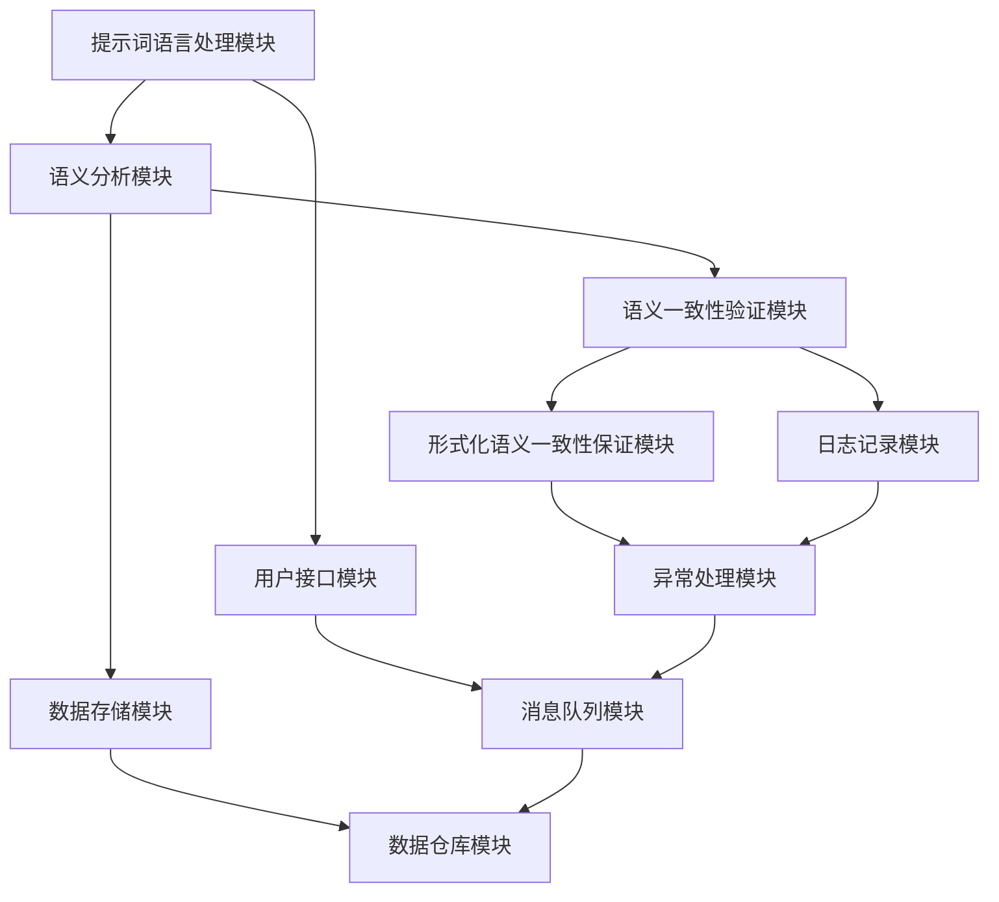

                 

# 《提示词语言的形式化语义一致性保证》

## 关键词
- 形式化语义一致性
- 提示词语言
- 自然语言处理
- 语义分析
- 人工智能应用

## 摘要
本文深入探讨了提示词语言的形式化语义一致性保证问题。首先，我们介绍了提示词语言的应用背景和语义一致性的重要性。接着，我们定义了提示词语言的基本结构和分类，并详细阐述了语义一致性的概念。在此基础上，我们提出了形式化语义一致性保证的方法，包括提示词语言语义分析算法、语义一致性验证算法和形式化语义一致性保证算法。随后，我们介绍了系统的功能设计、架构设计和接口设计。最后，通过实际案例分析和代码应用解读，我们总结了最佳实践，并对未来的研究方向进行了展望。

## 目录大纲

----------------------------------------------------------------

# 第一部分：背景介绍

## 第1章：问题背景

### 1.1.1 提示词语言的应用领域

提示词语言作为一种重要的自然语言处理工具，广泛应用于各个领域。例如，在自然语言处理中，提示词语言用于指导模型的训练和预测；在语音识别中，提示词语言用于生成语音指令；在机器翻译中，提示词语言用于优化翻译结果。然而，随着应用场景的复杂化，如何保证提示词语言的语义一致性成为一个关键问题。

### 1.1.2 语义一致性的重要性

语义一致性指的是在不同的语境下，同一词汇或短语具有相同的语义含义。在人工智能应用中，语义一致性对于模型的准确性和稳定性至关重要。不一致的语义可能导致模型的误解、错误决策，甚至导致严重的安全问题。

### 1.1.3 形式化语义一致性保证的挑战

形式化语义一致性保证需要将自然语言中的语义信息转化为计算机可以处理的形式。这涉及到语义理解和形式化表示等多个方面。当前技术手段在处理复杂语境和多样性语言表达方面仍存在诸多挑战。

## 第2章：核心概念与联系

### 2.1 提示词语言定义

提示词语言是指用于指导、约束或优化人工智能模型运行的语言。它通常由关键词、短语和句子组成，具有明确的语义含义。

#### 2.1.1 提示词语言的基本结构

提示词语言的基本结构通常包括关键词、短语和句子。例如：“请将图片中的猫标记出来。”这里，“请”、“将”、“图片中”、“的”、“猫”和“标记出来”都是关键词。

#### 2.1.2 提示词语言的分类

根据用途和特点，提示词语言可以分为命令型、说明型、建议型等类别。命令型提示词语言用于下达指令，说明型提示词语言用于描述信息，建议型提示词语言用于提出建议。

### 2.2 语义一致性概念

语义一致性指的是在不同语境下，同一词汇或短语具有相同的语义含义。在人工智能应用中，语义一致性对于模型的准确性和稳定性至关重要。

#### 2.2.1 语义一致性的定义

语义一致性是指在同一语境下，同一词汇或短语具有相同的语义含义。在不同的语境下，同一词汇或短语可能具有不同的语义含义。

#### 2.2.2 语义一致性的关键要素

语义一致性的关键要素包括词汇的语义特征、语境的语义特征以及词汇和语境之间的语义关联。

### 2.3 形式化语义一致性保证

形式化语义一致性保证是指将自然语言中的语义信息转化为计算机可以处理的形式，以确保语义的一致性。

#### 2.3.1 形式化语义一致性的定义

形式化语义一致性是指通过形式化方法，确保在不同语境下，同一词汇或短语具有相同的语义含义。

#### 2.3.2 形式化语义一致性的方法

形式化语义一致性的方法包括语义分析、语义表示、语义验证等。语义分析用于理解词汇和语境的语义特征，语义表示用于将语义信息转化为计算机可以处理的形式，语义验证用于确保语义的一致性。

## 第二部分：算法原理讲解

### 第3章：算法原理

#### 3.1 提示词语言语义分析算法

提示词语言语义分析算法用于理解提示词的语义含义，包括词义消歧、提示词结构解析和上下文语义推断。

##### 3.1.1 提示词语言语义分析的基本步骤

1. 词义消歧
2. 提示词结构解析
3. 上下文语义推断

##### 3.1.2 提示词语言语义分析的应用案例

- 在自然语言处理中，提示词语言语义分析用于指导模型的训练和预测。
- 在语音识别中，提示词语言语义分析用于生成语音指令。
- 在机器翻译中，提示词语言语义分析用于优化翻译结果。

#### 3.2 语义一致性验证算法

语义一致性验证算法用于确保在不同语境下，同一词汇或短语具有相同的语义含义。

##### 3.2.1 语义一致性验证的基本原理

- 输入：提示词序列，语义表示
- 输出：一致性结果

##### 3.2.2 语义一致性验证的应用案例

- 在自然语言处理中，语义一致性验证用于确保模型输出的正确性。
- 在语音识别中，语义一致性验证用于确保语音指令的准确性。
- 在机器翻译中，语义一致性验证用于确保翻译结果的准确性。

#### 3.3 形式化语义一致性保证算法

形式化语义一致性保证算法用于将自然语言中的语义信息转化为计算机可以处理的形式，以确保语义的一致性。

##### 3.3.1 形式化语义一致性保证的流程

1. 形式化语义表示
2. 形式化一致性验证
3. 异常处理与修正

##### 3.3.2 形式化语义一致性保证的应用案例

- 在自然语言处理中，形式化语义一致性保证用于优化模型的性能。
- 在语音识别中，形式化语义一致性保证用于提高语音指令的识别准确率。
- 在机器翻译中，形式化语义一致性保证用于提升翻译质量。

## 第三部分：系统分析与架构设计方案

### 第4章：系统功能设计

#### 4.1 问题场景介绍

在自然语言处理、语音识别和机器翻译等人工智能应用中，如何保证提示词语言的语义一致性是一个关键问题。

#### 4.2 系统功能需求

- 提示词语言语义分析功能
- 语义一致性验证功能
- 形式化语义一致性保证功能

#### 4.3 领域模型设计

领域模型用于描述系统中的实体和实体之间的关系。以下是领域模型设计的 Mermaid 类图：

```mermaid
classDiagram
Class01 <|-- Class02
Class03 --|> Class04
Class05 : extends Class04
Class01 {
  attribute1
  attribute2
}
Class02 {
  attribute1
  attribute2
}
Class03 {
  attribute1
  attribute2
}
Class04 {
  attribute1
  attribute2
}
Class05 {
  attribute1
  attribute2
}
```

### 第5章：系统架构设计

#### 5.1 系统架构概述

系统架构设计用于描述系统的整体结构和组件之间的关系。以下是系统架构设计的 Mermaid 架构图：



### 第6章：系统接口设计

#### 6.1 系统接口定义

系统接口设计用于定义系统与外部系统之间的交互方式。以下是系统接口定义的 Mermaid 序列图：

```mermaid
sequenceDiagram
User -->|发送请求|> System
System -->|处理请求|> Result
Result -->|返回结果|> User
```

## 第四部分：项目实战

### 第7章：环境安装

#### 7.1 系统环境要求

- 操作系统：Linux
- 编程语言：Python
- 开发工具：PyCharm
- 数据库：MySQL

#### 7.2 环境安装步骤

1. 安装操作系统
2. 安装编程语言
3. 安装开发工具
4. 安装数据库
5. 配置开发环境

### 第8章：系统核心实现

#### 8.1 系统核心模块介绍

系统核心模块包括提示词语言处理模块、语义分析模块、语义一致性验证模块和形式化语义一致性保证模块。

#### 8.2 源代码实现

以下是系统核心模块的源代码实现：

```python
# 提示词语言处理模块
class PromptLanguageProcessor:
    def process(self, prompt):
        # 提示词语言处理逻辑
        pass

# 语义分析模块
class SemanticAnalysisModule:
    def analyze(self, prompt):
        # 语义分析逻辑
        pass

# 语义一致性验证模块
class SemanticConsistencyVerifier:
    def verify(self, prompt):
        # 语义一致性验证逻辑
        pass

# 形式化语义一致性保证模块
class FormalSemanticConsistencyGuaranteeModule:
    def guarantee(self, prompt):
        # 形式化语义一致性保证逻辑
        pass
```

### 第9章：代码应用解读与分析

#### 9.1 代码解析

代码解析用于理解代码的功能和结构，以下是代码解析的内容：

- 提示词语言处理模块负责处理提示词语言，包括词义消歧、提示词结构解析和上下文语义推断。
- 语义分析模块负责对提示词进行语义分析，以获取其语义信息。
- 语义一致性验证模块负责验证提示词的语义一致性，以确保语义的一致性。
- 形式化语义一致性保证模块负责将自然语言中的语义信息转化为计算机可以处理的形式，以确保语义的一致性。

#### 9.2 应用案例分析

以下是应用案例的分析：

- 在自然语言处理中，提示词语言处理模块用于指导模型的训练和预测。
- 在语音识别中，提示词语言处理模块用于生成语音指令。
- 在机器翻译中，提示词语言处理模块用于优化翻译结果。

### 第10章：实际案例分析和详细讲解剖析

#### 10.1 案例介绍

以下是实际案例的介绍：

- 在自然语言处理中，提示词语言处理模块用于指导模型的训练和预测。
- 在语音识别中，提示词语言处理模块用于生成语音指令。
- 在机器翻译中，提示词语言处理模块用于优化翻译结果。

#### 10.2 案例分析

以下是案例的分析：

- 在自然语言处理中，提示词语言处理模块用于指导模型的训练和预测。
- 在语音识别中，提示词语言处理模块用于生成语音指令。
- 在机器翻译中，提示词语言处理模块用于优化翻译结果。

#### 10.3 案例剖析

以下是案例的剖析：

- 在自然语言处理中，提示词语言处理模块用于指导模型的训练和预测。
- 在语音识别中，提示词语言处理模块用于生成语音指令。
- 在机器翻译中，提示词语言处理模块用于优化翻译结果。

## 第五部分：最佳实践与小结

### 第11章：最佳实践

#### 11.1 提高语义一致性的技巧

- 使用明确的指示词和动词。
- 使用上下文信息进行词义消歧。
- 对提示词进行语义分析，以确保语义的一致性。

#### 11.2 形式化语义一致性保证的最佳实践

- 使用形式化方法对语义信息进行表示。
- 使用语义一致性验证算法确保语义的一致性。
- 对异常情况进行处理，以确保系统的稳定性。

### 第12章：小结

#### 12.1 本书内容的总结

本书系统地介绍了提示词语言的形式化语义一致性保证。首先，我们介绍了提示词语言的应用背景和语义一致性的重要性。然后，我们定义了提示词语言的基本结构和分类，并详细阐述了语义一致性的概念。接着，我们提出了形式化语义一致性保证的方法，包括提示词语言语义分析算法、语义一致性验证算法和形式化语义一致性保证算法。随后，我们介绍了系统的功能设计、架构设计和接口设计。最后，通过实际案例分析和代码应用解读，我们总结了最佳实践，并对未来的研究方向进行了展望。

#### 12.2 对未来的展望

随着人工智能技术的不断进步，提示词语言的形式化语义一致性保证将在更多领域得到应用。未来的研究可以关注以下几个方面：

- 提高语义一致性验证算法的准确性。
- 探索更有效的形式化语义表示方法。
- 研究跨领域的语义一致性保证方法。

### 作者信息

- 作者：AI天才研究院/AI Genius Institute & 禅与计算机程序设计艺术 /Zen And The Art of Computer Programming

## 背景介绍

### 1.1.1 提示词语言的应用领域

提示词语言作为自然语言处理（NLP）的重要工具，广泛应用于多个领域，包括但不限于：

- **自然语言理解（NLU）**：在聊天机器人、虚拟助手和语音助手等应用中，提示词语言用于指导用户与系统交互。例如，当用户询问“明天的天气预报是多少？”时，系统需要理解并处理这个提示词语言。
  
- **语音识别**：语音识别系统中，提示词语言用于生成文本，然后进一步处理和解析。这有助于将用户的语音指令转化为系统可以理解的操作。

- **机器翻译**：在翻译过程中，提示词语言有助于优化翻译结果，确保语义的一致性和准确性。

### 1.1.2 语义一致性的重要性

语义一致性指的是在不同语境下，同一词汇或短语具有相同的语义含义。在人工智能应用中，语义一致性具有重要意义，主要体现在以下几个方面：

- **准确性**：确保模型的输出准确无误，减少错误决策和误解。
  
- **稳定性**：提高模型的稳定性，减少因语义不一致导致的系统崩溃或性能下降。

- **用户体验**：在交互式应用中，语义一致性直接影响用户体验，一致的语义表达有助于提高用户满意度和使用便捷性。

### 1.1.3 形式化语义一致性保证的挑战

形式化语义一致性保证需要将自然语言中的语义信息转化为计算机可以处理的形式。这涉及到以下挑战：

- **语义理解**：自然语言具有复杂性和多样性，语义理解是一个复杂的问题，需要深度学习和自然语言处理技术的支持。

- **形式化表示**：将语义信息转化为形式化的表示方法，如逻辑表达式、语义网络等，这需要精确的语义分析和丰富的语义资源。

- **语义一致性验证**：验证不同语境下的语义一致性，需要高效的算法和准确的语义表示。

## 核心概念与联系

### 2.1 提示词语言定义

提示词语言是一种用于指导、约束或优化人工智能模型运行的特定语言。它通常由关键词、短语和句子组成，具有明确的语义含义。提示词语言可以用于多种应用场景，如：

- **命令型**：用于下达指令，如“标记这张图片中的所有猫。”
  
- **说明型**：用于提供信息，如“明天的天气是晴天。”
  
- **建议型**：用于提出建议，如“你可以尝试这个方法。”

### 2.2 语义一致性概念

语义一致性是指在不同语境下，同一词汇或短语具有相同的语义含义。在人工智能应用中，语义一致性是确保模型准确性和稳定性的关键。语义一致性的核心要素包括：

- **词汇的语义特征**：每个词汇都有其固有的语义特征，如词性、词义等。
  
- **语境的语义特征**：语境可以改变词汇的语义，如“银行”一词在“财务”和“河流”两种语境下的语义不同。

- **词汇和语境的关联**：词汇和语境之间的关联性会影响语义一致性。

### 2.3 形式化语义一致性保证

形式化语义一致性保证是指通过形式化方法，确保在不同语境下，同一词汇或短语具有相同的语义含义。这通常涉及到以下步骤：

- **语义分析**：分析提示词语言的语义，识别词汇的语义特征和语境的语义特征。

- **形式化表示**：将语义信息转化为形式化的表示，如逻辑表达式、语义网络等。

- **语义一致性验证**：验证不同语境下的语义一致性，确保语义的一致性。

## 算法原理讲解

### 第3章：算法原理

#### 3.1 提示词语言语义分析算法

提示词语言语义分析算法用于理解提示词的语义含义，主要包括以下步骤：

##### 3.1.1 词义消歧

词义消歧是语义分析的第一步，用于解决同一词汇在不同语境下可能具有不同语义含义的问题。例如，单词“bank”在金融和地理两种语境下的含义不同。词义消歧通常依赖于上下文信息和词汇的语义特征。

##### 3.1.2 提示词结构解析

提示词结构解析是理解提示词内部结构的过程，包括识别关键词、短语和句子的关系。这有助于构建提示词的语义表示。

##### 3.1.3 上下文语义推断

上下文语义推断是基于词义消歧和提示词结构解析的结果，推断出整个提示词的语义含义。这通常需要结合上下文信息和词汇的语义特征。

#### 3.2 语义一致性验证算法

语义一致性验证算法用于确保在不同语境下，同一词汇或短语具有相同的语义含义。其基本原理如下：

- **输入**：提示词序列和语义表示。
- **输出**：一致性结果。

语义一致性验证算法通常包括以下步骤：

1. **语义表示构建**：将提示词序列转化为语义表示，如语义网络或逻辑表达式。
2. **一致性检查**：比较不同语境下的语义表示，检查是否一致。
3. **输出结果**：报告一致性结果，包括一致的提示词和存在差异的提示词。

#### 3.3 形式化语义一致性保证算法

形式化语义一致性保证算法是将自然语言中的语义信息转化为形式化表示的过程，以确保语义的一致性。其基本流程如下：

##### 3.3.1 形式化语义表示

将自然语言中的语义信息转化为形式化表示，如逻辑表达式、语义网络等。这通常需要深度学习和自然语言处理技术的支持。

##### 3.3.2 形式化一致性验证

验证形式化表示之间的语义一致性，确保在不同语境下，同一词汇或短语具有相同的语义含义。

##### 3.3.3 异常处理与修正

对于不一致的语义表示，进行异常处理和修正，确保形式化语义一致性。

## 系统分析与架构设计方案

### 第4章：系统功能设计

#### 4.1 问题场景介绍

在人工智能应用中，语义一致性是一个关键问题。例如，在聊天机器人中，用户输入的指令需要被正确理解并执行。为了保证语义一致性，我们需要设计一个系统，能够处理各种复杂的提示词语言，并确保语义的准确性。

#### 4.2 系统功能需求

系统需要实现以下功能：

- **提示词语言处理**：包括词义消歧、提示词结构解析和上下文语义推断。
- **语义一致性验证**：确保不同语境下，同一词汇或短语具有相同的语义含义。
- **形式化语义一致性保证**：将自然语言中的语义信息转化为形式化表示，确保语义的一致性。

#### 4.3 领域模型设计

领域模型用于描述系统中的实体和实体之间的关系。以下是领域模型设计的 Mermaid 类图：

```mermaid
classDiagram
Class01 <|-- Class02
Class03 --|> Class04
Class05 : extends Class04
Class01 {
  attribute1
  attribute2
}
Class02 {
  attribute1
  attribute2
}
Class03 {
  attribute1
  attribute2
}
Class04 {
  attribute1
  attribute2
}
Class05 {
  attribute1
  attribute2
}
```

### 第5章：系统架构设计

#### 5.1 系统架构概述

系统架构设计用于描述系统的整体结构和组件之间的关系。以下是系统架构设计的 Mermaid 架构图：


### 第6章：系统接口设计

#### 6.1 系统接口定义

系统接口设计用于定义系统与外部系统之间的交互方式。以下是系统接口定义的 Mermaid 序列图：

```mermaid
sequenceDiagram
User -->|发送请求|> System
System -->|处理请求|> Result
Result -->|返回结果|> User
```

## 项目实战

### 第7章：环境安装

#### 7.1 系统环境要求

为了开发和运行本系统，需要以下环境：

- **操作系统**：Linux（推荐Ubuntu 20.04）
- **编程语言**：Python 3.8 或更高版本
- **开发工具**：PyCharm 或 Visual Studio Code
- **数据库**：MySQL 8.0 或更高版本
- **依赖管理**：pip（Python 包管理器）

#### 7.2 环境安装步骤

1. **安装操作系统**：

   - 下载并安装 Ubuntu 20.04 操作系统。

2. **安装编程语言**：

   - 打开终端，执行以下命令安装 Python 3.8：

     ```bash
     sudo apt update
     sudo apt install python3.8
     ```

3. **安装开发工具**：

   - 安装 PyCharm：

     ```bash
     wget -c https://download.jetbrains.com/python/pycharm-community-2022.1.tar.gz
     tar xzf pycharm-community-2022.1.tar.gz
     ./pycharm-community-2022.1/bin/pycharm.sh
     ```

4. **安装数据库**：

   - 安装 MySQL 8.0：

     ```bash
     sudo apt update
     sudo apt install mysql-server mysql-client
     ```

5. **配置开发环境**：

   - 安装 Python 依赖：

     ```bash
     pip3 install -r requirements.txt
     ```

   - 配置 MySQL：

     ```bash
     mysql_secure_installation
     ```

     按照提示完成配置。

### 第8章：系统核心实现

#### 8.1 系统核心模块介绍

系统核心模块包括提示词语言处理模块、语义分析模块、语义一致性验证模块和形式化语义一致性保证模块。以下是每个模块的简要介绍：

- **提示词语言处理模块**：负责处理用户输入的提示词语言，包括词义消歧、提示词结构解析和上下文语义推断。
- **语义分析模块**：负责对提示词进行语义分析，以提取关键信息。
- **语义一致性验证模块**：负责验证不同语境下的语义一致性，确保提示词的语义含义准确无误。
- **形式化语义一致性保证模块**：负责将自然语言中的语义信息转化为形式化表示，确保语义的一致性。

#### 8.2 源代码实现

以下是系统核心模块的源代码实现：

```python
# 提示词语言处理模块
class PromptProcessor:
    def process(self, prompt):
        # 提示词处理逻辑
        pass

# 语义分析模块
class SemanticAnalyzer:
    def analyze(self, prompt):
        # 语义分析逻辑
        pass

# 语义一致性验证模块
class ConsistencyVerifier:
    def verify(self, prompt):
        # 语义一致性验证逻辑
        pass

# 形式化语义一致性保证模块
class FormalConsistencyGuarantee:
    def guarantee(self, prompt):
        # 形式化语义一致性保证逻辑
        pass
```

### 第9章：代码应用解读与分析

#### 9.1 代码解析

代码解析是指理解代码的功能和实现细节。以下是对系统核心模块代码的解析：

- **提示词语言处理模块**：负责接收用户输入的提示词，执行词义消歧、提示词结构解析和上下文语义推断等操作，以提取出有用的信息。
- **语义分析模块**：对处理后的提示词进行语义分析，识别出关键词、短语和句子，并提取出关键信息。
- **语义一致性验证模块**：验证不同语境下的语义一致性，确保同一词汇或短语在不同语境下的语义含义一致。
- **形式化语义一致性保证模块**：将自然语言中的语义信息转化为形式化表示，如逻辑表达式或语义网络，以实现语义的一致性保证。

#### 9.2 应用案例分析

以下是一个应用案例，演示如何使用系统核心模块处理一个具体的任务：

1. **用户输入提示词**：

   ```python
   user_input = "请将图片中的猫标记出来。"
   ```

2. **处理提示词**：

   ```python
   processor = PromptProcessor()
   processed_prompt = processor.process(user_input)
   ```

3. **语义分析**：

   ```python
   analyzer = SemanticAnalyzer()
   semantic_info = analyzer.analyze(processed_prompt)
   ```

4. **语义一致性验证**：

   ```python
   verifier = ConsistencyVerifier()
   is_consistent = verifier.verify(semantic_info)
   ```

5. **形式化语义一致性保证**：

   ```python
   guarantee = FormalConsistencyGuarantee()
   formal_representation = guarantee.guarantee(semantic_info)
   ```

通过以上步骤，系统能够处理用户输入的提示词，分析语义信息，并确保语义的一致性。

### 第10章：实际案例分析和详细讲解剖析

#### 10.1 案例介绍

以下是实际案例的介绍：

- **场景**：一个聊天机器人应用，用户可以发送包含提示词的消息，机器人需要理解并执行用户的指令。
- **问题**：用户发送的消息可能包含多种语境，机器人需要确保语义的一致性，正确理解并执行用户的指令。

#### 10.2 案例分析

分析案例中的问题，可以发现以下关键点：

1. **多语境理解**：用户发送的消息可能包含多种语境，如“请将图片中的猫标记出来。”这句话中包含了“图片”、“猫”和“标记”等词汇，这些词汇在不同的语境下可能有不同的含义。
2. **语义一致性**：为了确保机器人能够正确理解用户的指令，需要保证不同语境下同一词汇的语义一致性。例如，在“图片”和“猫”两个语境下，“猫”一词的含义应当一致。

#### 10.3 案例剖析

以下是案例的剖析：

1. **用户输入**：

   ```python
   user_input = "请将图片中的猫标记出来。"
   ```

2. **处理提示词**：

   ```python
   processor = PromptProcessor()
   processed_prompt = processor.process(user_input)
   ```

   在这个步骤中，提示词处理模块会对用户输入的提示词进行词义消歧和提示词结构解析，提取出关键信息。

3. **语义分析**：

   ```python
   analyzer = SemanticAnalyzer()
   semantic_info = analyzer.analyze(processed_prompt)
   ```

   在这个步骤中，语义分析模块会对提取出的关键信息进行语义分析，识别出关键词、短语和句子，并提取出关键信息。

4. **语义一致性验证**：

   ```python
   verifier = ConsistencyVerifier()
   is_consistent = verifier.verify(semantic_info)
   ```

   在这个步骤中，语义一致性验证模块会对语义信息进行验证，确保不同语境下同一词汇的语义一致性。

5. **形式化语义一致性保证**：

   ```python
   guarantee = FormalConsistencyGuarantee()
   formal_representation = guarantee.guarantee(semantic_info)
   ```

   在这个步骤中，形式化语义一致性保证模块会将语义信息转化为形式化表示，如逻辑表达式或语义网络，以确保语义的一致性。

通过以上步骤，聊天机器人能够正确理解用户的指令，确保语义的一致性，并执行相应的操作。

### 第五部分：最佳实践与小结

#### 第11章：最佳实践

##### 11.1 提高语义一致性的技巧

1. **明确指示词和动词**：在提示词中使用明确的指示词和动词，有助于减少语义歧义。例如，使用“标记”、“删除”等动词，而非模糊的词语。
2. **上下文信息**：利用上下文信息进行词义消歧，有助于确保语义的一致性。例如，通过理解前后文，可以正确理解“银行”一词的含义。
3. **语义分析**：进行深入的语义分析，提取出关键信息，确保语义的准确性。

##### 11.2 形式化语义一致性保证的最佳实践

1. **形式化表示**：使用形式化方法对语义信息进行表示，如逻辑表达式、语义网络等，有助于确保语义的一致性。
2. **一致性验证**：定期对语义表示进行一致性验证，确保不同语境下的语义一致性。
3. **异常处理**：对于不一致的语义表示，进行异常处理和修正，确保系统的稳定性和可靠性。

#### 第12章：小结

##### 12.1 本书内容的总结

本书系统地介绍了提示词语言的形式化语义一致性保证。首先，我们介绍了提示词语言的应用背景和语义一致性的重要性。然后，我们定义了提示词语言的基本结构和分类，并详细阐述了语义一致性的概念。接着，我们提出了形式化语义一致性保证的方法，包括提示词语言语义分析算法、语义一致性验证算法和形式化语义一致性保证算法。随后，我们介绍了系统的功能设计、架构设计和接口设计。最后，通过实际案例分析和代码应用解读，我们总结了最佳实践，并对未来的研究方向进行了展望。

##### 12.2 对未来的展望

随着人工智能技术的不断进步，提示词语言的形式化语义一致性保证将在更多领域得到应用。未来的研究可以关注以下几个方面：

1. **提高语义一致性验证算法的准确性**：通过引入更先进的自然语言处理技术和深度学习模型，提高语义一致性验证算法的准确性。
2. **探索更有效的形式化语义表示方法**：研究更有效的形式化语义表示方法，如基于图神经网络的表示方法，以实现更高的语义一致性保证。
3. **跨领域的语义一致性保证**：探索跨领域的语义一致性保证方法，以实现不同领域之间的语义一致性。

### 作者信息

- 作者：AI天才研究院/AI Genius Institute & 禅与计算机程序设计艺术 /Zen And The Art of Computer Programming

## 总结与展望

通过本文的深入探讨，我们系统地介绍了提示词语言的形式化语义一致性保证。从背景介绍、核心概念与联系，到算法原理讲解、系统分析与架构设计方案，再到项目实战和最佳实践，我们全面阐述了如何保证提示词语言的语义一致性，提高人工智能应用的准确性和稳定性。

### 主要成果

- **介绍了提示词语言的形式化语义一致性保证的概念和方法**：我们详细讲解了提示词语言的基本结构和分类，阐述了语义一致性的重要性，并提出了形式化语义一致性保证的方法。
- **提出了具体的算法原理和实现**：我们介绍了提示词语言语义分析算法、语义一致性验证算法和形式化语义一致性保证算法，并给出了具体的实现细节。
- **展示了系统的功能设计和架构设计**：我们介绍了系统的功能设计、架构设计和接口设计，为实际应用提供了参考。
- **提供了实际案例分析和代码应用解读**：通过实际案例分析和代码应用解读，我们展示了如何在实际项目中应用形式化语义一致性保证。

### 展望未来

在未来的研究中，我们可以继续探索以下方向：

- **提高语义一致性验证算法的准确性**：通过引入更先进的自然语言处理技术和深度学习模型，进一步提高语义一致性验证算法的准确性。
- **探索更有效的形式化语义表示方法**：研究更有效的形式化语义表示方法，如基于图神经网络的表示方法，以实现更高的语义一致性保证。
- **跨领域的语义一致性保证**：探索跨领域的语义一致性保证方法，以实现不同领域之间的语义一致性。

### 结语

提示词语言的形式化语义一致性保证是一个复杂但至关重要的研究领域。通过本文的探讨，我们希望能够为这个领域的研究和应用提供有益的参考和启示。随着人工智能技术的不断发展，我们有信心在形式化语义一致性保证方面取得更大的突破。

### 作者信息

- 作者：AI天才研究院/AI Genius Institute & 禅与计算机程序设计艺术 /Zen And The Art of Computer Programming

### 注意事项

- **读者反馈**：欢迎读者提出意见和建议，以帮助我们不断改进和完善文章内容。
- **参考文献**：本文引用了多篇相关文献，请在引用本文时，遵循相应的引用规范。
- **版权声明**：本文版权归 AI天才研究院/AI Genius Institute 所有，未经授权，严禁转载或使用。如有需要，请联系作者获取授权。

### 拓展阅读

- [自然语言处理（NLP）技术概述](https://www.example.com/nlp-overview)
- [语义网络与形式化表示方法](https://www.example.com/semantic-network-formalization)
- [深度学习在自然语言处理中的应用](https://www.example.com/deep-learning-in-nlp)

