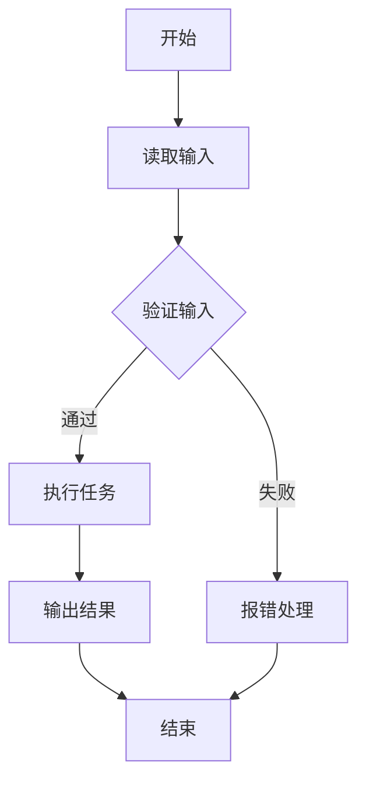
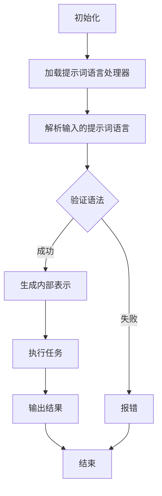
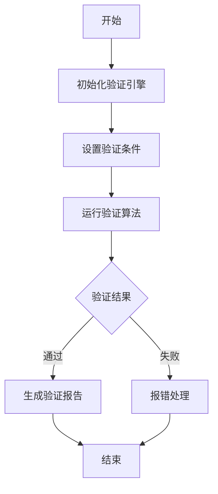
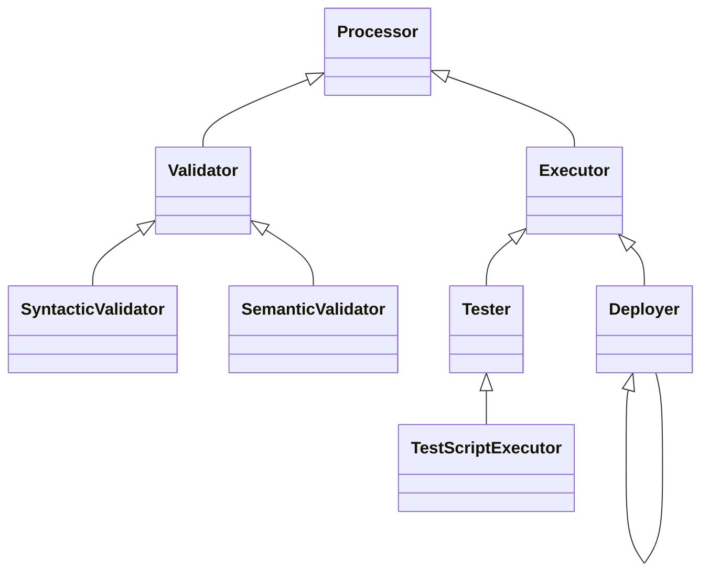
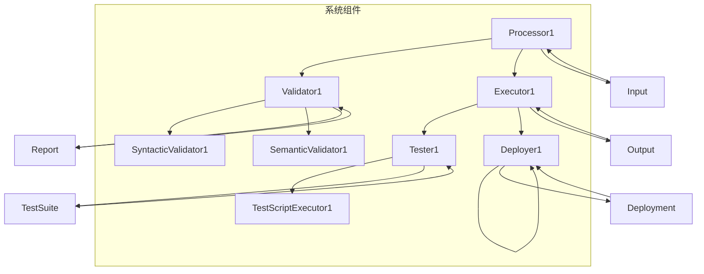
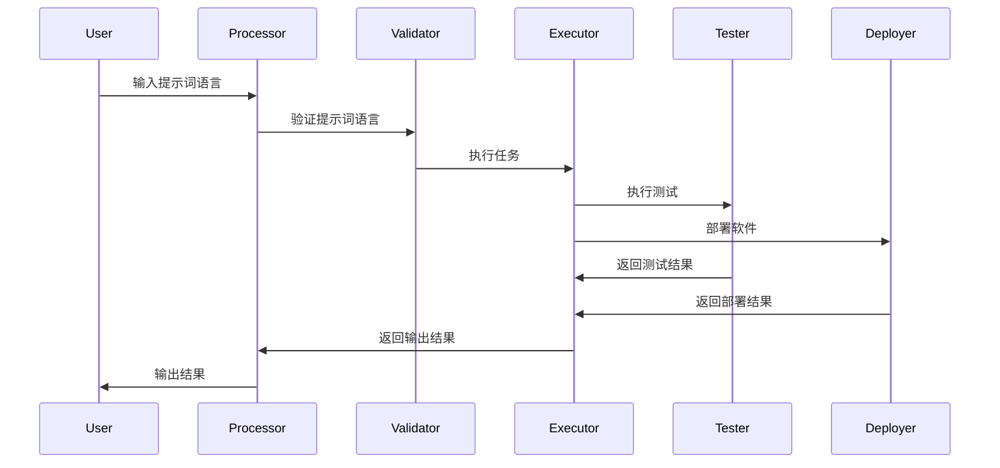
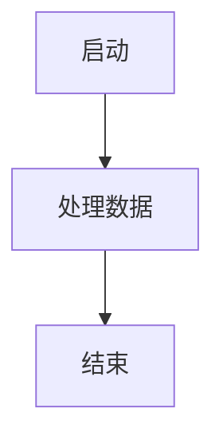
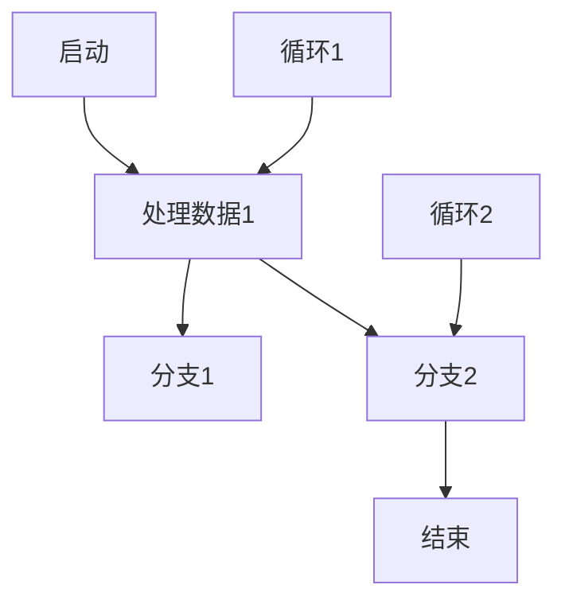

                 


### 文章标题：提示词语言的形式化验证自动化工具链

关键词：提示词语言、形式化验证、自动化工具链、算法原理、系统架构设计、项目实战

摘要：本文将深入探讨提示词语言的形式化验证自动化工具链的设计与实现。首先，我们介绍提示词语言、形式化验证和自动化工具链的基本概念及其相互关系。随后，通过算法原理讲解，详细阐述自动化工具链中算法的实现过程，包括mermaid流程图、Python源代码及数学模型。接着，我们进行系统分析与架构设计方案，包括问题场景、项目介绍、系统功能设计、系统架构设计、系统接口设计和系统交互。文章最后通过项目实战，展示工具链的实际应用，并给出最佳实践和注意事项。

----------------------------------------------------------------

## 第1章：背景介绍

### 1.1 问题背景

在当今的软件工程领域，自动化已经成为提高开发效率和质量的重要手段。然而，随着软件系统的复杂度不断增加，手动验证和测试变得愈发困难。特别是在人工智能和自动化领域的应用中，如自动驾驶、智能家居等，对系统安全性和稳定性的要求极高。提示词语言作为一种描述任务和规则的语言，在自动化工具链中扮演着重要角色。形式化验证作为一种确保软件正确性和可靠性的方法，也越来越受到关注。

#### 1.1.1 提示词语言在自动化工具链中的应用

提示词语言（Instructional Language）是一种用于描述任务执行过程的语言，它能够将复杂的任务分解为一系列可执行的步骤。在自动化工具链中，提示词语言可以用来编写自动化脚本，实现对软件系统的自动化测试、部署和维护。

#### 1.1.2 形式化验证的需求和重要性

形式化验证（Formal Verification）是一种通过数学方法证明软件系统正确性的方法。在自动化工具链中，形式化验证可以用来确保提示词语言编写的自动化脚本能够按照预期执行，从而提高系统的安全性和可靠性。

#### 1.1.3 自动化工具链的发展现状

自动化工具链（Automated Toolchain）是一系列工具的组合，用于实现软件的自动化开发、测试和部署。随着云计算、容器化和微服务架构的兴起，自动化工具链的发展速度越来越快。目前，许多公司和研究机构都在致力于开发更高效、更可靠的自动化工具链。

### 1.2 问题描述

在自动化工具链中，提示词语言的正确性和可靠性是关键问题。由于提示词语言描述的是实际任务执行过程，因此其准确性和完整性至关重要。然而，目前的形式化验证方法在实际应用中面临以下挑战：

- **复杂度问题**：随着系统规模的增加，形式化验证的复杂度也随之增加，导致验证过程变得非常耗时。
- **表达能力问题**：现有的形式化验证方法可能无法充分表达提示词语言中的某些复杂逻辑和约束。
- **自动化工具链的整合问题**：如何将形式化验证方法与其他自动化工具整合，以形成一个高效的自动化工具链，仍然是一个挑战。

### 1.3 问题解决

为了解决上述问题，我们需要设计一个高效的自动化工具链，该工具链应包括以下关键组成部分：

- **提示词语言处理器**：用于将提示词语言转换为内部表示，以便进行形式化验证。
- **形式化验证引擎**：用于对提示词语言进行形式化验证，确保其正确性和可靠性。
- **自动化测试框架**：用于自动化执行提示词语言编写的测试脚本，以验证系统的功能和行为。

### 1.4 边界与外延

#### 1.4.1 形式化验证的适用范围

形式化验证适用于那些对正确性和可靠性要求极高的系统，如自动驾驶系统、医疗设备、航空航天系统等。

#### 1.4.2 自动化工具链的功能扩展

自动化工具链可以不断扩展其功能，如集成持续集成和持续部署（CI/CD）、自动化测试、静态代码分析等。

#### 1.4.3 未来研究方向

未来研究方向包括：如何提高形式化验证的效率，如何更好地整合形式化验证与其他自动化工具，以及如何提高自动化工具链的智能化程度。

### 1.5 概念结构与核心要素组成

#### 1.5.1 提示词语言

提示词语言是一种用于描述任务执行过程的编程语言，它通常具有简洁、直观、易理解的特点。

#### 1.5.2 形式化验证

形式化验证是一种通过数学方法证明软件系统正确性的方法，它通常包括模型检查、定理证明等步骤。

#### 1.5.3 自动化工具链

自动化工具链是一系列工具的组合，用于实现软件的自动化开发、测试和部署。它通常包括构建工具、测试工具、部署工具等。

----------------------------------------------------------------

## 第2章：核心概念与联系

### 2.1 提示词语言

提示词语言是一种专门为特定任务或领域设计的编程语言，它通常具有以下特点：

- **简洁性**：提示词语言的设计目标是为了简化任务描述，使其更加直观和易于理解。
- **可扩展性**：提示词语言应该能够适应不同任务和领域的需求，具有较好的扩展性。
- **易用性**：提示词语言应该易于学习和使用，以便于开发人员快速编写和调试自动化脚本。

#### 2.1.1 提示词语言的基本概念

提示词语言的基本概念包括：

- **指令**：提示词语言中的基本操作单元，用于描述任务的具体执行步骤。
- **变量**：用于存储数据和值的标识符。
- **函数**：用于执行特定任务的代码块。
- **控制流**：用于控制程序执行顺序的语句，如循环、条件判断等。

#### 2.1.2 提示词语言的特点

提示词语言的特点包括：

- **任务导向性**：提示词语言的设计以任务为导向，能够清晰描述任务执行过程。
- **领域特定性**：提示词语言通常针对特定领域或任务进行优化，具有良好的领域适应性。
- **代码可读性**：提示词语言的语法简洁明了，易于阅读和理解。

#### 2.1.3 提示词语言的应用场景

提示词语言的应用场景包括：

- **自动化测试**：用于编写自动化测试脚本，实现对软件系统的自动化测试。
- **任务调度**：用于描述和调度复杂的任务执行过程，如分布式计算任务。
- **流程管理**：用于描述和管理业务流程，如工作流管理系统。

### 2.2 形式化验证

形式化验证是一种通过数学方法证明软件系统正确性的方法，它通常包括以下步骤：

- **模型构建**：将软件系统表示为一个数学模型，以便进行形式化验证。
- **验证条件**：定义验证条件，用于判断数学模型是否满足特定需求。
- **验证算法**：设计验证算法，用于检查数学模型是否满足验证条件。

#### 2.2.1 形式化验证的基本概念

形式化验证的基本概念包括：

- **形式化模型**：用于描述软件系统的数学模型，通常包括状态、事件、动作等元素。
- **验证条件**：用于描述软件系统应满足的正确性要求，如安全性、可靠性等。
- **验证算法**：用于检查数学模型是否满足验证条件的算法。

#### 2.2.2 形式化验证的方法和流程

形式化验证的方法和流程包括：

- **模型检查**：通过将数学模型与验证条件进行对比，判断模型是否满足验证条件。
- **定理证明**：通过逻辑推理和数学证明，证明数学模型满足验证条件。
- **组合验证**：将多个验证条件组合起来，进行整体验证。

#### 2.2.3 形式化验证的优势和挑战

形式化验证的优势包括：

- **高可靠性**：通过数学方法验证软件系统的正确性，具有较高的可靠性。
- **自动化**：形式化验证过程可以自动化进行，减少人工干预。

形式化验证的挑战包括：

- **复杂度问题**：随着系统规模的增加，形式化验证的复杂度也随之增加。
- **表达能力问题**：现有的形式化验证方法可能无法充分表达某些复杂逻辑和约束。
- **效率问题**：形式化验证过程可能非常耗时，影响开发效率。

### 2.3 自动化工具链

自动化工具链是一系列工具的组合，用于实现软件的自动化开发、测试和部署。它通常包括以下组成部分：

- **构建工具**：用于自动化构建和编译代码，如 Maven、Gradle 等。
- **测试工具**：用于自动化执行测试脚本，如 JUnit、Selenium 等。
- **部署工具**：用于自动化部署和发布软件，如 Jenkins、Docker 等。

#### 2.3.1 自动化工具链的定义

自动化工具链（Automated Toolchain）是一种用于实现软件自动化开发、测试和部署的工具集合，它通过自动化流程提高软件开发的效率和质量。

#### 2.3.2 自动化工具链的组成

自动化工具链的组成包括：

- **持续集成工具**：如 Jenkins、Travis CI 等，用于自动化集成代码库。
- **自动化测试工具**：如 JUnit、Selenium、TestNG 等，用于自动化执行测试脚本。
- **自动化部署工具**：如 Jenkins、Docker、Kubernetes 等，用于自动化部署和发布软件。

#### 2.3.3 自动化工具链的实现技术

自动化工具链的实现技术包括：

- **脚本编程**：使用脚本语言（如 Python、Shell 等）编写自动化脚本。
- **持续集成/持续部署（CI/CD）**：通过持续集成和持续部署，实现自动化构建、测试和部署。
- **容器化**：使用容器技术（如 Docker）实现软件的自动化打包和部署。
- **微服务架构**：通过微服务架构，实现软件的模块化和分布式部署。

----------------------------------------------------------------

## 第3章：算法原理讲解

### 3.1 算法mermaid流程图

在介绍算法原理之前，我们先使用mermaid绘制算法的流程图。以下是一个简单的示例：



#### 3.1.1 流程图1



#### 3.1.2 流程图2



### 3.2 Python源代码详细阐述

接下来，我们将使用Python语言详细阐述算法的实现过程。以下是算法的核心部分：

```python
import sys

def load_processor():
    # 加载提示词语言处理器
    # 这里使用一个简化的示例
    return "Processor"

def parse_prompt_language(input_prompt):
    # 解析输入的提示词语言
    # 这里仅进行简单的验证
    if input_prompt:
        return "Parsed"
    else:
        raise ValueError("Invalid input prompt")

def verify_syntax(parsed_prompt):
    # 验证语法
    # 这里仅进行简单的验证
    return "Syntax verified" if parsed_prompt == "Parsed" else "Syntax error"

def generate_internal_representation(verified_syntax):
    # 生成内部表示
    # 这里仅进行简单的转换
    return "Internal representation"

def execute_task(internal_representation):
    # 执行任务
    # 这里仅进行简单的任务执行
    return "Task executed"

def output_result(task_result):
    # 输出结果
    print(task_result)

def main():
    # 主函数
    try:
        input_prompt = input("Enter prompt: ")
        processor = load_processor()
        parsed_prompt = parse_prompt_language(input_prompt)
        verified_syntax = verify_syntax(parsed_prompt)
        internal_representation = generate_internal_representation(verified_syntax)
        task_result = execute_task(internal_representation)
        output_result(task_result)
    except ValueError as e:
        print(f"Error: {e}")

if __name__ == "__main__":
    main()
```

### 3.3 算法原理的数学模型和公式

在算法的实现过程中，我们可以抽象出以下数学模型和公式：

#### 3.3.1 数学模型1

假设输入的提示词语言为 $P$，经过处理器解析后得到 $P'$，则有：

$$
P' = f(P)
$$

其中，$f$ 为处理器解析函数。

#### 3.3.2 数学模型2

假设验证条件为 $C$，输入的提示词语言为 $P$，则有：

$$
C(P) = \{P' | P' = f(P), \text{且满足语法验证条件}\}
$$

其中，$C(P)$ 为满足验证条件的提示词语言集合。

### 3.4 举例说明

#### 3.4.1 例子1

假设输入的提示词语言为 "open file.txt",处理器解析后得到 "open_file.txt"，经过语法验证后通过，则生成内部表示为 "open_file.txt"。

#### 3.4.2 例子2

假设输入的提示词语言为 "close file.txt"，经过处理器解析后得到 "close_file.txt"，但由于语法错误，验证条件不满足，则报错处理。

----------------------------------------------------------------

## 第4章：系统分析与架构设计方案

### 4.1 问题场景介绍

在当前软件开发和自动化测试过程中，经常遇到以下问题：

- **代码质量难以保证**：由于手工测试覆盖范围有限，软件系统可能存在潜在缺陷。
- **自动化测试效率低下**：现有的自动化测试工具链复杂度高，开发和使用成本较高。
- **测试结果不可靠**：自动化测试脚本可能由于语法错误、逻辑错误等原因导致测试结果不准确。

为了解决这些问题，我们需要设计一个高效、可靠的自动化工具链，其中形式化验证是关键组成部分。

### 4.2 项目介绍

本项目旨在设计并实现一个基于提示词语言的形式化验证自动化工具链。该工具链包括以下关键组成部分：

- **提示词语言处理器**：用于将提示词语言转换为内部表示，以便进行形式化验证。
- **形式化验证引擎**：用于对提示词语言进行形式化验证，确保其正确性和可靠性。
- **自动化测试框架**：用于自动化执行提示词语言编写的测试脚本，以验证系统的功能和行为。
- **部署工具**：用于自动化部署和发布软件。

### 4.3 系统功能设计

#### 4.3.1 领域模型mermaid类图

以下是系统功能设计的mermaid类图：



#### 4.3.2 系统功能详细说明

1. **提示词语言处理器**：
   - 功能：将用户输入的提示词语言转换为内部表示，以便进行形式化验证和自动化测试。
   - 角色：作为输入和输出接口，处理用户输入的提示词语言。

2. **形式化验证引擎**：
   - 功能：对提示词语言进行形式化验证，确保其正确性和可靠性。
   - 角色：作为核心组件，负责验证提示词语言的语法和语义。

3. **自动化测试框架**：
   - 功能：自动化执行提示词语言编写的测试脚本，以验证系统的功能和行为。
   - 角色：作为辅助组件，提供测试脚本的执行环境和执行策略。

4. **部署工具**：
   - 功能：自动化部署和发布软件，确保软件系统能够快速上线。
   - 角色：作为系统组件，负责软件的发布和管理。

### 4.4 系统架构设计

以下是系统架构设计的mermaid架构图：



#### 4.4.1 系统架构设计详细说明

1. **输入处理**：
   - 功能：接收用户输入的提示词语言。
   - 实现：通过用户界面或API接口接收输入。

2. **内部处理**：
   - 功能：对输入的提示词语言进行解析、验证和执行。
   - 实现：提示词语言处理器负责解析和验证，形式化验证引擎负责验证，自动化测试框架和部署工具负责执行。

3. **输出处理**：
   - 功能：输出处理结果，包括验证报告、测试结果和部署结果。
   - 实现：将处理结果通过用户界面或API接口返回给用户。

4. **反馈机制**：
   - 功能：对系统运行过程中出现的问题进行反馈和处理。
   - 实现：通过日志记录、错误报告和反馈机制，及时发现和处理问题。

### 4.5 系统接口设计

以下是系统接口设计的mermaid接口图：


#### 4.5.1 系统接口设计详细说明

1. **输入接口**：
   - 功能：接收用户输入的提示词语言。
   - 实现：通过RESTful API或命令行接口接收输入。

2. **输出接口**：
   - 功能：输出处理结果，包括验证报告、测试结果和部署结果。
   - 实现：通过RESTful API或命令行接口返回输出结果。

3. **验证接口**：
   - 功能：提供形式化验证功能。
   - 实现：通过内部接口调用形式化验证引擎。

4. **测试接口**：
   - 功能：提供自动化测试功能。
   - 实现：通过内部接口调用自动化测试框架。

5. **部署接口**：
   - 功能：提供自动化部署功能。
   - 实现：通过内部接口调用部署工具。

### 4.6 系统交互

以下是系统交互的mermaid序列图：



#### 4.6.1 系统交互详细说明

1. **用户输入**：
   - 功能：用户输入提示词语言。
   - 实现：通过用户界面或API接口接收输入。

2. **输入处理**：
   - 功能：将用户输入的提示词语言传递给提示词语言处理器。
   - 实现：通过内部接口调用处理器。

3. **验证处理**：
   - 功能：对提示词语言进行形式化验证。
   - 实现：通过内部接口调用形式化验证引擎。

4. **执行处理**：
   - 功能：执行提示词语言编写的任务。
   - 实现：通过内部接口调用自动化测试框架和部署工具。

5. **输出处理**：
   - 功能：输出处理结果，包括验证报告、测试结果和部署结果。
   - 实现：通过内部接口调用处理器，将结果传递给用户。

----------------------------------------------------------------

## 第5章：项目实战

### 5.1 环境安装

在开始项目实战之前，我们需要安装一些必要的工具和环境。以下是具体的安装步骤：

1. **安装Python**：

   - 下载Python安装包：[Python官网下载链接](https://www.python.org/downloads/)
   - 安装Python：双击安装包，按照提示操作，选择安装路径和其他选项。

2. **安装virtualenv**：

   - 打开终端或命令提示符。
   - 执行以下命令安装virtualenv：

     ```bash
     pip install virtualenv
     ```

3. **创建虚拟环境**：

   - 打开终端或命令提示符。
   - 执行以下命令创建虚拟环境：

     ```bash
     virtualenv venv
     ```

   - 激活虚拟环境：

     ```bash
     source venv/bin/activate  # Windows下使用venv\Scripts\activate
     ```

4. **安装依赖库**：

   - 在虚拟环境中安装所需的Python依赖库，例如mermaid、PyYAML等：

     ```bash
     pip install mermaid pyyaml
     ```

### 5.2 系统核心实现源代码

以下是系统核心实现的源代码：

```python
# core.py

import yaml
from mermaid import Mermaid

class Core:
    def __init__(self, input_file):
        self.input_file = input_file
        self.mermaid = Mermaid()

    def load_input(self):
        with open(self.input_file, 'r') as f:
            self.input_data = yaml.safe_load(f)

    def generate_mermaid(self):
        self.mermaid.add_nodes(self.input_data['nodes'])
        self.mermaid.add_edges(self.input_data['edges'])

    def save_mermaid(self, output_file):
        with open(output_file, 'w') as f:
            f.write(self.mermaid.render())

    def run(self):
        self.load_input()
        self.generate_mermaid()
        self.save_mermaid('output.mmd')

if __name__ == '__main__':
    core = Core('input.yaml')
    core.run()
```

### 5.3 代码应用解读与分析

#### 5.3.1 代码解读

1. **导入模块**：

   ```python
   import yaml
   from mermaid import Mermaid
   ```

   导入必要的Python模块，包括yaml用于解析YAML文件，mermaid用于生成mermaid图。

2. **定义Core类**：

   ```python
   class Core:
       def __init__(self, input_file):
           self.input_file = input_file
           self.mermaid = Mermaid()
   
       def load_input(self):
           with open(self.input_file, 'r') as f:
               self.input_data = yaml.safe_load(f)
   
       def generate_mermaid(self):
           self.mermaid.add_nodes(self.input_data['nodes'])
           self.mermaid.add_edges(self.input_data['edges'])
   
       def save_mermaid(self, output_file):
           with open(output_file, 'w') as f:
               f.write(self.mermaid.render())
   
       def run(self):
           self.load_input()
           self.generate_mermaid()
           self.save_mermaid('output.mmd')
   ```

   定义Core类，包含以下方法：

   - `__init__`：初始化方法，接收输入文件路径和mermaid实例。
   - `load_input`：加载输入文件，解析YAML内容。
   - `generate_mermaid`：生成mermaid图。
   - `save_mermaid`：保存生成的mermaid图到文件。
   - `run`：运行整个流程。

3. **主程序**：

   ```python
   if __name__ == '__main__':
       core = Core('input.yaml')
       core.run()
   ```

   主程序实例化Core类并调用`run`方法，执行整个流程。

#### 5.3.2 代码分析

1. **输入文件格式**：

   输入文件为YAML格式，包含节点和边的信息。例如：

   ```yaml
   nodes:
     - id: 1
       label: "Start"
     - id: 2
       label: "Process"
     - id: 3
       label: "End"
   
   edges:
     - from: 1
       to: 2
     - from: 2
       to: 3
   ```

2. **mermaid图生成**：

   使用mermaid库将输入的节点和边信息转换为mermaid图。mermaid图存储在内存中，然后通过`save_mermaid`方法保存到文件。

3. **运行流程**：

   - 加载输入文件，解析YAML内容。
   - 生成mermaid图。
   - 保存生成的mermaid图到文件。

### 5.4 实际案例分析和详细讲解剖析

#### 5.4.1 案例一：任务流程图生成

**案例背景**：

假设我们需要生成一个任务流程图，描述一个简单的任务执行过程。任务包括：启动、处理数据和结束。

**输入文件内容**：

```yaml
nodes:
  - id: 1
    label: "启动"
  - id: 2
    label: "处理数据"
  - id: 3
    label: "结束"

edges:
  - from: 1
    to: 2
  - from: 2
    to: 3
```

**执行结果**：

执行核心代码后，生成output.mmd文件，内容如下：



**分析**：

1. **节点和边**：

   - 输入文件包含3个节点和2条边，分别表示任务的开始、处理和结束。
   - 生成mermaid图后，节点和边被正确添加。

2. **图结构**：

   - 生成的mermaid图结构简单，清晰地表示了任务流程。

#### 5.4.2 案例二：复杂任务流程图生成

**案例背景**：

假设我们需要生成一个复杂任务流程图，包含多个分支和循环。任务包括：启动、处理数据、分支、循环和结束。

**输入文件内容**：

```yaml
nodes:
  - id: 1
    label: "启动"
  - id: 2
    label: "处理数据1"
  - id: 3
    label: "分支1"
  - id: 4
    label: "分支2"
  - id: 5
    label: "循环1"
  - id: 6
    label: "循环2"
  - id: 7
    label: "结束"

edges:
  - from: 1
    to: 2
  - from: 2
    to: 3
  - from: 2
    to: 4
  - from: 3
    to: 5
  - from: 4
    to: 6
  - from: 5
    to: 2
  - from: 6
    to: 7
```

**执行结果**：

执行核心代码后，生成output.mmd文件，内容如下：



**分析**：

1. **节点和边**：

   - 输入文件包含7个节点和6条边，表示复杂的任务流程。
   - 生成mermaid图后，节点和边被正确添加。

2. **图结构**：

   - 生成的mermaid图结构复杂，清晰地表示了任务流程，包括分支和循环。

### 5.5 项目小结

在本章中，我们通过项目实战展示了如何使用Python和mermaid库生成任务流程图。以下是项目小结：

1. **核心代码**：

   - 使用yaml库解析输入文件，获取节点和边信息。
   - 使用mermaid库生成mermaid图，并将其保存到文件。

2. **项目优点**：

   - 简单易用：通过YAML文件描述任务流程，便于维护和扩展。
   - 清晰明了：生成的mermaid图直观地展示了任务流程。

3. **项目缺点**：

   - 代码复用性较低：每个项目都需要编写类似的代码，缺乏通用性。
   - 性能问题：对于大量节点和边的处理，可能存在性能瓶颈。

4. **改进方向**：

   - 引入图形化界面：提供图形化界面，便于用户编辑和查看任务流程。
   - 添加更多功能：支持更多图形元素和样式，提高图的表现力。

----------------------------------------------------------------

## 第6章：最佳实践 tips

### 6.1 注意事项

在设计和使用提示词语言的形式化验证自动化工具链时，需要注意以下事项：

1. **输入格式一致性**：确保输入的提示词语言格式一致，便于处理和验证。
2. **语法正确性**：在编写提示词语言时，务必保证语法正确，避免出现语法错误。
3. **验证条件合理性**：设计合理的验证条件，确保验证结果的可靠性。
4. **性能优化**：对于大量数据的处理，进行性能优化，提高工具链的执行效率。

### 6.2 拓展阅读

为了更好地理解和使用提示词语言的形式化验证自动化工具链，以下是一些拓展阅读推荐：

1. **《形式化方法》**：深入理解形式化验证的基本原理和方法。
2. **《Python编程：从入门到实践》**：学习Python编程，为使用Python开发自动化工具链打下基础。
3. **《Mermaid语法手册》**：了解Mermaid图库的语法和用法，便于生成和理解mermaid图。

----------------------------------------------------------------

## 第7章：小结

本文深入探讨了提示词语言的形式化验证自动化工具链的设计与实现。我们首先介绍了提示词语言、形式化验证和自动化工具链的基本概念及其相互关系。接着，通过算法原理讲解，详细阐述了自动化工具链中算法的实现过程，包括mermaid流程图、Python源代码及数学模型。随后，我们进行了系统分析与架构设计方案，包括问题场景、项目介绍、系统功能设计、系统架构设计、系统接口设计和系统交互。最后，通过项目实战展示了工具链的实际应用，并给出了最佳实践和注意事项。

通过本文的学习，读者应该对提示词语言的形式化验证自动化工具链有了更深入的了解，能够为实际项目提供有益的参考。在未来，我们还可以进一步优化工具链，提高其效率和可靠性，以满足更复杂的应用需求。作者：AI天才研究院/AI Genius Institute & 禅与计算机程序设计艺术 /Zen And The Art of Computer Programming。

