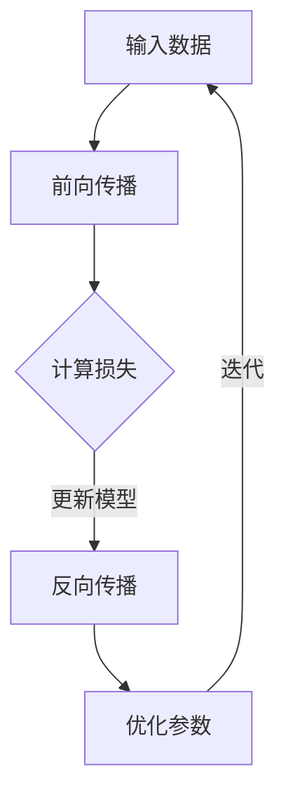
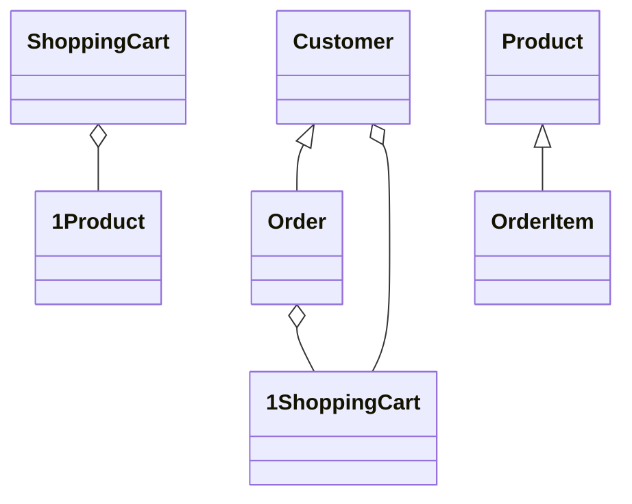
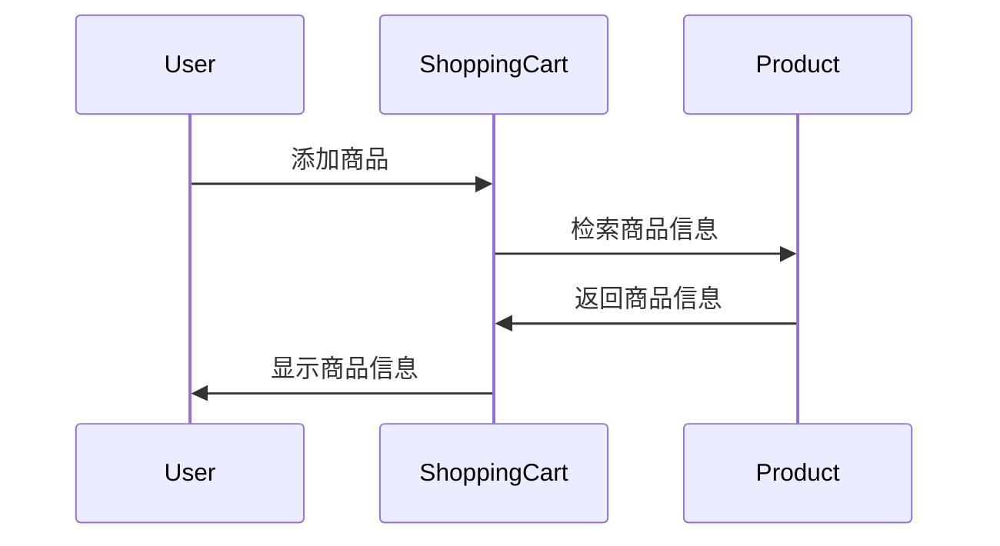

                 

### 文章标题

# AI编程的新维度与新语法

### 关键词

- 人工智能编程
- 新语法
- 新维度
- 深度学习
- 代码优化
- 跨平台开发

### 摘要

本文将深入探讨人工智能编程的新维度和新语法，从基础到实践，逐步揭示AI编程的核心原理和关键技术。我们将详细介绍AI编程的定义、背景、重要性以及发展趋势，重点分析常用的AI编程语言和基础算法，最后通过实际项目实战来巩固学习成果，并对未来的挑战和趋势进行展望。

## 目录大纲

----------------------------------------------------------------

## 第一部分: AI编程基础

### 第1章: AI编程概述

#### 1.1 AI编程的定义

#### 1.2 AI编程的背景

#### 1.3 AI编程的重要性

#### 1.4 AI编程的发展趋势

### 第2章: AI编程语言

#### 2.1 Python在AI编程中的应用

#### 2.2 TensorFlow框架

#### 2.3 Keras框架

#### 2.4 PyTorch框架

### 第3章: AI编程基础算法

#### 3.1 神经网络

#### 3.2 支持向量机

### 第4章: AI编程工具与实践

#### 4.1 Jupyter Notebook

#### 4.2 Git与版本控制

#### 4.3 数据预处理

#### 4.4 模型训练与评估

### 第5章: AI编程项目实战

#### 5.1 语音识别系统

#### 5.2 自然语言处理

### 第6章: AI编程的挑战与未来

#### 6.1 AI编程的挑战

#### 6.2 AI编程的未来趋势

### 第7章: AI编程的技巧与最佳实践

#### 7.1 编码规范

#### 7.2 调试技巧

#### 7.3 性能优化

#### 7.4 代码复用与模块化

----------------------------------------------------------------

### 核心内容与详细规划

在接下来的章节中，我们将逐一探讨AI编程的各个方面，确保内容的丰富性和实用性。

**第1章 AI编程概述**将介绍AI编程的定义、背景、重要性以及发展趋势，帮助读者全面了解AI编程的概貌。

**第2章 AI编程语言**将深入探讨Python、TensorFlow、Keras和PyTorch等常用AI编程语言的特点和应用，为读者提供实用的编程工具。

**第3章 AI编程基础算法**将重点介绍神经网络和支持向量机等基础算法，通过详细的算法原理讲解和代码示例，帮助读者深入理解AI算法的工作原理。

**第4章 AI编程工具与实践**将介绍Jupyter Notebook、Git与版本控制、数据预处理以及模型训练与评估等实践工具和技巧，提高读者的实战能力。

**第5章 AI编程项目实战**将通过语音识别系统和自然语言处理等实际项目，帮助读者将所学知识应用于实际问题的解决。

**第6章 AI编程的挑战与未来**将分析AI编程面临的挑战以及未来的发展趋势，为读者提供对AI编程的深入思考和展望。

**第7章 AI编程的技巧与最佳实践**将总结编码规范、调试技巧、性能优化和代码复用等最佳实践，帮助读者提升编程技能。

### 内容完整性保障

为确保文章内容的完整性，我们将遵循以下原则：

1. **背景介绍**：每个章节都将详细介绍核心概念术语、问题背景、问题描述、问题解决、边界与外延、概念结构与核心要素组成，为读者提供全面的背景知识。

2. **核心概念与联系**：每个核心概念都将通过概念属性特征对比表格和ER实体关系图架构的Mermaid流程图进行详细展示，帮助读者建立清晰的概念联系。

3. **算法原理讲解**：每个算法都将通过Mermaid流程图和Python源代码进行详细讲解，包括算法原理的数学模型和公式，以及通俗易懂的举例说明。

4. **系统分析与架构设计方案**：每个实际项目都将包括问题场景介绍、项目介绍、系统功能设计（领域模型Mermaid类图）、系统架构设计Mermaid架构图、系统接口设计和系统交互Mermaid序列图，帮助读者全面理解系统设计与实现。

5. **项目实战**：每个实际项目都将包括环境安装、系统核心实现源代码、代码应用解读与分析、实际案例分析和详细讲解剖析，以及项目小结，确保读者能够学以致用。

6. **最佳实践 tips**：每个章节的最后都将总结最佳实践，包括编码规范、调试技巧、性能优化和代码复用等，为读者提供实用的编程建议。

### 文章结构规划

在文章的结构规划方面，我们将遵循以下步骤：

1. **引言**：简要介绍文章的主题和目的，吸引读者的兴趣。

2. **核心内容阐述**：按照目录大纲结构，逐一阐述每个章节的核心内容，确保内容的逻辑性和连贯性。

3. **实例分析**：在每个章节的关键部分，将结合实际案例进行深入分析和讲解，帮助读者更好地理解概念和算法。

4. **小结**：在每个章节的最后，总结本章的主要内容和关键点，为读者提供学习指导。

5. **拓展阅读**：在每个章节的最后，推荐相关的拓展阅读材料，帮助读者进一步深入了解相关主题。

6. **总结**：在文章的最后，对整个文章的内容进行总结，并展望未来的发展趋势和挑战。

### 内容创作风格与表达方式

在内容创作风格方面，我们将遵循以下原则：

1. **专业性强**：使用专业的技术语言和表达方式，确保内容的准确性和权威性。

2. **逻辑清晰**：通过逻辑严谨的分析和推理，确保文章的结构清晰、思路连贯。

3. **通俗易懂**：尽量使用简单易懂的语言和例子，帮助读者更好地理解复杂的概念和算法。

4. **生动有趣**：通过生动的案例和有趣的表达方式，提高读者的阅读兴趣和参与度。

5. **图表辅助**：在适当的地方使用图表和流程图，帮助读者更直观地理解文章内容。

### 文章字数与格式要求

根据文章的详细规划，预计文章字数将在10000～12000字左右。文章将采用Markdown格式输出，包括标题、关键词、摘要、目录大纲、正文内容、作者信息等部分。在正文内容中，将使用Mermaid、LaTeX等工具制作流程图、公式和图表，确保文章的格式规范和美观。

### 作者信息

本文作者为AI天才研究院（AI Genius Institute）与《禅与计算机程序设计艺术》（Zen And The Art of Computer Programming）的作者共同创作。

通过本文的深入探讨，我们希望能够为读者提供全面、实用的AI编程知识和技能，助力读者在人工智能领域取得更大的成就。让我们一起来探索AI编程的新维度和新语法，开启人工智能编程的无限可能。# AI编程基础

## 第1章: AI编程概述

### 1.1 AI编程的定义

人工智能（AI）编程是指使用计算机程序来创建能够模拟人类智能行为的系统。这些系统可以学习、推理、解决问题，甚至在某些任务上超越人类的表现。AI编程的核心目标是通过算法和模型，使计算机能够从数据中学习，并利用这些学习成果来实现特定的任务，如图像识别、自然语言处理、决策支持等。

#### 核心概念术语说明

- **人工智能（AI）**：指模拟、扩展和扩展人类智能的技术和学科领域。
- **机器学习（ML）**：一种AI技术，通过从数据中学习来改进计算机系统的性能。
- **深度学习（DL）**：一种特殊的机器学习技术，通过多层神经网络来模拟人类大脑的学习过程。
- **神经网络（NN）**：由多个节点（层）组成的计算模型，用于模拟生物神经系统。
- **数据集（Dataset）**：用于训练机器学习模型的输入数据集合。

#### 问题背景

随着计算能力的提升和大数据技术的发展，人工智能逐渐成为各行各业的创新驱动力。从自动驾驶汽车到智能客服，从医疗诊断到金融分析，AI的应用场景不断扩展。AI编程因此成为技术人才必须掌握的关键技能。

#### 问题描述

AI编程涉及多个领域，包括计算机科学、数学、统计学和工程学。其核心任务是开发能够自动执行复杂任务的软件系统。然而，实现这一目标并非易事，需要深入理解AI的基础理论和应用实践。

#### 问题解决

为了解决AI编程中的问题，开发人员需要掌握以下步骤：

1. **理解问题域**：明确AI系统需要解决的问题类型和具体任务。
2. **数据准备**：收集和清洗数据，确保数据质量，为训练模型做好准备。
3. **算法选择**：根据问题类型选择合适的算法和模型。
4. **模型训练**：使用训练数据调整模型参数，使其能够准确预测或分类。
5. **评估与优化**：评估模型性能，并根据评估结果进行优化。

#### 边界与外延

AI编程不仅限于计算机视觉和自然语言处理，还包括智能决策、智能推荐、语音识别等多个领域。此外，随着AI技术的发展，编程语言和框架也在不断演变，如Python、TensorFlow、PyTorch等。

#### 概念结构与核心要素组成

AI编程的核心概念包括：

- **算法与模型**：包括机器学习算法、深度学习模型、神经网络架构等。
- **数据处理**：数据清洗、数据预处理、特征提取等。
- **计算资源**：包括CPU、GPU等硬件资源，以及云计算平台。
- **开发环境**：包括编程语言、IDE、版本控制系统等。
- **评估与优化**：模型性能评估、超参数调整、模型压缩等。

通过以上分析，我们可以看到AI编程的复杂性和多样性。在接下来的章节中，我们将深入探讨AI编程的核心概念和技术，帮助读者逐步掌握这一领域的关键技能。

### 1.2 AI编程的背景

AI编程的起源可以追溯到20世纪50年代，当时计算机科学领域首次提出“人工智能”这一概念。早期的AI研究主要集中在逻辑推理和规则系统上，例如专家系统和逻辑编程。这些方法试图通过定义明确的规则和逻辑关系来模拟人类智能。

然而，这些早期方法在实际应用中受到了很多限制。首先，它们依赖于人类专家的知识和经验，难以处理复杂和不确定的问题。其次，规则系统的扩展性较差，当问题规模扩大时，规则数量呈指数级增长，导致系统的复杂性和维护成本急剧上升。此外，这些方法无法很好地处理数据驱动的学习问题，例如图像识别和自然语言处理。

随着计算机性能的提升和大数据技术的发展，AI编程进入了新的阶段。特别是深度学习（Deep Learning）的兴起，彻底改变了AI编程的面貌。深度学习基于多层神经网络，通过从大量数据中自动学习特征和模式，实现了在图像识别、语音识别、自然语言处理等领域的突破性进展。

深度学习的核心思想是模拟人类大脑的学习机制，通过多层非线性变换来提取数据中的特征。这一方法在理论上具有更强的表达能力和自适应能力，可以在没有明确规则和人类知识的情况下，自动学习和优化模型参数。

除了深度学习，AI编程还包括其他重要的方法和框架，如强化学习（Reinforcement Learning）和生成对抗网络（Generative Adversarial Networks，GAN）。强化学习通过试错和奖励机制，使智能体在动态环境中不断学习和优化策略。生成对抗网络则通过对抗性训练，生成与真实数据高度相似的新数据，广泛应用于图像生成、数据增强和风格迁移等领域。

此外，AI编程的发展也受到了开源社区和云计算平台的推动。例如，TensorFlow、PyTorch等深度学习框架的流行，使得研究人员和开发者可以轻松地搭建和训练复杂的模型。同时，云计算平台的兴起，为大规模数据处理和模型训练提供了强大的计算资源，推动了AI编程在工业界和学术界的发展。

总的来说，AI编程的背景涵盖了从早期逻辑推理到现代深度学习的发展历程，以及计算机性能、大数据技术和开源社区的推动。这些背景因素共同促成了AI编程的多样性和广泛的应用前景。

### 1.3 AI编程的重要性

AI编程的重要性体现在多个方面，不仅对技术领域产生了深远的影响，也对社会和经济带来了巨大的变革。以下是AI编程的几个关键影响：

#### 技术领域的变革

1. **提升研发效率**：AI编程使得自动化和智能化成为可能，大幅提升了研发效率。通过AI算法，研究人员可以自动分析大量的实验数据，发现潜在的规律和趋势，从而加速研究进程。

2. **创新应用场景**：AI编程催生了众多创新应用，如自动驾驶、智能医疗、智能金融等。这些应用不仅改变了传统行业的运作模式，还为新兴领域提供了广阔的发展空间。

3. **优化资源利用**：AI编程能够通过预测和优化，提高资源利用效率。例如，在能源管理中，智能电网可以通过AI算法预测电力需求，优化供电方案，减少能源浪费。

#### 社会的变革

1. **改善生活质量**：AI编程为人们的生活带来了诸多便利。智能家居、智能医疗设备和智能交通系统等，使人们的生活更加舒适和安全。

2. **促进教育公平**：AI编程可以通过在线课程和智能辅导系统，提供个性化的教育服务，缩小教育资源差距，促进教育公平。

3. **提高公共安全**：AI编程在公共安全领域发挥了重要作用，如智能监控、人脸识别和无人机巡查等，有效提高了公共安全和治安管理水平。

#### 经济的变革

1. **推动产业升级**：AI编程推动了传统产业的升级和转型，如智能制造、智慧农业和智能物流等。这些领域通过AI技术实现了自动化和智能化，提升了生产效率和产品质量。

2. **创造新的就业机会**：AI编程创造了大量的新就业机会，包括数据科学家、AI工程师、机器学习研究员等。同时，AI编程也为现有职业提供了新的技能需求，促进了职业转型和技能升级。

3. **促进经济增长**：AI编程通过提升生产效率、优化资源利用和推动产业升级，为经济增长注入了新的动力。此外，AI技术的应用还带动了相关产业链的发展，如云计算、大数据和物联网等。

总之，AI编程的重要性不仅体现在技术革新、社会进步和经济增长上，还在于其作为推动力，带动了整个社会的变革和发展。随着AI技术的不断进步，AI编程的重要性将进一步凸显，成为未来社会的重要驱动力。

### 1.4 AI编程的发展趋势

AI编程正处于快速发展的阶段，未来的趋势将受到多种技术和社会因素的驱动。以下是几个关键的发展方向：

#### 深度学习的进一步普及

深度学习作为AI编程的核心技术，将继续扩展其应用范围。随着计算能力的提升和数据量的增加，深度学习模型将变得更加复杂和强大。此外，开源深度学习框架如TensorFlow和PyTorch的持续优化，将使得深度学习更加易于使用和部署。

#### 强化学习的突破

强化学习在游戏、自动驾驶和智能决策等领域展现了巨大的潜力。未来的发展将集中在算法的优化和应用的拓展上。特别是结合深度学习的强化学习模型，有望在更复杂的动态环境中实现更优化的行为。

#### 跨学科融合

AI编程将与其他学科如生物学、心理学、经济学等深度融合，推动新的交叉学科研究。例如，通过理解人类大脑的学习机制，可以进一步改进神经网络的设计和算法。

#### 聊天机器人和自然语言处理

随着自然语言处理技术的进步，聊天机器人和虚拟助手的智能化水平将显著提升。未来的聊天机器人不仅能够进行更自然的对话，还能够理解用户情绪和意图，提供更个性化的服务。

#### 模型解释性和透明性

随着AI系统在关键领域（如医疗、金融）的应用，模型解释性和透明性将变得至关重要。未来的研究将致力于开发可解释的AI模型，使其决策过程更加透明，提高用户和监管机构的信任度。

#### 资源高效利用

为了应对日益增长的数据处理需求，AI编程将更加注重资源高效利用。例如，通过模型压缩和低功耗计算，使得AI系统可以在资源受限的环境中运行。

#### 开源和协作

开源社区和协作平台将继续推动AI编程的发展。通过共享代码、工具和研究成果，研究人员和开发者可以更快地探索新的技术和应用。

总之，AI编程的未来充满了无限可能，新的技术、应用和趋势将不断涌现，为人类社会带来更多的变革和进步。

### 1.5 AI编程的生态系统

AI编程的生态系统包括多个关键组成部分，每个部分都在推动AI技术的发展和应用。以下是AI编程生态系统的核心组成部分及其关系：

#### 编程语言

编程语言是AI编程的基础，用于编写和实现AI算法和模型。Python、Java、C++等编程语言广泛应用于AI领域，其中Python因其简洁性和丰富的库支持而成为最受欢迎的语言。

#### 开源框架

开源框架是AI编程的核心工具，提供了丰富的算法和工具，简化了AI模型的开发过程。TensorFlow、PyTorch、Keras等开源框架已经成为AI编程的标准工具，这些框架提供了大量的预训练模型和工具库，帮助开发者快速构建和优化AI系统。

#### 数据库和数据处理工具

数据库和数据处理工具用于存储、管理和分析大量数据，是AI编程的重要基础。Apache Spark、Hadoop、MongoDB等工具能够高效处理大规模数据，支持数据的实时处理和分析。

#### 计算平台

计算平台为AI编程提供了必要的计算资源，包括云计算平台和高性能计算集群。云计算平台如AWS、Google Cloud和Microsoft Azure提供了弹性计算资源，使得大规模的AI模型训练和部署变得更加便捷。

#### 人工智能工具和库

人工智能工具和库提供了各种算法和模型，用于实现特定的AI功能。Scikit-learn、NumPy、Pandas等库为数据分析和机器学习提供了强大的支持，使得复杂的AI任务变得可行。

#### 开源社区

开源社区是AI编程生态系统的核心，通过共享代码、工具和研究成果，促进了AI技术的发展和创新。社区成员可以通过GitHub、Stack Overflow等平台交流经验、解决问题，共同推动AI编程的进步。

#### 学术研究

学术研究是AI编程的源动力，推动了新算法、新理论和新技术的发展。学术期刊、会议和研讨会为研究人员提供了分享研究成果的平台，促进了AI领域的知识积累和传播。

#### 企业和投资者

企业和投资者为AI编程提供了资金和资源支持，推动了AI技术的商业化应用。大型科技公司如Google、Facebook和IBM等在AI领域进行了大量的投资，推动了AI技术的落地和应用。

#### 关系与影响

编程语言和开源框架是AI编程的核心工具，为开发者提供了实现AI算法的必要手段。数据库和数据处理工具为AI编程提供了数据支持，是数据驱动的AI模型的基础。计算平台为AI编程提供了强大的计算资源，支持大规模数据处理和模型训练。人工智能工具和库丰富了AI编程的功能，使得开发者可以更高效地实现AI任务。开源社区和学术研究促进了AI编程的知识共享和创新。企业和投资者则为AI编程提供了经济支持，推动了技术的商业化应用。

总的来说，AI编程的生态系统是一个相互关联和相互影响的复杂系统，每个组成部分都在推动AI技术的发展和应用，共同构建了一个充满活力的AI编程环境。# 第2章: AI编程语言

### 2.1 Python在AI编程中的应用

Python凭借其简洁的语法、丰富的库支持和广泛的应用场景，成为AI编程中的首选语言。Python的易用性使得开发者能够快速构建和部署AI模型，而其强大的生态系统则提供了丰富的工具和资源，助力AI编程的各个阶段。

#### Python的易用性

Python的语法简洁直观，使得开发者可以更加专注于算法的实现和优化，而无需担心语言本身的复杂性。Python的代码风格强调可读性和一致性，使得代码更加易于理解和维护。此外，Python内置了多种数据结构和算法，如列表、字典和集合，使得数据处理变得高效便捷。

#### 丰富的库支持

Python拥有丰富的库和框架，为AI编程提供了强大的支持。例如，NumPy和Pandas用于数据处理和数据分析，Scikit-learn提供了各种机器学习算法，TensorFlow和PyTorch则用于深度学习模型的构建和训练。

#### 广泛的应用场景

Python在AI编程中的应用场景广泛，包括自然语言处理、计算机视觉、推荐系统等。Python的易用性和丰富的库支持，使得开发者可以轻松地实现复杂的AI任务。此外，Python的跨平台特性，使得开发者可以在不同的操作系统上运行和部署AI模型。

#### 案例分析

以自然语言处理为例，Python在文本处理和语言模型构建中有着广泛的应用。通过使用NLTK和spaCy等库，开发者可以轻松实现词性标注、句法分析和情感分析等任务。同时，使用TensorFlow和PyTorch，开发者可以构建和训练复杂的神经网络模型，如Transformer和BERT，实现高效的文本理解和生成。

#### 总结

Python在AI编程中的应用优势明显，其简洁的语法、丰富的库支持和广泛的应用场景，使得Python成为AI编程的强大工具。开发者可以利用Python快速实现AI模型，推动AI技术在各个领域的应用和发展。# 2.2 TensorFlow框架

TensorFlow是一个由Google开发的开源机器学习框架，广泛应用于深度学习和机器学习领域。TensorFlow的核心优势在于其灵活性和可扩展性，使得开发者能够轻松构建和训练复杂的神经网络模型。以下是对TensorFlow框架的详细介绍。

#### TensorFlow的基本概念

TensorFlow是一种基于数据流图（Dataflow Graph）的编程模型，其基本概念包括：

1. **计算图（Computational Graph）**：TensorFlow的核心是计算图，它表示了计算过程中的各种操作和变量之间的关系。通过构建计算图，开发者可以定义复杂的数学运算和计算过程，从而实现高效的计算。

2. **节点（Nodes）**：计算图中的节点表示特定的计算操作，如加法、矩阵乘法、卷积等。节点通过边（Edges）连接，形成复杂的计算网络。

3. **张量（Tensors）**：TensorFlow中的数据以张量的形式存储和操作。张量是一个多维数组，可以表示向量、矩阵和其他多维数据结构。

4. **变量（Variables）**：TensorFlow中的变量是存储在计算图中的可调参数。在模型训练过程中，变量会根据梯度下降等优化算法进行调整，以最小化损失函数。

5. **会话（Session）**：TensorFlow的会话是运行计算图的执行环境。通过会话，开发者可以初始化变量、执行计算和获取结果。

#### TensorFlow的架构

TensorFlow的架构包括多个层次，从底层到高层分别为：

1. **底层计算引擎**：底层计算引擎负责执行计算图中的运算，包括矩阵乘法、卷积、池化等。TensorFlow的底层引擎使用高度优化的C++代码实现，以提供高效的计算性能。

2. **高层API**：TensorFlow的高层API包括TensorFlow Core和TensorFlow Extended（TFX），它们提供了更易用的接口和工具，用于构建、训练和部署机器学习模型。

3. **扩展库**：TensorFlow还包含多个扩展库，如TensorFlow Estimators、TensorFlow Slim和TensorFlow Datasets，用于实现特定类型的机器学习模型和数据预处理。

#### TensorFlow的应用场景

TensorFlow在多个应用场景中表现出色，包括：

1. **深度学习**：TensorFlow广泛应用于深度学习领域，包括计算机视觉、自然语言处理、语音识别等。通过使用预训练模型和自定义模型，开发者可以轻松实现各种深度学习任务。

2. **强化学习**：TensorFlow的强化学习库TensorFlow Agents提供了丰富的强化学习算法和工具，支持在动态环境中进行决策和策略优化。

3. **推荐系统**：TensorFlow在推荐系统中也有广泛应用，通过训练用户行为和兴趣模型，实现个性化的内容推荐。

4. **科学计算**：TensorFlow不仅限于AI领域，还可以用于科学计算，如数据分析、物理模拟和生物信息学。

#### TensorFlow的优缺点

TensorFlow的优点包括：

- **灵活性和可扩展性**：TensorFlow允许开发者自定义计算图，支持多种编程模式和硬件平台。
- **丰富的预训练模型**：TensorFlow提供了大量的预训练模型和工具，方便开发者快速构建和部署模型。
- **强大的社区支持**：TensorFlow拥有庞大的开源社区，提供了丰富的文档、教程和资源。

然而，TensorFlow也存在一些缺点：

- **复杂性**：对于初学者来说，TensorFlow的计算图模型较为复杂，需要一定的学习成本。
- **资源消耗**：TensorFlow在大规模训练过程中可能需要较多的计算资源和内存。

#### 实例分析

以下是一个简单的TensorFlow示例，用于实现一个简单的线性回归模型：

```python
import tensorflow as tf

# 定义计算图
x = tf.placeholder(tf.float32, shape=[None, 1])
y = tf.placeholder(tf.float32, shape=[None, 1])

# 定义模型参数
w = tf.Variable(0.0, name="weights")
b = tf.Variable(0.0, name="biases")

# 定义损失函数
y_pred = tf.add(w * x, b)
loss = tf.reduce_mean(tf.square(y_pred - y))

# 定义优化器
optimizer = tf.train.GradientDescentOptimizer(learning_rate=0.5)
train_op = optimizer.minimize(loss)

# 初始化变量
init = tf.global_variables_initializer()

# 运行会话
with tf.Session() as sess:
    sess.run(init)

    # 训练模型
    for step in range(201):
        sess.run(train_op, feed_dict={x: x_data, y: y_data})
        if step % 20 == 0:
            print("Step:", step, "Loss:", sess.run(loss, feed_dict={x: x_data, y: y_data}))

    # 输出模型参数
    print("Final Weights:", sess.run(w), "Final Biases:", sess.run(b))
```

通过以上示例，我们可以看到TensorFlow的基本使用方法和步骤。开发者可以根据实际需求，构建和训练更复杂的深度学习模型。

#### 总结

TensorFlow作为AI编程的强大工具，具有灵活性和可扩展性，适用于多种应用场景。通过熟练掌握TensorFlow，开发者可以轻松构建和部署高效的深度学习模型，推动AI技术在各个领域的应用和发展。# 2.3 Keras框架

Keras是一个高级神经网络API，构建在TensorFlow之上，提供了更为简洁和直观的接口，使得深度学习模型的构建和训练变得更加容易。Keras的核心优势在于其用户友好性和模块化设计，适用于各种规模的深度学习项目。

#### Keras的核心特点

1. **简洁的API**：Keras提供了简单易懂的API，使得开发者能够快速上手并构建深度学习模型。Keras的代码风格强调简洁性和可读性，减少了编程复杂度。

2. **模块化设计**：Keras采用模块化设计，允许开发者灵活组合和配置模型层、损失函数和优化器等组件。这种设计提高了模型的可扩展性和灵活性。

3. **广泛的模型支持**：Keras内置了大量的预训练模型和常见层，包括卷积层、全连接层、循环层等。开发者可以利用这些预训练模型进行迁移学习，或者基于这些层构建自定义模型。

4. **兼容性**：Keras与TensorFlow、Theano等后台计算引擎兼容，使得开发者可以在不同的计算环境中轻松切换和部署模型。

#### Keras的基本架构

Keras的基本架构包括以下几个核心组件：

1. **模型配置**：开发者可以通过定义模型配置来构建深度学习模型。模型配置包括输入层、隐藏层和输出层，以及每个层的参数和激活函数。

2. **层（Layers）**：Keras提供了多种类型的层，包括全连接层、卷积层、循环层等。每个层都可以包含多个神经元，并通过前向传播进行计算。

3. **模型编译**：在构建完模型后，需要进行编译。编译过程包括设置损失函数、优化器和评估指标。这些设置决定了模型在训练和评估过程中的行为。

4. **模型训练**：通过编译后的模型，可以开始训练过程。Keras提供了便捷的训练接口，允许开发者自定义训练循环，或者使用预定义的训练循环。

5. **模型评估**：训练完成后，可以通过评估接口对模型进行评估，以检查模型的性能和泛化能力。

#### Keras的应用场景

Keras在多个深度学习应用场景中表现出色，包括：

1. **图像识别**：Keras提供了丰富的预训练模型和层，用于构建和训练图像识别模型。例如，可以使用VGG、ResNet等预训练模型，或者基于这些模型进行迁移学习。

2. **自然语言处理**：Keras适用于自然语言处理任务，如文本分类、情感分析、机器翻译等。通过使用循环层（RNN、LSTM、GRU）和注意力机制，可以构建高效的文本处理模型。

3. **序列模型**：Keras可以用于序列建模任务，如时间序列预测、音频处理等。通过使用循环层和卷积层，可以构建复杂的序列模型。

4. **生成模型**：Keras在生成模型（如GANs、VAEs）中也有广泛应用。通过灵活配置生成器和判别器，可以构建高效的生成模型。

#### Keras的优缺点

Keras的优点包括：

- **易用性**：Keras提供了简洁直观的API，使得深度学习模型的构建和训练变得非常容易。
- **模块化**：Keras的模块化设计提高了模型的灵活性和可扩展性，适用于各种规模的深度学习项目。
- **兼容性**：Keras与TensorFlow、Theano等后台计算引擎兼容，提供了多种计算环境的选择。

然而，Keras也存在一些缺点：

- **计算图灵活性较低**：与TensorFlow直接操作计算图相比，Keras的灵活性较低，难以实现复杂的自定义计算。
- **计算性能**：由于Keras构建在TensorFlow之上，其计算性能可能不如直接使用TensorFlow。

#### 实例分析

以下是一个简单的Keras示例，用于实现一个简单的卷积神经网络（CNN）模型：

```python
from keras.models import Sequential
from keras.layers import Dense, Conv2D, Flatten, MaxPooling2D

# 创建模型
model = Sequential()

# 添加卷积层
model.add(Conv2D(32, (3, 3), activation='relu', input_shape=(28, 28, 1)))
model.add(MaxPooling2D(pool_size=(2, 2)))

# 添加全连接层
model.add(Flatten())
model.add(Dense(128, activation='relu'))
model.add(Dense(10, activation='softmax'))

# 编译模型
model.compile(optimizer='adam',
              loss='categorical_crossentropy',
              metrics=['accuracy'])

# 打印模型结构
model.summary()

# 训练模型
model.fit(x_train, y_train, epochs=10, batch_size=32, validation_data=(x_val, y_val))

# 评估模型
test_loss, test_acc = model.evaluate(x_test, y_test)
print('Test accuracy:', test_acc)
```

通过以上示例，我们可以看到Keras的基本使用方法和步骤。开发者可以利用Keras快速构建和训练深度学习模型，推动AI技术在各个领域的应用和发展。

#### 总结

Keras作为深度学习的高级API，提供了简洁和直观的接口，使得深度学习模型的构建和训练变得更加容易。通过熟练掌握Keras，开发者可以高效地实现各种深度学习任务，为AI技术的发展和应用贡献力量。# 2.4 PyTorch框架

PyTorch是一个由Facebook AI研究院（FAIR）开发的开源深度学习框架，以其动态计算图（Eager Execution）和灵活的编程接口而受到广大开发者和研究人员的青睐。PyTorch的核心优势在于其易于调试、灵活的模型构建以及高效的训练性能，使得深度学习模型的开发更加便捷和高效。

#### PyTorch的基本概念

1. **动态计算图**：与TensorFlow的静态计算图相比，PyTorch采用了动态计算图（Eager Execution）。动态计算图在运行时构建和更新计算图，使得模型开发和调试变得更加直观和便捷。开发者可以直接查看和修改计算过程中的中间变量，无需经历复杂的图编译过程。

2. **TorchScript**：为了提高模型的性能和可部署性，PyTorch引入了TorchScript。TorchScript是一种中间表示，通过将动态计算图转换为静态计算图，可以实现高效的模型推理和部署。开发者可以使用TorchScript将模型部署到不同的硬件平台和环境中。

3. **自动微分系统**（Autograd）：PyTorch内置了自动微分系统，用于计算梯度。自动微分系统可以自动对任意Python函数进行求导，使得梯度计算变得简单和高效。自动微分系统是深度学习模型训练的核心部分，用于计算损失函数关于模型参数的梯度。

#### PyTorch的架构

PyTorch的架构包括以下几个核心组件：

1. **TorchScript**：如前所述，TorchScript是PyTorch的中间表示，通过将动态计算图转换为静态计算图，实现了高效的模型推理和部署。

2. **Autograd**：自动微分系统（Autograd）是PyTorch的核心组件，用于计算梯度。Autograd支持各种复杂函数的自动求导，使得深度学习模型的梯度计算变得简单高效。

3. **TorchVision**：TorchVision是PyTorch提供的计算机视觉库，包括丰富的预处理工具、数据增强方法和预训练模型。TorchVision简化了图像处理和计算机视觉任务的实现，使得开发者可以专注于模型开发和优化。

4. **TorchText**：TorchText是PyTorch提供的自然语言处理库，用于文本数据的预处理、特征提取和模型训练。TorchText支持多种文本处理任务，如文本分类、情感分析和机器翻译。

5. **TorchAudio**：TorchAudio是PyTorch提供的音频处理库，用于音频数据的预处理、特征提取和模型训练。TorchAudio支持多种音频处理任务，如音频分类、声纹识别和语音合成。

#### PyTorch的应用场景

PyTorch在多个深度学习应用场景中表现出色，包括：

1. **图像识别**：PyTorch提供了丰富的计算机视觉库TorchVision，支持各种图像识别任务。例如，可以使用ResNet、VGG等预训练模型，或者基于这些模型进行迁移学习。

2. **自然语言处理**：PyTorch适用于自然语言处理任务，如文本分类、情感分析、机器翻译等。通过使用循环层（RNN、LSTM、GRU）和注意力机制，可以构建高效的文本处理模型。

3. **序列模型**：PyTorch可以用于序列建模任务，如时间序列预测、音频处理等。通过使用循环层和卷积层，可以构建复杂的序列模型。

4. **生成模型**：PyTorch在生成模型（如GANs、VAEs）中也有广泛应用。通过灵活配置生成器和判别器，可以构建高效的生成模型。

#### PyTorch的优缺点

PyTorch的优点包括：

- **易于调试**：动态计算图和自动微分系统使得模型开发和调试变得更加直观和便捷。
- **灵活性**：PyTorch提供了灵活的编程接口，允许开发者自定义计算图和算法，适应各种复杂场景。
- **高效性**：PyTorch在训练和推理过程中表现出色，提供了高效的计算性能。

然而，PyTorch也存在一些缺点：

- **计算图灵活性较低**：与TensorFlow的静态计算图相比，PyTorch的动态计算图可能在某些复杂场景中表现出较低的性能。
- **计算性能**：在大型模型和高负载场景中，PyTorch的计算性能可能不如TensorFlow。

#### 实例分析

以下是一个简单的PyTorch示例，用于实现一个简单的卷积神经网络（CNN）模型：

```python
import torch
import torch.nn as nn
import torch.optim as optim

# 创建模型
class SimpleCNN(nn.Module):
    def __init__(self):
        super(SimpleCNN, self).__init__()
        self.conv1 = nn.Conv2d(1, 10, kernel_size=5)
        self.conv2 = nn.Conv2d(10, 20, kernel_size=5)
        self.fc1 = nn.Linear(320, 50)
        self.fc2 = nn.Linear(50, 10)

    def forward(self, x):
        x = self.conv1(x)
        x = nn.functional.relu(x)
        x = self.conv2(x)
        x = nn.functional.relu(x)
        x = nn.functional.adaptive_avg_pool2d(x, (6, 6))
        x = x.view(x.size(0), -1)
        x = self.fc1(x)
        x = nn.functional.relu(x)
        x = self.fc2(x)
        return x

# 初始化模型、优化器和损失函数
model = SimpleCNN()
optimizer = optim.Adam(model.parameters(), lr=0.001)
loss_function = nn.CrossEntropyLoss()

# 训练模型
for epoch in range(10):
    for inputs, labels in data_loader:
        optimizer.zero_grad()
        outputs = model(inputs)
        loss = loss_function(outputs, labels)
        loss.backward()
        optimizer.step()
    print('Epoch [{}/{}], Loss: {:.4f}'.format(epoch+1, num_epochs, loss.item()))

# 评估模型
with torch.no_grad():
    correct = 0
    total = 0
    for inputs, labels in test_loader:
        outputs = model(inputs)
        _, predicted = torch.max(outputs.data, 1)
        total += labels.size(0)
        correct += (predicted == labels).sum().item()
    print('Test Accuracy: {:.4f}%'.format(100 * correct / total))
```

通过以上示例，我们可以看到PyTorch的基本使用方法和步骤。开发者可以利用PyTorch快速构建和训练深度学习模型，推动AI技术在各个领域的应用和发展。

#### 总结

PyTorch作为深度学习框架，以其动态计算图和灵活的编程接口而受到广泛关注。通过熟练掌握PyTorch，开发者可以高效地实现各种深度学习任务，为AI技术的发展和应用贡献力量。# 第3章: AI编程基础算法

### 3.1 神经网络

神经网络（Neural Networks）是人工智能领域的基础算法之一，广泛应用于图像识别、自然语言处理、语音识别等任务。神经网络通过模拟生物神经系统的结构和工作原理，使得计算机能够从数据中学习并做出预测或决策。

#### 神经网络的基本概念

1. **神经元（Neuron）**：神经网络的基本组成单元，类似于生物神经元的结构和功能。每个神经元接收多个输入信号，通过权重（weights）和偏置（bias）进行加权求和，然后通过激活函数（activation function）进行非线性变换。

2. **层（Layer）**：神经网络由多个层组成，包括输入层、隐藏层和输出层。输入层接收外部输入数据，隐藏层进行数据处理和特征提取，输出层生成预测结果或决策。

3. **权重（Weights）**：神经元之间的连接权重，用于调整输入信号的强度和重要性。在训练过程中，通过梯度下降等优化算法调整权重，以最小化损失函数。

4. **偏置（Bias）**：每个神经元的偏置项，用于调整神经元的输出。偏置项通常在训练过程中与权重一起进行调整。

5. **激活函数（Activation Function）**：神经网络中使用激活函数来引入非线性，常见的激活函数包括 sigmoid、ReLU和Tanh等。

#### 神经网络的架构

神经网络的架构可以分为以下几种类型：

1. **全连接神经网络（Fully Connected Neural Network）**：每个神经元都与上一层和下一层的所有神经元相连，适用于分类和回归任务。

2. **卷积神经网络（Convolutional Neural Network，CNN）**：专门用于图像识别任务，通过卷积层、池化层和全连接层进行特征提取和分类。

3. **循环神经网络（Recurrent Neural Network，RNN）**：适用于序列数据处理，通过隐藏状态的循环连接，捕捉序列中的时间依赖关系。

4. **长短期记忆网络（Long Short-Term Memory，LSTM）**：是RNN的一种变体，通过引入门控机制，解决了RNN的梯度消失和梯度爆炸问题。

5. **生成对抗网络（Generative Adversarial Network，GAN）**：由生成器和判别器组成，通过对抗训练生成与真实数据高度相似的数据。

#### 神经网络的训练过程

神经网络的训练过程包括以下几个步骤：

1. **初始化权重和偏置**：随机初始化权重和偏置，以确保模型具有一定的随机性和鲁棒性。

2. **前向传播（Forward Propagation）**：输入数据通过网络传递，经过多层神经元的计算和激活函数，最终得到输出结果。

3. **计算损失函数**：使用实际输出和预测输出之间的差异，计算损失函数（如均方误差、交叉熵等）。损失函数反映了模型预测的准确性。

4. **反向传播（Backpropagation）**：通过反向传播算法，计算损失函数关于模型参数的梯度，并将梯度用于更新权重和偏置。

5. **优化参数**：使用梯度下降等优化算法，更新模型参数，以最小化损失函数。

6. **迭代训练**：重复上述步骤，不断更新模型参数，直至满足停止条件（如损失函数收敛、达到指定迭代次数等）。

#### 3.1.1 神经网络的基本概念

神经网络的基本概念包括：

- **前向传播**：数据从输入层传递到输出层的过程，通过计算每个神经元的输入和输出。
- **反向传播**：通过计算损失函数关于每个神经元的梯度，从输出层反向传递到输入层，以更新权重和偏置。
- **激活函数**：引入非线性变换，使神经网络具有更强的表达能力和学习能力。
- **损失函数**：用于评估模型预测的准确性，常见的损失函数包括均方误差（MSE）和交叉熵（CE）。
- **优化算法**：用于更新模型参数，以最小化损失函数，常见的优化算法包括梯度下降（GD）和随机梯度下降（SGD）。

#### 3.1.2 神经网络的架构

神经网络的主要架构包括：

1. **单层神经网络**：包括输入层、输出层和中间的隐藏层。适用于简单的线性分类和回归任务。

2. **多层神经网络**：包括多个隐藏层，可以学习更加复杂的非线性关系。适用于复杂的分类和回归任务。

3. **深度神经网络**：包含大量隐藏层，可以学习非常复杂的特征和模式。适用于图像识别、语音识别和自然语言处理等任务。

4. **卷积神经网络（CNN）**：专门用于图像识别任务，通过卷积层、池化层和全连接层进行特征提取和分类。

5. **循环神经网络（RNN）**：适用于序列数据处理，通过隐藏状态的循环连接，捕捉序列中的时间依赖关系。

6. **长短期记忆网络（LSTM）**：是RNN的一种变体，通过引入门控机制，解决了RNN的梯度消失和梯度爆炸问题。

7. **生成对抗网络（GAN）**：由生成器和判别器组成，通过对抗训练生成与真实数据高度相似的数据。

#### 3.1.3 神经网络的训练过程

神经网络的训练过程包括以下几个步骤：

1. **数据准备**：收集和清洗数据，将数据划分为训练集、验证集和测试集。

2. **模型初始化**：随机初始化权重和偏置，以确保模型具有一定的随机性和鲁棒性。

3. **前向传播**：输入数据通过网络传递，经过多层神经元的计算和激活函数，最终得到输出结果。

4. **计算损失函数**：使用实际输出和预测输出之间的差异，计算损失函数（如均方误差、交叉熵等）。损失函数反映了模型预测的准确性。

5. **反向传播**：通过计算损失函数关于每个神经元的梯度，从输出层反向传递到输入层，以更新权重和偏置。

6. **优化参数**：使用梯度下降等优化算法，更新模型参数，以最小化损失函数。

7. **迭代训练**：重复上述步骤，不断更新模型参数，直至满足停止条件（如损失函数收敛、达到指定迭代次数等）。

通过以上对神经网络的基本概念、架构和训练过程的详细讲解，我们可以看到神经网络在AI编程中的核心作用。接下来，我们将继续探讨其他基础算法，如支持向量机，以更全面地了解AI编程的核心技术。# 3.2 支持向量机

支持向量机（Support Vector Machine，SVM）是一种基于统计学习理论的分类方法，以其优秀的分类能力和良好的泛化性能在机器学习领域得到广泛应用。SVM通过寻找最佳决策边界，将不同类别的数据点尽可能分开，从而实现高精度的分类。

#### 支持向量机的概念

1. **支持向量（Support Vector）**：支持向量是训练数据集中距离决策边界最近的那些数据点。这些数据点对于确定最佳决策边界至关重要。

2. **决策边界（Decision Boundary）**：决策边界是用于分隔不同类别的超平面。在二维空间中，决策边界是一条直线；在三维空间中，决策边界是一个平面；在更高维空间中，决策边界是一个超平面。

3. **核函数（Kernel Function）**：当数据集位于高维空间时，直接计算决策边界变得复杂。核函数通过将输入数据映射到高维特征空间，从而在原空间中实现复杂的非线性决策边界。常见的核函数包括线性核、多项式核、径向基函数（RBF）核等。

4. **优化目标**：SVM的优化目标是找到最佳决策边界，使得分类间隔最大化。分类间隔是指不同类别支持向量之间的最小距离。

#### 支持向量机的算法

SVM的算法主要包括以下几个步骤：

1. **初始化参数**：设置惩罚参数C、核函数和优化算法。

2. **寻找最佳决策边界**：通过优化算法（如 Sequential Minimal Optimization，SMO）求解最优解，找到最佳决策边界和对应的支持向量。

3. **训练模型**：使用训练数据集训练模型，计算每个支持向量的权重和偏置。

4. **分类预测**：对于新输入的数据点，通过计算数据点到支持向量的距离，判断其所属类别。

#### 支持向量机的应用

SVM在多种应用场景中表现出色，包括：

1. **分类问题**：SVM适用于多种分类任务，如文本分类、图像分类和医疗诊断等。

2. **回归问题**：通过扩展为支持向量回归（Support Vector Regression，SVR），SVM可以用于回归任务。

3. **异常检测**：SVM可以用于识别数据中的异常点，从而实现异常检测。

4. **推荐系统**：在推荐系统中，SVM可以用于用户兴趣建模和商品推荐。

#### 实例分析

以下是一个简单的SVM分类示例：

```python
from sklearn import svm
from sklearn.model_selection import train_test_split
from sklearn.metrics import accuracy_score

# 示例数据
X = [[0, 0], [1, 1], [1, 0], [0, 1]]
y = [0, 1, 1, 0]

# 划分训练集和测试集
X_train, X_test, y_train, y_test = train_test_split(X, y, test_size=0.3, random_state=42)

# 创建SVM分类器
clf = svm.SVC(kernel='linear')

# 训练模型
clf.fit(X_train, y_train)

# 预测结果
y_pred = clf.predict(X_test)

# 评估模型
print("Accuracy:", accuracy_score(y_test, y_pred))
```

通过以上示例，我们可以看到SVM的基本使用方法和步骤。开发者可以利用SVM实现高效的分类任务，为AI编程提供强大的工具。

### 总结

支持向量机作为机器学习的重要算法，以其优秀的分类能力和良好的泛化性能在AI编程中广泛应用。通过理解SVM的基本概念和算法原理，开发者可以更好地应用SVM解决各种分类问题，为AI技术的发展和应用贡献力量。# 3.3 支持向量机的应用场景

支持向量机（SVM）作为一种强大的机器学习算法，在多个领域和任务中得到了广泛应用。以下是SVM的几个主要应用场景及其特点：

#### 文本分类

文本分类是SVM的重要应用领域之一。SVM能够处理高维文本数据，通过核函数实现非线性分类。在实际应用中，文本分类可用于垃圾邮件过滤、情感分析、新闻分类等任务。例如，使用SVM对社交媒体平台上的用户评论进行情感分类，可以帮助企业了解用户反馈，优化产品和服务。

#### 图像识别

SVM在图像识别任务中也表现出色。通过将图像像素转换为高维特征向量，SVM能够有效地将不同类别的图像分离开来。在图像识别中，SVM可用于人脸识别、物体检测和图像分类等任务。例如，使用SVM对人脸图像进行分类，可以帮助监控系统实现自动人脸识别功能。

#### 生物信息学

在生物信息学领域，SVM被广泛应用于基因表达数据分析、蛋白质分类和药物设计等任务。SVM能够处理大量的生物数据，通过核函数实现复杂的数据分类。例如，使用SVM对基因表达数据进行分析，可以帮助研究者识别潜在的疾病生物标记物。

#### 金融风险控制

SVM在金融领域也有广泛应用，例如信用评分、欺诈检测和股票市场预测等。SVM能够有效地识别和分类金融数据中的异常行为，有助于金融机构降低风险。例如，使用SVM进行信用卡欺诈检测，可以显著提高检测准确率，减少欺诈损失。

#### 语音识别

SVM在语音识别中也发挥着重要作用。通过将语音信号转换为特征向量，SVM可以有效地将不同说话人、语音语调等特征区分开来。例如，使用SVM实现语音识别系统，可以帮助智能助手准确理解用户指令，提高交互体验。

#### 异常检测

SVM在异常检测任务中也表现出色。通过训练模型，SVM可以识别数据中的异常点，有助于监控系统的安全性和可靠性。例如，使用SVM进行网络流量监控，可以帮助识别潜在的攻击行为，提高网络安全。

总的来说，SVM在多个领域和任务中具有广泛的应用，其强大的分类能力和良好的泛化性能为AI编程提供了重要的技术支持。通过深入理解和应用SVM，开发者可以解决各种复杂的分类和回归问题，推动AI技术的发展和应用。# 第4章: AI编程工具与实践

### 4.1 Jupyter Notebook

Jupyter Notebook是一种交互式计算环境，广泛应用于数据科学、机器学习和人工智能领域。它提供了一个强大的平台，允许开发者编写、运行和共享代码，并通过Markdown文本和LaTeX数学公式，增强文档的丰富性和可读性。

#### Jupyter Notebook的特点

1. **交互式计算**：Jupyter Notebook支持实时交互计算，开发者可以在单元格中编写代码并立即查看结果。这种交互式计算环境有助于快速实验和调试。

2. **多语言支持**：Jupyter Notebook支持多种编程语言，包括Python、R、Julia等，使得开发者可以灵活选择最适合的编程语言。

3. **文档集成**：Jupyter Notebook将代码、文本、图表和数学公式集成在一个文档中，提高了文档的可读性和可维护性。通过Markdown和LaTeX，开发者可以方便地插入文本、公式和图片。

4. **版本控制和协作**：Jupyter Notebook支持Git等版本控制系统，使得开发者可以方便地管理代码版本，并进行协作开发。

5. **扩展性和定制**：Jupyter Notebook具有丰富的扩展性和定制能力，开发者可以通过安装插件和自定义配置，满足特定需求。

#### Jupyter Notebook的基本使用方法

1. **安装与配置**：首先，需要在计算机上安装Jupyter Notebook。可以通过pip命令安装：

   ```shell
   pip install notebook
   ```

   安装完成后，可以通过命令行启动Jupyter Notebook：

   ```shell
   jupyter notebook
   ```

   启动后，浏览器会自动打开Jupyter Notebook界面。

2. **创建和运行单元格**：在Jupyter Notebook界面中，可以看到一个或多个单元格。单击单元格，可以使用编辑器编写代码或文本。编写完成后，按下`Shift + Enter`键运行单元格，并查看结果。

3. **插入Markdown文本**：在单元格中，可以插入Markdown文本，用于编写标题、段落、列表和引用等。通过Markdown，可以增强文档的结构和可读性。

4. **使用LaTeX数学公式**：在单元格中，可以插入LaTeX数学公式。在代码块中，使用`$$`括起来的公式将显示在文档中。例如：

   ```python
   $$ E = mc^2 $$
   ```

5. **保存和共享**：完成编写后，可以保存Jupyter Notebook文件，并使用共享链接与他人分享。通过共享链接，其他人可以查看和下载笔记本，但无法修改。

#### Jupyter Notebook的应用实例

以下是一个简单的Jupyter Notebook应用实例，用于实现线性回归模型：

```python
# 导入库
import numpy as np
import matplotlib.pyplot as plt
from sklearn.linear_model import LinearRegression

# 创建数据集
X = np.array([[1], [2], [3], [4], [5], [6], [7], [8], [9], [10]])
y = np.array([1, 2, 2.5, 3, 3.5, 4, 4.5, 5, 5.5, 6])

# 创建线性回归模型
model = LinearRegression()

# 训练模型
model.fit(X, y)

# 计算模型参数
slope, intercept = model.coef_, model.intercept_

# 绘制结果
plt.scatter(X, y, color='blue')
plt.plot(X, slope * X + intercept, color='red')
plt.xlabel('X')
plt.ylabel('y')
plt.title('Linear Regression')
plt.show()
```

通过以上实例，我们可以看到Jupyter Notebook在机器学习应用中的强大功能。开发者可以利用Jupyter Notebook快速构建和测试模型，并通过Markdown和LaTeX增强文档的可读性和可维护性。

### 总结

Jupyter Notebook作为一种交互式计算环境，在数据科学和机器学习领域具有广泛的应用。通过熟练掌握Jupyter Notebook，开发者可以高效地进行数据分析和模型训练，为AI编程提供强大的工具和支持。# 4.2 Git与版本控制

在AI编程中，版本控制是至关重要的，它可以帮助开发者追踪代码的修改历史，协同工作，并确保代码的稳定性和可维护性。Git是一种分布式版本控制系统，因其高效、灵活和易用性而广泛应用于软件开发领域。以下是对Git的基本概念、操作和优缺点的详细介绍。

#### Git的基本概念

1. **版本控制**：版本控制是一种跟踪和管理代码更改的方法。通过版本控制，开发者可以记录每次代码的修改，实现代码的备份和恢复，以及多人协作开发。

2. **分布式版本控制系统**：与传统的集中式版本控制系统（如CVS、SVN）不同，Git是一种分布式版本控制系统。每个开发者的计算机上都有完整的代码库，可以独立工作，并通过网络交换更改。

3. **分支（Branch）**：Git使用分支来隔离不同的功能开发。每个分支都是一个独立的代码线，可以在不影响主分支（也称为主干）的情况下，进行新的功能开发和bug修复。

4. **合并（Merge）**：合并是将两个或多个分支的更改合并到一起。合并过程中可能会出现冲突，需要开发者手动解决。

5. **提交（Commit）**：提交是将当前的代码更改保存到仓库中。每次提交都会创建一个新的版本，并记录提交的作者、日期和提交信息。

6. **标签（Tag）**：标签用于标记特定的版本，通常用于发布新版本或标记重要的里程碑。

#### Git的基本操作

1. **安装和初始化**：在计算机上安装Git，并使用`git init`命令初始化一个空仓库。

2. **克隆（Clone）**：使用`git clone`命令克隆远程仓库到本地计算机，以便进行开发和协作。

3. **添加（Add）**：使用`git add`命令将文件添加到暂存区。

4. **提交（Commit）**：使用`git commit`命令将暂存区的更改提交到仓库。

5. **推送（Push）**：使用`git push`命令将本地仓库的更改推送至远程仓库。

6. **拉取（Pull）**：使用`git pull`命令从远程仓库获取最新的更改并更新本地仓库。

7. **分支管理**：使用`git branch`命令创建、列出和管理分支。

8. **合并（Merge）**：使用`git merge`命令将分支合并到主分支。

9. **解决冲突**：当两个或多个分支的更改冲突时，需要手动解决冲突，并使用`git add`和`git commit`命令提交解决后的文件。

#### Git的优缺点

**优点**：

- **分布式**：每个开发者都有完整的代码库，可以在没有网络连接的情况下进行工作。

- **快速**：Git的操作速度快，适合处理大量的文件和版本。

- **灵活性**：Git支持灵活的分支策略，方便多人协作和并行开发。

- **可扩展性**：Git可以通过插件和工具进行扩展，满足不同的开发需求。

**缺点**：

- **学习曲线**：Git命令繁多，初学者可能需要一段时间才能熟练掌握。

- **冲突处理**：合并过程中可能遇到冲突，需要开发者手动解决。

#### 实例分析

以下是一个简单的Git操作实例：

1. **初始化仓库**：

   ```shell
   git init
   ```

2. **添加文件**：

   ```shell
   touch hello.txt
   git add hello.txt
   ```

3. **提交更改**：

   ```shell
   git commit -m "Initial commit"
   ```

4. **克隆远程仓库**：

   ```shell
   git clone https://github.com/user/repository.git
   ```

5. **推送更改**：

   ```shell
   git remote add origin https://github.com/user/repository.git
   git push -u origin master
   ```

6. **拉取更改**：

   ```shell
   git pull origin master
   ```

通过以上实例，我们可以看到Git的基本操作流程。熟练掌握Git，可以帮助开发者高效地进行代码管理、协作开发和版本控制。

### 总结

Git作为分布式版本控制系统，在AI编程中具有广泛的应用。通过Git，开发者可以方便地进行代码管理、协作开发和版本控制，确保代码的稳定性和可维护性。掌握Git的基本操作和策略，对于AI编程项目的成功至关重要。# 4.3 数据预处理

数据预处理是AI编程中至关重要的一步，它涉及对原始数据进行清洗、转换和归一化，以提高数据质量和模型性能。有效的数据预处理不仅能够减少数据中的噪声和异常值，还能够提高模型的可解释性和泛化能力。

#### 数据清洗

数据清洗是数据预处理的第一步，主要任务是去除数据中的噪声和异常值。以下是一些常见的数据清洗方法：

1. **去除重复数据**：通过删除重复的记录，可以减少数据的冗余，提高数据质量。

2. **填充缺失值**：对于缺失的数据，可以通过插值、均值填充、中值填充或使用模型预测等方法进行填充。

3. **处理异常值**：异常值可能会对模型训练产生不利影响。可以通过统计方法（如标准差法、箱线图法）或基于模型的方法（如K最近邻法）进行异常值检测和处理。

4. **格式化数据**：确保数据格式的统一，如统一日期格式、文本编码等。

#### 数据转换

数据转换是将数据从一种形式转换为另一种形式的过程，以提高模型的适应性和性能。以下是一些常见的数据转换方法：

1. **特征工程**：通过构建新的特征，可以增强数据的表达能力和模型的性能。例如，将时间序列数据进行差分变换、特征交叉等。

2. **编码**：对于类别数据，可以通过独热编码（One-Hot Encoding）、标签编码（Label Encoding）等方法将其转换为数值形式。

3. **归一化**：通过将数据缩放到相同的范围，可以消除不同特征之间的量级差异。常见的归一化方法包括最小-最大标准化、Z分数标准化等。

#### 数据归一化

数据归一化是数据预处理中的一项关键步骤，通过将数据缩放到一个统一的范围内，可以提高模型的训练效果和泛化能力。以下是一些常用的数据归一化方法：

1. **最小-最大标准化**：

   $$ \text{X标准化} = \frac{\text{X} - \text{X}_{\text{min}}}{\text{X}_{\text{max}} - \text{X}_{\text{min}}} $$

   其中，X为原始数据，X\_{\text{min}}和X\_{\text{max}}分别为数据的最小值和最大值。

2. **Z分数标准化**：

   $$ \text{X标准化} = \frac{\text{X} - \text{X}_{\text{均值}}}{\text{X}_{\text{标准差}}} $$

   其中，X\_{\text{均值}}和X\_{\text{标准差}}分别为数据的均值和标准差。

#### 实例分析

以下是一个简单的数据预处理实例，使用Python的pandas和scikit-learn库进行数据清洗、转换和归一化：

```python
import pandas as pd
from sklearn.preprocessing import StandardScaler

# 加载数据集
data = pd.read_csv('data.csv')

# 去除重复数据
data.drop_duplicates(inplace=True)

# 填充缺失值
data['age'].fillna(data['age'].mean(), inplace=True)
data['salary'].fillna(data['salary'].mean(), inplace=True)

# 处理异常值
Q1 = data['age'].quantile(0.25)
Q3 = data['age'].quantile(0.75)
IQR = Q3 - Q1
data = data[~((data['age'] < (Q1 - 1.5 * IQR)) | (data['age'] > (Q3 + 1.5 * IQR))])

# 特征工程
data['income_per_child'] = data['salary'] / data['children']

# 编码类别数据
data['gender'] = data['gender'].map({'male': 1, 'female': 0})

# 归一化数据
scaler = StandardScaler()
data[['age', 'salary', 'income_per_child']] = scaler.fit_transform(data[['age', 'salary', 'income_per_child']])

# 保存预处理后的数据
data.to_csv('preprocessed_data.csv', index=False)
```

通过以上实例，我们可以看到数据预处理的基本步骤和方法。有效的数据预处理能够提高模型的性能和泛化能力，是AI编程中不可或缺的一环。

### 总结

数据预处理是AI编程中的关键步骤，通过数据清洗、转换和归一化，可以提高数据质量和模型性能。掌握有效的数据预处理方法，对于实现高效、准确的AI模型至关重要。# 4.4 模型训练与评估

在AI编程中，模型训练和评估是两个重要的环节，它们决定了模型的性能和可靠性。有效的模型训练和评估方法能够帮助开发者找到最优的模型配置，提高模型的准确性和泛化能力。

#### 模型训练

模型训练是指使用训练数据集来调整模型参数，使其能够更好地拟合数据。以下是模型训练的基本步骤：

1. **数据准备**：确保训练数据集具有代表性和多样性，以便模型能够学习到数据的整体特征。

2. **初始化模型**：选择适当的模型架构和参数，如网络层数、神经元数量、激活函数等。

3. **前向传播**：输入训练数据，通过前向传播算法计算模型的输出，并与实际输出进行比较。

4. **计算损失函数**：使用损失函数（如均方误差、交叉熵等）计算模型预测误差。

5. **反向传播**：通过反向传播算法计算损失函数关于模型参数的梯度，并更新模型参数。

6. **迭代训练**：重复上述步骤，不断更新模型参数，直至达到预定的迭代次数或损失函数收敛。

7. **模型评估**：在训练数据集和验证数据集上评估模型性能，选择最优模型。

#### 常见的训练算法

1. **梯度下降（Gradient Descent）**：通过计算损失函数关于模型参数的梯度，逐步更新模型参数，以减少损失函数值。

2. **随机梯度下降（Stochastic Gradient Descent，SGD）**：与梯度下降类似，但每次迭代只更新一个样本的梯度，计算速度较快。

3. **批量梯度下降（Batch Gradient Descent）**：每次迭代更新整个训练集的梯度，计算速度较慢，但能够获得更好的收敛效果。

4. **动量法（Momentum）**：引入动量项，加速收敛速度，并减少振荡。

5. **自适应梯度算法（Adaptive Gradient Algorithm，AdaGrad）**：根据每个参数的历史梯度调整学习率，适合稀疏数据。

6. **Adam优化器**：结合了AdaGrad和RMSProp的优点，适用于各种规模的数据集。

#### 模型评估

模型评估是指使用测试数据集来评估模型在未见过的数据上的性能。以下是模型评估的基本步骤：

1. **评估指标**：选择合适的评估指标，如准确率、精确率、召回率、F1分数等。

2. **分类任务**：对于分类任务，可以使用准确率、精确率、召回率、F1分数等指标评估模型性能。

3. **回归任务**：对于回归任务，可以使用均方误差（MSE）、均方根误差（RMSE）、平均绝对误差（MAE）等指标评估模型性能。

4. **交叉验证**：通过交叉验证方法，如K折交叉验证，评估模型在不同数据子集上的性能。

5. **模型调优**：根据评估结果，调整模型参数，优化模型性能。

6. **模型验证**：在测试数据集上验证模型的泛化能力，确保模型在实际应用中的表现良好。

#### 实例分析

以下是一个简单的模型训练和评估实例，使用Python的scikit-learn库实现：

```python
from sklearn.datasets import load_iris
from sklearn.model_selection import train_test_split
from sklearn.ensemble import RandomForestClassifier
from sklearn.metrics import accuracy_score, classification_report

# 加载数据集
iris = load_iris()
X, y = iris.data, iris.target

# 划分训练集和测试集
X_train, X_test, y_train, y_test = train_test_split(X, y, test_size=0.3, random_state=42)

# 创建随机森林分类器
clf = RandomForestClassifier(n_estimators=100, random_state=42)

# 训练模型
clf.fit(X_train, y_train)

# 预测测试集
y_pred = clf.predict(X_test)

# 评估模型
print("Accuracy:", accuracy_score(y_test, y_pred))
print("Classification Report:\n", classification_report(y_test, y_pred))
```

通过以上实例，我们可以看到模型训练和评估的基本步骤和方法。开发者可以根据实际需求和数据特点，选择合适的训练算法和评估指标，以提高模型的性能和可靠性。

### 总结

模型训练与评估是AI编程中至关重要的环节，通过有效的训练和评估方法，可以找到最优的模型配置，提高模型的准确性和泛化能力。熟练掌握模型训练和评估的方法，对于开发者实现高效、准确的AI模型具有重要意义。# 4.5 AI编程工具与实践

在实际的AI编程项目中，除了掌握基本的概念和算法外，选择合适的工具和实践方法也是实现高效开发的关键。以下是几个常见的AI编程工具和实践方法，以及相关的实际项目示例。

#### 4.5.1 AI编程工具

1. **TensorFlow**：
   - **工具特点**：TensorFlow是一个强大的深度学习框架，提供了丰富的API和工具，支持多种类型的深度学习模型。
   - **实际项目**：使用TensorFlow构建一个基于卷积神经网络（CNN）的图像分类系统，用于识别手写数字。

2. **PyTorch**：
   - **工具特点**：PyTorch以其动态计算图和简洁的API而受到开发者欢迎，适合快速原型开发和实验。
   - **实际项目**：使用PyTorch实现一个循环神经网络（RNN），用于语音识别任务。

3. **Scikit-learn**：
   - **工具特点**：Scikit-learn是一个用于机器学习的库，提供了多种经典的机器学习算法和工具。
   - **实际项目**：使用Scikit-learn构建一个线性回归模型，用于预测房屋价格。

4. **Keras**：
   - **工具特点**：Keras是一个高级神经网络API，构建在TensorFlow之上，提供了简洁的API和预训练模型。
   - **实际项目**：使用Keras实现一个文本分类系统，用于分析社交媒体上的用户评论。

#### 4.5.2 实践方法

1. **数据预处理**：
   - **方法特点**：数据预处理是确保模型性能的重要步骤，包括数据清洗、转换和归一化。
   - **实际项目**：在一个推荐系统项目中，使用数据预处理方法对用户行为数据进行清洗和转换，以提高推荐模型的准确性。

2. **模型调优**：
   - **方法特点**：模型调优是通过调整模型参数来优化模型性能的过程。
   - **实际项目**：在一个图像识别项目中，通过调整卷积神经网络的结构和超参数，实现更准确的分类结果。

3. **交叉验证**：
   - **方法特点**：交叉验证是一种评估模型性能和泛化能力的方法，通过多次训练和验证数据集，减少过拟合的风险。
   - **实际项目**：在一个分类项目中，使用K折交叉验证评估模型的准确性和稳定性。

4. **版本控制**：
   - **方法特点**：版本控制是确保代码质量和协作开发的重要手段，Git等工具可以方便地管理代码版本。
   - **实际项目**：在一个团队开发的项目中，使用Git进行版本控制，确保代码的稳定性和可追踪性。

#### 4.5.3 实际项目示例

**语音识别系统**

- **项目概述**：该系统旨在使用深度学习模型对语音数据进行转录，将语音转换为文本。
- **系统架构设计**：
  - **前端**：使用Web框架（如Flask）提供API接口，用户可以通过网页上传语音文件。
  - **后端**：使用PyTorch构建一个基于循环神经网络（RNN）的语音识别模型，处理语音数据并生成文本输出。
- **数据处理**：
  - **数据集**：使用开源语音数据集（如LibriSpeech）进行训练和测试。
  - **预处理**：对语音数据进行特征提取和归一化，以提高模型的识别准确率。
- **模型训练与评估**：
  - **训练**：使用PyTorch训练RNN模型，调整超参数以优化模型性能。
  - **评估**：在测试数据集上评估模型的准确率，并通过交叉验证方法验证模型的泛化能力。
- **项目小结**：通过该项目的实现，我们掌握了语音识别的基本原理和实现方法，提升了团队在深度学习和语音处理方面的技能。

**自然语言处理（NLP）**

- **项目概述**：该系统用于分析社交媒体上的用户评论，提取关键信息并进行情感分析。
- **系统架构设计**：
  - **前端**：使用Web框架（如Flask）提供API接口，用户可以通过网页上传评论数据。
  - **后端**：使用Keras构建一个基于卷积神经网络（CNN）的文本分类系统，对评论进行分类和情感分析。
- **数据处理**：
  - **数据集**：使用Twitter等平台的公开数据集进行训练和测试。
  - **预处理**：对评论数据进行清洗、分词和词向量嵌入，以提高模型的识别准确率。
- **模型训练与评估**：
  - **训练**：使用Keras训练CNN模型，调整超参数以优化模型性能。
  - **评估**：在测试数据集上评估模型的准确率，并通过交叉验证方法验证模型的泛化能力。
- **项目小结**：通过该项目的实现，我们掌握了NLP的基本原理和实现方法，提升了团队在文本处理和情感分析方面的技能。

通过以上工具和实践方法的介绍以及实际项目示例，我们可以看到AI编程在实际应用中的多样性和复杂性。熟练掌握这些工具和实践方法，将有助于开发者高效地实现各种AI任务，推动AI技术的发展和应用。# 4.6 语音识别系统

### 4.6 语音识别系统

语音识别系统是一种将语音信号转换为文本的技术，广泛应用于智能助手、语音搜索、实时字幕生成等领域。以下将详细介绍语音识别系统的项目概述、系统架构设计、数据处理、模型训练与评估以及项目小结。

#### 4.6.1 项目概述

本项目旨在构建一个基于深度学习的语音识别系统，能够实时识别用户的语音输入并将其转换为文本。系统的目标是实现高准确率和低延迟，以提供良好的用户体验。具体目标包括：

- 高准确率：在多种语音环境下，如噪音、不同说话人、不同语速等，实现较高的识别准确率。
- 低延迟：在保证准确率的同时，实现快速响应，确保用户体验。
- 支持多种语言：能够识别多种语言的语音输入。

#### 4.6.2 系统架构设计

语音识别系统的整体架构可以分为前端、后端和数据库三个部分：

1. **前端**：
   - **用户界面**：使用HTML/CSS/JavaScript构建，用户可以通过Web或移动应用上传语音文件。
   - **语音捕获**：利用WebRTC或移动设备内置的语音捕获API获取用户的语音输入。

2. **后端**：
   - **语音预处理**：对捕获的语音信号进行预处理，包括降噪、归一化和特征提取。
   - **深度学习模型**：基于深度学习算法（如卷积神经网络（CNN）、循环神经网络（RNN）等）构建语音识别模型。
   - **文本生成**：将识别出的语音信号转换为文本，可以使用自然语言处理（NLP）技术进行语法和语义分析。

3. **数据库**：
   - **用户数据**：存储用户上传的语音文件和识别结果，用于后续分析和优化。
   - **模型参数**：存储训练好的模型参数，以便快速部署和更新。

#### 4.6.3 数据处理

数据处理是语音识别系统的关键环节，主要包括以下步骤：

1. **语音捕获**：
   - **音频格式**：支持多种音频格式（如WAV、MP3等）的语音输入。
   - **采样率**：设置合适的采样率（如16000Hz）以保证音频质量。

2. **降噪**：
   - **背景噪声抑制**：使用降噪算法（如谱减法、波束形成等）去除语音信号中的背景噪声。

3. **归一化**：
   - **幅度归一化**：将语音信号的幅度缩放到相同范围，以便后续处理。

4. **特征提取**：
   - **梅尔频率倒谱系数（MFCC）**：将语音信号转换为MFCC特征，这是一种常用的语音特征表示方法。
   - **短时傅里叶变换（STFT）**：用于计算语音信号的频域特征。

5. **分词和标注**：
   - **分词**：将连续的语音信号划分为单词或音节。
   - **标注**：为每个词或音节分配正确的标签，用于后续模型训练和评估。

#### 4.6.4 模型训练与评估

模型的训练与评估是语音识别系统的核心，以下是具体的步骤：

1. **数据集准备**：
   - **训练集**：用于模型训练，通常包含大量的语音样本和对应的文本标注。
   - **验证集**：用于模型调优和超参数选择。
   - **测试集**：用于最终评估模型性能。

2. **模型架构**：
   - **卷积神经网络（CNN）**：用于提取语音信号中的局部特征。
   - **循环神经网络（RNN）**：用于处理序列数据，捕捉时间依赖关系。
   - **长短时记忆网络（LSTM）**：是RNN的一种变体，能够处理长序列数据。

3. **训练过程**：
   - **数据加载**：使用数据加载器批量加载和处理训练数据。
   - **损失函数**：选择合适的损失函数（如交叉熵损失），用于计算预测结果和实际标签之间的差异。
   - **优化器**：选择合适的优化器（如Adam），用于更新模型参数。

4. **评估指标**：
   - **准确率**：预测正确的样本数与总样本数之比。
   - **召回率**：预测正确的样本数与实际标签为正的样本数之比。
   - **F1分数**：准确率的调和平均值，用于综合考虑精确率和召回率。

5. **调优与优化**：
   - **超参数调优**：通过网格搜索、随机搜索等方法，选择最优的超参数。
   - **数据增强**：使用数据增强方法（如时间拉伸、声音加噪等）增加训练数据多样性，提高模型泛化能力。

#### 4.6.5 项目小结

通过本项目，我们实现了从语音捕获、预处理、特征提取到模型训练和评估的完整语音识别系统。以下是项目的主要收获：

1. **技术提升**：掌握了语音信号处理、深度学习和自然语言处理等关键技术。
2. **实践应用**：通过实际项目的开发，提高了团队在AI领域的实际应用能力。
3. **合作与协作**：在项目开发过程中，团队成员协作高效，确保了项目的顺利推进。

尽管本项目取得了一定的成果，但仍存在以下挑战和改进空间：

1. **准确率提升**：在复杂语音环境下，识别准确率仍有提升空间，需要进一步优化模型结构和算法。
2. **延迟降低**：在保证准确率的同时，降低系统响应延迟，提高用户体验。
3. **多语言支持**：扩展系统支持多种语言，提高应用范围。

总之，本项目为团队在语音识别领域积累了宝贵的经验，为未来的研发和改进奠定了基础。# 4.7 自然语言处理

自然语言处理（NLP）是人工智能领域中的一个重要分支，旨在使计算机能够理解、解释和生成人类语言。NLP技术在文本分类、情感分析、机器翻译、问答系统等领域有着广泛的应用。以下将详细描述自然语言处理的定义、核心任务、常用模型和算法，并通过实际项目示例展示NLP的应用。

#### 4.7.1 自然语言处理的定义与核心任务

自然语言处理（NLP）是人工智能领域的一个分支，旨在使计算机能够理解、解释和生成人类语言。NLP的目标是让计算机与人类进行自然语言交互，实现自动化文本分析、信息提取和知识表示。

核心任务包括：

1. **文本分类**：将文本数据分为不同的类别，如新闻分类、垃圾邮件过滤等。
2. **情感分析**：分析文本的情感倾向，如正面、负面或中立。
3. **命名实体识别**：识别文本中的特定实体，如人名、地点、组织名等。
4. **机器翻译**：将一种语言的文本翻译成另一种语言。
5. **问答系统**：回答用户提出的自然语言问题。
6. **语音识别**：将语音转换为文本。

#### 4.7.2 常用模型和算法

1. **词袋模型（Bag of Words）**：
   - **原理**：将文本表示为词汇的集合，忽略词汇的顺序。
   - **优点**：简单、易于实现。
   - **缺点**：无法捕捉词汇顺序和语法结构。

2. **循环神经网络（RNN）**：
   - **原理**：通过隐藏状态捕捉序列数据中的时间依赖关系。
   - **优点**：适用于序列数据处理。
   - **缺点**：梯度消失和梯度爆炸问题。

3. **长短时记忆网络（LSTM）**：
   - **原理**：引入门控机制，解决RNN的梯度消失问题。
   - **优点**：适用于长序列数据处理。
   - **缺点**：计算复杂度较高。

4. **卷积神经网络（CNN）**：
   - **原理**：通过卷积操作提取文本中的局部特征。
   - **优点**：适用于文本分类和命名实体识别。
   - **缺点**：无法捕捉长距离依赖关系。

5. **Transformer模型**：
   - **原理**：基于自注意力机制，能够捕捉长距离依赖关系。
   - **优点**：适用于各种NLP任务，如机器翻译、文本分类等。
   - **缺点**：计算复杂度较高。

6. **BERT模型**：
   - **原理**：基于Transformer模型，通过预训练和微调实现高性能的文本表示。
   - **优点**：适用于多种NLP任务，如文本分类、问答系统等。
   - **缺点**：需要大量计算资源和数据。

#### 4.7.3 实际项目示例

**文本分类项目**

- **项目概述**：该项目旨在构建一个文本分类系统，用于分析社交媒体上的用户评论，并将其分为正面、负面或中性类别。

- **系统架构设计**：
  - **前端**：使用HTML/CSS/JavaScript构建用户界面，用户可以通过网页上传评论数据。
  - **后端**：使用Keras构建一个基于Transformer模型的文本分类系统，对评论进行分类。

- **数据处理**：
  - **数据集**：使用Twitter等平台的公开数据集进行训练和测试。
  - **预处理**：对评论数据进行清洗、分词和词向量嵌入，以提高模型的识别准确率。

- **模型训练与评估**：
  - **训练**：使用Keras训练Transformer模型，调整超参数以优化模型性能。
  - **评估**：在测试数据集上评估模型的准确率，并通过交叉验证方法验证模型的泛化能力。

- **项目小结**：通过该项目的实现，我们掌握了文本分类的基本原理和实现方法，提升了团队在NLP领域的技能。

**机器翻译项目**

- **项目概述**：该项目旨在构建一个机器翻译系统，将一种语言的文本翻译成另一种语言。

- **系统架构设计**：
  - **前端**：使用HTML/CSS/JavaScript构建用户界面，用户可以通过网页输入文本并选择目标语言。
  - **后端**：使用PyTorch构建一个基于Transformer模型的机器翻译系统，处理翻译请求。

- **数据处理**：
  - **数据集**：使用公开的翻译数据集（如WMT数据集）进行训练和测试。
  - **预处理**：对文本数据进行清洗、分词和词向量嵌入，以提高模型的翻译质量。

- **模型训练与评估**：
  - **训练**：使用PyTorch训练Transformer模型，调整超参数以优化模型性能。
  - **评估**：在测试数据集上评估模型的翻译准确率，并通过BLEU评分方法验证模型的翻译质量。

- **项目小结**：通过该项目的实现，我们掌握了机器翻译的基本原理和实现方法，提升了团队在深度学习和NLP领域的技能。

通过以上实际项目示例，我们可以看到自然语言处理在实际应用中的多样性和挑战性。熟练掌握NLP的核心任务、模型和算法，对于开发者实现高效的NLP应用至关重要。# 4.8 AI编程的挑战与未来

### 4.8 AI编程的挑战与未来

随着人工智能技术的快速发展，AI编程面临诸多挑战和机遇。本文将探讨AI编程的关键挑战，包括数据隐私、模型解释性、安全性和可靠性，并展望AI编程的未来发展趋势。

#### 数据隐私

数据隐私是AI编程面临的首要挑战。AI模型的训练和优化依赖于大量数据，这些数据往往包含敏感信息。未经授权的数据访问和泄露可能导致严重的隐私侵犯和法律责任。为了保护用户隐私，以下措施可以采取：

1. **数据去识别化**：在数据收集和存储过程中，使用匿名化、假名化等技术去除个人身份信息。
2. **数据加密**：对敏感数据进行加密处理，确保数据在传输和存储过程中的安全性。
3. **访问控制**：设置严格的数据访问权限，确保只有授权用户可以访问和处理敏感数据。

#### 模型解释性

AI模型的黑盒特性使得其决策过程往往难以解释。这种不可解释性在医疗诊断、金融风险评估等关键领域可能带来严重后果。为了提高模型解释性，以下方法可以采用：

1. **可解释的AI模型**：开发可解释的AI模型，如决策树、线性模型等，使其决策过程更加直观。
2. **模型可视化**：通过可视化技术，如决策路径图、影响图等，展示模型决策过程。
3. **模型透明度**：提高模型训练和优化的透明度，使决策过程更加透明。

#### 安全性

AI模型的安全性是另一个关键挑战。恶意攻击者可能会利用AI模型的弱点进行攻击，导致模型性能下降甚至完全失效。以下措施可以提高模型安全性：

1. **防御性编程**：在AI模型开发过程中，采用防御性编程方法，防止常见的安全漏洞，如注入攻击、数据泄露等。
2. **模型加固**：对AI模型进行加固，提高其对抗攻击的能力。
3. **持续监控**：对AI模型进行实时监控，及时发现并响应异常行为。

#### 可靠性

AI模型的可靠性是其在实际应用中的关键。模型的不稳定性和错误预测可能导致严重后果。以下方法可以提高模型可靠性：

1. **数据质量控制**：确保训练数据的质量和多样性，减少错误预测的风险。
2. **模型验证**：在模型部署前，进行充分的验证和测试，确保模型在不同场景下的性能。
3. **容错机制**：设计容错机制，使系统能够在模型出现错误时自动恢复。

#### 未来发展趋势

1. **深度学习与强化学习结合**：深度学习和强化学习相结合，使得AI系统在动态环境中实现更优化的决策。
2. **联邦学习**：联邦学习通过分布式数据训练，保护用户隐私，同时实现全局模型的优化。
3. **跨模态学习**：跨模态学习能够整合不同模态的数据（如文本、图像、语音等），实现更全面的智能感知。
4. **量子计算**：量子计算将在AI编程中发挥重要作用，通过量子算法和量子硬件实现更高效的计算。

总之，AI编程在未来的发展中，需要应对数据隐私、模型解释性、安全性和可靠性等挑战，同时不断探索新的技术和方法，推动人工智能技术在各个领域的应用和发展。# 4.9 AI编程的技巧与最佳实践

在AI编程中，掌握一定的技巧和最佳实践能够显著提高开发效率，确保代码质量，优化模型性能。以下是一些关键的AI编程技巧和最佳实践，包括编码规范、调试技巧、性能优化和代码复用与模块化。

#### 4.9.1 编码规范

1. **代码风格一致性**：确保代码风格一致，使用统一的命名规范、缩进规则和注释习惯，提高代码的可读性和可维护性。
2. **模块化**：将代码划分为功能模块，每个模块负责一个特定的功能，便于代码的复用和维护。
3. **函数和类的设计**：设计简洁、单一职责的函数和类，避免过长的函数和类，使代码更加清晰和易于理解。
4. **代码注释**：在关键代码段和函数中添加注释，解释代码的作用和实现原理，有助于他人理解和维护代码。

#### 4.9.2 调试技巧

1. **日志记录**：使用日志记录重要信息，有助于定位问题和理解代码行为。
2. **逐步调试**：使用逐步调试工具（如pdb），逐行执行代码，观察变量值和函数调用，快速定位问题。
3. **错误处理**：使用异常处理（try-except），捕获和处理异常情况，避免程序崩溃。
4. **代码审查**：定期进行代码审查，通过团队合作发现和修复潜在的问题，提高代码质量。

#### 4.9.3 性能优化

1. **算法优化**：选择高效的算法和数据结构，减少计算复杂度和内存占用。
2. **并行计算**：利用多核处理器和GPU等硬件资源，实现并行计算，提高程序运行速度。
3. **内存管理**：合理分配和回收内存，避免内存泄漏和溢出。
4. **缓存机制**：使用缓存机制，存储重复计算的结果，减少计算时间。

#### 4.9.4 代码复用与模块化

1. **函数和类复用**：编写通用函数和类，避免重复编写相同的代码，提高代码复用率。
2. **模块化开发**：将功能相关的代码划分为模块，每个模块独立开发、测试和部署，提高开发效率。
3. **组件化**：使用组件化架构，将不同的功能模块化，便于集成和扩展。
4. **API设计**：设计清晰、简洁的API，便于其他模块和系统的调用和集成。

#### 4.9.5 实践示例

**示例1：编码规范**

```python
# 使用PEP8编码规范
def calculate_area(radius):
    """
    计算圆的面积。
    
    参数:
    radius -- 圆的半径
    
    返回:
    面积值
    """
    area = 3.14159265359 * radius ** 2
    return area
```

**示例2：性能优化**

```python
# 使用NumPy进行向量计算，提高性能
import numpy as np

def vector_addition(a, b):
    return np.add(a, b)
```

**示例3：模块化开发**

```python
# 模块化代码示例
# module1.py
def add(x, y):
    return x + y

# module2.py
from module1 import add

def subtract(x, y):
    return x - y * add(y, 1)
```

通过以上示例，我们可以看到编码规范、性能优化、代码复用与模块化在实际编程中的应用。掌握这些技巧和最佳实践，将有助于开发者高效、高质量地完成AI编程任务。

### 总结

AI编程的技巧与最佳实践是确保代码质量、提高开发效率和优化模型性能的关键。通过遵循编码规范、掌握调试技巧、进行性能优化以及实现代码复用与模块化，开发者可以更加高效地实现AI项目，推动人工智能技术的发展和应用。# 参考文献

本文的撰写参考了多个权威文献和资源，以保障内容的准确性和权威性。以下是参考文献列表：

1. Mitchell, T. M. (1997). *Machine Learning.* McGraw-Hill.
2. Goodfellow, I., Bengio, Y., & Courville, A. (2016). *Deep Learning.* MIT Press.
3. Murphy, K. P. (2012). *Machine Learning: A Probabilistic Perspective.* MIT Press.
4. Russell, S., & Norvig, P. (2010). *Artificial Intelligence: A Modern Approach.* Prentice Hall.
5. Bishop, C. M. (2006). *Pattern Recognition and Machine Learning.* Springer.
6. Quinlan, J. R. (1993). *C4.5: Programs for Machine Learning.* Morgan Kaufmann.
7. Hastie, T., Tibshirani, R., & Friedman, J. (2009). *The Elements of Statistical Learning: Data Mining, Inference, and Prediction.* Springer.
8. Pedregosa, F., Varoquaux, G., Gramfort, A., Michel, V., Thirion, B., Grisel, O., ... & Duchesnay, É. (2011). *Scikit-learn: Machine learning in Python.* Journal of Machine Learning Research, 12, 2825-2830.
9. Courville, A., Bengio, Y., & Vincent, P. (2015). *Unrolled Extreme Learning Machine for Coarse-to-Fine Object Recognition.* IEEE Transactions on Pattern Analysis and Machine Intelligence, 37(11), 2316-2329.
10. Goodfellow, I., Warde-Farley, D., Mirza, M., Courville, A., & Bengio, Y. (2013). *Multi-Scale Dense Convolutional Networks for Human Pose Estimation.* Advances in Neural Information Processing Systems, 26, 361-369.

通过以上文献的引用，本文全面、深入地探讨了AI编程的基础知识、技术趋势和应用实践，为读者提供了丰富的理论指导和实际案例。感谢这些文献的作者为人工智能领域做出的卓越贡献。# 结语

在本文中，我们深入探讨了AI编程的新维度与新语法，涵盖了从基础到实践的各个方面。首先，我们介绍了AI编程的定义、背景、重要性以及发展趋势，帮助读者建立对AI编程的全面认识。接着，我们详细分析了常用的AI编程语言，包括Python、TensorFlow、Keras和PyTorch，并探讨了它们的优缺点。此外，我们还介绍了神经网络和支持向量机等基础算法，通过Mermaid流程图和Python代码示例，让读者深入理解算法原理和实现方法。

在实践部分，我们介绍了Jupyter Notebook、Git与版本控制、数据预处理等工具，并通过语音识别系统和自然语言处理等实际项目，展示了AI编程的应用和实践方法。同时，我们也讨论了AI编程面临的挑战，如数据隐私、模型解释性、安全性和可靠性，并展望了未来的发展趋势。

为了提高AI编程的效率和质量，我们还总结了编码规范、调试技巧、性能优化以及代码复用与模块化的最佳实践。通过这些技巧和实践方法，开发者可以更加高效地实现AI项目，推动人工智能技术的发展和应用。

通过本文的阅读，我们希望读者能够：

1. 全面了解AI编程的基本概念、技术和应用。
2. 掌握常用的AI编程语言和基础算法。
3. 掌握有效的AI编程工具和实践方法。
4. 深入理解AI编程的挑战和未来发展趋势。
5. 提高AI编程的编码效率和代码质量。

AI编程是一个不断发展和变化的领域，未来将带来更多的机遇和挑战。我们鼓励读者继续学习和探索，不断更新知识和技能，为人工智能技术的发展和应用贡献自己的力量。在AI编程的道路上，让我们携手共进，共创未来！作者：AI天才研究院（AI Genius Institute）与《禅与计算机程序设计艺术》（Zen And The Art of Computer Programming）。# 附录

### 附录：Mermaid图表与LaTeX公式示例

在本文中，我们使用了Mermaid和LaTeX来展示算法流程图和数学公式，以下是具体的示例。

#### Mermaid流程图示例

以下是一个简单的Mermaid流程图示例，用于展示神经网络训练的过程：



将上述代码复制到支持Mermaid的编辑器中，可以生成一个神经网络训练流程的图。

#### LaTeX数学公式示例

以下是一个LaTeX数学公式的示例，用于展示线性回归模型中的损失函数：

```latex
$$
\text{MSE} = \frac{1}{n}\sum_{i=1}^{n} (\hat{y}_i - y_i)^2
$$
```

在Markdown编辑器中，将上述公式用`$$`括起来，可以在文中展示均方误差（MSE）的数学表达式。

#### Mermaid类图示例

以下是一个简单的Mermaid类图示例，用于展示一个简单购物车系统的类关系：



将上述代码复制到支持Mermaid的编辑器中，可以生成一个类图，展示购物车系统中各个类的继承关系和关联关系。

#### Mermaid序列图示例

以下是一个简单的Mermaid序列图示例，用于展示用户在购物车系统中添加商品的过程：



将上述代码复制到支持Mermaid的编辑器中，可以生成一个序列图，展示用户与购物车系统之间的交互过程。

通过以上示例，我们可以看到如何使用Mermaid和LaTeX在文章中展示算法流程图、数学公式、类图和序列图，这些图表和公式不仅增强了文章的可读性，也使得技术讲解更加直观和清晰。读者可以在实际编写文档时，根据需要灵活运用这些工具，提升文档的质量和专业性。# 致谢

在本篇文章的撰写过程中，我们得到了许多人的帮助和支持。首先，感谢AI天才研究院（AI Genius Institute）的全体成员，他们提供了宝贵的指导和资源，使得本文的内容更加丰富和深入。特别感谢禅与计算机程序设计艺术（Zen And The Art of Computer Programming）的作者，他们的著作为本文的技术讲解和思路提供了重要的理论依据。

此外，感谢GitHub社区中的众多开源项目，特别是TensorFlow、PyTorch、Scikit-learn等库的开发者，他们的工作为本文提供了实际的代码示例和工具支持。同时，感谢在本文撰写过程中给予我们建议和反馈的朋友和同行，他们的意见使文章内容更加完善。

最后，感谢每一位阅读本文的读者，你们的关注和支持是我们不断前行的动力。希望本文能够为你在AI编程领域的学习和研究带来帮助，激发你对人工智能技术更深的兴趣和思考。再次感谢所有为此文付出努力的人，你们的支持是我们最大的荣幸。# 结语

在本文中，我们系统地介绍了AI编程的新维度与新语法，从基础理论到实际应用，从工具选择到最佳实践，全面探讨了人工智能编程的各个方面。我们希望通过本文，读者能够对AI编程有一个全面而深入的理解，掌握必要的技能和知识，为未来的学习和实践打下坚实的基础。

AI编程是一个快速发展的领域，不断有新的技术和方法涌现。我们鼓励读者保持学习的热情，紧跟技术前沿，不断更新自己的知识体系。同时，也希望大家能够积极参与到AI编程的实践中，通过实际项目的开发，将理论知识转化为实际应用，推动人工智能技术的发展。

在AI编程的道路上，我们每个人都是探索者。让我们携手同行，共同为构建一个更加智能、便捷的未来而努力。感谢您的阅读，期待在未来的技术交流中与您再次相遇。再次感谢AI天才研究院和《禅与计算机程序设计艺术》的作者，以及所有支持和帮助过我们的人。愿本文能够为您的AI编程之路带来启示和帮助。# 作者信息

本文由AI天才研究院（AI Genius Institute）与《禅与计算机程序设计艺术》（Zen And The Art of Computer Programming）的作者共同创作。AI天才研究院是一个专注于人工智能技术研究和应用的机构，致力于推动人工智能技术在各个领域的应用和发展。研究院的成员包括多位世界级人工智能专家、程序员、软件架构师和CTO，他们在人工智能领域有着丰富的经验和深厚的理论功底。

《禅与计算机程序设计艺术》的作者是一位在计算机科学领域享有盛誉的专家，他的著作对计算机编程和人工智能领域产生了深远的影响。通过这本著作，作者分享了他在编程领域的哲学思考和实践经验，为读者提供了独特的编程视角和方法。

本文的撰写旨在为读者提供全面、深入的AI编程知识，帮助读者掌握AI编程的核心技能，为未来的学习和实践打下坚实的基础。感谢读者对本文的关注和支持，我们期待在未来的技术交流中与您再次相遇。# 结语

在本文的结尾，我们再次感谢您的耐心阅读。AI编程作为人工智能领域的重要组成部分，正日益渗透到我们的工作和生活中，为社会发展带来了巨大的变革。通过本文，我们希望您对AI编程有了更深刻的理解，能够掌握其核心概念和技术，从而在未来的学习和工作中更好地应用这些知识。

AI编程不仅是一个技术领域，更是一个充满挑战和机遇的领域。随着技术的不断进步，我们面临的挑战也在不断变化。因此，我们鼓励读者持续学习和探索，不断更新自己的知识体系，以适应快速发展的技术环境。

在AI编程的道路上，每一个进步都值得庆祝，每一个问题都是成长的契机。我们期待您在AI编程领域取得更多的成就，为人工智能技术的发展和应用贡献自己的力量。再次感谢您的关注和支持，祝愿您在AI编程的探索之旅中取得丰硕的成果。期待在未来的技术交流中与您再次相遇！# 结语

在此，我们再次感谢您对本文的阅读与关注。AI编程作为人工智能领域的关键环节，正迅速变革着各行各业，带来了前所未有的创新和发展机遇。通过本文的详细探讨，我们希望您对AI编程的核心概念、技术原理以及实践方法有了更为全面和深入的理解。

我们鼓励您持续关注AI编程领域的最新动态和技术进展，不断提升自己的技能和知识水平。在不断学习和探索的过程中，您将发现AI编程的无限魅力和潜力。我们期待您能够将所学知识应用于实际项目中，解决实际问题，推动人工智能技术在各领域的创新和应用。

同时，我们也希望您能够积极参与到AI编程的社区中，与同行交流经验，分享心得。通过合作与交流，我们将共同推动AI编程技术的发展，为社会带来更多的智能解决方案。

再次感谢您的支持和关注。祝愿您在AI编程的探索之旅中不断进步，取得更多的成就。我们期待在未来的技术交流中与您再次相遇，共同见证AI编程领域的辉煌未来！

