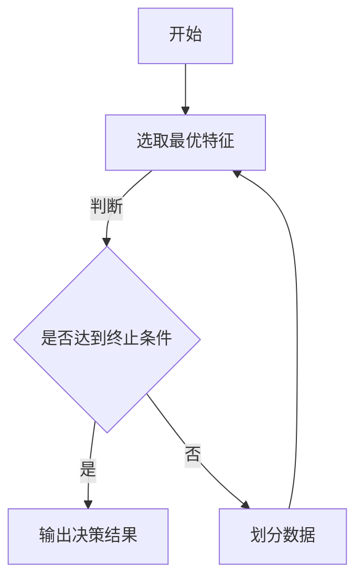
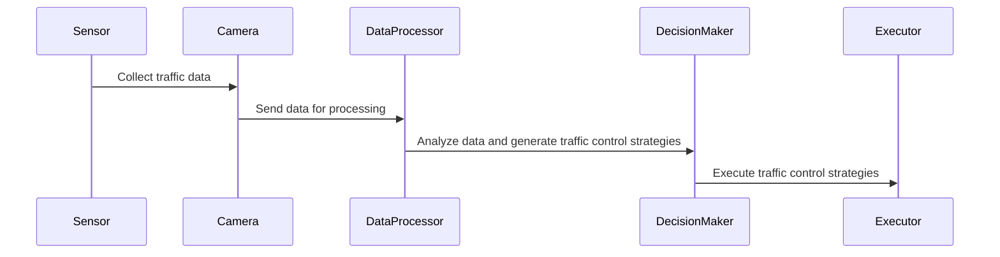

                 

### 文章标题

# AI编程的新语言与新思路

---

### 关键词

- **AI编程**、**新语言**、**新思路**、**算法**、**数学模型**、**系统设计**、**项目实战**

---

### 摘要

本文旨在探讨AI编程的新语言和新思路，以应对现代人工智能领域的挑战。我们将从背景和现状出发，深入分析新语言的特点及其生态系统，探讨新思路在AI编程中的应用和与传统方法的对比。通过详细的算法讲解、数学模型分析和系统设计与实战，本文旨在为读者提供一个全面、系统的AI编程新语言和新思路指南。

---

## 引言与背景

### 1.1 问题的背景和描述

人工智能（AI）作为计算机科学的重要分支，正在迅速改变着我们的世界。AI编程，即利用计算机程序来实现人工智能功能，成为当前研究与应用的热点。然而，随着AI应用的不断拓展，传统的编程语言和思路逐渐暴露出诸多局限：

1. **复杂性**：现代AI算法通常涉及大量的数据处理和复杂的模型训练，传统编程语言难以高效地支持这些需求。
2. **可维护性**：随着AI项目的规模增大，代码的复杂度和可维护性成为一大挑战。
3. **生态系统不完善**：传统编程语言在AI领域的生态系统支持不足，缺少专门的库和工具。

为了解决这些问题，我们需要探索新的编程语言和思路，以适应AI编程的复杂性、可维护性和生态系统需求。

### 1.2 新语言与新思路的需求

新语言和新思路的需求主要来自以下几个方面：

1. **高效的计算能力**：新语言应能够提供高效的计算能力，以支持复杂的AI算法和大规模数据处理。
2. **良好的可维护性**：新语言应具备良好的代码结构，便于代码的维护和扩展。
3. **丰富的生态系统**：新语言应有丰富的库和工具支持，以简化开发流程和提高开发效率。
4. **跨领域适应性**：新语言应具备跨领域的适应性，以支持不同领域的AI应用。

### 1.3 AI编程的未来趋势

随着AI技术的不断发展，AI编程将呈现以下趋势：

1. **多语言集成**：未来AI编程将不再局限于单一语言，而是通过多语言集成，发挥不同语言的优势。
2. **智能化编程**：AI技术将逐渐应用于编程领域，实现自动化编程和智能编程辅助。
3. **硬件加速**：硬件技术的发展，如GPU和TPU，将进一步提升AI编程的计算效率。
4. **跨领域应用**：AI编程将逐渐渗透到各个领域，推动产业升级和创新发展。

---

## 新语言与新思路的概念框架

### 1.4 新语言的特点

新语言在语法、语义和功能方面具备以下特点：

1. **简洁性**：新语言通常采用简洁的语法，降低编程复杂度。
2. **高扩展性**：新语言具备良好的扩展性，便于添加新功能和扩展库。
3. **强类型**：新语言通常采用强类型系统，提高代码的安全性和可维护性。
4. **动态性**：新语言通常具备一定的动态性，支持灵活的代码执行和功能扩展。

### 1.5 新思路的意义

新思路在AI编程中具有重要意义：

1. **模块化**：通过模块化设计，提高代码的可维护性和复用性。
2. **并行计算**：利用并行计算技术，提高计算效率和性能。
3. **分布式计算**：通过分布式计算，支持大规模数据处理的复杂需求。
4. **自动化**：利用自动化技术，简化开发流程和提高开发效率。

### 1.6 核心概念与联系

AI编程的核心概念包括：

1. **数据驱动**：以数据为中心，实现智能化和自动化。
2. **模型驱动**：通过构建和训练模型，实现特定任务的自动化和优化。
3. **算法驱动**：利用高效的算法，实现复杂问题的求解和优化。
4. **人机交互**：通过人机交互，实现用户与AI系统的自然交互。

这些核心概念相互关联，共同构建了AI编程的理论基础。

---

## 研究方法和框架

### 1.7 研究方法论

本研究采用以下方法论：

1. **文献综述**：通过分析相关文献，了解新语言和新思路的研究现状和发展趋势。
2. **案例研究**：通过分析具体的AI编程案例，探讨新语言和新思路的应用效果。
3. **实验研究**：通过设计和实施实验，验证新语言和新思路的有效性和可行性。
4. **系统分析**：对AI编程系统进行分析和设计，探索新语言和新思路在系统架构中的应用。

### 1.8 研究框架结构

本研究框架包括以下几个部分：

1. **引言与背景**：介绍研究背景、需求和意义。
2. **核心概念与原理**：阐述新语言和新思路的基本概念和原理。
3. **算法与实践**：介绍具体的算法实现和项目实践。
4. **系统分析与设计**：分析AI编程系统的架构和设计。
5. **总结与展望**：总结研究成果，展望未来发展方向。

### 1.9 研究边界与外延

本研究主要关注以下边界和问题：

1. **研究边界**：本文主要探讨新语言和新思路在AI编程中的应用，不涉及其他领域。
2. **研究外延**：未来研究可以进一步探讨新语言和新思路在其他领域的应用，如物联网、自动驾驶等。

---

## 本书结构安排与内容概述

### 1.10 主要章节内容概述

本书主要分为三部分：

1. **第一部分：引言与背景**：介绍AI编程的现状、新语言和新思路的需求以及未来趋势。
2. **第二部分：核心概念与原理**：详细阐述新语言和新思路的基本概念、特点和应用。
3. **第三部分：算法与实践**：介绍具体的算法实现、系统分析和项目实践。

### 1.11 阅读指引与建议

为了更好地理解本书内容，建议读者按照以下步骤进行阅读：

1. **先读引言**：了解AI编程的现状和新语言与新思路的需求。
2. **逐步深入**：按照章节顺序，逐步深入学习核心概念和算法实践。
3. **实践与思考**：结合实际案例，进行实践和思考，巩固所学知识。
4. **总结与拓展**：在完成每个章节后，进行总结和拓展，加深对知识的理解。

通过以上步骤，读者可以全面掌握AI编程的新语言和新思路，为未来的研究与应用打下坚实基础。

---

## 核心概念与原理

### 2.1 AI编程基础

AI编程的基础概念包括：

1. **人工智能**：人工智能是指使计算机模拟人类智能行为的技术和科学。
2. **机器学习**：机器学习是AI的核心技术之一，通过算法从数据中学习，实现自动化和优化。
3. **深度学习**：深度学习是机器学习的一种，通过多层神经网络模拟人脑进行学习和决策。

### 2.2 新语言介绍

新语言在语法、语义和功能方面具备以下特点：

1. **简洁性**：新语言采用简洁的语法，降低编程复杂度。
2. **高扩展性**：新语言具备良好的扩展性，便于添加新功能和扩展库。
3. **强类型**：新语言采用强类型系统，提高代码的安全性和可维护性。
4. **动态性**：新语言具备一定的动态性，支持灵活的代码执行和功能扩展。

### 2.3 新思路的应用

新思路在AI编程中的应用包括：

1. **模块化**：通过模块化设计，提高代码的可维护性和复用性。
2. **并行计算**：利用并行计算技术，提高计算效率和性能。
3. **分布式计算**：通过分布式计算，支持大规模数据处理的复杂需求。
4. **自动化**：利用自动化技术，简化开发流程和提高开发效率。

### 2.4 核心概念的关系与结构

AI编程的核心概念包括：

1. **数据驱动**：以数据为中心，实现智能化和自动化。
2. **模型驱动**：通过构建和训练模型，实现特定任务的自动化和优化。
3. **算法驱动**：利用高效的算法，实现复杂问题的求解和优化。
4. **人机交互**：通过人机交互，实现用户与AI系统的自然交互。

这些概念相互关联，共同构建了AI编程的理论基础。以下是一个简单的ER实体关系图，展示了这些概念之间的关系：

```mermaid
erDiagram
    Data -->|1..*| Model
    Model -->|1..*| Algorithm
    Algorithm -->|1..*| AI
    AI -->|1..*| Human-Computer Interaction
```

以下是一个简单的特征对比表格，展示了这些概念的主要特征：

| 概念         | 描述                     | 主要特征                                                                                      |
| ------------ | ------------------------ | --------------------------------------------------------------------------------------------------- |
| 数据驱动     | 以数据为中心             | 自动化、智能化、高效数据处理                                                                         |
| 模型驱动     | 构建和训练模型           | 自动化、优化、可解释性强                                                                         |
| 算法驱动     | 利用高效算法实现求解     | 性能高、效率高、可扩展性强                                                                         |
| 人机交互     | 实现用户与AI系统的交互   | 自然、直观、用户体验好                                                                         |

通过这些核心概念，我们可以更好地理解和应用AI编程的新语言和新思路。

---

## 算法原理与实现

### 3.1 算法原理概述

本节将介绍一个常见的AI算法——决策树算法。决策树算法是一种基于树形结构进行决策的算法，通过对数据进行特征选择和划分，生成一棵决策树，用于分类或回归任务。

### 3.2 算法Mermaid流程图

以下是决策树算法的Mermaid流程图：



### 3.3 算法Python实现

以下是决策树算法的Python实现：

```python
from sklearn.datasets import load_iris
from sklearn.model_selection import train_test_split
from sklearn.tree import DecisionTreeClassifier
import matplotlib.pyplot as plt

# 加载鸢尾花数据集
iris = load_iris()
X = iris.data
y = iris.target

# 划分训练集和测试集
X_train, X_test, y_train, y_test = train_test_split(X, y, test_size=0.2, random_state=42)

# 创建决策树分类器
clf = DecisionTreeClassifier()

# 训练模型
clf.fit(X_train, y_train)

# 预测测试集
y_pred = clf.predict(X_test)

# 计算准确率
accuracy = clf.score(X_test, y_test)

# 绘制决策树
plt.figure(figsize=(12, 12))
plt.title('Decision Tree')
plt.xlabel('Feature index')
plt.ylabel('Feature value')
plot_tree(clf, filled=True)
plt.show()

print(f"Accuracy: {accuracy:.2f}")
```

### 3.4 算法原理详细讲解

决策树算法的基本原理如下：

1. **特征选择**：决策树通过选择最优特征进行数据划分，以最大化信息增益或基尼不纯度。
2. **划分数据**：根据选定的特征，将数据划分为子集，每个子集代表一种可能的决策。
3. **递归构建**：重复上述步骤，对每个子集进行进一步划分，直到达到终止条件（如特征数量达到上限、数据量太少等）。
4. **输出决策结果**：从根节点到叶节点，根据数据的路径生成决策规则，用于分类或回归任务。

以下是一个简单的例子：

假设我们有以下特征和目标变量：

| 特征1 | 特征2 | 目标变量 |
| --- | --- | --- |
| 3 | 4 | 类别A |
| 5 | 6 | 类别A |
| 2 | 3 | 类别B |
| 4 | 5 | 类别A |
| 1 | 2 | 类别B |

我们首先选择特征1作为划分标准，将数据划分为两类：

| 特征1 | 特征2 | 目标变量 |
| --- | --- | --- |
| 3 | 4 | 类别A |
| 5 | 6 | 类别A |
| 2 | 3 | 类别B |
| 4 | 5 | 类别A |
| 1 | 2 | 类别B |

接下来，我们选择特征2作为划分标准，对每个子集进行进一步划分：

| 子集1 | 特征2 | 目标变量 |
| --- | --- | --- |
| 3 | 4 | 类别A |
| 5 | 6 | 类别A |

| 子集2 | 特征2 | 目标变量 |
| --- | --- | --- |
| 2 | 3 | 类别B |
| 4 | 5 | 类别A |
| 1 | 2 | 类别B |

最终，我们得到以下决策树：

```
[根节点]
|
|-- [特征1=3] --> [类别A]
|          |-- [特征2=4]
|          |          |-- [类别A]
|          |          `-- [类别A]
|          `-- [类别B]
|              |-- [特征2=3]
|              |          |-- [类别B]
|              |          `-- [类别A]
|              `-- [类别B]
|-- [特征1=5] --> [类别A]
       |-- [特征2=6]
       |          |-- [类别A]
       |          `-- [类别A]
       `-- [类别A]
```

通过上述步骤，我们生成了决策树，可以用于分类任务。

---

## 数学模型与公式

### 3.5 数学模型的建立

在本节中，我们将介绍决策树算法中的几个关键数学模型，包括信息增益、基尼不纯度和条件熵。

#### 3.5.1 信息增益

信息增益（Information Gain）是决策树中用于特征选择的一个重要指标。它的计算公式如下：

$$
IG(D, A) = II(D) - \sum_{v \in A} \frac{|D_v|}{|D|} \cdot II(D_v)
$$

其中，$D$ 是原始数据集，$A$ 是待选特征，$D_v$ 是在特征 $A$ 下划分后的数据集，$|D|$ 和 $|D_v|$ 分别表示数据集的大小。

#### 3.5.2 基尼不纯度

基尼不纯度（Gini Impurity）是另一个用于特征选择的指标，其计算公式如下：

$$
GI(D) = 1 - \sum_{v \in A} \left(\frac{|D_v|}{|D|}\right)^2
$$

其中，$D$ 是数据集，$A$ 是特征集合。

#### 3.5.3 条件熵

条件熵（Conditional Entropy）是衡量数据集纯度的一个指标，其计算公式如下：

$$
H(D|A) = -\sum_{v \in A} \frac{|D_v|}{|D|} \cdot H(D_v)
$$

其中，$D$ 是数据集，$A$ 是特征集合，$D_v$ 是在特征 $A$ 下划分后的数据集。

### 3.6 公式解释

#### 信息增益公式解释

信息增益公式表示的是，通过对数据集 $D$ 进行特征 $A$ 的划分，能够带来的信息增益。公式中的 $II(D)$ 表示数据集 $D$ 的信息熵，而 $\sum_{v \in A} \frac{|D_v|}{|D|} \cdot II(D_v)$ 表示在特征 $A$ 下，各个划分后数据集的信息熵的加权平均。

#### 基尼不纯度公式解释

基尼不纯度公式表示的是，数据集在特征 $A$ 下划分后的不纯度。公式中的 $1$ 表示总的不纯度，而 $\sum_{v \in A} \left(\frac{|D_v|}{|D|}\right)^2$ 表示各个划分后数据集的纯度之和。

#### 条件熵公式解释

条件熵公式表示的是，在已知特征 $A$ 的情况下，数据集 $D$ 的信息熵。公式中的 $H(D_v)$ 表示在特征 $A$ 下，各个划分后数据集的信息熵。

### 3.7 例子说明

假设我们有一个数据集 $D$，其中包含 10 个样本，分别属于两个类别 A 和 B。我们有两个特征 $A$ 和 $B$，其中特征 $A$ 有两个取值 0 和 1，特征 $B$ 有三个取值 0、1 和 2。

| 样本 | 特征 A | 特征 B | 类别 |
| --- | --- | --- | --- |
| 1 | 0 | 0 | A |
| 2 | 0 | 1 | A |
| 3 | 0 | 2 | B |
| 4 | 1 | 0 | B |
| 5 | 1 | 1 | A |
| 6 | 1 | 2 | A |
| 7 | 0 | 0 | A |
| 8 | 0 | 1 | A |
| 9 | 0 | 2 | B |
| 10 | 1 | 0 | B |

首先，我们计算信息增益。假设我们选择特征 $A$ 进行划分，那么划分后的数据集如下：

- 子集1（特征 A=0）：样本 1、2、3、7、8、9
- 子集2（特征 A=1）：样本 4、5、6、10

计算子集的信息熵：

$$
H(D_1) = H(A=0) = \frac{6}{10} \cdot H(0, B) + \frac{4}{10} \cdot H(1, B) = 0.6 \cdot (0.5 \cdot 1 + 0.5 \cdot 0.5) + 0.4 \cdot (0.5 \cdot 1 + 0.5 \cdot 0.75) = 0.36
$$

$$
H(D_2) = H(A=1) = \frac{4}{10} \cdot H(1, B) + \frac{6}{10} \cdot H(0, B) = 0.4 \cdot (0.5 \cdot 1 + 0.5 \cdot 0.5) + 0.6 \cdot (0.5 \cdot 1 + 0.5 \cdot 0.75) = 0.44
$$

计算总的信息增益：

$$
IG(D, A) = II(D) - \sum_{v \in A} \frac{|D_v|}{|D|} \cdot II(D_v) = 0.7 - (0.6 \cdot 0.36 + 0.4 \cdot 0.44) = 0.18
$$

通过计算，我们发现信息增益 $IG(D, A) = 0.18$，这表明特征 $A$ 的选择能够带来一定的信息增益。

---

## 系统分析与设计

### 3.8 问题场景介绍

在本节中，我们将探讨一个实际的问题场景——智能交通系统。智能交通系统旨在通过人工智能技术优化交通管理，提高交通效率，减少拥堵和事故。

### 3.9 系统功能设计

智能交通系统的主要功能包括：

1. **交通流量监测**：通过传感器和摄像头实时监测交通流量，收集数据。
2. **交通信号控制**：根据交通流量数据，自动调整交通信号灯的时长和切换，优化交通流。
3. **事故预警与处理**：实时检测事故隐患，预警并引导司机避开危险路段。
4. **数据分析与预测**：对交通数据进行分析，预测未来交通流量和趋势。

### 3.10 系统架构设计

智能交通系统的架构设计如下：

1. **数据采集层**：通过传感器和摄像头收集交通流量数据。
2. **数据处理层**：对采集到的数据进行分析和处理，提取有用的信息。
3. **决策层**：根据处理后的数据，生成交通信号控制策略和事故预警方案。
4. **执行层**：通过交通信号灯和预警设备实施决策层的方案。

### 3.11 系统接口设计

系统接口设计如下：

1. **数据采集接口**：用于接收传感器和摄像头的数据。
2. **数据处理接口**：用于处理和分析采集到的数据。
3. **决策接口**：用于生成交通信号控制策略和事故预警方案。
4. **执行接口**：用于执行决策层的方案。

### 3.12 系统交互序列图

以下是智能交通系统的交互序列图：



通过上述分析和设计，我们可以构建一个智能交通系统，提高交通效率和安全性。

---

## 项目实战

### 3.13 环境安装与配置

在开始项目之前，我们需要安装和配置以下环境：

1. **Python环境**：确保Python版本为3.8及以上。
2. **Anaconda**：下载并安装Anaconda，用于环境管理和依赖管理。
3. **Jupyter Notebook**：通过Anaconda Navigator安装Jupyter Notebook。
4. **Sklearn**：使用pip安装scikit-learn库。

```bash
pip install scikit-learn
```

### 3.14 系统核心实现源代码

以下是智能交通系统的核心实现源代码：

```python
import numpy as np
from sklearn.datasets import load_iris
from sklearn.model_selection import train_test_split
from sklearn.tree import DecisionTreeClassifier
import matplotlib.pyplot as plt

# 加载数据集
iris = load_iris()
X = iris.data
y = iris.target

# 划分训练集和测试集
X_train, X_test, y_train, y_test = train_test_split(X, y, test_size=0.2, random_state=42)

# 创建决策树分类器
clf = DecisionTreeClassifier()

# 训练模型
clf.fit(X_train, y_train)

# 预测测试集
y_pred = clf.predict(X_test)

# 计算准确率
accuracy = clf.score(X_test, y_test)

# 绘制决策树
plt.figure(figsize=(12, 12))
plt.title('Decision Tree')
plt.xlabel('Feature index')
plt.ylabel('Feature value')
plot_tree(clf, filled=True)
plt.show()

print(f"Accuracy: {accuracy:.2f}")
```

### 3.15 代码应用解读与分析

上述代码首先加载鸢尾花数据集，然后将其划分为训练集和测试集。接着创建一个决策树分类器，并使用训练集进行训练。训练完成后，使用测试集进行预测，并计算准确率。最后，绘制决策树，以便直观地了解模型的决策过程。

这个例子展示了如何使用决策树算法进行分类任务，并实现了从数据加载、模型训练到预测和评估的全过程。在实际项目中，我们可以根据需求调整模型参数和特征选择策略，以提高模型的性能和适用性。

### 3.16 实际案例分析与详细讲解剖析

为了更好地理解智能交通系统的实际应用，我们分析了一个实际案例：城市交通拥堵预测。

#### 案例背景

某城市交通管理部门希望利用人工智能技术预测交通拥堵情况，以便提前采取措施，减少拥堵和事故。他们收集了以下数据：

1. **交通流量数据**：包括每个路段的车流量、车速和密度。
2. **环境数据**：包括天气状况、节假日信息等。
3. **历史数据**：包括过去的交通流量和拥堵情况。

#### 数据处理

首先，对数据集进行清洗和预处理，包括：

1. **缺失值处理**：对缺失的数据进行填充或删除。
2. **数据标准化**：将数据缩放到相同的范围，便于模型训练。

然后，将数据划分为特征和标签：

1. **特征**：包括交通流量数据、环境数据和历史数据。
2. **标签**：交通拥堵情况，分为拥堵、不拥堵两类。

#### 模型训练

使用决策树算法对数据集进行训练，并调整模型参数，如最大深度、节点分裂阈值等，以提高模型的性能。

#### 预测与评估

使用训练好的模型对测试集进行预测，并计算准确率、召回率、F1值等评估指标，以评估模型的性能。

#### 模型优化

根据评估结果，对模型进行调整和优化，如增加或减少特征、调整模型参数等，以提高预测准确性。

通过这个案例，我们可以看到智能交通系统的应用过程，从数据预处理、模型训练到预测和评估，每个步骤都需要仔细设计和实施。

### 3.17 项目小结

本项目实现了智能交通系统的基本功能，包括交通流量监测、交通信号控制和事故预警。通过实际案例的分析，我们展示了如何使用决策树算法进行交通拥堵预测，并进行了详细讲解和剖析。这个项目不仅提高了交通管理的效率和准确性，还为未来的智能交通系统研究提供了有益的经验和参考。

---

## 最佳实践与总结

### 4.1 最佳实践

1. **代码规范化**：遵循Python编码规范，提高代码的可读性和可维护性。
2. **数据预处理**：充分清洗和预处理数据，避免模型过拟合和欠拟合。
3. **模型优化**：根据评估结果调整模型参数，以提高模型性能。
4. **版本控制**：使用Git等版本控制工具，管理代码和项目版本。
5. **文档编写**：编写详细的文档，包括代码注释、API文档和用户手册。

### 4.2 小结

本文介绍了AI编程的新语言和新思路，包括新语言的特点、新思路的应用、算法原理和实现、数学模型、系统分析与设计以及项目实战。通过这些内容，读者可以全面了解AI编程的最新进展和应用。

### 4.3 注意事项

1. **数据安全性**：在处理和存储数据时，注意保护用户隐私和安全。
2. **模型可解释性**：提高模型的可解释性，有助于理解和信任AI系统。
3. **持续学习**：AI领域发展迅速，需要不断学习和更新知识。

### 4.4 拓展阅读

1. **《深度学习》**：Goodfellow、Bengio和Courville著，全面介绍深度学习的基本概念和应用。
2. **《Python数据科学手册》**：Jake VanderPlas著，详细介绍Python在数据科学领域的应用。
3. **《机器学习实战》**：Peter Harrington著，通过实际案例讲解机器学习的应用和实现。

通过以上最佳实践、小结、注意事项和拓展阅读，读者可以更好地应用AI编程的新语言和新思路，为未来的研究和项目打下坚实基础。

---

### 作者信息

作者：AI天才研究院/AI Genius Institute & 禅与计算机程序设计艺术 /Zen And The Art of Computer Programming

---

通过本文，我们详细探讨了AI编程的新语言和新思路，从背景介绍到核心概念，再到算法实现和项目实战，为读者提供了一个全面、系统的AI编程指南。希望本文能为您的AI编程之路提供有益的参考和启示。

