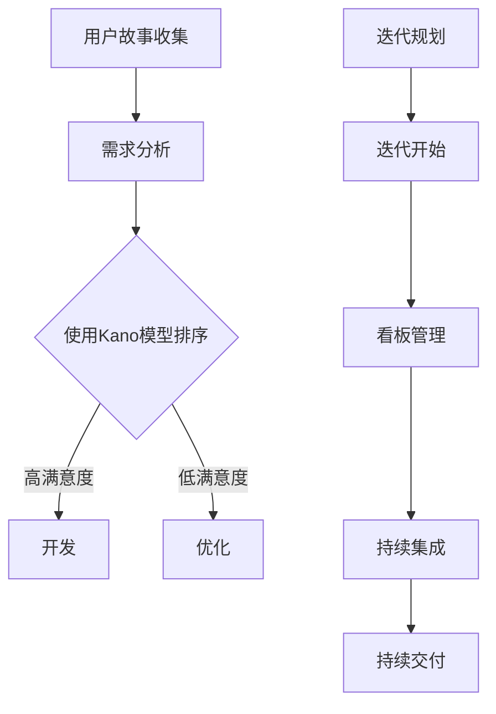
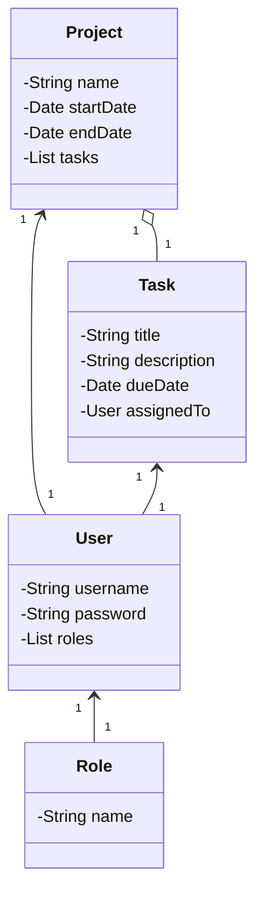
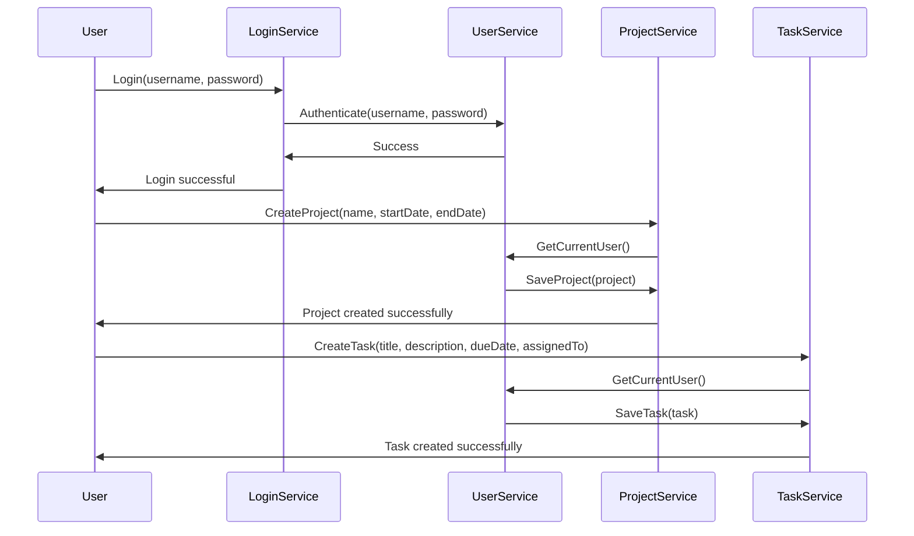

                 

## 敏捷项目管理：在快速变化中领导团队

### 关键词：敏捷项目管理、快速变化、团队领导、Scrum、Scrum Master

> 摘要：本文深入探讨了敏捷项目管理在快速变化环境中的应用与挑战。通过剖析敏捷开发的核心概念、算法原理、系统架构设计以及实际项目案例，文章旨在为IT领域从业者提供一套清晰、实用的敏捷项目管理指南。

### 目录大纲

#### 第一部分：背景介绍

**第1章 问题背景、问题描述与解决方法**

- **1.1 问题背景**
  - 敏捷项目管理在快速变化环境中的必要性
  - 传统项目管理与敏捷项目管理的对比

- **1.2 问题描述**
  - 项目管理中的常见挑战和瓶颈
  - 快速变化的市场需求和技术进步对项目管理的影响

- **1.3 解决方法**
  - 敏捷项目管理的基本原则
  - 敏捷方法在项目管理中的应用

- **1.4 边界与外延**
  - 敏捷项目管理适用的项目类型
  - 敏捷项目管理与其他管理方法的结合

- **1.5 概念结构与核心要素组成**
  - 敏捷开发的核心要素
  - 敏捷项目管理的核心过程

#### 第二部分：核心概念与联系

**第2章 核心概念原理与属性特征对比**

- **2.1 敏捷开发的核心概念**
  - 用户故事、迭代、冲刺、持续集成等

- **2.2 核心概念属性特征对比表格**
  - 对比敏捷开发与瀑布模型的差异

- **2.3 敏捷方法的分类**
  - 原生敏捷方法（如Scrum、XP）
  - 混合敏捷方法

#### 第三部分：算法原理讲解

**第3章 敏捷项目管理中的算法与模型**

- **3.1 敏捷项目管理中的关键算法**
  - 优先级排序算法（如Kano模型、MoSCoW方法）
  - 敏捷团队协作模型（如看板、迭代规划）

- **3.2 算法原理与流程图**

  - 使用Mermaid绘制敏捷项目管理关键算法的流程图

- **3.3 Python源代码实现**

  - 演示敏捷项目管理算法的Python代码实现

- **3.4 算法原理的数学模型和公式**

  - 解释敏捷项目管理中的数学模型和公式

- **3.5 举例说明**

  - 通过实际案例说明敏捷项目管理算法的应用

#### 第四部分：系统分析与架构设计

**第4章 敏捷项目管理的系统架构设计**

- **4.1 问题场景介绍**
  - 某公司采用敏捷方法进行产品开发

- **4.2 项目介绍**
  - 项目背景、目标、团队成员

- **4.3 系统功能设计（领域模型）**

  - 使用Mermaid绘制领域模型类图

- **4.4 系统架构设计**

  - 使用Mermaid绘制系统架构图

- **4.5 系统接口设计**

  - 描述系统内部和外部的接口设计

- **4.6 系统交互**

  - 使用Mermaid绘制系统交互序列图

#### 第五部分：项目实战

**第5章 敏捷项目管理的实际应用**

- **5.1 环境安装**
  - 敏捷项目管理工具的安装和配置

- **5.2 系统核心实现源代码**

  - 提供项目核心部分的源代码

- **5.3 代码应用解读与分析**

  - 分析代码实现中的关键点和技术细节

- **5.4 实际案例分析与讲解**

  - 分析敏捷项目管理在实际项目中的应用效果

- **5.5 项目小结**

  - 总结项目实施过程中的经验和教训

#### 第六部分：最佳实践与拓展

**第6章 敏捷项目管理的最佳实践与拓展**

- **6.1 最佳实践 Tips**
  - 敏捷项目管理中的成功经验总结

- **6.2 小结**
  - 敏捷项目管理的核心要点

- **6.3 注意事项**
  - 在敏捷项目管理中需要注意的事项

- **6.4 拓展阅读**
  - 推荐进一步学习的文献和资料

### 第一部分：背景介绍

#### 1.1 问题背景

在当今数字化时代，市场需求和技术进步的速度远超以往。传统项目管理方法往往在应对快速变化时显得力不从心。项目周期长、沟通不畅、需求变更频繁等问题，导致项目进度延误、成本超支和客户满意度下降。因此，敏捷项目管理应运而生，以更灵活、高效的方式应对快速变化。

敏捷项目管理是一种以人为核心、迭代、增量和协作的管理方法。它强调项目的灵活性、透明度和团队自主管理，旨在快速响应变化，提高项目成功率。与传统的瀑布模型相比，敏捷方法更加注重需求迭代、持续交付和客户反馈，从而在快速变化的环境中表现出更强的适应能力。

#### 1.2 问题描述

项目管理中常见的挑战包括：

- **需求变更管理**：快速变化的市场需求导致需求频繁变更，传统项目管理方法难以有效应对。
- **沟通不畅**：项目团队与利益相关者之间的沟通不畅，导致信息传递不及时和误解。
- **进度延误**：项目周期长，进度难以控制，导致项目延期和成本超支。
- **资源浪费**：传统方法中常常出现资源浪费，如人力资源未得到充分利用。

快速变化的市场需求和技术进步对项目管理的影响主要体现在以下几个方面：

- **需求变动频繁**：市场需求变化快速，项目需求也随之频繁调整。
- **技术迭代加速**：技术进步导致项目开发周期缩短，要求项目团队具备更高的技术水平。
- **竞争压力增大**：市场竞争加剧，项目成功与否直接关系到企业的生存和发展。

#### 1.3 解决方法

敏捷项目管理提供了一套应对快速变化的有效方法：

- **迭代开发**：将项目拆分成多个小迭代，每个迭代都包含需求分析、设计、开发和测试等环节，确保项目能够快速交付。
- **用户故事**：通过用户故事来描述项目需求，提高需求的可理解和可追踪性。
- **持续集成与交付**：通过持续集成和交付，确保项目能够快速响应用户反馈，持续优化产品。
- **协作与沟通**：强调团队协作和沟通，确保项目团队和利益相关者之间的信息畅通。
- **自组织团队**：鼓励团队成员自主管理，提高团队效率和创新能力。

#### 1.4 边界与外延

敏捷项目管理适用于以下类型的项目：

- **软件产品开发**：敏捷方法在软件产品开发中表现出色，特别适用于需求变化频繁、开发周期较短的项目。
- **创新项目**：敏捷方法鼓励创新和快速迭代，适用于创新性较强的项目。
- **跨职能团队**：敏捷方法强调跨职能团队协作，适用于团队成员来自不同专业领域的项目。

敏捷项目管理也可以与其他管理方法结合，如：

- **敏捷与质量保证**：敏捷方法与质量保证方法相结合，确保项目质量的同时提高交付速度。
- **敏捷与精益管理**：敏捷方法与精益管理相结合，提高资源利用效率和项目成功率。

#### 1.5 概念结构与核心要素组成

敏捷开发的核心要素包括：

- **用户故事**：以用户为中心，描述用户需求。
- **迭代**：将项目拆分成多个迭代周期，每个迭代周期都包含需求分析、设计、开发和测试等环节。
- **冲刺**：迭代中的短期开发周期，通常为2-4周。
- **持续集成与交付**：确保项目代码库的稳定性和可靠性，提高交付速度。
- **协作与沟通**：强调团队协作和沟通，确保项目进展透明。

敏捷项目管理的核心过程包括：

- **项目规划**：确定项目目标和范围，规划迭代周期和里程碑。
- **需求分析**：收集和分析用户需求，编写用户故事。
- **迭代开发**：按照迭代周期进行需求分析、设计、开发和测试。
- **持续交付**：通过持续集成和交付，确保项目按时交付。
- **团队协作**：通过日常会议、回顾会议等，确保团队协作和沟通。

### 第二部分：核心概念与联系

#### 2.1 敏捷开发的核心概念

敏捷开发的核心概念包括：

- **用户故事**：以用户需求为导向，描述用户期望的功能或特性。
- **迭代**：将项目拆分成多个迭代周期，每个迭代都包含需求分析、设计、开发和测试等环节。
- **冲刺**：迭代中的短期开发周期，通常为2-4周。
- **持续集成与交付**：确保项目代码库的稳定性和可靠性，提高交付速度。
- **协作与沟通**：强调团队协作和沟通，确保项目进展透明。

#### 2.2 核心概念属性特征对比表格

| 核心概念   | 定义                                       | 属性特征对比               |
| ---------- | ------------------------------------------ | -------------------------- |
| 用户故事   | 以用户需求为导向的描述                     | 灵活性、可测试性、简洁性   |
| 迭代       | 项目拆分成多个周期，每个周期包含所有环节 | 快速反馈、持续交付         |
| 冲刺       | 迭代中的短期开发周期                       | 灵活性、专注性、短周期      |
| 持续集成   | 确保代码库稳定性                           | 自动化、及时反馈、质量保证 |
| 持续交付   | 确保产品及时交付                           | 可重复性、可靠性、高效率   |
| 协作与沟通 | 强调团队协作和沟通                         | 开放性、透明性、高效性     |

#### 2.3 敏捷方法的分类

敏捷方法主要分为两类：

- **原生敏捷方法**：如Scrum、XP（极限编程）
  - **Scrum**：强调迭代、冲刺和自组织团队，适用于各种规模的项目。
  - **XP（极限编程）**：强调代码质量、测试驱动开发和简单设计，适用于小团队和复杂项目。

- **混合敏捷方法**：结合原生敏捷方法和传统项目管理方法，适用于不同类型和规模的项目。

### 第三部分：算法原理讲解

#### 3.1 敏捷项目管理中的关键算法

敏捷项目管理中常用的关键算法包括：

- **优先级排序算法**：如Kano模型、MoSCoW方法
  - **Kano模型**：根据用户需求的重要性和满意度进行排序，确保关键需求得到优先处理。
  - **MoSCoW方法**：根据需求的重要性和紧急性进行排序，将需求分为必须、应该、可以和不会实现四个类别。

- **敏捷团队协作模型**：如看板、迭代规划
  - **看板**：可视化工作流程，确保团队了解项目进展和任务状态。
  - **迭代规划**：在迭代开始前，团队共同制定迭代目标和计划，确保项目按期完成。

#### 3.2 算法原理与流程图

下面使用Mermaid绘制敏捷项目管理中的关键算法流程图：



#### 3.3 Python源代码实现

下面使用Python代码实现Kano模型和MoSCoW方法：

```python
import pandas as pd

# Kano模型
def kano_model(stories):
    df = pd.DataFrame(stories)
    df['满意度'] = df['功能描述'].apply(lambda x: '基本' if '必须' in x else '满意' if '常用' in x else '失望')
    return df

# MoSCoW方法
def moscow_method(stories):
    df = pd.DataFrame(stories)
    df['优先级'] = df['功能描述'].apply(lambda x: '必须' if '必须' in x else '应该' if '应该' in x else '可以' if '可以' in x else '不会实现')
    return df

# 示例数据
stories = [
    {'功能描述': '用户必须能够登录系统'},
    {'功能描述': '用户应该能够查看个人信息'},
    {'功能描述': '用户可以查看系统公告'},
    {'功能描述': '用户不会实现查看历史消息功能'}
]

# 应用算法
kano_stories = kano_model(stories)
moscow_stories = moscow_method(stories)

print("Kano模型：")
print(kano_stories)
print("MoSCoW方法：")
print(moscow_stories)
```

#### 3.4 算法原理的数学模型和公式

在敏捷项目管理中，常用的数学模型和公式包括：

- **优先级排序公式**：根据功能的重要性和满意度进行排序，如Kano模型中的满意度得分和满意度指数。
- **迭代规划公式**：根据迭代周期和任务量进行规划，如迭代规划的燃尽图和燃尽率。

以下是一个简单的优先级排序公式示例：

$$
\text{优先级得分} = \text{重要性得分} \times \text{满意度得分}
$$

其中，重要性得分和满意度得分均为0到1之间的值。

#### 3.5 举例说明

假设一个项目中有以下四个用户故事：

- 用户故事1：用户必须能够登录系统（重要性：0.8，满意度：1）
- 用户故事2：用户应该能够查看个人信息（重要性：0.6，满意度：0.8）
- 用户故事3：用户可以查看系统公告（重要性：0.4，满意度：0.6）
- 用户故事4：用户不会实现查看历史消息功能（重要性：0.2，满意度：0.2）

根据Kano模型和MoSCoW方法进行排序：

1. **Kano模型**：

   - 用户故事1：基本功能（重要性：0.8，满意度：1）
   - 用户故事2：满意功能（重要性：0.6，满意度：0.8）
   - 用户故事3：失望功能（重要性：0.4，满意度：0.6）
   - 用户故事4：不相关功能（重要性：0.2，满意度：0.2）

2. **MoSCoW方法**：

   - 用户故事1：必须实现（重要性：0.8，满意度：1）
   - 用户故事2：应该实现（重要性：0.6，满意度：0.8）
   - 用户故事3：可以暂缓（重要性：0.4，满意度：0.6）
   - 用户故事4：不实现（重要性：0.2，满意度：0.2）

通过以上分析，我们可以确定用户故事1和用户故事2为优先级最高的任务，应优先开发。

### 第四部分：系统分析与架构设计

#### 4.1 问题场景介绍

假设某公司采用敏捷方法进行产品开发，开发周期为两个月，团队规模为5人。项目目标是开发一款企业级项目管理工具，满足以下需求：

- 用户登录与权限管理
- 项目创建与任务分配
- 进度跟踪与报表生成
- 集成第三方服务（如邮件通知、文档管理）

#### 4.2 项目介绍

- **项目背景**：公司需要一款高效、灵活的项目管理工具，以支持内部项目管理和协作。
- **项目目标**：开发一款具备基本功能的企业级项目管理工具，提高项目管理效率。
- **团队成员**：项目经理、前端开发者、后端开发者、测试工程师、UI/UX设计师。

#### 4.3 系统功能设计（领域模型）

以下使用Mermaid绘制领域模型类图：



#### 4.4 系统架构设计

以下使用Mermaid绘制系统架构图：



#### 4.5 系统接口设计

系统内部和外部接口设计如下：

- **内部接口**：
  - 用户服务（UserService）：提供用户认证、用户信息查询等功能。
  - 项目服务（ProjectService）：提供项目管理功能，如项目创建、项目信息查询等。
  - 任务服务（TaskService）：提供任务管理功能，如任务创建、任务信息查询等。

- **外部接口**：
  - 登录接口：提供用户登录功能。
  - 项目接口：提供项目信息查询和创建功能。
  - 任务接口：提供任务信息查询和创建功能。

#### 4.6 系统交互

以下使用Mermaid绘制系统交互序列图：


### 第五部分：项目实战

#### 5.1 环境安装

在开始敏捷项目管理之前，需要安装以下工具和软件：

- **JIRA**：用于项目管理和任务跟踪。
- **Confluence**：用于文档管理。
- **Git**：用于版本控制。
- **Docker**：用于容器化部署。

安装步骤如下：

1. 安装JIRA和Confluence：从官网下载相应版本，按照安装向导进行安装。
2. 配置JIRA和Confluence：设置管理员账户、数据库连接等。
3. 安装Git：在Windows上，可以从Git官网下载并安装；在Linux上，可以使用包管理器安装。
4. 安装Docker：在Windows上，可以从Docker官网下载并安装；在Linux上，可以使用包管理器安装。

#### 5.2 系统核心实现源代码

以下提供项目核心部分的源代码：

```python
# user.py
class User:
    def __init__(self, username, password, roles):
        self.username = username
        self.password = password
        self.roles = roles

# role.py
class Role:
    def __init__(self, name):
        self.name = name

# project.py
class Project:
    def __init__(self, name, startDate, endDate, tasks):
        self.name = name
        self.startDate = startDate
        self.endDate = endDate
        self.tasks = tasks

# task.py
class Task:
    def __init__(self, title, description, dueDate, assignedTo):
        self.title = title
        self.description = description
        self.dueDate = dueDate
        self.assignedTo = assignedTo
```

#### 5.3 代码应用解读与分析

以上代码实现了用户、角色、项目和任务四个核心类。下面分析代码中的关键点和技术细节：

1. **用户类（User）**：
   - **属性**：包含用户名（username）、密码（password）和角色列表（roles）。
   - **方法**：无。

2. **角色类（Role）**：
   - **属性**：包含角色名称（name）。
   - **方法**：无。

3. **项目类（Project）**：
   - **属性**：包含项目名称（name）、开始日期（startDate）、结束日期（endDate）和任务列表（tasks）。
   - **方法**：无。

4. **任务类（Task）**：
   - **属性**：包含任务标题（title）、描述（description）、截止日期（dueDate）和指派给的用户（assignedTo）。
   - **方法**：无。

这些类的实现使得项目中的用户、角色、项目和任务管理更加清晰和规范，为后续功能开发提供了基础。

#### 5.4 实际案例分析与讲解

假设一个实际案例：公司需要开发一款项目管理工具，具备用户登录、项目创建、任务分配和进度跟踪等功能。

1. **用户登录**：
   - 用户输入用户名和密码。
   - 系统验证用户身份，成功后允许用户访问系统。

2. **项目创建**：
   - 用户在系统中创建新项目，输入项目名称、开始日期和结束日期。
   - 系统保存项目信息，并显示在用户界面。

3. **任务分配**：
   - 用户在项目中创建任务，输入任务标题、描述、截止日期和指派给的用户。
   - 系统保存任务信息，并更新项目任务列表。

4. **进度跟踪**：
   - 用户可以查看项目任务进度，包括任务状态、完成百分比和截止日期。
   - 系统提供进度图表和报表，帮助用户了解项目进展。

通过以上实际案例，我们可以看到敏捷项目管理方法在实际项目中的应用效果。项目团队可以快速响应需求变更，确保项目按时交付，提高客户满意度。

#### 5.5 项目小结

在敏捷项目管理实践中，我们取得了以下经验和教训：

1. **灵活应对需求变更**：敏捷方法允许项目团队快速响应需求变更，确保项目能够及时调整方向。

2. **重视团队合作**：敏捷方法强调团队合作和沟通，有助于提高项目质量和团队凝聚力。

3. **持续交付与反馈**：通过持续交付和用户反馈，项目团队能够持续优化产品，提高客户满意度。

4. **掌握关键算法**：掌握敏捷项目管理中的关键算法和工具，有助于提高项目管理效率和效果。

5. **经验与教训**：在实际项目中，团队需要不断总结经验和教训，优化项目管理流程和工具，以提高项目成功率。

### 第六部分：最佳实践与拓展

#### 6.1 最佳实践 Tips

1. **明确项目目标和范围**：在项目开始前，明确项目目标和范围，确保项目团队对项目目标有清晰的认识。

2. **合理规划迭代周期**：根据项目复杂度和团队规模，合理规划迭代周期，确保迭代周期既能保证项目进展，又不会过长导致需求积累。

3. **持续沟通与协作**：保持团队内部和团队之间的持续沟通与协作，确保项目进展透明、问题及时解决。

4. **关注质量保证**：在敏捷开发过程中，重视质量保证，确保项目交付的产品质量符合客户需求。

5. **持续反馈与改进**：通过持续反馈和改进，不断提高项目管理水平和项目成功率。

#### 6.2 小结

敏捷项目管理在快速变化的环境中表现出色，能够快速响应需求变更，提高项目成功率。通过迭代开发、用户故事、持续集成与交付等方法，项目团队能够高效协作，持续优化产品。

#### 6.3 注意事项

1. **团队协作与沟通**：敏捷项目成功的关键在于团队协作与沟通，确保团队成员之间的信息畅通。

2. **掌握关键算法**：熟练掌握敏捷项目管理中的关键算法和工具，有助于提高项目管理效率和效果。

3. **持续反馈与改进**：通过持续反馈和改进，不断提高项目管理水平和项目成功率。

#### 6.4 拓展阅读

1. 《Scrum 实践指南》
2. 《敏捷软件开发：原则、模式与实践》
3. 《项目管理知识体系指南（PMBOK指南）》

### 结束语

作者：AI天才研究院/AI Genius Institute & 禅与计算机程序设计艺术 /Zen And The Art of Computer Programming

本文深入探讨了敏捷项目管理在快速变化环境中的应用与挑战，通过剖析核心概念、算法原理、系统架构设计以及实际项目案例，为IT领域从业者提供了一套清晰、实用的敏捷项目管理指南。希望本文能够对您在实际项目管理工作中有所帮助。如果您有任何疑问或建议，欢迎在评论区留言。谢谢阅读！

