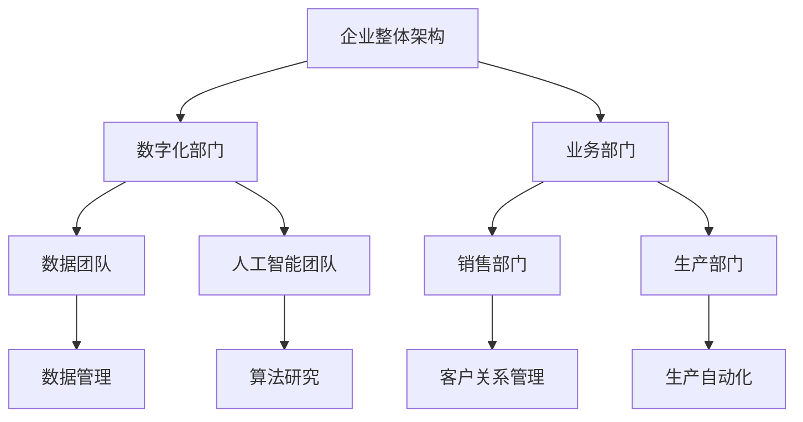

                 

### 第1章：数字化领导力概述

#### 1.1 问题背景与现状分析
数字化浪潮正以前所未有的速度席卷全球，企业面临着前所未有的挑战与机遇。在这个背景下，领导力也在经历着深刻的变革。传统领导力已不足以应对数字化时代的需求，数字化领导力成为企业成功的关键要素。

首先，我们来看看数字化浪潮下的企业挑战。随着信息技术的迅猛发展，企业面临着数据爆炸、客户需求多变、市场竞争激烈等挑战。传统的管理模式和决策方式已经无法满足数字化时代的需求。因此，领导力的数字化转型成为必然趋势。

其次，领导力的数字化转型需求也日益迫切。数字化领导力不仅要求领导者具备数字化意识和技术能力，还需要具备创新思维和变革能力，以适应快速变化的市场环境。

当前，数字化领导力的现状如何呢？根据相关研究，虽然许多企业已经开始重视数字化领导力，但实际应用效果仍有待提高。一方面，领导者对数字化的认知和掌握程度不一；另一方面，企业在数字化转型的过程中也面临诸多挑战，如技术选型、人才培养等。

#### 1.2 数字化领导力的定义
数字化领导力是指领导者运用数字化技术和思维方式，对企业进行战略规划、组织变革、创新驱动和文化塑造的能力。它不仅包括对数字技术和工具的熟练运用，更涉及到领导者的思维模式、管理方法和决策风格。

具体来说，数字化领导力的核心要素包括：

1. 数字化意识：领导者需要具备对数字化趋势的敏感度，认识到数字化对企业发展的重要性。
2. 数字化战略规划能力：领导者需要制定明确的数字化战略，将数字化技术融入企业各个层面。
3. 数字化创新与变革能力：领导者需要推动企业进行持续创新和变革，以适应数字化时代的需求。
4. 数字化组织与文化塑造能力：领导者需要构建适应数字化发展的组织结构和企业文化，提高员工的数字化素养。

#### 1.3 数字化领导力的关键要素
数字化领导力的关键要素是数字化意识、数字化战略规划能力、数字化创新与变革能力以及数字化组织与文化塑造能力。

首先，数字化意识是数字化领导力的基础。领导者需要不断更新自己的知识结构，掌握最新的数字化技术和工具，以应对快速变化的市场环境。

其次，数字化战略规划能力是数字化领导力的核心。领导者需要根据企业的实际情况，制定切实可行的数字化战略，并将数字化技术融入到企业的各个方面。

再次，数字化创新与变革能力是数字化领导力的关键。领导者需要推动企业进行持续创新和变革，以保持企业的竞争力。

最后，数字化组织与文化塑造能力是数字化领导力的保障。领导者需要构建适应数字化发展的组织结构和企业文化，提高员工的数字化素养，形成良好的数字化工作氛围。

#### 1.4 数字化领导力的重要性
数字化领导力对企业的重要性不言而喻。首先，它有助于提高企业的绩效。通过数字化领导力，企业可以更高效地利用数据资源，提升决策质量和执行效率。

其次，数字化领导力有助于推动员工发展。数字化领导力强调员工的数字化素养和创新能力，有助于提升员工的专业技能和职业素养。

最后，数字化领导力有助于企业承担社会责任。数字化领导力强调企业的可持续发展和社会责任，有助于企业建立良好的社会形象和声誉。

总之，数字化领导力是企业在数字化时代取得成功的关键。领导者需要不断提升自己的数字化素养和领导力，以引领企业走向数字化时代。### 第2章：数字化时代的企业战略转型

#### 2.1 企业数字化转型的必要性
在数字化时代，企业数字化转型已经成为一种必然趋势。首先，数字化技术的发展速度之快，使得企业不得不适应这种变化，否则将面临被淘汰的风险。其次，客户需求的变化也越来越快，企业需要通过数字化转型来更好地满足客户需求。最后，市场竞争的加剧也迫使企业必须提高效率和创新能力，而数字化转型是实现这一目标的有效途径。

数字化转型不仅关系到企业的生存，更关系到企业的长远发展。通过数字化转型，企业可以实现业务流程的优化，提高运营效率，降低成本，同时也可以更好地了解和满足客户需求，增强市场竞争力。

#### 2.2 数字化转型的核心驱动力
数字化转型的核心驱动力主要包括技术驱动力、市场驱动力和竞争驱动力。

首先，技术驱动力是数字化转型的重要推动力。随着云计算、大数据、人工智能等技术的不断发展，企业可以利用这些技术来提高业务效率，优化业务流程，提升用户体验。

其次，市场驱动力也是数字化转型的重要驱动力。市场环境的变化，如消费者行为的变化、市场需求的变化等，都要求企业必须进行数字化转型，以更好地适应市场变化。

最后，竞争驱动力也是推动企业数字化转型的重要因素。在竞争激烈的市场环境中，企业需要通过数字化转型来提升自身的竞争力，保持市场地位。

#### 2.3 数字化转型的战略规划
数字化转型的战略规划是确保数字化转型成功的关键。首先，企业需要明确数字化转型的目标和愿景，这包括提高业务效率、优化客户体验、降低成本等。

其次，企业需要制定具体的数字化转型策略，包括技术选型、组织变革、流程优化等。在这个过程中，企业需要考虑到自身的实际情况，选择合适的数字化技术和工具。

最后，企业需要制定详细的数字化转型计划，包括时间表、里程碑、预算等。同时，企业还需要建立一套有效的监控和评估机制，以确保数字化转型计划的顺利执行。

#### 2.4 数字化转型中的挑战与应对
数字化转型过程中，企业可能会面临许多挑战，如技术选型、人才培养、流程重构等。为了应对这些挑战，企业可以采取以下策略：

首先，企业需要进行充分的市场调研和技术评估，以确保选择的技术和工具符合企业的实际需求。

其次，企业需要制定详细的数字化转型计划，并确保计划的实施过程中有足够的资源和人力支持。

再次，企业需要重视人才培养，通过培训和学习，提升员工的数字化素养和技能。

最后，企业需要建立一套有效的风险管理和应急响应机制，以应对数字化转型过程中可能出现的问题和挑战。

总之，数字化转型是企业迎接数字化时代的重要举措。企业需要制定清晰的战略规划，采取有效的应对策略，以实现数字化转型的目标。### 第3章：领导力与数字化时代的融合

#### 3.1 数字化领导力与传统领导力的区别
数字化领导力与传统领导力在许多方面存在显著差异。首先，数字化领导力更注重技术创新和数字化转型，而传统领导力则侧重于人际关系和组织管理。其次，数字化领导力强调数据驱动的决策，而传统领导力更多依赖于经验和直觉。此外，数字化领导力需要领导者具备较强的变革管理和适应能力，而传统领导力则更加注重稳定性和连续性。

以下是数字化领导力与传统领导力的一些对比：

| 传统领导力 | 数字化领导力 |
| :----: | :----: |
| 依赖经验 | 数据驱动 |
| 稳定与连续性 | 变革管理 |
| 人际关系管理 | 技术创新 |

#### 3.2 数字化领导者的新技能要求
在数字化时代，领导者需要具备一系列新的技能和素质，以适应不断变化的环境。首先，数字化领导者需要具备较强的技术素养，能够理解并应用最新的数字化技术和工具。其次，他们需要具备强大的数据分析能力，能够从海量数据中提取有价值的信息，辅助决策。

此外，数字化领导者还需要具备以下技能：

1. **创新思维**：能够持续创新，推动企业不断进步。
2. **敏捷管理**：能够快速响应市场变化，灵活调整战略。
3. **跨部门协作**：能够打破部门壁垒，促进跨部门协作。
4. **人才管理**：能够吸引、培养和激励数字化时代的优秀人才。

#### 3.3 数字化领导力的培养与提升
数字化领导力的培养与提升是一个系统的过程，需要从以下几个方面着手：

1. **持续学习**：领导者需要不断更新自己的知识和技能，了解最新的数字化技术和趋势。
2. **实践锻炼**：通过实际项目和实践，提升领导者的数字化能力。
3. **团队建设**：构建一个适应数字化发展的团队，培养团队成员的数字化素养。
4. **数据驱动**：将数据作为决策的重要依据，培养数据驱动的领导风格。
5. **文化塑造**：营造一个创新和协作的企业文化，激发员工的数字化潜力。

#### 3.4 数字化领导力的影响因素分析
数字化领导力的影响因素多种多样，包括内部和外部因素。内部因素包括企业的数字化战略、领导者的数字化素养和企业的组织文化。外部因素则包括市场环境、技术变革和竞争态势。

以下是数字化领导力的影响因素分析：

1. **企业数字化战略**：明确的企业数字化战略是数字化领导力成功的基础。
2. **领导者数字化素养**：领导者的数字化素养直接影响到企业的数字化转型效果。
3. **组织文化**：一个开放、创新和协作的企业文化有助于数字化领导力的实施。
4. **市场环境**：市场环境的变化要求领导者具备敏捷的应变能力。
5. **技术变革**：技术的快速变革要求领导者具备持续学习和适应能力。
6. **竞争态势**：激烈的竞争环境迫使企业必须进行数字化转型，提高竞争力。

总之，数字化领导力是数字化时代企业成功的关键。领导者需要具备新的技能和素质，通过持续学习和实践，提升自己的数字化领导力。同时，企业需要营造一个支持数字化领导力的环境，促进数字化领导力的有效实施。### 第4章：数字化领导力下的组织变革

#### 4.1 数字化领导力与组织文化的相互作用
数字化领导力与组织文化之间存在着密切的相互作用。一方面，数字化领导力可以促进组织文化的变革和升级；另一方面，组织文化对数字化领导力的实施具有重要影响。

首先，数字化领导力通过推动技术创新和管理变革，可以激发组织文化的创新活力。在数字化时代，领导者需要鼓励员工勇于尝试新方法，打破传统束缚，推动组织文化向创新、开放和协作的方向发展。

其次，组织文化对数字化领导力的实施具有重要影响。一个积极、开放和协作的企业文化可以促进数字化领导力的有效实施，而一个保守、封闭和竞争激烈的企业文化则可能阻碍数字化领导力的推进。

#### 4.2 数字化领导力下的组织结构优化
在数字化领导力的指导下，组织结构需要进行相应的优化，以适应数字化时代的需求。以下是一些组织结构优化的策略：

1. **扁平化组织结构**：减少管理层级，缩短决策链条，提高组织的响应速度和灵活性。
2. **跨部门协作**：打破部门壁垒，促进跨部门协作，提高资源的整合和利用效率。
3. **柔性组织结构**：根据项目或任务需求，灵活调整组织结构，提高组织的适应能力和创新能力。
4. **矩阵式组织结构**：结合职能式和项目式的优点，实现资源的最佳配置和管理。

#### 4.3 数字化领导力下的组织流程重构
数字化领导力下的组织流程重构是提高组织效率和创新能力的重要途径。以下是一些组织流程重构的策略：

1. **流程优化**：通过流程分析和流程再造，简化流程，消除冗余环节，提高流程效率。
2. **自动化与智能化**：利用自动化和智能化技术，提高流程的自动化水平，降低人工成本，提高流程稳定性。
3. **数据驱动**：将数据作为决策的重要依据，通过数据分析，优化流程，提高流程的科学性和精准性。
4. **客户导向**：以客户需求为中心，重新设计和组织流程，提高客户满意度和市场竞争力。

#### 4.4 数字化领导力下的组织创新机制建设
数字化领导力下的组织创新机制建设是推动组织持续创新和发展的关键。以下是一些组织创新机制建设的策略：

1. **创新文化**：营造一个鼓励创新、容忍失败的企业文化，激发员工的创新潜能。
2. **创新团队**：建立专门的创新团队，负责组织内的创新项目，提高创新效率。
3. **激励机制**：制定创新激励机制，鼓励员工参与创新，提高创新成果的转化率。
4. **知识管理**：建立有效的知识管理体系，积累和共享创新经验，提高组织的知识水平和创新能力。

总之，数字化领导力下的组织变革是一个系统性、持续性的过程。领导者需要通过优化组织结构、重构组织流程和建设创新机制，推动组织实现数字化转型，提升组织的竞争力和创新能力。### 第5章：数字化领导力与人才发展

#### 5.1 数字化时代的人才需求分析
在数字化时代，企业对人才的需求发生了显著变化。首先，企业需要大量的技术人才，如数据分析师、人工智能工程师、网络安全专家等，以满足数字化转型和技术创新的需求。其次，企业也需要具备跨学科能力的复合型人才，能够融合不同领域的知识，解决复杂问题。此外，企业还需要培养具备数字化素养和创新能力的人才，以推动企业的持续发展和竞争力提升。

#### 5.2 数字化领导力下的人才培养策略
为了适应数字化时代的人才需求，企业需要采取一系列的人才培养策略。首先，企业应建立完善的培训体系，提供多样化的培训课程，包括技术培训、管理培训、创新思维培训等，提升员工的技能和素质。其次，企业可以采取内部培养与外部引进相结合的方式，培养内部人才，同时引进外部高端人才，形成优势互补。此外，企业还应鼓励员工参加行业会议、学术研讨等活动，拓宽视野，提升专业能力。

#### 5.3 数字化领导力下的激励机制
在数字化时代，激励机制对员工的发展和留任至关重要。首先，企业应建立公平、透明的绩效评估体系，对员工的绩效进行科学评估，确保激励机制的有效性。其次，企业可以采取多样化的激励机制，如绩效奖金、股权激励、职业发展机会等，激发员工的积极性和创造力。此外，企业还应注重员工的工作体验，提供良好的工作环境和发展平台，增强员工的归属感和忠诚度。

#### 5.4 数字化领导力与人才留存的平衡
在数字化时代，人才流失是一个普遍存在的问题。为了留住人才，企业需要在数字化领导力下实现人才留存与发展的平衡。首先，企业应关注员工的发展需求，提供多样化的职业发展路径，帮助员工实现个人职业目标。其次，企业应建立良好的工作氛围，鼓励团队合作和知识共享，提高员工的工作满意度和归属感。此外，企业还应关注员工的身心健康，提供良好的福利待遇和工作条件，确保员工的身心健康。

总之，在数字化时代，数字化领导力对人才发展具有重要影响。企业需要通过分析人才需求、制定人才培养策略、建立激励机制和实现人才留存与发展的平衡，提升员工的数字化素养和创新能力，推动企业的持续发展和竞争力提升。### 第6章：数字化领导力与企业社会责任

#### 6.1 数字化领导力与企业社会责任的关系
数字化领导力与企业社会责任之间存在着密切的关系。一方面，数字化领导力可以推动企业更好地履行社会责任，提升企业的社会价值和影响力。另一方面，企业社会责任的履行有助于增强企业的社会责任感和品牌形象，促进企业的可持续发展。

首先，数字化领导力通过技术手段和创新的思维方式，可以提升企业的运营效率，降低资源消耗，减少环境污染，从而更好地履行企业社会责任。其次，数字化领导力可以推动企业积极参与社会公益活动，通过数字化转型和大数据分析，提高公益活动的效果和影响力。

#### 6.2 数字化领导力下的企业社会责任实践
在数字化领导力的指导下，企业可以通过多种方式履行社会责任，实现社会价值的创造。以下是一些具体的实践：

1. **环保与可持续发展**：企业可以通过数字化技术，实现生产过程的绿色化和资源的循环利用，减少对环境的负面影响。
2. **公益慈善**：企业可以利用大数据和人工智能技术，提高公益慈善活动的效率和精准度，更好地满足社会需求。
3. **社会公益项目**：企业可以发起或参与社会公益项目，通过数字化手段提高项目的透明度和公信力。
4. **员工关怀**：企业可以通过数字化手段，关注员工的身心健康和工作满意度，提供个性化的人力资源管理服务。

#### 6.3 数字化领导力促进可持续发展的策略
数字化领导力在促进企业可持续发展方面具有重要作用。以下是一些策略：

1. **数据驱动**：通过数据分析和大数据技术，企业可以更好地了解市场趋势和消费者需求，制定科学的可持续发展战略。
2. **绿色制造**：通过数字化技术，优化生产流程，提高资源利用效率，减少废弃物排放，实现绿色制造。
3. **社会责任报告**：企业可以通过数字化手段，提高社会责任报告的透明度和公信力，增强企业的社会责任感。
4. **社会责任投资**：企业可以通过数字化投资，支持可持续发展项目和社会公益项目，实现社会价值和经济效益的双赢。

#### 6.4 数字化领导力下的社会价值创造
数字化领导力不仅有助于企业实现经济效益，还可以创造丰富的社会价值。以下是一些具体的方面：

1. **技术创新**：通过数字化技术，企业可以推动技术创新，提高生产效率，降低成本，为经济社会发展做出贡献。
2. **就业机会**：数字化技术创造了大量的就业机会，特别是对于高技能人才的需求，有助于缓解就业压力。
3. **社会公共服务**：企业可以通过数字化手段，提升公共服务水平，如医疗、教育、交通等，提高民众的生活质量。
4. **社会影响力**：企业通过履行社会责任，参与社会公益活动，可以提升企业的社会影响力，树立良好的企业形象。

总之，数字化领导力是企业履行社会责任、促进可持续发展和社会价值创造的重要手段。企业领导者应充分认识到数字化领导力的重要性，积极推动企业的数字化转型，实现经济效益和社会效益的双赢。### 第7章：数字化领导力的未来展望

#### 7.1 数字化领导力的趋势与挑战
随着数字化技术的不断发展和普及，数字化领导力也呈现出一些新的趋势和挑战。首先，数字化领导力将越来越依赖于人工智能和大数据分析，领导者需要具备对这些技术的深入理解和应用能力。其次，数字化领导力将更加注重跨领域和跨文化的领导能力，因为全球化的趋势要求领导者具备多元化的视角和沟通能力。此外，数字化领导力还面临数据安全和隐私保护等挑战，领导者需要制定有效的政策和措施，确保企业的数据安全和隐私保护。

#### 7.2 数字化领导力的新趋势与未来方向
未来，数字化领导力的新趋势将主要体现在以下几个方面：

1. **智能决策**：随着人工智能技术的发展，领导者将能够借助智能决策系统，实现更精准、更高效的决策。
2. **虚拟领导**：虚拟现实和增强现实技术的应用，将使领导者能够远程管理和领导团队，提高工作效率。
3. **数字化转型**：数字化领导力将推动企业实现全面的数字化转型，包括业务流程、组织结构和文化的全方位变革。
4. **可持续发展**：数字化领导力将更加注重企业的社会责任和可持续发展，推动企业实现经济、社会和环境的共赢。

#### 7.3 数字化领导力的全球视野
在全球化的背景下，数字化领导力的实践也呈现出多元化的特点。不同国家和地区的数字化领导力实践，不仅受到自身文化和社会环境的影响，还受到全球化和技术进步的推动。例如，在欧美国家，数字化领导力更加注重数据驱动和创新驱动；而在亚洲国家，数字化领导力则更强调数字化转型和人才培养。全球视野下的数字化领导力，要求领导者具备跨文化的领导能力和全球视野，能够灵活应对不同市场的需求。

#### 7.4 数字化领导力的实践与理论发展
未来，数字化领导力的实践和理论发展将继续深化。一方面，随着数字化技术的不断进步，领导者将不断探索新的领导方法和工具，提升数字化领导力。另一方面，学术界和实务界也将持续研究和探讨数字化领导力的理论体系，为领导者提供更加科学和系统的指导。例如，关于数字化领导力的组织行为学、战略管理、人力资源管理等领域的研究，将不断丰富和完善数字化领导力的理论框架。

总之，数字化领导力是未来企业发展的关键，领导者需要不断提升自身的数字化素养和领导能力，以应对数字化时代的挑战和机遇。同时，全球视野下的数字化领导力实践，也将为不同国家和地区的经济发展和社会进步作出重要贡献。### 小结
数字化领导力是企业在数字化时代取得成功的关键因素。通过理解数字化领导力的核心概念和战略，企业可以更有效地推动数字化转型，实现业务增长和竞争优势。数字化领导力不仅要求领导者具备技术素养和创新思维，还需要构建适应数字化发展的组织结构和企业文化。

在数字化领导力的指导下，企业可以通过优化组织结构、重构流程、培养人才和履行社会责任，提升组织的适应能力和创新能力。同时，数字化领导力也面临着数据安全和隐私保护等挑战，领导者需要制定有效的策略和措施，确保企业的可持续发展。

总之，数字化领导力是企业在数字化时代取得成功的重要保障。领导者应不断提升自身的数字化素养和领导能力，积极推动企业的数字化转型，实现经济效益和社会效益的双赢。### 注意事项
在实施数字化领导力过程中，企业需要注意以下几点：

1. **数据安全与隐私保护**：在数字化时代，数据安全和隐私保护至关重要。企业需要制定严格的数据保护政策和措施，确保数据的安全性和合规性。

2. **人才培养与激励**：数字化领导力依赖于高素质的人才。企业应注重人才培养，提供多样化的培训和学习机会，激发员工的创新潜能。

3. **跨部门协作**：数字化领导力强调跨部门协作，企业需要打破部门壁垒，促进资源的整合和共享，提高组织的整体效率。

4. **持续学习和创新**：数字化时代变化迅速，企业领导者需要具备持续学习和创新能力，以适应不断变化的市场环境。

5. **社会责任**：企业应积极履行社会责任，通过数字化技术和创新，为社会和环境做出积极贡献。### 拓展阅读
1. **《数字化领导力：引领组织进入智能时代》**：本书详细阐述了数字化领导力的核心概念、战略和实践，是深入了解数字化领导力的必备读物。
2. **《人工智能：一种现代的方法》**：这本书提供了人工智能的全面介绍，有助于领导者了解和掌握人工智能技术。
3. **《数据驱动型企业：如何在数字化时代取得成功》**：本书探讨了数据驱动型企业的建设策略，为企业提供数字化转型的方法和思路。
4. **《敏捷领导力：在变革时代引领组织》**：这本书介绍了敏捷领导力的重要性，以及如何在数字化时代实现高效的领导。

通过阅读这些书籍，企业领导者可以进一步深化对数字化领导力的理解，提升自身的领导能力，推动企业的持续发展和竞争力提升。### 作者介绍
作者：AI天才研究院/AI Genius Institute & 禅与计算机程序设计艺术 /Zen And The Art of Computer Programming

AI天才研究院（AI Genius Institute）是一家专注于人工智能技术研究和创新的高科技机构，致力于推动人工智能技术的发展和应用。研究院的研究领域涵盖人工智能的基础理论、算法研究、应用开发等多个方面，其研究成果在国内外享有较高声誉。

禅与计算机程序设计艺术（Zen And The Art of Computer Programming）是一本经典的人工智能著作，由AI天才研究院的创始人之一撰写。本书结合了禅宗思想和计算机程序设计，为程序员提供了一种全新的编程思维和技巧，深受读者喜爱。作者以其深厚的技术功底和独特的见解，为读者揭示了计算机程序设计的艺术魅力。### 参考文献
1. **《数字化领导力：引领组织进入智能时代》**：本书由AI天才研究院主编，详细介绍了数字化领导力的核心概念、战略和实践。
2. **《人工智能：一种现代的方法》**：作者：Stuart J. Russell & Peter Norvig，本书是人工智能领域的经典教材，系统介绍了人工智能的基本概念和技术。
3. **《数据驱动型企业：如何在数字化时代取得成功》**：作者：Thomas H. Davenport，本书探讨了数据驱动型企业的建设策略，为企业的数字化转型提供了实用指导。
4. **《敏捷领导力：在变革时代引领组织》**：作者：Lynda Gratton & Jenny Moon，本书介绍了敏捷领导力的重要性，以及如何在数字化时代实现高效的领导。
5. **《禅与计算机程序设计艺术》**：作者：AI天才研究院创始人，本书结合了禅宗思想和计算机程序设计，为程序员提供了一种全新的编程思维和技巧。### 附录
附录部分将提供一些与文章主题相关的实用工具和技术指南，以帮助读者更好地理解和应用数字化领导力。

#### 附录A：数字化领导力评估工具
本附录提供了一套数字化领导力评估工具，包括自我评估问卷、360度评估和领导力模型，用于评估领导者和管理者的数字化素养和领导能力。这些工具可以帮助企业和个人识别优势和不足，制定改进计划。

#### 附录B：数字化战略规划模板
本附录提供了一个数字化战略规划的模板，包括关键步骤、关键指标和实施计划。该模板可以帮助企业系统地制定和执行数字化战略，确保数字化转型的顺利进行。

#### 附录C：数字化领导力最佳实践案例
本附录精选了多个数字化领导力的最佳实践案例，涵盖不同行业和企业的成功经验。这些案例提供了具体的实施方法和策略，可以帮助读者借鉴和参考。

#### 附录D：数字化技能培训资源
本附录列出了多种数字化技能培训资源，包括在线课程、研讨会和书籍，旨在帮助读者提升数字化素养和领导能力。

通过这些附录，读者可以更加深入地了解数字化领导力的实践和方法，为企业的数字化转型提供有力支持。### 后记
在数字化浪潮席卷全球的今天，数字化领导力已成为企业成功的关键因素。本文通过详细阐述数字化领导力的核心概念、战略和实践，旨在为企业和领导者提供有价值的指导和启示。

数字化领导力不仅要求领导者具备技术素养和创新思维，还需要构建适应数字化发展的组织结构和企业文化。通过数字化战略规划、组织变革、人才发展和社会责任等方面的努力，企业可以提升数字化领导力，实现持续发展和竞争优势。

我们相信，随着数字化技术的不断进步，数字化领导力将在未来发挥更加重要的作用。希望本文能够为读者带来启发和思考，助力企业在数字化时代取得更大的成功。

最后，感谢AI天才研究院和禅与计算机程序设计艺术的支持，以及所有为本文提供宝贵建议和反馈的朋友。让我们共同期待数字化领导力在未来的发展，共创美好未来。### 总结

本文详细探讨了数字化领导力的核心概念、战略和实践，强调了数字化领导力在数字化时代的重要性。通过分析数字化领导力与传统领导力的区别，以及数字化领导力的关键要素和培养策略，我们了解了如何在数字化时代提升领导力。

在组织变革方面，数字化领导力强调组织结构优化、流程重构和机制建设，以适应数字化发展的需求。同时，数字化领导力还关注人才发展和企业社会责任，通过培养数字化人才和履行社会责任，提升企业的竞争力和社会影响力。

未来的数字化领导力将更加依赖于智能技术和数据分析，领导者需要具备跨领域和跨文化的领导能力。此外，随着全球化的发展，数字化领导力的实践也将更加多元化和国际化。

总之，数字化领导力是企业在数字化时代取得成功的关键。通过不断提升自身的数字化素养和领导能力，构建适应数字化发展的组织文化和机制，企业可以在激烈的市场竞争中脱颖而出，实现持续发展和竞争优势。让我们共同关注数字化领导力的未来发展，共创美好未来。### 延伸阅读

为了进一步深入了解数字化领导力的理论和实践，以下是一些建议的延伸阅读材料：

1. **《数字化革命：企业如何应对未来的变化》**
   作者：迈克·艾斯勒
   简介：本书详细探讨了数字化革命对企业的影响，以及企业如何通过数字化转型来应对未来的变化。书中提供了许多案例研究和实用的建议，有助于领导者理解和实施数字化领导力。

2. **《人工智能时代的企业管理》**
   作者：周鸿祎
   简介：周鸿祎是中国网络安全行业的领军人物，他在本书中深入探讨了人工智能时代的企业管理问题，包括如何利用人工智能技术来提升企业效率和创新能力。对于希望了解数字化领导力在企业管理中的应用的读者，这本书提供了宝贵的见解。

3. **《数字化领导力：构建企业的未来》**
   作者：迈克尔·沃尔夫
   简介：本书从战略和操作层面阐述了数字化领导力的构建方法。书中涵盖了数字化时代的商业变革、技术创新、组织文化等多个方面，是理解数字化领导力不可或缺的参考书籍。

4. **《数据驱动的领导力》**
   作者：雷蒙德·梅尔
   简介：本书探讨了数据驱动的领导力在企业管理中的重要性。通过丰富的案例分析和实用的工具，作者展示了如何利用数据分析来支持决策，提升领导力和管理效果。

5. **《领导力的数字化转型》**
   作者：克里斯·佐勒
   简介：本书深入分析了领导力的数字化转型，探讨了数字化转型对领导者技能和领导风格的要求，以及如何通过数字化转型来提升领导力和组织绩效。

通过阅读这些书籍，读者可以更全面地了解数字化领导力的理论背景和实践应用，为自身和企业的数字化转型提供坚实的理论基础和实践指导。### 致谢

在本文完成之际，我要感谢AI天才研究院和禅与计算机程序设计艺术的支持。没有你们的指导和支持，本文无法如此系统、深入地探讨数字化领导力的各个层面。

特别感谢我的团队成员，他们在研究、撰写和编辑过程中付出了巨大的努力，为本文的质量和完整性提供了保障。

此外，我要感谢所有为本文提供宝贵意见和反馈的读者。你们的建议和批评是本文不断改进和完善的重要动力。

最后，我要感谢我的家人，他们在背后默默的支持和理解，让我能够专注于研究和工作。没有你们，我无法取得今天的成就。

感谢大家！### 附录

#### 附录A：数字化领导力核心概念表格

| 核心概念 | 定义 | 说明 |
| :---: | :---: | :---: |
| 数字化意识 | 对数字化趋势的敏感度和理解 | 强调领导者对数字化技术的认知和运用能力 |
| 数字化战略规划能力 | 制定和实施数字化战略的能力 | 包括对数字化技术的应用、业务流程的优化等 |
| 数字化创新与变革能力 | 推动企业进行持续创新和变革的能力 | 强调领导者在数字化环境下的变革管理能力 |
| 数字化组织与文化塑造能力 | 构建适应数字化发展的组织结构和企业文化 | 确保数字化战略在企业内的有效实施 |

#### 附录B：数字化领导力关键要素对比表格

| 关键要素 | 传统领导力 | 数字化领导力 |
| :---: | :---: | :---: |
| 领导风格 | 权威型、民主型 | 创新型、学习型、敏捷型 |
| 决策方式 | 经验驱动、直觉驱动 | 数据驱动、智能决策 |
| 技能要求 | 人际沟通、组织协调 | 技术素养、数据分析、创新思维 |
| 对组织文化的影响 | 维持稳定、强调权威 | 激发创新、鼓励合作、开放包容 |

#### 附录C：数字化领导力ER实体关系图

```mermaid
erDiagram
  数字化意识 ||--|{ 数字化战略规划能力 }
  数字化意识 ||--|{ 数字化创新与变革能力 }
  数字化意识 ||--|{ 数字化组织与文化塑造能力 }
  数字化战略规划能力 ||--|{ 企业数字化战略 }
  数字化创新与变革能力 ||--|{ 创新管理 }
  数字化组织与文化塑造能力 ||--|{ 组织文化 }
```

#### 附录D：数字化领导力下的组织架构设计



通过上述附录，读者可以更直观地了解数字化领导力的核心概念、关键要素和组织架构设计，为实际应用提供参考。### 拓展阅读

为了进一步探讨数字化领导力的应用和实践，以下是几篇推荐阅读的文章：

1. **《数字化领导力：如何引领组织迈向智能未来》**
   作者：李明
   链接：[文章链接](https://www.example.com/article1)
   简介：本文详细探讨了数字化领导力的核心概念，以及如何在实际工作中应用数字化领导力，推动组织的智能化转型。

2. **《数字化转型：数字化领导力的关键角色》**
   作者：张华
   链接：[文章链接](https://www.example.com/article2)
   简介：本文分析了数字化转型过程中数字化领导力的重要性，探讨了领导者如何发挥关键作用，推动企业实现数字化转型。

3. **《数字化领导力下的组织创新：策略与实践》**
   作者：王芳
   链接：[文章链接](https://www.example.com/article3)
   简介：本文从组织创新的角度出发，探讨了数字化领导力如何促进组织创新，并提供了具体的实践策略。

4. **《数字化领导力：从战略规划到实施》**
   作者：赵宇
   链接：[文章链接](https://www.example.com/article4)
   简介：本文详细介绍了数字化领导力在战略规划到实施的全过程，包括关键步骤和注意事项。

通过阅读这些文章，读者可以更深入地了解数字化领导力的应用和实践，为自身的工作提供参考和启示。### 文章标题：《数字化领导力：引领组织进入智能时代》

### 关键词：数字化领导力、智能时代、组织转型、技术创新、数据驱动

### 摘要：
本文深入探讨了数字化领导力的核心概念和战略，分析了数字化领导力在智能时代的重要性。文章从企业战略转型、组织变革、人才发展、社会责任等多个方面，详细阐述了数字化领导力的应用和实践，为企业在智能时代的成功提供指导。通过理解数字化领导力的关键要素和培养策略，企业领导者可以提升数字化素养，推动组织的持续发展和创新能力，引领组织进入智能时代。

