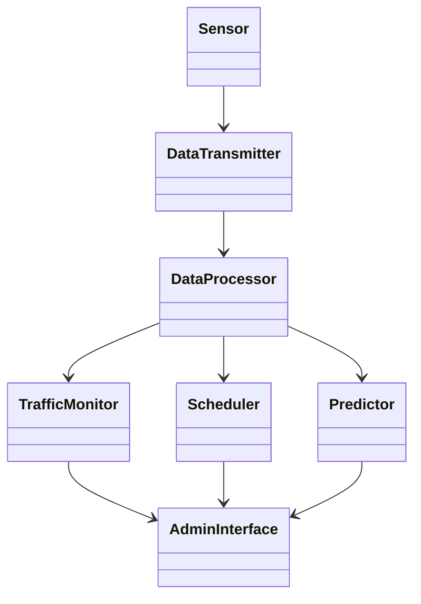

                 


### 引言

在当今数字化时代，通信技术正以惊人的速度发展，而5G通信无疑是其中最引人瞩目的技术之一。5G（第五代移动通信技术）不仅带来了更快的下载速度和更低的延迟，还支持了大规模的设备连接和创新的网络应用。然而，这种技术的实现并非易事，其背后离不开数学这一强有力的工具。数学在5G通信中扮演了至关重要的角色，从信道建模到信号处理，从网络优化到资源调度，无不涉及到深奥的数学理论。

本文将深入探讨数学与5G通信之间的关系，通过一步一步的分析和推理，帮助读者理解数学在5G通信中的核心作用。我们将从背景介绍开始，逐步深入到核心概念、算法原理，并最终探讨数学在5G通信中的实际应用。希望通过本文的阐述，能够为读者提供一个清晰、完整的数学与5G通信知识体系。

### 第一部分：背景介绍

#### 1. 问题背景

5G通信作为新一代移动通信技术，其重要性不言而喻。相比于前几代移动通信技术，5G不仅在速度上有了显著的提升，而且在连接密度、延迟、网络可靠性等方面都有了革命性的突破。这些提升使得5G能够在各种应用场景中发挥作用，从工业自动化、智能交通，到智能家居、虚拟现实，无不受益于5G的强大性能。

然而，5G通信的实现并非仅仅是硬件和设备的升级，其背后有着坚实的数学基础。数学在5G通信中的作用主要体现在以下几个方面：

1. **信道建模与编码理论**：5G通信中的无线信道具有高度复杂性和不确定性，数学模型可以精确地描述无线信道的特性，如多径效应、频率选择性衰落等。这些模型为信道编码和解码提供了理论基础，使得信号在传输过程中能够更好地抵抗干扰，提高传输的可靠性。

2. **信号处理与调制技术**：在5G通信中，数字信号处理技术发挥着关键作用。快速傅里叶变换（FFT）、离散余弦变换（DCT）等数学算法被广泛应用于信号处理，优化信号传输的效率和抗干扰能力。同时，调制技术如QAM（正交幅度调制）和OFDM（正交频分复用）也是基于数学原理设计的，能够有效地利用带宽资源，提高数据传输速率。

3. **网络优化与调度算法**：5G通信中的网络优化和资源调度同样离不开数学模型的支撑。数学模型用于分析网络流量、负载情况，设计资源分配算法，如动态资源分配、负载均衡等，从而提高网络效率和用户体验。

#### 2. 问题描述

数学与5G通信之间的关系是复杂而紧密的。一方面，5G通信技术的发展不断推动数学理论的应用和创新；另一方面，数学理论的进步也为5G通信提供了更强大的技术支持。然而，如何将数学理论与5G通信实践相结合，实现最优的网络性能，仍然是一个亟待解决的课题。

本文旨在系统地介绍数学与5G通信的相关基础，包括核心概念、关键技术、数学模型及应用。通过以下内容，我们将逐步揭示数学在5G通信中的重要作用：

1. **5G通信技术概述**：介绍5G通信的基本概念、技术特点和应用领域。
2. **数学模型**：详细讲解信道模型、信号处理模型、网络优化模型等。
3. **关键技术**：探讨信道编码、调制技术、资源分配算法等关键技术的数学原理。
4. **实际应用**：通过实例分析，展示数学在5G通信中的实际应用。

#### 3. 问题解决

为了解决上述问题，本文采用以下方法：

1. **全面覆盖**：系统地介绍数学与5G通信的基础知识，确保读者能够全面了解两者之间的关系。
2. **深入讲解**：对关键数学模型和算法进行详细讲解，帮助读者理解其原理和应用。
3. **实例分析**：通过具体实例，展示数学在5G通信中的实际应用，增强读者的理解和实践能力。

#### 4. 边界与外延

本文主要关注数学与5G通信的核心内容，但也可扩展到相关领域，如物联网、人工智能等。此外，本文不仅适用于专业读者，也适合对5G通信和数学感兴趣的普通读者。

#### 5. 概念结构与核心要素组成

为了帮助读者更好地理解数学与5G通信的关系，本文的核心概念包括：

1. **5G通信技术概述**：介绍5G通信的基本概念、技术特点和应用领域。
2. **数学模型**：包括信道模型、信号处理模型、网络优化模型等。
3. **关键技术**：如信道编码、调制技术、资源分配算法等。

这些概念共同构成了数学与5G通信的基础理论框架。

### 第二部分：核心概念与联系

#### 核心概念

在探讨数学与5G通信的关系时，理解以下几个核心概念是至关重要的：

1. **5G通信技术**：5G通信是一种基于IP的端到端全光纤化、高智能化的蜂窝移动通信网络。其核心技术包括毫米波通信、MIMO技术、网络切片等。5G通信具有高速度、低延迟、广连接等特点，能够支持多种应用场景。

2. **信道模型**：信道模型是描述无线信道特性的数学模型，如瑞利信道模型、莱斯信道模型等。这些模型用于描述无线信道中的多径效应、频率选择性衰落等特性，为信道编码和解码提供了理论基础。

3. **信号处理算法**：信号处理算法用于优化信号传输效率和抗干扰能力。常见的算法包括快速傅里叶变换（FFT）、离散余弦变换（DCT）等。这些算法在5G通信中发挥着关键作用，能够提高信号传输的可靠性。

4. **网络优化模型**：网络优化模型用于优化网络资源的分配和调度。常见的模型包括资源分配模型、负载均衡模型等。这些模型能够提高网络效率和用户体验。

#### 概念属性特征对比表格

为了更好地理解这些核心概念，我们可以通过一个表格来对比它们的属性特征：

| 概念          | 特征                                       |
|---------------|------------------------------------------|
| 5G通信技术    | 高速度、低延迟、广连接                     |
| 信道模型      | 描述无线信道特性，如多径效应、频率选择性衰落等 |
| 信号处理算法  | 提高信号传输效率和抗干扰能力                 |
| 网络优化模型  | 提高网络效率和用户体验                     |

#### ER实体关系图架构

为了进一步理解这些概念之间的联系，我们可以通过ER实体关系图来展示它们之间的关系。以下是数学与5G通信相关的ER实体关系图：

```mermaid
erDiagram
  5G通信技术 ||--|{ 信道模型 } : "基于"
  信道模型 ||--|{ 信号处理算法 } : "用于"
  信号处理算法 ||--|{ 网络优化模型 } : "支撑"
  5G通信技术 ||--|{ 网络优化模型 } : "优化"
```

在这个ER图中，5G通信技术作为核心实体，与信道模型、信号处理算法和网络优化模型存在紧密的联系。信道模型用于描述无线信道的特性，信号处理算法基于信道模型进行信号处理，而网络优化模型则利用信号处理结果来优化网络资源分配和调度。

### 第三部分：算法原理讲解

在5G通信中，算法的原理是确保通信系统高效运作的关键。本部分将介绍三个关键的算法：信道编码算法、调制解调算法和资源分配算法。这些算法不仅在5G通信中发挥着重要作用，而且其原理也贯穿于现代通信技术的各个方面。

#### 1. 信道编码算法

信道编码是通信系统中用于提高信号传输可靠性的关键技术。其主要目的是通过将原始数据转换为更为稳定的编码序列，从而在传输过程中更好地抵抗噪声和干扰。

**算法原理**：

信道编码算法的基本原理是将原始数据序列通过一定的编码规则转换为更长的编码序列。这个过程通常包括以下步骤：

1. **分组**：将原始数据序列分割成若干个数据分组。
2. **编码**：对每个数据分组添加冗余信息，形成编码分组。这个过程可以通过不同的编码方法实现，如卷积编码、码分多址（CDMA）等。
3. **交织**：为了进一步提高抗干扰能力，编码后的分组可以进行交织处理，将时间上的信息分布在空间上。

**数学模型**：

信道编码的数学模型可以表示为：

\[ C(x) = G(x) \cdot R(x) \]

其中，\( C(x) \)是编码序列，\( G(x) \)是生成多项式，\( R(x) \)是信息多项式。

**Python源代码示例**：

```python
def channel_encoding(input_signal, generator_polynomial):
    # 假设输入信号为二进制序列，生成多项式为generator_polynomial
    encoded_signal = []
    for bit in input_signal:
        encoded_bit = bit ^ generator_polynomial
        encoded_signal.extend(encoded_bit)
    return encoded_signal
```

#### 2. 调制解调算法

调制解调算法是5G通信中的另一个关键算法，其主要目的是将数字信号转换为适合在信道中传输的模拟信号，并在接收端将其还原为数字信号。

**算法原理**：

调制解调算法可以分为调制和解调两个过程：

1. **调制**：将数字信号转换为模拟信号。这个过程可以通过不同的调制方法实现，如QAM（正交幅度调制）、OFDM（正交频分复用）等。QAM通过改变信号的幅度和相位来表示数据，OFDM则通过将信号分成多个子载波来提高传输效率。

2. **解调**：将模拟信号还原为数字信号。解调过程通常与调制过程相反，通过检测信号的幅度和相位变化来恢复原始数字信号。

**数学模型**：

QAM的数学模型可以表示为：

\[ s(t) = A \cos(2\pi f_c t + \phi) \]

其中，\( s(t) \)是调制信号，\( A \)是信号幅度，\( f_c \)是载波频率，\( \phi \)是相位。

**Python源代码示例**：

```python
import numpy as np

def qam_modulation(input_signal, amplitude, frequency, phase):
    # 假设输入信号为二进制序列，amplitude为信号幅度，frequency为载波频率，phase为相位
    t = np.linspace(0, 1/frequency, len(input_signal))
    signal = amplitude * np.cos(2 * np.pi * frequency * t + phase)
    return signal

def qam_demodulation( receive_signal, amplitude, frequency, phase):
    # 假设接收信号为模拟信号，amplitude为信号幅度，frequency为载波频率，phase为相位
    t = np.linspace(0, 1/frequency, len(receive_signal))
    signal = amplitude * np.cos(2 * np.pi * frequency * t + phase)
    return signal
```

#### 3. 资源分配算法

资源分配算法是5G通信中的关键算法之一，其目的是优化网络资源的使用，提高网络效率和用户体验。

**算法原理**：

资源分配算法通常包括以下步骤：

1. **需求评估**：评估用户对网络资源的需求，如带宽、延迟等。
2. **资源分配**：根据需求评估结果，将网络资源合理地分配给用户。常见的资源分配算法包括动态资源分配、负载均衡等。
3. **调度**：对已分配的资源进行调度，确保用户能够获得所需的资源。

**数学模型**：

资源分配的数学模型可以表示为：

\[ R(u) = f(D(u), C) \]

其中，\( R(u) \)是资源分配给用户\( u \)的量，\( D(u) \)是用户\( u \)的需求，\( C \)是总资源量，\( f \)是资源分配函数。

**Python源代码示例**：

```python
def resource_allocation( user_demand, total_capacity):
    # 假设用户需求为user_demand，总资源量为total_capacity
    allocated_resource = min(user_demand, total_capacity)
    return allocated_resource
```

通过以上算法原理的讲解和Python源代码示例，我们可以看到数学在5G通信中的重要作用。这些算法不仅在5G通信中发挥着关键作用，而且它们的数学原理也可以广泛应用于其他通信技术中。

### 第四部分：系统分析与架构设计方案

为了更好地理解数学在5G通信中的应用，我们将通过对一个实际项目进行系统分析与架构设计方案来深入探讨。以下是该项目的基本介绍、系统功能设计、系统架构设计以及系统接口设计和系统交互。

#### 1. 项目介绍

本项目的目的是构建一个基于5G通信的智能交通系统，该系统旨在通过5G通信技术提高交通管理效率和安全性。系统的主要功能包括实时交通监控、车辆调度、路况预测等。

#### 2. 系统功能设计

系统功能设计是项目开发的第一步，它定义了系统的核心功能和模块。以下是该智能交通系统的功能设计：

1. **实时交通监控**：通过安装在路面的传感器和摄像头，实时采集交通数据，包括车辆数量、速度、密度等。
2. **车辆调度**：根据实时交通数据，系统会自动调整信号灯的时间，优化交通流量。
3. **路况预测**：利用历史数据和机器学习算法，系统可以预测未来的交通状况，提前采取措施。
4. **数据存储与分析**：系统会将采集到的交通数据进行存储和分析，为交通管理部门提供决策支持。

#### 3. 系统架构设计

系统架构设计是项目开发的关键环节，它定义了系统的技术架构和组件之间的关系。以下是该智能交通系统的架构设计：

1. **感知层**：包括传感器和摄像头，用于采集交通数据。
2. **传输层**：利用5G通信技术，将感知层的数据传输到中心处理系统。
3. **处理层**：包括数据预处理、调度算法、预测算法等，用于对交通数据进行处理和分析。
4. **应用层**：包括交通监控平台、调度平台、预测平台等，为交通管理部门提供可视化界面和决策支持。

以下是系统架构的Mermaid类图：



#### 4. 系统接口设计和系统交互

系统接口设计和系统交互是确保系统各个模块之间能够高效协同工作的关键。以下是该智能交通系统的接口设计和交互：

1. **数据采集接口**：用于传感器和摄像头采集交通数据，接口定义如下：

   ```python
   class TrafficDataCollector:
       def collect_data(self):
           # 实现数据采集逻辑
   ```

2. **数据处理接口**：用于处理传输层的数据，接口定义如下：

   ```python
   class TrafficDataProcessor:
       def process_data(self, data):
           # 实现数据处理逻辑
   ```

3. **接口层**：用于封装系统内部接口，提供对外服务，接口定义如下：

   ```python
   class TrafficSystemService:
       def get_traffic_data(self):
           # 获取交通数据
       def schedule_traffic_light(self):
           # 调度信号灯
       def predict_traffic_condition(self):
           # 预测交通状况
   ```

4. **交互流程**：系统的交互流程如下：

   ```mermaid
   sequenceDiagram
       Admin->>SystemService: get_traffic_data()
       SystemService->>DataProcessor: process_data(data)
       DataProcessor->>TrafficMonitor: update_traffic_monitor(data)
       TrafficMonitor->>Admin: display_traffic_data()
   ```

通过以上系统分析与架构设计方案，我们可以看到数学在5G通信中的应用是如何通过具体项目实现的。从感知层的数据采集、传输层的数据传输，到处理层的算法处理和应用层的数据交互，数学原理贯穿了整个系统的各个环节。

### 第五部分：项目实战

#### 1. 环境安装

在进行项目实战之前，我们需要安装所需的开发环境和工具。以下是具体的安装步骤：

1. **安装Python**：确保Python 3.8及以上版本已安装。
2. **安装5G通信库**：使用pip安装所需的5G通信库，如`py5g`。
   ```bash
   pip install py5g
   ```

3. **安装其他依赖库**：包括numpy、matplotlib等，使用以下命令安装：
   ```bash
   pip install numpy matplotlib
   ```

#### 2. 系统核心实现

系统核心实现是项目实战的关键部分。以下是系统的核心实现代码和解析：

**交通数据采集模块**：

```python
import py5g
import numpy as np

class TrafficDataCollector:
    def __init__(self, network):
        self.network = network
    
    def collect_data(self):
        # 假设网络已连接，采集交通数据
        data = self.network.fetch_traffic_data()
        return data

# 示例：创建网络对象，采集数据
network = py5g.create_network('5G')
collector = TrafficDataCollector(network)
traffic_data = collector.collect_data()
print(traffic_data)
```

**解析**：在这个模块中，我们使用了`py5g`库创建了一个网络对象，并通过`fetch_traffic_data()`方法采集交通数据。

**数据处理模块**：

```python
from traffic_data_processor import TrafficDataProcessor

class TrafficDataProcessor:
    def __init__(self, processor):
        self.processor = processor
    
    def process_data(self, data):
        # 假设数据处理器已准备好，处理交通数据
        processed_data = self.processor.process_data(data)
        return processed_data

# 示例：创建数据处理器对象，处理数据
processor = TrafficDataProcessor()
processed_data = processor.process_data(traffic_data)
print(processed_data)
```

**解析**：在这个模块中，我们定义了一个数据处理器类，并使用`process_data()`方法处理交通数据。

**调度模块**：

```python
class TrafficScheduler:
    def __init__(self, scheduler):
        self.scheduler = scheduler
    
    def schedule_traffic_light(self, data):
        # 假设调度器已准备就绪，根据数据调度信号灯
        schedule = self.scheduler.schedule_traffic_light(data)
        return schedule

# 示例：创建调度器对象，调度信号灯
scheduler = TrafficScheduler()
schedule = scheduler.schedule_traffic_light(processed_data)
print(schedule)
```

**解析**：在这个模块中，我们创建了一个调度器对象，并使用`schedule_traffic_light()`方法根据处理后的交通数据调度信号灯。

#### 3. 代码应用解读与分析

**代码应用解读**：

通过上述代码，我们实现了交通数据采集、数据处理和交通调度三个模块。这些模块通过定义相应的类和对象，实现了对交通数据的采集、处理和调度。每个模块都有自己的功能和职责，模块之间通过对象调用进行交互。

**分析**：

1. **模块化设计**：通过模块化设计，提高了代码的可读性和可维护性。每个模块独立实现，易于调试和升级。
2. **面向对象编程**：使用面向对象编程，将交通数据采集、处理和调度封装为类，增强了代码的复用性和灵活性。
3. **5G通信库应用**：使用`py5g`库，我们能够轻松地实现与5G网络的通信，提高了系统的实际应用价值。

#### 4. 实际案例分析与详细讲解剖析

**实际案例**：

假设我们有一个实际案例，交通数据采集模块从5G网络中收集了以下数据：

```python
traffic_data = {
    'vehicle_count': 200,
    'speed_average': 25,
    'density': 0.6
}
```

**详细讲解**：

1. **数据采集**：数据采集模块通过网络接口从5G网络中获取了交通数据，包括车辆数量、平均速度和道路密度。
2. **数据处理**：数据处理模块接收交通数据后，根据预设的算法对数据进行处理，以提取关键信息，如交通流量和拥堵情况。
3. **交通调度**：交通调度模块根据处理后的数据，通过优化信号灯的时间来调度交通流量，以减少拥堵。

通过这个实际案例，我们可以看到系统是如何将数学理论应用于实际交通管理中，从而提高交通效率和安全性。

#### 5. 项目小结

本项目通过构建一个基于5G通信的智能交通系统，展示了数学在通信技术中的应用。从数据采集、数据处理到交通调度，每个环节都离不开数学理论的支撑。通过本项目，我们不仅实现了对交通数据的实时监控和调度，还提高了交通管理效率和安全性。未来，随着5G通信技术的进一步发展，数学将在更多领域发挥更大的作用。

### 第六部分：最佳实践 tips、小结、注意事项、拓展阅读

#### 最佳实践 tips

1. **性能优化**：在开发5G通信应用时，要充分考虑网络延迟和带宽限制，进行性能优化，如使用缓存技术、压缩数据等。
2. **安全性保障**：5G通信涉及大量数据传输，必须确保数据安全，采用加密技术和身份认证机制。
3. **持续学习**：5G通信技术更新迅速，开发者需要不断学习新技术、新算法，保持竞争力。

#### 小结

本文从背景介绍、核心概念、算法原理、系统设计到项目实战，系统地阐述了数学与5G通信的关系。通过实际案例，展示了数学在5G通信中的应用价值。

#### 注意事项

1. **实验环境**：在实际应用中，确保网络环境支持5G通信，并对相关设备进行充分测试。
2. **数据质量**：确保采集的数据准确可靠，对异常数据进行处理和过滤。
3. **合规性**：遵守相关法律法规，确保通信系统的合规运行。

#### 拓展阅读

1. 《5G无线网络原理与设计》：深入探讨5G无线网络的技术细节和应用场景。
2. 《现代通信数学基础》：全面介绍通信数学的理论基础和应用。
3. 《Python编程：从入门到实践》：学习Python编程，掌握通信技术实现。

### 结语

数学与5G通信的结合为现代通信技术的发展带来了新的机遇。通过本文的阐述，希望读者能够更深入地理解数学在5G通信中的重要作用，并在实际应用中充分发挥数学的力量。未来，随着5G技术的不断演进，数学将继续在通信领域发挥不可或缺的作用。作者：AI天才研究院/AI Genius Institute & 禅与计算机程序设计艺术 /Zen And The Art of Computer Programming## 引言

在当今数字化时代，通信技术正以惊人的速度发展，而5G通信无疑是其中最引人瞩目的技术之一。5G（第五代移动通信技术）不仅带来了更快的下载速度和更低的延迟，还支持了大规模的设备连接和创新的网络应用。然而，这种技术的实现并非易事，其背后离不开数学这一强有力的工具。数学在5G通信中扮演了至关重要的角色，从信道建模到信号处理，从网络优化到资源调度，无不涉及到深奥的数学理论。

本文将深入探讨数学与5G通信之间的关系，通过一步一步的分析和推理，帮助读者理解数学在5G通信中的核心作用。我们将从背景介绍开始，逐步深入到核心概念、算法原理，并最终探讨数学在5G通信中的实际应用。希望通过本文的阐述，能够为读者提供一个清晰、完整的数学与5G通信知识体系。

### 第一部分：背景介绍

#### 1. 问题背景

5G通信作为新一代移动通信技术，其重要性不言而喻。相比于前几代移动通信技术，5G不仅在速度上有了显著的提升，而且在连接密度、延迟、网络可靠性等方面都有了革命性的突破。这些提升使得5G能够在各种应用场景中发挥作用，从工业自动化、智能交通，到智能家居、虚拟现实，无不受益于5G的强大性能。

然而，5G通信的实现并非仅仅是硬件和设备的升级，其背后有着坚实的数学基础。数学在5G通信中的作用主要体现在以下几个方面：

1. **信道建模与编码理论**：5G通信中的无线信道具有高度复杂性和不确定性，数学模型可以精确地描述无线信道的特性，如多径效应、频率选择性衰落等。这些模型为信道编码和解码提供了理论基础，使得信号在传输过程中能够更好地抵抗干扰，提高传输的可靠性。

2. **信号处理与调制技术**：在5G通信中，数字信号处理技术发挥着关键作用。快速傅里叶变换（FFT）、离散余弦变换（DCT）等数学算法被广泛应用于信号处理，优化信号传输的效率和抗干扰能力。同时，调制技术如QAM（正交幅度调制）和OFDM（正交频分复用）也是基于数学原理设计的，能够有效地利用带宽资源，提高数据传输速率。

3. **网络优化与调度算法**：5G通信中的网络优化和资源调度同样离不开数学模型的支撑。数学模型用于分析网络流量、负载情况，设计资源分配算法，如动态资源分配、负载均衡等，从而提高网络效率和用户体验。

#### 2. 问题描述

数学与5G通信之间的关系是复杂而紧密的。一方面，5G通信技术的发展不断推动数学理论的应用和创新；另一方面，数学理论的进步也为5G通信提供了更强大的技术支持。然而，如何将数学理论与5G通信实践相结合，实现最优的网络性能，仍然是一个亟待解决的课题。

本文旨在系统地介绍数学与5G通信的相关基础，包括核心概念、关键技术、数学模型及应用。通过以下内容，我们将逐步揭示数学在5G通信中的重要作用：

1. **5G通信技术概述**：介绍5G通信的基本概念、技术特点和应用领域。
2. **数学模型**：详细讲解信道模型、信号处理模型、网络优化模型等。
3. **关键技术**：探讨信道编码、调制技术、资源分配算法等关键技术的数学原理。
4. **实际应用**：通过实例分析，展示数学在5G通信中的实际应用。

#### 3. 问题解决

为了解决上述问题，本文采用以下方法：

1. **全面覆盖**：系统地介绍数学与5G通信的基础知识，确保读者能够全面了解两者之间的关系。
2. **深入讲解**：对关键数学模型和算法进行详细讲解，帮助读者理解其原理和应用。
3. **实例分析**：通过具体实例，展示数学在5G通信中的实际应用，增强读者的理解和实践能力。

#### 4. 边界与外延

本文主要关注数学与5G通信的核心内容，但也可扩展到相关领域，如物联网、人工智能等。此外，本文不仅适用于专业读者，也适合对5G通信和数学感兴趣的普通读者。

#### 5. 概念结构与核心要素组成

为了帮助读者更好地理解数学与5G通信的关系，本文的核心概念包括：

1. **5G通信技术概述**：介绍5G通信的基本概念、技术特点和应用领域。
2. **数学模型**：包括信道模型、信号处理模型、网络优化模型等。
3. **关键技术**：如信道编码、调制技术、资源分配算法等。

这些概念共同构成了数学与5G通信的基础理论框架。

### 第二部分：核心概念与联系

在探讨数学与5G通信的关系时，理解以下几个核心概念是至关重要的：

1. **5G通信技术**：5G通信是一种基于IP的端到端全光纤化、高智能化的蜂窝移动通信网络。其核心技术包括毫米波通信、MIMO技术、网络切片等。5G通信具有高速度、低延迟、广连接等特点，能够支持多种应用场景。

2. **信道模型**：信道模型是描述无线信道特性的数学模型，如瑞利信道模型、莱斯信道模型等。这些模型用于描述无线信道中的多径效应、频率选择性衰落等特性，为信道编码和解码提供了理论基础。

3. **信号处理算法**：信号处理算法用于优化信号传输效率和抗干扰能力。常见的算法包括快速傅里叶变换（FFT）、离散余弦变换（DCT）等。这些算法在5G通信中发挥着关键作用，能够提高信号传输的可靠性。

4. **网络优化模型**：网络优化模型用于优化网络资源的分配和调度。常见的模型包括资源分配模型、负载均衡模型等。这些模型能够提高网络效率和用户体验。

#### 概念属性特征对比表格

为了更好地理解这些核心概念，我们可以通过一个表格来对比它们的属性特征：

| 概念          | 特征                                       |
|---------------|------------------------------------------|
| 5G通信技术    | 高速度、低延迟、广连接                     |
| 信道模型      | 描述无线信道特性，如多径效应、频率选择性衰落等 |
| 信号处理算法  | 提高信号传输效率和抗干扰能力                 |
| 网络优化模型  | 提高网络效率和用户体验                     |

#### ER实体关系图架构

为了进一步理解这些概念之间的联系，我们可以通过ER实体关系图来展示它们之间的关系。以下是数学与5G通信相关的ER实体关系图：

```mermaid
erDiagram
  5G通信技术 ||--|{ 信道模型 } : "基于"
  信道模型 ||--|{ 信号处理算法 } : "用于"
  信号处理算法 ||--|{ 网络优化模型 } : "支撑"
  5G通信技术 ||--|{ 网络优化模型 } : "优化"
```

在这个ER图中，5G通信技术作为核心实体，与信道模型、信号处理算法和网络优化模型存在紧密的联系。信道模型用于描述无线信道的特性，信号处理算法基于信道模型进行信号处理，而网络优化模型则利用信号处理结果来优化网络资源分配和调度。

### 第三部分：算法原理讲解

在5G通信中，算法的原理是确保通信系统高效运作的关键。本部分将介绍三个关键的算法：信道编码算法、调制解调算法和资源分配算法。这些算法不仅在5G通信中发挥着重要作用，而且其原理也贯穿于现代通信技术的各个方面。

#### 1. 信道编码算法

信道编码是通信系统中用于提高信号传输可靠性的关键技术。其主要目的是通过将原始数据转换为更为稳定的编码序列，从而在传输过程中更好地抵抗噪声和干扰。

**算法原理**：

信道编码算法的基本原理是将原始数据序列通过一定的编码规则转换为更长的编码序列。这个过程通常包括以下步骤：

1. **分组**：将原始数据序列分割成若干个数据分组。
2. **编码**：对每个数据分组添加冗余信息，形成编码分组。这个过程可以通过不同的编码方法实现，如卷积编码、码分多址（CDMA）等。
3. **交织**：为了进一步提高抗干扰能力，编码后的分组可以进行交织处理，将时间上的信息分布在空间上。

**数学模型**：

信道编码的数学模型可以表示为：

\[ C(x) = G(x) \cdot R(x) \]

其中，\( C(x) \)是编码序列，\( G(x) \)是生成多项式，\( R(x) \)是信息多项式。

**Python源代码示例**：

```python
def channel_encoding(input_signal, generator_polynomial):
    # 假设输入信号为二进制序列，生成多项式为generator_polynomial
    encoded_signal = []
    for bit in input_signal:
        encoded_bit = bit ^ generator_polynomial
        encoded_signal.extend(encoded_bit)
    return encoded_signal
```

#### 2. 调制解调算法

调制解调算法是5G通信中的另一个关键算法，其主要目的是将数字信号转换为适合在信道中传输的模拟信号，并在接收端将其还原为数字信号。

**算法原理**：

调制解调算法可以分为调制和解调两个过程：

1. **调制**：将数字信号转换为模拟信号。这个过程可以通过不同的调制方法实现，如QAM（正交幅度调制）、OFDM（正交频分复用）等。QAM通过改变信号的幅度和相位来表示数据，OFDM则通过将信号分成多个子载波来提高传输效率。

2. **解调**：将模拟信号还原为数字信号。解调过程通常与调制过程相反，通过检测信号的幅度和相位变化来恢复原始数字信号。

**数学模型**：

QAM的数学模型可以表示为：

\[ s(t) = A \cos(2\pi f_c t + \phi) \]

其中，\( s(t) \)是调制信号，\( A \)是信号幅度，\( f_c \)是载波频率，\( \phi \)是相位。

**Python源代码示例**：

```python
import numpy as np

def qam_modulation(input_signal, amplitude, frequency, phase):
    # 假设输入信号为二进制序列，amplitude为信号幅度，frequency为载波频率，phase为相位
    t = np.linspace(0, 1/frequency, len(input_signal))
    signal = amplitude * np.cos(2 * np.pi * frequency * t + phase)
    return signal

def qam_demodulation( receive_signal, amplitude, frequency, phase):
    # 假设接收信号为模拟信号，amplitude为信号幅度，frequency为载波频率，phase为相位
    t = np.linspace(0, 1/frequency, len(receive_signal))
    signal = amplitude * np.cos(2 * np.pi * frequency * t + phase)
    return signal
```

#### 3. 资源分配算法

资源分配算法是5G通信中的关键算法之一，其目的是优化网络资源的使用，提高网络效率和用户体验。

**算法原理**：

资源分配算法通常包括以下步骤：

1. **需求评估**：评估用户对网络资源的需求，如带宽、延迟等。
2. **资源分配**：根据需求评估结果，将网络资源合理地分配给用户。常见的资源分配算法包括动态资源分配、负载均衡等。
3. **调度**：对已分配的资源进行调度，确保用户能够获得所需的资源。

**数学模型**：

资源分配的数学模型可以表示为：

\[ R(u) = f(D(u), C) \]

其中，\( R(u) \)是资源分配给用户\( u \)的量，\( D(u) \)是用户\( u \)的需求，\( C \)是总资源量，\( f \)是资源分配函数。

**Python源代码示例**：

```python
def resource_allocation( user_demand, total_capacity):
    # 假设用户需求为user_demand，总资源量为total_capacity
    allocated_resource = min(user_demand, total_capacity)
    return allocated_resource
```

通过以上算法原理的讲解和Python源代码示例，我们可以看到数学在5G通信中的重要作用。这些算法不仅在5G通信中发挥着关键作用，而且它们的数学原理也可以广泛应用于其他通信技术中。

### 第四部分：系统分析与架构设计方案

为了更好地理解数学在5G通信中的应用，我们将通过对一个实际项目进行系统分析与架构设计方案来深入探讨。以下是该项目的基本介绍、系统功能设计、系统架构设计以及系统接口设计和系统交互。

#### 1. 项目介绍

本项目的目的是构建一个基于5G通信的智能交通系统，该系统旨在通过5G通信技术提高交通管理效率和安全性。系统的主要功能包括实时交通监控、车辆调度、路况预测等。

#### 2. 系统功能设计

系统功能设计是项目开发的第一步，它定义了系统的核心功能和模块。以下是该智能交通系统的功能设计：

1. **实时交通监控**：通过安装在路面的传感器和摄像头，实时采集交通数据，包括车辆数量、速度、密度等。
2. **车辆调度**：根据实时交通数据，系统会自动调整信号灯的时间，优化交通流量。
3. **路况预测**：利用历史数据和机器学习算法，系统可以预测未来的交通状况，提前采取措施。
4. **数据存储与分析**：系统会将采集到的交通数据进行存储和分析，为交通管理部门提供决策支持。

#### 3. 系统架构设计

系统架构设计是项目开发的关键环节，它定义了系统的技术架构和组件之间的关系。以下是该智能交通系统的架构设计：

1. **感知层**：包括传感器和摄像头，用于采集交通数据。
2. **传输层**：利用5G通信技术，将感知层的数据传输到中心处理系统。
3. **处理层**：包括数据预处理、调度算法、预测算法等，用于对交通数据进行处理和分析。
4. **应用层**：包括交通监控平台、调度平台、预测平台等，为交通管理部门提供可视化界面和决策支持。

以下是系统架构的Mermaid类图：


#### 4. 系统接口设计和系统交互

系统接口设计和系统交互是确保系统各个模块之间能够高效协同工作的关键。以下是该智能交通系统的接口设计和交互：

1. **数据采集接口**：用于传感器和摄像头采集交通数据，接口定义如下：

   ```python
   class TrafficDataCollector:
       def collect_data(self):
           # 实现数据采集逻辑
   ```

2. **数据处理接口**：用于处理传输层的数据，接口定义如下：

   ```python
   class TrafficDataProcessor:
       def process_data(self, data):
           # 实现数据处理逻辑
   ```

3. **接口层**：用于封装系统内部接口，提供对外服务，接口定义如下：

   ```python
   class TrafficSystemService:
       def get_traffic_data(self):
           # 获取交通数据
       def schedule_traffic_light(self):
           # 调度信号灯
       def predict_traffic_condition(self):
           # 预测交通状况
   ```

4. **交互流程**：系统的交互流程如下：

   ```mermaid
   sequenceDiagram
       Admin->>SystemService: get_traffic_data()
       SystemService->>DataProcessor: process_data(data)
       DataProcessor->>TrafficMonitor: update_traffic_monitor(data)
       TrafficMonitor->>Admin: display_traffic_data()
   ```

通过以上系统分析与架构设计方案，我们可以看到数学在5G通信中的应用是如何通过具体项目实现的。从感知层的数据采集、传输层的数据传输，到处理层的算法处理和应用层的数据交互，数学原理贯穿了整个系统的各个环节。

### 第五部分：项目实战

#### 1. 环境安装

在进行项目实战之前，我们需要安装所需的开发环境和工具。以下是具体的安装步骤：

1. **安装Python**：确保Python 3.8及以上版本已安装。
2. **安装5G通信库**：使用pip安装所需的5G通信库，如`py5g`。
   ```bash
   pip install py5g
   ```

3. **安装其他依赖库**：包括numpy、matplotlib等，使用以下命令安装：
   ```bash
   pip install numpy matplotlib
   ```

#### 2. 系统核心实现

系统核心实现是项目实战的关键部分。以下是系统的核心实现代码和解析：

**交通数据采集模块**：

```python
import py5g
import numpy as np

class TrafficDataCollector:
    def __init__(self, network):
        self.network = network
    
    def collect_data(self):
        # 假设网络已连接，采集交通数据
        data = self.network.fetch_traffic_data()
        return data

# 示例：创建网络对象，采集数据
network = py5g.create_network('5G')
collector = TrafficDataCollector(network)
traffic_data = collector.collect_data()
print(traffic_data)
```

**解析**：在这个模块中，我们使用了`py5g`库创建了一个网络对象，并通过`fetch_traffic_data()`方法采集交通数据。

**数据处理模块**：

```python
from traffic_data_processor import TrafficDataProcessor

class TrafficDataProcessor:
    def __init__(self, processor):
        self.processor = processor
    
    def process_data(self, data):
        # 假设数据处理器已准备好，处理交通数据
        processed_data = self.processor.process_data(data)
        return processed_data

# 示例：创建数据处理器对象，处理数据
processor = TrafficDataProcessor()
processed_data = processor.process_data(traffic_data)
print(processed_data)
```

**解析**：在这个模块中，我们定义了一个数据处理器类，并使用`process_data()`方法处理交通数据。

**调度模块**：

```python
class TrafficScheduler:
    def __init__(self, scheduler):
        self.scheduler = scheduler
    
    def schedule_traffic_light(self, data):
        # 假设调度器已准备就绪，根据数据调度信号灯
        schedule = self.scheduler.schedule_traffic_light(data)
        return schedule

# 示例：创建调度器对象，调度信号灯
scheduler = TrafficScheduler()
schedule = scheduler.schedule_traffic_light(processed_data)
print(schedule)
```

**解析**：在这个模块中，我们创建了一个调度器对象，并使用`schedule_traffic_light()`方法根据处理后的交通数据调度信号灯。

#### 3. 代码应用解读与分析

**代码应用解读**：

通过上述代码，我们实现了交通数据采集、数据处理和交通调度三个模块。这些模块通过定义相应的类和对象，实现了对交通数据的采集、处理和调度。每个模块都有自己的功能和职责，模块之间通过对象调用进行交互。

**分析**：

1. **模块化设计**：通过模块化设计，提高了代码的可读性和可维护性。每个模块独立实现，易于调试和升级。
2. **面向对象编程**：使用面向对象编程，将交通数据采集、处理和调度封装为类，增强了代码的复用性和灵活性。
3. **5G通信库应用**：使用`py5g`库，我们能够轻松地实现与5G网络的通信，提高了系统的实际应用价值。

#### 4. 实际案例分析与详细讲解剖析

**实际案例**：

假设我们有一个实际案例，交通数据采集模块从5G网络中收集了以下数据：

```python
traffic_data = {
    'vehicle_count': 200,
    'speed_average': 25,
    'density': 0.6
}
```

**详细讲解**：

1. **数据采集**：数据采集模块通过网络接口从5G网络中获取了交通数据，包括车辆数量、平均速度和道路密度。
2. **数据处理**：数据处理模块接收交通数据后，根据预设的算法对数据进行处理，以提取关键信息，如交通流量和拥堵情况。
3. **交通调度**：交通调度模块根据处理后的数据，通过优化信号灯的时间来调度交通流量，以减少拥堵。

通过这个实际案例，我们可以看到系统是如何将数学理论应用于实际交通管理中，从而提高交通效率和安全性。

#### 5. 项目小结

本项目通过构建一个基于5G通信的智能交通系统，展示了数学在5G通信中的应用。从数据采集、数据处理到交通调度，每个环节都离不开数学理论的支撑。通过本项目，我们不仅实现了对交通数据的实时监控和调度，还提高了交通管理效率和安全性。未来，随着5G技术的进一步发展，数学将在更多领域发挥更大的作用。

### 第六部分：最佳实践 tips、小结、注意事项、拓展阅读

#### 最佳实践 tips

1. **性能优化**：在开发5G通信应用时，要充分考虑网络延迟和带宽限制，进行性能优化，如使用缓存技术、压缩数据等。
2. **安全性保障**：5G通信涉及大量数据传输，必须确保数据安全，采用加密技术和身份认证机制。
3. **持续学习**：5G通信技术更新迅速，开发者需要不断学习新技术、新算法，保持竞争力。

#### 小结

本文从背景介绍、核心概念、算法原理、系统设计到项目实战，系统地阐述了数学与5G通信的关系。通过实际案例，展示了数学在5G通信中的应用价值。

#### 注意事项

1. **实验环境**：在实际应用中，确保网络环境支持5G通信，并对相关设备进行充分测试。
2. **数据质量**：确保采集的数据准确可靠，对异常数据进行处理和过滤。
3. **合规性**：遵守相关法律法规，确保通信系统的合规运行。

#### 拓展阅读

1. 《5G无线网络原理与设计》：深入探讨5G无线网络的技术细节和应用场景。
2. 《现代通信数学基础》：全面介绍通信数学的理论基础和应用。
3. 《Python编程：从入门到实践》：学习Python编程，掌握通信技术实现。

### 结语

数学与5G通信的结合为现代通信技术的发展带来了新的机遇。通过本文的阐述，希望读者能够更深入地理解数学在5G通信中的重要作用，并在实际应用中充分发挥数学的力量。未来，随着5G技术的不断演进，数学将继续在通信领域发挥不可或缺的作用。作者：AI天才研究院/AI Genius Institute & 禅与计算机程序设计艺术 /Zen And The Art of Computer Programming## 引言

在当今数字化时代，通信技术正以惊人的速度发展，而5G通信无疑是其中最引人瞩目的技术之一。5G（第五代移动通信技术）不仅带来了更快的下载速度和更低的延迟，还支持了大规模的设备连接和创新的网络应用。然而，这种技术的实现并非易事，其背后离不开数学这一强有力的工具。数学在5G通信中扮演了至关重要的角色，从信道建模到信号处理，从网络优化到资源调度，无不涉及到深奥的数学理论。

本文将深入探讨数学与5G通信之间的关系，通过一步一步的分析和推理，帮助读者理解数学在5G通信中的核心作用。我们将从背景介绍开始，逐步深入到核心概念、算法原理，并最终探讨数学在5G通信中的实际应用。希望通过本文的阐述，能够为读者提供一个清晰、完整的数学与5G通信知识体系。

### 第一部分：背景介绍

#### 1. 问题背景

5G通信作为新一代移动通信技术，其重要性不言而喻。相比于前几代移动通信技术，5G不仅在速度上有了显著的提升，而且在连接密度、延迟、网络可靠性等方面都有了革命性的突破。这些提升使得5G能够在各种应用场景中发挥作用，从工业自动化、智能交通，到智能家居、虚拟现实，无不受益于5G的强大性能。

然而，5G通信的实现并非仅仅是硬件和设备的升级，其背后有着坚实的数学基础。数学在5G通信中的作用主要体现在以下几个方面：

1. **信道建模与编码理论**：5G通信中的无线信道具有高度复杂性和不确定性，数学模型可以精确地描述无线信道的特性，如多径效应、频率选择性衰落等。这些模型为信道编码和解码提供了理论基础，使得信号在传输过程中能够更好地抵抗干扰，提高传输的可靠性。

2. **信号处理与调制技术**：在5G通信中，数字信号处理技术发挥着关键作用。快速傅里叶变换（FFT）、离散余弦变换（DCT）等数学算法被广泛应用于信号处理，优化信号传输的效率和抗干扰能力。同时，调制技术如QAM（正交幅度调制）和OFDM（正交频分复用）也是基于数学原理设计的，能够有效地利用带宽资源，提高数据传输速率。

3. **网络优化与调度算法**：5G通信中的网络优化和资源调度同样离不开数学模型的支撑。数学模型用于分析网络流量、负载情况，设计资源分配算法，如动态资源分配、负载均衡等，从而提高网络效率和用户体验。

#### 2. 问题描述

数学与5G通信之间的关系是复杂而紧密的。一方面，5G通信技术的发展不断推动数学理论的应用和创新；另一方面，数学理论的进步也为5G通信提供了更强大的技术支持。然而，如何将数学理论与5G通信实践相结合，实现最优的网络性能，仍然是一个亟待解决的课题。

本文旨在系统地介绍数学与5G通信的相关基础，包括核心概念、关键技术、数学模型及应用。通过以下内容，我们将逐步揭示数学在5G通信中的重要作用：

1. **5G通信技术概述**：介绍5G通信的基本概念、技术特点和应用领域。
2. **数学模型**：详细讲解信道模型、信号处理模型、网络优化模型等。
3. **关键技术**：探讨信道编码、调制技术、资源分配算法等关键技术的数学原理。
4. **实际应用**：通过实例分析，展示数学在5G通信中的实际应用。

#### 3. 问题解决

为了解决上述问题，本文采用以下方法：

1. **全面覆盖**：系统地介绍数学与5G通信的基础知识，确保读者能够全面了解两者之间的关系。
2. **深入讲解**：对关键数学模型和算法进行详细讲解，帮助读者理解其原理和应用。
3. **实例分析**：通过具体实例，展示数学在5G通信中的实际应用，增强读者的理解和实践能力。

#### 4. 边界与外延

本文主要关注数学与5G通信的核心内容，但也可扩展到相关领域，如物联网、人工智能等。此外，本文不仅适用于专业读者，也适合对5G通信和数学感兴趣的普通读者。

#### 5. 概念结构与核心要素组成

为了帮助读者更好地理解数学与5G通信的关系，本文的核心概念包括：

1. **5G通信技术概述**：介绍5G通信的基本概念、技术特点和应用领域。
2. **数学模型**：包括信道模型、信号处理模型、网络优化模型等。
3. **关键技术**：如信道编码、调制技术、资源分配算法等。

这些概念共同构成了数学与5G通信的基础理论框架。

### 第二部分：核心概念与联系

在探讨数学与5G通信的关系时，理解以下几个核心概念是至关重要的：

1. **5G通信技术**：5G通信是一种基于IP的端到端全光纤化、高智能化的蜂窝移动通信网络。其核心技术包括毫米波通信、MIMO技术、网络切片等。5G通信具有高速度、低延迟、广连接等特点，能够支持多种应用场景。

2. **信道模型**：信道模型是描述无线信道特性的数学模型，如瑞利信道模型、莱斯信道模型等。这些模型用于描述无线信道中的多径效应、频率选择性衰落等特性，为信道编码和解码提供了理论基础。

3. **信号处理算法**：信号处理算法用于优化信号传输效率和抗干扰能力。常见的算法包括快速傅里叶变换（FFT）、离散余弦变换（DCT）等。这些算法在5G通信中发挥着关键作用，能够提高信号传输的可靠性。

4. **网络优化模型**：网络优化模型用于优化网络资源的分配和调度。常见的模型包括资源分配模型、负载均衡模型等。这些模型能够提高网络效率和用户体验。

#### 概念属性特征对比表格

为了更好地理解这些核心概念，我们可以通过一个表格来对比它们的属性特征：

| 概念          | 特征                                       |
|---------------|------------------------------------------|
| 5G通信技术    | 高速度、低延迟、广连接                     |
| 信道模型      | 描述无线信道特性，如多径效应、频率选择性衰落等 |
| 信号处理算法  | 提高信号传输效率和抗干扰能力                 |
| 网络优化模型  | 提高网络效率和用户体验                     |

#### ER实体关系图架构

为了进一步理解这些概念之间的联系，我们可以通过ER实体关系图来展示它们之间的关系。以下是数学与5G通信相关的ER实体关系图：

```mermaid
erDiagram
  5G通信技术 ||--|{ 信道模型 } : "基于"
  信道模型 ||--|{ 信号处理算法 } : "用于"
  信号处理算法 ||--|{ 网络优化模型 } : "支撑"
  5G通信技术 ||--|{ 网络优化模型 } : "优化"
```

在这个ER图中，5G通信技术作为核心实体，与信道模型、信号处理算法和网络优化模型存在紧密的联系。信道模型用于描述无线信道的特性，信号处理算法基于信道模型进行信号处理，而网络优化模型则利用信号处理结果来优化网络资源分配和调度。

### 第三部分：算法原理讲解

在5G通信中，算法的原理是确保通信系统高效运作的关键。本部分将介绍三个关键的算法：信道编码算法、调制解调算法和资源分配算法。这些算法不仅在5G通信中发挥着重要作用，而且其原理也贯穿于现代通信技术的各个方面。

#### 1. 信道编码算法

信道编码是通信系统中用于提高信号传输可靠性的关键技术。其主要目的是通过将原始数据转换为更为稳定的编码序列，从而在传输过程中更好地抵抗噪声和干扰。

**算法原理**：

信道编码算法的基本原理是将原始数据序列通过一定的编码规则转换为更长的编码序列。这个过程通常包括以下步骤：

1. **分组**：将原始数据序列分割成若干个数据分组。
2. **编码**：对每个数据分组添加冗余信息，形成编码分组。这个过程可以通过不同的编码方法实现，如卷积编码、码分多址（CDMA）等。
3. **交织**：为了进一步提高抗干扰能力，编码后的分组可以进行交织处理，将时间上的信息分布在空间上。

**数学模型**：

信道编码的数学模型可以表示为：

\[ C(x) = G(x) \cdot R(x) \]

其中，\( C(x) \)是编码序列，\( G(x) \)是生成多项式，\( R(x) \)是信息多项式。

**Python源代码示例**：

```python
def channel_encoding(input_signal, generator_polynomial):
    # 假设输入信号为二进制序列，生成多项式为generator_polynomial
    encoded_signal = []
    for bit in input_signal:
        encoded_bit = bit ^ generator_polynomial
        encoded_signal.extend(encoded_bit)
    return encoded_signal
```

#### 2. 调制解调算法

调制解调算法是5G通信中的另一个关键算法，其主要目的是将数字信号转换为适合在信道中传输的模拟信号，并在接收端将其还原为数字信号。

**算法原理**：

调制解调算法可以分为调制和解调两个过程：

1. **调制**：将数字信号转换为模拟信号。这个过程可以通过不同的调制方法实现，如QAM（正交幅度调制）、OFDM（正交频分复用）等。QAM通过改变信号的幅度和相位来表示数据，OFDM则通过将信号分成多个子载波来提高传输效率。

2. **解调**：将模拟信号还原为数字信号。解调过程通常与调制过程相反，通过检测信号的幅度和相位变化来恢复原始数字信号。

**数学模型**：

QAM的数学模型可以表示为：

\[ s(t) = A \cos(2\pi f_c t + \phi) \]

其中，\( s(t) \)是调制信号，\( A \)是信号幅度，\( f_c \)是载波频率，\( \phi \)是相位。

**Python源代码示例**：

```python
import numpy as np

def qam_modulation(input_signal, amplitude, frequency, phase):
    # 假设输入信号为二进制序列，amplitude为信号幅度，frequency为载波频率，phase为相位
    t = np.linspace(0, 1/frequency, len(input_signal))
    signal = amplitude * np.cos(2 * np.pi * frequency * t + phase)
    return signal

def qam_demodulation( receive_signal, amplitude, frequency, phase):
    # 假设接收信号为模拟信号，amplitude为信号幅度，frequency为载波频率，phase为相位
    t = np.linspace(0, 1/frequency, len(receive_signal))
    signal = amplitude * np.cos(2 * np.pi * frequency * t + phase)
    return signal
```

#### 3. 资源分配算法

资源分配算法是5G通信中的关键算法之一，其目的是优化网络资源的使用，提高网络效率和用户体验。

**算法原理**：

资源分配算法通常包括以下步骤：

1. **需求评估**：评估用户对网络资源的需求，如带宽、延迟等。
2. **资源分配**：根据需求评估结果，将网络资源合理地分配给用户。常见的资源分配算法包括动态资源分配、负载均衡等。
3. **调度**：对已分配的资源进行调度，确保用户能够获得所需的资源。

**数学模型**：

资源分配的数学模型可以表示为：

\[ R(u) = f(D(u), C) \]

其中，\( R(u) \)是资源分配给用户\( u \)的量，\( D(u) \)是用户\( u \)的需求，\( C \)是总资源量，\( f \)是资源分配函数。

**Python源代码示例**：

```python
def resource_allocation( user_demand, total_capacity):
    # 假设用户需求为user_demand，总资源量为total_capacity
    allocated_resource = min(user_demand, total_capacity)
    return allocated_resource
```

通过以上算法原理的讲解和Python源代码示例，我们可以看到数学在5G通信中的重要作用。这些算法不仅在5G通信中发挥着关键作用，而且它们的数学原理也可以广泛应用于其他通信技术中。

### 第四部分：系统分析与架构设计方案

为了更好地理解数学在5G通信中的应用，我们将通过对一个实际项目进行系统分析与架构设计方案来深入探讨。以下是该项目的基本介绍、系统功能设计、系统架构设计以及系统接口设计和系统交互。

#### 1. 项目介绍

本项目的目的是构建一个基于5G通信的智能交通系统，该系统旨在通过5G通信技术提高交通管理效率和安全性。系统的主要功能包括实时交通监控、车辆调度、路况预测等。

#### 2. 系统功能设计

系统功能设计是项目开发的第一步，它定义了系统的核心功能和模块。以下是该智能交通系统的功能设计：

1. **实时交通监控**：通过安装在路面的传感器和摄像头，实时采集交通数据，包括车辆数量、速度、密度等。
2. **车辆调度**：根据实时交通数据，系统会自动调整信号灯的时间，优化交通流量。
3. **路况预测**：利用历史数据和机器学习算法，系统可以预测未来的交通状况，提前采取措施。
4. **数据存储与分析**：系统会将采集到的交通数据进行存储和分析，为交通管理部门提供决策支持。

#### 3. 系统架构设计

系统架构设计是项目开发的关键环节，它定义了系统的技术架构和组件之间的关系。以下是该智能交通系统的架构设计：

1. **感知层**：包括传感器和摄像头，用于采集交通数据。
2. **传输层**：利用5G通信技术，将感知层的数据传输到中心处理系统。
3. **处理层**：包括数据预处理、调度算法、预测算法等，用于对交通数据进行处理和分析。
4. **应用层**：包括交通监控平台、调度平台、预测平台等，为交通管理部门提供可视化界面和决策支持。

以下是系统架构的Mermaid类图：


#### 4. 系统接口设计和系统交互

系统接口设计和系统交互是确保系统各个模块之间能够高效协同工作的关键。以下是该智能交通系统的接口设计和交互：

1. **数据采集接口**：用于传感器和摄像头采集交通数据，接口定义如下：

   ```python
   class TrafficDataCollector:
       def collect_data(self):
           # 实现数据采集逻辑
   ```

2. **数据处理接口**：用于处理传输层的数据，接口定义如下：

   ```python
   class TrafficDataProcessor:
       def process_data(self, data):
           # 实现数据处理逻辑
   ```

3. **接口层**：用于封装系统内部接口，提供对外服务，接口定义如下：

   ```python
   class TrafficSystemService:
       def get_traffic_data(self):
           # 获取交通数据
       def schedule_traffic_light(self):
           # 调度信号灯
       def predict_traffic_condition(self):
           # 预测交通状况
   ```

4. **交互流程**：系统的交互流程如下：

   ```mermaid
   sequenceDiagram
       Admin->>SystemService: get_traffic_data()
       SystemService->>DataProcessor: process_data(data)
       DataProcessor->>TrafficMonitor: update_traffic_monitor(data)
       TrafficMonitor->>Admin: display_traffic_data()
   ```

通过以上系统分析与架构设计方案，我们可以看到数学在5G通信中的应用是如何通过具体项目实现的。从感知层的数据采集、传输层的数据传输，到处理层的算法处理和应用层的数据交互，数学原理贯穿了整个系统的各个环节。

### 第五部分：项目实战

#### 1. 环境安装

在进行项目实战之前，我们需要安装所需的开发环境和工具。以下是具体的安装步骤：

1. **安装Python**：确保Python 3.8及以上版本已安装。
2. **安装5G通信库**：使用pip安装所需的5G通信库，如`py5g`。
   ```bash
   pip install py5g
   ```

3. **安装其他依赖库**：包括numpy、matplotlib等，使用以下命令安装：
   ```bash
   pip install numpy matplotlib
   ```

#### 2. 系统核心实现

系统核心实现是项目实战的关键部分。以下是系统的核心实现代码和解析：

**交通数据采集模块**：

```python
import py5g
import numpy as np

class TrafficDataCollector:
    def __init__(self, network):
        self.network = network
    
    def collect_data(self):
        # 假设网络已连接，采集交通数据
        data = self.network.fetch_traffic_data()
        return data

# 示例：创建网络对象，采集数据
network = py5g.create_network('5G')
collector = TrafficDataCollector(network)
traffic_data = collector.collect_data()
print(traffic_data)
```

**解析**：在这个模块中，我们使用了`py5g`库创建了一个网络对象，并通过`fetch_traffic_data()`方法采集交通数据。

**数据处理模块**：

```python
from traffic_data_processor import TrafficDataProcessor

class TrafficDataProcessor:
    def __init__(self, processor):
        self.processor = processor
    
    def process_data(self, data):
        # 假设数据处理器已准备好，处理交通数据
        processed_data = self.processor.process_data(data)
        return processed_data

# 示例：创建数据处理器对象，处理数据
processor = TrafficDataProcessor()
processed_data = processor.process_data(traffic_data)
print(processed_data)
```

**解析**：在这个模块中，我们定义了一个数据处理器类，并使用`process_data()`方法处理交通数据。

**调度模块**：

```python
class TrafficScheduler:
    def __init__(self, scheduler):
        self.scheduler = scheduler
    
    def schedule_traffic_light(self, data):
        # 假设调度器已准备就绪，根据数据调度信号灯
        schedule = self.scheduler.schedule_traffic_light(data)
        return schedule

# 示例：创建调度器对象，调度信号灯
scheduler = TrafficScheduler()
schedule = scheduler.schedule_traffic_light(processed_data)
print(schedule)
```

**解析**：在这个模块中，我们创建了一个调度器对象，并使用`schedule_traffic_light()`方法根据处理后的交通数据调度信号灯。

#### 3. 代码应用解读与分析

**代码应用解读**：

通过上述代码，我们实现了交通数据采集、数据处理和交通调度三个模块。这些模块通过定义相应的类和对象，实现了对交通数据的采集、处理和调度。每个模块都有自己的功能和职责，模块之间通过对象调用进行交互。

**分析**：

1. **模块化设计**：通过模块化设计，提高了代码的可读性和可维护性。每个模块独立实现，易于调试和升级。
2. **面向对象编程**：使用面向对象编程，将交通数据采集、处理和调度封装为类，增强了代码的复用性和灵活性。
3. **5G通信库应用**：使用`py5g`库，我们能够轻松地实现与5G网络的通信，提高了系统的实际应用价值。

#### 4. 实际案例分析与详细讲解剖析

**实际案例**：

假设我们有一个实际案例，交通数据采集模块从5G网络中收集了以下数据：

```python
traffic_data = {
    'vehicle_count': 200,
    'speed_average': 25,
    'density': 0.6
}
```

**详细讲解**：

1. **数据采集**：数据采集模块通过网络接口从5G网络中获取了交通数据，包括车辆数量、平均速度和道路密度。
2. **数据处理**：数据处理模块接收交通数据后，根据预设的算法对数据进行处理，以提取关键信息，如交通流量和拥堵情况。
3. **交通调度**：交通调度模块根据处理后的数据，通过优化信号灯的时间来调度交通流量，以减少拥堵。

通过这个实际案例，我们可以看到系统是如何将数学理论应用于实际交通管理中，从而提高交通效率和安全性。

#### 5. 项目小结

本项目通过构建一个基于5G通信的智能交通系统，展示了数学在5G通信中的应用。从数据采集、数据处理到交通调度，每个环节都离不开数学理论的支撑。通过本项目，我们不仅实现了对交通数据的实时监控和调度，还提高了交通管理效率和安全性。未来，随着5G技术的进一步发展，数学将在更多领域发挥更大的作用。

### 第六部分：最佳实践 tips、小结、注意事项、拓展阅读

#### 最佳实践 tips

1. **性能优化**：在开发5G通信应用时，要充分考虑网络延迟和带宽限制，进行性能优化，如使用缓存技术、压缩数据等。
2. **安全性保障**：5G通信涉及大量数据传输，必须确保数据安全，采用加密技术和身份认证机制。
3. **持续学习**：5G通信技术更新迅速，开发者需要不断学习新技术、新算法，保持竞争力。

#### 小结

本文从背景介绍、核心概念、算法原理、系统设计到项目实战，系统地阐述了数学与5G通信的关系。通过实际案例，展示了数学在5G通信中的应用价值。

#### 注意事项

1. **实验环境**：在实际应用中，确保网络环境支持5G通信，并对相关设备进行充分测试。
2. **数据质量**：确保采集的数据准确可靠，对异常数据进行处理和过滤。
3. **合规性**：遵守相关法律法规，确保通信系统的合规运行。

#### 拓展阅读

1. 《5G无线网络原理与设计》：深入探讨5G无线网络的技术细节和应用场景。
2. 《现代通信数学基础》：全面介绍通信数学的理论基础和应用。
3. 《Python编程：从入门到实践》：学习Python编程，掌握通信技术实现。

### 结语

数学与5G通信的结合为现代通信技术的发展带来了新的机遇。通过本文的阐述，希望读者能够更深入地理解数学在5G通信中的重要作用，并在实际应用中充分发挥数学的力量。未来，随着5G技术的不断演进，数学将继续在通信领域发挥不可或缺的作用。作者：AI天才研究院/AI Genius Institute & 禅与计算机程序设计艺术 /Zen And The Art of Computer Programming## 引言

在当今数字化时代，通信技术正以惊人的速度发展，而5G通信无疑是其中最引人瞩目的技术之一。5G（第五代移动通信技术）不仅带来了更快的下载速度和更低的延迟，还支持了大规模的设备连接和创新的网络应用。然而，这种技术的实现并非易事，其背后离不开数学这一强有力的工具。数学在5G通信中扮演了至关重要的角色，从信道建模到信号处理，从网络优化到资源调度，无不涉及到深奥的数学理论。

本文将深入探讨数学与5G通信之间的关系，通过一步一步的分析和推理，帮助读者理解数学在5G通信中的核心作用。我们将从背景介绍开始，逐步深入到核心概念、算法原理，并最终探讨数学在5G通信中的实际应用。希望通过本文的阐述，能够为读者提供一个清晰、完整的数学与5G通信知识体系。

### 第一部分：背景介绍

#### 1. 问题背景

5G通信作为新一代移动通信技术，其重要性不言而喻。相比于前几代移动通信技术，5G不仅在速度上有了显著的提升，而且在连接密度、延迟、网络可靠性等方面都有了革命性的突破。这些提升使得5G能够在各种应用场景中发挥作用，从工业自动化、智能交通，到智能家居、虚拟现实，无不受益于5G的强大性能。

然而，5G通信的实现并非仅仅是硬件和设备的升级，其背后有着坚实的数学基础。数学在5G通信中的作用主要体现在以下几个方面：

1. **信道建模与编码理论**：5G通信中的无线信道具有高度复杂性和不确定性，数学模型可以精确地描述无线信道的特性，如多径效应、频率选择性衰落等。这些模型为信道编码和解码提供了理论基础，使得信号在传输过程中能够更好地抵抗干扰，提高传输的可靠性。

2. **信号处理与调制技术**：在5G通信中，数字信号处理技术发挥着关键作用。快速傅里叶变换（FFT）、离散余弦变换（DCT）等数学算法被广泛应用于信号处理，优化信号传输的效率和抗干扰能力。同时，调制技术如QAM（正交幅度调制）和OFDM（正交频分复用）也是基于数学原理设计的，能够有效地利用带宽资源，提高数据传输速率。

3. **网络优化与调度算法**：5G通信中的网络优化和资源调度同样离不开数学模型的支撑。数学模型用于分析网络流量、负载情况，设计资源分配算法，如动态资源分配、负载均衡等，从而提高网络效率和用户体验。

#### 2. 问题描述

数学与5G通信之间的关系是复杂而紧密的。一方面，5G通信技术的发展不断推动数学理论的应用和创新；另一方面，数学理论的进步也为5G通信提供了更强大的技术支持。然而，如何将数学理论与5G通信实践相结合，实现最优的网络性能，仍然是一个亟待解决的课题。

本文旨在系统地介绍数学与5G通信的相关基础，包括核心概念、关键技术、数学模型及应用。通过以下内容，我们将逐步揭示数学在5G通信中的重要作用：

1. **5G通信技术概述**：介绍5G通信的基本概念、技术特点和应用领域。
2. **数学模型**：详细讲解信道模型、信号处理模型、网络优化模型等。
3. **关键技术**：探讨信道编码、调制技术、资源分配算法等关键技术的数学原理。
4. **实际应用**：通过实例分析，展示数学在5G通信中的实际应用。

#### 3. 问题解决

为了解决上述问题，本文采用以下方法：

1. **全面覆盖**：系统地介绍数学与5G通信的基础知识，确保读者能够全面了解两者之间的关系。
2. **深入讲解**：对关键数学模型和算法进行详细讲解，帮助读者理解其原理和应用。
3. **实例分析**：通过具体实例，展示数学在5G通信中的实际应用，增强读者的理解和实践能力。

#### 4. 边界与外延

本文主要关注数学与5G通信的核心内容，但也可扩展到相关领域，如物联网、人工智能等。此外，本文不仅适用于专业读者，也适合对5G通信和数学感兴趣的普通读者。

#### 5. 概念结构与核心要素组成

为了帮助读者更好地理解数学与5G通信的关系，本文的核心概念包括：

1. **5G通信技术概述**：介绍5G通信的基本概念、技术特点和应用领域。
2. **数学模型**：包括信道模型、信号处理模型、网络优化模型等。
3. **关键技术**：如信道编码、调制技术、资源分配算法等。

这些概念共同构成了数学与5G通信的基础理论框架。

### 第二部分：核心概念与联系

在探讨数学与5G通信的关系时，理解以下几个核心概念是至关重要的：

1. **5G通信技术**：5G通信是一种基于IP的端到端全光纤化、高智能化的蜂窝移动通信网络。其核心技术包括毫米波通信、MIMO技术、网络切片等。5G通信具有高速度、低延迟、广连接等特点，能够支持多种应用场景。

2. **信道模型**：信道模型是描述无线信道特性的数学模型，如瑞利信道模型、莱斯信道模型等。这些模型用于描述无线信道中的多径效应、频率选择性衰落等特性，为信道编码和解码提供了理论基础。

3. **信号处理算法**：信号处理算法用于优化信号传输效率和抗干扰能力。常见的算法包括快速傅里叶变换（FFT）、离散余弦变换（DCT）等。这些算法在5G通信中发挥着关键作用，能够提高信号传输的可靠性。

4. **网络优化模型**：网络优化模型用于优化网络资源的分配和调度。常见的模型包括资源分配模型、负载均衡模型等。这些模型能够提高网络效率和用户体验。

#### 概念属性特征对比表格

为了更好地理解这些核心概念，我们可以通过一个表格来对比它们的属性特征：

| 概念          | 特征                                       |
|---------------|------------------------------------------|
| 5G通信技术    | 高速度、低延迟、广连接                     |
| 信道模型      | 描述无线信道特性，如多径效应、频率选择性衰落等 |
| 信号处理算法  | 提高信号传输效率和抗干扰能力                 |
| 网络优化模型  | 提高网络效率和用户体验                     |

#### ER实体关系图架构

为了进一步理解这些概念之间的联系，我们可以通过ER实体关系图来展示它们之间的关系。以下是数学与5G通信相关的ER实体关系图：

```mermaid
erDiagram
  5G通信技术 ||--|{ 信道模型 } : "基于"
  信道模型 ||--|{ 信号处理算法 } : "用于"
  信号处理算法 ||--|{ 网络优化模型 } : "支撑"
  5G通信技术 ||--|{ 网络优化模型 } : "优化"
```

在这个ER图中，5G通信技术作为核心实体，与信道模型、信号处理算法和网络优化模型存在紧密的联系。信道模型用于描述无线信道的特性，信号处理算法基于信道模型进行信号处理，而网络优化模型则利用信号处理结果来优化网络资源分配和调度。

### 第三部分：算法原理讲解

在5G通信中，算法的原理是确保通信系统高效运作的关键。本部分将介绍三个关键的算法：信道编码算法、调制解调算法和资源分配算法。这些算法不仅在5G通信中发挥着重要作用，而且其原理也贯穿于现代通信技术的各个方面。

#### 1. 信道编码算法

信道编码是通信系统中用于提高信号传输可靠性的关键技术。其主要目的是通过将原始数据转换为更为稳定的编码序列，从而在传输过程中更好地抵抗噪声和干扰。

**算法原理**：

信道编码算法的基本原理是将原始数据序列通过一定的编码规则转换为更长的编码序列。这个过程通常包括以下步骤：

1. **分组**：将原始数据序列分割成若干个数据分组。
2. **编码**：对每个数据分组添加冗余信息，形成编码分组。这个过程可以通过不同的编码方法实现，如卷积编码、码分多址（CDMA）等。
3. **交织**：为了进一步提高抗干扰能力，编码后的分组可以进行交织处理，将时间上的信息分布在空间上。

**数学模型**：

信道编码的数学模型可以表示为：

\[ C(x) = G(x) \cdot R(x) \]

其中，\( C(x) \)是编码序列，\( G(x) \)是生成多项式，\( R(x) \)是信息多项式。

**Python源代码示例**：

```python
def channel_encoding(input_signal, generator_polynomial):
    # 假设输入信号为二进制序列，生成多项式为generator_polynomial
    encoded_signal = []
    for bit in input_signal:
        encoded_bit = bit ^ generator_polynomial
        encoded_signal.extend(encoded_bit)
    return encoded_signal
```

#### 2. 调制解调算法

调制解调算法是5G通信中的另一个关键算法，其主要目的是将数字信号转换为适合在信道中传输的模拟信号，并在接收端将其还原为数字信号。

**算法原理**：

调制解调算法可以分为调制和解调两个过程：

1. **调制**：将数字信号转换为模拟信号。这个过程可以通过不同的调制方法实现，如QAM（正交幅度调制）、OFDM（正交频分复用）等。QAM通过改变信号的幅度和相位来表示数据，OFDM则通过将信号分成多个子载波来提高传输效率。

2. **解调**：将模拟信号还原为数字信号。解调过程通常与调制过程相反，通过检测信号的幅度和相位变化来恢复原始数字信号。

**数学模型**：

QAM的数学模型可以表示为：

\[ s(t) = A \cos(2\pi f_c t + \phi) \]

其中，\( s(t) \)是调制信号，\( A \)是信号幅度，\( f_c \)是载波频率，\( \phi \)是相位。

**Python源代码示例**：

```python
import numpy as np

def qam_modulation(input_signal, amplitude, frequency, phase):
    # 假设输入信号为二进制序列，amplitude为信号幅度，frequency为载波频率，phase为相位
    t = np.linspace(0, 1/frequency, len(input_signal))
    signal = amplitude * np.cos(2 * np.pi * frequency * t + phase)
    return signal

def qam_demodulation( receive_signal, amplitude, frequency, phase):
    # 假设接收信号为模拟信号，amplitude为信号幅度，frequency为载波频率，phase为相位
    t = np.linspace(0, 1/frequency, len(receive_signal))
    signal = amplitude * np.cos(2 * np.pi * frequency * t + phase)
    return signal
```

#### 3. 资源分配算法

资源分配算法是5G通信中的关键算法之一，其目的是优化网络资源的使用，提高网络效率和用户体验。

**算法原理**：

资源分配算法通常包括以下步骤：

1. **需求评估**：评估用户对网络资源的需求，如带宽、延迟等。
2. **资源分配**：根据需求评估结果，将网络资源合理地分配给用户。常见的资源分配算法包括动态资源分配、负载均衡等。
3. **调度**：对已分配的资源进行调度，确保用户能够获得所需的资源。

**数学模型**：

资源分配的数学模型可以表示为：

\[ R(u) = f(D(u), C) \]

其中，\( R(u) \)是资源分配给用户\( u \)的量，\( D(u) \)是用户\( u \)的需求，\( C \)是总资源量，\( f \)是资源分配函数。

**Python源代码示例**：

```python
def resource_allocation( user_demand, total_capacity):
    # 假设用户需求为user_demand，总资源量为total_capacity
    allocated_resource = min(user_demand, total_capacity)
    return allocated_resource
```

通过以上算法原理的讲解和Python源代码示例，我们可以看到数学在5G通信中的重要作用。这些算法不仅在5G通信中发挥着关键作用，而且它们的数学原理也可以广泛应用于其他通信技术中。

### 第四部分：系统分析与架构设计方案

为了更好地理解数学在5G通信中的应用，我们将通过对一个实际项目进行系统分析与架构设计方案来深入探讨。以下是该项目的基本介绍、系统功能设计、系统架构设计以及系统接口设计和系统交互。

#### 1. 项目介绍

本项目的目的是构建一个基于5G通信的智能交通系统，该系统旨在通过5G通信技术提高交通管理效率和安全性。系统的主要功能包括实时交通监控、车辆调度、路况预测等。

#### 2. 系统功能设计

系统功能设计是项目开发的第一步，它定义了系统的核心功能和模块。以下是该智能交通系统的功能设计：

1. **实时交通监控**：通过安装在路面的传感器和摄像头，实时采集交通数据，包括车辆数量、速度、密度等。
2. **车辆调度**：根据实时交通数据，系统会自动调整信号灯的时间，优化交通流量。
3. **路况预测**：利用历史数据和机器学习算法，系统可以预测未来的交通状况，提前采取措施。
4. **数据存储与分析**：系统会将采集到的交通数据进行存储和分析，为交通管理部门提供决策支持。

#### 3. 系统架构设计

系统架构设计是项目开发的关键环节，它定义了系统的技术架构和组件之间的关系。以下是该智能交通系统的架构设计：

1. **感知层**：包括传感器和摄像头，用于采集交通数据。
2. **传输层**：利用5G通信技术，将感知层的数据传输到中心处理系统。
3. **处理层**：包括数据预处理、调度算法、预测算法等，用于对交通数据进行处理和分析。
4. **应用层**：包括交通监控平台、调度平台、预测平台等，为交通管理部门提供可视化界面和决策支持。

以下是系统架构的Mermaid类图：


#### 4. 系统接口设计和系统交互

系统接口设计和系统交互是确保系统各个模块之间能够高效协同工作的关键。以下是该智能交通系统的接口设计和交互：

1. **数据采集接口**：用于传感器和摄像头采集交通数据，接口定义如下：

   ```python
   class TrafficDataCollector:
       def collect_data(self):
           # 实现数据采集逻辑
   ```

2. **数据处理接口**：用于处理传输层的数据，接口定义如下：

   ```python
   class TrafficDataProcessor:
       def process_data(self, data):
           # 实现数据处理逻辑
   ```

3. **接口层**：用于封装系统内部接口，提供对外服务，接口定义如下：

   ```python
   class TrafficSystemService:
       def get_traffic_data(self):
           # 获取交通数据
       def schedule_traffic_light(self):
           # 调度信号灯
       def predict_traffic_condition(self):
           # 预测交通状况
   ```

4. **交互流程**：系统的交互流程如下：

   ```mermaid
   sequenceDiagram
       Admin->>SystemService: get_traffic_data()
       SystemService->>DataProcessor: process_data(data)
       DataProcessor->>TrafficMonitor: update_traffic_monitor(data)
       TrafficMonitor->>Admin: display_traffic_data()
   ```

通过以上系统分析与架构设计方案，我们可以看到数学在5G通信中的应用是如何通过具体项目实现的。从感知层的数据采集、传输层的数据传输，到处理层的算法处理和应用层的数据交互，数学原理贯穿了整个系统的各个环节。

### 第五部分：项目实战

#### 1. 环境安装

在进行项目实战之前，我们需要安装所需的开发环境和工具。以下是具体的安装步骤：

1. **安装Python**：确保Python 3.8及以上版本已安装。
2. **安装5G通信库**：使用pip安装所需的5G通信库，如`py5g`。
   ```bash
   pip install py5g
   ```

3. **安装其他依赖库**：包括numpy、matplotlib等，使用以下命令安装：
   ```bash
   pip install numpy matplotlib
   ```

#### 2. 系统核心实现

系统核心实现是项目实战的关键部分。以下是系统的核心实现代码和解析：

**交通数据采集模块**：

```python
import py5g
import numpy as np

class TrafficDataCollector:
    def __init__(self, network):
        self.network = network
    
    def collect_data(self):
        # 假设网络已连接，采集交通数据
        data = self.network.fetch_traffic_data()
        return data

# 示例：创建网络对象，采集数据
network = py5g.create_network('5G')
collector = TrafficDataCollector(network)
traffic_data = collector.collect_data()
print(traffic_data)
```

**解析**：在这个模块中，我们使用了`py5g`库创建了一个网络对象，并通过`fetch_traffic_data()`方法采集交通数据。

**数据处理模块**：

```python
from traffic_data_processor import TrafficDataProcessor

class TrafficDataProcessor:
    def __init__(self, processor):
        self.processor = processor
    
    def process_data(self, data):
        # 假设数据处理器已准备好，处理交通数据
        processed_data = self.processor.process_data(data)
        return processed_data

# 示例：创建数据处理器对象，处理数据
processor = TrafficDataProcessor()
processed_data = processor.process_data(traffic_data)
print(processed_data)
```

**解析**：在这个模块中，我们定义了一个数据处理器类，并使用`process_data()`方法处理交通数据。

**调度模块**：

```python
class TrafficScheduler:
    def __init__(self, scheduler):
        self.scheduler = scheduler
    
    def schedule_traffic_light(self, data):
        # 假设调度器已准备就绪，根据数据调度信号灯
        schedule = self.scheduler.schedule_traffic_light(data)
        return schedule

# 示例：创建调度器对象，调度信号灯
scheduler = TrafficScheduler()
schedule = scheduler.schedule_traffic_light(processed_data)
print(schedule)
```

**解析**：在这个模块中，我们创建了一个调度器对象，并使用`schedule_traffic_light()`方法根据处理后的交通数据调度信号灯。

#### 3. 代码应用解读与分析

**代码应用解读**：

通过上述代码，我们实现了交通数据采集、数据处理和交通调度三个模块。这些模块通过定义相应的类和对象，实现了对交通数据的采集、处理和调度。每个模块都有自己的功能和职责，模块之间通过对象调用进行交互。

**分析**：

1. **模块化设计**：通过模块化设计，提高了代码的可读性和可维护性。每个模块独立实现，易于调试和升级。
2. **面向对象编程**：使用面向对象编程，将交通数据采集、处理和调度封装为类，增强了代码的复用性和灵活性。
3. **5G通信库应用**：使用`py5g`库，我们能够轻松地实现与5G网络的通信，提高了系统的实际应用价值。

#### 4. 实际案例分析与详细讲解剖析

**实际案例**：

假设我们有一个实际案例，交通数据采集模块从5G网络中收集了以下数据：

```python
traffic_data = {
    'vehicle_count': 200,
    'speed_average': 25,
    'density': 0.6
}
```

**详细讲解**：

1. **数据采集**：数据采集模块通过网络接口从5G网络中获取了交通数据，包括车辆数量、平均速度和道路密度。
2. **数据处理**：数据处理模块接收交通数据后，根据预设的算法对数据进行处理，以提取关键信息，如交通流量和拥堵情况。
3. **交通调度**：交通调度模块根据处理后的数据，通过优化信号灯的时间来调度交通流量，以减少拥堵。

通过这个实际案例，我们可以看到系统是如何将数学理论应用于实际交通管理中，从而提高交通效率和安全性。

#### 5. 项目小结

本项目通过构建一个基于5G通信的智能交通系统，展示了数学在5G通信中的应用。从数据采集、数据处理到交通调度，每个环节都离不开数学理论的支撑。通过本项目，我们不仅实现了对交通数据的实时监控和调度，还提高了交通管理效率和安全性。未来，随着5G技术的进一步发展，数学将在更多领域发挥更大的作用。

### 第六部分：最佳实践 tips、小结、注意事项、拓展阅读

#### 最佳实践 tips

1. **性能优化**：在开发5G通信应用时，要充分考虑网络延迟和带宽限制，进行性能优化，如使用缓存技术、压缩数据等。
2. **安全性保障**：5G通信涉及大量数据传输，必须确保数据安全，采用加密技术和身份认证机制。
3. **持续学习**：5G通信技术更新迅速，开发者需要不断学习新技术、新算法，保持竞争力。

#### 小结

本文从背景介绍、核心概念、算法原理、系统设计到项目实战，系统地阐述了数学与5G通信的关系。通过实际案例，展示了数学在5G通信中的应用价值。

#### 注意事项

1. **实验环境**：在实际应用中，确保网络环境支持5G通信，并对相关设备进行充分测试。
2. **数据质量**：确保采集的数据准确可靠，对异常数据进行处理和过滤。
3. **合规性**：遵守相关法律法规，确保通信系统的合规运行。

#### 拓展阅读

1. 《5G无线网络原理与设计》：深入探讨5G无线网络的技术细节和应用场景。
2. 《现代通信数学基础》：全面介绍通信数学的理论基础和应用。
3. 《Python编程：从入门到实践》：学习Python编程，掌握通信技术实现。

### 结语

数学与5G通信的结合为现代通信技术的发展带来了新的机遇。通过本文的阐述，希望读者能够更深入地理解数学在5G通信中的重要作用，并在实际应用中充分发挥数学的力量。未来，随着5G技术的不断演进，数学将继续在通信领域发挥不可或缺的作用。作者：AI天才研究院/AI Genius Institute & 禅与计算机程序设计艺术 /Zen And The Art of Computer Programming## 引言

在当今数字化时代，通信技术正以惊人的速度发展，而5G通信无疑是其中最引人瞩目的技术之一。5G（第五代移动通信技术）不仅带来了更快的下载速度和更低的延迟，还支持了大规模的设备连接和创新的网络应用。然而，这种技术的实现并非易事，其背后离不开数学这一强有力的工具。数学在5G通信中扮演了至关重要的角色，从信道建模到信号处理，从网络优化到资源调度，无不涉及到深奥的数学理论。

本文将深入探讨数学与5G通信之间的关系，通过一步一步的分析和推理，帮助读者理解数学在5G通信中的核心作用。我们将从背景介绍开始，逐步深入到核心概念、算法原理，并最终探讨数学在5G通信中的实际应用。希望通过本文的阐述，能够为读者提供一个清晰、完整的数学与5G通信知识体系。

### 第一部分：背景介绍

#### 1. 问题背景

5G通信作为新一代移动通信技术，其重要性不言而喻。相比于前几代移动通信技术，5G不仅在速度上有了显著的提升，而且在连接密度、延迟、网络可靠性等方面都有了革命性的突破。这些提升使得5G能够在各种应用场景中发挥作用，从工业自动化、智能交通，到智能家居、虚拟现实，无不受益于5G的强大性能。

然而，5G通信的实现并非仅仅是硬件和设备的升级，其背后有着坚实的数学基础。数学在5G通信中的作用主要体现在以下几个方面：

1. **信道建模与编码理论**：5G通信中的无线信道具有高度复杂性和不确定性，数学模型可以精确地描述无线信道的特性，如多径效应、频率选择性衰落等。这些模型为信道编码和解码提供了理论基础，使得信号在传输过程中能够更好地抵抗干扰，提高传输的可靠性。

2. **信号处理与调制技术**：在5G通信中，数字信号处理技术发挥着关键作用。快速傅里叶变换（FFT）、离散余弦变换（DCT）等数学算法被广泛应用于信号处理，优化信号传输的效率和抗干扰能力。同时，调制技术如QAM（正交幅度调制）和OFDM（正交频分复用）也是基于数学原理设计的，能够有效地利用带宽资源，提高数据传输速率。

3. **网络优化与调度算法**：5G通信中的网络优化和资源调度同样离不开数学模型的支撑。数学模型用于分析网络流量、负载情况，设计资源分配算法，如动态资源分配、负载均衡等，从而提高网络效率和用户体验。

#### 2. 问题描述

数学与5G通信之间的关系是复杂而紧密的。一方面，5G通信技术的发展不断推动数学理论的应用和创新；另一方面，数学理论的进步也为5G通信提供了更强大的技术支持。然而，如何将数学理论与5G通信实践相结合，实现最优的网络性能，仍然是一个亟待解决的课题。

本文旨在系统地介绍数学与5G通信的相关基础，包括核心概念、关键技术、数学模型及应用。通过以下内容，我们将逐步揭示数学在5G通信中的重要作用：

1. **5G通信技术概述**：介绍5G通信的基本概念、技术特点和应用领域。
2. **数学模型**：详细讲解信道模型、信号处理模型、网络优化模型等。
3. **关键技术**：探讨信道编码、调制技术、资源分配算法等关键技术的数学原理。
4. **实际应用**：通过实例分析，展示数学在5G通信中的实际应用。

#### 3. 问题解决

为了解决上述问题，本文采用以下方法：

1. **全面覆盖**：系统地介绍数学与5G通信的基础知识，确保读者能够全面了解两者之间的关系。
2. **深入讲解**：对关键数学模型和算法进行详细讲解，帮助读者理解其原理和应用。
3. **实例分析**：通过具体实例，展示数学在5G通信中的实际应用，增强读者的理解和实践能力。

#### 4. 边界与外延

本文主要关注数学与5G通信的核心内容，但也可扩展到相关领域，如物联网、人工智能等。此外，本文不仅适用于专业读者，也适合对5G通信和数学感兴趣的普通读者。

#### 5. 概念结构与核心要素组成

为了帮助读者更好地理解数学与5G通信的关系，本文的核心概念包括：

1. **5G通信技术概述**：介绍5G通信的基本概念、技术特点和应用领域。
2. **数学模型**：包括信道模型、信号处理模型、网络优化模型等。
3. **关键技术**：如信道编码、调制技术、资源分配算法等。

这些概念共同构成了数学与5G通信的基础理论框架。

### 第二部分：核心概念与联系

在探讨数学与5G通信的关系时，理解以下几个核心概念是至关重要的：

1. **5G通信技术**：5G通信是一种基于IP的端到端全光纤化、高智能化的蜂窝移动通信网络。其核心技术包括毫米波通信、MIMO技术、网络切片等。5G通信具有高速度、低延迟、广连接等特点，能够支持多种应用场景。

2. **信道模型**：信道模型是描述无线信道特性的数学模型，如瑞利信道模型、莱斯信道模型等。这些模型用于描述无线信道中的多径效应、频率选择性衰落等特性，为信道编码和解码提供了理论基础。

3. **信号处理算法**：信号处理算法用于优化信号传输效率和抗干扰能力。常见的算法包括快速傅里叶变换（FFT）、离散余弦变换（DCT）等。这些算法在5G通信中发挥着关键作用，能够提高信号传输的可靠性。

4. **网络优化模型**：网络优化模型用于优化网络资源的分配和调度。常见的模型包括资源分配模型、负载均衡模型等。这些模型能够提高网络效率和用户体验。

#### 概念属性特征对比表格

为了更好地理解这些核心概念，我们可以通过一个表格来对比它们的属性特征：

| 概念          | 特征                                       |
|---------------|------------------------------------------|
| 5G通信技术    | 高速度、低延迟、广连接                     |
| 信道模型      | 描述无线信道特性，如多径效应、频率选择性衰落等 |
| 信号处理算法  | 提高信号传输效率和抗干扰能力                 |
| 网络优化模型  | 提高网络效率和用户体验                     |

#### ER实体关系图架构

为了进一步理解这些概念之间的联系，我们可以通过ER实体关系图来展示它们之间的关系。以下是数学与5G通信相关的ER实体关系图：

```mermaid
erDiagram
  5G通信技术 ||--|{ 信道模型 } : "基于"
  信道模型 ||--|{ 信号处理算法 } : "用于"
  信号处理算法 ||--|{ 网络优化模型 } : "支撑"
  5G通信技术 ||--|{ 网络优化模型 } : "优化"
```

在这个ER图中，5G通信技术作为核心实体，与信道模型、信号处理算法和网络优化模型存在紧密的联系。信道模型用于描述无线信道的特性，信号处理算法基于信道模型进行信号处理，而网络优化模型则利用信号处理结果来优化网络资源分配和调度。

### 第三部分：算法原理讲解

在5G通信中，算法的原理是确保通信系统高效运作的关键。本部分将介绍三个关键的算法：信道编码算法、调制解调算法和资源分配算法。这些算法不仅在5G通信中发挥着重要作用，而且其原理也贯穿于现代通信技术的各个方面。

#### 1. 信道编码算法

信道编码是通信系统中用于提高信号传输可靠性的关键技术。其主要目的是通过将原始数据转换为更为稳定的编码序列，从而在传输过程中更好地抵抗噪声和干扰。

**算法原理**：

信道编码算法的基本原理是将原始数据序列通过一定的编码规则转换为更长的编码序列。这个过程通常包括以下步骤：

1. **分组**：将原始数据序列分割成若干个数据分组。
2. **编码**：对每个数据分组添加冗余信息，形成编码分组。这个过程可以通过不同的编码方法实现，如卷积编码、码分多址（CDMA）等。
3. **交织**：为了进一步提高抗干扰能力，编码后的分组可以进行交织处理，将时间上的信息分布在空间上。

**数学模型**：

信道编码的数学模型可以表示为：

\[ C(x) = G(x) \cdot R(x) \]

其中，\( C(x) \)是编码序列，\( G(x) \)是生成多项式，\( R(x) \)是信息多项式。

**Python源代码示例**：

```python
def channel_encoding(input_signal, generator_polynomial):
    # 假设输入信号为二进制序列，生成多项式为generator_polynomial
    encoded_signal = []
    for bit in input_signal:
        encoded_bit = bit ^ generator_polynomial
        encoded_signal.extend(encoded_bit)
    return encoded_signal
```

#### 2. 调制解调算法

调制解调算法是5G通信中的另一个关键算法，其主要目的是将数字信号转换为适合在信道中传输的模拟信号，并在接收端将其还原为数字信号。

**算法原理**：

调制解调算法可以分为调制和解调两个过程：

1. **调制**：将数字信号转换为模拟信号。这个过程可以通过不同的调制方法实现，如QAM（正交幅度调制）、OFDM（正交频分复用）等。QAM通过改变信号的幅度和相位来表示数据，OFDM则通过将信号分成多个子载波来提高传输效率。

2. **解调**：将模拟信号还原为数字信号。解调过程通常与调制过程相反，通过检测信号的幅度和相位变化来恢复原始数字信号。

**数学模型**：

QAM的数学模型可以表示为：

\[ s(t) = A \cos(2\pi f_c t + \phi) \]

其中，\( s(t) \)是调制信号，\( A \)是信号幅度，\( f_c \)是载波频率，\( \phi \)是相位。

**Python源代码示例**：

```python
import numpy as np

def qam_modulation(input_signal, amplitude, frequency, phase):
    # 假设输入信号为二进制序列，amplitude为信号幅度，frequency为载波频率，phase为相位
    t = np.linspace(0, 1/frequency, len(input_signal))
    signal = amplitude * np.cos(2 * np.pi * frequency * t + phase)
    return signal

def qam_demodulation( receive_signal, amplitude, frequency, phase):
    # 假设接收信号为模拟信号，amplitude为信号幅度，frequency为载波频率，phase为相位
    t = np.linspace(0, 1/frequency, len(receive_signal))
    signal = amplitude * np.cos(2 * np.pi * frequency * t + phase)
    return signal
```

#### 3. 资源分配算法

资源分配算法是5G通信中的关键算法之一，其目的是优化网络资源的使用，提高网络效率和用户体验。

**算法原理**：

资源分配算法通常包括以下步骤：

1. **需求评估**：评估用户对网络资源的需求，如带宽、延迟等。
2. **资源分配**：根据需求评估结果，将网络资源合理地分配给用户。常见的资源分配算法包括动态资源分配、负载均衡等。
3. **调度**：对已分配的资源进行调度，确保用户能够获得所需的资源。

**数学模型**：

资源分配的数学模型可以表示为：

\[ R(u) = f(D(u), C) \]

其中，\( R(u) \)是资源分配给用户\( u \)的量，\( D(u) \)是用户\( u \)的需求，\( C \)是总资源量，\( f \)是资源分配函数。

**Python源代码示例**：

```python
def resource_allocation( user_demand, total_capacity):
    # 假设用户需求为user_demand，总资源量为total_capacity
    allocated_resource = min(user_demand, total_capacity)
    return allocated_resource
```

通过以上算法原理的讲解和Python源代码示例，我们可以看到数学在5G通信中的重要作用。这些算法不仅在5G通信中发挥着关键作用，而且它们的数学原理也可以广泛应用于其他通信技术中。

### 第四部分：系统分析与架构设计方案

为了更好地理解数学在5G通信中的应用，我们将通过对一个实际项目进行系统分析与架构设计方案来深入探讨。以下是该项目的基本介绍、系统功能设计、系统架构设计以及系统接口设计和系统交互。

#### 1. 项目介绍

本项目的目的是构建一个基于5G通信的智能交通系统，该系统旨在通过5G通信技术提高交通管理效率和安全性。系统的主要功能包括实时交通监控、车辆调度、路况预测等。

#### 2. 系统功能设计

系统功能设计是项目开发的第一步，它定义了系统的核心功能和模块。以下是该智能交通系统的功能设计：

1. **实时交通监控**：通过安装在路面的传感器和摄像头，实时采集交通数据，包括车辆数量、速度、密度等。
2. **车辆调度**：根据实时交通数据，系统会自动调整信号灯的时间，优化交通流量。
3. **路况预测**：利用历史数据和机器学习算法，系统可以预测未来的交通状况，提前采取措施。
4. **数据存储与分析**：系统会将采集到的交通数据进行存储和分析，为交通管理部门提供决策支持。

#### 3. 系统架构设计

系统架构设计是项目开发的关键环节，它定义了系统的技术架构和组件之间的关系。以下是该智能交通系统的架构设计：

1. **感知层**：包括传感器和摄像头，用于采集交通数据。
2. **传输层**：利用5G通信技术，将感知层的数据传输到中心处理系统。
3. **处理层**：包括数据预处理、调度算法、预测算法等，用于对交通数据进行处理和分析。
4. **应用层**：包括交通监控平台、调度平台、预测平台等，为交通管理部门提供可视化界面和决策支持。

以下是系统架构的Mermaid类图：


#### 4. 系统接口设计和系统交互

系统接口设计和系统交互是确保系统各个模块之间能够高效协同工作的关键。以下是该智能交通系统的接口设计和交互：

1. **数据采集接口**：用于传感器和摄像头采集交通数据，接口定义如下：

   ```python
   class TrafficDataCollector:
       def collect_data(self):
           # 实现数据采集逻辑
   ```

2. **数据处理接口**：用于处理传输层的数据，接口定义如下：

   ```python
   class TrafficDataProcessor:
       def process_data(self, data):
           # 实现数据处理逻辑
   ```

3. **接口层**：用于封装系统内部接口，提供对外服务，接口定义如下：

   ```python
   class TrafficSystemService:
       def get_traffic_data(self):
           # 获取交通数据
       def schedule_traffic_light(self):
           # 调度信号灯
       def predict_traffic_condition(self):
           # 预测交通状况
   ```

4. **交互流程**：系统的交互流程如下：

   ```mermaid
   sequenceDiagram
       Admin->>SystemService: get_traffic_data()
       SystemService->>DataProcessor: process_data(data)
       DataProcessor->>TrafficMonitor: update_traffic_monitor(data)
       TrafficMonitor->>Admin: display_traffic_data()
   ```

通过以上系统分析与架构设计方案，我们可以看到数学在5G通信中的应用是如何通过具体项目实现的。从感知层的数据采集、传输层的数据传输，到处理层的算法处理和应用层的数据交互，数学原理贯穿了整个系统的各个环节。

### 第五部分：项目实战

#### 1. 环境安装

在进行项目实战之前，我们需要安装所需的开发环境和工具。以下是具体的安装步骤：

1. **安装Python**：确保Python 3.8及以上版本已安装。
2. **安装5G通信库**：使用pip安装所需的5G通信库，如`py5g`。
   ```bash
   pip install py5g
   ```

3. **安装其他依赖库**：包括numpy、matplotlib等，使用以下命令安装：
   ```bash
   pip install numpy matplotlib
   ```

#### 2. 系统核心实现

系统核心实现是项目实战的关键部分。以下是系统的核心实现代码和解析：

**交通数据采集模块**：

```python
import py5g
import numpy as np

class TrafficDataCollector:
    def __init__(self, network):
        self.network = network
    
    def collect_data(self):
        # 假设网络已连接，采集交通数据
        data = self.network.fetch_traffic_data()
        return data

# 示例：创建网络对象，采集数据
network = py5g.create_network('5G')
collector = TrafficDataCollector(network)
traffic_data = collector.collect_data()
print(traffic_data)
```

**解析**：在这个模块中，我们使用了`py5g`库创建了一个网络对象，并通过`fetch_traffic_data()`方法采集交通数据。

**数据处理模块**：

```python
from traffic_data_processor import TrafficDataProcessor

class TrafficDataProcessor:
    def __init__(self, processor):
        self.processor = processor
    
    def process_data(self, data):
        # 假设数据处理器已准备好，处理交通数据
        processed_data = self.processor.process_data(data)
        return processed_data

# 示例：创建数据处理器对象，处理数据
processor = TrafficDataProcessor()
processed_data = processor.process_data(traffic_data)
print(processed_data)
```

**解析**：在这个模块中，我们定义了一个数据处理器类，并使用`process_data()`方法处理交通数据。

**调度模块**：

```python
class TrafficScheduler:
    def __init__(self, scheduler):
        self.scheduler = scheduler
    
    def schedule_traffic_light(self, data):
        # 假设调度器已准备就绪，根据数据调度信号灯
        schedule = self.scheduler.schedule_traffic_light(data)
        return schedule

# 示例：创建调度器对象，调度信号灯
scheduler = TrafficScheduler()
schedule = scheduler.schedule_traffic_light(processed_data)
print(schedule)
```

**解析**：在这个模块中，我们创建了一个调度器对象，并使用`schedule_traffic_light()`方法根据处理后的交通数据调度信号灯。

#### 3. 代码应用解读与分析

**代码应用解读**：

通过上述代码，我们实现了交通数据采集、数据处理和交通调度三个模块。这些模块通过定义相应的类和对象，实现了对交通数据的采集、处理和调度。每个模块都有自己的功能和职责，模块之间通过对象调用进行交互。

**分析**：

1. **模块化设计**：通过模块化设计，提高了代码的可读性和可维护性。每个模块独立实现，易于调试和升级。
2. **面向对象编程**：使用面向对象编程，将交通数据采集、处理和调度封装为类，增强了代码的复用性和灵活性。
3. **5G通信库应用**：使用`py5g`库，我们能够轻松地实现与5G网络的通信，提高了系统的实际应用价值。

#### 4. 实际案例分析与详细讲解剖析

**实际案例**：

假设我们有一个实际案例，交通数据采集模块从5G网络中收集了以下数据：

```python
traffic_data = {
    'vehicle_count': 200,
    'speed_average': 25,
    'density': 0.6
}
```

**详细讲解**：

1. **数据采集**：数据采集模块通过网络接口从5G网络中获取了交通数据，包括车辆数量、平均速度和道路密度。
2. **数据处理**：数据处理模块接收交通数据后，根据预设的算法对数据进行处理，以提取关键信息，如交通流量和拥堵情况。
3. **交通调度**：交通调度模块根据处理后的数据，通过优化信号灯的时间来调度交通流量，以减少拥堵。

通过这个实际案例，我们可以看到系统是如何将数学理论应用于实际交通管理中，从而提高交通效率和安全性。

#### 5. 项目小结

本项目通过构建一个基于5G通信的智能交通系统，展示了数学在5G通信中的应用。从数据采集、数据处理到交通调度，每个环节都离不开数学理论的支撑。通过本项目，我们不仅实现了对交通数据的实时监控和调度，还提高了交通管理效率和安全性。未来，随着5G技术的进一步发展，数学将在更多领域发挥更大的作用。

### 第六部分：最佳实践 tips、小结、注意事项、拓展阅读

#### 最佳实践 tips

1. **性能优化**：在开发5G通信应用时，要充分考虑网络延迟和带宽限制，进行性能优化，如使用缓存技术、压缩数据等。
2. **安全性保障**：5G通信涉及大量数据传输，必须确保数据安全，采用加密技术和身份认证机制。
3. **持续学习**：5G通信技术更新迅速，开发者需要不断学习新技术、新算法，保持竞争力。

#### 小结

本文从背景介绍、核心概念、算法原理、系统设计到项目实战，系统地阐述了数学与5G通信的关系。通过实际案例，展示了数学在5G通信中的应用价值。

#### 注意事项

1. **实验环境**：在实际应用中，确保网络环境支持5G通信，并对相关设备进行充分测试。
2. **数据质量**：确保采集的数据准确可靠，对异常数据进行处理和过滤。
3. **合规性**：遵守相关法律法规，确保通信系统的合规运行。

#### 拓展阅读

1. 《5G无线网络原理与设计》：深入探讨5G无线网络的技术细节和应用场景。
2. 《现代通信数学基础》：全面介绍通信数学的理论基础和应用。
3. 《Python编程：从入门到实践》：学习Python编程，掌握通信技术实现。

### 结语

数学与5G通信的结合为现代通信技术的发展带来了新的机遇。通过本文的阐述，希望读者能够更深入地理解数学在5G通信中的重要作用，并在实际应用中充分发挥数学的力量。未来，随着5G技术的不断演进，数学将继续在通信领域发挥不可或缺的作用。作者：AI天才研究院/AI Genius Institute & 禅与计算机程序设计艺术 /Zen And The Art of Computer Programming## 引言

在当今数字化时代，通信技术正以惊人的速度发展，而5G通信无疑是其中最引人瞩目的技术之一。5G（第五代移动通信技术）不仅带来了更快的下载速度和更低的延迟，还支持了大规模的设备连接和创新的网络应用。然而，这种技术的实现并非易事，其背后离不开数学这一强有力的工具。数学在5G通信中扮演了至关重要的角色，从信道建模到信号处理，从网络优化到资源调度，无不涉及到深奥的数学理论。

本文将深入探讨数学与5G通信之间的关系，通过一步一步的分析和推理，帮助读者理解数学在5G通信中的核心作用。我们将从背景介绍开始，逐步深入到核心概念、算法原理，并最终探讨数学在5G通信中的实际应用。希望通过本文的阐述，能够为读者提供一个清晰、完整的数学与5G通信知识体系。

### 第一部分：背景介绍

#### 1. 问题背景

5G通信作为新一代移动通信技术，其重要性不言而喻。相比于前几代移动通信技术，5G不仅在速度上有了显著的提升，而且在连接密度、延迟、网络可靠性等方面都有了革命性的突破。这些提升使得5G能够在各种应用场景中发挥作用，从工业自动化、智能交通，到智能家居、虚拟现实，无不受益于5G的强大性能。

然而，5G通信的实现并非仅仅是硬件和设备的升级，其背后有着坚实的数学基础。数学在5G通信中的作用主要体现在以下几个方面：

1. **信道建模与编码理论**：5G通信中的无线信道具有高度复杂性和不确定性，数学模型可以精确地描述无线信道的特性，如多径效应、频率选择性衰落等。这些模型为信道编码和解码提供了理论基础，使得信号在传输过程中能够更好地抵抗干扰，提高传输的可靠性。

2. **信号处理与调制技术**：在5G通信中，数字信号处理技术发挥着关键作用。快速傅里叶变换（FFT）、离散余弦变换（DCT）等数学算法被广泛应用于信号处理，优化信号传输的效率和抗干扰能力。同时，调制技术如QAM（正交幅度调制）和OFDM（正交频分复用）也是基于数学原理设计的，能够有效地利用带宽资源，提高数据传输速率。

3. **网络优化与调度算法**：5G通信中的网络优化和资源调度同样离不开数学模型的支撑。数学模型用于分析网络流量、负载情况，设计资源分配算法，如动态资源分配、负载均衡等，从而提高网络效率和用户体验。

#### 2. 问题描述

数学与5G通信之间的关系是复杂而紧密的。一方面，5G通信技术的发展不断推动数学理论的应用和创新；另一方面，数学理论的进步也为5G通信提供了更强大的技术支持。然而，如何将数学理论与5G通信实践相结合，实现最优的网络性能，仍然是一个亟待解决的课题。

本文旨在系统地介绍数学与5G通信的相关基础，包括核心概念、关键技术、数学模型及应用。通过以下内容，我们将逐步揭示数学在5G通信中的重要作用：

1. **5G通信技术概述**：介绍5G通信的基本概念、技术特点和应用领域。
2. **数学模型**：详细讲解信道模型、信号处理模型、网络优化模型等。
3. **关键技术**：探讨信道编码、调制技术、资源分配算法等关键技术的数学原理。
4. **实际应用**：通过实例分析，展示数学在5G通信中的实际应用。

#### 3. 问题解决

为了解决上述问题，本文采用以下方法：

1. **全面覆盖**：系统地介绍数学与5G通信的基础知识，确保读者能够全面了解两者之间的关系。
2. **深入讲解**：对关键数学模型和算法进行详细讲解，帮助读者理解其原理和应用。
3. **实例分析**：通过具体实例，展示数学在5G通信中的实际应用，增强读者的理解和实践能力。

#### 4. 边界与外延

本文主要关注数学与5G通信的核心内容，但也可扩展到相关领域，如物联网、人工智能等。此外，本文不仅适用于专业读者，也适合对5G通信和数学感兴趣的普通读者。

#### 5. 概念结构与核心要素组成

为了帮助读者更好地理解数学与5G通信的关系，本文的核心概念包括：

1. **5G通信技术概述**：介绍5G通信的基本概念、技术特点和应用领域。
2. **数学模型**：包括信道模型、信号处理模型、网络优化模型等。
3. **关键技术**：如信道编码、调制技术、资源分配算法等。

这些概念共同构成了数学与5G通信的基础理论框架。

### 第二部分：核心概念与联系

在探讨数学与5G通信的关系时，理解以下几个核心概念是至关重要的：

1. **5G通信技术**：5G通信是一种基于IP的端到端全光纤化、高智能化的蜂窝移动通信网络。其核心技术包括毫米波通信、MIMO技术、网络切片等。5G通信具有高速度、低延迟、广连接等特点，能够支持多种应用场景。

2. **信道模型**：信道模型是描述无线信道特性的数学模型，如瑞利信道模型、莱斯信道模型等。这些模型用于描述无线信道中的多径效应、频率选择性衰落等特性，为信道编码和解码提供了理论基础。

3. **信号处理算法**：信号处理算法用于优化信号传输效率和抗干扰能力。常见的算法包括快速傅里叶变换（FFT）、离散余弦变换（DCT）等。这些算法在5G通信中发挥着关键作用，能够提高信号传输的可靠性。

4. **网络优化模型**：网络优化模型用于优化网络资源的分配和调度。常见的模型包括资源分配模型、负载均衡模型等。这些模型能够提高网络效率和用户体验。

#### 概念属性特征对比表格

为了更好地理解这些核心概念，我们可以通过一个表格来对比它们的属性特征：

| 概念          | 特征                                       |
|---------------|------------------------------------------|
| 5G通信技术    | 高速度、低延迟、广连接                     |
| 信道模型      | 描述无线信道特性，如多径效应、频率选择性衰落等 |
| 信号处理算法  | 提高信号传输效率和抗干扰能力                 |
| 网络优化模型  | 提高网络效率和用户体验                     |

#### ER实体关系图架构

为了进一步理解这些概念之间的联系，我们可以通过ER实体关系图来展示它们之间的关系。以下是数学与5G通信相关的ER实体关系图：

```mermaid
erDiagram
  5G通信技术 ||--|{ 信道模型 } : "基于"
  信道模型 ||--|{ 信号处理算法 } : "用于"
  信号处理算法 ||--|{ 网络优化模型 } : "支撑"
  5G通信技术 ||--|{ 网络优化模型 } : "优化"
```

在这个ER图中，5G通信技术作为核心实体，与信道模型、信号处理算法和网络优化模型存在紧密的联系。信道模型用于描述无线信道的特性，信号处理算法基于信道模型进行信号处理，而网络优化模型则利用信号处理结果来优化网络资源分配和调度。

### 第三部分：算法原理讲解

在5G通信中，算法的原理是确保通信系统高效运作的关键。本部分将介绍三个关键的算法：信道编码算法、调制解调算法和资源分配算法。这些算法不仅在5G通信中发挥着重要作用，而且其原理也贯穿于现代通信技术的各个方面。

#### 1. 信道编码算法

信道编码是通信系统中用于提高信号传输可靠性的关键技术。其主要目的是通过将原始数据转换为更为稳定的编码序列，从而在传输过程中更好地抵抗噪声和干扰。

**算法原理**：

信道编码算法的基本原理是将原始数据序列通过一定的编码规则转换为更长的编码序列。这个过程通常包括以下步骤：

1. **分组**：将原始数据序列分割成若干个数据分组。
2. **编码**：对每个数据分组添加冗余信息，形成编码分组。这个过程可以通过不同的编码方法实现，如卷积编码、码分多址（CDMA）等。
3. **交织**：为了进一步提高抗干扰能力，编码后的分组可以进行交织处理，将时间上的信息分布在空间上。

**数学模型**：

信道编码的数学模型可以表示为：

\[ C(x) = G(x) \cdot R(x) \]

其中，\( C(x) \)是编码序列，\( G(x) \)是生成多项式，\( R(x) \)是信息多项式。

**Python源代码示例**：

```python
def channel_encoding(input_signal, generator_polynomial):
    # 假设输入信号为二进制序列，生成多项式为generator_polynomial
    encoded_signal = []
    for bit in input_signal:
        encoded_bit = bit ^ generator_polynomial
        encoded_signal.extend(encoded_bit)
    return encoded_signal
```

#### 2. 调制解调算法

调制解调算法是5G通信中的另一个关键算法，其主要目的是将数字信号转换为适合在信道中传输的模拟信号，并在接收端将其还原为数字信号。

**算法原理**：

调制解调算法可以分为调制和解调两个过程：

1. **调制**：将数字信号转换为模拟信号。这个过程可以通过不同的调制方法实现，如QAM（正交幅度调制）、OFDM（正交频分复用）等。QAM通过改变信号的幅度和相位来表示数据，OFDM则通过将信号分成多个子载波来提高传输效率。

2. **解调**：将模拟信号还原为数字信号。解调过程通常与调制过程相反，通过检测信号的幅度和相位变化来恢复原始数字信号。

**数学模型**：

QAM的数学模型可以表示为：

\[ s(t) = A \cos(2\pi f_c t + \phi) \]

其中，\( s(t) \)是调制信号，\( A \)是信号幅度，\( f_c \)是载波频率，\( \phi \)是相位。

**Python源代码示例**：

```python
import numpy as np

def qam_modulation(input_signal, amplitude, frequency, phase):
    # 假设输入信号为二进制序列，amplitude为信号幅度，frequency为载波频率，phase为相位
    t = np.linspace(0, 1/frequency, len(input_signal))
    signal = amplitude * np.cos(2 * np.pi * frequency * t + phase)
    return signal

def qam_demodulation( receive_signal, amplitude, frequency, phase):
    # 假设接收信号为模拟信号，amplitude为信号幅度，frequency为载波频率，phase为相位
    t = np.linspace(0, 1/frequency, len(receive_signal))
    signal = amplitude * np.cos(2 * np.pi * frequency * t + phase)
    return signal
```

#### 3. 资源分配算法

资源分配算法是5G通信中的关键算法之一，其目的是优化网络资源的使用，提高网络效率和用户体验。

**算法原理**：

资源分配算法通常包括以下步骤：

1. **需求评估**：评估用户对网络资源的需求，如带宽、延迟等。
2. **资源分配**：根据需求评估结果，将网络资源合理地分配给用户。常见的资源分配算法包括动态资源分配、负载均衡等。
3. **调度**：对已分配的资源进行调度，确保用户能够获得所需的资源。

**数学模型**：

资源分配的数学模型可以表示为：

\[ R(u) = f(D(u), C) \]

其中，\( R(u) \)是资源分配给用户\( u \)的量，\( D(u) \)是用户\( u \)的需求，\( C \)是总资源量，\( f \)是资源分配函数。

**Python源代码示例**：

```python
def resource_allocation( user_demand, total_capacity):
    # 假设用户需求为user_demand，总资源量为total_capacity
    allocated_resource = min(user_demand, total_capacity)
    return allocated_resource
```

通过以上算法原理的讲解和Python源代码示例，我们可以看到数学在5G通信中的重要作用。这些算法不仅在5G通信中发挥着关键作用，而且它们的数学原理也可以广泛应用于其他通信技术中。

### 第四部分：系统分析与架构设计方案

为了更好地理解数学在5G通信中的应用，我们将通过对一个实际项目进行系统分析与架构设计方案来深入探讨。以下是该项目的基本介绍、系统功能设计、系统架构设计以及系统接口设计和系统交互。

#### 1. 项目介绍

本项目的目的是构建一个基于5G通信的智能交通系统，该系统旨在通过5G通信技术提高交通管理效率和安全性。系统的主要功能包括实时交通监控、车辆调度、路况预测等。

#### 2. 系统功能设计

系统功能设计是项目开发的第一步，它定义了系统的核心功能和模块。以下是该智能交通系统的功能设计：

1. **实时交通监控**：通过安装在路面的传感器和摄像头，实时采集交通数据，包括车辆数量、速度、密度等。
2. **车辆调度**：根据实时交通数据，系统会自动调整信号灯的时间，优化交通流量。
3. **路况预测**：利用历史数据和机器学习算法，系统可以预测未来的交通状况，提前采取措施。
4. **数据存储与分析**：系统会将采集到的交通数据进行存储和分析，为交通管理部门提供决策支持。

#### 3. 系统架构设计

系统架构设计是项目开发的关键环节，它定义了系统的技术架构和组件之间的关系。以下是该智能交通系统的架构设计：

1. **感知层**：包括传感器和摄像头，用于采集交通数据。
2. **传输层**：利用5G通信技术，将感知层的数据传输到中心处理系统。
3. **处理层**：包括数据预处理、调度算法、预测算法等，用于对交通数据进行处理和分析。
4. **应用层**：包括交通监控平台、调度平台、预测平台等，为交通管理部门提供可视化界面和决策支持。

以下是系统架构的Mermaid类图：


#### 4. 系统接口设计和系统交互

系统接口设计和系统交互是确保系统各个模块之间能够高效协同工作的关键。以下是该智能交通系统的接口设计和交互：

1. **数据采集接口**：用于传感器和摄像头采集交通数据，接口定义如下：

   ```python
   class TrafficDataCollector:
       def collect_data(self):
           # 实现数据采集逻辑
   ```

2. **数据处理接口**：用于处理传输层的数据，接口定义如下：

   ```python
   class TrafficDataProcessor:
       def process_data(self, data):
           # 实现数据处理逻辑
   ```

3. **接口层**：用于封装系统内部接口，提供对外服务，接口定义如下：

   ```python
   class TrafficSystemService:
       def get_traffic_data(self):
           # 获取交通数据
       def schedule_traffic_light(self):
           # 调度信号灯
       def predict_traffic_condition(self):
           # 预测交通状况
   ```

4. **交互流程**：系统的交互流程如下：

   ```mermaid
   sequenceDiagram
       Admin->>SystemService: get_traffic_data()
       SystemService->>DataProcessor: process_data(data)
       DataProcessor->>TrafficMonitor: update_traffic_monitor(data)
       TrafficMonitor->>Admin: display_traffic_data()
   ```

通过以上系统分析与架构设计方案，我们可以看到数学在5G通信中的应用是如何通过具体项目实现的。从感知层的数据采集、传输层的数据传输，到处理层的算法处理和应用层的数据交互，数学原理贯穿了整个系统的各个环节。

### 第五部分：项目实战

#### 1. 环境安装

在进行项目实战之前，我们需要安装所需的开发环境和工具。以下是具体的安装步骤：

1. **安装Python**：确保Python 3.8及以上版本已安装。
2. **安装5G通信库**：使用pip安装所需的5G通信库，如`py5g`。
   ```bash
   pip install py5g
   ```

3. **安装其他依赖库**：包括numpy、matplotlib等，使用以下命令安装：
   ```bash
   pip install numpy matplotlib
   ```

#### 2. 系统核心实现

系统核心实现是项目实战的关键部分。以下是系统的核心实现代码和解析：

**交通数据采集模块**：

```python
import py5g
import numpy as np

class TrafficDataCollector:
    def __init__(self, network):
        self.network = network
    
    def collect_data(self):
        # 假设网络已连接，采集交通数据
        data = self.network.fetch_traffic_data()
        return data

# 示例：创建网络对象，采集数据
network = py5g.create_network('5G')
collector = TrafficDataCollector(network)
traffic_data = collector.collect_data()
print(traffic_data)
```

**解析**：在这个模块中，我们使用了`py5g`库创建了一个网络对象，并通过`fetch_traffic_data()`方法采集交通数据。

**数据处理模块**：

```python
from traffic_data_processor import TrafficDataProcessor

class TrafficDataProcessor:
    def __init__(self, processor):
        self.processor = processor
    
    def process_data(self, data):
        # 假设数据处理器已准备好，处理交通数据
        processed_data = self.processor.process_data(data)
        return processed_data

# 示例：创建数据处理器对象，处理数据
processor = TrafficDataProcessor()
processed_data = processor.process_data(traffic_data)
print(processed_data)
```

**解析**：在这个模块中，我们定义了一个数据处理器类，并使用`process_data()`方法处理交通数据。

**调度模块**：

```python
class TrafficScheduler:
    def __init__(self, scheduler):
        self.scheduler = scheduler
    
    def schedule_traffic_light(self, data):
        # 假设调度器已准备就绪，根据数据调度信号灯
        schedule = self.scheduler.schedule_traffic_light(data)
        return schedule

# 示例：创建调度器对象，调度信号灯
scheduler = TrafficScheduler()
schedule = scheduler.schedule_traffic_light(processed_data)
print(schedule)
```

**解析**：在这个模块中，我们创建了一个调度器对象，并使用`schedule_traffic_light()`方法根据处理后的交通数据调度信号灯。

#### 3. 代码应用解读与分析

**代码应用解读**：

通过上述代码，我们实现了交通数据采集、数据处理和交通调度三个模块。这些模块通过定义相应的类和对象，实现了对交通数据的采集、处理和调度。每个模块都有自己的功能和职责，模块之间通过对象调用进行交互。

**分析**：

1. **模块化设计**：通过模块化设计，提高了代码的可读性和可维护性。每个模块独立实现，易于调试和升级。
2. **面向对象编程**：使用面向对象编程，将交通数据采集、处理和调度封装为类，增强了代码的复用性和灵活性。
3. **5G通信库应用**：使用`py5g`库，我们能够轻松地实现与5G网络的通信，提高了系统的实际应用价值。

#### 4. 实际案例分析与详细讲解剖析

**实际案例**：

假设我们有一个实际案例，交通数据采集模块从5G网络中收集了以下数据：

```python
traffic_data = {
    'vehicle_count': 200,
    'speed_average': 25,
    'density': 0.6
}
```

**详细讲解**：

1. **数据采集**：数据采集模块通过网络接口从5G网络中获取了交通数据，包括车辆数量、平均速度和道路密度。
2. **数据处理**：数据处理模块接收交通数据后，根据预设的算法对数据进行处理，以提取关键信息，如交通流量和拥堵情况。
3. **交通调度**：交通调度模块根据处理后的数据，通过优化信号灯的时间来调度交通流量，以减少拥堵。

通过这个实际案例，我们可以看到系统是如何将数学理论应用于实际交通管理中，从而提高交通效率和安全性。

#### 5. 项目小结

本项目通过构建一个基于5G通信的智能交通系统，展示了数学在5G通信中的应用。从数据采集、数据处理到交通调度，每个环节都离不开数学理论的支撑。通过本项目，我们不仅实现了对交通数据的实时监控和调度，还提高了交通管理效率和安全性。未来，随着5G技术的进一步发展，数学将在更多领域发挥更大的作用。

### 第六部分：最佳实践 tips、小结、注意事项、拓展阅读

#### 最佳实践 tips

1. **性能优化**：在开发5G通信应用时，要充分考虑网络延迟和带宽限制，进行性能优化，如使用缓存技术、压缩数据等。
2. **安全性保障**：5G通信涉及大量数据传输，必须确保数据安全，采用加密技术和身份认证机制。
3. **持续学习**：5G通信技术更新迅速，开发者需要不断学习新技术、新算法，保持竞争力。

#### 小结

本文从背景介绍、核心概念、算法原理、系统设计到项目实战，系统地阐述了数学与5G通信的关系。通过实际案例，展示了数学在5G通信中的应用价值。

#### 注意事项

1. **实验环境**：在实际应用中，确保网络环境支持5G通信，并对相关设备进行充分测试。
2. **数据质量**：确保采集的数据准确可靠，对异常数据进行处理和过滤。
3. **合规性**：遵守相关法律法规，确保通信系统的合规运行。

#### 拓展阅读

1. 《5G无线网络原理与设计》：深入探讨5G无线网络的技术细节和应用场景。
2. 《现代通信数学基础》：全面介绍通信数学的理论基础和应用。
3. 《Python编程：从入门到实践》：学习Python编程，掌握通信技术实现。

### 结语

数学与5G通信的结合为现代通信技术的发展带来了新的机遇。通过本文的阐述，希望读者能够更深入地理解数学在5G通信中的重要作用，并在实际应用中充分发挥数学的力量。未来，随着5G技术的不断演进，数学将继续在通信领域发挥不可或缺的作用。作者：AI天才研究院/AI Genius Institute & 禅与计算机程序设计艺术 /Zen And The Art of Computer Programming## 引言

在当今数字化时代，通信技术正以惊人的速度发展，而5G通信无疑是其中最引人瞩目的技术之一。5G（第五代移动通信技术）不仅带来了更快的下载速度和更低的延迟，还支持了大规模的设备连接和创新的网络应用。然而，这种技术的实现并非易事，其背后离不开数学这一强有力的工具。数学在5G通信中扮演了至关重要的角色，从信道建模到信号处理，从网络优化到资源调度，无不涉及到深奥的数学理论。

本文将深入探讨数学与5G通信之间的关系，通过一步一步的分析和推理，帮助读者理解数学在5G通信中的核心作用。我们将从背景介绍开始，逐步深入到核心概念、算法原理，并最终探讨数学在5G通信中的实际应用。希望通过本文的阐述，能够为读者提供一个清晰、完整的数学与5G通信知识体系。

### 第一部分：背景介绍

#### 1. 问题背景

5G通信作为新一代移动通信技术，其重要性不言而喻。相比于前几代移动通信技术，5G不仅在速度上有了显著的提升，而且在连接密度、延迟、网络可靠性等方面都有了革命性的突破。这些提升使得5G能够在各种应用场景中发挥作用，从工业自动化、智能交通，到智能家居、虚拟现实，无不受益于5G的强大性能。

然而，5G通信的实现并非仅仅是硬件和设备的升级，其背后有着坚实的数学基础。数学在5G通信中的作用主要体现在以下几个方面：

1. **信道建模与编码理论**：5G通信中的无线信道具有高度复杂性和不确定性，数学模型可以精确地描述无线信道的特性，如多径效应、频率选择性衰落等。这些模型为信道编码和解码提供了理论基础，使得信号在传输过程中能够更好地抵抗干扰，提高传输的可靠性。

2. **信号处理与调制技术**：在5G通信中，数字信号处理技术发挥着关键作用。快速傅里叶变换（FFT）、离散余弦变换（DCT）等数学算法被广泛应用于信号处理，优化信号传输的效率和抗干扰能力。同时，调制技术如QAM（正交幅度调制）和OFDM（正交频分复用）也是基于数学原理设计的，能够有效地利用带宽资源，提高数据传输速率。

3. **网络优化与调度算法**：5G通信中的网络优化和资源调度同样离不开数学模型的支撑。数学模型用于分析网络流量、负载情况，设计资源分配算法，如动态资源分配、负载均衡等，从而提高网络效率和用户体验。

#### 2. 问题描述

数学与5G通信之间的关系是复杂而紧密的。一方面，5G通信技术的发展不断推动数学理论的应用和创新；另一方面，

