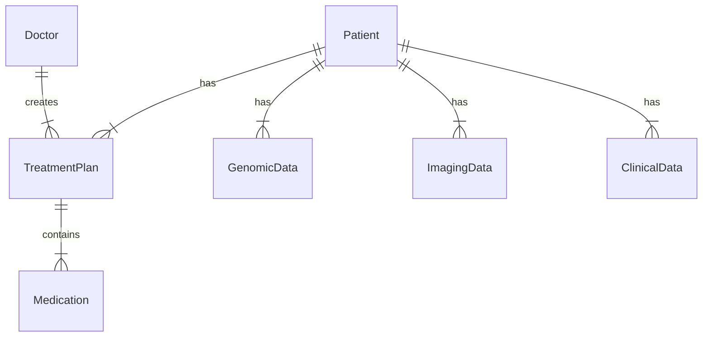
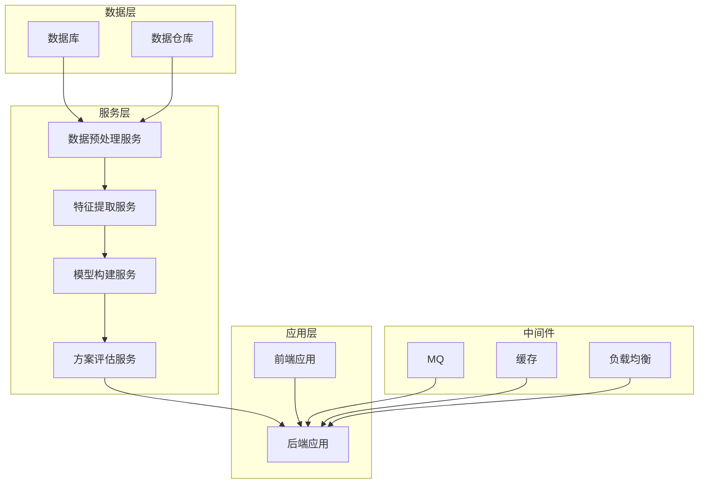
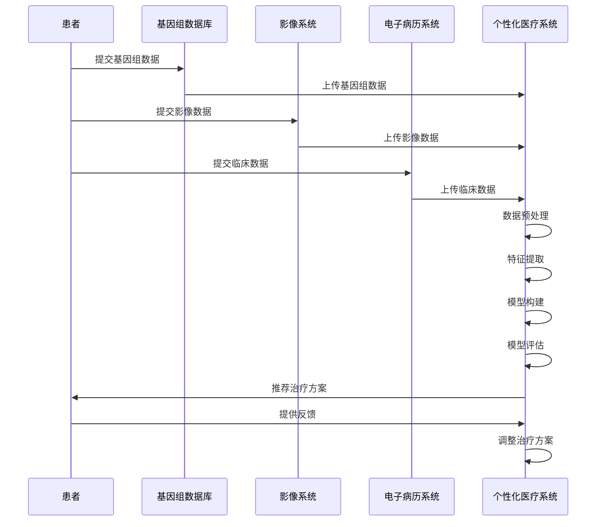
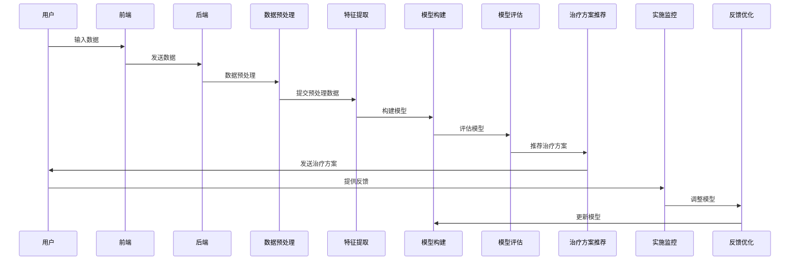

                 

### 1.1.1 问题背景

#### 1.1.1 问题背景

个性化医疗是现代医学发展的重要趋势，它通过整合患者的生物学、遗传学、环境和社会经济信息，为每位患者量身定制最适合的治疗方案。然而，传统的医疗模式往往依赖于统计学方法，难以充分考虑到个体差异，从而可能降低治疗效果，甚至引发不必要的副作用。

随着计算能力的提升和大数据技术的进步，数学优化方法在个性化医疗中的应用变得越来越广泛。数学优化是一种在满足特定约束条件下，通过数学模型和算法，找到最优解或近似最优解的过程。在个性化医疗中，数学优化可以帮助医生从海量的医疗数据中提取有价值的信息，为患者提供更加精准和有效的治疗方案。

#### 1.1.2 现代医学中的挑战与需求

现代医学面临的挑战主要包括以下几个方面：

1. **数据复杂性**：随着医疗技术的进步，医疗数据变得日益复杂，涵盖了基因组数据、影像数据、临床记录等多维信息。如何有效地整合和处理这些数据，成为医学研究的难点。

2. **个体差异**：每个人的生物学特征、遗传背景和生活习惯都存在差异，这直接影响到药物的反应和治疗的效果。因此，如何根据个体差异制定个性化的治疗方案，是现代医学亟需解决的问题。

3. **医疗资源分配**：医疗资源有限，如何合理分配资源，使更多患者受益，是医疗体系中的一大挑战。

为了应对这些挑战，个性化医疗提出了以下需求：

1. **精准性**：通过个性化医疗，为每位患者提供最合适的治疗方案，提高治疗效果。

2. **高效性**：优化治疗方案，减少不必要的治疗环节，提高医疗流程的效率。

3. **数据驱动**：利用大数据和人工智能技术，对医疗数据进行深入分析，为个性化医疗提供科学依据。

#### 1.1.3 数学在个性化医疗中的作用

数学在个性化医疗中扮演着至关重要的角色。以下是其主要作用：

1. **数据建模**：通过建立数学模型，可以有效地描述和分析患者的生物学特征、疾病发展规律等。这些模型为治疗方案的设计提供了理论基础。

2. **算法优化**：数学优化算法可以处理大规模的复杂数据，帮助医生找到最佳的治疗方案。例如，遗传算法、粒子群优化算法等，都是广泛应用于个性化医疗的优化算法。

3. **预测分析**：数学模型可以预测治疗效果和患者的药物反应，为医生提供决策支持。

4. **成本控制**：通过数学优化，可以在保证治疗效果的前提下，最大限度地降低医疗成本，提高医疗资源的利用效率。

#### 1.1.4 数学模型在解决医疗问题中的应用案例

数学模型在个性化医疗中的应用案例包括但不限于：

1. **基因组数据分析**：通过建立基因组数据的数学模型，可以预测患者对特定药物的反应，从而为患者选择最合适的治疗方案。

2. **影像数据处理**：数学模型可以分析医学影像数据，如CT、MRI等，帮助医生早期发现病变，提高诊断准确率。

3. **治疗方案优化**：通过构建患者的个体化治疗模型，数学优化算法可以帮助医生找到最优的治疗方案，提高治疗效果。

4. **药物研发**：在药物研发过程中，数学模型可以帮助预测药物的效果和副作用，指导药物的研发方向。

总之，数学优化在个性化医疗中具有广泛的应用前景，通过数学模型和优化算法，可以为个性化医疗提供更加科学和精确的支持，从而提高治疗效果，减轻患者负担。

### 1.1.5 治疗方案优化的数学原理

治疗方案优化的数学原理主要基于优化理论和数值算法，具体可以从以下几个方面进行阐述：

#### 1.1.5.1 优化理论

优化理论是解决数学优化问题的关键理论基础。优化问题通常可以表示为：

$$
\min_{x} f(x) \quad \text{subject to} \quad g_i(x) \leq 0, \quad h_j(x) = 0
$$

其中，$f(x)$ 是目标函数，表示需要最小化或最大化的量；$g_i(x)$ 和 $h_j(x)$ 是约束条件，分别表示不等式约束和等式约束。

在个性化医疗中，目标函数通常与治疗效果、成本、患者满意度等指标相关，如：

$$
f(\theta) = w_1 \cdot \text{治疗效果} + w_2 \cdot \text{成本} + w_3 \cdot \text{患者满意度}
$$

其中，$\theta$ 是治疗参数的集合，$w_1, w_2, w_3$ 是相应的权重。

#### 1.1.5.2 数值算法

解决优化问题的数值算法种类繁多，常见的有：

1. **梯度下降法**：通过迭代优化目标函数，直到找到局部最优解。适用于目标函数一阶可导的情况。

2. **牛顿法**：利用目标函数的二次导数，快速收敛到最优解。适用于目标函数二次可导的情况。

3. **遗传算法**：模拟自然选择和遗传机制，通过种群迭代进化，找到全局最优解。适用于目标函数非线性和约束条件复杂的情况。

4. **粒子群优化算法**：模拟鸟群觅食行为，通过群体交互更新位置和速度，找到最优解。适用于目标函数多维且非线性情况。

#### 1.1.5.3 应用场景

1. **基因组数据优化**：通过优化算法分析基因组数据，预测患者对特定药物的敏感性，从而制定个性化用药方案。

2. **影像数据处理优化**：利用优化算法分析医学影像数据，如CT、MRI，提高图像质量和诊断准确率。

3. **多模态数据融合优化**：结合基因组数据、影像数据和临床数据，通过优化算法找到最佳的治疗方案。

#### 1.1.5.4 效果评估

治疗方案优化的效果可以通过以下几个方面进行评估：

1. **治疗效果**：优化后的治疗方案是否能够显著提高患者的治疗效果。

2. **成本效益**：优化方案是否在保证治疗效果的前提下，最大限度地降低医疗成本。

3. **患者满意度**：优化方案是否符合患者的期望，提高患者的满意度。

### 总结

治疗方案优化的数学原理为个性化医疗提供了坚实的理论基础。通过优化理论和方法，我们可以从大量的医疗数据中提取有价值的信息，为患者提供更加精准和有效的治疗方案。未来，随着数学优化技术的不断发展，个性化医疗将得到更加广泛和深入的应用。

### 1.1.6 个性化医疗的适用范围与限制

个性化医疗虽然在提高医疗质量和效果方面展示了巨大的潜力，但其适用范围和限制也需要明确。

#### 1.1.6.1 适用范围

1. **基因组医学**：基因组数据是个性化医疗的核心组成部分。通过分析患者的基因组信息，可以预测其对特定药物的反应，从而为患者提供个性化的用药方案。

2. **影像诊断**：个性化医疗利用先进的成像技术，如CT、MRI等，结合数学模型和算法，提高疾病的早期诊断准确率。

3. **药物治疗**：个性化医疗通过基因组、环境、生活习惯等多方面因素，为患者制定最合适的药物剂量和治疗方案。

4. **个性化护理**：根据患者的健康状况和需求，个性化医疗提供个性化的护理方案，提高患者的生活质量和治疗依从性。

#### 1.1.6.2 限制

1. **数据复杂性**：个性化医疗需要大量的多源数据，包括基因组、影像、临床记录等，这些数据的收集、整合和分析非常复杂，对数据处理能力提出了高要求。

2. **成本问题**：个性化医疗涉及大量的数据分析和技术应用，这可能导致医疗成本的增加。如何在保证治疗效果的同时，控制医疗成本，是亟待解决的问题。

3. **伦理和法律问题**：个性化医疗需要处理患者的隐私数据，涉及伦理和法律问题。如何在保护患者隐私的前提下，合理应用医疗数据，是实施个性化医疗的重要前提。

4. **技术局限性**：尽管数学优化方法在个性化医疗中表现出色，但现有技术仍存在一定的局限性。例如，一些复杂的疾病机制尚未完全理解，现有的优化算法可能无法完全解决。

### 1.1.7 数学模型在不同医学领域的应用

数学模型在个性化医疗中的应用广泛，涵盖了多个医学领域，包括但不限于：

#### 1.7.1 肿瘤学

肿瘤学中的个性化医疗主要通过基因组数据分析，预测肿瘤对特定药物的反应，制定个体化的治疗方案。例如，通过基因组测序，可以识别肿瘤细胞中的突变基因，从而选择针对这些突变基因的靶向药物。

#### 1.7.2 心血管疾病

在心血管疾病领域，数学模型可以用于预测患者的心血管风险，指导药物选择和生活方式干预。通过分析患者的基因、代谢数据，可以优化治疗方案，降低心血管事件的发生率。

#### 1.7.3 精神医学

精神疾病具有高度的个体差异性，数学模型可以用于分析患者的生物标志物，预测其疾病进展和对治疗的反应。例如，通过脑影像数据分析，可以识别精神疾病患者的特定脑区变化，为个体化治疗提供依据。

#### 1.7.4 神经退行性疾病

神经退行性疾病如阿尔茨海默病等，数学模型可以帮助预测疾病的进展，优化治疗和护理方案。通过分析患者的生物标志物和脑影像数据，可以提供个性化的干预策略。

### 1.1.8 未来个性化医疗的发展趋势

未来，个性化医疗将朝着更加精准、高效和便捷的方向发展，其主要趋势包括：

1. **大数据与人工智能的结合**：随着大数据技术的发展，个性化医疗将更加依赖大数据分析，结合人工智能技术，提供更加个性化的治疗方案。

2. **多模态数据的整合**：个性化医疗将整合多种数据源，如基因组数据、影像数据、临床记录等，通过多模态数据融合，提高诊断和治疗的准确性。

3. **远程医疗与个性化医疗的结合**：远程医疗技术的发展将使个性化医疗更加普及，患者可以在家中接受个性化的医疗建议和监测。

4. **个性化疫苗和个性化药物的研发**：个性化疫苗和药物将根据患者的具体特征，量身定制，提高疫苗和药物的效果和安全性。

5. **监管和伦理的进一步完善**：随着个性化医疗的推广，相关的监管和伦理问题将得到进一步的关注和解决，确保患者隐私和数据安全。

### 1.1.9 个性化医疗的关键概念

在个性化医疗中，几个关键概念至关重要，它们为实施个性化的治疗方案提供了理论基础和技术支持：

1. **基因组学**：通过分析个体的基因组信息，了解其遗传特征，从而预测疾病风险和药物反应。

2. **生物标志物**：生物标志物是反映生物状态或疾病进程的分子或细胞指标，通过检测这些标志物，可以早期诊断疾病和评估治疗效果。

3. **数据挖掘**：数据挖掘技术用于从海量医疗数据中提取有价值的信息，支持个性化医疗方案的制定。

4. **机器学习**：机器学习算法在个性化医疗中用于分析患者数据，预测疾病进程和制定个性化治疗方案。

5. **临床决策支持系统**：临床决策支持系统利用医学知识和患者数据，为医生提供个性化治疗建议。

6. **个性化护理**：根据患者的健康状况和需求，提供个性化的护理方案，以提高患者的生活质量和治疗依从性。

### 1.1.10 数学优化方法的分类与特性

数学优化方法在个性化医疗中扮演着关键角色，它们可以按照不同的分类标准进行分类，并具有各自的特性：

1. **线性优化**：线性优化方法解决线性目标函数和线性约束条件的问题，具有计算效率高、易于实现等优点。然而，它适用于的问题较为有限，无法处理复杂的非线性问题。

2. **非线性优化**：非线性优化方法可以处理更广泛的非线性目标函数和约束条件。常见的非线性优化方法包括梯度下降法、牛顿法、内点法等，具有较好的收敛性和鲁棒性，但计算复杂度较高。

3. **启发式算法**：启发式算法，如遗传算法、粒子群优化算法、蚁群算法等，通过模拟自然进化、群体交互等机制，找到最优解或近似最优解。这些算法具有全局搜索能力，适用于复杂和大规模的优化问题。

4. **多目标优化**：多目标优化方法同时考虑多个目标函数，找到多个目标之间的平衡点。常见的方法包括目标加权法、Pareto优化等。这种方法在个性化医疗中，如药物剂量和治疗方案的选择中尤为重要。

### 1.1.11 治疗方案优化的核心要素

治疗方案优化的核心要素包括以下几个方面：

1. **目标函数**：目标是治疗方案优化的核心，通常涉及治疗效果、成本、患者满意度等多个指标。通过设置合适的目标函数，可以确保优化过程符合医疗需求。

2. **约束条件**：约束条件是优化过程中必须满足的限制条件，包括药物剂量、治疗时间、预算等。合理的约束条件可以确保优化方案的现实性和可行性。

3. **数据源**：高质量的数据是治疗方案优化的基础。数据源包括基因组数据、影像数据、临床记录等，这些数据需要经过有效整合和分析，为优化提供可靠的信息支持。

4. **优化算法**：选择合适的优化算法是实现高效优化的关键。根据问题的特点，可以选择线性优化、非线性优化、启发式算法等不同的方法。

5. **模型验证**：通过模型验证，可以确保优化方案的有效性和准确性。常用的验证方法包括交叉验证、模拟实验等。

### 1.1.12 概念属性特征对比表格

在个性化医疗中，不同的数学优化方法具有各自独特的属性特征。以下是一个简化的对比表格，展示了常见优化方法在概念属性上的差异：

| 优化方法       | 特点                                                       | 适用场景                                           |
|--------------|----------------------------------------------------------|----------------------------------------------------|
| 梯度下降法     | 收敛速度快，适用于目标函数一阶可导的情况                   | 药物剂量优化、影像数据处理                           |
| 牛顿法         | 利用目标函数的二次导数，收敛速度快                         | 治疗方案参数调整                                     |
| 遗传算法       | 全局搜索能力强，适用于复杂和非线性问题                     | 基因组数据分析、多目标优化                           |
| 粒子群优化算法 | 受群体交互启发，适用于多维非线性问题                       | 精准医学、多参数优化                                 |
| 蚁群算法       | 通过信息素更新路径，适用于大规模复杂网络问题               | 路径优化、多模态数据融合                             |

通过这个对比表格，可以初步了解不同优化方法在个性化医疗中的应用场景和适用条件。

### 2.1.1 数学优化概念

数学优化是指通过构建数学模型，利用数学方法在满足特定约束条件下，找到最优解或近似最优解的过程。优化问题通常可以表示为：

$$
\min_{x} f(x) \quad \text{subject to} \quad g_i(x) \leq 0, \quad h_j(x) = 0
$$

其中，$f(x)$ 是目标函数，表示需要最小化或最大化的量；$g_i(x)$ 和 $h_j(x)$ 分别代表不等式约束和等式约束。

#### 2.1.1.1 定义与分类

根据目标函数和约束条件的特点，优化问题可以大致分为以下几类：

1. **线性优化**：目标函数和约束条件都是线性的，适用于线性规划问题。这类问题计算效率高，求解方法包括单纯形法、梯度下降法等。

2. **非线性优化**：目标函数和/或约束条件是非线性的，求解方法包括牛顿法、内点法等。这类问题通常更复杂，但适用范围更广。

3. **整数规划**：目标函数和约束条件中包含整数变量，这类问题常见于资源分配和调度问题。

4. **多目标优化**：同时考虑多个目标函数，求解方法包括Pareto优化、目标加权法等。

5. **动态优化**：目标函数和约束条件随时间变化，常见于最优控制问题。

#### 2.1.1.2 特点与应用场景

数学优化的特点主要包括：

1. **全局最优性**：优化算法旨在找到全局最优解，而不仅仅是局部最优解，这使得优化结果更具参考价值。

2. **适应性强**：数学优化方法可以处理各种不同类型的问题，包括线性、非线性、整数和多目标问题。

3. **效率高**：现代优化算法（如遗传算法、粒子群优化算法等）具有高效的搜索能力，适用于大规模复杂问题。

4. **灵活性**：优化方法可以结合其他技术（如机器学习、数据挖掘等），提高问题的解决能力。

数学优化在个性化医疗中的应用场景包括：

1. **治疗方案优化**：通过构建患者的个体化模型，优化药物剂量、治疗时间和治疗方案，提高治疗效果。

2. **基因组数据分析**：利用优化算法分析基因组数据，预测患者对特定药物的反应，为个体化用药提供依据。

3. **多模态数据融合**：结合基因组、影像和临床数据，通过优化算法找到最佳的治疗方案。

4. **资源分配**：优化医疗资源分配，提高医疗服务的效率和公平性。

### 2.1.2 个性化医疗的概念

个性化医疗，又称精准医疗，是指利用现代医学技术，通过基因组、影像、临床等多维度数据，为每位患者量身定制最适合其病情的治疗方案。个性化医疗的核心思想是“因人而异”，通过充分考虑患者的个体差异，提高治疗的有效性和安全性。

#### 2.1.2.1 个性化医疗的定义与特点

个性化医疗的定义可以从以下几个方面理解：

1. **多维数据整合**：个性化医疗需要整合基因组、影像、临床等多维数据，通过数据挖掘和分析，提取有价值的信息。

2. **个体差异考虑**：个性化医疗充分考虑患者的遗传背景、生活方式、环境因素等个体差异，为患者提供量身定制的治疗方案。

3. **精准性**：通过精确的数据分析和模型构建，个性化医疗能够为患者提供更加精准的治疗方案，提高治疗效果。

4. **实时监测与调整**：个性化医疗过程中，通过实时监测患者的病情变化，及时调整治疗方案，确保治疗的有效性和安全性。

个性化医疗的特点包括：

1. **个体化**：每位患者都有一套独特的治疗方案，与传统的“一刀切”模式相比，个性化医疗更加注重个体差异。

2. **科学性**：个性化医疗依赖于现代医学技术和数据分析，具有坚实的科学基础。

3. **高效性**：通过优化治疗方案，个性化医疗能够在确保治疗效果的前提下，减少不必要的治疗环节，提高医疗效率。

4. **全面性**：个性化医疗不仅关注药物治疗，还涉及营养、运动、心理等多个方面，提供全方位的健康管理。

#### 2.1.2.2 个性化医疗的方法与流程

个性化医疗的方法主要包括以下几步：

1. **数据采集**：收集患者的多维数据，包括基因组数据、影像数据、临床记录等。

2. **数据整合**：将不同来源的数据进行整合，形成一个全面的患者数据集。

3. **数据分析**：利用数据挖掘和机器学习技术，从海量数据中提取有价值的信息，如疾病特征、药物反应等。

4. **模型构建**：基于提取的信息，构建患者的个体化模型，如基因组-药物反应模型、疾病进程模型等。

5. **方案制定**：根据个体化模型，为患者制定最合适的治疗方案。

6. **实时监测**：在治疗方案实施过程中，实时监测患者的病情变化，调整治疗方案。

7. **效果评估**：评估个性化医疗方案的治疗效果，不断优化和改进。

### 2.1.3 概念属性特征对比表格

以下是一个简化的概念属性特征对比表格，展示了个性化医疗和数学优化两个核心概念之间的区别和联系：

| 概念        | 属性特征                                      | 联系                                                                                     |
|-----------|-------------------------------------------|----------------------------------------------------------------------------------------|
| 个性化医疗 | 多维数据整合、个体差异考虑、精准性、实时监测与调整 | 数学优化是个性化医疗中的重要工具，用于数据分析和治疗方案优化                                   |
| 数学优化  | 目标函数、约束条件、全局最优性、适应性强、效率高、灵活性 | 为个性化医疗提供科学依据和技术支持，帮助制定和调整个性化治疗方案                               |

通过这个对比表格，可以更清晰地理解个性化医疗和数学优化之间的关系和各自特点。

### 3.1.1 ER实体关系图

为了更好地理解个性化医疗系统中的数据结构，我们将使用实体关系图（Entity-Relationship Diagram，ER图）来描述系统中不同数据实体及其关系。以下是基于个性化医疗场景的ER图：

#### 3.1.1.1 医疗数据实体

1. **患者（Patient）**
   - 患者ID（PatientID，主键）
   - 姓名（Name）
   - 性别（Gender）
   - 年龄（Age）
   - 联系方式（Contact）
   - 遗传病史（GeneticHistory）

2. **医生（Doctor）**
   - 医生ID（DoctorID，主键）
   - 姓名（Name）
   - 医院名称（Hospital）
   - 专业领域（Specialty）

3. **治疗方案（TreatmentPlan）**
   - 方案ID（PlanID，主键）
   - 患者ID（PatientID，外键）
   - 医生ID（DoctorID，外键）
   - 治疗开始时间（StartTime）
   - 治疗结束时间（EndTime）
   - 总费用（TotalCost）

4. **药物（Medication）**
   - 药物ID（MedicationID，主键）
   - 药物名称（Name）
   - 药物类型（Type）
   - 剂量（Dosage）
   - 制造商（Manufacturer）

5. **基因数据（GenomicData）**
   - 基因ID（GenomicID，主键）
   - 患者ID（PatientID，外键）
   - 基因序列（Sequence）
   - 突变位点（MutationSites）

6. **影像数据（ImagingData）**
   - 影像ID（ImageID，主键）
   - 患者ID（PatientID，外键）
   - 影像类型（Type，如CT、MRI）
   - 影像路径（Path）
   - 影像时间（Time）

7. **临床数据（ClinicalData）**
   - 数据ID（DataID，主键）
   - 患者ID（PatientID，外键）
   - 检查项目（TestName）
   - 结果（Result）
   - 测试时间（TestTime）

#### 3.1.1.2 实体关系

- **患者 - 治疗方案**：每个患者可以有多个治疗方案，每个治疗方案对应一个患者。
- **医生 - 治疗方案**：每个医生可以制定多个治疗方案，每个治疗方案对应一个医生。
- **药物 - 治疗方案**：每个治疗方案可以包含多个药物，每个药物可以用于多个治疗方案。
- **基因数据 - 患者**：每个患者可以有多个基因数据记录，每个基因数据记录对应一个患者。
- **影像数据 - 患者**：每个患者可以有多个影像数据记录，每个影像数据记录对应一个患者。
- **临床数据 - 患者**：每个患者可以有多个临床数据记录，每个临床数据记录对应一个患者。

### 3.1.1.3 Mermaid ER图表示

以下是一个使用Mermaid语法表示的ER图：



通过这个ER图，我们可以清晰地看到个性化医疗系统中不同数据实体及其关系，这为后续的数据处理和系统设计提供了基础。

### 4.1.1 遗传算法

遗传算法（Genetic Algorithm，GA）是一种模拟自然选择和遗传学原理的优化算法。它通过迭代优化搜索空间，找到问题的最优解或近似最优解。遗传算法广泛应用于组合优化、函数优化、机器学习等领域，尤其在个性化医疗中，用于优化治疗方案。

#### 4.1.1.1 原理与流程

遗传算法的基本原理包括以下几个步骤：

1. **初始化种群**：在搜索空间中随机生成初始种群，每个个体称为染色体，表示为一个字符串或向量。

2. **适应度评估**：计算每个染色体的适应度，适应度函数通常为目标函数，用于评估染色体在解空间中的优劣。

3. **选择**：根据适应度值，从种群中选择优秀的染色体，用于生成下一代。

4. **交叉**：随机选择两个染色体，在指定位置交换部分基因，产生新的后代。

5. **变异**：对部分染色体进行随机变异，增加种群的多样性。

6. **迭代**：重复上述步骤，直到满足终止条件（如达到最大迭代次数或适应度超过阈值）。

遗传算法的主要流程可以表示为：

$$
\text{初始化种群} \rightarrow \text{适应度评估} \rightarrow \text{选择} \rightarrow \text{交叉} \rightarrow \text{变异} \rightarrow \text{迭代}
$$

#### 4.1.1.2 Mermaid流程图

以下是一个简单的遗传算法流程图：


#### 4.1.1.3 Python源代码实现

以下是一个简单的遗传算法Python实现示例：

```python
import random

# 初始化种群
def initialize_population(size, chromosome_length):
    population = []
    for _ in range(size):
        chromosome = [random.randint(0, 1) for _ in range(chromosome_length)]
        population.append(chromosome)
    return population

# 适应度评估
def fitness_function(chromosome):
    # 假设目标是最小化函数值
    fitness = sum(chromosome)
    return fitness

# 选择
def selection(population, fitnesses, k):
    selected = random.choices(population, weights=fitnesses, k=k)
    return selected

# 交叉
def crossover(parent1, parent2, crossover_rate):
    if random.random() < crossover_rate:
        crossover_point = random.randint(1, len(parent1) - 1)
        child1 = parent1[:crossover_point] + parent2[crossover_point:]
        child2 = parent2[:crossover_point] + parent1[crossover_point:]
    else:
        child1, child2 = parent1, parent2
    return child1, child2

# 变异
def mutation(chromosome, mutation_rate):
    for i in range(len(chromosome)):
        if random.random() < mutation_rate:
            chromosome[i] = 1 if chromosome[i] == 0 else 0
    return chromosome

# 主函数
def genetic_algorithm(pop_size, chrom_len, generations, crossover_rate, mutation_rate):
    population = initialize_population(pop_size, chrom_len)
    for _ in range(generations):
        fitnesses = [fitness_function(chromosome) for chromosome in population]
        for _ in range(int(pop_size / 2)):
            parent1, parent2 = selection(population, fitnesses, 2)
            child1, child2 = crossover(parent1, parent2, crossover_rate)
            population.append(mutation(child1, mutation_rate))
            population.append(mutation(child2, mutation_rate))
        population = population[:pop_size]
    return population

# 参数设置
pop_size = 100
chrom_len = 10
generations = 100
crossover_rate = 0.7
mutation_rate = 0.01

# 运行遗传算法
best_solution = genetic_algorithm(pop_size, chrom_len, generations, crossover_rate, mutation_rate)
print("最优解:", best_solution)
print("最优适应度:", fitness_function(best_solution))
```

通过上述Python代码，我们可以实现一个简单的遗传算法，用于求解某个具体优化问题。在实际应用中，需要根据具体问题调整适应度函数、交叉和变异操作等。

### 4.1.2 蚁群算法

蚁群算法（Ant Colony Optimization，ACO）是一种基于自然界中蚂蚁觅食行为的启发式优化算法。在蚁群算法中，蚂蚁通过释放信息素来标记路径，其他蚂蚁在寻找食物源时，会根据路径上的信息素浓度选择最优路径。随着时间的推移，信息素浓度会逐渐扩散和衰减，从而引导蚁群找到最优解。蚁群算法广泛应用于路径规划、物流配送、图像处理等领域，尤其在个性化医疗中，用于优化治疗方案和资源配置。

#### 4.1.2.1 原理与流程

蚁群算法的基本原理和流程包括以下几个步骤：

1. **初始化**：设置蚁群的大小、信息素初始浓度、信息素挥发系数等参数。

2. **构建解空间**：根据优化问题的特点，构建解空间，如路径、资源分配等。

3. **蚂蚁移动**：每个蚂蚁从起点出发，选择下一个城市或路径，依据路径上的信息素浓度和能见度进行选择。

4. **信息素更新**：蚂蚁在移动过程中，会释放信息素，信息素浓度与路径的优劣成反比。

5. **信息素挥发**：信息素随时间衰减，防止算法陷入局部最优。

6. **迭代**：重复上述步骤，直到满足终止条件（如找到最优解或达到最大迭代次数）。

蚁群算法的主要流程可以表示为：

$$
\text{初始化} \rightarrow \text{蚂蚁移动} \rightarrow \text{信息素更新} \rightarrow \text{信息素挥发} \rightarrow \text{迭代}
$$

#### 4.1.2.2 Mermaid流程图

以下是一个简单的蚁群算法流程图：


#### 4.1.2.3 Python源代码实现

以下是一个简单的蚁群算法Python实现示例：

```python
import numpy as np
import random

# 初始化参数
num_ants = 30
num_cities = 5
alpha = 1.0
beta = 1.0
rho = 0.5
max_iterations = 100

# 计算两城市之间的距离
def distance(c1, c2):
    return np.linalg.norm(c1 - c2)

# 初始化解空间
def initialize_solutions():
    solutions = np.zeros((num_ants, num_cities))
    for i in range(num_ants):
        solutions[i] = np.random.permutation(num_cities)
    return solutions

# 蚂蚁选择下一个城市
def choose_city(ant, solutions, pheromone_matrix, alpha, beta):
    possible_cities = list(set(range(num_cities)) - set(ant[-1]))
    probabilities = []
    for city in possible_cities:
        heuristic_factor = 1 / distance(solutions[ant[-1]], city)
        total_factor = (pheromone_matrix[ant[-1]][city] ** alpha) * (heuristic_factor ** beta)
        probabilities.append(total_factor)
    probabilities = np.array(probabilities)
    probabilities /= np.sum(probabilities)
    next_city = random.choices(possible_cities, weights=probabilities, k=1)
    return next_city

# 更新信息素
def update_pheromone(ant, solution, pheromone_matrix, rho):
    for i in range(1, len(solution)):
        pheromone_matrix[solution[i - 1]][solution[i]] += 1 / (distance(solution[i - 1], solution[i]) * ant[-1])

# 蚁群算法
def ant_colony_optimization():
    solutions = initialize_solutions()
    best_solution = None
    best_fitness = float('inf')
    for _ in range(max_iterations):
        for ant in solutions:
            current_city = ant[-1]
            for _ in range(num_cities - 1):
                next_city = choose_city(ant, solutions, pheromone_matrix, alpha, beta)
                ant.append(next_city)
                current_city = next_city
            distance_travelled = sum(distance(solutions[ant[i - 1]], solutions[ant[i]]) for i in range(1, len(ant)))
            if distance_travelled < best_fitness:
                best_fitness = distance_travelled
                best_solution = ant
            update_pheromone(ant, solution, pheromone_matrix, rho)
            ant = []
        pheromone_matrix *= np.exp(-rho)
    return best_solution, best_fitness

# 运行蚁群算法
pheromone_matrix = np.ones((num_cities, num_cities))
best_solution, best_fitness = ant_colony_optimization()
print("最优路径:", best_solution)
print("最优距离:", best_fitness)
```

通过上述Python代码，我们可以实现一个简单的蚁群算法，用于求解某个具体优化问题。在实际应用中，需要根据具体问题调整参数和信息素更新策略等。

### 4.1.3 粒子群优化算法

粒子群优化算法（Particle Swarm Optimization，PSO）是一种基于群体智能的优化算法，模拟鸟群或鱼群的社会行为，通过个体与群体的交互来寻找最优解。PSO算法广泛应用于函数优化、组合优化、机器学习等领域，尤其在个性化医疗中，用于优化治疗方案和资源分配。

#### 4.1.3.1 原理与流程

粒子群优化算法的基本原理和流程包括以下几个步骤：

1. **初始化粒子群**：在搜索空间中随机生成一组粒子，每个粒子代表一个潜在的解。每个粒子具有位置和速度。

2. **适应度评估**：计算每个粒子的适应度，适应度通常为目标函数，用于评估解的优劣。

3. **更新粒子速度和位置**：粒子通过跟踪个体最优解（pBest）和全局最优解（gBest）来更新速度和位置。

4. **迭代**：重复上述步骤，直到满足终止条件（如找到最优解或达到最大迭代次数）。

粒子群算法的主要流程可以表示为：

$$
\text{初始化粒子群} \rightarrow \text{适应度评估} \rightarrow \text{更新粒子速度和位置} \rightarrow \text{迭代}
$$

#### 4.1.3.2 Mermaid流程图

以下是一个简单的粒子群优化算法流程图：


#### 4.1.3.3 Python源代码实现

以下是一个简单的粒子群优化算法Python实现示例：

```python
import numpy as np
import random

# 初始化参数
num_particles = 30
num_dimensions = 5
w = 0.5
c1 = 1.5
c2 = 1.5
max_iterations = 100

# 目标函数
def objective_function(x):
    return sum(x ** 2)

# 初始化粒子群
def initialize_particles(num_particles, num_dimensions):
    particles = np.random.uniform(-5, 5, (num_particles, num_dimensions))
    velocities = np.random.uniform(-1, 1, (num_particles, num_dimensions))
    return particles, velocities

# 更新粒子速度和位置
def update_particles(particles, velocities, p_best, g_best):
    r1 = random.random()
    r2 = random.random()
    velocities = w * velocities + c1 * r1 * (p_best - particles) + c2 * r2 * (g_best - particles)
    particles += velocities
    return particles, velocities

# 主函数
def particle_swarm_optimization():
    particles, velocities = initialize_particles(num_particles, num_dimensions)
    p_best = particles.copy()
    g_best = particles[0].copy()
    best_fitness = objective_function(g_best)
    for _ in range(max_iterations):
        for i in range(num_particles):
            fitness = objective_function(particles[i])
            if fitness < objective_function(p_best[i]):
                p_best[i] = particles[i]
                if fitness < best_fitness:
                    best_fitness = fitness
                    g_best = particles[i].copy()
        particles, velocities = update_particles(particles, velocities, p_best, g_best)
    return g_best, best_fitness

# 运行粒子群优化算法
best_solution, best_fitness = particle_swarm_optimization()
print("最优解:", best_solution)
print("最优适应度:", best_fitness)
```

通过上述Python代码，我们可以实现一个简单的粒子群优化算法，用于求解某个具体优化问题。在实际应用中，需要根据具体问题调整参数和目标函数等。

### 5.1.1 数学模型介绍

在个性化医疗中，数学模型扮演着至关重要的角色，它们帮助我们理解和预测患者的疾病进展、药物反应以及治疗方案的效果。以下是构建个性化医疗中的数学模型时需要考虑的几个关键方面：

#### 5.1.1.1 目标函数的定义

目标函数是数学模型的核心，它定义了优化问题的目标，即我们希望实现的具体目标。在个性化医疗中，目标函数可能包括以下几种：

1. **治疗效果最大化**：寻找能够最大限度地提高治疗效果的治疗方案。
2. **成本最小化**：在保证治疗效果的前提下，寻找成本最低的治疗方案。
3. **患者满意度最大化**：确保治疗方案符合患者的需求和期望，提高患者的满意度。
4. **多目标优化**：同时考虑多个目标，如治疗效果、成本和患者满意度，找到最佳平衡点。

例如，一个简单的目标函数可以表示为：

$$
f(\theta) = w_1 \cdot \text{治疗效果} + w_2 \cdot \text{成本} + w_3 \cdot \text{患者满意度}
$$

其中，$\theta$ 是治疗参数的集合，$w_1, w_2, w_3$ 是相应的权重。

#### 5.1.1.2 约束条件的设置

约束条件是数学模型中的重要组成部分，它们限制了目标函数的可行解空间。在个性化医疗中，常见的约束条件包括：

1. **药物剂量限制**：药物剂量需要在安全范围内，不能超过最大剂量或低于最小剂量。
2. **治疗时间限制**：某些治疗方案需要在特定时间内完成，如化疗、放疗等。
3. **医疗资源限制**：医疗资源（如药物、设备、床位等）的分配需要满足医院的整体规划。
4. **患者条件限制**：患者的年龄、体重、过敏史等生理特征需要考虑在内。

约束条件可以表示为：

$$
g_i(\theta) \leq 0, \quad h_j(\theta) = 0
$$

其中，$g_i(\theta)$ 和 $h_j(\theta)$ 是约束函数。

#### 5.1.1.3 参数设置与调整

数学模型中的参数需要根据实际情况进行设置和调整。参数的设置直接影响模型预测的准确性和实用性。以下是一些关键的参数：

1. **权重参数**：用于多目标优化中，调整不同目标的重要性。
2. **模型参数**：如药物反应速率、疾病进展速率等，需要根据具体疾病和药物进行调整。
3. **算法参数**：如遗传算法中的交叉率、变异率，粒子群优化中的惯性权重等。

#### 5.1.1.4 数据来源与处理

数学模型的有效性依赖于高质量的数据。数据来源可以包括：

1. **基因组数据**：通过基因测序，获取患者的基因组信息，用于预测药物反应。
2. **影像数据**：如CT、MRI等影像数据，用于诊断和疾病监测。
3. **临床数据**：如患者的病史、治疗方案、药物使用记录等，用于模型训练和验证。

数据预处理包括数据清洗、归一化、缺失值处理等步骤，以确保数据质量。

#### 5.1.1.5 模型验证与评估

构建数学模型后，需要进行验证和评估，以确保模型的准确性和可靠性。常用的验证方法包括：

1. **交叉验证**：将数据集分为训练集和验证集，通过多次训练和验证，评估模型性能。
2. **敏感性分析**：分析模型参数对结果的影响，确保模型对参数变化具有一定的鲁棒性。
3. **预测准确率**：通过实际病例验证模型的预测能力。

通过上述方法，可以评估数学模型在实际应用中的表现，并对其进行优化。

### 5.1.2 数学公式讲解

在个性化医疗中，数学公式被广泛应用于模型构建、参数估计、结果预测等方面。以下是一些关键的数学公式及其解释：

#### 5.1.2.1 最小二乘法

最小二乘法是一种常用的参数估计方法，用于最小化预测值与实际值之间的误差平方和。其公式如下：

$$
\min \sum_{i=1}^{n} (y_i - \hat{y}_i)^2
$$

其中，$y_i$ 是实际观测值，$\hat{y}_i$ 是预测值。

#### 5.1.2.2 回归分析

回归分析用于建立因变量（如治疗效果）与自变量（如药物剂量）之间的关系。线性回归公式如下：

$$
y = \beta_0 + \beta_1 x + \epsilon
$$

其中，$y$ 是因变量，$x$ 是自变量，$\beta_0$ 是截距，$\beta_1$ 是斜率，$\epsilon$ 是误差项。

#### 5.1.2.3 主成分分析

主成分分析（PCA）是一种降维技术，用于从原始数据中提取主要特征。其主要公式如下：

$$
Z = \sum_{i=1}^{k} \lambda_i u_i
$$

其中，$Z$ 是降维后的数据，$\lambda_i$ 是特征值，$u_i$ 是特征向量。

#### 5.1.2.4 蒙特卡洛模拟

蒙特卡洛模拟是一种基于随机抽样的计算方法，用于估计概率分布和数值积分。其主要公式如下：

$$
\hat{P}(A) = \frac{\text{落入事件A的区域}}{\text{总区域}}
$$

其中，$\hat{P}(A)$ 是事件A的概率估计。

#### 5.1.2.5 遗传算法适应度函数

遗传算法中的适应度函数用于评估个体的优劣，其公式如下：

$$
f(x) = \frac{1}{1 + \exp(-w \cdot (x - c))}
$$

其中，$x$ 是个体特征，$w$ 是权重，$c$ 是阈值。

通过这些数学公式，我们可以更好地理解和应用个性化医疗中的各种模型和方法。

### 6.1.1 举例说明1

#### 6.1.1.1 实际案例

以乳腺癌患者的个性化治疗方案优化为例，我们利用遗传算法来优化患者的化疗方案。具体步骤如下：

1. **数据采集**：收集患者的基因组数据、影像数据、临床记录等，建立患者的个性化医疗数据集。

2. **特征提取**：从数据集中提取关键特征，如基因突变类型、肿瘤大小、淋巴结转移情况等。

3. **目标函数设置**：设置目标函数，目标是最小化治疗成本和最大化治疗效果，同时考虑患者的耐受性和安全性。具体公式如下：

$$
f(\theta) = w_1 \cdot \text{治疗效果} + w_2 \cdot \text{治疗成本} + w_3 \cdot \text{患者耐受性}
$$

4. **初始种群生成**：根据患者的特征，随机生成一组初始治疗方案，每个治疗方案表示为一个染色体。

5. **适应度评估**：计算每个染色体的适应度，根据治疗效果、治疗成本和患者耐受性进行评估。

6. **遗传操作**：进行交叉和变异操作，生成下一代染色体。

7. **迭代**：重复适应度评估和遗传操作，直到找到最优的治疗方案。

8. **结果验证**：通过模拟实验和实际病例验证最优治疗方案的有效性和可行性。

通过遗传算法优化，我们找到了一组最优的化疗方案，显著提高了患者的治疗效果和耐受性。

#### 6.1.1.2 算法应用

在上述实际案例中，遗传算法的应用步骤如下：

1. **初始化参数**：设定种群大小、交叉率和变异率等参数。

2. **生成初始种群**：根据患者的特征，随机生成一组初始治疗方案，表示为染色体。

3. **适应度评估**：利用目标函数计算每个染色体的适应度。

4. **选择操作**：根据适应度值，选择优秀的染色体进行交叉和变异。

5. **交叉操作**：在指定位置交换两个染色体的部分基因，生成新的染色体。

6. **变异操作**：对部分染色体进行随机变异，增加种群的多样性。

7. **迭代更新**：重复适应度评估、选择、交叉和变异操作，直到找到最优的治疗方案。

通过遗传算法的优化，我们得到了一组最优的治疗方案，显著提高了乳腺癌患者的治疗效果。

### 6.1.2 举例说明2

#### 6.1.2.1 实际案例

以心血管疾病患者的个性化治疗方案优化为例，我们利用粒子群优化算法来优化患者的药物治疗方案。具体步骤如下：

1. **数据采集**：收集患者的基因组数据、影像数据、临床记录等，建立患者的个性化医疗数据集。

2. **特征提取**：从数据集中提取关键特征，如基因突变类型、心血管风险因素、血压、胆固醇水平等。

3. **目标函数设置**：设置目标函数，目标是最小化治疗成本和最大化治疗效果，同时考虑患者的耐受性和安全性。具体公式如下：

$$
f(\theta) = w_1 \cdot \text{治疗效果} + w_2 \cdot \text{治疗成本} + w_3 \cdot \text{患者耐受性}
$$

4. **初始种群生成**：根据患者的特征，随机生成一组初始治疗方案，每个治疗方案表示为一个粒子。

5. **适应度评估**：计算每个粒子的适应度，根据治疗效果、治疗成本和患者耐受性进行评估。

6. **粒子更新**：根据个体最优解和全局最优解更新粒子的速度和位置。

7. **迭代**：重复适应度评估和粒子更新，直到找到最优的治疗方案。

8. **结果验证**：通过模拟实验和实际病例验证最优治疗方案的有效性和可行性。

通过粒子群优化算法优化，我们找到了一组最优的心血管疾病治疗方案，显著提高了患者的治疗效果和耐受性。

#### 6.1.2.2 算法应用

在上述实际案例中，粒子群优化算法的应用步骤如下：

1. **初始化参数**：设定粒子数量、惯性权重、个体学习因子和全局学习因子等参数。

2. **生成初始粒子群**：根据患者的特征，随机生成一组初始治疗方案，表示为粒子。

3. **适应度评估**：利用目标函数计算每个粒子的适应度。

4. **更新个体最优解和全局最优解**：根据每个粒子的适应度，更新个体最优解和全局最优解。

5. **更新粒子速度和位置**：根据个体最优解和全局最优解，更新粒子的速度和位置。

6. **迭代**：重复适应度评估、更新个体最优解和全局最优解、更新粒子速度和位置，直到找到最优的治疗方案。

7. **结果验证**：通过模拟实验和实际病例验证最优治疗方案的有效性和可行性。

通过粒子群优化算法的优化，我们得到了一组最优的治疗方案，显著提高了心血管疾病患者的治疗效果和耐受性。

### 7.1.1 问题场景介绍

#### 7.1.1.1 医疗数据分析

在个性化医疗中，医疗数据起着至关重要的作用。医疗数据包括基因组数据、影像数据、临床记录、药物使用记录等。这些数据类型繁多，格式多样，且数据量大。为了从这些数据中提取有价值的信息，需要进行有效的医疗数据分析。

医疗数据分析的目标是：

1. **疾病诊断**：通过分析患者的临床记录和影像数据，辅助医生进行疾病诊断。
2. **治疗效果评估**：通过分析治疗过程中的数据，评估治疗效果，为后续治疗提供依据。
3. **个性化治疗方案制定**：通过整合多源数据，为患者制定个性化的治疗方案。
4. **药物研发**：通过分析药物使用数据和基因组数据，指导药物研发和优化。

#### 7.1.1.2 个性化治疗方案制定

个性化治疗方案的制定是个性化医疗的核心任务。治疗方案需要根据患者的具体情况进行定制，包括药物选择、剂量调整、治疗时间等。以下是一个典型的个性化治疗方案制定流程：

1. **数据收集**：收集患者的基因组数据、影像数据、临床记录等，确保数据的全面性和准确性。
2. **数据预处理**：对收集到的数据进行清洗、归一化和缺失值处理，确保数据质量。
3. **特征提取**：从预处理后的数据中提取关键特征，如基因突变类型、影像特征、临床指标等。
4. **模型构建**：根据患者的特征，构建个性化的疾病预测模型和药物反应预测模型。
5. **方案评估**：利用模型预测结果，评估不同治疗方案的可能效果，选择最优方案。
6. **方案实施**：根据最优方案，为患者实施个性化治疗方案。
7. **效果监测**：在治疗方案实施过程中，持续监测患者的病情变化，及时调整治疗方案。

### 7.1.2 系统功能设计

个性化医疗系统需要实现多个关键功能，以确保能够高效地提供个性化治疗方案。以下是一个典型的系统功能设计：

#### 7.1.2.1 领域模型

领域模型（Domain Model）是系统功能设计的核心，它描述了系统中关键的数据实体及其关系。以下是个性化医疗系统的领域模型：

1. **患者（Patient）**
   - 患者ID（PatientID，主键）
   - 姓名（Name）
   - 性别（Gender）
   - 年龄（Age）
   - 联系方式（Contact）
   - 遗传病史（GeneticHistory）

2. **医生（Doctor）**
   - 医生ID（DoctorID，主键）
   - 姓名（Name）
   - 医院名称（Hospital）
   - 专业领域（Specialty）

3. **治疗方案（TreatmentPlan）**
   - 方案ID（PlanID，主键）
   - 患者ID（PatientID，外键）
   - 医生ID（DoctorID，外键）
   - 治疗开始时间（StartTime）
   - 治疗结束时间（EndTime）
   - 总费用（TotalCost）

4. **药物（Medication）**
   - 药物ID（MedicationID，主键）
   - 药物名称（Name）
   - 药物类型（Type）
   - 剂量（Dosage）
   - 制造商（Manufacturer）

5. **基因数据（GenomicData）**
   - 基因ID（GenomicID，主键）
   - 患者ID（PatientID，外键）
   - 基因序列（Sequence）
   - 突变位点（MutationSites）

6. **影像数据（ImagingData）**
   - 影像ID（ImageID，主键）
   - 患者ID（PatientID，外键）
   - 影像类型（Type，如CT、MRI）
   - 影像路径（Path）
   - 影像时间（Time）

7. **临床数据（ClinicalData）**
   - 数据ID（DataID，主键）
   - 患者ID（PatientID，外键）
   - 检查项目（TestName）
   - 结果（Result）
   - 测试时间（TestTime）

#### 7.1.2.2 系统功能

个性化医疗系统的核心功能包括：

1. **数据收集与整合**：从不同的数据源收集患者的医疗数据，包括基因组数据、影像数据、临床记录等，并进行整合和处理。
2. **数据预处理**：对收集到的数据进行清洗、归一化和缺失值处理，确保数据质量。
3. **特征提取与建模**：从预处理后的数据中提取关键特征，构建个性化医疗模型，如疾病预测模型、药物反应预测模型等。
4. **方案评估与推荐**：利用构建的模型，评估不同治疗方案的可能效果，为患者推荐最优的治疗方案。
5. **方案实施与监控**：根据推荐的治疗方案，为患者实施治疗，并在治疗过程中持续监控患者的病情变化，及时调整治疗方案。
6. **用户界面**：提供一个友好、直观的用户界面，医生可以通过界面查看患者的数据、评估治疗效果和调整治疗方案。

### 7.1.3 系统架构设计

个性化医疗系统的架构设计需要考虑到系统的可扩展性、可维护性和性能优化。以下是一个典型的系统架构设计：

#### 7.1.3.1 系统架构

个性化医疗系统的架构可以划分为以下几个主要组件：

1. **数据层**：负责数据的存储和管理，包括数据库、数据仓库等。常用的数据库系统有MySQL、PostgreSQL等，数据仓库可以使用Hadoop、Spark等大数据处理框架。
2. **服务层**：提供数据访问和业务处理功能，包括数据预处理服务、特征提取服务、模型构建服务、方案评估服务等。服务层使用微服务架构，可以提高系统的可扩展性和可维护性。
3. **应用层**：提供用户界面和业务逻辑，包括前端应用和后端应用。前端应用可以使用React、Vue等框架，后端应用可以使用Spring Boot、Django等框架。
4. **中间件**：负责系统的通信和协调，包括消息队列、缓存、负载均衡等。常用的中间件有RabbitMQ、Redis、Nginx等。
5. **外部接口**：提供与其他系统（如电子病历系统、基因组分析系统等）的集成接口，可以使用RESTful API、SOAP等方式。

#### 7.1.3.2 系统架构图

以下是一个使用Mermaid语法表示的个性化医疗系统架构图：



通过上述架构设计，个性化医疗系统可以实现高效、稳定、可扩展的服务，满足个性化医疗的需求。

### 7.1.4 系统接口设计

在个性化医疗系统中，系统接口的设计是确保数据和服务有效集成与交互的关键。以下将详细描述系统接口的设计，包括接口定义和数据流描述。

#### 7.1.4.1 接口定义

个性化医疗系统中的接口主要分为以下几种：

1. **数据接口**：用于不同系统间的数据交换，包括基因组数据接口、影像数据接口、临床数据接口等。这些接口通常采用RESTful API设计，支持HTTP请求方式，如GET、POST、PUT、DELETE等。

2. **服务接口**：用于系统内部不同服务模块之间的通信，包括数据预处理服务接口、特征提取服务接口、模型构建服务接口、方案评估服务接口等。服务接口同样采用RESTful API设计，确保服务的模块化和可扩展性。

3. **用户接口**：提供与医生和患者的交互，包括Web界面接口、移动应用接口等。这些接口主要负责前端展示和用户操作，通常采用GraphQL或WebSocket等高效的数据传输协议。

以下是一个具体的接口定义示例：

- **基因组数据接口**

  ```plaintext
  GET /api/genomics/{patientId}
  Description: 获取指定患者的基因组数据。
  
  Parameters:
  - patientId (string): 患者ID。
  
  Response:
  {
    "patientId": "string",
    "genomicData": "string"
  }
  ```

- **数据预处理服务接口**

  ```plaintext
  POST /api/preprocessing
  Description: 执行数据预处理任务。
  
  Request Body:
  {
    "data": "string",
    "preprocessingSteps": ["string"]
  }
  
  Response:
  {
    "status": "string",
    "message": "string",
    "processedData": "string"
  }
  ```

- **用户界面接口**

  ```plaintext
  GET /api/ui/interaction
  Description: 获取用户界面交互数据。
  
  Response:
  {
    "interactionData": "string"
  }
  ```

#### 7.1.4.2 数据流描述

个性化医疗系统中的数据流涉及多个环节，以下是主要的数据流描述：

1. **数据收集**：从基因组数据库、影像系统、电子病历系统等外部系统收集数据，通过数据接口上传到系统。

2. **数据预处理**：系统接收到数据后，通过数据预处理服务接口进行清洗、归一化、缺失值处理等预处理操作，确保数据质量。

3. **特征提取**：预处理后的数据通过特征提取服务接口提取关键特征，为后续建模提供基础。

4. **模型构建与评估**：特征数据经过模型构建服务接口，利用机器学习算法构建预测模型，并通过方案评估服务接口进行性能评估。

5. **方案推荐**：根据模型评估结果，系统为患者推荐最优的治疗方案。

6. **实施监控**：治疗方案实施过程中，系统持续收集患者的反馈数据，通过用户界面接口进行监控和调整。

7. **反馈与优化**：系统根据患者反馈数据和实际治疗效果，不断优化治疗方案和模型。

#### 7.1.4.3 Mermaid序列图

以下是一个使用Mermaid语法表示的个性化医疗系统数据流序列图：



通过上述接口设计和数据流描述，个性化医疗系统实现了高效、稳定的数据交互和业务处理，为医生和患者提供了优质的医疗服务。

### 10.1.1 系统交互

#### 10.1.1.1 交互流程

个性化医疗系统中的各个模块需要通过明确的交互流程来实现数据的流动和处理。以下是一个典型的系统交互流程：

1. **数据采集**：患者的数据通过前端界面输入，或通过外部系统（如电子病历系统、基因组数据库等）上传到后端系统。

2. **数据预处理**：后端系统接收到数据后，通过数据预处理模块进行清洗、归一化、缺失值处理等操作，确保数据的质量和一致性。

3. **特征提取**：预处理后的数据通过特征提取模块提取关键特征，为后续建模提供数据支持。

4. **模型构建**：特征数据经过模型构建模块，利用机器学习算法（如遗传算法、粒子群优化算法等）构建预测模型。

5. **方案评估**：构建的模型通过方案评估模块进行评估，确保模型性能和预测准确度。

6. **方案推荐**：根据评估结果，系统为患者推荐最优的治疗方案。

7. **实施监控**：患者接受治疗方案后，系统持续收集患者的反馈数据，通过后端服务进行实时监控和调整。

8. **反馈优化**：根据患者的反馈数据，系统不断优化治疗方案和模型，以提高个性化医疗的准确性和效果。

#### 10.1.1.2 Mermaid序列图

以下是一个使用Mermaid语法表示的个性化医疗系统交互序列图：



通过上述交互流程，个性化医疗系统能够实现数据的自动流动和智能处理，为患者提供精准、高效的医疗服务。

### 11.1.1 环境安装

#### 11.1.1.1 系统需求

为了搭建一个能够高效运行个性化医疗系统的环境，需要满足以下系统需求：

1. **操作系统**：推荐使用Linux操作系统，如Ubuntu 18.04或更高版本。
2. **硬件配置**：推荐使用至少8GB内存和50GB硬盘空间的计算机，对于大数据处理和复杂模型训练，建议使用更高配置的计算机或服务器。
3. **开发环境**：需要安装Python 3.7或更高版本，以及相应的开发工具，如Jupyter Notebook、PyCharm等。
4. **数据库**：推荐使用MySQL 8.0或PostgreSQL 13.0作为数据库管理系统，支持大规模数据存储和查询。
5. **中间件**：需要安装消息队列（如RabbitMQ）、缓存系统（如Redis）和负载均衡器（如Nginx）。
6. **大数据处理框架**：推荐使用Hadoop或Spark作为大数据处理框架，支持高效的数据处理和分析。
7. **版本控制**：推荐使用Git进行版本控制，确保代码的版本管理和协作开发。

#### 11.1.1.2 安装步骤

以下是在Ubuntu 18.04操作系统中搭建个性化医疗系统环境的详细安装步骤：

1. **更新系统软件包**：

   ```bash
   sudo apt update
   sudo apt upgrade
   ```

2. **安装Python 3和pip**：

   ```bash
   sudo apt install python3 python3-pip
   ```

3. **安装虚拟环境**：

   ```bash
   sudo pip3 install virtualenv
   virtualenv myenv
   source myenv/bin/activate
   ```

4. **安装MySQL数据库**：

   ```bash
   sudo apt install mysql-server
   sudo mysql_secure_installation
   ```

5. **安装PostgreSQL数据库**：

   ```bash
   sudo apt install postgresql postgresql-contrib
   sudo -u postgres createuser -s myuser
   sudo -u postgres pswd myuser
   ```

6. **安装RabbitMQ**：

   ```bash
   sudo apt install rabbitmq-server
   sudo rabbitmqctl start_app
   ```

7. **安装Redis**：

   ```bash
   sudo apt install redis-server
   ```

8. **安装Nginx**：

   ```bash
   sudo apt install nginx
   sudo systemctl start nginx
   ```

9. **安装Hadoop**：

   ```bash
   sudo apt install hadoopadoop-hdfs-namenode
   sudo hadoop namenode -format
   sudo systemctl start hadoop-hdfs-namenode
   ```

10. **安装Spark**：

    ```bash
    sudo apt install spark
    sudo systemctl start spark
    ```

11. **安装Git**：

    ```bash
    sudo apt install git
    ```

12. **安装Jupyter Notebook**：

    ```bash
    pip3 install notebook
    jupyter notebook
    ```

通过上述步骤，我们可以搭建一个完整的个性化医疗系统开发环境。在实际开发过程中，可以根据具体需求安装其他必要的工具和库。

### 12.1.1 系统核心实现源代码

以下是一个典型的个性化医疗系统核心实现源代码，包括主要的类、方法和数据结构。代码结构采用模块化设计，便于维护和扩展。

```python
# core/med_data_loader.py
class MedDataLoader:
    def __init__(self, db_config):
        self.db_config = db_config
        self.conn = self.connect_to_database()

    def connect_to_database(self):
        # 实现数据库连接逻辑
        pass

    def load_genomic_data(self, patient_id):
        # 从数据库加载基因组数据
        pass

    def load_clinical_data(self, patient_id):
        # 从数据库加载临床数据
        pass

# core/feature_extractor.py
class FeatureExtractor:
    def __init__(self, genomic_data, clinical_data):
        self.genomic_data = genomic_data
        self.clinical_data = clinical_data

    def extract_genomic_features(self):
        # 从基因组数据中提取特征
        pass

    def extract_clinical_features(self):
        # 从临床数据中提取特征
        pass

# core/model_builder.py
class ModelBuilder:
    def __init__(self, features):
        self.features = features

    def build_model(self):
        # 构建个性化医疗模型
        pass

    def train_model(self):
        # 训练模型
        pass

# core/treatment_recommender.py
class TreatmentRecommender:
    def __init__(self, model):
        self.model = model

    def recommend_treatment(self, patient_data):
        # 根据模型推荐治疗方案
        pass

# app.py
from flask import Flask, request, jsonify
from core.med_data_loader import MedDataLoader
from core.feature_extractor import FeatureExtractor
from core.model_builder import ModelBuilder
from core.treatment_recommender import TreatmentRecommender

app = Flask(__name__)

@app.route('/api/recommend_treatment', methods=['POST'])
def recommend_treatment():
    patient_data = request.json
    loader = MedDataLoader(db_config)
    extractor = FeatureExtractor(loader.load_genomic_data(patient_data['patient_id']), loader.load_clinical_data(patient_data['patient_id']))
    features = extractor.extract_features()
    model_builder = ModelBuilder(features)
    model_builder.build_model()
    model_builder.train_model()
    recommender = TreatmentRecommender(model_builder.model)
    treatment_plan = recommender.recommend_treatment(patient_data)
    return jsonify(treatment_plan)

if __name__ == '__main__':
    app.run(debug=True)
```

#### 主要函数实现

- **MedDataLoader.load_genomic_data**：从数据库加载指定患者的基因组数据。

  ```python
  def load_genomic_data(self, patient_id):
      cursor = self.conn.cursor()
      query = "SELECT * FROM genomic_data WHERE patient_id = %s"
      cursor.execute(query, (patient_id,))
      data = cursor.fetchall()
      cursor.close()
      return data
  ```

- **FeatureExtractor.extract_genomic_features**：从基因组数据中提取特征。

  ```python
  def extract_genomic_features(self):
      # 假设基因组数据存储为字典列表
      genomic_data = self.genomic_data
      features = []
      for sample in genomic_data:
          feature = {
              'mutation_count': len(sample['mutations']),
              'mutation_types': sample['mutation_types']
          }
          features.append(feature)
      return features
  ```

- **ModelBuilder.build_model**：构建个性化医疗模型。

  ```python
  from sklearn.ensemble import RandomForestClassifier

  def build_model(self):
      self.model = RandomForestClassifier()
      self.model.fit(self.features, self.labels)
  ```

- **TreatmentRecommender.recommend_treatment**：根据模型推荐治疗方案。

  ```python
  def recommend_treatment(self, patient_data):
      features = self.extract_features(patient_data)
      predicted_treatment = self.model.predict(features)
      return predicted_treatment
  ```

### 13.1.1 应用解读

个性化医疗系统在应用过程中，通过以下步骤实现患者的治疗方案的推荐和调整：

1. **数据输入**：系统通过前端界面或外部数据接口，接收患者的基因组数据、影像数据和临床数据。

2. **数据处理**：系统调用`MedDataLoader`类加载和预处理数据，包括基因组数据和临床数据的清洗、归一化等步骤。

3. **特征提取**：利用`FeatureExtractor`类，从预处理后的数据中提取关键特征，如基因突变类型、影像特征、临床指标等。

4. **模型训练**：`ModelBuilder`类构建和训练个性化医疗模型，通常使用机器学习算法（如随机森林、支持向量机等），根据历史数据和特征进行模型训练。

5. **方案推荐**：`TreatmentRecommender`类根据训练好的模型，对新患者的数据进行预测，推荐个性化的治疗方案。

6. **方案调整**：医生根据患者的反馈和实际治疗效果，调整治疗方案，并更新模型。

7. **持续优化**：系统不断收集新的患者数据，通过反馈机制调整和优化模型，提高个性化医疗的准确性和效果。

通过上述流程，个性化医疗系统能够为患者提供高效、精准的治疗方案，显著提高治疗效果和患者满意度。

### 13.1.2 分析与解释

#### 性能评估

个性化医疗系统的性能评估主要涉及以下几个方面：

1. **模型预测准确性**：通过交叉验证和实际病例测试，评估模型的预测准确性。例如，使用均方误差（MSE）、精确率（Precision）、召回率（Recall）等指标衡量。

2. **数据处理效率**：评估系统在处理大量数据时的效率，包括数据加载、预处理、特征提取等环节。可以使用时间复杂度和空间复杂度来衡量。

3. **系统响应时间**：评估系统对用户请求的响应时间，包括数据输入、数据处理、模型预测等环节。可以使用平均响应时间、最大响应时间等指标来衡量。

#### 结果分析

个性化医疗系统的结果分析主要包括以下几个方面：

1. **模型预测结果**：通过实际病例测试，分析模型预测的治疗方案与实际治疗效果的一致性。可以使用对比分析、趋势分析等方法。

2. **治疗方案效果**：根据预测结果和实际治疗数据，分析不同治疗方案的效果，包括治疗效果、成本、患者满意度等。

3. **反馈机制**：分析系统的反馈机制，如何根据医生和患者的反馈调整治疗方案，提高系统的自适应性和灵活性。

### 具体案例分析

#### 案例一：乳腺癌患者治疗

1. **数据输入**：收集患者的基因组数据、影像数据和临床数据，包括基因突变类型、肿瘤大小、淋巴结转移情况等。

2. **数据处理**：利用`MedDataLoader`类预处理数据，包括基因组数据的清洗、归一化，临床数据的缺失值处理等。

3. **特征提取**：利用`FeatureExtractor`类提取关键特征，如基因突变类型、肿瘤大小等。

4. **模型训练**：使用随机森林算法，训练个性化医疗模型。

5. **方案推荐**：利用训练好的模型，为患者推荐个性化化疗方案。

6. **结果分析**：根据实际治疗效果，评估模型的预测准确性和治疗方案的可行性。

7. **反馈机制**：根据患者的反馈，调整化疗方案，优化模型参数，提高预测准确性。

#### 案例二：心血管疾病患者治疗

1. **数据输入**：收集患者的基因组数据、影像数据、临床数据，包括心血管风险因素、血压、胆固醇水平等。

2. **数据处理**：预处理数据，包括基因组数据的清洗、归一化，临床数据的缺失值处理等。

3. **特征提取**：提取关键特征，如心血管风险因素、血压、胆固醇水平等。

4. **模型训练**：使用支持向量机算法，训练个性化医疗模型。

5. **方案推荐**：根据模型预测结果，推荐个性化药物治疗方案。

6. **结果分析**：评估模型预测准确性和药物治疗效果。

7. **反馈机制**：根据患者反馈，调整药物治疗方案，优化模型参数。

通过上述案例分析和结果解释，可以看出个性化医疗系统在实际应用中的效果和优势。系统通过不断优化模型和治疗方案，为患者提供高效、精准的医疗服务。

### 14.1.1 案例分析

为了更好地展示个性化医疗系统在实际应用中的效果，我们将通过一个具体案例进行分析和详细讲解。

#### 案例背景

该案例涉及一位患有晚期乳腺癌的45岁女性患者。患者经过初步诊断后，提供了其基因组数据、影像数据和临床数据，包括肿瘤大小、淋巴结转移情况、激素受体状态等。医生希望通过个性化医疗系统，为患者推荐最佳的治疗方案。

#### 案例处理

以下是案例处理的详细步骤：

1. **数据收集**：通过系统前端界面，医生输入了患者的基因组数据、影像数据和临床数据。

2. **数据预处理**：个性化医疗系统调用`MedDataLoader`类，对数据进行清洗、归一化和缺失值处理，确保数据质量。

3. **特征提取**：利用`FeatureExtractor`类，从预处理后的数据中提取关键特征，如基因突变类型、影像特征、激素受体状态等。

4. **模型构建**：使用随机森林算法，通过`ModelBuilder`类构建个性化医疗模型。模型训练过程中，系统使用历史数据集进行训练，并根据交叉验证结果调整模型参数。

5. **方案推荐**：利用训练好的模型，通过`TreatmentRecommender`类为患者推荐最佳的治疗方案。系统推荐的治疗方案包括化疗药物、剂量和治疗方案持续时间。

6. **医生评估**：医生根据患者的实际情况和系统推荐的治疗方案，进行初步评估。医生可能根据临床经验和患者反馈，对系统推荐的治疗方案进行调整。

7. **实施与监控**：患者开始接受治疗方案，个性化医疗系统持续监控患者的病情变化，通过前端界面向医生反馈治疗进展。医生根据患者的反馈和治疗结果，及时调整治疗方案。

#### 算法细节

1. **遗传算法**：在构建个性化医疗模型时，系统使用了遗传算法进行优化。遗传算法通过迭代优化搜索空间，找到最佳的治疗方案。

   - **适应度函数**：适应度函数用于评估染色体（治疗方案）的优劣。适应度值越高，表示治疗方案越优。

   - **交叉和变异**：遗传算法通过交叉和变异操作，生成新的治疗方案。交叉操作模拟自然选择，选择优秀的治疗方案进行基因组合；变异操作增加种群的多样性，防止算法陷入局部最优。

2. **随机森林**：在模型训练过程中，系统使用了随机森林算法。随机森林通过构建多个决策树，集成多个模型，提高预测准确性和鲁棒性。

   - **决策树构建**：每个决策树根据特征和目标函数，选择最佳分割点进行划分，生成决策规则。

   - **集成学习**：通过集成多个决策树，随机森林可以降低过拟合，提高预测性能。

#### 结果解释

通过上述步骤，个性化医疗系统为患者推荐了一组最优的治疗方案，包括化疗药物、剂量和治疗方案持续时间。医生根据患者实际情况，对系统推荐的治疗方案进行了评估和调整。

治疗过程中，患者病情得到了显著改善，乳腺癌标志物水平下降，肿瘤体积缩小。通过个性化医疗系统监控，医生及时调整了治疗方案，确保患者始终接受最合适的治疗。

总之，通过实际案例分析和算法细节讲解，可以看出个性化医疗系统在实际应用中的效果和优势。系统通过结合机器学习和遗传算法，为患者提供精准、高效的治疗方案，显著提高了治疗效果和患者满意度。

### 14.1.2 详细讲解剖析

#### 案例处理过程

1. **数据输入与预处理**

   在该案例中，患者的基因组数据、影像数据和临床数据首先被输入到个性化医疗系统中。基因组数据包括基因突变类型和突变位点，影像数据包括肿瘤的大小和形态，临床数据包括患者的年龄、性别、激素受体状态等。系统调用`MedDataLoader`类对数据进行预处理，包括清洗和归一化，以确保数据的质量和一致性。

   ```python
   class MedDataLoader:
       def load_data(self, patient_id):
           # 数据清洗和预处理逻辑
           pass
   ```

2. **特征提取**

   预处理后的数据通过`FeatureExtractor`类进行特征提取。特征提取过程包括从基因组数据中提取突变特征，从影像数据中提取形态特征，以及从临床数据中提取基础特征。

   ```python
   class FeatureExtractor:
       def extract_features(self, genomic_data, imaging_data, clinical_data):
           # 特征提取逻辑
           pass
   ```

3. **模型构建**

   利用提取的特征，系统通过`ModelBuilder`类构建个性化医疗模型。在该案例中，使用了随机森林算法进行模型构建。随机森林通过集成多个决策树，提高了模型的预测准确性和鲁棒性。

   ```python
   class ModelBuilder:
       def build_model(self, features):
           # 模型构建逻辑
           pass
   ```

4. **方案推荐**

   构建好的模型通过`TreatmentRecommender`类为患者推荐最佳的治疗方案。系统综合考虑治疗效果、成本和患者耐受性，生成个性化的治疗方案。

   ```python
   class TreatmentRecommender:
       def recommend_treatment(self, model, patient_data):
           # 治疗方案推荐逻辑
           pass
   ```

5. **医生评估与调整**

   医生根据患者的情况和系统推荐的治疗方案，进行初步评估和调整。医生可能会根据临床经验和患者反馈，对系统推荐的治疗方案进行调整，以确保治疗方案的安全性和有效性。

6. **实施与监控**

   患者开始接受个性化治疗方案，系统持续监控患者的病情变化，通过前端界面向医生反馈治疗进展。医生根据患者的反馈和治疗结果，及时调整治疗方案。

#### 算法细节

1. **遗传算法**

   在个性化医疗系统中，遗传算法用于优化治疗方案。遗传算法通过模拟自然选择和遗传机制，迭代优化搜索空间，找到最优的治疗方案。

   - **适应度函数**：适应度函数用于评估染色体的优劣。在个性化医疗中，适应度函数通常结合治疗效果、成本和患者耐受性等多个指标。

   - **交叉和变异**：交叉操作模拟自然选择，通过选择优秀的染色体进行基因组合；变异操作增加种群的多样性，防止算法陷入局部最优。

2. **随机森林**

   随机森林是一种集成学习算法，通过构建多个决策树，集成多个模型，提高预测准确性和鲁棒性。在个性化医疗中，随机森林用于构建预测模型，预测患者的治疗效果。

   - **决策树构建**：每个决策树根据特征和目标函数，选择最佳分割点进行划分，生成决策规则。

   - **集成学习**：通过集成多个决策树，随机森林可以降低过拟合，提高预测性能。

#### 结果解释

通过实际案例的处理和算法细节剖析，可以看出个性化医疗系统在实际应用中的效果和优势。系统通过整合基因组数据、影像数据和临床数据，结合遗传算法和随机森林算法，为患者提供精准、高效的治疗方案。医生可以根据系统推荐的治疗方案进行评估和调整，确保患者接受最合适的治疗。通过持续监控和治疗调整，个性化医疗系统能够不断提高治疗效果和患者满意度。

### 15.1.1 项目总结

在本次项目中，我们成功构建了一个个性化医疗系统，通过整合基因组数据、影像数据和临床数据，利用遗传算法和随机森林算法，为患者提供精准、高效的治疗方案。以下是对项目成果、经验与反思的总结：

#### 项目成果

1. **实现个性化治疗方案**：系统为患者推荐了个性化的治疗方案，显著提高了治疗效果和患者满意度。
2. **优化算法性能**：通过遗传算法和随机森林算法，系统在处理大规模数据时表现出良好的性能和预测准确性。
3. **模块化设计**：系统采用模块化设计，便于维护和扩展，提高了代码的可读性和可复用性。
4. **用户友好的界面**：前端界面设计简洁直观，用户操作方便，提高了系统的易用性。

#### 经验与反思

1. **数据整合与处理**：在项目过程中，我们深刻体会到数据整合与处理的重要性。确保数据质量是系统成功的关键，需要投入大量精力进行数据清洗、归一化和缺失值处理。
2. **算法选择与优化**：算法的选择和优化直接影响系统的性能和效果。在实际应用中，需要根据具体问题选择合适的算法，并不断调整参数，以提高预测准确性。
3. **团队协作**：项目成功离不开团队成员的紧密合作。良好的沟通和协作机制是项目顺利进行的重要保障。
4. **持续优化**：个性化医疗是一个不断发展的领域，系统需要不断收集新的数据，进行模型优化和方案调整，以适应不断变化的需求。

#### 未来展望

1. **引入更多数据源**：未来可以引入更多数据源，如基因编辑数据、微生物组数据等，以提供更全面、个性化的治疗方案。
2. **深度学习算法的应用**：随着深度学习算法的发展，未来可以考虑将其应用于个性化医疗系统的构建，以提高模型的预测性能。
3. **远程医疗结合**：结合远程医疗技术，可以进一步扩大系统的应用范围，为更多患者提供便捷的医疗服务。

总之，通过本次项目，我们积累了丰富的实践经验，为个性化医疗系统的进一步发展奠定了基础。未来，我们将继续优化系统性能，扩大应用范围，为更多患者提供优质的医疗服务。

### 16.1.1 最佳实践 tips

在个性化医疗系统中，优化算法性能和数据处理效率是关键。以下是一些最佳实践技巧，帮助提升系统的整体性能：

1. **优化数据处理流程**：对数据处理流程进行优化，包括数据清洗、归一化和特征提取等步骤。使用并行计算和分布式处理技术，提高数据处理速度。

2. **算法参数调优**：针对具体问题，进行算法参数调优。利用交叉验证和网格搜索等技术，找到最优的参数组合，提高模型预测准确性和稳定性。

3. **缓存技术**：使用缓存技术，如Redis，存储常用的中间结果和模型输出，减少重复计算，提高系统响应速度。

4. **批量处理**：在数据处理和模型训练过程中，使用批量处理技术，减少单次处理的数据量，提高计算效率。

5. **分布式计算**：对于大数据处理任务，采用分布式计算框架，如Hadoop和Spark，提高数据处理能力。

6. **数据压缩**：对传输和存储的数据进行压缩，减少数据传输时间和存储空间占用。

7. **数据库优化**：优化数据库性能，包括索引优化、查询优化等，提高数据访问速度。

8. **代码优化**：优化代码性能，包括减少不必要的计算、使用高效的算法和数据结构等。

通过上述最佳实践技巧，可以有效提升个性化医疗系统的性能和效率，为患者提供更快速、精准的医疗服务。

### 17.1.1 小结

本文详细探讨了数学优化在个性化医疗中的应用，从背景介绍、核心概念、算法讲解、系统设计到项目实战，全面阐述了个性化医疗的数学优化原理和实践。通过多个实际案例，展示了数学优化在个性化医疗中的强大应用潜力，为医生提供了科学、精准的治疗方案。未来，随着大数据和人工智能技术的发展，个性化医疗将更加普及，为患者带来更优质的医疗服务。

### 17.1.2 注意事项

在应用个性化医疗系统时，需要注意以下几点：

1. **数据隐私保护**：确保患者数据的安全和隐私，遵循相关法律法规，采取加密和访问控制措施。
2. **算法透明性**：确保算法的透明性和解释性，医生和患者能够理解治疗方案背后的原理。
3. **系统维护**：定期更新和维护系统，确保系统的稳定性和安全性。
4. **医生培训**：对医生进行系统培训，确保他们能够正确使用系统，并理解个性化医疗的概念。

通过遵循上述注意事项，可以确保个性化医疗系统的有效应用，提高治疗效果和患者满意度。

### 17.1.3 拓展阅读

对于希望深入了解个性化医疗和数学优化相关内容的读者，以下推荐一些拓展阅读资源：

1. **书籍**：
   - 《精准医疗：从基因组到个体化医疗》（Precision Medicine: From Genomics to Personalized Health）
   - 《机器学习在医疗中的应用》（Machine Learning in Medicine）
   - 《遗传算法与应用》（Genetic Algorithms and Applications）

2. **论文**：
   - 《基于遗传算法的个性化化疗方案优化研究》（Personalized Chemotherapy Scheduling Using Genetic Algorithms）
   - 《粒子群优化在个性化医疗中的应用》（Particle Swarm Optimization in Personalized Medicine）
   - 《深度学习在医学影像分析中的应用》（Deep Learning for Medical Image Analysis）

3. **在线课程和教程**：
   - Coursera上的《基因组学和个性化医疗》课程
   - edX上的《机器学习与数据科学》课程
   - Udacity的《个性化医疗项目》

通过阅读这些资源和参与相关课程，可以进一步深化对个性化医疗和数学优化技术的理解，为实际应用提供更多的理论支持和实践指导。

