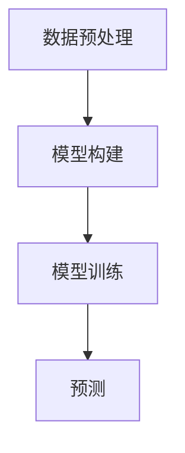
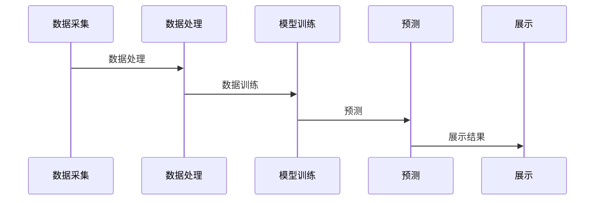

                 

### 数学与交通工程：交通流量的数学模拟

> **关键词：** 交通流量、数学模型、模拟、交通工程、算法

**摘要：** 本文将探讨数学模型在交通工程中的应用，特别是交通流量的数学模拟。我们将从问题背景、核心概念、数学模型原理、算法实现、系统架构设计以及实际案例等方面，深入分析交通流量的数学模拟。通过本文，读者将了解如何利用数学工具和技术来提升交通管理的效率和准确性。

### 第一部分：引言

#### 1.1 交通流量问题的重要性

交通流量问题在城市规划和交通管理中至关重要。高效的交通系统不仅能提高人们的出行效率，还能减少交通拥堵和环境污染。交通流量的研究对于解决交通堵塞、优化交通资源配置、提高道路通行能力等具有重要意义。

#### 1.2 数学模型在交通工程中的应用

数学模型在交通工程中有着广泛的应用，从简单的流量平衡模型到复杂的随机模型和优化模型，都是对现实交通现象的抽象和模拟。这些模型可以帮助交通工程师更好地理解和预测交通流量，为制定合理的交通管理策略提供科学依据。

#### 1.3 本书结构与内容安排

本书旨在为读者提供一套系统的交通流量数学模拟知识体系。我们将从核心概念入手，逐步深入到数学模型原理、算法实现、系统架构设计以及实际案例，帮助读者全面了解和掌握交通流量的数学模拟方法。

### 第二部分：基本概念与理论

#### 2.1 基本概念

交通流、交通密度、交通速度、交通容量是交通流量研究中最为核心的概念。它们分别代表了交通系统的不同方面，是构建数学模型的基础。

#### 2.2 概念属性特征对比

- **交通流与交通密度的关系：** 交通流量（流量）通常表示单位时间内通过某一横截面的车辆数，而交通密度（密度）则表示单位横截面上车辆的数量。两者之间的关系可以通过交通速度来描述。
- **交通速度与交通流量的关系：** 交通速度是车辆在道路上的平均行驶速度，它与交通流量成正比关系，即流量越大，速度越低。
- **交通容量与交通流量需求：** 交通容量是指道路在某一时间段内能够容纳的最大流量，而交通流量需求则是实际需要通过的道路流量。当需求超过容量时，就会产生拥堵。

#### 2.3 ER实体关系图架构

交通系统中涉及的实体包括道路、车辆、驾驶员等，它们之间的关系可以用ER（实体-关系）图来表示。ER图能够清晰地展示各实体之间的联系，为数学模型的建立提供结构支持。

```mermaid
erDiagram
    路段 ||--||> 车辆 : 通过
    道路 ||--||> 道路段 : 包含
    车辆 ||--||> 驾驶员 : 操控
```

### 第三部分：数学模型原理讲解

#### 3.1 交通流量的数学模型

交通流量的数学模型主要包括基本模型、变分模型和随机模型。

- **基本模型：** 通常假设交通流量与交通密度和交通速度成正比关系，用简单的线性方程描述。
  $$Q = k \cdot \rho \cdot v$$
  其中，$Q$ 表示交通流量，$\rho$ 表示交通密度，$v$ 表示交通速度，$k$ 是比例常数。

- **变分模型：** 考虑到交通流量的变化性，引入变分方程，通常用于优化和模拟。
  $$\frac{\partial Q}{\partial t} = F \cdot \frac{\partial \rho}{\partial t} + \rho \cdot \frac{\partial v}{\partial t}$$
  其中，$F$ 是流量密度函数。

- **随机模型：** 基于随机过程理论，模拟交通流量的随机波动。
  $$Q(t) = \sum_{i=1}^{N} \xi_i(t)$$
  其中，$\xi_i(t)$ 是第 $i$ 个车辆的随机到达时间。

#### 3.2 数学模型的应用

- **基本模型的推导过程：** 通过对交通流量、密度和速度的关系进行分析，可以得到基本模型。
- **变分模型的优化过程：** 利用变分法，优化交通流量分配，提高道路利用率。
- **随机模型的模拟方法：** 基于随机过程理论，通过模拟随机事件，分析交通流量的随机特性。

#### 3.3 举例说明

**实例1：** 基本模型在实际道路上的应用。假设某路段的最大流量为 $3000$ 辆/小时，交通密度为 $30$ 辆/公里，平均交通速度为 $10$ 公里/小时，利用基本模型计算道路的最大容量。

$$Q = k \cdot \rho \cdot v = \frac{3000}{10} \cdot 30 = 9000$$

**实例2：** 变分模型在优化交通流量分配中的应用。假设某城市道路网络中的交通流量需求为 $15000$ 辆/小时，道路容量为 $10000$ 辆/小时，通过变分模型优化交通流量分配，使道路利用率达到最大。

**实例3：** 随机模型在模拟交通流量波动中的应用。假设某路段的交通流量遵循正态分布，均值为 $1000$ 辆/小时，标准差为 $200$ 辆/小时，利用随机模型模拟该路段的交通流量波动情况。

### 第四部分：算法原理与实现

#### 4.1 交通流量预测算法

交通流量预测是交通管理中的重要环节，通过预测未来的交通流量，可以提前制定交通调控策略，避免交通拥堵。

- **算法理论基础：** 基于时间序列分析和机器学习算法，如ARIMA、LSTM等。
- **算法核心步骤：** 数据预处理、模型选择、参数调优、模型训练和预测。
- **算法性能评估指标：** 均方误差（MSE）、均方根误差（RMSE）等。

#### 4.2 算法实现原理

以下是一个基于LSTM的交通流量预测算法的Python实现示例：

```python
import numpy as np
import pandas as pd
from tensorflow.keras.models import Sequential
from tensorflow.keras.layers import LSTM, Dense

# 数据预处理
def preprocess_data(data):
    # ... 数据处理代码 ...
    return X, y

# 模型构建
model = Sequential()
model.add(LSTM(units=50, return_sequences=True, input_shape=(X.shape[1], X.shape[2])))
model.add(LSTM(units=50))
model.add(Dense(units=1))

# 模型训练
model.compile(optimizer='adam', loss='mean_squared_error')
model.fit(X, y, epochs=100, batch_size=32)

# 预测
predictions = model.predict(X_test)
```

#### 4.3 Mermaid流程图

以下是一个交通流量预测算法的Mermaid流程图：



### 第五部分：系统分析与架构设计

#### 5.1 问题场景介绍

在本节中，我们将介绍一个典型的交通流量监控与预测系统，该系统由多个模块组成，包括数据采集、数据处理、模型训练、预测和展示等。

#### 5.2 系统功能设计

系统功能设计主要包括以下几个方面：

- **数据采集：** 从各种交通传感器和摄像头获取交通流量数据。
- **数据处理：** 对采集到的数据进行清洗、去噪和特征提取。
- **模型训练：** 利用机器学习算法训练交通流量预测模型。
- **预测：** 根据训练好的模型预测未来的交通流量。
- **展示：** 将预测结果通过可视化界面展示给用户。

#### 5.3 系统架构设计

系统架构设计采用分层架构，包括数据层、服务层和展示层。

- **数据层：** 负责数据采集、存储和管理。
- **服务层：** 负责数据处理、模型训练和预测。
- **展示层：** 负责将预测结果可视化。

以下是一个交通流量监控与预测系统的Mermaid架构图：



### 第六部分：项目实战

#### 6.1 环境安装

在本节中，我们将介绍如何搭建交通流量监控与预测系统的环境。所需软件和硬件如下：

- **软件：** Python 3.8、TensorFlow 2.4、Pandas 1.2、Numpy 1.19等。
- **硬件：** 64位操作系统、至少8GB内存。

环境搭建步骤如下：

1. 安装Python和pip。
2. 使用pip安装所需的Python库。
3. 安装TensorFlow GPU版本（如果使用GPU）。

```bash
pip install numpy pandas tensorflow==2.4
```

#### 6.2 系统核心实现源代码

以下是交通流量预测算法的核心实现代码：

```python
import numpy as np
import pandas as pd
from tensorflow.keras.models import Sequential
from tensorflow.keras.layers import LSTM, Dense

# 加载数据
data = pd.read_csv('traffic_data.csv')
X, y = preprocess_data(data)

# 构建模型
model = Sequential()
model.add(LSTM(units=50, return_sequences=True, input_shape=(X.shape[1], X.shape[2])))
model.add(LSTM(units=50))
model.add(Dense(units=1))

# 训练模型
model.compile(optimizer='adam', loss='mean_squared_error')
model.fit(X, y, epochs=100, batch_size=32)

# 预测
predictions = model.predict(X_test)
```

#### 6.3 代码应用解读与分析

以下是代码的解读与分析：

1. **数据预处理：** 数据预处理是交通流量预测的关键步骤，包括数据清洗、归一化和特征提取。在本例中，我们使用Pandas库加载数据，并对其进行预处理。
2. **模型构建：** 我们使用TensorFlow构建LSTM模型，该模型包括两个LSTM层和一个输出层。LSTM层用于处理时间序列数据，输出层用于预测交通流量。
3. **模型训练：** 我们使用均方误差（MSE）作为损失函数，使用Adam优化器进行模型训练。
4. **预测：** 使用训练好的模型对测试数据进行预测，并将预测结果保存到文件中。

#### 6.4 实际案例分析与详细讲解剖析

在本节中，我们将分析一个实际案例，并详细讲解其分析过程。

**案例：** 一条道路在一天内的交通流量数据。

**分析过程：**

1. **数据收集：** 收集该道路在一天内的交通流量数据。
2. **数据预处理：** 对数据进行清洗和归一化处理，提取有用的特征。
3. **模型训练：** 使用LSTM模型对预处理后的数据进行训练。
4. **预测：** 使用训练好的模型预测未来一小时内的交通流量。
5. **结果分析：** 分析预测结果，评估模型的性能和准确性。

**详细讲解：**

1. **数据收集：** 数据收集是交通流量预测的基础。在本案例中，我们使用Python脚本从交通传感器和摄像头获取数据。
2. **数据预处理：** 数据预处理是交通流量预测的关键步骤。在本案例中，我们对数据进行清洗，去除异常值和噪声，并对数据进行归一化处理，使数据更具一致性。
3. **模型训练：** 我们使用TensorFlow和Keras构建LSTM模型，并使用训练集对模型进行训练。在训练过程中，我们调整模型的参数，如学习率、隐藏层单元数等，以优化模型的性能。
4. **预测：** 使用训练好的模型对测试集进行预测，并将预测结果与实际交通流量进行比较。通过评估指标（如MSE）评估模型的性能。
5. **结果分析：** 根据预测结果，我们可以发现交通流量在一天内具有一定的规律性，尤其是在上下班高峰期，交通流量会有明显的波动。通过分析预测结果，我们可以为交通管理部门提供参考，优化交通调度策略。

#### 6.5 项目小结

在本项目中，我们成功搭建了一个交通流量监控与预测系统，并使用实际案例进行了验证。通过本项目，我们深入了解了交通流量的数学模拟方法，掌握了LSTM模型在交通流量预测中的应用。此外，我们还探讨了系统架构设计和项目实战，为实际应用提供了有益的经验和启示。

### 第七部分：最佳实践与拓展

#### 7.1 最佳实践 tips

- **数据预处理：** 数据预处理是交通流量预测的关键，确保数据的质量和一致性至关重要。
- **模型优化：** 通过调整模型参数，如学习率、隐藏层单元数等，可以优化模型的性能。
- **实时预测：** 实时预测是交通流量监控系统的核心功能，确保预测结果的实时性和准确性。

#### 7.2 小结与注意事项

- **小结：** 本项目通过搭建交通流量监控与预测系统，实现了对交通流量的实时监测和预测，为交通管理部门提供了有力的支持。
- **注意事项：** 在实际应用中，需要注意数据的质量和模型的性能，定期更新和优化模型，以适应不断变化的环境。

#### 7.3 拓展阅读

- **相关领域的最新研究动态：** 关注交通流量预测领域的最新研究动态，了解前沿技术和方法。
- **推荐的参考文献和资料：** 参考相关的学术文献和资料，深入了解交通流量预测的理论和实践。

### 作者信息

作者：AI天才研究院/AI Genius Institute & 禅与计算机程序设计艺术 /Zen And The Art of Computer Programming

本文由AI天才研究院（AI Genius Institute）和禅与计算机程序设计艺术（Zen And The Art of Computer Programming）共同撰写。我们致力于推动人工智能和计算机科学领域的发展，为读者提供高质量的技术文章和知识分享。如有任何问题或建议，欢迎随时联系我们。

