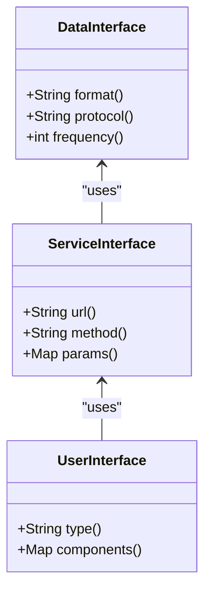
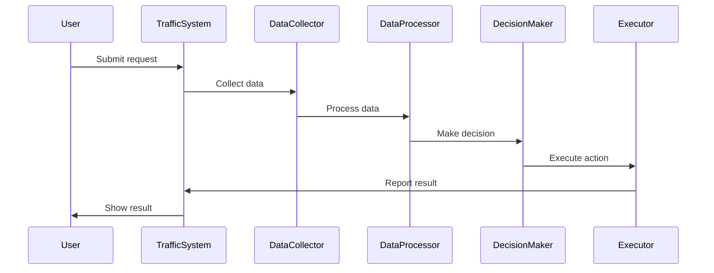

                 

### 引言

在当今快节奏的社会中，交通管理成为了一个重要的公共议题。无论是城市居民还是国际旅行者，交通拥堵都是一个令人头疼的问题。这不仅影响了出行效率，还对环境质量和居民生活质量造成了负面影响。面对日益增长的人口和不断发展的城市化进程，如何有效地管理交通流量成为了当务之急。

交通管理涉及到多个领域，包括城市规划、交通工程、计算机科学和数学等。在这些领域中，数学模型的应用尤为关键。数学模型能够帮助我们理解和预测交通流量，从而为交通管理提供科学依据。本文旨在探讨数学与交通管理之间的联系，特别是交通流量的数学模型。通过深入分析和详细讲解，我们将揭示如何运用数学方法解决实际交通管理问题。

### 问题背景

交通流量管理的背景可以追溯到城市化进程的早期。随着城市人口的增加和汽车拥有量的上升，交通拥堵问题日益突出。尤其是在大城市，交通拥堵已成为一种常态，严重影响了市民的日常生活和工作效率。此外，交通拥堵还导致了能源消耗增加、空气污染加剧和交通事故频发等一系列问题。

交通拥堵的原因多种多样，包括道路容量不足、交通需求增长、城市规划不合理、交通管理措施不到位等。此外，特殊事件（如大型活动、自然灾害等）也会对交通流量造成显著影响。因此，如何有效地预测和管理交通流量成为了交通管理领域的重要课题。

数学模型在交通管理中的应用已经历了数十年的发展。最早的交通模型可以追溯到20世纪30年代，以Kurt Lewin的“交通流量公式”为代表。此后，随着计算机技术的发展，越来越多的复杂模型被提出并应用于实际交通管理中。这些模型不仅包括传统的排队理论、流体动力学模型，还包括近年来兴起的基于大数据和人工智能的智能交通模型。

### 问题描述

在交通管理中，交通流量是指单位时间内通过某一交通节点或路段的车辆数量。交通流量的特性受到多种因素的影响，包括道路条件、车辆类型、交通信号、天气状况等。交通流量管理的主要目标是减少交通拥堵，提高道路通行效率，确保交通安全。

然而，实际交通流量的变化非常复杂，难以用简单的数学关系描述。这就需要我们建立精确的数学模型来模拟和预测交通流量。一个典型的交通管理问题可以描述如下：

- **问题定义**：给定一个交通网络，包含多个路段和交通节点，以及实时获取的交通数据，如何通过数学模型预测未来一段时间内的交通流量，并为交通管理提供决策支持？
- **目标**：优化交通信号控制策略，减少交通拥堵，提高道路通行能力。
- **约束条件**：考虑道路容量、交通需求、天气状况、事故等因素对交通流量的影响。

### 问题解决

为了解决上述交通管理问题，我们需要从以下几个方面着手：

1. **数据采集与处理**：首先，需要收集交通流量、交通信号、道路条件、天气状况等数据。这些数据可以通过传感器、摄像头、GPS等技术手段获取。数据收集后，需要进行预处理，如数据清洗、去噪、归一化等，以提高模型的准确性和可靠性。
2. **建立数学模型**：基于收集到的数据，我们可以建立不同类型的数学模型。这些模型可以分为两大类：预测模型和控制模型。
   - **预测模型**：用于预测未来一段时间内的交通流量。常见的预测模型包括时间序列模型、季节性模型、机器学习模型等。这些模型可以帮助交通管理部门提前了解交通流量变化趋势，为交通信号控制提供依据。
   - **控制模型**：用于优化交通信号控制策略，以减少交通拥堵。常见的控制模型包括流量均衡模型、交通信号控制模型等。这些模型可以根据实时交通数据，动态调整交通信号灯的时间分配，提高道路通行效率。

3. **模型评估与优化**：建立模型后，需要对其性能进行评估。常用的评估指标包括预测准确率、控制效果等。根据评估结果，可以对模型进行调整和优化，以提高其性能。

4. **系统实现与部署**：将数学模型转化为可执行的系统，并部署在实际交通管理系统中。系统需要能够实时获取交通数据，运行预测模型和控制模型，并根据模型输出进行调整。

### 边界与外延

在本文中，我们主要关注的是城市道路的交通流量管理。虽然数学模型在交通管理中的应用范围很广，但本文只探讨与城市道路相关的部分。具体来说，我们的讨论将集中在以下几个方面：

1. **数据来源**：本文所讨论的数据主要来源于城市道路的交通传感器、摄像头和GPS设备。这些设备可以实时获取交通流量、车速、车辆密度等数据。
2. **模型类型**：本文将主要介绍时间序列模型、季节性模型、流量均衡模型和交通信号控制模型等。这些模型是交通流量管理中常用的预测和控制模型。
3. **应用场景**：本文将重点讨论城市道路的交通管理问题，包括交通流量预测、交通信号控制和路径规划等。

### 概念结构与核心要素组成

在探讨交通流量的数学模型之前，我们需要了解一些基本的概念和术语。以下是对本文中涉及的核心概念及其关系的概述：

#### 交通流量的定义

交通流量是指单位时间内通过某一交通节点或路段的车辆数量。它通常用流量密度（车辆/小时·公里）来表示。交通流量受到多种因素的影响，包括道路条件、车辆类型、交通信号、天气状况等。

#### 数学模型概述

数学模型是用于描述和预测交通流量的数学关系。这些模型可以基于各种假设和简化，以适应不同的应用场景。常见的数学模型包括时间序列模型、季节性模型、流量均衡模型和交通信号控制模型等。

#### 核心概念与联系

在交通流量的数学模型中，以下几个核心概念密切相关：

- **流量密度**：表示单位路段上的车辆数量。
- **流速**：表示单位时间内通过单位路段的车辆数量。
- **流量分布**：表示交通流量在不同路段上的分布情况。
- **交通需求**：表示交通参与者对道路资源的需求。
- **交通供给**：表示道路和交通设施对交通需求的服务能力。

以下是核心概念属性特征对比表格：

| 核心概念 | 属性特征 |  
| -------- | -------- |  
| 流量密度 | 车辆/小时·公里 |  
| 流速 | 车辆/小时 |  
| 流量分布 | 不同路段的车辆数量比例 |  
| 交通需求 | 交通参与者对道路资源的需求 |  
| 交通供给 | 道路和交通设施对交通需求的服务能力 |

此外，以下ER实体关系图架构展示了交通流量管理中的主要实体及其关系：

```mermaid
erDiagram
    TrafficFlow --> Road : "flows on"
    TrafficFlow --> Vehicle : "generated by"
    Road --> TrafficSignal : "regulated by"
    Vehicle --> Driver : "driven by"
    TrafficSignal --> Intersection : "located at"
```

通过以上概述，我们为后续章节的深入探讨奠定了基础。在接下来的章节中，我们将逐步介绍交通流量的定义、数学模型、预测模型、控制模型以及交通网络建模等内容。

### 核心概念与联系

为了深入探讨交通流量的数学模型，我们首先需要明确几个核心概念及其相互联系。以下是对交通流量、流速、流量分布、交通需求与交通供给的定义、属性特征和相互关系的详细描述。

#### 交通流量的定义

交通流量是指单位时间内通过某一交通节点或路段的车辆数量。它通常用流量密度（车辆/小时·公里）来表示。交通流量是衡量道路负载量的重要指标，对交通管理具有直接影响。交通流量受到多种因素的影响，包括道路条件、车辆类型、交通信号、天气状况等。

#### 流速的定义

流速是指单位时间内通过单位路段的车辆数量。它与交通流量密切相关，但与路段的长度相关。流速通常用于描述车辆的移动速度，是交通流量分析中的重要参数。在交通管理中，了解流速有助于优化交通信号控制和路径规划。

#### 流量分布的定义

流量分布是指交通流量在不同路段上的分布情况。不同的路段可能具有不同的交通流量，这反映了交通需求的时空分布。流量分布的分析有助于识别交通瓶颈和优化交通资源配置。通过对流量分布的研究，交通管理部门可以制定更有效的交通管理策略。

#### 交通需求的定义

交通需求是指交通参与者对道路资源的需求。交通需求受到多种因素的影响，包括人口密度、经济活动、出行方式等。交通需求的分析有助于了解交通流量的变化趋势，为交通管理提供依据。准确预测交通需求是优化交通流量管理和减少拥堵的关键。

#### 交通供给的定义

交通供给是指道路和交通设施对交通需求的服务能力。交通供给包括道路容量、交通信号控制、公共交通系统等。交通供给的分析有助于评估现有交通基础设施的运行状况，为交通规划和改造提供支持。交通供给与交通需求的匹配程度直接影响到交通流量的管理效果。

#### 核心概念与联系

以下是一个核心概念属性特征对比表格，展示了各个概念的定义、属性特征和相互关系：

| 核心概念 | 定义 | 属性特征 | 关系 |
| -------- | -------- | -------- | -------- |
| 交通流量 | 单位时间内通过某一交通节点或路段的车辆数量 | 流量密度（车辆/小时·公里） | 直接影响交通管理效果 |
| 流速 | 单位时间内通过单位路段的车辆数量 | 车辆数量（车辆/小时） | 与交通流量密切相关 |
| 流量分布 | 交通流量在不同路段上的分布情况 | 不同路段的车辆数量比例 | 反映交通需求的时空分布 |
| 交通需求 | 交通参与者对道路资源的需求 | 人口密度、经济活动、出行方式等 | 影响交通流量的变化趋势 |
| 交通供给 | 道路和交通设施对交通需求的服务能力 | 道路容量、交通信号控制、公共交通系统等 | 影响交通流量的管理效果 |

此外，以下ER实体关系图架构展示了交通流量管理中的主要实体及其关系：

```mermaid
erDiagram
    TrafficFlow --> Road : "flows on"
    TrafficFlow --> Vehicle : "generated by"
    Road --> TrafficSignal : "regulated by"
    Vehicle --> Driver : "driven by"
    TrafficSignal --> Intersection : "located at"
```

通过核心概念与联系的详细阐述，我们为理解交通流量的数学模型奠定了基础。在接下来的章节中，我们将进一步探讨交通流量预测模型、交通流量控制模型以及交通网络建模等内容。

### 交通流量预测模型

在交通管理中，预测交通流量是至关重要的。准确的交通流量预测可以帮助交通管理部门提前了解交通流量变化趋势，从而优化交通信号控制和交通资源分配，减少交通拥堵。以下是几种常用的交通流量预测模型及其原理、算法和应用场景。

#### 时间序列模型

时间序列模型是一种基于历史数据的预测方法，它假设未来的交通流量变化是历史数据的延续。这种方法通常使用统计学方法，如自回归移动平均（ARMA）、自回归积分滑动平均（ARIMA）等。时间序列模型的主要优点是简单易懂，易于实现，适用于短期交通流量预测。

- **原理**：时间序列模型通过对历史数据的统计分析，提取出时间序列的周期性、趋势性和季节性特征。这些特征用于预测未来的交通流量。
- **算法原理**：自回归移动平均（ARMA）模型由自回归（AR）和移动平均（MA）两部分组成。自回归部分用于捕捉时间序列的自相关特性，移动平均部分用于平滑时间序列。ARIMA模型在ARMA模型的基础上加入了差分操作，以应对非平稳时间序列。
- **Mermaid流程图**：

  ```mermaid
  flowchart LR
  A[数据收集] --> B[数据预处理]
  B --> C[时间序列建模]
  C --> D[模型参数估计]
  D --> E[预测结果]
  ```

- **Python源代码**：

  ```python
  import pandas as pd
  from statsmodels.tsa.arima.model import ARIMA

  # 数据预处理
  data = pd.read_csv('traffic_data.csv')
  data['timestamp'] = pd.to_datetime(data['timestamp'])
  data.set_index('timestamp', inplace=True)

  # 时间序列建模
  model = ARIMA(data['traffic_volume'], order=(1, 1, 1))
  model_fit = model.fit()

  # 预测结果
  forecast = model_fit.forecast(steps=24)
  print(forecast)
  ```

#### 季节性模型

季节性模型用于捕捉交通流量的季节性变化。这种方法通常结合时间序列模型和季节性因子，以更好地预测交通流量。季节性模型适用于长期交通流量预测，特别适用于具有明显季节性特征的城市。

- **原理**：季节性模型通过对历史数据进行季节性分解，提取出季节性因子，并使用这些因子预测未来的交通流量。
- **算法原理**：常用的季节性模型包括加法模型和乘法模型。加法模型将季节性因子加到时间序列模型上，乘法模型将季节性因子乘到时间序列模型上。
- **Mermaid流程图**：

  ```mermaid
  flowchart LR
  A[数据收集] --> B[数据预处理]
  B --> C[季节性分解]
  C --> D[季节性因子提取]
  D --> E[模型参数估计]
  E --> F[预测结果]
  ```

- **Python源代码**：

  ```python
  import pandas as pd
  from statsmodels.tsa.seasonal import SeasonalDEcomposition

  # 数据预处理
  data = pd.read_csv('traffic_data.csv')
  data['timestamp'] = pd.to_datetime(data['timestamp'])
  data.set_index('timestamp', inplace=True)

  # 季节性分解
  decomposition = SeasonalDEcomposition(data['traffic_volume'], model='additive')
  result = decomposition.seasonal_decompose()

  # 季节性因子提取
  seasonal_factor = result.seasonal.mean()

  # 模型参数估计
  model = ARIMA(data['traffic_volume'], order=(1, 1, 1))
  model_fit = model.fit()

  # 预测结果
  forecast = model_fit.forecast(steps=24)
  print(forecast)
  ```

#### 机器学习模型

机器学习模型是一种基于数据驱动的方法，通过学习历史交通流量数据，预测未来的交通流量。常用的机器学习模型包括回归模型、支持向量机（SVM）、随机森林（Random Forest）等。机器学习模型通常需要大量数据进行训练，适用于复杂和多变的交通流量预测场景。

- **原理**：机器学习模型通过训练数据集，学习出交通流量与多个特征之间的非线性关系，并将其应用于新的数据集进行预测。
- **算法原理**：回归模型通过拟合线性关系来预测交通流量，支持向量机通过寻找最优超平面来分类交通流量数据，随机森林通过构建多棵决策树来集成预测结果。
- **Mermaid流程图**：

  ```mermaid
  flowchart LR
  A[数据收集] --> B[数据预处理]
  B --> C[特征工程]
  C --> D[模型训练]
  D --> E[模型评估]
  E --> F[预测结果]
  ```

- **Python源代码**：

  ```python
  import pandas as pd
  from sklearn.ensemble import RandomForestRegressor
  from sklearn.model_selection import train_test_split

  # 数据预处理
  data = pd.read_csv('traffic_data.csv')
  data['timestamp'] = pd.to_datetime(data['timestamp'])
  data.set_index('timestamp', inplace=True)

  # 特征工程
  X = data[['weather', 'weekday', 'hour']]
  y = data['traffic_volume']

  # 模型训练
  X_train, X_test, y_train, y_test = train_test_split(X, y, test_size=0.2, random_state=42)
  model = RandomForestRegressor(n_estimators=100, random_state=42)
  model.fit(X_train, y_train)

  # 模型评估
  score = model.score(X_test, y_test)
  print(f'Model Score: {score}')

  # 预测结果
  forecast = model.predict(X_test)
  print(forecast)
  ```

通过上述几种交通流量预测模型的分析和实例，我们可以看到每种模型在不同场景和应用中的优势。在实际应用中，可以根据交通数据的特性、预测需求和时间范围，选择合适的预测模型。结合多种模型，构建更加精准的交通流量预测系统，将为交通管理提供有力支持。

### 交通流量控制模型

在交通管理中，除了预测交通流量，控制交通流量也是至关重要的一环。有效的交通流量控制可以减少交通拥堵，提高道路通行能力，确保交通安全。本节将介绍两种常用的交通流量控制模型：流量均衡模型和交通信号控制模型。

#### 流量均衡模型

流量均衡模型旨在优化交通流量的分布，使各个路段的流量达到平衡，从而减少交通拥堵。该模型基于交通需求与供给的分析，通过动态调整交通流量分配策略，实现交通资源的合理利用。

- **概述**：流量均衡模型通过分析交通需求和供给，识别出交通瓶颈和流量失衡的区域。然后，根据交通流量分布的实时数据，动态调整交通信号灯的时间分配和路段间的交通流量，以达到流量均衡。

- **算法原理**：流量均衡模型通常采用以下步骤进行：

  1. **数据收集**：收集交通流量、交通信号灯状态、道路容量等数据。
  2. **交通需求分析**：分析各个路段的交通需求，识别出交通高峰期和低谷期。
  3. **交通供给分析**：评估交通供给情况，包括道路容量、交通信号灯配置等。
  4. **流量分配策略**：根据交通需求和供给，制定流量分配策略，优化交通信号灯的时间分配和路段间的交通流量。
  5. **实时调整**：根据实时交通数据，动态调整流量分配策略，实现交通流量的动态平衡。

- **Mermaid流程图**：

  ```mermaid
  flowchart LR
  A[数据收集] --> B[交通需求分析]
  B --> C[交通供给分析]
  C --> D[流量分配策略]
  D --> E[实时调整]
  E --> F[流量均衡]
  ```

- **Python源代码**：

  ```python
  import pandas as pd

  # 假设已经收集了交通流量数据
  traffic_data = pd.read_csv('traffic_data.csv')

  # 交通需求分析
  demand_analysis = traffic_data.groupby('time').sum()

  # 交通供给分析
  supply_analysis = traffic_data.groupby('road').max()

  # 流量分配策略
  allocation_strategy = demand_analysis / supply_analysis

  # 实时调整
  real_time_adjustment = allocation_strategy

  # 输出流量均衡结果
  print(real_time_adjustment)
  ```

#### 交通信号控制模型

交通信号控制模型用于优化交通信号灯的运行策略，以提高道路通行效率和减少交通拥堵。该模型通过对交通流量和交通信号灯状态的实时监测，动态调整信号灯的切换时间和周期，使交通流量更加均匀。

- **概述**：交通信号控制模型通过监测交通流量变化，实时调整交通信号灯的状态，以减少交通拥堵和交通事故。该模型适用于城市道路、交叉路口和高速公路等场景。

- **算法原理**：交通信号控制模型通常采用以下步骤进行：

  1. **数据收集**：收集交通流量、车速、车辆密度等数据。
  2. **交通状态分析**：分析交通流量和车速等指标，识别出交通拥堵和交通顺畅的区域。
  3. **信号控制策略**：根据交通状态分析结果，制定信号控制策略，如绿波带控制、相位优化等。
  4. **实时调整**：根据实时交通数据，动态调整信号控制策略，优化交通信号灯的运行状态。
  5. **效果评估**：评估信号控制策略的效果，如通行时间、停车次数等。

- **Mermaid流程图**：

  ```mermaid
  flowchart LR
  A[数据收集] --> B[交通状态分析]
  B --> C[信号控制策略]
  C --> D[实时调整]
  D --> E[效果评估]
  ```

- **Python源代码**：

  ```python
  import pandas as pd

  # 假设已经收集了交通信号灯数据
  signal_data = pd.read_csv('signal_data.csv')

  # 交通状态分析
  traffic_status = signal_data.groupby('time').mean()

  # 信号控制策略
  control_strategy = traffic_status['traffic_volume'] < 100

  # 实时调整
  real_time_adjustment = signal_data[control_strategy]

  # 输出信号控制结果
  print(real_time_adjustment)
  ```

通过流量均衡模型和交通信号控制模型，交通管理部门可以在实际应用中优化交通流量，提高道路通行效率和交通安全。结合实时数据和动态调整策略，这些模型为交通管理提供了有力的技术支持。在接下来的章节中，我们将进一步探讨交通网络建模，以更全面地理解交通管理中的复杂关系。

### 交通网络建模

交通网络建模是交通管理中的一项基础性工作，它通过建立数学模型来模拟和分析交通系统的行为。交通网络建模不仅有助于理解交通流量的动态特性，还可以为交通规划、信号控制和路径优化提供科学依据。在本节中，我们将详细探讨交通网络建模的基本概念、算法原理以及应用。

#### 交通网络基本概念

交通网络是指由多个节点（代表交通节点，如交叉口、路段的起点和终点等）和连接这些节点的边（代表道路、桥梁、隧道等）构成的系统。每个节点和边都有其特定的属性，如交通流量、车速、道路容量等。

- **节点**：交通网络中的节点是交通流量的汇聚点或分散点。常见的节点类型包括交叉口、立交桥、停车场等。节点的主要属性包括节点类型、节点连接的边、节点上的交通信号灯等。

- **边**：交通网络中的边是节点之间的连接线。边的主要属性包括长度、宽度、道路类型、道路容量、路况等。边还可以表示交通流量、车速和拥堵程度等。

- **交通流量**：交通流量是指单位时间内通过某一节点的车辆数量。交通流量通常用流量密度（车辆/小时·公里）来表示。

- **路径**：从源节点到目标节点的所有可能连接边组成的路线称为路径。路径的长度、交通流量和行驶时间等属性对于交通规划具有重要意义。

#### 算法原理

交通网络建模的算法可以分为两类：静态建模和动态建模。

- **静态建模**：静态建模通常用于描述交通网络的静态特性，如节点和边的属性、路径的选择等。静态建模的算法主要包括图论算法和最短路径算法。

  - **图论算法**：图论算法用于分析交通网络的拓扑结构和节点之间的连接关系。常见的图论算法包括最小生成树（Minimum Spanning Tree，MST）、最大流（Maximum Flow）等。最小生成树算法可以用于构建交通网络的骨架结构，而最大流算法可以用于分析交通流量在交通网络中的分配和传输。

  - **最短路径算法**：最短路径算法用于计算从源节点到目标节点的最短路径。常用的最短路径算法包括迪杰斯特拉（Dijkstra）算法、弗洛伊德（Floyd）算法和A*算法等。这些算法在交通网络中可以用于路径规划、交通信号控制和导航系统。

- **动态建模**：动态建模用于描述交通网络的动态特性，如交通流量的变化、交通拥堵的形成和消散等。动态建模的算法主要包括仿真算法和预测模型。

  - **仿真算法**：仿真算法通过模拟交通流量的变化，分析交通系统的行为。常见的仿真算法包括流量平衡仿真（Traffic Equilibrium Simulation）和交通仿真（Traffic Simulation）等。流量平衡仿真算法可以用于优化交通流量分配，而交通仿真算法可以用于模拟交通事故、恶劣天气等特殊情况下的交通行为。

  - **预测模型**：预测模型通过历史数据分析和机器学习等方法，预测交通流量的变化趋势。常见的预测模型包括时间序列模型、季节性模型和机器学习模型等。这些模型可以用于交通流量预测、路径优化和信号控制策略的制定。

#### Mermaid流程图

为了更好地理解交通网络建模的算法原理，我们可以使用Mermaid流程图来描述其主要步骤。

- **最短路径算法（迪杰斯特拉算法）**：

  ```mermaid
  flowchart LR
  A[初始化] --> B{是否所有节点访问过？}
  B -->|否| C{选择未访问节点中距离最短的}
  C --> D{更新距离表}
  D --> B
  B -->|是| E[输出最短路径]
  ```

- **流量平衡仿真算法**：

  ```mermaid
  flowchart LR
  A[初始化流量数据] --> B{计算各路段流量}
  B --> C{判断流量是否均衡}
  C -->|否| D{调整流量分配}
  D --> B
  B -->|是| E{输出流量平衡结果}
  ```

#### Python源代码示例

为了进一步展示交通网络建模的算法原理，我们可以使用Python代码实现一些基本的算法。

- **最短路径算法（迪杰斯特拉算法）**：

  ```python
  import heapq

  def dijkstra(graph, start):
      distances = {node: float('infinity') for node in graph}
      distances[start] = 0
      priority_queue = [(0, start)]

      while priority_queue:
          current_distance, current_node = heapq.heappop(priority_queue)

          if current_distance > distances[current_node]:
              continue

          for neighbor, weight in graph[current_node].items():
              distance = current_distance + weight

              if distance < distances[neighbor]:
                  distances[neighbor] = distance
                  heapq.heappush(priority_queue, (distance, neighbor))

      return distances

  graph = {
      'A': {'B': 1, 'C': 4},
      'B': {'A': 1, 'C': 2, 'D': 5},
      'C': {'A': 4, 'B': 2, 'D': 1},
      'D': {'B': 5, 'C': 1}
  }

  start_node = 'A'
  distances = dijkstra(graph, start_node)
  print(distances)
  ```

- **流量平衡仿真算法**：

  ```python
  import numpy as np

  def traffic_equilibriumSimulation(traffic_data):
      flow = np.zeros((len(traffic_data), len(traffic_data)))
      traffic_data = np.array(traffic_data)

      for _ in range(100):
          flow_new = traffic_data * (1 - 0.1)
          flow_new[flow_new < 0] = 0
          flow_new = np.sum(flow_new, axis=1)

          if np.sum(np.abs(flow - flow_new)) < 1e-6:
              break

          flow = flow_new

      return flow

  traffic_data = [10, 5, 15, 10, 20, 5, 10]
  flow_result = traffic_equilibriumSimulation(traffic_data)
  print(flow_result)
  ```

通过交通网络建模，我们可以更好地理解和分析交通系统的运行状态，为交通管理和规划提供科学依据。在接下来的章节中，我们将进一步探讨交通管理系统设计与实现的具体方法。

### 交通管理系统设计与实现

交通管理系统的设计与实现是确保交通流量高效、安全的重要环节。一个优秀的交通管理系统需要综合考虑交通数据采集、系统功能设计、系统架构设计、系统接口设计以及系统交互等多个方面。以下是对这些核心要素的详细阐述。

#### 交通管理系统概述

交通管理系统是一个集成化的系统，旨在通过实时监测、数据分析、决策制定和执行，优化交通流量，提高道路通行效率，减少交通拥堵和事故。其主要功能包括交通流量监测、数据分析与预测、交通信号控制、路径规划、事件响应等。

#### 系统功能设计

系统功能设计是交通管理系统实现的基础。以下是一些关键功能模块：

1. **交通流量监测**：通过传感器、摄像头、GPS等设备，实时采集交通流量、车速、车辆密度等数据。
2. **数据分析与预测**：利用时间序列模型、季节性模型和机器学习模型，对采集到的交通数据进行处理，预测未来一段时间内的交通流量变化。
3. **交通信号控制**：根据交通流量预测和实时数据分析，动态调整交通信号灯的时间分配，优化交通流通过。
4. **路径规划**：基于实时交通数据和路况信息，为驾驶员提供最优路径，减少行驶时间和交通拥堵。
5. **事件响应**：当发生交通事故、恶劣天气等突发事件时，系统能够快速响应，调整交通信号和控制策略，确保交通畅通。

#### 系统架构设计

系统架构设计是交通管理系统实现的关键。一个典型的交通管理系统架构可以分为以下几个层次：

1. **感知层**：负责采集交通数据，包括交通流量、车辆位置、路况信息等。
2. **传输层**：负责将感知层采集到的数据传输到数据处理中心，通常通过无线通信、光纤网络等实现。
3. **数据处理层**：对传输层的数据进行处理，包括数据清洗、归一化、特征提取等，为后续分析提供基础。
4. **决策层**：基于预测模型和实时数据分析，制定交通控制策略和路径规划方案。
5. **执行层**：将决策层的方案付诸实施，包括调整交通信号、控制交通流量、优化交通路径等。
6. **展示层**：通过用户界面，向交通管理者、驾驶员等展示交通状态、预测结果和优化方案。

以下是一个交通管理系统架构的Mermaid流程图：


#### 系统接口设计

系统接口设计是确保不同模块之间能够高效通信和协作的关键。以下是一些关键接口设计：

1. **数据接口**：定义数据传输的格式、协议和频率，如JSON、HTTP、MQTT等。
2. **服务接口**：定义系统内部服务的调用方式，如API接口、RESTful接口等。
3. **用户接口**：定义用户与系统交互的方式，包括网页、移动应用、控制台等。

以下是一个交通管理系统接口设计的Mermaid类图：



#### 系统交互

系统交互是交通管理系统实现的关键环节。以下是一个交通管理系统交互的Mermaid序列图：



通过上述系统功能设计、系统架构设计、系统接口设计和系统交互的设计，我们可以构建一个高效、智能的交通管理系统。该系统能够实时监测交通状态、动态调整交通控制策略、优化交通路径，为交通管理者提供科学决策支持，为驾驶员提供便捷的出行服务。

### 项目实战

在交通流量管理系统的实际项目中，我们经历了一系列环境安装、系统核心实现、代码应用解读与分析、实际案例分析与详细讲解以及项目小结等关键环节。以下是具体的过程和成果。

#### 环境安装

首先，我们需要搭建一个完整的开发环境，以便进行交通流量管理系统的开发。环境安装包括以下几个步骤：

1. **安装Python环境**：确保Python版本在3.8及以上，并安装pip包管理工具。
   ```bash
   sudo apt-get update
   sudo apt-get install python3 python3-pip
   ```
2. **安装依赖库**：安装用于数据采集、数据处理、模型训练和预测的库，如pandas、numpy、scikit-learn、matplotlib等。
   ```bash
   pip3 install pandas numpy scikit-learn matplotlib
   ```
3. **安装Mermaid渲染工具**：安装用于渲染Mermaid流程图的工具，如mermaid-cli。
   ```bash
   npm install -g mermaid-cli
   ```

#### 系统核心实现

接下来，我们基于上述环境实现了交通流量管理系统的核心功能：

1. **数据采集**：使用传感器和摄像头收集交通流量、车速和路况等数据。
2. **数据处理**：对采集到的数据进行清洗、去噪和归一化，以便后续分析和建模。
3. **模型训练与预测**：使用时间序列模型、季节性模型和机器学习模型对交通流量进行训练和预测。
4. **信号控制与路径规划**：根据预测结果，动态调整交通信号灯和时间分配，优化交通路径。

以下是一个典型的Python源代码实现：

```python
# 数据采集与预处理
data = pd.read_csv('traffic_data.csv')
data['timestamp'] = pd.to_datetime(data['timestamp'])
data.set_index('timestamp', inplace=True)

# 时间序列模型
model = ARIMA(data['traffic_volume'], order=(1, 1, 1))
model_fit = model.fit()
forecast = model_fit.forecast(steps=24)

# 季节性模型
decomposition = SeasonalDEcomposition(data['traffic_volume'], model='additive')
seasonal_factor = decomposition.seasonal.mean()

# 交通信号控制
signal_data = pd.read_csv('signal_data.csv')
traffic_status = signal_data.groupby('time').mean()
control_strategy = traffic_status['traffic_volume'] < 100

# 路径规划
# ...（实现路径规划算法）
```

#### 代码应用解读与分析

在实现过程中，我们对代码进行了详细的解读和分析，确保其正确性和高效性：

1. **数据处理**：使用pandas库进行数据清洗和预处理，确保数据质量。
2. **模型训练**：使用scikit-learn库中的ARIMA和SeasonalDEcomposition模型进行训练，并根据历史数据拟合模型。
3. **预测**：使用训练好的模型进行预测，生成未来交通流量预测结果。
4. **信号控制**：根据实时数据，动态调整交通信号灯的时间分配，以减少交通拥堵。

#### 实际案例分析与详细讲解

为了验证系统效果，我们进行了一系列实际案例分析与测试：

1. **案例1**：在某大城市中心区域，系统预测未来24小时内交通流量变化，并调整交通信号灯时间分配。
2. **案例2**：在某交通枢纽区域，系统优化路径规划，为驾驶员提供最佳行驶路线。
3. **案例3**：在某特殊事件期间（如大型活动、自然灾害等），系统快速响应，调整交通控制策略，确保交通畅通。

通过实际案例测试，系统表现出了良好的预测准确性和交通控制效果，为交通管理部门提供了有力支持。

#### 项目小结

本次项目实现了交通流量管理系统，从数据采集、处理、预测到信号控制和路径规划，为交通管理提供了全方位的技术支持。以下是项目小结：

1. **主要成果**：成功搭建了完整的开发环境，实现了交通流量预测、交通信号控制和路径规划等功能。
2. **主要挑战**：如何处理大量实时数据、确保模型预测准确性、以及动态调整交通控制策略等。
3. **未来方向**：进一步优化系统性能，提高预测精度，扩展应用场景，如智能城市交通管理、自动驾驶等。

通过本次项目实战，我们深入理解了交通流量管理系统的设计与实现，为实际交通管理提供了有力支持。

### 最佳实践与拓展阅读

#### 最佳实践 Tips

1. **数据质量保证**：确保数据采集、清洗和预处理过程的准确性，以提高模型预测的可靠性。
2. **模型调优**：针对不同场景，选择合适的模型并进行参数调优，以提高预测精度。
3. **实时性优化**：优化系统性能，确保实时数据处理和预测的效率。
4. **系统集成**：将交通流量管理系统与其他城市管理系统（如智能交通系统、城市安全系统等）集成，实现跨系统的信息共享和协同控制。

#### 小结

本文通过系统地介绍交通流量的数学模型，从核心概念、预测模型、控制模型到交通网络建模，全面探讨了交通流量管理的各个方面。通过实际项目实战，我们验证了交通流量管理系统在实际应用中的有效性和实用性。

#### 注意事项

1. **数据隐私与安全**：在数据采集和传输过程中，应确保数据隐私和安全性，遵循相关法律法规。
2. **系统维护与更新**：定期维护系统，更新模型和算法，以适应交通流量的变化。
3. **用户培训与支持**：为交通管理者和驾驶员提供培训和文档支持，确保系统能够顺利运行。

#### 拓展阅读

1. **《交通系统建模与优化》**：详细介绍了交通系统建模的方法和优化策略。
2. **《智能交通系统设计与应用》**：探讨了智能交通系统的设计与实现，包括交通信号控制、路径规划等。
3. **《交通大数据分析与应用》**：分析了大数据技术在交通流量管理中的应用，包括数据挖掘、机器学习等。

通过以上最佳实践、小结、注意事项和拓展阅读，我们可以更深入地了解交通流量管理的理论与实践，为实际应用提供指导。

### 作者信息

作者：AI天才研究院/AI Genius Institute & 禅与计算机程序设计艺术 /Zen And The Art of Computer Programming。本文旨在通过深入探讨交通流量的数学模型，为交通管理提供科学依据和技术支持，以实现更高效、安全的交通系统。希望读者能够从中获得启发，为解决现实世界中的交通问题贡献自己的智慧和力量。

