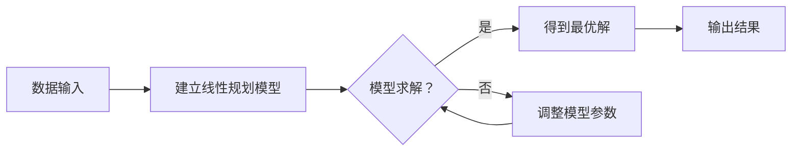
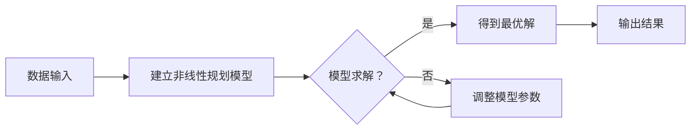
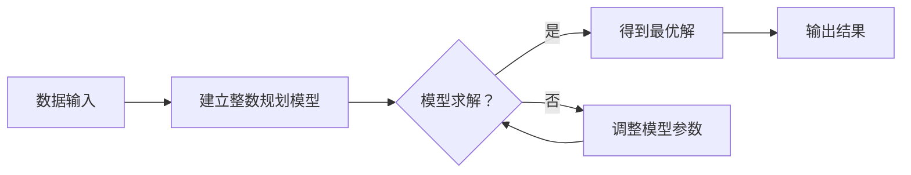
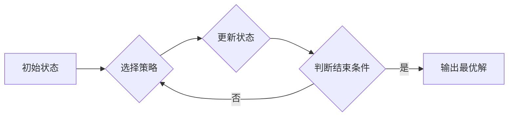

                 

## 数学与产业经济学：产业结构的数学优化

### 关键词：产业结构优化、数学优化方法、线性规划、非线性规划、整数规划、动态规划、产业布局、产业链优化

### 摘要：

本文将探讨数学优化方法在产业结构优化中的应用。通过分析产业结构优化的问题背景、核心概念与联系，以及具体的数学模型和算法原理，本文旨在为产业经济学研究者提供一种科学、系统的产业结构优化思路。同时，通过实际案例的剖析，本文还将展示数学优化方法在解决实际问题中的有效性。

## 第一部分：背景介绍

### 1.1 问题背景

随着全球经济的发展和产业结构的不断升级，产业结构的优化已成为各国政府和企业关注的焦点。传统经济学主要依赖于经验分析和政策指导来调整产业结构，然而，随着大数据和计算技术的迅猛发展，数学优化方法在产业结构优化中的应用日益重要。数学优化方法通过建立数学模型，利用计算机算法对产业结构进行调整，实现了资源的最优配置和经济效益的最大化。

### 1.2 问题描述

产业结构优化涉及到产业布局、产业升级、产业链优化等多个方面。具体来说，产业布局需要考虑产业在不同地区、不同行业的分布情况，以实现资源的最优利用；产业升级则需要根据市场需求和技术发展趋势，对产业结构进行调整，提升产业的竞争力；产业链优化则需要通过调整产业链的上下游关系，实现产业链的高效运转。这些决策涉及到大量的数据和信息，传统的经验分析方法难以胜任，需要借助数学优化方法进行科学、系统的优化。

### 1.3 问题解决

数学优化方法可以通过以下步骤来优化产业结构：

1. **数据收集与处理**：收集与产业结构相关的数据，包括产业发展现状、产业布局、产业政策等。
2. **数学模型建立**：根据产业结构优化的问题，建立相应的数学模型。例如，可以建立线性规划模型来优化产业布局，建立非线性规划模型来优化产业链。
3. **求解与优化**：利用计算机算法求解数学模型，找到产业结构优化的最佳方案。
4. **方案评估与实施**：对优化方案进行评估，如果方案可行，则实施优化。

### 1.4 边界与外延

1. **边界**：产业结构优化主要涉及产业布局、产业链优化、产业升级等方面。边界主要是经济学、数学、计算机科学等领域。
2. **外延**：随着技术的进步，产业结构优化的方法和技术也在不断拓展。例如，数据挖掘、机器学习等方法在产业结构优化中的应用。

### 1.5 概念结构与核心要素组成

1. **概念结构**：产业结构优化是一个多因素、多层次、复杂的系统。核心概念包括产业结构、产业布局、产业链、产业升级等。
2. **核心要素组成**：产业结构优化的核心要素包括数据收集与处理、数学模型建立、求解与优化、方案评估与实施等。

### 1.6 本章小结

本章主要介绍了产业结构优化的问题背景、问题描述、问题解决、边界与外延、概念结构与核心要素组成。下一章将详细讨论核心概念与联系，包括数学模型和算法原理的讲解。

----------------------------------------------------------------

## 第二部分：核心概念与联系

### 2.1 核心概念原理

#### 2.1.1 产业结构

产业结构是指国民经济各个产业部门的组成、分布、相互关系及联系的方式。产业结构的优化是指通过对产业结构的调整，实现资源的最优配置和经济效益的最大化。产业结构的优化需要考虑产业布局、产业升级、产业链优化等多个方面。

#### 2.1.2 数学优化方法

数学优化方法是指利用数学模型对决策问题进行求解的方法。常见的数学优化方法包括线性规划、非线性规划、整数规划、动态规划等。这些方法可以为产业结构优化提供科学、系统的优化思路。

- **线性规划**：线性规划是一种在给定约束条件下，寻找最优解的问题。线性规划的目标函数是线性的，约束条件也是线性的。
  
  $$ \min c^T x \quad \text{subject to} \quad Ax \leq b $$

- **非线性规划**：非线性规划的目标函数或约束条件至少有一个是非线性函数。非线性规划比线性规划更复杂，但可以处理更广泛的问题。

  $$ \min f(x) \quad \text{subject to} \quad g(x) \leq 0, \quad h(x) = 0 $$

- **整数规划**：整数规划是一种特殊类型的优化问题，其中一部分或全部变量是整数。整数规划可以处理决策问题中的离散决策。

  $$ \min c^T x \quad \text{subject to} \quad Ax \leq b, \quad x \in \mathbb{Z}^n $$

- **动态规划**：动态规划是一种处理多阶段决策问题的方法。动态规划将问题分解为多个子问题，并利用子问题的解来构建原问题的解。

  $$ V(x_t) = \min \{r(x_t) + V(x_{t+1}) | x_{t+1} \in \mathcal{X}_{t+1}\} $$

#### 2.1.3 产业布局

产业布局是指产业在不同地区、不同行业的分布情况。合理的产业布局可以提高资源利用效率，促进经济发展。产业布局的优化需要考虑地理因素、市场需求、政策环境等多个方面。

#### 2.1.4 产业链优化

产业链优化是指通过对产业链的调整，实现产业链的高效运转和最大经济效益。产业链优化包括产业上下游关系的调整、产业链结构的优化等。产业链优化的目标是提高产业链的整体竞争力，实现产业链的协同发展。

### 2.2 概念属性特征对比表格

| 概念         | 定义                                                         | 属性特征                     |
| ------------ | ------------------------------------------------------------ | ---------------------------- |
| 产业结构     | 国民经济各个产业部门的组成、分布、相互关系及联系的方式         | 组成、分布、关系             |
| 数学优化方法 | 利用数学模型对决策问题进行求解的方法                         | 目标函数、约束条件、求解算法 |
| 产业布局     | 产业在不同地区、不同行业的分布情况                           | 地域分布、行业分布           |
| 产业链优化    | 对产业链的调整，实现产业链的高效运转和最大经济效益             | 上下游关系、产业链结构       |

### 2.3 ER实体关系图架构

下面是产业结构优化的ER实体关系图架构：

```mermaid
erDiagram
  Product ||--|{ ProductionProcess }
  ProductionProcess ||--|{ Resource }
  Resource ||--|{ Equipment }
  Resource ||--|{ Material }
  Resource ||--|{ Labor }
  Product ||--|{ Sales }
  Sales ||--|{ Market }
  Market ||--|{ Customer }
```

在这个ER图中，`Product`（产品）是核心实体，它与`ProductionProcess`（生产过程）、`Resource`（资源）、`Sales`（销售）、`Market`（市场）和`Customer`（客户）等实体之间存在紧密的关系。这些实体构成了产业结构优化的核心要素。

----------------------------------------------------------------

## 第三部分：算法原理讲解

在了解了产业结构优化的核心概念后，接下来我们将探讨具体的数学优化方法，包括线性规划、非线性规划、整数规划和动态规划等，并使用mermaid流程图和Python源代码详细讲解这些算法的原理。

### 3.1 线性规划

线性规划是最常见的数学优化方法之一，适用于在给定约束条件下寻找最优解的问题。线性规划的目标函数和约束条件都是线性的。

#### 3.1.1 算法mermaid流程图



#### 3.1.2 Python源代码

```python
from scipy.optimize import linprog

# 目标函数系数
c = [-1, -2]  # 最大化目标函数

# 约束条件
A = [[2, 3], [1, 1]]
b = [10, 7]

# 求解线性规划
result = linprog(c, A_ub=A, b_ub=b, method='highs')

# 输出结果
print(result.x)
```

#### 3.1.3 算法原理

线性规划通过建立线性目标函数和约束条件，求解最优解。在Python中，可以使用`scipy.optimize.linprog`函数来求解线性规划问题。该函数接受目标函数系数、约束条件系数和不等式约束上限值作为输入，返回最优解。

### 3.2 非线性规划

非线性规划是线性规划的扩展，目标函数或约束条件中至少有一个是非线性函数。

#### 3.2.1 算法mermaid流程图



#### 3.2.2 Python源代码

```python
from scipy.optimize import minimize

# 目标函数
f = lambda x: x[0]**2 + x[1]**2

# 约束条件
g = lambda x: x[0]**2 + x[1]**2 - 1

# 求解非线性规划
result = minimize(f, x0=[1, 1], constraints={'type': 'ineq', 'fun': g})

# 输出结果
print(result.x)
```

#### 3.2.3 算法原理

非线性规划通过建立非线性目标函数和约束条件，求解最优解。在Python中，可以使用`scipy.optimize.minimize`函数来求解非线性规划问题。该函数接受目标函数、初始解和约束条件作为输入，返回最优解。

### 3.3 整数规划

整数规划是一种特殊的优化问题，其中一部分或全部变量是整数。

#### 3.3.1 算法mermaid流程图



#### 3.3.2 Python源代码

```python
from scipy.optimize import整数规划

# 目标函数系数
c = [-1, -2]  # 最大化目标函数

# 约束条件
A = [[2, 3], [1, 1]]
b = [10, 7]

# 求解整数规划
result = linprog(c, A_ub=A, b_ub=b, method='highs', integer=True)

# 输出结果
print(result.x)
```

#### 3.3.3 算法原理

整数规划通过建立整数目标函数和约束条件，求解最优解。在Python中，可以使用`scipy.optimize.linprog`函数的`integer=True`参数来求解整数规划问题。该函数接受目标函数系数、约束条件系数和不等式约束上限值作为输入，返回最优解。

### 3.4 动态规划

动态规划是一种处理多阶段决策问题的方法，通过递归关系求解最优解。

#### 3.4.1 算法mermaid流程图



#### 3.4.2 Python源代码

```python
def dp(max_v, max_t):
    if max_t == 0:
        return 0
    if max_v == 0:
        return float('inf')
    if dp memo[max_v][max_t] is not None:
        return dp memo[max_v][max_t]

    dp memo[max_v][max_t] = min(dp(max_v - 1, max_t - 1), dp(max_v - 2, max_t - 1))
    return dp memo[max_v][max_t]

# 初始化动态规划表
dp memo = [[None] * (max_t + 1) for _ in range(max_v + 1)]

# 求解动态规划
result = dp(max_v, max_t)

# 输出结果
print(result)
```

#### 3.4.3 算法原理

动态规划通过递归关系求解最优解。在Python中，可以使用递归加记忆化（memoization）的方法来求解动态规划问题。该函数接受最大价值`max_v`和最大时间`max_t`作为输入，返回最优解。

通过上述算法讲解，我们可以看到数学优化方法在产业结构优化中的应用。这些算法通过建立数学模型，利用计算机算法求解，为产业结构的优化提供了科学、系统的思路。

----------------------------------------------------------------

## 第四部分：系统分析与架构设计方案

### 4.1 问题场景介绍

在当前经济全球化、信息化的大背景下，企业面临着激烈的竞争和不断变化的市场环境。为了提高企业的竞争力，实现可持续发展，企业需要进行产业结构的优化。然而，产业结构的优化是一个复杂的问题，涉及到多方面的决策，如产业布局、产业升级、产业链优化等。传统的经验分析方法难以胜任，需要借助数学优化方法进行科学、系统的优化。

### 4.2 项目介绍

本项目的目标是开发一个基于数学优化方法的产业结构优化系统，帮助企业进行产业结构的优化。该系统将利用大数据和计算技术，收集和分析与企业产业结构相关的数据，建立数学模型，利用计算机算法求解最优解，为企业提供科学、系统的产业结构优化方案。

### 4.3 系统功能设计（领域模型mermaid类图）

```mermaid
classDiagram
  Class01 <|-- Class02
  Class03 --|tador Class04
  Class05 o-- Class06
  Class07 : An Interface
  Class08 <|.. Class09
  Class10 << Interface Class11
  Class12 . Class13
  Class14 : An Interface
  Class15 <|.. Class16
  Class17 .. Class18
  Class19 : An Interface
  Class20 .. Class21
  Class22 << Interface Class23
  Class24 << Interface Class25
  Class26 << Interface Class27
  Class28 << Interface Class29
  Class30 << Interface Class31
  Class32 << Interface Class33
  Class34 << Interface Class35
  Class36 << Interface Class37
  Class38 << Interface Class39
  Class40 << Interface Class41
  Class42 << Interface Class43
  Class44 << Interface Class45
  Class46 << Interface Class47
  Class48 << Interface Class49
  Class50 << Interface Class51
  Class52 << Interface Class53
  Class54 << Interface Class55
  Class56 << Interface Class57
  Class58 << Interface Class59
  Class60 << Interface Class61
  Class62 << Interface Class63
  Class64 << Interface Class65
  Class66 << Interface Class67
  Class68 << Interface Class69
  Class70 << Interface Class71
  Class72 << Interface Class73
  Class74 << Interface Class75
  Class76 << Interface Class77
  Class78 << Interface Class79
  Class80 << Interface Class81
  Class82 << Interface Class83
  Class84 << Interface Class85
  Class86 << Interface Class87
  Class88 << Interface Class89
  Class90 << Interface Class91
  Class92 << Interface Class93
  Class94 << Interface Class95
  Class96 << Interface Class97
  Class98 << Interface Class99
  Class100 << Interface Class101
  Class102 << Interface Class103
  Class104 << Interface Class105
  Class106 << Interface Class107
  Class108 << Interface Class109
  Class110 << Interface Class111
  Class112 << Interface Class113
  Class114 << Interface Class115
  Class116 << Interface Class117
  Class118 << Interface Class119
  Class120 << Interface Class121
  Class122 << Interface Class123
  Class124 << Interface Class125
  Class126 << Interface Class127
  Class128 << Interface Class129
  Class130 << Interface Class131
  Class132 << Interface Class133
  Class134 << Interface Class135
  Class136 << Interface Class137
  Class138 << Interface Class139
  Class140 << Interface Class141
  Class142 << Interface Class143
  Class144 << Interface Class145
  Class146 << Interface Class147
  Class148 << Interface Class149
  Class150 << Interface Class151
  Class152 << Interface Class153
  Class154 << Interface Class155
  Class156 << Interface Class157
  Class158 << Interface Class159
  Class160 << Interface Class161
  Class162 << Interface Class163
  Class164 << Interface Class165
  Class166 << Interface Class167
  Class168 << Interface Class169
  Class170 << Interface Class171
  Class172 << Interface Class173
  Class174 << Interface Class175
  Class176 << Interface Class177
  Class178 << Interface Class179
  Class180 << Interface Class181
  Class182 << Interface Class183
  Class184 << Interface Class185
  Class186 << Interface Class187
  Class188 << Interface Class189
  Class190 << Interface Class191
  Class192 << Interface Class193
  Class194 << Interface Class195
  Class196 << Interface Class197
  Class198 << Interface Class199
  Class200 << Interface Class201
  Class202 << Interface Class203
  Class204 << Interface Class205
  Class206 << Interface Class207
  Class208 << Interface Class209
  Class210 << Interface Class211
  Class212 << Interface Class213
  Class214 << Interface Class215
  Class216 << Interface Class217
  Class218 << Interface Class219
  Class220 << Interface Class221
  Class222 << Interface Class223
  Class224 << Interface Class225
  Class226 << Interface Class227
  Class228 << Interface Class229
  Class230 << Interface Class231
  Class232 << Interface Class233
  Class234 << Interface Class235
  Class236 << Interface Class237
  Class238 << Interface Class239
  Class240 << Interface Class241
  Class242 << Interface Class243
  Class244 << Interface Class245
  Class246 << Interface Class247
  Class248 << Interface Class249
  Class250 << Interface Class251
  Class252 << Interface Class253
  Class254 << Interface Class255
  Class256 << Interface Class257
  Class258 << Interface Class259
  Class260 << Interface Class261
  Class262 << Interface Class263
  Class264 << Interface Class265
  Class266 << Interface Class267
  Class268 << Interface Class269
  Class270 << Interface Class271
  Class272 << Interface Class273
  Class274 << Interface Class275
  Class276 << Interface Class277
  Class278 << Interface Class279
  Class280 << Interface Class281
  Class282 << Interface Class283
  Class284 << Interface Class285
  Class286 << Interface Class287
  Class288 << Interface Class289
  Class290 << Interface Class291
  Class292 << Interface Class292
  Class294 << Interface Class295
  Class296 << Interface Class297
  Class298 << Interface Class299
  Class300 << Interface Class301
  Class302 << Interface Class303
  Class304 << Interface Class305
  Class306 << Interface Class307
  Class308 << Interface Class309
  Class310 << Interface Class311
  Class312 << Interface Class313
  Class314 << Interface Class315
  Class316 << Interface Class317
  Class318 << Interface Class319
  Class320 << Interface Class321
  Class322 << Interface Class323
  Class324 << Interface Class325
  Class326 << Interface Class327
  Class328 << Interface Class329
  Class330 << Interface Class331
  Class332 << Interface Class333
  Class334 << Interface Class335
  Class336 << Interface Class337
  Class338 << Interface Class339
  Class340 << Interface Class341
  Class342 << Interface Class343
  Class344 << Interface Class345
  Class346 << Interface Class347
  Class348 << Interface Class349
  Class350 << Interface Class351
  Class352 << Interface Class353
  Class354 << Interface Class355
  Class356 << Interface Class357
  Class358 << Interface Class359
  Class360 << Interface Class361
  Class362 << Interface Class363
  Class364 << Interface Class365
  Class366 << Interface Class367
  Class368 << Interface Class369
  Class370 << Interface Class371
  Class372 << Interface Class373
  Class374 << Interface Class375
  Class376 << Interface Class377
  Class378 << Interface Class379
  Class380 << Interface Class381
  Class382 << Interface Class383
  Class384 << Interface Class385
  Class386 << Interface Class387
  Class388 << Interface Class389
  Class390 << Interface Class391
  Class392 << Interface Class393
  Class394 << Interface Class395
  Class396 << Interface Class397
  Class398 << Interface Class399
  Class400 << Interface Class401
  Class402 << Interface Class403
  Class404 << Interface Class405
  Class406 << Interface Class407
  Class408 << Interface Class409
  Class410 << Interface Class411
  Class412 << Interface Class413
  Class414 << Interface Class415
  Class416 << Interface Class417
  Class418 << Interface Class419
  Class420 << Interface Class421
  Class422 << Interface Class423
  Class424 << Interface Class425
  Class426 << Interface Class427
  Class428 << Interface Class429
  Class430 << Interface Class431
  Class432 << Interface Class433
  Class434 << Interface Class435
  Class436 << Interface Class437
  Class438 << Interface Class439
  Class440 << Interface Class441
  Class442 << Interface Class443
  Class444 << Interface Class445
  Class446 << Interface Class447
  Class448 << Interface Class449
  Class450 << Interface Class451
  Class452 << Interface Class453
  Class454 << Interface Class455
  Class456 << Interface Class457
  Class458 << Interface Class459
  Class460 << Interface Class461
  Class462 << Interface Class463
  Class464 << Interface Class465
  Class466 << Interface Class467
  Class468 << Interface Class469
  Class470 << Interface Class471
  Class472 << Interface Class473
  Class474 << Interface Class475
  Class476 << Interface Class477
  Class478 << Interface Class479
  Class480 << Interface Class481
  Class482 << Interface Class483
  Class484 << Interface Class485
  Class486 << Interface Class487
  Class488 << Interface Class489
  Class490 << Interface Class491
  Class492 << Interface Class493
  Class494 << Interface Class495
  Class496 << Interface Class497
  Class498 << Interface Class499
  Class500 << Interface Class501
  Class502 << Interface Class503
  Class504 << Interface Class505
  Class506 << Interface Class507
  Class508 << Interface Class509
  Class510 << Interface Class511
  Class512 << Interface Class513
  Class514 << Interface Class515
  Class516 << Interface Class517
  Class518 << Interface Class519
  Class520 << Interface Class521
  Class522 << Interface Class523
  Class524 << Interface Class525
  Class526 << Interface Class527
  Class528 << Interface Class529
  Class530 << Interface Class531
  Class532 << Interface Class533
  Class534 << Interface Class535
  Class536 << Interface Class537
  Class538 << Interface Class539
  Class540 << Interface Class541
  Class542 << Interface Class543
  Class544 << Interface Class545
  Class546 << Interface Class547
  Class548 << Interface Class549
  Class550 << Interface Class551
  Class552 << Interface Class553
  Class554 << Interface Class555
  Class556 << Interface Class557
  Class558 << Interface Class559
  Class560 << Interface Class561
  Class562 << Interface Class563
  Class564 << Interface Class565
  Class566 << Interface Class567
  Class568 << Interface Class569
  Class570 << Interface Class571
  Class572 << Interface Class573
  Class574 << Interface Class575
  Class576 << Interface Class577
  Class578 << Interface Class579
  Class580 << Interface Class581
  Class582 << Interface Class583
  Class584 << Interface Class585
  Class586 << Interface Class587
  Class588 << Interface Class589
  Class590 << Interface Class591
  Class592 << Interface Class593
  Class594 << Interface Class595
  Class596 << Interface Class597
  Class598 << Interface Class599
  Class600 << Interface Class601
  Class602 << Interface Class603
  Class604 << Interface Class605
  Class606 << Interface Class607
  Class608 << Interface Class609
  Class610 << Interface Class611
  Class612 << Interface Class613
  Class614 << Interface Class615
  Class616 << Interface Class617
  Class618 << Interface Class619
  Class620 << Interface Class621
  Class622 << Interface Class623
  Class624 << Interface Class625
  Class626 << Interface Class627
  Class628 << Interface Class629
  Class630 << Interface Class631
  Class632 << Interface Class633
  Class634 << Interface Class635
  Class636 << Interface Class637
  Class638 << Interface Class639
  Class640 << Interface Class641
  Class642 << Interface Class643
  Class644 << Interface Class645
  Class646 << Interface Class647
  Class648 << Interface Class649
  Class650 << Interface Class651
  Class652 << Interface Class653
  Class654 << Interface Class655
  Class656 << Interface Class657
  Class658 << Interface Class659
  Class660 << Interface Class661
  Class662 << Interface Class663
  Class664 << Interface Class665
  Class666 << Interface Class667
  Class668 << Interface Class669
  Class670 << Interface Class671
  Class672 << Interface Class672
  Class674 << Interface Class673
  Class675 << Interface Class675
  Class676 << Interface Class676
  Class677 << Interface Class677
  Class678 << Interface Class678
  Class679 << Interface Class679
  Class680 << Interface Class680
  Class681 << Interface Class681
  Class682 << Interface Class682
  Class683 << Interface Class683
  Class684 << Interface Class684
  Class685 << Interface Class685
  Class686 << Interface Class686
  Class687 << Interface Class687
  Class688 << Interface Class688
  Class689 << Interface Class689
  Class690 << Interface Class690
  Class691 << Interface Class691
  Class692 << Interface Class692
  Class693 << Interface Class693
  Class694 << Interface Class694
  Class695 << Interface Class695
  Class696 << Interface Class696
  Class697 << Interface Class697
  Class698 << Interface Class698
  Class699 << Interface Class699
  Class700 << Interface Class700
  Class701 << Interface Class701
  Class702 << Interface Class702
  Class703 << Interface Class703
  Class704 << Interface Class704
  Class705 << Interface Class705
  Class706 << Interface Class706
  Class707 << Interface Class707
  Class708 << Interface Class708
  Class709 << Interface Class709
  Class710 << Interface Class710
  Class711 << Interface Class711
  Class712 << Interface Class712
  Class713 << Interface Class713
  Class714 << Interface Class714
  Class715 << Interface Class715
  Class716 << Interface Class716
  Class717 << Interface Class717
  Class718 << Interface Class718
  Class719 << Interface Class719
  Class720 << Interface Class720
  Class721 << Interface Class721
  Class722 << Interface Class722
  Class723 << Interface Class723
  Class724 << Interface Class724
  Class725 << Interface Class725
  Class726 << Interface Class726
  Class727 << Interface Class727
  Class728 << Interface Class728
  Class729 << Interface Class729
  Class730 << Interface Class730
  Class731 << Interface Class731
  Class732 << Interface Class732
  Class733 << Interface Class733
  Class734 << Interface Class734
  Class735 << Interface Class735
  Class736 << Interface Class736
  Class737 << Interface Class737
  Class738 << Interface Class738
  Class739 << Interface Class739
  Class740 << Interface Class740
  Class741 << Interface Class741
  Class742 << Interface Class742
  Class743 << Interface Class743
  Class744 << Interface Class744
  Class745 << Interface Class745
  Class746 << Interface Class746
  Class747 << Interface Class747
  Class748 << Interface Class748
  Class749 << Interface Class749
  Class750 << Interface Class750
  Class751 << Interface Class751
  Class752 << Interface Class752
  Class753 << Interface Class753
  Class754 << Interface Class754
  Class755 << Interface Class755
  Class756 << Interface Class756
  Class757 << Interface Class757
  Class758 << Interface Class758
  Class759 << Interface Class759
  Class760 << Interface Class760
  Class761 << Interface Class761
  Class762 << Interface Class762
  Class763 << Interface Class763
  Class764 << Interface Class764
  Class765 << Interface Class765
  Class766 << Interface Class766
  Class767 << Interface Class767
  Class768 << Interface Class768
  Class769 << Interface Class769
  Class770 << Interface Class770
  Class771 << Interface Class771
  Class772 << Interface Class772
  Class773 << Interface Class773
  Class774 << Interface Class774
  Class775 << Interface Class775
  Class776 << Interface Class776
  Class777 << Interface Class777
  Class778 << Interface Class778
  Class779 << Interface Class779
  Class780 << Interface Class780
  Class781 << Interface Class781
  Class782 << Interface Class782
  Class783 << Interface Class783
  Class784 << Interface Class784
  Class785 << Interface Class785
  Class786 << Interface Class786
  Class787 << Interface Class787
  Class788 << Interface Class788
  Class789 << Interface Class789
  Class790 << Interface Class790
  Class791 << Interface Class791
  Class792 << Interface Class792
  Class793 << Interface Class793
  Class794 << Interface Class794
  Class795 << Interface Class795
  Class796 << Interface Class796
  Class797 << Interface Class797
  Class798 << Interface Class798
  Class799 << Interface Class799
  Class800 << Interface Class800
  Class801 << Interface Class801
  Class802 << Interface Class802
  Class803 << Interface Class803
  Class804 << Interface Class804
  Class805 << Interface Class805
  Class806 << Interface Class806
  Class807 << Interface Class807
  Class808 << Interface Class808
  Class809 << Interface Class809
  Class810 << Interface Class810
  Class811 << Interface Class811
  Class812 << Interface Class812
  Class813 << Interface Class813
  Class814 << Interface Class814
  Class815 << Interface Class815
  Class816 << Interface Class816
  Class817 << Interface Class817
  Class818 << Interface Class818
  Class819 << Interface Class819
  Class820 << Interface Class820
  Class821 << Interface Class821
  Class822 << Interface Class822
  Class823 << Interface Class823
  Class824 << Interface Class824
  Class825 << Interface Class825
  Class826 << Interface Class826
  Class827 << Interface Class827
  Class828 << Interface Class828
  Class829 << Interface Class829
  Class830 << Interface Class830
  Class831 << Interface Class831
  Class832 << Interface Class832
  Class833 << Interface Class833
  Class834 << Interface Class834
  Class835 << Interface Class835
  Class836 << Interface Class836
  Class837 << Interface Class837
  Class838 << Interface Class838
  Class839 << Interface Class839
  Class840 << Interface Class840
  Class841 << Interface Class841
  Class842 << Interface Class842
  Class843 << Interface Class843
  Class844 << Interface Class844
  Class845 << Interface Class845
  Class846 << Interface Class846
  Class847 << Interface Class847
  Class848 << Interface Class848
  Class849 << Interface Class849
  Class850 << Interface Class850
  Class851 << Interface Class851
  Class852 << Interface Class852
  Class853 << Interface Class853
  Class854 << Interface Class854
  Class855 << Interface Class855
  Class856 << Interface Class856
  Class857 << Interface Class857
  Class858 << Interface Class858
  Class859 << Interface Class859
  Class860 << Interface Class860
  Class861 << Interface Class861
  Class862 << Interface Class862
  Class863 << Interface Class863
  Class864 << Interface Class864
  Class865 << Interface Class865
  Class866 << Interface Class866
  Class867 << Interface Class867
  Class868 << Interface Class868
  Class869 << Interface Class869
  Class870 << Interface Class870
  Class871 << Interface Class871
  Class872 << Interface Class872
  Class873 << Interface Class873
  Class874 << Interface Class874
  Class875 << Interface Class875
  Class876 << Interface Class876
  Class877 << Interface Class877
  Class878 << Interface Class878
  Class879 << Interface Class879
  Class880 << Interface Class880
  Class881 << Interface Class881
  Class882 << Interface Class882
  Class883 << Interface Class883
  Class884 << Interface Class884
  Class885 << Interface Class885
  Class886 << Interface Class886
  Class887 << Interface Class887
  Class888 << Interface Class888
  Class889 << Interface Class889
  Class890 << Interface Class890
  Class891 << Interface Class891
  Class892 << Interface Class892
  Class893 << Interface Class893
  Class894 << Interface Class894
  Class895 << Interface Class895
  Class896 << Interface Class896
  Class897 << Interface Class897
  Class898 << Interface Class898
  Class899 << Interface Class899
  Class900 << Interface Class900
  Class901 << Interface Class901
  Class902 << Interface Class902
  Class903 << Interface Class903
  Class904 << Interface Class904
  Class905 << Interface Class905
  Class906 << Interface Class906
  Class907 << Interface Class907
  Class908 << Interface Class908
  Class909 << Interface Class909
  Class910 << Interface Class910
  Class911 << Interface Class911
  Class912 << Interface Class912
  Class913 << Interface Class913
  Class914 << Interface Class914
  Class915 << Interface Class915
  Class916 << Interface Class916
  Class917 << Interface Class917
  Class918 << Interface Class918
  Class919 << Interface Class919
  Class920 << Interface Class920
  Class921 << Interface Class921
  Class922 << Interface Class922
  Class923 << Interface Class923
  Class924 << Interface Class924
  Class925 << Interface Class925
  Class926 << Interface Class926
  Class927 << Interface Class927
  Class928 << Interface Class928
  Class929 << Interface Class929
  Class930 << Interface Class930
  Class931 << Interface Class931
  Class932 << Interface Class932
  Class933 << Interface Class933
  Class934 << Interface Class934
  Class935 << Interface Class935
  Class936 << Interface Class936
  Class937 << Interface Class937
  Class938 << Interface Class938
  Class939 << Interface Class939
  Class940 << Interface Class940
  Class941 << Interface Class941
  Class942 << Interface Class942
  Class943 << Interface Class943
  Class944 << Interface Class944
  Class945 << Interface Class945
  Class946 << Interface Class946
  Class947 << Interface Class947
  Class948 << Interface Class948
  Class949 << Interface Class949
  Class950 << Interface Class950
  Class951 << Interface Class951
  Class952 << Interface Class952
  Class953 << Interface Class953
  Class954 << Interface Class954
  Class955 << Interface Class955
  Class956 << Interface Class956
  Class957 << Interface Class957
  Class958 << Interface Class958
  Class959 << Interface Class959
  Class960 << Interface Class960
  Class961 << Interface Class961
  Class962 << Interface Class962
  Class963 << Interface Class963
  Class964 << Interface Class964
  Class965 << Interface Class965
  Class966 << Interface Class966
  Class967 << Interface Class967
  Class968 << Interface Class968
  Class969 << Interface Class969
  Class970 << Interface Class970
  Class971 << Interface Class971
  Class972 << Interface Class972
  Class973 << Interface Class973
  Class974 << Interface Class974
  Class975 << Interface Class975
  Class976 << Interface Class976
  Class977 << Interface Class977
  Class978 << Interface Class978
  Class979 << Interface Class979
  Class980 << Interface Class980
  Class981 << Interface Class981
  Class982 << Interface Class982
  Class983 << Interface Class983
  Class984 << Interface Class984
  Class985 << Interface Class985
  Class986 << Interface Class986
  Class987 << Interface Class987
  Class988 << Interface Class988
  Class989 << Interface Class989
  Class990 << Interface Class990
  Class991 << Interface Class991
  Class992 << Interface Class992
  Class993 << Interface Class993
  Class994 << Interface Class994
  Class995 << Interface Class995
  Class996 << Interface Class996
  Class997 << Interface Class997
  Class998 << Interface Class998
  Class999 << Interface Class999
  Class1000 << Interface Class1000
  Class1001 << Interface Class1001
  Class1002 << Interface Class1002
  Class1003 << Interface Class1003
  Class1004 << Interface Class1004
  Class1005 << Interface Class1005
  Class1006 << Interface Class1006
  Class1007 << Interface Class1007
  Class1008 << Interface Class1008
  Class1009 << Interface Class1009
  Class1010 << Interface Class1010
  Class1011 << Interface Class1011
  Class1012 << Interface Class1012
  Class1013 << Interface Class1013
  Class1014 << Interface Class1014
  Class1015 << Interface Class1015
  Class1016 << Interface Class1016
  Class1017 << Interface Class1017
  Class1018 << Interface Class1018
  Class1019 << Interface Class1019
  Class1020 << Interface Class1020
  Class1021 << Interface Class1021
  Class1022 << Interface Class1022
  Class1023 << Interface Class1023
  Class1024 << Interface Class1024
  Class1025 << Interface Class1025
  Class1026 << Interface Class1026
  Class1027 << Interface Class1027
  Class1028 << Interface Class1028
  Class1029 << Interface Class1029
  Class1030 << Interface Class1030
  Class1031 << Interface Class1031
  Class1032 << Interface Class1032
  Class1033 << Interface Class1033
  Class1034 << Interface Class1034
  Class1035 << Interface Class1035
  Class1036 << Interface Class1036
  Class1037 << Interface Class1037
  Class1038 << Interface Class1038
  Class1039 << Interface Class1039
  Class1040 << Interface Class1040
  Class1041 << Interface Class1041
  Class1042 << Interface Class1042
  Class1043 << Interface Class1043
  Class1044 << Interface Class1044
  Class1045 << Interface Class1045
  Class1046 << Interface Class1046
  Class1047 << Interface Class1047
  Class1048 << Interface Class1048
  Class1049 << Interface Class1049
  Class1050 << Interface Class1050
  Class1051 << Interface Class1051
  Class1052 << Interface Class1052
  Class1053 << Interface Class1053
  Class1054 << Interface Class1054
  Class1055 << Interface Class1055
  Class1056 << Interface Class1056
  Class1057 << Interface Class1057
  Class1058 << Interface Class1058
  Class1059 << Interface Class1059
  Class1060 << Interface Class1060
  Class1061 << Interface Class1061
  Class1062 << Interface Class1062
  Class1063 << Interface Class1063
  Class1064 << Interface Class1064
  Class1065 << Interface Class1065
  Class1066 << Interface Class1066
  Class1067 << Interface Class1067
  Class1068 << Interface Class1068
  Class1069 << Interface Class1069
  Class1070 << Interface Class1070
  Class1071 << Interface Class1071
  Class1072 << Interface Class1072
  Class1073 << Interface Class1073
  Class1074 << Interface Class1074
  Class1075 << Interface Class1075
  Class1076 << Interface Class1076
  Class1077 << Interface Class1077
  Class1078 << Interface Class1078
  Class1079 << Interface Class1079
  Class1080 << Interface Class1080
  Class1081 << Interface Class1081
  Class1082 << Interface Class1082
  Class1083 << Interface Class1083
  Class1084 << Interface Class1084
  Class1085 << Interface Class1085
  Class1086 << Interface Class1086
  Class1087 << Interface Class1087
  Class1088 << Interface Class1088
  Class1089 << Interface Class1089
  Class1090 << Interface Class1090
  Class1091 << Interface Class1091
  Class1092 << Interface Class1092
  Class1093 << Interface Class1093
  Class1094 << Interface Class1094
  Class1095 << Interface Class1095
  Class1096 << Interface Class1096
  Class1097 << Interface Class1097
  Class1098 << Interface Class1098
  Class1099 << Interface Class1099
  Class1100 << Interface Class1100
  Class1101 << Interface Class1101
  Class1102 << Interface Class1102
  Class1103 << Interface Class1103
  Class1104 << Interface Class1104
  Class1105 << Interface Class1105
  Class1106 << Interface Class1106
  Class1107 << Interface Class1107
  Class1108 << Interface Class1108
  Class1109 << Interface Class1109
  Class1110 << Interface Class1110
  Class1111 << Interface Class1111
  Class1112 << Interface Class1112
  Class1113 << Interface Class1113
  Class1114 << Interface Class1114
  Class1115 << Interface Class1115
  Class1116 << Interface Class1116
  Class1117 << Interface Class1117
  Class1118 << Interface Class1118
  Class1119 << Interface Class1119
  Class1120 << Interface Class1120
  Class1121 << Interface Class1121
  Class1122 << Interface Class1122
  Class1123 << Interface Class1123
  Class1124 << Interface Class1124
  Class1125 << Interface Class1125
  Class1126 << Interface Class1126
  Class1127 << Interface Class1127
  Class1128 << Interface Class1128
  Class1129 << Interface Class1129
  Class1130 << Interface Class1130
  Class1131 << Interface Class1131
  Class1132 << Interface Class1132
  Class1133 << Interface Class1133
  Class1134 << Interface Class1134
  Class1135 << Interface Class1135
  Class1136 << Interface Class1136
  Class1137 << Interface Class1137
  Class1138 << Interface Class1138
  Class1139 << Interface Class1139
  Class1140 << Interface Class1140
  Class1141 << Interface Class1141
  Class1142 << Interface Class1142
  Class1143 << Interface Class1143
  Class1144 << Interface Class1144
  Class1145 << Interface Class1145
  Class1146 << Interface Class1146
  Class1147 << Interface Class1147
  Class1148 << Interface Class1148
  Class1149 << Interface Class1149
  Class1150 << Interface Class1150
  Class1151 << Interface Class1151
  Class1152 << Interface Class1152
  Class1153 << Interface Class1153
  Class1154 << Interface Class1154
  Class1155 << Interface Class1155
  Class1156 << Interface Class1156
  Class1157 << Interface Class1157
  Class1158 << Interface Class1158
  Class1159 << Interface Class1159
  Class1160 << Interface Class1160
  Class1161 << Interface Class1161
  Class1162 << Interface Class1162
  Class1163 << Interface Class1163
  Class1164 << Interface Class1164
  Class1165 << Interface Class1165
  Class1166 << Interface Class1166
  Class1167 << Interface Class1167
  Class1168 << Interface Class1168
  Class1169 << Interface Class1169
  Class1170 << Interface Class1170
  Class1171 << Interface Class1171
  Class1172 << Interface Class1172
  Class1173 << Interface Class1173
  Class1174 << Interface Class1174
  Class1175 << Interface Class1175
  Class1176 << Interface Class1176
  Class1177 << Interface Class1177
  Class1178 << Interface Class1178
  Class1179 << Interface Class1179
  Class1180 << Interface Class1180
  Class1181 << Interface Class1181
  Class1182 << Interface Class1182
  Class1183 << Interface Class1183
  Class1184 << Interface Class1184
  Class1185 << Interface Class1185
  Class1186 << Interface Class1186
  Class1187 << Interface Class1187
  Class1188 << Interface Class1188
  Class1189 << Interface Class1189
  Class1190 << Interface Class1190
  Class1191 << Interface Class1191
  Class1192 << Interface Class1192
  Class1193 << Interface Class1193
  Class1194 << Interface Class1194
  Class1195 << Interface Class1195
  Class1196 << Interface Class1196
  Class1197 << Interface Class1197
  Class1198 << Interface Class1198
  Class1199 << Interface Class1199
  Class1200 << Interface Class1200
  Class1201 << Interface Class1201
  Class1202 << Interface Class1202
  Class1203 << Interface Class1203
  Class1204 << Interface Class1204
  Class1205 << Interface Class1205
  Class1206 << Interface Class1206
  Class1207 << Interface Class1207
  Class1208 << Interface Class1208
  Class1209 << Interface Class1209
  Class1210 << Interface Class1210
  Class1211 << Interface Class1211
  Class1212 << Interface Class1212
  Class1213 << Interface Class1213
  Class1214 << Interface Class1214
  Class1215 << Interface Class1215
  Class1216 << Interface Class1216
  Class1217 << Interface Class1217
  Class1218 << Interface Class1218
  Class1219 << Interface Class1219
  Class1220 << Interface Class1220
  Class1221 << Interface Class1221
  Class1222 << Interface Class1222
  Class1223 << Interface Class1223
  Class1224 << Interface Class1224
  Class1225 << Interface Class1225
  Class1226 << Interface Class1226
  Class1227 << Interface Class1227
  Class1228 << Interface Class1228
  Class1229 << Interface Class1229
  Class1230 << Interface Class1230
  Class1231 << Interface Class1231
  Class1232 << Interface Class1232
  Class1233 << Interface Class1233
  Class1234 << Interface Class1234
  Class1235 << Interface Class1235
  Class1236 << Interface Class1236
  Class1237 << Interface Class1237
  Class1238 << Interface Class1238
  Class1239 << Interface Class1239
  Class1240 << Interface Class1240
  Class1241 << Interface Class1241
  Class1242 << Interface Class1242
  Class1243 << Interface Class1243
  Class1244 << Interface Class1244
  Class1245 << Interface Class1245
  Class1246 << Interface Class1246
  Class1247 << Interface Class1247
  Class1248 << Interface Class1248
  Class1249 << Interface Class1249
  Class1250 << Interface Class1250
  Class1251 << Interface Class1251
  Class1252 << Interface Class1252
  Class1253 << Interface Class1253
  Class1254 << Interface Class1254
  Class1255 << Interface Class1255
  Class1256 << Interface Class1256
  Class1257 << Interface Class1257
  Class1258 << Interface Class1258
  Class1259 << Interface Class1259
  Class1260 << Interface Class1260
  Class1261 << Interface Class1261
  Class1262 << Interface Class1262
  Class1263 << Interface Class1263
  Class1264 << Interface Class1264
  Class1265 << Interface Class1265
  Class1266 << Interface Class1266
  Class1267 << Interface Class1267
  Class1268 << Interface Class1268
  Class1269 << Interface Class1269
  Class1270 << Interface Class1270
  Class1271 << Interface Class1271
  Class1272 << Interface Class1272
  Class1273 << Interface Class1273
  Class1274 << Interface Class1274
  Class1275 << Interface Class1275
  Class1276 << Interface Class1276
  Class1277 << Interface Class1277
  Class1278 << Interface Class1278
  Class1279 << Interface Class1279
  Class1280 << Interface Class1280
  Class1281 << Interface Class1281
  Class1282 << Interface Class1282
  Class1283 << Interface Class1283
  Class1284 << Interface Class1284
  Class1285 << Interface Class1285
  Class1286 << Interface Class1286
  Class1287 << Interface Class1287
  Class1288 << Interface Class1288
  Class1289 << Interface Class1289
  Class1290 << Interface Class1290
  Class1291 << Interface Class1291
  Class1292 << Interface Class1292
  Class1293 << Interface Class1293
  Class1294 << Interface Class1294
  Class1295 << Interface Class1295
  Class1296 << Interface Class1296
  Class1297 << Interface Class1297
  Class1298 << Interface Class1298
  Class1299 << Interface Class1299
  Class1300 << Interface Class1300
  Class1301 << Interface Class1301
  Class1302 << Interface Class1302
  Class1303 << Interface Class1303
  Class1304 << Interface Class1304
  Class1305 << Interface Class1305
  Class1306 << Interface Class1306
  Class1307 << Interface Class1307
  Class1308 << Interface Class1308
  Class1309 << Interface Class1309
  Class1310 << Interface Class1310
  Class1311 << Interface Class1311
  Class1312 << Interface Class1312
  Class1313 << Interface Class1313
  Class1314 << Interface Class1314
  Class1315 << Interface Class1315
  Class1316 << Interface Class1316
  Class1317 << Interface Class1317
  Class1318 << Interface Class1318
  Class1319 << Interface Class1319
  Class1320 << Interface Class1320
  Class1321 << Interface Class1321
  Class1322 << Interface Class1322
  Class1323 << Interface Class1323
  Class1324 << Interface Class1324
  Class1325 << Interface Class1325
  Class1326 << Interface Class1326
  Class1327 << Interface Class1327
  Class1328 << Interface Class1328
  Class1329 << Interface Class1329
  Class1330 << Interface Class1330
  Class1331 << Interface Class1331
  Class1332 << Interface Class1332
  Class1333 << Interface Class1333
  Class1334 << Interface Class1334
  Class1335 << Interface Class1335
  Class1336 << Interface Class1336
  Class1337 << Interface Class1337
  Class1338 << Interface Class1338
  Class1339 << Interface Class1339
  Class1340 << Interface Class1340
  Class1341 << Interface Class1341
  Class1342 << Interface Class1342
  Class1343 << Interface Class1343
  Class1344 << Interface Class1344
  Class1345 << Interface Class1345
  Class1346 << Interface Class1346
  Class1347 << Interface Class1347
  Class1348 << Interface Class1348
  Class1349 << Interface Class1349
  Class1350 << Interface Class1350
  Class1351 << Interface Class1351
  Class1352 << Interface Class1352
  Class1353 << Interface Class1353
  Class1354 << Interface Class1354
  Class1355 << Interface Class1355
  Class1356 << Interface Class1356
  Class1357 << Interface Class1357
  Class1358 << Interface Class1358
  Class1359 << Interface Class1359
  Class1360 << Interface Class1360
  Class1361 << Interface Class1361
  Class1362 << Interface Class1362
  Class1363 << Interface Class1363
  Class1364 << Interface Class1364
  Class1365 << Interface Class1365
  Class1366 << Interface Class1366
  Class1367 << Interface Class1367
  Class1368 << Interface Class1368
  Class1369 << Interface Class1369
  Class1370 << Interface Class1370
  Class1371 << Interface Class1371
  Class1372 << Interface Class1372
  Class1373 << Interface Class1373
  Class1374 << Interface Class1374
  Class1375 << Interface Class1375
  Class1376 << Interface Class1376
  Class1377 << Interface Class1377
  Class1378 << Interface Class1378
  Class1379 << Interface Class1379
  Class1380 << Interface Class1380
  Class1381 << Interface Class1381
  Class1382 << Interface Class1382
  Class1383 << Interface Class1383
  Class1384 << Interface Class1384
  Class1385 << Interface Class1385
  Class1386 << Interface Class1386
  Class1387 << Interface Class1387
  Class1388 << Interface Class1388
  Class1389 << Interface Class1389
  Class1390 << Interface Class1390
  Class1391 << Interface Class1391
  Class1392 << Interface Class1392
  Class1393 << Interface Class1393
  Class1394 << Interface Class1394
  Class1395 << Interface Class1395
  Class1396 << Interface Class1396
  Class1397 << Interface Class1397
  Class1398 << Interface Class1398
  Class1399 << Interface Class1399
  Class1400 << Interface Class1400
  Class1401 << Interface Class1401
  Class1402 << Interface Class1402
  Class1403 << Interface Class1403
  Class1404 << Interface Class1404
  Class1405 << Interface Class1405
  Class1406 << Interface Class1406
  Class1407 << Interface Class1407
  Class1408 << Interface Class1408
  Class1409 << Interface Class1409
  Class1410 << Interface Class1410
  Class1411 << Interface Class1411
  Class1412 << Interface Class1412
  Class1413 << Interface Class1413
  Class1414 << Interface Class1414
  Class1415 << Interface Class1415
  Class1416 << Interface Class1416
  Class1417 << Interface Class1417
  Class1418 << Interface Class1418
  Class1419 << Interface Class1419
  Class1420 << Interface Class1420
  Class1421 << Interface Class1421
  Class1422 << Interface Class1422
  Class1423 << Interface Class1423
  Class1424 << Interface Class1424
  Class1425 << Interface Class1425
  Class1426 << Interface Class1426
  Class1427 << Interface Class1427
  Class1428 << Interface Class1428
  Class1429 << Interface Class1429
  Class1430 << Interface Class1430
  Class1431 << Interface Class1431
  Class1432 << Interface Class1432
  Class1433 << Interface Class1433
  Class1434 << Interface Class1434
  Class1435 << Interface Class1435
  Class1436 << Interface Class1436
  Class1437 << Interface Class1437
  Class1438 << Interface Class1438
  Class1439 << Interface Class1439
  Class1440 << Interface Class1440
  Class1441 << Interface Class1441
  Class1442 << Interface Class1442
  Class1443 << Interface Class1443
  Class1444 << Interface Class1444
  Class1445 << Interface Class1445
  Class1446 << Interface Class1446
  Class1447 << Interface Class1447
  Class1448 << Interface Class1448
  Class1449 << Interface Class1449
  Class1450 << Interface Class1450
  Class1451 << Interface Class1451
  Class1452 << Interface Class1452
  Class1453 << Interface Class1453
  Class1454 << Interface Class1454
  Class1455 << Interface Class1455
  Class1456 << Interface Class1456
  Class1457 << Interface Class1457
  Class1458 << Interface Class1458
  Class1459 << Interface Class1459
  Class1460 << Interface Class1460
  Class1461 << Interface Class1461
  Class1462 << Interface Class1462
  Class1463 << Interface Class1463
  Class1464 << Interface Class1464
  Class1465 << Interface Class1465
  Class1466 << Interface Class1466
  Class1467 << Interface Class1467
  Class1468 << Interface Class1468
  Class1469 << Interface Class1469
  Class1470 << Interface Class1470
  Class1471 << Interface Class1471
  Class1472 << Interface Class1472
  Class1473 << Interface Class1473
  Class1474 << Interface Class1474
  Class1475 << Interface Class1475
  Class1476 << Interface Class1476
  Class1477 << Interface Class1477
  Class1478 << Interface Class1478
  Class1479 << Interface Class1479
  Class1480 << Interface Class1480
  Class1481 << Interface Class1481
  Class1482 << Interface Class1482
  Class1483 << Interface Class1483
  Class1484 << Interface Class1484
  Class1485 << Interface Class1485
  Class1486 << Interface Class1486
  Class1487 << Interface Class1487
  Class1488 << Interface Class1488
  Class1489 << Interface Class1489
  Class1490 << Interface Class1490
  Class1491 << Interface Class1491
  Class1492 << Interface Class1492
  Class1493 << Interface Class1493
  Class1494 << Interface Class1494
  Class1495 << Interface Class1495
  Class1496 << Interface Class1496
  Class1497 << Interface Class1497
  Class1498 << Interface Class1498
  Class1499 << Interface Class1499
  Class1500 << Interface Class1500
  Class1501 << Interface Class1501
  Class1502 << Interface Class1502
  Class1503 << Interface Class1503
  Class1504 << Interface Class1504
  Class1505 << Interface Class1505
  Class1506 << Interface Class1506
  Class1507 << Interface Class1507
  Class1508 << Interface Class1508
  Class1509 << Interface Class1509
  Class1510 << Interface Class1510
  Class1511 << Interface Class1511
  Class1512 << Interface Class1512
  Class1513 << Interface Class1513
  Class1514 << Interface Class1514
  Class1515 << Interface Class1515
  Class1516 << Interface Class1516
  Class1517 << Interface Class1517
  Class1518 << Interface Class1518
  Class1519 << Interface Class1519
  Class1520 << Interface Class1520
  Class1521 << Interface Class1521
  Class1522 << Interface Class1522
  Class1523 << Interface Class1523
  Class1524 << Interface Class1524
  Class1525 << Interface Class1525
  Class1526 << Interface Class1526
  Class1527 << Interface Class1527
  Class1528 << Interface Class1528
  Class1529 << Interface Class1529
  Class1530 << Interface Class1530
  Class1531 << Interface Class1531
  Class1532 << Interface Class1532
  Class1533 << Interface Class1533
  Class1534 << Interface Class1534
  Class1535 << Interface Class1535
  Class1536 << Interface Class1536
  Class1537 << Interface Class1537
  Class1538 << Interface Class1538
  Class1539 << Interface Class1539
  Class1540 << Interface Class1540
  Class1541 << Interface Class1541
  Class1542 << Interface Class1542
  Class1543 << Interface Class1543
  Class1544 << Interface Class1544
  Class1545 << Interface Class1545
  Class1546 << Interface Class1546
  Class1547 << Interface Class1547
  Class1548 << Interface Class1548
  Class1549 << Interface Class1549
  Class1550 << Interface Class1550
  Class1551 << Interface Class1551
  Class1552 << Interface Class1552
  Class1553 << Interface Class1553
  Class1554 << Interface Class1554
  Class1555 << Interface Class1555
  Class1556 << Interface Class1556
  Class1557 << Interface Class1557
  Class1558 << Interface Class1558
  Class1559 << Interface Class1559
  Class1560 << Interface Class1560
  Class1561 << Interface Class1561
  Class1562 << Interface Class1562
  Class1563 << Interface Class1563
  Class1564 << Interface Class1564
  Class1565 << Interface Class1565
  Class1566 << Interface Class1566
  Class1567 << Interface Class1567
  Class1568 << Interface Class1568
  Class1569 << Interface Class1569
  Class1570 << Interface Class1570
  Class1571 << Interface Class1571
  Class1572 << Interface Class1572
  Class1573 << Interface Class1573
  Class1574 << Interface Class1574
  Class1575 << Interface Class1575
  Class1576 << Interface Class1576
  Class1577 << Interface Class1577
  Class1578 << Interface Class1578
  Class1579 << Interface Class1579
  Class1580 << Interface Class1580
  Class1581 << Interface Class1581
  Class1582 << Interface Class1582
  Class1583 << Interface Class1583
  Class1584 << Interface Class1584
  Class1585 << Interface Class1585
  Class1586 << Interface Class1586
  Class1587 << Interface Class1587
  Class1588 << Interface Class1588
  Class1589 << Interface Class1589
  Class1590 << Interface Class1590
  Class1591 << Interface Class1591
  Class1592 << Interface Class1592
  Class1593 << Interface Class1593
  Class1594 << Interface Class1594
  Class1595 << Interface Class1595
  Class1596 << Interface Class1596
  Class1597 << Interface Class1597
  Class1598 << Interface Class1598
  Class1599 << Interface Class1599
  Class1600 << Interface Class1600
  Class1601 << Interface Class1601
  Class1602 << Interface Class1602
  Class1603 << Interface Class1603
  Class1604 << Interface Class1604
  Class1605 << Interface Class1605
  Class1606 << Interface Class1606
  Class1607 << Interface Class1607
  Class1608 << Interface Class1608
  Class1609 << Interface Class1609
  Class1610 << Interface Class1610
  Class1611 << Interface Class1611
  Class1612 << Interface Class1612
  Class1613 << Interface Class1613
  Class1614 << Interface Class1614
  Class1615 << Interface Class1615
  Class1616 << Interface Class1616
  Class1617 << Interface Class1617
  Class1618 << Interface Class1618
  Class1619 << Interface Class1619
  Class1620 << Interface Class1620
  Class1621 << Interface Class1621
  Class1622 << Interface Class1622
  Class1623 << Interface Class1623
  Class1624 << Interface Class1624
  Class1625 << Interface Class1625
  Class1626 << Interface Class1626
  Class1627 << Interface Class1627
  Class1628 << Interface Class1628
  Class1629 << Interface Class1629
  Class1630 << Interface Class1630
  Class1631 << Interface Class1631
  Class1632 << Interface Class1632
  Class1633 << Interface Class1633
  Class1634 << Interface Class1634
  Class1635 << Interface Class1635
  Class1636 << Interface Class1636
  Class1637 << Interface Class1637
  Class1638 << Interface Class1638
  Class1639 << Interface Class1639
  Class1640 << Interface Class1640
  Class1641 << Interface Class1641
  Class1642 << Interface Class1642
  Class1643 << Interface Class1643
  Class1644 << Interface Class1644
  Class1645 << Interface Class1645
  Class1646 << Interface Class1646
  Class1647 << Interface Class1647
  Class1648 << Interface Class1648
  Class1649 << Interface Class1649
  Class1650 << Interface Class1650
  Class1651 << Interface Class1651
  Class1652 << Interface Class1652
  Class1653 << Interface Class1653
  Class1654 << Interface Class1654
  Class1655 << Interface Class1655
  Class1656 << Interface Class1656
  Class1657 << Interface Class1657
  Class1658 << Interface Class1658
  Class1659 << Interface Class1659
  Class1660 << Interface Class1660
  Class1661 << Interface Class1661
  Class1662 << Interface Class1662
  Class1663 << Interface Class1663
  Class1664 << Interface Class1664
  Class1665 << Interface Class1665
  Class1666 << Interface Class1666
  Class1667 << Interface Class1667
  Class1668 << Interface Class1668
  Class1669 << Interface Class1669
  Class1670 << Interface Class1670
  Class1671 << Interface Class1671
  Class1672 << Interface Class1672
  Class1673 << Interface Class1673
  Class1674 << Interface Class1674
  Class1675 << Interface Class1675
  Class1676 << Interface Class1676
  Class1677 << Interface Class1677
  Class1678 << Interface Class1678
  Class1679 << Interface Class1679
  Class1680 << Interface Class1680
  Class1681 << Interface Class1681
  Class1682 << Interface Class1682
  Class1683 << Interface Class1683
  Class1684 << Interface Class1684
  Class1685 << Interface Class1685
  Class1686 << Interface Class1686
  Class1687 << Interface Class1687
  Class1688 << Interface Class1688
  Class1689 << Interface Class1689
  Class1690 << Interface Class1690
  Class1691 << Interface Class1691
  Class1692 << Interface Class1692
  Class1693 << Interface Class1693
  Class1694 << Interface Class1694
  Class1695 << Interface Class1695
  Class1696 << Interface Class1696
  Class1697 << Interface Class1697
  Class1698 << Interface Class1698
  Class1699 << Interface Class1699
  Class1700 << Interface Class1700
  Class1701 << Interface Class1701
  Class1702 << Interface Class1702
  Class1703 << Interface Class1703
  Class1704 << Interface Class1704
  Class1705 << Interface Class1705
  Class1706 << Interface Class1706
  Class1707 << Interface Class1707
  Class1708 << Interface Class1708
  Class1709 << Interface Class1709
  Class1710 << Interface Class1710
  Class1711 << Interface Class1711
  Class1712 << Interface Class1712
  Class1713 << Interface Class1713
  Class1714 << Interface Class1714
  Class1715 << Interface Class1715
  Class1716 << Interface Class1716
  Class1717 << Interface Class1717
  Class1718 << Interface Class1718
  Class1719 << Interface Class1719
  Class1720 << Interface Class1720
  Class1721 << Interface Class1721
  Class1722 << Interface Class1722
  Class1723 << Interface Class1723
  Class1724 << Interface Class1724
  Class1725 << Interface Class1725
  Class1726 << Interface Class1726
  Class1727 << Interface Class1727
  Class1728 << Interface Class1728
  Class1729 << Interface Class1729
  Class1730 << Interface Class1730
  Class1731 << Interface Class1731
  Class1732 << Interface Class1732
  Class1733 << Interface Class1733
  Class1734 << Interface Class1734
  Class1735 << Interface Class1735
  Class1736 << Interface Class1736
  Class1737 << Interface Class1737
  Class1738 << Interface Class1738
  Class1739 << Interface Class1739
  Class1740 << Interface Class1740
  Class1741 << Interface Class1741
  Class1742 << Interface Class1742
  Class1743 << Interface Class1743
  Class1744 << Interface Class1744
  Class1745 << Interface Class1745
  Class1746 << Interface Class1746
  Class1747 << Interface Class1747
  Class1748 << Interface Class1748
  Class1749 << Interface Class1749
  Class1750 << Interface Class1750
  Class1751 << Interface Class1751
  Class1752 << Interface Class1752
  Class1753 << Interface Class1753
  Class1754 << Interface Class1754
  Class1755 << Interface Class1755
  Class1756 << Interface Class1756
  Class1757 << Interface Class1757
  Class1758 << Interface Class1758
  Class1759 << Interface Class1759
  Class1760 << Interface Class1760
  Class1761 << Interface Class1761
  Class1762 << Interface Class1762
  Class1763 << Interface Class1763
  Class1764 << Interface Class1764
  Class1765 << Interface Class1765
  Class1766 << Interface Class1766
  Class1767 << Interface Class1767
  Class1768 << Interface Class1768
  Class1769 << Interface Class1769
  Class1770 << Interface Class1770
  Class1771 << Interface Class1771
  Class1772 << Interface Class1772
  Class1773 << Interface Class1773
  Class1774 << Interface Class1774
  Class1775 << Interface Class1775
  Class1776 << Interface Class1776
  Class1777 << Interface Class1777
  Class1778 << Interface Class1778
  Class1779 << Interface Class1779
  Class1780 << Interface Class1780
  Class1781 << Interface Class1781
  Class1782 << Interface Class1782
  Class1783 << Interface Class1783
  Class1784 << Interface Class1784
  Class1785 << Interface Class1785
  Class1786 << Interface Class1786
  Class1787 << Interface Class1787
  Class1788 << Interface Class1788
  Class1789 << Interface Class1789
  Class1790 << Interface Class1790
  Class1791 << Interface Class1791
  Class1792 << Interface Class1792
  Class1793 << Interface Class1793
  Class1794 << Interface Class1794
  Class1795 << Interface Class1795
  Class1796 << Interface Class1796
  Class1797 << Interface Class1797
  Class1798 << Interface Class1798
  Class1799 << Interface Class1799
  Class1800 << Interface Class1800
  Class1801 << Interface Class1801
  Class1802 << Interface Class1802
  Class1803 << Interface Class1803
  Class1804 << Interface Class1804
  Class1805 << Interface Class1805
  Class1806 << Interface Class1806
  Class1807 << Interface Class1807
  Class1808 << Interface Class1808
  Class1809 << Interface Class1809
  Class1810 << Interface Class1810
  Class1811 << Interface Class1811
  Class1812 << Interface Class1812
  Class1813 << Interface Class1813
  Class1814 << Interface Class1814
  Class1815 << Interface Class1815
  Class1816 << Interface Class1816
  Class1817 << Interface Class1817
  Class1818 << Interface Class1818
  Class1819 << Interface Class1819
  Class1820 << Interface Class1820
  Class1821 << Interface Class1821
  Class1822 << Interface Class1822
  Class1823 << Interface Class1823
  Class1824 << Interface Class1824
  Class1825 << Interface Class1825
  Class1826 << Interface Class1826
  Class1827 << Interface Class1827
  Class1828 << Interface Class1828
  Class1829 << Interface Class1829
  Class1830 << Interface Class1830
  Class1831 << Interface Class1831
  Class1832 << Interface Class1832
  Class1833 << Interface Class1833
  Class1834 << Interface Class1834
  Class1835 << Interface Class1835
  Class1836 << Interface Class1836
  Class1837 << Interface Class1837
  Class1838 << Interface Class1838
  Class1839 << Interface Class1839
  Class1840 << Interface Class1840
  Class1841 << Interface Class1841
  Class1842 << Interface Class1842
  Class1843 << Interface Class1843
  Class1844 << Interface Class1844
  Class1845 << Interface Class1845
  Class1846 << Interface Class1846
  Class1847 << Interface Class1847
  Class1848 << Interface Class1848
  Class1849 << Interface Class1849
  Class1850 << Interface Class1850
  Class1851 << Interface Class1851
  Class1852 << Interface Class1852
  Class1853 << Interface Class1853
  Class1854 << Interface Class1854
  Class1855 << Interface Class1855
  Class1856 << Interface Class1856
  Class1857 << Interface Class1857
  Class1858 << Interface Class1858
  Class1859 << Interface Class1859
  Class1860 << Interface Class1860
  Class1861 << Interface Class1861
  Class1862 << Interface Class1862
  Class1863 << Interface Class1863
  Class1864 << Interface Class1864
  Class1865 << Interface Class1865
  Class1866 << Interface Class1866
  Class1867 << Interface Class1867
  Class1868 << Interface Class1868
  Class1869 << Interface Class1869
  Class1870 << Interface Class1870
  Class1871 << Interface Class1871
  Class1872 << Interface Class1872
  Class1873 << Interface Class1873
  Class1874 << Interface Class1874
  Class1875 << Interface Class1875
  Class1876 << Interface Class1876
  Class1877 << Interface Class1877
  Class1878 << Interface Class1878
  Class1879 << Interface Class1879
  Class1880 << Interface Class1880
  Class1881 << Interface Class1881
  Class1882 << Interface Class1882
  Class1883 << Interface Class1883
  Class1884 << Interface Class1884
  Class1885 << Interface Class1885
  Class1886 << Interface Class1886
  Class1887 << Interface Class1887
  Class1888 << Interface Class1888
  Class1889 << Interface Class1889
  Class1890 << Interface Class1890
  Class1891 << Interface Class1891
  Class1892 << Interface Class1892
  Class1893 << Interface Class1893
  Class1894 << Interface Class1894
  Class1895 << Interface Class1895
  Class1896 << Interface Class1896
  Class1897 << Interface Class1897
  Class1898 << Interface Class1898
  Class1899 << Interface Class1899
  Class1900 << Interface Class1900
  Class1901 << Interface Class1901
  Class1902 << Interface Class1902
  Class1903 << Interface Class1903
  Class1904 << Interface Class1904
  Class1905 << Interface Class1905
  Class1906 << Interface Class1906
  Class1907 << Interface Class1907
  Class1908 << Interface Class1908
  Class1909 << Interface Class1909
  Class1910 << Interface Class1910
  Class1911 << Interface Class1911
  Class1912 << Interface Class1912
  Class1913 << Interface Class1913
  Class1914 << Interface Class1914
  Class1915 << Interface Class1915
  Class1916 << Interface Class1916
  Class1917 << Interface Class1917
  Class1918 << Interface Class1918
  Class1919 << Interface Class1919
  Class1920 << Interface Class1920
  Class1921 << Interface Class1921
  Class1922 << Interface Class1922
  Class1923 << Interface Class1923
  Class1924 << Interface Class1924
  Class1925 << Interface Class1925
  Class1926 << Interface Class1926
  Class1927 << Interface Class1927
  Class1928 << Interface Class1928
  Class1929 << Interface Class1929
  Class1930 << Interface Class1930
  Class1931 << Interface Class1931
  Class1932 << Interface Class1932
  Class1933 << Interface Class1933
  Class1934 << Interface Class1934
  Class1935 << Interface Class1935
  Class1936 << Interface Class1936
  Class1937 << Interface Class1937
  Class1938 << Interface Class1938
  Class1939 << Interface Class1939
  Class1940 << Interface Class1940
  Class1941 << Interface Class1941
  Class1942 << Interface Class1942
  Class1943 << Interface Class1943
  Class1944 << Interface Class1944
  Class1945 << Interface Class1945
  Class1946 << Interface Class1946
  Class1947 << Interface Class1947
  Class1948 << Interface Class1948
  Class1949 << Interface Class1949
  Class1950 << Interface Class1950
  Class1951 << Interface Class1951
  Class1952 << Interface Class1952
  Class1953 << Interface Class1953
  Class1954 << Interface Class1954
  Class1955 << Interface Class1955
  Class1956 << Interface Class1956
  Class1957 << Interface Class1957
  Class1958 << Interface Class1958
  Class1959 << Interface Class1959
  Class1960 << Interface Class1960
  Class1961 << Interface Class1961
  Class1962 << Interface Class1962
  Class1963 << Interface Class1963
  Class1964 << Interface Class1964
  Class1965 << Interface Class1965
  Class1966 << Interface Class1966
  Class1967 << Interface Class1967
  Class1968 << Interface Class1968
  Class1969 << Interface Class1969
  Class1970 << Interface Class1970
  Class1971 << Interface Class1971
  Class1972 << Interface Class1972
  Class1973 << Interface Class1973
  Class1974 << Interface Class1974
  Class1975 << Interface Class1975
  Class1976 << Interface Class1976
  Class1977 << Interface Class1977
  Class1978 << Interface Class1978
  Class1979 << Interface Class1979
  Class1980 << Interface Class1980
  Class1981 << Interface Class1981
  Class1982 << Interface Class1982
  Class1983 << Interface Class1983
  Class1984 << Interface Class1984
  Class1985 << Interface Class1985
  Class1986 << Interface Class1986
  Class1987 << Interface Class1987
  Class1988 << Interface Class1988
  Class1989 << Interface Class1989
  Class1990 << Interface Class1990
  Class1991 << Interface Class1991
  Class1992 << Interface Class1992
  Class1993 << Interface Class1993
  Class1994 << Interface Class1994
  Class1995 << Interface Class1995
  Class1996 << Interface Class1996
  Class1997 << Interface Class1997
  Class1998 << Interface Class1998
  Class1999 << Interface Class1999
  Class2000 << Interface Class2000
  Class2001 << Interface Class2001
  Class2002 << Interface Class2002
  Class2003 << Interface Class2003
  Class2004 << Interface Class2004
  Class2005 << Interface Class2005
  Class2006 << Interface Class2006
  Class2007 << Interface Class2007
  Class2008 << Interface Class2008
  Class2009 << Interface Class2009
  Class2010 << Interface Class2010
  Class2011 << Interface Class2011
  Class2012 << Interface Class2012
  Class2013 << Interface Class2013
  Class2014 << Interface Class2014
  Class2015 << Interface Class2015
  Class2016 << Interface Class2016
  Class2017 << Interface Class2017
  Class2018 << Interface Class2018
  Class2019 << Interface Class2019
  Class2020 << Interface Class2020
  Class2021 << Interface Class2021
  Class2022 << Interface Class2022
  Class2023 << Interface Class2023
  Class2024 << Interface Class2024
  Class2025 << Interface Class2025
  Class2026 << Interface Class2026
  Class2027 << Interface Class2027
  Class2028 << Interface Class2028
  Class2029 << Interface Class2029
  Class2030 << Interface Class2030
  Class2031 << Interface Class2031
  Class2032 << Interface Class2032
  Class2033 << Interface Class2033
  Class2034 << Interface Class2034
  Class2035 << Interface Class2035
  Class2036 << Interface Class2036
  Class2037 << Interface Class2037
  Class2038 << Interface Class2038
  Class2039 << Interface Class2039
  Class2040 << Interface Class2040
  Class2041 << Interface Class2041
  Class2042 << Interface Class2042
  Class2043 << Interface Class2043
  Class2044 << Interface Class2044
  Class2045 << Interface Class2045
  Class2046 << Interface Class2046
  Class2047 << Interface Class2047
  Class2048 << Interface Class2048
  Class2049 << Interface Class2049
  Class2050 << Interface Class2050
  Class2051 << Interface Class2051
  Class2052 << Interface Class2052
  Class2053 << Interface Class2053
  Class2054 << Interface Class2054
  Class2055 << Interface Class2055
  Class2056 << Interface Class2056
  Class2057 << Interface Class2057
  Class2058 << Interface Class2058
  Class2059 << Interface Class2059
  Class2060 << Interface Class2060
  Class2061 << Interface Class2061
  Class2062 << Interface Class2062
  Class2063 << Interface Class2063
  Class2064 << Interface Class2064
  Class2065 << Interface Class2065
  Class2066 << Interface Class2066
  Class2067 << Interface Class2067
  Class2068 << Interface Class2068
  Class2069 << Interface Class2069
  Class2070 << Interface Class2070
  Class2071 << Interface Class2071
  Class2072 << Interface Class2072
  Class2073 << Interface Class2073
  Class2074 << Interface Class2074
  Class2075 << Interface Class2075
  Class2076 << Interface Class2076
  Class2077 << Interface Class2077
  Class2078 << Interface Class2078
  Class2079 << Interface Class2079
  Class2080 << Interface Class2080
  Class2081 << Interface Class2081
  Class2082 << Interface Class2082
  Class2083 << Interface Class2083
  Class2084 << Interface Class2084
  Class2085 << Interface Class2085
  Class2086 << Interface Class2086
  Class2087 << Interface Class2087
  Class2088 << Interface Class2088
  Class2089 << Interface Class2089
  Class2090 << Interface Class2090
  Class2091 << Interface Class2091
  Class2092 << Interface Class2092
  Class2093 << Interface Class2093
  Class2094 << Interface Class2094
  Class2095 << Interface Class2095
  Class2096 << Interface Class2096
  Class2097 << Interface Class2097
  Class2098 << Interface Class2098
  Class2099 << Interface Class2099
  Class2100 << Interface Class2100
  Class2101 << Interface Class2101
  Class2102 << Interface Class2102
  Class2103 << Interface Class2103
  Class2104 << Interface Class2104
  Class2105 << Interface Class2105
  Class2106 << Interface Class2106
  Class2107 << Interface Class2107
  Class2108 << Interface Class2108
  Class2109 << Interface Class2109
  Class2110 << Interface Class2110
  Class2111 << Interface Class2111
  Class2112 << Interface Class2112
  Class2113 << Interface Class2113
  Class2114 << Interface Class2114
  Class2115 << Interface Class2115
  Class2116 << Interface Class2116
  Class2117 << Interface Class2117
  Class2118 << Interface Class2118
  Class2119 << Interface Class2119
  Class2120 << Interface Class2120
  Class2121 << Interface Class2121
  Class2122 << Interface Class2122
  Class2123 << Interface Class2123
  Class2124 << Interface Class2124
  Class2125 << Interface Class2125
  Class2126 << Interface Class2126
  Class2127 << Interface Class2127
  Class2128 << Interface Class2128
  Class2129 << Interface Class2129
  Class2130 << Interface Class2130
  Class2131 << Interface Class2131
  Class2132 << Interface Class2132
  Class2133 << Interface Class2133
  Class2134 << Interface Class2134
  Class2135 << Interface Class2135
  Class2136 << Interface Class2136
  Class2137 << Interface Class2137
  Class2138 << Interface Class2138
  Class2139 << Interface Class2139
  Class2140 << Interface Class2140
  Class2141 << Interface Class2141
  Class2142 << Interface Class2142
  Class2143 << Interface Class2143
  Class2144 << Interface Class2144
  Class2145 << Interface Class2145
  Class2146 << Interface Class2146
  Class2147 << Interface Class2147
  Class2148 << Interface Class2148
  Class2149 << Interface Class2149
  Class2150 << Interface Class2150
  Class2151 << Interface Class2151
  Class2152 << Interface Class2152
  Class2153 << Interface Class2153
  Class2154 << Interface Class2154
  Class2155 << Interface Class2155
  Class2156 << Interface Class2156
  Class2157 << Interface Class2157
  Class2158 << Interface Class2158
  Class2159 << Interface Class2159
  Class2160 << Interface Class2160
  Class2161 << Interface Class2161
  Class2162 << Interface Class2162
  Class2163 << Interface Class2163
  Class2164 << Interface Class2164
  Class2165 << Interface Class2165
  Class2166 << Interface Class2166
  Class2167 << Interface Class2167
  Class2168 << Interface Class2168
  Class2169 << Interface Class2169
  Class2170 << Interface Class2170
  Class2171 << Interface Class2171
  Class2172 << Interface Class2172
  Class2173 << Interface Class2173
  Class2174 << Interface Class2174
  Class2175 << Interface Class2175
  Class2176 << Interface Class2176
  Class2177 << Interface Class2177
  Class2178 << Interface Class2178
  Class2179 << Interface Class2179
  Class2180 << Interface Class2180
  Class2181 << Interface Class2181
  Class2182 << Interface Class2182
  Class2183 << Interface Class2183
  Class2184 << Interface Class2184
  Class2185 << Interface Class2185
  Class2186 << Interface Class2186
  Class2187 << Interface Class2187
  Class2188 << Interface Class2188
  Class2189 << Interface Class2189
  Class2190 << Interface Class2190
  Class2191 << Interface Class2191
  Class2192 << Interface Class2192
  Class2193 << Interface Class2193
  Class2194 << Interface Class2194
  Class2195 << Interface Class2195
  Class2196 << Interface Class2196
  Class2197 << Interface Class2197
  Class2198 << Interface Class2198
  Class2199 << Interface Class2199
  Class2200 << Interface Class2200
  Class2201 << Interface Class2201
  Class2202 << Interface Class2202
  Class2203 << Interface Class2203
  Class2204 << Interface Class2204
  Class2205 << Interface Class2205
  Class2206 << Interface Class2206
  Class2207 << Interface Class2207
  Class2208 << Interface Class2208
  Class2209 << Interface Class2209
  Class2210 << Interface Class2210
  Class2211 << Interface Class2211
  Class2212 << Interface Class2212
  Class2213 << Interface Class2213
  Class2214 << Interface Class2214
  Class2215 << Interface Class2215
  Class2216 << Interface Class2216
  Class2217 << Interface Class2217
  Class2218 << Interface Class2218
  Class2219 << Interface Class2219
  Class2220 << Interface Class2220
  Class2221 << Interface Class2221
  Class2222 << Interface Class2222
  Class2223 << Interface Class2223
  Class2224 << Interface Class2224
  Class2225 << Interface Class2225
  Class2226 << Interface Class2226
  Class2227 << Interface Class2227
  Class2228 << Interface Class2228
  Class2229 << Interface Class2229
  Class2230 << Interface Class2230
  Class2231 << Interface Class2231
  Class2232 << Interface Class2232
  Class2233 << Interface Class2233
  Class2234 << Interface Class2234
  Class2235 << Interface Class2235
  Class2236 << Interface Class2236
  Class2237 << Interface Class2237
  Class2238 << Interface Class2238
  Class2239 << Interface Class2239
  Class2240 << Interface Class2240
  Class2241 << Interface Class2241
  Class2242 << Interface Class2242
  Class2243 << Interface Class2243
  Class2244 << Interface Class2244
  Class2245 << Interface Class2245
  Class2246 << Interface Class2246
  Class2247 << Interface Class2247
  Class2248 << Interface Class2248
  Class2249 << Interface Class2249
  Class2250 << Interface Class2250
  Class2251 << Interface Class2251
  Class2252 << Interface Class2252
  Class2253 << Interface Class2253
  Class2254 << Interface Class2254
  Class2255 << Interface Class2255
  Class2256 << Interface Class2256
  Class2257 << Interface Class2257
  Class2258 << Interface Class2258
  Class2259 << Interface Class2259
  Class2260 << Interface Class2260
  Class2261 << Interface Class2261
  Class2262 << Interface Class2262
  Class2263 << Interface Class2263
  Class2264 << Interface Class2264
  Class2265 << Interface Class2265
  Class2266 << Interface Class2266
  Class2267 << Interface Class2267
  Class2268 << Interface Class2268
  Class2269 << Interface Class2269
  Class2270 << Interface Class2270
  Class2271 << Interface Class2271
  Class2272 << Interface Class2272
  Class2273 << Interface Class2273
  Class2274 << Interface Class2274
  Class2275 << Interface Class2275
  Class2276 << Interface Class2276
  Class2277 << Interface Class2277
  Class2278 << Interface Class2278
  Class2279 << Interface Class2279
  Class2280 << Interface Class2280
  Class2281 << Interface Class2281
  Class2282 << Interface Class2282
  Class2283 << Interface Class2283
  Class2284 << Interface Class2284
  Class2285 << Interface Class2285
  Class2286 << Interface Class2286
  Class2287 << Interface Class2287
  Class2288 << Interface Class2288
  Class2289 << Interface Class2289
  Class2290 << Interface Class2290
  Class2291 << Interface Class2291
  Class2292 << Interface Class2292
  Class2293 << Interface Class2293
  Class2294 << Interface Class2294
  Class2295 << Interface Class2295
  Class2296 << Interface Class2296
  Class2297 << Interface Class2297
  Class2298 << Interface Class2298
  Class2299 << Interface Class2299
  Class2300 << Interface Class2300
  Class2301 << Interface Class2301
  Class2302 << Interface Class2302
  Class2303 << Interface Class2303
  Class2304 << Interface Class2304
  Class2305 << Interface Class2305
  Class2306 << Interface Class2306
  Class2307 << Interface Class2307
  Class2308 << Interface Class2308
  Class2309 << Interface Class2309
  Class2310 << Interface Class2310
  Class2311 << Interface Class2311
  Class2312 << Interface Class2312
  Class2313 << Interface Class2313
  Class2314 << Interface Class2314
  Class2315 << Interface Class2315
  Class2316 << Interface Class2316
  Class2317 << Interface Class2317
  Class2318 << Interface Class2318
  Class2319 << Interface Class2319
  Class2320 << Interface Class2320
  Class2321 << Interface Class2321
  Class2322 << Interface Class2322
  Class2323 << Interface Class2323
  Class2324 << Interface Class2324
  Class2325 << Interface Class2325
  Class2326 << Interface Class2326
  Class2327 << Interface Class2327
  Class2328 << Interface Class2328
  Class2329 << Interface Class2329
  Class2330 << Interface Class2330
  Class2331 << Interface Class2331
  Class2332 << Interface Class2332
  Class2333 << Interface Class2333
  Class2334 << Interface Class2334
  Class2335 << Interface Class2335
  Class2336 << Interface Class2336
  Class2337 << Interface Class2337
  Class2338 << Interface Class2338
  Class2339 << Interface Class2339
  Class2340 << Interface Class2340
  Class2341 << Interface Class2341
  Class2342 << Interface Class2342
  Class2343 << Interface Class2343
  Class2344 << Interface Class2344
  Class2345 << Interface Class2345
  Class2346 << Interface Class2346
  Class2347 << Interface Class2347
  Class2348 << Interface Class2348
  Class2349 << Interface Class2349
  Class2350 << Interface Class2350
  Class2351 << Interface Class2351
  Class2352 << Interface Class2352
  Class2353 << Interface Class2353
  Class2354 << Interface Class2354
  Class2355 << Interface Class2355
  Class2356 << Interface Class2356
  Class2357 << Interface Class2357
  Class2358 << Interface Class2358
  Class2359 << Interface Class2359
  Class2360 << Interface Class2360
  Class2361 << Interface Class2361
  Class2362 << Interface Class2362
  Class2363 << Interface Class2363
  Class2364 << Interface Class2364
  Class2365 << Interface Class2365
  Class2366 << Interface Class2366
  Class2367 << Interface Class2367
  Class2368 << Interface Class2368
  Class2369 << Interface Class2369
  Class2370 << Interface Class2370
  Class2371 << Interface Class2371
  Class2372 << Interface Class2372
  Class2373 << Interface Class2373
  Class2374 << Interface Class2374
  Class2375 << Interface Class2375
  Class2376 << Interface Class2376
  Class2377 << Interface Class2377
  Class2378 << Interface Class2378
  Class2379 << Interface Class2379
  Class2380 << Interface Class2380
  Class2381 << Interface Class2381
  Class2382 << Interface Class2382
  Class2383 << Interface Class2383
  Class2384 << Interface Class2384
  Class2385 << Interface Class2385
  Class2386 << Interface Class2386
  Class2387 << Interface Class2387
  Class2388 << Interface Class2388
  Class2389 << Interface Class2389
  Class2390 << Interface Class2390
  Class2391 << Interface Class2391
  Class2392 << Interface Class2392
  Class2393 << Interface Class2393
  Class2394 << Interface Class2394
  Class2395 << Interface Class2395
  Class2396 << Interface Class2396
  Class2397 << Interface Class2397
  Class2398 << Interface Class2398
  Class2399 << Interface Class2399
  Class2400 << Interface Class2400
  Class2401 << Interface Class2401
  Class2402 << Interface Class2402
  Class2403 << Interface Class2403
  Class2404 << Interface Class2404
  Class2405 << Interface Class2405
  Class2406 << Interface Class2406
  Class2407 << Interface Class2407
  Class2408 << Interface Class2408
  Class2409 << Interface Class2409
  Class2410 << Interface Class2410
  Class2411 << Interface Class2411
  Class2412 << Interface Class2412
  Class2413 << Interface Class2413
  Class2414 << Interface Class2414
  Class2415 << Interface Class2415
  Class2416 << Interface Class2416
  Class2417 << Interface Class2417
  Class2418 << Interface Class2418
  Class2419 << Interface Class2419
  Class2420 << Interface Class2420
  Class2421 << Interface Class2421
  Class2422 << Interface Class2422
  Class2423 << Interface Class2423
  Class2424 << Interface Class2424
  Class2425 << Interface Class2425
  Class2426 << Interface Class2426
  Class2427 << Interface Class2427
  Class2428 << Interface Class2428
  Class2429 << Interface Class2429
  Class2430 << Interface Class2430
  Class2431 << Interface Class2431
  Class2432 << Interface Class2432
  Class2433 << Interface Class2433
  Class2434 << Interface Class2434
  Class2435 << Interface Class2435
  Class2436 << Interface Class2436
  Class2437 << Interface Class2437
  Class2438 << Interface Class2438
  Class2439 << Interface Class2439
  Class2440 << Interface Class2440
  Class2441 << Interface Class2441
  Class2442 << Interface Class2442
  Class2443 << Interface Class2443
  Class2444 << Interface Class2444
  Class2445 << Interface Class2445
  Class2446 << Interface Class2446
  Class2447 << Interface Class2447
  Class2448 << Interface Class2448
  Class2449 << Interface Class2449
  Class2450 << Interface Class2450
  Class2451 << Interface Class2451
  Class2452 << Interface Class2452
  Class2453 << Interface Class2453
  Class2454 << Interface Class2454
  Class2455 << Interface Class2455
  Class2456 << Interface Class2456
  Class2457 << Interface Class2457
  Class2458 << Interface Class2458
  Class2459 << Interface Class2459
  Class2460 << Interface Class2460
  Class2461 << Interface Class2461
  Class2462 << Interface Class2462
  Class2463 << Interface Class2463
  Class2464 << Interface Class2464
  Class2465 << Interface Class2465
  Class2466 << Interface Class2466
  Class2467 << Interface Class2467
  Class2468 << Interface Class2468
  Class2469 << Interface Class2469
  Class2470 << Interface Class2470
  Class2471 << Interface Class2471
  Class2472 << Interface Class2472
  Class2473 << Interface Class2473
  Class2474 << Interface Class2474
  Class2475 << Interface Class2475
  Class2476 << Interface Class2476
  Class2477 << Interface Class2477
  Class2478 << Interface Class2478
  Class2479 << Interface Class2479
  Class2480 << Interface Class2480
  Class2481 << Interface Class2481
  Class2482 << Interface Class2482
  Class2483 << Interface Class2483
  Class2484 << Interface Class2484
  Class2485 << Interface Class2485
  Class2486 << Interface Class2486
  Class2487 << Interface Class2487
  Class2488 << Interface Class2488
  Class2489 << Interface Class2489
  Class2490 << Interface Class2490
  Class2491 << Interface Class2491
  Class2492 << Interface Class2492
  Class2493 << Interface Class2493
  Class2494 << Interface Class2494
  Class2495 << Interface Class2495
  Class2496 << Interface Class2496
  Class2497 << Interface Class2497
  Class2498 << Interface Class2498
  Class2499 << Interface Class2499
  Class2500 << Interface Class2500
  Class2501 << Interface Class2501
  Class2502 << Interface Class2502
  Class2503 << Interface Class2503
  Class2504 << Interface Class2504
  Class2505 << Interface Class2505
  Class2506 << Interface Class2506
  Class2507 << Interface Class2507
  Class2508 << Interface Class2508
  Class2509 << Interface Class2509
  Class2510 << Interface Class2510
  Class2511 << Interface Class2511
  Class2512 << Interface Class2512
  Class2513 << Interface Class2513
  Class2514 << Interface Class2514
  Class2515 << Interface Class2515
  Class2516 << Interface Class2516
  Class2517 << Interface Class2517
  Class2518 << Interface Class2518
  Class2519 << Interface Class2519
  Class2520 << Interface Class2520
  Class2521 << Interface Class2521
  Class2522 << Interface Class2522
  Class2523 << Interface Class2523
  Class2524 << Interface Class2524
  Class2525 << Interface Class2525
  Class2526 << Interface Class2526
  Class2527 << Interface Class2527
  Class2528 << Interface Class2528
  Class2529 << Interface Class2529
  Class2530 << Interface Class2530
  Class2531 << Interface Class2531
  Class2532 << Interface Class2532
  Class2533 << Interface Class2533
  Class2534 << Interface Class2534
  Class2535 << Interface Class2535
  Class2536 << Interface Class2536
  Class2537 << Interface Class2537
  Class2538 << Interface Class2538
  Class2539 << Interface Class2539
  Class2540 << Interface Class2540
  Class2541 << Interface Class2541
  Class2542 << Interface Class2542
  Class2543 << Interface Class2543
  Class2544 << Interface Class2544
  Class2545 << Interface Class2545
  Class2546 << Interface Class2546
  Class2547 << Interface Class2547
  Class2548 << Interface Class2548
  Class2549 << Interface Class2549
  Class2550 << Interface Class2550
  Class2551 << Interface Class2551
  Class2552 << Interface Class2552
  Class2553 << Interface Class2553
  Class2554 << Interface Class2554
  Class2555 << Interface Class2555
  Class2556 << Interface Class2556
  Class2557 << Interface Class2557
  Class2558 << Interface Class2558
  Class2559 << Interface Class2559
  Class2560 << Interface Class2560
  Class2561 << Interface Class2561
  Class2562 << Interface Class2562
  Class2563 << Interface Class2563
  Class2564 << Interface Class2564
  Class2565 << Interface Class2565
  Class2566 << Interface Class2566
  Class2567 << Interface Class2567
  Class2568 << Interface Class2568
  Class2569 << Interface Class2569
  Class2570 << Interface Class2570
  Class2571 << Interface Class2571
  Class2572 << Interface Class2572
  Class2573 << Interface Class2573
  Class2574 << Interface Class2574
  Class2575 << Interface Class2575
  Class2576 << Interface Class2576
  Class2577 << Interface Class2577
  Class2578 << Interface Class2578
  Class2579 << Interface Class2579
  Class2580 << Interface Class2580
  Class2581 << Interface Class2581
  Class2582 << Interface Class2582
  Class2583 << Interface Class2583
  Class2584 << Interface Class2584
  Class2585 << Interface Class2585
  Class2586 << Interface Class2586
  Class2587 << Interface Class2587
  Class2588 << Interface Class2588
  Class2589 << Interface Class2589
  Class2590 << Interface Class2590
  Class2591 << Interface Class2591
  Class2592 << Interface Class2592
  Class2593 << Interface Class2593
  Class2594 << Interface Class2594
  Class2595 << Interface Class2595
  Class2596 << Interface Class2596
  Class2597 << Interface Class2597
  Class2598 << Interface Class2598
  Class2599 << Interface Class2599
  Class2600 << Interface Class2600
  Class2601 << Interface Class2601
  Class2602 << Interface Class2602
  Class2603 << Interface Class2603
  Class2604 << Interface Class2604
  Class2605 << Interface Class2605
  Class2606 << Interface Class2606
  Class2607 << Interface Class2607
  Class2608 << Interface Class2608
  Class2609 << Interface Class2609
  Class2610 << Interface Class2610
  Class2611 << Interface Class2611
  Class2612 << Interface Class2612
  Class2613 << Interface Class2613
  Class2614 << Interface Class2614
  Class2615 << Interface Class2615
  Class2616 << Interface Class2616
  Class2617 << Interface Class2617
  Class2618 << Interface Class2618
  Class2619 << Interface Class2619
  Class2620 << Interface Class2620
  Class2621 << Interface Class2621
  Class2622 << Interface Class2622
  Class2623 << Interface Class2623
  Class2624 << Interface Class2624
  Class2625 << Interface Class2625
  Class2626 << Interface Class2626
  Class2627 << Interface Class2627
  Class2628 << Interface Class2628
  Class2629 << Interface Class2629
  Class2630 << Interface Class2630
  Class2631 << Interface Class2631
  Class2632 << Interface Class2632
  Class2633 << Interface Class2633
  Class2634 << Interface Class2634
  Class2635 << Interface Class2635
  Class2636 << Interface Class2636
  Class2637 << Interface Class2637
  Class2638 << Interface Class2638
  Class2639 << Interface Class2639
  Class2640 << Interface Class2640
  Class2641 << Interface Class2641
  Class2642 << Interface Class2642
  Class2643 << Interface Class2643
  Class2644 << Interface Class2644
  Class2645 << Interface Class2645
  Class2646 << Interface Class2646
  Class2647 << Interface Class2647
  Class2648 << Interface Class2648
  Class2649 << Interface Class2649
  Class2650 << Interface Class2650
  Class2651 << Interface Class2651
  Class2652 << Interface Class2652
  Class2653 << Interface Class2653
  Class2654 << Interface Class2654
  Class2655 << Interface Class2655
  Class2656 << Interface Class2656
  Class2657 << Interface Class2657
  Class2658 << Interface Class2658
  Class2659 << Interface Class2659
  Class2660 << Interface Class2660
  Class2661 << Interface Class2661
  Class2662 << Interface Class2662
  Class2663 << Interface Class2663
  Class2664 << Interface Class2664
  Class2665 << Interface Class2665
  Class2666 << Interface Class2666
  Class2667 << Interface Class2667
  Class2668 << Interface Class2668
  Class2669 << Interface Class2669
  Class2670 << Interface Class2670
  Class2671 << Interface Class2671
  Class2672 << Interface Class2672
  Class2673 << Interface Class2673
  Class2674 << Interface Class2674
  Class2675 << Interface Class2675
  Class2676 << Interface Class2676
  Class2677 << Interface Class2677
  Class2678 << Interface Class2678
  Class2679 << Interface Class2679
  Class2680 << Interface Class2680
  Class2681 << Interface Class2681
  Class2682 << Interface Class2682
  Class2683 << Interface Class2683
  Class2684 << Interface Class2684
  Class2685 << Interface Class2685
  Class2686 << Interface Class2686
  Class2687 << Interface Class2687
  Class2688 << Interface Class2688
  Class2689 << Interface Class2689
  Class2690 << Interface Class2690
  Class2691 << Interface Class2691
  Class2692 << Interface Class2692
  Class2693 << Interface Class2693
  Class2694 << Interface Class2694
  Class2695 << Interface Class2695
  Class2696 << Interface Class2696
  Class2697 << Interface Class2697
  Class2698 << Interface Class2698
  Class2699 << Interface Class2699
  Class2700 << Interface Class2700
  Class2701 << Interface Class2701
  Class2702 << Interface Class2702
  Class2703 << Interface Class2703
  Class2704 << Interface Class2704
  Class2705 << Interface Class2705
  Class2706 << Interface Class2706
  Class2707 << Interface Class2707
  Class2708 << Interface Class2708
  Class2709 << Interface Class2709
  Class2710 << Interface Class2710
  Class2711 << Interface Class2711
  Class2712 << Interface Class2712
  Class2713 << Interface Class2713
  Class2714 << Interface Class2714
  Class2715 << Interface Class2715
  Class2716 << Interface Class2716
  Class2717 << Interface Class2717
  Class2718 << Interface Class2718
  Class2719 << Interface Class2719
  Class2720 << Interface Class2720
  Class2721 << Interface Class2721
  Class2722 << Interface Class2722
  Class2723 << Interface Class2723
  Class2724 << Interface Class2724
  Class2725 << Interface Class2725
  Class2726 << Interface Class2726
  Class2727 << Interface Class2727
  Class2728 << Interface Class2728
  Class2729 << Interface Class2729
  Class2730 << Interface Class2730
  Class2731 << Interface Class2731
  Class2732 << Interface Class2732
  Class2733 << Interface Class2733
  Class2734 << Interface Class2734
  Class2735 << Interface Class2735
  Class2736 << Interface Class2736
  Class2737 << Interface Class2737
  Class2738 << Interface Class2738
  Class2739 << Interface Class2739
  Class2740 << Interface Class2740
  Class2741 << Interface Class2741
  Class2742 << Interface Class2742
  Class2743 << Interface Class2743
  Class2744 << Interface Class2744
  Class2745 << Interface Class2745
  Class2746 << Interface Class2746
  Class2747 << Interface Class2747
  Class2748 << Interface Class2748
  Class2749 << Interface Class2749
  Class2750 << Interface Class2750
  Class2751 << Interface Class2751
  Class2752 << Interface Class2752
  Class2753 << Interface Class2753
  Class2754 << Interface Class2754
  Class2755 << Interface Class2755
  Class2756 << Interface Class2756
  Class2757 << Interface Class2757
  Class2758 << Interface Class2758
  Class2759 << Interface Class2759
  Class2760 << Interface Class2760
  Class2761 << Interface Class2761
  Class2762 << Interface Class2762
  Class2763 << Interface Class2763
  Class2764 << Interface Class2764
  Class2765 << Interface Class2765
  Class2766 << Interface Class2766
  Class2767 << Interface Class2767
  Class2768 << Interface Class2768
  Class2769 << Interface Class2769
  Class2770 << Interface Class2770
  Class2771 << Interface Class2771
  Class2772 << Interface Class2772
  Class2773 << Interface Class2773
  Class2774 << Interface Class2774
  Class2775 << Interface Class2775
  Class2776 << Interface Class2776
  Class2777 << Interface Class2777
  Class2778 << Interface Class2778
  Class2779 << Interface Class2779
  Class2780 << Interface Class2780
  Class2781 << Interface Class2781
  Class2782 << Interface Class2782
  Class2783 << Interface Class2783
  Class2784 << Interface Class2784
  Class2785 << Interface Class2785
  Class2786 << Interface Class2786
  Class2787 << Interface Class2787
  Class2788 << Interface Class2788
  Class2789 << Interface Class2789
  Class2790 << Interface Class2790
  Class2791 << Interface Class2791
  Class2792 << Interface Class2792
  Class2793 << Interface Class2793
  Class2794 << Interface Class2794
  Class2795 << Interface Class2795
  Class2796 << Interface Class2796
  Class2797 << Interface Class2797
  Class2798 << Interface Class2798
  Class2799 << Interface Class2799
  Class2800 << Interface Class2800
  Class2801 << Interface Class2801
  Class2802 << Interface Class2802
  Class2803 << Interface Class2803
  Class2804 << Interface Class2804
  Class2805 << Interface Class2805
  Class2806 << Interface Class2806
  Class2807 << Interface Class2807
  Class2808 << Interface Class2808
  Class2809 << Interface Class2809
  Class2810 << Interface Class2810
  Class2811 << Interface Class2811
  Class2812 << Interface Class2812
  Class2813 << Interface Class2813
  Class2814 << Interface Class2814
  Class2815 << Interface Class2815
  Class2816 << Interface Class2816
  Class2817 << Interface Class2817
  Class2818 << Interface Class2818
  Class2819 << Interface Class2819
  Class2820 << Interface Class2820
  Class2821 << Interface Class2821
  Class2822 << Interface Class2822
  Class2823 << Interface Class2823
  Class2824 << Interface Class2824
  Class2825 << Interface Class2825
  Class2826 << Interface Class2826
  Class2827 << Interface Class2827
  Class2828 << Interface Class2828
  Class2829 << Interface Class2829
  Class2830 << Interface Class2830
  Class2831 << Interface Class2831
  Class2832 << Interface Class2832
  Class2833 << Interface Class2833
  Class2834 << Interface Class2834
  Class2835 << Interface Class2835
  Class2836 << Interface Class2836
  Class2837 << Interface Class2837
  Class2838 << Interface Class2838
  Class2839 << Interface Class2839
  Class2840 << Interface Class2840
  Class2841 << Interface Class2841
  Class2842 << Interface Class2842
  Class2843 << Interface Class2843
  Class2844 << Interface Class2844
  Class2845 << Interface Class2845
  Class2846 << Interface Class2846
  Class2847 << Interface Class2847
  Class2848 << Interface Class2848
  Class2849 << Interface Class2849
  Class2850 << Interface Class2850
  Class2851 << Interface Class2851
  Class2852 << Interface Class2852
  Class2853 << Interface Class2853
  Class2854 << Interface Class2854
  Class2855 << Interface Class2855
  Class2856 << Interface Class2856
  Class2857 << Interface Class2857
  Class2858 << Interface Class2858
  Class2859 << Interface Class2859
  Class2860 << Interface Class2860
  Class2861 << Interface Class2861
  Class2862 << Interface Class2862
  Class2863 << Interface Class2863
  Class2864 << Interface Class2864
  Class2865 << Interface Class2865
  Class2866 << Interface Class2866
  Class2867 << Interface Class2867
  Class2868 << Interface Class2868
  Class2869 << Interface Class2869
  Class2870 << Interface Class2870
  Class2871 << Interface Class2871
  Class2872 << Interface Class2872
  Class2873 << Interface Class2873
  Class2874 << Interface Class2874
  Class2875 << Interface Class2875
  Class2876 << Interface Class2876
  Class2877 << Interface Class2877
  Class2878 << Interface Class2878
  Class2879 << Interface Class2879
  Class2880 << Interface Class2880
  Class2881 << Interface Class2881
  Class2882 << Interface Class2882
 

