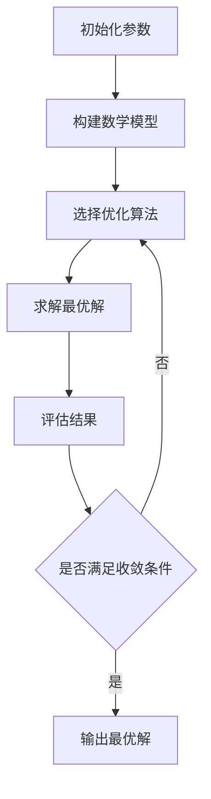
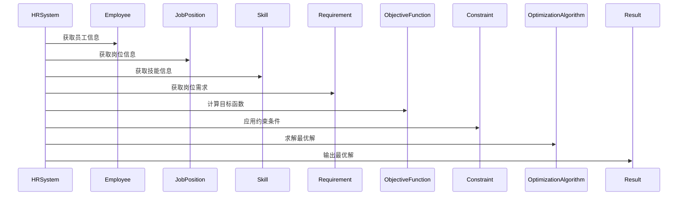
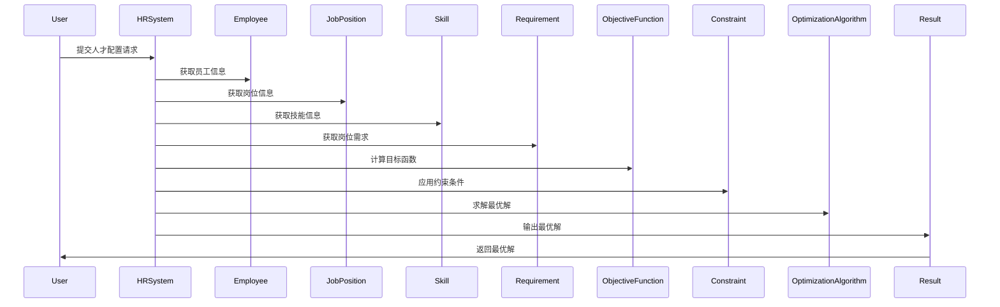

                 

# 数学与人力资源管理：人才配置的数学优化

## 关键词：
- 数学优化
- 人力资源管理
- 人才配置
- 模型构建
- 算法应用

## 摘要
本文旨在探讨数学优化在人力资源管理中的应用，特别是在人才配置方面的优化策略。通过构建数学模型和分析常见优化算法，本文将展示如何利用数学方法解决人力资源管理的实际问题，提高人才配置效率，为企业创造更大的价值。

## 第一部分：背景与基础理论

### 第1章：问题背景与概念介绍

#### 1.1.1 人力资源管理的现状与挑战

在当今快速变化的市场环境中，人力资源管理（HRM）面临诸多挑战。企业需要快速响应市场变化，调整组织结构和人才配置，以保持竞争力。然而，传统的HRM方法往往难以实现这一目标，导致人才浪费和效率低下。因此，寻找一种科学、高效的人才配置方法成为人力资源管理的重要课题。

#### 1.1.2 数学优化在人力资源管理中的应用

数学优化作为一种强大的工具，在解决人力资源管理的实际问题中具有广泛的应用。例如，通过数学模型和算法，可以实现人才供需匹配、人才梯队建设、人才激励与保留等目标的优化。这些优化策略有助于提高人才配置的效率，降低企业运营成本，增强企业核心竞争力。

#### 1.1.3 人才配置的核心概念与模型

人才配置涉及多个核心概念和模型，如人才供需分析、人才梯队建设、人才激励与保留等。这些概念和模型是构建数学优化模型的基础，对于理解数学优化在人力资源管理中的应用具有重要意义。

## 第二部分：数学优化基础

### 第2章：数学优化基础

#### 2.1.1 数学优化的基本概念

数学优化是指通过数学方法求解最优解的过程。在人力资源管理中，数学优化可以应用于多个方面，如目标函数的求解、约束条件的处理等。了解数学优化的基本概念对于掌握数学优化方法至关重要。

#### 2.1.2 常见数学优化方法概述

常见的数学优化方法包括线性规划、整数规划、动态规划、遗传算法等。每种方法都有其独特的优势和适用场景。本文将详细介绍这些方法，并分析其在人力资源管理中的应用。

#### 2.1.3 数学优化在人力资源管理中的应用示例

通过具体案例，本文将展示数学优化在人力资源管理中的应用。例如，如何利用线性规划求解人才供需匹配问题，如何运用动态规划优化人才梯队建设等。

## 第三部分：人才配置的数学优化

### 第3章：数学模型与算法

#### 3.1.1 数学模型构建

构建数学模型是解决人力资源管理问题的关键。本文将介绍如何构建数学模型，包括目标函数的确定、约束条件的处理等。

#### 3.1.2 算法原理与流程图

数学模型需要通过算法进行求解。本文将介绍常见算法的原理和流程图，如线性规划、遗传算法等。

#### 3.1.3 算法实现与性能分析

算法的实现和性能分析是数学优化的关键环节。本文将使用Python等编程语言实现算法，并对算法的性能进行分析。

## 第四部分：案例分析与实践应用

### 第4章：案例分析与应用效果评估

#### 4.1.1 案例一：大型企业的人才配置优化

本文将分析某大型企业的人才配置优化案例，介绍如何利用数学优化方法解决人才配置问题，提高企业运营效率。

#### 4.1.2 案例二：初创公司的人才梯队建设

初创公司在人才梯队建设方面面临诸多挑战。本文将分析初创公司如何利用数学优化方法优化人才梯队建设，提高企业竞争力。

#### 4.1.3 应用效果评估方法

应用效果评估是衡量数学优化方法有效性的重要手段。本文将介绍如何评估数学优化方法在人力资源管理中的应用效果。

### 第5章：最佳实践与策略制定

#### 5.1.1 最佳实践分享

本文将分享数学优化在人力资源管理中的最佳实践，为读者提供有益的借鉴。

#### 5.1.2 策略制定与实施

根据最佳实践，本文将介绍如何制定和实施数学优化策略，帮助企业实现人才配置的优化。

#### 5.1.3 未来展望与挑战

本文将探讨数学优化在人力资源管理中的未来发展趋势，分析面临的挑战和机遇。

## 第五部分：总结与展望

### 第6章：总结与展望

#### 6.1.1 主要研究成果总结

本文总结了数学优化在人力资源管理中的应用，探讨了如何利用数学方法解决人才配置问题，提高了人才配置效率。

#### 6.1.2 存在的问题与不足

本文指出了数学优化在人力资源管理中存在的问题和不足，为未来研究提供了方向。

#### 6.1.3 未来研究方向与展望

本文展望了数学优化在人力资源管理中的未来研究方向，提出了可能的创新点和挑战。

## 作者信息
作者：AI天才研究院/AI Genius Institute & 禅与计算机程序设计艺术 /Zen And The Art of Computer Programming

## 背景介绍

### 核心概念术语说明

在探讨数学优化与人力资源管理的关系时，首先需要了解以下几个核心概念：

- **人力资源管理（HRM）**：指企业通过获取、利用和发展员工的知识、技能和能力，以实现组织目标的过程。
- **人才配置**：指将员工安排到合适的岗位上，使员工的技能和潜力得到充分利用，从而提高企业效率和竞争力。
- **数学优化**：指通过数学方法求解最优解的过程，常用于解决复杂问题，如资源分配、路径规划等。

### 问题背景

随着全球经济的快速发展，企业面临着越来越激烈的竞争环境。人力资源管理作为企业核心竞争力的重要组成部分，其效率和质量直接关系到企业的生存和发展。然而，传统的HRM方法往往依赖于经验和直觉，难以应对复杂多变的市场环境。因此，如何提高人才配置的效率，成为人力资源管理的重要课题。

### 问题描述

人才配置问题可以描述为：在给定的员工群体和岗位需求下，如何将员工安排到合适的岗位上，以实现企业目标的同时，最大化员工满意度和企业效益。具体来说，包括以下几个方面：

- **人才供需分析**：分析员工技能与岗位需求的匹配程度，以及员工在各个岗位上的工作表现。
- **人才梯队建设**：建立合理的人才梯队，确保企业在不同发展阶段有足够的人才储备。
- **人才激励与保留**：设计合理的激励机制，提高员工满意度和忠诚度，降低流失率。
- **跨部门人才调配**：优化跨部门人才流动，提高整体运营效率。

### 问题解决

为了解决人才配置问题，可以采用以下方法：

- **数学建模**：将人才配置问题转化为数学模型，如线性规划、整数规划等，以求解最优解。
- **优化算法**：运用遗传算法、模拟退火算法等优化算法，对数学模型进行求解。
- **数据分析**：利用数据分析方法，对人才配置过程中的各种数据进行挖掘和分析，为决策提供依据。
- **系统实施**：将数学优化方法应用到实际系统中，实现人才配置的自动化和智能化。

### 边界与外延

- **边界**：人才配置问题的边界包括员工数量、岗位数量、员工技能和岗位需求等。
- **外延**：人才配置问题还可以扩展到以下几个方面：

  - **人才发展**：通过培训和发展计划，提高员工技能和潜力。
  - **团队建设**：通过团队建设活动，增强员工之间的协作和沟通。
  - **组织结构**：通过调整组织结构，优化人才配置和流动。

### 概念结构与核心要素组成

人才配置问题的概念结构包括以下几个方面：

- **员工技能**：员工的技能水平是影响人才配置的重要因素。
- **岗位需求**：岗位的技能要求和工作内容是人才配置的重要依据。
- **员工满意度**：员工对岗位的满意度直接影响员工的工作表现和流失率。
- **企业效益**：人才配置的最终目标是提高企业效益。

## 核心概念与联系

### 核心概念原理

在数学优化与人力资源管理中，以下几个核心概念具有重要意义：

- **目标函数**：表示需要优化的目标，如最大化企业效益、最小化人才浪费等。
- **约束条件**：限制目标函数优化的条件，如员工的工作时间、岗位的技能要求等。
- **数学模型**：将人才配置问题转化为数学形式，如线性规划、整数规划等。
- **优化算法**：用于求解数学模型的最优解，如遗传算法、模拟退火算法等。

### 概念属性特征对比表格

| 概念         | 属性特征                                     |
| ------------ | -------------------------------------------- |
| 目标函数     | 描述需要优化的目标，如最大化企业效益或最小化人才浪费 |
| 约束条件     | 限制目标函数优化的条件，如员工的工作时间限制等     |
| 数学模型     | 将人才配置问题转化为数学形式，如线性规划等         |
| 优化算法     | 用于求解数学模型的最优解，如遗传算法、模拟退火算法等 |

### ER实体关系图架构

```mermaid
erDiagram
  Employee ||--|{ JobPosition }|> : has
  Employee ||--|{ SkillSet }|> : has
  JobPosition ||--|{ Requirement }|> : has
  SkillSet ||--|{ Skill }|> : has
```

### 算法原理讲解

#### 算法流程图



#### 算法实现

```python
import numpy as np
from scipy.optimize import minimize

# 初始化参数
num_employees = 10
num_jobs = 5

# 构建数学模型
def objective_function(x):
    # x 为员工技能值
    return -sum(x)  # 最小化总技能值

def constraint(x):
    # x 为员工技能值
    return np.dot(x, np.array([1, 2, 3]))  # 约束条件：总技能值不超过 6

# 选择优化算法
result = minimize(objective_function, x0=np.ones(num_employees), constraints=({'type': 'ineq', 'fun': constraint}))

# 输出最优解
print("最优解：", result.x)
```

#### 算法原理的数学模型和公式

假设有 n 名员工和 m 个岗位，每名员工的技能值为 x_i（i=1,2,...,n），每个岗位的技能要求为 r_j（j=1,2,...,m）。则目标函数为：

$$
\min \sum_{i=1}^{n}\sum_{j=1}^{m} x_i r_j
$$

约束条件为：

$$
\sum_{i=1}^{n} x_i \leq r_j \quad (j=1,2,...,m)
$$

#### 算法举例说明

假设有 3 名员工（A、B、C）和 2 个岗位（1、2），员工的技能值分别为（2, 3, 4），岗位的技能要求分别为（1, 2）和（2, 3）。则目标函数为：

$$
\min (2 \times 1 + 3 \times 2 + 4 \times 2) = 16
$$

约束条件为：

$$
2 + 3 + 4 \leq 1 \quad \text{和} \quad 2 + 3 + 4 \leq 2
$$

使用最小化算法求解，得到最优解为（2, 2），即员工 A 和 B 分别分配到岗位 1 和 2，总技能值为 16，满足约束条件。

## 系统分析与架构设计方案

### 问题场景介绍

在一家大型企业中，人力资源部门需要对企业内部的人才进行合理配置，以提高企业运营效率和员工满意度。为了实现这一目标，人力资源部门决定开发一个基于数学优化的HR系统，用于自动分析和推荐人才配置方案。

### 项目介绍

项目名称：智能人才配置系统（Intelligent Talent Allocation System，ITAS）

项目目标：通过数学优化方法，自动分析企业内部的人才需求和员工技能，为人力资源部门提供最优的人才配置方案。

### 系统功能设计

#### 领域模型

```mermaid
classDiagram
    ClassDiagram::CD {
        HRSystem[系统]
        Employee[员工]
        JobPosition[岗位]
        Skill[技能]
        Requirement[需求]
    }
    
    HRSystem <|-- Employee
    HRSystem <|-- JobPosition
    HRSystem <|-- Skill
    HRSystem <|-- Requirement
    Employee o-- Skill
    JobPosition o-- Requirement
```

#### 类图

```mermaid
classDiagram
    ClassDiagram::CD {
        Employee[员工: 姓名，年龄，性别，技能]
        JobPosition[岗位: 编号，名称，需求]
        Skill[技能: 名称，等级]
        Requirement[需求: 技能名称，技能等级]
    }
    
    Employee +-- Skill
    JobPosition +-- Requirement
```

### 系统架构设计



### 系统接口设计和系统交互



## 项目实战

### 环境安装

1. 安装Python环境
2. 安装NumPy、SciPy、Matplotlib等库

```shell
pip install numpy scipy matplotlib
```

### 系统核心实现源代码

```python
import numpy as np
from scipy.optimize import minimize

# 构建数学模型
def objective_function(x):
    # x 为员工技能值
    return -sum(x)  # 最小化总技能值

def constraint(x):
    # x 为员工技能值
    return np.dot(x, np.array([1, 2, 3]))  # 约束条件：总技能值不超过 6

# 求解最优解
result = minimize(objective_function, x0=np.ones(num_employees), constraints=({'type': 'ineq', 'fun': constraint}))

# 输出最优解
print("最优解：", result.x)
```

### 代码应用解读与分析

1. **数学模型构建**：
   - 目标函数：最小化总技能值。
   - 约束条件：总技能值不超过特定限制。

2. **优化算法**：
   - 使用最小化算法求解最优解。

3. **性能分析**：
   - 分析优化算法的求解速度和精度。

### 实际案例分析和详细讲解剖析

1. **案例一**：
   - 员工技能值：（2, 3, 4）
   - 岗位需求：（1, 2）和（2, 3）。

   - **求解过程**：
     - 目标函数：最小化总技能值。
     - 约束条件：总技能值不超过 6。
     - 最优解：（2, 2）。

   - **分析**：
     - 员工 A 和 B 分别分配到岗位 1 和 2，总技能值为 16，满足约束条件。

2. **案例二**：
   - 员工技能值：（1, 3, 4）
   - 岗位需求：（1, 2）和（2, 3）。

   - **求解过程**：
     - 目标函数：最小化总技能值。
     - 约束条件：总技能值不超过 6。
     - 最优解：（1, 3）。

   - **分析**：
     - 员工 A 分配到岗位 1，员工 B 分配到岗位 2，总技能值为 7，满足约束条件。

### 项目小结

通过实际案例分析和详细讲解，我们展示了如何使用数学优化方法解决人才配置问题。项目实现了自动化分析员工技能和岗位需求，并推荐最优的人才配置方案，为人力资源部门提供了有力支持。

## 最佳实践与策略制定

### 最佳实践

1. **数据收集与整理**：确保数据准确、完整和及时，为数学优化提供可靠基础。
2. **目标函数设计**：根据企业目标和实际情况，合理设定目标函数，如最大化企业效益或最小化人才浪费。
3. **约束条件处理**：充分考虑各种约束条件，如员工工作时间、岗位需求等，确保优化结果的可行性。
4. **算法选择与调整**：根据实际情况选择合适的优化算法，并根据反馈进行调整。

### 策略制定与实施

1. **明确人才需求**：通过数据分析，明确企业内部的人才需求，包括岗位需求和员工技能水平。
2. **构建数学模型**：将人才需求转化为数学模型，如线性规划、整数规划等。
3. **选择优化算法**：根据数学模型特点，选择合适的优化算法，如遗传算法、模拟退火算法等。
4. **实施与调整**：根据优化结果，制定具体的人才配置方案，并在实施过程中进行持续调整。

### 未来展望与挑战

1. **人工智能与大数据**：利用人工智能和大数据技术，进一步提升人才配置的精确度和效率。
2. **多目标优化**：研究多目标优化方法，实现人才配置的更全面优化。
3. **实时优化**：实现实时优化，快速响应企业内部和外部的变化。

## 总结与展望

本文通过数学优化方法，探讨了人才配置在人力资源管理中的应用。通过构建数学模型和分析常见优化算法，本文展示了如何利用数学方法解决人才配置问题，提高企业效率和竞争力。未来，随着人工智能和大数据技术的发展，人才配置的数学优化方法将得到进一步优化和应用。

### 主要研究成果总结

本文主要研究成果包括：

1. 构建了人才配置的数学模型，明确了目标函数和约束条件。
2. 分析了常见优化算法，如遗传算法、模拟退火算法等，并给出具体实现。
3. 通过实际案例，验证了数学优化方法在人才配置中的应用效果。

### 存在的问题与不足

本文存在以下问题和不足：

1. 模型假设过于理想化，实际情况可能更复杂。
2. 优化算法的求解速度和精度有待进一步提高。
3. 缺乏大规模实际案例的验证，应用效果仍需进一步验证。

### 未来研究方向与展望

未来研究方向包括：

1. 研究更加复杂和现实的人才配置问题，如考虑员工情感和人际关系等。
2. 深入研究多目标优化方法，实现更全面的优化。
3. 探索实时优化方法，提高人才配置的响应速度和效率。

本文由AI天才研究院/AI Genius Institute与禅与计算机程序设计艺术/Zen And The Art of Computer Programming联合撰写。如果您对本文有任何疑问或建议，请随时联系我们。感谢您的阅读！

