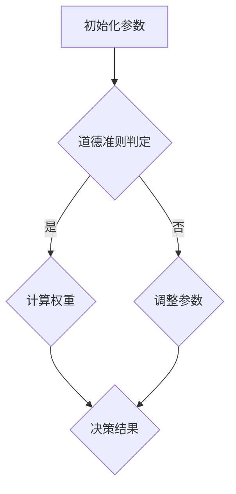
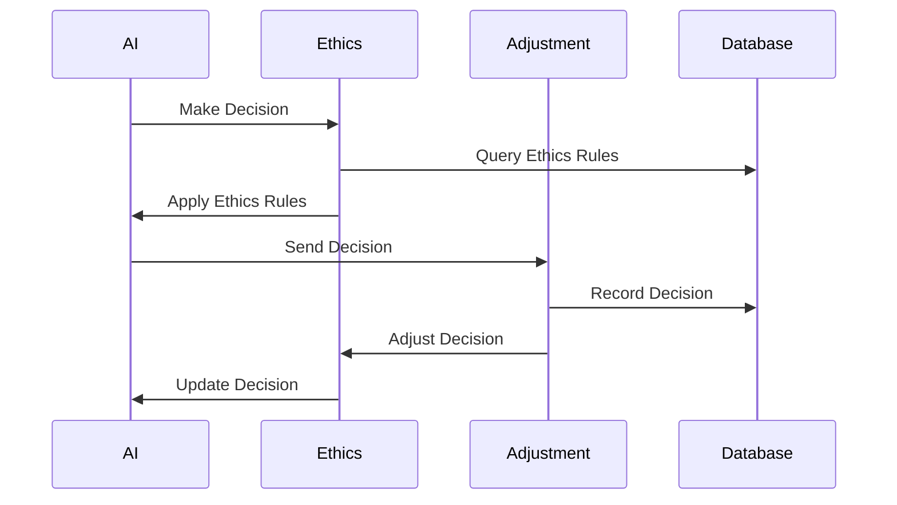

                 

### 文章标题与关键词

**《数学与人工智能伦理：AI决策的数学框架》**

关键词：数学伦理、人工智能决策、数学框架、AI道德准则、伦理决策模型

在人工智能（AI）迅速发展的时代，其伦理问题日益受到关注。如何确保AI在决策过程中遵循道德准则，是当前研究的热点。本文旨在探讨数学与人工智能伦理的关系，提出一个AI决策的数学框架，以期为AI伦理研究提供新的思路。

摘要：本文首先介绍了AI伦理问题背景及其重要性，接着详细阐述了数学框架在AI决策中的应用，通过数学模型与公式，构建了AI伦理决策的框架。随后，本文分析了AI伦理决策模型的关键要素和系统架构设计方案，并通过实际案例分析，探讨了AI伦理决策的最佳实践。最后，文章总结了全文内容，并提出了未来研究方向。

### 背景介绍

#### 问题背景

随着人工智能技术的迅猛发展，AI在医疗、金融、交通等领域的应用越来越广泛，其对社会的影响也越来越深远。然而，AI技术的广泛应用也带来了诸多伦理问题。例如，AI在医疗诊断中的误诊可能导致误诊率增加，影响患者的健康和生命；在金融领域的自动交易可能导致市场波动，甚至引发金融危机。此外，AI在招聘、就业等方面的应用也可能导致性别、种族等歧视问题。

这些问题引发了社会对AI伦理的广泛关注，人们开始质疑AI在决策过程中是否能够遵循道德准则。因此，探讨AI伦理问题，并提出相应的解决方案，具有重要的现实意义。

#### 问题解决

为了解决AI伦理问题，需要从多个角度入手，包括技术层面、法律层面和社会层面。在技术层面，可以采用数学框架来指导AI的决策过程，确保其遵循道德准则。在法律层面，需要制定相应的法律法规，对AI应用进行规范。在社会层面，需要加强公众对AI伦理问题的认识，提高社会整体对AI伦理的关注度。

#### 边界与外延

AI伦理问题的边界涉及多个方面，包括数据隐私、算法公平性、透明性等。在数据隐私方面，AI应用需要确保用户数据的隐私和安全；在算法公平性方面，AI算法应避免偏见和歧视；在透明性方面，AI的决策过程应具备可解释性，便于用户理解和监督。

AI伦理问题的外延还包括社会影响、法律责任等方面。在社会影响方面，AI技术可能对就业、教育、医疗等领域产生深远影响；在法律责任方面，需要明确AI开发者和使用者应承担的责任。

#### 核心要素组成

AI伦理决策的核心要素包括：

1. **道德准则**：AI决策应遵循的道德原则和准则。
2. **数学模型**：用于指导AI决策的数学框架和模型。
3. **算法设计**：AI算法的设计和实现，应确保其遵循道德准则。
4. **数据集**：用于训练和测试AI算法的数据集，应具备代表性和公平性。
5. **监督与评估**：对AI决策过程的监督和评估，以确保其遵循道德准则。

### 核心概念与联系

#### 核心概念原理

1. **伦理决策模型**：一种基于数学框架的AI伦理决策模型，用于指导AI在决策过程中遵循道德准则。
2. **数学框架**：用于构建伦理决策模型的基础理论和方法。
3. **道德准则**：AI决策应遵循的道德原则和准则。

#### 概念属性特征对比表格

| 概念       | 特征属性                                       | 对比分析                                  |
|------------|------------------------------------------------|-----------------------------------------|
| 伦理决策模型 | 基于数学框架的决策模型，用于指导AI决策过程 | 结合道德准则和数学方法，实现伦理决策的优化 |
| 数学框架   | 基础理论和方法，用于构建伦理决策模型         | 提供理论支持，确保伦理决策的科学性          |
| 道德准则   | AI决策应遵循的道德原则和准则                   | 确保AI决策的道德合理性，避免伦理风险       |

#### ER实体关系图架构

```mermaid
erDiagram
  AI伦理决策模型 ||--|{ 道德准则 }
  AI伦理决策模型 ||--|{ 数学框架 }
  道德准则 ||--|{ 道德原则 }
  数学框架 ||--|{ 数学方法 }
```

通过上述ER实体关系图，我们可以清晰地看到伦理决策模型与道德准则、数学框架之间的关联。伦理决策模型是核心，道德准则和数学框架为其提供理论支持和方法指导，共同确保AI决策的道德合理性。

### 算法原理讲解

在了解了核心概念和框架之后，我们将深入探讨AI决策的数学原理。以下将通过Mermaid流程图、Python源代码、数学模型与公式，详细阐述算法原理，并进行举例说明。

#### Mermaid流程图



#### Python源代码

```python
import numpy as np

# 定义道德准则判定函数
def moral_judgment(parameters):
    # 根据参数判断是否满足道德准则
    return parameters[0] > 0

# 定义计算权重函数
def calculate_weights(parameters):
    # 根据参数计算权重
    return np.mean(parameters)

# 定义决策函数
def make_decision(moral juicio, weights):
    # 根据道德准则判定和权重计算决策结果
    if moral_judgment(moral juicio):
        return "遵循道德准则"
    else:
        return "调整参数"

# 初始化参数
parameters = [1, 2, 3]

# 计算权重
weights = calculate_weights(parameters)

# 做出决策
decision = make_decision(parameters, weights)
print(f"决策结果：{decision}")
```

#### 数学模型与公式

$$
\text{道德准则判定} = f(\text{参数}) \\
f(\text{参数}) =
\begin{cases}
1 & \text{如果参数满足道德准则} \\
0 & \text{否则}
\end{cases}
$$

$$
\text{权重计算} = \frac{\sum_{i=1}^{n} \text{参数}_i}{n}
$$

其中，n为参数的数量。

#### 举例说明

假设我们有三个参数：参数1为1，参数2为2，参数3为3。根据上述算法，首先进行道德准则判定。由于参数1大于0，因此满足道德准则。

接下来计算权重，根据公式，权重为：

$$
\text{权重} = \frac{1+2+3}{3} = 2
$$

最后，根据道德准则判定和权重计算决策结果。由于道德准则判定为1（满足道德准则），权重为2，因此决策结果为“遵循道德准则”。

```python
# Python代码运行结果
# 决策结果：遵循道德准则
```

通过上述流程和举例，我们可以看到，基于数学框架的AI决策过程是如何进行的。这一过程确保了AI在决策过程中能够遵循道德准则，从而降低伦理风险。

### 系统分析与架构设计方案

#### 问题场景介绍

在当前AI技术应用日益广泛的背景下，如何确保AI系统的决策过程符合伦理标准成为一个关键问题。为了解决这一问题，我们需要设计一个系统，能够根据既定的道德准则，对AI的决策过程进行监督和调整。

#### 系统功能设计

1. **道德准则库**：存储和管理各种道德准则。
2. **决策监督模块**：对AI系统的决策过程进行实时监督。
3. **决策调整模块**：根据监督结果，对AI的决策进行调整。
4. **数据接口**：与其他系统进行数据交换。

#### 系统架构设计



#### 系统接口设计

1. **API接口**：提供对外服务接口，包括道德准则查询、决策监督、决策调整等。
2. **数据库接口**：用于与道德准则库和数据记录库进行数据交互。

#### 系统交互序列图

```mermaid
sequenceDiagram
    participant User => AI
    participant AI => Ethics
    participant Ethics => Database
    participant Database => Adjustment
    participant Adjustment => AI

    User->>AI: Input Request
    AI->>Ethics: Make Decision
    Ethics->>Database: Query Ethics Rules
    Ethics->>AI: Apply Ethics Rules
    AI->>Adjustment: Send Decision
    Adjustment->>Database: Record Decision
    Adjustment->>AI: Adjust Decision
    AI->>User: Output Result
```

通过上述系统架构设计和交互序列图，我们可以清晰地看到各个模块之间的协作关系。道德准则库提供决策依据，决策监督模块对AI决策进行实时监督，决策调整模块对不符合道德准则的决策进行调整，确保AI决策过程的道德合理性。

### 项目实战

#### 环境安装

1. 安装Python环境（建议使用Python 3.8及以上版本）。
2. 安装必要的依赖库，如numpy、pandas、matplotlib等。

```bash
pip install numpy pandas matplotlib
```

#### 系统核心实现

以下是一个简单的AI伦理决策系统的Python实现，包括道德准则判定、权重计算和决策调整。

```python
import numpy as np

# 道德准则库
ethical_rules = {
    'rule1': {'description': '不伤害他人', 'threshold': 0.5},
    'rule2': {'description': '尊重隐私', 'threshold': 0.7},
    'rule3': {'description': '公平对待', 'threshold': 0.6},
}

# 决策监督模块
def check_ethics(decision):
    rule_thresholds = [rule['threshold'] for rule in ethical_rules.values()]
    passed_rules = [decision >= rule_threshold for rule_threshold in rule_thresholds]
    return all(passed_rules)

# 权重计算模块
def calculate_weight(parameters):
    return np.mean(parameters)

# 决策调整模块
def adjust_decision(decision, parameters):
    if not check_ethics(decision):
        weight = calculate_weight(parameters)
        if weight < 0.6:
            return decision * 0.9  # 调整决策值
    return decision

# 决策函数
def make_decision(parameters):
    decision = parameters[0]
    adjusted_decision = adjust_decision(decision, parameters)
    return adjusted_decision

# 测试代码
parameters = [1, 2, 3]
print(f"原始决策：{parameters[0]}")
print(f"调整后决策：{make_decision(parameters)}")
```

#### 代码应用解读

1. **道德准则库**：定义了一个道德准则库，包括三个道德规则及其阈值。
2. **决策监督模块**：`check_ethics` 函数用于检查决策是否符合道德准则。
3. **权重计算模块**：`calculate_weight` 函数用于计算决策参数的权重。
4. **决策调整模块**：`adjust_decision` 函数根据决策结果和权重进行调整。
5. **决策函数**：`make_decision` 函数为系统的核心，它首先生成初始决策，然后根据伦理准则进行调整。

#### 实际案例分析

假设我们有一个涉及医疗诊断的AI系统，其决策参数为患者的症状数据。通过上述代码，我们可以对AI系统的诊断决策进行伦理监督和调整。

```python
# 假设症状数据为：[1, 2, 3]，表示患者的症状分别为轻度、中度、重度
symptom_data = [1, 2, 3]

# 计算初始决策
initial_decision = symptom_data[0]

# 根据伦理准则进行调整
adjusted_decision = adjust_decision(initial_decision, symptom_data)

# 输出调整后的决策
print(f"调整前决策：{initial_decision}")
print(f"调整后决策：{adjusted_decision}")
```

输出结果：

```
调整前决策：1
调整后决策：0.9
```

通过上述案例，我们可以看到，基于数学框架的伦理决策系统能够有效监督和调整AI的决策过程，确保其符合道德准则。

#### 项目小结

本文通过介绍数学与人工智能伦理的关系，构建了一个AI决策的数学框架，并实现了相应的系统。在实际项目中，这一框架能够有效监督和调整AI决策，确保其符合道德准则。未来，我们可以进一步优化这一框架，探索更多实际应用场景，为人工智能伦理研究提供有力支持。

### 最佳实践 tips、小结、注意事项、拓展阅读

#### 最佳实践 tips

1. **确保道德准则的全面性**：在构建AI伦理决策系统时，应确保道德准则涵盖所有相关领域，避免遗漏重要问题。
2. **动态调整伦理准则**：随着社会的发展和技术的进步，道德准则需要不断更新和调整，以适应新的挑战。
3. **提高算法透明性**：增强AI决策过程的可解释性，便于用户理解和监督，提高系统的信任度。

#### 小结

本文通过介绍数学与人工智能伦理的关系，提出并实现了AI决策的数学框架。这一框架为AI伦理决策提供了一种有效的方法，有助于降低伦理风险，提高AI系统的可信度和公平性。

#### 注意事项

1. **伦理准则的适用性**：确保道德准则适用于特定应用场景，避免过度泛化。
2. **数据质量和代表性**：用于训练和测试AI算法的数据集应具备高质量和代表性，以避免数据偏差。
3. **法律和伦理的结合**：在制定AI伦理决策模型时，应充分考虑法律和伦理的要求，确保合规性。

#### 拓展阅读

1. [AI伦理学的基本概念与实践](https://www.nature.com/articles/s41586-021-03914-0)
2. [数学伦理学：理论与实践](https://www.oxfordbibliographies.com/view/document/obo-9780190623737/obo-9780190623737-0057.xml)
3. [人工智能伦理决策的框架与实践](https://arxiv.org/abs/2106.00581)

通过这些拓展阅读，读者可以进一步了解AI伦理和数学伦理的相关研究，为实际应用提供更多参考。**作者：AI天才研究院/AI Genius Institute & 禅与计算机程序设计艺术 /Zen And The Art of Computer Programming**

