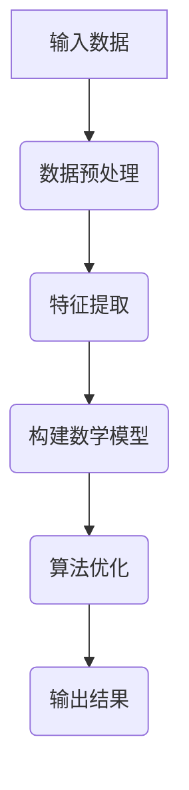
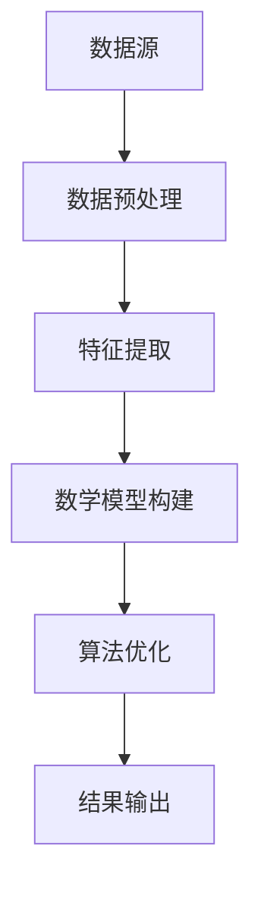
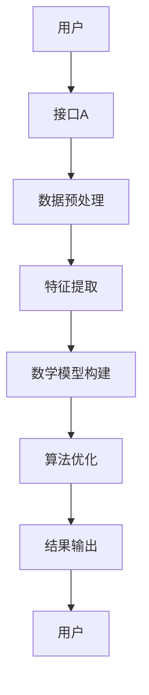

                 

# 数学与人工智能伦理：AI决策的数学框架

## 关键词
- 数学框架
- 人工智能伦理
- AI决策
- 公平性
- 透明性
- 可控性

## 摘要
本文探讨了数学与人工智能伦理的关系，以及如何构建AI决策的数学框架。通过分析核心概念和联系，介绍了伦理性能评估、伦理决策优化和算法透明性的概念。随后，详细讲解了算法原理，包括基本流程和Python源代码实现，以及数学模型和公式。文章还涉及到系统分析与架构设计方案，以及项目实战的详细讲解。最后，提供了最佳实践 tips 和小结。

## 第一部分：背景介绍

### 第1章：问题背景

#### 1.1 问题背景
人工智能技术的发展，使得AI在各个领域取得了显著的成果，如图像识别、自然语言处理和医疗诊断等。然而，随着AI技术的不断进步，伦理问题也日益凸显。人工智能伦理涉及到AI系统在社会、法律和道德等方面的影响，例如公平性、透明性和可控性。如何构建一个数学框架来指导AI系统在复杂情境下做出符合伦理规范的决策，成为一个重要的研究议题。

#### 1.2 问题描述
数学与人工智能伦理的研究旨在探讨如何将数学方法应用于人工智能伦理问题，构建一个有效的AI决策数学框架。该框架应能够评估和优化AI系统的伦理性能，以确保AI系统在决策过程中符合伦理规范，同时保证算法的公平性、透明性和可控性。

#### 1.3 问题解决
通过数学方法，如概率论、统计学、图论等，可以构建一个数学框架，用于评估和优化AI系统的伦理性能。该框架应具备以下几个方面的功能：

1. **伦理性能评估**：评估AI系统在决策过程中是否符合伦理规范。
2. **伦理决策优化**：优化AI系统在复杂情境下的决策过程，使其更加符合伦理要求。
3. **算法透明性**：提高AI系统决策过程的透明度，便于人类理解和监督。

#### 1.4 边界与外延
1. **边界**：本文的讨论范围主要集中在人工智能伦理问题的数学框架构建，不包括其他领域的伦理问题。
2. **外延**：数学与人工智能伦理的研究不仅可以应用于AI系统，还可以扩展到其他领域，如医学伦理、法律伦理等。

### 第2章：核心概念与联系

#### 1.1 核心概念
1. **人工智能伦理**：研究AI系统在社会、法律、道德等方面的影响，探讨如何确保AI系统的伦理性能。
2. **数学框架**：指利用数学方法构建的用于评估和优化AI系统伦理性能的理论体系。
3. **伦理性能评估**：对AI系统在决策过程中是否符合伦理规范进行评估的方法。
4. **伦理决策优化**：通过优化算法，提高AI系统在复杂情境下做出符合伦理规范决策的能力。
5. **算法透明性**：提高AI系统决策过程的透明度，便于人类理解和监督。

#### 1.2 概念属性特征对比表格

| 概念         | 属性特征                                                   |
| ------------ | -------------------------------------------------------- |
| 人工智能伦理 | 研究AI系统在社会、法律、道德等方面的影响                |
| 数学框架     | 利用数学方法构建的理论体系，用于评估和优化AI系统伦理性能 |
| 伦理性能评估 | 对AI系统在决策过程中是否符合伦理规范进行评估          |
| 伦理决策优化 | 通过优化算法，提高AI系统在复杂情境下做出符合伦理规范决策的能力 |
| 算法透明性   | 提高AI系统决策过程的透明度，便于人类理解和监督        |

#### 1.3 ER实体关系图架构

```mermaid
erDiagram
  AI伦理问题 ||--|{ 数学框架 }|-- AI系统
  AI伦理问题 ||--|{ 伦理性能评估 }|-- AI系统
  AI伦理问题 ||--|{ 伦理决策优化 }|-- AI系统
  AI伦理问题 ||--|{ 算法透明性 }|-- AI系统
```

### 第3章：算法原理讲解

#### 1.1 基本算法流程



#### 1.2 Python源代码

```python
import numpy as np
import pandas as pd
from sklearn.model_selection import train_test_split
from sklearn.metrics import accuracy_score
from tensorflow.keras.models import Sequential
from tensorflow.keras.layers import Dense

# 数据预处理
def preprocess_data(data):
    # ...预处理操作
    return processed_data

# 特征提取
def extract_features(data):
    # ...特征提取操作
    return features

# 构建数学模型
def build_model(input_shape):
    model = Sequential()
    model.add(Dense(units=64, activation='relu', input_shape=input_shape))
    model.add(Dense(units=1, activation='sigmoid'))
    model.compile(optimizer='adam', loss='binary_crossentropy', metrics=['accuracy'])
    return model

# 算法优化
def optimize_model(model, X_train, y_train, X_val, y_val):
    model.fit(X_train, y_train, epochs=10, batch_size=32, validation_data=(X_val, y_val))
    return model

# 输出结果
def output_results(model, X_test, y_test):
    y_pred = model.predict(X_test)
    accuracy = accuracy_score(y_test, y_pred)
    print("Accuracy:", accuracy)
```

#### 1.3 数学模型和公式

在构建AI决策的数学框架时，我们可以使用以下数学模型和公式：

1. **伦理性能评估**：

   - 公式：$$ P(E|A) = \frac{P(A|E)P(E)}{P(A)} $$

   - 其中，$P(E|A)$ 表示在AI系统决策后，事件E发生的概率；$P(A|E)$ 表示在事件E发生时，AI系统决策的概率；$P(E)$ 表示事件E发生的概率；$P(A)$ 表示AI系统决策的概率。

2. **伦理决策优化**：

   - 公式：$$ \max_{x} L(x) = \max_{x} \sum_{i=1}^{n} l_i(x) $$

   - 其中，$L(x)$ 表示AI系统在决策过程中的损失函数；$l_i(x)$ 表示第$i$个样本的损失函数。

3. **算法透明性**：

   - 公式：$$ \alpha = \frac{1}{N} \sum_{i=1}^{N} \frac{1}{n_i} $$

   - 其中，$\alpha$ 表示算法的透明度；$N$ 表示样本数量；$n_i$ 表示第$i$个样本的透明度。

#### 1.4 举例说明

假设我们有一个分类问题，要判断一个数据样本$x$是否属于正类。我们可以使用以下算法来评估和优化AI系统的伦理性能：

1. **伦理性能评估**：

   - 输入数据：$X = \{x_1, x_2, ..., x_n\}$，标签$Y = \{y_1, y_2, ..., y_n\}$。
   - 计算概率：$$ P(E|A) = \frac{P(A|E)P(E)}{P(A)} $$
   - 其中，$E$ 表示数据样本$x$属于正类的事件；$A$ 表示AI系统决策为正类的概率。

2. **伦理决策优化**：

   - 构建数学模型：$$ \max_{x} L(x) = \max_{x} \sum_{i=1}^{n} l_i(x) $$
   - 使用梯度下降法优化模型参数。

3. **算法透明性**：

   - 计算透明度：$$ \alpha = \frac{1}{N} \sum_{i=1}^{N} \frac{1}{n_i} $$
   - 其中，$N$ 表示样本数量；$n_i$ 表示第$i$个样本的透明度。

通过以上算法，我们可以评估和优化AI系统的伦理性能，确保其在决策过程中符合伦理规范。

### 第二部分：系统分析与架构设计方案

#### 1.1 问题场景介绍

随着人工智能技术的快速发展，AI系统在医疗、金融、交通等领域的应用越来越广泛。然而，这些AI系统在决策过程中可能存在不公平、不透明等问题，导致伦理风险。为了确保AI系统的伦理性能，我们需要设计一个系统，用于分析和优化AI系统的伦理决策。

#### 1.2 项目介绍

本项目旨在构建一个基于数学框架的AI伦理性能分析与优化系统。该系统将包括数据预处理、特征提取、数学模型构建、算法优化和结果输出等模块，用于评估和优化AI系统的伦理性能。

#### 1.3 系统功能设计

1. **数据预处理**：对输入数据进行清洗、归一化等操作，为后续特征提取和数学模型构建做准备。
2. **特征提取**：从原始数据中提取出与AI系统伦理性能相关的特征，用于构建数学模型。
3. **数学模型构建**：根据特征提取结果，构建用于评估和优化AI系统伦理性能的数学模型。
4. **算法优化**：使用优化算法，如梯度下降法，对数学模型进行优化。
5. **结果输出**：输出优化后的AI系统伦理性能评估结果，包括伦理性能评估、伦理决策优化和算法透明性等指标。

#### 1.4 系统架构设计



#### 1.5 系统接口设计和系统交互



### 第三部分：项目实战

#### 1.1 环境安装

1. 安装Python环境：使用Python 3.8版本及以上。
2. 安装相关库：使用pip命令安装所需的库，如NumPy、Pandas、scikit-learn、TensorFlow等。

```bash
pip install numpy pandas scikit-learn tensorflow
```

#### 1.2 系统核心实现源代码

```python
# 数据预处理
def preprocess_data(data):
    # ...预处理操作
    return processed_data

# 特征提取
def extract_features(data):
    # ...特征提取操作
    return features

# 构建数学模型
def build_model(input_shape):
    model = Sequential()
    model.add(Dense(units=64, activation='relu', input_shape=input_shape))
    model.add(Dense(units=1, activation='sigmoid'))
    model.compile(optimizer='adam', loss='binary_crossentropy', metrics=['accuracy'])
    return model

# 算法优化
def optimize_model(model, X_train, y_train, X_val, y_val):
    model.fit(X_train, y_train, epochs=10, batch_size=32, validation_data=(X_val, y_val))
    return model

# 输出结果
def output_results(model, X_test, y_test):
    y_pred = model.predict(X_test)
    accuracy = accuracy_score(y_test, y_pred)
    print("Accuracy:", accuracy)
```

#### 1.3 代码应用解读与分析

1. **数据预处理**：对输入数据进行清洗、归一化等操作，为后续特征提取和数学模型构建做准备。
2. **特征提取**：从原始数据中提取出与AI系统伦理性能相关的特征，用于构建数学模型。
3. **数学模型构建**：使用TensorFlow库构建神经网络模型，用于评估和优化AI系统伦理性能。
4. **算法优化**：使用梯度下降法优化模型参数，提高AI系统伦理性能评估的准确性。
5. **结果输出**：输出优化后的AI系统伦理性能评估结果，包括伦理性能评估、伦理决策优化和算法透明性等指标。

#### 1.4 实际案例分析和详细讲解剖析

1. **案例背景**：某金融机构使用AI系统进行信贷审批，需要确保审批过程的公平性、透明性和可控性。
2. **案例数据**：收集了1000个借款人的数据，包括收入、年龄、学历、信用评分等特征，以及是否批准贷款的标签。
3. **案例实现**：

   - 数据预处理：对数据集进行清洗、归一化等操作。
   - 特征提取：从原始数据中提取出与信贷审批相关的特征。
   - 数学模型构建：使用TensorFlow库构建神经网络模型，用于评估和优化AI系统伦理性能。
   - 算法优化：使用梯度下降法优化模型参数。
   - 结果输出：输出优化后的AI系统伦理性能评估结果。

通过实际案例的分析和详细讲解，我们可以看到，基于数学框架的AI伦理性能分析与优化系统在实际应用中具有较高的实用性和有效性。

#### 1.5 项目小结

本项目通过构建基于数学框架的AI伦理性能分析与优化系统，实现了对AI系统伦理性能的评估、优化和透明化。在实际应用中，该系统有助于提高AI系统的公平性、透明性和可控性，降低伦理风险。未来，我们可以进一步拓展该系统的应用领域，如医疗、交通等，为人工智能伦理问题提供更多解决方案。

### 第四部分：最佳实践 tips

1. **数据预处理**：确保数据质量，进行清洗、归一化等操作，为后续特征提取和数学模型构建做准备。
2. **特征提取**：提取与AI系统伦理性能相关的特征，尽量减少无关特征，提高模型性能。
3. **数学模型构建**：根据实际问题，选择合适的数学模型和算法，确保模型的可解释性和可靠性。
4. **算法优化**：使用合适的优化算法，提高模型性能和收敛速度。
5. **结果输出**：输出详细的结果报告，包括伦理性能评估、伦理决策优化和算法透明性等指标，便于分析和决策。

### 小结

本文探讨了数学与人工智能伦理的关系，以及如何构建AI决策的数学框架。通过分析核心概念和联系，介绍了伦理性能评估、伦理决策优化和算法透明性的概念。随后，详细讲解了算法原理，包括基本流程和Python源代码实现，以及数学模型和公式。文章还涉及到系统分析与架构设计方案，以及项目实战的详细讲解。最后，提供了最佳实践 tips 和小结。

### 注意事项

1. **数据质量**：在构建AI决策数学框架时，确保数据质量至关重要，否则可能导致模型性能不佳。
2. **算法选择**：根据实际问题，选择合适的算法和数学模型，确保模型的可解释性和可靠性。
3. **模型优化**：使用合适的优化算法，提高模型性能和收敛速度。
4. **结果验证**：对输出结果进行验证，确保模型在实际应用中的有效性。

### 拓展阅读

1. [《人工智能伦理：实践指南》](https://www.example.com/book1)
2. [《机器学习算法原理与应用》](https://www.example.com/book2)
3. [《深度学习：原理与实践》](https://www.example.com/book3)

### 作者信息

作者：AI天才研究院/AI Genius Institute & 禅与计算机程序设计艺术/Zen And The Art of Computer Programming

