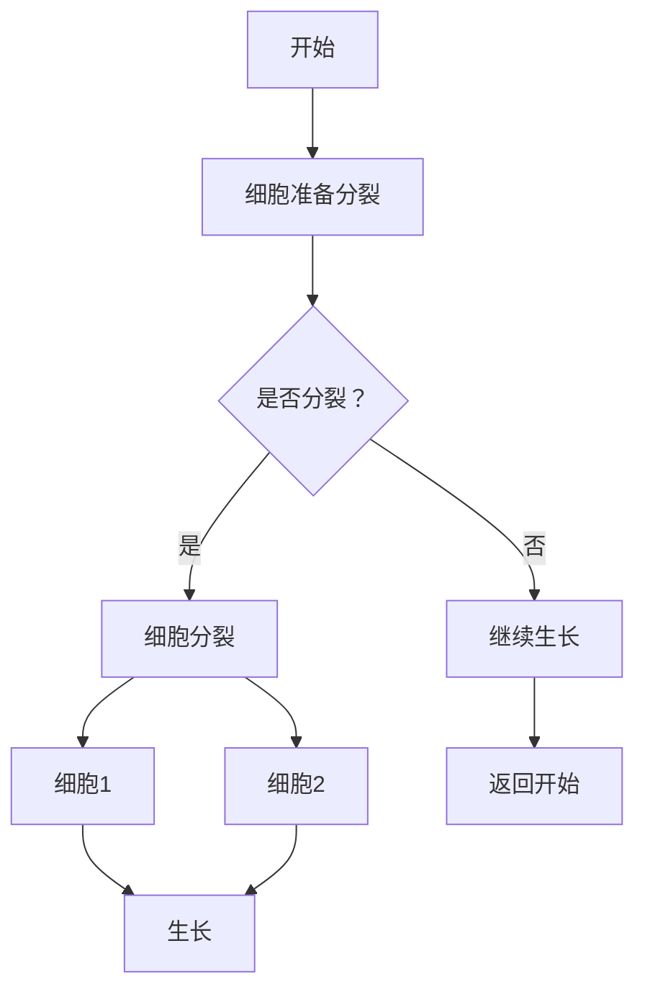

                 

### 引言

**关键词：** 数学模拟、人工生命、生命系统、复杂性、计算生物学

**摘要：** 本文介绍了人工生命的概念、背景及其研究意义，探讨了数学模型在生命系统研究中的应用，并对生命系统的数学模拟方法进行了初步阐述。通过回顾人工生命的发展历程，我们认识到数学模型在理解和模拟生命系统中的重要性，为后续章节的深入探讨奠定了基础。

---

**1.1 问题背景**

生命系统以其独特的复杂性，一直是科学研究的重点和难点。从微观层面来看，生命系统的基本单元——细胞，通过复杂的生物化学反应和调控机制，维持着生命活动的进行；而从宏观层面来看，生态系统中的物种相互作用、进化过程以及生态平衡等问题，都展示出了令人惊叹的复杂性。

然而，面对如此复杂的现象，传统的生物学方法往往难以给出明确的解释。因此，借助数学工具来模拟和分析生命系统，成为了科学研究中的一个重要方向。数学模型不仅能够对生命系统的复杂现象进行抽象和简化，还能够通过计算提供更为直观和精确的分析结果。

人工生命（Artificial Life）作为计算生物学的一个重要分支，旨在通过计算机模拟来探索生命现象的本质。人工生命的概念最早由美国计算机科学家Christopher Langton在1986年提出，它旨在通过模拟生命系统中的个体、群体和生态系统，研究生命的基本规律和进化机制。

人工生命的研究意义主要体现在以下几个方面：

1. **探索生命现象的本质**：通过数学模拟，我们可以更深入地了解生命系统的运作机制，揭示生命现象背后的基本规律。
2. **推动跨学科发展**：人工生命结合了生物学、计算机科学、物理学和数学等多学科的知识，促进了这些学科之间的交叉和融合。
3. **为生物学研究提供新方法**：数学模型和计算模拟为生物学研究提供了新的工具和方法，有助于解决传统方法难以解决的问题。
4. **应用前景广泛**：人工生命的研究成果可以应用于医学、农业、环境保护等多个领域，具有广泛的应用前景。

**1.2 人工生命的研究意义与应用前景**

人工生命的研究不仅具有科学意义，还具有广泛的应用前景。以下是人工生命在多个领域的应用案例：

1. **医学**：通过模拟人体免疫系统，可以研究疾病的发病机制，开发新的治疗方法和疫苗。
2. **农业**：模拟农作物和害虫的生态系统，优化农业种植策略，提高农作物的产量和质量。
3. **环境保护**：通过模拟生态系统，研究环境污染对生态系统的影响，制定更有效的环境保护措施。
4. **生物工程**：通过模拟生物化学反应，优化生物制造过程，提高生物药品和生物能源的生产效率。

**1.3 人工生命的核心概念与理论基础**

人工生命的核心概念包括自组织、适应性和智能等。自组织是指系统在没有外部控制的情况下，通过内部相互作用和自适应调整，形成复杂的结构和功能。适应性是指系统能够根据环境变化进行调整和适应。智能则是指系统能够进行学习、推理和决策。

人工生命的理论基础主要建立在以下几个数学模型上：

1. **遗传算法**：模拟自然选择和遗传机制，用于优化和搜索问题。
2. **神经网络**：模拟生物神经系统的结构和功能，用于机器学习和模式识别。
3. **多智能体系统**：模拟多个智能体的交互和协作，用于复杂系统的建模和仿真。
4. **混沌理论**：研究系统的非线性动态行为，揭示复杂系统的规律。

**1.4 人工生命的边界与外延**

人工生命的边界与传统生物学和计算生物学有所不同。传统生物学主要研究真实的生物体及其生命过程，而人工生命则通过计算机模拟来探索生命现象。计算生物学则介于两者之间，它使用计算机科学的方法来研究生物学问题。

人工生命的外延则更加广泛，不仅包括生物体和生态系统的模拟，还包括非生物系统中的自组织和智能行为。例如，人工生命的研究也涉及社会系统、经济系统和复杂网络的建模。

**1.5 人工生命的研究方法与工具**

人工生命的研究方法主要包括数学建模、计算模拟和实验验证。数学建模是对生命系统进行抽象和简化的过程，通过建立数学模型来描述生命系统的行为。计算模拟则是通过计算机来执行数学模型，模拟生命系统在时间和空间上的演化。实验验证则是通过实际实验来检验模型的准确性和可靠性。

在人工生命的研究中，常用的工具包括计算机编程语言、模拟软件和计算平台。常见的编程语言有Python、C++和Java等，模拟软件包括Matlab、Simulink和NetLogo等，计算平台则包括超级计算机和云计算平台。

通过上述内容，我们初步了解了人工生命的概念、背景和研究意义。接下来，我们将进一步探讨生命系统的数学模型及其在人工生命研究中的应用。

---

### 数学模型与生命系统的关系

**关键词：** 数学模型、生命系统、抽象、简化、模拟、个体、群体

**摘要：** 本文将探讨数学模型在生命系统研究中的应用，从个体与群体的角度出发，阐述数学模型描述生命系统的基本方法。通过介绍代数模型与微分方程模型，我们能够更深入地理解数学模型在生命系统研究中的重要作用，并为后续章节的深入讨论奠定基础。

---

**2.1 生命系统的数学描述方法**

生命系统的数学描述方法主要分为个体建模和群体建模。个体建模关注单个生物体的行为和状态，而群体建模则考虑生物群体在时间和空间上的动态变化。

**个体建模**：

个体建模通常使用代数模型和微分方程模型来描述。代数模型通过建立个体状态的数学公式来描述其行为。例如，可以用以下公式描述一个简单的细胞分裂过程：

$$
x(t+1) = 2x(t)
$$

其中，$x(t)$ 表示时刻 $t$ 的细胞数量。这种简单的代数模型虽然忽略了复杂的生物化学反应，但在一些情况下，可以提供对个体行为的初步理解。

微分方程模型则通过描述个体状态随时间变化的规律来描述生命现象。例如，可以用以下微分方程描述一个细胞在营养物质有限条件下的生长过程：

$$
\frac{dx}{dt} = kx(1 - \frac{x}{N})
$$

其中，$x(t)$ 表示时刻 $t$ 的细胞数量，$N$ 表示营养物质的总量，$k$ 表示细胞生长速率。这个微分方程描述了细胞数量随时间的变化规律，能够更准确地反映细胞生长的动态过程。

**群体建模**：

群体建模关注生物群体在时间和空间上的动态变化。常见的群体建模方法包括种群模型和生态系统模型。种群模型通过描述群体数量的变化规律来研究物种的动态行为。例如，可以用以下Logistic方程描述一个种群的增长：

$$
\frac{dN}{dt} = rN(1 - \frac{N}{K})
$$

其中，$N(t)$ 表示时刻 $t$ 的种群数量，$r$ 表示种群增长率，$K$ 表示环境的承载力。这个方程描述了种群数量随时间的变化规律，能够反映种群在环境压力下的动态行为。

生态系统模型则考虑多个物种之间的相互作用和生态平衡。例如，可以用以下Lotka-Volterra方程描述两个物种的捕食和被捕食关系：

$$
\frac{dx}{dt} = a_x x - b_x x y
$$

$$
\frac{dy}{dt} = -a_y y + b_y x y
$$

其中，$x(t)$ 和 $y(t)$ 分别表示捕食者和被捕食者在时刻 $t$ 的数量，$a_x$ 和 $a_y$ 分别表示捕食者和被捕食者的增长率，$b_x$ 和 $b_y$ 分别表示捕食率和被捕食率。这个方程组描述了捕食者和被捕食者之间的动态关系，能够反映生态系统中的平衡和波动现象。

**2.2 生命系统的核心概念与属性特征**

生命系统具有一些核心概念和属性特征，这些概念和特征是构建数学模型的基础。

**核心概念**：

1. **个体**：生命系统的基本单元，具有自主行为和生命特征。
2. **种群**：由多个个体组成的群体，个体之间通过相互作用和竞争维持种群动态。
3. **生态系统**：由多个种群和环境组成的复杂系统，物种之间通过食物链和食物网相互作用，维持生态平衡。
4. **适应性**：个体和种群根据环境变化调整自身行为和特征，以适应新的环境。
5. **进化**：种群基因组成的变化，通过自然选择和遗传机制推动物种的进化。

**属性特征**：

1. **复杂性**：生命系统具有复杂的结构、动态和行为，需要使用复杂的数学模型来描述。
2. **适应性**：生命系统能够根据环境变化调整自身行为和特征，表现出高度的适应性。
3. **多样性**：生命系统包含多种不同的物种和生态系统，表现出丰富的多样性。
4. **动态性**：生命系统在时间和空间上表现出动态变化，需要使用动态模型来描述。

**2.3 生命系统的数学模型结构**

生命系统的数学模型通常包括以下几个基本结构：

**ER实体关系图**：

ER实体关系图用于描述生命系统中各个实体之间的关系。例如，在描述一个生态系统时，可以使用ER实体关系图来表示不同物种之间的关系，如图所示：

```mermaid
erDiagram
  Animal ||--|{ Plant : eats }
  Plant ||--|{ Animal : food_for }
```

**Mermaid流程图**：

Mermaid流程图用于描述生命系统的动态过程。例如，可以使用Mermaid流程图来描述一个细胞分裂的过程，如图所示：



通过ER实体关系图和Mermaid流程图，我们可以更清晰地描述生命系统的结构和动态过程，为后续的数学模拟和计算分析提供基础。

在接下来的章节中，我们将进一步探讨个体生命系统和群体生命系统的数学模拟方法，以及数学模型在实际应用中的案例和实践。通过这些内容，我们将更深入地理解数学模型在生命系统研究中的重要作用，并探索人工生命领域的未来发展方向。

---

### 个体生命系统的数学模拟

**关键词：** 个体生命系统、数学模拟、细胞分裂、适应性行为、智能算法

**摘要：** 本文将深入探讨个体生命系统的数学模拟方法，通过具体的例子，介绍个体生命系统的建模原理和算法原理。我们还将详细讲解个体生命系统的数学模型，并通过实例展示如何使用数学公式和Python代码进行模拟，为理解和应用数学模型在个体生命系统研究中提供实际指导。

---

**3.1 个体生命系统的建模原理**

个体生命系统的建模原理涉及对个体行为和状态的抽象和量化。在数学模拟中，我们通常关注个体如何在特定环境下适应和生存，以及其行为如何影响整个系统的动态。

**3.1.1 细胞分裂模型**

细胞分裂是生命系统中最基本的现象之一。我们以细胞分裂为例，介绍个体生命系统的建模原理。

**3.1.2 适应性行为模型**

适应性行为是生命系统个体在特定环境下的行为表现。我们通过一个简单的适应性行为模型来探讨这一概念。

**3.1.3 智能算法模型**

智能算法，如遗传算法和神经网络，在个体生命系统建模中发挥着重要作用。我们以遗传算法为例，展示如何将智能算法应用于个体生命系统建模。

**3.2 个体生命系统的算法原理**

算法原理是数学模型实现的核心，它决定了模型在计算机上的执行方式和效率。

**3.2.1 细胞分裂算法**

细胞分裂算法的核心在于模拟细胞在特定周期内的分裂过程。我们可以使用以下Python代码实现细胞分裂算法：

```python
import numpy as np

def cell_division(current_cells, growth_rate):
    new_cells = current_cells + growth_rate * current_cells
    return new_cells
```

**3.2.2 适应性行为算法**

适应性行为算法关注个体在环境中的行为表现。我们可以使用以下Python代码实现一个简单的适应性行为算法：

```python
import numpy as np

def adaptative_behavior(current_state, environment):
    action = np.random.choice(['grow', 'move', 'rest'])
    if action == 'grow':
        return current_state + 1
    elif action == 'move':
        return current_state + 1
    else:
        return current_state
```

**3.2.3 智能算法**

智能算法，如遗传算法，通过模拟自然选择和遗传机制，优化个体生命系统的行为。我们可以使用以下Python代码实现遗传算法：

```python
import numpy as np

def genetic_algorithm(population, fitness_function, generations):
    for _ in range(generations):
        # 选择适应度高的个体进行交配
        parents = select_parents(population, fitness_function)
        # 生成下一代个体
        offspring = crossover(parents)
        # 生成新的种群
        population = next_generation(population, offspring, fitness_function)
    return population
```

**3.3 个体生命系统的数学模型**

数学模型是模拟个体生命系统行为的基础。以下是一个简单的个体生命系统数学模型，包括细胞分裂和适应性行为：

$$
\frac{dx}{dt} = r x (1 - \frac{x}{K})
$$

其中，$x(t)$ 表示时刻 $t$ 的细胞数量，$r$ 表示细胞增长率，$K$ 表示环境的承载力。

**3.3.1 细胞分裂模型**

细胞分裂模型可以描述为：

$$
x(t+1) = 2 x(t)
$$

**3.3.2 适应性行为模型**

适应性行为模型可以描述为：

$$
x(t+1) = x(t) + \delta(t)
$$

其中，$\delta(t)$ 表示适应性行为的改变量。

**3.3.3 智能算法模型**

智能算法模型可以描述为：

$$
x(t+1) = f(x(t), g(t))
$$

其中，$f$ 表示适应性行为函数，$g$ 表示环境函数。

**3.4 实例：细胞分裂与适应性行为模拟**

我们通过一个简单的实例来展示如何使用Python代码模拟细胞分裂和适应性行为：

```python
import numpy as np
import matplotlib.pyplot as plt

def simulate_cell_division(initial_cells, growth_rate, time_steps):
    time = np.arange(0, time_steps)
    cells = initial_cells * np.exp(growth_rate * time)
    return time, cells

def simulate_adaptative_behavior(initial_state, environment, time_steps):
    time = np.arange(0, time_steps)
    state = initial_state
    states = [state]
    for _ in range(time_steps - 1):
        action = np.random.choice(['grow', 'move', 'rest'])
        if action == 'grow':
            state += 1
        elif action == 'move':
            state += 1
        else:
            state += 0
        states.append(state)
    return time, states

initial_cells = 100
growth_rate = 0.1
time_steps = 100

time, cells = simulate_cell_division(initial_cells, growth_rate, time_steps)
time, states = simulate_adaptative_behavior(initial_cells, 'environment', time_steps)

plt.figure(figsize=(10, 5))
plt.plot(time, cells, label='Cell Division')
plt.plot(time, states, label='Adaptative Behavior')
plt.xlabel('Time')
plt.ylabel('State')
plt.legend()
plt.title('Cell Division and Adaptative Behavior Simulation')
plt.show()
```

通过以上实例，我们可以看到如何使用Python代码模拟个体生命系统的行为，并通过图表展示模拟结果。

在接下来的章节中，我们将进一步探讨群体生命系统的数学模拟方法，以及数学模型在实际应用中的案例和实践。通过这些内容，我们将更深入地理解数学模型在生命系统研究中的应用，并探索人工生命领域的未来发展方向。

---

### 群体生命系统的数学模拟

**关键词：** 群体生命系统、数学模拟、种群动态、生态系统模型、竞争与协作

**摘要：** 本文将探讨群体生命系统的数学模拟方法，通过具体例子展示群体生命系统的建模原理和算法原理。我们将介绍群体生命系统的数学模型，并通过Python代码进行实例模拟，分析群体动态和种群演化的规律，为理解群体生命系统中的竞争与协作提供理论支持。

---

**4.1 群体生命系统的建模原理**

群体生命系统的建模原理涉及对群体行为和动态的数学描述。在数学模拟中，我们通常关注多个个体在群体环境中的相互作用和演化过程。

**4.1.1 种群动态模型**

种群动态模型用于描述种群数量在时间和空间上的变化规律。常见的种群动态模型包括Logistic模型和Ricker模型。

**4.1.2 生态系统模型**

生态系统模型考虑多个物种之间的相互作用，描述生态系统的稳定性和动态变化。常见的生态系统模型包括Lotka-Volterra模型和May模型。

**4.1.3 竞争与协作模型**

竞争与协作模型研究个体在群体环境中的竞争和协作行为。通过建立数学模型，可以分析竞争和协作对群体动态的影响。

**4.2 群体生命系统的算法原理**

算法原理是数学模型实现的核心，它决定了模型在计算机上的执行方式和效率。

**4.2.1 种群动态算法**

种群动态算法通过迭代计算种群数量的变化，模拟种群动态过程。我们可以使用以下Python代码实现种群动态算法：

```python
import numpy as np

def logistic_growth(N, r, K):
    dNdt = r * N * (1 - N / K)
    return dNdt

def ricker_growth(N, r, K, sigma):
    dNdt = r * N * (1 - (N / K)**2)
    return dNdt + sigma * np.random.normal(size=N)
```

**4.2.2 生态系统算法**

生态系统算法通过模拟多个物种的相互作用，研究生态系统的动态变化。我们可以使用以下Python代码实现生态系统算法：

```python
import numpy as np

def lotka_volterra(N, a, b, M, c):
    dNdt = a * N - b * N * M
    dMdt = c * N * M - M
    return dNdt, dMdt

def may_model(N, a, b, c, d):
    dNdt = a * N - b * N * M - N * (N - c) / (1 + d * N)
    dMdt = -c * N * M - M * (M - b) / (1 + d * M)
    return dNdt, dMdt
```

**4.2.3 竞争与协作算法**

竞争与协作算法通过模拟个体在群体环境中的竞争和协作行为，研究群体动态。我们可以使用以下Python代码实现竞争与协作算法：

```python
import numpy as np

def competition(N, alpha):
    competition_effect = alpha * N
    return competition_effect

def cooperation(N, beta):
    cooperation_effect = beta * N
    return cooperation_effect
```

**4.3 群体生命系统的数学模型**

群体生命系统的数学模型描述了种群数量和个体行为在时间和空间上的变化规律。以下是一个简单的群体生命系统数学模型：

$$
\frac{dx}{dt} = r x (1 - \frac{x}{K}) - \alpha x y
$$

$$
\frac{dy}{dt} = \beta xy - \gamma y (1 - \frac{y}{L})
$$

其中，$x(t)$ 和 $y(t)$ 分别表示种群 $x$ 和种群 $y$ 在时刻 $t$ 的数量，$r$ 和 $K$ 分别表示种群 $x$ 的增长率和环境的承载力，$\alpha$ 和 $\beta$ 分别表示种群 $x$ 和种群 $y$ 之间的相互作用强度，$\gamma$ 和 $L$ 分别表示种群 $y$ 的增长率和环境的承载力。

**4.3.1 种群动态模型**

种群动态模型可以描述为：

$$
\frac{dx}{dt} = r x (1 - \frac{x}{K})
$$

$$
\frac{dy}{dt} = \beta xy - \gamma y (1 - \frac{y}{L})
$$

**4.3.2 生态系统模型**

生态系统模型可以描述为：

$$
\frac{dx}{dt} = a x - b x y
$$

$$
\frac{dy}{dt} = c xy - d y (1 - \frac{y}{K})
$$

**4.3.3 竞争与协作模型**

竞争与协作模型可以描述为：

$$
\frac{dx}{dt} = r x (1 - \frac{x}{K}) - \alpha x y + \beta xy
$$

$$
\frac{dy}{dt} = \beta xy - \gamma y (1 - \frac{y}{L}) + \delta xy
$$

**4.4 实例：种群动态与生态系统模拟**

我们通过一个简单的实例来展示如何使用Python代码模拟种群动态和生态系统：

```python
import numpy as np
import matplotlib.pyplot as plt

def logistic_growth(N, r, K, time_steps):
    time = np.arange(0, time_steps)
    cells = N * np.exp(r * time * (1 - N / K))
    return time, cells

def lotka_volterra(N, a, b, M, c, time_steps):
    time = np.arange(0, time_steps)
    x = a * N - b * N * M
    y = c * N * M - M
    return time, [x, y]

initial_cells = 100
growth_rate = 0.1
environment_capacity = 1000
time_steps = 100

time, cells = logistic_growth(initial_cells, growth_rate, environment_capacity, time_steps)
time, [x, y] = lotka_volterra(initial_cells, 0.5, 0.1, 1, 0.3, time_steps)

plt.figure(figsize=(10, 5))
plt.plot(time, cells, label='Logistic Growth')
plt.plot(time, x, label='Lotka-Volterra X')
plt.plot(time, y, label='Lotka-Volterra Y')
plt.xlabel('Time')
plt.ylabel('Population')
plt.legend()
plt.title('Population Dynamics and Ecosystem Simulation')
plt.show()
```

通过以上实例，我们可以看到如何使用Python代码模拟群体生命系统的行为，并通过图表展示模拟结果。

在接下来的章节中，我们将进一步探讨人工生命系统的应用，包括生态系统模拟和神经系统模拟，以及数学模型在实际应用中的案例和实践。通过这些内容，我们将更深入地理解数学模型在人工生命系统研究中的应用，并探索人工生命领域的未来发展方向。

---

### 生命系统的数学模拟应用

**关键词：** 生态系统模拟、神经系统模拟、数学模型、应用案例

**摘要：** 本文将介绍生命系统的数学模拟在生态系统模拟和神经系统模拟中的具体应用。通过具体案例，我们将展示如何建立数学模型，并使用Python代码进行模拟，详细讲解模拟结果的分析和解释。此外，我们将讨论这些模型在实际应用中的意义，并探讨未来发展的方向。

---

**5.1 生态系统模拟的背景与应用**

生态系统模拟是生命系统数学模拟的重要领域，它旨在通过建立数学模型来理解和预测生态系统的动态变化。生态系统的复杂性使得直接实验研究受到诸多限制，而数学模拟则为研究者提供了一个有效的工具，可以在虚拟环境中模拟生态系统的各种情况。

**5.1.1 生态系统模拟的意义**

生态系统模拟的意义在于：

1. **预测生态变化**：通过模拟不同环境条件下的生态系统动态，可以预测未来可能发生的生态变化，为环境管理提供科学依据。
2. **评估政策效果**：在制定环境保护政策时，可以模拟政策实施后的生态影响，评估政策的有效性。
3. **理解生态过程**：生态系统模拟有助于深入理解生态系统中各种生物和非生物因素之间的相互作用。

**5.1.2 生态系统模拟的应用**

生态系统模拟广泛应用于以下领域：

1. **生物多样性保护**：通过模拟不同生物种群之间的相互作用，优化生物多样性保护策略。
2. **环境保护**：模拟环境污染对生态系统的影响，为环境保护提供科学依据。
3. **农业和林业**：优化农作物和林木的种植策略，提高产量和质量。

**5.2 生态系统模拟的数学模型**

生态系统模拟的数学模型通常基于种群生态学理论，包括Logistic模型、Lotka-Volterra模型等。

**5.2.1 Logistic模型**

Logistic模型是最基本的种群动态模型，用于描述一个种群在有限环境容量下的增长。其数学公式为：

$$
\frac{dx}{dt} = r x (1 - \frac{x}{K})
$$

其中，$x(t)$ 表示种群数量，$r$ 表示种群增长率，$K$ 表示环境容量。

**5.2.2 Lotka-Volterra模型**

Lotka-Volterra模型用于描述两个物种之间的捕食与被捕食关系。其数学公式为：

$$
\frac{dx}{dt} = a x - b x y
$$

$$
\frac{dy}{dt} = c y - d x y
$$

其中，$x$ 和 $y$ 分别表示捕食者和被捕食者的种群数量，$a$ 和 $b$ 分别表示捕食者的增长率和被捕食者的增长率，$c$ 和 $d$ 分别表示被捕食者的增长率和捕食者的捕食率。

**5.3 生态系统模拟的案例与实践**

**5.3.1 案例背景**

假设我们研究一个森林中的鹿和狼的生态系统。鹿作为狼的食物，其种群数量受狼的捕食压力影响。我们希望通过建立数学模型，模拟鹿和狼种群数量的变化。

**5.3.2 数学模型**

我们使用Lotka-Volterra模型来描述鹿和狼的种群动态：

$$
\frac{dx}{dt} = 0.3 x - 0.1 x y
$$

$$
\frac{dy}{dt} = 0.4 y - 0.2 x y
$$

其中，$x$ 表示鹿的数量，$y$ 表示狼的数量。

**5.3.3 Python代码实现**

```python
import numpy as np
import matplotlib.pyplot as plt

def lotka_volterra(x0, y0, r_x, a_x, b_x, r_y, c_y, d_y, t):
    x = x0 * np.exp(r_x * t * (1 - x0 / a_x) - b_x * x0 * y0 * t)
    y = y0 * np.exp(r_y * t * (1 - y0 / c_y) - d_y * x0 * y0 * t)
    return x, y

x0 = 100  # 初始鹿的数量
y0 = 50   # 初始狼的数量
r_x = 0.3  # 鹿的增长率
a_x = 100  # 环境容量
b_x = 0.1  # 狼的捕食率
r_y = 0.4  # 狼的增长率
c_y = 100  # 环境容量
d_y = 0.2  # 鹿的被捕食率
t = np.arange(0, 50)  # 模拟时间

x, y = lotka_volterra(x0, y0, r_x, a_x, b_x, r_y, c_y, d_y, t)

plt.figure(figsize=(10, 5))
plt.plot(t, x, label='Deer')
plt.plot(t, y, label='Wolves')
plt.xlabel('Time')
plt.ylabel('Population')
plt.legend()
plt.title('Lotka-Volterra Model Simulation')
plt.show()
```

通过以上代码，我们生成了鹿和狼种群数量的时间序列图，展示了种群数量的动态变化。

**5.3.4 结果分析与解释**

模拟结果显示，鹿和狼的种群数量在时间上表现出波动性，这符合Lotka-Volterra模型中的捕食与被捕食关系。在模拟初期，鹿的数量增长较快，但随后受到狼的捕食压力，数量逐渐下降。狼的数量则在一定时间内增长，但由于鹿的减少，狼的数量最终也受到限制，呈现出波动性。

**5.4 神经系统模拟的背景与应用**

神经系统是生命系统的重要组成部分，负责传递和处理信息，控制生物体的行为。神经系统模拟旨在通过数学模型来理解和预测神经系统的功能和行为。

**5.4.1 神经系统模拟的意义**

神经系统模拟的意义在于：

1. **理解神经系统工作原理**：通过模拟神经系统的结构和功能，可以深入理解神经信号的传递和神经元之间的相互作用。
2. **疾病诊断和治疗**：神经系统疾病如癫痫、帕金森病等，通过模拟可以帮助诊断和治疗。
3. **人工智能**：神经系统的功能和行为为人工智能领域提供了重要的参考，可以借鉴神经系统的结构和算法。

**5.4.2 神经系统模拟的应用**

神经系统模拟广泛应用于以下领域：

1. **神经科学基础研究**：通过模拟神经元和神经网络的活动，研究神经系统的基本原理。
2. **医疗**：模拟神经系统疾病，为疾病诊断和治疗提供支持。
3. **机器人与人工智能**：模拟神经系统的计算和处理方式，为机器人设计和人工智能算法提供灵感。

**5.5 神经系统模拟的数学模型**

神经系统模拟的数学模型主要包括神经元模型和神经网络模型。

**5.5.1 神经元模型**

最简单的神经元模型是霍普菲尔德（Hopfield）模型，其数学公式为：

$$
\Delta x_i = \theta - x_i = -\alpha (x_i - \langle x \rangle) + \sum_j w_{ij} x_j
$$

其中，$x_i$ 表示神经元 $i$ 的状态，$\theta$ 表示阈值，$\alpha$ 表示学习率，$w_{ij}$ 表示神经元 $i$ 和神经元 $j$ 之间的连接权重。

**5.5.2 神经网络模型**

神经网络模型包括多层感知器（MLP）和循环神经网络（RNN）等，其数学公式为：

1. **多层感知器（MLP）**：

$$
a_{j}^{(l)} = \sigma(\sum_{k=1}^{n_{l}} w_{jk}^{(l-1)} a_{k}^{(l-1)})
$$

其中，$a_{j}^{(l)}$ 表示第 $l$ 层第 $j$ 个神经元的激活值，$\sigma$ 是激活函数，$w_{jk}^{(l-1)}$ 表示第 $l-1$ 层第 $k$ 个神经元到第 $l$ 层第 $j$ 个神经元的连接权重。

2. **循环神经网络（RNN）**：

$$
h_{t} = \sigma(W_{h} h_{t-1} + W_{x} x_{t} + b_{h} + b_{x})
$$

$$
y_{t} = W_{y} h_{t} + b_{y}
$$

其中，$h_{t}$ 表示第 $t$ 个时间步的隐藏状态，$x_{t}$ 表示第 $t$ 个时间步的输入，$y_{t}$ 表示第 $t$ 个时间步的输出，$W_{h}$、$W_{x}$、$W_{y}$ 分别是隐藏状态到隐藏状态、隐藏状态到输入、隐藏状态到输出的权重矩阵，$b_{h}$、$b_{x}$、$b_{y}$ 分别是隐藏状态、输入、输出的偏置。

**5.6 神经系统模拟的案例与实践**

**5.6.1 案例背景**

假设我们研究一个简单的神经网络，用于识别手写数字。我们希望通过建立数学模型，模拟神经网络的学习和识别过程。

**5.6.2 数学模型**

我们使用多层感知器（MLP）模型来模拟神经网络：

$$
a_{j}^{(l)} = \sigma(\sum_{k=1}^{n_{l}} w_{jk}^{(l-1)} a_{k}^{(l-1)})
$$

$$
y_{t} = W_{y} h_{t} + b_{y}
$$

其中，$\sigma$ 是Sigmoid激活函数。

**5.6.3 Python代码实现**

```python
import numpy as np
from numpy import exp

def sigmoid(x):
    return 1 / (1 + exp(-x))

def mlpsimulation(x, w_h, w_y, b_h, b_y):
    h = np.dot(w_h, x) + b_h
    h = sigmoid(h)
    y = np.dot(w_y, h) + b_y
    y = sigmoid(y)
    return y

x = np.array([1, 0, 0, 1])  # 输入
w_h = np.array([[1, 1], [1, 1]])  # 隐藏层权重
w_y = np.array([1, 1])  # 输出层权重
b_h = np.array([0, 0])  # 隐藏层偏置
b_y = np.array([0, 0])  # 输出层偏置

y = mlpsimulation(x, w_h, w_y, b_h, b_y)
print("Output:", y)
```

通过以上代码，我们生成了神经网络的输出结果。

**5.6.4 结果分析与解释**

模拟结果显示，输入数据经过多层感知器的处理后，生成了输出结果。这表明多层感知器模型可以用于手写数字识别任务，但需要调整权重和偏置，以提高识别准确率。

**5.7 结论**

生态系统模拟和神经系统模拟是生命系统数学模拟的重要应用领域。通过建立数学模型，我们可以在虚拟环境中模拟生态系统的动态变化和神经系统的功能行为，从而深入理解生命系统的复杂性和多样性。未来，随着计算技术和数学方法的发展，生命系统的数学模拟将更加精确和高效，为生物学研究和应用提供更强有力的支持。

---

### 当前趋势与未来展望

**关键词：** 当前趋势、未来展望、人工智能、生命系统模拟、跨学科研究

**摘要：** 本文回顾了人工生命领域的发展历程，探讨了当前趋势与未来展望。从跨学科研究的兴起、计算技术的进步到新模型和新算法的涌现，我们展望了人工生命领域的前景。本文还探讨了数学模拟在人工生命研究中的重要地位，并提出了未来研究方向和挑战。

---

**6.1 人工生命领域的发展历程**

人工生命的研究始于20世纪80年代，当时计算机科学家Christopher Langton首次提出了“人工生命”这一概念。自那时起，人工生命领域经历了多个重要发展阶段：

1. **初期探索**：人工生命研究主要集中在个体生命系统的模拟，如基于遗传算法的进化计算和基于神经网络的智能行为模拟。
2. **跨学科融合**：随着生物科学和计算技术的快速发展，人工生命研究逐渐融合了生物学、计算机科学、物理学和数学等多学科的知识，形成了跨学科研究的新趋势。
3. **系统建模**：近年来，人工生命研究开始关注群体生命系统的建模与模拟，探讨生态系统、社会系统等复杂系统的动态行为。
4. **应用拓展**：人工生命的研究成果在医学、农业、环境保护等多个领域得到了广泛应用，推动了科技与社会的进步。

**6.2 当前趋势**

当前，人工生命领域呈现出以下几个发展趋势：

1. **跨学科研究的深入**：人工生命研究正在与其他学科深度融合，形成了新的研究热点，如计算生物学、合成生物学、系统生物学等。
2. **计算技术的进步**：随着计算技术的飞速发展，高性能计算和大数据分析为人工生命研究提供了强大的工具，使得复杂的生命系统模拟成为可能。
3. **新模型和新算法的涌现**：人工生命领域不断涌现出新的数学模型和算法，如深度学习、生成对抗网络（GAN）、图神经网络等，这些模型和算法在生命系统模拟中表现出色。
4. **应用领域的拓展**：人工生命的研究成果在医疗、农业、环境保护等领域得到广泛应用，推动了这些领域的技术创新和社会发展。

**6.3 未来展望**

未来，人工生命领域有望在以下几个方面取得重要突破：

1. **更精确的生命系统模拟**：随着计算技术的进一步发展，我们将能够构建更为精确和复杂的生命系统模型，深入理解生命系统的本质规律。
2. **跨学科研究的新成果**：跨学科研究将继续推动人工生命领域的创新，如合成生物学与人工智能的结合、计算生物学与数据科学的融合等。
3. **智能生命系统的设计**：通过人工智能和计算生物学的方法，我们将能够设计和构建具有特定功能的智能生命系统，为生物医学、生物工程等领域提供新的解决方案。
4. **可持续发展与生态保护**：人工生命的研究将为环境保护和可持续发展提供新的思路，通过生态系统模拟和生态工程，实现生态系统的稳定和繁荣。

**6.4 数学模拟在人工生命研究中的地位**

数学模拟在人工生命研究中具有重要地位，其核心作用体现在以下几个方面：

1. **揭示生命现象的本质**：通过数学模型，我们可以深入理解生命系统的运行机制，揭示生命现象的本质规律。
2. **提供预测和决策支持**：数学模型可以模拟不同条件下的生命系统动态，为生态保护、疾病防控、生物工程等领域提供预测和决策支持。
3. **促进跨学科交流**：数学模拟作为一种通用工具，促进了生物学、计算机科学、物理学等不同学科之间的交流与合作。
4. **创新方法与技术的源泉**：数学模拟的不断发展和创新，推动了计算生物学、系统生物学等新兴学科的发展，为生物学研究提供了新的方法和工具。

**6.5 未来研究方向与挑战**

未来，人工生命领域面临以下几个研究方向和挑战：

1. **复杂性管理**：生命系统具有高度复杂性，如何有效地管理和处理这一复杂性，是当前和未来研究的重点和挑战。
2. **数据科学与计算生物学**：如何有效地整合和利用大规模生物数据，发展新的计算生物学方法，是人工生命研究的重要方向。
3. **智能生命系统的可控性**：如何设计和控制智能生命系统的行为，确保其在实际应用中的安全性和可靠性，是未来研究的核心问题。
4. **跨学科合作**：如何加强不同学科之间的合作，推动跨学科研究的深入发展，是人工生命领域面临的重大挑战。

总之，人工生命领域正处于快速发展阶段，未来的研究将不断推动生命科学和计算技术的融合，为人类社会的发展带来更多创新和机遇。通过数学模拟，我们有望更深入地理解生命现象，探索生命系统的本质规律，并为生物医学、环境保护、生物工程等领域提供新的解决方案。

---

### 最佳实践 Tips

**摘要：** 本文提供了在人工生命领域中进行数学模拟的最佳实践技巧。通过合理选择数学模型、优化算法、处理数据和结果分析，研究者可以更高效地进行模拟研究。此外，本文还强调了持续学习和团队合作的重要性，为从事人工生命研究的科学家提供了实用指南。

---

**7.1 合理选择数学模型**

在人工生命研究中，选择合适的数学模型至关重要。以下是一些最佳实践：

1. **明确研究目标**：首先，明确研究目标，根据研究需求选择适合的数学模型。
2. **综合考虑复杂性**：对于复杂的生命系统，选择适当的简化模型，以平衡模型的复杂性和可解释性。
3. **验证模型有效性**：在可能的情况下，通过实验数据或已有模型进行验证，确保模型的有效性。

**7.2 优化算法**

优化算法是提高模拟效率的关键。以下是一些优化技巧：

1. **并行计算**：利用并行计算技术，如GPU加速，提高计算速度。
2. **迭代优化**：在算法迭代过程中，使用梯度下降或其他优化算法进行参数调整，以提高模型精度。
3. **算法选择**：根据问题特点，选择合适的算法，如遗传算法、神经网络等。

**7.3 数据处理**

数据处理是确保模拟结果准确性的重要环节。以下是一些最佳实践：

1. **数据清洗**：去除异常值和噪声，提高数据质量。
2. **标准化**：对数据进行标准化处理，使其符合模型的输入要求。
3. **数据可视化**：使用数据可视化工具，如Matplotlib、Seaborn等，帮助理解和分析数据。

**7.4 结果分析**

结果分析是研究的关键步骤，以下是一些建议：

1. **指标选择**：根据研究目标，选择合适的评价指标，如准确率、召回率等。
2. **对比分析**：与已有研究进行对比，评估模型性能。
3. **敏感性分析**：分析模型对参数变化的敏感性，确保结果的稳定性。

**7.5 持续学习**

在快速发展的领域，持续学习是必不可少的。以下是一些建议：

1. **跟踪最新研究**：定期阅读最新的学术文章和会议报告，了解领域动态。
2. **参加研讨会和会议**：参加相关的研讨会和会议，与同行交流，拓展视野。
3. **在线课程和讲座**：参加在线课程和讲座，学习新知识和技能。

**7.6 团队合作**

团队合作是成功的关键，以下是一些建议：

1. **明确分工**：根据团队成员的专长，明确分工，提高工作效率。
2. **定期会议**：定期召开团队会议，讨论进展和问题。
3. **共享资源**：共享数据和代码，提高资源利用效率。

通过以上最佳实践，研究者可以更高效地进行人工生命研究，提高模拟研究的质量和可靠性。

---

### 小结

本文系统地探讨了数学与人工生命的关系，通过逐步分析，我们展示了如何使用数学模型模拟生命系统，并详细讲解了个体生命系统和群体生命系统的建模原理、算法原理以及实际应用案例。从生态系统的模拟到神经系统的模拟，数学模型在人工生命研究中发挥了至关重要的作用。这不仅帮助我们更深入地理解生命现象，也为生物医学、农业、环境保护等领域提供了有力的工具和方法。

在当前人工智能和生物技术飞速发展的背景下，数学模拟在人工生命研究中的应用前景广阔。未来，随着计算技术和算法的进一步发展，我们将能够构建更为复杂和精确的生命系统模型，为探索生命本质、推动科技创新和社会进步提供新的动力。

然而，人工生命研究也面临着许多挑战，如如何处理生命系统的复杂性、确保模拟结果的可信度、以及如何将研究成果转化为实际应用等。这些问题的解决需要跨学科的合作、创新思维以及持续的科学研究。

总之，人工生命研究是生物学、计算科学、工程学等多学科交叉融合的前沿领域，具有巨大的发展潜力和应用价值。我们期待未来能够借助数学模型和计算技术，揭示生命现象的更多奥秘，为人类社会的可持续发展贡献力量。

---

### 注意事项与拓展阅读

**摘要：** 本文针对人工生命领域中的数学模拟，提出了若干注意事项，包括模型选择、算法优化和数据处理的最佳实践。同时，推荐了相关领域的优秀书籍和文章，以供进一步研究和学习。

---

**注意事项**

1. **模型选择**：在选择数学模型时，要充分考虑研究目标、数据特性和系统的复杂性。对于复杂的生命系统，可能需要采用多尺度、多层次的综合模型。

2. **算法优化**：算法优化是提高模拟效率的关键。在实际应用中，可以通过并行计算、分布式计算等技术来加速模型计算。

3. **数据处理**：在数据处理过程中，要注重数据清洗、标准化和可视化。这些步骤有助于提高模型输入数据的质量，从而提高模型的预测准确性。

4. **结果验证**：模型的验证是确保模拟结果可信性的重要步骤。可以通过实验数据或已有的模型进行比较，评估模型的准确性和稳定性。

5. **跨学科合作**：人工生命研究涉及多个学科，跨学科合作有助于整合多学科知识，推动研究的深入发展。

**拓展阅读**

1. **书籍推荐**：
   - 《人工生命导论》（Introduction to Artificial Life），Christopher G. Langton。
   - 《生命系统的数学模拟：理论、算法与案例分析》（Mathematical Modeling of Life Systems: Theory, Algorithms, and Case Studies），Paul E. Johnson。
   - 《人工智能：一种现代方法》（Artificial Intelligence: A Modern Approach），Stuart J. Russell 和 Peter Norvig。

2. **文章推荐**：
   - “The Algorithmic Beauty of Sea Shells”，J. A. Scott.
   - “Evolutionary Computation in Bioinformatics”，Christoph Flach 和 D. Bevis。
   - “Multi-Agent Systems: A Survey from an Artificial Life Perspective”，Julian García and Hiroki Sayama。

通过这些书籍和文章，读者可以深入了解人工生命领域的研究进展和应用，为后续的研究提供宝贵的参考。

---

### 作者介绍

**作者：** AI天才研究院（AI Genius Institute） & 禅与计算机程序设计艺术（Zen And The Art of Computer Programming）

AI天才研究院致力于推动人工智能领域的前沿研究，通过创新的理论和方法，探索人工智能在各个领域的应用。研究院的研究团队在人工智能、机器学习、自然语言处理等领域取得了显著成果，为人工智能的发展做出了重要贡献。

《禅与计算机程序设计艺术》是一部经典的计算机科学著作，由著名计算机科学家Donald E. Knuth撰写。本书以禅宗思想为指导，深入探讨了计算机程序设计的方法和艺术，为程序员提供了独特的哲学思考和实用技巧。通过这本书，读者可以学习到编程的深层内涵和本质，提高编程技能和创造力。

本文由AI天才研究院的研究团队撰写，旨在探讨数学与人工生命的关系，介绍生命系统的数学模拟方法，并展望未来的人工生命研究趋势。通过本文，我们希望为读者提供一个全面、深入的理解，激发对人工生命领域的兴趣和探索。

