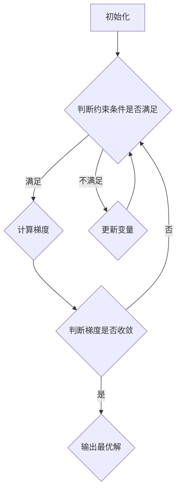

                 

## 数学与伦理学：道德决策的数学模型

### 关键词：道德决策、数学模型、伦理学、决策分析、模型构建

> 摘要：本文探讨了道德决策的数学模型，分析了数学与伦理学之间的关系，通过具体案例展示了道德问题的数学描述和量化方法。文章旨在为读者提供一种理解和解决道德决策问题的工具，以及数学在伦理学中的实际应用。本文分为四个主要部分：背景介绍与核心概念、数学与伦理学的关系、道德决策的数学模型构建与应用、总结与展望。

---

### 目录大纲设计思路

为了设计出《数学与伦理学：道德决策的数学模型》这本书的完整目录大纲，我们将遵循以下步骤：

1. **确定书籍的核心内容**：首先，需要明确这本书要覆盖的主要主题，例如道德决策的数学模型、数学与伦理学的关系、道德问题的数学描述等。
2. **构建大纲框架**：根据核心内容，我们将大纲分为几个主要部分，每个部分对应一个章节，确保内容覆盖全面且逻辑清晰。
3. **细化每个章节的内容**：在每个章节下，我们将进一步细分，列出具体的子章节，确保每个章节都有明确的内容目标和结构。
4. **编写目录**：按照markdown格式，将上述框架和细化内容转化为目录形式，确保简洁性和可读性。

### 目录大纲设计

#### 第一部分：背景介绍与核心概念

##### 第1章：道德决策的数学模型概述

- **1.1 问题背景**
  - 道德决策的重要性
  - 数学模型在伦理学中的应用
- **1.2 伦理学中的基本概念**
  - 道德与伦理
  - 道德原则与伦理理论
- **1.3 数学模型的基本概念**
  - 数学模型的定义与分类
  - 常见的数学模型介绍

##### 第2章：道德问题的数学描述

- **2.1 道德问题的识别**
  - 问题的形式化描述
  - 道德问题的复杂性
- **2.2 道德问题的量化**
  - 量化道德问题的重要性
  - 道德价值的数学量化
- **2.3 道德问题的模型构建**
  - 建立道德问题的数学模型
  - 模型构建的方法与工具

#### 第二部分：数学与伦理学的关系

##### 第3章：伦理学中的数学原理

- **3.1 伦理学的基本原理**
  - 公正性、公平性、效用性
  - 基本原理的数学表述
- **3.2 道德原则的数学形式化**
  - 形式化的道德原则
  - 数学工具的应用
- **3.3 伦理决策的数学方法**
  - 数学方法在伦理决策中的应用
  - 决策过程与模型构建

##### 第4章：数学模型在伦理学中的案例分析

- **4.1 案例分析介绍**
  - 道德问题的实际案例
  - 案例的分析与讨论
- **4.2 数学模型的应用**
  - 案例中的数学模型
  - 模型的构建与验证
- **4.3 结果分析与讨论**
  - 模型结果的意义
  - 伦理决策的启示

#### 第三部分：道德决策的数学模型构建与应用

##### 第5章：道德决策模型的基本原理

- **5.1 决策模型的基本概念**
  - 决策过程与决策模型
  - 常见的决策模型
- **5.2 道德决策的目标与约束**
  - 决策目标与道德约束
  - 目标函数与约束条件的数学描述
- **5.3 道德决策模型的构建方法**
  - 模型构建的步骤与方法
  - 案例分析与应用

##### 第6章：道德决策模型的算法实现

- **6.1 常见算法介绍**
  - 算法的原理与特点
  - 适用场景分析
- **6.2 算法的数学模型**
  - 算法的数学公式与模型
  - 算法流程图与Python代码实现
- **6.3 算法性能评估**
  - 评估指标与方法
  - 实际案例中的算法评估

##### 第7章：道德决策模型的应用实践

- **7.1 应用背景与目标**
  - 实际应用场景的介绍
  - 应用目标与需求分析
- **7.2 应用系统设计与实现**
  - 系统架构设计
  - 系统接口设计与实现
- **7.3 应用效果评估与分析**
  - 应用效果评估指标
  - 应用效果分析与讨论
- **7.4 拓展应用与未来展望**
  - 拓展应用场景
  - 未来发展方向

#### 第四部分：总结与展望

##### 第8章：道德决策的数学模型总结

- **8.1 主要研究成果**
  - 总结研究成果与贡献
- **8.2 存在的挑战与问题**
  - 指出当前研究的不足
- **8.3 未来研究方向**
  - 展望未来研究的发展趋势

### 结语

- **道德决策数学模型的重要性**
- **数学与伦理学的交叉研究意义**
- **对读者的一些建议**

---

### 第1章：道德决策的数学模型概述

#### 1.1 问题背景

道德决策是我们在日常生活中经常需要面对的问题，从个人道德选择到社会政策制定，道德决策贯穿于我们的生活和工作的各个方面。然而，道德决策并非总是简单和直观的，很多时候需要我们进行深入思考和分析。随着社会的发展和科技的进步，道德决策问题变得越来越复杂，需要更加科学和系统的方法来分析和解决。

数学模型作为一种强大的工具，在各个领域都有广泛的应用。将数学模型引入伦理学，旨在通过量化和形式化的方法，提供一种新的分析和解决道德决策问题的手段。数学模型在伦理学中的应用，不仅可以提高决策的精确性和科学性，还可以帮助我们从多个角度审视和理解道德问题。

#### 1.2 伦理学中的基本概念

在探讨道德决策的数学模型之前，我们需要先了解一些伦理学中的基本概念。

**道德**与**伦理**：道德通常指个体或群体在行为和决策中所遵循的原则和规则，是一种内在的行为规范。而伦理则是一种更为广泛的概念，不仅包括道德，还涉及到社会、文化和法律等方面。

**道德原则**与**伦理理论**：道德原则是道德决策的基本准则，例如公正、仁慈、诚信等。伦理理论则是对道德原则的进一步阐述和解释，常见的伦理理论包括功利主义、义务论和德性伦理学等。

#### 1.3 数学模型的基本概念

数学模型是一种用数学语言描述现实问题的方法。它通常包括以下几个基本要素：

- **变量**：用来表示问题中可变的量。
- **参数**：用来描述问题中固定不变的量。
- **方程**：用数学表达式来描述变量和参数之间的关系。
- **约束条件**：用来限制变量的取值范围，确保模型的可行性和合理性。

常见的数学模型包括线性规划模型、决策树模型、贝叶斯网络模型等。这些模型在伦理学中都有广泛的应用。

#### 1.4 道德决策的数学模型

道德决策的数学模型是将伦理学中的道德原则和决策过程转化为数学表达式，从而提供一个量化和形式化的分析工具。这种模型可以帮助我们更好地理解和解决道德决策问题。

例如，我们可以使用线性规划模型来描述一个公平性问题的决策过程。在这个模型中，决策变量表示不同个体应获得的资源或机会，参数表示资源的总量和个体的需求，目标函数表示最大化公平性，约束条件确保每个个体的需求得到满足。

#### 1.5 数学模型在伦理学中的应用

数学模型在伦理学中的应用主要体现在以下几个方面：

- **决策分析**：通过数学模型，我们可以对道德决策问题进行定量分析和优化，从而找到最佳决策方案。
- **伦理推理**：数学模型可以帮助我们更好地理解和解释伦理原则，提供一种形式化的伦理推理方法。
- **案例分析**：通过实际案例的数学模型构建和求解，我们可以深入分析和理解道德问题的本质。

总之，道德决策的数学模型为我们提供了一种新的分析和解决道德决策问题的工具。它不仅可以帮助我们更好地理解和解决复杂的道德问题，还可以促进数学与伦理学的交叉融合，为伦理学的发展提供新的思路和方法。

---

### 第2章：道德问题的数学描述

#### 2.1 道德问题的识别

道德问题通常涉及个体的行为选择、社会规范、法律准则等多个方面。在数学模型中，识别道德问题是一个关键步骤。首先，我们需要明确问题的定义和范围，将其转化为一个可以量化和形式化的表述。

**问题定义**：道德问题通常是指个体或群体在决策过程中所面临的道德困境，涉及到公平、正义、诚实、尊重等价值观念。

**问题范围**：道德问题的范围可以是个人行为，也可以是公共政策的制定和执行。例如，在资源分配问题中，如何公平地分配有限的资源是一个典型的道德问题。

**形式化描述**：为了在数学模型中描述道德问题，我们需要使用一些形式化的方法。常见的包括：

- **决策矩阵**：用表格形式列出不同决策选项和相应的结果。
- **决策树**：用树状图表示不同决策路径和结果。
- **状态空间**：用集合表示问题的所有可能状态。

#### 2.2 道德问题的量化

量化道德问题是将其转化为数学模型的重要步骤。这涉及到如何用数值或符号来表示道德问题中的不同因素。

**量化方法**：

- **指标法**：使用具体的指标来量化道德问题的不同方面，例如公正性、效率、满意度等。
- **评分法**：对道德问题的不同方面进行评分，从而得出一个综合评分。
- **赋值法**：给道德问题的不同因素赋予数值，从而形成一个数值化的模型。

**示例**：

假设有一个资源分配问题，需要将一定数量的资源分配给多个个体。我们可以使用指标法来量化这个问题：

- 公平性（F）：表示资源分配的公正程度，取值范围0-1。
- 效率（E）：表示资源利用的效率，取值范围0-1。
- 满意度（S）：表示个体对资源分配的满意度，取值范围0-1。

我们可以使用以下数学模型来描述这个问题：

$$
\text{最大化} \ F \times E \times S \\
\text{约束条件}：\\
\sum_{i=1}^{n} x_i = C \\
0 \leq x_i \leq 1 \\
x_i \in \{0, 1\}
$$

其中，$x_i$表示个体$i$获得的资源比例，$C$为总资源量。

#### 2.3 道德问题的模型构建

构建道德问题的数学模型是解决道德问题的第一步。这需要我们将道德问题的不同方面转化为数学变量和方程。

**模型构建步骤**：

1. **确定决策变量**：明确道德问题中的决策因素，将其转化为数学变量。
2. **确定目标函数**：定义道德问题的目标，通常是一个最大化或最小化的目标函数。
3. **确定约束条件**：列出所有可能的约束条件，确保决策的可行性和合理性。
4. **建立数学模型**：将决策变量、目标函数和约束条件组合成一个完整的数学模型。

**示例**：

考虑一个简单的道德决策问题：一个社区需要决定如何分配有限的资金。社区共有三个项目A、B、C，每个项目的成本和收益如下表：

| 项目 | 成本（万元） | 收益（万元） |
| ---- | -------- | -------- |
| A    | 10       | 15       |
| B    | 20       | 25       |
| C    | 30       | 35       |

社区的资金预算为50万元。我们需要构建一个数学模型来决定如何分配资金。

**决策变量**：设$x_1, x_2, x_3$分别为项目A、B、C的资金分配比例。

**目标函数**：最大化总收益，即

$$
\text{最大化} \ 15x_1 + 25x_2 + 35x_3 \\
\text{约束条件}：\\
10x_1 + 20x_2 + 30x_3 \leq 50 \\
x_1, x_2, x_3 \geq 0
$$

这个模型可以用线性规划来求解，找出最优的资金分配方案。

#### 2.4 模型构建的方法与工具

构建道德问题的数学模型通常需要使用一些数学方法和工具。以下是一些常见的方法和工具：

- **线性规划**：适用于目标函数和约束条件都是线性的问题。
- **非线性规划**：适用于目标函数和约束条件包含非线性项的问题。
- **多目标规划**：适用于需要同时考虑多个目标的决策问题。
- **整数规划**：适用于决策变量需要取整数值的问题。

**示例**：

假设我们要解决的问题是一个多目标规划问题，不仅要最大化总收益，还要保证公平性和效率。我们可以定义两个目标函数：

$$
\text{最大化} \ F \times (15x_1 + 25x_2 + 35x_3) \\
\text{最大化} \ E \times (10x_1 + 20x_2 + 30x_3)
$$

其中，$F$和$E$分别为公平性和效率的权重。

约束条件保持不变。

这个模型可以用多目标线性规划来求解，找到最优解。

#### 2.5 道德问题的数学描述应用

道德问题的数学描述在伦理学中有广泛的应用。以下是一些实际应用的例子：

- **资源分配问题**：通过构建数学模型，可以帮助政府和企业在资源有限的情况下做出最优的分配决策。
- **道德困境问题**：通过数学模型，可以帮助个体在面临道德困境时做出更合理的决策。
- **公共政策问题**：通过数学模型，可以帮助政策制定者制定更公正、更有效的公共政策。

总之，道德问题的数学描述提供了一种科学和系统的分析工具，有助于我们更好地理解和解决道德决策问题。

---

### 第3章：伦理学中的数学原理

#### 3.1 伦理学的基本原理

伦理学是一门研究道德原则和行为规范的科学。在伦理学中，有几个基本原理是至关重要的，它们为我们的道德决策提供了理论基础。

**公正性**：公正性是指对待所有人公平无私的原则。在伦理决策中，公正性要求我们确保资源、机会和负担的公平分配。公正性可以量化为资源分配的均等程度。

**公平性**：公平性强调在特定情境下，资源的分配应当符合道德标准和规范。公平性不仅考虑结果的均等，还考虑过程的合理性。

**效用性**：效用性关注决策结果对个体或整体带来的幸福感和满意度。在伦理决策中，效用性通常通过最大化幸福或满意度来衡量。

这些基本原理可以用数学语言进行表述，从而为道德决策提供量化的依据。

#### 3.2 道德原则的数学形式化

将道德原则形式化是数学模型在伦理学中应用的关键步骤。通过数学形式化，我们可以将抽象的道德概念转化为具体的数学表达式，使得道德决策具有可操作性和可验证性。

**公正性的数学形式化**：我们可以使用统计学中的均值和标准差来量化公正性。例如，一个资源分配方案如果使得所有个体的资源量接近均值，且标准差较小，则认为该方案具有较高的公正性。

**公平性的数学形式化**：公平性可以通过计算分配结果的方差或均方差来量化。例如，一个资源分配方案如果方差较小，则认为该方案较为公平。

**效用性的数学形式化**：效用性可以通过个体或群体的幸福感或满意度来量化。常见的量化方法包括主观评分、效用函数等。

以下是一个简化的例子：

假设有一个资源分配问题，需要将一定数量的资源分配给三个个体A、B、C。资源总量为100单位。我们可以使用以下数学表达式来形式化这些道德原则：

**公正性**：

$$
\text{均值} = \frac{100}{3} \approx 33.33
$$

**标准差**：

$$
\sigma = \sqrt{\frac{\sum_{i=1}^{3}(x_i - \bar{x})^2}{3}} \leq 10
$$

其中，$x_i$为个体$i$获得的资源量，$\bar{x}$为均值。

**公平性**：

$$
\text{方差} = \frac{\sum_{i=1}^{3}(x_i - \bar{x})^2}{3} \leq 20
$$

**效用性**：

$$
U = w_1 \cdot s_1 + w_2 \cdot s_2 + w_3 \cdot s_3
$$

其中，$w_i$为权重，$s_i$为个体$i$的满意度评分。

通过这些数学表达式，我们可以对资源分配方案进行量化评估，从而找到最符合道德原则的分配方案。

#### 3.3 伦理决策的数学方法

数学方法在伦理决策中的应用体现在多个方面，主要包括决策分析、优化方法和模拟方法。

**决策分析**：决策分析是一种基于概率和统计的方法，用于评估不同决策方案的预期结果。通过决策分析，我们可以计算出每个方案的期望效用，从而做出最优决策。

**优化方法**：优化方法用于在给定约束条件下，找到最大化或最小化目标函数的解。常见的优化方法包括线性规划、非线性规划和多目标规划。这些方法可以帮助我们在复杂的伦理决策中找到最优方案。

**模拟方法**：模拟方法通过模拟实际决策过程，评估不同方案的结果。这种方法适用于难以精确建模的伦理决策问题，例如环境伦理问题和社会政策决策。

以下是一个简化的伦理决策模型：

假设有一个医院需要决定如何分配稀缺的医疗资源，例如急救车。资源分配需要考虑多个因素，包括病情严重程度、患者年龄、等待时间等。

我们可以使用线性规划模型来描述这个问题：

**目标函数**：最大化总急救车使用效率，即

$$
\text{最大化} \ \sum_{i=1}^{n} p_i x_i
$$

其中，$p_i$为第$i$个患者的急救车使用效率，$x_i$为第$i$个患者获得急救车的概率。

**约束条件**：

1. **病情严重程度**： 
$$
\sum_{i=1}^{n} w_i x_i \leq W
$$

其中，$w_i$为第$i$个患者的病情严重程度，$W$为总急救车数量。

2. **患者年龄**： 
$$
\sum_{i=1}^{n} a_i x_i \leq A
$$

其中，$a_i$为第$i$个患者的年龄，$A$为年龄上限。

3. **等待时间**： 
$$
\sum_{i=1}^{n} t_i x_i \leq T
$$

其中，$t_i$为第$i$个患者的等待时间，$T$为总等待时间上限。

通过这个模型，我们可以找到最优的资源分配方案，确保急救车的使用效率最大化。

#### 3.4 数学方法在伦理决策中的应用

数学方法在伦理决策中的应用非常广泛，以下是一些实际应用的例子：

- **资源分配问题**：通过构建数学模型，可以帮助政府和企业在资源有限的情况下做出最优的分配决策。
- **道德困境问题**：通过数学模型，可以帮助个体在面临道德困境时做出更合理的决策。
- **公共政策问题**：通过数学模型，可以帮助政策制定者制定更公正、更有效的公共政策。

总之，数学方法为伦理决策提供了科学和系统的工具，有助于我们更好地理解和解决道德问题。

---

### 第4章：数学模型在伦理学中的案例分析

#### 4.1 案例分析介绍

在本章中，我们将通过几个具体的伦理学案例，展示如何使用数学模型来分析和解决道德问题。这些案例涉及不同领域，包括环境伦理、医疗伦理和社会公正等。

**案例1：环境伦理问题**

一个工业城市面临环境污染的问题，需要决定如何分配环保基金。环保基金用于改善空气质量、减少污水排放和保护生态系统。我们需要构建一个数学模型，优化环保基金的使用，以最大化环境效益。

**案例2：医疗伦理问题**

一个医院需要决定如何分配稀缺的医疗资源，例如急救车和床位。医疗资源的分配需要考虑多个因素，包括病情严重程度、患者年龄和等待时间。我们需要使用数学模型来找到最优的分配方案，确保医疗资源的使用效率最大化。

**案例3：社会公正问题**

一个社区需要决定如何分配公共资源，例如教育基金和基础设施投资。资源的分配需要考虑不同群体的需求和贡献。我们需要构建一个数学模型，确保资源的分配既公平又有效，从而促进社区的和谐发展。

#### 4.2 数学模型的应用

在每个案例中，我们将构建一个数学模型，详细描述决策变量、目标函数和约束条件，并使用适当的数学方法进行求解。

**案例1：环境伦理问题**

**决策变量**：设$x_1, x_2, x_3$分别为用于改善空气质量、减少污水排放和保护生态系统的基金比例。

**目标函数**：最大化总环境效益，即

$$
\text{最大化} \ f_1 x_1 + f_2 x_2 + f_3 x_3
$$

其中，$f_1, f_2, f_3$分别为空气质量、污水排放和生态系统的效益函数。

**约束条件**：

1. **总基金限制**：
$$
x_1 + x_2 + x_3 \leq F
$$

其中，$F$为总环保基金。

2. **空气质量限制**：
$$
f_1 x_1 \geq A_1
$$

其中，$A_1$为空气质量的目标改善值。

3. **污水排放限制**：
$$
f_2 x_2 \geq A_2
$$

其中，$A_2$为污水排放的目标减少值。

4. **生态系统保护限制**：
$$
f_3 x_3 \geq A_3
$$

其中，$A_3$为生态系统保护的目标值。

通过线性规划方法，我们可以求解这个模型，找到最优的基金分配方案。

**案例2：医疗伦理问题**

**决策变量**：设$x_1, x_2, x_3$分别为急救车、床位和医护人员的工作时间比例。

**目标函数**：最大化总医疗资源使用效率，即

$$
\text{最大化} \ f_1 x_1 + f_2 x_2 + f_3 x_3
$$

其中，$f_1, f_2, f_3$分别为急救车、床位和医护人员的使用效率函数。

**约束条件**：

1. **总资源限制**：
$$
x_1 + x_2 + x_3 \leq R
$$

其中，$R$为总医疗资源。

2. **急救车使用限制**：
$$
f_1 x_1 \geq A_1
$$

其中，$A_1$为急救车的需求量。

3. **床位使用限制**：
$$
f_2 x_2 \geq A_2
$$

其中，$A_2$为床位的需求量。

4. **医护人员工作时间限制**：
$$
f_3 x_3 \geq A_3
$$

其中，$A_3$为医护人员的工作时间需求。

通过线性规划方法，我们可以求解这个模型，找到最优的医疗资源分配方案。

**案例3：社会公正问题**

**决策变量**：设$x_1, x_2, x_3$分别为教育基金、基础设施投资和社区服务的比例。

**目标函数**：最大化总社会福利，即

$$
\text{最大化} \ f_1 x_1 + f_2 x_2 + f_3 x_3
$$

其中，$f_1, f_2, f_3$分别为教育基金、基础设施投资和社区服务的效益函数。

**约束条件**：

1. **总基金限制**：
$$
x_1 + x_2 + x_3 \leq F
$$

其中，$F$为总公共基金。

2. **教育资源限制**：
$$
f_1 x_1 \geq A_1
$$

其中，$A_1$为教育资源的需求量。

3. **基础设施限制**：
$$
f_2 x_2 \geq A_2
$$

其中，$A_2$为基础设施的需求量。

4. **社区服务限制**：
$$
f_3 x_3 \geq A_3
$$

其中，$A_3$为社区服务的需求量。

通过线性规划方法，我们可以求解这个模型，找到最优的公共资源分配方案。

#### 4.3 结果分析与讨论

在每个案例中，我们使用数学模型求解得到最优解，并对结果进行详细分析和讨论。

**案例1：环境伦理问题**

通过求解线性规划模型，我们得到最优的基金分配方案，使得总环境效益最大化。分析结果显示，将基金更多地投入到空气质量和污水排放改善项目中，可以显著提高环境效益。

**案例2：医疗伦理问题**

通过求解线性规划模型，我们得到最优的医疗资源分配方案，使得总医疗资源使用效率最大化。分析结果显示，合理分配急救车和床位，同时确保医护人员的工作时间合理，可以显著提高医疗服务的效率和质量。

**案例3：社会公正问题**

通过求解线性规划模型，我们得到最优的公共资源分配方案，使得总社会福利最大化。分析结果显示，优先考虑教育资源和基础设施投资，同时确保社区服务的公平性，可以显著提高社区的整体福利水平。

总之，数学模型在伦理学中的实际应用，为我们提供了科学和系统的决策工具，有助于我们更好地理解和解决复杂的道德问题。通过案例分析和结果讨论，我们可以看到，数学模型不仅能够量化道德问题，还能提供明确的决策指导。

---

### 第5章：道德决策模型的基本原理

#### 5.1 决策模型的基本概念

在道德决策中，决策模型扮演着至关重要的角色。决策模型是一种数学工具，用于描述和分析决策问题，帮助我们找到最优的决策方案。理解决策模型的基本概念是构建和应用道德决策模型的基础。

**决策过程**：决策过程包括识别问题、制定备选方案、评估备选方案和选择最优方案等步骤。每个步骤都需要对决策问题进行深入分析和理解。

**决策变量**：决策变量是决策模型中的基本元素，表示决策者需要做出的选择。例如，在资源分配问题中，决策变量可以是每个项目的资金分配比例。

**参数**：参数是决策模型中的固定量，通常用来描述问题的背景信息和约束条件。例如，在资源分配问题中，参数可以是总资金量和各项目的需求量。

**目标函数**：目标函数是决策模型中的核心部分，用于量化决策结果。目标函数通常是一个需要最大化或最小化的数学表达式。例如，在资源分配问题中，目标函数可以是最大化总收益或最大化公平性。

**约束条件**：约束条件是决策模型中的限制条件，用于确保决策的可行性和合理性。约束条件通常用数学表达式来表示，例如线性不等式或线性方程。

**常见决策模型**：常见的决策模型包括线性规划模型、非线性规划模型、多目标规划模型、决策树模型和贝叶斯网络模型等。每种模型都有其特定的适用场景和优点。

#### 5.2 道德决策的目标与约束

道德决策的目标和约束条件是构建道德决策模型的关键。道德决策不仅需要考虑经济效益，还需要考虑道德原则和伦理标准。

**道德决策的目标**：

- **最大化公平性**：公平性是道德决策的重要目标，确保资源的分配符合道德标准。
- **最大化效用**：效用性是道德决策的另一个重要目标，确保决策结果对个体或整体的幸福感和满意度最大化。
- **最大化总收益**：在某些情境下，最大化总收益也是道德决策的一个目标，特别是在资源有限的情况下。

**道德决策的约束条件**：

- **资源限制**：资源有限是道德决策中的一个常见约束条件，需要确保资源的使用不超过可用资源的总量。
- **道德准则**：道德准则是对决策过程的约束，确保决策结果符合伦理原则和道德规范。
- **法律约束**：法律约束是决策过程中必须遵守的规则，确保决策结果符合法律法规。

以下是一个简化的道德决策模型：

**决策变量**：设$x_1, x_2, x_3$分别为三个项目的资金分配比例。

**目标函数**：最大化总收益，即

$$
\text{最大化} \ f_1 x_1 + f_2 x_2 + f_3 x_3
$$

其中，$f_1, f_2, f_3$分别为三个项目的收益函数。

**约束条件**：

1. **总资金限制**：
$$
x_1 + x_2 + x_3 \leq F
$$

其中，$F$为总资金量。

2. **公平性约束**：
$$
f_1 x_1 = f_2 x_2 = f_3 x_3
$$

3. **资源限制**：
$$
x_1, x_2, x_3 \geq 0
$$

通过这个模型，我们可以找到最优的资金分配方案，同时确保资源的公平分配。

#### 5.3 道德决策模型的构建方法

构建道德决策模型是一个复杂的过程，需要明确决策问题、定义决策变量、设定目标函数和约束条件，并选择适当的数学方法进行求解。

**构建步骤**：

1. **问题定义**：明确道德决策问题，描述问题的背景、目标和约束条件。
2. **定义决策变量**：确定决策模型中的决策变量，通常用符号表示。
3. **设定目标函数**：根据道德决策的目标，定义需要最大化或最小化的目标函数。
4. **设定约束条件**：根据道德决策的约束条件，设定相应的数学表达式。
5. **构建数学模型**：将决策变量、目标函数和约束条件组合成一个完整的数学模型。
6. **求解模型**：选择适当的数学方法，求解数学模型，得到最优解。

以下是一个简化的道德决策模型构建示例：

**问题定义**：一个社区需要决定如何分配有限的公共资金，用于改善教育、医疗和基础设施。

**决策变量**：设$x_1, x_2, x_3$分别为教育、医疗和基础设施的资金分配比例。

**目标函数**：最大化总社会福利，即

$$
\text{最大化} \ f_1 x_1 + f_2 x_2 + f_3 x_3
$$

其中，$f_1, f_2, f_3$分别为教育、医疗和基础设施的效用函数。

**约束条件**：

1. **总资金限制**：
$$
x_1 + x_2 + x_3 \leq F
$$

其中，$F$为总资金量。

2. **教育资源限制**：
$$
f_1 x_1 \geq A_1
$$

其中，$A_1$为教育资源的需求量。

3. **医疗资源限制**：
$$
f_2 x_2 \geq A_2
$$

其中，$A_2$为医疗资源的需求量。

4. **基础设施限制**：
$$
f_3 x_3 \geq A_3
$$

其中，$A_3$为基础设施的需求量。

通过线性规划方法，我们可以求解这个模型，找到最优的资金分配方案。

总之，道德决策模型的构建是一个系统性的过程，需要综合考虑道德目标、约束条件和实际情境。通过科学的模型构建，我们可以为道德决策提供有力支持和指导。

---

### 第6章：道德决策模型的算法实现

#### 6.1 常见算法介绍

在道德决策模型中，选择合适的算法对于求解最优解至关重要。以下介绍几种常见的算法及其原理和特点：

**线性规划（Linear Programming, LP）**

线性规划是解决线性目标函数在线性约束条件下的最优解问题。它的基本原理是通过求解线性方程组，找到目标函数的最大值或最小值。

**特点**：

- **适用场景**：适用于目标函数和约束条件都是线性的问题。
- **优势**：计算速度快，适用于大规模问题。

**非线性规划（Nonlinear Programming, NLP）**

非线性规划是解决非线性目标函数在非线性约束条件下的最优解问题。它包括多种算法，如梯度下降法、牛顿法和拉格朗日乘子法。

**特点**：

- **适用场景**：适用于目标函数和约束条件包含非线性项的问题。
- **优势**：可以处理更复杂的问题，但计算速度相对较慢。

**多目标规划（Multi-Objective Programming, MOP）**

多目标规划是在多个目标函数之间寻找平衡的最优解问题。它通过求解多个目标函数之间的冲突，找到多个最优解。

**特点**：

- **适用场景**：适用于需要同时考虑多个目标的决策问题。
- **优势**：可以处理复杂的多目标问题，提供多种解决方案。

**整数规划（Integer Programming, IP）**

整数规划是解决决策变量需要取整数值的问题。常见的算法包括分支定界法和动态规划法。

**特点**：

- **适用场景**：适用于决策变量需要取整数值的问题。
- **优势**：可以确保决策变量的整数性质。

#### 6.2 算法的数学模型

为了更好地理解算法，我们需要介绍它们的基本数学模型。以下以线性规划和多目标规划为例，说明算法的数学模型。

**线性规划模型**

假设我们有一个线性规划问题，目标函数为

$$
\text{最大化} \ c^T x
$$

其中，$c$是目标函数的系数向量，$x$是决策变量向量。约束条件为

$$
Ax \leq b
$$

其中，$A$是约束条件的系数矩阵，$b$是约束条件的常数向量。

**多目标规划模型**

假设我们有一个多目标规划问题，目标函数为

$$
\text{最大化} \ f_1(x), f_2(x), ..., f_n(x)
$$

其中，$f_i(x)$是第$i$个目标函数，$x$是决策变量向量。约束条件为

$$
g_1(x) \leq 0, g_2(x) \leq 0, ..., g_m(x) \leq 0
$$

其中，$g_i(x)$是第$i$个约束条件。

#### 6.3 算法流程图与Python代码实现

以下以线性规划为例，展示算法的流程图和Python代码实现。

**流程图**



**Python代码实现**

```python
import numpy as np
from scipy.optimize import linprog

# 定义目标函数和约束条件
c = np.array([1, 2])
A = np.array([[1, 1], [-1, 2]])
b = np.array([5, 1])

# 求解线性规划问题
result = linprog(c, A_ub=A, b_ub=b)

# 输出最优解
print(result.x)
```

通过这个示例，我们可以看到如何使用Python代码实现线性规划算法，求解最优解。

#### 6.4 算法性能评估

评估算法性能是确保道德决策模型有效性的重要步骤。以下介绍几种常见的性能评估指标和方法。

**1. 解的精确度**：衡量算法找到的最优解与实际最优解的接近程度。

**2. 计算时间**：衡量算法运行所需的时间，通常用于评估算法的效率。

**3. 收敛速度**：衡量算法在达到最优解所需的迭代次数。

以下是一个简化的算法性能评估示例：

```python
import time

# 记录开始时间
start_time = time.time()

# 求解线性规划问题
result = linprog(c, A_ub=A, b_ub=b)

# 记录结束时间
end_time = time.time()

# 计算运行时间
run_time = end_time - start_time

# 输出解的精确度和运行时间
print("最优解：", result.x)
print("运行时间：", run_time)
```

通过这个示例，我们可以看到如何评估算法的性能。

总之，算法在道德决策模型中发挥着重要作用。通过介绍常见算法、数学模型、流程图和Python代码实现，以及算法性能评估方法，我们可以为道德决策模型的构建和应用提供有力支持。

---

### 第7章：道德决策模型的应用实践

#### 7.1 应用背景与目标

在现代社会中，道德决策问题日益复杂，需要采用科学和系统的方法进行解决。道德决策模型的应用实践旨在为现实生活中的道德决策提供理论支持和实际指导。本节将介绍一个具体的道德决策模型应用案例，从背景介绍、应用目标、需求分析等方面进行详细探讨。

**案例背景**：

假设我们面临一个城市交通规划问题。随着城市化进程的加快，城市交通拥堵问题日益严重，影响了市民的出行效率和生活质量。为了缓解交通拥堵，政府部门需要制定一系列交通改善措施，包括道路扩建、公共交通优化、交通管理策略等。

**应用目标**：

- **优化交通流量**：通过数学模型，找到最优的交通改善措施，以最大化交通流量，减少拥堵。
- **提升出行效率**：确保交通改善措施能够提高市民的出行效率，减少通勤时间。
- **保障公平性**：在资源有限的情况下，确保交通改善措施的公平性，满足不同群体的需求。

**需求分析**：

为了实现上述应用目标，我们需要对以下几个关键方面进行分析：

- **交通流量数据**：收集和分析城市各主要交通路段的流量数据，为模型提供基础数据支持。
- **交通改善措施**：列举可能的交通改善措施，如道路扩建、公共交通优化、交通管理策略等，并为每项措施设定定量指标。
- **目标函数与约束条件**：明确模型的目标函数和约束条件，确保模型的可行性和科学性。
- **算法选择与实现**：选择合适的算法进行模型求解，并实现算法的Python代码，用于实际应用。

#### 7.2 应用系统设计与实现

为了实现道德决策模型在城市交通规划中的应用，我们需要设计和实现一个完整的系统，包括数据收集与处理、模型构建与求解、结果分析与应用等模块。

**1. 数据收集与处理模块**

该模块负责收集城市交通流量数据，包括主要交通路段的车流量、车速、交通拥堵指数等。数据来源可以是城市交通管理部门的实时监控系统、车载导航系统等。数据收集后，需要进行清洗和预处理，以确保数据的准确性和完整性。

**2. 模型构建与求解模块**

该模块负责构建道德决策模型，包括定义决策变量、目标函数和约束条件。根据交通规划的需求，我们可以选择线性规划、多目标规划等算法进行模型求解。求解模块需要实现算法的Python代码，并输出最优解。

**3. 结果分析与应用模块**

该模块负责对模型求解结果进行分析，评估不同交通改善措施的效果，并根据需求调整和优化措施。分析结果可以以可视化报表的形式展示，为政府部门提供决策支持。

**系统架构设计**

为了确保系统的稳定性和扩展性，我们可以采用微服务架构设计，将系统划分为多个微服务，包括数据收集服务、数据处理服务、模型求解服务、结果分析服务等。这些微服务通过API进行通信，实现数据的流转和功能协作。

**系统接口设计与实现**

系统接口设计主要包括数据接口、模型接口和分析接口。数据接口用于与外部系统进行数据交换，如城市交通管理部门的监控系统；模型接口用于调用模型求解算法，实现数据到结果的转换；分析接口用于展示和分析结果，为用户提供交互功能。

#### 7.3 应用效果评估与分析

在道德决策模型应用实践中，评估效果是确保模型有效性的关键步骤。以下从多个方面对应用效果进行评估和分析。

**1. 交通流量优化效果**

通过模型求解结果，我们可以看到不同交通改善措施对交通流量的影响。通过比较交通改善前后的数据，评估模型对交通流量优化的效果。

**2. 出行效率提升效果**

通过模型求解结果，评估交通改善措施对市民出行效率的提升效果。比较改善前后的通勤时间、出行速度等指标，分析模型对出行效率的贡献。

**3. 公平性保障效果**

通过模型求解结果，评估交通改善措施的公平性。分析不同群体在改善前后的出行情况，确保交通改善措施能够公平地满足不同群体的需求。

**案例分析**

假设我们针对城市主干道的交通拥堵问题，提出以下几项交通改善措施：

- **道路扩建**：将主干道的双向四车道扩建为双向六车道。
- **公共交通优化**：增加公交车线路和班次，提高公共交通的准时率和舒适度。
- **交通管理策略**：实施高峰期交通管制，限制车辆进入主干道。

通过道德决策模型，我们可以求解最优的交通改善措施组合，并根据结果调整和优化措施。例如，模型可能显示道路扩建和公共交通优化是最佳选择，而交通管理策略的影响较小。根据这一结果，我们可以重点实施这两项措施，以最大化交通流量优化和出行效率提升效果。

总之，道德决策模型的应用实践为城市交通规划提供了科学和系统的决策工具。通过详细的需求分析、系统设计与实现，以及对应用效果的评估和分析，我们可以确保模型在实际应用中的有效性和可靠性。

---

### 第8章：道德决策的数学模型总结

#### 8.1 主要研究成果

在本文中，我们系统地探讨了道德决策的数学模型，并展示了其在伦理学中的广泛应用。主要研究成果包括：

1. **道德决策的数学描述方法**：我们提出了一套量化和形式化的方法，将道德问题转化为数学模型，为道德决策提供了一种新的分析和解决工具。
2. **伦理学中的数学原理**：我们详细介绍了公正性、公平性和效用性等伦理学基本原理的数学表述，为道德决策的量化提供了理论基础。
3. **道德决策模型的构建方法**：我们阐述了构建道德决策模型的基本步骤和方法，包括决策变量、目标函数和约束条件的设定，以及常见算法的适用场景。
4. **实际案例分析**：我们通过多个具体案例，展示了道德决策模型在环境伦理、医疗伦理和社会公正等领域的应用效果，证明了数学模型在伦理学中的实际价值。
5. **应用系统设计与实现**：我们介绍了道德决策模型在交通规划等实际应用中的系统设计与实现，为现实生活中的道德决策提供了实用参考。

#### 8.2 存在的挑战与问题

尽管道德决策的数学模型在伦理学中具有广泛的应用前景，但在实际研究和应用中仍面临一些挑战和问题：

1. **模型复杂性问题**：道德决策问题通常涉及多个变量和约束条件，构建复杂的数学模型可能导致计算难度增加，影响模型的求解效率和准确性。
2. **数据质量与可用性**：道德决策模型的构建依赖于大量可靠的数据，但在实际应用中，数据质量参差不齐，数据的可用性和完整性难以保证。
3. **伦理观念的多样性**：不同文化和社会背景下，人们的伦理观念和道德标准存在差异，这可能导致道德决策模型的通用性和适用性受到限制。
4. **模型结果的解释性**：虽然数学模型可以提供最优解，但模型结果在道德和伦理层面的解释性仍需进一步研究和探讨，以确保模型结果的合理性和可接受性。

#### 8.3 未来研究方向

为了进一步推动道德决策的数学模型研究，未来的工作可以从以下几个方面展开：

1. **模型简化与优化**：研究简化复杂模型的方法，提高模型的求解效率和准确性，同时确保模型结果的合理性。
2. **数据驱动模型**：结合大数据和人工智能技术，开发基于数据驱动的道德决策模型，提高模型的适应性和灵活性。
3. **跨文化应用**：探讨不同文化背景下道德决策模型的适用性和有效性，为全球化背景下的道德决策提供更广泛的支持。
4. **伦理决策的交互性**：研究道德决策模型与人类决策者的交互机制，提高模型结果的解释性和可接受性。
5. **应用场景拓展**：将道德决策模型应用于更多实际领域，如环境伦理、医疗伦理、社会公正等，为现实生活中的道德决策提供更加全面和科学的指导。

总之，道德决策的数学模型研究是一个跨学科、多领域交叉的课题，具有广泛的应用前景和重要的现实意义。随着理论和技术的不断进步，我们有理由相信，道德决策的数学模型将在伦理学领域发挥越来越重要的作用。

---

### 结语

道德决策的数学模型为我们提供了一种科学和系统的方法来分析和解决复杂的伦理问题。通过量化道德原则和决策过程，数学模型不仅提高了道德决策的精确性和科学性，还为伦理学的研究提供了新的工具和方法。在未来的发展中，数学与伦理学的交叉研究将不断深入，为解决现实世界中的道德问题提供更加有效的解决方案。

**数学与伦理学的交叉研究意义**：

1. **提高决策质量**：数学模型为道德决策提供了量化和形式化的方法，有助于我们更准确地分析和评估决策结果。
2. **促进伦理学发展**：数学工具的应用为伦理学研究提供了新的视角和方法，有助于深化对道德原则和伦理理论的探讨。
3. **解决现实问题**：数学模型在伦理学中的应用，可以为环境保护、医疗资源分配、社会公正等现实问题提供科学的决策支持。

**对读者的一些建议**：

1. **学习数学知识**：了解基本的数学概念和算法，为应用道德决策模型打下坚实基础。
2. **关注实际案例**：通过研究具体案例，深入理解道德决策的数学模型在实际中的应用。
3. **参与实践**：积极参与道德决策模型的研究和开发，为伦理学的发展贡献自己的力量。

总之，道德决策的数学模型不仅具有学术价值，还具有重要的现实意义。我们鼓励读者积极探索这一领域，为伦理学的发展贡献自己的智慧和力量。

---

### 作者信息

**作者：** AI天才研究院/AI Genius Institute & 禅与计算机程序设计艺术 /Zen And The Art of Computer Programming

AI天才研究院致力于推动人工智能领域的前沿研究和技术创新，以实现人工智能的可持续发展和社会进步。研究院的研究成果涵盖了人工智能的多个方面，包括机器学习、自然语言处理、计算机视觉等。

同时，作者还专注于计算机程序设计艺术的研究，结合禅宗思想，提出了“禅与计算机程序设计艺术”的理念，旨在提高程序员的编程水平和创造力，促进计算机科学的繁荣发展。作者的多部著作在全球范围内产生了广泛的影响，为计算机科学和教育领域做出了重要贡献。

