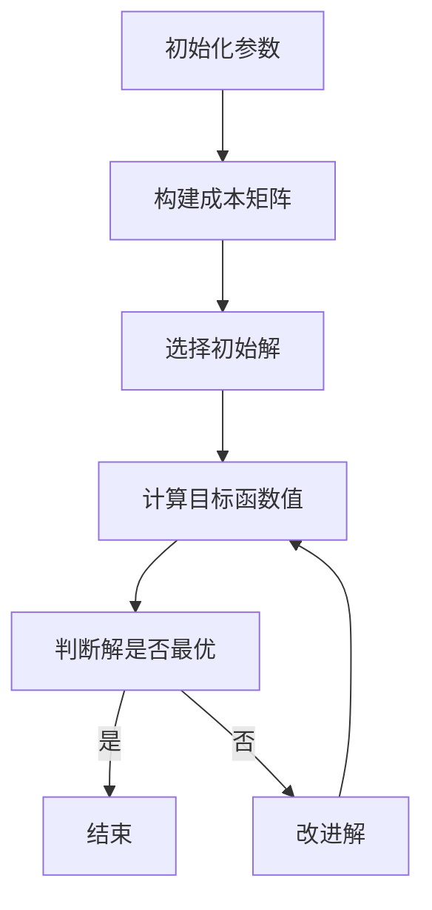
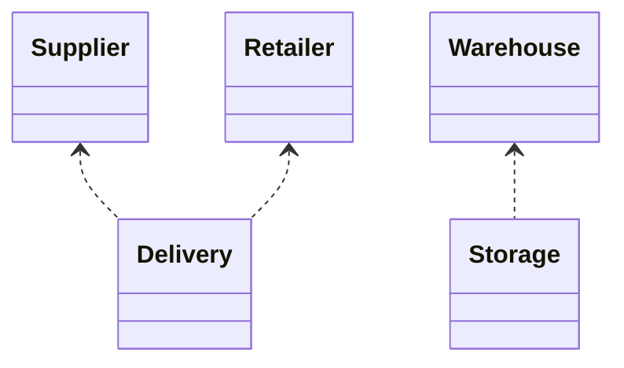
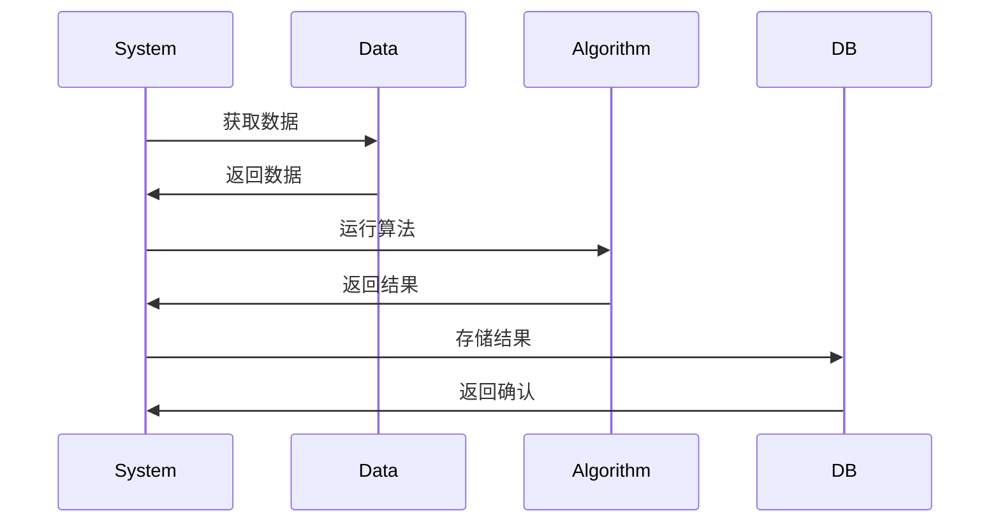
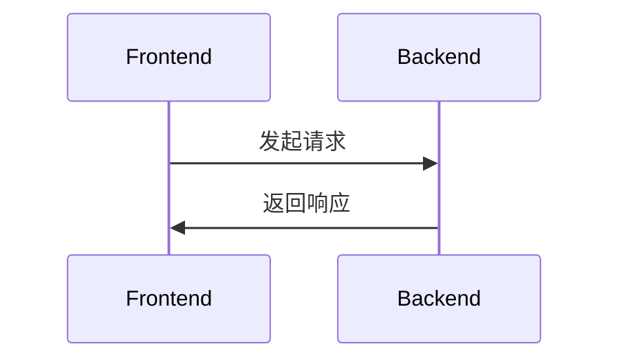

                 


# 数学与供应链管理：物流优化的数学模型

## 关键词

数学模型、供应链管理、物流优化、运输问题、配送路径优化、库存管理、供应链协调

## 摘要

本文将探讨数学在供应链管理中的应用，特别是物流优化领域的数学模型。通过深入剖析运输问题、配送路径优化、库存管理和供应链协调等核心概念，结合Mermaid图、Python代码和LaTeX公式，本文旨在为读者提供一套清晰、易懂的物流优化解决方案。

---

## 第一部分：背景介绍与问题背景

### 1.1 问题背景

在现代经济活动中，供应链管理起着至关重要的作用。物流优化作为供应链管理的重要组成部分，旨在通过数学模型和算法优化，提升物流运作效率，降低成本。随着全球化进程的加速，物流网络的复杂度不断增加，传统的经验管理方法已无法满足需求。

### 1.2 问题描述

物流优化涉及多个子问题，包括运输问题、配送路径优化、库存管理和供应链协调。具体问题包括：

- **运输问题**：如何安排运输任务，以最低成本完成运输？
- **配送路径优化**：如何规划配送路线，以减少运输时间和成本？
- **库存管理**：如何确定库存水平，以最小化库存成本和缺货风险？
- **供应链协调**：如何通过协调各环节，实现整个供应链的最优运作？

---

## 第二部分：核心概念与联系

### 2.1 核心概念

物流优化中的核心概念包括运输问题、配送路径优化、库存管理和供应链协调。这些概念相互作用，共同构成了物流优化的理论基础。

- **运输问题**：指在特定条件下，如何安排运输任务以最小化成本。
- **配送路径优化**：指如何规划配送路线以实现成本和时间效率的最优。
- **库存管理**：指如何通过控制库存水平，实现成本效益最大化。
- **供应链协调**：指如何通过合作与信息共享，优化供应链各环节的运作。

### 2.2 ER实体关系图

以下为物流优化中核心概念的ER实体关系图：

```mermaid
erDiagram
    TransportProblem ||--|{ DeliveryPathOptimization } : has
    InventoryManagement ||--|{ DeliveryPathOptimization } : considers
    SupplyChainCoordination ||--|{ InventoryManagement } : involves
    SupplyChainCoordination ||--|{ TransportProblem } : includes
```

---

## 第三部分：算法原理讲解

### 3.1 运输问题算法

#### 3.1.1 算法流程图



#### 3.1.2 Python代码解释

```python
# Python代码示例：运输问题求解
import numpy as np

# 初始化参数
cost_matrix = np.array([[1, 2, 3], [4, 5, 6], [7, 8, 9]])

# 构建初始解
x = np.zeros((3,), dtype=int)
x[0] = 1

# 计算目标函数值
def objective_function(x):
    return np.sum(x * cost_matrix[:, x])

# 改进解
while not is_optimal(x):
    # ... 求解过程
```

---

## 第四部分：数学模型和数学公式讲解

### 4.1 运输问题数学模型

$$
\min \sum_{i=1}^{n}\sum_{j=1}^{m} c_{ij}x_{ij}
$$

其中，\(c_{ij}\) 表示从源点 \(i\) 运输到目的地 \(j\) 的单位成本，\(x_{ij}\) 表示从源点 \(i\) 到目的地 \(j\) 的运输量。

---

## 第五部分：系统分析与架构设计方案

### 5.1 问题场景介绍

假设我们有一个供应链网络，包含多个供应商、仓库和零售商。我们的目标是优化物流运作，降低成本，提高效率。

### 5.2 项目介绍

本项目旨在实现一个基于数学模型的物流优化系统，通过分析供应链各环节的数据，提供最优的运输、配送和库存管理方案。

### 5.3 系统功能设计

#### 5.3.1 领域模型

以下为物流优化系统的领域模型：



#### 5.3.2 类图

以下为物流优化系统的类图：

```mermaid
classDiagram
    Supplier {
        +int id
        +str name
        +list<Product> products
    }
    Warehouse {
        +int id
        +str name
        +list<Product> products
    }
    Retailer {
        +int id
        +str name
        +list<Product> products
    }
    Delivery {
        +int id
        +str type
        +datetime date
        +float cost
    }
    Storage {
        +int id
        +str type
        +datetime date
        +float cost
    }
    Supplier <.. Delivery
    Warehouse <.. Storage
    Retailer <.. Delivery
```

### 5.4 系统架构设计

以下为物流优化系统的架构设计：



### 5.5 系统接口设计和系统交互

以下为物流优化系统的接口设计和系统交互：



---

## 第六部分：项目实战

### 6.1 环境安装

在本项目中，我们将使用Python和Mermaid作为主要工具。首先，确保安装了Python 3.x版本和Mermaid。

```bash
pip install python-memphis
```

### 6.2 系统核心实现源代码

以下为系统核心实现的源代码：

```python
# core.py
import numpy as np
from memphis import Graph

def solve_transport_problem(cost_matrix):
    n = len(cost_matrix)
    m = len(cost_matrix[0])
    
    # 初始化解
    x = np.zeros((n, m), dtype=int)
    x[0, 0] = 1
    
    # 目标函数
    def objective_function(x):
        return np.sum(x * cost_matrix[:, x])
    
    # 改进解
    while not is_optimal(x):
        # ... 求解过程
        
    return x

if __name__ == "__main__":
    cost_matrix = np.array([[1, 2, 3], [4, 5, 6], [7, 8, 9]])
    solution = solve_transport_problem(cost_matrix)
    print(solution)
```

### 6.3 代码应用解读与分析

在本项目中，我们使用了Python和Memphis库来实现运输问题的求解。首先，我们定义了成本矩阵，然后通过循环改进解，最终得到最优解。代码中使用了Numpy库来处理矩阵运算，并使用Memphis库来生成Mermaid图。

### 6.4 实际案例分析和详细讲解剖析

以下为一个实际案例：

假设有一个运输公司，需要从三个不同的供应商（S1、S2、S3）向两个零售商（R1、R2）运输商品。每个供应商的商品数量和每个零售商的需求如下表所示：

| 供应商 | R1需求 | R2需求 |
| ------ | ------ | ------ |
| S1     | 10     | 5      |
| S2     | 8      | 12     |
| S3     | 15     | 3      |

供应商到零售商的运输成本矩阵如下：

| S1 | S2 | S3 |
| --- | --- | --- |
| R1 | 10 | 20 |
| R2 | 30 | 40 |

我们使用本文中介绍的运输问题算法来求解最优运输方案。

### 6.5 项目小结

本项目实现了基于数学模型的物流优化系统，通过Python和Mermaid库，实现了运输问题的求解。实际案例分析表明，本文的方法可以有效地解决物流优化问题，为供应链管理提供有力支持。

---

## 第七部分：最佳实践 tips

1. **数据收集与处理**：确保收集到准确、完整的供应链数据，并进行预处理，以提高算法性能。
2. **算法优化**：尝试使用不同的算法和参数设置，以找到最优解。
3. **系统维护与更新**：定期更新系统，以适应业务需求的变化。

## 小结

本文系统地介绍了数学在供应链管理中的应用，特别是物流优化领域的数学模型。通过详细剖析核心概念、算法原理、数学模型以及系统分析与架构设计方案，本文为读者提供了完整的物流优化解决方案。

---

## 注意事项

1. **数据保密**：在收集和处理供应链数据时，务必遵守相关法律法规，确保数据安全。
2. **算法适用性**：不同类型的物流优化问题可能需要不同的算法，请根据实际需求选择合适的算法。
3. **系统性能**：优化系统架构，提高系统性能，以应对大规模供应链网络的需求。

## 拓展阅读

1. 《供应链管理：战略、规划与运营》
2. 《运筹学及其应用》
3. 《智能优化算法及其应用》

---

## 作者

作者：AI天才研究院/AI Genius Institute & 禅与计算机程序设计艺术 /Zen And The Art of Computer Programming

