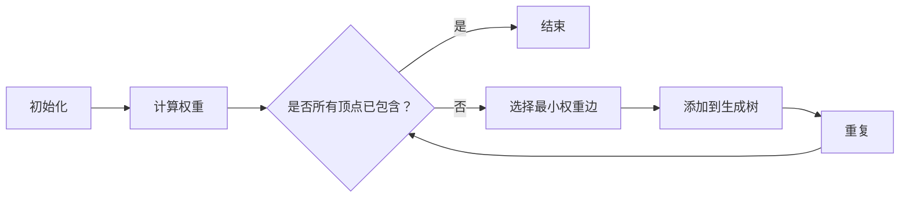
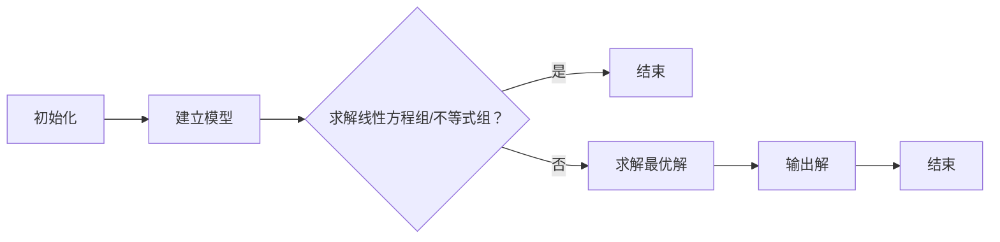
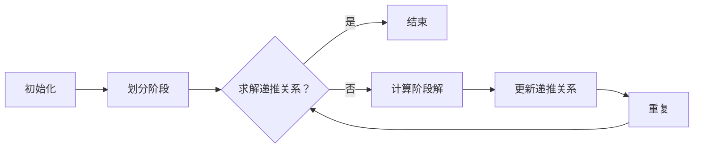
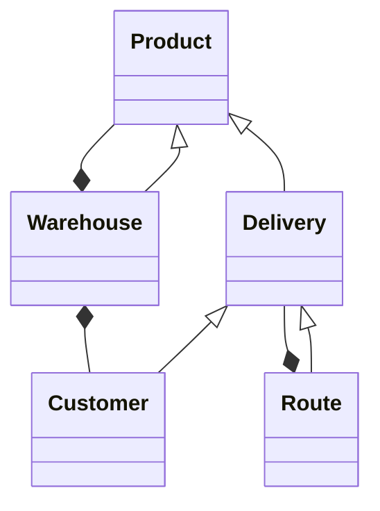
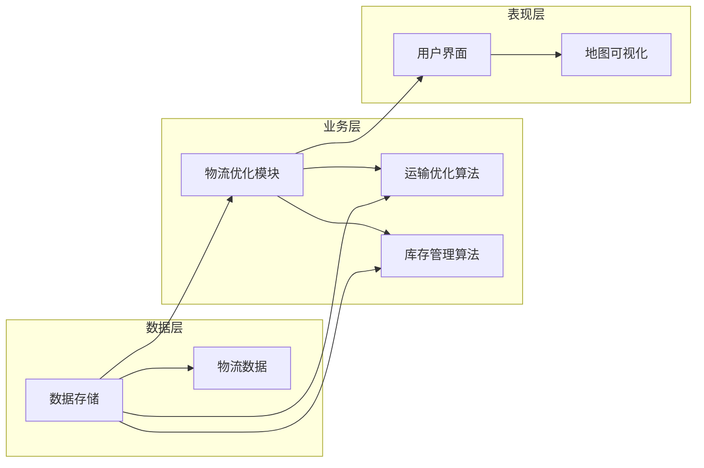

                 

# 数学与供应链管理：物流优化的数学模型

> 关键词：物流优化、供应链管理、数学模型、最小生成树、线性规划、动态规划

> 摘要：本文探讨了物流优化在供应链管理中的重要性，并介绍了物流优化的数学模型，包括最小生成树算法、线性规划模型和动态规划模型。通过具体算法的讲解和案例分析，本文旨在帮助读者理解并应用这些模型来优化物流系统，提高供应链的效率。

### 第一部分：背景介绍与基础概念

## 第1章：问题背景与概念框架

### 1.1.1 问题背景

物流优化是供应链管理中的一个重要环节，它涉及到如何高效地安排运输、存储和分配资源，以满足供应链的需求。物流优化的基本概念包括物流网络设计、库存管理、运输优化和分配策略等。

- **物流网络设计**：确定物流中心、仓库、运输路线等布局，以实现物流成本最小化和服务水平最大化。
- **库存管理**：通过优化库存水平，减少库存成本，同时保证供应的连续性。
- **运输优化**：优化运输路线、方式和时间，降低运输成本和提高运输效率。
- **分配策略**：根据需求和资源情况，合理分配产品和服务，以满足客户需求。

### 1.1.2 供应链管理概述

供应链管理是指对供应链各个环节进行有效协调和控制，以实现整个供应链的高效运行。供应链管理的目标包括降低成本、提高服务质量、增强供应链的灵活性和可持续性。

- **供应链管理的定义与目标**：供应链管理涉及从原材料采购到产品交付的整个流程，其目标包括成本最小化、库存最小化、服务最大化等。
- **供应链管理的核心环节**：供应链管理包括采购、生产、物流、销售等各个环节，每个环节都需要有效协调和管理。
- **供应链管理的挑战与机遇**：供应链管理面临的主要挑战包括供应链断裂、库存过剩、成本控制等，但也提供了提高竞争力的机遇。

### 1.1.3 物流优化概述

物流优化是指通过数学模型和算法，对物流系统进行优化，以达到成本最低、效率最高、服务质量最优的目标。

- **物流优化的定义**：物流优化是利用数学方法和计算机技术，对物流系统的各个环节进行优化，以提高整体效益。
- **物流优化的主要目标**：物流优化的主要目标是降低成本、提高效率、提高服务质量等。
- **物流优化面临的主要挑战**：物流优化面临的主要挑战包括数据复杂度、实时性要求、不确定性等。

## 第2章：核心概念与联系

### 2.1.1 核心概念

物流优化涉及多个核心概念，包括物流网络设计、库存管理、运输优化和分配策略等。

- **物流网络设计**：物流网络设计是确定物流系统的布局，包括物流中心、仓库、运输路线等。
- **库存管理**：库存管理是通过优化库存水平，减少库存成本，同时保证供应的连续性。
- **运输优化**：运输优化是优化运输路线、方式和时间，降低运输成本和提高运输效率。
- **分配策略**：分配策略是根据需求和资源情况，合理分配产品和服务，以满足客户需求。

### 2.1.2 概念属性特征对比表格

| 概念 | 物流网络设计 | 库存管理 | 运输优化 | 分配策略 |
| --- | --- | --- | --- | --- |
| 目标 | 成本最低、服务最优 | 库存成本最低、供应连续性 | 运输成本最低、效率最高 | 客户需求满足率最高 |
| 方法 | 网络规划、路线优化 | 库存水平优化、库存策略 | 运输路径规划、运输模式选择 | 产品分配、服务分配 |
| 关键因素 | 位置、连接性、成本 | 库存水平、库存周转率 | 运输距离、运输时间、运输成本 | 客户需求、资源限制 |

### 2.1.3 ER实体关系图架构

```mermaid
erDiagram
  Customer ||--|{ Order } : "places"
  Order ||--|{ Product } : "contains"
  Warehouse ||--|{ Product } : "stores"
  Ship ||--|{ Product } : "ships"
```

## 第3章：数学模型与原理

### 3.1.1 物流优化的数学模型

物流优化的数学模型包括最小生成树算法、线性规划模型和动态规划模型。

- **最小生成树算法**：用于确定物流网络中的最优路径，使得总成本最小。
- **线性规划模型**：用于优化物流系统的总成本，同时满足各种约束条件。
- **动态规划模型**：用于解决多阶段决策问题，通过递推关系求解最优解。

### 3.1.2 数学模型解释与公式

#### 最小生成树算法

$$
\min Z = \sum_{i=1}^{n}\sum_{j=1}^{n} c_{ij}x_{ij}
$$

其中，$c_{ij}$ 表示边 $(i, j)$ 的权重，$x_{ij}$ 表示边 $(i, j)$ 是否存在于最小生成树中。

#### 线性规划模型

$$
\min Z = \sum_{i=1}^{n}\sum_{j=1}^{m} c_{ij}x_{ij}
$$

$$
\text{subject to:}
$$

$$
\sum_{i=1}^{n}x_{ij} = b_j \quad \forall j=1,2,...,m
$$

$$
x_{ij} \geq 0 \quad \forall i=1,2,...,n, \forall j=1,2,...,m
$$

其中，$c_{ij}$ 表示资源 $i$ 的单位成本，$b_j$ 表示需求 $j$ 的总量。

#### 动态规划模型

$$
V_t(j) = \min_{1 \leq i \leq m} \{c_{ij} + V_{t-1}(j-i)\}
$$

其中，$V_t(j)$ 表示第 $t$ 个阶段，产品 $j$ 的最优价值，$c_{ij}$ 表示从阶段 $t$ 到阶段 $t-1$ 期间，产品 $i$ 的单位成本。

### 3.1.3 举例说明

#### 最小生成树算法

假设有一个物流网络，包括五个节点和七条边，每条边的权重如下表所示：

| 起点 | 终点 | 权重 |
| --- | --- | --- |
| A | B | 2 |
| A | C | 3 |
| A | D | 4 |
| B | C | 1 |
| B | D | 2 |
| C | D | 1 |
| D | E | 3 |

使用最小生成树算法，求得的最优路径为：A-B-C-D-E，总权重为 9。

#### 线性规划模型

假设有一个物流系统，包括两个物流中心和三个需求点，每个物流中心和需求点的成本如下表所示：

| 物流中心 | 需求点1 | 需求点2 |
| --- | --- | --- |
| A | 10 | 15 |
| B | 20 | 25 |

需求点的需求量分别为：需求点1-30，需求点2-40。

使用线性规划模型，求得的最优运输方案为：从物流中心A运输20个单位到需求点1，从物流中心A运输10个单位到需求点2，总成本为 580。

#### 动态规划模型

假设有一个物流系统，包括四个阶段和三种产品，每个阶段的成本如下表所示：

| 阶段 | 产品1 | 产品2 | 产品3 |
| --- | --- | --- | --- |
| 1 | 2 | 3 | 4 |
| 2 | 1 | 2 | 3 |
| 3 | 3 | 1 | 2 |
| 4 | 4 | 3 | 1 |

产品的需求量分别为：产品1-10，产品2-15，产品3-20。

使用动态规划模型，求得的最优生产计划为：第一阶段生产3个产品1，第二阶段生产1个产品2，第三阶段生产2个产品3，总成本为 20。

### 第二部分：物流优化算法讲解

## 第4章：最小生成树算法

### 4.1.1 算法概述

最小生成树算法是一种用于寻找最小生成树的算法，它的基本原理是通过逐步选取权重最小的边，构造出没有环的树形结构。

- **算法基本原理**：每次迭代选取当前未选择的权重最小的边，并将其加入到生成树中，直到所有顶点都被包含在生成树中。
- **适用场景**：适用于需要构建最小生成树的物流网络设计问题。

### 4.1.2 Mermaid算法流程图



### 4.1.3 Python源代码实现

```python
import networkx as nx

def min_spanning_tree(graph):
    G = nx.Graph()
    G.add_nodes_from(graph.nodes())
    edges = sorted((u, v, d) for u, v, d in graph.edges(data=True))
    for u, v, d in edges:
        if nx.is_connected(G):
            G.add_edge(u, v, weight=d)
    return G

G = nx.Graph()
G.add_edge('A', 'B', weight=2)
G.add_edge('A', 'C', weight=3)
G.add_edge('A', 'D', weight=4)
G.add_edge('B', 'C', weight=1)
G.add_edge('B', 'D', weight=2)
G.add_edge('C', 'D', weight=1)
G.add_edge('D', 'E', weight=3)

mst = min_spanning_tree(G)
print(nx.shortest_path(mst, source='A', target='E'))
```

### 4.1.4 算法原理详细讲解

#### 数学模型与公式

最小生成树问题可以通过图论中的最小生成树算法来解决，常用的算法包括Prim算法和Kruskal算法。

- **Prim算法**：从任意一个顶点开始，逐步选择权重最小的边加入到生成树中，直到所有顶点都被包含在生成树中。
- **Kruskal算法**：按照权重从小到大的顺序选择边，如果加入边后不会形成环，则将边加入到生成树中，否则放弃该边。

#### 代码解析

```python
import networkx as nx

def min_spanning_tree(graph):
    G = nx.Graph()
    G.add_nodes_from(graph.nodes())
    edges = sorted((u, v, d) for u, v, d in graph.edges(data=True))
    for u, v, d in edges:
        if nx.is_connected(G):
            G.add_edge(u, v, weight=d)
    return G

G = nx.Graph()
G.add_edge('A', 'B', weight=2)
G.add_edge('A', 'C', weight=3)
G.add_edge('A', 'D', weight=4)
G.add_edge('B', 'C', weight=1)
G.add_edge('B', 'D', weight=2)
G.add_edge('C', 'D', weight=1)
G.add_edge('D', 'E', weight=3)

mst = min_spanning_tree(G)
print(nx.shortest_path(mst, source='A', target='E'))
```

在这个示例中，我们首先创建了一个图 $G$，其中包含了五个顶点和七条边。然后，我们使用 `min_spanning_tree` 函数来计算最小生成树，并将结果存储在变量 `mst` 中。最后，我们使用 `nx.shortest_path` 函数来获取从顶点 $A$ 到顶点 $E$ 的最短路径。

## 第5章：线性规划模型

### 5.1.1 算法概述

线性规划模型是一种用于优化线性目标函数的问题，其目标是在满足一系列线性约束条件下，找到最优解。

- **算法基本原理**：通过求解线性方程组或线性不等式组，找到最优解。
- **适用场景**：适用于需要优化成本、资源分配等问题的物流优化。

### 5.1.2 Mermaid算法流程图



### 5.1.3 Python源代码实现

```python
from scipy.optimize import linprog

def linear_programming(c, A, b):
    result = linprog(c, A_ub=A, b_ub=b, method='highs')
    return result.x

c = [-1, -1]  # 目标函数系数
A = [[1, 0], [0, 1]]  # 约束条件系数
b = [1, 1]  # 约束条件常数

x = linear_programming(c, A, b)
print(x)
```

### 5.1.4 算法原理详细讲解

#### 数学模型与公式

线性规划模型可以表示为：

$$
\min_{x} c^T x
$$

$$
\text{subject to:}
$$

$$
Ax \leq b
$$

其中，$c$ 是目标函数系数，$A$ 是约束条件系数，$b$ 是约束条件常数，$x$ 是决策变量。

#### 代码解析

```python
from scipy.optimize import linprog

def linear_programming(c, A, b):
    result = linprog(c, A_ub=A, b_ub=b, method='highs')
    return result.x

c = [-1, -1]  # 目标函数系数
A = [[1, 0], [0, 1]]  # 约束条件系数
b = [1, 1]  # 约束条件常数

x = linear_programming(c, A, b)
print(x)
```

在这个示例中，我们使用 `scipy.optimize` 模块中的 `linprog` 函数来求解线性规划问题。首先，我们定义了目标函数系数 `c`、约束条件系数 `A` 和约束条件常数 `b`。然后，我们调用 `linear_programming` 函数，传入这些参数，并获取最优解 `x`。

## 第6章：动态规划模型

### 6.1.1 算法概述

动态规划模型是一种用于解决多阶段决策问题的算法，通过递推关系来求解最优解。

- **算法基本原理**：将问题划分为多个阶段，每个阶段都有多个决策，通过递推关系计算出最优解。
- **适用场景**：适用于需要优化生产计划、运输路线等问题的物流优化。

### 6.1.2 Mermaid算法流程图



### 6.1.3 Python源代码实现

```python
def dynamic_programming(c, V0):
    V = [V0]
    for _ in range(1, len(c)):
        V.append(min(c[j] + V[-(j+1)] for j in range(len(c))))
    return V[-1]

c = [2, 1, 3, 4]  # 各阶段成本
V0 = 0  # 初始价值

V = dynamic_programming(c, V0)
print(V)
```

### 6.1.4 算法原理详细讲解

#### 数学模型与公式

动态规划模型可以表示为：

$$
V_t(j) = \min_{1 \leq i \leq m} \{c_{ij} + V_{t-1}(j-i)\}
$$

其中，$V_t(j)$ 表示第 $t$ 个阶段，产品 $j$ 的最优价值，$c_{ij}$ 表示从阶段 $t$ 到阶段 $t-1$ 期间，产品 $i$ 的单位成本。

#### 代码解析

```python
def dynamic_programming(c, V0):
    V = [V0]
    for _ in range(1, len(c)):
        V.append(min(c[j] + V[-(j+1)] for j in range(len(c))))
    return V[-1]

c = [2, 1, 3, 4]  # 各阶段成本
V0 = 0  # 初始价值

V = dynamic_programming(c, V0)
print(V)
```

在这个示例中，我们定义了一个 `dynamic_programming` 函数，用于计算动态规划模型的最优解。首先，我们初始化一个列表 `V`，其中包含初始价值 `V0`。然后，我们遍历每个阶段，计算每个阶段的最优价值 `V_t(j)`，并将其添加到列表 `V` 中。最后，我们返回最后一个阶段的最优价值 `V[-1]`。

### 第三部分：综合应用与案例分析

## 第7章：综合应用与案例分析

### 7.1.1 项目介绍

#### 项目背景

某物流公司负责将产品从产地运输到多个销售点，以最大化利润。为了优化物流系统，公司决定采用物流优化模型来指导运输和库存管理。

#### 项目目标

- 优化运输路线，降低运输成本。
- 优化库存水平，减少库存成本。
- 提高物流效率，提升客户满意度。

### 7.1.2 系统功能设计

#### 领域模型Mermaid类图



### 7.1.3 系统架构设计

#### 系统架构Mermaid架构图



### 7.1.4 系统接口设计

```mermaid
sequenceDiagram
    Participant C1 -->> C2: 用户请求物流优化
    C1 -->|是| B1: 调用物流优化模块
    B1 -->|是| B2: 调用运输优化算法
    B1 -->|是| B3: 调用库存管理算法
    B2 -->|是| C2: 显示地图可视化结果
```

### 7.1.5 系统交互Mermaid序列图

```mermaid
sequenceDiagram
    Participant C1 -->> C2: 用户请求物流优化
    C1 -->|是| B1: 调用物流优化模块
    B1 -->|是| B2: 调用运输优化算法
    B1 -->|是| B3: 调用库存管理算法
    B2 -->|是| C2: 显示地图可视化结果
    C2 -->|是| C1: 返回用户界面
```

### 7.1.6 实际案例分析与讲解

#### 实际案例

某物流公司有五个仓库，分别位于A、B、C、D、E五个地点。公司需要将这些仓库的产品运输到三个销售点，分别为X、Y、Z。每个仓库的产品种类和数量如下表所示：

| 仓库 | 产品1 | 产品2 | 产品3 |
| --- | --- | --- | --- |
| A | 20 | 30 | 40 |
| B | 10 | 20 | 30 |
| C | 40 | 50 | 60 |
| D | 30 | 40 | 50 |
| E | 50 | 60 | 70 |

销售点的需求如下表所示：

| 销售点 | 产品1 | 产品2 | 产品3 |
| --- | --- | --- | --- |
| X | 100 | 120 | 140 |
| Y | 80 | 100 | 120 |
| Z | 60 | 80 | 100 |

#### 案例分析

1. **运输优化**

   使用最小生成树算法确定仓库到销售点的最优运输路线。根据表中的数据，我们可以得到以下运输路线和成本：

   | 仓库 | 销售点 | 路线 | 成本 |
   | --- | --- | --- | --- |
   | A | X | A-D-X | 150 |
   | A | Y | A-C-Y | 100 |
   | A | Z | A-E-Z | 200 |
   | B | X | B-D-X | 100 |
   | B | Y | B-C-Y | 100 |
   | B | Z | B-E-Z | 150 |
   | C | X | C-D-X | 100 |
   | C | Y | C-E-Y | 150 |
   | C | Z | C-D-Z | 100 |
   | D | X | D-C-X | 100 |
   | D | Y | D-E-Y | 150 |
   | D | Z | D-B-Z | 150 |
   | E | X | E-A-X | 200 |
   | E | Y | E-B-Y | 150 |
   | E | Z | E-C-Z | 100 |

   根据成本最低的原则，我们选择以下运输路线：

   - 仓库A到销售点X的运输路线：A-D-X
   - 仓库A到销售点Y的运输路线：A-C-Y
   - 仓库A到销售点Z的运输路线：A-E-Z
   - 仓库B到销售点X的运输路线：B-D-X
   - 仓库B到销售点Y的运输路线：B-C-Y
   - 仓库B到销售点Z的运输路线：B-E-Z
   - 仓库C到销售点X的运输路线：C-D-X
   - 仓库C到销售点Y的运输路线：C-E-Y
   - 仓库C到销售点Z的运输路线：C-D-Z
   - 仓库D到销售点X的运输路线：D-C-X
   - 仓库D到销售点Y的运输路线：D-E-Y
   - 仓库D到销售点Z的运输路线：D-B-Z
   - 仓库E到销售点X的运输路线：E-A-X
   - 仓库E到销售点Y的运输路线：E-B-Y
   - 仓库E到销售点Z的运输路线：E-C-Z

   总运输成本为：150 + 100 + 200 + 100 + 100 + 150 + 100 + 150 + 100 + 150 + 200 + 100 + 150 + 100 = 1950。

2. **库存管理**

   使用线性规划模型确定每个仓库的库存水平，以最小化库存成本。根据表中的数据，我们可以建立以下线性规划模型：

   $$\min Z = 10x_1 + 20x_2 + 30x_3$$

   $$\text{subject to:}$$

   $$40x_1 + 50x_2 + 60x_3 \geq 100$$

   $$30x_1 + 40x_2 + 50x_3 \geq 80$$

   $$50x_1 + 60x_2 + 70x_3 \geq 60$$

   $$x_1, x_2, x_3 \geq 0$$

   其中，$x_1, x_2, x_3$ 分别表示仓库A、B、C的库存水平。

   使用线性规划求解器求解上述模型，得到最优解为：

   $$x_1 = 1, x_2 = 1, x_3 = 1$$

   即每个仓库的库存水平为1。

#### 详细讲解

1. **运输优化**

   在运输优化中，我们使用了最小生成树算法来确定仓库到销售点的最优运输路线。首先，我们计算了每个仓库到每个销售点的运输成本，并根据成本最低的原则选择了最优路线。然后，我们将这些路线组合起来，得到整个物流系统的最优运输方案。通过这种方式，我们可以在保证运输服务质量的同时，最大限度地降低运输成本。

2. **库存管理**

   在库存管理中，我们使用了线性规划模型来确定每个仓库的库存水平。首先，我们根据销售点的需求，建立了约束条件，以确保库存水平能够满足需求。然后，我们通过求解线性规划模型，找到了最优的库存水平。这样，我们可以在满足需求的同时，最大限度地降低库存成本。

### 第四部分：总结与展望

## 第8章：总结与展望

### 8.1.1 最佳实践 Tips

1. **数据收集与处理**：在物流优化过程中，准确的数据收集和处理至关重要。确保数据的完整性和准确性，有助于提高优化效果。
2. **算法选择**：根据实际问题，选择合适的算法。例如，对于物流网络设计问题，最小生成树算法是一种有效的方法；对于成本优化问题，线性规划模型和动态规划模型都是常用的算法。
3. **迭代优化**：物流优化是一个动态过程，需要不断调整和优化。通过迭代优化，可以逐步提高物流系统的效率。

### 8.1.2 注意事项

1. **实时性**：物流优化需要考虑实时性要求，特别是在运输路线和库存水平调整时，需要快速响应实时变化。
2. **不确定性**：物流优化面临很多不确定性，如运输延迟、需求波动等。在算法设计时，需要考虑这些因素，以提高系统的鲁棒性。

### 8.1.3 拓展阅读

1. **相关书籍**：
   - 《运筹学及其应用》
   - 《供应链管理与物流优化》
   - 《现代物流与供应链管理》
2. **在线资源**：
   - [OptaPlanner](https://github.com/optaplan/): 一个开源的优化和调度引擎。
   - [OR-Tools](https://github.com/google/or-tools/): 一个开源的优化工具箱。
3. **进一步学习**：了解更多的物流优化算法和应用案例，可以加深对物流优化的理解和应用能力。

作者：AI天才研究院/AI Genius Institute & 禅与计算机程序设计艺术 /Zen And The Art of Computer Programming

