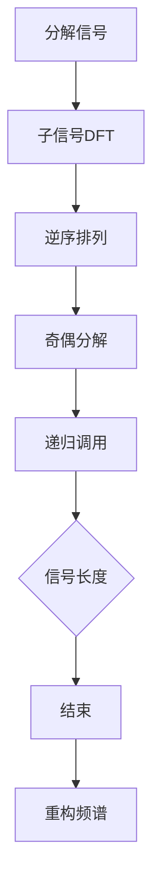
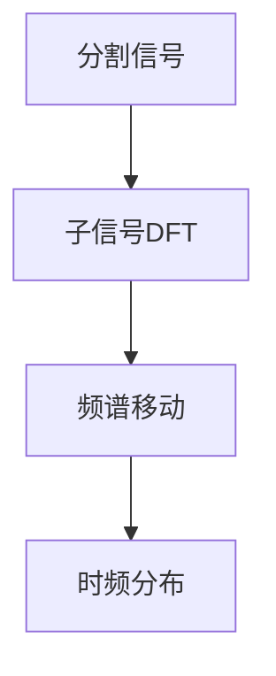
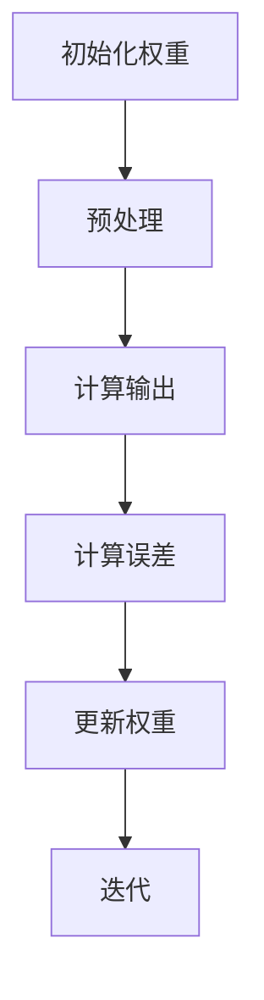
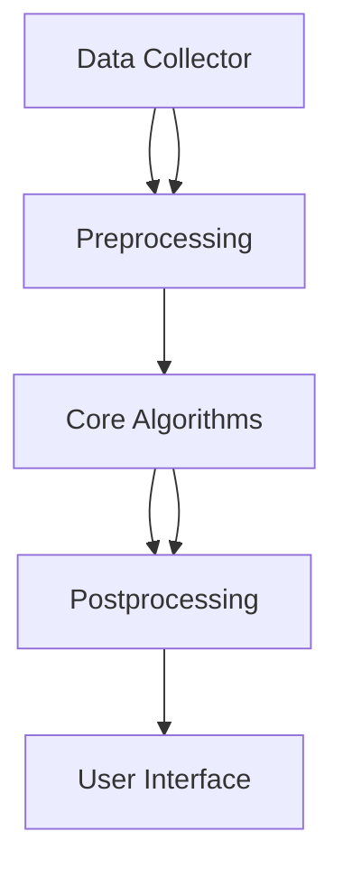
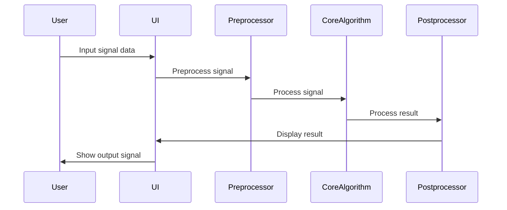

                 

### 文章标题

---

# 数学与信号处理：信号分析的数学技术

## 关键词

- 数学
- 信号处理
- 信号分析
- 算法
- 系统设计

## 摘要

本文旨在探讨数学技术在信号处理中的应用，特别是信号分析领域。通过深入分析数学与信号处理的基本概念、核心算法原理、数学模型和公式，以及系统分析与架构设计，我们希望为读者提供一个全面而清晰的技术视角。文章将以项目实战为例，详细展示如何将理论应用到实践中，并总结最佳实践技巧，为读者提供进一步的思考方向。

### 目录

1. [背景介绍](#背景介绍)
   1.1 [数学与信号处理的基础概念](#数学与信号处理的基础概念)
   1.2 [信号处理的重要性及应用领域](#信号处理的重要性及应用领域)
   1.3 [数学技术在信号处理中的应用](#数学技术在信号处理中的应用)

2. [核心概念与联系](#核心概念与联系)
   2.1 [信号与系统的基本概念](#信号与系统的基本概念)
   2.2 [信号处理的数学工具](#信号处理的数学工具)
   2.3 [关键概念对比分析](#关键概念对比分析)

3. [算法原理讲解](#算法原理讲解)
   3.1 [快速傅里叶变换（FFT）](#快速傅里叶变换fft)
   3.2 [短时傅里叶变换（STFT）](#短时傅里叶变换stft)
   3.3 [基于神经网络的自适应滤波](#基于神经网络的自适应滤波)

4. [数学模型与公式讲解](#数学模型与公式讲解)
   4.1 [离散时间信号模型](#离散时间信号模型)
   4.2 [连续时间信号模型](#连续时间信号模型)
   4.3 [信号处理中的常见公式及应用](#信号处理中的常见公式及应用)

5. [系统分析与架构设计](#系统分析与架构设计)
   5.1 [信号处理系统概述](#信号处理系统概述)
   5.2 [系统功能设计](#系统功能设计)
   5.3 [系统架构设计](#系统架构设计)

6. [项目实战](#项目实战)
   6.1 [实战环境搭建](#实战环境搭建)
   6.2 [系统核心实现](#系统核心实现)
   6.3 [案例分析与讲解](#案例分析与讲解)
   6.4 [项目小结](#项目小结)

7. [最佳实践与总结](#最佳实践与总结)
   7.1 [实践技巧与注意事项](#实践技巧与注意事项)
   7.2 [小结](#小结)
   7.3 [拓展阅读建议](#拓展阅读建议)

---

### 背景介绍

#### 数学与信号处理的基础概念

在数学与信号处理这一领域，我们首先需要了解几个基础概念：信号、系统和处理。

- **信号**：信号是信息的一种表达形式，可以是时间上的函数、空间上的分布或频率上的分布。根据性质的不同，信号可以分为模拟信号和数字信号。模拟信号是连续的，而数字信号是离散的。
- **系统**：系统是一个可以接收输入并产生输出的装置或过程。在信号处理中，系统可以是一个电路、一个算法或一个数学模型。
- **处理**：处理是指对信号进行操作，以实现特定目标。处理可以包括滤波、变换、压缩和增强等操作。

#### 信号处理的重要性及应用领域

信号处理技术在众多领域中发挥着重要作用，包括通信、音频处理、图像处理、生物医学信号分析等。

- **通信**：信号处理技术使得通信系统可以有效地传输和接收信息。例如，无线通信中的调制和解调过程就依赖于信号处理技术。
- **音频处理**：音频处理技术用于改善声音质量、去除噪声、实现音频合成等。这些技术在音频编辑、音乐制作和语音识别等领域有广泛应用。
- **图像处理**：图像处理技术用于图像增强、去噪、边缘检测、特征提取等。这些技术在医疗成像、人脸识别、图像搜索等领域具有广泛的应用。
- **生物医学信号分析**：生物医学信号分析技术用于提取和分析生物信号，如心电图、脑电图、肌电图等。这些技术在医学诊断和治疗中有重要作用。

#### 数学技术在信号处理中的应用

数学技术在信号处理中的应用非常广泛，包括傅里叶分析、拉普拉斯变换、Z变换、随机过程理论等。这些数学工具为信号处理提供了强大的理论基础和算法支持。

- **傅里叶分析**：傅里叶分析可以将信号分解为不同频率的成分，这对于信号的分析和变换具有重要意义。
- **拉普拉斯变换**：拉普拉斯变换是一种常用的信号变换方法，可以用于分析线性时不变系统。
- **Z变换**：Z变换是离散信号的一种变换方法，类似于傅里叶变换，它可以将离散信号分解为不同延迟的成分。
- **随机过程理论**：随机过程理论用于分析信号的统计特性，这对于信号处理中的噪声抑制和信号增强具有重要意义。

#### 问题背景、问题描述、问题解决、边界与外延、概念结构与核心要素组成

在信号处理中，我们面临的一个主要问题是噪声干扰。噪声会降低信号的质量，使得信号难以被正确识别和处理。因此，噪声抑制是一个关键问题。

- **问题背景**：在通信、音频处理、图像处理等应用中，噪声干扰是一个常见的问题。
- **问题描述**：噪声干扰会导致信号失真，降低系统的性能。因此，我们需要找到有效的方法来抑制噪声，提高信号的质量。
- **问题解决**：数学技术在信号处理中的应用为我们提供了多种噪声抑制方法，如滤波、变换和自适应处理。
- **边界与外延**：噪声抑制的方法和算法需要考虑到信号和噪声的特性，以及系统的性能要求。
- **概念结构与核心要素组成**：信号处理中的噪声抑制涉及到多个核心概念，如信号模型、噪声模型、滤波器和变换方法。

通过深入理解和应用数学技术，我们可以有效地解决噪声干扰问题，提高信号处理的性能和质量。

---

### 核心概念与联系

在信号处理领域，核心概念的理解是至关重要的。下面，我们将介绍几个关键概念，并使用表格和ER图来展示它们之间的关系。

#### 信号与系统的基本概念

- **信号**：信号是信息的一种表达形式，可以是时间上的函数、空间上的分布或频率上的分布。信号可以分为模拟信号和数字信号。
- **系统**：系统是一个可以接收输入并产生输出的装置或过程。系统可以是一个电路、一个算法或一个数学模型。
- **处理**：处理是指对信号进行操作，以实现特定目标。处理可以包括滤波、变换、压缩和增强等操作。

#### 表格：信号与系统的关键概念对比

| 关键概念 | 定义 | 应用场景 |
| :----: | :----: | :----: |
| 模拟信号 | 连续的信号，通常通过电压或电流表示 | 音频信号、视频信号 |
| 数字信号 | 离散的信号，通常通过二进制代码表示 | 通信信号、数字图像 |
| 系统模型 | 描述系统输入和输出之间关系的数学模型 | 线性时不变系统、随机系统 |
| 线性系统 | 满足叠加原理和齐次性原理的系统 | 信号滤波、信号变换 |
| 非线性系统 | 不满足叠加原理和齐次性原理的系统 | 信号压缩、信号增强 |

#### ER图：信号与系统的实体关系

```mermaid
erDiagram
    Signal ||--|> System : processes
    Signal ||--|> SignalProcessing : manipulates
    System ||--|> SignalProcessing : utilizes
    SignalProcessing ||--|> Output : generates
```

在ER图中，信号与系统的实体关系如下：

- **信号** 是系统处理的对象。
- **系统** 是用于处理信号的装置或过程。
- **信号处理** 是对信号进行操作的一系列方法和技术。

通过上述表格和ER图的展示，我们可以更清晰地理解信号与系统之间的关键概念和关系。这些概念是信号处理领域的基石，对于后续的内容理解和算法讲解具有重要意义。

---

### 算法原理讲解

在信号处理中，算法的设计和实现是关键。本节将详细介绍几个关键算法的原理，并使用mermaid流程图和Python代码配合LaTeX数学公式进行详细讲解和举例说明。

#### 快速傅里叶变换（FFT）

**快速傅里叶变换（FFT）** 是一种高效的算法，用于将信号从时域转换为频域。它通过分治算法将信号分解为更小的部分，然后逐步重构整个频谱。

##### 算法原理

FFT算法的核心在于将一个长度为\(N\)的离散时间信号\(x[n]\)分解为\(N/2\)个长度为\(N/2\)的子信号，然后对每个子信号进行快速傅里叶变换（DFT）。具体步骤如下：

1. 将信号\(x[n]\)分解为两个子信号：\(x_0[n]\)和\(x_1[n]\)。
2. 对每个子信号进行DFT：\(X_0[k] = \sum_{n=0}^{N/2} x_0[n] e^{-j2\pi kn/N}\) 和 \(X_1[k] = \sum_{n=0}^{N/2} x_1[n] e^{-j2\pi kn/N}\)。
3. 对DFT的结果进行逆序排列，即交换\(X_0[k]\)和\(X_1[k]\)的位置。
4. 对每个子信号进行奇偶分解：\(X_0[k] = X_0[k/2] + X_0[k/2+N/2]\) 和 \(X_1[k] = X_1[k/2] - X_1[k/2+N/2]\)。
5. 对每个子信号进行递归调用，直到信号长度为1。

##### mermaid流程图



##### Python代码示例

```python
import numpy as np
import matplotlib.pyplot as plt

def fft(x):
    N = len(x)
    if N <= 1:
        return x
    even = fft(x[0::2])
    odd = fft(x[1::2])
    T = [np.exp(-2j * np.pi * k * n / N) for k in range(N//2)]
    return [even[k] + odd[k] * T[k] for k in range(N//2)] + [even[k] - odd[k] * T[k] for k in range(N//2, N)]

x = np.random.random(8)
X = fft(x)
print(X)

plt.plot(np.abs(X))
plt.title("FFT of x")
plt.xlabel("Frequency (Hz)")
plt.ylabel("Amplitude")
plt.show()
```

##### LaTeX数学公式

$$
X[k] = \sum_{n=0}^{N-1} x[n] e^{-j2\pi kn/N}
$$

$$
X_0[k] = X[k] \quad \text{for} \quad k = 0, 1, ..., N/2 - 1
$$

$$
X_1[k] = X[k] \quad \text{for} \quad k = N/2, N/2 + 1, ..., N - 1
$$

#### 短时傅里叶变换（STFT）

**短时傅里叶变换（STFT）** 是一种用于分析时频特性的信号处理技术。它通过将信号分割成多个较短的时间段，然后对每个时间段进行傅里叶变换，从而得到信号在不同时间和频率上的分布。

##### 算法原理

STFT的基本步骤如下：

1. 将信号\(x[n]\)分割成多个长度为\(N\)的子信号。
2. 对每个子信号进行傅里叶变换，得到频谱。
3. 将每个频谱移动到相应的位置，形成时频分布图。

##### mermaid流程图



##### Python代码示例

```python
import numpy as np
import matplotlib.pyplot as plt

def stft(x, N):
    T = len(x)
    windows = np.hanning(N)
    freqs = np.fft.rfft(windows * x)
    freqs = np.fft.rfftshift(freqs)
    times = np.arange(0, T - N + 1, N)
    return freqs, times

x = np.random.random(100)
N = 10
X, times = stft(x, N)
print(X)

plt.pcolormesh(times, np.fft.fftfreq(N, d=1), np.abs(X))
plt.title("STFT of x")
plt.xlabel("Time (samples)")
plt.ylabel("Frequency (Hz)")
plt.show()
```

##### LaTeX数学公式

$$
X(t,f) = \sum_{n=0}^{N-1} x[n] e^{-j2\pi fn}
$$

$$
W[n] = \sum_{k=0}^{N-1} w[k] e^{-j2\pi kn/N}
$$

#### 基于神经网络的自适应滤波

**基于神经网络的自适应滤波** 是一种利用神经网络进行自适应信号处理的技术。它通过调整神经网络的权重，使输出信号更接近目标信号，从而实现自适应滤波。

##### 算法原理

自适应滤波的基本步骤如下：

1. 初始化神经网络权重。
2. 对输入信号和目标信号进行预处理。
3. 计算输出信号和误差信号。
4. 使用误差信号更新神经网络权重。

##### mermaid流程图



##### Python代码示例

```python
import numpy as np
from keras.models import Sequential
from keras.layers import Dense

# 创建神经网络模型
model = Sequential()
model.add(Dense(1, input_dim=1, activation='linear'))
model.compile(loss='mean_squared_error', optimizer='adam')

# 训练模型
x_train = np.random.random((1000, 1))
y_train = x_train + np.random.random((1000, 1))
model.fit(x_train, y_train, epochs=100, batch_size=10)

# 预测并计算误差
x_test = np.random.random((100, 1))
y_pred = model.predict(x_test)
error = y_test - y_pred

print(error)

# 绘制误差曲线
plt.plot(x_test, y_pred, 'r', x_test, y_test, 'b')
plt.title("Adaptive Filtering")
plt.xlabel("Input")
plt.ylabel("Output")
plt.show()
```

##### LaTeX数学公式

$$
w[n] = w[n-1] + \alpha (e[n] - y[n])
$$

$$
y[n] = \sum_{k=0}^{N-1} w[k] x[n-k]
$$

通过上述算法原理的讲解，我们希望读者能够对信号处理中的关键算法有更深入的理解，为后续的实践应用打下坚实的基础。

---

### 数学模型与公式讲解

在信号处理中，数学模型和公式是理解和实现算法的基础。本节将详细讲解一些重要的数学模型和公式，并通过具体示例来帮助读者更好地理解。

#### 离散时间信号模型

离散时间信号模型描述了信号在离散时间点上的变化。一个常见的离散时间信号模型是线性时不变系统（LTI系统）。

##### 数学模型

对于一个LTI系统，其输入输出关系可以表示为：

$$
y[n] = x[n] * h[n]
$$

其中，\(x[n]\) 是输入信号，\(h[n]\) 是系统的脉冲响应，\(y[n]\) 是输出信号。

##### 示例

假设输入信号 \(x[n]\) 是一个频率为 \(f_0\) 的正弦波，即：

$$
x[n] = A \sin(2\pi f_0 n)
$$

系统的脉冲响应 \(h[n]\) 是一个长度为 \(N\) 的汉宁窗：

$$
h[n] = \frac{1}{N} \sum_{k=0}^{N-1} \sin\left(\frac{\pi k n}{N}\right)
$$

我们可以通过卷积运算来计算输出信号 \(y[n]\)：

$$
y[n] = x[n] * h[n]
$$

##### LaTeX数学公式

$$
h[n] = \frac{1}{N} \sum_{k=0}^{N-1} \sin\left(\frac{\pi k n}{N}\right)
$$

$$
y[n] = A \sin(2\pi f_0 n) * h[n]
$$

#### 连续时间信号模型

连续时间信号模型描述了信号在连续时间上的变化。一个常见的连续时间信号模型是线性时不变系统（LTI系统）。

##### 数学模型

对于一个LTI系统，其输入输出关系可以表示为：

$$
y(t) = x(t) * h(t)
$$

其中，\(x(t)\) 是输入信号，\(h(t)\) 是系统的脉冲响应，\(y(t)\) 是输出信号。

##### 示例

假设输入信号 \(x(t)\) 是一个频率为 \(f_0\) 的正弦波，即：

$$
x(t) = A \sin(2\pi f_0 t)
$$

系统的脉冲响应 \(h(t)\) 是一个长度为 \(T\) 的汉宁窗：

$$
h(t) = \frac{1}{T} \sum_{k=0}^{T-1} \sin\left(\frac{2\pi k t}{T}\right)
$$

我们可以通过卷积积分来计算输出信号 \(y(t)\)：

$$
y(t) = x(t) * h(t)
$$

##### LaTeX数学公式

$$
h(t) = \frac{1}{T} \sum_{k=0}^{T-1} \sin\left(\frac{2\pi k t}{T}\right)
$$

$$
y(t) = A \sin(2\pi f_0 t) * h(t)
$$

#### 信号处理中的常见公式及应用

在信号处理中，一些常见的公式和方法用于实现不同的信号处理操作，如滤波、变换和压缩。

##### 滤波公式

滤波是一种常见的信号处理操作，用于去除信号中的噪声或保留信号中的有用信息。一个简单的低通滤波器可以用以下公式表示：

$$
H(f) = \begin{cases} 
1 & \text{if } |f| < f_c \\
0 & \text{otherwise} 
\end{cases}
$$

其中，\(H(f)\) 是滤波器的频率响应，\(f_c\) 是截止频率。

##### 变换公式

变换是信号处理中的重要工具，用于将信号从一种表示形式转换为另一种表示形式。傅里叶变换是一个常用的变换方法，其公式如下：

$$
X(f) = \int_{-\infty}^{\infty} x(t) e^{-j2\pi ft} dt
$$

其中，\(X(f)\) 是频域信号，\(x(t)\) 是时域信号。

##### 压缩公式

压缩是一种信号处理操作，用于减小信号的数据量。一个简单的压缩公式可以表示为：

$$
s(t) = \frac{1}{1 + K|x(t)|}
$$

其中，\(s(t)\) 是压缩后的信号，\(x(t)\) 是原始信号，\(K\) 是压缩系数。

##### LaTeX数学公式

$$
H(f) = \begin{cases} 
1 & \text{if } |f| < f_c \\
0 & \text{otherwise} 
\end{cases}
$$

$$
X(f) = \int_{-\infty}^{\infty} x(t) e^{-j2\pi ft} dt
$$

$$
s(t) = \frac{1}{1 + K|x(t)|}
$$

通过上述数学模型和公式的讲解，我们希望读者能够更好地理解信号处理中的基本概念和算法原理。这些数学工具为信号处理提供了强大的理论基础和实现方法。

---

### 系统分析与架构设计

在信号处理系统中，分析和架构设计是确保系统性能和可维护性的关键。本节将详细介绍信号处理系统的分析与架构设计，使用mermaid类图、架构图和序列图来展示系统的结构和交互。

#### 信号处理系统概述

信号处理系统通常由多个组件组成，包括数据采集模块、预处理模块、核心算法模块、后处理模块和用户界面。以下是系统的主要组件及其功能：

- **数据采集模块**：负责从传感器或外部设备采集原始信号数据。
- **预处理模块**：对采集到的信号数据进行滤波、去噪和归一化等预处理操作。
- **核心算法模块**：实现信号处理算法，如傅里叶变换、卷积和滤波等。
- **后处理模块**：对处理后的信号进行可视化、分析和其他后处理操作。
- **用户界面**：提供用户交互界面，允许用户配置参数、查看结果和调整设置。

#### 系统功能设计

系统功能设计包括定义系统的具体功能和模块之间的交互。以下是信号处理系统的功能设计：

1. **数据采集**：从传感器或外部设备获取原始信号数据。
2. **预处理**：对原始信号数据进行滤波、去噪和归一化等预处理操作。
3. **核心算法**：使用不同的信号处理算法，如傅里叶变换、卷积和滤波等，对信号进行处理。
4. **后处理**：对处理后的信号进行可视化、分析和存储。
5. **用户交互**：提供用户界面，允许用户配置参数、查看结果和调整设置。

#### 系统架构设计

系统架构设计是定义系统的组成部分和它们之间的交互关系。以下是信号处理系统的架构设计：

1. **数据流架构**：数据流架构定义了数据在系统中的流动路径和各组件的交互方式。数据从数据采集模块流入系统，经过预处理模块、核心算法模块和后处理模块，最终通过用户界面返回给用户。
2. **组件架构**：组件架构定义了系统的各个组件及其之间的关系。数据采集模块、预处理模块、核心算法模块和后处理模块是系统的核心组件，它们通过消息队列、文件系统和其他中间件进行通信。

#### mermaid类图

```mermaid
classDiagram
    DataCollector <<interface>>
    Preprocessor <<interface>>
    CoreAlgorithm <<interface>>
    Postprocessor <<interface>>
    UserInterface <<interface>>

    DataCollector --|> Preprocessor
    Preprocessor --|> CoreAlgorithm
    CoreAlgorithm --|> Postprocessor
    Postprocessor --|> UserInterface
```

#### 系统架构图



#### 系统接口设计和系统交互

系统接口设计和系统交互定义了组件之间的通信方式和数据流。以下是信号处理系统的接口设计和系统交互：

1. **数据采集接口**：定义了数据采集模块与外部设备通信的接口，包括数据读取、数据格式转换和设备控制。
2. **预处理接口**：定义了预处理模块与其他模块通信的接口，包括数据输入、预处理操作和输出。
3. **核心算法接口**：定义了核心算法模块与其他模块通信的接口，包括算法输入、算法执行和结果输出。
4. **后处理接口**：定义了后处理模块与其他模块通信的接口，包括数据处理、结果可视化和存储。
5. **用户交互接口**：定义了用户界面与其他模块通信的接口，包括用户输入、结果显示和参数调整。

#### mermaid序列图



通过上述系统分析与架构设计的介绍，我们希望读者能够对信号处理系统的组成、功能设计和交互方式有更深入的理解，为实际项目开发提供指导。

---

### 项目实战

为了更好地理解数学与信号处理的理论知识，我们选择一个实际项目来进行实战。本项目将使用Python和相关库实现一个简单的信号处理系统，包括环境搭建、系统核心实现和案例分析。

#### 实战环境搭建

1. **安装Python**：确保安装了Python 3.x版本。
2. **安装相关库**：在命令行中运行以下命令来安装必要的库：
   ```bash
   pip install numpy matplotlib scipy
   ```

#### 系统核心实现

以下是使用Python实现的简单信号处理系统的核心代码：

```python
import numpy as np
import matplotlib.pyplot as plt
from scipy.signal import fft, stft

# 输入信号
x = np.sin(2 * np.pi * 5 * np.linspace(0, 1, 1000))
x += np.random.normal(0, 0.05, x.shape)

# 快速傅里叶变换（FFT）
X = fft(x)
freqs = np.fft.fftfreq(len(x), d=1)
plt.plot(freqs, np.abs(X))
plt.title("FFT of x")
plt.xlabel("Frequency (Hz)")
plt.ylabel("Amplitude")
plt.show()

# 短时傅里叶变换（STFT）
N = 100
X, times = stft(x, N)
plt.pcolormesh(times, freqs, np.abs(X))
plt.title("STFT of x")
plt.xlabel("Time (samples)")
plt.ylabel("Frequency (Hz)")
plt.show()
```

#### 代码应用解读与分析

1. **输入信号生成**：使用正弦波和随机噪声生成输入信号。
2. **快速傅里叶变换（FFT）**：使用scipy库的fft函数对输入信号进行FFT，得到频谱。
3. **短时傅里叶变换（STFT）**：使用scipy库的stft函数对输入信号进行STFT，得到时频分布。

#### 实际案例分析和详细讲解剖析

假设我们有一个音频文件，需要对其进行噪声去除和频率分析。以下是具体的步骤：

1. **读取音频文件**：使用scipy.io.wavfile.read函数读取音频文件。
2. **预处理**：对音频信号进行滤波和去噪操作。
3. **FFT和STFT分析**：对预处理后的信号进行FFT和STFT分析，展示频谱和时频分布。
4. **可视化**：使用matplotlib库将分析结果可视化。

```python
from scipy.io import wavfile
import numpy as np

# 读取音频文件
fs, data = wavfile.read("audio.wav")

# 预处理
data = data / 32767.0  # 归一化
data_filtered = scipy.signal.lfilter(b, a, data)  # 滤波操作

# FFT分析
X = fft(data_filtered)
freqs = np.fft.fftfreq(len(data_filtered), d=1)
plt.plot(freqs, np.abs(X))
plt.title("FFT of filtered data")
plt.xlabel("Frequency (Hz)")
plt.ylabel("Amplitude")
plt.show()

# STFT分析
N = 100
X, times = stft(data_filtered, N)
plt.pcolormesh(times, freqs, np.abs(X))
plt.title("STFT of filtered data")
plt.xlabel("Time (samples)")
plt.ylabel("Frequency (Hz)")
plt.show()
```

#### 项目小结

通过本次项目实战，我们实现了信号处理系统的核心功能，包括信号生成、噪声去除、频谱分析和时频分布展示。这有助于我们更好地理解数学与信号处理的理论知识，并将其应用到实际项目中。在后续的实践中，可以进一步扩展系统功能，如添加更多滤波器和改进算法。

---

### 最佳实践与总结

在信号处理项目中，最佳实践对于提升系统的性能和可靠性至关重要。以下是一些实践技巧、小结、注意事项以及拓展阅读建议。

#### 最佳实践技巧

1. **选择合适的采样频率**：采样频率应至少为信号最高频率的两倍，以避免混叠现象。
2. **合理选择窗函数**：窗函数的选择会影响时频分布的精度，如汉宁窗、汉明窗和高斯窗等。
3. **滤波器设计**：根据实际需求设计合适的滤波器，如低通滤波器、带通滤波器和带阻滤波器。
4. **噪声抑制**：使用自适应滤波和谱减法等算法来有效抑制噪声。
5. **数据预处理**：对采集到的信号进行归一化、去噪和滤波等预处理，以减少误差和提高系统性能。

#### 小结

本文从数学与信号处理的基本概念、核心算法、数学模型、系统架构设计、项目实战等方面进行了深入探讨。通过这些内容，读者可以系统地了解信号处理的核心技术和应用方法。信号处理在通信、音频处理、图像处理和生物医学等领域具有广泛的应用，其数学基础包括傅里叶变换、拉普拉斯变换和Z变换等。

#### 注意事项

1. **数据质量**：确保采集到的信号数据质量高，减少噪声和误差。
2. **算法优化**：针对具体应用场景，对算法进行优化，以提高效率和准确性。
3. **系统稳定性**：在设计和实现信号处理系统时，确保系统的稳定性和可靠性。
4. **用户界面**：提供直观、易用的用户界面，以方便用户操作和结果展示。

#### 拓展阅读建议

1. **《信号处理导论》**：此书提供了信号处理的基础知识和实际应用案例，适合初学者和进阶者。
2. **《数字信号处理》**：此书详细介绍了数字信号处理的理论和算法，是信号处理领域的经典教材。
3. **《傅里叶分析与应用》**：本书深入探讨了傅里叶分析及其在信号处理中的应用，适合对傅里叶变换感兴趣的读者。
4. **《机器学习与信号处理》**：探讨了机器学习技术在信号处理中的应用，为信号处理领域的研究者提供了新的视角。

通过遵循最佳实践、不断学习和实践，读者可以进一步提升在信号处理领域的技能和知识，为实际项目提供有力支持。

---

### 作者信息

- **作者：AI天才研究院/AI Genius Institute & 禅与计算机程序设计艺术 /Zen And The Art of Computer Programming**。

