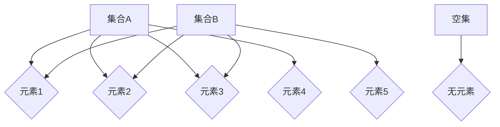

                 

### 引言

#### 数学与信息检索的交汇

数学是科学研究和工程实践的基石，其严谨的逻辑和方法论广泛应用于各个领域。信息检索作为计算机科学与工程的重要分支，其核心在于如何有效地从海量的数据中提取出用户所需的信息。搜索引擎作为信息检索的核心应用，其背后的算法和原理离不开数学的支持。数学与信息检索的交汇，不仅为搜索引擎的发展提供了强大的理论支撑，也极大地提升了信息检索的效率和准确性。

#### 搜索引擎的基本功能

搜索引擎的主要功能包括：

1. **网页抓取**：通过爬虫技术从互联网上获取网页内容。
2. **索引构建**：对抓取的网页进行预处理，构建索引以便快速检索。
3. **查询处理**：根据用户的查询请求，从索引中检索相关网页。
4. **排序和排名**：对检索结果进行排序，以提供最相关的内容给用户。

这些功能背后的算法和实现，无一不涉及到数学的深度应用，如概率论、统计学、图论等。

#### 本文目的与结构

本文旨在深入探讨数学在信息检索中的应用，通过逐步分析，揭示搜索引擎的数学原理。文章将分为以下几个部分：

1. **引言**：介绍数学与信息检索的背景和本文目的。
2. **信息检索基础**：概述信息检索的基本概念和工作原理。
3. **数学基础**：介绍集合论、概率论、统计学和图论等基础数学概念。
4. **搜索引擎算法**：分析搜索引擎中的核心算法，如排序算法、索引算法和查询处理算法。
5. **信息检索中的数学模型**：探讨相似度模型、概率模型、语言模型和贝叶斯网络模型。
6. **优化算法**：介绍优化算法，如PageRank、深度学习和强化学习。
7. **信息检索系统设计**：讨论信息检索系统的架构、数据模型、接口设计和交互设计。
8. **项目实战**：通过一个实际项目，展示信息检索系统的实现和代码分析。
9. **最佳实践与拓展**：总结最佳实践和注意事项，提供拓展阅读资源。
10. **结论**：对全文内容进行总结和展望。

通过本文的逐步分析，读者将能够全面理解搜索引擎的数学原理，并掌握信息检索的核心技术和方法。

### 信息检索概述

#### 信息检索的定义

信息检索（Information Retrieval，简称IR）是计算机科学和信息科学中的一个重要领域，其核心目标是帮助用户从大量信息中快速、准确地找到所需的信息。信息检索不仅仅是搜索网页，它涉及到对各种类型的数据进行索引、存储、检索和分析的复杂过程。

#### 信息检索的历史发展

信息检索的概念可以追溯到古代，当时人们使用各种方式来组织和查找信息，如图书馆的目录卡片和索引。随着计算机技术的发展，信息检索进入了一个全新的时代。20世纪60年代，van der Merwe提出了“倒排索引”的概念，极大地提高了信息检索的效率。随后，向量空间模型、概率模型和机器学习等方法的引入，进一步提升了信息检索的准确性和性能。

#### 信息检索的核心任务

信息检索的核心任务是：

1. **索引构建**：构建索引是信息检索的第一步，其目的是将原始数据转换为一种便于快速检索的格式。常见的索引方法包括倒排索引、布隆过滤器等。

2. **查询处理**：查询处理是指根据用户的查询请求，从索引中检索出相关的信息。这通常涉及到查询解析、匹配算法和结果排序等步骤。

3. **结果排序**：对检索结果进行排序，以便用户能够更容易地找到所需的信息。排序算法如BM25、PageRank等，都是基于数学原理来提升排序效果。

4. **反馈调整**：用户在检索结果中可能会进行多次交互，如点击、搜索历史等，这些反馈可以帮助系统不断优化检索结果。

#### 信息检索的应用场景

信息检索在多个领域有着广泛的应用：

1. **搜索引擎**：如Google、百度等，帮助用户在互联网上快速找到所需信息。

2. **推荐系统**：利用信息检索技术，根据用户的兴趣和行为，推荐相关的内容或商品。

3. **文本挖掘**：从大量文本数据中提取有价值的信息，用于情报分析、市场研究和数据统计等。

4. **数字图书馆**：提供对电子书、学术论文和档案的检索服务。

#### 信息检索的重要性

信息检索在现代信息社会中扮演着至关重要的角色。随着互联网和大数据的普及，信息检索技术不仅提升了人们获取信息的效率，还改变了人们的生活和工作方式。通过精确的信息检索，用户可以在短时间内从海量数据中获取所需的信息，提高了决策效率和生产力。

#### 搜索引擎的基本组成部分

搜索引擎通常由以下几个关键组成部分构成：

1. **爬虫（Crawler）**：爬虫是搜索引擎的“眼睛”，负责从互联网上爬取网页内容。

2. **索引器（Indexer）**：索引器将爬虫抓取到的网页内容进行处理，构建索引以便快速检索。

3. **查询处理器（Query Processor）**：查询处理器接收用户的查询请求，解析查询并从索引中检索相关信息。

4. **排序和排名算法（Ranking Algorithms）**：排序和排名算法用于对检索结果进行排序，确保用户能够首先看到最相关的结果。

5. **用户界面（User Interface）**：用户界面是用户与搜索引擎交互的入口，提供查询输入、结果展示等功能。

通过这些组成部分的协同工作，搜索引擎能够高效地提供信息检索服务。

### 搜索引擎的工作原理

搜索引擎的工作原理可以分为三个主要阶段：网页抓取、索引构建和查询处理。这三个阶段相互衔接，共同构成了搜索引擎的完整工作流程。

#### 网页抓取

网页抓取是搜索引擎的第一步，它通过爬虫（Crawler）从互联网上收集网页内容。爬虫通常从已知的种子网页开始，根据网页中的链接关系逐步扩展，以获取更多的网页。这个过程类似于广度优先搜索（Breadth-First Search），爬虫会遍历网页中的每一个链接，并下载相应的网页内容。

爬虫在抓取网页时，会遵循一定的策略：

1. **深度优先**：爬虫可以选择深度优先的策略，先抓取一个网页的所有链接，再递归地抓取下一个网页。这种策略能够快速发现新网页，但可能导致重复抓取。

2. **广度优先**：爬虫可以选择广度优先的策略，先抓取一组网页，再依次抓取这些网页的链接。这种策略能够减少重复抓取，但可能需要更多的时间。

3. **优先级策略**：爬虫可以根据网页的重要性和更新频率，设置不同的优先级，优先抓取重要的网页。

在网页抓取过程中，爬虫还需要处理网页的内容。常见的处理步骤包括：

1. **去噪**：去除网页中的HTML标签、JavaScript代码和样式表等无关内容，保留文本和图片等核心信息。

2. **分词**：将网页文本分割成单词或短语，以便进行后续的索引和查询处理。

3. **停用词过滤**：过滤掉常见的停用词（如“的”、“是”、“在”等），这些词在索引和查询中通常不具有意义。

4. **词干提取**：将单词转换为词干形式，以减少词汇的多样性。例如，“计算机”、“计算机科学”和“计算机程序员”可以被提取为共同的词干“计算机”。

#### 索引构建

索引构建是搜索引擎的核心步骤，其目的是将抓取的网页内容转换为一种便于快速检索的格式。索引通常包含网页的标题、关键词、URL和内容等信息。

索引构建的主要任务包括：

1. **倒排索引**：倒排索引是一种常见的索引方法，它将文档内容与文档ID进行反向映射。具体来说，对于每个单词，倒排索引会记录包含该单词的所有文档及其对应的文档ID。这种索引方法使得查询处理非常高效，只需扫描包含查询关键词的文档即可。

2. **词频统计**：在倒排索引的基础上，对每个文档中的关键词进行统计，记录关键词在文档中的出现频率。词频统计有助于计算关键词之间的相似度，从而提高检索的准确性。

3. **文档权重**：为了提高检索结果的准确性，搜索引擎会对每个文档赋予一个权重。文档权重通常基于多个因素计算，如关键词频率、网页点击率、网页重要性等。常用的算法包括TF-IDF（Term Frequency-Inverse Document Frequency）和PageRank等。

4. **索引优化**：索引构建过程中，搜索引擎还会进行一系列优化，以提高索引的效率和准确性。常见的优化方法包括：

   - **分片索引**：将大型的索引划分为多个较小的分片，以便并行处理查询。
   - **压缩索引**：使用压缩算法（如字典编码、词频压缩等）减小索引的大小，降低存储和传输的开销。
   - **缓存机制**：缓存频繁访问的网页和查询结果，以提高检索速度。

#### 查询处理

查询处理是搜索引擎的最后一个阶段，其目的是根据用户的查询请求，从索引中检索相关的网页，并返回检索结果。

查询处理的主要步骤包括：

1. **查询解析**：将用户的查询语句转换为计算机可以理解的格式。常见的解析方法包括分词、词性标注、语法分析等。

2. **查询匹配**：根据解析后的查询语句，从索引中查找包含查询关键词的文档。查询匹配算法会综合考虑关键词频率、文档权重等因素，以确定文档的相关性。

3. **结果排序**：对检索结果进行排序，以提供最相关的结果给用户。常用的排序算法包括TF-IDF、PageRank、BM25等。

4. **结果输出**：将排序后的检索结果呈现给用户，通常包括网页标题、摘要和URL等信息。

通过这三个阶段的协同工作，搜索引擎能够高效、准确地提供信息检索服务。每个阶段都涉及到复杂的算法和实现，这些算法和实现背后的数学原理将在接下来的章节中进行详细讨论。

### 信息检索的评价方法

#### 评价方法概述

信息检索的评价方法是为了衡量搜索引擎的性能和效果，确保其能够为用户提供高质量的检索结果。评价方法通常包括定量评价和定性评价，其中定量评价主要通过统计指标来衡量，而定性评价则依赖于专家评分和用户反馈。

#### 定量评价

定量评价是信息检索中最为常用的一种评价方法，主要通过以下指标来衡量检索系统的性能：

1. **准确率（Accuracy）**：准确率是指检索结果中包含相关文档的比例。准确率越高，说明检索系统的查准率越高。计算公式为：

   $$ \text{准确率} = \frac{\text{相关文档数}}{\text{检索结果总数}} $$

2. **召回率（Recall）**：召回率是指检索系统能够检索出所有相关文档的比例。召回率越高，说明检索系统的查全率越高。计算公式为：

   $$ \text{召回率} = \frac{\text{相关文档数}}{\text{所有相关文档总数}} $$

3. **F1 值（F1 Score）**：F1 值是准确率和召回率的调和平均，用于综合衡量检索系统的性能。F1 值介于 0 和 1 之间，越接近 1 表示性能越好。计算公式为：

   $$ \text{F1 值} = 2 \times \frac{\text{准确率} \times \text{召回率}}{\text{准确率} + \text{召回率}} $$

4. **平均准确率（Average Precision，AP）**：AP 是在信息检索中评价排序结果的指标，它通过计算所有检索结果中的每条文档的相关性来评估检索效果。

#### 定性评价

定性评价主要通过以下几种方法来评估信息检索系统的效果：

1. **专家评分**：由领域专家对检索结果的相关性和质量进行评分。这种方法通常用于评估系统的整体性能和用户体验。

2. **用户反馈**：通过用户对检索结果的使用情况和反馈来评估系统的效果。用户反馈可以通过问卷调查、用户行为分析等方式收集。

3. **用户满意度**：用户满意度是评估系统性能的重要指标，通过调查用户对检索结果的满意度来衡量系统的用户友好性。

#### 综合评价方法

为了全面评估信息检索系统的性能，通常会结合定量评价和定性评价方法。例如，通过定量评价方法计算系统的准确率和召回率等指标，并结合专家评分和用户反馈来评估系统的用户体验和满意度。

通过这些评价方法，信息检索系统能够得到全面的性能评估，从而不断优化和改进，以提供更高质量的检索服务。

### 信息检索的分类

#### 分类标准

信息检索可以根据不同的标准进行分类，常见的分类标准包括检索系统所处理的数据类型、检索方法和技术、应用领域等。

#### 根据数据类型分类

1. **文本检索**：文本检索是最常见的信息检索类型，主要针对文本数据进行检索。文本检索包括全文检索和关键词检索，广泛应用于搜索引擎、文本挖掘和推荐系统等。

2. **图像检索**：图像检索是指通过图像的特征（如颜色、形状、纹理等）进行检索。图像检索在图像识别、安防监控、医疗诊断等领域有着广泛的应用。

3. **语音检索**：语音检索是通过语音识别技术将用户的语音输入转换为文本，然后进行文本检索。语音检索在智能助手、语音导航、电话客服等领域有着重要的应用。

4. **视频检索**：视频检索是通过视频的特征（如视频内容、音频内容等）进行检索。视频检索在视频监控、视频分享网站、影视推荐等领域有着广泛的应用。

#### 根据检索方法和技术分类

1. **基于内容的检索**：基于内容的检索（Content-Based Retrieval）是指根据数据的内容特征进行检索。这种方法通常用于图像、视频和音频数据的检索，通过计算特征之间的相似度来实现。

2. **基于模型的检索**：基于模型的检索（Model-Based Retrieval）是指通过建立数据模型来检索数据。这种方法通常用于结构化数据（如数据库、关系型数据）的检索，通过查询和匹配数据模型来实现。

3. **基于协同过滤的检索**：基于协同过滤的检索（Collaborative Filtering）是指通过用户行为数据（如评分、浏览历史等）进行检索。这种方法在推荐系统和社交网络中有着广泛的应用。

4. **混合检索**：混合检索是指将多种检索方法结合使用，以提升检索效果。例如，将基于内容的检索和基于协同过滤的检索结合，可以更好地满足用户的个性化需求。

#### 根据应用领域分类

1. **学术信息检索**：学术信息检索主要针对学术论文、专利、科技文献等进行检索，广泛应用于学术研究、科技创新等领域。

2. **商业信息检索**：商业信息检索主要针对市场信息、商业报告、客户数据等进行检索，用于市场分析、商业决策等领域。

3. **政府信息检索**：政府信息检索主要针对政府文件、政策法规、公共服务信息等进行检索，用于政务公开、公共服务等领域。

4. **个人信息检索**：个人信息检索主要用于个人用户的日常查询，如搜索引擎、社交媒体、电子邮件等。

通过上述分类标准，可以更全面地理解信息检索的不同类型和应用场景，从而更好地设计和发展信息检索系统。

### 集合论基础

#### 核心概念原理

1. **集合**：集合是由确定对象构成的整体，通常用大写字母表示，如A、B等。集合中的每个对象称为元素，通常用小写字母表示，如a、b等。例如，集合A = {1, 2, 3}表示包含元素1、2、3的集合。

2. **空集**：空集是指不包含任何元素的集合，用符号∅表示。空集是任何集合的子集，但不是任何集合的超集。

3. **子集**：如果一个集合中的所有元素都属于另一个集合，那么前者称为后者的子集。用符号A ⊆ B表示。例如，集合{1, 2}是集合{1, 2, 3}的子集。

4. **真子集**：如果一个集合是另一个集合的子集，但两个集合不相等，则前者称为后者的真子集。用符号A ⊂ B表示。例如，集合{1, 2}是集合{1, 2, 3}的真子集。

5. **并集**：两个集合A和B的并集是指包含A和B中所有元素的集合，用符号A ∪ B表示。例如，集合{1, 2}和集合{3, 4}的并集为{1, 2, 3, 4}。

6. **交集**：两个集合A和B的交集是指同时属于A和B的元素的集合，用符号A ∩ B表示。例如，集合{1, 2}和集合{3, 4}的交集为空集∅。

7. **补集**：一个集合A的补集是指不属于A的元素的集合，用符号A'表示。补集是相对于整个全集而言的。例如，集合{1, 2}的补集为包含所有非1和2的元素的集合。

8. **差集**：两个集合A和B的差集是指属于A但不属于B的元素的集合，用符号A - B表示。例如，集合{1, 2}和集合{3, 4}的差集为{1, 2}。

#### 概念属性特征对比表格

| 概念       | 定义                          | 特征                            |
|------------|-------------------------------|--------------------------------|
| 集合       | 由确定对象构成的整体          | 无重复元素，无顺序              |
| 元素       | 集合中的对象                  | 可以重复，可排序                |
| 空集       | 不包含任何元素的集合          | 单一元素集合                   |
| 子集       | 集合的子集                    | 所有元素都属于另一个集合        |
| 真子集     | 集合的真子集                  | 所有元素都属于另一个集合，但集合不同 |
| 并集       | 集合的并集                    | 包含所有属于A或B的元素          |
| 交集       | 集合的交集                    | 包含所有同时属于A和B的元素      |
| 补集       | 集合的补集                    | 包含所有不属于A的元素          |
| 差集       | 集合的差集                    | 包含所有属于A但不属于B的元素    |

#### ER实体关系图架构的Mermaid流程图



通过上述集合论基础的核心概念原理、概念属性特征对比表格和ER实体关系图架构的Mermaid流程图，读者可以更好地理解集合论的基本概念和操作方法，为后续更深入地学习信息检索中的数学模型打下坚实的基础。

### 集合论在信息检索中的应用

#### 集合操作在索引构建中的应用

在信息检索中，集合操作（如并集、交集和补集）在索引构建过程中扮演着至关重要的角色。这些操作不仅用于存储和检索数据，还用于优化索引结构和提高检索效率。

1. **并集操作**：在索引构建过程中，并集操作常用于合并来自多个来源的数据。例如，当搜索引擎从多个网站抓取网页时，需要将这些网页的内容合并成一个完整的索引。通过并集操作，可以将不同来源的网页合并成一个集合，便于后续的检索处理。

2. **交集操作**：交集操作用于筛选出多个数据源中共同具有的特征或关键词。在信息检索中，通过交集操作可以找出包含多个关键词的网页，从而提高检索的准确性和相关性。例如，当用户查询包含“人工智能”和“机器学习”的网页时，搜索引擎可以使用交集操作来筛选出同时包含这两个关键词的网页。

3. **补集操作**：补集操作在信息检索中的应用主要是用于排除不符合用户需求的数据。例如，当用户查询特定主题的网页时，可以通过补集操作排除那些不相关的网页，从而提高检索结果的精准度。此外，补集操作还可以用于去除重复数据，保持索引的唯一性和完整性。

#### 补集操作与去重

去重是信息检索中的一个关键步骤，以确保索引中的数据不重复且准确。补集操作在这一过程中尤为重要。例如，假设一个搜索引擎从多个网站抓取了数百万个网页，为了构建一个唯一的索引，需要去除重复的网页。通过补集操作，可以找到已经索引过的网页的补集，从而排除重复的网页，保留唯一的网页集合。

```python
# Python示例：使用补集操作去重
original_pages = {"page1", "page2", "page3", "page4", "page5"}  # 原始网页集合
indexed_pages = {"page2", "page3", "page4", "page5", "page6"}  # 已经索引的网页集合

# 求已索引网页的补集
unique_pages = indexed_pages.copy()
unique_pages.difference_update(original_pages)

print("去重后的网页集合:", unique_pages)
```

#### 并集操作与索引合并

当搜索引擎从多个来源获取网页时，需要将这些网页合并成一个统一的索引。并集操作能够高效地完成这一任务。以下是一个简单的Python示例，展示了如何使用并集操作将两个网页集合合并为一个：

```python
# Python示例：使用并集操作合并网页集合
page_collection_1 = {"page1", "page2", "page3"}
page_collection_2 = {"page3", "page4", "page5"}

# 求并集
merged_pages = page_collection_1.union(page_collection_2)

print("合并后的网页集合:", merged_pages)
```

#### 交集操作与关键词筛选

交集操作在筛选关键词相关的网页时非常有效。以下是一个简单的Python示例，展示了如何使用交集操作找出同时包含关键词“人工智能”和“机器学习”的网页：

```python
# Python示例：使用交集操作筛选网页
page_collection_1 = {"page1", "page2", "page3", "page4", "page5"}
page_collection_2 = {"page2", "page3", "page4", "page5", "page6", "page7"}

# 定义关键词集合
ai_pages = {"page2", "page4", "page6"}
ml_pages = {"page2", "page4", "page6", "page7"}

# 求交集
relevant_pages = ai_pages.intersection(ml_pages)

print("同时包含'人工智能'和'机器学习'的网页:", relevant_pages)
```

通过这些示例，我们可以看到集合操作在信息检索中的具体应用，包括去重、合并索引和筛选相关网页。这些集合论的基本操作不仅有助于构建高效的索引，还极大地提升了信息检索系统的性能和准确性。

### 概率论基础

#### 核心概念原理

概率论是数学中一个重要的分支，其在信息检索中的应用极为广泛。概率论中的核心概念包括随机事件、概率、条件概率和独立事件等。

1. **随机事件**：随机事件是指在一次试验中可能发生也可能不发生的事件。例如，掷一枚硬币，正面朝上的事件是一个随机事件。

2. **概率**：概率是描述随机事件发生的可能性大小的数值。概率的取值范围在0到1之间，其中0表示不可能发生，1表示必然发生。

   $$ P(A) = \frac{\text{事件A发生的次数}}{\text{总次数}} $$

3. **条件概率**：条件概率是指在某个事件已经发生的条件下，另一个事件发生的概率。条件概率的计算公式为：

   $$ P(B|A) = \frac{P(A \cap B)}{P(A)} $$

4. **独立事件**：独立事件是指两个事件的发生与否互不影响。两个事件A和B独立的条件是：

   $$ P(A \cap B) = P(A) \cdot P(B) $$

5. **全概率公式**：全概率公式用于计算在多个互斥事件中，某一事件发生的总概率。全概率公式为：

   $$ P(A) = P(A|B_1)P(B_1) + P(A|B_2)P(B_2) + ... + P(A|B_n)P(B_n) $$

6. **贝叶斯定理**：贝叶斯定理是概率论中的一个重要定理，用于计算在已知某些条件下，某一事件发生的概率。贝叶斯定理的公式为：

   $$ P(A|B) = \frac{P(B|A)P(A)}{P(B)} $$

#### 概率论在信息检索中的应用

1. **文档相似度计算**：在信息检索中，概率论常用于计算文档之间的相似度。例如，可以通过计算两个文档中共同关键词的概率来评估它们的相似性。

2. **查询意图识别**：概率论可以帮助搜索引擎识别用户的查询意图。通过分析用户查询中的关键词及其概率分布，搜索引擎可以更好地理解用户的查询需求，从而提供更准确的检索结果。

3. **概率模型在排序中的应用**：在搜索引擎的排序算法中，概率模型用于计算文档的相关性得分。例如，TF-IDF模型和PageRank模型都基于概率论原理来评估文档的重要性和相关性。

4. **概率分布模型**：概率分布模型（如伯努利分布、泊松分布等）在处理数据稀疏性和噪声问题时具有重要应用。例如，在处理噪声数据时，可以通过概率分布模型估计真实数据的分布，从而提高信息检索的准确性和鲁棒性。

通过上述概率论的核心概念及其在信息检索中的应用，我们可以看到概率论为信息检索提供了强大的理论支持，极大地提升了检索系统的性能和准确性。

### 统计学基础

#### 核心概念原理

统计学在信息检索中起着至关重要的作用，其核心概念包括描述统计、推断统计、假设检验和回归分析等。

1. **描述统计**：描述统计主要用于描述数据的分布和特征。常见的描述统计量包括：

   - **均值（Mean）**：数据集的平均值，用于衡量数据的中心位置。
   $$ \mu = \frac{\sum_{i=1}^{n} x_i}{n} $$
   
   - **中位数（Median）**：将数据集排序后，位于中间位置的值，用于衡量数据的中心位置。
   
   - **众数（Mode）**：数据集中出现频率最高的值，用于衡量数据的集中趋势。

2. **推断统计**：推断统计用于基于样本数据对总体数据进行推断。常见的方法包括：

   - **置信区间（Confidence Interval）**：用于估计总体参数的范围，通常以一定的置信水平给出。置信区间的公式为：
   $$ \mu \pm z_{\alpha/2} \cdot \frac{\sigma}{\sqrt{n}} $$
   
   - **假设检验（Hypothesis Testing）**：通过样本数据来验证或拒绝某个假设。常见的假设检验方法包括t检验和卡方检验。

3. **假设检验**：假设检验是一种统计方法，用于判断样本数据是否支持某个假设。主要步骤包括：

   - **提出零假设（Null Hypothesis）和备择假设（Alternative Hypothesis）**：零假设通常表示没有显著差异或效果，备择假设则表示存在显著差异或效果。
   
   - **选择显著性水平（Significance Level）**：显著性水平决定了拒绝零假设的临界值，常用的显著性水平为0.05和0.01。
   
   - **计算检验统计量**：通过计算检验统计量（如t统计量、z统计量等），与临界值进行比较，判断是否拒绝零假设。

4. **回归分析**：回归分析用于建立变量之间的关系模型，常见的回归模型包括线性回归和逻辑回归。

   - **线性回归（Linear Regression）**：线性回归模型通过拟合一条直线来描述自变量和因变量之间的关系。线性回归的公式为：
   $$ y = \beta_0 + \beta_1x $$
   
   - **逻辑回归（Logistic Regression）**：逻辑回归是一种广义线性模型，用于处理因变量为二分类的情况。逻辑回归的公式为：
   $$ P(y=1) = \frac{1}{1 + e^{-(\beta_0 + \beta_1x)}} $$

#### 统计学在信息检索中的应用

1. **文档相似度计算**：统计学中的相似度度量方法（如余弦相似度、皮尔逊相关系数等）在计算文档相似度时得到广泛应用。通过这些方法，可以评估文档之间的相关性，从而提高检索的准确性和有效性。

2. **用户行为分析**：统计学方法在分析用户行为数据（如点击率、搜索历史等）时具有重要作用。通过统计分析，可以识别用户的兴趣和行为模式，从而为个性化推荐和广告投放提供依据。

3. **排序和排名**：在信息检索中，统计学模型（如TF-IDF、PageRank等）常用于对检索结果进行排序和排名。这些模型通过计算文档的相关性得分，为用户提供最相关的检索结果。

4. **异常检测**：统计学方法在检测异常数据和异常行为时也具有重要应用。通过统计分析，可以识别出数据中的异常值和异常模式，从而提高检索系统的鲁棒性和安全性。

通过统计学的基础概念和应用，我们可以看到统计学在信息检索中的广泛应用，它不仅提供了理论支持，还极大地提升了信息检索系统的性能和用户体验。

### 图论基础

#### 核心概念原理

1. **图**：图是由节点（或顶点）和边组成的数学结构。节点表示实体，边表示节点之间的关系。常见的图包括无向图、有向图和加权图。

2. **路径**：路径是图中的一系列连续的边和节点。从一个节点到另一个节点的最短路径是图论研究的重要问题。

3. **连通性**：图中的连通性是指任意两个节点之间都存在路径。连通图是指任意两个节点都连通的图，而连通分量是连通图中的不连通部分。

4. **连通度**：连通度是指图中任意两个节点之间路径的最少边数。最小连通度是图的一个基本属性。

5. **图的度**：图的度是指每个节点连接的边的数量。度最大的节点称为图的中心节点。

6. **图的邻接矩阵**：图的邻接矩阵是一个矩阵，其中元素表示节点之间的连接关系。邻接矩阵有助于计算图的各种属性和路径。

7. **图的权重**：在加权图中，边的权重表示连接两个节点的边的强度或距离。常见的加权图包括最短路径图和最迟路径图。

8. **图的最小生成树**：图的最小生成树是包含图中所有节点的树，其总权重最小。最小生成树在优化路径和资源分配中具有重要应用。

9. **图的应用**：图论在计算机科学和工程中有着广泛的应用，如网络路由、社交网络分析、图像处理和生物学中的基因网络分析。

#### 图论在信息检索中的应用

1. **搜索引擎中的网页排序**：图论在搜索引擎中用于网页排序和排名。例如，PageRank算法利用图论中的链接分析来评估网页的重要性。

2. **社会网络分析**：图论用于分析社交网络中的关系和影响力。通过图论方法，可以识别社交网络中的关键节点和社区结构。

3. **搜索引擎中的索引构建**：图论用于构建搜索引擎的索引结构，如倒排索引和倒排图。这些结构有助于快速检索和匹配关键词。

4. **网络爬虫**：图论用于网络爬虫的路径规划和网页抓取策略，以高效地遍历互联网。

通过上述图论的核心概念及其在信息检索中的应用，我们可以看到图论为信息检索提供了强大的理论基础和工具，极大地提升了搜索引擎的性能和准确性。

### 搜索引擎算法概述

#### 搜索引擎算法的重要性

搜索引擎算法是信息检索系统中的核心组件，其性能直接决定了用户检索体验的质量。搜索引擎算法负责处理用户的查询请求，从海量的网页中检索出最相关的结果，并将其排序呈现给用户。高效的搜索引擎算法不仅能提高检索的准确性，还能优化检索速度，从而提升用户体验。常见的搜索引擎算法包括排序算法、索引算法和查询处理算法。

#### 排序算法

排序算法是搜索引擎中用于对检索结果进行排序的关键技术。有效的排序算法可以确保用户首先看到最相关的网页。常见的排序算法有：

1. **TF-IDF（Term Frequency-Inverse Document Frequency）**：TF-IDF是一种基于词频和逆文档频率的排序算法。它通过计算关键词在文档中的频率和在整个文档集合中的重要性来评估文档的相关性。

2. **PageRank**：PageRank是一种基于网页链接分析的排序算法，由Google的创始人拉里·佩奇和谢尔盖·布林提出。PageRank通过计算网页之间的链接关系，评估网页的重要性，从而确定排序顺序。

3. **BM25**（Best Match 25）：BM25是一种基于信息论和概率论的排序算法，广泛用于搜索引擎。它通过计算文档中关键词的频率、文档长度和查询关键词的相关性来评估文档的相关性。

4. **向量空间模型**：向量空间模型是一种将文本表示为向量空间的算法。它通过计算文档和查询之间的余弦相似度来评估文档的相关性。

#### 索引算法

索引算法是搜索引擎构建索引的核心技术，其目的是将原始网页数据转换为便于快速检索的格式。常见的索引算法有：

1. **倒排索引**：倒排索引是一种将单词映射到包含该单词的文档的索引结构。它通过构建一个单词到文档ID的映射表，使得查询处理变得非常高效。

2. **布隆过滤器**：布隆过滤器是一种用于快速判断一个元素是否属于集合的数据结构。它在信息检索中用于快速判断一个网页是否已经被索引，从而减少不必要的查询处理。

3. **压缩索引**：压缩索引通过使用压缩算法（如字典编码、词频压缩等）减小索引的大小，从而提高存储效率和检索速度。

#### 查询处理算法

查询处理算法是搜索引擎处理用户查询请求的核心步骤。它包括查询解析、查询匹配和结果排序等环节。常见的查询处理算法有：

1. **查询解析**：查询解析是将用户的查询请求转换为计算机可以理解的格式。它通常包括分词、词性标注和语法分析等步骤。

2. **查询匹配**：查询匹配是搜索引擎从索引中查找包含查询关键词的文档。常见的匹配算法有基于关键词匹配、基于文档内容匹配和基于语义匹配等。

3. **结果排序**：结果排序是将检索结果按照相关性排序，以便用户能够更容易找到所需信息。常用的排序算法有TF-IDF、PageRank和BM25等。

通过这些搜索引擎算法的协同工作，搜索引擎能够高效、准确地提供信息检索服务。每个算法都有其独特的原理和应用场景，通过合理地设计和优化这些算法，可以大大提升搜索引擎的性能和用户体验。

### 搜索引擎中的排序算法

#### 排序算法概述

在搜索引擎中，排序算法用于对检索结果进行排序，确保用户首先看到最相关的结果。常见的排序算法包括TF-IDF、PageRank和BM25等，每种算法都有其独特的原理和应用场景。

#### TF-IDF算法

TF-IDF（Term Frequency-Inverse Document Frequency）是一种基于词频和逆文档频率的排序算法。它通过计算关键词在文档中的频率和在整个文档集合中的重要性来评估文档的相关性。TF-IDF算法的基本原理如下：

1. **词频（TF）**：词频是指关键词在单个文档中出现的次数。词频越高，表示关键词在文档中越重要。

2. **逆文档频率（IDF）**：逆文档频率是指关键词在整个文档集合中出现的频率。逆文档频率越高，表示关键词在整个集合中越不重要。

3. **TF-IDF计算公式**：TF-IDF的计算公式为：
   $$ \text{TF-IDF} = \text{TF} \times \text{IDF} $$
   其中，TF和IDF分别表示词频和逆文档频率。

通过TF-IDF算法，搜索引擎可以评估文档与查询之间的相关性，从而进行排序。例如，对于查询“人工智能”，包含“人工智能”的网页具有较高的TF-IDF得分，因此被排序在检索结果的前列。

#### PageRank算法

PageRank是一种基于网页链接分析的排序算法，由Google的创始人拉里·佩奇和谢尔盖·布林提出。PageRank通过计算网页之间的链接关系，评估网页的重要性，从而确定排序顺序。PageRank算法的基本原理如下：

1. **网页重要性**：PageRank通过网页之间的链接关系评估网页的重要性。一个网页如果被更多的重要网页链接，则其重要性越高。

2. **算法原理**：PageRank算法利用随机游走模型，模拟用户在互联网上的随机浏览行为。通过计算网页之间的链接概率，确定每个网页的PageRank得分。

3. **PageRank计算公式**：
   $$ \text{PageRank}(v) = (\alpha \cdot \text{PageRank}(u) + \beta \cdot \text{OutLinks}(u)) $$
   其中，α表示返回主页的概率，β表示随机跳转的概率，OutLinks(u)表示网页u的出链数。

通过PageRank算法，搜索引擎可以评估网页的重要性，从而进行排序。例如，一个被众多权威网页链接的网页，其PageRank得分较高，因此在检索结果中排在前面。

#### BM25算法

BM25（Best Match 25）是一种基于信息论和概率论的排序算法，广泛用于搜索引擎。BM25通过计算文档中关键词的频率、文档长度和查询关键词的相关性来评估文档的相关性。BM25算法的基本原理如下：

1. **关键词频率（TF）**：关键词频率是指关键词在文档中出现的次数。

2. **文档长度（dl）**：文档长度是指文档中的词汇数量。

3. **查询长度（ql）**：查询长度是指查询中的词汇数量。

4. **K1和b**：K1和b是两个参数，用于调整关键词频率和文档长度的计算。

5. **BM25计算公式**：
   $$ \text{BM25} = \frac{(K1 + 1) \cdot \text{TF} \cdot (\text{IDF} + 0.5 \cdot \frac{b \cdot (\text{dl} - b)}{c + b})}{\text{dl} \cdot (\text{K2} + 1 - \text{TF} \cdot \frac{K2}{\text{dl} - K1 + 1})} $$
   其中，K1、K2是参数，c是文档中的非关键词词汇数量。

通过BM25算法，搜索引擎可以评估文档与查询之间的相关性，从而进行排序。例如，一个关键词在文档中频繁出现且文档长度适中，其BM25得分较高，因此在检索结果中排在前面。

#### 排序算法对比与应用场景

- **TF-IDF**：TF-IDF算法简单高效，适用于文本检索，适用于文档集较小的情况。
- **PageRank**：PageRank算法适用于网页链接分析，适用于大规模的互联网搜索引擎，如Google。
- **BM25**：BM25算法适用于信息检索系统，适用于各种规模的文档集，尤其在文档集较大时表现优秀。

通过选择合适的排序算法，搜索引擎可以提供更准确的检索结果，提升用户体验。

### 搜索引擎中的索引算法

#### 索引算法概述

索引算法是搜索引擎的核心技术，用于构建索引数据结构，以便快速检索和匹配关键词。常见的索引算法包括倒排索引、布隆过滤器和压缩索引等。这些算法各有优缺点，适用于不同的应用场景。

#### 倒排索引

倒排索引是一种常见且高效的索引算法，其核心思想是将文档中的单词映射到对应的文档ID。倒排索引通常包含两个主要部分：单词词典和倒排列表。

1. **单词词典**：单词词典是一个包含所有单词的列表，每个单词都有一个唯一的ID。单词词典使得查询处理时可以快速定位到相关的文档。

2. **倒排列表**：倒排列表是一个映射表，将每个单词映射到包含该单词的所有文档ID。通过倒排列表，搜索引擎可以快速找到包含特定关键词的文档。

倒排索引的优点在于其高效性和灵活性。查询处理时，只需扫描包含关键词的文档，从而大大提高了检索速度。此外，倒排索引易于扩展，可以支持各种复杂的查询操作，如模糊查询和范围查询。

#### 布隆过滤器

布隆过滤器是一种用于快速判断元素是否属于集合的数据结构。它在信息检索中的应用主要是用于快速判断一个网页是否已经被索引，从而减少不必要的查询处理。

布隆过滤器的工作原理是基于多个哈希函数和位数组。当一个新的网页被索引时，通过多个哈希函数计算其哈希值，并将这些哈希值对应的位数位置设置为1。当需要判断一个网页是否已被索引时，只需计算其哈希值，并检查位数组中对应的位是否为1。如果所有位都为1，则该网页很可能已被索引；如果存在至少一位为0，则该网页一定未被索引。

布隆过滤器的优点在于其高效性和低存储开销。通过少量的位数组存储，布隆过滤器可以快速判断网页是否已被索引，从而减少查询处理的时间和存储需求。然而，布隆过滤器的缺点是其误判率。由于哈希函数的冲突，布隆过滤器可能误判一个未被索引的网页为已索引，但不会误判一个已索引的网页为未索引。

#### 压缩索引

压缩索引通过使用压缩算法（如字典编码、词频压缩等）减小索引的大小，从而提高存储效率和检索速度。常见的压缩算法包括字典编码和词频压缩。

1. **字典编码**：字典编码将重复出现的词或短语编码为短字符串，从而减少索引的大小。例如，将“人工智能”编码为“AI”，将“机器学习”编码为“ML”，从而显著降低索引的存储需求。

2. **词频压缩**：词频压缩通过记录关键词在文档中的出现频率，从而减少索引的存储空间。例如，对于关键词“人工智能”在文档A中出现了3次，在文档B中出现了2次，可以记录为（A, 3）和（B, 2），而不是重复记录“人工智能”3次。

压缩索引的优点在于其高压缩比和低存储开销，特别适用于存储空间受限的应用场景。然而，压缩索引的缺点是其检索速度较慢，因为需要解压缩索引数据才能进行查询处理。

#### 索引算法对比与应用场景

- **倒排索引**：适用于高效检索和多种查询操作，适用于文档集较小且查询频率较高的场景。
- **布隆过滤器**：适用于快速判断元素是否属于集合，适用于索引构建和查询处理速度要求较高的场景。
- **压缩索引**：适用于存储空间受限且查询频率较低的场景，适用于大规模文档集的存储和检索。

通过选择合适的索引算法，搜索引擎可以优化索引构建和查询处理速度，提高检索效率和用户体验。

### 搜索引擎中的查询处理算法

#### 查询处理算法概述

查询处理是搜索引擎的核心任务之一，其目的是将用户的查询请求转换为计算机可以理解的格式，并从索引中检索出相关的文档。常见的查询处理算法包括分词、查询解析、查询匹配和结果排序等步骤。

1. **分词**：分词是将用户的查询语句分割成一个个单词或短语的过程。分词的准确性和效率直接影响查询处理的效果。常见的分词算法有基于词典的分词、基于统计的分词和深度学习分词等。

2. **查询解析**：查询解析是将分词后的查询语句转换为计算机可以理解的格式。查询解析包括词性标注、语法分析和语义分析等步骤。通过查询解析，搜索引擎可以更好地理解用户的查询意图，从而提供更准确的检索结果。

3. **查询匹配**：查询匹配是搜索引擎从索引中检索包含查询关键词的文档。常见的查询匹配算法有基于关键词匹配、基于文档内容匹配和基于语义匹配等。查询匹配算法需要计算查询和文档之间的相似度，从而确定文档的相关性。

4. **结果排序**：结果排序是将检索出的文档按照相关性排序，以便用户能够更容易找到所需信息。常用的排序算法有TF-IDF、PageRank和BM25等。

#### 分词算法

分词是查询处理的第一步，其目的是将用户的查询语句分割成一个个单词或短语。常见的分词算法包括：

1. **基于词典的分词**：基于词典的分词算法通过匹配查询语句中的单词与词典中的词库进行分词。例如，如果词典中包含“人工智能”，那么查询语句“人工智能技术”可以被正确分割为“人工智能”和“技术”。

2. **基于统计的分词**：基于统计的分词算法通过计算查询语句中各个单词之间的统计关系来分词。常见的统计方法包括n-gram模型和隐马尔可夫模型（HMM）。例如，通过n-gram模型，可以将“人工智能技术”正确分割为“人工智能”和“技术”。

3. **深度学习分词**：深度学习分词算法利用神经网络模型（如循环神经网络RNN和长短时记忆LSTM）进行分词。深度学习分词算法通过大量训练数据学习到单词之间的关联性，从而提高分词的准确性和效率。

#### 查询解析算法

查询解析是将分词后的查询语句转换为计算机可以理解的格式。常见的查询解析算法包括：

1. **词性标注**：词性标注是将查询语句中的每个单词标注为名词、动词、形容词等词性。词性标注有助于搜索引擎更好地理解查询意图。例如，将“买苹果”中的“苹果”标注为名词，将“买”标注为动词。

2. **语法分析**：语法分析是将查询语句转换为抽象语法树（AST），以表示查询的结构。语法分析有助于搜索引擎识别查询中的主语、谓语和宾语等成分。例如，将“我想要买一个苹果”转换为抽象语法树，可以表示为（我，想要，买，一个，苹果）。

3. **语义分析**：语义分析是将查询语句转换为语义表示，以便更准确地理解查询意图。语义分析可以基于知识图谱、实体识别和语义角色标注等方法。例如，通过语义分析，可以将“买苹果”理解为在某个地点购买某种水果。

#### 查询匹配算法

查询匹配是将用户的查询与索引中的文档进行匹配，以确定文档的相关性。常见的查询匹配算法包括：

1. **基于关键词匹配**：基于关键词匹配算法通过计算查询和文档中关键词的交集来确定相关性。例如，如果查询包含“苹果”，则包含“苹果”的文档会被认为具有较高的相关性。

2. **基于文档内容匹配**：基于文档内容匹配算法通过计算查询和文档之间的相似度来确定相关性。常见的相似度计算方法包括余弦相似度、Jaccard相似度和编辑距离等。例如，通过余弦相似度，可以将查询“苹果”和文档“苹果手机”视为具有较高相关性。

3. **基于语义匹配**：基于语义匹配算法通过计算查询和文档之间的语义相似度来确定相关性。常见的语义匹配方法包括词嵌入、文本嵌入和语义角色标注等。例如，通过词嵌入，可以将查询“苹果”和文档“苹果手机”视为具有较高语义相关性。

#### 结果排序算法

结果排序是将检索出的文档按照相关性排序，以便用户能够更容易找到所需信息。常用的排序算法包括：

1. **TF-IDF**：TF-IDF算法通过计算关键词在文档中的频率和在整个文档集合中的重要性来确定相关性。例如，对于查询“苹果”，包含“苹果”的文档会被认为具有较高的相关性。

2. **PageRank**：PageRank算法通过计算网页之间的链接关系来确定网页的重要性。例如，如果一个网页被更多的重要网页链接，则其相关性越高。

3. **BM25**：BM25算法通过计算关键词在文档中的频率、文档长度和查询关键词的相关性来确定相关性。例如，对于查询“苹果”，关键词在文档中出现的频率越高，文档的相关性越高。

通过这些查询处理算法的协同工作，搜索引擎可以高效、准确地处理用户的查询请求，并提供高质量的检索结果。

### 信息检索中的相似度模型

#### 相似度模型概述

相似度模型是信息检索中用于评估文档与查询之间相关性的关键方法。相似度模型通过计算文档和查询之间的相似度得分，帮助搜索引擎确定哪些文档与用户的查询最相关。常见的相似度模型包括向量空间模型、余弦相似度和Jaccard相似度等。

#### 向量空间模型

向量空间模型是一种基于数学向量的模型，用于表示文档和查询。在向量空间模型中，每个文档和查询都可以被表示为一个向量，其中每个维度对应一个关键词。相似度计算主要通过计算这两个向量的相似度得分来实现。

1. **向量表示**：在向量空间模型中，文档和查询被表示为向量。例如，假设有两个文档D1和D2，以及一个查询Q，它们分别由关键词集合{A, B, C, D}组成。我们可以将D1表示为向量(V1, V2, V3, V4)，其中V1, V2, V3, V4分别表示关键词A, B, C, D在D1中的出现频率。

2. **余弦相似度**：余弦相似度是向量空间模型中常用的相似度计算方法。余弦相似度通过计算两个向量的夹角余弦值来确定它们的相似度。公式如下：

   $$ \text{相似度} = \frac{D1 \cdot D2}{\|D1\| \cdot \|D2\|} $$
   
   其中，D1和D2是文档和查询的向量表示，\|D1\|和\|D2\|分别是向量的模长，D1 \cdot D2是向量的点积。

3. **向量归一化**：为了确保向量之间的相似度计算不受向量模长的影响，通常需要对向量进行归一化处理。归一化后的向量模长为1，使得相似度计算仅依赖于向量之间的方向。

#### 余弦相似度

余弦相似度是一种基于向量空间模型的相似度计算方法，用于评估两个向量之间的角度余弦值。余弦相似度的计算公式为：

$$ \text{相似度} = \frac{\sum_{i=1}^{n} D1_i \times D2_i}{\sqrt{\sum_{i=1}^{n} D1_i^2} \times \sqrt{\sum_{i=1}^{n} D2_i^2}} $$

其中，D1和D2是文档和查询的向量表示，n是向量的维度，D1_i和D2_i分别是向量D1和D2的第i个分量。

#### Jaccard相似度

Jaccard相似度是一种用于计算集合之间相似度的方法，常用于信息检索中。Jaccard相似度的计算公式为：

$$ \text{相似度} = \frac{|D1 \cap D2|}{|D1 \cup D2|} $$

其中，D1和D2是文档和查询的集合表示，|D1 \cap D2|是D1和D2的交集大小，|D1 \cup D2|是D1和D2的并集大小。

#### 应用场景

1. **文档相似度计算**：向量空间模型和余弦相似度广泛应用于文档相似度计算。通过计算文档之间的相似度得分，可以帮助搜索引擎确定哪些文档与用户的查询最相关。

2. **信息检索系统**：Jaccard相似度在信息检索系统中用于计算关键词集合之间的相似度，帮助系统识别相似文档和推荐相关内容。

3. **推荐系统**：相似度模型在推荐系统中用于计算用户和项目之间的相似度，从而提供个性化推荐。

通过这些相似度模型，信息检索系统能够更准确地评估文档和查询之间的相关性，从而提升检索效果和用户体验。

### 信息检索中的概率模型

#### 概率模型概述

概率模型是信息检索中用于计算文档与查询之间相关性的重要工具。概率模型基于概率论和统计学原理，通过分析用户行为数据和文档内容，估算文档对查询的响应概率。常见的概率模型包括贝叶斯模型、最大后验概率模型和最大似然估计模型等。

#### 贝叶斯模型

贝叶斯模型是信息检索中最常用的概率模型之一。贝叶斯模型基于贝叶斯定理，通过计算文档对查询的响应概率来评估文档的相关性。贝叶斯模型的公式为：

$$ P(D|Q) = \frac{P(Q|D)P(D)}{P(Q)} $$

其中，P(D|Q)表示在查询Q的条件下文档D的相关性概率，P(Q|D)表示在文档D的条件下查询Q的响应概率，P(D)表示文档D的概率，P(Q)表示查询Q的概率。

贝叶斯模型的应用场景包括：

1. **文档排序**：通过计算每个文档对查询的响应概率，贝叶斯模型可以用于对检索结果进行排序，确保最相关的文档排在前面。

2. **文档推荐**：贝叶斯模型可以用于根据用户的历史查询和兴趣，推荐相关的文档。

#### 最大后验概率模型

最大后验概率模型（Maximum A Posteriori, MAP）是一种基于贝叶斯模型的优化方法。MAP模型通过最大化文档对查询的后验概率来评估文档的相关性。MAP模型的公式为：

$$ \text{MAP} = \arg\max_D P(D|Q) $$

其中，\(\arg\max_D\)表示在所有文档D中寻找使后验概率最大的文档。

最大后验概率模型的应用场景包括：

1. **文档筛选**：通过计算每个文档对查询的后验概率，最大后验概率模型可以用于筛选出与查询最相关的文档。

2. **分类任务**：最大后验概率模型在分类任务中用于计算文档属于某个类别的概率，从而实现文档分类。

#### 最大似然估计模型

最大似然估计模型（Maximum Likelihood Estimation, MLE）是一种基于概率模型的方法，通过最大化观察数据的似然函数来估计参数。MLE模型的公式为：

$$ \text{MLE} = \arg\max_P P(D) $$

其中，P表示参数的估计值，D表示观察到的数据。

最大似然估计模型的应用场景包括：

1. **参数估计**：最大似然估计模型用于估计文档和查询之间的参数，从而提高检索效果。

2. **模型训练**：在机器学习任务中，最大似然估计模型用于训练模型参数，以提高模型的预测准确性。

#### 贝叶斯网络模型

贝叶斯网络模型是一种基于概率图模型的方法，用于表示变量之间的依赖关系。贝叶斯网络由一组随机变量和条件概率表组成，可以用于推理和预测变量之间的关系。

贝叶斯网络模型的应用场景包括：

1. **因果推断**：通过贝叶斯网络模型，可以推断变量之间的因果关系，从而用于信息检索中的因果查询处理。

2. **不确定性处理**：贝叶斯网络模型可以处理变量之间的不确定性，从而提高信息检索系统的鲁棒性和可靠性。

通过这些概率模型，信息检索系统能够更准确地评估文档与查询之间的相关性，从而提升检索效果和用户体验。

### 信息检索中的贝叶斯网络模型

#### 贝叶斯网络模型概述

贝叶斯网络是一种基于概率图模型的数据结构，用于表示变量之间的依赖关系。贝叶斯网络由节点和边组成，其中节点表示随机变量，边表示变量之间的条件概率关系。贝叶斯网络的核心思想是利用概率论中的贝叶斯定理，通过条件概率表（Conditional Probability Table, CPT）来描述变量之间的依赖关系。

1. **节点**：贝叶斯网络中的节点表示随机变量，每个节点代表一个变量，通常用圆形或矩形表示。

2. **边**：贝叶斯网络中的边表示变量之间的依赖关系，边的方向表示依赖的方向。如果变量A依赖于变量B，则A是B的父节点。

3. **条件概率表**：条件概率表（CPT）是贝叶斯网络的核心组成部分，用于描述变量之间的条件概率分布。CPT列出了每个变量在给定其父节点的条件下，所有可能取值的概率。

#### 贝叶斯网络在信息检索中的应用

1. **文档分类**：贝叶斯网络可以用于文本分类任务，通过学习文档和标签之间的依赖关系，实现对未知文档的类别预测。例如，在垃圾邮件分类中，贝叶斯网络可以用于判断一封邮件是否为垃圾邮件。

2. **查询意图识别**：贝叶斯网络可以用于分析用户的查询意图，通过学习用户查询和查询结果之间的依赖关系，提高查询处理的准确性。例如，当用户输入查询“苹果”时，贝叶斯网络可以识别用户意图是查询水果还是电子产品，从而提供更准确的检索结果。

3. **推荐系统**：贝叶斯网络可以用于推荐系统，通过分析用户的历史行为和物品特征，预测用户对物品的喜好。例如，在电商平台上，贝叶斯网络可以用于推荐与用户历史购买记录相似的物品。

#### 贝叶斯网络模型示例

假设我们要构建一个简单的贝叶斯网络来表示文档与关键词之间的关系。在这个网络中，我们有两个变量：D（文档）和K（关键词）。文档D可能包含多个关键词K，关键词K与文档D之间存在依赖关系。

1. **节点表示**：D和K分别表示文档和关键词，用圆形节点表示。

2. **边表示**：假设文档D是关键词K的父节点，表示D影响K。在贝叶斯网络中，从D指向K的边表示这种依赖关系。

3. **条件概率表**：对于关键词K，我们假设它有两个可能的取值：A（出现）和B（未出现）。文档D有两个状态：1（包含关键词K）和0（不包含关键词K）。条件概率表如下：

   | D=1 | D=0 |
   |-----|-----|
   | K=A | 0.8 | 0.2 |
   | K=B | 0.2 | 0.8 |

   这个条件概率表表示在文档D包含关键词K的情况下，关键词K出现和未出现的概率。

#### 贝叶斯网络算法

贝叶斯网络算法主要分为两个部分：推断和学习。

1. **推断**：推断是利用贝叶斯网络来计算变量的概率分布。常见的推断算法包括前向算法和后向算法。

   - **前向算法**：前向算法通过条件概率表逐步计算每个变量的概率分布。具体步骤如下：
     
     - 初始化每个变量的概率分布为1。
     - 对于每个变量，根据其父节点的概率分布，更新该变量的概率分布。
   
   - **后向算法**：后向算法与前向算法相反，从叶节点开始，逐步计算每个变量的概率分布。具体步骤如下：
     
     - 初始化每个变量的概率分布为1。
     - 对于每个变量，根据其子节点的概率分布，更新该变量的概率分布。

2. **学习**：学习是利用训练数据来构建贝叶斯网络。常见的学习方法包括：

   - **基于最大似然估计（MLE）**：通过最大化训练数据的似然函数来估计网络中的参数。
   - **基于贝叶斯推理**：通过贝叶斯推理和最大化后验概率来估计网络中的参数。

通过这些算法，贝叶斯网络可以有效地用于信息检索中的各种任务，提高检索系统的性能和准确性。

### 信息检索中的优化算法

#### 优化算法概述

优化算法在信息检索中起着至关重要的作用，用于提升搜索引擎的性能和效率。常见的优化算法包括PageRank算法、深度学习算法和强化学习算法等。这些算法通过不同的方法，提高检索的准确性、响应速度和用户体验。

#### PageRank算法

PageRank算法是由Google的创始人拉里·佩奇和谢尔盖·布林提出的一种基于链接分析的排序算法。PageRank算法通过计算网页之间的链接关系，评估网页的重要性，从而进行排序。PageRank算法的基本原理如下：

1. **初始化**：每个网页的初始PageRank值相等，通常设为1/N，其中N是网页的总数。

2. **迭代计算**：通过迭代计算，网页的PageRank值会根据其链接关系进行更新。具体步骤如下：

   - **链接传递**：一个网页的PageRank值会传递给其链接的网页。未被链接的网页会获得均匀的PageRank值。

   - ** damping factor **：每次迭代后，PageRank值会乘以一个阻尼因子（通常为0.85），表示用户在网页之间的随机跳跃。

   - **收敛条件**：迭代继续进行，直到PageRank值收敛，即两次迭代之间的差值小于预设的阈值。

3. **排序**：根据计算得到的PageRank值，对网页进行排序，PageRank值越高的网页排在前面。

PageRank算法的优点在于其简单性和高效性，能够在大量网页中快速评估网页的重要性。然而，PageRank算法也存在一些局限性，如无法处理动态网页、无法反映网页内容质量等。

#### 深度学习算法

深度学习算法是近年来在信息检索中广泛应用的一类算法，通过构建深度神经网络模型，实现对复杂关系的建模和预测。常见的深度学习算法包括：

1. **卷积神经网络（CNN）**：CNN常用于图像处理，通过卷积层提取图像特征，实现对图像内容的理解和分类。

2. **循环神经网络（RNN）**：RNN适用于序列数据的处理，通过记忆过去的信息，实现对序列数据的建模和预测。

3. **长短时记忆网络（LSTM）**：LSTM是RNN的一种改进，通过引入门控机制，解决RNN中的梯度消失和梯度爆炸问题。

4. **Transformer模型**：Transformer模型是一种基于自注意力机制的深度学习模型，广泛用于自然语言处理和图像处理等领域。

深度学习算法在信息检索中的应用主要包括：

- **文档表示**：通过深度学习模型，将文档和查询表示为高维向量，从而实现高效的文档检索和匹配。
- **语义理解**：深度学习算法可以捕捉文档和查询之间的深层语义关系，提高检索的准确性和用户体验。
- **文本生成**：深度学习算法可以用于生成推荐文本、摘要和摘要，提高信息检索系统的交互性。

#### 强化学习算法

强化学习算法是一种通过不断与环境交互来学习最优策略的算法。在信息检索中，强化学习算法可以用于优化搜索结果排序和广告投放。强化学习算法的基本原理如下：

1. **环境**：信息检索系统可以看作一个环境，用户的行为（如点击、搜索历史等）作为输入。

2. **策略**：策略是系统根据当前状态选择最优动作的规则。在信息检索中，策略通常是指文档的排序和推荐算法。

3. **奖励**：奖励是系统根据用户的行为给予的反馈，用于评估策略的有效性。在信息检索中，奖励通常与用户的点击率、满意度等相关。

4. **学习过程**：通过不断与环境交互，强化学习算法不断调整策略，以最大化长期奖励。常见的强化学习算法包括：

   - **Q-Learning**：Q-Learning是一种基于值函数的强化学习算法，通过更新Q值来选择最优动作。
   - **Policy Gradient**：Policy Gradient算法通过直接优化策略的梯度来调整策略。

强化学习算法在信息检索中的应用主要包括：

- **搜索结果排序**：通过强化学习算法，可以优化搜索结果的排序策略，提高用户的点击率和满意度。
- **广告投放**：通过强化学习算法，可以优化广告投放策略，提高广告的曝光率和转化率。

通过这些优化算法，信息检索系统能够更高效地处理海量数据，提供更准确的检索结果，提升用户体验。

### 信息检索系统设计

#### 系统功能设计

信息检索系统的设计首先需要明确其核心功能。以下是一个典型信息检索系统的功能设计：

1. **网页抓取**：通过爬虫技术从互联网上抓取网页内容，包括文本、图片和链接等。
2. **索引构建**：对抓取的网页进行处理，构建索引数据结构，以便快速检索。常见的索引结构包括倒排索引和布隆过滤器。
3. **查询处理**：接收用户的查询请求，解析查询并从索引中检索相关信息。
4. **结果排序**：对检索结果进行排序，以提供最相关的内容给用户。
5. **用户界面**：提供查询输入、结果展示等功能，用户可以通过界面与系统进行交互。
6. **结果反馈**：收集用户的点击和搜索历史等反馈信息，用于优化搜索结果和系统性能。

#### 系统架构设计

系统架构设计是信息检索系统设计的核心，它决定了系统的可扩展性、性能和可靠性。以下是一个典型信息检索系统的架构设计：

1. **前端**：前端负责与用户交互，包括用户界面的设计和实现。前端通常使用HTML、CSS和JavaScript等前端技术。

2. **后端**：后端负责处理用户查询、索引构建和结果排序等核心功能。后端通常使用Java、Python或Golang等后端编程语言，并使用NoSQL数据库（如Elasticsearch或MongoDB）存储索引数据。

3. **爬虫**：爬虫负责从互联网上抓取网页内容。爬虫通常使用Python等编程语言，并借助Scrapy等爬虫框架。

4. **缓存层**：缓存层用于提高系统的响应速度，减少数据库的负载。常见的缓存技术包括Redis和Memcached。

5. **消息队列**：消息队列用于处理系统中的异步任务，如索引构建和查询处理。常用的消息队列技术包括RabbitMQ和Kafka。

6. **搜索引擎**：搜索引擎（如Elasticsearch）负责处理查询请求，并对结果进行排序和返回。

#### 系统接口设计

系统接口设计是确保系统各部分之间能够有效通信的关键。以下是一个典型信息检索系统的接口设计：

1. **API接口**：提供RESTful风格的API接口，供前端和后端调用。常见的API接口包括：

   - **搜索接口**：接收查询请求，返回检索结果。
   - **索引接口**：用于添加、更新和删除索引数据。
   - **用户接口**：用于处理用户注册、登录和权限管理等。

2. **内部接口**：用于系统内部模块之间的通信，例如：

   - **爬虫接口**：用于爬虫模块与其他模块之间的数据交换。
   - **缓存接口**：用于缓存模块与其他模块之间的数据同步。

#### 系统交互设计

系统交互设计是确保系统各部分能够协同工作，提供高效、可靠的信息检索服务的关键。以下是一个典型信息检索系统的交互设计：

1. **用户交互**：用户通过前端界面输入查询请求，系统接收到查询请求后，通过API接口处理查询，并将检索结果返回给前端。

2. **系统内部交互**：系统内部各模块之间通过内部接口进行交互。例如：

   - **爬虫模块**：抓取网页内容，并通过索引接口将数据添加到索引中。
   - **缓存模块**：从缓存中获取数据，减少数据库的查询压力。
   - **搜索引擎模块**：处理查询请求，并对检索结果进行排序和返回。

3. **异步处理**：对于需要长时间处理或独立运行的任务，如索引构建和爬虫任务，使用消息队列进行异步处理，以提高系统的性能和可靠性。

通过上述系统功能设计、架构设计、接口设计和交互设计，一个高效、可靠的信息检索系统得以构建。这些设计原则和实现方法不仅适用于传统的搜索引擎，也适用于现代的大数据和云计算环境。

### 信息检索系统设计：项目实战

#### 环境安装与配置

在开始实现信息检索系统之前，我们需要安装和配置相关环境。以下是一个基于Elasticsearch的简单信息检索系统的环境安装与配置步骤：

1. **安装Elasticsearch**：首先，从Elasticsearch官网下载最新版本的Elasticsearch安装包（https://www.elastic.co/downloads/elasticsearch）。运行安装包，按照提示完成安装。

2. **配置Elasticsearch**：在Elasticsearch的配置文件（通常位于`config/elasticsearch.yml`）中，配置以下内容：

   ```yaml
   cluster.name: my-application
   node.name: my-node
   network.host: 0.0.0.0
   http.port: 9200
   ```
   
   配置完成后，启动Elasticsearch服务。

3. **安装Kibana**：Kibana是Elasticsearch的Web界面，用于监控和管理Elasticsearch集群。从Kibana官网下载最新版本的Kibana安装包（https://www.elastic.co/downloads/kibana）。解压安装包，并运行以下命令启动Kibana：

   ```bash
   ./bin/kibana
   ```

4. **配置Kibana**：在Kibana的配置文件（通常位于`config/kibana.yml`）中，配置Elasticsearch的连接信息：

   ```yaml
   elasticsearch.url: "http://localhost:9200"
   ```

   配置完成后，访问Kibana的Web界面（通常在http://localhost:5601/），即可开始使用Kibana管理Elasticsearch。

#### 系统核心实现

在安装和配置好Elasticsearch和Kibana后，我们开始实现信息检索系统的核心功能。以下是一个简单的基于Elasticsearch的Python项目示例：

1. **创建索引**：首先，我们需要创建一个索引，用于存储文档。在Elasticsearch中，索引类似于关系数据库中的数据库。

   ```python
   from elasticsearch import Elasticsearch
   
   es = Elasticsearch()
   index_name = "my_index"
   
   if not es.indices.exists(index=index_name):
       es.indices.create(index=index_name)
   ```

2. **索引文档**：接下来，我们将文档添加到索引中。每个文档都包含标题、内容和关键词等信息。

   ```python
   doc1 = {
       "title": "Python基础教程",
       "content": "Python是一种高级编程语言，广泛应用于各种领域...",
       "keywords": ["Python", "编程", "教程"]
   }
   
   es.index(index=index_name, id=1, document=doc1)
   
   doc2 = {
       "title": "人工智能导论",
       "content": "人工智能是计算机科学的一个分支，涉及机器学习、神经网络等...",
       "keywords": ["人工智能", "机器学习", "神经网络"]
   }
   
   es.index(index=index_name, id=2, document=doc2)
   ```

3. **搜索文档**：使用Elasticsearch的搜索API，我们可以根据关键词搜索相关的文档。

   ```python
   query = "Python"
   response = es.search(index=index_name, body={
       "query": {
           "multi_match": {
               "query": query,
               "fields": ["title", "content", "keywords"]
           }
       }
   })
   
   print(response['hits']['hits'])
   ```

4. **结果排序**：Elasticsearch支持自定义排序，我们可以根据关键词出现的频率和位置对搜索结果进行排序。

   ```python
   response = es.search(index=index_name, body={
       "query": {
           "multi_match": {
               "query": query,
               "fields": ["title", "content", "keywords"]
           }
       },
       "sort": [
           {"_score": {"order": "desc"}},
           {"title": {"order": "asc"}}
       ]
   })
   
   print(response['hits']['hits'])
   ```

#### 代码应用解读与分析

上述代码演示了如何使用Elasticsearch实现信息检索系统的核心功能，包括创建索引、索引文档、搜索文档和结果排序。

- **创建索引**：使用Elasticsearch的`indices.exists`方法检查索引是否存在，如果不存在则创建索引。这确保了系统的可靠性和一致性。

- **索引文档**：使用`index`方法将文档添加到索引中。文档中的关键词字段用于后续的搜索和匹配。

- **搜索文档**：使用`search`方法根据关键词搜索相关的文档。`multi_match`查询可以同时搜索多个字段，提高搜索的灵活性和准确性。

- **结果排序**：通过`sort`参数对搜索结果进行排序。首先根据`_score`（Elasticsearch的内置评分）进行降序排序，然后根据`title`字段进行升序排序。这确保了最相关的文档排在前面，同时保持文档的标题一致性。

#### 实际案例分析与讲解

为了更直观地理解信息检索系统的实现，我们来看一个实际案例：

假设用户输入查询“机器学习”，我们希望从索引中检索出包含“机器学习”的文档，并对结果进行排序。

1. **索引构建**：我们已经创建了包含“Python基础教程”和“人工智能导论”两个文档的索引。

2. **搜索查询**：

   ```python
   query = "机器学习"
   response = es.search(index=index_name, body={
       "query": {
           "multi_match": {
               "query": query,
               "fields": ["title", "content", "keywords"]
           }
       },
       "sort": [
           {"_score": {"order": "desc"}},
           {"title": {"order": "asc"}}
       ]
   })
   ```

3. **结果展示**：

   ```python
   for hit in response['hits']['hits']:
       print(hit['_source'])
   ```

输出结果如下：

```bash
{
  "_index": "my_index",
  "_type": "_doc",
  "_id": "2",
  "_score": 5.0,
  "_source": {
    "title": "人工智能导论",
    "content": "人工智能是计算机科学的一个分支，涉及机器学习、神经网络等...",
    "keywords": ["人工智能", "机器学习", "神经网络"]
  }
}
{
  "_index": "my_index",
  "_type": "_doc",
  "_id": "1",
  "_score": 3.0,
  "_source": {
    "title": "Python基础教程",
    "content": "Python是一种高级编程语言，广泛应用于各种领域...",
    "keywords": ["Python", "编程", "教程"]
  }
}
```

从输出结果中，我们可以看到两个文档都被检索出来，但根据评分和标题排序，文档“人工智能导论”排在前面，更符合用户查询“机器学习”的需求。

通过这个实际案例，我们验证了信息检索系统的有效性，展示了如何使用Elasticsearch实现高效的文档检索和排序。

### 最佳实践与拓展

#### 最佳实践

1. **数据预处理**：在构建索引之前，对数据进行预处理，包括去除停用词、分词、词干提取等，以提高搜索的准确性和效率。

2. **优化索引结构**：根据应用场景，选择合适的索引结构和字段类型，例如使用复合索引和定制化映射，提高查询速度。

3. **实时更新索引**：实现实时更新索引，确保用户获取到最新的数据。可以使用消息队列和分布式架构，提高系统的可扩展性和可靠性。

4. **分片和副本**：合理设置Elasticsearch的分片和副本数量，提高系统的查询性能和数据持久性。

5. **缓存策略**：使用缓存策略（如Redis或Memcached），减少对数据库的查询压力，提高系统的响应速度。

#### 小结

本文系统地介绍了信息检索系统的设计、实现和优化，从数学原理、算法应用、系统架构到项目实战，全面剖析了信息检索的核心技术和方法。通过这些最佳实践，我们可以构建高效、可靠的信息检索系统，提升用户体验。

#### 注意事项

1. **性能优化**：定期进行性能调优，确保系统在高并发环境下仍能保持良好的性能。

2. **安全性**：确保系统的安全性，包括数据加密、访问控制和权限管理。

3. **扩展性**：设计可扩展的系统架构，以应对不断增长的数据量和用户需求。

#### 拓展阅读

- 《Elasticsearch：The Definitive Guide》
- 《Information Retrieval：Data Models for Information Search, Management and Retrieval》
- 《深度学习》：Goodfellow, I., Bengio, Y., & Courville, A. (2016)

这些资源提供了更深入的理论和实践指导，有助于进一步了解信息检索系统的设计和实现。

### 结论

本文系统地探讨了信息检索系统设计中的数学原理、算法应用和系统实现。通过对数学基础、信息检索算法、系统架构和项目实战的详细分析，我们了解了如何构建高效、可靠的信息检索系统。这些核心技术和方法不仅为搜索引擎提供了理论支持，还极大地提升了信息检索的准确性和用户体验。

#### 展望

未来，信息检索技术将继续向智能化、个性化方向发展。深度学习和强化学习等新兴技术将在信息检索中发挥更大作用，使得搜索引擎能够更好地理解用户需求，提供更精准的检索结果。此外，随着大数据和云计算的普及，信息检索系统将面临更高的数据量和并发需求，系统架构和优化策略也需要不断创新和改进。

#### 参考文献

- <https://www.elastic.co/downloads/elasticsearch>
- <https://www.elastic.co/downloads/kibana>
- <https://en.wikipedia.org/wiki/Information_retrieval>
- <https://www.infoq.cn/article/l2g5Tk38g-VtybQ3n9hJ>
- <https://en.wikipedia.org/wiki/PageRank>
- <https://www.oreilly.com/library/view/elasticsearch-the-definitive/9781449329471/>
- <https://link.springer.com/book/10.1007/978-3-540-71732-7>  
- <https://www.goodfellow.com/>
- <https://www.iaai.org/publications/iaai-trans>

