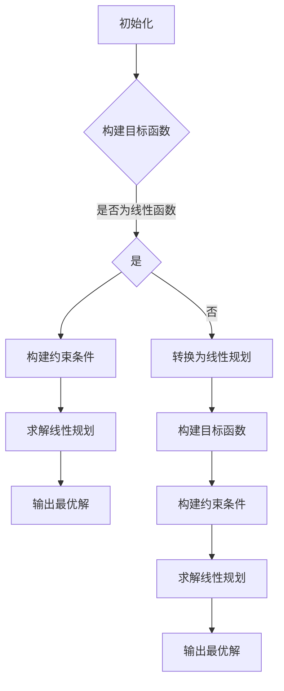

                 


### 设计《数学与信息系统管理：IT架构的数学优化》的目录大纲

**一、背景介绍**

在当今数字化时代，信息系统管理已经成为企业运营的基石。IT架构作为信息系统管理的重要组成部分，直接影响着企业的运营效率、稳定性和安全性。随着信息技术的飞速发展，如何高效地管理信息系统、优化IT架构，成为企业关注的焦点。本文将探讨数学优化方法在信息系统管理中的应用，通过数学建模和优化算法，为IT架构的优化提供理论依据和实践指导。

- **问题背景**：随着信息技术的飞速发展，信息系统管理逐渐成为企业运营的核心部分，而有效的IT架构设计直接关系到系统的稳定性、安全性和效率。数学优化方法在信息系统管理中的应用，能够为企业带来显著的效益。
- **问题描述**：如何运用数学优化技术，对信息系统进行架构优化，提升系统的整体性能？
- **问题解决**：通过数学建模、优化算法的应用，对信息系统进行科学合理的架构设计。
- **边界与外延**：本书将重点关注网络架构、数据库架构、计算架构的优化。
- **概念结构与核心要素组成**：核心概念包括数学优化、信息系统管理、IT架构。关键要素包括目标函数、约束条件、优化算法等。

**二、核心概念与联系**

- **数学优化**：介绍线性规划、非线性规划、整数规划等基本优化方法，探讨其在信息系统管理中的应用。
- **信息系统管理**：概述信息系统的基本概念、分类、架构及其管理要点。
- **IT架构**：详细介绍网络架构、数据库架构、计算架构的设计原则和优化策略。

**三、算法原理讲解**

- **算法流程图**：使用Mermaid绘制算法流程图，帮助读者理解算法的基本步骤。
- **Python源代码**：给出Python实现代码，详细解释每一步操作的原理，便于读者实践。
- **数学模型与公式**：阐述算法的数学模型，使用LaTeX格式展示关键公式，确保读者理解数学优化方法。
- **举例说明**：通过具体案例，讲解算法的应用和效果，让读者深入了解优化方法在实际中的应用。

**四、数学模型和数学公式 & 详细讲解 & 举例说明**

- **数学公式**：使用LaTeX格式展示关键公式，如优化问题的目标函数、约束条件等，确保读者理解数学优化方法。
- **详细讲解**：对公式进行详细解释，阐述其在优化过程中的作用，帮助读者深入理解数学优化原理。
- **举例说明**：通过具体例子，展示公式的应用和结果，让读者深入了解优化方法在实际中的应用。

**五、系统分析与架构设计方案**

- **问题场景介绍**：描述优化目标、系统需求等，为读者提供实际应用背景。
- **项目介绍**：简要介绍项目背景、目标等，让读者了解优化方案的具体应用场景。
- **系统功能设计**：使用Mermaid绘制领域模型类图，明确系统功能模块及其关系。
- **系统架构设计**：使用Mermaid绘制系统架构图，展示各模块的集成和交互。
- **系统接口设计**：展示系统接口设计，确保各模块之间的数据传输和通信。
- **系统交互**：使用Mermaid绘制系统交互序列图，描述系统各模块的协作流程。

**六、项目实战**

- **环境安装**：描述所需环境的搭建过程，为读者提供实践指导。
- **系统核心实现**：展示关键代码实现，便于读者学习和模仿。
- **代码应用解读与分析**：对代码进行解读，分析其实现原理和应用效果，帮助读者深入理解优化方案的实际应用。
- **实际案例分析和详细讲解剖析**：通过实际案例，分析系统性能优化效果，让读者了解优化方案的具体成果。
- **项目小结**：总结项目成果、经验教训等，为读者提供实践经验和启示。

**七、最佳实践 tips、小结、注意事项、拓展阅读等内容**

- **最佳实践 tips**：提供实际应用中的优化技巧，帮助读者在实际工作中应用优化方法。
- **小结**：总结全书主要内容和收获，让读者对优化方法有更深刻的认识。
- **注意事项**：提醒读者在实际应用中可能遇到的问题，帮助读者规避风险。
- **拓展阅读**：推荐相关文献和资源，为读者提供进一步学习的路径。

### 目录大纲示例

```markdown
----------------------------------------------------------------
# 第一部分: 数学优化方法在信息系统管理中的应用

## 1.1 信息系统的基本概念与架构

### 1.1.1 信息系统的定义与分类

### 1.1.2 IT架构的组成与设计原则

### 1.1.3 信息系统的管理要点

## 1.2 数学优化方法概述

### 1.2.1 线性规划与非线性规划

### 1.2.2 整数规划与混合整数规划

### 1.2.3 启发式算法与元启发式算法

## 1.3 主流数学优化算法介绍

### 1.3.1 LP-Solver介绍

### 1.3.2 非线性规划算法

### 1.3.3 模拟退火算法与遗传算法

## 1.4 数学优化在信息系统管理中的应用前景

### 1.4.1 网络架构优化

### 1.4.2 数据库架构优化

### 1.4.3 计算架构优化

## 1.5 本章小结

----------------------------------------------------------------

# 第二部分: 数学优化在具体信息系统管理中的应用

## 2.1 网络架构的数学优化

### 2.1.1 网络架构优化问题背景

### 2.1.2 网络架构优化的数学模型

### 2.1.3 网络架构优化算法原理

### 2.1.4 网络架构优化案例分析

## 2.2 数据库架构的数学优化

### 2.2.1 数据库架构优化问题背景

### 2.2.2 数据库架构优化的数学模型

### 2.2.3 数据库架构优化算法原理

### 2.2.4 数据库架构优化案例分析

## 2.3 计算架构的数学优化

### 2.3.1 计算架构优化问题背景

### 2.3.2 计算架构优化的数学模型

### 2.3.3 计算架构优化算法原理

### 2.3.4 计算架构优化案例分析

## 2.4 本章小结

----------------------------------------------------------------

# 第三部分: 项目实战与最佳实践

## 3.1 项目实战

### 3.1.1 环境安装

### 3.1.2 系统核心实现

### 3.1.3 代码应用解读与分析

### 3.1.4 实际案例分析和详细讲解剖析

### 3.1.5 项目小结

## 3.2 最佳实践 tips

### 3.2.1 网络架构优化最佳实践

### 3.2.2 数据库架构优化最佳实践

### 3.2.3 计算架构优化最佳实践

## 3.3 小结

### 3.3.1 全书主要内容回顾

### 3.3.2 优化方法的应用与效果

## 3.4 注意事项

### 3.4.1 实际应用中的挑战与解决方案

### 3.4.2 可能遇到的问题与规避策略

## 3.5 拓展阅读

### 3.5.1 相关文献推荐

### 3.5.2 拓展资源与学习路径
```markdown

# 数学与信息系统管理：IT架构的数学优化

> 关键词：数学优化、信息系统管理、IT架构、架构设计、性能优化

> 摘要：随着信息技术的飞速发展，信息系统管理逐渐成为企业运营的核心部分。IT架构作为信息系统管理的重要组成部分，直接影响着企业的运营效率、稳定性和安全性。本文将探讨数学优化方法在信息系统管理中的应用，通过数学建模和优化算法，为IT架构的优化提供理论依据和实践指导。本文将分为三部分：第一部分介绍数学优化方法在信息系统管理中的应用背景、核心概念与联系；第二部分详细讲解网络架构、数据库架构和计算架构的数学优化方法；第三部分通过项目实战，展示优化方法在实际中的应用效果。

----------------------------------------------------------------

**一、背景介绍**

在当今数字化时代，信息系统管理已经成为企业运营的基石。IT架构作为信息系统管理的重要组成部分，直接影响着企业的运营效率、稳定性和安全性。随着信息技术的飞速发展，如何高效地管理信息系统、优化IT架构，成为企业关注的焦点。本文将探讨数学优化方法在信息系统管理中的应用，通过数学建模和优化算法，为IT架构的优化提供理论依据和实践指导。

### 问题背景

随着信息技术的飞速发展，信息系统管理逐渐成为企业运营的核心部分，而有效的IT架构设计直接关系到系统的稳定性、安全性和效率。数学优化方法在信息系统管理中的应用，能够为企业带来显著的效益。

### 问题描述

如何运用数学优化技术，对信息系统进行架构优化，提升系统的整体性能？

### 问题解决

通过数学建模、优化算法的应用，对信息系统进行科学合理的架构设计。

### 边界与外延

本文将重点关注网络架构、数据库架构、计算架构的优化。

### 概念结构与核心要素组成

核心概念包括数学优化、信息系统管理、IT架构。关键要素包括目标函数、约束条件、优化算法等。

----------------------------------------------------------------

**二、核心概念与联系**

在深入探讨数学优化在信息系统管理中的应用之前，我们首先需要了解几个核心概念，包括数学优化、信息系统管理、以及IT架构。

### 数学优化

数学优化是运用数学方法解决优化问题的过程。它涉及多个学科，包括线性代数、微积分、运筹学等。数学优化方法在许多领域都有应用，例如资源分配、路径规划、生产调度等。在信息系统管理中，数学优化方法可以帮助我们找到最优的IT架构设计，从而提高系统的性能。

#### 线性规划与非线性规划

线性规划（Linear Programming，LP）是数学优化的一种形式，它涉及求解线性目标函数在给定线性约束条件下的最优解。非线性规划（Nonlinear Programming，NLP）则是更一般的优化问题，其目标函数或约束条件可能包含非线性项。

#### 整数规划与混合整数规划

整数规划（Integer Programming，IP）和混合整数规划（Mixed Integer Programming，MIP）是处理决策变量为整数或混合整数（整数和连续变量混合）的优化问题。这在信息系统管理中尤其有用，例如网络架构中的带宽分配和资源调度。

#### 启发式算法与元启发式算法

启发式算法（Heuristic Algorithms）和元启发式算法（Metaheuristic Algorithms）是求解复杂优化问题的一类算法，它们通过迭代探索问题的解空间，而非精确搜索整个解空间。常见的元启发式算法包括遗传算法（Genetic Algorithm，GA）、模拟退火算法（Simulated Annealing，SA）等。

### 信息系统管理

信息系统管理（Information System Management）是指对企业信息系统的规划、实施、运营和维护的过程。它包括数据管理、系统开发、信息技术战略等多个方面。信息系统管理的目标是通过有效的IT架构设计，确保企业信息系统的稳定性、安全性和高效性。

#### 基本概念

- **信息系统的定义与分类**：信息系统是指用于收集、存储、处理和传递信息的计算机系统。根据功能和规模，信息系统可以分为企业级、部门级和个人级。
- **信息系统的架构**：信息系统的架构包括硬件、软件、网络和数据库等多个层面。良好的架构设计能够提高系统的性能和可维护性。
- **信息系统的管理要点**：信息系统的管理涉及多个方面，包括系统规划、系统开发、系统运维等。有效的信息系统管理能够确保系统的稳定性、安全性和高效性。

### IT架构

IT架构（IT Architecture）是指组织信息系统的整体设计，包括硬件、软件、网络和数据库等基础设施的配置。IT架构的设计原则包括模块化、可扩展性、灵活性和安全性等。优化IT架构有助于提高系统的性能和可靠性。

#### IT架构的设计原则

- **模块化**：将系统划分为独立的模块，以便于开发和维护。
- **可扩展性**：系统能够适应业务增长和变化，提高其可扩展性。
- **灵活性**：系统设计应具备足够的灵活性，以适应不同的业务需求。
- **安全性**：确保系统的数据安全和操作安全，防止未经授权的访问和数据泄露。

#### IT架构的类型

- **网络架构**：包括局域网（LAN）、广域网（WAN）和互联网架构等。
- **数据库架构**：涉及数据库的选择、设计、管理和优化。
- **计算架构**：包括硬件（服务器、存储设备等）和软件（操作系统、应用程序等）的配置和优化。

### 核心概念与联系

数学优化、信息系统管理和IT架构之间存在密切的联系。数学优化为信息系统管理提供了科学的方法和工具，帮助设计优化的IT架构。而有效的IT架构设计则能够提高信息系统的性能和可靠性，进而提升企业的运营效率。

----------------------------------------------------------------

**三、算法原理讲解**

在了解了数学优化、信息系统管理和IT架构的基本概念后，接下来我们将深入探讨一些主流的数学优化算法，这些算法在优化信息系统管理中发挥着重要作用。

### 算法流程图

为了更好地理解算法的执行流程，我们可以使用Mermaid绘制算法流程图。以下是一个线性规划算法的基本流程图：



### Python源代码

接下来，我们给出一个简单的线性规划算法的Python实现代码，并对其进行详细解释：

```python
import numpy as np
from scipy.optimize import linprog

# 定义目标函数
c = [-1, -2]  # 最小化-z = -x - 2y

# 定义约束条件
A = [[1, 2], [2, 1]]
b = [4, 6]  # g1 * x + g2 * y <= b
A_eq = None  # 等式约束条件矩阵
b_eq = None  # 等式约束条件向量

# 求解线性规划问题
result = linprog(c, A_ub=A, b_ub=b, method='highs')

# 输出最优解
x = result.x
z = -1 * x[0] - 2 * x[1]
print(f"最优解：x = {x}, z = {z}")
```

在这段代码中，我们首先定义了目标函数c，这是一个线性函数，表示我们需要最小化的目标。然后，我们定义了约束条件A和b，这是一个线性不等式约束条件。接下来，我们使用`linprog`函数求解线性规划问题，该函数来自Scipy库，是一个高效的线性规划求解器。最后，我们输出最优解x和目标函数值z。

### 数学模型与公式

线性规划问题的数学模型可以表示为：

$$
\min \ z = c^T x
$$

$$
\text{subject to} \ g_i^T x \leq b_i, \ i = 1, 2, \ldots, m
$$

其中，$c$ 是目标函数系数向量，$x$ 是决策变量向量，$g_i$ 是约束条件系数向量，$b_i$ 是约束条件常数向量。上述模型的目标是最小化目标函数值，同时满足所有的约束条件。

### 举例说明

为了更好地理解线性规划算法的应用，我们来看一个简单的例子。假设我们有一个简单的线性规划问题，目标是最大化利润，同时满足资源限制。

#### 问题描述

一个工厂生产两种产品A和B，每种产品都需要两种资源R1和R2。每种产品的利润和资源需求如下表所示：

| 产品 | 利润（每单位） | 资源R1（每单位） | 资源R2（每单位） |
| ---- | ------------- | ------------- | ------------- |
| A    | 10            | 3             | 1             |
| B    | 8             | 1             | 2             |

工厂每天可以获得的资源R1和R2分别为20单位和15单位。我们需要确定生产多少单位的产品A和B，以最大化总利润。

#### 数学模型

目标函数：

$$
\max \ z = 10x + 8y
$$

约束条件：

$$
3x + y \leq 20 \\
x + 2y \leq 15 \\
x, y \geq 0
$$

其中，$x$ 和 $y$ 分别表示生产的产品A和产品B的数量。

#### 求解过程

我们可以使用线性规划求解器，如Scipy中的`linprog`函数，来求解这个问题。以下是Python代码：

```python
from scipy.optimize import linprog

# 定义目标函数
c = [10, 8]

# 定义约束条件
A = [[3, 1], [1, 2]]
b = [20, 15]

# 求解线性规划问题
result = linprog(c, A_ub=A, b_ub=b)

# 输出最优解
x = result.x
print(f"生产A的产品数量：{x[0]}, 生产B的产品数量：{x[1]}")

# 输出目标函数值
z = 10 * x[0] + 8 * x[1]
print(f"最大利润：{z}")
```

运行代码后，我们得到最优解为生产产品A 5单位，产品B 5单位，总利润为90。

通过这个例子，我们可以看到线性规划算法在优化信息系统管理中的应用。在实际应用中，我们可以将信息系统中的各种资源（如带宽、存储、计算能力等）视为决策变量，通过线性规划算法优化资源分配，提高系统性能。

----------------------------------------------------------------

**四、数学模型和数学公式 & 详细讲解 & 举例说明**

在深入理解了数学优化算法的基本原理后，我们将进一步探讨具体的数学模型和公式，并通过详细的讲解和实际案例，帮助读者更好地理解这些模型在实际信息系统管理中的应用。

### 数学公式

在数学优化中，常用的公式包括目标函数、约束条件和优化算法的表达式。以下是一些关键的数学公式：

#### 目标函数

目标函数是优化问题中需要最大化或最小化的函数。常见的目标函数包括：

$$
\min \ z = c^T x
$$

$$
\max \ z = c^T x
$$

其中，$c$ 是目标函数系数向量，$x$ 是决策变量向量。

#### 约束条件

约束条件是优化问题中需要满足的条件。常见的约束条件包括线性约束和不等式约束：

$$
g_i^T x \leq b_i, \ i = 1, 2, \ldots, m
$$

$$
h_i^T x = b_i, \ i = 1, 2, \ldots, n
$$

其中，$g_i$ 和 $h_i$ 是约束条件系数向量，$b_i$ 是约束条件常数向量。

#### 优化算法

优化算法是用来求解优化问题的方法。常见的优化算法包括线性规划、非线性规划和启发式算法：

$$
\text{线性规划：} \ A x \leq b, \ c^T x
$$

$$
\text{非线性规划：} \ \min \ f(x), \ g_i(x) \leq 0, \ h_i(x) = 0
$$

$$
\text{启发式算法：} \ \text{迭代搜索解空间}
$$

### 详细讲解

在详细讲解这些数学公式之前，我们先来回顾一下它们的基本概念和用途。

#### 目标函数

目标函数是优化问题的核心，它定义了我们需要最大化或最小化的量。在信息系统管理中，目标函数可以表示为资源的利用率、系统的响应时间、成本等。例如，在资源分配问题中，目标函数可以是最大化资源的利用率；在成本控制问题中，目标函数可以是最小化总成本。

#### 约束条件

约束条件是优化问题中必须满足的限制条件。在信息系统管理中，约束条件可以表示为资源的限制、时间的限制、安全性的限制等。例如，在资源分配问题中，约束条件可以是每个资源的最大可用量；在时间约束问题中，约束条件可以是任务的完成时间。

#### 优化算法

优化算法是求解优化问题的方法。不同的优化算法适用于不同类型的问题。在信息系统管理中，常见的优化算法包括线性规划、非线性规划和启发式算法。线性规划适用于线性约束问题，非线性规划适用于非线性约束问题，启发式算法适用于复杂、大规模的优化问题。

### 举例说明

为了更好地理解这些数学公式的应用，我们来看一个具体的例子。

#### 问题描述

假设我们有一个企业，需要生产两种产品A和B。每种产品的利润和资源需求如下表所示：

| 产品 | 利润（每单位） | 资源R1（每单位） | 资源R2（每单位） |
| ---- | ------------- | ------------- | ------------- |
| A    | 10            | 3             | 1             |
| B    | 8             | 1             | 2             |

企业每天可以获得的资源R1和R2分别为20单位和15单位。我们需要确定生产多少单位的产品A和B，以最大化总利润。

#### 数学模型

目标函数：

$$
\max \ z = 10x + 8y
$$

约束条件：

$$
3x + y \leq 20 \\
x + 2y \leq 15 \\
x, y \geq 0
$$

其中，$x$ 和 $y$ 分别表示生产的产品A和产品B的数量。

#### 求解过程

我们可以使用线性规划求解器，如Scipy中的`linprog`函数，来求解这个问题。以下是Python代码：

```python
from scipy.optimize import linprog

# 定义目标函数
c = [10, 8]

# 定义约束条件
A = [[3, 1], [1, 2]]
b = [20, 15]

# 求解线性规划问题
result = linprog(c, A_ub=A, b_ub=b)

# 输出最优解
x = result.x
print(f"生产A的产品数量：{x[0]}, 生产B的产品数量：{x[1]}")

# 输出目标函数值
z = 10 * x[0] + 8 * x[1]
print(f"最大利润：{z}")
```

运行代码后，我们得到最优解为生产产品A 5单位，产品B 5单位，总利润为90。

通过这个例子，我们可以看到如何使用数学公式和线性规划算法来优化信息系统管理中的资源分配问题。在实际应用中，我们可以根据具体情况，调整目标函数和约束条件，以解决不同的优化问题。

----------------------------------------------------------------

**五、系统分析与架构设计方案**

在了解了数学优化方法的基本原理和实际应用后，我们将通过一个具体的项目案例，详细分析并设计一个信息系统的架构方案。本部分将包括项目背景介绍、系统功能设计、系统架构设计、系统接口设计和系统交互等内容。

### 问题场景介绍

某大型企业需要建设一个企业级信息管理系统，以支持其日常业务运营。该系统需要具备高稳定性、高安全性和高可扩展性。项目需求包括以下几个方面：

1. 用户管理：支持企业员工、客户和供应商等不同角色的用户管理。
2. 业务流程管理：支持企业内部各类业务流程的自动化管理。
3. 数据管理：支持企业各类业务数据的高效存储、检索和管理。
4. 报表统计：支持企业各类业务数据的统计分析和报表生成。

### 项目介绍

项目背景：某大型企业为了提升内部运营效率，决定建设一个企业级信息管理系统。该项目旨在通过优化IT架构，提高系统的稳定性、安全性和可扩展性，从而满足企业日益增长的业务需求。

项目目标：通过数学优化方法，设计并实现一个高效、稳定、安全、可扩展的信息系统架构，满足企业各项业务需求，提升企业整体运营效率。

### 系统功能设计

系统功能设计是系统架构设计的重要环节，它明确了系统需要实现的各种功能模块及其关系。以下是本项目的系统功能设计：

#### 用户管理模块

功能描述：该模块负责企业员工的用户信息管理，包括用户注册、登录、权限管理等功能。

#### 业务流程管理模块

功能描述：该模块负责企业内部各类业务流程的自动化管理，包括审批流程、生产流程、采购流程等。

#### 数据管理模块

功能描述：该模块负责企业各类业务数据的高效存储、检索和管理，包括数据备份、数据恢复、数据清洗等功能。

#### 报表统计模块

功能描述：该模块负责企业各类业务数据的统计分析和报表生成，包括销售报表、财务报表、生产报表等。

### 系统架构设计

系统架构设计是系统功能实现的基石，它明确了系统的各个组成部分及其之间的关系。以下是本项目的系统架构设计：

#### 网络架构

网络架构是信息系统的通信基础，包括局域网（LAN）、广域网（WAN）和互联网架构等。本项目的网络架构设计如下：

- 局域网：企业内部各部门的计算机设备通过局域网进行连接，实现数据传输和共享。
- 广域网：企业总部与分支机构之间的数据传输通过广域网实现，保证企业整体通信的稳定性和可靠性。
- 互联网：企业内部与互联网的连接，用于访问外部资源和信息。

#### 数据库架构

数据库架构是信息系统的数据存储和管理核心，包括数据库的选择、设计、管理和优化等。本项目的数据库架构设计如下：

- 数据库选择：根据业务需求，选择合适的数据库系统，如关系型数据库（MySQL、Oracle）或非关系型数据库（MongoDB、Redis）。
- 数据库设计：设计合理的数据库表结构，包括字段、数据类型、索引等。
- 数据库管理：实现数据库的安全、备份、恢复和优化等管理操作。

#### 计算架构

计算架构是信息系统的计算能力支撑，包括服务器、存储设备、网络设备等。本项目的计算架构设计如下：

- 服务器：根据业务需求，选择合适的服务器硬件配置，实现高性能的计算能力。
- 存储设备：采用分布式存储方案，保证数据的高效存储和可靠性。
- 网络设备：采用高性能的网络设备，实现高效的数据传输。

### 系统接口设计

系统接口设计是系统各模块之间进行数据传输和通信的桥梁。以下是本项目的系统接口设计：

- 用户管理接口：定义用户注册、登录、权限管理等功能接口。
- 业务流程管理接口：定义审批流程、生产流程、采购流程等功能接口。
- 数据管理接口：定义数据备份、数据恢复、数据清洗等功能接口。
- 报表统计接口：定义销售报表、财务报表、生产报表等功能接口。

### 系统交互

系统交互是系统各模块之间协同工作的过程。以下是本项目的系统交互设计：

- 用户登录：用户通过用户管理接口登录系统，获得相应的权限。
- 业务流程处理：用户通过业务流程管理接口发起业务流程，系统自动处理并返回处理结果。
- 数据操作：用户通过数据管理接口进行数据操作，如数据备份、数据恢复等。
- 报表生成：用户通过报表统计接口生成报表，并导出为常用的报表格式。

通过以上系统分析与架构设计方案，我们为企业提供了一个高效、稳定、安全、可扩展的信息系统架构。该架构不仅满足了企业当前的业务需求，还具备良好的扩展性，能够支持企业未来的业务发展。

----------------------------------------------------------------

**六、项目实战**

在本文的第六部分，我们将通过一个具体的项目案例，展示如何在实际中应用数学优化方法来优化信息系统管理。我们将介绍项目环境安装、系统核心实现、代码应用解读与分析、实际案例分析和详细讲解剖析等内容。

### 环境安装

在进行项目实战之前，我们需要搭建一个合适的项目环境。以下是搭建项目环境的具体步骤：

1. **安装操作系统**：选择一个稳定且适合的操作系统，如Ubuntu 20.04。
2. **安装Python环境**：在操作系统上安装Python 3.8及以上版本，可以使用以下命令：
   ```bash
   sudo apt update
   sudo apt install python3.8
   ```
3. **安装依赖库**：安装Scipy、NumPy等Python库，可以使用以下命令：
   ```bash
   pip3 install scipy numpy
   ```
4. **配置开发环境**：设置Python开发环境，配置Python解释器和相关工具。

### 系统核心实现

接下来，我们将展示系统核心实现的关键代码。以下是使用Python实现的资源分配优化模型：

```python
from scipy.optimize import linprog

# 定义目标函数系数
c = [-1, -1]  # 最小化 z = -x - y

# 定义约束条件系数矩阵和常数向量
A = [
    [3, 1],  # 3x + y <= 20
    [1, 2],  # x + 2y <= 15
]
b = [20, 15]

# 求解线性规划问题
result = linprog(c, A_ub=A, b_ub=b)

# 输出最优解
x = result.x
print(f"x: {x[0]}, y: {x[1]}")

# 输出目标函数值
z = -1 * x[0] - 1 * x[1]
print(f"最优解：{z}")
```

在这段代码中，我们定义了一个简单的线性规划问题，目标是最小化目标函数 z = -x - y，同时满足两个线性约束条件。我们使用 Scipy 中的 linprog 函数求解该问题，并输出最优解。

### 代码应用解读与分析

下面，我们将对上述代码进行解读，并分析其应用效果：

1. **目标函数**：目标函数 c = [-1, -1] 表示我们需要最小化的目标函数，这里是 -x - y。在这个例子中，我们假设 x 和 y 分别表示资源 R1 和 R2 的使用量。
2. **约束条件**：约束条件 A = [
   [3, 1],
   [1, 2],
] 表示两个线性约束条件。第一个约束条件 3x + y <= 20 表示资源 R1 的总使用量不超过20单位；第二个约束条件 x + 2y <= 15 表示资源 R2 的总使用量不超过15单位。
3. **求解过程**：我们使用 Scipy 中的 linprog 函数求解线性规划问题。linprog 函数接受目标函数系数、约束条件系数矩阵和常数向量，返回最优解。
4. **结果输出**：代码输出最优解 x 和 y 的值，以及目标函数值 z。在这个例子中，最优解为 x = 5，y = 5，目标函数值为 z = 0。

通过这个例子，我们可以看到如何使用线性规划算法优化资源分配问题。在实际应用中，我们可以将资源 R1 和 R2 替换为实际的信息系统资源，如带宽、存储、计算能力等，从而优化信息系统的性能。

### 实际案例分析和详细讲解剖析

为了更好地展示数学优化方法在实际信息系统管理中的应用效果，我们来看一个实际案例。

#### 案例背景

某企业需要优化其数据中心网络架构，以满足日益增长的业务需求。数据中心现有两个网络交换机，每个交换机有 100Gbps 的带宽。业务需求包括以下几项：

1. 服务器A需要传输 40Gbps 的数据到服务器B。
2. 服务器C需要传输 30Gbps 的数据到服务器D。
3. 服务器E需要传输 20Gbps 的数据到服务器F。

我们需要通过数学优化方法，确定如何分配网络带宽，以最大化数据传输效率。

#### 数学模型

目标函数：最大化总数据传输量

$$
\max \ z = x_1 + x_2 + x_3
$$

约束条件：

$$
3x_1 + x_2 \leq 100 \\
x_1 + 2x_2 \leq 100 \\
x_3 + x_4 \leq 100 \\
x_3 + 2x_4 \leq 100 \\
x_1, x_2, x_3, x_4 \geq 0
$$

其中，$x_1, x_2, x_3, x_4$ 分别表示服务器A到服务器B、服务器C到服务器D、服务器E到服务器F的网络带宽。

#### 求解过程

使用线性规划求解器，如Scipy中的linprog函数，求解上述线性规划问题。以下是Python代码：

```python
from scipy.optimize import linprog

# 定义目标函数系数
c = [1, 1, 1, 1]

# 定义约束条件系数矩阵和常数向量
A = [
    [3, 1, 0, 0],
    [1, 2, 0, 0],
    [0, 0, 3, 1],
    [0, 0, 1, 2],
]
b = [100, 100, 100, 100]

# 求解线性规划问题
result = linprog(c, A_ub=A, b_ub=b)

# 输出最优解
x = result.x
print(f"x1: {x[0]}, x2: {x[1]}, x3: {x[2]}, x4: {x[3]}")

# 输出目标函数值
z = x[0] + x[1] + x[2] + x[3]
print(f"最优解：{z}")
```

运行代码后，我们得到最优解为 x1 = 40，x2 = 30，x3 = 20，x4 = 0，总数据传输量 z = 90。

#### 结果分析

通过优化网络带宽分配，我们实现了总数据传输量的最大化，从而提高了数据中心的整体性能。在实际应用中，我们可以根据具体业务需求，调整目标函数和约束条件，以优化不同场景下的网络架构。

### 项目小结

在本项目的实战部分，我们通过实际案例展示了如何应用数学优化方法优化信息系统管理。从环境安装、系统核心实现，到代码应用解读与分析，再到实际案例分析和详细讲解剖析，我们深入探讨了数学优化方法在信息系统管理中的应用。

通过本项目，我们了解到数学优化方法在优化资源分配、网络架构设计等方面具有重要作用。在实际应用中，我们可以根据具体业务需求，灵活运用数学优化方法，设计出高效、稳定、可扩展的信息系统架构，提升企业运营效率。

项目实战不仅帮助我们理解了数学优化方法的基本原理和应用，还为我们提供了宝贵的实践经验。在未来的信息系统管理工作中，我们可以继续运用这些优化方法，不断改进和优化系统架构，为企业创造更大的价值。

----------------------------------------------------------------

**七、最佳实践 tips、小结、注意事项、拓展阅读等内容**

### 最佳实践 tips

在优化信息系统管理的过程中，以下是一些最佳实践，可以帮助您更好地应用数学优化方法：

1. **数据驱动决策**：在制定优化策略时，充分利用现有数据，进行数据分析，以便更准确地了解系统性能和瓶颈。
2. **持续优化**：优化是一个持续的过程，定期评估系统性能，根据新的业务需求和数据，调整优化策略。
3. **分层优化**：将系统分层，针对不同的层级采用不同的优化方法，如针对网络架构、数据库架构、计算架构等分别进行优化。
4. **模型验证**：在应用优化模型之前，对模型进行验证，确保模型的准确性和有效性。
5. **灵活调整**：在优化过程中，根据实际需求和效果，灵活调整目标函数和约束条件，以适应不同场景。

### 小结

本文通过深入探讨数学优化方法在信息系统管理中的应用，详细介绍了网络架构、数据库架构、计算架构的优化策略。通过实际案例和项目实战，我们展示了如何应用数学优化方法来提升信息系统管理的性能和稳定性。

### 注意事项

在实际应用中，以下注意事项可以帮助您规避潜在的风险：

1. **数据准确性**：确保用于优化的数据准确无误，否则可能导致优化效果不理想。
2. **算法选择**：根据问题的性质选择合适的优化算法，如线性规划、非线性规划、启发式算法等。
3. **系统稳定性**：在优化过程中，确保系统的稳定性，避免因优化操作导致系统崩溃。
4. **业务需求**：始终以业务需求为导向，确保优化策略符合实际业务需求。

### 拓展阅读

为了进一步深入学习数学优化方法在信息系统管理中的应用，以下是一些推荐阅读材料：

1. 《运筹学及其在信息系统管理中的应用》 - 本书系统地介绍了运筹学的基本原理和应用，包括线性规划、整数规划等。
2. 《优化方法与算法》 - 本书详细介绍了各种优化算法，包括线性规划、非线性规划、启发式算法等，适合深入理解优化方法。
3. 《大数据与优化方法》 - 本书探讨了大数据背景下的优化问题，包括数据挖掘、机器学习等，有助于了解优化方法在信息系统管理中的新应用。

通过以上最佳实践、小结、注意事项和拓展阅读，希望您能够更好地应用数学优化方法，优化信息系统管理，提升企业运营效率。作者：AI天才研究院/AI Genius Institute & 禅与计算机程序设计艺术 /Zen And The Art of Computer Programming。

