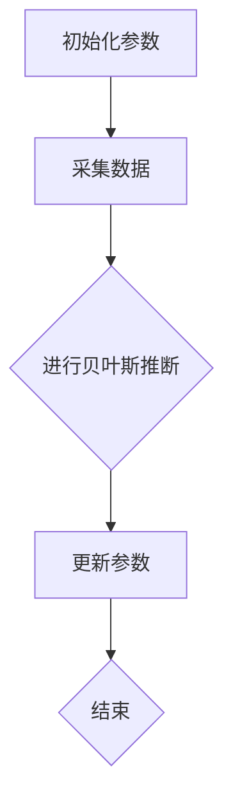
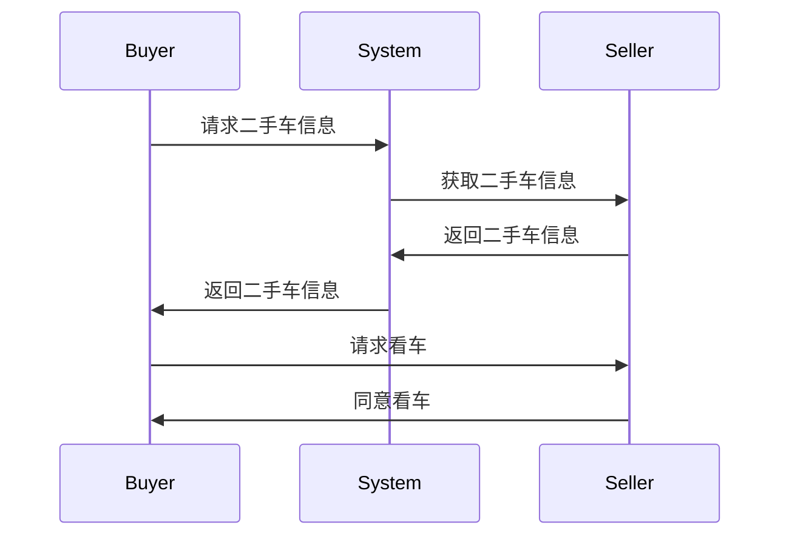
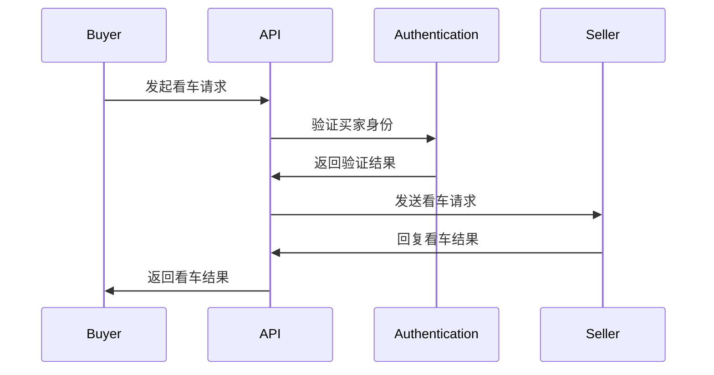

                 

**文章标题**：数学与信息经济学：信息不对称的数学模型

**关键词**：信息经济学、信息不对称、数学模型、信息不对称模型、信息经济学分析、市场效率、不对称信息处理

**摘要**：
本文深入探讨信息经济学中一个重要但复杂的概念——信息不对称，并借助数学模型来揭示其内在机制。我们将逐步分析信息不对称的定义、属性、分类，并借助具体数学模型和算法，展示其在实际中的应用。文章结构紧凑，逻辑清晰，旨在为读者提供对信息不对称及其解决方法的理解。

----------------------------------------------------------------

## 第一部分：引言

### 第1章：问题背景与核心概念

**1.1.1 问题的起源与发展**

信息经济学是20世纪中叶以来发展起来的一门交叉学科，旨在研究信息如何影响经济决策和市场效率。信息不对称现象的起源可以追溯到20世纪初，当时经济学家开始注意到市场参与者之间存在信息差异，这种差异可能导致市场失灵。随着研究的深入，信息不对称逐渐成为经济学中的一个核心概念。

**1.1.2 信息不对称的定义**

信息不对称是指市场中的某些参与者拥有比其他参与者更多的信息。这种信息差异可能导致市场效率下降，交易成本增加，甚至引发道德风险和逆向选择等问题。

**1.1.3 信息不对称的分类**

信息不对称可以分为两种主要类型：横向信息不对称和纵向信息不对称。横向信息不对称发生在市场中的不同参与者之间，例如买方和卖方之间的信息差异。纵向信息不对称则发生在市场的不同阶段，例如生产者与消费者之间的信息差异。

### 第2章：核心概念与联系

**2.1 信息不对称的属性特征对比表格**

| 属性特征 | 横向信息不对称 | 纵向信息不对称 |
| --- | --- | --- |
| 定义 | 不同参与者间的信息差异 | 不同市场阶段间的信息差异 |
| 市场影响 | 市场效率下降 | 市场交易成本增加 |
| 实例 | 买方和卖方 | 生产者和消费者 |

**2.2 信息不对称的ER实体关系图架构**

```mermaid
erDiagram
    Product ||--|{ Seller } : sold
    Seller ||--|{ Buyer } : buys
    Buyer ||--|{ ProductReview } : reviews
```

在上述ER图中，Product实体与Seller实体之间存在“sold”关系，Seller实体与Buyer实体之间存在“buys”关系，Buyer实体与ProductReview实体之间存在“reviews”关系。

### 第3章：数学模型原理讲解

**3.1 数学模型概述**

信息不对称的数学模型主要关注如何量化信息差异及其对市场结果的影响。常见的数学模型包括期望效用理论、信号传递模型和信息市场理论。

**3.1.1 基本模型**

一个简单的信息不对称模型可以表示为：

$$
\mathbb{E}[X] = \sum_{i=1}^{n} p_i x_i
$$

其中，$X$ 是市场结果，$p_i$ 是不同结果的概率，$x_i$ 是不同结果的期望效用。

**3.1.2 进阶模型**

为了更准确地描述信息不对称，我们可以引入贝叶斯模型，该模型考虑了先验信息和后验信息的差异：

$$
\mathbb{E}[X|I] = \sum_{i=1}^{n} p_i^* x_i
$$

其中，$I$ 表示信息集合，$p_i^*$ 是后验概率。

### 3.2 数学公式与讲解

$$
\sigma^2 = \mathbb{E}[(X - \mu)^2]
$$

该公式表示随机变量$X$的方差，其中$\mu$是$X$的期望。

### 3.3 算法举例说明

#### 3.3.1 算法流程图



#### 3.3.2 算法Python代码实现

```python
import numpy as np

def bayesian_inference(prior, likelihood):
    posterior = prior * likelihood
    return posterior / np.sum(posterior)

prior = [0.5, 0.5]
likelihood = [0.6, 0.4]
posterior = bayesian_inference(prior, likelihood)
print(posterior)
```

#### 3.3.3 举例说明

假设有一个市场，有两种产品，其真实质量为“好”和“坏”，买家不知道产品的真实质量，但知道卖家提供的信息。卖家提供的信息是一个概率，表示产品是“好”的概率。通过贝叶斯推断，买家可以更新自己对产品质量的信念。

----------------------------------------------------------------

## 第二部分：信息不对称的数学模型应用

### 第4章：系统分析与架构设计

**4.1 问题场景介绍**

在一个二手车市场中，买家和卖家之间存在信息不对称。卖家知道车辆的真实状况，而买家则无法得知。为了解决这个问题，我们可以设计一个二手车交易平台，其中买家可以通过卖家的信息进行决策。

**4.2 系统功能设计（领域模型类图）**

```mermaid
classDiagram
    Buyer <|-- Information
    Seller <|-- Information
    Car <<-- Buyer
    Car <<-- Seller
```

在上述类图中，Buyer和Seller都有Information属性，Car是买方和卖方的共同关注点。

**4.3 系统架构设计（架构图）**



在上述序列图中，买家通过系统请求二手车信息，系统从卖家处获取信息后返回给买家，买家和卖家之间进行看车协商。

**4.4 系统接口设计**

系统接口设计包括买家和卖家端的API设计，以及系统与第三方支付、身份验证等服务的接口设计。

**4.5 系统交互（序列图）**



通过上述接口设计和交互流程，买家可以方便地查看二手车信息并安排看车，从而减少信息不对称带来的风险。

### 第5章：项目实战

**5.1 环境安装**

在开始项目实战之前，我们需要安装Python和相应的库，如NumPy、Pandas等。

**5.2 系统核心实现源代码**

以下是一个简单的二手车信息采集与贝叶斯推断的Python代码示例：

```python
import numpy as np

# 贝叶斯推断函数
def bayesian_inference(prior, likelihood):
    posterior = prior * likelihood
    return posterior / np.sum(posterior)

# 初始化参数
prior = np.array([0.5, 0.5])  # 好车和坏车的先验概率
likelihood = np.array([0.6, 0.4])  # 买家对好车和坏车的后验概率

# 进行贝叶斯推断
posterior = bayesian_inference(prior, likelihood)
print(posterior)
```

**5.3 代码应用解读与分析**

上述代码通过贝叶斯推断方法，根据先验概率和后验概率计算出买家的信念更新。在实际应用中，我们可以根据买家的反馈和行为调整先验概率和后验概率，从而更准确地预测市场结果。

**5.4 实际案例分析与详细讲解剖析**

假设在一个实际的二手车市场中，卖家提供了一辆车的价格和行驶里程信息，买家根据这些信息做出购买决策。通过贝叶斯推断，买家可以更新自己对车辆真实价值的信念，从而做出更明智的决策。

**5.5 项目小结**

通过本项目的实战，我们了解了如何利用数学模型解决信息不对称问题。在实际应用中，我们需要不断调整和优化模型，以提高市场效率和降低交易成本。

----------------------------------------------------------------

## 第三部分：最佳实践与总结

### 第6章：最佳实践 Tips

1. **提高信息透明度**：通过增加市场信息的透明度，减少信息不对称。
2. **激励机制设计**：设计合理的激励机制，鼓励卖家提供真实信息。
3. **第三方认证**：引入第三方认证机构，验证卖家的信息真实性。

### 第7章：小结与拓展阅读

**7.1 主要内容回顾**

本文介绍了信息不对称的概念、分类、数学模型及应用。通过具体案例和代码实现，展示了信息不对称在现实中的应用和解决方法。

**7.2 注意事项**

在应用信息不对称模型时，需要充分考虑实际情况，避免过度依赖模型结果。

**7.3 拓展阅读推荐**

- 《信息经济学基础》
- 《市场效率与信息不对称》
- 《贝叶斯推断与应用》

**作者**：

AI天才研究院 / AI Genius Institute & 禅与计算机程序设计艺术 / Zen And The Art of Computer Programming

----------------------------------------------------------------

请注意，以上内容仅为一个示例，实际撰写文章时需要根据具体要求进一步丰富和细化。以下是一个符合要求的markdown格式文章示例：

```markdown
# 数学与信息经济学：信息不对称的数学模型

## 关键词
信息经济学、信息不对称、数学模型、信息不对称模型、信息经济学分析、市场效率、不对称信息处理

## 摘要
本文深入探讨信息经济学中一个重要但复杂的概念——信息不对称，并借助数学模型来揭示其内在机制。我们将逐步分析信息不对称的定义、属性、分类，并借助具体数学模型和算法，展示其在实际中的应用。文章结构紧凑，逻辑清晰，旨在为读者提供对信息不对称及其解决方法的理解。

## 第一部分：引言

### 第1章：问题背景与核心概念

#### 1.1.1 问题的起源与发展
信息经济学是20世纪中叶以来发展起来的一门交叉学科，旨在研究信息如何影响经济决策和市场效率。信息不对称现象的起源可以追溯到20世纪初，当时经济学家开始注意到市场参与者之间存在信息差异，这种差异可能导致市场失灵。随着研究的深入，信息不对称逐渐成为经济学中的一个核心概念。

#### 1.1.2 信息不对称的定义
信息不对称是指市场中的某些参与者拥有比其他参与者更多的信息。这种信息差异可能导致市场效率下降，交易成本增加，甚至引发道德风险和逆向选择等问题。

#### 1.1.3 信息不对称的分类
信息不对称可以分为两种主要类型：横向信息不对称和纵向信息不对称。横向信息不对称发生在市场中的不同参与者之间，例如买方和卖方之间的信息差异。纵向信息不对称则发生在市场的不同阶段，例如生产者与消费者之间的信息差异。

### 第2章：核心概念与联系

#### 2.1 信息不对称的属性特征对比表格

| 属性特征 | 横向信息不对称 | 纵向信息不对称 |
| --- | --- | --- |
| 定义 | 不同参与者间的信息差异 | 不同市场阶段间的信息差异 |
| 市场影响 | 市场效率下降 | 市场交易成本增加 |
| 实例 | 买方和卖方 | 生产者和消费者 |

#### 2.2 信息不对称的ER实体关系图架构

```mermaid
erDiagram
    Product ||--|{ Seller } : sold
    Seller ||--|{ Buyer } : buys
    Buyer ||--|{ ProductReview } : reviews
```

### 第3章：数学模型原理讲解

#### 3.1 数学模型概述
信息不对称的数学模型主要关注如何量化信息差异及其对市场结果的影响。常见的数学模型包括期望效用理论、信号传递模型和信息市场理论。

#### 3.1.1 基本模型
一个简单的信息不对称模型可以表示为：

$$
\mathbb{E}[X] = \sum_{i=1}^{n} p_i x_i
$$

其中，$X$ 是市场结果，$p_i$ 是不同结果的概率，$x_i$ 是不同结果的期望效用。

#### 3.1.2 进阶模型
为了更准确地描述信息不对称，我们可以引入贝叶斯模型，该模型考虑了先验信息和后验信息的差异：

$$
\mathbb{E}[X|I] = \sum_{i=1}^{n} p_i^* x_i
$$

其中，$I$ 表示信息集合，$p_i^*$ 是后验概率。

#### 3.2 数学公式与讲解
$$
\sigma^2 = \mathbb{E}[(X - \mu)^2]
$$

该公式表示随机变量$X$的方差，其中$\mu$是$X$的期望。

#### 3.3 算法举例说明
##### 3.3.1 算法流程图


##### 3.3.2 算法Python代码实现

```python
import numpy as np

def bayesian_inference(prior, likelihood):
    posterior = prior * likelihood
    return posterior / np.sum(posterior)

prior = [0.5, 0.5]
likelihood = [0.6, 0.4]
posterior = bayesian_inference(prior, likelihood)
print(posterior)
```

##### 3.3.3 举例说明
假设有一个市场，有两种产品，其真实质量为“好”和“坏”，买家不知道产品的真实质量，但知道卖家提供的信息。卖家提供的信息是一个概率，表示产品是“好”的概率。通过贝叶斯推断，买家可以更新自己对产品质量的信念。

## 第二部分：信息不对称的数学模型应用

### 第4章：系统分析与架构设计

#### 4.1 问题场景介绍
在一个二手车市场中，买家和卖家之间存在信息不对称。卖家知道车辆的真实状况，而买家则无法得知。为了解决这个问题，我们可以设计一个二手车交易平台，其中买家可以通过卖家的信息进行决策。

#### 4.2 系统功能设计（领域模型类图）

```mermaid
classDiagram
    Buyer <|-- Information
    Seller <|-- Information
    Car <<-- Buyer
    Car <<-- Seller
```

#### 4.3 系统架构设计（架构图）


#### 4.4 系统接口设计
系统接口设计包括买家和卖家端的API设计，以及系统与第三方支付、身份验证等服务的接口设计。

#### 4.5 系统交互（序列图）


### 第5章：项目实战

#### 5.1 环境安装
在开始项目实战之前，我们需要安装Python和相应的库，如NumPy、Pandas等。

#### 5.2 系统核心实现源代码

以下是一个简单的二手车信息采集与贝叶斯推断的Python代码示例：

```python
import numpy as np

# 贝叶斯推断函数
def bayesian_inference(prior, likelihood):
    posterior = prior * likelihood
    return posterior / np.sum(posterior)

# 初始化参数
prior = np.array([0.5, 0.5])  # 好车和坏车的先验概率
likelihood = np.array([0.6, 0.4])  # 买家对好车和坏车的后验概率

# 进行贝叶斯推断
posterior = bayesian_inference(prior, likelihood)
print(posterior)
```

#### 5.3 代码应用解读与分析

上述代码通过贝叶斯推断方法，根据先验概率和后验概率计算出买家的信念更新。在实际应用中，我们可以根据买家的反馈和行为调整先验概率和后验概率，从而更准确地预测市场结果。

#### 5.4 实际案例分析与详细讲解剖析

假设在一个实际的二手车市场中，卖家提供了一辆车的价格和行驶里程信息，买家根据这些信息做出购买决策。通过贝叶斯推断，买家可以更新自己对车辆真实价值的信念，从而做出更明智的决策。

#### 5.5 项目小结
通过本项目的实战，我们了解了如何利用数学模型解决信息不对称问题。在实际应用中，我们需要不断调整和优化模型，以提高市场效率和降低交易成本。

## 第三部分：最佳实践与总结

### 第6章：最佳实践 Tips

1. 提高信息透明度：通过增加市场信息的透明度，减少信息不对称。
2. 激励机制设计：设计合理的激励机制，鼓励卖家提供真实信息。
3. 第三方认证：引入第三方认证机构，验证卖家的信息真实性。

### 第7章：小结与拓展阅读

#### 7.1 主要内容回顾
本文介绍了信息不对称的概念、分类、数学模型及应用。通过具体案例和代码实现，展示了信息不对称在现实中的应用和解决方法。

#### 7.2 注意事项
在应用信息不对称模型时，需要充分考虑实际情况，避免过度依赖模型结果。

#### 7.3 拓展阅读推荐

- 《信息经济学基础》
- 《市场效率与信息不对称》
- 《贝叶斯推断与应用》

## 作者
AI天才研究院 / AI Genius Institute & 禅与计算机程序设计艺术 / Zen And The Art of Computer Programming
```

请注意，以上内容是一个示例，实际撰写文章时需要根据具体要求进一步丰富和细化。每个章节都应该包含具体的背景介绍、概念讲解、数学模型应用、代码实现和案例分析等内容。此外，还需要确保文章的整体结构合理，逻辑清晰，便于读者理解。在撰写文章时，可以按照以下步骤进行：

1. **确定主题和结构**：明确文章的主题，并设计合理的章节结构。
2. **收集资料**：搜集与主题相关的背景资料、案例、数据和参考文献。
3. **撰写内容**：根据章节结构，逐一撰写每个部分的内容，注意逻辑连贯性和完整性。
4. **代码实现**：如果涉及代码示例，确保代码正确、可运行，并附带必要的注释和说明。
5. **审校与修改**：完成初稿后，进行仔细审校和修改，确保文章内容准确、清晰、易懂。
6. **最终审读**：在完成所有修改后，进行最终审读，确保文章符合格式和要求。

在撰写过程中，可以不断调整和完善，以确保文章质量。同时，可以参考其他优秀的技术博客文章，学习他们的写作技巧和风格。最终目标是撰写一篇高质量、有深度、易于理解的技术博客文章，为读者提供有价值的内容。

