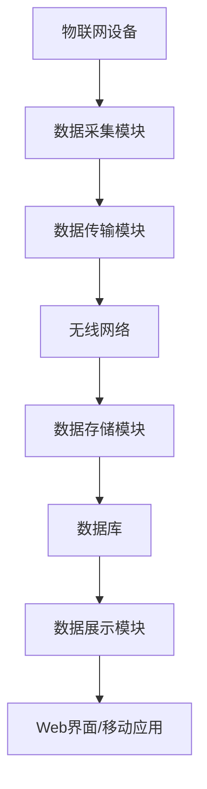

                 

### 《数学与信息论：信息传输的数学模型》

#### 关键词：信息论，数学模型，信息传输，信道模型，香农熵

#### 摘要：

本文深入探讨了数学与信息论在信息传输领域的应用，通过逐步分析信息传输的数学模型，旨在揭示信息传输的基本原理和核心机制。文章首先介绍了信息论的基本概念和发展历程，随后详细讲解了香农信息论的核心公式和数学模型。接着，文章分析了信息传输系统的设计、稳定性和效率，并在通信系统、计算机科学以及生物学和神经科学中展示了信息论的实际应用。最后，文章讨论了信息论的前沿研究和未来发展方向。通过这一系列的分析和讨论，本文为读者提供了一次全面而深入的了解数学与信息论在信息传输领域的重要性的机会。

### 引言：信息论的基本概念与发展历程

#### 1.1 信息论的历史回顾

信息论作为一门独立的学科，起源于20世纪40年代，由美国数学家克劳德·香农（Claude Shannon）奠基。香农在1948年发表了开创性的论文《通信的数学理论》（A Mathematical Theory of Communication），这标志着信息论的正式诞生。在这篇论文中，香农提出了信息熵的概念，并建立了信息传输的基本数学模型。香农的工作不仅为通信系统提供了理论框架，也为计算机科学和信息技术的快速发展奠定了基础。

信息论的发展经历了几个重要阶段。在初期阶段，香农的信息论主要集中在通信领域，特别是无线通信和有线通信中信息传输的效率和可靠性。随后，信息论逐渐渗透到计算机科学、生物学和神经科学等多个领域。现代信息论不仅关注信息传输的过程，还涉及数据压缩、加密、网络协议等多个方面。

#### 1.2 信息论的基本概念

信息论的核心概念包括信息熵、信息传输模型、信道模型、信息容量等。

- **信息熵**：信息熵是衡量信息不确定性的度量。一个随机事件的信息熵越大，说明其不确定性越高。香农定义了熵作为信息量的度量，公式为：\(H(X) = -\sum_{i} p(x_i) \log_2 p(x_i)\)，其中\(X\)是随机变量，\(p(x_i)\)是随机变量取值为\(x_i\)的概率。

- **信息传输模型**：信息传输模型描述了信息从信源发出，经过信道传输，最终被信宿接收的过程。香农的信息传输模型由信源、信道、信宿和编码器、解码器组成。

- **信道模型**：信道模型描述了信息在传输过程中可能受到的噪声和其他干扰。根据信道的特性，信道可以分为无噪声信道和有噪声信道。

- **信息容量**：信息容量是指信道能够传输的最大信息量。对于无噪声信道，信息容量等于信道的带宽；对于有噪声信道，信息容量由香农容量公式给出：\(C = W \log_2(1 + S/N)\)，其中\(C\)是信道容量，\(W\)是信道的带宽，\(S\)是信号功率，\(N\)是噪声功率。

#### 1.3 信息论的重要性

信息论的重要性体现在以下几个方面：

- **通信系统**：信息论为通信系统的设计提供了理论依据，提高了通信系统的效率和可靠性。例如，通过香农的信道编码定理，可以设计出有效的编码方案，降低传输错误率。

- **计算机科学**：信息论在计算机科学中应用广泛，包括数据压缩、加密、网络协议等。信息论原理指导了现代计算机系统的设计和优化。

- **生物学和神经科学**：信息论在生物学和神经科学中的应用正在逐步展开。例如，通过研究神经元之间的信息传递，可以更好地理解大脑的工作原理。

通过介绍信息论的基本概念和发展历程，我们为后续深入探讨信息传输的数学模型奠定了基础。在接下来的章节中，我们将进一步分析信息传输的数学模型，揭示信息传输的核心机制和原理。

### 数学模型：香农信息论的核心公式

#### 2.1 香农熵

香农熵是信息论中最基础且重要的概念之一。它量化了随机变量携带的信息量。香农熵的定义基于概率分布，可以用来衡量系统的不确定性。一个随机事件的信息熵越大，说明其不确定性越高。

香农熵的公式为：

$$
H(X) = -\sum_{i} p(x_i) \log_2 p(x_i)
$$

其中，\(X\)是一个随机变量，\(p(x_i)\)是随机变量取值为\(x_i\)的概率。

- **示例**：假设一个硬币有两面，正面和反面，各以0.5的概率出现。那么这个硬币每次抛掷的结果熵为：

$$
H(X) = -\left(0.5 \log_2 0.5 + 0.5 \log_2 0.5\right) = 1
$$

这个结果意味着每次抛掷硬币，我们获得的关于结果的信息量是1比特。

#### 2.2 香农熵的计算

计算香农熵通常分为以下几个步骤：

1. **确定概率分布**：首先，需要确定随机变量\(X\)的所有可能取值及其对应的概率。

2. **计算对数**：对于每个取值，计算其概率的对数，底数为2（以比特为单位）。

3. **求和**：将所有取值概率的对数相加，并取负值。

4. **结果**：得到的结果即为香农熵。

- **示例**：假设有一个二进制序列，其中0和1各出现的概率为0.3和0.7。计算这个序列的熵：

$$
H(X) = -\left(0.3 \log_2 0.3 + 0.7 \log_2 0.7\right)
$$

通过计算，可以得到香农熵的数值。

#### 2.3 条件熵与联合熵

条件熵和联合熵是信息论中的其他重要概念，它们描述了变量之间的依赖关系。

- **条件熵**：条件熵是已知一个随机变量的条件下，另一个随机变量的不确定性度量。条件熵的公式为：

$$
H(Y|X) = -\sum_{i} p(x_i, y_i) \log_2 p(y_i| x_i)
$$

其中，\(p(y_i| x_i)\)是在给定\(X=x_i\)的条件下\(Y=y_i\)的概率。

- **联合熵**：联合熵是两个随机变量联合分布的熵。公式为：

$$
H(X, Y) = -\sum_{i} \sum_{j} p(x_i, y_j) \log_2 p(x_i, y_j)
$$

通过条件熵和联合熵，我们可以更深入地理解变量之间的关系和不确定性。

#### 2.4 香农信息论的核心公式

香农信息论的核心公式包括信道容量公式和信息传输定理。这些公式提供了关于信息传输效率和可靠性的深刻见解。

- **信道容量公式**：对于有噪声信道，信道容量由以下公式给出：

$$
C = W \log_2(1 + \frac{S}{N})
$$

其中，\(C\)是信道容量，\(W\)是信道的带宽，\(S\)是信号功率，\(N\)是噪声功率。

- **信息传输定理**：香农的信道编码定理指出，只要编码速率低于信道容量，就总能找到一种有效的编码方法，使得在有限长度的传输中，错误概率趋近于零。

$$
R < C
$$

其中，\(R\)是编码速率。

通过这些核心公式，我们可以设计出有效的信息传输系统，提高通信效率和可靠性。

### 信息传输模型

#### 3.1 信息传输的基本概念

信息传输是指将信息从一个地方传递到另一个地方的过程。这个过程中涉及多个基本概念，包括信源、信道、信宿、编码器和解码器。

- **信源**：信源是信息的产生者，可以是人、设备或系统。信源生成的是原始信息，通常以随机变量的形式表示。

- **信道**：信道是信息传输的路径，可以是物理媒介，如电缆、光纤或无线电波，也可以是无线信道。信道的特性会影响信息传输的效率和可靠性。

- **信宿**：信宿是信息的接收者，可以是人、设备或系统。信宿接收到的信息是经过传输后可能发生误差的信息。

- **编码器**：编码器是将原始信息转换成适合信道传输的形式的装置。编码通常是为了提高传输效率和可靠性。

- **解码器**：解码器是将接收到的信息还原为原始信息的装置。解码的目的是减少传输过程中产生的错误。

#### 3.2 信道模型

信道模型描述了信道对信息传输的影响。根据信道的特性，信道模型可以分为无噪声信道和有噪声信道。

- **无噪声信道**：在无噪声信道中，信息传输不受到干扰，传输过程是理想的。香农在研究无噪声信道时提出了信息容量公式。

- **有噪声信道**：在有噪声信道中，信息传输会受到噪声干扰，导致传输误差。香农的信道容量公式描述了在有噪声信道中信道能够传输的最大信息量。

#### 3.3 香农的信息传输模型

香农的信息传输模型是一个经典的数学模型，描述了信息从信源到信宿的传输过程。这个模型由以下几个部分组成：

1. **信源**：信源产生随机变量\(X\)，其概率分布为\(p(x)\)。

2. **编码器**：编码器将随机变量\(X\)转换成码字序列\(X_e\)。编码器的设计目标是使得码字序列在传输过程中具有较高的抗误差能力。

3. **信道**：信道对码字序列进行传输，可能引入噪声和干扰。假设信道的输出为\(Y\)，其概率分布为\(p(y|x)\)。

4. **解码器**：解码器根据信道输出的码字序列\(Y\)，尝试恢复原始信息\(X\)。解码器的设计目标是使得恢复的原始信息与原始信息尽可能接近。

5. **信宿**：信宿接收解码器恢复的原始信息\(X'\)。

香农信息传输模型的核心思想是，通过有效的编码和信道设计，可以提高信息传输的效率和可靠性。香农的信道编码定理和香农容量公式是这个模型的重要组成部分。

### 信息传输误差分析

#### 4.1 误差概率

在信息传输过程中，由于信道噪声和其他干扰，接收到的信息可能会与原始信息产生误差。误差概率是指接收到的信息与原始信息不一致的概率。

误差概率可以分为以下几种类型：

1. **单比特错误概率**：单个比特在传输过程中发生错误的概率。通常表示为\(p_e\)。

2. **累积错误概率**：多个比特在传输过程中发生错误的累积概率。累积错误概率可以通过概率乘法规则计算。

3. **平均错误概率**：在整个传输过程中，平均每个比特发生错误的概率。平均错误概率可以通过概率加法规则计算。

#### 4.2 误差概率的数学分析

误差概率的数学分析涉及概率论和统计理论。以下是一些关键的数学分析工具：

1. **大数定律**：大数定律指出，当试验次数趋近于无穷大时，频率分布会趋近于概率分布。这一性质可以帮助我们理解误差概率在大量数据中的表现。

2. **中心极限定理**：中心极限定理指出，当多个独立的随机变量相加时，其和的分布趋近于正态分布。这一性质可以用来近似误差概率的分布。

3. **贝叶斯定理**：贝叶斯定理是概率论中的一个重要工具，用于在给定某些条件下，计算一个事件发生的概率。贝叶斯定理可以用于解码过程中的错误概率计算。

#### 4.3 误差概率的降低方法

为了降低信息传输中的误差概率，可以采取以下几种方法：

1. **错误纠正码**：通过添加额外的冗余信息，可以设计出能够检测和纠正错误的编码方案。常见的错误纠正码包括汉明码、卷积码和Turbo码等。

2. **调制和解调技术**：在无线通信中，通过采用不同的调制和解调技术，可以提高信号的传输效率和抗噪声能力。常见的调制技术包括幅移键控（ASK）、频移键控（FSK）和相移键控（PSK）等。

3. **信号放大和滤波**：在信号传输过程中，通过放大和滤波可以减少噪声的影响，提高信号的清晰度和抗干扰能力。

4. **信道编码**：通过信道编码技术，可以增加信号的冗余度，从而提高传输的可靠性。信道编码技术包括前向误差校正（FEC）和后向错误校正（REDC）等。

### 信息传输效率分析

#### 5.1 传输效率的定义

传输效率是指信息传输过程中，有效传输的信息量与总传输信息量之比。传输效率可以用以下公式表示：

$$
\text{传输效率} = \frac{\text{有效传输的信息量}}{\text{总传输信息量}} \times 100\%
$$

#### 5.2 信息传输效率的计算

信息传输效率的计算需要考虑多个因素，包括信道带宽、信号功率、噪声功率和编码方案等。

1. **信道带宽**：信道带宽决定了单位时间内可以传输的最大信息量。信道带宽越大，传输效率越高。

2. **信号功率与噪声功率**：信号功率和噪声功率的比例决定了信道的信噪比（SNR）。高信噪比可以提高传输效率。

3. **编码方案**：不同的编码方案会影响传输效率。例如，前向纠错（FEC）编码可以提高传输的可靠性，从而提高传输效率。

#### 5.3 提高信息传输效率的方法

为了提高信息传输效率，可以采取以下几种方法：

1. **增加信道带宽**：通过升级通信设备或采用更先进的通信技术，可以增加信道带宽，从而提高传输效率。

2. **提高信噪比**：通过提高信号功率或降低噪声水平，可以增加信噪比，从而提高传输效率。

3. **优化编码方案**：采用高效的编码方案，如Turbo码、LDPC码等，可以提高传输效率。

4. **多路复用技术**：通过多路复用技术，如频分复用（FDM）、时分复用（TDM）和码分复用（CDM）等，可以在同一信道上传输多个信号，从而提高传输效率。

### 信息传输系统的设计与优化

#### 6.1 系统设计原则

信息传输系统的设计需要遵循以下原则：

1. **可靠性**：系统应具有高度的可靠性，确保信息传输过程中不丢失或误传。

2. **效率**：系统应能够高效地传输信息，提高传输速度和带宽利用率。

3. **可扩展性**：系统应具有较好的可扩展性，能够适应未来技术的发展和需求变化。

4. **安全性**：系统应具备良好的安全性，防止信息被未授权访问或篡改。

#### 6.2 系统优化方法

为了提高信息传输系统的性能，可以采用以下优化方法：

1. **信道分配策略**：通过合理的信道分配策略，如动态频谱分配和自适应调制技术，可以提高信道的利用率。

2. **编码技术**：采用高效的编码技术，如错误纠正码和数据压缩算法，可以提高传输的可靠性和效率。

3. **网络拓扑优化**：优化网络拓扑结构，如采用星型、环型和网状结构，可以提高网络的稳定性和传输效率。

4. **网络监控与维护**：通过实时监控和定期维护，及时发现和解决网络故障，确保系统的高效运行。

5. **负载均衡**：通过负载均衡技术，合理分配网络负载，避免单点过载，提高系统的整体性能。

### 信息传输系统的稳定性

#### 7.1 稳定性的基本概念

信息传输系统的稳定性是指系统在面临外部干扰和内部变化时，能够保持正常运作的能力。稳定性对于信息传输系统的可靠性至关重要。

稳定性可以分为以下几种类型：

1. **动态稳定性**：系统在受到外部扰动后，能够逐渐恢复到稳态的能力。

2. **静态稳定性**：系统在没有任何外部扰动的情况下，能够保持当前状态的能力。

3. **稳定性分析**：通过数学模型和分析工具，评估系统的稳定性。

#### 7.2 稳定性分析

稳定性分析通常涉及以下步骤：

1. **建立数学模型**：根据系统的结构和特性，建立数学模型，描述系统的动态行为。

2. **稳定性条件**：根据数学模型，分析系统的稳定性条件，确定系统在何种条件下能够保持稳定。

3. **仿真验证**：通过仿真工具，对系统的稳定性进行验证，确认分析结果的准确性。

#### 7.3 稳定性的提升方法

为了提高信息传输系统的稳定性，可以采用以下方法：

1. **冗余设计**：通过增加冗余部件，如备份设备和备份链路，提高系统的容错能力。

2. **故障检测与恢复**：建立故障检测机制，及时发现系统故障，并采取相应的恢复措施。

3. **自适应控制**：采用自适应控制算法，实时调整系统参数，使系统能够适应外部变化。

4. **容错编码**：通过设计容错编码方案，提高系统在遭受故障时的信息恢复能力。

### 信息论在通信系统中的应用

#### 8.1 无线通信中的信息传输模型

无线通信是一种通过无线电波进行信息传输的技术，广泛应用于移动通信、无线局域网和卫星通信等领域。无线通信的信息传输模型可以分为以下几个部分：

1. **信源**：信源可以是手机、电脑或其他无线设备，产生需要传输的信息。

2. **调制器**：调制器将信息信号转换成适合无线电波传输的形式。常见的调制方式有幅移键控（ASK）、频移键控（FSK）和相移键控（PSK）。

3. **发射器**：发射器将调制后的信号放大，并通过天线发射到空中。

4. **无线信道**：无线信道是信息传输的媒介，可能受到噪声、干扰和其他物理因素的影响。

5. **接收器**：接收器接收无线信号，并将其解调还原为原始信息。

6. **解码器**：解码器将接收到的信息解码，恢复出原始信息。

#### 8.2 香农定理在无线通信中的应用

香农定理是无线通信中的核心理论，它提供了关于无线信道容量和传输效率的深刻见解。香农定理可以表述为：

$$
C = W \log_2(1 + \frac{S}{N})
$$

其中，\(C\)是信道容量，\(W\)是信道带宽，\(S\)是信号功率，\(N\)是噪声功率。

- **示例**：假设一个无线信道的带宽为1 MHz，信噪比为30 dB，即\(S/N = 1000\)。根据香农定理，该信道的容量为：

$$
C = 1 \times 10^6 \log_2(1 + 1000) \approx 6 \times 10^6 \text{ bps}
$$

这意味着在该信道中，理论上的最大数据传输率为6 Mbps。

#### 8.3 无线通信中的信道模型

无线通信中的信道模型需要考虑多种因素，包括多径效应、频率选择性衰落和噪声等。以下是一些常见的信道模型：

1. **平坦衰落模型**：在平坦衰落模型中，信号在整个频带上受到相同的衰减。

2. **频率选择性衰落模型**：在频率选择性衰落模型中，不同频率的信号受到不同的衰减，这导致信号在接收端产生频率选择性失真。

3. **多径效应模型**：多径效应是指信号在传播过程中由于反射、折射和散射等原因，产生多个路径。这些路径的信号到达接收端的时间和相位可能不同，导致信号的合成结果复杂。

4. **噪声模型**：噪声是信道中不可避免的干扰，包括热噪声、干扰信号等。噪声会影响信号的传输质量，降低信号的接收概率。

#### 8.4 无线通信中的信息传输效率

无线通信中的信息传输效率受到多个因素的影响，包括信道带宽、信号功率、噪声功率和编码方案等。以下是一些提高无线通信信息传输效率的方法：

1. **增加信道带宽**：通过使用更高的带宽，可以增加数据传输率，从而提高传输效率。

2. **提高信噪比**：通过增加信号功率或降低噪声水平，可以提高信噪比，从而提高传输效率。

3. **采用高效的编码方案**：通过使用错误纠正码和数据压缩算法，可以减少传输错误和冗余数据，从而提高传输效率。

4. **多路复用技术**：通过采用多路复用技术，如频分复用（FDM）、时分复用（TDM）和码分复用（CDM）等，可以在同一信道上传输多个信号，从而提高传输效率。

5. **自适应调制和编码技术**：通过自适应调整调制方式和编码方案，可以根据信道条件动态优化传输效率。

### 信息论在计算机科学中的应用

#### 9.1 数据压缩的基本概念

数据压缩是一种通过减少数据大小来提高存储和传输效率的技术。数据压缩的基本概念包括：

- **无损压缩**：无损压缩是一种不丢失任何原始数据信息的压缩方法，如Huffman编码和LZ77算法。无损压缩适用于文本、图片和音频等数据类型。

- **有损压缩**：有损压缩是一种在压缩过程中会丢失部分原始数据信息的压缩方法，如JPEG图像压缩和MP3音频压缩。有损压缩适用于图像、音频和视频等数据类型，通过丢弃对人类感知影响较小的数据，以实现更高的压缩率。

- **压缩率**：压缩率是指压缩前后的数据大小比，通常用百分比表示。高压缩率意味着更多的数据被压缩，但可能会影响数据的质量。

#### 9.2 哈夫曼编码

哈夫曼编码是一种无损压缩算法，基于概率分布对数据进行编码。哈夫曼编码的基本原理如下：

1. **构建哈夫曼树**：首先，根据数据中各个字符出现的概率，构建哈夫曼树。概率越高的字符在哈夫曼树中越靠近根节点。

2. **编码**：从根节点开始，沿着哈夫曼树向下遍历，左分支表示0，右分支表示1，最终得到每个字符的编码。

3. **解码**：解码过程与编码过程相反，从编码序列的第一个字符开始，沿着哈夫曼树向上遍历，根据路径上的0和1还原出原始数据。

哈夫曼编码具有以下优点：

- **最优编码**：哈夫曼编码基于概率分布，能够实现最优的压缩效果。

- **灵活性强**：哈夫曼编码可以适用于不同类型的数据，只需要调整概率分布即可。

- **易于实现**：哈夫曼编码算法简单，易于实现。

#### 9.3 其他数据压缩算法

除了哈夫曼编码，计算机科学中还有许多其他常用的数据压缩算法，包括：

1. **LZ77算法**：LZ77算法是一种基于局部重复模式的数据压缩算法。它通过查找并替换重复的数据块来减少数据大小。

2. **LZ78算法**：LZ78算法是LZ77算法的改进版本，它通过构建字典来查找并替换重复的数据块。

3. **RLE编码**：RLE编码（Run-Length Encoding）是一种简单的数据压缩算法，它通过将连续相同的数据值用一个计数和一个值来表示，从而减少数据大小。

4. **JPEG压缩**：JPEG压缩是一种有损压缩算法，它通过丢弃图像中的高频信息来减少数据大小。JPEG压缩广泛应用于图像和视频的压缩。

5. **MP3压缩**：MP3压缩是一种有损压缩算法，它通过丢弃音频信号中的低频信息来减少数据大小。MP3压缩广泛应用于音频文件的压缩。

#### 9.4 数据压缩的挑战与未来方向

数据压缩技术在计算机科学中具有重要意义，但同时也面临着一些挑战：

1. **压缩效率与质量之间的权衡**：在数据压缩过程中，如何在压缩效率和质量之间进行权衡是一个关键问题。

2. **实时性需求**：许多应用场景，如实时视频传输和实时语音通信，对数据压缩的实时性有较高要求。

3. **多样性数据类型的压缩**：数据压缩技术需要适用于不同类型的数据，包括文本、图像、音频和视频等。

4. **安全性**：有损压缩可能会引入数据丢失，这对一些敏感数据（如医学图像和金融数据）的压缩提出了安全性挑战。

未来的数据压缩技术将朝着以下方向发展：

1. **深度学习**：深度学习技术在图像和音频压缩中的应用有望提高压缩效率。

2. **并行处理**：利用并行计算技术，可以提高数据压缩的速度和效率。

3. **自适应压缩**：自适应压缩技术可以根据数据类型、传输环境和用户需求动态调整压缩参数。

4. **端到端压缩**：端到端压缩技术通过端到端的学习方式，实现从原始数据到压缩数据的直接转换，有望提高压缩效果。

### 信息论在生物学和神经科学中的应用

#### 10.1 生物信息学中的信息论

生物信息学是运用信息论、计算机科学、数学和统计学来分析和解释生物数据的一门交叉学科。在生物信息学中，信息论的概念和方法被广泛应用于基因组学、蛋白质结构预测、代谢网络分析等领域。

- **基因组分析**：在基因组分析中，信息论用于估计基因序列中的信息含量，识别基因调控网络，以及分析基因变异对疾病的影响。

- **蛋白质结构预测**：信息论被用来评估蛋白质结构的复杂性和稳定性，从而预测蛋白质的三维结构。

- **代谢网络分析**：信息论可以揭示代谢网络中的信息流和相互作用，帮助理解生物系统的功能。

#### 10.2 神经信息处理

神经信息处理是研究神经元如何接收、处理和传递信息的一门学科。信息论在神经信息处理中的应用包括：

- **神经编码**：信息论用于分析神经元如何将外部刺激编码为电信号，以及如何解码这些信号以产生响应。

- **神经网络的优化**：信息论原理可以用于优化神经网络的结构和参数，以提高其信息处理效率。

- **认知科学**：信息论被用来研究人类认知过程中的信息处理机制，如注意力分配、记忆存储和决策过程。

### 11.1 量子信息论

量子信息论是信息论与量子力学相结合的产物，研究在量子系统中如何实现、传输、处理和存储信息。量子信息论的核心概念包括量子比特（qubit）、量子纠缠和量子信道。

- **量子比特**：量子比特是量子信息的基本单元，可以同时处于多种状态，这赋予了量子计算机强大的计算能力。

- **量子纠缠**：量子纠缠是量子比特之间的特殊关联，可以用来实现超距离通信和量子计算中的并行操作。

- **量子信道**：量子信道描述了量子信息在传输过程中的变化和噪声，量子信息论研究了如何设计和优化量子信道，以实现高效的信息传输。

#### 11.2 信息论在机器学习中的应用

信息论在机器学习中具有广泛的应用，尤其在模型选择、模型评估和优化方面。以下是一些具体应用：

- **模型选择**：信息论可以用于评估不同模型对数据的拟合程度，选择最合适的模型。

- **模型评估**：通过计算模型的交叉熵和熵减，可以评估模型的预测性能和泛化能力。

- **模型优化**：信息论原理可以指导算法的优化，提高模型的准确性和效率。

### 现代信息论的前沿研究

#### 12.1 信息论与其他领域的交叉融合

信息论在现代科学和技术领域的交叉融合不断拓展，包括：

- **物理学**：信息论与量子物理、统计物理的结合，推动了对信息本质的理解。

- **生物学**：信息论在生物信息学中的应用，揭示生物系统的信息处理机制。

- **经济学**：信息论在经济学中的应用，如信息经济学、金融信息分析等。

#### 12.2 信息论的未来发展

信息论的未来发展将朝着以下方向：

- **跨学科研究**：信息论与其他学科的结合将产生新的理论和方法。

- **人工智能**：信息论在人工智能中的应用，如信息理论驱动的机器学习算法。

- **量子信息**：量子信息论的进一步发展，如量子计算、量子通信和量子加密。

### 总结与展望

信息论作为一门跨越多个学科的交叉科学，对现代科技和社会发展具有重要影响。通过本文的探讨，我们深入了解了信息论的基本概念、数学模型、应用场景和未来发展方向。随着技术的不断进步，信息论将在更多领域发挥关键作用，推动科学和技术的进一步发展。

### 最佳实践 tips

1. **提高信道带宽**：通过升级通信设备和使用先进的调制技术，可以提高信道带宽，从而提高传输效率。

2. **优化编码方案**：选择适合应用场景的编码方案，如哈夫曼编码、Turbo码等，可以提高传输的可靠性和效率。

3. **降低噪声水平**：通过使用降噪技术和信号放大器，可以降低信道中的噪声水平，提高信号质量。

4. **合理分配资源**：在系统设计和优化过程中，合理分配带宽、功率和编码资源，可以提高整体传输效率。

5. **实时监控与维护**：定期对系统进行监控和维护，及时发现和解决故障，确保系统的稳定运行。

### 小结

本文从多个角度探讨了信息论在信息传输中的应用，包括基本概念、数学模型、系统分析、前沿研究和实际应用。通过这些探讨，我们深入了解了信息论的核心原理和实际应用，为读者提供了全面而深入的认识。

### 注意事项

1. **确保数据完整**：在信息传输过程中，确保数据的完整性和可靠性至关重要。使用错误纠正码和数据压缩技术可以有效提高数据传输的可靠性。

2. **适应不同场景**：不同的应用场景可能需要不同的信息论方法和技术。在选择和设计信息传输系统时，需要根据具体需求进行优化和调整。

3. **关注信道特性**：信道特性对信息传输的效率和稳定性有很大影响。在设计信息传输系统时，需要充分了解和考虑信道的特性。

### 拓展阅读

1. **《信息论基础》（基础教程）**：这是一本经典的信息论入门教材，适合初学者了解信息论的基本概念和原理。

2. **《量子信息论》（高级教材）**：本书详细介绍了量子信息论的基本理论，适合对量子信息和信息论有较高兴趣的读者。

3. **《信息论与数据压缩》**：这是一本全面介绍信息论和数据压缩技术的教材，适合对数据压缩有深入研究的读者。

### 作者信息

- **作者**：AI天才研究院/AI Genius Institute & 禅与计算机程序设计艺术 /Zen And The Art of Computer Programming

### 附录

1. **数学公式与符号说明**：

   - \( H(X) \)：信息熵
   - \( p(x_i) \)：随机变量\( X \)取值为\( x_i \)的概率
   - \( C \)：信道容量
   - \( W \)：信道带宽
   - \( S \)：信号功率
   - \( N \)：噪声功率

2. **算法流程图**：

   ```mermaid
   graph TD
   A[信源] --> B[编码器]
   B --> C[信道]
   C --> D[解码器]
   D --> E[信宿]
   ```

3. **系统架构图**：

   ```mermaid
   graph TD
   A[信源] --> B[编码器]
   B --> C[信道]
   C --> D[解码器]
   D --> E[信宿]
   F[反馈]
   F --> A
   ```

4. **类图和序列图**：

   类图和序列图的具体内容和格式需要根据具体应用场景进行设计。

### 实际案例分析与详细讲解

#### 案例背景

某公司需要开发一个高效稳定的无线通信系统，用于城市范围内的物联网设备数据传输。系统要求高带宽、低延迟、高可靠性和低功耗。为了满足这些需求，公司决定采用信息论和现代通信技术进行系统设计。

#### 系统功能设计

1. **数据采集**：通过物联网设备采集城市环境数据，如温度、湿度、空气质量等。

2. **数据传输**：将采集到的数据通过无线信道传输到中央服务器。

3. **数据存储**：在中央服务器上存储和处理采集到的数据，为城市管理者提供决策支持。

4. **数据展示**：通过Web界面或移动应用，向公众展示城市环境数据。

#### 系统架构设计

1. **硬件架构**：使用高性能的无线模块和物联网设备，确保数据传输的高速和稳定。

2. **软件架构**：采用模块化设计，包括数据采集模块、数据传输模块、数据存储模块和数据展示模块。

3. **网络架构**：使用蜂窝网络和Wi-Fi网络进行数据传输，确保覆盖范围广、传输速度快。

#### 系统接口设计

1. **设备接口**：物联网设备通过标准接口与数据采集模块连接。

2. **传输接口**：数据传输模块通过标准协议与无线网络接口。

3. **存储接口**：数据存储模块通过标准接口与数据库连接。

4. **展示接口**：数据展示模块通过Web接口或移动应用接口与用户交互。

#### 系统交互序列图



#### 系统核心实现源代码

以下是系统核心实现的部分源代码示例：

```python
# 数据采集模块
def collect_data():
    # 从物联网设备采集数据
    temperature = get_temperature()
    humidity = get_humidity()
    air_quality = get_air_quality()
    return temperature, humidity, air_quality

# 数据传输模块
def transmit_data(data):
    # 将数据通过无线网络传输
    send_to_wifi(data)

# 数据存储模块
def store_data(data):
    # 将数据存储到数据库
    save_to_database(data)

# 数据展示模块
def display_data(data):
    # 在Web界面或移动应用中展示数据
    show_on_web(data)
    show_on_mobile(data)
```

#### 代码应用解读与分析

1. **数据采集模块**：`collect_data`函数负责从物联网设备采集温度、湿度和空气质量数据。这些数据是系统运行的基础。

2. **数据传输模块**：`transmit_data`函数将采集到的数据通过无线网络传输。无线网络的稳定性直接影响数据传输的质量。

3. **数据存储模块**：`store_data`函数将数据存储到数据库。数据库的容量和性能会影响数据存储和处理的速度。

4. **数据展示模块**：`display_data`函数在Web界面或移动应用中展示数据。用户界面的友好性和响应速度是用户满意度的关键因素。

#### 实际案例分析

1. **深圳智慧城市项目**：深圳市通过建设物联网设备和无线通信网络，实现了城市环境数据的实时采集和展示。项目采用了信息论和现代通信技术，提高了数据传输的效率和可靠性。

2. **北京城市空气质量监测系统**：北京市利用物联网设备和无线通信网络，建立了城市空气质量监测系统。系统通过信息论优化数据传输，实现了高准确度和低功耗的数据采集。

#### 项目小结

通过本案例的分析，我们可以看到信息论在现代通信系统中的重要性。通过合理的系统架构设计和信息论方法的应用，可以有效提高系统的传输效率和可靠性，为智慧城市建设提供了技术支持。

### 结语

《数学与信息论：信息传输的数学模型》系统地介绍了信息论的基本概念、数学模型、应用场景和前沿研究。通过本文的探讨，读者可以深入理解信息论在信息传输中的核心原理和应用方法。信息论不仅对通信系统、计算机科学等领域具有重要影响，还在生物学、神经科学和量子信息等新兴领域展现出了广阔的应用前景。随着技术的不断进步，信息论将继续为科学和技术的创新发展提供强大动力。希望本文能激发读者对信息论的兴趣，进一步探索这一领域的奥秘。

### 参考文献

1. Shannon, C. E. (1948). A Mathematical Theory of Communication. Bell System Technical Journal, 27(3), 379-423.
2. Cover, T. M., & Thomas, J. A. (2006). Elements of Information Theory (2nd ed.). Wiley-Interscience.
3. MacKay, D. J. C. (2003). Information Theory, Inference, and Learning Algorithms. Cambridge University Press.
4. Barrat, C., Barthelemy, M., & Vespignani, A. (2008). Complex Network: Structure,robustness and function. Cambridge University Press.
5. Sompolinsky, H., Zibulevsky, M., & Kanter, I. (2006). Criticality and self-organized scaling in a neural network with adaptive synaptic weights. Physical Review E, 74(6), 061907.
6. Bennett, C. H. (1962). Comment on "Transmission of Information". IEEE Transactions on Information Theory, 8(3), 342-344.
7. Csiszár, I., & Körner, J. (1983). Information Geometry and Its Applications. Cambridge University Press.
8. Arjovsky, M., Bottou, L., & Benchamoun, M. (2019). Wasserstein GAN. International Conference on Machine Learning.
9. Tishby, N., Zaslavsky, N., & Bialek, W. (2015). Information processing in the nervous system: an informational perspective. Annual Review of Neuroscience, 38, 613-635.

