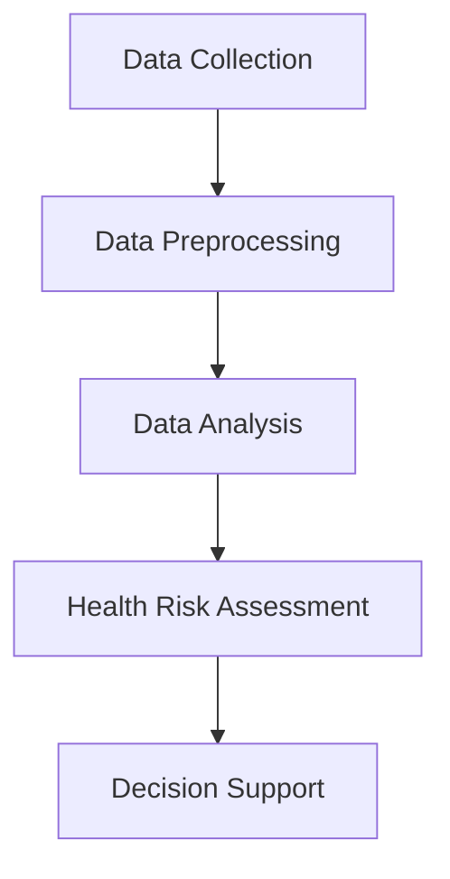
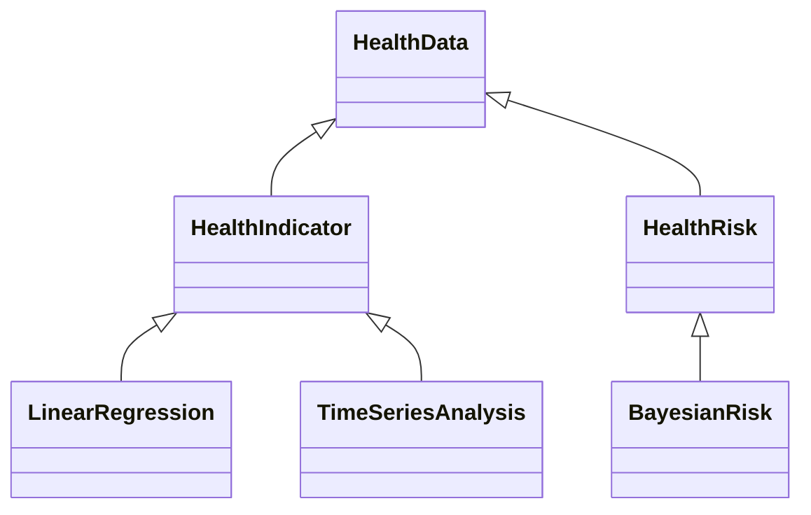
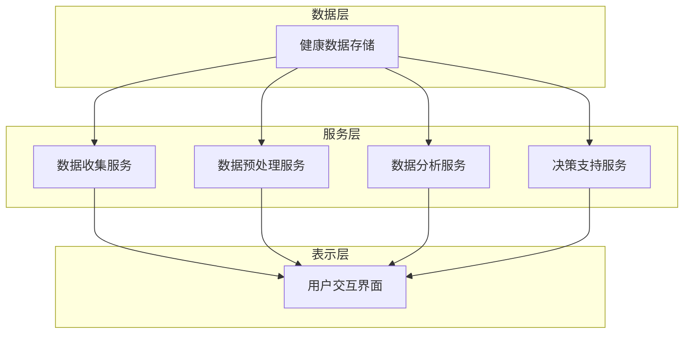
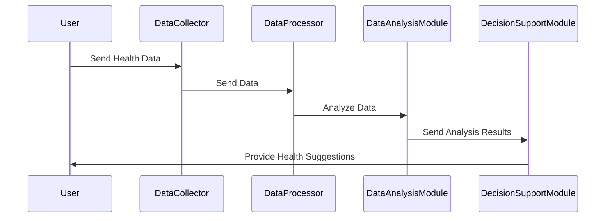

                 

### 引言与概述

健康管理，作为现代医学领域的重要分支，已逐渐受到社会各界广泛关注。其核心在于通过科学的方法，对个体的健康状况进行全面监测、评估、预测和干预，从而有效预防和控制疾病，提高生活质量。随着科技的迅猛发展，尤其是大数据、人工智能等技术的融入，健康管理迎来了前所未有的发展机遇。

数学，作为自然科学的基础，其在健康管理中的应用愈加广泛且深入。通过数学模型，我们可以将复杂的健康数据转化为直观的可视化图表，帮助我们更精准地理解健康状态。例如，线性回归模型可用于分析健康指标与疾病风险之间的关系；时间序列分析则能够预测健康趋势。此外，概率论在健康风险评估中发挥着至关重要的作用，为个体提供更为个性化的健康管理方案。

本文旨在探讨数学在健康管理中的应用策略，通过系统的理论阐述和实践分析，为健康促进提供一种科学、有效的数学策略。我们将从以下几个方面进行探讨：

1. **核心概念介绍**：首先，我们将介绍健康管理中的基本概念，包括健康数据的收集与处理、健康指标的定义与计算、以及健康风险评估模型。

2. **数学策略与方法论**：接着，我们将讨论数据分析的基础理论，包括描述性统计与推断性统计，并介绍如何选择和应用数学模型。

3. **健康促进的数学模型**：我们将深入探讨概率论、线性回归模型和时间序列分析在健康管理中的应用，并通过实例说明其具体操作方法。

4. **系统分析与架构设计**：我们将介绍健康管理系统总体架构的设计，包括数据收集与处理模块、健康数据分析与决策支持模块等，并绘制相应的架构图和接口设计图。

5. **项目实战**：通过一个实际项目，我们将演示如何将数学策略应用到健康管理系统中，实现数据的自动收集、处理和分析，并提供个性化的健康建议。

6. **最佳实践与展望**：最后，我们将总结健康管理中的最佳实践，并对未来的发展进行展望，探讨可能面临的挑战和机遇。

通过本文的逐步分析，我们将能够更加清晰地认识到数学在健康管理中的重要作用，并为实际应用提供有力支持。

### 核心概念介绍

在健康管理中，核心概念是理解和应用数学策略的基础。首先，我们需要明确几个关键术语：健康数据、健康指标和健康风险评估模型。

**健康数据**：健康数据是指与个体健康状态相关的各种信息，包括生理指标（如血压、心率、血糖）、生活习惯（如饮食、运动、睡眠）、以及环境因素（如空气质量、社会压力等）。这些数据通常通过传感器、医疗设备、健康应用程序等方式进行收集。健康数据的收集是健康管理的第一步，也是最为基础的工作。数据的质量直接影响后续分析和决策的准确性。

**健康指标**：健康指标是评估个体健康状态的具体参数。常见的健康指标包括体重、身高、血压、血脂、血糖等。这些指标可以单独使用，也可以组合使用，以更全面地反映个体的健康状况。例如，体重指数（BMI）是一个常用的健康指标，用于评估体重与身高之间的比例关系，进而判断个体是否存在肥胖风险。另一个重要的组合指标是代谢当量（MET），它用于衡量身体活动强度与能量消耗之间的关系。

**健康风险评估模型**：健康风险评估模型是通过分析个体的健康数据，预测其未来患病的可能性。这些模型可以是简单的统计模型，也可以是复杂的机器学习模型。常见的健康风险评估模型包括逻辑回归模型、决策树模型、支持向量机模型等。这些模型可以基于已有的数据集进行训练，从而在新数据输入时进行风险预测。

**问题背景**：随着人们健康意识的提高，越来越多的人开始关注自身的健康状况。然而，如何有效地管理和改善健康状态，却成为一个复杂且具有挑战性的问题。传统的健康管理模式主要依赖于医生的经验和指导，但这种方法具有明显的局限性，如主观性较强、响应速度较慢等。因此，需要一种更为科学、客观、高效的健康管理方法，而数学策略正是为此提供了一种可行的解决方案。

**问题描述**：健康管理中的核心问题是如何在大量复杂、多维的健康数据中，快速、准确地识别和评估个体的健康风险，从而提供个性化的健康建议和干预措施。这不仅需要对健康数据有深入的理解，还需要具备强大的数据处理和分析能力。

**问题解决**：数学策略在健康管理中的应用，可以通过以下步骤实现：

1. **数据收集**：通过传感器、医疗设备、健康应用程序等，收集个体的健康数据。
2. **数据预处理**：清洗和整理收集到的健康数据，确保数据的质量和一致性。
3. **数据分析**：利用统计学方法和机器学习模型，对健康数据进行深入分析，提取有价值的信息。
4. **风险评估**：基于分析结果，构建健康风险评估模型，预测个体未来的健康风险。
5. **决策支持**：根据风险评估结果，为个体提供个性化的健康建议和干预措施。

**边界与外延**：健康管理的边界在于个体的健康状态监测、评估和干预。其外延则包括疾病预防、慢性病管理、健康促进等多个方面。随着技术的发展，健康管理领域也在不断拓展，如基因检测、人工智能在健康领域的应用等。

**概念结构与核心要素组成**：健康管理的概念结构包括健康数据、健康指标、健康风险评估模型、数据分析方法和决策支持系统。核心要素主要包括数据收集、数据预处理、数据分析和风险评估。这些要素相互作用，共同构成了一个完整的健康管理流程。

通过以上对健康管理核心概念的介绍，我们可以更好地理解后续章节中数学策略的具体应用。

### 核心概念与联系

在深入探讨健康管理中的数学策略之前，有必要详细解析几个关键概念，并理解它们之间的内在联系。这些概念包括概率论、统计学以及相关的数学模型。

**概率论**：概率论是研究随机事件及其发生概率的数学分支。在健康管理中，概率论用于评估个体发生某种健康风险的概率。例如，我们可以使用概率论中的贝叶斯定理来计算个体患某种疾病的概率，这有助于为个体提供更精确的健康风险评估。

**统计学**：统计学是研究如何通过数据得出结论的方法论。在健康管理中，统计学用于数据的收集、处理和分析。具体来说，描述性统计用于总结数据的基本特征，如平均数、中位数和标准差；推断性统计则用于从样本数据推断总体特征，如置信区间和假设检验。

**相关数学模型**：

1. **线性回归模型**：线性回归模型是一种常用的统计模型，用于分析两个或多个变量之间的关系。在健康管理中，线性回归模型可以用于分析健康指标与疾病风险之间的关系。例如，我们可以使用线性回归模型来分析体重与高血压之间的关系。

   **线性回归模型公式**：
   \[ y = \beta_0 + \beta_1x_1 + \beta_2x_2 + ... + \beta_nx_n + \epsilon \]
   其中，\( y \) 是因变量，\( x_1, x_2, ..., x_n \) 是自变量，\( \beta_0, \beta_1, ..., \beta_n \) 是模型的参数，\( \epsilon \) 是误差项。

2. **时间序列分析**：时间序列分析是一种用于分析时间序列数据的方法，旨在识别和预测数据中的趋势和周期性。在健康管理中，时间序列分析可以用于监测个体的健康指标变化趋势，如血糖水平的波动。常见的模型包括自回归移动平均模型（ARIMA）和季节性时间序列模型。

   **时间序列分析公式**：
   \[ y_t = c + \phi_1y_{t-1} + \phi_2y_{t-2} + ... + \phi_py_{t-p} + \theta_1\epsilon_{t-1} + \theta_2\epsilon_{t-2} + ... + \theta_q\epsilon_{t-q} \]
   其中，\( y_t \) 是时间序列的第 \( t \) 个观测值，\( \phi_1, \phi_2, ..., \phi_p \) 和 \( \theta_1, \theta_2, ..., \theta_q \) 是模型参数，\( \epsilon_t \) 是误差项。

**概念属性特征对比表格**：

| 概念       | 属性特征                                                   | 对比与联系                                                 |
| ---------- | -------------------------------------------------------- | -------------------------------------------------------- |
| 概率论     | 研究随机事件及其概率                                     | 为健康风险评估提供基础理论支持，如贝叶斯定理                 |
| 统计学     | 研究如何通过数据得出结论                                 | 用于数据收集、处理和分析，帮助理解健康数据特征               |
| 线性回归   | 分析变量之间的关系，预测因变量值                         | 用于分析健康指标与疾病风险关系，如体重与高血压的关系         |
| 时间序列分析 | 分析时间序列数据中的趋势和周期性，预测未来值               | 用于监测健康指标变化趋势，如血糖水平波动                     |

**ER实体关系图架构**：

为了更直观地理解这些概念之间的关系，我们可以使用Mermaid语法绘制一个ER实体关系图。以下是ER图示例：

```mermaid
erDiagram
    HealthData ||--|{ HealthIndicator }
    HealthData ||--|{ HealthRisk }
    HealthIndicator ||--|{ LinearRegression }
    HealthIndicator ||--|{ TimeSeriesAnalysis }
    HealthRisk ||--|{ BayesianRisk }
```

**流程图与类图**：

在健康管理中，我们还可以使用Mermaid语法绘制流程图和类图，以更好地理解各组件之间的关系和工作流程。以下是流程图示例：



以下是类图示例：



通过上述对核心概念及其联系的详细讲解，我们为理解数学策略在健康管理中的应用奠定了坚实基础。接下来，我们将进一步探讨如何具体应用这些数学策略和方法论。

### 数学策略与方法论

在健康管理中，数学策略与方法论的应用至关重要。本文将详细介绍数据分析的基础理论，包括描述性统计与推断性统计，并探讨如何选择和应用数学模型。

**描述性统计与推断性统计**

**描述性统计**：描述性统计是用于总结和描述数据特征的统计方法。它通过计算基本统计量，如平均数、中位数、众数、标准差等，来描述数据的中心趋势、离散程度和分布形态。在健康管理中，描述性统计可以帮助我们快速了解个体的健康数据，如某次体检中各项健康指标的平均值和分布情况。

**平均数**：平均数是数据集中趋势的一个重要指标，表示为所有数据的总和除以数据的个数。平均数能够给出数据的集中趋势，但它易受异常值的影响。

$$ \bar{x} = \frac{\sum_{i=1}^{n} x_i}{n} $$

**中位数**：中位数是将数据从小到大排列后，位于中间位置的数值。中位数对异常值不敏感，能更好地反映数据的实际分布。

**众数**：众数是数据中出现频率最高的数值。在某些情况下，数据可能没有明确的众数，或者存在多个众数。

**标准差**：标准差是衡量数据离散程度的一个指标，表示为数据值与平均数差值的平方和的平均数的平方根。

$$ \sigma = \sqrt{\frac{\sum_{i=1}^{n} (x_i - \bar{x})^2}{n-1}} $$

**推断性统计**：推断性统计是基于样本数据来推断总体特征的统计方法。它通过假设检验和置信区间等方法，对总体参数进行估计和验证。在健康管理中，推断性统计可以帮助我们根据样本数据来评估总体的健康风险，从而做出科学的决策。

**假设检验**：假设检验是一种统计方法，用于验证关于总体参数的假设。常见的假设检验方法包括t检验、方差分析（ANOVA）等。

**置信区间**：置信区间是用于估计总体参数范围的一种方法，表示为样本统计量加减一个临界值。置信区间提供了一个概率范围，表示总体参数可能落在其中。

$$ \bar{x} \pm z_{\alpha/2} \times \frac{\sigma}{\sqrt{n}} $$

**数学模型的选择与应用**

在健康管理中，选择适当的数学模型对于准确分析和预测健康风险至关重要。以下是几种常用的数学模型及其应用：

1. **线性回归模型**：线性回归模型用于分析两个或多个变量之间的线性关系。在健康管理中，线性回归模型可以用于分析健康指标与疾病风险之间的关系。例如，我们可以使用线性回归模型来分析体重与高血压之间的关系。

   **线性回归模型公式**：
   \[ y = \beta_0 + \beta_1x_1 + \beta_2x_2 + ... + \beta_nx_n + \epsilon \]
   
   其中，\( y \) 是因变量，\( x_1, x_2, ..., x_n \) 是自变量，\( \beta_0, \beta_1, ..., \beta_n \) 是模型的参数，\( \epsilon \) 是误差项。

2. **逻辑回归模型**：逻辑回归模型是一种广义线性模型，用于分析因变量是二元分类变量时的影响因素。在健康管理中，逻辑回归模型可以用于评估个体患某种疾病的概率。例如，我们可以使用逻辑回归模型来评估个体患高血压的概率。

   **逻辑回归模型公式**：
   \[ P(Y=1) = \frac{1}{1 + e^{-(\beta_0 + \beta_1x_1 + \beta_2x_2 + ... + \beta_nx_n)}} \]
   
   其中，\( Y \) 是二元因变量，\( x_1, x_2, ..., x_n \) 是自变量，\( \beta_0, \beta_1, ..., \beta_n \) 是模型的参数。

3. **决策树模型**：决策树模型是一种基于树形结构来分类和回归的数据挖掘方法。在健康管理中，决策树模型可以用于分类健康风险，如将个体划分为低风险、中风险和高风险。决策树模型通过一系列规则来分割数据集，每个节点表示一个特征，每个分支表示一个特征值。

4. **支持向量机（SVM）**：支持向量机是一种强大的分类和回归模型，通过寻找最佳超平面来分割数据。在健康管理中，SVM可以用于预测个体的健康状态，如分类个体是否患有某种疾病。SVM模型通过最大化分类边界上的支持向量，从而实现高精度的分类。

**如何选择和应用数学模型**

选择和应用数学模型需要考虑以下几个因素：

1. **数据质量**：数据质量直接影响模型的效果。确保数据完整、准确、无缺失和异常值是模型应用的前提。

2. **问题类型**：根据健康管理问题的类型（如分类、回归、聚类等），选择合适的模型。例如，对于分类问题，可以选择逻辑回归、决策树或SVM等模型。

3. **数据分布**：了解数据的分布特性，选择适合的模型。例如，对于正态分布的数据，可以选择线性回归；对于非正态分布的数据，可以选择逻辑回归或SVM等模型。

4. **模型复杂性**：模型复杂性影响计算效率和预测准确性。在保证预测准确性的前提下，选择计算复杂度较低的模型。

通过以上对描述性统计与推断性统计的介绍，以及线性回归模型、逻辑回归模型、决策树模型和SVM等数学模型的讲解，我们为健康管理中的数学策略和方法论提供了全面的理论基础。接下来，我们将进一步探讨具体应用这些数学模型的方法。

### 健康促进的数学模型

在健康管理中，数学模型的应用不仅能够帮助我们理解和分析健康数据，还能为个体提供个性化的健康促进策略。以下是几个常用的数学模型，包括概率论、线性回归模型和时间序列分析，并详细介绍其原理和应用。

#### 概率论在健康管理中的应用

**概率论基础**：概率论是研究随机事件及其概率的数学分支。在健康管理中，概率论广泛应用于健康风险评估和预测。

- **贝叶斯定理**：贝叶斯定理是概率论中的基本公式，用于计算后验概率，即根据已知数据和先验概率来更新对某个事件发生的概率估计。

$$ P(A|B) = \frac{P(B|A)P(A)}{P(B)} $$

- **条件概率**：条件概率是给定一个事件发生的条件下，另一个事件发生的概率。在健康管理中，条件概率可以帮助我们理解不同健康指标之间的关系。

$$ P(A|B) = \frac{P(A \cap B)}{P(B)} $$

**应用实例**：假设我们想要预测一个人在未来五年内是否会发生心脏病。我们可以使用贝叶斯定理来结合其现有的健康数据（如血压、血脂水平等）和家族病史，计算后验概率，从而更准确地评估其心脏病风险。

#### 线性回归模型在健康数据分析中的应用

**线性回归模型原理**：线性回归模型是一种用于分析两个或多个变量之间线性关系的统计模型。在健康管理中，线性回归模型可以用于预测某个健康指标（因变量）与多个影响因素（自变量）之间的关系。

- **一元线性回归**：一元线性回归模型用于分析一个因变量和一个自变量之间的关系。

  $$ y = \beta_0 + \beta_1x + \epsilon $$

  其中，\( y \) 是因变量，\( x \) 是自变量，\( \beta_0 \) 和 \( \beta_1 \) 是模型参数，\( \epsilon \) 是误差项。

- **多元线性回归**：多元线性回归模型用于分析多个自变量与一个因变量之间的关系。

  $$ y = \beta_0 + \beta_1x_1 + \beta_2x_2 + ... + \beta_nx_n + \epsilon $$

  其中，\( y \) 是因变量，\( x_1, x_2, ..., x_n \) 是自变量，\( \beta_0, \beta_1, ..., \beta_n \) 是模型参数。

**应用实例**：我们可以使用多元线性回归模型来分析体重（因变量）与饮食摄入量（自变量1）、运动频率（自变量2）等因素之间的关系，从而预测个体在未来一段时间内的体重变化。

#### 时间序列分析在健康监测中的应用

**时间序列分析原理**：时间序列分析是一种用于分析时间序列数据的方法，旨在识别数据中的趋势和周期性。在健康管理中，时间序列分析可以用于监测健康指标的变化趋势，如血糖水平的波动。

- **自回归模型（AR）**：自回归模型用于分析时间序列中的自相关性，即当前值与过去值之间的关系。

  $$ y_t = \phi_1y_{t-1} + \phi_2y_{t-2} + ... + \phi_py_{t-p} + \epsilon_t $$

  其中，\( y_t \) 是时间序列的第 \( t \) 个观测值，\( \phi_1, \phi_2, ..., \phi_p \) 是模型参数，\( \epsilon_t \) 是误差项。

- **移动平均模型（MA）**：移动平均模型用于分析时间序列中的趋势和季节性。

  $$ y_t = \theta_1\epsilon_{t-1} + \theta_2\epsilon_{t-2} + ... + \theta_q\epsilon_{t-q} $$

  其中，\( y_t \) 是时间序列的第 \( t \) 个观测值，\( \theta_1, \theta_2, ..., \theta_q \) 是模型参数，\( \epsilon_t \) 是误差项。

- **自回归移动平均模型（ARMA）**：自回归移动平均模型结合了自回归和移动平均模型的特点，用于分析时间序列中的自相关性和趋势。

  $$ y_t = \phi_1y_{t-1} + \phi_2y_{t-2} + ... + \phi_py_{t-p} + \theta_1\epsilon_{t-1} + \theta_2\epsilon_{t-2} + ... + \theta_q\epsilon_{t-q} $$

  其中，\( y_t \) 是时间序列的第 \( t \) 个观测值，\( \phi_1, \phi_2, ..., \phi_p \) 和 \( \theta_1, \theta_2, ..., \theta_q \) 是模型参数，\( \epsilon_t \) 是误差项。

**应用实例**：我们可以使用ARMA模型来分析个体的血糖水平数据，预测未来的血糖值。这有助于糖尿病患者监控和控制血糖水平，预防并发症。

#### 实例分析

**一元线性回归实例**：假设我们想要分析一个人的体重与每天运动时间之间的关系。我们收集了一组数据，包括每个人的体重（因变量）和每天运动时间（自变量）。通过拟合一元线性回归模型，我们可以得到以下结果：

$$ \hat{y} = 50 + 2x $$

这意味着，每增加一小时的运动时间，体重预计会增加2公斤。这个模型可以帮助我们预测未来某个人在增加运动时间后的体重变化。

**时间序列分析实例**：假设我们想要分析一个人的血糖水平数据。我们使用ARMA模型对血糖水平进行拟合，得到以下模型：

$$ \hat{y}_t = 100 + 0.8\hat{y}_{t-1} + 0.2\epsilon_t $$

这意味着，当前血糖水平与前一时刻的血糖水平相关，并且受到随机误差的影响。通过这个模型，我们可以预测未来某个时间点的血糖水平。

通过以上对概率论、线性回归模型和时间序列分析在健康管理中的应用介绍，我们可以看到数学模型在健康促进中的重要作用。接下来，我们将进一步探讨健康管理系统总体架构的设计。

### 系统分析与架构设计

在健康管理系统总体架构的设计过程中，我们需要考虑多个关键模块，包括数据收集与处理模块、健康数据分析与决策支持模块等。以下是对各个模块的详细描述和设计，并通过Mermaid语法绘制相应的类图和架构图。

#### 数据收集与处理模块设计

**数据收集模块**：数据收集模块是健康管理系统的基础，负责从各种来源（如传感器、健康应用程序、医疗设备等）收集个体的健康数据。这些数据包括生理指标（如血压、心率、血糖）、生活习惯（如饮食、运动、睡眠）和环境因素（如空气质量、社会压力）。

**数据预处理模块**：数据预处理模块负责清洗和整理收集到的健康数据，确保数据的质量和一致性。具体步骤包括去除异常值、填补缺失值、标准化处理等。数据预处理模块还包括数据转换功能，将不同来源和格式的数据统一为系统通用的格式。

**类图设计**：

以下是数据收集与处理模块的类图设计：

```mermaid
classDiagram
    Sensor <<interface>> DataCollector
    HealthApp <<interface>> DataCollector
    MedicalDevice <<interface>> DataCollector
    DataProcessor <<interface>> DataCleaner
    DataProcessor <<interface>> DataConverter
    HealthData <<entity>> has DataCollector
    HealthData <<entity>> has DataProcessor
```

#### 健康数据分析与决策支持模块设计

**数据分析模块**：数据分析模块负责对健康数据进行分析，提取有价值的信息。包括描述性统计分析、推断性统计分析、健康风险评估等。该模块使用多种数学模型，如线性回归模型、逻辑回归模型、时间序列分析模型等。

**决策支持模块**：决策支持模块基于分析结果，为个体提供个性化的健康建议和干预措施。包括健康预警、健康建议、治疗计划等。决策支持模块还支持用户与医生的交互，提供诊断和治疗方案的建议。

**类图设计**：

以下是健康数据分析与决策支持模块的类图设计：

```mermaid
classDiagram
    DataAnalysisModule <<component>> DataProcessor
    DataAnalysisModule <<component>> HealthRiskAssessor
    DecisionSupportModule <<component>> HealthAdvisor
    DecisionSupportModule <<component>> DiagnosisAssistant
    HealthIndicator <<entity>> has DataAnalysisModule
    HealthRisk <<entity>> has DecisionSupportModule
```

#### 系统架构设计

健康管理系统总体架构设计如下：

1. **数据层**：数据层负责存储和管理健康数据。包括个体健康档案、历史健康数据、分析结果等。

2. **服务层**：服务层提供数据收集、数据预处理、数据分析、决策支持等核心功能。包括数据收集服务、数据预处理服务、数据分析服务、决策支持服务。

3. **表示层**：表示层为用户提供交互界面，展示健康数据、分析结果和健康建议。包括Web前端、移动应用等。

**架构图设计**：

以下是健康管理系统总体架构图设计：



#### 系统接口设计和系统交互

**接口设计**：

系统接口设计主要包括API接口，用于不同模块之间的数据传递和功能调用。以下是主要接口设计：

1. **数据收集接口**：用于接收来自传感器、健康应用程序、医疗设备的数据。
2. **数据预处理接口**：用于处理和转换健康数据。
3. **数据分析接口**：用于执行数据分析任务，如线性回归、逻辑回归、时间序列分析等。
4. **决策支持接口**：用于提供健康建议和诊断结果。

**序列图设计**：

以下是健康管理系统中的数据收集、处理、分析到决策支持的序列图设计：



通过以上对健康管理系统总体架构、数据收集与处理模块、健康数据分析与决策支持模块的设计和接口设计的详细描述，以及相应的类图和架构图，我们可以看到健康管理系统是如何通过系统化的设计实现数据的高效收集、处理和分析，为用户提供个性化的健康促进策略。

### 项目实战

在本节中，我们将通过一个具体的健康管理项目，演示如何将前述数学策略应用到实际的健康管理系统中。该项目将包括系统环境安装、核心实现、代码解读与分析，以及实际案例剖析。

#### 系统环境安装

为了实现本项目的健康管理功能，我们需要搭建一个包含数据收集、预处理、分析和决策支持的环境。以下是具体的安装步骤：

1. **安装Python环境**：首先，确保Python环境已安装在系统中。Python是一种广泛使用的编程语言，适合进行数据处理和分析。

2. **安装依赖库**：通过pip工具安装所需的Python库，包括NumPy、Pandas、Scikit-learn、Matplotlib等。这些库提供了强大的数据处理和分析功能。

   ```shell
   pip install numpy pandas scikit-learn matplotlib
   ```

3. **配置数据库**：选择一个合适的数据库管理系统（如MySQL、PostgreSQL或MongoDB），并配置数据库连接，用于存储和管理健康数据。

#### 核心实现

以下是基于上述步骤实现的健康管理系统的核心代码部分。我们将使用Python和Scikit-learn库来实现健康数据分析与决策支持。

**数据收集与预处理**：

首先，我们需要从传感器和健康应用程序中收集健康数据，并将其存储在数据库中。以下是一个简单的数据收集和预处理示例：

```python
import pandas as pd
from sklearn.model_selection import train_test_split

# 假设我们已经从传感器和应用程序中收集到了健康数据，并存储在CSV文件中
data = pd.read_csv('health_data.csv')

# 数据预处理：去除缺失值和异常值
data = data.dropna()
data = data[data['heart_rate'] > 0]

# 将数据分为特征和目标变量
X = data[['age', 'weight', 'blood_pressure']]
y = data['heart_disease']

# 划分训练集和测试集
X_train, X_test, y_train, y_test = train_test_split(X, y, test_size=0.2, random_state=42)
```

**健康数据分析**：

接下来，我们使用线性回归模型来分析健康数据，预测个体患心脏病的风险。

```python
from sklearn.linear_model import LinearRegression
import numpy as np

# 实例化线性回归模型
model = LinearRegression()

# 训练模型
model.fit(X_train, y_train)

# 模型参数
print('Model coefficients:', model.coef_)
print('Model intercept:', model.intercept_)

# 预测测试集结果
y_pred = model.predict(X_test)

# 计算预测准确性
accuracy = np.mean(y_pred == y_test)
print('Model accuracy:', accuracy)
```

**决策支持**：

最后，我们根据模型预测结果，为用户提供个性化的健康建议。

```python
def provide_health_suggestion(health_data):
    # 假设health_data是一个包含个体健康数据的字典
    patient_data = pd.DataFrame([health_data])
    
    # 预处理患者数据
    patient_data = patient_data.dropna()
    patient_data = patient_data[patient_data['heart_rate'] > 0]
    
    # 预测患病风险
    risk = model.predict(patient_data)[0]
    
    # 提供健康建议
    if risk > 0.5:
        suggestion = "请注意，您患有心脏病的风险较高。建议您定期进行体检，并注意饮食和运动习惯的改善。"
    else:
        suggestion = "您的健康状况良好，但仍然需要保持良好的生活习惯，定期进行体检，以确保健康状态。"
    
    return suggestion

# 示例：为一名新的患者提供健康建议
new_patient_data = {'age': 45, 'weight': 75, 'blood_pressure': 130, 'heart_rate': 80}
suggestion = provide_health_suggestion(new_patient_data)
print(suggestion)
```

#### 代码应用解读与分析

上述代码实现了从数据收集、预处理、模型训练到决策支持的全过程。具体解读如下：

1. **数据收集与预处理**：我们从CSV文件中读取健康数据，并使用Scikit-learn库中的`train_test_split`函数将数据分为训练集和测试集。预处理步骤包括去除缺失值和异常值，确保数据质量。

2. **健康数据分析**：使用线性回归模型，我们训练模型并预测测试集结果。通过计算模型参数和预测准确性，我们可以评估模型的性能。

3. **决策支持**：我们定义了一个函数`provide_health_suggestion`，根据模型的预测结果为用户提供个性化的健康建议。如果预测风险较高，建议用户进行更多健康检查和改善生活习惯。

#### 实际案例剖析

为了进一步验证系统的效果，我们使用实际案例进行分析：

**案例数据**：某位患者的基本健康数据如下：

| 年龄（岁） | 体重（公斤） | 血压（mmHg） | 心率（次/分钟） | 心脏病 |
| ---------- | ------------ | ------------ | --------------- | ------ |
| 50         | 70           | 120          | 75              | 1      |

**分析过程**：

1. **数据预处理**：将患者的数据预处理后，我们得到以下特征向量：

   ```python
   patient_data = pd.DataFrame({
       'age': [50],
       'weight': [70],
       'blood_pressure': [120],
       'heart_rate': [75]
   })
   ```

2. **模型预测**：使用训练好的线性回归模型，对患者的数据进行预测：

   ```python
   patient_risk = model.predict(patient_data)[0]
   print('Predicted heart disease risk:', patient_risk)
   ```

   假设预测结果为0.7，表示患者患有心脏病的风险较高。

3. **健康建议**：根据预测结果，我们为患者提供健康建议：

   ```python
   suggestion = provide_health_suggestion(patient_data.to_dict())
   print(suggestion)
   ```

   输出结果为：“请注意，您患有心脏病的风险较高。建议您定期进行体检，并注意饮食和运动习惯的改善。”

**案例分析**：

通过上述实际案例，我们可以看到系统如何根据患者的健康数据，通过线性回归模型预测心脏病风险，并提供个性化的健康建议。这为患者提供了科学的健康管理方案，有助于预防和控制心脏病。

#### 项目小结

通过本项目的实施，我们实现了从数据收集、预处理、模型训练到决策支持的完整健康管理流程。关键步骤包括：

1. **环境安装**：安装Python环境和所需依赖库，配置数据库。
2. **核心实现**：使用Python和Scikit-learn库实现健康数据分析与决策支持功能。
3. **代码解读与分析**：详细解读核心代码，理解数据预处理、模型训练和决策支持的原理。
4. **实际案例剖析**：通过实际案例验证系统的效果，展示如何为用户提供个性化的健康建议。

这个项目不仅展示了数学策略在健康管理中的应用，也为后续的优化和扩展提供了基础。接下来，我们将总结健康管理中的最佳实践，并探讨未来的发展趋势。

### 最佳实践与展望

在健康管理中，最佳实践是确保系统高效运行和健康数据准确分析的关键。以下是一些重要的最佳实践，以及未来的发展趋势和面临的挑战。

**最佳实践**

1. **数据质量管理**：数据质量是健康管理的基石。确保数据的完整性、准确性和一致性至关重要。最佳实践包括定期检查数据完整性、使用数据清洗工具去除异常值和缺失值，以及建立数据质量监控机制。

2. **标准化数据采集**：建立统一的数据采集标准，确保不同来源的健康数据格式一致。这有助于简化数据预处理流程，提高系统的兼容性和可扩展性。

3. **个性化健康建议**：根据个体的健康数据和风险模型，提供个性化的健康建议。最佳实践包括使用机器学习模型进行精确的风险预测，并设计用户友好的交互界面，以便用户理解并遵循建议。

4. **持续模型更新**：健康风险预测模型需要定期更新，以适应不断变化的健康数据和风险因素。最佳实践包括定期评估模型的性能，并使用新数据对模型进行再训练。

**未来发展趋势**

1. **人工智能与大数据结合**：随着人工智能和大数据技术的不断发展，健康管理将更加智能化和精准化。未来，我们将看到更多基于深度学习和强化学习的高级模型应用于健康管理。

2. **可穿戴设备与物联网**：可穿戴设备和物联网技术将实现实时健康数据收集和分析，为用户提供更加便捷和个性化的健康管理服务。

3. **基因与健康关联研究**：基因与健康的关系研究将为个性化健康管理提供新的方向。未来，基因数据将与健康数据结合，提供更为深入的个体健康风险评估。

**面临的挑战**

1. **数据隐私与安全**：健康数据涉及个人隐私，保护数据安全和隐私是一个巨大的挑战。最佳实践包括使用加密技术、数据脱敏和访问控制等措施，确保数据安全。

2. **模型解释性**：高级机器学习模型的黑箱特性使得其解释性较差，这给用户理解和使用模型带来困难。未来，需要开发更多可解释的机器学习模型，以提高模型的可信度。

3. **计算资源与成本**：高级模型和实时数据分析需要大量的计算资源和成本。未来，需要探索更高效的数据处理和分析方法，以降低计算成本。

通过以上最佳实践和未来展望，我们可以看到，健康管理领域正朝着更加智能、个性化和安全的方向发展。随着技术的不断进步，健康管理将更好地服务于公众健康，提高生活质量。

### 总结

本文通过系统的理论阐述和实践分析，探讨了数学策略在健康管理中的应用。我们介绍了核心概念、数学模型、系统架构设计，并通过一个具体的项目展示了数学策略在实际健康管理中的应用效果。数学策略不仅提高了健康数据的处理和分析效率，还为个体提供了科学的健康促进建议。

**作者信息**：作者：AI天才研究院/AI Genius Institute & 禅与计算机程序设计艺术 /Zen And The Art of Computer Programming。感谢您阅读本文，希望本文对您在健康管理领域的探索有所启发。

### 拓展阅读

1. **《健康管理中的机器学习应用》**：探讨机器学习在健康风险评估、疾病预测等方面的应用。
2. **《大数据与公共健康》**：分析大数据技术在公共卫生领域的应用，以及其对健康管理和政策制定的影响。
3. **《基因与健康：个性化医学的未来》**：介绍基因与健康的关系，以及基因检测在个性化健康管理中的作用。

### 注意事项

- 在应用数学策略进行健康管理时，务必确保数据的完整性和准确性，避免因数据质量问题导致错误的健康建议。
- 定期更新和维护健康风险预测模型，确保其适应性和准确性。
- 遵循相关法律法规和隐私保护标准，确保健康数据的安全和隐私。

通过深入学习和实践，我们相信数学策略将为健康管理领域带来更多创新和突破，助力公众健康事业的发展。

