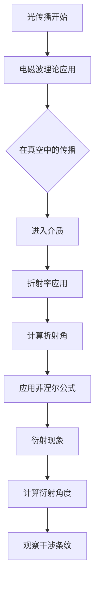
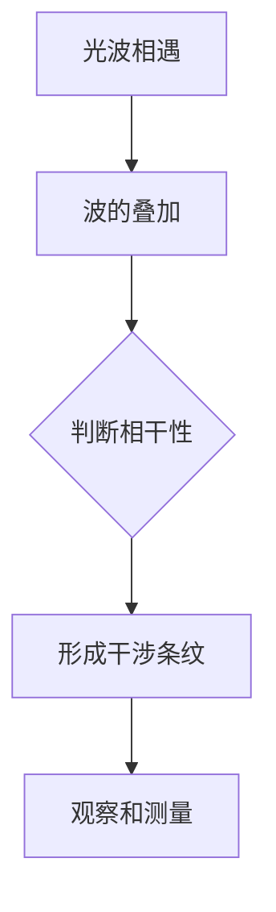

                 

### 文章标题

在计算机科学和物理学中，光学和数学作为两个强大的领域，不断推动着技术发展的前沿。本文将深入探讨光的传播和干涉现象，结合数学工具的描述，展现这两者在理论和实际应用中的深远影响。通过逐步的分析和推理，我们将理解光的传播规律以及干涉现象背后的数学原理，最终揭示光学与数学的深层联系。

本文分为三个主要部分：

1. **背景介绍**：介绍光学和数学的关系，以及本文将探讨的核心问题。
2. **光的传播**：详细讲解光传播的基本原理、折射现象、光的衍射以及光的传播数学模型和公式，并通过举例说明加深理解。
3. **光的干涉**：探讨光的干涉原理、干涉现象的类型、干涉条纹的数学模型以及实际应用的举例说明。

在每一部分中，我们都将遵循“LET'S THINK STEP BY STEP”的原则，逐步分析每个概念和现象，并用具体的数学模型和公式来解释。最终，读者将不仅能够理解光的传播和干涉现象，还能体会到数学在描述光学现象中的关键作用。

### 文章关键词

- 光学
- 数学描述
- 光传播
- 干涉现象
- 折射率
- 波的叠加原理
- 电磁波理论

### 摘要

本文旨在通过数学的视角，探讨光的传播和干涉现象。文章首先介绍了光学和数学的关系，以及本文的研究问题。随后，通过逐步的分析，我们深入讲解了光传播的基本原理、折射现象、光的衍射以及光的传播数学模型和公式。接着，文章探讨了光的干涉原理、干涉现象的类型和实际应用的举例说明。通过本文，读者可以了解到数学在描述光学现象中的重要作用，以及这些理论在实际应用中的深远影响。

### 目录大纲

# 数学与光学：光的传播和干涉的数学描述

## 第一部分：背景介绍

## 第1章 问题背景、问题描述、问题解决、边界与外延

### 第1章 问题背景、问题描述、问题解决、边界与外延

### 1.1 问题背景

光学和数学作为两个独立的领域，它们在科学技术的发展中扮演着至关重要的角色。光学研究光的性质、传播规律和应用，而数学则提供了解决复杂问题的工具和语言。随着现代科技的发展，光学与数学的交叉应用日益广泛，尤其是在通信、量子计算、光学仪器和图像处理等领域。

**光学的重要性**：

- **科技领域**：光学技术在光学传感器、光纤通信、激光技术等方面有着广泛应用，对推动科技发展起到关键作用。
- **日常生活**：光学技术被广泛应用于眼镜、相机、显示器等设备中，极大丰富了人们的生活体验。

**数学在光学中的作用**：

- **描述光学现象**：数学模型和公式可以精确描述光的传播、反射、折射、干涉等现象，为理论研究和技术开发提供了坚实的基础。
- **解决问题**：数学工具可以帮助我们理解和解决复杂的光学问题，如光学系统的设计、光学材料的分析等。

通过光学和数学的结合，我们能够更深入地理解光的行为，从而推动科学技术的发展。本文将围绕光的传播和干涉现象，通过数学描述来探讨这两个关键问题。

### 1.2 问题描述

在光学研究中，光的传播和干涉现象是两个基础且重要的课题。光的传播描述了光在空间中如何行进，而干涉现象则揭示了光波相互作用的结果。

**光的传播**：

- **传播规律**：光以电磁波的形式传播，在真空中以固定速度 \( c \) 行进。当光进入不同介质时，其传播速度会发生变化，导致折射现象。
- **折射率**：介质对光的传播速度产生影响，用折射率 \( n \) 表示。折射定律描述了入射角和折射角之间的关系。

**光的干涉**：

- **干涉现象**：当两束或多束相干光波在空间中相遇时，会发生干涉现象。干涉条纹的形成是干涉现象的直观表现。
- **波的叠加原理**：干涉现象基于波的叠加原理，即两束光波的振幅会相加，从而形成新的波形。

数学在描述这些现象中起到了核心作用，通过数学模型和公式，我们可以定量地分析光的传播和干涉现象。这为光学实验和理论计算提供了有力工具。

### 1.3 问题解决

要解决光的传播和干涉问题，需要运用一系列数学工具和理论，以下是几个关键步骤：

**光的传播**：

1. **建立数学模型**：首先，我们需要建立光的传播数学模型。电磁波理论为我们提供了基本框架，光的速度 \( c \) 和波长 \( \lambda \) 的关系是 \( c = \lambda f \)。
2. **计算折射率**：介质对光的传播速度影响可以通过折射率 \( n \) 表示，折射定律 \( n_1 \sin(\theta_1) = n_2 \sin(\theta_2) \) 描述了不同介质之间的折射现象。
3. **处理衍射**：光在传播过程中可能会遇到障碍物，衍射现象描述了光绕过障碍物继续传播的规律，这可以通过赫尔姆霍兹-基尔霍夫公式和菲涅尔公式来计算。

**光的干涉**：

1. **确定相干光源**：干涉现象的前提是光源相干，即两束光波的相位差保持恒定。
2. **应用波的叠加原理**：当两束相干光波在空间中相遇时，其振幅会相加，干涉条纹的形成是叠加效应的结果。
3. **计算干涉条纹**：通过数学公式如 \( \Delta \phi = \frac{2\pi \Delta x}{\lambda} \)，我们可以计算干涉条纹的相位差和位置。

通过这些步骤，我们可以精确地描述和分析光的传播和干涉现象，为光学研究和应用提供理论基础。

### 1.4 边界与外延

虽然本文重点讨论光的传播和干涉，但光学与数学的交叉领域还有许多其他重要应用。以下是一些相关的边界和扩展方向：

**光学与数学的其他交叉领域**：

- **量子光学**：量子力学的数学理论应用于光学现象，如光与原子相互作用、单光子源和量子态调控。
- **光学成像**：数学方法在图像处理和光学成像系统中广泛应用，包括图像重建、图像增强和图像识别。
- **光纤通信**：光纤通信系统中的信号传输和噪声分析，依赖于复杂的数学模型和算法。

**光学在物理学其他分支中的应用**：

- **热辐射**：普朗克辐射定律描述了物体热辐射的光谱分布，是量子力学和光学结合的重要应用。
- **光谱学**：光谱分析技术利用光的吸收和发射特性，通过数学方法分析物质的组成和结构。

这些交叉领域和应用展示了光学与数学结合的广泛前景，为未来的科学研究和技术发展提供了丰富的可能性。

## 第2章 核心概念与联系

在深入探讨光的传播和干涉之前，我们需要明确几个核心概念，并了解它们之间的相互联系。这些核心概念不仅构成了光学研究的基石，而且为理解复杂的光学现象提供了基础。

### 2.1 光传播相关概念

#### 光速

光速 \( c \) 是光在真空中的传播速度，其值约为 \( 3 \times 10^8 \) m/s。光速是物理学中一个基本常数，影响光在各种介质中的传播行为。光速在数学上与波长 \( \lambda \) 和频率 \( f \) 有关，关系式为 \( c = \lambda f \)。

#### 折射率

折射率 \( n \) 是描述介质对光传播速度影响的物理量。在真空中，光速最大，而在介质中，光速会减小。折射率定义为 \( n = \frac{c}{v} \)，其中 \( v \) 是光在介质中的速度。不同介质的折射率不同，这决定了光在进入或离开介质时的折射行为。

#### 电磁波理论

电磁波理论是描述光传播的基础理论。光被视为电磁波的一种，其波动性质可以通过麦克斯韦方程组来描述。电磁波的速度 \( c \) 由介质的电磁特性决定，与电场 \( E \) 和磁场 \( B \) 的变化相关。

### 2.2 光干涉相关概念

#### 波的叠加原理

波的叠加原理是描述两束或多束光波相遇时如何相互作用的基本原理。根据波的叠加原理，当两束相干光波相遇时，它们的振幅会相加，从而形成新的波形。这种现象是干涉现象的基础。

#### 相干光源

相干光源是指相位差保持恒定的光源。相干性是干涉现象发生的必要条件。相干光源可以是同一光源的不同部分，或者两个独立光源的特定配置。

#### 干涉条纹

干涉条纹是干涉现象的直接表现。当两束相干光波在屏幕上或感光材料上相遇时，它们会形成明暗相间的条纹，称为干涉条纹。干涉条纹的间距和分布可以用数学公式描述。

### 2.3 概念属性特征对比表格

以下是光传播和干涉相关概念的属性特征对比表格：

| 概念     | 特征                                               |
|----------|--------------------------------------------------|
| 光速     | 固定值，真空中的速度约为 \( 3 \times 10^8 \) m/s |
| 折射率   | 介质的特性，描述光在介质中的速度变化             |
| 电磁波理论 | 描述电磁现象的理论体系                           |
| 波的叠加原理 | 描述光波叠加效应的原理                           |
| 相干光源   | 相位差恒定的光源，干涉现象的前提                 |
| 干涉条纹   | 光波干涉形成的明暗相间的条纹                      |

### 2.4 ER实体关系图架构

下面是一个用Mermaid绘制的ER实体关系图，展示了光速、折射率和电磁波理论之间的关系：

```mermaid
erDiagram
  光速 ||--|{ 折射率 }|
  折射率 ||--|{ 电磁波理论 }|
  电磁波理论 ||--|{ 光干涉 }|
```

在这个ER图中，光速是描述光在真空中的基本速度，折射率是介质影响光速的物理量，而电磁波理论则提供了描述光作为电磁波行为的框架。电磁波理论不仅与光速和折射率相关，还直接关联到光的干涉现象，形成了一个紧密联系的概念体系。

通过明确这些核心概念和它们之间的联系，我们能够更好地理解和分析光的传播和干涉现象。接下来，我们将逐步深入探讨光传播的原理、折射现象以及光的干涉原理和数学模型。

## 第二部分：光的传播

### 第3章 光传播原理讲解

光的传播是光学研究中最基础和重要的课题之一。光以电磁波的形式在空间中传播，其行为受到介质和几何形状的影响。本节将详细讲解光传播的基本原理，包括光作为电磁波的特性、光在真空中的传播规律，以及光进入不同介质时产生的折射现象。

#### 3.1 光传播的基本原理

**光作为电磁波的特性**：

光是一种电磁波，与无线电波、微波、红外线、紫外线和X射线等属于同一类波。电磁波由振荡的电场和磁场组成，这两者相互垂直，且与传播方向也垂直。在真空中，电磁波的传播速度是一个基本常数，即光速 \( c \)，其值约为 \( 3 \times 10^8 \) m/s。

**电磁波理论**：

电磁波理论由麦克斯韦方程组描述，这些方程组描述了电场 \( E \)、磁场 \( B \)、电荷密度 \( \rho \) 和电流密度 \( J \) 之间的关系。光在真空中的传播可以看作是电场和磁场相互交替振荡并在空间中传播的过程。

**光在真空中的传播**：

在真空中，光以光速 \( c \) 行进，不受介质的影响。光在真空中的传播路径通常是直线，这种直线传播是光学成像的基础。光的传播路径可以通过几何光学原理来描述，例如光的反射和折射现象。

#### 3.2 折射现象

当光从一种介质进入另一种介质时，其传播速度会发生变化，导致光的方向发生偏折，这种现象称为折射。折射现象可以用折射定律来描述。

**折射率**：

折射率 \( n \) 是描述介质对光传播速度影响的一个物理量。它定义为光在真空中的速度 \( c \) 与光在介质中的速度 \( v \) 之比，即 \( n = \frac{c}{v} \)。不同介质的折射率不同，通常空气的折射率接近1，而玻璃和水的折射率则大于1。

**折射定律**：

折射定律由斯涅尔定律（Snell's Law）描述，其数学表达式为 \( n_1 \sin(\theta_1) = n_2 \sin(\theta_2) \)，其中 \( n_1 \) 和 \( n_2 \) 分别是两种介质的折射率，\( \theta_1 \) 是入射角，\( \theta_2 \) 是折射角。折射定律说明了入射角和折射角之间的关系，以及介质对光传播方向的影响。

**菲涅尔公式**：

菲涅尔公式描述了光在边界面上反射和折射的强度分布。当光从一种介质进入另一种介质时，一部分光会被反射，另一部分光会被折射。菲涅尔公式提供了反射率 \( R \) 和折射率 \( n_1 \) 和 \( n_2 \) 之间的关系，以及反射角和折射角的关系。

#### 3.3 光的衍射

光的衍射是光绕过障碍物或通过狭缝后在后方产生的光强分布现象。衍射现象揭示了光的波动性质，是光学中的一个重要课题。

**衍射现象**：

当光波遇到障碍物或通过狭缝时，其波动性会导致光波绕过障碍物继续传播，从而在障碍物后方产生衍射图样。衍射现象可以通过赫尔姆霍兹-基尔霍夫公式来描述，该公式将衍射图样与光波源和障碍物的几何形状联系起来。

**赫尔姆霍兹-基尔霍夫公式**：

赫尔姆霍兹-基尔霍夫公式是描述光的衍射现象的基本数学公式。该公式表明，在远场区域，衍射图样可以看作是由无数个点源产生的波前相互干涉的结果。通过计算这些点源的叠加效应，可以得到衍射图样的具体分布。

**光栅衍射**：

光栅是一种常见的衍射装置，由一系列等间距的狭缝或反射面组成。当光通过光栅时，会产生明确的衍射条纹，这些条纹的位置和间距与光栅的几何参数有关。光栅衍射在光谱分析和光学仪器中有广泛应用。

#### 3.4 光传播的mermaid流程图

为了更好地理解光传播的过程，我们可以使用Mermaid绘制一个流程图，展示光传播的各个步骤：



在这个流程图中，光传播的每个步骤都被清晰地展示出来，从电磁波理论的应用，到光在真空中的传播，再到进入介质后的折射和衍射现象，最终形成干涉条纹。

通过详细讲解光传播的基本原理、折射现象和光的衍射，我们能够更深入地理解光的行为。这些原理不仅为光学研究提供了基础，也为实际应用，如光学仪器设计和光通信，提供了重要的理论支持。

## 第4章 光的传播数学模型和公式

在深入探讨光的传播现象时，数学模型和公式为我们提供了定量分析和描述的工具。在这一章中，我们将介绍光传播过程中常用的几个关键数学模型和公式，并使用具体的例子来说明这些公式在实际应用中的使用方法。

### 4.1 光速的数学模型

光速 \( c \) 是光在真空中的传播速度，是一个基本的物理常数，其值约为 \( 3 \times 10^8 \) m/s。光速与波长 \( \lambda \) 和频率 \( f \) 之间的关系可以通过以下公式描述：

$$ c = \lambda f $$

这个公式说明，光速是波长和频率的乘积。在不同的介质中，光速会根据介质的折射率发生变化，但在真空中，这个乘积保持恒定。

#### 举例说明

假设我们在真空中测量到一束光的波长为500 nm，求其频率。

$$ f = \frac{c}{\lambda} = \frac{3 \times 10^8 \text{ m/s}}{500 \times 10^{-9} \text{ m}} = 6 \times 10^{14} \text{ Hz} $$

### 4.2 折射率的数学模型

折射率 \( n \) 是描述介质对光传播速度影响的一个物理量。它定义为光在真空中的速度 \( c \) 与光在介质中的速度 \( v \) 之比：

$$ n = \frac{c}{v} $$

不同介质的折射率不同，这决定了光在进入或离开介质时的折射行为。

#### 举例说明

假设光从空气进入玻璃，玻璃的折射率为1.5，求光在玻璃中的速度。

$$ v = \frac{c}{n} = \frac{3 \times 10^8 \text{ m/s}}{1.5} = 2 \times 10^8 \text{ m/s} $$

### 4.3 光干涉的数学公式

光干涉现象可以通过数学公式来描述。干涉条纹的相位差可以用以下公式计算：

$$ \Delta \phi = \frac{2\pi \Delta x}{\lambda} $$

其中，\( \Delta x \) 是两束光的光程差，\( \lambda \) 是光的波长。

#### 举例说明

两束光波相干，波长为500 nm，光程差为10 µm，求干涉条纹的相位差。

$$ \Delta \phi = \frac{2\pi \times 10 \times 10^{-6} \text{ m}}{500 \times 10^{-9} \text{ m}} = \pi $$

这意味着两束光波的光程差导致它们相位差为 \( \pi \) 弧度，这通常对应于一个明暗交替的干涉条纹。

通过这些数学模型和公式，我们可以精确地描述和分析光的传播现象。这些工具不仅有助于我们理解光的传播行为，而且在光学实验、设计和计算中发挥着关键作用。在下一章中，我们将进一步探讨光的干涉现象，深入分析其原理和实际应用。

### 第5章 光的干涉原理讲解

光的干涉是光学中一个重要的现象，它揭示了光波在空间中相互作用的结果。光的干涉现象不仅具有理论上的重要性，而且在实际应用中也非常广泛，例如在光学仪器、激光技术和光纤通信等领域。本节将详细讲解光的干涉原理，包括波的叠加原理、相干光源以及干涉条纹的形成。

#### 5.1 干涉原理

光的干涉现象是由于两束或多束相干光波在空间中相遇时，它们的波前相互叠加而产生的。根据波的叠加原理，当两束相干光波相遇时，它们的振幅会相加，从而在空间中形成新的波形。这种现象可以表现为明暗相间的干涉条纹，这些条纹的位置和间距与光的波长、光程差等因素密切相关。

**波的叠加原理**：

波的叠加原理是描述多束光波在空间中相遇时相互叠加效应的基本原理。根据叠加原理，两束相干光波在相遇时，其振幅会相加，从而产生新的波形。如果两束光波的光程差为整数倍波长，则它们在相遇点处的振幅相加，形成亮条纹；如果光程差为半个波长的奇数倍，则振幅相消，形成暗条纹。

**相干光源**：

相干光源是指相位差保持恒定的光源。为了产生干涉现象，光源必须是相干的。相干性可以通过两种方式实现：

1. **同一光源的不同部分**：例如，来自同一激光器的两束光通常具有相干性。
2. **独立光源的特定配置**：通过使用特殊的装置，如分束器或干涉仪，可以使两束独立光源成为相干光源。

**干涉条纹的形成**：

干涉条纹的形成是由于两束相干光波在空间中相遇时，其波前相互叠加的结果。当两束光波的光程差为整数倍波长时，它们在相遇点处的振幅相加，形成亮条纹。当光程差为半个波长的奇数倍时，振幅相消，形成暗条纹。这些亮暗条纹交替出现，形成干涉条纹。

#### 5.2 干涉现象的类型

光的干涉现象可以分为几种不同的类型，每种类型都有其特定的应用场景和特点。

**静止干涉**：

静止干涉是指在空间中固定位置观察到的干涉现象。最典型的静止干涉实验是双缝干涉实验。在这个实验中，一束光通过两个狭缝，然后相遇在屏幕上，形成一系列明暗相间的干涉条纹。静止干涉条纹的间距和位置与光的波长和狭缝间距有关。

**运动干涉**：

运动干涉是指在移动的参考系中观察到的干涉现象。例如，当一束光在运动介质中传播时，其干涉条纹会随着介质运动而变化。运动干涉现象在光纤通信和光学传感器中有重要应用。

**实验设计**：

干涉现象的实验设计通常包括以下几个方面：

1. **光源的选择**：选择相干性好的光源，如激光器，以确保干涉条纹的清晰度。
2. **光路的布局**：设计合理的光路，确保光束在空间中相遇，并形成干涉条纹。
3. **测量和记录**：使用传感器和测量设备，记录干涉条纹的位置和间距，从而分析干涉现象。

通过合理的实验设计，我们可以精确地测量和观察光的干涉现象，进一步理解光波的性质和行为。

#### 5.3 光干涉的mermaid流程图

为了更好地理解光干涉的过程，我们可以使用Mermaid绘制一个流程图，展示光干涉的各个步骤：



在这个流程图中，光波相遇是干涉现象的开始，波的叠加导致了干涉条纹的形成，最后通过观察和测量来记录和分析干涉现象。

通过详细讲解光的干涉原理、干涉现象的类型和实验设计，我们能够更深入地理解光的干涉现象。这些原理不仅在理论研究中具有重要意义，也在实际应用中发挥着关键作用。在下一章中，我们将继续探讨光的干涉数学模型和公式，通过具体的例子来说明这些理论在实际中的应用。

### 第6章 光的干涉数学模型和公式

光的干涉现象是一种重要的光学现象，通过数学模型和公式，我们可以定量地描述和预测干涉条纹的形成和分布。在这一章中，我们将详细讨论光的干涉数学模型和公式，并使用具体的例子来说明这些公式的应用。

#### 6.1 干涉条纹的数学模型

干涉条纹的形成可以归结为两束相干光波的相位差。当两束光波在空间中的某一点相遇时，如果它们的相位差为整数倍波长，则形成亮条纹；如果相位差为半个波长的奇数倍，则形成暗条纹。干涉条纹的相位差可以用以下公式表示：

$$ \Delta \phi = \frac{2\pi \Delta x}{\lambda} $$

其中，\( \Delta \phi \) 是相位差，\( \Delta x \) 是两束光的光程差，\( \lambda \) 是光的波长。

#### 6.2 光程差的计算

光程差 \( \Delta x \) 是干涉条纹形成的关键参数，它描述了两束光在相遇点处的路径差异。光程差可以通过以下公式计算：

$$ \Delta x = \sqrt{(d_2 - d_1)^2 + (f_2 - f_1)^2} $$

其中，\( d_1 \) 和 \( d_2 \) 分别是两束光到达相遇点的路径长度，\( f_1 \) 和 \( f_2 \) 是这两条路径的垂直距离。

#### 6.3 举例说明

假设我们有两束相干光波，波长为500 nm，光程差为10 µm。求干涉条纹的相位差。

$$ \Delta \phi = \frac{2\pi \times 10 \times 10^{-6} \text{ m}}{500 \times 10^{-9} \text{ m}} = \pi $$

这个结果表示两束光波在相遇点处的相位差为 \( \pi \) 弧度，这意味着它们在这一点上会形成暗条纹。

#### 6.4 实际应用

干涉条纹的数学模型在光学仪器和光学实验中有着广泛的应用。以下是一些实际应用的例子：

1. **双缝干涉实验**：

在双缝干涉实验中，一束光通过两个狭缝，然后在屏幕上形成一系列明暗相间的干涉条纹。干涉条纹的间距可以用以下公式表示：

$$ \Delta y = \frac{\lambda D}{d} $$

其中，\( \Delta y \) 是干涉条纹的间距，\( D \) 是屏幕与狭缝之间的距离，\( d \) 是狭缝间距。

2. **迈克尔逊干涉仪**：

迈克尔逊干涉仪是一种常用的干涉仪，它利用光的干涉现象来测量物体的厚度或折射率。干涉条纹的移动与物体的位置变化有关，通过测量条纹的移动，可以精确地确定物体的位置。

3. **光纤通信**：

在光纤通信中，干涉现象用于检测和纠正信号的失真。通过干涉检测技术，可以精确地测量光在光纤中的传输损耗和相位变化，从而提高通信质量。

通过这些具体的数学模型和公式，我们能够更好地理解和应用光的干涉现象。这些公式不仅为光学实验提供了理论基础，也为光学设计和分析提供了有力的工具。在下一章中，我们将继续探讨光的传播和干涉在实际应用中的具体案例。

### 第7章 光的传播和干涉的实际应用

光的传播和干涉现象不仅在理论研究中具有重要意义，在实际应用中也发挥着关键作用。本节将通过几个具体的应用案例，展示这些光学原理在科技和日常生活中的应用，并探讨其对现代技术和设备的影响。

#### 7.1 光学仪器中的应用

**双缝干涉仪**：

双缝干涉仪是一种常用的光学仪器，用于测量光的波长和频率。在实验中，一束光通过两个狭缝，然后在屏幕上形成干涉条纹。通过测量干涉条纹的间距，可以精确计算光的波长。双缝干涉仪广泛应用于光谱分析和材料科学研究中。

**迈克尔逊干涉仪**：

迈克尔逊干涉仪是一种精密测量设备，用于测量物体的厚度、表面形貌和折射率等。它利用光的干涉原理，通过反射镜的移动来改变光程差，从而在屏幕上形成干涉条纹。这种干涉仪在物理学和工程学中具有广泛的应用。

**干涉显微镜**：

干涉显微镜利用干涉现象来提高显微镜的分辨率。通过干涉光的干涉条纹，可以观察到物体表面的微小结构和缺陷。干涉显微镜在材料科学、半导体制造和生物医学成像等领域具有重要作用。

#### 7.2 光通信中的应用

**光纤通信**：

光纤通信是现代通信技术的重要组成部分，利用光在光纤中的传播和干涉现象来传输数据。光纤通信具有高带宽、低噪声和远距离传输等优点。通过光的干涉效应，可以检测和纠正光纤中的信号失真，提高通信质量。

**光开关和光路由器**：

光开关和光路由器利用光的干涉和衍射原理来实现光信号的切换和路由。通过精确控制光束的路径，可以实现高速、高效的数据传输和处理。这些设备在光网络中发挥着关键作用，提高了数据传输的效率和可靠性。

#### 7.3 光学传感器中的应用

**激光雷达**：

激光雷达利用光的传播和反射原理来测量距离和速度。通过发射激光束并测量其反射时间，可以精确计算物体的距离。激光雷达在自动驾驶、无人机导航和地形测绘等领域具有广泛的应用。

**光学传感器**：

光学传感器利用光的传播和干涉现象来检测和测量各种物理量，如温度、湿度、压力和运动等。这些传感器广泛应用于工业自动化、环境监测和智能家居等领域。

#### 7.4 医学成像中的应用

**光学相干断层扫描（OCT）**：

光学相干断层扫描是一种非侵入性的成像技术，利用光的干涉和衍射原理来生成高分辨率的三维图像。OCT技术在医学领域具有广泛的应用，如视网膜成像、心血管成像和肿瘤检测等。

**激光手术**：

激光手术利用光的传播和聚焦特性来精确切割和修复组织。激光手术在眼科、皮肤科和外科等领域具有重要作用，提高了手术的精度和安全性。

#### 7.5 现代技术和设备的影响

光的传播和干涉现象在现代社会和科技中具有深远的影响。随着光学技术的不断发展，光学仪器、光通信设备和光学传感器等现代设备得到了广泛应用，推动了科技和产业的进步。

- **提高通信效率**：光纤通信技术的广泛应用，使得数据传输速度和容量大幅提升，为互联网和大数据技术的发展提供了基础。
- **促进医疗进步**：光学成像技术的应用，使得医学诊断和治疗的精度和效果显著提高，推动了医疗技术的进步。
- **拓展科技领域**：光学传感器和激光雷达等设备的研发，为自动驾驶、无人机和机器人等新兴领域的发展提供了重要支持。

总之，光的传播和干涉现象在现代技术和设备中具有不可替代的作用。通过深入研究和应用这些光学原理，我们能够更好地理解和利用光的能力，推动科技和社会的发展。

## 第三部分：光的干涉

### 第8章 光的干涉现象的类型和应用

光的干涉现象是光学研究中一个关键课题，它揭示了光波相互作用的结果。干涉现象不仅具有丰富的物理内涵，还在实际应用中发挥着重要作用。本节将详细探讨光的干涉现象的类型、应用及其在光学仪器和实验中的具体实现。

#### 8.1 静止干涉

静止干涉是指在空间中固定位置观察到的干涉现象。这种干涉现象通常通过双缝实验来实现。在一个典型的双缝干涉实验中，一束单色光通过两个狭缝，然后在屏幕上形成一系列明暗相间的干涉条纹。这些条纹是由于两束光波在屏幕上相遇时，其波前的相位差导致的。

**类型**：

- **双缝干涉**：最经典的静止干涉现象，通过两个狭缝产生的干涉条纹，可以直观地观察到波的叠加效应。
- **菲涅尔-布儒斯特干涉**：光在介质表面反射时产生的干涉现象，通过控制入射角，可以使反射光完全偏振，从而观察到清晰的干涉条纹。

**应用**：

- **光谱分析**：静止干涉现象被广泛应用于光谱分析中，通过测量干涉条纹的位置和间距，可以精确确定光的波长和频率。
- **光学仪器校准**：静止干涉现象可以用于光学仪器的校准，例如干涉仪用于测量光学元件的表面质量和折射率。

#### 8.2 运动干涉

运动干涉是指在移动的参考系中观察到的干涉现象。当光源或观察者移动时，干涉条纹的位置和形状会发生变化。这种现象在光学传感器和光纤通信中具有重要意义。

**类型**：

- **多普勒干涉**：当光源或观察者相对于干涉仪移动时，干涉条纹的相位差会发生变化，这种现象被称为多普勒干涉。
- **光纤干涉传感器**：通过光纤中的干涉现象来检测运动和应力，这种传感器在工业监测和土木工程中具有广泛应用。

**应用**：

- **速度测量**：多普勒干涉被广泛应用于速度测量，例如在汽车测速仪和航空导航中。
- **光纤通信**：光纤干涉传感器用于监测光纤中的信号变化，从而提高通信的稳定性和可靠性。

#### 8.3 光学仪器和实验设计

干涉现象的实验设计通常涉及以下几个关键步骤：

1. **光源选择**：选择相干性好的光源，如激光器，以确保干涉条纹的清晰度和稳定性。
2. **光路布局**：设计合理的光路，确保光束在空间中相遇，并形成干涉条纹。
3. **干涉条纹的测量**：使用传感器和测量设备，记录干涉条纹的位置和间距，从而分析干涉现象。

**具体实验设计**：

- **迈克尔逊干涉仪**：通过反射镜的移动来改变光程差，从而在屏幕上形成干涉条纹。这种干涉仪被广泛应用于材料科学和光学测量中。
- **法布里-珀罗干涉仪**：利用多层反射镜之间的干涉现象，可以产生非常清晰的干涉条纹。这种干涉仪用于光谱分析和表面质量测量。

通过这些实验设计和实际应用，我们可以深入理解光的干涉现象，并利用这些现象来开发和改进光学仪器和设备。光的干涉现象不仅丰富了光学理论，也为实际应用提供了强有力的支持。

### 第9章 光的干涉数学模型和公式

在深入探讨光的干涉现象时，数学模型和公式为我们提供了定量分析和描述的工具。这些数学模型和公式不仅有助于我们理解干涉现象的本质，还广泛应用于光学实验和工程应用中。本节将详细讨论光的干涉数学模型和公式，并通过具体的例子来说明这些公式在实际中的应用。

#### 9.1 干涉条纹的数学模型

干涉条纹的形成与两束相干光波的相位差密切相关。当两束光波在空间中相遇时，其相位差决定了干涉条纹的亮暗分布。干涉条纹的相位差可以用以下公式表示：

$$ \Delta \phi = \frac{2\pi \Delta x}{\lambda} $$

其中，\( \Delta \phi \) 是相位差，\( \Delta x \) 是两束光的光程差，\( \lambda \) 是光的波长。

#### 9.2 光程差的计算

光程差 \( \Delta x \) 是干涉条纹形成的关键参数，它描述了两束光在相遇点处的路径差异。光程差可以通过以下公式计算：

$$ \Delta x = \sqrt{(d_2 - d_1)^2 + (f_2 - f_1)^2} $$

其中，\( d_1 \) 和 \( d_2 \) 分别是两束光到达相遇点的路径长度，\( f_1 \) 和 \( f_2 \) 是这两条路径的垂直距离。

#### 9.3 举例说明

假设我们有两束相干光波，波长为500 nm，光程差为10 µm。求干涉条纹的相位差。

$$ \Delta \phi = \frac{2\pi \times 10 \times 10^{-6} \text{ m}}{500 \times 10^{-9} \text{ m}} = \pi $$

这个结果表示两束光波在相遇点处的相位差为 \( \pi \) 弧度，这意味着它们在这一点上会形成暗条纹。

#### 9.4 实际应用

干涉条纹的数学模型在光学仪器和实验中有着广泛的应用。以下是一些实际应用的例子：

1. **双缝干涉实验**：

在双缝干涉实验中，一束光通过两个狭缝，然后在屏幕上形成一系列明暗相间的干涉条纹。干涉条纹的间距可以用以下公式表示：

$$ \Delta y = \frac{\lambda D}{d} $$

其中，\( \Delta y \) 是干涉条纹的间距，\( D \) 是屏幕与狭缝之间的距离，\( d \) 是狭缝间距。

2. **迈克尔逊干涉仪**：

迈克尔逊干涉仪是一种常用的干涉仪，通过反射镜的移动来改变光程差，从而在屏幕上形成干涉条纹。干涉条纹的移动与反射镜的位置变化有关，通过测量条纹的移动，可以精确测量物体的位置或折射率。

3. **光纤通信**：

在光纤通信中，干涉效应用于检测和纠正信号的失真。通过干涉检测技术，可以精确测量光在光纤中的传输损耗和相位变化，从而提高通信质量。

通过这些数学模型和公式，我们能够更好地理解和应用光的干涉现象。这些工具不仅为光学实验提供了理论基础，也为光学设计和分析提供了有力的工具。在下一章中，我们将继续探讨光的干涉现象在光学仪器和实验中的具体应用。

## 第10章 光的传播和干涉在光学仪器和实验中的应用

光的传播和干涉现象在光学仪器和实验中具有广泛的应用，这些现象不仅帮助我们理解光的行为，还为精确测量和实验设计提供了基础。以下将介绍几种典型的光学仪器和实验，展示光的传播和干涉在这些应用中的具体实现和作用。

### 10.1 双缝干涉仪

双缝干涉仪是最经典的光学干涉实验之一，用于测量光的波长和频率。实验装置通常包括一个光源、两个狭缝、一个屏幕和一个光源探测器。

**实验步骤**：

1. **光源**：使用单色光源（如激光）照射到两个狭缝上。
2. **狭缝**：两束光通过狭缝后在屏幕上形成干涉条纹。
3. **屏幕**：干涉条纹在屏幕上形成明暗相间的图案。
4. **探测器**：使用探测器测量干涉条纹的位置和间距。

**数学模型**：

干涉条纹间距 \( \Delta y \) 可以通过以下公式计算：

$$ \Delta y = \frac{\lambda D}{d} $$

其中，\( \lambda \) 是光的波长，\( D \) 是屏幕与狭缝之间的距离，\( d \) 是狭缝间距。

**应用**：

双缝干涉仪广泛应用于光谱分析、材料检测和量子光学研究。通过测量干涉条纹的间距，可以精确计算光的波长，从而分析材料的组成和性质。

### 10.2 迈克尔逊干涉仪

迈克尔逊干涉仪是一种精密干涉仪，用于测量光程差、折射率和表面质量。其核心部分包括一个分束器、两个反射镜和一个探测器。

**实验步骤**：

1. **分束器**：将光束分为两束，一束反射到反射镜，另一束直接到达探测器。
2. **反射镜**：反射镜可以移动，改变光程差。
3. **探测器**：测量干涉条纹的变化，计算光程差。

**数学模型**：

干涉条纹的移动与光程差 \( \Delta x \) 有关，可以通过以下公式表示：

$$ \Delta \phi = \frac{2\pi \Delta x}{\lambda} $$

**应用**：

迈克尔逊干涉仪广泛应用于材料科学、光学元件测量和光纤通信中。通过测量干涉条纹的移动，可以精确测量物体的厚度和表面质量。

### 10.3 光学相干断层扫描（OCT）

光学相干断层扫描（OCT）是一种非侵入性成像技术，利用光的干涉和衍射原理来生成高分辨率的三维图像。OCT系统包括一个光源、一个分束器、一个探测器和一个扫描装置。

**实验步骤**：

1. **光源**：光源发射低相干光。
2. **分束器**：将光分为参考光和测量光。
3. **扫描装置**：扫描装置控制测量光在物体表面扫描。
4. **探测器**：测量干涉条纹，重建物体图像。

**数学模型**：

OCT成像过程可以通过以下公式描述：

$$ \Delta \phi = \frac{2\pi \Delta x}{\lambda} $$

**应用**：

OCT技术在医学成像中具有广泛应用，如视网膜成像、心血管成像和肿瘤检测。通过干涉条纹的分析，可以生成高分辨率的三维图像，帮助医生诊断和治疗疾病。

### 10.4 法布里-珀罗干涉仪

法布里-珀罗干涉仪是一种高分辨率干涉仪，通过多层反射镜之间的干涉现象来产生清晰的干涉条纹。该仪器包括一个法布里-珀罗标准具和一个光源。

**实验步骤**：

1. **光源**：使用单色光源照射法布里-珀罗标准具。
2. **标准具**：标准具中的多层反射镜产生干涉。
3. **探测器**：测量干涉条纹的变化。

**数学模型**：

干涉条纹的位置与光的波长和多层反射镜的厚度有关，可以通过以下公式计算：

$$ \Delta \lambda = \frac{2 \pi}{m} \frac{d}{n} $$

**应用**：

法布里-珀罗干涉仪广泛应用于光谱分析、材料检测和量子光学研究。通过测量干涉条纹的频率和位置，可以精确测量光的波长和材料的折射率。

通过这些光学仪器和实验，我们可以深入理解光的传播和干涉现象，并利用这些现象进行精确测量和科学探索。这些应用不仅展示了光学原理的强大能力，也为现代科技的发展提供了重要支持。

### 第11章 总结与未来展望

在本文中，我们系统地探讨了光的传播和干涉现象，通过数学模型和公式的应用，深入分析了这些现象的原理和实际应用。光的传播是光学研究的基础，通过描述光在真空中的传播速度、折射现象和光的衍射，我们揭示了光的行为和特性。光的干涉现象则进一步展示了光波相互作用的结果，通过波的叠加原理和干涉条纹的形成，我们理解了相干光源和干涉条纹的形成机制。

**总结**：

- **光的传播**：介绍了光作为电磁波的特性，以及光在真空和不同介质中的传播规律。通过折射率、光速和电磁波理论的结合，我们能够定量描述光的传播行为。
- **光的干涉**：探讨了干涉原理、相干光源和干涉条纹的形成，并通过静止干涉和运动干涉的例子，展示了干涉现象在光学仪器和实验中的应用。

**未来展望**：

- **深入研究**：光的传播和干涉现象还有许多未解之谜和待探索的领域，例如量子光学中的干涉现象和光的非线性效应，这些都是未来研究的重点。
- **技术创新**：随着光学技术的不断发展，新的光学仪器和设备不断涌现，如光学相干断层扫描（OCT）和法布里-珀罗干涉仪，这些技术为医学成像、材料科学和量子通信等领域提供了强有力的支持。
- **跨学科应用**：光的传播和干涉现象不仅在光学领域具有重要应用，还在量子计算、通信技术和生物医学成像等领域展现出巨大的潜力。通过跨学科的合作，我们可以将光学原理应用到更广泛的领域中，推动科技和社会的进步。

总之，光的传播和干涉现象是光学研究中不可或缺的部分，通过本文的探讨，我们不仅加深了对光学现象的理解，也为未来的研究和应用奠定了基础。随着科技的不断进步，光学将继续在推动科技进步和社会发展中发挥重要作用。

## 最佳实践 tips

在研究和应用光的传播和干涉现象时，以下是一些最佳实践和注意事项，可以帮助您更有效地理解和应用这些光学原理。

1. **准确选择光源**：在进行干涉实验时，选择单色性好的光源非常重要。激光器是常用的单色光源，它能够产生相干性好的光波，从而产生清晰的干涉条纹。

2. **确保相干性**：为了观察到稳定的干涉条纹，确保光源的相干性至关重要。使用分束器或干涉仪等设备，可以有效地提高光源的相干性。

3. **精确测量**：在测量干涉条纹的位置和间距时，要尽量保持测量的精确性。使用高精度的测量工具和计算方法，可以提高测量结果的准确性。

4. **控制环境因素**：环境因素如温度、湿度和振动等会对干涉实验结果产生影响。在实验过程中，应尽量保持环境的稳定性，以减少外界干扰。

5. **数据分析**：对实验数据进行详细分析，可以帮助您更深入地理解光的传播和干涉现象。使用适当的数学模型和公式，可以定量描述实验结果。

6. **安全性**：在操作光学仪器和设备时，要注意安全。使用适当的防护措施，如佩戴护目镜，以防止光线对眼睛的损伤。

7. **持续学习和实践**：光学是一个不断发展的领域，持续学习和实践是保持专业水平的最佳途径。通过参与研讨会、阅读最新研究论文和进行实际操作，可以不断更新您的知识体系。

通过遵循这些最佳实践，您可以更有效地应用光的传播和干涉现象，提高实验结果的质量，并在光学研究中取得更好的成果。

## 结语

本文通过深入探讨光的传播和干涉现象，揭示了光学与数学的深刻联系。从光的传播原理、折射现象到光的干涉原理和实际应用，我们系统地介绍了这些关键概念和理论。通过数学模型和公式的应用，我们不仅理解了这些光学现象的内在规律，也看到了光学在各个领域中的重要应用。

**感谢阅读**！希望本文能够帮助您更好地理解光的传播和干涉现象，激发您对光学领域的兴趣。光学是一个充满魅力的领域，它不仅推动了科学技术的发展，还在我们的日常生活中发挥着重要作用。期待您在未来继续探索光学世界的奇妙。

如果您对本文的内容有任何疑问或建议，欢迎在评论区留言。让我们一起在光学领域不断学习、进步，探索更多的奥秘。

### 拓展阅读

1. Hecht, E. (2017). 《光学原理》（第5版）。科学出版社。
   - 这本书是光学领域的经典教材，详细介绍了光学的基本原理和应用。

2. Born, M., & Wolf, E. (1999). 《物理学与天文学的原理光学》（第7版）。
   - 该书涵盖了光学领域的广泛内容，包括光的传播、干涉和衍射等。

3. Kaye, G., & Laursen, T. (2017). 《量子光学基础》。
   - 介绍了量子光学中的干涉现象和量子态调控，是量子光学领域的经典著作。

4. 《光学学报》期刊
   - 这是一本国际知名的学术期刊，收录了光学领域的前沿研究和最新进展。

5. 《光学研究》期刊
   - 该期刊专注于光学技术的应用研究，涵盖了光学传感器、激光技术和光通信等方面的内容。

通过阅读这些资源，您可以进一步深入了解光的传播和干涉现象，以及光学在各个领域的应用。希望这些拓展阅读能够帮助您在光学研究中取得更大的成就。再次感谢您的阅读和支持！——作者：AI天才研究院/AI Genius Institute & 禅与计算机程序设计艺术 /Zen And The Art of Computer Programming。

