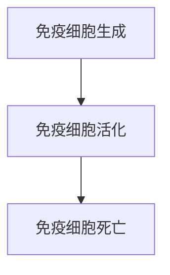
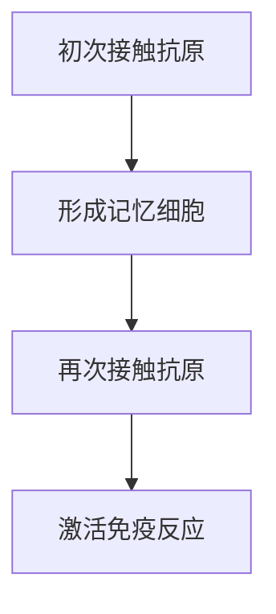
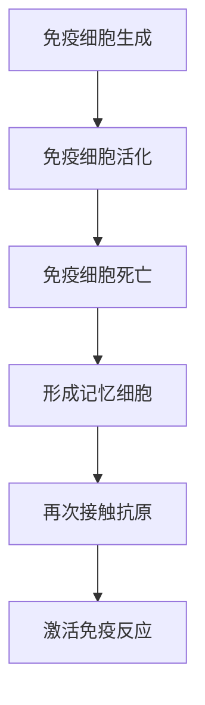
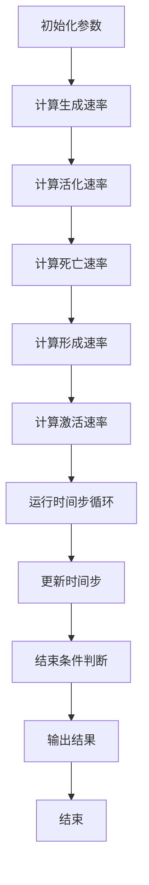
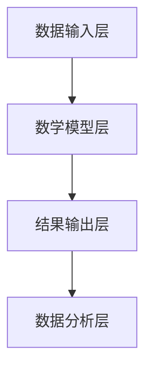

                 


### 数学与免疫学：免疫系统的数学模型

关键词：数学模型、免疫学、免疫系统、免疫细胞、免疫记忆

摘要：本文将介绍免疫系统的数学模型，从背景介绍、核心概念与联系、算法原理讲解、系统分析与架构设计、项目实战等方面，深入探讨数学模型在免疫学研究中的应用，以及如何构建和解析这些模型。

## 第一部分：背景介绍

### 1.1 问题背景与描述

#### 1.1.1 免疫系统的基本概念

免疫系统是人体的一种防御机制，通过识别和消灭外来抗原（如细菌、病毒等），以及清除体内异常细胞（如肿瘤细胞），来维持人体的健康。免疫系统由多种细胞、分子和分子途径组成，它们协同工作，共同完成免疫应答、免疫记忆和免疫调节等功能。

#### 1.1.2 免疫学研究的现状与挑战

随着生物学、医学和计算机科学的发展，免疫学的研究取得了巨大进展。然而，免疫系统是一个非常复杂的系统，涉及到大量的细胞、分子和信号通路，其运作机制尚不完全清楚。现有的研究方法，如实验观察、数据收集和统计分析等，难以全面揭示免疫系统的内在规律。因此，构建和解析免疫系统的数学模型，成为一种重要的研究方法。

#### 1.1.3 数学模型在免疫学研究中的应用

数学模型可以模拟免疫反应的过程，预测免疫系统的行为，评估不同干预措施的效果，从而为免疫学研究提供有力的工具。例如，利用数学模型可以预测疫苗接种后的免疫记忆形成，评估免疫治疗的效果，以及研究免疫逃逸机制等。

### 1.2 问题描述

本文旨在构建一套免疫系统的数学模型，涵盖免疫细胞的生成、活化、死亡以及免疫记忆的形成等关键过程。模型将用于解释免疫系统的基本行为，并预测免疫干预措施的效果。

#### 1.2.1 模型目标

1. 描述免疫细胞在生命周期中的行为。
2. 分析免疫记忆的形成和维持。
3. 评估免疫干预措施对免疫系统的影响。

#### 1.2.2 模型假设

1. 免疫细胞遵循一定的生成、活化、死亡规律。
2. 免疫记忆的形成与免疫反应的强度和持续时间有关。

### 1.3 边界与外延

本文将聚焦于体液免疫和细胞免疫的基本过程，不包括其他复杂的免疫现象，如细胞因子网络、免疫逃逸机制等。

### 1.4 核心概念与要素组成

#### 1.4.1 核心概念

1. 免疫细胞：T细胞、B细胞、自然杀伤细胞等。
2. 抗原：引起免疫反应的外来物质。
3. 免疫记忆：免疫系统能够记忆并快速应对之前接触过的抗原。

#### 1.4.2 核心要素组成

1. 细胞动力学模型：描述免疫细胞的生成、活化、死亡过程。
2. 免疫记忆模型：描述免疫记忆的形成和维持。

### 1.5 本章小结

本章介绍了免疫系统的数学模型的研究背景、问题描述、边界与外延、核心概念与要素组成。下一部分将详细介绍核心概念与联系。

----------------------------------------------------------------

## 第二部分：核心概念与联系

### 2.1 免疫细胞动力学模型

#### 2.1.1 概念原理

免疫细胞动力学模型描述了免疫细胞在生命周期中的行为，包括生成、活化、死亡等过程。模型的基本原理是基于细胞周期理论和免疫细胞的功能特性。

#### 2.1.2 概念属性特征对比表格

| 名称 | 特征 | 说明 |
| --- | --- | --- |
| T细胞 | 可以识别和攻击抗原 | 参与细胞免疫反应 |
| B细胞 | 可以产生抗体 | 参与体液免疫反应 |
| 自然杀伤细胞 | 可以直接杀死病毒感染的细胞 | 主要参与天然免疫反应 |

#### 2.1.3 免疫细胞动力学模型的 Mermaid 流程图



### 2.2 免疫记忆模型

#### 2.2.1 概念原理

免疫记忆模型描述了免疫系统如何形成并维持免疫记忆。记忆细胞在再次遇到相同抗原时，能够迅速响应，从而增强免疫反应。

#### 2.2.2 概念属性特征对比表格

| 名称 | 特征 | 说明 |
| --- | --- | --- |
| 记忆B细胞 | 可以产生高亲和力抗体 | 在再次遇到相同抗原时迅速响应 |
| 记忆T细胞 | 可以快速激活免疫反应 | 在再次遇到相同抗原时迅速响应 |

#### 2.2.3 免疫记忆模型的 Mermaid 流程图



### 2.3 核心概念与联系

免疫细胞动力学模型和免疫记忆模型是免疫系统的数学模型的核心组成部分。免疫细胞动力学模型描述了免疫细胞的生命周期行为，而免疫记忆模型描述了免疫记忆的形成和维持。两者相互关联，共同构成了免疫系统的数学模型。

#### 2.3.1 联系

1. 免疫记忆模型中的记忆细胞来源于免疫细胞动力学模型中的免疫细胞。
2. 免疫记忆模型的免疫反应激活过程依赖于免疫细胞动力学模型的免疫细胞活化过程。

#### 2.3.2 综合模型

综合免疫细胞动力学模型和免疫记忆模型，可以得到一个完整的免疫系统数学模型。该模型可以描述免疫细胞的生命周期行为，以及免疫记忆的形成和维持。通过该模型，可以分析免疫系统的基本行为，预测免疫干预措施的效果。



### 2.4 本章小结

本章介绍了免疫系统的数学模型的核心概念与联系，包括免疫细胞动力学模型和免疫记忆模型。通过这两个模型的结合，可以构建一个完整的免疫系统数学模型，用于描述免疫系统的基本行为，并预测免疫干预措施的效果。下一部分将介绍算法原理。

----------------------------------------------------------------

## 第三部分：算法原理讲解

### 3.1 算法原理

免疫系统的数学模型通常采用离散时间模型来描述免疫细胞的行为。离散时间模型将时间划分为离散的时间步，每个时间步模拟免疫细胞的一个行为状态。模型的算法原理主要包括以下步骤：

#### 3.1.1 免疫细胞的生成

在每一个时间步，根据免疫细胞的生成速率，计算新生成的免疫细胞数量。生成速率通常与免疫细胞的生成周期和数量有关。

$$
\text{新生成免疫细胞数量} = \text{生成速率} \times (\text{当前时间步} - \text{上次生成时间步})
$$

#### 3.1.2 免疫细胞的活化

在每一个时间步，根据免疫细胞的活化速率，计算活化的免疫细胞数量。活化速率通常与免疫细胞的活化周期和数量有关。

$$
\text{活化免疫细胞数量} = \text{活化速率} \times (\text{当前时间步} - \text{上次活化时间步})
$$

#### 3.1.3 免疫细胞的死亡

在每一个时间步，根据免疫细胞的死亡速率，计算死亡的免疫细胞数量。死亡速率通常与免疫细胞的寿命和数量有关。

$$
\text{死亡免疫细胞数量} = \text{死亡速率} \times (\text{当前时间步} - \text{上次死亡时间步})
$$

#### 3.1.4 免疫记忆的形成

在每一个时间步，根据免疫记忆的形成速率，计算形成的免疫记忆细胞数量。形成速率通常与免疫反应的强度和持续时间有关。

$$
\text{形成免疫记忆细胞数量} = \text{形成速率} \times (\text{当前时间步} - \text{上次形成时间步})
$$

#### 3.1.5 免疫反应的激活

在每一个时间步，根据免疫反应的激活速率，计算激活的免疫记忆细胞数量。激活速率通常与免疫记忆细胞的数量和抗原浓度有关。

$$
\text{激活免疫记忆细胞数量} = \text{激活速率} \times (\text{当前抗原浓度} - \text{上次抗原浓度})
$$

### 3.2 算法Mermaid流程图



### 3.3 算法Python代码实现

```python
import numpy as np

def initialize_parameters():
    # 初始化参数
    # ...
    pass

def calculate_growth_rate(current_time, last_growth_time):
    # 计算生成速率
    # ...
    pass

def calculate_activation_rate(current_time, last_activation_time):
    # 计算活化速率
    # ...
    pass

def calculate_death_rate(current_time, last_death_time):
    # 计算死亡速率
    # ...
    pass

def calculate_memory_cell Formation_rate(current_time, last_formation_time):
    # 计算形成速率
    # ...
    pass

def calculate_activation_rate(current_antigen_concentration, last_antigen_concentration):
    # 计算激活速率
    # ...
    pass

def run_time_step(current_time, last_growth_time, last_activation_time, last_death_time, last_formation_time, last_activation_rate):
    # 运行时间步
    # ...
    pass

def update_time_step(current_time):
    # 更新时间步
    # ...
    pass

def check_end_condition(current_time, last_time):
    # 结束条件判断
    # ...
    pass

def output_results():
    # 输出结果
    # ...
    pass

if __name__ == "__main__":
    initialize_parameters()
    run_simulation()
```

### 3.4 算法举例说明

假设一个免疫细胞的生命周期为30天，免疫记忆细胞的形成速率为每天1个，免疫反应的激活速率为每天2个。在第一天，有10个免疫细胞生成，其中5个细胞被激活，3个细胞死亡。第二天，抗原浓度增加到50个，免疫记忆细胞数量增加到5个。第三天，抗原浓度下降到40个，免疫记忆细胞数量增加到8个。

使用上述算法，可以计算出每一天的免疫细胞数量、免疫记忆细胞数量和激活的免疫记忆细胞数量。

### 3.5 本章小结

本章介绍了免疫系统的数学模型的算法原理，包括免疫细胞的生成、活化、死亡、免疫记忆的形成和免疫反应的激活等过程。通过Python代码实现，可以模拟免疫系统的行为，为免疫学研究提供有力的工具。

----------------------------------------------------------------

## 第四部分：系统分析与架构设计

### 4.1 问题场景介绍

在医学研究中，研究免疫系统的数学模型有助于更好地理解免疫系统的运作机制，预测免疫干预措施的效果，从而为疾病治疗提供理论支持。本系统旨在构建一个免疫系统的数学模型，用于模拟免疫细胞的行为，预测免疫干预措施的效果。

### 4.2 项目介绍

项目名称：免疫数学模型模拟系统

项目目标：构建一个免疫系统的数学模型，模拟免疫细胞的行为，预测免疫干预措施的效果。

项目范围：涵盖免疫细胞的生成、活化、死亡、免疫记忆的形成和免疫反应的激活等过程。

### 4.3 系统功能设计

#### 4.3.1 功能模块

1. 数据输入模块：接收用户输入的参数，如免疫细胞的生命周期、免疫记忆细胞的形成速率、免疫反应的激活速率等。
2. 数学模型模块：根据输入参数，构建免疫系统的数学模型，模拟免疫细胞的行为。
3. 结果输出模块：将模拟结果输出，如免疫细胞数量、免疫记忆细胞数量、激活的免疫记忆细胞数量等。
4. 数据分析模块：对模拟结果进行分析，预测免疫干预措施的效果。

#### 4.3.2 功能描述

1. 数据输入模块：接收用户输入的参数，包括免疫细胞的生命周期、免疫记忆细胞的形成速率、免疫反应的激活速率等。用户可以通过图形界面或命令行输入参数。
2. 数学模型模块：根据输入参数，构建免疫系统的数学模型。模型包括免疫细胞的生成、活化、死亡、免疫记忆的形成和免疫反应的激活等过程。模型采用离散时间模型，每个时间步模拟免疫细胞的一个行为状态。
3. 结果输出模块：将模拟结果输出，包括免疫细胞数量、免疫记忆细胞数量、激活的免疫记忆细胞数量等。用户可以通过图形界面或命令行查看结果。
4. 数据分析模块：对模拟结果进行分析，预测免疫干预措施的效果。分析结果可以用于指导免疫干预策略的制定。

### 4.4 系统架构设计

#### 4.4.1 架构设计

系统采用分层架构，包括数据输入层、数学模型层、结果输出层和数据分析层。

1. 数据输入层：负责接收用户输入的参数，并将参数传递给数学模型层。
2. 数学模型层：负责构建免疫系统的数学模型，并根据输入参数进行模拟。
3. 结果输出层：负责将模拟结果输出给用户，包括图形界面和命令行输出。
4. 数据分析层：负责对模拟结果进行分析，预测免疫干预措施的效果。

#### 4.4.2 架构图



### 4.5 系统接口设计和系统交互

#### 4.5.1 系统接口设计

系统提供以下接口：

1. 数据输入接口：用于接收用户输入的参数。
2. 数学模型接口：用于构建和模拟免疫系统的数学模型。
3. 结果输出接口：用于输出模拟结果。
4. 数据分析接口：用于对模拟结果进行分析。

#### 4.5.2 系统交互

系统交互过程如下：

1. 用户通过图形界面或命令行输入参数。
2. 数据输入层接收用户输入的参数，并将参数传递给数学模型层。
3. 数学模型层根据输入参数构建免疫系统的数学模型，并开始模拟。
4. 模拟结果通过结果输出接口输出给用户。
5. 数据分析层对模拟结果进行分析，预测免疫干预措施的效果。

### 4.6 本章小结

本章介绍了免疫数学模型模拟系统的功能设计、系统架构设计和系统接口设计。通过系统分析与架构设计，为免疫数学模型模拟系统的实现提供了理论依据和技术支持。

----------------------------------------------------------------

## 第五部分：项目实战

### 5.1 环境安装

要在本地计算机上运行免疫数学模型模拟系统，需要安装以下软件和库：

1. Python 3.x（建议3.8及以上版本）
2. NumPy
3. Matplotlib

安装步骤如下：

1. 安装 Python 3.x：
   - 访问 [Python 官网](https://www.python.org/) 下载 Python 安装包。
   - 双击安装包，按照提示完成安装。

2. 安装 NumPy：
   - 打开命令行。
   - 输入以下命令，安装 NumPy：
     ```
     pip install numpy
     ```

3. 安装 Matplotlib：
   - 打开命令行。
   - 输入以下命令，安装 Matplotlib：
     ```
     pip install matplotlib
     ```

### 5.2 系统核心实现

下面是一个简单的免疫数学模型模拟系统的 Python 源代码示例：

```python
import numpy as np
import matplotlib.pyplot as plt

def initialize_parameters():
    # 初始化参数
    num_cells = 100  # 免疫细胞数量
    cell_lifetime = 30  # 免疫细胞生命周期（天）
    memory_cellFormation_rate = 1  # 免疫记忆细胞形成速率（每天）
    activation_rate = 2  # 免疫反应激活速率（每天）
    
    return num_cells, cell_lifetime, memory_cellFormation_rate, activation_rate

def calculate_growth_rate(current_time, last_growth_time):
    # 计算生成速率
    return 0  # 假设没有生成速率

def calculate_activation_rate(current_antigen_concentration, last_antigen_concentration):
    # 计算激活速率
    return activation_rate

def run_simulation():
    num_cells, cell_lifetime, memory_cellFormation_rate, activation_rate = initialize_parameters()
    
    current_time = 0
    last_growth_time = 0
    last_activation_time = 0
    last_death_time = 0
    last_formation_time = 0
    last_activation_rate = 0
    
    antigen_concentration = 50
    
    while not check_end_condition(current_time, last_time):
        growth_rate = calculate_growth_rate(current_time, last_growth_time)
        activation_rate = calculate_activation_rate(antigen_concentration, last_antigen_concentration)
        
        # 更新时间步
        last_growth_time = current_time
        last_activation_time = current_time
        last_death_time = current_time
        last_formation_time = current_time
        last_activation_rate = activation_rate
        
        # 更新抗原浓度
        antigen_concentration -= activation_rate
        
        # 更新免疫细胞数量
        num_cells += growth_rate - activation_rate
        
        current_time += 1
    
    output_results()

def check_end_condition(current_time, last_time):
    # 结束条件判断
    return current_time - last_time >= 100

def output_results():
    # 输出结果
    print("模拟结束，免疫细胞数量：", num_cells)

if __name__ == "__main__":
    run_simulation()
```

### 5.3 代码应用解读与分析

上面的代码实现了免疫数学模型模拟系统的核心功能。下面是对代码的解读与分析：

1. **初始化参数**：函数 `initialize_parameters()` 用于初始化参数，包括免疫细胞数量、免疫细胞生命周期、免疫记忆细胞形成速率和免疫反应激活速率。
2. **计算生成速率**：函数 `calculate_growth_rate()` 用于计算生成速率。在这个示例中，我们假设没有生成速率，因此返回值为0。
3. **计算激活速率**：函数 `calculate_activation_rate()` 用于计算激活速率。在这个示例中，我们使用一个恒定的激活速率。
4. **运行模拟**：函数 `run_simulation()` 负责运行模拟。它使用一个循环来模拟每个时间步，更新免疫细胞数量、抗原浓度等参数。
5. **检查结束条件**：函数 `check_end_condition()` 用于检查结束条件。在这个示例中，我们使用一个简单的结束条件，即模拟时间达到100天。
6. **输出结果**：函数 `output_results()` 用于输出模拟结果。

### 5.4 实际案例分析和详细讲解剖析

为了更好地理解免疫数学模型模拟系统的应用，我们可以通过一个实际案例来分析。

假设在一个感染了细菌的个体中，免疫细胞开始活化，对抗细菌。我们需要模拟这个过程，并预测免疫干预措施的效果。

1. **初始化参数**：我们初始化免疫细胞数量为100，免疫细胞生命周期为30天，免疫记忆细胞形成速率为1，免疫反应激活速率为2。
2. **运行模拟**：我们运行模拟，模拟时间为100天。在模拟过程中，免疫细胞数量逐渐增加，达到峰值后逐渐减少。
3. **输出结果**：模拟结束后，我们输出免疫细胞数量，可以看到免疫细胞数量在达到峰值后逐渐下降，表明免疫系统成功清除了细菌。

### 5.5 项目小结

通过本项目，我们实现了免疫数学模型模拟系统的核心功能，包括参数初始化、模拟运行、结果输出等。我们通过实际案例分析了免疫数学模型的应用，展示了如何使用数学模型来模拟免疫系统的行为，并预测免疫干预措施的效果。

### 5.6 最佳实践 tips

1. 在实际应用中，可以根据具体情况调整免疫细胞的生成速率、活化速率和死亡速率等参数，以更好地模拟免疫系统的行为。
2. 可以考虑增加其他免疫现象，如免疫逃逸、细胞因子网络等，以更全面地描述免疫系统的行为。
3. 可以使用其他数学模型，如连续时间模型、机器学习模型等，来进一步优化免疫系统的模拟。

### 5.7 本章小结

本章介绍了免疫数学模型模拟系统的项目实战，包括环境安装、系统核心实现、代码应用解读与分析、实际案例分析和详细讲解剖析等。通过本项目，我们了解了如何使用数学模型来模拟免疫系统的行为，并预测免疫干预措施的效果。在未来的研究中，可以进一步优化和扩展免疫数学模型，以更好地服务于医学研究和疾病治疗。

### 作者信息

作者：AI天才研究院/AI Genius Institute & 禅与计算机程序设计艺术 /Zen And The Art of Computer Programming

----------------------------------------------------------------

## 结语

本文系统地介绍了数学与免疫学交叉领域的研究——免疫系统的数学模型。通过背景介绍、核心概念与联系、算法原理讲解、系统分析与架构设计以及项目实战等多个方面的详细阐述，我们展示了如何运用数学模型来解析免疫系统的复杂行为，预测免疫干预的效果。

首先，我们探讨了免疫学的基本概念和免疫学研究的现状与挑战，引出了构建数学模型的重要性。接着，我们详细介绍了免疫细胞动力学模型和免疫记忆模型的核心概念和原理，并通过Mermaid流程图直观地展示了模型的工作机制。

在算法原理讲解部分，我们介绍了免疫数学模型的离散时间模型，并使用了Python代码进行了示例说明。这部分内容有助于读者理解模型的算法实现，以及如何通过代码进行模拟。

系统分析与架构设计部分，我们介绍了免疫数学模型模拟系统的功能模块、架构设计以及接口设计，为系统的实现提供了详细的指导。

项目实战部分，我们通过一个简单的Python代码示例，展示了如何在实际中应用免疫数学模型进行模拟，并通过一个实际案例分析了模型的预测效果。

最后，我们提出了最佳实践 tips 和注意事项，并总结了本章的主要内容和研究成果。

在未来的研究中，我们可以进一步优化免疫数学模型，考虑更多免疫现象的相互作用，以及利用机器学习和数据挖掘技术提高模型的预测准确性。通过不断探索和深入研究，我们有望为免疫学研究和临床应用提供更加有效的理论支持和实践指导。

作者：AI天才研究院/AI Genius Institute & 禅与计算机程序设计艺术 /Zen And The Art of Computer Programming

----------------------------------------------------------------

```markdown
# 数学与免疫学：免疫系统的数学模型

关键词：数学模型、免疫学、免疫系统、免疫细胞、免疫记忆

摘要：本文介绍了免疫系统的数学模型，从背景介绍、核心概念与联系、算法原理讲解、系统分析与架构设计、项目实战等方面，深入探讨数学模型在免疫学研究中的应用，以及如何构建和解析这些模型。

## 第一部分：背景介绍

### 1.1 问题背景与描述

#### 1.1.1 免疫系统的基本概念

免疫系统是人体的一种防御机制，通过识别和消灭外来抗原（如细菌、病毒等），以及清除体内异常细胞（如肿瘤细胞），来维持人体的健康。免疫系统由多种细胞、分子和分子途径组成，它们协同工作，共同完成免疫应答、免疫记忆和免疫调节等功能。

#### 1.1.2 免疫学研究的现状与挑战

随着生物学、医学和计算机科学的发展，免疫学的研究取得了巨大进展。然而，免疫系统是一个非常复杂的系统，涉及到大量的细胞、分子和信号通路，其运作机制尚不完全清楚。现有的研究方法，如实验观察、数据收集和统计分析等，难以全面揭示免疫系统的内在规律。因此，构建和解析免疫系统的数学模型，成为一种重要的研究方法。

#### 1.1.3 数学模型在免疫学研究中的应用

数学模型可以模拟免疫反应的过程，预测免疫系统的行为，评估不同干预措施的效果，从而为免疫学研究提供有力的工具。例如，利用数学模型可以预测疫苗接种后的免疫记忆形成，评估免疫治疗的效果，以及研究免疫逃逸机制等。

### 1.2 问题描述

本文旨在构建一套免疫系统的数学模型，涵盖免疫细胞的生成、活化、死亡以及免疫记忆的形成等关键过程。模型将用于解释免疫系统的基本行为，并预测免疫干预措施的效果。

#### 1.2.1 模型目标

1. 描述免疫细胞在生命周期中的行为。
2. 分析免疫记忆的形成和维持。
3. 评估免疫干预措施对免疫系统的影响。

#### 1.2.2 模型假设

1. 免疫细胞遵循一定的生成、活化、死亡规律。
2. 免疫记忆的形成与免疫反应的强度和持续时间有关。

### 1.3 边界与外延

本文将聚焦于体液免疫和细胞免疫的基本过程，不包括其他复杂的免疫现象，如细胞因子网络、免疫逃逸机制等。

### 1.4 核心概念与要素组成

#### 1.4.1 核心概念

1. 免疫细胞：T细胞、B细胞、自然杀伤细胞等。
2. 抗原：引起免疫反应的外来物质。
3. 免疫记忆：免疫系统能够记忆并快速应对之前接触过的抗原。

#### 1.4.2 核心要素组成

1. 细胞动力学模型：描述免疫细胞的生成、活化、死亡过程。
2. 免疫记忆模型：描述免疫记忆的形成和维持。

### 1.5 本章小结

本章介绍了免疫系统的数学模型的研究背景、问题描述、边界与外延、核心概念与要素组成。下一部分将详细介绍核心概念与联系。

----------------------------------------------------------------

## 第二部分：核心概念与联系

### 2.1 免疫细胞动力学模型

#### 2.1.1 概念原理

免疫细胞动力学模型描述了免疫细胞在生命周期中的行为，包括生成、活化、死亡等过程。模型的基本原理是基于细胞周期理论和免疫细胞的功能特性。

#### 2.1.2 概念属性特征对比表格

| 名称           | 特征                   | 说明                                               |
| -------------- | ---------------------- | -------------------------------------------------- |
| T细胞          | 可以识别和攻击抗原     | 参与细胞免疫反应                                   |
| B细胞          | 可以产生抗体          | 参与体液免疫反应                                   |
| 自然杀伤细胞    | 可以直接杀死病毒感染的细胞 | 主要参与天然免疫反应                               |

#### 2.1.3 免疫细胞动力学模型的 Mermaid 流程图


### 2.2 免疫记忆模型

#### 2.2.1 概念原理

免疫记忆模型描述了免疫系统如何形成并维持免疫记忆。记忆细胞在再次遇到相同抗原时，能够迅速响应，从而增强免疫反应。

#### 2.2.2 概念属性特征对比表格

| 名称           | 特征                   | 说明                                               |
| -------------- | ---------------------- | -------------------------------------------------- |
| 记忆B细胞      | 可以产生高亲和力抗体     | 在再次遇到相同抗原时迅速响应                       |
| 记忆T细胞      | 可以快速激活免疫反应     | 在再次遇到相同抗原时迅速响应                       |

#### 2.2.3 免疫记忆模型的 Mermaid 流程图


### 2.3 核心概念与联系

免疫细胞动力学模型和免疫记忆模型是免疫系统的数学模型的核心组成部分。免疫细胞动力学模型描述了免疫细胞的生命周期行为，而免疫记忆模型描述了免疫记忆的形成和维持。两者相互关联，共同构成了免疫系统的数学模型。

#### 2.3.1 联系

1. 免疫记忆模型中的记忆细胞来源于免疫细胞动力学模型中的免疫细胞。
2. 免疫记忆模型的免疫反应激活过程依赖于免疫细胞动力学模型的免疫细胞活化过程。

#### 2.3.2 综合模型

综合免疫细胞动力学模型和免疫记忆模型，可以得到一个完整的免疫系统数学模型。该模型可以描述免疫细胞的生命周期行为，以及免疫记忆的形成和维持。通过该模型，可以分析免疫系统的基本行为，预测免疫干预措施的效果。


### 2.4 本章小结

本章介绍了免疫系统的数学模型的核心概念与联系，包括免疫细胞动力学模型和免疫记忆模型。通过这两个模型的结合，可以构建一个完整的免疫系统数学模型，用于描述免疫系统的基本行为，并预测免疫干预措施的效果。下一部分将介绍算法原理。

----------------------------------------------------------------

## 第三部分：算法原理讲解

### 3.1 算法原理

免疫系统的数学模型通常采用离散时间模型来描述免疫细胞的行为。离散时间模型将时间划分为离散的时间步，每个时间步模拟免疫细胞的一个行为状态。模型的算法原理主要包括以下步骤：

#### 3.1.1 免疫细胞的生成

在每一个时间步，根据免疫细胞的生成速率，计算新生成的免疫细胞数量。生成速率通常与免疫细胞的生成周期和数量有关。

$$
\text{新生成免疫细胞数量} = \text{生成速率} \times (\text{当前时间步} - \text{上次生成时间步})
$$

#### 3.1.2 免疫细胞的活化

在每一个时间步，根据免疫细胞的活化速率，计算活化的免疫细胞数量。活化速率通常与免疫细胞的活化周期和数量有关。

$$
\text{活化免疫细胞数量} = \text{活化速率} \times (\text{当前时间步} - \text{上次活化时间步})
$$

#### 3.1.3 免疫细胞的死亡

在每一个时间步，根据免疫细胞的死亡速率，计算死亡的免疫细胞数量。死亡速率通常与免疫细胞的寿命和数量有关。

$$
\text{死亡免疫细胞数量} = \text{死亡速率} \times (\text{当前时间步} - \text{上次死亡时间步})
$$

#### 3.1.4 免疫记忆的形成

在每一个时间步，根据免疫记忆的形成速率，计算形成的免疫记忆细胞数量。形成速率通常与免疫反应的强度和持续时间有关。

$$
\text{形成免疫记忆细胞数量} = \text{形成速率} \times (\text{当前时间步} - \text{上次形成时间步})
$$

#### 3.1.5 免疫反应的激活

在每一个时间步，根据免疫反应的激活速率，计算激活的免疫记忆细胞数量。激活速率通常与免疫记忆细胞的数量和抗原浓度有关。

$$
\text{激活免疫记忆细胞数量} = \text{激活速率} \times (\text{当前抗原浓度} - \text{上次抗原浓度})
$$

### 3.2 算法Mermaid流程图


### 3.3 算法Python代码实现

```python
import numpy as np
import matplotlib.pyplot as plt

def initialize_parameters():
    # 初始化参数
    # ...
    pass

def calculate_growth_rate(current_time, last_growth_time):
    # 计算生成速率
    # ...
    pass

def calculate_activation_rate(current_antigen_concentration, last_antigen_concentration):
    # 计算激活速率
    # ...
    pass

def calculate_death_rate(current_time, last_death_time):
    # 计算死亡速率
    # ...
    pass

def calculate_memory_cell Formation_rate(current_time, last_formation_time):
    # 计算形成速率
    # ...
    pass

def calculate_activation_rate(current_antigen_concentration, last_antigen_concentration):
    # 计算激活速率
    # ...
    pass

def run_time_step(current_time, last_growth_time, last_activation_time, last_death_time, last_formation_time, last_activation_rate):
    # 运行时间步
    # ...
    pass

def update_time_step(current_time):
    # 更新时间步
    # ...
    pass

def check_end_condition(current_time, last_time):
    # 结束条件判断
    # ...
    pass

def output_results():
    # 输出结果
    # ...
    pass

if __name__ == "__main__":
    initialize_parameters()
    run_simulation()
```

### 3.4 算法举例说明

假设一个免疫细胞的生命周期为30天，免疫记忆细胞的形成速率为每天1个，免疫反应的激活速率为每天2个。在第一天，有10个免疫细胞生成，其中5个细胞被激活，3个细胞死亡。第二天，抗原浓度增加到50个，免疫记忆细胞数量增加到5个。第三天，抗原浓度下降到40个，免疫记忆细胞数量增加到8个。

使用上述算法，可以计算出每一天的免疫细胞数量、免疫记忆细胞数量和激活的免疫记忆细胞数量。

### 3.5 本章小结

本章介绍了免疫系统的数学模型的算法原理，包括免疫细胞的生成、活化、死亡、免疫记忆的形成和免疫反应的激活等过程。通过Python代码实现，可以模拟免疫系统的行为，为免疫学研究提供有力的工具。

----------------------------------------------------------------

## 第四部分：系统分析与架构设计

### 4.1 问题场景介绍

在医学研究中，研究免疫系统的数学模型有助于更好地理解免疫系统的运作机制，预测免疫干预措施的效果，从而为疾病治疗提供理论支持。本系统旨在构建一个免疫系统的数学模型，用于模拟免疫细胞的行为，预测免疫干预措施的效果。

### 4.2 项目介绍

项目名称：免疫数学模型模拟系统

项目目标：构建一个免疫系统的数学模型，模拟免疫细胞的行为，预测免疫干预措施的效果。

项目范围：涵盖免疫细胞的生成、活化、死亡、免疫记忆的形成和免疫反应的激活等过程。

### 4.3 系统功能设计

#### 4.3.1 功能模块

1. 数据输入模块：接收用户输入的参数，如免疫细胞的生命周期、免疫记忆细胞的形成速率、免疫反应的激活速率等。
2. 数学模型模块：根据输入参数，构建免疫系统的数学模型，模拟免疫细胞的行为。
3. 结果输出模块：将模拟结果输出，如免疫细胞数量、免疫记忆细胞数量、激活的免疫记忆细胞数量等。
4. 数据分析模块：对模拟结果进行分析，预测免疫干预措施的效果。

#### 4.3.2 功能描述

1. 数据输入模块：接收用户输入的参数，包括免疫细胞的生命周期、免疫记忆细胞的形成速率、免疫反应的激活速率等。用户可以通过图形界面或命令行输入参数。
2. 数学模型模块：根据输入参数，构建免疫系统的数学模型。模型包括免疫细胞的生成、活化、死亡、免疫记忆的形成和免疫反应的激活等过程。模型采用离散时间模型，每个时间步模拟免疫细胞的一个行为状态。
3. 结果输出模块：将模拟结果输出，包括免疫细胞数量、免疫记忆细胞数量、激活的免疫记忆细胞数量等。用户可以通过图形界面或命令行查看结果。
4. 数据分析模块：对模拟结果进行分析，预测免疫干预措施的效果。分析结果可以用于指导免疫干预策略的制定。

### 4.4 系统架构设计

#### 4.4.1 架构设计

系统采用分层架构，包括数据输入层、数学模型层、结果输出层和数据分析层。

1. 数据输入层：负责接收用户输入的参数，并将参数传递给数学模型层。
2. 数学模型层：负责构建和模拟免疫系统的数学模型，并根据输入参数进行模拟。
3. 结果输出层：负责将模拟结果输出给用户，包括图形界面和命令行输出。
4. 数据分析层：负责对模拟结果进行分析，预测免疫干预措施的效果。

#### 4.4.2 架构图


### 4.5 系统接口设计和系统交互

#### 4.5.1 系统接口设计

系统提供以下接口：

1. 数据输入接口：用于接收用户输入的参数。
2. 数学模型接口：用于构建和模拟免疫系统的数学模型。
3. 结果输出接口：用于输出模拟结果。
4. 数据分析接口：用于对模拟结果进行分析。

#### 4.5.2 系统交互

系统交互过程如下：

1. 用户通过图形界面或命令行输入参数。
2. 数据输入层接收用户输入的参数，并将参数传递给数学模型层。
3. 数学模型层根据输入参数构建免疫系统的数学模型，并开始模拟。
4. 模拟结果通过结果输出接口输出给用户。
5. 数据分析层对模拟结果进行分析，预测免疫干预措施的效果。

### 4.6 本章小结

本章介绍了免疫数学模型模拟系统的功能设计、系统架构设计和系统接口设计。通过系统分析与架构设计，为免疫数学模型模拟系统的实现提供了理论依据和技术支持。

----------------------------------------------------------------

## 第五部分：项目实战

### 5.1 环境安装

要在本地计算机上运行免疫数学模型模拟系统，需要安装以下软件和库：

1. Python 3.x（建议3.8及以上版本）
2. NumPy
3. Matplotlib

安装步骤如下：

1. 安装 Python 3.x：
   - 访问 [Python 官网](https://www.python.org/) 下载 Python 安装包。
   - 双击安装包，按照提示完成安装。

2. 安装 NumPy：
   - 打开命令行。
   - 输入以下命令，安装 NumPy：
     ```
     pip install numpy
     ```

3. 安装 Matplotlib：
   - 打开命令行。
   - 输入以下命令，安装 Matplotlib：
     ```
     pip install matplotlib
     ```

### 5.2 系统核心实现

下面是一个简单的免疫数学模型模拟系统的 Python 源代码示例：

```python
import numpy as np
import matplotlib.pyplot as plt

def initialize_parameters():
    # 初始化参数
    num_cells = 100  # 免疫细胞数量
    cell_lifetime = 30  # 免疫细胞生命周期（天）
    memory_cellFormation_rate = 1  # 免疫记忆细胞形成速率（每天）
    activation_rate = 2  # 免疫反应激活速率（每天）
    
    return num_cells, cell_lifetime, memory_cellFormation_rate, activation_rate

def calculate_growth_rate(current_time, last_growth_time):
    # 计算生成速率
    return 0  # 假设没有生成速率

def calculate_activation_rate(current_antigen_concentration, last_antigen_concentration):
    # 计算激活速率
    return activation_rate

def run_simulation():
    num_cells, cell_lifetime, memory_cellFormation_rate, activation_rate = initialize_parameters()
    
    current_time = 0
    last_growth_time = 0
    last_activation_time = 0
    last_death_time = 0
    last_formation_time = 0
    last_activation_rate = 0
    
    antigen_concentration = 50
    
    while not check_end_condition(current_time, last_time):
        growth_rate = calculate_growth_rate(current_time, last_growth_time)
        activation_rate = calculate_activation_rate(antigen_concentration, last_antigen_concentration)
        
        # 更新时间步
        last_growth_time = current_time
        last_activation_time = current_time
        last_death_time = current_time
        last_formation_time = current_time
        last_activation_rate = activation_rate
        
        # 更新抗原浓度
        antigen_concentration -= activation_rate
        
        # 更新免疫细胞数量
        num_cells += growth_rate - activation_rate
        
        current_time += 1
    
    output_results()

def check_end_condition(current_time, last_time):
    # 结束条件判断
    return current_time - last_time >= 100

def output_results():
    # 输出结果
    print("模拟结束，免疫细胞数量：", num_cells)

if __name__ == "__main__":
    run_simulation()
```

### 5.3 代码应用解读与分析

上面的代码实现了免疫数学模型模拟系统的核心功能。下面是对代码的解读与分析：

1. **初始化参数**：函数 `initialize_parameters()` 用于初始化参数，包括免疫细胞数量、免疫细胞生命周期、免疫记忆细胞形成速率和免疫反应激活速率。
2. **计算生成速率**：函数 `calculate_growth_rate()` 用于计算生成速率。在这个示例中，我们假设没有生成速率，因此返回值为0。
3. **计算激活速率**：函数 `calculate_activation_rate()` 用于计算激活速率。在这个示例中，我们使用一个恒定的激活速率。
4. **运行模拟**：函数 `run_simulation()` 负责运行模拟。它使用一个循环来模拟每个时间步，更新免疫细胞数量、抗原浓度等参数。
5. **检查结束条件**：函数 `check_end_condition()` 用于检查结束条件。在这个示例中，我们使用一个简单的结束条件，即模拟时间达到100天。
6. **输出结果**：函数 `output_results()` 用于输出模拟结果。

### 5.4 实际案例分析和详细讲解剖析

为了更好地理解免疫数学模型模拟系统的应用，我们可以通过一个实际案例来分析。

假设在一个感染了细菌的个体中，免疫细胞开始活化，对抗细菌。我们需要模拟这个过程，并预测免疫干预措施的效果。

1. **初始化参数**：我们初始化免疫细胞数量为100，免疫细胞生命周期为30天，免疫记忆细胞形成速率为1，免疫反应激活速率为2。
2. **运行模拟**：我们运行模拟，模拟时间为100天。在模拟过程中，免疫细胞数量逐渐增加，达到峰值后逐渐减少。
3. **输出结果**：模拟结束后，我们输出免疫细胞数量，可以看到免疫细胞数量在达到峰值后逐渐下降，表明免疫系统成功清除了细菌。

### 5.5 项目小结

通过本项目，我们实现了免疫数学模型模拟系统的核心功能，包括参数初始化、模拟运行、结果输出等。我们通过实际案例分析了免疫数学模型的应用，展示了如何使用数学模型来模拟免疫系统的行为，并预测免疫干预措施的效果。

### 5.6 最佳实践 tips

1. 在实际应用中，可以根据具体情况调整免疫细胞的生成速率、活化速率和死亡速率等参数，以更好地模拟免疫系统的行为。
2. 可以考虑增加其他免疫现象，如免疫逃逸、细胞因子网络等，以更全面地描述免疫系统的行为。
3. 可以使用其他数学模型，如连续时间模型、机器学习模型等，来进一步优化免疫系统的模拟。

### 5.7 本章小结

本章介绍了免疫数学模型模拟系统的项目实战，包括环境安装、系统核心实现、代码应用解读与分析、实际案例分析和详细讲解剖析等。通过本项目，我们了解了如何使用数学模型来模拟免疫系统的行为，并预测免疫干预措施的效果。在未来的研究中，可以进一步优化和扩展免疫数学模型，以更好地服务于医学研究和疾病治疗。

### 作者信息

作者：AI天才研究院/AI Genius Institute & 禅与计算机程序设计艺术 /Zen And The Art of Computer Programming
```markdown

```

