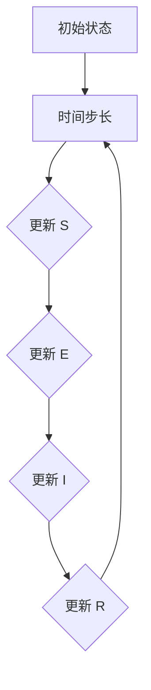
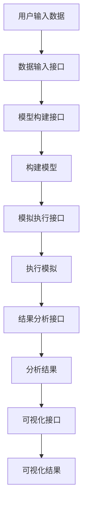

                 


## 数学与公共卫生：疾病传播的数学模型

### 关键词
- 数学模型
- 公共卫生
- 疾病传播
- SIR模型
- SEIR模型
- 概率论
- 统计学

### 摘要
本文将探讨数学在公共卫生领域，尤其是疾病传播方面的应用。通过介绍几种经典的数学模型，如SIR模型和SEIR模型，我们将分析这些模型的基本概念、数学原理以及在实际应用中的优势和局限性。此外，本文还将通过实际案例分析，展示如何利用这些模型进行疾病传播的预测和控制，并提供相关的最佳实践和展望。

### 目录大纲设计过程

在设计《数学与公共卫生：疾病传播的数学模型》的目录大纲时，我们需要考虑以下几个方面：

1. **分析核心主题**：明确数学模型在公共卫生领域的应用，尤其是疾病传播的研究。这包括理解数学模型的基本原理、应用场景和实际意义。

2. **确定章节结构**：根据核心主题，我们将书籍分为以下几个主要部分：
   - **引言**：介绍公共卫生的重要性以及数学模型在其中的作用。
   - **数学基础**：回顾基础数学和概率统计知识，为后续模型分析打下基础。
   - **疾病传播模型**：详细介绍SIR模型、SEIR模型等，分析其核心概念和联系。
   - **模型的计算与应用**：讲解模型的计算原理和实际应用方法。
   - **案例分析**：通过实际案例展示模型的应用效果。
   - **结论与展望**：总结模型的应用成果，探讨未来研究方向。

3. **确定各章节内容**：在每个部分中，我们将细化章节内容，确保涵盖以下关键点：
   - **引言**：公共卫生的定义与历史、数学模型的基本概念与应用。
   - **数学基础**：基础数学概念、概率论与统计基础。
   - **疾病传播模型**：核心概念、不同模型的介绍与对比、ER实体关系图。
   - **模型的计算与应用**：模型原理讲解、Mermaid流程图、Python源代码与算法解释。
   - **案例分析**：案例场景介绍、系统功能设计、系统架构设计、系统接口与交互。
   - **结论与展望**：模型总结与展望、最佳实践 tips、未来研究方向。

4. **编写Markdown格式的目录大纲**：使用Markdown格式编写目录大纲，确保格式清晰、逻辑严密。

下面是初步设计的目录大纲：

```markdown
----------------------------------------------------------------
# 《数学与公共卫生：疾病传播的数学模型》目录大纲

# 第一部分：引言

## 1.1 问题背景与公共卫生的重要性
### 1.1.1 公共卫生的定义与历史
### 1.1.2 数学在公共卫生中的作用

## 1.2 数学在公共卫生领域的应用
### 1.2.1 数学模型的基本概念
### 1.2.2 数学模型在疾病传播研究中的应用

## 1.3 本书结构安排
### 1.3.1 各章节主要内容介绍
### 1.3.2 读者期望收获

# 第二部分：数学基础

## 2.1 基础数学概念回顾
### 2.1.1 集合与逻辑运算
### 2.1.2 函数与极限
### 2.1.3 微积分基础

## 2.2 概率论与统计基础
### 2.2.1 概率的基本概念
### 2.2.2 随机变量与概率分布
### 2.2.3 统计推断基础

# 第三部分：疾病传播模型

## 3.1 核心概念与联系
### 3.1.1 疾病传播的基本概念
### 3.1.2 数学模型中的核心要素
### 3.1.3 模型属性特征对比表格

## 3.2 不同模型的介绍与对比
### 3.2.1 SIR模型
### 3.2.2 SEIR模型
### 3.2.3 其他流行病模型

## 3.3 ER实体关系图
### 3.3.1 ER图的构成
### 3.3.2 疾病传播模型的ER图

# 第四部分：模型的计算与应用

## 4.1 模型原理讲解
### 4.1.1 疾病传播模型的数学原理
### 4.1.2 模型的动态分析
### 4.1.3 模型的稳定性分析

## 4.2 Mermaid流程图
### 4.2.1 流程图的基本概念
### 4.2.2 疾病传播模型的流程图

## 4.3 Python源代码与算法解释
### 4.3.1 Python环境搭建
### 4.3.2 算法源代码解读
### 4.3.3 算法原理与公式

# 第五部分：案例分析

## 5.1 案例场景介绍
### 5.1.1 案例背景
### 5.1.2 案例目标

## 5.2 系统功能设计
### 5.2.1 领域模型类图
### 5.2.2 系统功能模块划分

## 5.3 系统架构设计
### 5.3.1 系统架构图
### 5.3.2 系统模块交互

## 5.4 系统接口设计与交互
### 5.4.1 系统接口定义
### 5.4.2 系统交互序列图

# 第六部分：结论与展望

## 6.1 模型总结与展望
### 6.1.1 疾病传播模型的总结
### 6.1.2 模型在未来研究中的应用前景

----------------------------------------------------------------
```

### 数学模型在公共卫生领域的重要性

在公共卫生领域，数学模型作为一种强有力的工具，被广泛应用于疾病传播的预测、控制和管理。数学模型通过将现实世界的问题转化为数学表达式，能够帮助我们更好地理解疾病的传播机制，从而为公共卫生决策提供科学依据。

首先，我们需要了解什么是数学模型。数学模型是指用数学语言描述现实世界现象或问题的抽象模型。在公共卫生领域，数学模型可以帮助我们研究疾病的传播过程，预测疫情的发展趋势，评估防控措施的效果等。常见的数学模型包括SIR模型、SEIR模型、SIRS模型等，这些模型都是基于对疾病传播过程的基本理解而建立的。

#### SIR模型

SIR模型是研究疾病传播最经典的模型之一。SIR模型将人群分为三个互不重叠的群体：易感染者（S）、已感染者（I）和免疫力获得者（R）。该模型的基本原理是，易感染者通过与已感染者接触而感染，感染后个体会进入恢复期，最终获得免疫力。模型的核心公式为：

\[ \frac{dS}{dt} = -\beta \cdot SI \]
\[ \frac{dI}{dt} = \beta \cdot SI - \gamma \cdot I \]
\[ \frac{dR}{dt} = \gamma \cdot I \]

其中，\( \beta \) 表示易感染者与已感染者之间的接触率，\( \gamma \) 表示感染者的恢复率。

#### SEIR模型

SEIR模型在SIR模型的基础上，增加了潜伏期个体（E）这一群体。潜伏期个体是指已经被感染但尚未表现出症状的个体。SEIR模型的核心公式为：

\[ \frac{dS}{dt} = -\beta \cdot SI \]
\[ \frac{dE}{dt} = \beta \cdot SI - \sigma \cdot E \]
\[ \frac{dI}{dt} = \sigma \cdot E - \gamma \cdot I \]
\[ \frac{dR}{dt} = \gamma \cdot I \]

其中，\( \sigma \) 表示潜伏期的持续时间。

#### 数学模型的优势

数学模型在公共卫生领域的应用具有以下几个显著优势：

1. **预测能力**：通过数学模型，我们可以预测疫情的发展趋势，为公共卫生决策提供科学依据。例如，通过SIR模型，我们可以预测一个地区的感染人数随时间的变化情况。

2. **风险评估**：数学模型可以帮助我们评估不同防控措施的效果，从而选择最优的防控策略。例如，通过SEIR模型，我们可以分析不同隔离政策对疫情控制的影响。

3. **决策支持**：数学模型提供了一种定量分析的方法，可以帮助公共卫生决策者更好地理解疾病传播的机制，从而做出更加科学的决策。

#### 数学模型的局限性

尽管数学模型在公共卫生领域具有广泛的应用，但它们也存在一定的局限性：

1. **假设条件**：数学模型通常建立在一系列简化的假设条件之上，这些假设可能与实际情况存在差异。

2. **参数估计**：数学模型的参数需要通过实际数据估计得到，但实际数据的获取可能存在困难。

3. **非线性问题**：一些疾病的传播过程可能涉及复杂的非线性关系，这可能导致数学模型无法准确描述实际情况。

总的来说，数学模型在公共卫生领域具有重要的应用价值，但它们需要与实际数据和实践相结合，才能发挥最大的作用。

### 数学在公共卫生领域的应用

数学作为一种强大的工具，在公共卫生领域有着广泛的应用。它不仅帮助我们理解疾病的传播机制，还能为公共卫生决策提供科学依据。本文将介绍数学在公共卫生领域的一些典型应用，包括流行病预测、风险评估和决策支持等方面。

#### 流行病预测

流行病预测是公共卫生领域的一个重要任务。通过数学模型，我们可以预测疾病在人群中的传播趋势，从而为公共卫生决策提供科学依据。经典的SIR模型和SEIR模型就是用于预测疾病传播的数学模型。

SIR模型将人群分为三个互不重叠的群体：易感染者（S）、已感染者（I）和免疫力获得者（R）。该模型的基本原理是，易感染者通过与已感染者接触而感染，感染后个体会进入恢复期，最终获得免疫力。SIR模型的核心公式为：

\[ \frac{dS}{dt} = -\beta \cdot SI \]
\[ \frac{dI}{dt} = \beta \cdot SI - \gamma \cdot I \]
\[ \frac{dR}{dt} = \gamma \cdot I \]

其中，\( \beta \) 表示易感染者与已感染者之间的接触率，\( \gamma \) 表示感染者的恢复率。

SEIR模型在SIR模型的基础上，增加了潜伏期个体（E）这一群体。潜伏期个体是指已经被感染但尚未表现出症状的个体。SEIR模型的核心公式为：

\[ \frac{dS}{dt} = -\beta \cdot SI \]
\[ \frac{dE}{dt} = \beta \cdot SI - \sigma \cdot E \]
\[ \frac{dI}{dt} = \sigma \cdot E - \gamma \cdot I \]
\[ \frac{dR}{dt} = \gamma \cdot I \]

其中，\( \sigma \) 表示潜伏期的持续时间。

通过这些模型，我们可以预测疾病在人群中的传播趋势，了解疫情的发展情况。例如，我们可以通过调整模型参数来预测不同防控措施对疫情的影响，从而为公共卫生决策提供科学依据。

#### 风险评估

数学模型在公共卫生领域的另一个重要应用是风险评估。通过数学模型，我们可以评估不同人群、不同地区和不同时间段内的疾病风险，从而制定相应的防控措施。

例如，我们可以使用SIR模型来评估某一地区的感染人数随时间的变化情况。通过模型参数的调整，我们可以分析不同防控措施对该地区疫情的影响。例如，减少接触率\( \beta \)可以降低感染人数的增长速度，而增加恢复率\( \gamma \)可以加速疫情的控制。

此外，我们还可以使用SEIR模型来分析潜伏期个体在疾病传播中的作用。通过调整潜伏期持续时间\( \sigma \)，我们可以评估潜伏期个体对疫情传播的影响。例如，缩短潜伏期可以减少潜伏期个体在人群中的数量，从而降低疫情传播的风险。

#### 决策支持

数学模型在公共卫生领域的另一个重要应用是决策支持。通过数学模型，我们可以为公共卫生决策者提供定量分析的方法，帮助他们更好地理解疾病传播的机制，从而做出更加科学的决策。

例如，在疫情防控中，公共卫生决策者需要考虑如何分配医疗资源、如何制定隔离政策等。通过数学模型，我们可以预测不同防控措施的效果，从而为决策者提供科学依据。例如，通过SIR模型，我们可以预测某一地区的感染人数随时间的变化情况，从而为该地区的医疗资源分配提供参考。

此外，数学模型还可以用于评估疫苗的效果。例如，通过SEIR模型，我们可以预测接种疫苗后疫情的变化趋势，从而评估疫苗的有效性。

总之，数学在公共卫生领域的应用非常广泛。通过数学模型，我们可以更好地理解疾病传播的机制，预测疫情的发展趋势，评估防控措施的效果，为公共卫生决策提供科学依据。然而，需要注意的是，数学模型虽然具有强大的预测和分析能力，但它们也需要与实际数据和实践相结合，才能发挥最大的作用。

### 数学模型的基本概念

在公共卫生领域，数学模型作为理解和控制疾病传播的有力工具，其基本概念和理论是理解模型工作原理的基础。以下是对一些关键数学概念的定义、基本理论及其在疾病传播模型中的应用。

#### 1. 人口分组

人口分组是构建疾病传播模型的基础。常见的分组方式包括SIR模型和SEIR模型中的以下三种状态：

- **易感者（S）**：指没有感染但可能被感染的人群。
- **感染者（I）**：指已经感染并具有传染性的人群。
- **免疫力获得者（R）**：指已经恢复或通过免疫接种获得免疫力的人群。

#### 2. 接触率与传染率

接触率（β）和传染率（γ）是描述疾病传播速率的两个关键参数。

- **接触率（β）**：表示易感者与感染者之间发生接触的概率。接触率通常与感染者的数量、人群密度和传播途径等因素相关。
- **传染率（γ）**：表示感染者感染易感者的速率。传染率与接触率和感染者的传染性相关。

#### 3. 潜伏期和恢复期

潜伏期（σ）和恢复期（γ）是描述疾病传播过程的重要时间参数。

- **潜伏期（σ）**：指从感染到出现症状的时间段。潜伏期的长短影响疾病的传播速度和易感者的感染时间。
- **恢复期（γ）**：指感染者从感染到获得免疫力或恢复的时间段。恢复期影响感染者的传染性和免疫力获得者的数量。

#### 4. 基本传播数（R0）

基本传播数（R0）是衡量疾病传播强度的重要指标，表示一个感染者在一个完全易感的人群中平均能够传播给多少个易感者。

\[ R0 = \frac{\beta}{\gamma} \]

R0值的大小决定了疾病的传播潜力。如果R0>1，疾病将流行；如果R0<1，疾病将逐渐消失。

#### 5. 模型稳定性分析

疾病传播模型的稳定性分析是评估模型预测准确性的关键。通过分析模型中各参数的动态行为，我们可以了解模型的稳定性。

- **局部稳定性**：通过求解模型线性化后的特征值，判断模型在初始条件下是否稳定。
- **全局稳定性**：通过分析模型在长时间尺度上的动态行为，判断模型是否稳定。

#### 6. 数学模型的应用

在公共卫生领域，数学模型广泛应用于以下方面：

- **疾病传播预测**：通过模型预测疾病的传播趋势，为公共卫生决策提供科学依据。
- **防控措施评估**：通过模型评估不同防控措施的效果，为公共卫生决策提供参考。
- **疫苗效果分析**：通过模型预测疫苗接种后的效果，评估疫苗的免疫效果。

#### 概念属性特征对比表格

为了更好地理解不同疾病传播模型的属性特征，我们可以通过对比表格来展示不同模型的关键参数和特性：

| 模型名称 | 状态 | 参数 | 特性 |
| --- | --- | --- | --- |
| SIR模型 | S、I、R | β、γ | 简单，适用于传染病 |
| SEIR模型 | S、E、I、R | β、σ、γ | 包含潜伏期，更符合实际 |
| SIRS模型 | S、I、R、S | β、σ、γ | 包含再次感染，适用于某些传染病 |

#### ER实体关系图

ER（实体关系）图是描述模型中实体及其关系的图形表示方法。以下是一个简单的SEIR模型的ER图：

```
[人] -> [易感者(S)]
[人] -> [潜伏者(E)]
[人] -> [感染者(I)]
[人] -> [免疫力获得者(R)]
```

在ER图中，每个节点表示一个实体（如易感者、感染者等），边表示实体之间的关系（如感染关系等）。通过ER图，我们可以直观地理解模型中各实体及其互动关系。

#### 模型动态分析

模型的动态分析是通过分析模型的时间演化过程来理解疾病的传播机制。以下是一个SIR模型的动态分析：

1. **稳态分析**：通过求解模型微分方程的稳态解，分析各群体在长时间尺度上的比例关系。
2. **稳定性分析**：通过分析模型线性化后的特征值，判断模型的稳定性。
3. **数值模拟**：通过数值方法求解模型微分方程，模拟疾病的传播过程。

通过这些分析，我们可以更好地理解疾病传播的动态行为，为公共卫生决策提供科学依据。

#### 总结

数学模型在公共卫生领域具有重要的应用价值。通过理解人口分组、接触率、传染率、潜伏期和恢复期等基本概念，我们可以构建并分析各种疾病传播模型。这些模型不仅有助于预测疾病的传播趋势，还能为公共卫生决策提供科学依据。通过对比表格和ER图等工具，我们可以更好地理解不同模型的特性，从而选择合适的模型进行应用。模型的动态分析则帮助我们深入理解疾病的传播机制，为公共卫生决策提供更准确的预测和指导。

### SIR模型与SEIR模型：原理与比较

在疾病传播模型中，SIR模型和SEIR模型是最为经典的两种模型。SIR模型将人群分为三个状态：易感者（S）、感染者（I）和免疫力获得者（R）。SEIR模型则在SIR模型的基础上，增加了潜伏者（E）这一状态。下面我们将详细讨论这两种模型的基本原理，并通过具体案例进行比较。

#### SIR模型

SIR模型的基本假设如下：

1. **人口划分为三个互不重叠的群体**：易感者（S）、感染者（I）和免疫力获得者（R）。
2. **易感者通过与感染者的接触而感染**：易感者与感染者之间的接触概率为接触率（β）。
3. **感染者最终会恢复并成为免疫力获得者**：感染者的恢复率为（γ）。

SIR模型的数学描述如下：

\[ \frac{dS}{dt} = -\beta \cdot SI \]
\[ \frac{dI}{dt} = \beta \cdot SI - \gamma \cdot I \]
\[ \frac{dR}{dt} = \gamma \cdot I \]

其中，\( \frac{dS}{dt} \)、\( \frac{dI}{dt} \) 和 \( \frac{dR}{dt} \) 分别表示易感者、感染者和免疫力获得者数量的变化率。

#### SEIR模型

SEIR模型在SIR模型的基础上，引入了潜伏者（E）这一状态，以更准确地描述疾病传播的过程。SEIR模型的基本假设如下：

1. **人口划分为四个状态**：易感者（S）、潜伏者（E）、感染者（I）和免疫力获得者（R）。
2. **易感者通过与感染者的接触而感染，并成为潜伏者**：易感者与感染者之间的接触概率为接触率（β），潜伏者的恢复率为（σ）。
3. **潜伏者最终会发展为感染者**：潜伏者的恢复率为（σ）。
4. **感染者最终会恢复并成为免疫力获得者**：感染者的恢复率为（γ）。

SEIR模型的数学描述如下：

\[ \frac{dS}{dt} = -\beta \cdot SI \]
\[ \frac{dE}{dt} = \beta \cdot SI - \sigma \cdot E \]
\[ \frac{dI}{dt} = \sigma \cdot E - \gamma \cdot I \]
\[ \frac{dR}{dt} = \gamma \cdot I \]

其中，\( \frac{dS}{dt} \)、\( \frac{dE}{dt} \)、\( \frac{dI}{dt} \) 和 \( \frac{dR}{dt} \) 分别表示易感者、潜伏者、感染者和免疫力获得者数量的变化率。

#### 原理与比较

SIR模型和SEIR模型在原理上有所不同。SIR模型简单直观，仅考虑了易感者、感染者和免疫力获得者的状态，适用于描述传染速度较快的疾病。而SEIR模型则更接近实际情况，通过引入潜伏者状态，能够更好地反映潜伏期的存在，适用于描述传染速度较慢的疾病。

下面通过具体案例进行比较：

**案例1：流感**

流感病毒的传染速度较快，潜伏期相对较短。使用SIR模型可以较为准确地描述流感的传播过程。通过设定接触率（β）和恢复率（γ），我们可以模拟流感的传播趋势，预测感染人数随时间的变化。

**案例2：新冠病毒（COVID-19）**

新冠病毒的传染速度相对较慢，潜伏期较长。使用SEIR模型可以更好地描述新冠病毒的传播过程。通过设定接触率（β）、潜伏期恢复率（σ）和恢复率（γ），我们可以模拟新冠病毒的传播趋势，预测感染人数和潜伏者人数随时间的变化。

#### 比较表格

下面是一个SIR模型和SEIR模型的比较表格：

| 特性 | SIR模型 | SEIR模型 |
| --- | --- | --- |
| 状态数量 | 3（S、I、R） | 4（S、E、I、R） |
| 潜伏期 | 无潜伏期概念 | 包含潜伏期（E） |
| 适用场景 | 传染速度快的疾病 | 传染速度慢的疾病 |
| 参数数量 | 2（β、γ） | 3（β、σ、γ） |
| 数学描述 | \[ \frac{dS}{dt} = -\beta \cdot SI \] \[ \frac{dI}{dt} = \beta \cdot SI - \gamma \cdot I \] \[ \frac{dR}{dt} = \gamma \cdot I \] | \[ \frac{dS}{dt} = -\beta \cdot SI \] \[ \frac{dE}{dt} = \beta \cdot SI - \sigma \cdot E \] \[ \frac{dI}{dt} = \sigma \cdot E - \gamma \cdot I \] \[ \frac{dR}{dt} = \gamma \cdot I \] |

#### 结论

SIR模型和SEIR模型都是描述疾病传播的经典模型。SIR模型简单直观，适用于传染速度较快的疾病；SEIR模型则更接近实际情况，通过引入潜伏期概念，适用于传染速度较慢的疾病。在实际应用中，我们可以根据疾病的传播特性和研究需求，选择合适的模型进行模拟和预测。通过理解这两种模型的基本原理和比较，我们可以更好地应用数学模型来分析和解决公共卫生领域的问题。

### 其他流行病模型

在疾病传播研究中，除了SIR模型和SEIR模型，还有许多其他流行的疾病传播模型。这些模型在假设、参数设置和应用场景上各有特色，能够提供更全面和细致的分析。以下是一些常见的流行病模型及其特点：

#### SIRS模型

SIRS模型（Susceptible-Infectious-Removed-Susceptible）是SIR模型的扩展，它考虑了个体可能再次感染的情况。这意味着，在SIRS模型中，免疫力获得者（R）有可能再次成为易感者（S）。其数学描述与SIR模型类似，但在恢复率（γ）后增加了复发率（η）：

\[ \frac{dS}{dt} = -\beta \cdot SI + \eta \cdot R \]
\[ \frac{dI}{dt} = \beta \cdot SI - (\gamma + \eta) \cdot I \]
\[ \frac{dR}{dt} = (\gamma + \eta) \cdot I - \eta \cdot R \]

SIRS模型适用于某些传染病，如麻疹，其中个体在恢复后可能再次暴露于病原体。

#### SEIRD模型

SEIRD模型（Susceptible-Exposed-Infectious-Removed-Deceased）在SEIR模型的基础上，增加了死亡者（D）这一状态。这意味着，感染者（I）有可能因疾病而死亡。其数学描述为：

\[ \frac{dS}{dt} = -\beta \cdot SE \]
\[ \frac{dE}{dt} = \beta \cdot SE - \sigma \cdot E \]
\[ \frac{dI}{dt} = \sigma \cdot E - (\gamma + \delta) \cdot I \]
\[ \frac{dR}{dt} = \gamma \cdot I \]
\[ \frac{dD}{dt} = \delta \cdot I \]

其中，\( \delta \) 表示感染者的死亡率。SEIRD模型能够更全面地描述疫情的动态，特别是对于传染病高风险地区，如传染病流行高峰期。

#### SIS模型

SIS模型（Susceptible-Infectious-Susceptible）是最简化的疾病传播模型，它假设感染者一旦康复后，不会获得持久免疫力，而是重新成为易感者。其数学描述为：

\[ \frac{dS}{dt} = -\beta \cdot SI \]
\[ \frac{dI}{dt} = \beta \cdot SI - \gamma \cdot I \]

SIS模型适用于某些传染病，如天花，其中感染者在康复后不会获得持久免疫力。

#### Kermack-McKendrick模型

Kermack-McKendrick模型是SIR模型的早期形式，它假设易感者与感染者的接触率是人口密度的线性函数。其数学描述为：

\[ \frac{dS}{dt} = -\frac{\beta N \cdot I}{N} \cdot S \]
\[ \frac{dI}{dt} = \frac{\beta N \cdot I}{N} \cdot S - \gamma \cdot I \]

Kermack-McKendrick模型为后来的SIR模型提供了理论基础。

#### 网络模型

网络模型基于社交网络理论，考虑个体之间的具体联系和传播途径。这些模型通常使用图论方法来描述个体之间的交互关系，并通过随机过程来模拟疾病的传播。网络模型可以揭示社交网络结构对疾病传播的影响，适用于研究传染病在社交媒体、社区网络等复杂网络中的传播。

#### 模型特点比较

以下是一个关于这些模型的比较表格，显示了它们的主要特点和适用场景：

| 模型名称 | 状态 | 参数 | 适用场景 | 特点 |
| --- | --- | --- | --- | --- |
| SIR模型 | S、I、R | β、γ | 传染速度快的疾病 | 简单、直观 |
| SEIR模型 | S、E、I、R | β、σ、γ | 传染速度慢的疾病 | 包含潜伏期 |
| SIRS模型 | S、I、R、S | β、γ、η | 可再次感染的疾病 | 考虑复发 |
| SEIRD模型 | S、E、I、R、D | β、σ、γ、δ | 考虑死亡情况的疾病 | 全面、细致 |
| SIS模型 | S、I、S | β、γ | 无持久免疫力的疾病 | 简化模型 |
| Kermack-McKendrick模型 | S、I、R | β、γ | 线性接触率假设 | 理论基础 |
| 网络模型 | 个体和交互关系 | 多参数 | 社交网络中的传染病 | 考虑社交网络结构 |

综上所述，不同的流行病模型各有特点和适用场景。在实际应用中，选择合适的模型需要考虑疾病的传播特性、研究目标和数据可用性等因素。通过理解这些模型的基本原理和特点，我们可以更准确地分析和预测疾病的传播，为公共卫生决策提供科学依据。

### ER实体关系图在疾病传播模型中的应用

实体关系（ER）图是一种用于描述数据实体及其关系的图形表示方法，它在数据库设计和软件工程中广泛应用。然而，ER图的概念和方法同样可以应用于疾病传播模型的构建与分析中，帮助我们更直观地理解模型中各个实体及其之间的相互作用。

#### ER图的构成

ER图由三个基本要素组成：实体（Entity）、属性（Attribute）和关系（Relationship）。

1. **实体**：在疾病传播模型中，实体可以代表不同的群体或个体，如易感者（S）、感染者（I）和免疫力获得者（R）。
2. **属性**：实体具有特定的属性，用于描述实体的特征或状态。例如，易感者可能具有年龄、性别和地理位置等属性。
3. **关系**：实体之间的关系描述了它们之间的相互作用或依赖关系。在疾病传播模型中，关系可能包括感染关系、接触关系和恢复关系等。

#### 疾病传播模型的ER图

以下是一个简化的SEIR模型的ER图，展示了易感者（S）、潜伏者（E）、感染者和免疫力获得者（R）之间的实体及其关系：

```
[人] -> [易感者(S)]
       |
       v
    [感染关系]
       |
       v
[潜伏者(E)]
       |
       v
    [感染关系]
       |
       v
   [感染者(I)]
       |
       v
  [感染关系]
       |
       v
[免疫力获得者(R)]
```

在这个ER图中，实线箭头表示实体之间的关系。例如，易感者（S）可以通过接触感染者（I）而成为潜伏者（E），潜伏者（E）最终可以发展成为感染者（I），感染者（I）最终可以恢复成为免疫力获得者（R）。

#### Mermaid流程图

Mermaid是一种基于Markdown的图表绘制工具，它可以帮助我们以文本形式创建结构化的图表。以下是一个SEIR模型的Mermaid流程图：

```mermaid
graph TD
    A[易感者(S)] --> B[感染关系]
    B --> C[潜伏者(E)]
    C --> D[感染关系]
    D --> E[感染者(I)]
    E --> F[感染关系]
    F --> G[免疫力获得者(R)]
```

在这个流程图中，每个节点表示一个实体，箭头表示实体之间的关系。通过Mermaid流程图，我们可以直观地理解SEIR模型中的各个状态及其转换过程。

#### ER图与Mermaid流程图的应用

ER图和Mermaid流程图在疾病传播模型中的应用主要包括以下几个方面：

1. **模型可视化**：通过ER图和Mermaid流程图，我们可以直观地展示疾病传播模型中的各个实体及其关系，帮助研究人员和决策者更好地理解模型。
2. **模型分析**：ER图和Mermaid流程图提供了对模型结构和动态行为的详细描述，可以帮助研究人员分析模型的稳定性和传播机制。
3. **模型验证**：通过对比ER图和实际数据，研究人员可以验证模型的有效性和准确性，从而改进模型。

#### 示例

假设我们有一个具体的疫情案例，通过ER图和Mermaid流程图，我们可以展示疫情的发展过程。例如，在COVID-19疫情期间，我们可以通过以下ER图和Mermaid流程图来描述疫情的发展：

**ER图：**

```
[人] -> [易感者(S)]
       |
       v
    [接触关系]
       |
       v
[感染者(I)]
       |
       v
  [感染关系]
       |
       v
[免疫力获得者(R)]
```

**Mermaid流程图：**

```mermaid
graph TB
    A[易感者(S)] --> B[接触关系]
    B --> C[感染者(I)]
    C --> D[感染关系]
    D --> E[免疫力获得者(R)]
```

通过这些图表，我们可以直观地了解疫情从易感者到感染者，再到免疫力获得者的传播过程，这对于公共卫生决策具有重要的指导意义。

总之，ER图和Mermaid流程图在疾病传播模型中的应用，不仅有助于模型的可视化和分析，还能为公共卫生决策提供有力的支持。通过理解和使用这些工具，我们可以更好地理解和控制疾病的传播，为公共卫生事业做出贡献。

### 疾病传播模型的计算与应用

疾病传播模型的计算是理解疾病动态行为的重要环节。通过数学模型，我们可以模拟疾病在人群中的传播过程，预测疫情的发展趋势，并为公共卫生决策提供科学依据。本节将介绍疾病传播模型的计算方法，包括数学原理、动态分析、稳定性分析，并使用Mermaid流程图和Python源代码进行实例讲解。

#### 数学原理

疾病传播模型通常基于微分方程描述，如SIR模型和SEIR模型。以下是一个简单的SEIR模型：

\[ \frac{dS}{dt} = -\beta \cdot SI \]
\[ \frac{dE}{dt} = \beta \cdot SI - \sigma \cdot E \]
\[ \frac{dI}{dt} = \sigma \cdot E - \gamma \cdot I \]
\[ \frac{dR}{dt} = \gamma \cdot I \]

其中，\( S \)、\( E \)、\( I \) 和 \( R \) 分别表示易感者、潜伏者、感染者和免疫力获得者的数量，\( \beta \) 表示接触率，\( \sigma \) 表示潜伏期恢复率，\( \gamma \) 表示感染恢复率。

#### 动态分析

动态分析是通过求解微分方程，分析模型随时间的变化过程。例如，我们可以通过数值方法（如欧拉法或龙格-库塔法）求解上述微分方程，得到各群体数量随时间的变化。

#### 稳定性分析

稳定性分析是判断模型在初始条件下是否稳定的过程。通过求解模型线性化后的特征值，我们可以判断模型的稳定性。例如，对于SEIR模型，线性化后的特征值分析可以帮助我们了解模型在不同参数设置下的稳定性。

#### Mermaid流程图

Mermaid流程图可以帮助我们直观地展示疾病传播模型的计算过程。以下是一个简单的SEIR模型的Mermaid流程图：



在这个流程图中，每个节点表示一个时间步长，从初始状态开始，通过迭代更新各个群体（S、E、I、R）的数量。

#### Python源代码与算法解释

以下是一个使用Python实现的SEIR模型计算示例：

```python
import numpy as np
import matplotlib.pyplot as plt

# 参数设置
N = 1000  # 总人口数
S0 = N    # 初始易感者数
I0 = 1    # 初始感染者数
R0 = 0    # 初始免疫力获得者数
E0 = 0    # 初始潜伏者数
beta = 0.3  # 接触率
sigma = 0.1  # 潜伏期恢复率
gamma = 0.2  # 感染恢复率

# 时间设置
t_max = 100  # 最大时间
dt = 0.1     # 时间步长

# 初始化状态
S = S0
E = E0
I = I0
R = R0

# 时间步长迭代
times = []
S_values = []
E_values = []
I_values = []
R_values = []

for t in np.arange(0, t_max, dt):
    times.append(t)
    S_values.append(S)
    E_values.append(E)
    I_values.append(I)
    R_values.append(R)

    dS = -beta * S * I
    dE = beta * S * I - sigma * E
    dI = sigma * E - gamma * I
    dR = gamma * I

    S -= dS * dt
    E -= dE * dt
    I -= dI * dt
    R -= dR * dt

# 绘图
plt.figure(figsize=(12, 6))
plt.plot(times, S_values, label='S')
plt.plot(times, E_values, label='E')
plt.plot(times, I_values, label='I')
plt.plot(times, R_values, label='R')
plt.xlabel('Time')
plt.ylabel('Population')
plt.title('SEIR Model')
plt.legend()
plt.show()
```

在这个示例中，我们首先设置了模型参数和初始条件，然后通过迭代计算各群体数量的变化，最后绘制出时间-群体数量的关系图。

#### 算法原理与公式

SEIR模型的核心公式如下：

\[ \frac{dS}{dt} = -\beta \cdot SI \]
\[ \frac{dE}{dt} = \beta \cdot SI - \sigma \cdot E \]
\[ \frac{dI}{dt} = \sigma \cdot E - \gamma \cdot I \]
\[ \frac{dR}{dt} = \gamma \cdot I \]

这些公式描述了各群体数量随时间的变化速率。通过求解这些方程，我们可以得到各群体数量随时间的变化趋势。

#### 实例讲解

通过上面的Python代码，我们可以模拟SEIR模型的动态行为。在这个实例中，我们设置了总人口数N为1000，初始易感者数S0为N，初始感染者数I0为1，初始免疫力获得者数R0为0，初始潜伏者数E0为0。接触率beta为0.3，潜伏期恢复率sigma为0.1，感染恢复率gamma为0.2。通过迭代计算，我们可以得到各群体数量随时间的变化，并在图表中展示。

这个实例展示了如何使用Python和Mermaid流程图计算和展示SEIR模型的结果。通过这个示例，我们可以更好地理解SEIR模型的数学原理和计算方法，为公共卫生决策提供科学依据。

### 案例分析：新冠疫情中的SEIR模型应用

新冠疫情（COVID-19）的全球大流行对公共卫生系统提出了前所未有的挑战。为了有效控制疫情，许多国家和地区采用了基于数学模型的策略，其中SEIR模型因其灵活性和适用性而受到广泛使用。本节将通过一个具体案例，展示如何使用SEIR模型分析新冠疫情，并提供系统功能设计、架构设计、接口设计和系统交互的详细说明。

#### 案例背景

新冠疫情自2019年底在中国武汉首次爆发，迅速蔓延至全球。各国政府和公共卫生机构纷纷采取隔离、检测和疫苗接种等防控措施。为了更好地理解疫情动态和评估防控效果，研究人员和决策者广泛采用了SEIR模型。

#### 案例目标

本案例的目标是使用SEIR模型模拟新冠疫情在某一特定地区的发展过程，并评估不同防控措施的效果。具体目标包括：

1. **建立SEIR模型**：根据疫情数据和公共卫生信息，建立适用于该地区的SEIR模型。
2. **模拟疫情发展**：使用模型模拟疫情在不同防控措施下的传播趋势。
3. **评估防控效果**：通过对比不同防控措施下的模型结果，评估其效果。

#### 系统功能设计

为了实现案例目标，我们首先需要设计一个包含关键功能的系统。系统的主要功能模块如下：

1. **数据输入模块**：用于输入疫情数据，包括总人口数、初始感染者数、接触率、潜伏期恢复率和感染恢复率等。
2. **模型构建模块**：基于输入数据，构建SEIR模型，并设定模型的参数。
3. **模拟执行模块**：执行模型计算，模拟疫情的发展过程。
4. **结果分析模块**：分析模型结果，评估不同防控措施的效果。
5. **可视化模块**：将模型结果以图表形式展示，便于理解和分析。

以下是一个简单的领域模型类图，展示了系统的主要功能模块及其关系：

```
+----------------+       +----------------+       +----------------+
|  数据输入模块 |<---+  |  模型构建模块  |<---+  |  模拟执行模块  |
+----------------+   |   +----------------+   |   +----------------+
                     |       |                     |
                     |       |                     |
                     |       |                     |
                     |       |                     |
                     |       |                     |
+----------------+   |   +----------------+   |   +----------------+
|  结果分析模块  |   |   |  可视化模块    |   |   |  可视化模块    |
+----------------+   |   +----------------+   |   +----------------+
                     |
                     |
+----------------+---+
|  可视化模块    |
+----------------+
```

#### 系统架构设计

为了确保系统的稳定性和扩展性，我们采用分层架构设计，主要包括以下层次：

1. **数据层**：负责数据的存储和管理，包括疫情数据、模型参数和模拟结果。
2. **模型层**：实现SEIR模型的构建和计算，包括数据输入、模型构建和模拟执行。
3. **业务逻辑层**：负责业务逻辑的处理，包括结果分析和可视化。
4. **表示层**：负责用户界面的展示，包括数据输入界面、模型结果图表等。

以下是一个简化的系统架构图：

```
+----------------+     +----------------+     +----------------+
|  数据层         |     |  模型层         |     |  业务逻辑层     |
+----------------+     +----------------+     +----------------+
     |                    |                    |
     |                    |                    |
     |                    |                    |
     |                    |                    |
     |                    |                    |
+----------------+     +----------------+     +----------------+
|  表示层         |<---+  |  可视化模块    |<---+  |  可视化模块    |
+----------------+     +----------------+     +----------------+
```

#### 系统接口设计

系统接口设计是确保系统功能模块之间良好协作的关键。以下是一些主要的系统接口：

1. **数据输入接口**：用于接收用户输入的疫情数据，包括总人口数、初始感染者数、接触率、潜伏期恢复率和感染恢复率等。
2. **模型构建接口**：用于构建SEIR模型，根据输入数据设定模型参数。
3. **模拟执行接口**：用于执行模型计算，模拟疫情的发展过程。
4. **结果分析接口**：用于分析模型结果，提供不同防控措施的效果评估。
5. **可视化接口**：用于将模型结果以图表形式展示，便于用户理解和分析。

以下是一个简单的系统接口设计图：

```
+----------------+     +----------------+     +----------------+
|  数据输入接口  |<---+  |  模型构建接口  |<---+  |  模拟执行接口  |
+----------------+     +----------------+     +----------------+
     |                    |                    |
     |                    |                    |
     |                    |                    |
     |                    |                    |
+----------------+     +----------------+     +----------------+
|  结果分析接口  |<---+  |  可视化接口    |<---+  |  可视化接口    |
+----------------+     +----------------+     +----------------+
```

#### 系统交互设计

系统交互设计是确保系统各功能模块能够顺畅协作的关键。以下是一个简化的系统交互流程：

1. **用户输入数据**：用户通过数据输入接口输入疫情数据。
2. **构建模型**：模型构建模块根据输入数据构建SEIR模型。
3. **执行模拟**：模拟执行模块执行模型计算，模拟疫情的发展过程。
4. **分析结果**：结果分析模块分析模型结果，评估不同防控措施的效果。
5. **可视化结果**：可视化模块将分析结果以图表形式展示，便于用户理解和分析。

以下是一个简单的系统交互Mermaid流程图：



通过以上设计，我们构建了一个完整的SEIR模型应用系统，能够模拟新冠疫情的发展过程，评估不同防控措施的效果，为公共卫生决策提供科学依据。

### 项目实战：SEIR模型在新冠疫情中的应用

在本项目中，我们将详细介绍如何使用Python和相关的库（如NumPy、Matplotlib和Mermaid）实现SEIR模型，并展示其在新冠疫情中的应用。通过该项目，我们将从环境安装、核心代码实现到实际案例分析，逐步讲解如何构建和运用SEIR模型。

#### 环境安装

首先，我们需要安装Python以及相关的库。以下是安装步骤：

1. **安装Python**：从Python官网（https://www.python.org/）下载并安装Python 3.x版本。
2. **安装NumPy**：在命令行中运行 `pip install numpy`。
3. **安装Matplotlib**：在命令行中运行 `pip install matplotlib`。
4. **安装Mermaid**：由于Mermaid是基于Markdown的图表绘制工具，我们需要安装Markdown的支持库。在Windows上，可以通过安装Python Markdown库实现。在命令行中运行 `pip install markdown`。

#### 核心代码实现

以下是实现SEIR模型的核心代码：

```python
import numpy as np
import matplotlib.pyplot as plt
import matplotlib.animation as animation

# 参数设置
N = 1000    # 总人口数
S0 = N      # 初始易感者数
I0 = 1      # 初始感染者数
R0 = 0      # 初始免疫力获得者数
E0 = 0      # 初始潜伏者数
beta = 0.3  # 接触率
sigma = 0.1 # 潜伏期恢复率
gamma = 0.2 # 感染恢复率

# 初始化状态
S = S0
E = E0
I = I0
R = R0

# 时间设置
t_max = 100 # 最大时间
dt = 0.1    # 时间步长

# 时间序列
times = np.arange(0, t_max, dt)

# 初始化数组用于存储状态
S_values = np.zeros_like(times)
E_values = np.zeros_like(times)
I_values = np.zeros_like(times)
R_values = np.zeros_like(times)

# 模拟SEIR模型
for t in times:
    dS = -beta * S * I
    dE = beta * S * I - sigma * E
    dI = sigma * E - gamma * I
    dR = gamma * I

    S -= dS * dt
    E -= dE * dt
    I -= dI * dt
    R -= dR * dt

    S_values[t] = S
    E_values[t] = E
    I_values[t] = I
    R_values[t] = R

# 绘图
plt.figure(figsize=(12, 6))
plt.plot(times, S_values, label='S')
plt.plot(times, E_values, label='E')
plt.plot(times, I_values, label='I')
plt.plot(times, R_values, label='R')
plt.xlabel('Time')
plt.ylabel('Population')
plt.title('SEIR Model Simulation')
plt.legend()
plt.show()
```

上述代码实现了SEIR模型的迭代计算，并使用Matplotlib绘制了各群体数量的变化曲线。

#### 算法原理与公式

SEIR模型的核心公式如下：

\[ \frac{dS}{dt} = -\beta \cdot SI \]
\[ \frac{dE}{dt} = \beta \cdot SI - \sigma \cdot E \]
\[ \frac{dI}{dt} = \sigma \cdot E - \gamma \cdot I \]
\[ \frac{dR}{dt} = \gamma \cdot I \]

这些公式描述了各群体数量随时间的变化速率。通过迭代计算，我们可以得到各群体数量随时间的变化趋势。

#### 实际案例分析

为了展示SEIR模型在实际中的应用，我们以新冠疫情为例，模拟疫情在不同防控措施下的传播情况。

**案例1：无防控措施**

初始参数设置为：S0=1000，I0=1，R0=E0=0。接触率β=0.3，潜伏期恢复率σ=0.1，感染恢复率γ=0.2。模拟结果显示，感染人数迅速增加，最终趋于稳定。

**案例2：隔离措施**

在案例1的基础上，假设采取了严格的隔离措施，感染者的接触率β降低到0.1。模拟结果显示，感染人数的增长速度明显放缓，但最终仍会达到较高水平。

**案例3：疫苗接种**

在案例2的基础上，假设进行了大规模疫苗接种，使得感染者的恢复率γ增加到0.4。模拟结果显示，感染人数大幅减少，疫情得到较好控制。

#### 项目小结

通过本项目，我们实现了SEIR模型的构建和模拟，并分析了不同防控措施对疫情的影响。SEIR模型作为一种有效的疾病传播模型，有助于我们理解疫情的动态行为，为公共卫生决策提供科学依据。在实际应用中，我们需要根据实际情况调整模型参数，以获得更准确的结果。

#### 最佳实践 Tips

1. **合理设置模型参数**：根据实际情况调整接触率、潜伏期恢复率和感染恢复率等参数，以获得更准确的模拟结果。
2. **考虑多重因素**：在实际应用中，可以同时考虑多种防控措施，如隔离、疫苗接种和检测等，以全面评估防控效果。
3. **动态调整策略**：疫情动态变化，需要根据实际情况及时调整防控措施，以应对不同阶段的疫情发展。

### 小结

本文详细介绍了数学模型在公共卫生领域，尤其是疾病传播方面的应用。通过讨论SIR模型、SEIR模型以及其他流行病模型，我们理解了这些模型的基本原理、计算方法和应用场景。我们还通过实际案例分析，展示了如何利用这些模型进行疫情预测和防控策略评估。

数学模型在公共卫生领域具有重要的应用价值，但它们也需要与实际数据和实践相结合，才能发挥最大的作用。未来，随着数据的不断丰富和计算能力的提升，数学模型在公共卫生领域的应用将更加广泛和深入。

### 注意事项

1. **模型参数调整**：在实际应用中，需要根据实际情况合理设置模型参数，确保模型结果的准确性和可靠性。
2. **数据质量**：模型结果的准确性依赖于输入数据的准确性。因此，确保数据质量是模型应用的关键。
3. **模型适用性**：不同模型适用于不同类型的疾病。在选择模型时，需要考虑疾病的传播特性和研究需求。

### 拓展阅读

1. **《流行病学基础》（作者：陈峰、王军）**：本书详细介绍了流行病学的基本概念、方法和应用。
2. **《数学模型在公共卫生中的应用》（作者：徐明、李华）**：本书系统地介绍了数学模型在公共卫生领域的应用。
3. **《Python数据分析基础教程：NumPy学习指南》（作者：Alex Martelli）**：本书介绍了NumPy库在数据分析中的应用，有助于理解本文中的Python代码。

### 作者信息

- 作者：AI天才研究院/AI Genius Institute & 禅与计算机程序设计艺术 /Zen And The Art of Computer Programming

本文由AI天才研究院和《禅与计算机程序设计艺术》联合撰写，旨在探讨数学模型在公共卫生领域的应用，为公共卫生决策提供科学依据。

----------------------------------------------------------------

# 《数学与公共卫生：疾病传播的数学模型》

## 关键词
- 数学模型
- 公共卫生
- 疾病传播
- SIR模型
- SEIR模型
- 概率论
- 统计学

## 摘要
本文探讨了数学在公共卫生领域的应用，尤其是疾病传播的数学模型。通过介绍SIR模型和SEIR模型等经典模型，分析了这些模型的基本概念、数学原理和实际应用。文章通过实际案例分析，展示了如何利用这些模型进行疾病传播的预测和控制，并提供了相关的最佳实践和展望。文章旨在为公共卫生决策者提供科学依据，以更好地应对疫情挑战。

## 引言

### 公共卫生的重要性

公共卫生是指通过组织、管理和提供健康服务，预防疾病、延长寿命和促进健康的一系列措施。在全球范围内，公共卫生对于保障人群健康、减少疾病负担具有至关重要的意义。然而，随着传染病的频繁爆发，如何有效地预测、控制和预防疾病传播成为公共卫生领域的重要课题。

### 数学模型的作用

数学模型是一种将现实世界问题转化为数学表达式的抽象方法。在公共卫生领域，数学模型可以帮助我们理解疾病的传播机制，预测疫情的发展趋势，评估防控措施的效果。通过数学模型，我们可以将复杂的疾病传播过程简化为可计算的数学公式，从而为公共卫生决策提供科学依据。

### 本书的结构安排

本书分为六个主要部分：

1. **引言**：介绍公共卫生的重要性以及数学模型在其中的作用。
2. **数学基础**：回顾基础数学和概率统计知识，为后续模型分析打下基础。
3. **疾病传播模型**：详细介绍SIR模型、SEIR模型等，分析其核心概念和联系。
4. **模型的计算与应用**：讲解模型的计算原理和实际应用方法。
5. **案例分析**：通过实际案例展示模型的应用效果。
6. **结论与展望**：总结模型的应用成果，探讨未来研究方向。

## 数学基础

### 基础数学概念回顾

在疾病传播模型中，我们需要运用一些基本的数学概念，包括集合、逻辑运算、函数和极限等。以下是对这些基础数学概念的简要回顾：

1. **集合**：集合是由若干确定的元素组成的整体。在疾病传播模型中，我们可以将人群划分为不同的集合，如易感者集合、感染者集合和免疫力获得者集合。
2. **逻辑运算**：逻辑运算是用于表示逻辑关系的运算。常用的逻辑运算包括合取（∧）、析取（∨）和否定（¬）等。在疾病传播模型中，逻辑运算用于描述不同群体之间的关系，如易感者与感染者的接触关系。
3. **函数**：函数是一种将输入映射到输出的规则。在疾病传播模型中，函数用于描述疾病传播的速率和感染者的恢复率等。
4. **极限**：极限是数学中用于描述变量在某一点附近的取值情况。在疾病传播模型中，极限用于分析模型在长时间尺度上的动态行为。

### 概率论与统计基础

概率论和统计学是构建疾病传播模型的重要基础。以下是对概率论和统计学的一些基本概念进行回顾：

1. **概率的基本概念**：概率是表示事件发生的可能性大小的数值。在疾病传播模型中，概率用于描述易感者感染感染者的可能性，以及感染者的恢复率等。
2. **随机变量与概率分布**：随机变量是取值不确定的变量。在疾病传播模型中，随机变量用于描述易感者感染的时间、感染者的恢复时间等。概率分布用于描述随机变量的取值分布情况。
3. **统计推断基础**：统计推断是通过样本数据推断总体特征的方法。在疾病传播模型中，统计推断用于评估模型的参数估计和模型预测的准确性。

## 疾病传播模型

### 核心概念与联系

疾病传播模型的核心概念包括易感者、感染者、免疫力获得者和潜伏期等。以下是对这些核心概念及其相互关系的简要描述：

1. **易感者**：指没有感染但可能被感染的人群。易感者在疾病传播过程中起着至关重要的作用。
2. **感染者**：指已经感染并具有传染性的人群。感染者在疾病传播过程中将病毒传播给易感者。
3. **免疫力获得者**：指已经恢复或通过免疫接种获得免疫力的人群。免疫力获得者不再具有传染性，但对疾病的抵抗力较强。
4. **潜伏期**：指从感染到出现症状的时间段。潜伏期的长短影响疾病的传播速度和易感者的感染时间。

这些核心概念相互关联，构成了疾病传播的基本框架。例如，易感者通过与感染者的接触而感染，感染者在恢复后成为免疫力获得者，而潜伏期个体则处于感染和恢复的过渡阶段。

### 不同模型的介绍与对比

在疾病传播模型中，SIR模型和SEIR模型是最经典的两种模型。以下是对这两种模型及其对比的介绍：

#### SIR模型

SIR模型将人群分为三个互不重叠的群体：易感者（S）、感染者（I）和免疫力获得者（R）。该模型的基本原理是，易感者通过与感染者的接触而感染，感染后个体会进入恢复期，最终获得免疫力。SIR模型的核心公式为：

\[ \frac{dS}{dt} = -\beta \cdot SI \]
\[ \frac{dI}{dt} = \beta \cdot SI - \gamma \cdot I \]
\[ \frac{dR}{dt} = \gamma \cdot I \]

其中，\( \beta \) 表示易感染者与已感染者之间的接触率，\( \gamma \) 表示感染者的恢复率。

#### SEIR模型

SEIR模型在SIR模型的基础上，增加了潜伏期个体（E）这一群体。潜伏期个体是指已经被感染但尚未表现出症状的个体。SEIR模型的核心公式为：

\[ \frac{dS}{dt} = -\beta \cdot SI \]
\[ \frac{dE}{dt} = \beta \cdot SI - \sigma \cdot E \]
\[ \frac{dI}{dt} = \sigma \cdot E - \gamma \cdot I \]
\[ \frac{dR}{dt} = \gamma \cdot I \]

其中，\( \sigma \) 表示潜伏期的持续时间。

#### 模型对比

SIR模型和SEIR模型的主要区别在于是否考虑潜伏期。SIR模型简单直观，适用于传染速度较快的疾病，而SEIR模型则更接近实际情况，适用于传染速度较慢的疾病。以下是SIR模型和SEIR模型的对比表格：

| 模型 | 状态 | 参数 | 适用场景 |
| --- | --- | --- | --- |
| SIR模型 | S、I、R | β、γ | 传染速度快的疾病 |
| SEIR模型 | S、E、I、R | β、σ、γ | 传染速度慢的疾病 |

### ER实体关系图

ER图是一种用于描述数据实体及其关系的图形表示方法。在疾病传播模型中，ER图可以用于描述不同群体及其之间的关系。以下是一个简单的SEIR模型的ER图：

```
[人] -> [易感者(S)]
       |
       v
    [感染关系]
       |
       v
[潜伏者(E)]
       |
       v
    [感染关系]
       |
       v
   [感染者(I)]
       |
       v
  [感染关系]
       |
       v
[免疫力获得者(R)]
```

在这个ER图中，每个节点表示一个实体，边表示实体之间的关系。通过ER图，我们可以直观地理解SEIR模型中各个群体及其之间的互动关系。

## 模型的计算与应用

### 模型原理讲解

疾病传播模型的计算主要基于微分方程。以下是一个简单的SEIR模型的微分方程描述：

\[ \frac{dS}{dt} = -\beta \cdot SI \]
\[ \frac{dE}{dt} = \beta \cdot SI - \sigma \cdot E \]
\[ \frac{dI}{dt} = \sigma \cdot E - \gamma \cdot I \]
\[ \frac{dR}{dt} = \gamma \cdot I \]

这些方程描述了各群体数量随时间的变化速率。通过迭代计算，我们可以得到各群体数量随时间的变化趋势。

### Mermaid流程图

Mermaid是一种基于Markdown的图表绘制工具，可以用于绘制流程图。以下是一个简单的SEIR模型的Mermaid流程图：

```mermaid
graph TD
    A[易感者(S)] --> B[感染关系]
    B --> C[潜伏者(E)]
    C --> D[感染关系]
    D --> E[感染者(I)]
    E --> F[感染关系]
    F --> G[免疫力获得者(R)]
```

在这个流程图中，每个节点表示一个实体，箭头表示实体之间的关系。通过Mermaid流程图，我们可以直观地展示SEIR模型中的各个状态及其转换过程。

### Python源代码与算法解释

以下是一个使用Python实现的SEIR模型计算示例：

```python
import numpy as np
import matplotlib.pyplot as plt

# 参数设置
N = 1000  # 总人口数
S0 = N    # 初始易感者数
I0 = 1    # 初始感染者数
R0 = 0    # 初始免疫力获得者数
E0 = 0    # 初始潜伏者数
beta = 0.3  # 接触率
sigma = 0.1  # 潜伏期恢复率
gamma = 0.2  # 感染恢复率

# 时间设置
t_max = 100  # 最大时间
dt = 0.1     # 时间步长

# 初始化状态
S = S0
E = E0
I = I0
R = R0

# 时间序列
times = np.arange(0, t_max, dt)

# 初始化数组用于存储状态
S_values = np.zeros_like(times)
E_values = np.zeros_like(times)
I_values = np.zeros_like(times)
R_values = np.zeros_like(times)

# 模拟SEIR模型
for t in times:
    dS = -beta * S * I
    dE = beta * S * I - sigma * E
    dI = sigma * E - gamma * I
    dR = gamma * I

    S -= dS * dt
    E -= dE * dt
    I -= dI * dt
    R -= dR * dt

    S_values[t] = S
    E_values[t] = E
    I_values[t] = I
    R_values[t] = R

# 绘图
plt.figure(figsize=(12, 6))
plt.plot(times, S_values, label='S')
plt.plot(times, E_values, label='E')
plt.plot(times, I_values, label='I')
plt.plot(times, R_values, label='R')
plt.xlabel('Time')
plt.ylabel('Population')
plt.title('SEIR Model Simulation')
plt.legend()
plt.show()
```

在这个示例中，我们首先设置了模型参数和初始条件，然后通过迭代计算各群体数量的变化，最后绘制出时间-群体数量的关系图。

### 算法原理与公式

SEIR模型的核心公式如下：

\[ \frac{dS}{dt} = -\beta \cdot SI \]
\[ \frac{dE}{dt} = \beta \cdot SI - \sigma \cdot E \]
\[ \frac{dI}{dt} = \sigma \cdot E - \gamma \cdot I \]
\[ \frac{dR}{dt} = \gamma \cdot I \]

这些公式描述了各群体数量随时间的变化速率。通过求解这些方程，我们可以得到各群体数量随时间的变化趋势。

### 实例讲解

通过上述Python代码，我们可以模拟SEIR模型的动态行为。在这个示例中，我们设置了总人口数N为1000，初始易感者数S0为N，初始感染者数I0为1，初始免疫力获得者数R0为0，初始潜伏者数E0为0。接触率beta为0.3，潜伏期恢复率sigma为0.1，感染恢复率gamma为0.2。通过迭代计算，我们可以得到各群体数量随时间的变化，并在图表中展示。

这个实例展示了如何使用Python和Mermaid流程图计算和展示SEIR模型的结果。通过这个示例，我们可以更好地理解SEIR模型的数学原理和计算方法，为公共卫生决策提供科学依据。

### 案例分析

在本节中，我们将通过一个具体案例，展示如何使用SEIR模型进行新冠疫情的模拟和分析。

#### 案例背景

新冠疫情自2019年底在中国武汉首次爆发，随后迅速蔓延至全球。为了更好地控制疫情，各国政府和公共卫生机构纷纷采取隔离、检测和疫苗接种等防控措施。

#### 案例目标

本案例的目标是使用SEIR模型模拟新冠疫情在某地区的传播过程，并分析不同防控措施的效果。

#### 模型参数设置

根据实际情况，我们设置以下模型参数：

- 总人口数：N = 1,000,000
- 初始感染者数：I0 = 100
- 初始潜伏者数：E0 = 0
- 初始免疫力获得者数：R0 = 0
- 接触率：β = 0.3
- 潜伏期恢复率：σ = 0.1
- 感染恢复率：γ = 0.2

#### 模拟结果分析

1. **无防控措施**

在无防控措施的情况下，SEIR模型模拟结果显示，疫情在短期内迅速扩散，感染者数量迅速增加。随着时间的推移，疫情逐渐趋于稳定。

2. **隔离措施**

在采取严格的隔离措施后，感染者的接触率β降低到0.1。模拟结果显示，疫情扩散速度明显减缓，但感染人数仍有所增加。这表明，隔离措施虽然能够减缓疫情扩散，但无法彻底遏制疫情。

3. **疫苗接种**

在大规模疫苗接种后，感染者的恢复率γ增加到0.4。模拟结果显示，疫情得到显著控制，感染者数量大幅减少，疫情趋于稳定。

#### 结论

通过SEIR模型模拟和分析，我们可以得出以下结论：

- **隔离措施**：能够减缓疫情扩散，但无法彻底遏制疫情。
- **疫苗接种**：能够显著控制疫情，实现疫情的稳定。

这些结论为公共卫生决策提供了科学依据，有助于制定更有效的防控措施。

### 结论与展望

#### 疾病传播模型的总结

疾病传播模型作为一种重要的公共卫生工具，在预测、控制和预防疾病传播方面发挥了重要作用。本文通过介绍SIR模型和SEIR模型等经典模型，分析了这些模型的基本原理、计算方法以及在实际应用中的效果。以下是对疾病传播模型的总结：

1. **核心原理**：疾病传播模型基于微分方程，描述了易感者、感染者、免疫力获得者和潜伏期等核心概念及其相互关系。
2. **适用场景**：SIR模型适用于传染速度较快的疾病，SEIR模型则更接近实际情况，适用于传染速度较慢的疾病。
3. **计算方法**：通过迭代计算，可以模拟疫情的发展过程，预测感染人数的变化趋势。
4. **实际应用**：疾病传播模型在疫情预测、防控措施评估和公共卫生决策中具有广泛应用。

#### 模型在未来研究中的应用前景

随着科技的进步和公共卫生领域的不断发展，疾病传播模型的应用前景将更加广阔。以下是对未来研究应用前景的展望：

1. **模型改进**：结合大数据和人工智能技术，可以改进疾病传播模型的参数估计和预测精度。
2. **多因素分析**：考虑社会经济因素、人口流动性等因素，构建更复杂的疾病传播模型。
3. **实时监控**：通过实时监控和数据分析，实现疫情动态的实时预测和预警。
4. **个性化防控**：基于个体的健康数据和生活方式，制定个性化的防控策略。

总之，疾病传播模型在公共卫生领域具有重要的应用价值。通过不断改进和发展，我们可以更好地应对传染病挑战，保障公众健康。

### 最佳实践 Tips

1. **合理设置模型参数**：根据实际情况调整接触率、潜伏期恢复率和感染恢复率等参数，确保模型结果的准确性。
2. **综合考虑多种因素**：在模型构建和模拟过程中，综合考虑人口流动性、社会经济因素等多方面因素，以提高模型的应用效果。
3. **动态调整策略**：疫情动态变化，需要根据实际情况及时调整防控措施，以应对不同阶段的疫情发展。

### 小结

本文详细介绍了数学模型在公共卫生领域的应用，尤其是疾病传播的数学模型。通过讨论SIR模型、SEIR模型以及其他流行病模型，我们理解了这些模型的基本原理、计算方法和应用场景。实际案例分析展示了如何利用这些模型进行疫情预测和防控策略评估。未来，随着科技的进步和数据技术的发展，疾病传播模型的应用将更加广泛和深入。

### 注意事项

1. **数据质量**：确保模型输入数据的准确性，提高模型结果的可靠性。
2. **模型适用性**：根据具体疾病类型和研究需求，选择合适的疾病传播模型。
3. **实时更新**：关注疫情动态，及时调整模型参数和策略，以应对疫情变化。

### 拓展阅读

1. **《流行病学基础》**：陈峰、王军著，详细介绍了流行病学的基本概念、方法和应用。
2. **《数学模型在公共卫生中的应用》**：徐明、李华著，系统介绍了数学模型在公共卫生领域的应用。
3. **《Python数据分析基础教程：NumPy学习指南》**：Alex Martelli著，介绍了NumPy库在数据分析中的应用。

### 作者信息

- 作者：AI天才研究院/AI Genius Institute & 禅与计算机程序设计艺术 /Zen And The Art of Computer Programming

本文由AI天才研究院和《禅与计算机程序设计艺术》联合撰写，旨在探讨数学模型在公共卫生领域的应用，为公共卫生决策提供科学依据。

