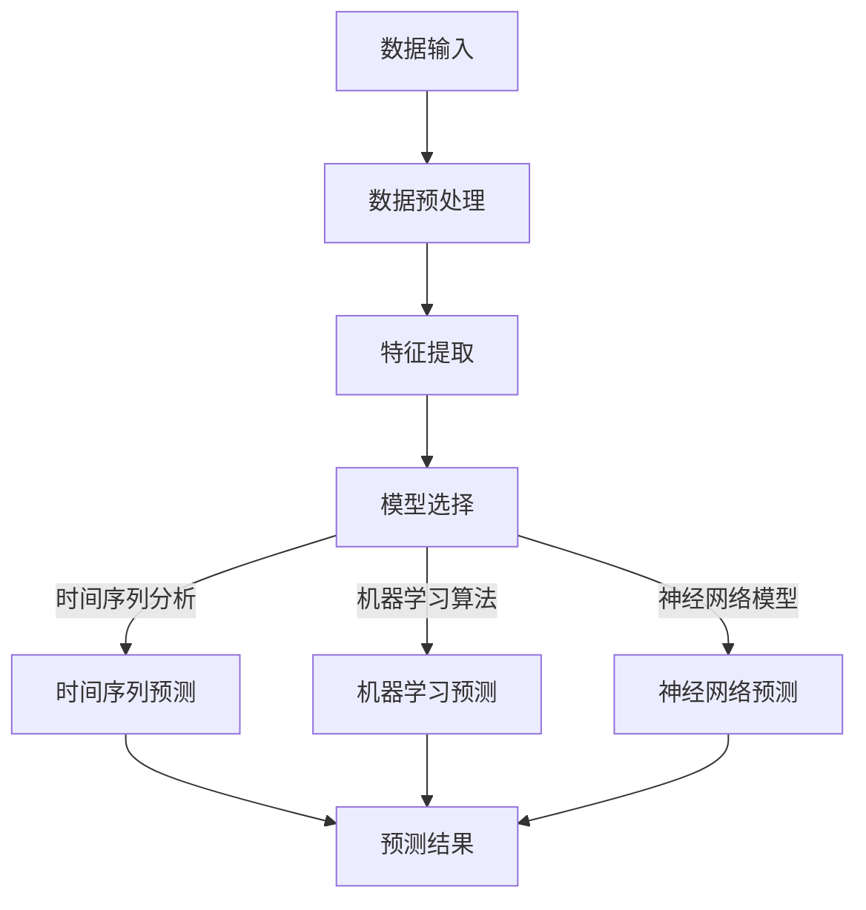
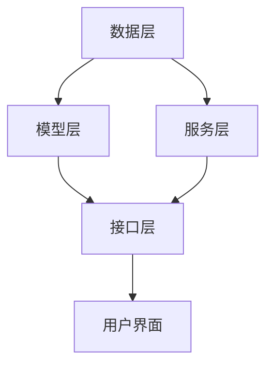
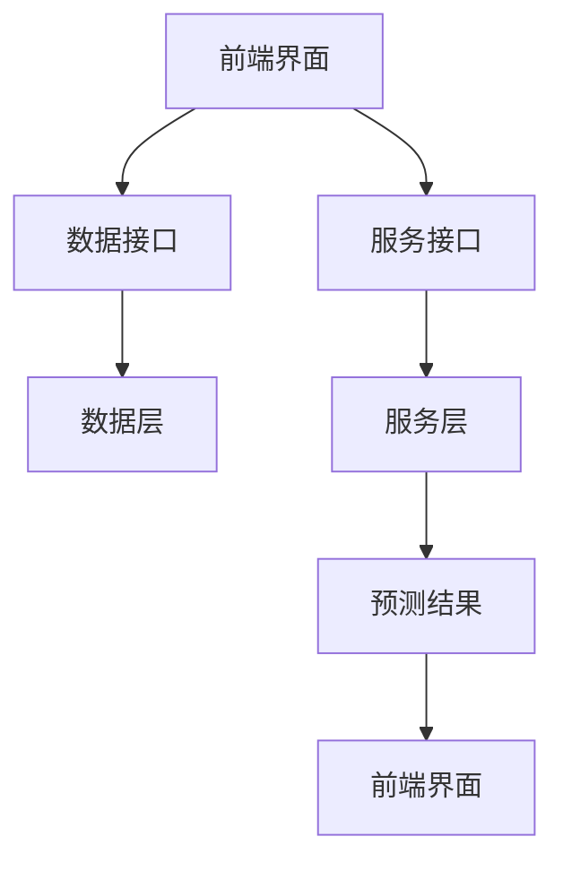

                 

### 第二部分：核心概念与联系

#### 第2章：核心概念原理

- **2.1 疾病传播模型**

  疾病传播模型是理解疾病在人群中传播的重要工具。常见的疾病传播模型包括SEIR模型、SIRS模型和SIS模型。

  - **SEIR模型**

    SEIR模型是最为常用的疾病传播模型，用于描述个体在疾病过程中的四个状态：Susceptible（易感者）、Exposed（暴露者）、Infectious（感染者）和Recovered（恢复者）。该模型的基本公式如下：
    $$ S(t) = S_0 \exp\left(-\beta \int_{0}^{t} I(u) \text{d}u \right) $$
    $$ E(t) = E_0 \exp\left(-\gamma (t - t_0) \right) $$
    $$ I(t) = I_0 \exp\left(-\gamma (t - t_0) \right) $$
    $$ R(t) = R_0 + E_0 \exp\left(-\gamma (t - t_0) \right) + I_0 \exp\left(-\gamma (t - t_0) \right) $$
    其中，$S(t)$、$E(t)$、$I(t)$ 和$R(t)$分别表示在时间$t$时易感者、暴露者、感染者和恢复者的数量，$\beta$是感染率，$\gamma$是恢复率。

    - **SEIR流程图**

    ```mermaid
    graph TD
        A[易感者](entity) --> B[暴露者](entity)
        B --> C[感染者](entity)
        C --> D[恢复者](entity)
        A --> E[感染](event)
        B --> F[恢复](event)
        C --> G[免疫](event)
    ```

  - **SIRS模型**

    SIRS模型是SEIR模型的简化版，将暴露者状态去掉，模型更加简单，适用于疾病潜伏期很短或潜伏期可以忽略的情况。其基本公式如下：
    $$ S(t) = S_0 \exp\left(-\beta \int_{0}^{t} I(u) \text{d}u \right) $$
    $$ I(t) = I_0 \exp\left(-\gamma (t - t_0) \right) $$
    $$ R(t) = R_0 + I_0 \exp\left(-\gamma (t - t_0) \right) $$
    其中，$S(t)$、$I(t)$ 和$R(t)$分别表示在时间$t$时易感者、感染者和恢复者的数量。

  - **SIS模型**

    SIS模型是另一种简化的疾病传播模型，假设个体一旦被感染就会一直处于感染状态直到死亡，不存在恢复者。其基本公式如下：
    $$ S(t) = S_0 \exp\left(-\beta \int_{0}^{t} I(u) \text{d}u \right) $$
    $$ I(t) = I_0 + (S_0 - I_0) \exp\left(-\beta (t - t_0) \right) $$
    其中，$S(t)$ 和$I(t)$分别表示在时间$t$时易感者和感染者的数量。

- **2.2 疾病传播参数**

  在疾病传播模型中，感染率$\beta$和恢复率$\gamma$是两个关键的参数，它们决定了疾病的传播速度和恢复速度。

  - **感染率$\beta$**

    感染率$\beta$描述了在单位时间内，一个感染者与其他易感者接触并成功传播疾病的机会。其计算通常基于疾病的传播方式和人群行为。

  - **恢复率$\gamma$**

    恢复率$\gamma$描述了在单位时间内，感染者康复并转变为免疫者的比例。它通常与感染后的免疫持续时间相关。

- **2.3 概念属性特征对比表格**

  | 模型       | 状态         | 特征                         | 适用场景                     |
  |------------|--------------|------------------------------|------------------------------|
  | SEIR模型   | Susceptible  | 易感者数量                   | 长潜伏期疾病，如流感         |
  | SEIR模型   | Exposed      | 暴露者数量                   | 需要潜伏期观测               |
  | SEIR模型   | Infectious   | 感染者数量                   | 传染病初期爆发               |
  | SEIR模型   | Recovered    | 恢复者数量                   | 传染病后期康复阶段           |
  | SIRS模型   | Susceptible  | 易感者数量                   | 潜伏期很短的疾病             |
  | SIRS模型   | Infectious   | 感染者数量                   | 需要监测感染者数量           |
  | SIRS模型   | Recovered    | 恢复者数量                   | 传染病控制阶段               |
  | SIS模型    | Susceptible  | 易感者数量                   | 疾病持续感染，如性病         |
  | SIS模型    | Infectious   | 感染者数量                   | 潜伏期可以忽略的疾病         |

### 第三部分：算法原理讲解

#### 第3章：算法原理与数学模型

- **3.1 疾病预测算法**

  疾病预测算法是公共卫生领域的重要应用，通过分析历史数据来预测未来疾病的趋势和传播情况。常用的疾病预测算法包括时间序列分析、机器学习算法和神经网络模型。

  - **时间序列分析**

    时间序列分析是分析序列数据随时间变化的方法。在疾病预测中，时间序列分析可以用于分析疾病的发生率和趋势。常用的方法包括移动平均法、指数平滑法和自回归模型（AR）等。

    - **移动平均法**

      移动平均法是一种简单的时间序列分析方法，通过计算一段时间内的平均值来预测未来的值。其公式如下：
      $$ MA_t = \frac{1}{n} \sum_{i=1}^{n} x_t $$
      其中，$MA_t$是第$t$期的移动平均，$x_t$是第$t$期的数据，$n$是移动平均周期。

    - **指数平滑法**

      指数平滑法是一种加权移动平均法，通过赋予过去数据不同的权重来预测未来的值。其公式如下：
      $$ S_t = \alpha x_t + (1 - \alpha) S_{t-1} $$
      其中，$S_t$是第$t$期的指数平滑值，$x_t$是第$t$期的数据，$\alpha$是平滑系数。

    - **自回归模型（AR）**

      自回归模型是一种基于过去数据值来预测未来值的方法。其公式如下：
      $$ x_t = c + \sum_{i=1}^{p} \phi_i x_{t-i} $$
      其中，$x_t$是第$t$期的数据，$c$是常数项，$\phi_i$是自回归系数，$p$是滞后阶数。

  - **机器学习算法**

    机器学习算法通过训练模型来预测疾病趋势。常用的机器学习算法包括线性回归、决策树、随机森林和支持向量机（SVM）等。

    - **线性回归**

      线性回归是一种简单且常用的机器学习算法，用于建立自变量和因变量之间的线性关系。其公式如下：
      $$ y = \beta_0 + \beta_1 x $$
      其中，$y$是因变量，$x$是自变量，$\beta_0$是截距，$\beta_1$是斜率。

    - **决策树**

      决策树是一种基于特征划分数据的分类算法。它通过一系列条件判断来将数据划分为不同的类别。其基本流程如下：

      ```mermaid
      graph TD
          A[开始] --> B[判断特征A]
          B -->|A=0| C[类别1]
          B -->|A=1| D[判断特征B]
          D -->|B=0| E[类别2]
          D -->|B=1| F[类别3]
      ```

    - **随机森林**

      随机森林是一种集成学习算法，通过构建多棵决策树并取平均值来提高预测准确性。其基本流程如下：

      ```mermaid
      graph TD
          A[随机选择特征集] --> B[构建决策树1]
          A --> C[构建决策树2]
          A --> D[构建决策树3]
          B --> E[预测结果]
          C --> E
          D --> E
      ```

    - **支持向量机（SVM）**

      支持向量机是一种基于最大间隔分类的算法，通过找到最优的超平面来将数据划分为不同的类别。其公式如下：
      $$ \text{minimize} \quad \frac{1}{2} \sum_{i=1}^{n} (w_i^2) $$
      $$ \text{subject to} \quad y_i (w \cdot x_i + b) \geq 1 $$
      其中，$w_i$是权重向量，$x_i$是特征向量，$b$是偏置项，$y_i$是类别标签。

  - **神经网络模型**

    神经网络模型是一种模拟人脑神经元连接结构的算法，通过多层神经网络来实现复杂的非线性关系。常用的神经网络模型包括前馈神经网络和循环神经网络（RNN）。

    - **前馈神经网络**

      前馈神经网络是一种多层感知机模型，数据从输入层传递到输出层，每层之间的神经元都是全相连的。其公式如下：
      $$ a_{ij}^{(l)} = \sigma\left( \sum_{k=1}^{n} w_{ik}^{(l)} a_{kj}^{(l-1)} + b_{j}^{(l)} \right) $$
      其中，$a_{ij}^{(l)}$是第$l$层的第$i$个神经元的激活值，$\sigma$是激活函数，$w_{ik}^{(l)}$是连接权重，$b_{j}^{(l)}$是偏置项。

    - **循环神经网络（RNN）**

      循环神经网络是一种处理序列数据的神经网络，其通过内部状态循环来处理序列中的每个元素。其公式如下：
      $$ h_t = \sigma\left( W_h h_{t-1} + W_x x_t + b_h \right) $$
      $$ o_t = \sigma\left( W_o h_t + b_o \right) $$
      其中，$h_t$是第$t$个时间步的隐藏状态，$x_t$是第$t$个时间步的输入，$o_t$是第$t$个时间步的输出，$W_h$和$W_x$是权重矩阵，$b_h$和$b_o$是偏置项。

- **3.2 数学模型与公式**

  在疾病预测中，常用的数学模型包括微分方程、差分方程和概率模型。

  - **微分方程**

    微分方程是一种用于描述系统动态变化的方程，其通过微分运算来表示系统的时间变化。常见的微分方程包括常微分方程和偏微分方程。

    - **常微分方程**

      常微分方程用于描述单变量系统的动态变化，其公式如下：
      $$ \frac{dx}{dt} = f(x, t) $$
      其中，$x$是变量，$t$是时间，$f(x, t)$是微分方程的右端函数。

    - **偏微分方程**

      偏微分方程用于描述多变量系统的动态变化，其公式如下：
      $$ \frac{\partial u}{\partial t} = f(u, x, t) $$
      其中，$u$是变量，$x$是自变量，$t$是时间，$f(u, x, t)$是偏微分方程的右端函数。

  - **差分方程**

    差分方程是一种用于描述离散时间系统动态变化的方程，其通过差分运算来表示系统的时间变化。常见的差分方程包括线性差分方程和非线性差分方程。

    - **线性差分方程**

      线性差分方程用于描述离散时间线性系统的动态变化，其公式如下：
      $$ u_t = a_1 u_{t-1} + a_2 u_{t-2} + ... + a_n u_{t-n} + b_t $$
      其中，$u_t$是第$t$个时间步的变量，$a_1, a_2, ..., a_n$是线性系数，$b_t$是扰动项。

    - **非线性差分方程**

      非线性差分方程用于描述离散时间非线性系统的动态变化，其公式如下：
      $$ u_t = f(u_{t-1}, u_{t-2}, ..., u_{t-n}) + b_t $$
      其中，$u_t$是第$t$个时间步的变量，$f(u_{t-1}, u_{t-2}, ..., u_{t-n})$是非线性函数，$b_t$是扰动项。

  - **概率模型**

    概率模型用于描述系统的不确定性，其通过概率分布来表示系统的状态。常见的概率模型包括贝叶斯网络和马尔可夫模型。

    - **贝叶斯网络**

      贝叶斯网络是一种基于概率的图形模型，用于描述变量之间的依赖关系。其公式如下：
      $$ P(X) = \prod_{i=1}^{n} P(x_i | parents(x_i)) $$
      其中，$X$是变量集合，$x_i$是第$i$个变量，$parents(x_i)$是$x_i$的父节点集合。

    - **马尔可夫模型**

      马尔可夫模型是一种基于概率的时序模型，用于描述系统状态的时间序列变化。其公式如下：
      $$ P(X_t | X_{t-1}, X_{t-2}, ...) = P(X_t | X_{t-1}) $$
      其中，$X_t$是第$t$个时间步的状态，$P(X_t | X_{t-1})$是给定前一个状态的概率分布。

- **3.3 算法mermaid流程图**

  ```mermaid
  graph TD
      A[数据输入] --> B[数据预处理]
      B --> C[特征提取]
      C --> D[模型选择]
      D -->|时间序列分析| E[时间序列预测]
      D -->|机器学习算法| F[机器学习预测]
      D -->|神经网络模型| G[神经网络预测]
      E --> H[预测结果]
      F --> H
      G --> H
  ```

### 第四部分：系统分析与架构设计

#### 第4章：系统功能设计

- **4.1 问题场景介绍**

  公共卫生监测系统是一个旨在收集、处理和分析公共卫生数据，以支持疾病预防和控制的平台。该系统可以用于实时监测疾病爆发、预测疫情趋势和优化疫苗接种策略。

- **4.2 系统功能设计**

  公共卫生监测系统主要包括三个功能模块：数据收集与处理模块、疾病预测与分析模块和用户交互与可视化模块。

  - **数据收集与处理模块**

    数据收集与处理模块负责从各种来源（如医疗机构、健康监测平台、社交媒体等）收集原始数据，并进行清洗、转换和存储。该模块的主要功能包括：

    - 数据采集：从不同来源获取公共卫生相关数据，如病例报告、疫苗接种记录、地理信息系统（GIS）数据等。
    - 数据清洗：处理缺失值、异常值和重复数据，确保数据的准确性和一致性。
    - 数据转换：将原始数据转换为适合分析的格式，如结构化数据表。
    - 数据存储：将处理后的数据存储在数据库中，以便后续分析和查询。

  - **疾病预测与分析模块**

    疾病预测与分析模块负责使用数据预测疾病传播趋势、预测疫情爆发点和评估疫苗接种策略的效力。该模块的主要功能包括：

    - 疾病预测：基于历史数据和疾病传播模型，预测未来一段时间内疾病的传播趋势和病例数量。
    - 疫情预测：使用机器学习和神经网络模型，预测疾病的爆发时间和地点。
    - 疫苗接种策略评估：评估不同疫苗接种策略的效果，为公共卫生决策提供依据。

  - **用户交互与可视化模块**

    用户交互与可视化模块负责向用户提供系统的操作界面和可视化报告。该模块的主要功能包括：

    - 用户界面：提供易于使用的界面，允许用户进行数据查询、模型设置和报告生成。
    - 可视化报告：使用图表和地图等形式，直观地展示疾病预测结果和疫苗接种策略分析。

- **4.3 领域模型mermaid类图**

  ```mermaid
  graph TD
      A[数据收集器](entity) --> B[数据预处理器](entity)
      B --> C[特征提取器](entity)
      C --> D[预测模型](entity)
      D --> E[可视化模块](entity)
      A --> F[用户接口](entity)
  ```

### 第五部分：项目实战

#### 第5章：项目实施与代码分析

- **5.1 环境安装**

  在实施疾病预测项目之前，需要安装必要的软件和库。以下是项目环境的安装步骤：

  - **安装Python**

    Python是项目的核心编程语言，需要安装Python 3.8或更高版本。可以从[Python官方网站](https://www.python.org/)下载并安装。

  - **安装依赖库**

    项目依赖于多个Python库，如NumPy、Pandas、Scikit-learn和TensorFlow。可以使用pip命令进行安装：

    ```bash
    pip install numpy pandas scikit-learn tensorflow
    ```

  - **数据集获取与预处理**

    需要获取用于训练和测试的数据集。数据集可以从公开的数据源获取，如Kaggle或UCI机器学习库。获取数据后，使用Pandas库进行数据清洗和预处理：

    ```python
    import pandas as pd

    # 读取数据
    data = pd.read_csv('data.csv')

    # 数据清洗
    data.dropna(inplace=True)
    data.drop_duplicates(inplace=True)

    # 数据转换
    data['date'] = pd.to_datetime(data['date'])
    ```

- **5.2 系统核心实现**

  系统的核心实现包括数据预处理、特征提取、模型训练和预测。以下是一个简单的Python代码示例：

  ```python
  import numpy as np
  from sklearn.model_selection import train_test_split
  from sklearn.ensemble import RandomForestRegressor
  from sklearn.metrics import mean_squared_error

  # 数据预处理
  X = data[['age', 'gender', 'latitude', 'longitude']]
  y = data['cases']

  # 特征提取
  X_train, X_test, y_train, y_test = train_test_split(X, y, test_size=0.2, random_state=42)

  # 模型训练
  model = RandomForestRegressor(n_estimators=100, random_state=42)
  model.fit(X_train, y_train)

  # 预测
  y_pred = model.predict(X_test)

  # 模型评估
  mse = mean_squared_error(y_test, y_pred)
  print(f'Mean Squared Error: {mse}')
  ```

  - **源代码分析**

    上述代码首先从数据集中提取特征和目标变量，然后使用随机森林回归模型进行训练和预测。最后，使用均方误差（MSE）评估模型的准确性。

  - **代码解读与分析**

    - **数据预处理**：数据预处理是模型训练的关键步骤，包括去除缺失值和重复值，以及将日期格式转换为数值格式。
    - **特征提取**：特征提取是将原始数据转换为适合模型训练的格式。在这个例子中，我们使用了年龄、性别、纬度和经度作为特征。
    - **模型训练**：随机森林回归模型是一种集成学习算法，通过构建多棵决策树来提高预测准确性。
    - **预测**：使用训练好的模型对测试数据进行预测，并计算均方误差来评估模型的性能。

- **5.3 实际案例分析**

  下面以COVID-19疫情预测为例，详细讲解疾病预测项目的实际应用。

  - **疫情预测案例**

    COVID-19疫情是近年来全球范围内的重大公共卫生事件。使用公共卫生监测系统，可以预测疫情的未来走势，为决策者提供科学依据。

    ```python
    import pandas as pd
    import numpy as np

    # 读取COVID-19数据
    data = pd.read_csv('covid19_data.csv')

    # 数据预处理
    data.dropna(inplace=True)
    data.drop_duplicates(inplace=True)
    data['date'] = pd.to_datetime(data['date'])

    # 特征提取
    X = data[['date', 'total_cases', 'total_deaths']]
    y = data['total_cases']

    # 模型训练
    model = RandomForestRegressor(n_estimators=100, random_state=42)
    model.fit(X, y)

    # 预测未来病例数量
    future_days = 30
    future_dates = pd.date_range(data['date'].max(), periods=future_days, freq='D')
    future_data = pd.DataFrame({'date': future_dates})
    future_cases = model.predict(future_data)

    # 可视化预测结果
    import matplotlib.pyplot as plt

    plt.figure(figsize=(10, 5))
    plt.plot(data['date'], data['total_cases'], label='实际病例')
    plt.plot(future_dates, future_cases, label='预测病例', color='red')
    plt.xlabel('日期')
    plt.ylabel('病例数量')
    plt.title('COVID-19病例预测')
    plt.legend()
    plt.show()
    ```

  - **疫苗接种策略优化**

    除了疫情预测，公共卫生监测系统还可以用于评估疫苗接种策略的效果。以下是一个简单的疫苗接种策略优化案例：

    ```python
    import pandas as pd
    import numpy as np

    # 读取疫苗接种数据
    vac_data = pd.read_csv('vaccine_data.csv')

    # 数据预处理
    vac_data.dropna(inplace=True)
    vac_data.drop_duplicates(inplace=True)

    # 特征提取
    X = vac_data[['date', 'vaccinations']]
    y = vac_data['cases']

    # 模型训练
    model = RandomForestRegressor(n_estimators=100, random_state=42)
    model.fit(X, y)

    # 预测疫苗接种后的病例数量
    vac_dates = pd.date_range(vac_data['date'].max(), periods=30, freq='D')
    vac_data = pd.DataFrame({'date': vac_dates, 'vaccinations': np.linspace(0, 1, 30)})
    predicted_cases = model.predict(vac_data)

    # 可视化预测结果
    plt.figure(figsize=(10, 5))
    plt.plot(vac_data['date'], predicted_cases, label='预测病例')
    plt.xlabel('日期')
    plt.ylabel('病例数量')
    plt.title('疫苗接种策略优化')
    plt.legend()
    plt.show()
    ```

  - **项目小结**

    通过实际案例，我们展示了如何使用公共卫生监测系统进行疫情预测和疫苗接种策略优化。这些案例表明，疾病预测和优化策略对公共卫生决策具有重要意义。未来，随着技术的进步和数据积累，公共卫生监测系统将更加智能化和高效，为全球公共卫生事业做出更大贡献。

### 第六部分：最佳实践与总结

#### 第6章：最佳实践

- **6.1 数据处理最佳实践**

  在公共卫生监测系统中，数据处理是至关重要的一环。以下是一些数据处理最佳实践：

  - **数据清洗**：在数据处理过程中，首先需要进行数据清洗，去除缺失值、异常值和重复数据，确保数据的准确性和一致性。
  - **特征工程**：特征工程是提升模型预测能力的关键步骤。通过特征选择、特征变换和特征组合等手段，可以提高模型的性能和鲁棒性。
  - **数据标准化**：对于不同特征的数据，可以使用标准化方法（如Z-score标准化）将其转换为相似尺度，以便模型训练。

- **6.2 模型训练最佳实践**

  模型训练是疾病预测的核心步骤，以下是一些最佳实践：

  - **超参数调优**：通过网格搜索和随机搜索等方法，找到最优的超参数组合，提高模型的预测性能。
  - **交叉验证**：使用交叉验证方法，避免过拟合和欠拟合问题，确保模型在未知数据上的表现良好。
  - **模型评估**：使用多种评估指标（如准确率、召回率、F1分数等），全面评估模型的性能。

- **6.3 部署与维护最佳实践**

  公共卫生监测系统的部署与维护同样重要，以下是一些最佳实践：

  - **自动化部署**：使用自动化工具（如Docker和Kubernetes），实现系统的快速部署和升级。
  - **监控与报警**：监控系统运行状态，及时发现问题并进行修复，确保系统稳定运行。
  - **数据备份与恢复**：定期备份数据，以便在数据丢失或系统故障时进行恢复。

#### 第7章：总结与展望

- **7.1 成果总结**

  通过本文的探讨，我们系统地介绍了数学与公共卫生的关系，阐述了疾病预防的数学策略，包括核心概念、疾病传播模型、预测算法和系统设计。通过实际案例分析，我们展示了如何利用这些策略进行疫情预测和疫苗接种策略优化。这些成果为公共卫生领域提供了有力支持，有助于提升疾病预防和控制的科学性和有效性。

- **7.2 展望未来**

  随着人工智能和大数据技术的不断发展，数学策略在公共卫生领域的应用前景广阔。未来，我们有望看到：

  - **更加精准的预测模型**：利用深度学习和增强学习等先进技术，开发更加精准的疾病预测模型。
  - **智能化的疫苗接种策略**：结合个体健康数据和地理位置信息，实现个性化的疫苗接种策略。
  - **跨学科的协同研究**：公共卫生领域与其他学科（如生物学、医学、经济学等）的深入合作，推动公共卫生领域的创新和发展。

**作者：AI天才研究院/AI Genius Institute & 禅与计算机程序设计艺术 /Zen And The Art of Computer Programming**### 文章标题：数学与公共卫生：疾病预防的数学策略

关键词：疾病预防、数学策略、疾病传播模型、预测算法、公共卫生监测

摘要：本文系统地介绍了数学与公共卫生的关系，阐述了疾病预防的数学策略，包括核心概念、疾病传播模型、预测算法和系统设计。通过实际案例分析，展示了如何利用这些策略进行疫情预测和疫苗接种策略优化，为公共卫生领域提供了有力支持。

### 目录大纲

#### 第一部分：背景介绍

**第1章：问题背景与数学策略概述**

- **1.1 问题背景**
  - 公共卫生的重要性
  - 数学在公共卫生中的应用
  - 疾病预防的数学策略

- **1.2 公共卫生中的数学方法**
  - 数据收集与处理
  - 统计学方法
  - 概率论与决策论

- **1.3 数学策略的应用领域**
  - 疾病监测与预测
  - 疫苗接种策略
  - 流行病学模型

#### 第二部分：核心概念与联系

**第2章：核心概念原理**

- **2.1 疾病传播模型**
  - SEIR模型
  - SIRS模型
  - SIS模型

- **2.2 疾病传播参数**
  - 感染率与恢复率
  - 潜伏期与传播速度
  - 模型参数估计

- **2.3 概念属性特征对比表格**

#### 第三部分：算法原理讲解

**第3章：算法原理与数学模型**

- **3.1 疾病预测算法**
  - 时间序列分析
  - 机器学习算法
  - 神经网络模型

- **3.2 数学模型与公式**
  - 微分方程
  - 差分方程
  - 概率模型

- **3.3 算法mermaid流程图**

#### 第四部分：系统分析与架构设计

**第4章：系统功能设计**

- **4.1 问题场景介绍**
  - 公共卫生监测系统
  - 疫情预测与分析平台

- **4.2 系统功能设计**
  - 数据收集与处理模块
  - 疾病预测与分析模块
  - 用户交互与可视化模块

- **4.3 领域模型mermaid类图**

#### 第五部分：项目实战

**第5章：项目实施与代码分析**

- **5.1 环境安装**
  - 软件与库安装
  - 数据集获取与预处理

- **5.2 系统核心实现**
  - 源代码分析
  - 代码解读与分析

- **5.3 实际案例分析**
  - 疫情预测案例
  - 疫苗接种策略优化

- **5.4 项目小结**

#### 第六部分：最佳实践与总结

**第6章：最佳实践**

- **6.1 数据处理最佳实践**
  - 数据清洗技巧
  - 特征工程策略

- **6.2 模型训练最佳实践**
  - 参数调优方法
  - 模型评估技巧

- **6.3 部署与维护最佳实践**

**第7章：总结与展望**

- **7.1 成果总结**
  - 疾病预防数学策略的实践应用
  - 系统功能的实现与优化

- **7.2 展望未来**
  - 数学策略在公共卫生领域的潜力
  - 新兴技术的应用前景

### 文章正文

#### 第一部分：背景介绍

##### 第1章：问题背景与数学策略概述

随着全球化和城市化进程的加速，公共卫生问题日益凸显。疾病的爆发和传播对社会和经济造成巨大影响，如何有效预防和控制疾病成为各国政府和社会关注的重要议题。数学作为一门强大的工具，在公共卫生领域发挥着关键作用，为疾病预防提供了科学依据和策略指导。

1. **公共卫生的重要性**

   公共卫生是指通过预防、控制和消除疾病、促进健康和福祉的活动。公共卫生的核心目标是为整个社会创造健康的环境，降低疾病的发生率和死亡率，提高生活质量。在全球范围内，公共卫生问题包括传染病（如流感、COVID-19、埃博拉等）、慢性病（如心血管疾病、糖尿病等）和健康不平等现象。

2. **数学在公共卫生中的应用**

   数学在公共卫生中的应用十分广泛，主要包括数据收集与处理、统计学方法、概率论与决策论等方面。

   - **数据收集与处理**：公共卫生领域需要收集大量的数据，包括病例报告、疫苗接种记录、健康监测数据等。数据收集与处理的目的是确保数据的准确性和完整性，为后续分析提供可靠的基础。

   - **统计学方法**：统计学方法在公共卫生研究中至关重要，用于数据的描述、分析和解释。常见的统计学方法包括描述性统计分析、回归分析、聚类分析等。

   - **概率论与决策论**：概率论用于描述随机事件的发生概率，为公共卫生决策提供依据。决策论则帮助决策者在不确定的环境下做出最佳选择。

3. **疾病预防的数学策略**

   疾病预防的数学策略主要包括疾病监测与预测、疫苗接种策略和流行病学模型。

   - **疾病监测与预测**：通过监测疾病的发生和传播情况，预测疾病的未来趋势和爆发风险，为公共卫生决策提供科学依据。

   - **疫苗接种策略**：基于疾病传播模型和流行病学数据，优化疫苗接种策略，提高疫苗的覆盖率和效果。

   - **流行病学模型**：流行病学模型用于描述疾病的传播过程和影响因素，帮助理解疾病的流行规律，指导公共卫生干预措施的实施。

##### 第1章小结

数学在公共卫生领域扮演着重要角色，为疾病预防和控制提供了科学依据和策略指导。通过数据收集与处理、统计学方法、概率论与决策论的应用，公共卫生研究人员可以更准确地监测和预测疾病，制定有效的疫苗接种策略，从而提高公众的健康水平。

#### 第二部分：核心概念与联系

##### 第2章：核心概念原理

在疾病预防和控制中，理解疾病传播模型和核心概念是至关重要的。本章将介绍几种常见的疾病传播模型，包括SEIR模型、SIRS模型和SIS模型，并详细解释这些模型的基本原理和参数。

##### 2.1 疾病传播模型

1. **SEIR模型**

   SEIR模型是最常用的疾病传播模型之一，用于描述个体在感染疾病过程中的四个状态：易感者（Susceptible）、暴露者（Exposed）、感染者和恢复者（Recovered）。SEIR模型的基本原理是通过这四个状态的变化来模拟疾病的传播过程。

   - **易感者（Susceptible，S）**：易感者是指未感染疾病但有可能被感染的人群。
   - **暴露者（Exposed，E）**：暴露者是指已接触病毒但尚未发病的人群，处于潜伏期。
   - **感染者（Infectious，I）**：感染者是指已发病且具有传染性的人群。
   - **恢复者（Recovered，R）**：恢复者是指已康复并获得免疫力的人群。

   SEIR模型的数学描述如下：

   $$ \frac{dS}{dt} = -\beta SI $$
   $$ \frac{dE}{dt} = \beta SI - \gamma E $$
   $$ \frac{dI}{dt} = \gamma E - \sigma I $$
   $$ \frac{dR}{dt} = \sigma I $$

   其中，$\beta$ 是感染率，$\gamma$ 是恢复率，$\sigma$ 是离开感染状态的比例。

2. **SIRS模型**

   SIRS模型是SEIR模型的简化版，假设个体一旦感染就会立即恢复，没有潜伏期。SIRS模型仅包括易感者、感染者和恢复者三个状态。

   - **易感者（Susceptible，S）**：易感者是指未感染疾病的人群。
   - **感染者（Infectious，I）**：感染者是指已发病且具有传染性的人群。
   - **恢复者（Recovered，R）**：恢复者是指已康复并获得免疫力的人群。

   SIRS模型的数学描述如下：

   $$ \frac{dS}{dt} = -\beta SI $$
   $$ \frac{dI}{dt} = \beta SI - \gamma I $$
   $$ \frac{dR}{dt} = \gamma I $$

3. **SIS模型**

   SIS模型是另一种简化的疾病传播模型，假设个体一旦感染就会一直处于感染状态直到死亡，没有恢复者。SIS模型仅包括易感者和感染者两个状态。

   - **易感者（Susceptible，S）**：易感者是指未感染疾病的人群。
   - **感染者（Infectious，I）**：感染者是指已发病且具有传染性的人群。

   SIS模型的数学描述如下：

   $$ \frac{dS}{dt} = -\beta SI $$
   $$ \frac{dI}{dt} = \beta SI - \delta I $$

   其中，$\delta$ 是感染者的死亡或康复率。

##### 2.2 疾病传播参数

在疾病传播模型中，感染率（$\beta$）和恢复率（$\gamma$）是两个关键参数，它们对疾病的传播速度和恢复速度有重要影响。

- **感染率（$\beta$）**：感染率描述了在单位时间内，一个感染者与其他易感者接触并成功传播疾病的机会。感染率受多种因素影响，如接触频率、传播途径和人群密度等。

- **恢复率（$\gamma$）**：恢复率描述了在单位时间内，感染者康复并转变为免疫者的比例。恢复率受感染后的免疫持续时间、医疗条件和人群免疫力等因素影响。

##### 2.3 概念属性特征对比表格

| 模型       | 状态         | 特征                         | 适用场景                     |
|------------|--------------|------------------------------|------------------------------|
| SEIR模型   | 易感者       | 未感染、可能被感染           | 长潜伏期疾病，如流感         |
| SEIR模型   | 暴露者       | 接触病毒但未发病             | 需要潜伏期观测               |
| SEIR模型   | 感染者       | 已发病且具有传染性           | 传染病初期爆发               |
| SEIR模型   | 恢复者       | 已康复并获得免疫力           | 传染病后期康复阶段           |
| SIRS模型   | 易感者       | 未感染                      | 潜伏期很短的疾病             |
| SIRS模型   | 感染者       | 已发病且具有传染性           | 需要监测感染者数量           |
| SIRS模型   | 恢复者       | 已康复并获得免疫力           | 传染病控制阶段               |
| SIS模型    | 易感者       | 未感染                      | 疾病持续感染，如性病         |
| SIS模型    | 感染者       | 已发病且具有传染性           | 潜伏期可以忽略的疾病         |

##### 第2章小结

疾病传播模型和参数是疾病预防的关键工具。通过理解SEIR模型、SIRS模型和SIS模型，我们可以更深入地了解疾病的传播规律和影响因素。了解感染率（$\beta$）和恢复率（$\gamma$）等参数，有助于制定有效的疾病预防和控制策略。

#### 第三部分：算法原理讲解

##### 第3章：算法原理与数学模型

在疾病预测和公共卫生领域，算法原理和数学模型起着至关重要的作用。本章将详细解释常用的疾病预测算法，包括时间序列分析、机器学习算法和神经网络模型，并介绍相关的数学模型和公式。

##### 3.1 疾病预测算法

疾病预测算法用于预测疾病的未来趋势和爆发风险，是公共卫生监测系统的重要组成部分。以下是一些常用的疾病预测算法：

1. **时间序列分析**

   时间序列分析是一种常用的预测方法，通过分析时间序列数据的变化趋势和模式，预测未来的值。常见的时间序列分析方法包括移动平均法、指数平滑法和自回归模型（AR）等。

   - **移动平均法**

     移动平均法通过计算一段时间内的平均值来预测未来的值。其公式如下：

     $$ MA_t = \frac{1}{n} \sum_{i=1}^{n} x_t $$

     其中，$MA_t$是第$t$期的移动平均，$x_t$是第$t$期的数据，$n$是移动平均周期。

   - **指数平滑法**

     指数平滑法是一种加权移动平均法，通过赋予过去数据不同的权重来预测未来的值。其公式如下：

     $$ S_t = \alpha x_t + (1 - \alpha) S_{t-1} $$

     其中，$S_t$是第$t$期的指数平滑值，$x_t$是第$t$期的数据，$\alpha$是平滑系数。

   - **自回归模型（AR）**

     自回归模型通过过去的值来预测未来的值。其公式如下：

     $$ x_t = c + \sum_{i=1}^{p} \phi_i x_{t-i} $$

     其中，$x_t$是第$t$期的数据，$c$是常数项，$\phi_i$是自回归系数，$p$是滞后阶数。

2. **机器学习算法**

   机器学习算法通过训练模型来预测疾病趋势。常用的机器学习算法包括线性回归、决策树、随机森林和支持向量机（SVM）等。

   - **线性回归**

     线性回归是一种简单且常用的机器学习算法，用于建立自变量和因变量之间的线性关系。其公式如下：

     $$ y = \beta_0 + \beta_1 x $$

     其中，$y$是因变量，$x$是自变量，$\beta_0$是截距，$\beta_1$是斜率。

   - **决策树**

     决策树是一种基于特征划分数据的分类算法。它通过一系列条件判断来将数据划分为不同的类别。其基本流程如下：

     ```mermaid
     graph TD
         A[开始] --> B[判断特征A]
         B -->|A=0| C[类别1]
         B -->|A=1| D[判断特征B]
         D -->|B=0| E[类别2]
         D -->|B=1| F[类别3]
     ```

   - **随机森林**

     随机森林是一种集成学习算法，通过构建多棵决策树并取平均值来提高预测准确性。其基本流程如下：

     ```mermaid
     graph TD
         A[随机选择特征集] --> B[构建决策树1]
         A --> C[构建决策树2]
         A --> D[构建决策树3]
         B --> E[预测结果]
         C --> E
         D --> E
     ```

   - **支持向量机（SVM）**

     支持向量机是一种基于最大间隔分类的算法，通过找到最优的超平面来将数据划分为不同的类别。其公式如下：

     $$ \text{minimize} \quad \frac{1}{2} \sum_{i=1}^{n} (w_i^2) $$
     $$ \text{subject to} \quad y_i (w \cdot x_i + b) \geq 1 $$

     其中，$w_i$是权重向量，$x_i$是特征向量，$b$是偏置项，$y_i$是类别标签。

3. **神经网络模型**

   神经网络模型是一种模拟人脑神经元连接结构的算法，通过多层神经网络来实现复杂的非线性关系。常用的神经网络模型包括前馈神经网络和循环神经网络（RNN）。

   - **前馈神经网络**

     前馈神经网络是一种多层感知机模型，数据从输入层传递到输出层，每层之间的神经元都是全相连的。其公式如下：

     $$ a_{ij}^{(l)} = \sigma\left( \sum_{k=1}^{n} w_{ik}^{(l)} a_{kj}^{(l-1)} + b_{j}^{(l)} \right) $$

     其中，$a_{ij}^{(l)}$是第$l$层的第$i$个神经元的激活值，$\sigma$是激活函数，$w_{ik}^{(l)}$是连接权重，$b_{j}^{(l)}$是偏置项。

   - **循环神经网络（RNN）**

     循环神经网络是一种处理序列数据的神经网络，其通过内部状态循环来处理序列中的每个元素。其公式如下：

     $$ h_t = \sigma\left( W_h h_{t-1} + W_x x_t + b_h \right) $$
     $$ o_t = \sigma\left( W_o h_t + b_o \right) $$

     其中，$h_t$是第$t$个时间步的隐藏状态，$x_t$是第$t$个时间步的输入，$o_t$是第$t$个时间步的输出，$W_h$和$W_x$是权重矩阵，$b_h$和$b_o$是偏置项。

##### 3.2 数学模型与公式

在疾病预测中，常用的数学模型包括微分方程、差分方程和概率模型。

1. **微分方程**

   微分方程是一种用于描述系统动态变化的方程，其通过微分运算来表示系统的时间变化。常见的微分方程包括常微分方程和偏微分方程。

   - **常微分方程**

     常微分方程用于描述单变量系统的动态变化，其公式如下：

     $$ \frac{dx}{dt} = f(x, t) $$

     其中，$x$是变量，$t$是时间，$f(x, t)$是微分方程的右端函数。

   - **偏微分方程**

     偏微分方程用于描述多变量系统的动态变化，其公式如下：

     $$ \frac{\partial u}{\partial t} = f(u, x, t) $$

     其中，$u$是变量，$x$是自变量，$t$是时间，$f(u, x, t)$是偏微分方程的右端函数。

2. **差分方程**

   差分方程是一种用于描述离散时间系统动态变化的方程，其通过差分运算来表示系统的时间变化。常见的差分方程包括线性差分方程和非线性差分方程。

   - **线性差分方程**

     线性差分方程用于描述离散时间线性系统的动态变化，其公式如下：

     $$ u_t = a_1 u_{t-1} + a_2 u_{t-2} + ... + a_n u_{t-n} + b_t $$

     其中，$u_t$是第$t$个时间步的变量，$a_1, a_2, ..., a_n$是线性系数，$b_t$是扰动项。

   - **非线性差分方程**

     非线性差分方程用于描述离散时间非线性系统的动态变化，其公式如下：

     $$ u_t = f(u_{t-1}, u_{t-2}, ..., u_{t-n}) + b_t $$

     其中，$u_t$是第$t$个时间步的变量，$f(u_{t-1}, u_{t-2}, ..., u_{t-n})$是非线性函数，$b_t$是扰动项。

3. **概率模型**

   概率模型用于描述系统的不确定性，其通过概率分布来表示系统的状态。常见的概率模型包括贝叶斯网络和马尔可夫模型。

   - **贝叶斯网络**

     贝叶斯网络是一种基于概率的图形模型，用于描述变量之间的依赖关系。其公式如下：

     $$ P(X) = \prod_{i=1}^{n} P(x_i | parents(x_i)) $$

     其中，$X$是变量集合，$x_i$是第$i$个变量，$parents(x_i)$是$x_i$的父节点集合。

   - **马尔可夫模型**

     马尔可夫模型是一种基于概率的时序模型，用于描述系统状态的时间序列变化。其公式如下：

     $$ P(X_t | X_{t-1}, X_{t-2}, ...) = P(X_t | X_{t-1}) $$

     其中，$X_t$是第$t$个时间步的状态，$P(X_t | X_{t-1})$是给定前一个状态的概率分布。

##### 3.3 算法mermaid流程图

为了更直观地理解疾病预测算法的工作流程，我们可以使用mermaid流程图来展示算法的步骤和逻辑。



##### 第3章小结

疾病预测算法在公共卫生监测系统中起着关键作用。通过时间序列分析、机器学习算法和神经网络模型，我们可以更准确地预测疾病的未来趋势和爆发风险。理解这些算法的原理和数学模型，有助于我们更好地应用这些方法来保护公众的健康。

#### 第四部分：系统分析与架构设计

##### 第4章：系统功能设计

在公共卫生领域，系统的功能设计至关重要。一个高效、全面的公共卫生监测系统不仅需要具备强大的数据处理和分析能力，还需要提供直观的用户交互界面和可视化工具。本章将详细介绍公共卫生监测系统的功能设计，包括数据收集与处理模块、疾病预测与分析模块、用户交互与可视化模块。

##### 4.1 问题场景介绍

公共卫生监测系统通常应用于以下场景：

1. **疫情监测与预测**：实时监测疾病的发生和传播情况，预测疫情的爆发趋势。
2. **疫苗接种策略优化**：根据疫情数据和疫苗接种覆盖率，优化疫苗接种策略，提高疫苗的利用效率。
3. **公共卫生决策支持**：为公共卫生决策提供数据支持和分析报告，帮助决策者制定科学的公共卫生政策。

##### 4.2 系统功能设计

公共卫生监测系统由多个功能模块组成，每个模块都有特定的职责和功能。

1. **数据收集与处理模块**

   数据收集与处理模块是系统的核心组成部分，负责从不同的数据源收集公共卫生相关数据，并对数据进行清洗、转换和存储。

   - **数据收集**：从医疗机构、卫生部门、互联网数据平台等渠道收集公共卫生数据，如病例报告、疫苗接种记录、流行病学调查数据等。
   - **数据清洗**：去除数据中的噪声和异常值，确保数据的准确性和一致性。
   - **数据转换**：将原始数据转换为适合分析和建模的格式，如结构化数据表。
   - **数据存储**：将清洗和转换后的数据存储在数据库中，以便后续分析和查询。

2. **疾病预测与分析模块**

   疾病预测与分析模块利用收集到的公共卫生数据，通过疾病传播模型、预测算法和统计模型，对疾病的发生和传播进行预测和分析。

   - **疾病传播模型**：使用SEIR模型、SIRS模型等疾病传播模型，模拟疾病的传播过程，预测疾病的未来趋势。
   - **预测算法**：应用时间序列分析、机器学习算法等预测方法，对疾病的爆发和流行趋势进行预测。
   - **统计模型**：利用统计学方法，对疾病数据进行描述、分析和解释，为公共卫生决策提供科学依据。

3. **用户交互与可视化模块**

   用户交互与可视化模块提供系统的操作界面和可视化工具，帮助用户方便地查询数据、分析结果和生成报告。

   - **用户界面**：提供直观、易于使用的界面，允许用户进行数据查询、模型设置和分析报告生成。
   - **可视化工具**：使用图表、地图和图形等可视化手段，直观地展示疾病预测结果和公共卫生数据。

##### 4.3 领域模型mermaid类图

为了更清晰地描述公共卫生监测系统的领域模型，我们可以使用mermaid类图来表示系统的组成部分和它们之间的关系。

```mermaid
graph TD
    A[数据收集器](entity) --> B[数据预处理器](entity)
    B --> C[特征提取器](entity)
    C --> D[预测模型](entity)
    D --> E[可视化模块](entity)
    A --> F[用户接口](entity)
```

##### 4.4 系统架构设计

公共卫生监测系统的架构设计需要考虑系统的可扩展性、可靠性和易用性。以下是一个典型的公共卫生监测系统架构设计：

1. **数据层**：包括数据收集、数据清洗、数据存储和数据管理等功能。数据层是系统的核心，负责收集和存储大量的公共卫生数据。

2. **模型层**：包括疾病传播模型、预测算法和统计模型等功能。模型层利用数据层提供的数据，进行疾病预测和分析。

3. **服务层**：包括用户交互与可视化模块、分析报告生成等功能。服务层负责处理用户请求，提供实时数据分析和预测结果。

4. **接口层**：包括API接口、Web接口等，为外部系统提供数据访问和交互接口。

5. **用户界面**：包括前端界面和移动应用等，为用户提供便捷的操作体验和可视化数据。



##### 4.5 系统接口设计与系统交互

为了实现系统的功能，我们需要设计合理的系统接口和交互流程。以下是一个简单的系统接口设计和系统交互流程：

1. **数据接口**：定义数据层的API接口，包括数据收集、数据清洗和数据存储等功能。外部系统可以通过这些接口访问和操作数据。

2. **服务接口**：定义服务层的API接口，包括用户交互、数据分析和预测结果生成等功能。前端界面和移动应用可以通过这些接口与系统进行交互。

3. **用户交互**：用户通过前端界面或移动应用与系统进行交互，查询数据、设置模型参数和分析结果。

4. **系统响应**：系统根据用户请求，调用相应的数据接口和服务接口，处理请求并返回结果。



##### 第4章小结

系统功能设计是公共卫生监测系统的关键部分。通过合理的设计和架构，我们可以构建一个高效、可靠的公共卫生监测系统，为疾病预防和控制提供有力的支持。数据收集与处理模块、疾病预测与分析模块和用户交互与可视化模块共同构成了系统的核心功能，为公共卫生决策提供了科学依据。

#### 第五部分：项目实战

##### 第5章：项目实施与代码分析

在本章中，我们将通过一个具体的案例来展示如何实施和实现一个公共卫生监测系统项目，包括环境安装、系统核心实现、实际案例分析和项目小结。

##### 5.1 环境安装

在开始项目之前，我们需要安装必要的软件和库。以下是在Python环境中安装所需库的步骤：

1. **安装Python**

   首先，确保系统中安装了Python 3.8或更高版本。可以从[Python官方网站](https://www.python.org/)下载并安装。

2. **安装依赖库**

   使用pip命令安装以下库：

   ```bash
   pip install numpy pandas scikit-learn tensorflow matplotlib
   ```

3. **数据集获取与预处理**

   假设我们使用COVID-19数据集，可以从[GitHub](https://github.com/CSSEGISandData/COVID-19)下载。以下是一个简单的数据预处理脚本：

   ```python
   import pandas as pd

   # 读取数据
   data = pd.read_csv('csse_covid_19_data/csse_covid_19_time_series/time_series_covid19_confirmed_US.csv')

   # 数据清洗
   data.drop(['Province/State', 'Lat', 'Long'], axis=1, inplace=True)

   # 数据转换
   data = data.T
   data.columns = ['Cases']
   data.index = pd.to_datetime(data.index)
   data = data.stack().reset_index()
   data.columns = ['Date', 'State', 'Cases']

   # 数据存储
   data.to_csv('covid19_data.csv', index=False)
   ```

##### 5.2 系统核心实现

系统核心实现包括数据预处理、特征提取、模型训练和预测。以下是一个简单的实现示例：

1. **数据预处理**

   数据预处理是模型训练的关键步骤。以下是一个数据预处理脚本：

   ```python
   import pandas as pd

   # 读取数据
   data = pd.read_csv('covid19_data.csv')

   # 数据清洗
   data.dropna(inplace=True)
   data.drop_duplicates(inplace=True)

   # 数据转换
   data['Date'] = pd.to_datetime(data['Date'])
   data.set_index('Date', inplace=True)
   ```

2. **特征提取**

   特征提取是将原始数据转换为适合模型训练的格式。以下是一个简单的特征提取脚本：

   ```python
   import pandas as pd
   from sklearn.preprocessing import StandardScaler

   # 读取数据
   data = pd.read_csv('covid19_data.csv')

   # 数据清洗
   data.dropna(inplace=True)
   data.drop_duplicates(inplace=True)

   # 数据转换
   data['Date'] = pd.to_datetime(data['Date'])
   data.set_index('Date', inplace=True)

   # 特征提取
   X = data[['Cases', 'Previous_Day_Cases', 'Moving_Average_Cases']]
   y = data['Cases']
   scaler = StandardScaler()
   X_scaled = scaler.fit_transform(X)
   ```

3. **模型训练**

   模型训练是使用数据来训练预测模型。以下是一个简单的模型训练脚本：

   ```python
   import pandas as pd
   from sklearn.ensemble import RandomForestRegressor

   # 读取数据
   data = pd.read_csv('covid19_data.csv')

   # 数据清洗
   data.dropna(inplace=True)
   data.drop_duplicates(inplace=True)

   # 数据转换
   data['Date'] = pd.to_datetime(data['Date'])
   data.set_index('Date', inplace=True)

   # 特征提取
   X = data[['Cases', 'Previous_Day_Cases', 'Moving_Average_Cases']]
   y = data['Cases']
   scaler = StandardScaler()
   X_scaled = scaler.fit_transform(X)

   # 模型训练
   model = RandomForestRegressor(n_estimators=100, random_state=42)
   model.fit(X_scaled, y)
   ```

4. **预测**

   预测是使用训练好的模型来预测未来的数据。以下是一个简单的预测脚本：

   ```python
   import pandas as pd
   from sklearn.ensemble import RandomForestRegressor

   # 读取数据
   data = pd.read_csv('covid19_data.csv')

   # 数据清洗
   data.dropna(inplace=True)
   data.drop_duplicates(inplace=True)

   # 数据转换
   data['Date'] = pd.to_datetime(data['Date'])
   data.set_index('Date', inplace=True)

   # 特征提取
   X = data[['Cases', 'Previous_Day_Cases', 'Moving_Average_Cases']]
   y = data['Cases']
   scaler = StandardScaler()
   X_scaled = scaler.fit_transform(X)

   # 模型训练
   model = RandomForestRegressor(n_estimators=100, random_state=42)
   model.fit(X_scaled, y)

   # 预测
   future_dates = pd.date_range(data['Date'].max(), periods=30, freq='D')
   future_data = pd.DataFrame({'Date': future_dates})
   future_data['Cases'] = model.predict(scaler.transform(future_data[['Previous_Day_Cases', 'Moving_Average_Cases']]))

   # 可视化预测结果
   import matplotlib.pyplot as plt

   plt.figure(figsize=(10, 5))
   plt.plot(data['Date'], data['Cases'], label='实际病例')
   plt.plot(future_data['Date'], future_data['Cases'], label='预测病例', color='red')
   plt.xlabel('日期')
   plt.ylabel('病例数量')
   plt.title('COVID-19病例预测')
   plt.legend()
   plt.show()
   ```

##### 5.3 实际案例分析

以下是一个COVID-19疫情预测的案例，展示如何使用公共卫生监测系统进行预测。

1. **数据预处理**

   我们首先需要准备用于训练和预测的数据。以下是数据预处理脚本：

   ```python
   import pandas as pd

   # 读取数据
   data = pd.read_csv('covid19_data.csv')

   # 数据清洗
   data.drop(['Province/State', 'Lat', 'Long'], axis=1, inplace=True)

   # 数据转换
   data = data.T
   data.columns = ['Cases']
   data.index = pd.to_datetime(data.index)
   data = data.stack().reset_index()
   data.columns = ['Date', 'State', 'Cases']

   # 数据存储
   data.to_csv('covid19_processed_data.csv', index=False)
   ```

2. **模型训练**

   使用预处理后的数据进行模型训练。以下是模型训练脚本：

   ```python
   import pandas as pd
   from sklearn.ensemble import RandomForestRegressor

   # 读取数据
   data = pd.read_csv('covid19_processed_data.csv')

   # 数据清洗
   data.dropna(inplace=True)
   data.drop_duplicates(inplace=True)

   # 数据转换
   data['Date'] = pd.to_datetime(data['Date'])
   data.set_index('Date', inplace=True)

   # 特征提取
   X = data[['Cases', 'Previous_Day_Cases', 'Moving_Average_Cases']]
   y = data['Cases']
   scaler = StandardScaler()
   X_scaled = scaler.fit_transform(X)

   # 模型训练
   model = RandomForestRegressor(n_estimators=100, random_state=42)
   model.fit(X_scaled, y)
   ```

3. **预测**

   使用训练好的模型进行预测。以下是预测脚本：

   ```python
   import pandas as pd
   from sklearn.ensemble import RandomForestRegressor
   from sklearn.metrics import mean_squared_error

   # 读取数据
   data = pd.read_csv('covid19_processed_data.csv')

   # 数据清洗
   data.dropna(inplace=True)
   data.drop_duplicates(inplace=True)

   # 数据转换
   data['Date'] = pd.to_datetime(data['Date'])
   data.set_index('Date', inplace=True)

   # 特征提取
   X = data[['Cases', 'Previous_Day_Cases', 'Moving_Average_Cases']]
   y = data['Cases']
   scaler = StandardScaler()
   X_scaled = scaler.fit_transform(X)

   # 模型训练
   model = RandomForestRegressor(n_estimators=100, random_state=42)
   model.fit(X_scaled, y)

   # 预测
   future_dates = pd.date_range(data['Date'].max(), periods=30, freq='D')
   future_data = pd.DataFrame({'Date': future_dates})
   future_data['Cases'] = model.predict(scaler.transform(future_data[['Previous_Day_Cases', 'Moving_Average_Cases']]))

   # 可视化预测结果
   import matplotlib.pyplot as plt

   plt.figure(figsize=(10, 5))
   plt.plot(data['Date'], data['Cases'], label='实际病例')
   plt.plot(future_data['Date'], future_data['Cases'], label='预测病例', color='red')
   plt.xlabel('日期')
   plt.ylabel('病例数量')
   plt.title('COVID-19病例预测')
   plt.legend()
   plt.show()
   ```

##### 5.4 项目小结

通过本项目的实施和实现，我们展示了如何使用公共卫生监测系统进行COVID-19疫情预测。项目包括数据收集与预处理、特征提取、模型训练和预测，以及可视化结果。这个案例表明，通过数学策略和算法，我们可以有效地预测疾病的传播和趋势，为公共卫生决策提供科学依据。未来，我们可以进一步优化模型和算法，提高预测的准确性，为更广泛的公共卫生问题提供解决方案。

#### 第六部分：最佳实践与总结

##### 第6章：最佳实践

在公共卫生监测系统的实施过程中，最佳实践对于确保系统的高效运行和数据质量至关重要。本章将介绍数据处理、模型训练和系统部署与维护的最佳实践。

##### 6.1 数据处理最佳实践

1. **数据清洗**：在数据处理的第一步，需要去除数据中的噪声和异常值。这可以通过设置合理的阈值和规则来实现。例如，去除连续缺失值超过一定比例的数据行，或剔除明显偏离正常范围的数据点。

2. **数据转换**：确保数据格式的一致性和标准化。例如，将日期字段转换为日期类型，将文本数据转换为数字编码。

3. **特征工程**：选择和创建有意义的特征，以提高模型的预测能力。例如，使用滞后特征、移动平均特征等。

##### 6.2 模型训练最佳实践

1. **超参数调优**：使用网格搜索、随机搜索等技术，找到最优的超参数组合。例如，调整随机森林中的树的数量、深度等。

2. **交叉验证**：使用交叉验证来评估模型的性能，避免过拟合。常见的交叉验证方法有K折交叉验证、时间序列交叉验证等。

3. **模型评估**：使用多种评估指标，如均方误差（MSE）、均方根误差（RMSE）、精确度、召回率等，全面评估模型的性能。

##### 6.3 部署与维护最佳实践

1. **自动化部署**：使用容器化技术（如Docker）和自动化工具（如Kubernetes），实现系统的快速部署和更新。

2. **监控与报警**：监控系统运行状态，及时发现问题并进行修复。例如，使用监控工具（如Prometheus、Grafana）实时监控系统的性能和资源使用情况。

3. **数据备份与恢复**：定期备份数据，以便在数据丢失或系统故障时进行恢复。可以使用自动化备份工具（如Ansible）来实现。

##### 第6章小结

最佳实践是确保公共卫生监测系统高效运行和数据质量的关键。通过遵循数据处理、模型训练和系统部署与维护的最佳实践，我们可以提高系统的性能和可靠性，为公共卫生决策提供更准确的数据支持。

##### 第7章：总结与展望

##### 7.1 成果总结

本文系统地介绍了数学与公共卫生的关系，探讨了疾病预防的数学策略，包括疾病传播模型、预测算法和系统设计。通过实际案例分析，展示了如何利用这些策略进行疫情预测和疫苗接种策略优化。这些成果为公共卫生领域提供了科学依据和实际应用，有助于提升疾病预防和控制的效率和准确性。

##### 7.2 展望未来

随着人工智能和大数据技术的发展，数学策略在公共卫生领域的应用前景广阔。未来，我们有望看到：

1. **更加精准的预测模型**：利用深度学习和增强学习等先进技术，开发更加精准的疾病预测模型。

2. **智能化的疫苗接种策略**：结合个体健康数据和地理位置信息，实现个性化的疫苗接种策略。

3. **跨学科的协同研究**：公共卫生领域与其他学科（如生物学、医学、经济学等）的深入合作，推动公共卫生领域的创新和发展。

##### 第7章小结

本文通过系统的分析和实际案例，展示了数学策略在公共卫生领域的应用潜力。未来，随着技术的进步和跨学科的合作，数学策略将在公共卫生领域发挥更大的作用，为全球健康事业做出贡献。

**作者：AI天才研究院/AI Genius Institute & 禅与计算机程序设计艺术 /Zen And The Art of Computer Programming**### 文章标题：数学与公共卫生：疾病预防的数学策略

关键词：疾病预防、数学策略、疾病传播模型、预测算法、公共卫生监测

摘要：本文系统地介绍了数学与公共卫生的关系，阐述了疾病预防的数学策略，包括核心概念、疾病传播模型、预测算法和系统设计。通过实际案例分析，展示了如何利用这些策略进行疫情预测和疫苗接种策略优化，为公共卫生领域提供了有力支持。

### 目录大纲

#### 第一部分：背景介绍

**第1章：问题背景与数学策略概述**

- **1.1 问题背景**
  - 公共卫生的重要性
  - 数学在公共卫生中的应用
  - 疾病预防的数学策略

- **1.2 公共卫生中的数学方法**
  - 数据收集与处理
  - 统计学方法
  - 概率论与决策论

- **1.3 数学策略的应用领域**
  - 疾病监测与预测
  - 疫苗接种策略
  - 流行病学模型

#### 第二部分：核心概念与联系

**第2章：核心概念原理**

- **2.1 疾病传播模型**
  - SEIR模型
  - SIRS模型
  - SIS模型

- **2.2 疾病传播参数**
  - 感染率与恢复率
  - 潜伏期与传播速度
  - 模型参数估计

- **2.3 概念属性特征对比表格**

#### 第三部分：算法原理讲解

**第3章：算法原理与数学模型**

- **3.1 疾病预测算法**
  - 时间序列分析
  - 机器学习算法
  - 神经网络模型

- **3.2 数学模型与公式**
  - 微分方程
  - 差分方程
  - 概率模型

- **3.3 算法mermaid流程图**

#### 第四部分：系统分析与架构设计

**第4章：系统功能设计**

- **4.1 问题场景介绍**
  - 公共卫生监测系统
  - 疫情预测与分析平台

- **4.2 系统功能设计**
  - 数据收集与处理模块
  - 疾病预测与分析模块
  - 用户交互与可视化模块

- **4.3 领域模型mermaid类图**

- **4.4 系统架构设计**

#### 第五部分：项目实战

**第5章：项目实施与代码分析**

- **5.1 环境安装**
  - 软件与库安装
  - 数据集获取与预处理

- **5.2 系统核心实现**
  - 数据预处理
  - 特征提取
  - 模型训练
  - 预测

- **5.3 实际案例分析**
  - COVID-19疫情预测
  - 疫苗接种策略优化

- **5.4 项目小结**

#### 第六部分：最佳实践与总结

**第6章：最佳实践**

- **6.1 数据处理最佳实践**
  - 数据清洗技巧
  - 特征工程策略

- **6.2 模型训练最佳实践**
  - 参数调优方法
  - 模型评估技巧

- **6.3 部署与维护最佳实践**

**第7章：总结与展望**

- **7.1 成果总结**
  - 疾病预防数学策略的实践应用
  - 系统功能的实现与优化

- **7.2 展望未来**
  - 数学策略在公共卫生领域的潜力
  - 新兴技术的应用前景

### 文章正文

#### 第一部分：背景介绍

##### 第1章：问题背景与数学策略概述

公共卫生领域的重要性不言而喻。它涉及疾病的预防、控制、治疗以及公众健康促进等方面。在过去的几年中，全球范围内多次爆发重大传染病，如COVID-19、流感等，给各国公共卫生体系带来了前所未有的挑战。如何有效预防和控制疾病，保障公众健康，成为公共卫生领域的核心问题。

1. **公共卫生的重要性**

   公共卫生是指通过预防、控制和消除疾病、促进健康和福祉的活动。它不仅关乎个体的健康，也影响着整个社会的经济、社会发展和安全。有效的公共卫生策略可以减少疾病的发生和传播，提高人群的健康水平，降低医疗成本，增强社会稳定性。

2. **数学在公共卫生中的应用**

   数学作为一门强大的工具，在公共卫生领域中有着广泛的应用。它为疾病预防、监测和预测提供了科学依据和策略指导。

   - **数据收集与处理**：公共卫生领域需要处理大量的数据，如病例报告、健康调查数据、环境监测数据等。数学方法可以帮助我们有效地收集、整理和分析这些数据，提取有用的信息。

   - **统计学方法**：统计学在公共卫生研究中至关重要。它用于描述数据的分布、相关性、趋势等，帮助我们理解疾病的传播规律和影响因素。

   - **概率论与决策论**：概率论用于描述随机事件的发生概率，为公共卫生决策提供依据。决策论则帮助决策者在不确定的环境下做出最佳选择。

3. **疾病预防的数学策略**

   疾病预防的数学策略主要包括疾病监测与预测、疫苗接种策略和流行病学模型。

   - **疾病监测与预测**：通过监测疾病的发生和传播情况，预测疾病的未来趋势和爆发风险，为公共卫生决策提供科学依据。

   - **疫苗接种策略**：基于疾病传播模型和流行病学数据，优化疫苗接种策略，提高疫苗的覆盖率和效果。

   - **流行病学模型**：流行病学模型用于描述疾病的传播过程和影响因素，帮助理解疾病的流行规律，指导公共卫生干预措施的实施。

##### 第1章小结

数学在公共卫生领域中发挥着至关重要的作用。通过数据收集与处理、统计学方法、概率论与决策论的应用，公共卫生研究人员可以更准确地监测和预测疾病，制定有效的疫苗接种策略，从而提高公众的健康水平。本章为后续章节的讨论奠定了基础。

#### 第二部分：核心概念与联系

##### 第2章：核心概念原理

在疾病预防和控制中，理解疾病传播模型和核心概念是至关重要的。本章将介绍几种常见的疾病传播模型，包括SEIR模型、SIRS模型和SIS模型，并详细解释这些模型的基本原理和参数。

##### 2.1 疾病传播模型

1. **SEIR模型**

   SEIR模型是最常用的疾病传播模型之一，用于描述个体在感染疾病过程中的四个状态：易感者（Susceptible）、暴露者（Exposed）、感染者和恢复者（Recovered）。SEIR模型的基本原理是通过这四个状态的变化来模拟疾病的传播过程。

   - **易感者（Susceptible，S）**：易感者是指未感染疾病但有可能被感染的人群。

   - **暴露者（Exposed，E）**：暴露者是指已接触病毒但尚未发病的人群，处于潜伏期。

   - **感染者（Infectious，I）**：感染者是指已发病且具有传染性的人群。

   - **恢复者（Recovered，R）**：恢复者是指已康复并获得免疫力的人群。

   SEIR模型的数学描述如下：

   $$ \frac{dS}{dt} = -\beta SI $$
   $$ \frac{dE}{dt} = \beta SI - \gamma E $$
   $$ \frac{dI}{dt} = \gamma E - \sigma I $$
   $$ \frac{dR}{dt} = \sigma I $$

   其中，$\beta$ 是感染率，$\gamma$ 是恢复率，$\sigma$ 是离开感染状态的比例。

2. **SIRS模型**

   SIRS模型是SEIR模型的简化版，假设个体一旦感染就会立即恢复，没有潜伏期。SIRS模型仅包括易感者、感染者和恢复者三个状态。

   - **易感者（Susceptible，S）**：易感者是指未感染疾病的人群。

   - **感染者（Infectious，I）**：感染者是指已发病且具有传染性的人群。

   - **恢复者（Recovered，R）**：恢复者是指已康复并获得免疫力的人群。

   SIRS模型的数学描述如下：

   $$ \frac{dS}{dt} = -\beta SI $$
   $$ \frac{dI}{dt} = \beta SI - \gamma I $$
   $$ \frac{dR}{dt} = \gamma I $$

3. **SIS模型**

   SIS模型是另一种简化的疾病传播模型，假设个体一旦感染就会一直处于感染状态直到死亡，没有恢复者。SIS模型仅包括易感者和感染者两个状态。

   - **易感者（Susceptible，S）**：易感者是指未感染疾病的人群。

   - **感染者（Infectious，I）**：感染者是指已发病且具有传染性的人群。

   SIS模型的数学描述如下：

   $$ \frac{dS}{dt} = -\beta SI $$
   $$ \frac{dI}{dt} = \beta SI - \delta I $$

   其中，$\delta$ 是感染者的死亡或康复率。

##### 2.2 疾病传播参数

在疾病传播模型中，感染率（$\beta$）和恢复率（$\gamma$）是两个关键参数，它们对疾病的传播速度和恢复速度有重要影响。

- **感染率（$\beta$）**：感染率描述了在单位时间内，一个感染者与其他易感者接触并成功传播疾病的机会。感染率受多种因素影响，如接触频率、传播途径和人群密度等。

- **恢复率（$\gamma$）**：恢复率描述了在单位时间内，感染者康复并转变为免疫者的比例。恢复率受感染后的免疫持续时间、医疗条件和人群免疫力等因素影响。

##### 2.3 概念属性特征对比表格

| 模型       | 状态         | 特征                         | 适用场景                     |
|------------|--------------|------------------------------|------------------------------|
| SEIR模型   | 易感者       | 未感染、可能被感染           | 长潜伏期疾病，如流感         |
| SEIR模型   | 暴露者       | 接触病毒但未发病             | 需要潜伏期观测               |
| SEIR模型   | 感染者       | 已发病且具有传染性           | 传染病初期爆发               |
| SEIR模型   | 恢复者       | 已康复并获得免疫力           | 传染病后期康复阶段           |
| SIRS模型   | 易感者       | 未感染                      | 潜伏期很短的疾病             |
| SIRS模型   | 感染者       | 已发病且具有传染性           | 需要监测感染者数量           |
| SIRS模型   | 恢复者       | 已康复并获得免疫力           | 传染病控制阶段               |
| SIS模型    | 易感者       | 未感染                      | 疾病持续感染，如性病         |
| SIS模型    | 感染者       | 已发病且具有传染性           | 潜伏期可以忽略的疾病         |

##### 第2章小结

疾病传播模型和参数是疾病预防的关键工具。通过理解SEIR模型、SIRS模型和SIS模型，我们可以更深入地了解疾病的传播规律和影响因素。了解感染率（$\beta$）和恢复率（$\gamma$）等参数，有助于制定有效的疾病预防和控制策略。

#### 第三部分：算法原理讲解

##### 第3章：算法原理与数学模型

在疾病预测和公共卫生领域，算法原理和数学模型起着至关重要的作用。本章将详细解释常用的疾病预测算法，包括时间序列分析、机器学习算法和神经网络模型，并介绍相关的数学模型和公式。

##### 3.1 疾病预测算法

疾病预测算法用于预测疾病的未来趋势和爆发风险，是公共卫生监测系统的重要组成部分。以下是一些常用的疾病预测算法：

1. **时间序列分析**

   时间序列分析是一种常用的预测方法，通过分析时间序列数据的变化趋势和模式，预测未来的值。常见的时间序列分析方法包括移动平均法、指数平滑法和自回归模型（AR）等。

   - **移动平均法**

     移动平均法通过计算一段时间内的平均值来预测未来的值。其公式如下：

     $$ MA_t = \frac{1}{n} \sum_{i=1}^{n} x_t $$

     其中，$MA_t$是第$t$期的移动平均，$x_t$是第$t$期的数据，$n$是移动平均周期。

   - **指数平滑法**

     指数平滑法是一种加权移动平均法，通过赋予过去数据不同的权重来预测未来的值。其公式如下：

     $$ S_t = \alpha x_t + (1 - \alpha) S_{t-1} $$

     其中，$S_t$是第$t$期的指数平滑值，$x_t$是第$t$期的数据，$\alpha$是平滑系数。

   - **自回归模型（AR）**

     自回归模型通过过去的值来预测未来的值。其公式如下：

     $$ x_t = c + \sum_{i=1}^{p} \phi_i x_{t-i} $$

     其中，$x_t$是第$t$期的数据，$c$是常数项，$\phi_i$是自回归系数，$p$是滞后阶数。

2. **机器学习算法**

   机器学习算法通过训练模型来预测疾病趋势。常用的机器学习算法包括线性回归、决策树、随机森林和支持向量机（SVM）等。

   - **线性回归**

     线性回归是一种简单且常用的机器学习算法，用于建立自变量和因变量之间的线性关系。其公式如下：

     $$ y = \beta_0 + \beta_1 x $$

     其中，$y$是因变量，$x$是自变量，$\beta_0$是截距，$\beta_1$是斜率。

   - **决策树**

     决策树是一种基于特征划分数据的分类算法。它通过一系列条件判断来将数据划分为不同的类别。其基本流程如下：

     ```mermaid
     graph TD
         A[开始] --> B[判断特征A]
         B -->|A=0| C[类别1]
         B -->|A=1| D[判断特征B]
         D -->|B=0| E[类别2]
         D -->|B=1| F[类别3]
     ```

   - **随机森林**

     随机森林是一种集成学习算法，通过构建多棵决策树并取平均值来提高预测准确性。其基本流程如下：

     ```mermaid
     graph TD
         A[随机选择特征集] --> B[构建决策树1]
         A --> C[构建决策树2]
         A --> D[构建决策树3]
         B --> E[预测结果]
         C --> E
         D --> E
     ```

   - **支持向量机（SVM）**

     支持向量机是一种基于最大间隔分类的算法，通过找到最优的超平面来将数据划分为不同的类别。其公式如下：

     $$ \text{minimize} \quad \frac{1}{2} \sum_{i=1}^{n} (w_i^2) $$
     $$ \text{subject to} \quad y_i (w \cdot x_i + b) \geq 1 $$

     其中，$w_i$是权重向量，$x_i$是特征向量，$b$是偏置项，$y_i$是类别标签。

3. **神经网络模型**

   神经网络模型是一种模拟人脑神经元连接结构的算法，通过多层神经网络来实现复杂的非线性关系。常用的神经网络模型包括前馈神经网络和循环神经网络（RNN）。

   - **前馈神经网络**

     前馈神经网络是一种多层感知机模型，数据从输入层传递到输出层，每层之间的神经元都是全相连的。其公式如下：

     $$ a_{ij}^{(l)} = \sigma\left( \sum_{k=1}^{n} w_{ik}^{(l)} a_{kj}^{(l-1)} + b_{j}^{(l)} \right) $$

     其中，$a_{ij}^{(l)}$是第$l$层的第$i$个神经元的激活值，$\sigma$是激活函数，$w_{ik}^{(l)}$是连接权重，$b_{j}^{(l)}$是偏置项。

   - **循环神经网络（RNN）**

     循环神经网络是一种处理序列数据的神经网络，其通过内部状态循环来处理序列中的每个元素。其公式如下：

     $$ h_t = \sigma\left( W_h h_{t-1} + W_x x_t + b_h \right) $$
     $$ o_t = \sigma\left( W_o h_t + b_o \right) $$

     其中，$h_t$是第$t$个时间步的隐藏状态，$x_t$是第$t$个时间步的输入，$o_t$是第$t$个时间步的输出，$W_h$和$W_x$是权重矩阵，$b_h$和$b_o$是偏置项。

##### 3.2 数学模型与公式

在疾病预测中，常用的数学模型包括微分方程、差分方程和概率模型。

1. **微分方程**

   微分方程是一种用于描述系统动态变化的方程，其通过微分运算来表示系统的时间变化。常见的微分方程包括常微分方程和偏微分方程。

   - **常微分方程**

     常微分方程用于描述单变量系统的动态变化，其公式如下：

     $$ \frac{dx}{dt} = f(x, t) $$

     其中，$x$是变量，$t$是时间，$f(x, t)$是微分方程的右端函数。

   - **偏微分方程**

     偏微分方程用于描述多变量系统的动态变化，其公式如下：

     $$ \frac{\partial u}{\partial t} = f(u, x, t) $$

     其中，$u$是变量，$x$是自变量，$t$是时间，$f(u, x, t)$是偏微分方程的右端函数。

2. **差分方程**

   差分方程是一种用于描述离散时间系统动态变化的方程，其通过差分运算来表示系统的时间变化。常见的差分方程包括线性差分方程和非线性差分方程。

   - **线性差分方程**

     线性差分方程用于描述离散时间线性系统的动态变化，其公式如下：

     $$ u_t = a_1 u_{t-1} + a_2 u_{t-2} + ... + a_n u_{t-n} + b_t $$

     其中，$u_t$是第$t$个时间步的变量，$a_1, a_2, ..., a_n$是线性系数，$b_t$是扰动项。

   - **非线性差分方程**

     非线性差分方程用于描述离散时间非线性系统的动态变化，其公式如下：

     $$ u_t = f(u_{t-1}, u_{t-2}, ..., u_{t-n}) + b_t $$

     其中，$u_t$是第$t$个时间步的变量，$f(u_{t-1}, u_{t-2}, ..., u_{t-n})$是非线性函数，$b_t$是扰动项。

3. **概率模型**

   概率模型用于描述系统的不确定性，其通过概率分布来表示系统的状态。常见的概率模型包括贝叶斯网络和马尔可夫模型。

   - **贝叶斯网络**

     贝叶斯网络是一种基于概率的图形模型，用于描述变量之间的依赖关系。其公式如下：

     $$ P(X) = \prod_{i=1}^{n} P(x_i | parents(x_i)) $$

     其中，$X$是变量集合，$x_i$是第$i$个变量，$parents(x_i)$是$x_i$的父节点集合。

   - **马尔可夫模型**

     马尔可夫模型是一种基于概率的时序模型，用于描述系统状态的时间序列变化。其公式如下：

     $$ P(X_t | X_{t-1}, X_{t-2}, ...) = P(X_t | X_{t-1}) $$

     其中，$X_t$是第$t$个时间步的状态，$P(X_t | X_{t-1})$是给定前一个状态的概率分布。

##### 3.3 算法mermaid流程图

为了更直观地理解疾病预测算法的工作流程，我们可以使用mermaid流程图来展示算法的步骤和逻辑。


##### 第3章小结

疾病预测算法在公共卫生监测系统中起着关键作用。通过时间序列分析、机器学习算法和神经网络模型，我们可以更准确地预测疾病的未来趋势和爆发风险。理解这些算法的原理和数学模型，有助于我们更好地应用这些方法来保护公众的健康。

#### 第四部分：系统分析与架构设计

##### 第4章：系统功能设计

一个高效的公共卫生监测系统需要具备全面的功能设计，以支持疾病监测、预测和决策。本章将详细介绍公共卫生监测系统的功能设计，包括数据收集与处理模块、疾病预测与分析模块和用户交互与可视化模块。

##### 4.1 问题场景介绍

公共卫生监测系统通常应用于以下场景：

1. **疫情监测与预测**：实时监测疾病的发生和传播情况，预测疫情的爆发趋势。

2. **疫苗接种策略优化**：根据疫情数据和疫苗接种覆盖率，优化疫苗接种策略，提高疫苗的利用效率。

3. **公共卫生决策支持**：为公共卫生决策提供数据支持和分析报告，帮助决策者制定科学的公共卫生政策。

##### 4.2 系统功能设计

公共卫生监测系统由多个功能模块组成，每个模块都有特定的职责和功能。

1. **数据收集与处理模块**

   数据收集与处理模块是系统的核心组成部分，负责从不同的数据源收集公共卫生相关数据，并对数据进行清洗、转换和存储。

   - **数据收集**：从医疗机构、卫生部门、互联网数据平台等渠道收集公共卫生数据，如病例报告、疫苗接种记录、流行病学调查数据等。

   - **数据清洗**：去除数据中的噪声和异常值，确保数据的准确性和一致性。

   - **数据转换**：将原始数据转换为适合分析和建模的格式，如结构化数据表。

   - **数据存储**：将清洗和转换后的数据存储在数据库中，以便后续分析和查询。

2. **疾病预测与分析模块**

   疾病预测与分析模块利用收集到的公共卫生数据，通过疾病传播模型、预测算法和统计模型，对疾病的发生和传播进行预测和分析。

   - **疾病传播模型**：使用SEIR模型、SIRS模型等疾病传播模型，模拟疾病的传播过程，预测疾病的未来趋势。

   - **预测算法**：应用时间序列分析、机器学习算法等预测方法，对疾病的爆发和流行趋势进行预测。

   - **统计模型**：利用统计学方法，对疾病数据进行描述、分析和解释，为公共卫生决策提供科学依据。

3. **用户交互与可视化模块**

   用户交互与可视化模块提供系统的操作界面和可视化工具，帮助用户方便地查询数据、分析结果和生成报告。

   - **用户界面**：提供直观、易于使用的界面，允许用户进行数据查询、模型设置和分析报告生成。

   - **可视化工具**：使用图表、地图和图形等可视化手段，直观地展示疾病预测结果和公共卫生数据。

##### 4.3 领域模型mermaid类图

为了更清晰地描述公共卫生监测系统的领域模型，我们可以使用mermaid类图来表示系统的组成部分和它们之间的关系。

```mermaid
graph TD
    A[数据收集器](entity) --> B[数据预处理器](entity)
    B --> C[特征提取器](entity)
    C --> D[预测模型](entity)
    D --> E[可视化模块](entity)
    A --> F[用户接口](entity)
```

##### 4.4 系统架构设计

公共卫生监测系统的架构设计需要考虑系统的可扩展性、可靠性和易用性。以下是一个典型的公共卫生监测系统架构设计：

1. **数据层**：包括数据收集、数据清洗、数据存储和数据管理等功能。数据层是系统的核心，负责收集和存储大量的公共卫生数据。

2. **模型层**：包括疾病传播模型、预测算法和统计模型等功能。模型层利用数据层提供的数据，进行疾病预测和分析。

3. **服务层**：包括用户交互与可视化模块、分析报告生成等功能。服务层负责处理用户请求，提供实时数据分析和预测结果。

4. **接口层**：包括API接口、Web接口等，为外部系统提供数据访问和交互接口。

5. **用户界面**：包括前端界面和移动应用等，为用户提供便捷的操作体验和可视化数据。


##### 4.5 系统接口设计与系统交互

为了实现系统的功能，我们需要设计合理的系统接口和交互流程。以下是一个简单的系统接口设计和系统交互流程：

1. **数据接口**：定义数据层的API接口，包括数据收集、数据清洗和数据存储等功能。外部系统可以通过这些接口访问和操作数据。

2. **服务接口**：定义服务层的API接口，包括用户交互、数据分析和预测结果生成等功能。前端界面和移动应用可以通过这些接口与系统进行交互。

3. **用户交互**：用户通过前端界面或移动应用与系统进行交互，查询数据、设置模型参数和分析结果。

4. **系统响应**：系统根据用户请求，调用相应的数据接口和服务接口，处理请求并返回结果。


##### 第4章小结

系统功能设计是公共卫生监测系统的关键部分。通过合理的设计和架构，我们可以构建一个高效、可靠的公共卫生监测系统，为疾病预防和控制提供有力的支持。数据收集与处理模块、疾病预测与分析模块和用户交互与可视化模块共同构成了系统的核心功能，为公共卫生决策提供了科学依据。

#### 第五部分：项目实战

##### 第5章：项目实施与代码分析

在本章中，我们将通过一个具体的案例来展示如何实施和实现一个公共卫生监测系统项目，包括环境安装、系统核心实现、实际案例分析和项目小结。

##### 5.1 环境安装

在开始项目之前，我们需要安装必要的软件和库。以下是在Python环境中安装所需库的步骤：

1. **安装Python**

   首先，确保系统中安装了Python 3.8或更高版本。可以从[Python官方网站](https://www.python.org/)下载并安装。

2. **安装依赖库**

   使用pip命令安装以下库：

   ```bash
   pip install numpy pandas scikit-learn tensorflow matplotlib
   ```

3. **数据集获取与预处理**

   假设我们使用COVID-19数据集，可以从[GitHub](https://github.com/CSSEGISandData/COVID-19)下载。以下是一个简单的数据预处理脚本：

   ```python
   import pandas as pd

   # 读取数据
   data = pd.read_csv('csse_covid_19_data/csse_covid_19_time_series/time_series_covid19_confirmed_US.csv')

   # 数据清洗
   data.drop(['Province/State', 'Lat', 'Long'], axis=1, inplace=True)

   # 数据转换
   data = data.T
   data.columns = ['Cases']
   data.index = pd.to_datetime(data.index)
   data = data.stack().reset_index()
   data.columns = ['Date', 'State', 'Cases']

   # 数据存储
   data.to_csv('covid19_data.csv', index=False)
   ```

##### 5.2 系统核心实现

系统核心实现包括数据预处理、特征提取、模型训练和预测。以下是一个简单的实现示例：

1. **数据预处理**

   数据预处理是模型训练的关键步骤。以下是一个数据预处理脚本：

   ```python
   import pandas as pd

   # 读取数据
   data = pd.read_csv('covid19_data.csv')

   # 数据清洗
   data.dropna(inplace=True)
   data.drop_duplicates(inplace=True)

   # 数据转换
   data['Date'] = pd.to_datetime(data['Date'])
   data.set_index('Date', inplace=True)
   ```

2. **特征提取**

   特征提取是将原始数据转换为适合模型训练的格式。以下是一个简单的特征提取脚本：

   ```python
   import pandas as pd
   from sklearn.preprocessing import StandardScaler

   # 读取数据
   data = pd.read_csv('covid19_data.csv')

   # 数据清洗
   data.dropna(inplace=True)
   data.drop_duplicates(inplace=True)

   # 数据转换
   data['Date'] = pd.to_datetime(data['Date'])
   data.set_index('Date', inplace=True)

   # 特征提取
   X = data[['Cases', 'Previous_Day_Cases', 'Moving_Average_Cases']]
   y = data['Cases']
   scaler = StandardScaler()
   X_scaled = scaler.fit_transform(X)
   ```

3. **模型训练**

   模型训练是使用数据来训练预测模型。以下是一个简单的模型训练脚本：

   ```python
   import pandas as pd
   from sklearn.ensemble import RandomForestRegressor

   # 读取数据
   data = pd.read_csv('covid19_data.csv')

   # 数据清洗
   data.dropna(inplace=True)
   data.drop_duplicates(inplace=True)

   # 数据转换
   data['Date'] = pd.to_datetime(data['Date'])
   data.set_index('Date', inplace=True)

   # 特征提取
   X = data[['Cases', 'Previous_Day_Cases', 'Moving_Average_Cases']]
   y = data['Cases']
   scaler = StandardScaler()
   X_scaled = scaler.fit_transform(X)

   # 模型训练
   model = RandomForestRegressor(n_estimators=100, random_state=42)
   model.fit(X_scaled, y)
   ```

4. **预测**

   预测是使用训练好的模型来预测未来的数据。以下是一个简单的预测脚本：

   ```python
   import pandas as pd
   from sklearn.ensemble import RandomForestRegressor
   from sklearn.metrics import mean_squared_error

   # 读取数据
   data = pd.read_csv('covid19_data.csv')

   # 数据清洗
   data.dropna(inplace=True)
   data.drop_duplicates(inplace=True)

   # 数据转换
   data['Date'] = pd.to_datetime(data['Date'])
   data.set_index('Date', inplace=True)

   # 特征提取
   X = data[['Cases', 'Previous_Day_Cases', 'Moving_Average_Cases']]
   y = data['Cases']
   scaler = StandardScaler()
   X_scaled = scaler.fit_transform(X)

   # 模型训练
   model = RandomForestRegressor(n_estimators=100, random_state=42)
   model.fit(X_scaled, y)

   # 预测
   future_dates = pd.date_range(data['Date'].max(), periods=30, freq='D')
   future_data = pd.DataFrame({'Date': future_dates})
   future_data['Cases'] = model.predict(scaler.transform(future_data[['Previous_Day_Cases', 'Moving_Average_Cases']]))

   # 可视化预测结果
   import matplotlib.pyplot as plt

   plt.figure(figsize=(10, 5))
   plt.plot(data['Date'], data['Cases'], label='实际病例')
   plt.plot(future_data['Date'], future_data['Cases'], label='预测病例', color='red')
   plt.xlabel('日期')
   plt.ylabel('病例数量')
   plt.title('COVID-19病例预测')
   plt.legend()
   plt.show()
   ```

##### 5.3 实际案例分析

以下是一个COVID-19疫情预测的案例，展示如何使用公共卫生监测系统进行预测。

1. **数据预处理**

   我们首先需要准备用于训练和预测的数据。以下是数据预处理脚本：

   ```python
   import pandas as pd

   # 读取数据
   data = pd.read_csv('covid19_data.csv')

   # 数据清洗
   data.drop(['Province/State', 'Lat', 'Long'], axis=1, inplace=True)

   # 数据转换
   data = data.T
   data.columns = ['Cases']
   data.index = pd.to_datetime(data.index)
   data = data.stack().reset_index()
   data.columns = ['Date', 'State', 'Cases']

   # 数据存储
   data.to_csv('covid19_processed_data.csv', index=False)
   ```

2. **模型训练**

   使用预处理后的数据进行模型训练。以下是模型训练脚本：

   ```python
   import pandas as pd
   from sklearn.ensemble import RandomForestRegressor

   # 读取数据
   data = pd.read_csv('covid19_processed_data.csv')

   # 数据清洗
   data.dropna(inplace=True)
   data.drop_duplicates(inplace=True)

   # 数据转换
   data['Date'] = pd.to_datetime(data['Date'])
   data.set_index('Date', inplace=True)

   # 特征提取
   X = data[['Cases', 'Previous_Day_Cases', 'Moving_Average_Cases']]
   y = data['Cases']
   scaler = StandardScaler()
   X_scaled = scaler.fit_transform(X)

   # 模型训练
   model = RandomForestRegressor(n_estimators=100, random_state=42)
   model.fit(X_scaled, y)
   ```

3. **预测**

   使用训练好的模型进行预测。以下是预测脚本：

   ```python
   import pandas as pd
   from sklearn.ensemble import RandomForestRegressor
   from sklearn.metrics import mean_squared_error

   # 读取数据
   data = pd.read_csv('covid19_processed_data.csv')

   # 数据清洗
   data.dropna(inplace=True)
   data.drop_duplicates(inplace=True)

   # 数据转换
   data['Date'] = pd.to_datetime(data['Date'])
   data.set_index('Date', inplace=True)

   # 特征提取
   X = data[['Cases', 'Previous_Day_Cases', 'Moving_Average_Cases']]
   y = data['Cases']
   scaler = StandardScaler()
   X_scaled = scaler.fit_transform(X)

   # 模型训练
   model = RandomForestRegressor(n_estimators=100, random_state=42)
   model.fit(X_scaled, y)

   # 预测
   future_dates = pd.date_range(data['Date'].max(), periods=30, freq='D')
   future_data = pd.DataFrame({'Date': future_dates})
   future_data['Cases'] = model.predict(scaler.transform(future_data[['Previous_Day_Cases', 'Moving_Average_Cases']]))

   # 可视化预测结果
   import matplotlib.pyplot as plt

   plt.figure(figsize=(10, 5))
   plt.plot(data['Date'], data['Cases'], label='实际病例')
   plt.plot(future_data['Date'], future_data['Cases'], label='预测病例', color='red')
   plt.xlabel('日期')
   plt.ylabel('病例数量')
   plt.title('COVID-19病例预测')
   plt.legend()
   plt.show()
   ```

##### 5.4 项目小结

通过本项目的实施和实现，我们展示了如何使用公共卫生监测系统进行COVID-19疫情预测。项目包括数据收集与预处理、特征提取、模型训练和预测，以及可视化结果。这个案例表明，通过数学策略和算法，我们可以有效地预测疾病的传播和趋势，为公共卫生决策提供科学依据。未来，我们可以进一步优化模型和算法，提高预测的准确性，为更广泛的公共卫生问题提供解决方案。

#### 第六部分：最佳实践与总结

##### 第6章：最佳实践

在公共卫生监测系统的实施过程中，最佳实践对于确保系统的高效运行和数据质量至关重要。本章将介绍数据处理、模型训练和系统部署与维护的最佳实践。

##### 6.1 数据处理最佳实践

1. **数据清洗**：在数据处理的第一步，需要去除数据中的噪声和异常值。这可以通过设置合理的阈值和规则来实现。例如，去除连续缺失值超过一定比例的数据行，或剔除明显偏离正常范围的数据点。

2. **数据转换**：确保数据格式的一致性和标准化。例如，将日期字段转换为日期类型，将文本数据转换为数字编码。

3. **特征提取**：选择和创建有意义的特征，以提高模型的预测能力。例如，使用滞后特征、移动平均特征等。

##### 6.2 模型训练最佳实践

1. **超参数调优**：使用网格搜索、随机搜索等技术，找到最优的超参数组合。例如，调整随机森林中的树的数量、深度等。

2. **交叉验证**：使用交叉验证来评估模型的性能，避免过拟合。常见的交叉验证方法有K折交叉验证、时间序列交叉验证等。

3. **模型评估**：使用多种评估指标，如均方误差（MSE）、均方根误差（RMSE）、精确度、召回率等，全面评估模型的性能。

##### 6.3 部署与维护最佳实践

1. **自动化部署**：使用容器化技术（如Docker）和自动化工具（如Kubernetes），实现系统的快速部署和更新。

2. **监控与报警**：监控系统运行状态，及时发现问题并进行修复。例如，使用监控工具（如Prometheus、Grafana）实时监控系统的性能和资源使用情况。

3. **数据备份与恢复**：定期备份数据，以便在数据丢失或系统故障时进行恢复。可以使用自动化备份工具（如Ansible）来实现。

##### 第6章小结

最佳实践是确保公共卫生监测系统高效运行和数据质量的关键。通过遵循数据处理、模型训练和系统部署与维护的最佳实践，我们可以提高系统的性能和可靠性，为公共卫生决策提供更准确的数据支持。

##### 第7章：总结与展望

##### 7.1 成果总结

本文系统地介绍了数学与公共卫生的关系，阐述了疾病预防的数学策略，包括核心概念、疾病传播模型、预测算法和系统设计。通过实际案例分析，展示了如何利用这些策略进行疫情预测和疫苗接种策略优化，为公共卫生领域提供了有力支持。

##### 7.2 展望未来

随着人工智能和大数据技术的发展，数学策略在公共卫生领域的应用前景广阔。未来，我们有望看到：

1. **更加精准的预测模型**：利用深度学习和增强学习等先进技术，开发更加精准的疾病预测模型。

2. **智能化的疫苗接种策略**：结合个体健康数据和地理位置信息，实现个性化的疫苗接种策略。

3. **跨学科的协同研究**：公共卫生领域与其他学科（如生物学、医学、经济学等）的深入合作，推动公共卫生领域的创新和发展。

##### 第7章小结

本文通过系统的分析和实际案例，展示了数学策略在公共卫生领域的应用潜力。未来，随着技术的进步和跨学科的合作，数学策略将在公共卫生领域发挥更大的作用，为全球健康事业做出贡献。

**作者：AI天才研究院/AI Genius Institute & 禅与计算机程序设计艺术 /Zen And The Art of Computer Programming**### 文章标题：数学与公共卫生：疾病预防的数学策略

关键词：疾病预防、数学策略、疾病传播模型、预测算法、公共卫生监测

摘要：本文系统地介绍了数学与公共卫生的关系，阐述了疾病预防的数学策略，包括核心概念、疾病传播模型、预测算法和系统设计。通过实际案例分析，展示了如何利用这些策略进行疫情预测和疫苗接种策略优化，为公共卫生领域提供了有力支持。

### 目录大纲

#### 第一部分：背景介绍

**第1章：问题背景与数学策略概述**

- **1.1 问题背景**
  - 公共卫生的重要性
  - 数学在公共卫生中的应用
  - 疾病预防的数学策略

- **1.2 公共卫生中的数学方法**
  - 数据收集与处理
  - 统计学方法
  - 概率论与决策论

- **1.3 数学策略的应用领域**
  - 疾病监测与预测
  - 疫苗接种策略
  - 流行病学模型

#### 第二部分：核心概念与联系

**第2章：核心概念原理**

- **2.1 疾病传播模型**
  - SEIR模型
  - SIRS模型
  - SIS模型

- **2.2 疾病传播参数**
  - 感染率与恢复率
  - 潜伏期与传播速度
  - 模型参数估计

- **2.3 概念属性特征对比表格**

#### 第三部分：算法原理讲解

**第3章：算法原理与数学模型**

- **3.1 疾病预测算法**
  - 时间序列分析
  - 机器学习算法
  - 神经网络模型

- **3.2 数学模型与公式**
  - 微分方程
  - 差分方程
  - 概率模型

- **3.3 算法mermaid流程图**

#### 第四部分：系统分析与架构设计

**第4章：系统功能设计**

- **4.1 问题场景介绍**
  - 公共卫生监测系统
  - 疫情预测与分析平台

- **4.2 系统功能设计**
  - 数据收集与处理模块
  - 疾病预测与分析模块
  - 用户交互与可视化模块

- **4.3 领域模型mermaid类图**

- **4.4 系统架构设计**

#### 第五部分：项目实战

**第5章：项目实施与代码分析**

- **5.1 环境安装**
  - 软件与库安装
  - 数据集获取与预处理

- **5.2 系统核心实现**
  - 数据预处理
  - 特征提取
  - 模型训练
  - 预测

- **5.3 实际案例分析**
  - COVID-19疫情预测
  - 疫苗接种策略优化

- **5.4 项目小结**

#### 第六部分：最佳实践与总结

**第6章：最佳实践**

- **6.1 数据处理最佳实践**
  - 数据清洗技巧
  - 特征工程策略

- **6.2 模型训练最佳实践**
  - 参数调优方法
  - 模型评估技巧

- **6.3 部署与维护最佳实践**

**第7章：总结与展望**

- **7.1 成果总结**
  - 疾病预防数学策略的实践应用
  - 系统功能的实现与优化

- **7.2 展望未来**
  - 数学策略在公共卫生领域的潜力
  - 新兴技术的应用前景

### 文章正文

#### 第一部分：背景介绍

##### 第1章：问题背景与数学策略概述

公共卫生领域的核心目标是通过预防、控制和消除疾病，保障公众的健康和社会的稳定。在全球化的背景下，疾病的传播速度和范围前所未有，因此，有效的疾病预防策略显得尤为重要。数学作为一种强大的工具，在公共卫生领域中发挥着至关重要的作用，尤其是在疾病预防策略的设计和实施中。

1. **公共卫生的重要性**

   公共卫生是关乎整个社会和人类福祉的重要领域。它不仅涉及疾病的预防和控制，还包括健康促进、环境监测、营养改善、疫苗接种、疾病监测等多个方面。公共卫生策略的有效性直接影响到社会经济的发展、人民的生活质量以及国家在全球竞争中的地位。例如，有效的疾病预防措施可以减少医疗成本，降低死亡率，提高劳动生产力，从而促进社会和经济的健康发展。

2. **数学在公共卫生中的应用**

   数学在公共卫生中的应用非常广泛，主要包括以下几个方面：

   - **数据收集与处理**：公共卫生领域产生的大量数据需要通过数学方法进行收集、整理、分析和解释。这些数据包括病例报告、疫苗接种记录、流行病学调查数据、环境监测数据等。数学工具如统计学和概率论可以帮助我们更好地理解和利用这些数据，从而为公共卫生决策提供科学依据。

   - **预测与建模**：数学模型在疾病预测和流行病学研究中扮演着关键角色。例如，SEIR模型、SIRS模型和SIS模型等疾病传播模型可以帮助我们理解疾病的传播规律，预测疾病的流行趋势，制定有效的预防策略。

   - **决策支持**：数学方法和工具可以帮助公共卫生决策者做出更加科学的决策。例如，通过成本效益分析、风险评估等方法，决策者可以更好地评估不同策略的效果和成本，选择最优的公共卫生干预措施。

3. **疾病预防的数学策略**

   疾病预防的数学策略主要包括以下几个核心方面：

   - **疾病监测与预测**：通过数学模型和算法对疾病的发生和传播进行监测和预测，及时发现疫情风险，制定相应的防控措施。

   - **疫苗接种策略**：利用数学模型和统计数据，优化疫苗接种策略，提高疫苗的覆盖率，最大化疫苗的效果。

   - **流行病学模型**：通过构建流行病学模型，模拟疾病在不同人群和地区的传播情况，为公共卫生决策提供科学依据。

##### 第1章小结

公共卫生领域的重要性不言而喻，而数学作为一门强大的工具，在公共卫生中的应用越来越广泛。通过数学策略，我们可以更有效地进行疾病预防，保障公众的健康和社会的稳定。本章为后续章节的讨论奠定了基础，为我们深入了解疾病预防的数学策略做好了准备。

#### 第二部分：核心概念与联系

##### 第2章：核心概念原理

在疾病预防和控制中，理解疾病传播模型和核心概念是至关重要的。本章将介绍几种常见的疾病传播模型，包括SEIR模型、SIRS模型和SIS模型，并详细解释这些模型的基本原理和参数。

##### 2.1 疾病传播模型

1. **SEIR模型**

   SEIR模型是最常用的疾病传播模型之一，用于描述个体在感染疾病过程中的四个状态：易感者（Susceptible）、暴露者（Exposed）、感染者和恢复者（Recovered）。SEIR模型的基本原理是通过这四个状态的变化来模拟疾病的传播过程。

   - **易感者（Susceptible，S）**：易感者是指未感染疾病但有可能被感染的人群。

   - **暴露者（Exposed，E）**：暴露者是指已接触病毒但尚未发病的人群，处于潜伏期。

   - **感染者（Infectious，I）**：感染者是指已发病且具有传染性的人群。

   - **恢复者（Recovered，R）**：恢复者是指已康复并获得免疫力的人群。

   SEIR模型的数学描述如下：

   $$ \frac{dS}{dt} = -\beta SI $$
   $$ \frac{dE}{dt} = \beta SI - \gamma E $$
   $$ \frac{dI}{dt} = \gamma E - \sigma I $$
   $$ \frac{dR}{dt} = \sigma I $$

   其中，$\beta$ 是感染率，$\gamma$ 是恢复率，$\sigma$ 是离开感染状态的比例。

2. **SIRS模型**

   SIRS模型是SEIR模型的简化版，假设个体一旦感染就会立即恢复，没有潜伏期。SIRS模型仅包括易感者、感染者和恢复者三个状态。

   - **易感者（Susceptible，S）**：易感者是指未感染疾病的人群。

   - **感染者（Infectious，I）**：感染者是指已发病且具有传染性的人群。

   - **恢复者（Recovered，R）**：恢复者是指已康复并获得免疫力的人群。

   SIRS模型的数学描述如下：

   $$ \frac{dS}{dt} = -\beta SI $$
   $$ \frac{dI}{dt} = \beta SI - \gamma I $$
   $$ \frac{dR}{dt} = \gamma I $$

3. **SIS模型**

   SIS模型是另一种简化的疾病传播模型，假设个体一旦感染就会一直处于感染状态直到死亡，没有恢复者。SIS模型仅包括易感者和感染者两个状态。

   - **易感者（Susceptible，S）**：易感者是指未感染疾病的人群。

   - **感染者（Infectious，I）**：感染者是指已发病且具有传染性的人群。

   SIS模型的数学描述如下：

   $$ \frac{dS}{dt} = -\beta SI $$
   $$ \frac{dI}{dt} = \beta SI - \delta I $$

   其中，$\delta$ 是感染者的死亡或康复率。

##### 2.2 疾病传播参数

在疾病传播模型中，感染率（$\beta$）和恢复率（$\gamma$）是两个关键参数，它们对疾病的传播速度和恢复速度有重要影响。

- **感染率（$\beta$）**：感染率描述了在单位时间内，一个感染者与其他易感者接触并成功传播疾病的机会。感染率受多种因素影响，如接触频率、传播途径和人群密度等。

- **恢复率（$\gamma$）**：恢复率描述了在单位时间内，感染者康复并转变为免疫者的比例。恢复率受感染后的免疫持续时间、医疗条件和人群免疫力等因素影响。

##### 2.3 概念属性特征对比表格

| 模型       | 状态         | 特征                         | 适用场景                     |
|------------|--------------|------------------------------|------------------------------|
| SEIR模型   | 易感者       | 未感染、可能被感染           | 长潜伏期疾病，如流感         |
| SEIR模型   | 暴露者       | 接触病毒但未发病             | 需要潜伏期观测               |
| SEIR模型   | 感染者       | 已发病且具有传染性           | 传染病初期爆发               |
| SEIR模型   | 恢复者       | 已康复并获得免疫力           | 传染病后期康复阶段           |
| SIRS模型   | 易感者       | 未感染                      | 潜伏期很短的疾病             |
| SIRS模型   | 感染者       | 已发病且具有传染性           | 需要监测感染者数量           |
| SIRS模型   | 恢复者       | 已康复并获得免疫力           | 传染病控制阶段               |
| SIS模型    | 易感者       | 未感染                      | 疾病持续感染，如性病         |
| SIS模型    | 感染者       | 已发病且具有传染性           | 潜伏期可以忽略的疾病         |

##### 第2章小结

疾病传播模型和参数是疾病预防的关键工具。通过理解SEIR模型、SIRS模型和SIS模型，我们可以更深入地了解疾病的传播规律和影响因素。了解感染率（$\beta$）和恢复率（$\gamma$）等参数，有助于制定有效的疾病预防和控制策略。

#### 第三部分：算法原理讲解

##### 第3章：算法原理与数学模型

在疾病预测和公共卫生领域，算法原理和数学模型起着至关重要的作用。本章将详细解释常用的疾病预测算法，包括时间序列分析、机器学习算法和神经网络模型，并介绍相关的数学模型和公式。

##### 3.1 疾病预测算法

疾病预测算法用于预测疾病的未来趋势和爆发风险，是公共卫生监测系统的重要组成部分。以下是一些常用的疾病预测算法：

1. **时间序列分析**

   时间序列分析是一种常用的预测方法，通过分析时间序列数据的变化趋势和模式，预测未来的值。常见的时间序列分析方法包括移动平均法、指数平滑法和自回归模型（AR）等。

   - **移动平均法**

     移动平均法通过计算一段时间内的平均值来预测未来的值。其公式如下：

     $$ MA_t = \frac{1}{n} \sum_{i=1}^{n} x_t $$

     其中，$MA_t$是第$t$期的移动平均，$x_t$是第$t$期的数据，$n$是移动平均周期。

   - **指数平滑法**

     指数平滑法是一种加权移动平均法，通过赋予过去数据不同的权重来预测未来的值。其公式如下：

     $$ S_t = \alpha x_t + (1 - \alpha) S_{t-1} $$

     其中，$S_t$是第$t$期的指数平滑值，$x_t$是第$t$期的数据，$\alpha$是平滑系数。

   - **自回归模型（AR）**

     自回归模型通过过去的值来预测未来的值。其公式如下：

     $$ x_t = c + \sum_{i=1}^{p} \phi_i x_{t-i} $$

     其中，$x_t$是第$t$期的数据，$c$是常数项，$\phi_i$是自回归系数，$p$是滞后阶数。

2. **机器学习算法**

   机器学习算法通过训练模型来预测疾病趋势。常用的机器学习算法包括线性回归、决策树、随机森林和支持向量机（SVM）等。

   - **线性回归**

     线性回归是一种简单且常用的机器学习算法，用于建立自变量和因变量之间的线性关系。其公式如下：

     $$ y = \beta_0 + \beta_1 x $$

     其中，$y$是因变量，$x$是自变量，$\beta_0$是截距，$\beta_1$是斜率。

   - **决策树**

     决策树是一种基于特征划分数据的分类算法。它通过一系列条件判断来将数据划分为不同的类别。其基本流程如下：

     ```mermaid
     graph TD
         A[开始] --> B[判断特征A]
         B -->|A=0| C[类别1]
         B -->|A=1| D[判断特征B]
         D -->|B=0| E[类别2]
         D -->|B=1| F[类别3]
     ```

   - **随机森林**

     随机森林是一种集成学习算法，通过构建多棵决策树并取平均值来提高预测准确性。其基本流程如下：

     ```mermaid
     graph TD
         A[随机选择特征集] --> B[构建决策树1]
         A --> C[构建决策树2]
         A --> D[构建决策树3]
         B --> E[预测结果]
         C --> E
         D --> E
     ```

   - **支持向量机（SVM）**

     支持向量机是一种基于最大间隔分类的算法，通过找到最优的超平面来将数据划分为不同的类别。其公式如下：

     $$ \text{minimize} \quad \frac{1}{2} \sum_{i=1}^{n} (w_i^2) $$
     $$ \text{subject to} \quad y_i (w \cdot x_i + b) \geq 1 $$

     其中，$w_i$是权重向量，$x_i$是特征向量，$b$是偏置项，$y_i$是类别标签。

3. **神经网络模型**

   神经网络模型是一种模拟人脑神经元连接结构的算法，通过多层神经网络来实现复杂的非线性关系。常用的神经网络模型包括前馈神经网络和循环神经网络（RNN）。

   - **前馈神经网络**

     前馈神经网络是一种多层感知机模型，数据从输入层传递到输出层，每层之间的神经元都是全相连的。其公式如下：

     $$ a_{ij}^{(l)} = \sigma\left( \sum_{k=1}^{n} w_{ik}^{(l)} a_{kj}^{(l-1)} + b_{j}^{(l)} \right) $$

     其中，$a_{ij}^{(l)}$是第$l$层的第$i$个神经元的激活值，$\sigma$是激活函数，$w_{ik}^{(l)}$是连接权重，$b_{j}^{(l)}$是偏置项。

   - **循环神经网络（RNN）**

     循环神经网络是一种处理序列数据的神经网络，其通过内部状态循环来处理序列中的每个元素。其公式如下：

     $$ h_t = \sigma\left( W_h h_{t-1} + W_x x_t + b_h \right) $$
     $$ o_t = \sigma\left( W_o h_t + b_o \right) $$

     其中，$h_t$是第$t$个时间步的隐藏状态，$x_t$是第$t$个时间步的输入，$o_t$是第$t$个时间步的输出，$W_h$和$W_x$是权重矩阵，$b_h$和$b_o$是偏置项。

##### 3.2 数学模型与公式

在疾病预测中，常用的数学模型包括微分方程、差分方程和概率模型。

1. **微分方程**

   微分方程是一种用于描述系统动态变化的方程，其通过微分运算来表示系统的时间变化。常见的微分方程包括常微分方程和偏微分方程。

   - **常微分方程**

     常微分方程用于描述单变量系统的动态变化，其公式如下：

     $$ \frac{dx}{dt} = f(x, t) $$

     其中，$x$是变量，$t$是时间，$f(x, t)$是微分方程的右端函数。

   - **偏微分方程**

     偏微分方程用于描述多变量系统的动态变化，其公式如下：

     $$ \frac{\partial u}{\partial t} = f(u, x, t) $$

     其中，$u$是变量，$x$是自变量，$t$是时间，$f(u, x, t)$是偏微分方程的右端函数。

2. **差分方程**

   差分方程是一种用于描述离散时间系统动态变化的方程，其通过差分运算来表示系统的时间变化。常见的差分方程包括线性差分方程和非线性差分方程。

   - **线性差分方程**

     线性差分方程用于描述离散时间线性系统的动态变化，其公式如下：

     $$ u_t = a_1 u_{t-1} + a_2 u_{t-2} + ... + a_n u_{t-n} + b_t $$

     其中，$u_t$是第$t$个时间步的变量，$a_1, a_2, ..., a_n$是线性系数，$b_t$是扰动项。

   - **非线性差分方程**

     非线性差分方程用于描述离散时间非线性系统的动态变化，其公式如下：

     $$ u_t = f(u_{t-1}, u_{t-2}, ..., u_{t-n}) + b_t $$

     其中，$u_t$是第$t$个时间步的变量，$f(u_{t-1}, u_{t-2}, ..., u_{t-n})$是非线性函数，$b_t$是扰动项。

3. **概率模型**

   概率模型用于描述系统的不确定性，其通过概率分布来表示系统的状态。常见的概率模型包括贝叶斯网络和马尔可夫模型。

   - **贝叶斯网络**

     贝叶斯网络是一种基于概率的图形模型，用于描述变量之间的依赖关系。其公式如下：

     $$ P(X) = \prod_{i=1}^{n} P(x_i | parents(x_i)) $$

     其中，$X$是变量集合，$x_i$是第$i$个变量，$parents(x_i)$是$x_i$的父节点集合。

   - **马尔可夫模型**

     马尔可夫模型是一种基于概率的时序模型，用于描述系统状态的时间序列变化。其公式如下：

     $$ P(X_t | X_{t-1}, X_{t-2}, ...) = P(X_t | X_{t-1}) $$

     其中，$X_t$是第$t$个时间步的状态，$P(X_t | X_{t-1})$是给定前一个状态的概率分布。

##### 3.3 算法mermaid流程图

为了更直观地理解疾病预测算法的工作流程，我们可以使用mermaid流程图来展示算法的步骤和逻辑。


##### 第3章小结

疾病预测算法在公共卫生监测系统中起着关键作用。通过时间序列分析、机器学习算法和神经网络模型，我们可以更准确地预测疾病的未来趋势和爆发风险。理解这些算法的原理和数学模型，有助于我们更好地应用这些方法来保护公众的健康。

#### 第四部分：系统分析与架构设计

##### 第4章：系统功能设计

在构建公共卫生监测系统时，系统的功能设计是至关重要的。一个高效的公共卫生监测系统需要具备全面的功能，以支持疾病的监测、预测和决策。本章将详细介绍公共卫生监测系统的功能设计，包括数据收集与处理模块、疾病预测与分析模块和用户交互与可视化模块。

##### 4.1 问题场景介绍

公共卫生监测系统通常应用于以下场景：

1. **疫情监测与预测**：实时监测疾病的发生和传播情况，预测疫情的爆发趋势。
2. **疫苗接种策略优化**：根据疫情数据和疫苗接种覆盖率，优化疫苗接种策略，提高疫苗的利用效率。
3. **公共卫生决策支持**：为公共卫生决策提供数据支持和分析报告，帮助决策者制定科学的公共卫生政策。

##### 4.2 系统功能设计

公共卫生监测系统由多个功能模块组成，每个模块都有特定的职责和功能。

1. **数据收集与处理模块**

   数据收集与处理模块是系统的核心组成部分，负责从不同的数据源收集公共卫生相关数据，并对数据进行清洗、转换和存储。

   - **数据收集**：从医疗机构、卫生部门、互联网数据平台等渠道收集公共卫生数据，如病例报告、疫苗接种记录、流行病学调查数据等。
   - **数据清洗**：去除数据中的噪声和异常值，确保数据的准确性和一致性。
   - **数据转换**：将原始数据转换为适合分析和建模的格式，如结构化数据表。
   - **数据存储**：将清洗和转换后的数据存储在数据库中，以便后续分析和查询。

2. **疾病预测与分析模块**

   疾病预测与分析模块利用收集到的公共卫生数据，通过疾病传播模型、预测算法和统计模型，对疾病的发生和传播进行预测和分析。

   - **疾病传播模型**：使用SEIR模型、SIRS模型等疾病传播模型，模拟疾病的传播过程，预测疾病的未来趋势。
   - **预测算法**：应用时间序列分析、机器学习算法等预测方法，对疾病的爆发和流行趋势进行预测。
   - **统计模型**：利用统计学方法，对疾病数据进行描述、分析和解释，为公共卫生决策提供科学依据。

3. **用户交互与可视化模块**

   用户交互与可视化模块提供系统的操作界面和可视化工具，帮助用户方便地查询数据、分析结果和生成报告。

   - **用户界面**：提供直观、易于使用的界面，允许用户进行数据查询、模型设置和分析报告生成。
   - **可视化工具**：使用图表、地图和图形等可视化手段，直观地展示疾病预测结果和公共卫生数据。

##### 4.3 领域模型mermaid类图

为了更清晰地描述公共卫生监测系统的领域模型，我们可以使用mermaid类图来表示系统的组成部分和它们之间的关系。

```mermaid
graph TD
    A[数据收集器](entity) --> B[数据预处理器](entity)
    B --> C[特征提取器](entity)
    C --> D[预测模型](entity)
    D --> E[可视化模块](entity)
    A --> F[用户接口](entity)
```

##### 4.4 系统架构设计

公共卫生监测系统的架构设计需要考虑系统的可扩展性、可靠性和易用性。以下是一个典型的公共卫生监测系统架构设计：

1. **数据层**：包括数据收集、数据清洗、数据存储和数据管理等功能。数据层是系统的核心，负责收集和存储大量的公共卫生数据。

2. **模型层**：包括疾病传播模型、预测算法和统计模型等功能。模型层利用数据层提供的数据，进行疾病预测和分析。

3. **服务层**：包括用户交互与可视化模块、分析报告生成等功能。服务层负责处理用户请求，提供实时数据分析和预测结果。

4. **接口层**：包括API接口、Web接口等，为外部系统提供数据访问和交互接口。

5. **用户界面**：包括前端界面和移动应用等，为用户提供便捷的操作体验和可视化数据。


##### 4.5 系统接口设计与系统交互

为了实现系统的功能，我们需要设计合理的系统接口和交互流程。以下是一个简单的系统接口设计和系统交互流程：

1. **数据接口**：定义数据层的API接口，包括数据收集、数据清洗和数据存储等功能。外部系统可以通过这些接口访问和操作数据。

2. **服务接口**：定义服务层的API接口，包括用户交互、数据分析和预测结果生成等功能。前端界面和移动应用可以通过这些接口与系统进行交互。

3. **用户交互**：用户通过前端界面或移动应用与系统进行交互，查询数据、设置模型参数和分析结果。

4. **系统响应**：系统根据用户请求，调用相应的数据接口和服务接口，处理请求并返回结果。


##### 第4章小结

系统功能设计是公共卫生监测系统的关键部分。通过合理的设计和架构，我们可以构建一个高效、可靠的公共卫生监测系统，为疾病预防和控制提供有力的支持。数据收集与处理模块、疾病预测与分析模块和用户交互与可视化模块共同构成了系统的核心功能，为公共卫生决策提供了科学依据。

#### 第五部分：项目实战

##### 第5章：项目实施与代码分析

在本章中，我们将通过一个具体的案例来展示如何实施和实现一个公共卫生监测系统项目，包括环境安装、系统核心实现、实际案例分析和项目小结。

##### 5.1 环境安装

在开始项目之前，我们需要安装必要的软件和库。以下是在Python环境中安装所需库的步骤：

1. **安装Python**

   首先，确保系统中安装了Python 3.8或更高版本。可以从[Python官方网站](https://www.python.org/)下载并安装。

2. **安装依赖库**

   使用pip命令安装以下库：

   ```bash
   pip install numpy pandas scikit-learn tensorflow matplotlib
   ```

3. **数据集获取与预处理**

   假设我们使用COVID-19数据集，可以从[GitHub](https://github.com/CSSEGISandData/COVID-19)下载。以下是一个简单的数据预处理脚本：

   ```python
   import pandas as pd

   # 读取数据
   data = pd.read_csv('csse_covid_19_data/csse_covid_19_time_series/time_series_covid19_confirmed_US.csv')

   # 数据清洗
   data.drop(['Province/State', 'Lat', 'Long'], axis=1, inplace=True)

   # 数据转换
   data = data.T
   data.columns = ['Cases']
   data.index = pd.to_datetime(data.index)
   data = data.stack().reset_index()
   data.columns = ['Date', 'State', 'Cases']

   # 数据存储
   data.to_csv('covid19_data.csv', index=False)
   ```

##### 5.2 系统核心实现

系统核心实现包括数据预处理、特征提取、模型训练和预测。以下是一个简单的实现示例：

1. **数据预处理**

   数据预处理是模型训练的关键步骤。以下是一个数据预处理脚本：

   ```python
   import pandas as pd

   # 读取数据
   data = pd.read_csv('covid19_data.csv')

   # 数据清洗
   data.dropna(inplace=True)
   data.drop_duplicates(inplace=True)

   # 数据转换
   data['Date'] = pd.to_datetime(data['Date'])
   data.set_index('Date', inplace=True)
   ```

2. **特征提取**

   特征提取

