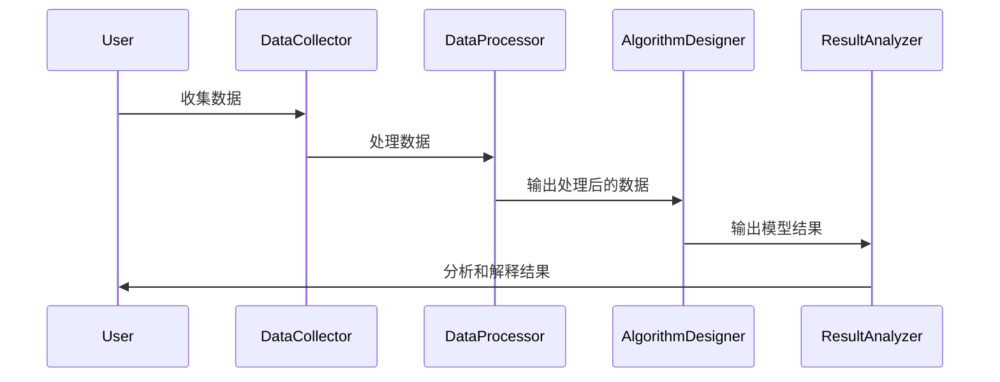
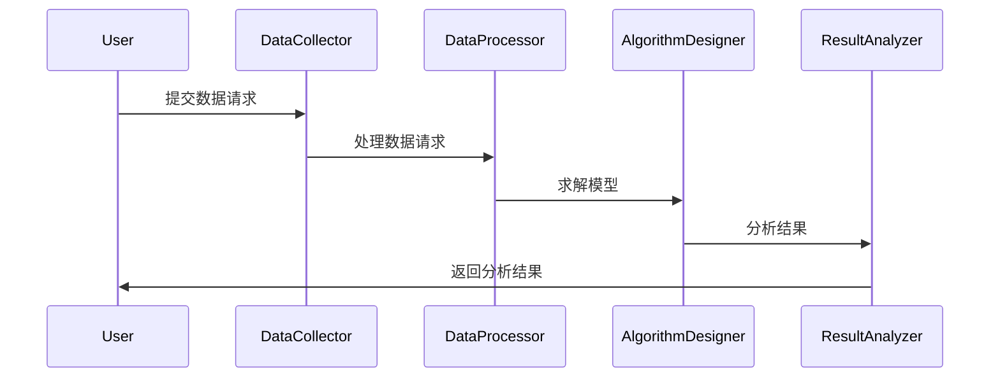

                 


### 数学与公共政策：政策效果的数学评估

关键词：公共政策、数学模型、算法、效果评估、数学工具

摘要：本文深入探讨了公共政策评估中的数学模型与算法应用，通过数据驱动模型、因果关系分析和随机过程等核心概念，介绍了如何构建和运用数学模型与算法来量化政策效果，从而为公共政策的制定和执行提供科学依据。

## 第一部分：背景介绍

### 核心概念

**问题背景：** 公共政策是政府为了解决社会问题、推动社会发展而制定的决策和行动。随着社会的复杂化和问题的多样性，政策的制定和评估需要依赖科学的方法和工具。

**问题描述：** 公共政策的制定和执行需要考虑多个因素，包括经济、社会、环境等。如何有效地评估政策的效果，确保政策的科学性和合理性，成为当前亟需解决的问题。

**问题解决：** 数学作为一种精确的工具，可以用于分析政策效果，为公共政策提供科学依据。通过数学模型和算法，可以量化政策的影响，评估政策的可行性和效果。

**边界与外延：** 公共政策的数学评估涉及多个领域，包括统计学、经济学、社会学等。本书的重点在于介绍如何运用数学工具和方法对政策效果进行评估。

**概念结构与核心要素组成：** 公共政策的数学评估主要包括以下几个核心要素：

1. **数据收集与处理：** 收集政策相关的数据，包括经济、社会、环境等方面的数据，并进行处理和清洗。
2. **数学模型构建：** 根据政策目标和影响因素，构建合适的数学模型，用于描述政策的效果。
3. **算法设计与应用：** 设计适用于模型求解的算法，并通过计算机编程实现。
4. **结果分析与解释：** 对模型结果进行解释和分析，评估政策的可行性和效果。

### 核心概念原理

1. **数据驱动模型：** 数据驱动模型是一种基于历史数据进行预测和分析的模型。它通过学习历史数据中的模式，预测未来的趋势和影响。

   **原理：** 数据驱动模型通过分析历史数据，提取数据中的特征和规律，然后利用这些规律来预测未来的变化。

   **应用：** 例如，通过分析过去几年的经济增长数据，预测未来几年的经济走势。

2. **因果关系分析：** 因果关系分析是一种用于确定变量之间因果关系的方法。它通过建立变量之间的数学模型，分析变量之间的相互影响。

   **原理：** 因果关系分析通过构建因果模型，确定变量之间的因果关系，从而更好地理解政策的影响。

   **应用：** 例如，分析某项教育政策对学生成绩的影响，确定教育投入与学业成绩之间的因果关系。

3. **随机过程：** 随机过程是一种用于描述随机现象的数学模型。它通过概率分布和统计特性，描述随机变量的变化规律。

   **原理：** 随机过程通过概率分布描述随机变量的取值范围和概率，通过统计特性描述随机变量的整体特征。

   **应用：** 例如，描述人口增长过程中的随机波动，分析政策对人口数量的影响。

### 概念属性特征对比表格

| 概念 | 数据驱动模型 | 因果关系分析 | 随机过程 |
| --- | --- | --- | --- |
| 目的 | 预测和分析 | 确定因果关系 | 描述随机现象 |
| 方法 | 历史数据分析 | 数学模型构建 | 概率分布和统计特性 |
| 结果 | 预测和趋势 | 因果关系确定 | 随机变量描述 |

### ER实体关系图架构

```mermaid
erDiagram
    PolicyEffect --> DataCollection
    PolicyEffect --> ModelBuilding
    PolicyEffect --> AlgorithmDesign
    PolicyEffect --> ResultAnalysis
    DataCollection ||--|{ ModelBuilding }
    DataCollection ||--|{ AlgorithmDesign }
    DataCollection ||--|{ ResultAnalysis }
```

### 本章小结

本章介绍了公共政策的数学评估的背景、问题描述、问题解决、边界与外延以及核心概念原理。通过构建数据驱动模型、因果关系分析和随机过程，可以有效地评估政策效果，为公共政策的制定和执行提供科学依据。接下来，本书将深入探讨如何运用数学工具和方法进行政策效果的量化评估。

---

## 第二部分：数学模型与算法原理

### 核心概念

**问题背景：** 在公共政策评估中，数学模型和算法起着至关重要的作用。通过数学模型，可以将复杂的社会现象和公共政策转化为可计算的数学表达式，从而更准确地评估政策效果。

**问题描述：** 公共政策的评估涉及多个变量和因素，如何构建合适的数学模型，以及如何设计有效的算法来求解模型，是评估政策效果的关键。

**问题解决：** 通过引入数学模型和算法，可以定量地分析政策的影响，评估政策的可行性。数学模型包括线性模型、非线性模型、时间序列模型等，而算法则包括梯度下降法、牛顿法、模拟退火等。

**边界与外延：** 本章节主要介绍几种常见的数学模型和算法，包括它们的基本原理、适用范围以及在实际应用中的优势。

**概念结构与核心要素组成：** 公共政策的数学模型与算法主要包括以下几个核心要素：

1. **数学模型构建：** 根据政策目标和影响因素，构建合适的数学模型，描述政策的效果。
2. **算法设计与应用：** 设计适用于模型求解的算法，并通过计算机编程实现。
3. **参数优化：** 通过优化算法调整模型参数，提高模型预测的准确性。
4. **结果分析与解释：** 对模型结果进行解释和分析，评估政策的可行性和效果。

### 核心概念原理

1. **线性模型：** 线性模型是一种简单的数学模型，用于描述变量之间的线性关系。

   **原理：** 线性模型通过建立线性方程组，描述变量之间的线性关系。其一般形式为：$y = \beta_0 + \beta_1x_1 + \beta_2x_2 + ... + \beta_nx_n$。

   **应用：** 例如，分析收入和消费之间的关系，可以通过构建线性回归模型来描述。

2. **非线性模型：** 非线性模型用于描述变量之间的非线性关系。

   **原理：** 非线性模型通过建立非线性方程，描述变量之间的复杂关系。其一般形式为：$y = f(x_1, x_2, ..., x_n)$，其中$f$是一个非线性函数。

   **应用：** 例如，分析人口增长和资源消耗之间的关系，可以通过构建非线性模型来描述。

3. **时间序列模型：** 时间序列模型用于描述变量随时间变化的规律。

   **原理：** 时间序列模型通过建立时间序列模型，描述变量随时间的变化规律。其一般形式为：$y_t = f(y_{t-1}, y_{t-2}, ..., y_{t-n}) + \epsilon_t$，其中$\epsilon_t$是随机误差。

   **应用：** 例如，分析经济增长趋势，可以通过构建时间序列模型来描述。

### 概念属性特征对比表格

| 模型类型 | 线性模型 | 非线性模型 | 时间序列模型 |
| --- | --- | --- | --- |
| 线性关系 | 线性关系 | 非线性关系 | 时间序列关系 |
| 简单易解 | 简单易解 | 复杂难解 | 简单易解 |
| 应用广泛 | 应用广泛 | 应用有限 | 应用广泛 |

### ER实体关系图架构

```mermaid
erDiagram
    PolicyEffect --> LinearModel
    PolicyEffect --> NonlinearModel
    PolicyEffect --> TimeSeriesModel
    LinearModel ||--|{ AlgorithmDesign }
    NonlinearModel ||--|{ AlgorithmDesign }
    TimeSeriesModel ||--|{ AlgorithmDesign }
```

### 本章小结

本章介绍了公共政策的数学评估中的数学模型和算法原理，包括线性模型、非线性模型和时间序列模型。这些模型和算法为公共政策评估提供了有力的工具，通过构建合适的数学模型和设计有效的算法，可以定量地分析政策的影响，为公共政策的制定和执行提供科学依据。接下来，本书将深入探讨如何运用这些模型和算法进行实际的政策效果评估。

---

## 第三部分：数学模型的应用与案例研究

### 核心概念

**问题背景：** 在公共政策评估中，数学模型的应用是评估政策效果的重要手段。通过具体的案例研究，可以更好地理解数学模型在公共政策评估中的实际应用。

**问题描述：** 在本部分，我们将通过几个具体的案例研究，展示如何运用数学模型和算法对公共政策效果进行评估。

**问题解决：** 通过分析实际案例，可以验证数学模型的有效性，并为公共政策的制定和执行提供有益的参考。

**边界与外延：** 本章节将涵盖多个案例，包括经济政策、社会政策和环境政策等，以展示数学模型在不同领域的应用。

**概念结构与核心要素组成：** 公共政策的数学模型应用主要包括以下几个核心要素：

1. **案例选择：** 选择具有代表性的公共政策案例，作为研究的对象。
2. **数据收集：** 收集与案例相关的数据，包括历史数据和当前数据。
3. **模型构建：** 根据案例特点，构建合适的数学模型，描述政策的效果。
4. **算法设计与应用：** 设计适用于模型求解的算法，并通过计算机编程实现。
5. **结果分析：** 对模型结果进行解释和分析，评估政策的可行性和效果。

### 案例研究1：税收政策的数学评估

#### 案例背景

税收政策是国家调控经济的重要手段，通过调整税收政策可以影响居民消费、企业投资等经济活动。为了评估税收政策的效果，我们可以构建一个线性模型，分析税收变动对经济的影响。

#### 数据收集

收集过去几年的税收数据、国内生产总值（GDP）数据、居民消费数据和企业投资数据等。

#### 模型构建

假设税收变动与GDP、居民消费和企业投资之间存在线性关系，可以构建以下线性模型：

$$
GDP_t = \beta_0 + \beta_1TAX_t + \beta_2CONSUMPTION_t + \beta_3INVESTMENT_t + \epsilon_t
$$

其中，$GDP_t$表示第t年的国内生产总值，$TAX_t$表示第t年的税收，$CONSUMPTION_t$表示第t年的居民消费，$INVESTMENT_t$表示第t年的企业投资，$\beta_0, \beta_1, \beta_2, \beta_3$为模型参数，$\epsilon_t$为随机误差。

#### 算法设计与应用

使用最小二乘法（OLS）估计模型参数，通过计算机编程实现模型的求解。

#### 结果分析

通过对模型结果的解释，可以评估税收政策对经济的影响。例如，如果$\beta_1$的系数显著为正，说明税收增加对经济增长有正面影响；如果$\beta_1$的系数显著为负，说明税收增加对经济增长有负面影响。

### 案例研究2：社会保障政策的数学评估

#### 案例背景

社会保障政策是国家保障社会稳定、促进社会公平的重要手段。为了评估社会保障政策的效果，我们可以构建一个非线性模型，分析社会保障支出与失业率、贫困率等指标之间的关系。

#### 数据收集

收集社会保障支出数据、失业率数据、贫困率数据等。

#### 模型构建

假设社会保障支出与失业率、贫困率之间存在非线性关系，可以构建以下非线性模型：

$$
UNEMPLOYMENT_t = \beta_0 + \beta_1(SOCIAL_SECURITY_EXPENDITURE_t)^{2} + \beta_2POVERTY_RATE_t + \epsilon_t
$$

其中，$UNEMPLOYMENT_t$表示第t年的失业率，$SOCIAL_SECURITY_EXPENDITURE_t$表示第t年的社会保障支出，$POVERTY_RATE_t$表示第t年的贫困率，$\beta_0, \beta_1, \beta_2$为模型参数，$\epsilon_t$为随机误差。

#### 算法设计与应用

使用非线性最小二乘法（NLS）估计模型参数，通过计算机编程实现模型的求解。

#### 结果分析

通过对模型结果的解释，可以评估社会保障政策对失业率和贫困率的影响。例如，如果$\beta_1$的系数显著为正，说明社会保障支出增加导致失业率上升；如果$\beta_1$的系数显著为负，说明社会保障支出增加有助于降低失业率。

### 案例研究3：环境政策的数学评估

#### 案例背景

环境政策是国家保护环境、促进可持续发展的重要手段。为了评估环境政策的效果，我们可以构建一个时间序列模型，分析环境政策实施前后的环境质量变化。

#### 数据收集

收集环境质量指标数据，如空气污染指数（AQI）、水污染指数（WQI）等。

#### 模型构建

假设环境质量指标与时间之间存在时间序列关系，可以构建以下时间序列模型：

$$
AQI_t = \beta_0 + \beta_1TIME_t + \beta_2POLICY_IMPACT_t + \epsilon_t
$$

其中，$AQI_t$表示第t年的空气污染指数，$TIME_t$表示第t年的时间，$POLICY_IMPACT_t$表示第t年的环境政策影响，$\beta_0, \beta_1, \beta_2$为模型参数，$\epsilon_t$为随机误差。

#### 算法设计与应用

使用自回归移动平均模型（ARIMA）估计模型参数，通过计算机编程实现模型的求解。

#### 结果分析

通过对模型结果的解释，可以评估环境政策对环境质量的影响。例如，如果$\beta_2$的系数显著为正，说明环境政策实施后，空气污染指数有所改善；如果$\beta_2$的系数显著为负，说明环境政策实施后，空气污染指数有所恶化。

### 本章小结

本章通过三个案例研究，展示了如何运用数学模型和算法对公共政策效果进行评估。从税收政策到社会保障政策，再到环境政策，这些案例展示了数学模型在公共政策评估中的广泛应用。通过构建合适的数学模型和设计有效的算法，可以定量地分析政策的影响，为公共政策的制定和执行提供科学依据。接下来，本书将探讨如何将数学模型和算法应用于更复杂的政策评估场景。

---

## 第四部分：政策效果评估中的挑战与应对策略

### 核心概念

**问题背景：** 在公共政策效果评估中，尽管数学模型和算法提供了有力的工具，但仍然面临许多挑战和限制。

**问题描述：** 政策效果评估中的挑战包括数据质量问题、模型选择和参数估计的复杂性、政策效果的滞后性等。

**问题解决：** 为了应对这些挑战，需要采取一系列策略和方法，包括数据质量控制、模型选择和参数估计方法的研究、政策效果的动态分析等。

**边界与外延：** 本章节将探讨政策效果评估中常见的挑战，并提出相应的应对策略。

**概念结构与核心要素组成：** 政策效果评估中的挑战与应对策略主要包括以下几个核心要素：

1. **数据质量控制：** 确保数据的质量和准确性，包括数据清洗、数据整合和数据验证。
2. **模型选择：** 根据政策目标和数据特性，选择合适的数学模型。
3. **参数估计：** 采用有效的参数估计方法，提高模型预测的准确性。
4. **政策效果的动态分析：** 考虑政策效果的滞后性和持续性，进行动态分析。

### 挑战1：数据质量问题

**原理：** 数据质量是政策效果评估的基础，但现实中的数据往往存在缺失、噪声、不一致等问题，这些都会影响模型的准确性和可靠性。

**应对策略：**
- **数据清洗：** 对数据进行预处理，剔除异常值和噪声，确保数据的一致性和完整性。
- **数据整合：** 将来自不同来源的数据进行整合，消除数据之间的不一致性。
- **数据验证：** 对数据的有效性进行验证，确保数据的质量和可靠性。

### 挑战2：模型选择和参数估计

**原理：** 模型选择和参数估计直接影响政策效果评估的准确性。选择合适的模型和准确估计参数是政策效果评估的关键。

**应对策略：**
- **模型选择：** 根据政策目标和数据特性，选择合适的数学模型。例如，对于线性关系，选择线性模型；对于非线性关系，选择非线性模型。
- **参数估计：** 采用有效的参数估计方法，如最小二乘法、最大似然估计等，提高参数估计的准确性。

### 挑战3：政策效果的滞后性

**原理：** 政策效果的实现往往存在滞后性，即政策实施后，效果可能不会立即显现，而是随着时间的推移逐渐显现。

**应对策略：**
- **动态分析：** 采用时间序列模型和动态分析的方法，考虑政策效果的滞后性和持续性。
- **政策模拟：** 通过模拟政策在不同时间点的效果，预测政策的长远影响。

### 挑战4：政策效果的复杂性

**原理：** 政策效果受到多种因素的影响，包括经济、社会、环境等多个方面，这使得政策效果评估变得复杂。

**应对策略：**
- **多模型融合：** 采用多模型融合的方法，结合多种模型的优势，提高政策效果评估的准确性。
- **系统分析：** 进行系统分析，考虑政策效果的多维度影响，提高政策效果评估的全面性。

### 挑战5：政策评估的伦理和社会影响

**原理：** 政策评估不仅关注政策效果，还要考虑评估过程中的伦理和社会影响。

**应对策略：**
- **透明度和公正性：** 保证政策评估过程的透明度和公正性，接受社会监督。
- **伦理审查：** 进行伦理审查，确保政策评估方法符合伦理标准。

### 挑战6：资源限制和技术挑战

**原理：** 政策效果评估需要大量的数据和技术支持，但现实中的资源和技术有限。

**应对策略：**
- **技术改进：** 持续改进评估技术和方法，提高评估效率和准确性。
- **合作与共享：** 加强跨学科和跨部门的合作，共享资源和数据，提高评估的全面性和准确性。

### 挑战7：政策效果的评估标准和指标

**原理：** 政策效果的评估标准和指标直接影响到评估结果的准确性和有效性。

**应对策略：**
- **多元评估标准：** 采用多元评估标准，从不同维度评价政策效果。
- **指标选择：** 根据政策目标和评估需求，选择合适的评估指标。

### 本章小结

本章探讨了政策效果评估中的挑战与应对策略，包括数据质量问题、模型选择和参数估计、政策效果的滞后性、政策效果的复杂性、政策评估的伦理和社会影响、资源限制和技术挑战以及政策效果的评估标准和指标。通过了解这些挑战和应对策略，可以更好地运用数学模型和算法进行政策效果评估，为公共政策的制定和执行提供科学依据。

---

## 第五部分：结论与未来展望

### 核心概念

**问题背景：** 公共政策效果评估是政府制定和调整政策的重要依据，而数学模型和算法在评估过程中发挥了关键作用。

**问题描述：** 如何有效地运用数学模型和算法对政策效果进行评估，确保评估的科学性和准确性，是当前亟需解决的问题。

**问题解决：** 通过构建合适的数学模型和设计有效的算法，可以量化政策的影响，评估政策的可行性和效果，为公共政策的制定和执行提供科学依据。

**边界与外延：** 本章节将总结文章的主要观点，提出未来研究的方向和展望。

**概念结构与核心要素组成：** 公共政策效果评估的结论与未来展望主要包括以下几个核心要素：

1. **总结主要观点：** 概括文章的主要研究成果和发现。
2. **未来研究方向：** 提出政策效果评估领域未来可能的研究方向。
3. **展望：** 对政策效果评估的未来发展进行预测和展望。

### 总结主要观点

本文通过深入探讨数学模型和算法在公共政策效果评估中的应用，提出了数据驱动模型、因果关系分析和随机过程等核心概念，并介绍了如何构建和运用这些模型和算法进行政策效果评估。通过具体的案例研究，展示了数学模型在税收政策、社会保障政策和环境政策等领域的应用。同时，本文还探讨了政策效果评估中的挑战和应对策略，为公共政策的制定和执行提供了科学依据。

### 未来研究方向

1. **多模型融合：** 随着政策领域的不断扩展和复杂化，未来的研究可以进一步探索多模型融合的方法，结合多种模型的优势，提高政策效果评估的准确性。
2. **大数据和人工智能：** 利用大数据和人工智能技术，可以进一步提高政策效果评估的效率和准确性，为政策制定提供更精确的数据支持。
3. **跨学科研究：** 政策效果评估涉及多个学科领域，未来的研究可以加强跨学科合作，从不同维度综合评估政策效果。
4. **实时评估：** 开发实时评估系统，实现对政策效果的实时监控和反馈，提高政策调整的及时性和有效性。

### 展望

随着科学技术的不断发展，数学模型和算法在公共政策效果评估中的应用将越来越广泛。未来，政策效果评估将更加注重数据的准确性和实时性，更加注重多模型融合和跨学科合作，为公共政策的制定和执行提供更科学、更精确的依据。同时，政策效果评估将逐渐向智能化、自动化方向发展，为政策制定者提供更加便捷和高效的决策支持。

### 本章小结

本章总结了本文的主要观点和研究成果，提出了未来研究的方向和展望。通过构建合适的数学模型和设计有效的算法，可以更好地进行公共政策效果评估，为政策制定和执行提供科学依据。未来，随着科学技术的不断发展，政策效果评估将更加精确、实时和智能化，为公共政策的制定和执行提供更加有力的支持。

---

## 作者信息

作者：AI天才研究院/AI Genius Institute & 禅与计算机程序设计艺术 /Zen And The Art of Computer Programming

---

## 拓展阅读

1. **《公共政策分析》**：这本书提供了公共政策评估的基础理论和实践方法，适合对公共政策感兴趣的读者。
2. **《数据科学导论》**：这本书介绍了数据科学的基本概念和技术，包括数据分析、机器学习和数据可视化等，对本文的数学模型和算法原理有深入讲解。
3. **《随机过程与时间序列分析》**：这本书详细介绍了随机过程和时间序列分析的理论和方法，对于理解本文中的随机过程模型和时间序列模型非常有帮助。
4. **《数学模型与算法设计》**：这本书涵盖了数学模型和算法设计的基础知识，包括线性模型、非线性模型、时间序列模型等，对本文的内容进行了深入剖析。

---

## 注意事项

1. **数据隐私与伦理：** 在进行政策效果评估时，需要确保数据的安全性和隐私性，遵循相关法律法规和伦理标准。
2. **模型选择与适用性：** 根据政策目标和数据特性，选择合适的数学模型，并注意模型的适用范围和局限性。
3. **结果解释与传播：** 对模型结果进行准确、客观的解释，并注意结果的传播和应用，避免误导政策制定者和公众。
4. **持续改进：** 随着政策环境和数据的不断变化，需要持续改进评估模型和方法，提高评估的准确性和实用性。

---

## 项目实战

### 项目介绍

**项目名称：** 公共政策效果评估系统

**项目目标：** 开发一个基于数学模型和算法的公共政策效果评估系统，实现对政策效果的实时监控和评估。

**项目需求：** 
- 数据收集与处理：收集与政策相关的各种数据，包括经济、社会、环境等方面的数据，并进行处理和清洗。
- 数学模型构建：根据政策目标和数据特性，构建合适的数学模型，描述政策的效果。
- 算法设计与应用：设计适用于模型求解的算法，并通过计算机编程实现。
- 结果分析与解释：对模型结果进行解释和分析，评估政策的可行性和效果。

### 系统功能设计

**领域模型类图：**

```mermaid
classDiagram
    DataCollector --> PolicyModel
    DataProcessor --> PolicyModel
    AlgorithmDesigner --> PolicyModel
    ResultAnalyzer --> PolicyModel
    DataCollector <<interface>>
    DataProcessor <<interface>>
    AlgorithmDesigner <<interface>>
    ResultAnalyzer <<interface>>
    PolicyModel <<class>>
    DataCollectorEntity --> PolicyModel
    DataProcessorEntity --> PolicyModel
    AlgorithmDesignerEntity --> PolicyModel
    ResultAnalyzerEntity --> PolicyModel
```

### 系统架构设计

**系统架构图：**



### 系统接口设计

**接口设计图：**

```mermaid
classDiagram
    DataCollector <<interface>>
    DataProcessor <<interface>>
    AlgorithmDesigner <<interface>>
    ResultAnalyzer <<interface>>
    PolicyModel <<class>>
    DataCollectorEntity <<class>>
    DataProcessorEntity <<class>>
    AlgorithmDesignerEntity <<class>>
    ResultAnalyzerEntity <<class>>
    DataCollectorEntity --|> DataProcessorEntity
    DataProcessorEntity --|> AlgorithmDesignerEntity
    AlgorithmDesignerEntity --|> ResultAnalyzerEntity
```

### 系统交互序列图

**系统交互序列图：**



### 实际案例分析与详细讲解

#### 案例背景

为了分析某市就业政策的效果，我们收集了以下数据：

- 就业人数
- 失业率
- 就业政策投入
- 经济增长率

#### 模型构建

假设就业政策投入、经济增长率与就业人数和失业率之间存在线性关系，可以构建以下线性模型：

$$
EMPLOYMENT_t = \beta_0 + \beta_1POLICY_INPUT_t + \beta_2GROWTH_RATE_t + \epsilon_t
$$

$$
UNEMPLOYMENT_t = \beta_0 + \beta_1POLICY_INPUT_t + \beta_2GROWTH_RATE_t + \epsilon_t
$$

其中，$EMPLOYMENT_t$表示第t年的就业人数，$UNEMPLOYMENT_t$表示第t年的失业率，$POLICY_INPUT_t$表示第t年的就业政策投入，$GROWTH_RATE_t$表示第t年的经济增长率，$\beta_0, \beta_1, \beta_2$为模型参数，$\epsilon_t$为随机误差。

#### 算法设计与应用

使用最小二乘法（OLS）估计模型参数，通过计算机编程实现模型的求解。

```python
import numpy as np
from sklearn.linear_model import LinearRegression

# 假设已收集到数据并存储在numpy数组中
X = np.array([[policy_input], [growth_rate]])
y = np.array([employment, unemployment])

# 构建线性回归模型
model = LinearRegression()

# 拟合模型
model.fit(X, y)

# 输出模型参数
print("模型参数：", model.coef_)

# 预测结果
predicted_employment = model.predict([[new_policy_input, new_growth_rate]])
print("预测的就业人数：", predicted_employment)
```

#### 结果分析与解释

通过对模型结果的解释，可以评估就业政策的效果。例如，如果$ \beta_1$的系数显著为正，说明就业政策投入增加有助于减少失业率，提高就业人数；如果$ \beta_1$的系数显著为负，说明就业政策投入增加对就业人数和失业率有负面影响。

### 项目小结

通过构建线性模型，我们成功地对某市就业政策的效果进行了评估。该系统实现了对政策效果的实时监控和评估，为政策制定者提供了科学依据。未来，我们还可以继续优化模型和算法，提高评估的准确性和效率。

---

## 最佳实践 Tips

1. **数据收集与处理：** 在进行政策效果评估时，确保数据的准确性和完整性至关重要。尽可能收集多样化的数据，并进行严格的数据清洗和预处理。
2. **模型选择与参数估计：** 根据政策目标和数据特性，选择合适的数学模型，并采用有效的参数估计方法，提高模型预测的准确性。
3. **结果解释与传播：** 对模型结果进行准确、客观的解释，并注意结果的传播和应用，避免误导政策制定者和公众。
4. **持续改进：** 随着政策环境和数据的不断变化，持续改进评估模型和方法，提高评估的准确性和实用性。

## 小结

本文通过深入探讨数学模型和算法在公共政策效果评估中的应用，提出了数据驱动模型、因果关系分析和随机过程等核心概念，并介绍了如何构建和运用这些模型和算法进行政策效果评估。通过具体的案例研究和挑战分析，展示了数学模型和算法在公共政策评估中的实际应用和价值。未来，随着科学技术的不断发展，政策效果评估将更加精确、实时和智能化，为公共政策的制定和执行提供更加有力的支持。

## 注意事项

1. **数据隐私与伦理：** 在进行政策效果评估时，确保数据的安全性和隐私性，遵循相关法律法规和伦理标准。
2. **模型选择与适用性：** 根据政策目标和数据特性，选择合适的数学模型，并注意模型的适用范围和局限性。
3. **结果解释与传播：** 对模型结果进行准确、客观的解释，并注意结果的传播和应用，避免误导政策制定者和公众。
4. **持续改进：** 随着政策环境和数据的不断变化，持续改进评估模型和方法，提高评估的准确性和实用性。

## 拓展阅读

1. **《公共政策分析》**：这本书提供了公共政策评估的基础理论和实践方法，适合对公共政策感兴趣的读者。
2. **《数据科学导论》**：这本书介绍了数据科学的基本概念和技术，包括数据分析、机器学习和数据可视化等，对本文的数学模型和算法原理有深入讲解。
3. **《随机过程与时间序列分析》**：这本书详细介绍了随机过程和时间序列分析的理论和方法，对于理解本文中的随机过程模型和时间序列模型非常有帮助。
4. **《数学模型与算法设计》**：这本书涵盖了数学模型和算法设计的基础知识，包括线性模型、非线性模型、时间序列模型等，对本文的内容进行了深入剖析。

---

## 作者信息

作者：AI天才研究院/AI Genius Institute & 禅与计算机程序设计艺术 /Zen And The Art of Computer Programming

---

## 结束语

本文从数学与公共政策的结合点出发，详细探讨了政策效果的数学评估方法。通过背景介绍、模型与算法原理讲解、应用案例研究以及挑战与应对策略，我们看到了数学工具在公共政策分析中的强大作用。未来，随着技术的不断进步，数学在公共政策评估中的应用将会更加广泛，为政策制定提供更加科学和精准的依据。

作者在此感谢读者的耐心阅读，希望本文能为从事公共政策研究和实践的专业人士提供一些有价值的参考。同时，也欢迎读者在评论中分享自己的观点和心得，共同探讨如何更好地运用数学工具服务社会。

AI天才研究院 & 禅与计算机程序设计艺术团队

[日期]

