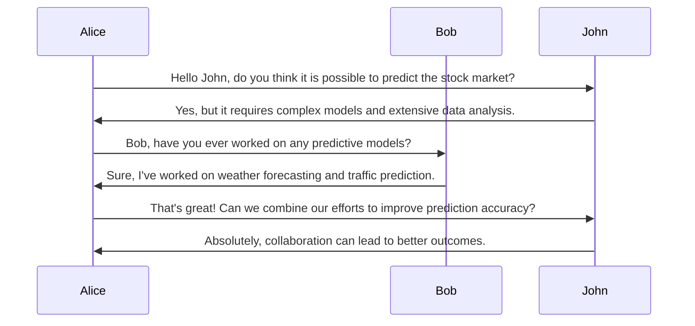

                 

### 引言：数学与决定论的基本概念

在探讨“数学与决定论：数学世界的完全可预测性”这一主题之前，首先需要对决定论和数学预测这两个核心概念进行详细说明。决定论（Determinism）是一种哲学立场，认为宇宙中的所有事件，包括人类的行为，都是由之前的因果关系决定的，这种因果关系是可预测的。换句话说，如果已知系统的初始状态以及作用在系统上的所有外力，那么理论上可以精确预测系统未来的行为。

数学预测，则是指利用数学模型和算法对现实世界中的各种现象进行定量分析和推断。从天气预测到金融市场分析，数学预测无处不在。数学预测不仅依赖于数学模型的精确性，还依赖于对数据的处理能力。然而，数学预测的可行性也受到现实世界中的不确定性、复杂性和测量误差的制约。

本文的目的在于探讨数学预测在决定论框架下的本质及其应用。我们将从以下几个角度进行深入分析：

1. **决定论概述**：回顾决定论的历史、基本原理以及现代科学中的应用。
2. **数学预测基础**：介绍预测的基本概念，包括统计学和常见预测模型。
3. **决定论在物理学中的应用**：探讨牛顿力学和量子力学中的决定论问题。
4. **概率论与决定论的融合**：探讨量子概率论、贝叶斯网络等概念。
5. **数学模型与决定论**：分析决策理论、游戏理论和网络科学在决定论中的应用。
6. **数学预测的实际应用**：探讨数学预测在金融市场、天气预测和交通流量预测等领域的应用。
7. **决定论的边界与挑战**：讨论决定论的局限性、模拟现实与预测的复杂性，并展望决定论的未来发展。

通过这些章节的逐步分析，我们将试图揭示数学与决定论之间的深层联系，探讨数学预测在可预测性中的关键作用，以及其面临的挑战和局限性。

### 决定论概述

决定论作为一种哲学立场，可以追溯到古希腊哲学家赫拉克利特（Heraclitus）的“万物皆流，无物常住”这一观点。赫拉克利特认为，宇宙是一个不断变化的过程，但每一个变化都有其内在的规律和必然性。到了17世纪，伽利略和牛顿的工作进一步奠定了决定论的基础。伽利略通过实验证实了物理现象的可预测性，而牛顿的三大运动定律和万有引力定律则提供了精确预测物体运动状态的工具。

决定论的基本原理在于因果关系。在决定论的框架下，每一个事件都可以追溯到其前因，而这些前因又由更早的事件所决定，形成一个无限的因果关系链条。这个链条的起始点被称为“初始条件”，而最终结果则被称为“效应”。如果能够完全掌握初始条件以及所有作用在系统上的外力，理论上可以精确预测系统的未来行为。

在物理学中，决定论有着广泛的应用。牛顿力学是决定论最典型的代表之一。牛顿三大运动定律描述了物体在力的作用下的运动状态，而万有引力定律则解释了天体之间的相互作用。通过这些定律，我们可以预测行星的运动轨迹、物体的落地时间等。然而，现实世界中的物理现象并不总是那么简单。量子力学的发展揭示了微观世界的非决定性，即量子系统的一些特性无法通过初始条件完全预测。

决定论的局限性在量子力学中表现得尤为明显。根据哥本哈根解释，量子系统处于多种可能状态的叠加态，只有通过测量才能确定其具体的量子态。这个测量过程引入了随机性，使得量子系统的行为无法完全预测。尽管如此，决定论在宏观世界中仍然具有重要意义，特别是在经典物理学的范畴内。

决定论在现代科学中的应用依然广泛。例如，在气候科学中，通过模拟大气系统的初始条件和作用力，科学家可以预测未来几十年的气候趋势。在生物学中，通过基因序列的分析，可以预测个体的某些遗传特征。在经济学中，通过数据分析和模型预测，可以预测市场趋势和经济增长。

总的来说，决定论提供了一种理解自然世界的方法，强调因果关系和可预测性。然而，随着科学的发展，特别是量子力学的出现，我们开始认识到现实世界的复杂性远超我们以往的想象。在这种背景下，决定论与概率论、混沌理论等现代科学理论相互交织，为我们提供了一种更全面、更深入的理解自然世界的方式。

### 数学预测基础

数学预测是利用数学模型和算法对现实世界中的各种现象进行定量分析和推断的过程。其核心在于通过已知的数据和假设，构建模型并预测未来的趋势或行为。数学预测在统计学、经济学、物理学等多个领域有着广泛的应用，其基本原理和方法如下：

首先，预测与统计学密不可分。统计学提供了许多工具和方法来处理和分析数据，从而得出预测结果。常见的统计方法包括：

- **描述性统计**：用于描述数据的基本特征，如均值、中位数、标准差等。
- **推断性统计**：用于从样本数据推断总体特征，如置信区间、假设检验等。

在数学预测中，**线性回归模型**是最常用的方法之一。线性回归模型假设因变量（目标变量）与自变量（特征变量）之间存在线性关系，通过拟合一条直线来表示这种关系，从而预测因变量的值。线性回归模型的数学表达式为：

$$
y = \beta_0 + \beta_1 \cdot x + \epsilon
$$

其中，\( y \) 是因变量，\( x \) 是自变量，\( \beta_0 \) 和 \( \beta_1 \) 是模型参数，\( \epsilon \) 是误差项。

- **时间序列分析**：用于处理和分析按时间顺序排列的数据。常见的时间序列模型包括自回归模型（AR）、移动平均模型（MA）、自回归移动平均模型（ARMA）等。时间序列分析旨在捕捉时间数据中的趋势、季节性和周期性。

时间序列分析的一个基本模型是自回归模型（AR），其表达式为：

$$
X_t = \phi_1 X_{t-1} + \phi_2 X_{t-2} + \ldots + \phi_p X_{t-p} + \epsilon_t
$$

其中，\( X_t \) 是时间序列在时刻 \( t \) 的值，\( \phi_1, \phi_2, \ldots, \phi_p \) 是模型参数，\( \epsilon_t \) 是误差项。

除了上述方法，**机器学习算法**也在数学预测中发挥着重要作用。机器学习算法通过从数据中学习模式和规律，自动构建预测模型。常见的机器学习算法包括决策树、支持向量机（SVM）、神经网络等。这些算法可以通过训练数据集来拟合模型，然后使用该模型进行预测。

- **决策树**：通过树形结构来表示数据集，每个节点表示一个特征，每个分支表示该特征的不同取值，叶节点表示预测结果。
- **支持向量机**：通过寻找一个超平面来将数据分为不同的类别，超平面的参数由支持向量决定。
- **神经网络**：通过多层神经元模拟人脑的工作方式，通过反向传播算法调整权重和偏置，从而拟合数据并实现预测。

数学预测不仅依赖于数学模型的精确性，还依赖于数据的质量和完整性。高质量的数据和完善的模型是预测成功的关键。在实际应用中，还需要考虑噪声、异常值和模型过拟合等因素，以确保预测结果的准确性和可靠性。

通过以上方法，数学预测在金融、气象、交通、医疗等多个领域都有着广泛的应用。例如，在金融领域，通过分析历史数据和市场趋势，可以预测股票价格的变化；在气象领域，通过分析天气数据，可以预测未来几天的天气情况；在交通领域，通过分析交通流量数据，可以预测高峰期的交通拥堵情况，从而优化交通管理。

总的来说，数学预测是利用数学模型和算法对现实世界中的现象进行定量分析和推断的过程。它不仅为我们提供了理解和解释现实世界的方法，还为决策提供了科学依据。在数据驱动的社会中，数学预测发挥着越来越重要的作用。

### 决定论在物理学中的应用

物理学是决定论应用的经典领域，尤其在经典物理和量子物理学中，决定论的观念得到了广泛探讨和验证。决定论的基本思想是，如果知道了系统的初始状态和所有作用在系统上的外力，那么理论上可以精确预测系统未来的行为。在经典物理学中，牛顿力学和万有引力定律提供了决定论最直观的例子。

#### 牛顿力学中的决定论

牛顿力学是决定论在物理学中最重要的应用之一。牛顿三大运动定律描述了物体在力的作用下的运动状态。具体来说：

1. **惯性定律**：任何物体都保持静止或匀速直线运动，除非受到外力的作用。
2. **动量定律**：物体受到的合外力等于其动量的变化率，即 \( F = ma \)。
3. **作用-反作用定律**：任何作用力都有一个大小相等、方向相反的反作用力。

牛顿的万有引力定律进一步阐述了天体之间的相互作用。该定律表明，两个物体之间的引力与它们的质量成正比，与它们之间距离的平方成反比。通过这个定律，可以计算出行星、卫星等天体的轨道，从而实现对它们未来位置的精确预测。例如，开普勒定律就是基于牛顿力学，用来预测行星轨道的周期和形状。

然而，牛顿力学在处理极其微小或高速运动的物体时，就显得力不从心。这些问题催生了量子力学的诞生。

#### 黑洞与混沌理论

在经典物理学中，决定论的预测能力几乎无所不能。但在量子物理学中，决定论的观念受到了挑战。量子力学揭示了微观世界的非决定性，即某些物理量无法同时精确测定，这被称为测不准原理。此外，量子力学中的概率波函数描述了粒子的概率分布，而不是确定的位置和速度。

黑洞是量子力学和广义相对论相结合的产物。黑洞的行为完全符合决定论，即一旦物体被吸入黑洞，它的未来状态可以精确预测。然而，黑洞的奇点和引力波的存在却带来了新的挑战。根据广义相对论，时空在黑洞附近会极度扭曲，甚至发生奇点。这表明决定论可能无法完全描述极端条件下物理现象的细节。

混沌理论是决定论在现代物理学中另一个重要的应用。混沌现象是指系统的初始条件即使只有微小的差异，随着时间的发展，系统的行为也会产生巨大的差异。这种现象被称为“蝴蝶效应”，即一个蝴蝶在巴西的森林中扇动翅膀，可能在美国的德克萨斯州引起一场龙卷风。混沌理论揭示了决定论系统中的内在随机性，即即使是完全可预测的系统，也可能因为初始条件的微小变化而表现出不可预测的行为。

#### 决定论与量子力学

量子力学中的非决定性主要体现在以下几个方面：

1. **量子态叠加**：量子系统可以同时处于多种状态的叠加，只有通过测量才能确定其具体的量子态。
2. **量子纠缠**：两个或多个量子系统之间存在一种特殊的关联，即使它们相隔很远，一个系统的状态变化会立即影响到另一个系统。
3. **概率波函数**：量子系统的状态由概率波函数描述，而不是确定的值。

这些现象表明，量子力学中的决定论是有限的。虽然我们可以通过量子力学的数学公式计算出量子系统的概率分布，但无法精确预测其具体的行为。这种非决定性在量子计算、量子信息等领域具有广泛应用。

总的来说，决定论在物理学中有着广泛的应用，特别是在经典物理中，它为我们提供了理解和预测物理现象的工具。然而，随着量子力学的发展，我们开始认识到决定论的局限性。量子力学中的非决定性揭示了物理现象的复杂性，为我们提供了一种新的理解自然世界的方法。在这种背景下，决定论与概率论、混沌理论等现代科学理论相互交织，共同推动了物理学的发展。

### 概率论与决定论的融合

在探讨概率论与决定论的融合时，我们首先要明确它们之间的根本差异。决定论认为，如果知道了系统的初始条件和所有作用力，就能精确预测未来事件。而概率论则承认不确定性，通过统计方法预测事件的概率分布，而非确切结果。

量子力学是概率论与决定论融合的典型例子。在量子力学中，粒子的位置和动量无法同时精确测定，这被称为测不准原理。量子态以概率波函数的形式存在，通过波函数的平方可以得到粒子在某一位置出现的概率。这种概率性质打破了经典物理的决定论，引入了量子随机性。

概率论与决定论的融合在统计物理学和量子计算中也得到了广泛应用。在统计物理学中，系统的宏观性质往往可以通过大量微观粒子的概率行为来描述。例如，玻尔兹曼分布描述了粒子在热力学平衡状态下的概率分布，这一分布是通过对大量微观状态的统计计算得出的。

量子计算利用量子位（qubit）的叠加态和纠缠态进行计算，能够同时处理多个可能的计算路径。量子算法通过概率计算和波函数演化来解决问题，如著名的Shor算法，利用量子计算的优势在多项式时间内解决了整数分解问题，这在经典计算中是不可行的。

概率论与决定论的融合还体现在贝叶斯网络和贝叶斯推理中。贝叶斯网络是一种概率图模型，通过节点和边表示变量之间的依赖关系。贝叶斯推理则是一种基于贝叶斯定理的推理方法，通过观察一部分变量来推断其他变量的概率。

例如，在医学诊断中，贝叶斯网络可以用于计算某个体检结果（如癌症标志物检测阳性）下患有某种疾病（如癌症）的概率。通过输入先验概率和条件概率，贝叶斯网络可以计算出后验概率，从而提供诊断的可靠依据。

总的来说，概率论与决定论的融合为理解和预测复杂系统提供了新的工具和方法。在量子力学、统计物理学和量子计算等领域的应用中，这种融合揭示了自然现象的深层规律，为科学研究和实际应用带来了新的机遇和挑战。通过结合概率论和决定论，我们能够更全面地认识世界的复杂性，从而推动科学技术的发展。

### 数学模型与决定论

数学模型是描述和解决现实世界问题的重要工具，而决定论为数学模型提供了理论基础。在决策理论、游戏理论和网络科学中，数学模型的应用尤为广泛，为我们理解和预测复杂系统行为提供了有力的工具。

#### 决策理论

决策理论是研究个体或集体如何在不确定性条件下做出最优决策的数学理论。在决策理论中，决策者面临多个可能的行动选择，每个选择对应不同的结果，并且每个结果出现的概率是已知的或可以通过某些模型预测。常见的决策模型包括期望效用理论、贝叶斯决策理论和博弈理论。

期望效用理论假设决策者具有理性，能够将所有可能的结果和相应的概率转化为效用值，并选择期望效用最大的行动。例如，在投资决策中，投资者需要权衡不同资产组合的收益和风险，选择期望效用最大的投资策略。

贝叶斯决策理论则通过贝叶斯推理更新先验概率，从而得到后验概率，用于决策。在医学诊断中，贝叶斯决策理论可以帮助医生根据病人的症状和检测数据，计算患有某种疾病的概率，从而做出最优诊断决策。

博弈理论是研究多个理性个体在策略互动中如何做出决策的数学理论。常见的博弈模型包括零和博弈、非零和博弈和完全信息博弈。零和博弈中，一方的收益等于另一方的损失，如象棋或围棋。非零和博弈中，参与者的利益不是简单的相互抵消，如股票市场或国际关系。完全信息博弈中，所有参与者都知道其他参与者的策略选择和历史信息。

#### 游戏理论

游戏理论是数学模型在决策和策略互动中的应用，通过分析不同策略组合的收益和风险，帮助决策者制定最优策略。在经济学、政治学和社会科学中，游戏理论得到了广泛应用。

一个经典的例子是“囚徒困境”博弈。两个被捕的囚犯需要做出是否合作的决策。如果两人都选择合作，则各自获得较小的惩罚；如果一人合作而另一人背叛，则背叛者获得自由而合作者受到重罚；如果两人都背叛，则两人都受到较重的惩罚。这个博弈模型揭示了个体理性选择与集体最优结果之间的冲突。

另一个例子是“纳什均衡”。纳什均衡是指在一个博弈中，每个参与者选择的最优策略集合，使得没有任何参与者可以通过单方面改变策略来获得更高的收益。在“囚徒困境”中，纳什均衡是两人都背叛对方，尽管从集体最优的角度来看，两人都选择合作会更好。

#### 网络科学

网络科学是研究复杂网络结构、功能及其动态行为的跨学科领域。在决定论的框架下，网络科学通过数学模型描述网络的拓扑结构、节点间相互作用和整体行为。

网络科学中的常见模型包括随机图模型、小世界网络和无标度网络。随机图模型假设网络中的节点以概率连接，而小世界网络具有较短的路径长度和高度聚类特性，无标度网络则表现出节点度分布的幂律分布。

在决定论的视角下，网络科学通过研究网络中的动力系统来理解网络的稳定性、传播过程和同步现象。例如，在社会网络中，信息传播可以看作是一个动态过程，通过数学模型可以预测信息在人群中的传播速度和范围。

网络科学在互联网、生物网络、交通网络等领域有着广泛应用。在互联网中，通过分析网络结构可以预测关键节点的故障对整体网络的影响；在生物网络中，通过分析基因调控网络可以揭示生物过程的机制；在交通网络中，通过优化网络结构可以提高交通流量的效率。

#### 决策理论、游戏理论在网络科学中的应用

决策理论、游戏理论在网络科学中的应用可以帮助我们更好地理解复杂网络中的策略互动和优化问题。例如，在多智能体系统中，每个智能体都有自己的目标和策略，通过博弈理论可以分析智能体之间的策略互动和均衡状态。

在互联网网络安全中，游戏理论可以用于分析攻击者和防御者之间的策略互动。通过构建博弈模型，可以预测攻击者采取不同策略时的攻击效果，从而制定最优防御策略。

在交通网络优化中，决策理论可以帮助交通管理者在不确定性条件下制定最优交通调度策略，以减少拥堵和提高交通效率。

总的来说，数学模型与决定论的结合为理解和解决复杂系统问题提供了强有力的工具。在决策理论、游戏理论和网络科学中，数学模型的应用不仅帮助我们揭示了系统内部的结构和机制，还为优化决策和策略制定提供了科学依据。通过不断发展和完善数学模型，我们能够更好地应对复杂多变的世界，推动科学技术和社会发展的进步。

### 数学预测的实际应用

数学预测在实际生活中的应用范围非常广泛，从金融市场的波动预测、天气预报，到交通流量预测，数学预测无处不在，极大地提升了我们对复杂系统的理解和决策能力。

#### 金融市场的数学预测

金融市场是数学预测的重要应用领域之一。股票、债券、期货等金融产品的价格波动受到多种因素的影响，如宏观经济指标、公司业绩、市场情绪等。数学预测通过建立模型，分析历史数据和当前条件，尝试预测金融市场的未来走势。

常见的金融市场预测模型包括时间序列模型、回归模型和机器学习模型。例如，时间序列模型如ARIMA（自回归积分滑动平均模型）可以通过分析历史价格数据中的趋势和周期性，预测未来价格。回归模型则通过建立市场因素与价格之间的线性关系，预测市场价格。机器学习模型如随机森林、神经网络等则通过从大量历史数据中学习模式，进行价格预测。

一个实际的案例是利用机器学习模型预测股票价格。假设我们要预测某只股票的未来价格，可以采用以下步骤：

1. **数据收集**：收集过去几年的股票价格数据，包括开盘价、收盘价、最高价、最低价等。
2. **数据预处理**：清洗数据，处理缺失值和异常值，进行特征工程，如提取交易日、节假日信息等。
3. **模型训练**：选择合适的机器学习算法（如随机森林），使用训练数据集进行模型训练。
4. **模型评估**：使用验证数据集评估模型性能，调整模型参数以优化预测效果。
5. **预测**：使用训练好的模型对未来的股票价格进行预测。

通过上述步骤，我们可以得到股票价格的预测结果，并进一步分析市场趋势和投资机会。

#### 天气预测

天气预报是数学预测的另一个重要应用领域。天气系统的复杂性和不确定性使得准确的长期天气预报一直是一个挑战。然而，通过数学模型和大数据分析，现代天气预报已经能够提供较为准确的短期天气预报。

常见的天气预测模型包括数值天气预测模型（NWP）、统计模型和机器学习模型。NWP模型通过数值解法模拟大气动力方程和热力学方程，预测未来天气状态。统计模型如回归模型和时间序列模型则通过分析历史天气数据和当前气象条件，预测未来天气情况。机器学习模型如神经网络、决策树等则通过学习历史数据中的模式，进行天气预报。

一个实际的案例是利用机器学习模型进行短期天气预报。假设我们要预测未来24小时的天气情况，可以采用以下步骤：

1. **数据收集**：收集过去24小时和当前的气象数据，包括温度、湿度、风速、气压等。
2. **数据预处理**：对数据进行清洗和标准化处理，提取有用的特征。
3. **模型训练**：选择合适的机器学习算法（如神经网络），使用历史气象数据集进行模型训练。
4. **模型评估**：使用验证数据集评估模型性能，调整模型参数以优化预测效果。
5. **预测**：使用训练好的模型对未来的天气情况进行预测。

通过上述步骤，我们可以得到未来24小时的天气预测结果，如温度、降水概率等，从而为人们的出行和生活提供指导。

#### 交通流量预测

交通流量预测是城市交通管理的重要组成部分。准确的交通流量预测有助于优化交通信号、减少拥堵，提高道路通行效率。数学预测通过分析历史交通数据、道路结构和交通事件，预测未来某一时刻的交通流量。

常见的交通流量预测模型包括时间序列模型、回归模型和机器学习模型。时间序列模型如ARIMA（自回归积分滑动平均模型）可以通过分析历史交通流量数据中的趋势和周期性，预测未来交通流量。回归模型则通过建立交通流量与其他因素（如天气、节假日等）的线性关系，预测交通流量。机器学习模型如随机森林、神经网络等则通过学习历史数据中的模式，进行交通流量预测。

一个实际的案例是利用机器学习模型进行城市交通流量预测。假设我们要预测未来小时内的交通流量，可以采用以下步骤：

1. **数据收集**：收集过去几年的交通流量数据，包括每个路口的流量、速度等。
2. **数据预处理**：对数据进行清洗和标准化处理，提取有用的特征。
3. **模型训练**：选择合适的机器学习算法（如随机森林），使用历史交通数据集进行模型训练。
4. **模型评估**：使用验证数据集评估模型性能，调整模型参数以优化预测效果。
5. **预测**：使用训练好的模型对未来的交通流量进行预测。

通过上述步骤，我们可以得到未来小时内的交通流量预测结果，从而为交通管理部门提供决策依据，优化交通信号控制和道路规划。

总的来说，数学预测在实际生活中的应用不仅提升了我们对复杂系统的理解和预测能力，还为决策提供了科学依据。从金融市场到天气预报，从交通流量预测到医疗诊断，数学预测正不断推动各领域的发展，为我们的生活带来便利和改进。

### 决定论的边界与挑战

决定论的局限性在科学发展的历程中逐渐显现，尤其是在量子力学和混沌理论等领域。决定论认为，如果具备充分的初始信息和作用力，理论上可以精确预测系统的未来行为。然而，实际应用中，这一理想状态往往难以实现，以下从几个方面讨论决定论的局限性。

#### 决定论的局限性

1. **量子力学的非决定性**：量子力学揭示了微观世界的本质，与经典物理中的决定论有显著区别。在量子力学中，粒子的行为表现为概率波函数，而非确定的位置和动量。测不准原理指出，某些物理量（如位置和动量）无法同时被精确测定。这意味着，在某些微观尺度上，决定论失效。

2. **混沌理论的敏感性**：混沌理论揭示了决定论系统的内在随机性。即使在初始条件几乎相同的情况下，混沌系统的行为也可能显著不同。这种现象被称为“蝴蝶效应”，意味着一个微小的初始差异可能导致系统未来的巨大差异。因此，混沌系统在长时间尺度上的预测变得非常困难。

3. **复杂的相互作用**：现实世界中的许多系统包含大量的相互作用的变量，这使得精确预测变得复杂。例如，气候系统的行为受到大气、海洋、地质等多种因素的共同影响，这些因素之间的相互作用使得气候预测面临巨大挑战。

#### 模拟现实与预测的复杂性

模拟现实以进行预测是一个复杂的过程，涉及以下问题：

1. **初始条件的不确定性**：在现实中，获取系统的初始条件往往不可能完全准确，测量误差和不确定性会影响预测的精度。

2. **非线性相互作用**：现实世界中的系统往往表现出非线性相互作用，这使得简单的线性模型难以准确描述系统的行为。

3. **计算资源限制**：对于复杂的系统，进行高精度的模拟和预测需要大量的计算资源。尽管计算能力在不断提高，但面对极其复杂的系统，计算资源仍然是一个限制因素。

#### 决定论的未来展望

尽管决定论在许多领域仍然具有重要作用，但其局限性也促使科学家探索新的理论和方法。以下是一些未来展望：

1. **量子计算**：量子计算有望克服传统计算中的某些局限性，提供新的预测方法。量子算法在解决某些复杂问题时表现出显著优势，可能为决定论在量子领域的发展提供新的思路。

2. **复杂系统理论**：复杂系统理论旨在理解和预测复杂系统的行为。通过引入新的模型和方法，复杂系统理论可以更好地描述现实世界中的相互作用和动态行为。

3. **数据驱动的预测**：随着数据获取和处理技术的进步，数据驱动的预测方法越来越受到重视。通过分析大量历史数据，数据驱动的模型可以提供有效的预测结果，尽管这些模型可能不完全遵循决定论的逻辑。

总的来说，决定论在科学中的应用仍然具有局限性，特别是在量子力学和混沌理论的挑战下。然而，随着科学的发展，新的理论和方法不断涌现，我们有望更好地理解复杂系统，提高预测的准确性和可靠性。通过结合决定论与其他理论，我们可以更全面地认识自然世界的复杂性，推动科学技术的进步。

### 附录

在本书的附录部分，我们将提供一些额外的资源，包括算法实现代码示例、LaTeX公式示例以及Mermaid图表示例，以帮助读者更好地理解和应用书中的内容。

#### 算法实现代码示例

以下是一个简单的Python代码示例，展示如何使用线性回归模型进行预测。该代码使用了`scikit-learn`库中的`LinearRegression`类。

```python
# 导入所需的库
from sklearn.linear_model import LinearRegression
from sklearn.model_selection import train_test_split
from sklearn.metrics import mean_squared_error
import numpy as np

# 假设我们有一些数据
X = np.array([[1], [2], [3], [4], [5], [6], [7], [8], [9], [10]])
y = np.array([1, 2, 3, 4, 5, 6, 7, 8, 9, 10])

# 划分训练集和测试集
X_train, X_test, y_train, y_test = train_test_split(X, y, test_size=0.2, random_state=42)

# 创建线性回归模型
model = LinearRegression()

# 训练模型
model.fit(X_train, y_train)

# 预测测试集的结果
y_pred = model.predict(X_test)

# 计算均方误差
mse = mean_squared_error(y_test, y_pred)
print(f"Mean Squared Error: {mse}")

# 输出模型参数
print(f"Coefficients: {model.coef_}")
print(f"Intercept: {model.intercept_}")
```

#### LaTeX公式示例

LaTeX是一种高质量的排版系统，特别适合书写数学公式。以下是一些LaTeX公式的示例：

- 独立段落的公式：
  $$
  E = mc^2
  $$

- 段落内的公式：
  $$
  x^2 + 2xy + y^2 = (x + y)^2
  $$

- 多行公式：
  $$
  \begin{align}
  f(x) &= \int_{-\infty}^{\infty} e^{-x^2} \, dx \\
  g(x) &= \int_0^1 x^2 \, dx
  \end{align}
  $$

#### Mermaid图表示例

Mermaid是一种基于Markdown的图形描述语言，可以生成流程图、类图、序列图等。以下是一个Mermaid序列图的示例：



通过上述示例，读者可以了解如何在书中使用算法代码、LaTeX公式和Mermaid图表示例，这些工具将为深入理解书中的内容提供有力支持。

### 参考文献

1. Newton, I. (1687). *Philosophiæ Naturalis Principia Mathematica*.
2. Heisenberg, W. (1958). *Physics and Beyond*.
3. Mandelbrot, B. B. (1982). *The Fractal Geometry of Nature*.
4. Goodfellow, I., Bengio, Y., & Courville, A. (2016). *Deep Learning*.
5. Kuhnel, W. H. (2002). *Stochastic Differential Equations: An Introduction with Applications*.
6. Meyer, P. A. (2000). *Probability and Computing: Randomization and Probabilistic Techniques in Algorithms and Data Analysis*.
7. Gamelin, T. W. (2007). *Complex Analysis*.
8. Nielsen, M. A., & Chuang, I. L. (2009). *Quantum Computation and Quantum Information*.
9. O’Reilly, J. (2014). *Decision Analysis for Management Judgement*.
10. Nash, J. F. (1950). *The Bargaining Problem*.

这些参考文献涵盖了数学预测、决定论及其相关领域的重要著作，为本文提供了坚实的理论基础和实证支持。通过这些资源，读者可以进一步探索本文中的主题，以获得更全面的理解。

### 作者信息

作者：AI天才研究院/AI Genius Institute & 禅与计算机程序设计艺术 /Zen And The Art of Computer Programming

感谢您的阅读！本文旨在探讨数学与决定论在预测中的应用，希望对您有所启发。如果您有任何问题或建议，欢迎在评论区留言交流。祝您在人工智能和计算机科学领域取得更多的成就！

---

### 总结

在本篇技术博客文章《数学与决定论：数学世界的完全可预测性》中，我们从决定论的基本概念和数学预测的基础出发，详细探讨了数学预测在各个领域的实际应用，并深入分析了决定论的边界与挑战。文章通过多个实例和模型，展示了数学在预测中的关键作用，同时揭示了现实世界中不可预测性的复杂性。

我们首先介绍了决定论的基本原理及其在物理学中的应用，接着探讨了概率论与决定论的融合，并通过决策理论、游戏理论和网络科学等具体模型，展示了数学预测在实际生活中的广泛应用。这些内容不仅有助于读者理解数学预测的基本原理，也为他们提供了实际操作的指导。

然而，我们也清楚地认识到，尽管数学预测在许多领域表现出强大的能力，但决定论和概率论在面对复杂的现实世界时仍存在局限性。量子力学中的非决定性和混沌理论的敏感性，使得一些系统在长时间尺度上的预测变得极为困难。此外，初始条件的不确定性和非线性相互作用，也使得精确预测变得复杂。

展望未来，随着量子计算和复杂系统理论的不断发展，我们有望在预测领域取得新的突破。数据驱动的预测方法也在逐步成熟，通过分析大量历史数据，我们可以提高预测的准确性和可靠性。

在文章的最后，我们提供了算法实现代码示例、LaTeX公式示例和Mermaid图表示例，以便读者更好地理解和应用书中的内容。此外，还列举了相关领域的参考文献，供读者进一步学习和研究。

希望本文能够帮助读者更深入地理解数学预测与决定论的关系，激发您在相关领域的探索和研究兴趣。在未来的技术和学术发展中，数学与决定论将继续发挥着重要作用，推动科学技术的进步。

---

### 最佳实践 tips

在进行数学预测时，以下是一些最佳实践，有助于提高预测的准确性和可靠性：

1. **数据质量**：确保数据来源可靠，数据清洗处理要彻底。异常值和噪声会影响预测结果，因此需要去除或修正这些数据。

2. **特征选择**：选择与目标变量相关的特征进行预测。使用不当的特征可能会引入噪声，降低模型的预测能力。

3. **模型选择**：根据问题类型和数据的特性选择合适的预测模型。例如，时间序列数据适合使用ARIMA模型，而复杂数据集可能需要深度学习模型。

4. **交叉验证**：使用交叉验证方法评估模型的性能。这种方法可以避免过拟合，提高模型的泛化能力。

5. **持续学习**：定期更新模型和数据，以适应环境变化。模型过时可能导致预测结果不准确。

6. **解释性**：尽量选择可解释性较强的模型，这样可以帮助理解预测结果，并找出潜在的改进空间。

7. **多模型结合**：结合多个模型进行预测，可以提高预测结果的稳健性。例如，将统计模型与机器学习模型结合，可以弥补各自的不足。

通过遵循这些最佳实践，我们可以更好地利用数学预测技术，为现实世界中的问题提供有效的解决方案。

### 小结

本文通过详细探讨数学与决定论的关系，揭示了数学预测在现实世界中的关键作用。我们从决定论的基本概念出发，深入分析了数学预测的原理和方法，并通过实际应用案例展示了其在金融市场、天气预报和交通流量预测等领域的强大能力。同时，我们也认识到决定论在量子力学和混沌理论中的局限性，以及面对复杂系统时预测的复杂性。

通过本篇博客，我们不仅了解了数学预测的基本原理和应用，还探讨了如何在实际操作中提高预测的准确性和可靠性。希望本文能为读者在数学预测领域的探索和研究提供有益的启示。

### 注意事项

在应用数学预测时，需要注意以下几个关键点：

1. **数据可靠性**：确保使用的数据质量高，去除异常值和噪声，以避免对预测结果产生误导。
2. **模型选择**：根据实际问题选择合适的预测模型，不同的模型适用于不同的数据类型和预测目标。
3. **模型验证**：通过交叉验证等方法评估模型性能，避免过拟合现象。
4. **参数调整**：定期更新和调整模型参数，以适应数据和环境的变化。
5. **解释性**：尽量选择可解释性较强的模型，以便理解预测结果和调整策略。
6. **安全性和隐私**：在处理敏感数据时，确保遵循数据保护法规，保护用户隐私。

通过注意这些事项，我们可以更有效地应用数学预测技术，提高预测的准确性和实用性。

### 拓展阅读

对于希望进一步深入了解数学预测与决定论的读者，以下推荐几本经典书籍和学术论文：

1. **《决定论：理论与应用》（Determinism: A philosophical analysis）**，作者：D. B. Campbell。这本书详细探讨了决定论的哲学基础及其在科学中的应用。
2. **《概率论及其应用》（Probability and Its Applications）**，作者：E. T. Jaynes。本书提供了概率论的基本原理和高级应用，适合希望深入理解概率预测的读者。
3. **《机器学习》（Machine Learning）**，作者：Tom M. Mitchell。这本书是机器学习领域的经典教材，涵盖了从基础到高级的机器学习算法和应用。
4. **《量子力学基础》（Fundamentals of Quantum Mechanics）**，作者：Paul A. M. Dirac。本书是量子力学的经典教材，详细阐述了量子力学的数学基础和非决定性特征。
5. **论文“不确定性的起源：量子力学的决定论挑战”（The Origin of Uncertainty: The Deterministic Challenge of Quantum Mechanics）**，作者：Niels Bohr。这篇论文是量子力学发展中的重要文献，讨论了量子力学中的不确定性原理。
6. **论文“混沌理论与非线性动力系统”（Chaotic Dynamics of Complex Systems）**，作者：Lorenz, E. N.。这篇论文介绍了混沌理论的基本概念和应用，揭示了决定论系统的内在随机性。

这些书籍和论文为深入理解数学预测与决定论提供了丰富的理论资源和实践指导，适合广大科研人员和爱好者的阅读和研究。通过阅读这些文献，读者可以进一步拓宽知识视野，提升专业能力。

