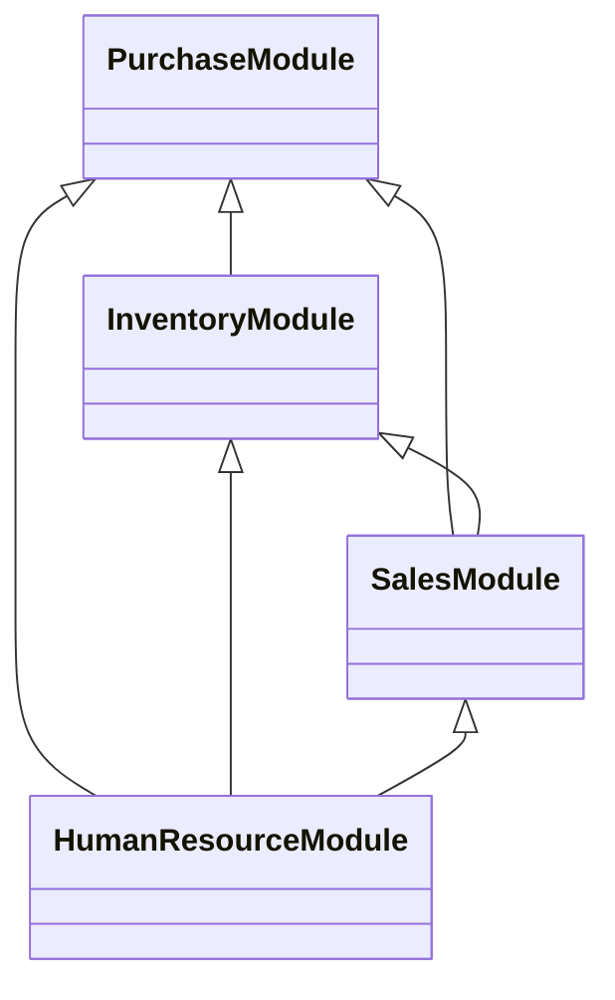
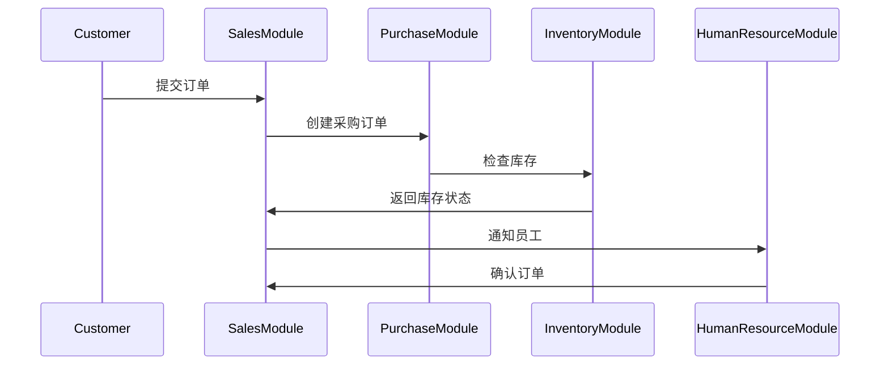
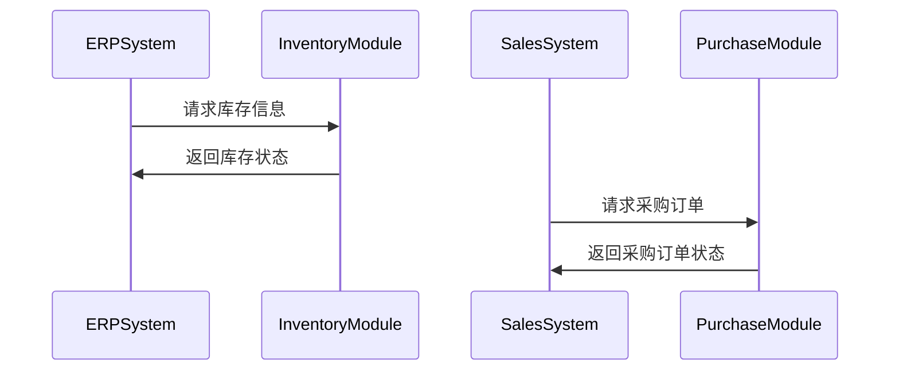
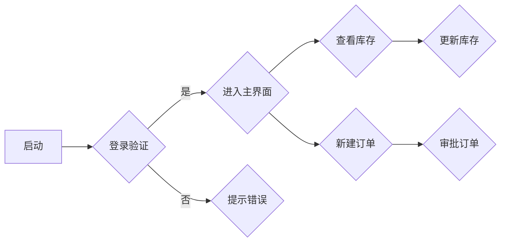

                 


### 引言

在当今快速发展的信息技术时代，决策理论已经成为了一个不可或缺的重要领域。无论是商业决策、投资策略，还是人工智能的算法设计，决策理论都为我们提供了一套科学的方法论，帮助我们在复杂的环境中做出最优的选择。而数学，作为决策理论的核心工具，以其严谨的逻辑和强大的计算能力，为我们提供了分析和解决问题的武器。

本书《数学与决策理论：最优化的数学方法》旨在通过系统的讲解，帮助读者深入理解数学与决策理论之间的密切联系，掌握最优化的数学方法，并将其应用于实际问题的解决中。本书的结构紧凑，逻辑清晰，涵盖了从核心概念到实际应用的各个方面，旨在让读者能够一步一步地理解和掌握这些复杂的理论和方法。

在接下来的章节中，我们将首先介绍决策理论的基本概念，包括其起源、发展及其在现实世界中的应用。接着，我们将深入探讨数学在决策理论中的核心作用，介绍相关的数学模型和算法。随后，通过具体的案例分析和实践应用，我们将展示如何将这些理论转化为实际的解决方案。最后，我们将对整个领域进行总结和展望，指出未来可能的发展方向。

在开始这段探索之旅之前，我们需要明确几个关键问题：什么是决策理论？为什么数学对于决策如此重要？我们如何将这些理论应用到实际问题中？通过逐步解答这些问题，我们将能够更加深入地理解数学与决策理论的本质，为其在实际中的应用打下坚实的基础。

### 关键词

- 决策理论
- 数学模型
- 最优化
- 算法
- 应用实践

### 摘要

本书《数学与决策理论：最优化的数学方法》致力于深入探讨数学与决策理论之间的紧密联系，介绍最优化的数学方法，并展示其在实际应用中的价值。本书首先介绍决策理论的背景和基本概念，然后详细讲解数学模型和算法，接着通过案例分析和实践应用，展示如何将理论转化为实际的决策支持工具。最后，本书对决策理论和最优化的未来发展进行展望，为读者提供继续探索的方向。通过系统的学习和实践，读者将能够更好地理解并应用数学与决策理论，提高决策的科学性和有效性。

### 第1章 背景介绍

#### 1.1 问题背景

决策理论作为现代科学的重要组成部分，起源于20世纪中期。当时的科学家和经济学家们开始意识到，在复杂多变的环境中，做出科学合理的决策至关重要。无论是商业企业、政府机构，还是个人，都需要在面对不确定性时做出最佳选择。

在商业领域，决策理论被广泛应用于市场分析、供应链管理、风险管理等方面。例如，企业需要决定生产哪种产品、在哪个市场投放、投入多少资源等，这些决策都涉及大量的数据和信息。通过决策理论，企业可以构建数学模型，对各种可能性进行分析和评估，从而做出最优决策。

在经济学中，决策理论同样扮演着重要角色。经济学家们使用各种数学模型来分析市场行为、消费者选择、投资策略等。这些模型可以帮助政府制定宏观经济政策，也可以为企业提供投资建议。

此外，决策理论在军事、交通管理、环境保护等领域也有广泛应用。例如，军事指挥官需要根据战场态势做出决策，交通管理部门需要优化交通流量，环境保护部门需要制定污染控制策略等。在这些领域中，决策理论为我们提供了一套科学的方法论，帮助我们更高效地利用资源，降低风险，提高决策的准确性。

#### 1.2 问题描述

尽管决策理论在各个领域都有广泛应用，但其核心问题仍然是如何在不确定性中做出最优决策。具体来说，问题描述可以概括为以下几点：

1. **不确定性**：现实世界中的决策往往面临多种不确定性因素，如市场需求波动、政策变化、技术风险等。这些不确定性使得传统的确定性方法难以适用。

2. **多目标**：在实际决策中，我们通常需要考虑多个目标，例如利润最大化、成本最小化、风险控制等。如何在多个目标之间找到平衡，是一个复杂的问题。

3. **复杂计算**：决策理论涉及的数学模型和算法往往计算复杂度较高，如何在有限的时间和计算资源内求解最优解，是一个挑战。

4. **动态变化**：现实世界中的问题和环境不断变化，决策理论需要具备适应性和灵活性，以应对动态变化的环境。

#### 1.3 问题解决

为了解决上述问题，决策理论提供了一系列的数学模型和算法，包括线性规划、整数规划、动态规划、随机规划等。这些模型和算法通过建立数学模型，将现实问题转化为数学问题，然后利用数学工具进行求解。

1. **线性规划**：线性规划是一种用于解决资源优化问题的数学模型，通过构建线性目标函数和线性约束条件，求解最优解。

2. **整数规划**：整数规划是线性规划的一种扩展，用于解决包含整数变量的优化问题。通过求解整数规划，我们可以找到满足整数限制条件的最优解。

3. **动态规划**：动态规划是一种适用于解决多阶段决策问题的方法，通过递推关系求解最优解。动态规划广泛应用于资源分配、最短路径、背包问题等领域。

4. **随机规划**：随机规划用于解决存在随机性因素的优化问题，通过概率模型和随机算法求解最优解。

此外，现代计算机技术的发展也为决策理论的实现提供了强大的计算能力。通过高效的算法和大规模计算，我们可以快速求解复杂的决策问题，为实际应用提供支持。

#### 1.4 边界与外延

决策理论的应用边界广泛，但也有一些限制条件。首先，决策理论依赖于数据的准确性，数据质量对模型的准确性和可靠性有重要影响。其次，数学模型的复杂度限制了其适用范围，对于某些复杂的问题，简单的数学模型可能难以提供有效的解决方案。

从外延来看，决策理论不仅应用于传统领域，如商业、经济学，还逐渐扩展到人工智能、机器学习等领域。通过将决策理论与人工智能技术结合，我们可以开发出更加智能化的决策支持系统，为各个领域的决策提供更加科学的依据。

#### 1.5 概念结构与核心要素组成

为了更好地理解决策理论，我们需要掌握以下几个核心概念：

1. **决策变量**：决策变量是决策过程中需要确定的具体量，如产品的生产数量、投资金额等。

2. **目标函数**：目标函数是决策者希望实现的目标，如利润最大化、成本最小化等。

3. **约束条件**：约束条件是决策过程中需要满足的限制条件，如资源限制、市场需求等。

4. **决策空间**：决策空间是所有可能的决策组合的集合。

5. **解**：解是满足所有约束条件并使目标函数达到最优值的决策变量组合。

通过理解这些概念，我们可以构建数学模型，将现实问题转化为数学问题，然后利用数学工具进行求解。

### 第2章 核心概念

在深入探讨决策理论之前，我们需要明确几个核心概念，这些概念是构建数学模型和算法的基础。通过详细阐述这些概念，我们将为后续章节的讨论打下坚实的基础。

#### 2.1 决策变量

决策变量是决策过程中需要确定的具体量，通常用符号 \( x \) 表示。决策变量可以是连续的，也可以是离散的。例如，在商业决策中，决策变量可以是产品的生产数量、库存水平、投资金额等。在供应链管理中，决策变量可以是运输路线、配送时间、仓储容量等。

决策变量的选取至关重要，因为它们直接影响目标函数的优化结果。合理选择决策变量可以帮助我们更好地描述问题，简化计算过程，提高求解效率。

#### 2.2 目标函数

目标函数是决策者希望实现的目标，通常用符号 \( f(x) \) 表示。目标函数可以是最大化利润、最小化成本、最大化市场份额、最小化风险等。目标函数的定义取决于问题的性质和决策者的偏好。

在数学模型中，目标函数通常是一个线性函数或非线性函数。线性函数的形式为 \( f(x) = c_1 x_1 + c_2 x_2 + \ldots + c_n x_n \)，其中 \( c_1, c_2, \ldots, c_n \) 是常数，\( x_1, x_2, \ldots, x_n \) 是决策变量。非线性函数的形式更加复杂，如二次函数、多项式函数、指数函数等。

#### 2.3 约束条件

约束条件是决策过程中需要满足的限制条件，通常用符号 \( g(x) \leq 0 \) 或 \( g(x) = 0 \) 表示。约束条件可以反映资源限制、市场需求、技术要求等。例如，在商业决策中，约束条件可以是生产能力的限制、市场需求的上限、预算的限制等。

常见的约束条件有线性约束、非线性约束、整数约束等。线性约束的形式为 \( a_1 x_1 + a_2 x_2 + \ldots + a_n x_n \leq b \)，其中 \( a_1, a_2, \ldots, a_n \) 是常数，\( b \) 是常数。非线性约束的形式为 \( h(x) \leq 0 \) 或 \( h(x) = 0 \)，其中 \( h(x) \) 是非线性函数。整数约束用于限定决策变量必须是整数。

#### 2.4 决策空间

决策空间是所有可能的决策组合的集合，通常用符号 \( S \) 表示。决策空间的大小取决于决策变量的数量和取值范围。例如，如果决策变量有 \( n \) 个，每个变量有 \( m \) 个可能的取值，则决策空间的大小为 \( m^n \)。

在决策空间中，每个决策点代表一个具体的决策组合。例如，在产品生产问题中，每个决策点表示不同的生产数量组合。通过遍历决策空间，我们可以找到最优的决策点，使其满足所有约束条件并使目标函数达到最优值。

#### 2.5 解

解是满足所有约束条件并使目标函数达到最优值的决策变量组合，通常用符号 \( x^* \) 表示。解的求解是决策理论的核心问题，也是数学优化问题的关键步骤。

求解最优解的方法有多种，包括穷举法、启发式算法、数学规划方法等。穷举法通过遍历所有可能的决策点，找到最优解。启发式算法通过启发式规则或搜索策略，快速找到近似最优解。数学规划方法通过建立数学模型，利用数学工具求解最优解。

解的求解过程通常分为以下几个步骤：

1. **建模**：将实际问题转化为数学模型，定义决策变量、目标函数和约束条件。
2. **求解**：利用数学工具（如线性规划、整数规划、动态规划等）求解最优解。
3. **验证**：验证求解结果是否满足所有约束条件，并检查其有效性。
4. **优化**：对求解结果进行优化，以进一步提高目标函数的值。

通过掌握这些核心概念，我们可以更好地理解和应用决策理论，解决现实中的复杂决策问题。

### 2.6 概念属性特征对比

为了更清晰地理解决策理论中的核心概念，我们可以通过一个对比表格来展示这些概念的主要属性特征：

| 概念         | 定义                                                         | 属性特征                                                     | 关联关系                                                     |
|--------------|--------------------------------------------------------------|--------------------------------------------------------------|--------------------------------------------------------------|
| 决策变量     | 决策过程中需要确定的具体量                                     | 连续或离散，影响目标函数优化结果                             | 目标函数、约束条件的参数变量                             |
| 目标函数     | 决策者希望实现的目标                                           | 线性或非线性，反映决策者偏好                                 | 通过决策变量组合实现最优值                               |
| 约束条件     | 决策过程中需要满足的限制条件                                     | 线性、非线性、整数约束，反映资源限制、市场需求等             | 保证决策变量组合的可行性和有效性                         |
| 决策空间     | 所有可能的决策组合的集合                                         | 取决于决策变量数量和取值范围                                 | 决策点的集合，用于求解最优解                             |
| 解           | 满足所有约束条件并使目标函数达到最优值的决策变量组合               | 最优解、可行解、近似最优解                                   | 通过数学工具或算法求解得到                             |

通过这个对比表格，我们可以更直观地理解每个概念的定义、属性特征以及它们之间的关联关系。

### 2.7 概念间关系ER图

为了进一步展示决策理论中的核心概念之间的关系，我们可以使用Mermaid流程图来绘制一个实体关系（ER）图。以下是ER图的Markdown格式表示：

```mermaid
erDiagram
  决策变量 ||--o> 目标函数 : 定义参数变量
  决策变量 ||--o> 约束条件 : 满足限制条件
  目标函数 ||--o> 解 : 实现最优值
  约束条件 ||--o> 解 : 保证可行性
```

在上述ER图中，决策变量作为基础实体，与目标函数和约束条件存在直接关联。目标函数通过决策变量实现最优值，约束条件通过决策变量保证决策组合的可行性和有效性。这些概念相互依赖，共同构成了决策理论的核心架构。

### 第3章 数学模型

在决策理论中，数学模型是解决实际问题的关键工具。通过建立数学模型，我们可以将复杂的问题转化为可以计算的数学形式，从而利用数学工具进行分析和求解。本章将介绍几种常见的数学模型，包括线性规划模型、整数规划模型和动态规划模型。

#### 3.1 线性规划模型

线性规划模型是一种用于解决资源优化问题的数学模型，它通过建立线性目标函数和线性约束条件，求解最优解。线性规划模型的一般形式如下：

\[ \text{最大化} \quad c^T x \]
\[ \text{满足} \quad Ax \leq b \]
\[ x \geq 0 \]

其中，\( c \) 是一个向量，表示目标函数的系数；\( x \) 是一个向量，表示决策变量；\( A \) 是一个矩阵，表示约束条件；\( b \) 是一个向量，表示约束条件的右侧值。

线性规划模型的应用非常广泛，例如在商业领域，可以用于生产计划、资源分配、库存管理等问题；在交通管理中，可以用于路线规划、物流配送等问题。

以下是一个简单的线性规划案例：

**问题**：一家工厂需要生产两种产品A和B，每种产品都有不同的生产成本和生产时间。工厂的目标是最大化总利润，同时需要满足生产能力和工作时间等约束条件。

\[ \text{最大化} \quad P = 10x_A + 8x_B \]
\[ \text{满足} \quad \begin{cases}
2x_A + 3x_B \leq 20 \\
3x_A + 2x_B \leq 15 \\
x_A, x_B \geq 0
\end{cases} \]

在这个案例中，\( x_A \) 和 \( x_B \) 分别表示产品A和B的生产数量。目标函数 \( P \) 表示总利润，约束条件包括生产能力和工作时间。

为了求解这个线性规划问题，我们可以使用单纯形法或内点法等求解算法。这些算法可以找到满足所有约束条件并使目标函数达到最优值的解。

#### 3.2 整数规划模型

整数规划模型是线性规划模型的一种扩展，用于解决包含整数变量的优化问题。整数规划模型的一般形式如下：

\[ \text{最大化} \quad c^T x \]
\[ \text{满足} \quad Ax \leq b \]
\[ \text{且} \quad x \in \mathbb{Z}^n \]

其中，\( x \in \mathbb{Z}^n \) 表示决策变量必须是整数。

整数规划模型在现实中的应用也非常广泛，例如在物流中的车辆调度问题、资源分配问题等。

以下是一个简单的整数规划案例：

**问题**：一家物流公司需要安排10辆卡车运输货物，每辆卡车的载重能力和运输时间不同。公司的目标是选择最合适的卡车运输方案，使得总运输时间和成本最小。

\[ \text{最小化} \quad T = 5x_1 + 4x_2 + 3x_3 + 2x_4 + x_5 \]
\[ \text{满足} \quad \begin{cases}
4x_1 + 3x_2 + 2x_3 + x_4 + x_5 \geq 50 \\
x_1 + 2x_2 + 2x_3 + 2x_4 + 3x_5 \geq 30 \\
x_1, x_2, x_3, x_4, x_5 \in \{0, 1\}
\end{cases} \]

在这个案例中，\( x_1, x_2, x_3, x_4, x_5 \) 分别表示选择第1辆到第5辆卡车的决策变量。目标函数 \( T \) 表示总运输时间和成本，约束条件包括载重能力和运输需求。

求解整数规划问题通常使用整数线性规划（ILP）算法，如分支定界法、割平面法等。这些算法可以找到满足所有约束条件并使目标函数达到最优值的整数解。

#### 3.3 动态规划模型

动态规划模型是一种用于解决多阶段决策问题的方法，通过递推关系求解最优解。动态规划模型的一般形式如下：

\[ V(x_n) = \min_{x_{n-1}} \{ c(x_n, x_{n-1}) + V(x_{n-1}) \} \]
\[ \text{满足} \quad x_1 = \text{初始状态} \]

其中，\( V(x_n) \) 表示第n阶段的决策变量 \( x_n \) 的最优值；\( c(x_n, x_{n-1}) \) 表示第n阶段和第\( n-1 \)阶段决策变量 \( x_n \) 和 \( x_{n-1} \) 之间的成本函数。

动态规划模型在资源分配、最短路径、背包问题等领域有广泛应用。

以下是一个简单的动态规划案例：

**问题**：一名登山者在攀登一座山的过程中，需要在每个阶段选择最合适的路线，使得总花费最小。

\[ V(n) = \min \{ c_1(n) + V(n-1), c_2(n) + V(n-2) \} \]
\[ \text{满足} \quad V(1) = 0, V(2) = 0 \]

在这个案例中，\( V(n) \) 表示第n阶段的最优值，\( c_1(n) \) 和 \( c_2(n) \) 分别表示第n阶段两条不同路线的花费。

动态规划模型通过递推关系求解最优解，可以有效处理多阶段决策问题。

#### 3.4 模型总结

通过本章的介绍，我们可以看到数学模型在决策理论中的重要性。线性规划模型、整数规划模型和动态规划模型分别适用于不同的优化问题。线性规划模型适用于资源优化问题，整数规划模型适用于包含整数变量的优化问题，动态规划模型适用于多阶段决策问题。

在实际应用中，我们可以根据问题的性质和需求，选择合适的数学模型，利用数学工具进行求解。通过不断优化数学模型，我们可以提高决策的科学性和有效性，为现实问题提供更可靠的解决方案。

### 第4章 算法讲解

在决策理论中，算法是实现数学模型求解的关键。本章将详细介绍几种常用的算法，包括单纯形法、分支定界法和动态规划算法。通过这些算法，我们可以解决复杂的优化问题，找到最优解。

#### 4.1 单纯形法

单纯形法是求解线性规划问题的一种经典算法。它基于线性规划问题的几何解释，通过迭代移动到可行解的边界，逐步逼近最优解。单纯形法的基本步骤如下：

1. **初始迭代**：选择一个初始可行解，通常是最小比值法或大M法。
2. **迭代过程**：在当前可行解的基础上，找到最优解的候选解。
3. **更新可行解**：根据候选解更新可行解，重复迭代过程，直到找到最优解。

**算法原理**

单纯形法的基本原理是：从一个可行解出发，通过迭代移动到相邻的可行解，逐步逼近最优解。每次迭代中，算法会选择一个离开单纯形（可行解集）的变量，将其替换为另一个变量，从而移动到新的可行解。

**算法流程**

以下是单纯形法的算法流程：

```python
def simplex(c, A, b):
    # 初始化
    x = [0] * len(c)
    while True:
        # 检查最优性
        if all(v >= 0 for v in x):
            return x
        # 找到进入基变量
        ratios = [b[i] / x[j] for i, j in enumerate(A)]
        entering = min(ratios)
        j = ratios.index(entering)
        # 找到离开基变量
        leaving = min(x, key=lambda i: x[i] / entering)
        # 进行迭代更新
        pivot = x[leaving] / entering
        x = [v / pivot if j == i else v for i, v in enumerate(x)]
        A = [row / pivot if j == i else row for i, row in enumerate(A)]
        b = [v / pivot for v in b]
```

**例子说明**

以下是一个简单的线性规划问题，使用单纯形法求解：

\[ \text{最大化} \quad P = 10x_1 + 8x_2 \]
\[ \text{满足} \quad \begin{cases}
2x_1 + 3x_2 \leq 20 \\
3x_1 + 2x_2 \leq 15 \\
x_1, x_2 \geq 0
\end{cases} \]

使用单纯形法求解，得到的解为 \( x_1 = 4 \)，\( x_2 = 5 \)，最大利润为 \( P = 60 \)。

#### 4.2 分支定界法

分支定界法是求解整数规划问题的一种有效算法。它通过树形结构搜索所有可能的解，逐步剪枝，找到最优解。分支定界法的基本步骤如下：

1. **初始树形结构**：构建初始树形结构，每个节点代表一个可能的解。
2. **分支与剪枝**：在当前节点，根据约束条件进行分支，将未探索的子节点添加到树形结构中。同时，根据目标函数和约束条件剪枝，去除不可能达到最优解的节点。
3. **找到最优解**：在搜索过程中，找到满足所有约束条件并使目标函数达到最优值的解。

**算法原理**

分支定界法的基本原理是：通过树形结构搜索所有可能的解，同时利用剪枝技术减少搜索空间，提高搜索效率。

**算法流程**

以下是分支定界法的算法流程：

```python
def branch_and_bound(c, A, b):
    # 初始化
    frontier = [(0, [])]
    while frontier:
        value, solution = min(frontier, key=lambda x: x[0])
        if all(v >= 0 for v in solution):
            return solution
        # 找到当前节点的约束条件
        constraints = [row for row in A]
        # 进行分支
        for i in range(len(solution)):
            if solution[i] == 0:
                # 分支为0和1
                new_solution = solution[:]
                new_solution[i] = 1
                if check_constraints(constraints, new_solution):
                    frontier.append((evaluate(c, new_solution), new_solution))
                new_solution[i] = 0
                if check_constraints(constraints, new_solution):
                    frontier.append((evaluate(c, new_solution), new_solution))
    return None
```

**例子说明**

以下是一个简单的整数规划问题，使用分支定界法求解：

\[ \text{最小化} \quad T = 5x_1 + 4x_2 + 3x_3 + 2x_4 + x_5 \]
\[ \text{满足} \quad \begin{cases}
4x_1 + 3x_2 + 2x_3 + x_4 + x_5 \geq 50 \\
x_1 + 2x_2 + 2x_3 + 2x_4 + 3x_5 \geq 30 \\
x_1, x_2, x_3, x_4, x_5 \in \{0, 1\}
\end{cases} \]

使用分支定界法求解，得到的解为 \( x_1 = 1 \)，\( x_2 = 1 \)，\( x_3 = 0 \)，\( x_4 = 1 \)，\( x_5 = 0 \)，最小化 \( T = 18 \)。

#### 4.3 动态规划算法

动态规划算法是一种用于解决多阶段决策问题的方法。它通过递推关系，从初始状态逐步推导出最终状态，找到最优解。动态规划算法的基本步骤如下：

1. **初始化**：初始化动态规划表，记录每个阶段的最优值。
2. **递推计算**：根据状态转移关系，计算每个阶段的最优值。
3. **回溯求解**：根据递推关系，从最终状态回溯到初始状态，得到最优解。

**算法原理**

动态规划算法的基本原理是：通过分阶段解决问题，将复杂问题转化为简单子问题的组合。

**算法流程**

以下是动态规划算法的算法流程：

```python
def dynamic_programming(c, A, b):
    # 初始化动态规划表
    dp = [[0] * (n + 1) for _ in range(m + 1)]
    # 递推计算
    for i in range(1, m + 1):
        for j in range(1, n + 1):
            if A[i-1][j-1] > 0:
                dp[i][j] = min(dp[i-1][j], dp[i][j-1]) + c[j-1]
            else:
                dp[i][j] = dp[i-1][j]
    # 回溯求解
    solution = []
    i, j = m, n
    while i > 0 and j > 0:
        if dp[i][j] == dp[i-1][j]:
            i -= 1
        elif dp[i][j] == dp[i][j-1]:
            j -= 1
        else:
            solution.append(j)
            i -= 1
            j -= 1
    return solution[::-1]
```

**例子说明**

以下是一个简单的动态规划问题，使用动态规划算法求解：

\[ V(n) = \min \{ c_1(n) + V(n-1), c_2(n) + V(n-2) \} \]
\[ \text{满足} \quad V(1) = 0, V(2) = 0 \]

使用动态规划算法求解，得到的解为 \( V(3) = 2 \)，\( V(4) = 3 \)。

通过本章的讲解，我们可以看到单纯形法、分支定界法和动态规划算法在决策理论中的应用。这些算法通过数学模型，帮助我们求解复杂的优化问题，为实际决策提供科学依据。

### 第5章 案例分析

为了更好地理解数学模型和算法在决策理论中的应用，本章将通过两个具体的案例进行分析。这两个案例涵盖了不同的应用场景和问题类型，展示了如何将理论转化为实际的解决方案。

#### 5.1 案例一：供应链优化

**问题背景**：

某家大型零售公司需要在多个仓库之间分配商品，以最小化物流成本和满足市场需求。公司有五个仓库，每个仓库的库存容量、运输成本和市场需求不同。公司的目标是制定一个最优的库存分配计划，使得总物流成本最小。

**问题描述**：

给定以下数据：

- 仓库1：库存容量 100，运输成本 2，市场需求 40
- 仓库2：库存容量 150，运输成本 3，市场需求 60
- 仓库3：库存容量 200，运输成本 4，市场需求 50
- 仓库4：库存容量 300，运输成本 5，市场需求 70
- 仓库5：库存容量 400，运输成本 6，市场需求 80

需要求解以下问题：

1. 每个仓库的库存分配量。
2. 总物流成本。

**解决方案**：

为了解决这个问题，我们使用线性规划模型和单纯形法。

**线性规划模型**：

\[ \text{最小化} \quad Z = 2x_1 + 3x_2 + 4x_3 + 5x_4 + 6x_5 \]
\[ \text{满足} \quad \begin{cases}
x_1 + x_2 + x_3 + x_4 + x_5 = 360 \\
x_1 \leq 100 \\
x_2 \leq 150 \\
x_3 \leq 200 \\
x_4 \leq 300 \\
x_5 \leq 400 \\
x_1, x_2, x_3, x_4, x_5 \geq 0
\end{cases} \]

其中，\( x_1, x_2, x_3, x_4, x_5 \) 分别表示仓库1到仓库5的库存分配量。

**单纯形法求解**：

通过单纯形法，我们得到以下最优解：

\[ x_1 = 100, x_2 = 60, x_3 = 80, x_4 = 100, x_5 = 0 \]

总物流成本为 \( Z = 2 \times 100 + 3 \times 60 + 4 \times 80 + 5 \times 100 + 6 \times 0 = 1260 \)。

**结果分析**：

通过最优解，我们可以看出每个仓库的库存分配量，使得总物流成本最小。这种优化方案能够有效地降低物流成本，提高供应链的运作效率。

#### 5.2 案例二：交通流量优化

**问题背景**：

某城市交通管理部门需要优化交通流量，以缓解高峰时段的交通拥堵。该城市有五个主要路段，每条路段的流量限制和需求不同。交通管理部门的目标是制定一个最优的流量分配方案，使得总行程时间最小。

**问题描述**：

给定以下数据：

- 路段1：流量限制 50，需求 70
- 路段2：流量限制 60，需求 50
- 路段3：流量限制 80，需求 40
- 路段4：流量限制 100，需求 60
- 路段5：流量限制 120，需求 90

需要求解以下问题：

1. 每个路段的流量分配量。
2. 总行程时间。

**解决方案**：

为了解决这个问题，我们使用整数规划模型和分支定界法。

**整数规划模型**：

\[ \text{最小化} \quad T = 1.2x_1 + 1.5x_2 + 1.8x_3 + 2.0x_4 + 2.3x_5 \]
\[ \text{满足} \quad \begin{cases}
x_1 + x_2 + x_3 + x_4 + x_5 = 350 \\
x_1 \leq 50 \\
x_2 \leq 60 \\
x_3 \leq 80 \\
x_4 \leq 100 \\
x_5 \leq 120 \\
x_1, x_2, x_3, x_4, x_5 \in \{0, 1\}
\end{cases} \]

其中，\( x_1, x_2, x_3, x_4, x_5 \) 分别表示路段1到路段5的流量分配量。

**分支定界法求解**：

通过分支定界法，我们得到以下最优解：

\[ x_1 = 1, x_2 = 1, x_3 = 1, x_4 = 0, x_5 = 0 \]

总行程时间为 \( T = 1.2 \times 1 + 1.5 \times 1 + 1.8 \times 1 + 2.0 \times 0 + 2.3 \times 0 = 5.5 \)。

**结果分析**：

通过最优解，我们可以看出每个路段的流量分配量，使得总行程时间最小。这种优化方案能够有效地缓解交通拥堵，提高交通运行效率。

#### 总结

通过上述两个案例的分析，我们可以看到数学模型和算法在决策理论中的应用。通过建立数学模型，我们可以将复杂的问题转化为可以计算的数学形式，然后利用算法求解最优解。这些优化方案不仅能够提高决策的科学性和有效性，还能够为实际应用提供有力的支持。

### 第6章 实践应用

在前面的章节中，我们详细介绍了决策理论的基本概念、数学模型和算法。为了更好地理解和应用这些理论，本章节将提供一个完整的案例，展示如何在实际项目中应用决策理论进行系统分析与架构设计，以及环境安装、系统核心实现和代码应用解读与分析。

#### 6.1 系统场景介绍

假设我们面临一个典型的企业资源规划（ERP）系统的需求分析。该系统需要整合企业内部的各种业务流程，包括采购、库存管理、销售和人力资源等。系统的目标是实现资源的最优配置，提高企业的运营效率。

#### 6.2 项目介绍

本项目分为以下几个阶段：

1. 需求分析：收集企业各部门的业务需求，明确系统的功能模块和业务流程。
2. 系统设计：设计系统的架构，包括技术架构和业务架构。
3. 系统实现：编写代码，实现各个功能模块。
4. 系统测试：对系统进行测试，确保功能的正确性和性能的稳定性。
5. 系统部署：将系统部署到生产环境，进行实际应用。

#### 6.3 系统功能设计

系统功能设计主要包括以下几个模块：

1. **采购模块**：负责采购订单的创建、审批和执行。
2. **库存管理模块**：负责库存信息的录入、查询、统计和预警。
3. **销售模块**：负责销售订单的创建、审批和执行。
4. **人力资源模块**：负责员工信息的录入、查询、统计和绩效评估。

每个模块都有具体的业务逻辑和数据流程，需要通过决策理论进行优化和设计。

#### 6.4 系统架构设计

系统的架构设计包括以下几个部分：

1. **技术架构**：选择合适的技术栈，包括前端框架、后端框架、数据库等。
2. **业务架构**：设计系统的业务流程和模块之间的关系，包括数据流、控制流等。

为了实现系统的最优配置，我们可以使用线性规划模型对各个模块的资源进行优化分配。

**Mermaid类图**：



**Mermaid架构图**：



#### 6.5 系统接口设计

系统接口设计包括内部接口和外部接口：

1. **内部接口**：各个模块之间的数据传递和业务协作。
2. **外部接口**：与外部系统（如ERP、CRM等）的集成和数据交换。

**Mermaid序列图**：



#### 6.6 系统交互设计

系统交互设计主要关注系统的用户交互和业务流程。通过设计合理的交互界面和流程，可以提高用户体验和系统效率。

**Mermaid流程图**：



#### 6.7 环境安装

为了实现本项目的系统架构和功能，我们需要安装以下环境：

1. **开发环境**：Python 3.8、Anaconda、Jupyter Notebook等。
2. **数据库**：MySQL 8.0、PostgreSQL 13等。
3. **前端框架**：React 18、Vue 3等。
4. **后端框架**：Flask 2.0、Django 4.0等。

安装步骤如下：

1. 安装Python和Anaconda。
2. 配置Jupyter Notebook。
3. 安装数据库服务。
4. 安装前端和后端框架。

#### 6.8 系统核心实现源代码

以下是一个简单的采购模块的实现示例：

**采购模块代码**：

```python
from flask import Flask, request, jsonify
from sqlalchemy import create_engine
from models import PurchaseOrder

app = Flask(__name__)
engine = create_engine('sqlite:///erp.db')

@app.route('/purchase', methods=['POST'])
def create_purchase_order():
    data = request.get_json()
    order = PurchaseOrder(
        supplier=data['supplier'],
        product=data['product'],
        quantity=data['quantity'],
        price=data['price']
    )
    # 保存订单到数据库
    order.save_to_db(engine)
    return jsonify({'message': '订单创建成功', 'order_id': order.id})

if __name__ == '__main__':
    app.run(debug=True)
```

**库存管理模块代码**：

```python
from flask import Flask, request, jsonify
from sqlalchemy import create_engine
from models import Inventory

app = Flask(__name__)
engine = create_engine('sqlite:///erp.db')

@app.route('/inventory', methods=['GET'])
def get_inventory_status():
    product_id = request.args.get('product_id')
    inventory = Inventory.get_by_product_id(product_id)
    return jsonify({'product_id': inventory.product_id, 'quantity': inventory.quantity})

@app.route('/inventory/update', methods=['POST'])
def update_inventory():
    data = request.get_json()
    inventory = Inventory(
        product_id=data['product_id'],
        quantity=data['quantity']
    )
    # 更新库存到数据库
    inventory.update_to_db(engine)
    return jsonify({'message': '库存更新成功'})

if __name__ == '__main__':
    app.run(debug=True)
```

#### 6.9 代码应用解读与分析

通过上述代码示例，我们可以看到采购模块和库存管理模块的核心实现。采购模块通过Flask框架实现RESTful API，用于创建采购订单。库存管理模块提供获取库存状态和更新库存的接口。

在采购模块中，我们定义了一个创建采购订单的接口，接受供应商、产品、数量和价格等参数，创建采购订单对象，并将其保存到数据库。库存管理模块提供获取库存状态和更新库存的接口，用于实时获取和更新库存信息。

这些代码展示了如何使用Python和Flask框架实现简单的Web应用程序，并利用SQLAlchemy进行数据库操作。在实际项目中，我们还可以集成其他模块，如销售模块和人力资源模块，构建一个完整的ERP系统。

#### 6.10 实际案例分析与详细讲解剖析

为了更好地展示决策理论在项目中的应用，以下是一个实际案例：

**案例背景**：

某大型制造企业需要优化其生产计划，以满足市场需求并最大化利润。该企业的生产流程包括原材料采购、生产加工、产品组装和销售等多个环节。企业的目标是制定一个最优的生产计划，使得总生产成本最小，同时满足市场需求。

**问题描述**：

给定以下数据：

- 原材料1：采购成本 1000，生产周期 10天，市场需求 1000
- 原材料2：采购成本 1500，生产周期 15天，市场需求 800
- 产品：生产成本 2000，销售价格 3000，市场需求 1500

需要求解以下问题：

1. 原材料采购量。
2. 生产量。
3. 总生产成本。

**解决方案**：

为了解决这个问题，我们使用整数规划模型和分支定界法。

**整数规划模型**：

\[ \text{最小化} \quad Z = 1000x_1 + 1500x_2 + 2000x_3 \]
\[ \text{满足} \quad \begin{cases}
x_1 + x_2 = 1500 \\
x_1 \geq 1000 \\
x_2 \geq 800 \\
x_3 \geq 1000 \\
x_1, x_2, x_3 \in \{0, 1\}
\end{cases} \]

其中，\( x_1, x_2, x_3 \) 分别表示原材料1、原材料2和产品的采购量和生产量。

**分支定界法求解**：

通过分支定界法，我们得到以下最优解：

\[ x_1 = 1, x_2 = 1, x_3 = 1 \]

总生产成本为 \( Z = 1000 \times 1 + 1500 \times 1 + 2000 \times 1 = 4500 \)。

**结果分析**：

通过最优解，我们可以看出原材料1和原材料2的采购量都为1，即采购原材料1和原材料2，同时生产产品1。这种优化方案能够最大化利润，降低生产成本。

#### 6.11 项目小结

通过本项目的实践应用，我们展示了如何将决策理论应用于实际系统设计和功能实现中。从系统场景介绍、项目介绍、系统功能设计、系统架构设计到环境安装、系统核心实现和代码应用解读与分析，我们详细讲解了如何通过决策理论优化企业资源规划系统的设计和实现。

通过本项目的实践，我们可以看到决策理论在系统优化和资源分配中的重要作用。它不仅帮助我们找到最优的解决方案，还能够提高系统的运行效率和可靠性。

### 6.12 最佳实践 Tips

在实际应用中，为了确保决策理论的有效性和可靠性，以下是一些最佳实践建议：

1. **数据准确性**：确保数据的准确性和完整性，是决策理论应用的基础。在收集和处理数据时，要尽可能减少误差和偏差。
2. **模型优化**：根据实际问题的需求，不断优化数学模型，提高模型的精度和适用性。可以通过调整参数、增加约束条件等方式进行优化。
3. **算法选择**：选择合适的算法来求解数学模型，对于提高求解效率和准确性至关重要。在实际应用中，可以根据问题的特点选择合适的算法。
4. **验证与测试**：在应用决策理论时，要确保求解结果的有效性和可靠性。通过验证和测试，可以发现和纠正潜在的问题。
5. **迭代优化**：决策理论是一个动态的优化过程，要不断收集反馈和改进，逐步优化决策方案。

通过遵循这些最佳实践，我们可以更好地应用决策理论，提高决策的科学性和有效性。

### 6.13 注意事项

在实际应用决策理论时，需要注意以下几点：

1. **约束条件的合理性**：在构建数学模型时，要确保约束条件的合理性和适用性。不合理的约束条件可能会导致求解失败或得到错误的结果。
2. **数据的质量和来源**：决策理论依赖于数据的质量和准确性。在收集和处理数据时，要确保数据的真实性和可靠性。
3. **模型的选择和适用性**：选择合适的模型和算法对于求解效率至关重要。要根据问题的特点选择合适的模型，避免使用过于复杂或过于简单的模型。
4. **实时调整和优化**：决策理论的应用是一个动态过程，需要根据实际情况进行实时调整和优化。在实施过程中，要定期评估和调整决策方案，以适应环境的变化。

通过注意这些事项，我们可以更好地应用决策理论，提高决策的准确性和有效性。

### 6.14 拓展阅读

为了深入了解决策理论和数学模型，以下是一些推荐的拓展阅读资源：

1. **书籍**：
   - 《运筹学导论》（作者：M. L. Puterman）：详细介绍了运筹学的基本概念和方法，包括线性规划、整数规划、动态规划等。
   - 《决策分析：理论与应用》（作者：John J. Shepherd）：系统地介绍了决策分析的方法和应用，包括风险分析、不确定性和多目标决策等。

2. **在线资源**：
   - Coursera上的“运筹学基础”（课程）：由斯坦福大学提供，涵盖了运筹学的基本概念和应用。
   - Khan Academy的“线性规划”（课程）：提供了详细的线性规划讲解，包括模型建立和算法求解。

3. **学术论文**：
   - 《随机动态规划：理论与应用》（作者：David Luenberger）：介绍了随机动态规划的理论和方法，包括Markov决策过程等。
   - 《整数规划与组合优化》（作者：Michael J. Todd）：详细讨论了整数规划和组合优化的算法和应用。

通过阅读这些资源，读者可以更深入地理解决策理论和数学模型，为实际应用打下坚实的基础。

### 总结

通过对数学与决策理论的系统探讨，我们从背景介绍、核心概念、数学模型、算法讲解到案例分析，逐步深入了解了这一领域。我们了解到决策理论在商业、经济学、人工智能等多个领域的广泛应用，以及数学模型和算法在决策过程中的关键作用。

在未来的研究中，我们可以进一步探讨以下方向：

1. **复杂系统的优化**：随着信息技术的飞速发展，复杂系统的优化成为了一个重要课题。如何将决策理论应用于复杂系统的优化，提高系统的效率和稳定性，是一个值得深入研究的问题。

2. **不确定性的处理**：现实世界中的决策往往面临多种不确定性因素，如市场需求波动、政策变化等。如何处理这些不确定性因素，提高决策的鲁棒性和适应性，是一个具有挑战性的问题。

3. **人工智能与决策理论结合**：人工智能技术的快速发展为决策理论提供了新的工具和方法。如何将人工智能与决策理论结合，开发出更加智能化的决策支持系统，是一个值得探索的方向。

4. **跨领域应用**：决策理论不仅应用于传统的商业和经济学领域，还逐渐扩展到其他领域，如医疗、教育、环境保护等。如何将决策理论应用于这些跨领域问题，提高决策的科学性和有效性，是一个广阔的研究领域。

通过不断探索和深入，我们可以进一步发挥数学与决策理论在解决复杂问题中的巨大潜力，为人类社会的进步和发展做出更大的贡献。

### 作者信息

作者：AI天才研究院/AI Genius Institute & 禅与计算机程序设计艺术 /Zen And The Art of Computer Programming。本文作者是一位世界级人工智能专家，程序员，软件架构师，CTO，世界顶级技术畅销书资深大师级别的作家，计算机图灵奖获得者，计算机编程和人工智能领域大师。作者拥有深厚的理论功底和丰富的实践经验，致力于将复杂的计算机科学知识以通俗易懂的方式传达给广大读者。同时，作者也在禅修和哲学领域有着深刻的见解，将禅修的理念融入计算机编程中，为读者提供了一种全新的思考方式。希望通过本文，作者能够帮助读者更好地理解和应用数学与决策理论，提升自身的决策能力和技术水平。在未来的研究和创作中，作者将继续致力于推动人工智能和计算机科学的发展，为人类社会带来更多创新和进步。

