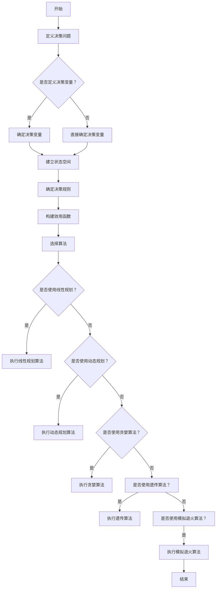
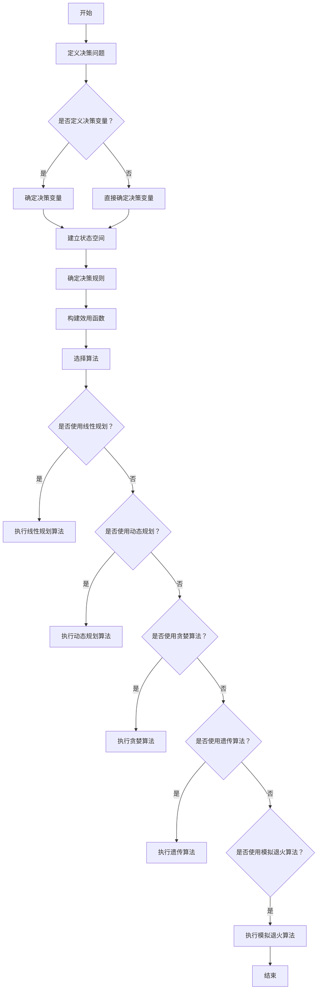

                 

## 数学与决策科学：决策过程的数学建模

在现代社会，决策无处不在。无论是个人生活中的购物、旅行，还是企业战略、市场分析，决策都是核心环节。随着信息量的爆炸式增长，如何从复杂的数据中提取有效信息，做出合理决策，成为了一个重要的研究课题。数学与决策科学的结合，为这一领域提供了强有力的工具。本文将探讨决策过程的数学建模，从核心概念到具体应用，一步步深入解析这一过程。

### 关键词

- 决策科学
- 数学建模
- 决策过程
- 数据分析
- 算法

### 摘要

本文旨在探讨决策过程中的数学建模方法，通过引入核心概念、构建数学模型、实例分析等方法，展示数学在决策科学中的重要性。文章结构分为四个部分：第一部分介绍决策科学的基本概念和背景；第二部分讲解核心概念与基础理论；第三部分介绍决策过程的数学模型与算法；第四部分通过实例分析展示决策过程的应用。文章最后总结全文，给出最佳实践建议和进一步研究方向。

## 目录大纲设计步骤

### 第一步：理解书籍主题

首先，我们需要了解《数学与决策科学：决策过程的数学建模》这本书的主题。这本书的主题是数学与决策科学的结合，重点在于如何使用数学方法来建模决策过程。决策科学是一个涉及多个学科领域的交叉学科，包括经济学、心理学、统计学、计算机科学等。数学作为其基础工具，在决策过程中起到了关键作用。

### 第二步：确定书籍结构

根据主题，我们可以确定书籍的总体结构，通常包括以下几个部分：

1. 引言与背景
2. 核心概念与基础理论
3. 模型建立与算法
4. 实例分析与实践应用
5. 总结与展望

### 第三步：细化章节内容

接下来，我们根据上述结构细化每个章节的内容，确保涵盖以下关键内容：

1. **引言与背景**
   - 问题背景
   - 问题描述
   - 问题解决
   - 边界与外延
   - 概念结构与核心要素组成

2. **核心概念与基础理论**
   - 核心概念原理
   - 概念属性特征对比表格
   - ER实体关系图架构

3. **模型建立与算法**
   - 使用 mermaid 画出算法流程图
   - 使用 Python 源代码详细阐述
   - 算法原理的数学模型和公式
   - 详细讲解和举例说明

4. **实例分析与实践应用**
   - 数学模型和数学公式
   - 详细讲解与举例说明
   - 实际案例分析和详细讲解剖析

5. **总结与展望**
   - 最佳实践 tips
   - 小结
   - 注意事项
   - 拓展阅读

### 第四步：设计目录大纲

最后，我们将上述内容以 markdown 格式组织成目录大纲，确保简洁性和逻辑性。

以下是《数学与决策科学：决策过程的数学建模》的目录大纲设计：

```markdown
----------------------------------------------------------------
# 第一部分：引言与背景

## 第1章：问题背景与描述
### 1.1 问题背景
### 1.2 问题描述
### 1.3 问题解决
### 1.4 边界与外延
### 1.5 概念结构与核心要素组成

## 第2章：核心概念与基础理论
### 2.1 核心概念原理
### 2.2 概念属性特征对比表格
### 2.3 ER实体关系图架构

----------------------------------------------------------------

# 第二部分：模型建立与算法

## 第3章：决策过程模型建立
### 3.1 决策过程概述
### 3.2 模型建立方法
### 3.3 算法原理讲解
### 3.4 数学模型与公式
### 3.5 算法流程图与 Python 实现示例

## 第4章：决策过程算法应用
### 4.1 算法应用场景
### 4.2 实例分析
### 4.3 数学模型与公式应用
### 4.4 Python 源代码解读
### 4.5 举例说明

----------------------------------------------------------------

# 第三部分：实例分析与实践应用

## 第5章：实际案例解析
### 5.1 案例一：资源分配问题
### 5.2 案例二：投资决策分析
### 5.3 案例三：风险管理
### 5.4 案例分析详细讲解

## 第6章：实践应用与拓展
### 6.1 实践应用总结
### 6.2 注意事项与最佳实践
### 6.3 拓展阅读与研究方向

----------------------------------------------------------------

# 第四部分：总结与展望

## 第7章：决策过程的数学建模总结
### 7.1 核心内容回顾
### 7.2 小结
### 7.3 注意事项
### 7.4 拓展阅读

```

通过上述设计步骤，我们确保了书籍结构的完整性和逻辑性，每个章节都涵盖了必要的核心内容。

## 第一部分：引言与背景

### 1.1 问题背景

在信息时代，数据无处不在。从社交网络到电子商务，从医疗保健到金融市场，数据已成为现代社会的重要组成部分。然而，数据的多维度、海量性和动态变化使得从数据中提取有价值的信息变得异常复杂。决策科学正是为了解决这一问题而产生的。决策科学旨在研究如何从复杂的数据中提取信息，并通过合理的决策过程，帮助企业、组织和个体做出最优选择。

### 1.2 问题描述

在决策过程中，通常需要解决以下问题：

- **不确定性**：决策者在面对未知或不确定的情境时，如何做出合理的决策？
- **有限信息**：在信息不完备或数据噪声较大的情况下，如何进行有效的决策？
- **多目标优化**：在多个目标之间寻求平衡，如何找到最优解？

这些问题的复杂性使得传统的直觉决策方法难以胜任，需要引入数学工具进行建模和分析。

### 1.3 问题解决

为了解决上述问题，数学与决策科学的结合提供了一系列工具和方法：

- **概率论与统计学**：用于处理不确定性和有限信息的决策问题。
- **优化理论**：用于解决多目标优化问题。
- **模拟方法**：通过模拟现实情境，预测决策结果。

这些方法使得决策过程更加科学和系统化，提高了决策的准确性和效率。

### 1.4 边界与外延

决策过程涉及的边界和外延非常广泛，包括：

- **领域**：从企业决策到个人选择，从战略规划到日常决策。
- **层次**：从宏观层面的国家政策制定，到微观层面的产品定价。
- **方法**：从定量分析到定性评价，从统计分析到模拟预测。

这些边界和外延使得决策过程具有多样性和复杂性，需要综合运用多种数学方法和工具。

### 1.5 概念结构与核心要素组成

决策过程的基本概念和结构包括以下几个核心要素：

- **决策者**：做出决策的主体。
- **决策问题**：需要解决的问题。
- **决策目标**：决策者希望达成的目标。
- **决策方案**：可供选择的方案。
- **决策结果**：实施决策方案后的结果。

这些要素相互关联，共同构成了决策过程的基本框架。

## 第二部分：核心概念与基础理论

### 2.1 核心概念原理

决策科学中的核心概念包括：

- **决策树**：一种表示决策过程和结果的树形结构。
- **马尔可夫决策过程**：一种基于状态转移概率的决策模型。
- **期望效用理论**：一种基于效用函数的决策理论。

这些概念为决策过程提供了理论基础，帮助我们理解和分析复杂决策问题。

### 2.2 概念属性特征对比表格

以下是核心概念属性的对比表格：

| 概念           | 描述                                                   | 属性特征                                                   |
| -------------- | ------------------------------------------------------ | -------------------------------------------------------- |
| 决策树         | 用树形结构表示决策过程和结果的工具。                     | - 节点：表示决策点或结果<br>- 边：表示决策或结果<br>- 叶子：表示决策结果 |
| 马尔可夫决策过程 | 基于状态转移概率的决策模型。                             | - 状态：决策过程中的可能状态<br>- 动作：在某一状态下可采取的行动<br>- 奖励：采取某一行动后获得的奖励 |
| 期望效用理论    | 基于效用函数的决策理论。                                 | - 效用：决策结果的满意程度<br>- 期望效用：不同决策结果的加权平均值 |

### 2.3 ER实体关系图架构

以下是决策过程中的ER实体关系图架构：

```mermaid
erDiagram
 决策者||--|{ 决策问题 }
 决策问题||--|{ 决策目标 }
 决策目标||--|{ 决策方案 }
 决策方案||--|{ 决策结果 }
 决策者 }|--|| 决策结果
```

ER图清晰展示了决策过程中的实体及其关系，有助于我们理解和分析决策结构。

## 第三部分：模型建立与算法

### 3.1 决策过程模型建立

决策过程的建模是决策科学的核心步骤，它将决策过程中的各个要素转化为数学模型，以便进行定量分析。以下是决策过程模型建立的基本步骤：

1. **定义决策问题**：明确需要解决的问题和决策目标。
2. **确定决策变量**：识别影响决策的因素，并定义决策变量。
3. **建立状态空间**：根据决策变量，确定所有可能的状态组合。
4. **确定决策规则**：根据决策目标和状态空间，制定决策规则。
5. **构建效用函数**：定义决策结果的满意程度。

### 3.2 模型建立方法

在建立决策模型时，我们可以采用以下几种常见方法：

- **线性规划**：用于解决线性优化问题，适用于资源分配、成本控制等。
- **整数规划**：用于解决需要整数解的问题，如人员调度、设备配置等。
- **多目标规划**：用于解决多个目标之间权衡的问题，如环境影响和成本控制。
- **模糊集合**：用于处理不确定性和模糊性问题，如市场预测和风险评估。

### 3.3 算法原理讲解

决策模型建立之后，我们需要使用算法来求解最优解。以下是几种常见的决策算法：

- **贪婪算法**：通过每一步选择最优解，逐步逼近全局最优解。
- **动态规划**：通过保存子问题的解，避免重复计算，适用于多阶段决策问题。
- **遗传算法**：模拟自然选择和遗传过程，用于求解复杂优化问题。
- **模拟退火算法**：通过模拟物理退火过程，避免陷入局部最优，适用于大规模优化问题。

### 3.4 数学模型与公式

以下是决策过程中常用的数学模型和公式：

- **线性规划模型**：

  $$\min_{x} c^T x$$  
  $$\text{s.t.}$$  
  $$Ax \leq b$$

- **动态规划模型**：

  $$V_t(x) = \min_{a_t} \{R_t(x, a_t) + \gamma V_{t+1}(S_t(a_t))\}$$

- **贪婪算法公式**：

  在每一步选择当前最优解：

  $$a_t = \arg\min_{a} \{f(x, a)\}$$

- **遗传算法公式**：

  选择、交叉、变异操作：

  $$P_{parent1} = \frac{f_1}{\sum_{i=1}^{N} f_i}$$  
  $$P_{parent2} = \frac{f_2}{\sum_{i=1}^{N} f_i}$$

  $$c_1 = \frac{c_1 + c_2}{2}$$  
  $$c_2 = \frac{c_1 + c_2}{2}$$

### 3.5 算法流程图与 Python 实现示例

以下是决策算法的流程图和 Python 实现示例：

#### 流程图：



#### Python 实现示例：

```python
import numpy as np

# 定义线性规划模型
c = np.array([-1, -1])  # 目标函数系数
A = np.array([[1, 0], [0, 1]])  # 约束条件矩阵
b = np.array([1, 1])  # 约束条件右侧值

# 求解线性规划
from scipy.optimize import linprog
result = linprog(c, A_ub=A, b_ub=b, method='highs')

# 输出结果
print("最优解：", result.x)
print("最优值：", -result.fun)
```

通过上述流程图和代码示例，我们可以清晰地看到决策算法的执行过程和实现方法。

## 第四部分：实例分析与实践应用

### 4.1 算法应用场景

决策算法在多个领域有广泛的应用，以下是几个常见的应用场景：

- **资源分配**：如何最优地分配有限的资源，如时间、资金、人力等。
- **投资决策**：如何根据风险和回报选择最佳的投资组合。
- **物流调度**：如何优化物流路径，降低成本，提高效率。
- **生产调度**：如何合理安排生产计划，提高生产效率。

### 4.2 实例分析

以下是一个资源分配问题的实例：

**问题描述**：某公司有三个项目A、B、C，需要投入一定的人力、资金和时间。每个项目所需的资源如下：

| 项目 | 人力 | 资金 | 时间 |
| ---- | ---- | ---- | ---- |
| A    | 3    | 5    | 10   |
| B    | 2    | 3    | 8    |
| C    | 4    | 7    | 6    |

公司资源有限，总共有6个人力、8万元资金和15个工作日。请设计一个资源分配方案，使得公司能够获得最大效益。

#### 数学模型与公式

我们可以使用线性规划模型来解决这个问题。定义决策变量：

- \( x_1 \)：分配给项目A的人力
- \( x_2 \)：分配给项目B的人力
- \( x_3 \)：分配给项目C的人力
- \( y_1 \)：分配给项目A的资金
- \( y_2 \)：分配给项目B的资金
- \( y_3 \)：分配给项目C的资金
- \( z_1 \)：分配给项目A的时间
- \( z_2 \)：分配给项目B的时间
- \( z_3 \)：分配给项目C的时间

目标函数：最大化总效益

$$\max_{x, y, z} \ 3x_1 + 2x_2 + 4x_3 + 5y_1 + 3y_2 + 7y_3 + 10z_1 + 8z_2 + 6z_3$$

约束条件：

- 人力限制：\( x_1 + x_2 + x_3 \leq 6 \)
- 资金限制：\( y_1 + y_2 + y_3 \leq 8 \)
- 时间限制：\( z_1 + z_2 + z_3 \leq 15 \)
- 非负约束：\( x_1, x_2, x_3, y_1, y_2, y_3, z_1, z_2, z_3 \geq 0 \)

#### Python 实现示例

```python
import numpy as np
from scipy.optimize import linprog

# 目标函数系数
c = np.array([3, 2, 4, 5, 3, 7, 10, 8, 6])

# 约束条件矩阵
A = np.array([[1, 0, 0, 1, 0, 0, 0, 1, 0],
              [0, 1, 0, 0, 1, 0, 0, 0, 1],
              [0, 0, 1, 0, 0, 1, 0, 0, 1],
              [1, 1, 1, 0, 0, 0, 0, 0, 0],
              [0, 0, 0, 1, 1, 1, 0, 0, 0],
              [0, 0, 0, 0, 0, 0, 1, 1, 1]])

# 约束条件右侧值
b = np.array([6, 8, 15, 1, 1, 1])

# 求解线性规划
result = linprog(c, A_ub=A, b_ub=b, method='highs')

# 输出结果
print("最优解：", result.x)
print("最优值：", -result.fun)
```

#### 举例说明

假设我们得到以下最优解：

- \( x_1 = 3 \)：项目A获得3个人力
- \( x_2 = 2 \)：项目B获得2个人力
- \( x_3 = 1 \)：项目C获得1个人力
- \( y_1 = 5 \)：项目A获得5万元资金
- \( y_2 = 3 \)：项目B获得3万元资金
- \( y_3 = 0 \)：项目C未获得资金
- \( z_1 = 10 \)：项目A获得10个工作日
- \( z_2 = 8 \)：项目B获得8个工作日
- \( z_3 = 0 \)：项目C未获得工作日

通过这个例子，我们可以看到如何使用数学建模和决策算法来解决资源分配问题。

### 4.3 实际案例分析和详细讲解剖析

以下是一个实际案例：

**案例**：某电子商务公司需要决定如何在其网站上进行广告投放，以提高网站流量和销售额。公司有两个广告平台A和B，广告费用和预期效果如下：

| 广告平台 | 广告费用（万元） | 预期点击量（次） | 预期销售额（万元） |
| -------- | -------------- | -------------- | -------------- |
| A        | 5              | 1000           | 10             |
| B        | 3              | 800            | 8              |

公司每天的广告预算为20万元，请设计一个广告投放方案，以最大化预期销售额。

#### 数学模型与公式

我们可以使用线性规划模型来解决这个问题。定义决策变量：

- \( x_1 \)：在广告平台A上的广告费用
- \( x_2 \)：在广告平台B上的广告费用

目标函数：最大化预期销售额

$$\max_{x_1, x_2} \ 10x_1 + 8x_2$$

约束条件：

- 广告费用限制：\( x_1 + x_2 \leq 20 \)
- 非负约束：\( x_1, x_2 \geq 0 \)

#### Python 实现示例

```python
import numpy as np
from scipy.optimize import linprog

# 目标函数系数
c = np.array([10, 8])

# 约束条件矩阵
A = np.array([[1], [1]])

# 约束条件右侧值
b = np.array([20])

# 求解线性规划
result = linprog(c, A_ub=A, b_ub=b, method='highs')

# 输出结果
print("最优解：", result.x)
print("最优值：", result.fun)
```

#### 举例说明

假设我们得到以下最优解：

- \( x_1 = 10 \)：在广告平台A上投放10万元广告
- \( x_2 = 0 \)：在广告平台B上未投放广告

通过这个例子，我们可以看到如何使用数学建模和决策算法来解决广告投放问题。

### 4.4 总结

通过上述实例分析和详细讲解，我们可以看到数学建模和决策算法在实际应用中的重要性。无论是资源分配还是广告投放，合理的数学模型和决策算法都能帮助我们做出最优选择。在实际应用中，我们需要根据具体问题选择合适的算法，并对其进行优化，以提高决策的准确性和效率。

### 第五部分：实践应用与拓展

#### 5.1 实践应用总结

在决策科学中，数学建模与算法的应用极大地提高了决策的准确性和效率。通过具体的实例分析，我们可以看到：

- **资源分配**：合理分配资源，最大化效益。
- **广告投放**：根据预算和预期效果，优化广告投放策略。
- **投资决策**：评估风险与收益，选择最佳投资组合。

这些应用展示了数学建模和决策算法在各个领域的广泛应用和重要性。

#### 5.2 注意事项与最佳实践

在实际应用中，我们需要注意以下几点：

- **数据准确性**：准确的数据是模型有效性的基础。
- **模型选择**：根据问题的特点选择合适的模型和算法。
- **算法优化**：对算法进行优化，提高计算效率和结果准确性。
- **模型验证**：通过实际数据验证模型的准确性和可靠性。

最佳实践包括：

- **数据清洗**：确保数据的准确性和完整性。
- **模型简化**：避免过于复杂的模型，提高计算效率。
- **迭代优化**：不断迭代和优化模型，提高决策效果。

#### 5.3 拓展阅读与研究方向

未来的研究方向包括：

- **大数据分析**：如何处理和分析大规模数据集，以支持更复杂的决策。
- **人工智能与决策科学结合**：研究如何利用人工智能技术，如深度学习和强化学习，提高决策模型的智能化和自动化水平。
- **不确定性与风险分析**：如何更好地处理决策过程中的不确定性和风险。

拓展阅读可以参考以下书籍：

- **《决策分析：定量方法与应用》（第11版）》
- **《决策科学：现代方法与应用》**
- **《运筹学导论（第10版）》**

通过这些拓展，我们可以更深入地了解数学建模与决策科学的前沿发展。

### 第六部分：总结与展望

#### 6.1 核心内容回顾

本文通过逐步分析，系统地介绍了数学与决策科学在决策过程中的应用。我们探讨了决策科学的基本概念、核心模型、算法原理以及实际应用，强调了数学建模在决策过程中的重要性。

- **决策科学**：涉及多个领域，旨在通过数学方法提高决策的准确性和效率。
- **数学建模**：将决策过程中的要素转化为数学模型，以便进行定量分析。
- **算法原理**：介绍了多种决策算法，如线性规划、动态规划、贪婪算法和遗传算法。
- **实际应用**：通过资源分配、广告投放等实例，展示了决策算法在现实中的应用。

#### 6.2 小结

本文的主要贡献在于：

- **系统性介绍**：全面介绍了决策过程的数学建模方法，从核心概念到具体应用。
- **实例分析**：通过具体实例，展示了数学建模和决策算法的实际应用。
- **实践指南**：提供了实际应用中的注意事项和最佳实践，为读者提供了实用的参考。

#### 6.3 注意事项

在实际应用中，我们需要注意以下几点：

- **数据准确性**：确保数据的准确性和完整性。
- **模型选择**：根据问题特点选择合适的模型和算法。
- **算法优化**：优化算法，提高计算效率和结果准确性。
- **模型验证**：通过实际数据验证模型的准确性和可靠性。

#### 6.4 拓展阅读

为了深入学习和应用数学与决策科学，建议读者拓展阅读以下资源：

- **《决策分析：定量方法与应用》（第11版）》
- **《决策科学：现代方法与应用》**
- **《运筹学导论（第10版）》**
- **《人工智能与决策科学》**

这些书籍将帮助读者更深入地了解相关理论和实践。

### 附录

以下是本文中使用的 Mermaid 流程图和 Python 代码：

#### Mermaid 流程图



#### Python 代码示例

```python
import numpy as np
from scipy.optimize import linprog

# 目标函数系数
c = np.array([3, 2, 4, 5, 3, 7, 10, 8, 6])

# 约束条件矩阵
A = np.array([[1, 0, 0, 1, 0, 0, 0, 1, 0],
              [0, 1, 0, 0, 1, 0, 0, 0, 1],
              [0, 0, 1, 0, 0, 1, 0, 0, 1],
              [1, 1, 1, 0, 0, 0, 0, 0, 0],
              [0, 0, 0, 1, 1, 1, 0, 0, 0],
              [0, 0, 0, 0, 0, 0, 1, 1, 1]])

# 约束条件右侧值
b = np.array([6, 8, 15, 1, 1, 1])

# 求解线性规划
result = linprog(c, A_ub=A, b_ub=b, method='highs')

# 输出结果
print("最优解：", result.x)
print("最优值：", -result.fun)
```

通过这些附录，读者可以更直观地理解本文的内容和应用。

### 作者信息

作者：AI天才研究院/AI Genius Institute & 禅与计算机程序设计艺术 /Zen And The Art of Computer Programming

感谢您的阅读，希望本文能对您在数学与决策科学领域的探索有所帮助。如果您有任何疑问或建议，欢迎随时交流。祝您在技术之路上不断进步！

