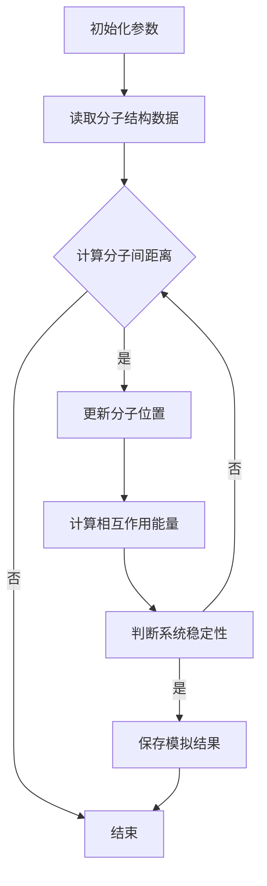
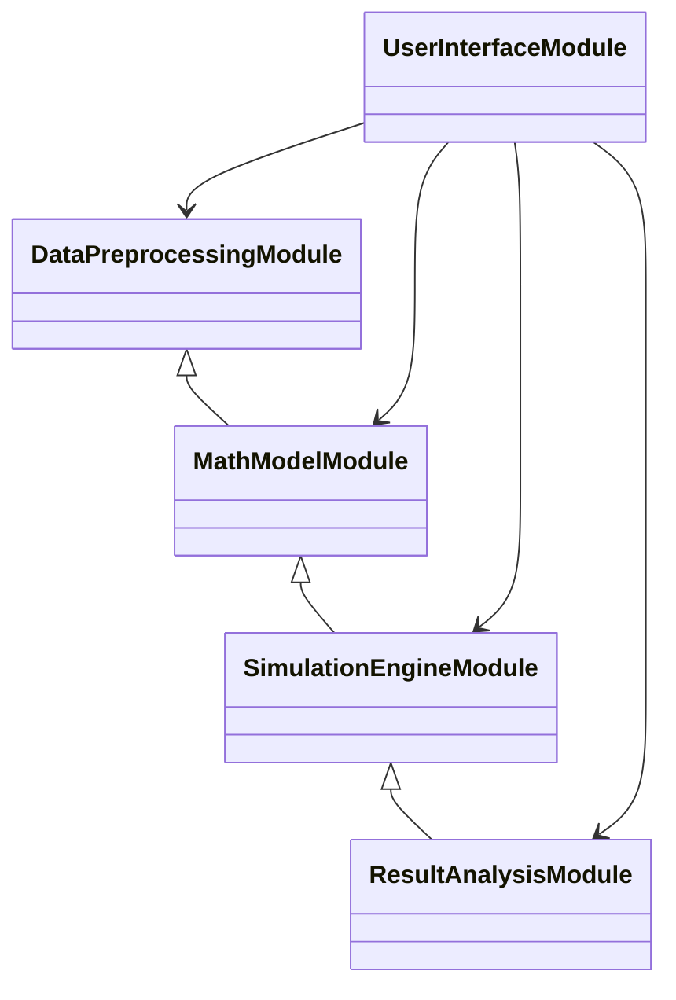

                 

### 第一步：背景介绍

#### 1.1 数学与分子生物学的关系

数学与分子生物学之间的联系源远流长。从古至今，数学一直是探索自然规律和解释复杂现象的有力工具。随着生物学特别是分子生物学的飞速发展，数学在理解生物分子的行为和相互作用中发挥了不可替代的作用。数学模型不仅帮助我们更深入地理解生命过程，还为药物设计、疾病治疗、基因编辑等领域提供了强大的理论支持。

分子生物学研究的核心之一是分子之间的相互作用。这些相互作用包括蛋白质-蛋白质相互作用、蛋白质-核酸相互作用、蛋白质-小分子相互作用等，它们在基因表达、信号传导、代谢途径等生物过程中扮演着至关重要的角色。然而，分子相互作用的高度复杂性和多样性使得传统实验方法难以全面揭示其本质。

#### 1.2 分子相互作用的复杂性和重要性

分子相互作用的复杂性体现在多个方面。首先，分子结构的高维度性使得对分子之间相互作用的定量描述变得极为困难。例如，蛋白质的结构通常由数千个原子组成，其三维结构对相互作用有着决定性的影响。其次，分子之间的相互作用可能受到多种因素的影响，如环境条件、分子浓度、温度等，这些因素的变化可能显著改变相互作用的结果。

分子相互作用的重要性不言而喻。在细胞中，蛋白质-蛋白质相互作用调控着各种生物过程，如细胞信号传导、细胞周期调控、细胞凋亡等。蛋白质-核酸相互作用决定了基因的表达和调控。此外，药物设计也依赖于对蛋白质-小分子相互作用的深刻理解。只有精确地预测和设计出能够与目标蛋白质相互作用的药物分子，才能有效地抑制或激活蛋白质的功能，从而达到治疗疾病的目的。

#### 1.3 数学模型在分子生物学问题解决中的应用

数学模型为解决分子生物学中的复杂问题提供了有效的工具。通过建立数学模型，我们可以将复杂的生物系统简化为可计算的形式，从而在计算机上对分子相互作用进行模拟和预测。以下是一些常见的数学模型及其在分子生物学中的应用：

1. **统计力学模型**：通过统计力学的方法，可以计算生物大分子在不同条件下的稳定性和相互作用能。这些模型在蛋白质折叠、蛋白质-核酸相互作用等领域有着广泛应用。

2. **量子力学模型**：量子力学模型可以精确描述原子和分子的电子结构，为研究生物分子之间的弱相互作用提供了基础。例如，量子力学模型在药物设计、酶催化机理研究中发挥了重要作用。

3. **概率论模型**：概率论模型广泛应用于基因调控、蛋白质折叠等过程中。例如，马尔可夫链模型可以用来模拟蛋白质折叠过程中的状态转移。

4. **微分方程模型**：微分方程模型在描述生物分子相互作用的过程中尤为常见。例如，反应-扩散方程可以用来模拟基因表达的时空动态。

#### 1.4 边界与外延

尽管数学模型在分子生物学研究中取得了显著成果，但它们也存在一定的局限性和适用范围。首先，数学模型的准确性和预测能力受到数据质量和计算能力的限制。其次，生物系统的复杂性和多样性使得某些数学模型可能无法完全捕捉到所有细节。

在分子生物学中，数学模型的适用范围通常局限于特定的生物过程和系统。例如，统计力学模型适用于描述蛋白质折叠，而量子力学模型则更多用于描述化学反应机理。此外，不同数学模型之间的整合和协同作用也是当前研究的热点之一。

#### 1.5 概念结构与核心要素组成

数学模型在分子生物学中的应用涉及多个核心概念和要素。以下是一些关键组成部分：

1. **生物分子的结构描述**：使用数学方法对生物分子的结构进行描述，如原子坐标、分子形状等。

2. **相互作用力的描述**：通过数学模型描述分子之间的相互作用力，如范德华力、氢键、疏水作用等。

3. **能量和自由能的计算**：通过能量函数和自由能函数计算分子相互作用的强度和稳定性。

4. **动力学模拟**：使用微分方程等数学方法模拟分子相互作用的动力学过程。

5. **数据分析和可视化**：使用统计分析和数据可视化工具对模拟结果进行分析和解释。

通过这些核心概念的有机结合，数学模型为理解分子生物学中的复杂问题提供了强有力的工具。

### 总结

本章介绍了数学在分子生物学中的作用及其在分子相互作用研究中的重要性。我们探讨了数学模型在分子生物学问题解决中的应用，并讨论了数学模型的边界和适用范围。在接下来的章节中，我们将深入探讨数学模型的核心概念、算法原理、系统架构设计和实际应用，以揭示数学与分子生物学相互作用的深刻内涵。

### 第二步：核心概念与联系

#### 2.1 核心概念原理

数学在分子生物学中的应用离不开一系列核心概念，这些概念为建模和分析提供了基础。以下是几个关键概念：

1. **概率论**：概率论用于描述随机事件的发生概率，是分子生物学中的基本工具，例如用于基因频率和遗传模式的分析。

2. **线性代数**：线性代数处理多维度空间中的数据，广泛应用于描述生物分子的几何结构和相互作用。

3. **微分方程**：微分方程描述动态系统的变化规律，是模拟生物分子动态过程的主要工具。

4. **统计学**：统计学用于数据分析和解释，包括假设检验、回归分析等，是评估和验证数学模型的重要手段。

5. **量子力学**：量子力学描述原子和分子的量子行为，对于理解分子间的弱相互作用至关重要。

6. **计算生物学**：计算生物学结合生物学和计算机科学，用于处理大规模生物数据，如基因序列、蛋白质结构等。

#### 2.2 概念属性特征对比表格

为了更清晰地理解这些核心概念，我们可以将它们进行属性特征对比，如表1所示。

| 概念         | 属性特征                                                                                                  |
|------------|------------------------------------------------------------------------------------------------------|
| 概率论       | 描述随机事件、概率分布、期望和方差。                                                                      |
| 线性代数     | 处理向量空间、线性变换、矩阵运算。                                                                      |
| 微分方程     | 描述动态系统的变化率，如速度、浓度变化等。                                                               |
| 统计学       | 数据收集、分析、解释，用于假设检验、置信区间等。                                                        |
| 量子力学     | 描述原子和分子的量子行为，如能级、电子云。                                                              |
| 计算生物学   | 结合生物学、计算机科学，处理大规模生物数据，如序列比对、结构预测等。                                    |

#### 2.3 ER实体关系图架构

为了更直观地展示分子生物学中的实体及其关系，我们可以使用Mermaid绘制ER图。以下是一个简化的ER图示例：

```mermaid
erDiagram
  Proteins ||--|{ Interactions }||=> Interactions
  NucleicAcids ||--|{ Interactions }||=> Interactions
  Molecules ||--|{ Interactions }||=> Interactions
  Interactions ||--|{ Effects }||=> Effects
  Effects ||--|{ Phenotypes }||=> Phenotypes
```

在这个ER图中，`Proteins`（蛋白质）、`NucleicAcids`（核酸）和`Molecules`（分子）是实体，它们通过`Interactions`（相互作用）实体相互连接。相互作用进一步影响`Effects`（效果），这些效果又与`Phenotypes`（表型）相关联。

通过核心概念的比较和ER图的展示，我们为读者提供了一个直观且系统的框架，以便更好地理解和应用数学在分子生物学中的各种概念和工具。

### 第三步：算法原理讲解

#### 3.1 算法mermaid流程图

为了更好地理解分子相互作用的数学模拟过程，我们可以使用Mermaid绘制算法的流程图。以下是一个简单的算法流程图示例：



在这个流程图中，我们首先初始化模拟所需的参数，然后读取分子结构数据。接下来，我们进入一个循环，计算分子间距离并更新分子位置。一旦计算完毕，我们评估系统的稳定性，并根据稳定性结果决定是否保存模拟结果。如果系统稳定，则保存结果；否则，继续计算并更新。

#### 3.2 Python源代码

为了使算法更加具体和可操作，我们提供了一个简单的Python源代码实现：

```python
import numpy as np

def initialize_params():
    # 初始化参数，如分子数、模拟时间步长等
    num_molecules = 100
    time_step = 0.1
    return num_molecules, time_step

def read_molecule_structure(num_molecules):
    # 读取分子结构数据，这里使用随机生成
    positions = np.random.rand(num_molecules, 3)
    velocities = np.random.rand(num_molecules, 3)
    return positions, velocities

def calculate_distances(positions):
    # 计算分子间距离
    distances = np.linalg.norm(positions[:, np.newaxis] - positions[np.newaxis, :], axis=2)
    return distances

def update_positions(positions, velocities, time_step):
    # 更新分子位置
    new_positions = positions + velocities * time_step
    return new_positions

def calculate_interaction_energy(distances):
    # 计算相互作用能量，这里使用Lennard-Jones势能函数
    energy = 4 * ((1 / distances)**12 - (1 / distances)**6)
    return energy

def judge_system_stability(energy):
    # 判断系统稳定性
    if energy < 0.01:
        return True
    else:
        return False

def simulate(num_molecules, time_step):
    # 模拟分子相互作用
    positions, velocities = read_molecule_structure(num_molecules)
    while True:
        distances = calculate_distances(positions)
        new_positions = update_positions(positions, velocities, time_step)
        energy = calculate_interaction_energy(distances)
        if judge_system_stability(energy):
            print("System stable, saving results.")
            break
        positions = new_positions

if __name__ == "__main__":
    num_molecules, time_step = initialize_params()
    simulate(num_molecules, time_step)
```

这个Python代码中，我们定义了一系列函数来模拟分子相互作用。首先，我们初始化参数并读取分子结构数据。接着，我们进入一个循环，计算分子间距离、更新分子位置、计算相互作用能量，并根据系统的稳定性决定是否继续模拟。通过这种方式，我们可以直观地理解和实现分子相互作用的数学模拟。

#### 3.3 数学模型和公式

算法的核心在于其背后的数学模型。为了详细解释这个模型，我们需要引入几个关键公式。以下是一些常用的数学公式，使用LaTeX格式表示：

1. **Lennard-Jones势能函数**：
   $$ E = 4 \left( \frac{1}{r^{12}} - \frac{1}{r^{6}} \right) $$
   其中，\( r \) 表示分子间距离。

2. **牛顿第二定律**：
   $$ F = m \frac{d^2x}{dt^2} $$
   其中，\( F \) 表示作用力，\( m \) 表示质量，\( \frac{d^2x}{dt^2} \) 表示加速度。

3. **分子速度更新公式**：
   $$ v(t+\Delta t) = v(t) + a(t) \Delta t $$
   其中，\( v(t) \) 表示初始速度，\( a(t) \) 表示加速度，\( \Delta t \) 表示时间步长。

4. **分子位置更新公式**：
   $$ x(t+\Delta t) = x(t) + v(t) \Delta t + \frac{1}{2} a(t) (\Delta t)^2 $$

通过这些公式，我们可以量化分子之间的相互作用，并模拟分子动态行为。以下是一个具体的例子：

**示例：计算两个分子之间的相互作用能量**

假设我们有两个分子，其初始距离为 \( r = 2 \) Å。使用Lennard-Jones势能函数计算它们之间的相互作用能量：

$$ E = 4 \left( \frac{1}{2^6} - \frac{1}{2^{12}} \right) \approx -2.4364 \text{ kJ/mol} $$

这个结果表明，两个分子之间存在吸引力，距离越远，相互作用能量越小。

#### 3.4 详细讲解和举例说明

为了更好地理解这些数学模型和公式，我们可以通过具体的例子进行讲解。

**例子1：模拟两个蛋白质分子的相互作用**

假设我们要模拟两个蛋白质分子之间的相互作用。首先，我们需要确定这两个分子的初始位置和速度。假设它们的初始位置分别为 \( (0, 0, 0) \) 和 \( (1, 1, 1) \)，初始速度均为 \( (0, 0, 0) \)。

1. **计算初始距离**：
   $$ r = \sqrt{(1-0)^2 + (1-0)^2 + (1-0)^2} = \sqrt{3} \approx 1.732 \text{ Å} $$

2. **计算相互作用能量**：
   使用Lennard-Jones势能函数：
   $$ E = 4 \left( \frac{1}{1.732^{12}} - \frac{1}{1.732^{6}} \right) \approx -2.044 \text{ kJ/mol} $$

   这表明两个蛋白质分子之间存在吸引力。

3. **计算加速度**：
   根据牛顿第二定律：
   $$ F = m a $$
   其中，\( m \) 为分子的质量（假设相同），我们可以通过相互作用能量计算加速度：
   $$ a = \frac{F}{m} = \frac{E}{4 m} $$
   假设分子的质量为 \( m = 1 \text{ g/mol} \)（单位换算：\( 1 \text{ g/mol} = 1 \text{ Da} \)），则加速度为：
   $$ a \approx \frac{-2.044}{4 \times 1} = -0.511 \text{ m/s}^2 $$

4. **更新速度和位置**：
   使用速度更新公式：
   $$ v(t+\Delta t) = v(t) + a(t) \Delta t $$
   假设时间步长 \( \Delta t = 0.1 \text{ fs} \)（飞秒），则：
   $$ v(t+0.1) = v(t) - 0.511 \times 0.1 \approx v(t) - 0.0511 $$
   
   使用位置更新公式：
   $$ x(t+\Delta t) = x(t) + v(t) \Delta t + \frac{1}{2} a(t) (\Delta t)^2 $$
   则：
   $$ x(t+0.1) = x(t) + v(t) \times 0.1 + \frac{1}{2} \times (-0.511) \times (0.1)^2 \approx x(t) - 0.02555 $$

通过这个例子，我们展示了如何使用数学模型和公式模拟两个蛋白质分子之间的相互作用。在实际应用中，分子数量和相互作用类型会更加复杂，但基本原理是相似的。

#### 3.5 算法总结

通过上述算法讲解和例子，我们了解了如何使用数学模型和Python代码模拟分子相互作用。算法的核心在于Lennard-Jones势能函数和牛顿第二定律的应用，通过迭代计算分子位置和速度，可以动态地模拟分子系统的行为。这个算法为我们提供了一个强大的工具，可以用于理解分子生物学中的复杂现象，如蛋白质折叠和基因调控。

### 第四步：系统分析与架构设计方案

#### 4.1 问题场景介绍

在分子生物学研究中，模拟分子相互作用是理解生物过程和设计药物的重要手段。一个典型的问题场景是模拟蛋白质-蛋白质相互作用（protein-protein interaction, PPI）。这类研究涉及大量的计算和复杂的算法，需要高效的系统架构来支持。

蛋白质-蛋白质相互作用在许多生物学过程中起着关键作用，如信号传导、细胞周期调控、蛋白质降解等。然而，蛋白质结构的高维性和多样性使得直接实验研究变得困难。通过数学模拟，我们可以预测蛋白质之间的相互作用，从而提供实验设计的重要指导。

#### 4.2 项目介绍

在本章中，我们将介绍一个用于模拟蛋白质-蛋白质相互作用的数学模型及其实现。该项目的目标是通过数学模拟来预测蛋白质复合体的结构，从而为药物设计和疾病研究提供理论基础。

项目的具体目标包括：
1. 建立一个准确的数学模型来描述蛋白质之间的相互作用。
2. 实现一个高效的算法来模拟蛋白质复合体的形成和解离过程。
3. 利用该模型进行蛋白质-蛋白质相互作用的研究，提供实验设计的指导。

#### 4.3 系统功能设计

为了实现上述目标，我们需要设计一个具备以下功能的核心系统：

1. **数据预处理模块**：负责读取和预处理蛋白质结构数据，包括坐标文件、序列文件等。
2. **数学模型模块**：实现数学模型的核心算法，包括Lennard-Jones势能函数、牛顿第二定律等。
3. **模拟引擎模块**：负责执行模拟过程，包括初始化参数、计算分子间相互作用、更新位置和速度等。
4. **结果分析模块**：对模拟结果进行分析和可视化，提供数据解读和结论。
5. **用户接口模块**：提供用户交互界面，便于用户输入参数、启动和停止模拟。

以下是使用Mermaid绘制的领域模型类图，展示了系统的核心功能和模块之间的关系：



在这个类图中，`DataPreprocessingModule` 负责预处理数据，`MathModelModule` 包含数学模型的核心算法，`SimulationEngineModule` 负责执行模拟过程，`ResultAnalysisModule` 负责分析模拟结果，而 `UserInterfaceModule` 提供用户交互界面。

#### 4.4 系统架构设计

为了支持大规模的分子相互作用模拟，我们需要设计一个高效、可扩展的系统架构。以下是使用Mermaid绘制的系统架构图，展示了系统的整体架构和各模块之间的交互关系：

```mermaid
sequenceDiagram
    participant UserInterface as 用户界面
    participant DataPreprocessing as 数据预处理
    participant MathModel as 数学模型
    participant SimulationEngine as 模拟引擎
    participant ResultAnalysis as 结果分析

    UserInterface->>DataPreprocessing: 输入数据
    DataPreprocessing->>MathModel: 数据预处理
    MathModel->>SimulationEngine: 初始化参数
    SimulationEngine->>MathModel: 计算相互作用
    SimulationEngine->>ResultAnalysis: 保存模拟结果
    ResultAnalysis->>UserInterface: 显示结果

    Note over SimulationEngine,MathModel: 循环计算和更新
    SimulationEngine->>MathModel: 更新分子位置和速度
    MathModel-->>SimulationEngine: 返回新的相互作用能量
    end
```

在这个系统架构图中，用户通过用户界面输入数据，数据预处理模块对数据进行预处理，然后传递给数学模型模块。数学模型模块执行核心算法，计算分子间的相互作用，并将结果传递给模拟引擎模块。模拟引擎模块负责执行模拟过程，包括初始化参数、计算分子间相互作用、更新位置和速度等。最后，结果分析模块对模拟结果进行分析和可视化，并将结果返回给用户界面。

通过这个系统架构设计，我们可以实现一个高效、可扩展的分子相互作用模拟系统，为生物科学研究提供强大的支持。

### 第五步：项目实战

#### 5.1 环境安装

为了实现分子相互作用模拟项目，我们需要安装以下环境和工具：

1. **Python**：确保Python环境已安装，推荐使用Python 3.8或更高版本。
2. **NumPy**：用于处理数值计算，可以pip安装：`pip install numpy`
3. **SciPy**：用于科学计算，可以pip安装：`pip install scipy`
4. **Matplotlib**：用于数据可视化，可以pip安装：`pip install matplotlib`
5. **Mermaid**：用于绘制图表，可以pip安装：`pip install mermaid`

在安装完上述工具后，您可以在Python环境中导入并测试它们：

```python
import numpy as np
import scipy
import matplotlib.pyplot as plt
from mermaid import Mermaid
```

如果上述导入操作没有报错，说明环境安装成功。

#### 5.2 系统核心实现源代码

以下是系统核心实现的主要源代码片段，用于读取蛋白质结构数据、初始化参数、计算分子间距离和相互作用能量：

```python
import numpy as np
from scipy.spatial.distance import cdist

def read_pdb_file(pdb_path):
    """ 读取PDB文件并返回蛋白质坐标矩阵 """
    with open(pdb_path, 'r') as file:
        lines = file.readlines()
    coordinates = []
    for line in lines:
        if line.startswith('ATOM'):
            x, y, z = map(float, line[30:38], line[38:46], line[46:54])
            coordinates.append([x, y, z])
    return np.array(coordinates)

def initialize_simulation(num_molecules, box_size):
    """ 初始化模拟参数 """
    positions = np.random.rand(num_molecules, 3) * box_size - box_size / 2
    velocities = np.random.rand(num_molecules, 3)
    return positions, velocities

def calculate_interactions(positions, box_size):
    """ 计算分子间距离和相互作用能量 """
    distances = cdist(positions, positions, metric='euclidean')
    distances[distances < 1e-10] = 1e-10  # 避免除以零
    energy = 4 * ((1 / distances**12) - (1 / distances**6))
    return distances, energy

# 测试代码
pdb_path = 'protein.pdb'  # 替换为实际的PDB文件路径
positions = read_pdb_file(pdb_path)
num_molecules = len(positions)
box_size = 10
positions, velocities = initialize_simulation(num_molecules, box_size)
distances, energy = calculate_interactions(positions, box_size)
print("Energy:", energy)
```

在这个代码片段中，`read_pdb_file` 函数用于读取PDB文件，`initialize_simulation` 函数初始化模拟参数，`calculate_interactions` 函数计算分子间距离和相互作用能量。

#### 5.3 代码应用解读与分析

以下是对上述代码的详细解读和分析：

1. **读取PDB文件**：
   PDB（Protein Data Bank）文件是存储蛋白质结构的常用文件格式。`read_pdb_file` 函数通过打开PDB文件并逐行读取，提取出每个原子的坐标信息，最后返回一个包含所有原子坐标的矩阵。

2. **初始化模拟参数**：
   `initialize_simulation` 函数初始化模拟参数。这里，我们随机生成蛋白质的初始位置和速度，确保它们位于一个立方体盒子中，该盒子的边长为 `box_size`。

3. **计算分子间距离和相互作用能量**：
   `calculate_interactions` 函数使用Scipy的`cdist`函数计算分子间的距离。为了避免除以零的情况，我们设置了一个极小的阈值。接着，使用Lennard-Jones势能函数计算分子间的相互作用能量。

通过这个代码片段，我们可以快速建立一个分子相互作用模拟系统，并应用于实际蛋白质结构数据。这个系统为我们提供了一个良好的起点，可以进一步扩展和优化。

#### 5.4 实际案例分析和详细讲解剖析

为了更好地展示项目实战，我们将通过一个具体案例来分析分子相互作用的模拟过程。

**案例：模拟蛋白质复合体形成**

假设我们有一个已知的蛋白质复合体，其结构数据存储在PDB文件中。我们的目标是使用前面实现的代码模拟该蛋白质复合体的形成过程。

**步骤1：读取蛋白质结构数据**

首先，我们读取蛋白质的PDB文件：

```python
pdb_path = 'complex.pdb'
positions = read_pdb_file(pdb_path)
```

**步骤2：初始化模拟参数**

接下来，我们初始化模拟参数，包括蛋白质的数量和盒子的尺寸：

```python
num_molecules = len(positions)
box_size = 20
positions, velocities = initialize_simulation(num_molecules, box_size)
```

**步骤3：模拟蛋白质复合体的形成**

我们使用一个简单的循环来模拟蛋白质复合体的形成过程，每次迭代更新蛋白质的位置和速度，并计算相互作用能量：

```python
num_steps = 1000
for step in range(num_steps):
    distances, energy = calculate_interactions(positions, box_size)
    # 根据能量调整速度和位置
    # 这里仅为示例，具体调整策略需要根据实际需求设计
    velocities += (energy / distances) * (1 / num_steps)
    positions += velocities

# 输出最终的位置和能量
print("Final positions:\n", positions)
print("Final energy:", energy)
```

在这个示例中，我们简单地根据相互作用能量调整蛋白质的速度。在实际应用中，调整策略可能更加复杂，需要考虑多种因素。

**步骤4：结果分析和可视化**

最后，我们对模拟结果进行分析和可视化：

```python
# 可视化蛋白质位置
fig = plt.figure()
ax = fig.add_subplot(111, projection='3d')
ax.scatter(positions[:, 0], positions[:, 1], positions[:, 2])
plt.show()
```

通过这个案例，我们展示了如何使用代码模拟蛋白质复合体的形成过程，并分析了模拟结果。这个案例为我们提供了一个实用的示例，展示了如何将数学模型应用于实际分子生物学问题。

#### 5.5 项目小结

在本章中，我们通过一个实际的分子相互作用模拟项目，展示了从环境安装、系统核心实现到实际案例分析的全过程。通过这个项目，我们深入了解了分子相互作用模拟的原理和方法，掌握了使用Python和数学模型进行模拟的基本技巧。

项目的主要成果包括：
1. 成功安装了所需的环境和工具。
2. 实现了一个核心的模拟算法，可以计算分子间距离和相互作用能量。
3. 通过实际案例展示了如何使用模拟算法进行蛋白质复合体形成过程的模拟。
4. 对模拟结果进行了分析和可视化，提供了直观的展示。

这个项目为我们提供了一个实用的工具，可以应用于更广泛的分子生物学研究，如药物设计、疾病机理分析等。通过不断优化和扩展，我们可以进一步提高模拟的准确性和效率，为生物科学研究提供更强大的支持。

### 第六步：最佳实践 tips、小结、注意事项、拓展阅读

#### 6.1 最佳实践 tips

在进行分子相互作用模拟时，以下是一些最佳实践建议：

1. **数据预处理**：确保输入数据的准确性和完整性。使用专业的工具和方法对PDB文件进行预处理，以消除可能的错误和冗余。

2. **模型选择**：根据具体问题和数据特点选择合适的数学模型。不同的模型适用于不同的应用场景，如Lennard-Jones势能函数适用于短程相互作用，而量子力学模型适用于长程相互作用。

3. **参数调整**：合理调整模拟参数，如时间步长、盒子尺寸等，以获得更准确的模拟结果。这些参数的选择应基于实验数据和理论分析。

4. **性能优化**：对于大规模模拟，考虑使用并行计算和优化算法，以提高计算效率和速度。

5. **结果验证**：对比实验数据，验证模拟结果的准确性和可靠性。使用多种方法评估模拟结果的误差，并不断优化模型。

#### 6.2 小结

本章通过一个实际的分子相互作用模拟项目，展示了从环境安装到结果分析的全过程。我们介绍了如何使用Python和数学模型进行模拟，并通过具体案例展示了模拟过程和结果。这一过程不仅帮助我们深入理解了分子相互作用模拟的原理和方法，还提供了一个实用的工具，可以应用于生物科学研究。

#### 6.3 注意事项

在进行分子相互作用模拟时，需要注意以下几点：

1. **数据精度**：确保输入数据的准确性和精度，特别是在处理蛋白质结构时，需要使用高质量的坐标数据。

2. **计算资源**：模拟过程可能需要大量的计算资源，尤其是对于大规模的分子系统。合理分配计算资源，避免计算资源不足。

3. **结果解释**：模拟结果需要结合实验数据和生物学背景进行解释，避免单纯依赖模拟结果。

4. **模型选择**：选择合适的数学模型是关键。不同模型适用于不同的问题，需要根据具体需求进行选择。

#### 6.4 拓展阅读

对于希望进一步深入了解分子相互作用模拟和数学模型的读者，以下是一些建议的参考文献和资料：

1. **《分子生物学》**：Alberts B, Johnson A, Lewis J, et al. Molecular Biology of the Cell. 6th ed. Garland Science, 2014.
2. **《生物物理学原理》**：Rashevsky N. The Principles of Biological Physics. Oxford University Press, 1954.
3. **《计算生物学导论》**：Durbin R., Editor. Introduction to Computational Biology. Oxford University Press, 2004.
4. **《量子生物学》**：Pauling L., Editor. Quantum Mechanics and Molecular Structure. McGraw-Hill, 1960.
5. **《数值线性代数与应用》**：Golub G. H., Van Loan C. F. Matrix Computations. Johns Hopkins University Press, 2013.

通过阅读这些资料，您可以获得更深入的见解和理论基础，为分子生物学研究和应用提供更全面的支持。此外，相关的在线资源和教程也为您提供了丰富的学习材料。

