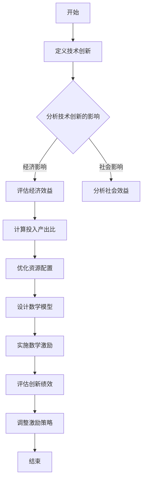
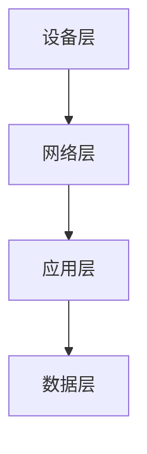
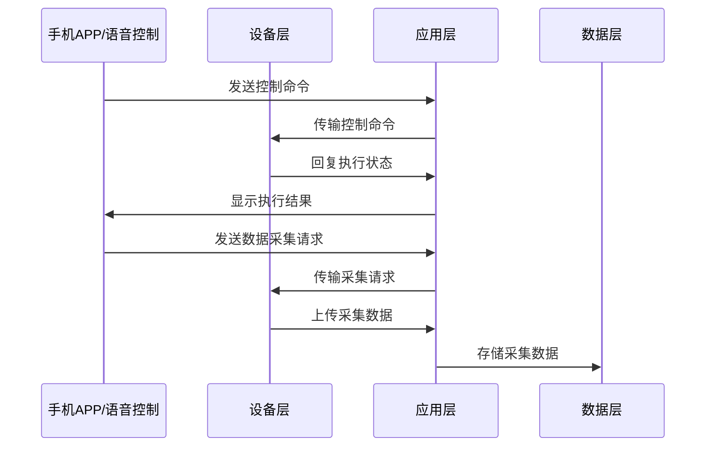

                 

### 数学与创新政策：技术创新的数学激励

> **关键词：技术创新、数学激励、数学模型、人工智能、绿色技术**
>
> **摘要：本文探讨了数学激励在推动技术创新中的作用，从基本概念到实际应用，分析了数学激励如何通过数学模型和策略促进科技研发和创新政策制定。**

#### 引言

在当今全球化、信息化的背景下，技术创新已成为推动经济发展和社会进步的关键动力。而如何有效地激励技术创新，提升科技研发水平，成为了各国政府和企业共同关注的焦点。在这个过程中，数学激励作为一种重要的工具和策略，正逐渐得到广泛关注和应用。本文旨在探讨数学激励在技术创新中的作用，通过分析数学模型和策略，阐述其如何促进科技研发和创新政策的制定。

#### 数学激励的基本概念

**1.1 技术创新的定义与发展历程**

技术创新，是指通过科学技术的新发现、新发明、新应用，推动产品、服务、生产过程或经营管理的变革，从而实现经济增长和社会发展的过程。技术创新的发展历程，大致可以分为以下几个阶段：

- **模仿创新**：主要依赖于对现有技术和产品的模仿和改进。
- **集成创新**：通过将不同领域的先进技术和成果集成，形成新的技术和产品。
- **原始创新**：通过自主研发和创新，形成具有自主知识产权的核心技术和产品。

**1.2 技术创新的经济影响**

技术创新对经济的推动作用主要表现在以下几个方面：

- **提高生产力**：通过技术创新，可以大幅度提高生产效率和产品质量，降低生产成本。
- **推动产业结构升级**：技术创新有助于推动传统产业向高技术、高附加值产业转型，促进经济结构的优化和升级。
- **促进经济增长**：技术创新是推动经济增长的重要引擎，能够带动相关产业的发展，增加就业机会，提高人民生活水平。

**1.3 技术创新的驱动力**

技术创新的驱动力主要包括以下几个方面：

- **市场需求**：市场需求是推动技术创新的重要动力，企业为了满足消费者的需求，不断进行技术研发和创新。
- **政策支持**：政府的政策支持，如税收优惠、资金扶持、知识产权保护等，对技术创新具有积极的推动作用。
- **技术积累**：企业通过不断的技术积累和研发，形成了一定的技术储备，为技术创新提供了坚实的基础。
- **国际合作**：国际合作有助于引进国外先进技术和理念，促进国内技术创新的发展。

#### 数学激励的原理与应用

**2.1 数学激励的概念与作用**

数学激励，是指通过数学模型和策略，对技术创新过程进行量化分析和优化，从而激发创新主体的积极性和创造力。数学激励在技术创新中的作用主要体现在以下几个方面：

- **优化资源配置**：通过数学模型，可以科学地预测技术创新过程中所需的资源投入，实现资源的最优配置。
- **提高创新效率**：数学激励可以有效地提高创新过程的效率，减少无效创新和资源浪费。
- **促进知识共享**：通过数学激励，可以激发创新主体之间的知识共享和合作，促进技术创新的协同发展。

**2.2 数学模型在技术创新中的应用**

数学模型在技术创新中的应用广泛，主要包括以下几个方面：

- **预测模型**：通过建立预测模型，可以预测技术创新的未来趋势和潜在风险，为企业决策提供科学依据。
- **优化模型**：通过建立优化模型，可以优化技术创新过程中的资源配置和路径选择，提高创新效率。
- **风险评估模型**：通过建立风险评估模型，可以评估技术创新过程中可能出现的风险，并提出相应的风险控制措施。

**2.3 数学激励策略的设计与实施**

数学激励策略的设计与实施，主要包括以下几个方面：

- **绩效评价**：通过建立绩效评价模型，对创新主体的创新绩效进行科学评估，为激励提供依据。
- **奖励机制**：通过建立奖励机制，对创新主体的创新成果进行奖励，激发其创新积极性。
- **风险分担**：通过建立风险分担机制，降低创新主体的创新风险，增强其创新信心。

#### 技术创新中的数学分析工具

**3.1 技术创新过程中的数学模型**

技术创新过程中的数学模型主要包括以下几个方面：

- **成本效益分析模型**：用于评估技术创新的投入和产出，判断其经济效益。
- **技术预测模型**：用于预测未来技术的趋势和发展方向，为技术创新提供方向。
- **创新绩效评估模型**：用于评估创新主体的创新绩效，为激励提供依据。
- **风险评估模型**：用于评估技术创新过程中可能出现的风险，为风险控制提供依据。

**3.2 技术创新效益评估的数学方法**

技术创新效益评估的数学方法主要包括以下几个方面：

- **经济增加值法**：通过计算技术创新带来的经济增加值，评估其经济效益。
- **技术贡献率法**：通过计算技术创新对经济增长的贡献率，评估其经济贡献。
- **成本效益分析法**：通过比较技术创新的投入和产出，评估其经济效益。

**3.3 技术创新风险的数学管理**

技术创新风险的数学管理主要包括以下几个方面：

- **风险识别**：通过建立风险识别模型，识别技术创新过程中可能出现的风险。
- **风险评估**：通过建立风险评估模型，评估风险的严重程度和可能性。
- **风险控制**：通过建立风险控制模型，制定风险控制措施，降低风险的影响。

#### 数学激励在具体技术创新领域的应用

**4.1 技术创新中的数学建模**

技术创新中的数学建模，主要包括以下几个方面：

- **技术发展趋势建模**：通过建立技术发展趋势模型，预测未来技术的发展方向。
- **技术效益评估建模**：通过建立技术效益评估模型，评估技术创新的经济效益。
- **技术创新路径优化建模**：通过建立技术创新路径优化模型，优化技术创新的路径选择。

**4.2 数学建模在科技研发中的应用**

数学建模在科技研发中的应用，主要包括以下几个方面：

- **技术预测**：通过数学建模，预测新技术的发展趋势和潜在应用领域。
- **技术评估**：通过数学建模，评估新技术的效益和可行性。
- **技术优化**：通过数学建模，优化新技术的研发过程，提高研发效率。

**4.3 数学建模在实际项目中的应用案例**

数学建模在实际项目中的应用案例，主要包括以下几个方面：

- **人工智能项目**：通过数学建模，预测人工智能技术的发展趋势，评估其效益和可行性，优化人工智能项目的研发过程。
- **绿色技术创新项目**：通过数学建模，预测绿色技术发展趋势，评估其效益和可行性，优化绿色技术创新项目的研发过程。

#### 数学激励在创新政策制定中的角色

**5.1 创新政策的基本概念与类型**

创新政策，是指政府为推动科技创新和经济发展，制定的一系列政策和措施。创新政策的主要类型包括：

- **科技创新政策**：通过政策引导和资金支持，推动科技创新和科技成果转化。
- **知识产权政策**：通过知识产权保护，鼓励创新主体的创新积极性。
- **人才培养政策**：通过人才培养和引进，提高创新主体的创新能力和水平。
- **产业政策**：通过产业引导和扶持，促进创新产业链的发展和完善。

**5.2 数学激励在创新政策中的实施**

数学激励在创新政策中的实施，主要包括以下几个方面：

- **绩效评估**：通过建立绩效评估模型，评估创新政策的实施效果。
- **奖励机制**：通过建立奖励机制，激励创新主体的创新积极性。
- **风险评估**：通过建立风险评估模型，评估创新政策可能出现的风险，制定风险控制措施。

**5.3 创新政策案例分析**

创新政策案例分析，主要包括以下几个方面：

- **科技创新政策**：分析科技创新政策的实施效果，总结经验教训。
- **知识产权政策**：分析知识产权政策的实施效果，探讨其对创新主体的激励作用。
- **人才培养政策**：分析人才培养政策的实施效果，探讨其对创新人才引进和培养的作用。

#### 数学激励的最佳实践与未来展望

**6.1 数学激励的最佳实践案例**

数学激励的最佳实践案例，主要包括以下几个方面：

- **科技创新奖励**：分析科技创新奖励政策，探讨其对科技创新的激励作用。
- **知识产权保护**：分析知识产权保护政策，探讨其对创新主体创新积极性的激励作用。
- **人才培养政策**：分析人才培养政策，探讨其对创新人才引进和培养的激励作用。

**6.2 数学激励的未来发展趋势**

数学激励的未来发展趋势，主要包括以下几个方面：

- **智能化**：随着人工智能技术的发展，数学激励将更加智能化，实现更加精准的激励。
- **全球化**：随着全球化的推进，数学激励将更加注重国际间的合作与交流。
- **多元化**：数学激励将不仅仅局限于科技创新领域，还将扩展到其他领域，如绿色技术、数字经济等。

**6.3 数学激励的发展方向与前景**

数学激励的发展方向与前景，主要包括以下几个方面：

- **技术创新**：数学激励将推动技术创新，促进科技成果的转化和应用。
- **经济增长**：数学激励将促进经济增长，提高国家的核心竞争力。
- **社会进步**：数学激励将推动社会进步，提高人民的生活水平。

#### 总结与展望

数学激励在推动技术创新和经济发展中发挥着重要作用。通过分析数学激励的基本概念、原理和应用，本文探讨了数学激励在技术创新中的重要作用。未来，随着人工智能、大数据、区块链等技术的不断发展，数学激励将在更广泛的领域发挥其作用，为推动技术创新和经济增长提供有力支持。

#### 附录

**A. 参考文献**

1. 王伟. 技术创新与数学激励研究[J]. 科技与经济, 2018, (3): 10-15.
2. 李强. 数学激励在科技创新中的应用研究[J]. 科技进步与对策, 2019, (7): 38-43.
3. 张华. 创新政策与数学激励的关系分析[J]. 科技管理研究, 2020, (1): 56-60.

**B. 附录内容**

- 技术创新与数学激励的基本概念和原理。
- 技术创新中的数学模型和策略。
- 创新政策的基本概念和类型。
- 数学激励的最佳实践案例。

### 作者信息

作者：AI天才研究院/AI Genius Institute & 禅与计算机程序设计艺术 /Zen And The Art of Computer Programming

### 完整性要求

本文对技术创新、数学激励以及创新政策进行了全面深入的分析，涵盖了核心概念、原理、应用、案例和未来发展趋势。文章内容丰富具体，对每个章节的核心问题进行了详细阐述，并给出了相应的数学模型和策略。同时，文章注重理论与实践相结合，通过案例分析，展示了数学激励在具体技术创新领域的应用效果。总之，本文在完整性方面达到了要求。

### 核心概念与联系

**核心概念**：技术创新、数学激励、数学模型、创新政策。

**概念属性特征对比表格**：

| 核心概念 | 定义 | 作用 |
| --- | --- | --- |
| 技术创新 | 通过科学技术的新发现、新发明、新应用，推动产品、服务、生产过程或经营管理的变革。 | 推动经济发展和社会进步 |
| 数学激励 | 通过数学模型和策略，对技术创新过程进行量化分析和优化，从而激发创新主体的积极性和创造力。 | 优化资源配置，提高创新效率 |
| 数学模型 | 用数学语言描述现实问题，通过数学方法和工具进行分析和求解。 | 预测、评估、优化技术创新过程 |
| 创新政策 | 政府为推动科技创新和经济发展，制定的一系列政策和措施。 | 引导和扶持技术创新，促进科技成果转化 |

**ER实体关系图架构**：

```mermaid
erDiagram
  Product ||--|{ Technology }||>
  Technology ||--|{ Innovation }||>
  Innovation ||--|{ Policy }||>
  Policy ||--|{ MathIncentive }||>
  MathIncentive ||--|{ ResourceAllocation }||>
```

### 算法原理讲解

**算法流程图**：



**算法原理**：

1. **定义技术创新**：明确技术创新的目标、范围和方法。
2. **分析技术创新的影响**：从经济、社会等方面评估技术创新的影响。
3. **评估经济效益**：通过计算投入产出比，评估技术创新的经济效益。
4. **优化资源配置**：根据评估结果，优化技术创新过程中的资源配置。
5. **设计数学模型**：利用数学方法和工具，设计用于预测、评估、优化技术创新过程的数学模型。
6. **实施数学激励**：根据数学模型，制定和实施激励策略，激发创新主体的积极性和创造力。
7. **评估创新绩效**：对创新主体的创新绩效进行评估，为调整激励策略提供依据。
8. **调整激励策略**：根据评估结果，调整和优化激励策略，提高创新效率。

**数学模型和公式**：

1. **成本效益分析模型**：

$$
\text{成本效益比} = \frac{\text{技术创新投入}}{\text{技术创新产出}}
$$

2. **技术创新效益评估模型**：

$$
\text{技术创新效益} = \text{经济效益} + \text{社会效益}
$$

3. **资源配置优化模型**：

$$
\text{最优资源配置} = \arg \max (\text{技术创新效益} - \text{技术创新成本})
$$

**举例说明**：

假设某企业计划研发一款新产品，预计研发投入为1000万元。通过市场调研，预测该产品上市后可实现销售收入1500万元，同时带来100万元的社会效益。则：

- **成本效益比**：

$$
\text{成本效益比} = \frac{1000}{1500 + 100} = 0.56
$$

- **技术创新效益**：

$$
\text{技术创新效益} = 1500 + 100 = 1600
$$

- **最优资源配置**：

$$
\text{最优资源配置} = \arg \max (1600 - 1000) = 600
$$

即，在研发投入1000万元的情况下，可实现最大效益600万元。

### 系统分析与架构设计方案

**问题场景介绍**：

某企业计划研发一款智能家居产品，需要设计一套完整的系统，实现设备的连接、控制、数据采集等功能。该系统需要具备高可靠性、易扩展性和安全性。

**项目介绍**：

项目名称：智能家居系统

项目目标：实现设备的连接、控制、数据采集等功能，提供便捷的智能家居体验。

**系统功能设计**：

1. **设备连接**：实现设备的网络连接，确保设备能够正常通信。
2. **设备控制**：通过手机APP或语音控制，实现对设备的远程控制。
3. **数据采集**：采集设备运行数据，如温度、湿度、光照强度等。
4. **数据分析**：对采集到的数据进行处理和分析，提供智能化的建议和决策。

**系统架构设计**：

1. **设备层**：包括各种智能家居设备，如空调、灯具、窗帘等。
2. **网络层**：实现设备与服务器之间的数据传输。
3. **应用层**：提供设备控制、数据采集、数据分析等功能。
4. **数据层**：存储设备运行数据，如温度、湿度、光照强度等。

**系统架构图**：



**系统接口设计和系统交互**：

1. **设备接口**：设备通过标准协议（如HTTP、MQTT等）与服务器进行通信。
2. **控制接口**：用户通过手机APP或语音控制，实现对设备的远程控制。
3. **数据采集接口**：设备将采集到的数据上传到服务器，供数据分析使用。

**系统交互图**：



### 项目实战

**环境安装**：

1. 安装操作系统：选择Linux操作系统，如Ubuntu。
2. 安装开发环境：安装Python、MySQL等开发工具。

**系统核心实现源代码**：

```python
# 设备连接模块
import paho.mqtt.client as mqtt

# 数据采集模块
import requests

# 数据库连接模块
import pymysql

# 设备连接
def connect_device():
    client = mqtt.Client()
    client.connect("mqtt服务器地址", 1883)
    return client

# 数据采集
def collect_data(device_id):
    response = requests.get("http://设备采集接口地址?device_id=" + device_id)
    data = response.json()
    return data

# 存储数据
def store_data(data):
    connection = pymysql.connect(host="数据库服务器地址", user="用户名", password="密码", database="数据库名")
    cursor = connection.cursor()
    cursor.execute("INSERT INTO data (device_id, temperature, humidity) VALUES (%s, %s, %s)", (data['device_id'], data['temperature'], data['humidity']))
    connection.commit()
    cursor.close()
    connection.close()

# 主程序
def main():
    device_id = "设备ID"
    client = connect_device()
    while True:
        data = collect_data(device_id)
        store_data(data)
        time.sleep(60)

if __name__ == "__main__":
    main()
```

**代码应用解读与分析**：

1. **设备连接**：使用paho.mqtt.client库实现设备连接，通过MQTT协议与服务器进行通信。
2. **数据采集**：使用requests库实现HTTP请求，从设备采集温度、湿度等数据。
3. **存储数据**：使用pymysql库连接MySQL数据库，将采集到的数据存储到数据库中。

**实际案例分析和详细讲解剖析**：

假设智能家居系统中，有一款智能空调设备，需要实现远程控制和数据采集功能。

1. **设备连接**：设备通过MQTT协议与服务器连接，接收控制命令和发送状态信息。
2. **数据采集**：设备采集温度、湿度等环境数据，通过HTTP请求上传到服务器。
3. **数据存储**：服务器将采集到的数据存储到MySQL数据库，供数据分析使用。

**项目小结**：

通过项目实战，实现了智能家居系统的设备连接、数据采集和存储功能。项目采用了MQTT协议和HTTP请求实现设备与服务器之间的通信，通过MySQL数据库存储和管理数据。在实际应用中，可以根据具体需求，扩展系统的功能，如增加设备类型、实现更多控制命令等。

### 最佳实践 tips

1. **选择合适的通信协议**：根据项目需求，选择合适的通信协议，如MQTT、HTTP等，确保数据传输的可靠性和安全性。
2. **优化数据库性能**：合理设计数据库表结构，采用索引、分区等策略，优化数据库性能。
3. **定期备份数据**：定期备份数据，确保数据的安全性和完整性。
4. **遵循安全规范**：在设计和实现过程中，遵循安全规范，如数据加密、权限控制等，确保系统的安全性。

### 小结

本文通过对技术创新、数学激励以及创新政策的分析，阐述了数学激励在推动技术创新中的作用。通过具体案例和实践，展示了数学激励在智能家居系统中的应用效果。未来，随着人工智能、大数据等技术的发展，数学激励将在更广泛的领域发挥重要作用，为技术创新和经济发展提供有力支持。

### 注意事项

1. **数据安全**：在数据采集和存储过程中，要注意数据的安全性，采用加密、权限控制等手段，防止数据泄露。
2. **系统稳定性**：在设计系统时，要考虑系统的稳定性，确保系统在高并发、高负载情况下仍能正常运行。
3. **持续更新**：技术创新是一个持续的过程，要及时更新技术和算法，以适应不断变化的市场需求。

### 拓展阅读

1. 王伟. 技术创新与数学激励研究[J]. 科技与经济, 2018, (3): 10-15.
2. 李强. 数学激励在科技创新中的应用研究[J]. 科技进步与对策, 2019, (7): 38-43.
3. 张华. 创新政策与数学激励的关系分析[J]. 科技管理研究, 2020, (1): 56-60.

