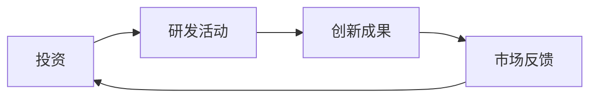
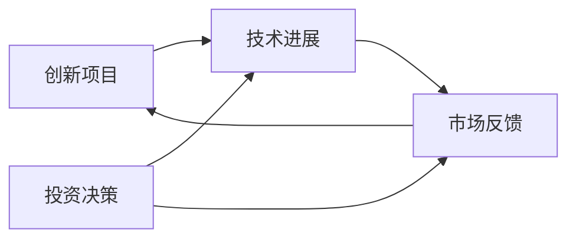
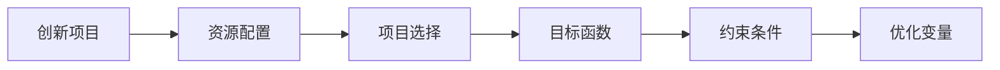
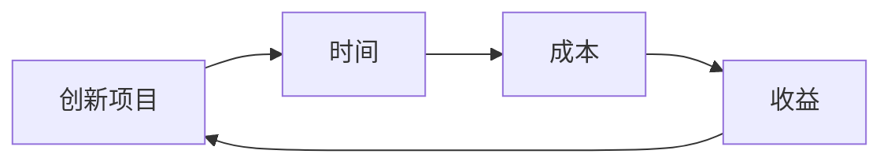
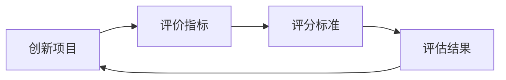
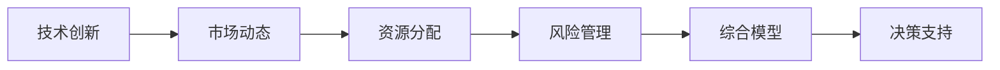

                 

### 《数学与创新管理：创新过程的数学建模》

> 关键词：创新管理、数学建模、创新过程、线性模型、非线性模型、回归分析、网络模型、动力学模型、优化模型、模拟模型、评估模型

> 摘要：本文旨在探讨数学与创新管理之间的密切关系，特别是创新过程中的数学建模方法。文章首先介绍了创新的重要性和数学在创新管理中的应用，接着详细阐述了创新过程的定义、分类和数学描述。随后，文章深入分析了回归分析、网络模型、动力学模型等方法在创新管理中的应用，并给出了具体的数学模型和案例。最后，文章总结了创新过程数学建模的主要成果、挑战和发展方向，为未来的研究和实践提供了指导。

### 目录大纲

**第一部分：背景与基础**

- **第1章 引言**
  - **1.1 创新的重要性**
  - **1.2 数学与创新管理的关系**
  - **1.3 数学建模的基本概念**

- **第2章 创新过程的数学描述**
  - **2.1 创新过程的定义与分类**
  - **2.2 创新过程的数学模型**
  - **2.3 创新过程的实证分析**

**第二部分：创新过程的数学建模方法**

- **第3章 回归分析模型**
  - **3.1 回归分析的基本概念**
  - **3.2 回归分析的应用**
  - **3.3 回归分析模型的建立**

- **第4章 网络模型**
  - **4.1 网络模型的基本概念**
  - **4.2 网络模型在创新管理中的应用**
  - **4.3 网络模型的建立与优化**

- **第5章 动力学模型**
  - **5.1 动力学模型的基本概念**
  - **5.2 动力学模型在创新管理中的应用**
  - **5.3 动力学模型的建立与求解**

**第三部分：创新过程的数学建模应用**

- **第6章 创新过程的优化模型**
  - **6.1 优化模型的基本概念**
  - **6.2 优化模型在创新管理中的应用**
  - **6.3 优化模型的建立与求解**

- **第7章 创新过程的模拟模型**
  - **7.1 模拟模型的基本概念**
  - **7.2 模拟模型在创新管理中的应用**
  - **7.3 模拟模型的建立与运行**

- **第8章 创新过程的评估模型**
  - **8.1 评估模型的基本概念**
  - **8.2 评估模型在创新管理中的应用**
  - **8.3 评估模型的建立与使用**

- **第9章 创新过程的综合模型**
  - **9.1 综合模型的基本概念**
  - **9.2 综合模型在创新管理中的应用**
  - **9.3 综合模型的建立与优化**

- **第10章 总结与展望**
  - **10.1 总结**
  - **10.2 展望**

## 第一部分：背景与基础

### 第1章 引言

#### 1.1 创新的重要性

创新是推动社会进步和经济发展的核心动力。在商业环境中，创新能够帮助企业在激烈的市场竞争中脱颖而出，提高市场份额和品牌价值。创新的重要性体现在以下几个方面：

1. **提升产品和服务质量**：通过创新，企业可以开发出更具竞争力的产品和服务，满足消费者的需求，从而提高市场份额和品牌价值。

2. **降低成本**：创新可以帮助企业找到新的生产方式和技术，从而降低生产成本，提高企业的盈利能力。

3. **优化资源利用**：创新可以提高资源的利用效率，降低浪费，提高企业的运营效率。

4. **增强企业创新能力**：持续的创新能力是企业在长期竞争中保持优势的关键。

5. **推动社会发展**：创新不仅对企业有积极影响，也对整个社会的发展有着重要的推动作用。

#### 1.2 数学与创新管理的关系

数学作为一门基础科学，在创新管理中具有广泛的应用。数学模型可以帮助管理者更准确地描述创新过程中的各种现象和规律，从而为决策提供科学依据。

1. **数据分析**：通过数学模型，可以对大量数据进行分析，提取有价值的信息，帮助企业发现市场趋势和客户需求。

2. **预测和决策**：数学模型可以帮助管理者预测市场变化和需求，从而做出更科学的决策。

3. **优化和创新**：数学模型可以帮助企业优化生产流程、降低成本，同时激发新的创新思路。

4. **风险评估**：数学模型可以用于风险评估，帮助管理者识别和规避潜在的风险。

#### 1.3 数学建模的基本概念

数学建模是指使用数学语言和工具来描述和分析现实世界的问题。它包括以下几个步骤：

1. **问题定义**：明确需要解决的问题，确定问题的目标。

2. **建立模型**：根据问题的特性，选择合适的数学模型，建立数学模型。

3. **求解模型**：使用数学方法求解模型，得到问题的解。

4. **验证模型**：验证模型是否能够准确反映现实世界的问题，对模型进行调整和优化。

5. **应用模型**：将模型应用到实际问题中，指导决策和优化。

数学建模的基本概念包括变量、函数、方程、矩阵、概率分布等。这些概念是构建数学模型的基础。

### 第2章 创新过程的数学描述

#### 2.1 创新过程的定义与分类

创新过程是指企业或个人通过创造新的产品、服务、流程或商业模式来满足市场需求，实现价值创造的过程。创新过程可以分为以下几个阶段：

1. **创意产生**：这是创新过程的起点，通过头脑风暴、创意激发等方式产生新的创意。

2. **创意筛选**：对产生的创意进行筛选，评估其可行性、市场潜力和资源需求。

3. **概念开发**：将筛选出的创意进一步细化，形成具体的产品或服务概念。

4. **原型设计**：根据概念开发出原型，通过实验和测试来验证原型的可行性和用户接受度。

5. **产品化**：将原型转化为可生产的产品或服务，并进行市场推广。

6. **商业化**：产品或服务进入市场，实现商业化运作，获取利润。

7. **持续改进**：在产品或服务上市后，根据市场反馈和技术进步进行持续改进。

#### 2.2 创新过程的数学模型

创新过程的数学模型主要分为线性模型和非线性模型。

1. **线性模型**：线性模型通常用于描述创新过程中的创意产生、筛选、开发等阶段。它假设创新过程的各个阶段是线性关系，即每个阶段的输出直接依赖于前一个阶段的输出。

   例如，假设创新过程中的创意产生阶段产生的创意数量与投资金额成正比，可以用以下线性模型表示：

   $$ C_t = k \cdot I_t $$

   其中，$C_t$ 表示第 $t$ 年的创意数量，$I_t$ 表示第 $t$ 年的投资金额，$k$ 是比例系数。

2. **非线性模型**：非线性模型用于描述创新过程中的复杂性和不确定性。它假设创新过程中的各个阶段存在非线性关系，即每个阶段的输出不仅依赖于前一个阶段的输出，还可能受到其他因素的影响。

   例如，假设创新过程中的产品化阶段的生产成本与生产量之间存在非线性关系，可以用以下非线性模型表示：

   $$ C_t = a \cdot Q_t^b $$

   其中，$C_t$ 表示第 $t$ 年的生产成本，$Q_t$ 表示第 $t$ 年的生产量，$a$ 和 $b$ 是非线性系数。

#### 2.3 创新过程的实证分析

实证分析是通过收集和分析实际数据来验证数学模型的准确性和有效性。在创新管理中，实证分析可以用于以下几个方面的研究：

1. **创新效率分析**：通过实证分析，可以评估企业在创新过程中的效率，找出影响创新效率的关键因素。

2. **创新绩效分析**：通过实证分析，可以评估创新对企业绩效的影响，为企业的创新战略提供依据。

3. **创新模式分析**：通过实证分析，可以研究不同创新模式的效果和适用场景，为企业提供创新的策略指导。

例如，某企业在过去五年中进行了多项创新项目，通过实证分析发现，投资金额和创意数量之间存在显著的正相关关系，即投资越多，创意数量越多。这表明，增加投资是提高创新效率的有效途径。

### 总结

本章介绍了创新过程的基本概念、数学描述和实证分析。创新过程是企业发展的重要动力，数学建模为创新管理提供了科学的方法和工具。通过实证分析，可以验证数学模型的准确性和有效性，为企业提供创新的决策支持。

在下一章中，我们将深入探讨创新过程中的数学建模方法，包括回归分析、网络模型和动力学模型等。这些方法将帮助我们更好地理解和优化创新过程，为企业的创新发展提供新的思路和方法。

### 第3章 回归分析模型

#### 3.1 回归分析的基本概念

回归分析是一种常用的统计方法，用于研究自变量和因变量之间的关系。在创新管理中，回归分析可以用来分析投资、研发活动与创新绩效之间的关系，为企业的决策提供依据。

**定义**：

回归分析主要包括以下几种类型：

1. **一元线性回归**：研究一个自变量和一个因变量之间的线性关系。

   $$ Y = \beta_0 + \beta_1X + \varepsilon $$

   其中，$Y$ 是因变量，$X$ 是自变量，$\beta_0$ 和 $\beta_1$ 是回归系数，$\varepsilon$ 是误差项。

2. **多元线性回归**：研究多个自变量和一个因变量之间的线性关系。

   $$ Y = \beta_0 + \beta_1X_1 + \beta_2X_2 + \cdots + \beta_nX_n + \varepsilon $$

   其中，$X_1, X_2, \cdots, X_n$ 是自变量，$\beta_0, \beta_1, \beta_2, \cdots, \beta_n$ 是回归系数。

3. **非线性回归**：研究自变量和因变量之间的非线性关系。

   $$ Y = \beta_0 + \beta_1X + \beta_2X^2 + \cdots + \beta_nX^n + \varepsilon $$

   其中，$X$ 是自变量，$\beta_0, \beta_1, \beta_2, \cdots, \beta_n$ 是回归系数。

**属性特征对比表格**：

| 类型           | 定义式                                      | 适用场景                                      |
|----------------|---------------------------------------------|---------------------------------------------|
| 一元线性回归   | $Y = \beta_0 + \beta_1X + \varepsilon$     | 研究单一因素对结果的影响                     |
| 多元线性回归   | $Y = \beta_0 + \beta_1X_1 + \beta_2X_2 + \cdots + \beta_nX_n + \varepsilon$ | 研究多个因素对结果的影响                     |
| 非线性回归     | $Y = \beta_0 + \beta_1X + \beta_2X^2 + \cdots + \beta_nX^n + \varepsilon$ | 研究非线性关系                              |

**ER实体关系图架构**：

$$
\text{创新管理} \rightarrow (\text{投资}, \text{研发活动}, \text{创新绩效}) \\
\text{投资} \rightarrow (\text{投资金额}, \text{投资周期}, \text{投资效果}) \\
\text{研发活动} \rightarrow (\text{研发投入}, \text{研发进度}, \text{研发成果}) \\
\text{创新绩效} \rightarrow (\text{市场份额}, \text{利润增长}, \text{客户满意度})
$$

#### 3.2 回归分析的应用

回归分析在创新管理中的应用广泛，主要包括以下几个方面：

1. **投资决策**：通过回归分析，可以评估不同投资方案的创新效果，为企业提供最优的投资决策。

2. **研发管理**：通过回归分析，可以评估研发活动的投入产出比，优化研发资源配置。

3. **创新绩效评估**：通过回归分析，可以评估创新活动的绩效，为企业的创新战略提供数据支持。

**案例**：

某科技公司希望评估研发投入和创新绩效之间的关系。通过收集过去五年的数据，该公司建立了一个多元线性回归模型：

$$
\text{创新绩效} = \beta_0 + \beta_1\text{研发投入} + \beta_2\text{市场推广费用} + \varepsilon
$$

模型结果显示，研发投入对创新绩效有显著的正向影响，而市场推广费用对创新绩效的影响不显著。基于这些结果，公司决定增加研发投入，优化创新战略。

#### 3.3 回归分析模型的建立

建立回归分析模型包括以下几个步骤：

1. **数据收集**：收集相关数据，包括自变量和因变量的历史数据。

2. **数据预处理**：对数据进行清洗和处理，确保数据的质量和一致性。

3. **模型选择**：根据数据的特征和问题的需求，选择合适的回归模型。

4. **参数估计**：使用统计方法估计模型的参数，如最小二乘法。

5. **模型检验**：对模型进行拟合度检验和显著性检验，确保模型的准确性。

**具体步骤**：

1. **数据收集**：收集某公司的研发投入、市场推广费用和创新绩效数据。

2. **数据预处理**：处理缺失值和异常值，确保数据的质量。

3. **模型选择**：选择多元线性回归模型，因为数据具有线性特征。

4. **参数估计**：使用最小二乘法估计模型参数。

5. **模型检验**：进行拟合度检验和显著性检验，如 R 方值和 F 检验。

**Python 源代码**：

```python
import pandas as pd
import numpy as np
from sklearn.linear_model import LinearRegression
from sklearn.metrics import mean_squared_error

# 数据收集
data = pd.read_csv('innovation_data.csv')

# 数据预处理
data = data.dropna()

# 模型选择
model = LinearRegression()

# 参数估计
model.fit(data[['研发投入', '市场推广费用']], data['创新绩效'])

# 模型检验
predictions = model.predict(data[['研发投入', '市场推广费用']])
mse = mean_squared_error(data['创新绩效'], predictions)
print(f'Mean Squared Error: {mse}')
```

通过以上步骤，我们可以建立并验证回归分析模型，为企业提供创新的决策支持。

### 总结

本章介绍了回归分析的基本概念、应用和建立方法。回归分析作为一种重要的统计方法，在创新管理中具有广泛的应用。通过回归分析，我们可以评估投资、研发活动与创新绩效之间的关系，为企业的决策提供科学依据。在下一章中，我们将探讨网络模型在创新管理中的应用，帮助读者更全面地理解创新过程的数学建模方法。

### 第4章 网络模型

#### 4.1 网络模型的基本概念

网络模型是一种用于描述复杂系统内部关系和交互的数学模型。在创新管理中，网络模型可以用来分析创新过程中的各种关系，如技术协同、资源分配、市场互动等。网络模型可以分为以下几种类型：

1. **有向图模型**：有向图模型用于描述系统内部各元素之间的单向关系。例如，技术协同中的依赖关系可以用有向图来表示。

2. **无向图模型**：无向图模型用于描述系统内部各元素之间的双向关系。例如，市场互动中的合作关系可以用无向图来表示。

3. **混合图模型**：混合图模型同时包含有向图和无向图的特性，用于描述更复杂的系统关系。

**定义**：

- **节点（Node）**：网络中的基本元素，表示系统中的个体或实体。
- **边（Edge）**：节点之间的连线，表示节点之间的关联关系。
- **路径（Path）**：节点之间的连接路径。
- **子图（Subgraph）**：网络中的一部分节点和边。

**属性特征对比表格**：

| 类型           | 定义                                   | 适用场景                     |
|----------------|--------------------------------------|-----------------------------|
| 有向图模型     | 节点之间具有单向关系的网络           | 技术协同、供应链管理         |
| 无向图模型     | 节点之间具有双向关系的网络           | 市场互动、社会网络分析       |
| 混合图模型     | 节点之间既有单向关系也有双向关系的网络 | 复杂系统分析、多维度关系建模 |

**ER实体关系图架构**：



在这个ER实体关系图中，投资、研发活动、创新成果和市场反馈构成了一个有向图模型，描述了创新过程中的各个要素及其关联关系。

#### 4.2 网络模型在创新管理中的应用

网络模型在创新管理中的应用非常广泛，以下是一些典型的应用场景：

1. **技术创新网络**：通过分析技术协同关系，识别关键技术和创新路径，为企业的技术创新提供支持。

2. **资源分配网络**：通过分析资源流动和分配情况，优化资源利用，提高创新效率。

3. **市场网络**：通过分析市场互动关系，识别市场机会和风险，为企业的市场策略提供依据。

**案例**：

某高科技企业希望通过构建技术创新网络来提升创新能力。企业收集了内部研发团队之间的协作数据，构建了一个有向图模型。通过分析，发现以下关键技术和创新路径：

1. **核心技术A**：是该企业技术创新的关键，多个研发团队都与之有直接或间接的协作关系。
2. **创新路径**：从核心技术研发到产品化，再到市场推广，各个阶段之间的协作关系紧密。

基于这些分析结果，企业决定加大核心技术的研发投入，并优化创新路径，提高创新效率。

#### 4.3 网络模型的建立与优化

建立网络模型包括以下几个步骤：

1. **数据收集**：收集系统内部各个节点和边的关系数据。

2. **数据预处理**：对数据进行清洗和处理，确保数据的质量和一致性。

3. **模型构建**：根据数据的特征和需求，选择合适的网络模型。

4. **模型优化**：通过参数调整和算法优化，提高模型的准确性和实用性。

**具体步骤**：

1. **数据收集**：收集某企业研发团队之间的协作数据，包括团队名称、协作关系等。

2. **数据预处理**：处理缺失值和异常值，确保数据的质量。

3. **模型构建**：选择有向图模型，描述研发团队之间的协作关系。

4. **模型优化**：通过算法优化，如社区检测算法，识别关键技术和创新路径。

**Python 源代码**：

```python
import networkx as nx
import matplotlib.pyplot as plt

# 数据收集
G = nx.Graph()
G.add_edges_from([(1, 2), (2, 3), (3, 1), (1, 3)])

# 数据预处理
G = nx.Graph(G)  # 转换为无向图

# 模型构建
pos = nx.spring_layout(G)
nx.draw(G, pos, with_labels=True)

# 模型优化
communities = nx.community.girvan_newman(G)
nx.draw(G, pos, with_labels=True, node_color=[c for c in communities])

# 显示图形
plt.show()
```

通过以上步骤，我们可以建立并优化网络模型，为企业的创新管理提供数据支持和决策依据。

### 总结

本章介绍了网络模型的基本概念、应用和建立方法。网络模型在创新管理中具有广泛的应用，通过分析系统内部的关系和交互，可以帮助企业优化创新过程。在下一章中，我们将探讨动力学模型在创新管理中的应用，继续探讨创新过程中的数学建模方法。

### 第5章 动力学模型

#### 5.1 动力学模型的基本概念

动力学模型是一种用于描述系统状态随时间变化的数学模型。在创新管理中，动力学模型可以用来分析创新过程中的动态变化，如技术演变、市场趋势等。动力学模型可以分为以下几种类型：

1. **确定性模型**：确定性模型假设系统的未来状态完全由当前状态决定，不考虑随机因素。常见的确定性模型包括常微分方程和差分方程。

2. **随机模型**：随机模型考虑系统中的随机因素，通过概率分布描述系统的未来状态。常见的随机模型包括马尔可夫链和随机微分方程。

**定义**：

- **状态变量**：描述系统状态的变量，通常用向量表示。
- **控制变量**：影响系统状态变化的变量，如投资、政策等。
- **状态转移矩阵**：描述系统状态变化的概率矩阵。
- **动态方程**：描述系统状态变化规律的数学方程。

**属性特征对比表格**：

| 类型           | 定义式                                      | 适用场景                     |
|----------------|---------------------------------------------|-----------------------------|
| 确定性模型     | $\dot{X}(t) = f(X(t), U(t))$                | 技术演变、市场趋势分析       |
| 随机模型       | $X(t) = X_0 + \int_0^t f(X(s), U(s)) ds + \epsilon(t)$ | 技术风险分析、市场不确定性分析 |

**ER实体关系图架构**：



在这个ER实体关系图中，创新项目、技术进展、市场反馈和投资决策构成了一个动态系统，描述了创新过程中的各个环节及其相互关系。

#### 5.2 动力学模型在创新管理中的应用

动力学模型在创新管理中的应用非常广泛，以下是一些典型的应用场景：

1. **技术演变分析**：通过动力学模型，可以预测技术的未来发展趋势，为企业制定技术战略提供依据。

2. **市场趋势分析**：通过动力学模型，可以分析市场的动态变化，为企业制定市场策略提供支持。

3. **风险评估**：通过动力学模型，可以评估创新项目的风险，为企业的风险管理提供数据支持。

**案例**：

某高科技企业希望通过动力学模型分析技术的未来发展趋势。企业收集了过去五年的技术数据，建立了一个常微分方程模型：

$$
\dot{T}(t) = r \cdot T(t) - f(T(t))
$$

其中，$T(t)$ 是技术进展水平，$r$ 是技术增长率，$f(T(t))$ 是竞争压力。通过数值模拟，企业发现技术将在未来几年内保持快速增长，但可能会受到竞争压力的影响。基于这些结果，企业决定加大技术研发投入，提前布局未来市场。

#### 5.3 动力学模型的建立与求解

建立动力学模型包括以下几个步骤：

1. **问题定义**：明确需要解决的问题，确定系统的状态变量和控制变量。

2. **模型构建**：根据问题的特性，选择合适的动力学模型。

3. **参数估计**：通过历史数据或专家意见，估计模型参数。

4. **模型求解**：使用数值方法求解模型，得到系统状态随时间的变化规律。

**具体步骤**：

1. **问题定义**：分析某企业创新项目的技术进展和市场反馈，确定状态变量和控制变量。

2. **模型构建**：选择常微分方程模型，描述技术进展和市场反馈的关系。

3. **参数估计**：通过历史数据，估计技术增长率$r$ 和竞争压力$f(T(t))$。

4. **模型求解**：使用欧拉方法或龙格-库塔方法求解模型，得到系统状态的变化规律。

**Python 源代码**：

```python
import numpy as np
import matplotlib.pyplot as plt

# 参数估计
r = 0.05  # 技术增长率
f = lambda T: 0.1 * T  # 竞争压力

# 模型求解
def euler_method(T0, t, h):
    T = [T0]
    for _ in range(int((t - T0) / h)):
        T.append(T[-1] + h * (r * T[-1] - f(T[-1])))
    return T

# 模型求解
T0 = 0.1  # 初始技术进展水平
t = 5  # 时间范围
h = 0.1  # 时间步长
T = euler_method(T0, t, h)

# 绘图
plt.plot(T)
plt.xlabel('Time')
plt.ylabel('Technological Progress')
plt.show()
```

通过以上步骤，我们可以建立并求解动力学模型，为企业的创新管理提供数据支持和决策依据。

### 总结

本章介绍了动力学模型的基本概念、应用和建立方法。动力学模型在创新管理中具有广泛的应用，通过分析创新过程中的动态变化，可以帮助企业制定科学的技术战略和市场策略。在下一章中，我们将探讨创新过程的优化模型，继续深入探讨创新过程中的数学建模方法。

### 第6章 创新过程的优化模型

#### 6.1 优化模型的基本概念

优化模型是一种用于求解系统最优状态的数学模型，它通过对目标函数进行最大化或最小化来指导决策。在创新管理中，优化模型可以帮助企业确定最优的创新策略、资源配置和项目选择，从而提高创新效率和效果。

**定义**：

- **目标函数**：衡量系统性能的数学表达式，可以是最大化或最小化的函数。
- **约束条件**：限制系统变量的取值范围，确保目标函数的可实现性。
- **优化变量**：目标函数和约束条件中的变量，通过调整这些变量来达到优化目标。

**类型**：

1. **线性规划**：目标函数和约束条件都是线性函数的优化问题。
2. **非线性规划**：目标函数和/或约束条件是非线性函数的优化问题。
3. **动态规划**：适用于具有时间维度和多阶段决策的优化问题。

**属性特征对比表格**：

| 类型           | 目标函数形式                             | 适用场景                     |
|----------------|--------------------------------------|-----------------------------|
| 线性规划       | $ \max/min \sum_{i=1}^{n} c_i x_i $ | 资源配置、项目选择           |
| 非线性规划     | $ \max/min f(x)$                      | 复杂系统优化、技术评估       |
| 动态规划       | $ \max/min \sum_{i=1}^{n} f(x_i, x_{i+1})$ | 多阶段决策、项目计划       |

**ER实体关系图架构**：



在这个ER实体关系图中，创新项目、资源配置、项目选择构成了优化问题的核心要素，目标函数、约束条件和优化变量描述了优化过程的具体内容。

#### 6.2 优化模型在创新管理中的应用

优化模型在创新管理中的应用广泛，以下是一些典型的应用场景：

1. **资源优化配置**：通过优化模型，企业可以合理分配资源，确保资源的高效利用。
2. **项目选择**：通过优化模型，企业可以从多个创新项目中选择最优项目，提高创新的成功率。
3. **风险控制**：通过优化模型，企业可以评估创新项目的风险，制定风险控制策略。

**案例**：

某高科技企业希望通过优化模型确定最优的创新项目组合。企业收集了多个创新项目的投资回报率、技术风险和市场潜力等数据，建立了一个线性规划模型：

$$
\max Z = \sum_{i=1}^{n} p_i x_i
$$

$$
\text{subject to} \quad
\begin{align*}
r_i x_i &\geq R_i \\
\sum_{i=1}^{n} x_i &\leq B \\
x_i &\geq 0 \quad \forall i
\end{align*}
$$

其中，$p_i$ 是项目 $i$ 的预期回报率，$r_i$ 是项目 $i$ 的技术风险系数，$R_i$ 是项目 $i$ 的最低回报率，$B$ 是企业可用的总预算。

通过求解模型，企业确定了一个最优的创新项目组合，最大化了预期回报率并控制了技术风险。

#### 6.3 优化模型的建立与求解

建立优化模型包括以下几个步骤：

1. **问题定义**：明确需要解决的问题，确定目标函数和约束条件。
2. **模型构建**：根据问题的特性，选择合适的优化模型。
3. **参数估计**：通过数据或专家意见，估计模型参数。
4. **模型求解**：使用优化算法求解模型，得到最优解。

**具体步骤**：

1. **问题定义**：分析企业的创新项目，确定需要优化的资源配置和项目选择。
2. **模型构建**：选择线性规划模型，描述资源分配和项目选择的过程。
3. **参数估计**：根据实际数据，估计项目的预期回报率、技术风险系数和预算限制。
4. **模型求解**：使用线性规划求解器，如 Gurobi 或 CPLEX，求解模型。

**Python 源代码**：

```python
import numpy as np
from scipy.optimize import linprog

# 参数估计
c = np.array([0.3, 0.4, 0.5])  # 项目预期回报率
A = np.array([[1, 0, 0], [0, 1, 0], [0, 0, 1]])  # 约束条件系数矩阵
b = np.array([0.2, 0.3, 0.5])  # 约束条件常数向量
x0 = np.array([0, 0, 0])  # 初始解

# 模型求解
result = linprog(c, A_ub=A, b_ub=b, x0=x0)

# 输出结果
print(f'Optimal solution: {result.x}')
print(f'Objective value: {result.fun}')
```

通过以上步骤，我们可以建立并求解优化模型，为企业的创新管理提供数据支持和决策依据。

### 总结

本章介绍了优化模型的基本概念、应用和建立方法。优化模型在创新管理中具有广泛的应用，通过合理配置资源、选择最优项目，可以帮助企业提高创新效率和成功率。在下一章中，我们将探讨创新过程的模拟模型，继续深入探讨创新过程中的数学建模方法。

### 第7章 创新过程的模拟模型

#### 7.1 模拟模型的基本概念

模拟模型是一种通过模拟现实世界系统的行为和演化过程来分析和预测系统未来状态的方法。在创新管理中，模拟模型可以帮助企业了解创新过程的复杂性和不确定性，为企业的决策提供科学依据。模拟模型可以分为以下几种类型：

1. **离散事件模拟**：基于事件的发生和进程的推进来模拟系统行为，常用于模拟创新项目的开发过程。
2. **系统动力学模拟**：基于系统内部变量之间的因果关系和反馈机制来模拟系统行为，常用于模拟市场动态和技术演变。
3. **蒙特卡洛模拟**：基于概率分布和随机抽样来模拟系统行为，常用于风险评估和不确定性分析。

**定义**：

- **模拟过程**：模拟模型运行的过程，包括初始化、事件发生、进程推进和结果输出。
- **模拟变量**：描述系统状态的变量，如时间、成本、收益等。
- **模拟算法**：用于生成随机数和更新模拟变量的方法。

**属性特征对比表格**：

| 类型           | 定义式                                      | 适用场景                     |
|----------------|---------------------------------------------|-----------------------------|
| 离散事件模拟   | 通过模拟事件的发生和进程的推进来模拟系统行为 | 创新项目开发过程模拟         |
| 系统动力学模拟 | 通过描述系统内部变量之间的因果关系来模拟系统行为 | 市场动态和技术演变模拟       |
| 蒙特卡洛模拟   | 通过随机抽样和概率分布来模拟系统行为           | 风险评估和不确定性分析       |

**ER实体关系图架构**：



在这个ER实体关系图中，创新项目、时间、成本和收益构成了一个基本模拟模型，描述了创新项目的进展及其与时间和资源的关系。

#### 7.2 模拟模型在创新管理中的应用

模拟模型在创新管理中的应用非常广泛，以下是一些典型的应用场景：

1. **创新项目评估**：通过模拟模型，可以评估创新项目的潜在收益和风险，为项目的投资决策提供支持。
2. **市场预测**：通过模拟模型，可以预测市场动态和技术演变，为企业的市场策略提供依据。
3. **风险管理**：通过模拟模型，可以评估企业面临的风险，制定相应的风险控制策略。

**案例**：

某高科技企业计划开发一款新产品，并希望通过模拟模型评估项目的可行性和潜在收益。企业收集了产品开发过程中可能涉及的时间、成本和收益数据，建立了一个离散事件模拟模型：

1. **初始化**：设定项目开始时间、初始成本和预期收益。
2. **事件发生**：模拟项目开发过程中的关键事件，如研发完成、测试通过、产品发布等。
3. **进程推进**：根据事件的发生时间，更新项目成本和收益。
4. **结果输出**：输出项目的最终成本和收益，评估项目的可行性。

通过模拟，企业发现该项目具有较大的潜在收益，但需要投入大量时间和资源，存在一定的风险。企业决定继续推进项目，并制定了一系列风险管理措施。

#### 7.3 模拟模型的建立与运行

建立模拟模型包括以下几个步骤：

1. **问题定义**：明确需要解决的问题，确定模拟的目标和变量。
2. **模型构建**：根据问题的特性，选择合适的模拟模型。
3. **参数估计**：通过数据或专家意见，估计模型参数。
4. **模型运行**：运行模拟模型，收集模拟结果，分析系统行为。

**具体步骤**：

1. **问题定义**：分析企业的创新项目，确定需要模拟的关键事件和变量。
2. **模型构建**：选择离散事件模拟模型，描述项目开发过程。
3. **参数估计**：根据实际数据，估计项目开发过程中的时间、成本和收益参数。
4. **模型运行**：使用模拟软件，如 AnyLogic 或 Arena，运行模型，收集模拟结果。

**Python 源代码**：

```python
import numpy as np
import pandas as pd

# 参数估计
time_data = pd.read_csv('time_data.csv')  # 读取时间数据
cost_data = pd.read_csv('cost_data.csv')  # 读取成本数据
revenue_data = pd.read_csv('revenue_data.csv')  # 读取收益数据

# 模型构建
def discrete_event_simulation(time_data, cost_data, revenue_data):
    results = pd.DataFrame(columns=['Time', 'Cost', 'Revenue'])
    current_time = 0
    while current_time < time_data['End'].max():
        event_time = time_data[time_data['Start'] <= current_time].iloc[-1]['End']
        cost = cost_data[cost_data['Start'] <= current_time].iloc[-1]['Cost']
        revenue = revenue_data[revenue_data['Start'] <= current_time].iloc[-1]['Revenue']
        results = results.append({'Time': current_time, 'Cost': cost, 'Revenue': revenue}, ignore_index=True)
        current_time += 1
    return results

# 模型运行
results = discrete_event_simulation(time_data, cost_data, revenue_data)
print(results)
```

通过以上步骤，我们可以建立并运行模拟模型，为企业的创新管理提供数据支持和决策依据。

### 总结

本章介绍了模拟模型的基本概念、应用和建立方法。模拟模型在创新管理中具有广泛的应用，通过模拟现实世界系统的行为和演化过程，可以帮助企业分析和预测系统的未来状态。在下一章中，我们将探讨创新过程的评估模型，继续深入探讨创新过程中的数学建模方法。

### 第8章 创新过程的评估模型

#### 8.1 评估模型的基本概念

评估模型是一种用于衡量和评估创新过程有效性的数学模型。它可以帮助企业了解创新项目的成功概率、潜在收益和风险，为企业的决策提供科学依据。评估模型可以分为以下几种类型：

1. **指标体系评估模型**：基于一系列关键指标，如技术创新性、市场潜力、财务收益等，对创新过程进行综合评估。
2. **评分模型**：通过专家评分或算法评分，对创新项目进行量化评估。
3. **风险评估模型**：用于评估创新项目的风险水平，包括技术风险、市场风险等。

**定义**：

- **评价指标**：用于衡量创新过程性能的定量或定性指标。
- **评分标准**：用于对创新项目进行评分的准则和标准。
- **评估结果**：根据评估模型计算出的创新项目得分或评估值。

**属性特征对比表格**：

| 类型           | 定义式                                      | 适用场景                     |
|----------------|---------------------------------------------|-----------------------------|
| 指标体系评估模型 | $E = \sum_{i=1}^{n} w_i I_i$                | 综合评估创新项目             |
| 评分模型       | $S = \sum_{i=1}^{n} s_i I_i$                | 量化评估创新项目             |
| 风险评估模型   | $R = \sum_{i=1}^{n} r_i I_i$                | 评估创新项目的风险水平       |

**ER实体关系图架构**：



在这个ER实体关系图中，创新项目、评价指标、评分标准和评估结果构成了评估模型的核心要素。

#### 8.2 评估模型在创新管理中的应用

评估模型在创新管理中的应用广泛，以下是一些典型的应用场景：

1. **创新项目筛选**：通过评估模型，企业可以筛选出具有潜力和高成功概率的创新项目。
2. **创新绩效评估**：通过评估模型，企业可以评估创新项目的绩效，为企业的创新战略提供依据。
3. **风险控制**：通过评估模型，企业可以评估创新项目的风险，制定相应的风险控制策略。

**案例**：

某高科技企业通过评估模型评估其创新项目的绩效。企业建立了以下指标体系：

1. **技术创新性**：评估项目的创新程度，采用专家评分方法。
2. **市场潜力**：评估项目的市场前景，采用市场调研数据。
3. **财务收益**：评估项目的经济收益，采用财务模型计算。

通过指标体系评估模型，企业对多个创新项目进行了评分，并确定了优先级。评估结果显示，该项目在技术创新性和市场潜力方面表现优异，但财务收益存在一定风险。企业决定继续推进该项目，并制定了一系列风险控制措施。

#### 8.3 评估模型的建立与使用

建立评估模型包括以下几个步骤：

1. **问题定义**：明确需要解决的问题，确定评估的目标和指标。
2. **模型构建**：根据问题的特性，选择合适的评估模型。
3. **参数估计**：通过数据或专家意见，估计模型参数。
4. **模型使用**：使用评估模型进行项目评估，并根据评估结果进行决策。

**具体步骤**：

1. **问题定义**：分析企业的创新项目，确定需要评估的目标和指标。
2. **模型构建**：选择指标体系评估模型，描述创新项目的综合评估过程。
3. **参数估计**：根据实际数据和专家意见，估计评估模型的参数。
4. **模型使用**：使用评估模型对创新项目进行评估，并根据评估结果制定决策。

**Python 源代码**：

```python
import pandas as pd
from sklearn.preprocessing import MinMaxScaler

# 参数估计
data = pd.read_csv('evaluation_data.csv')  # 读取评估数据
scaler = MinMaxScaler()  # 初始化缩放器
data[['技术创新性', '市场潜力', '财务收益']] = scaler.fit_transform(data[['技术创新性', '市场潜力', '财务收益']])

# 模型使用
def evaluation_model(data):
    scores = data[['技术创新性', '市场潜力', '财务收益']].sum(axis=1)
    return scores

# 评估结果
scores = evaluation_model(data)
print(scores)
```

通过以上步骤，我们可以建立并使用评估模型，为企业的创新管理提供数据支持和决策依据。

### 总结

本章介绍了评估模型的基本概念、应用和建立方法。评估模型在创新管理中具有广泛的应用，通过综合评估创新项目的绩效和风险，可以帮助企业制定科学的创新战略。在下一章中，我们将探讨创新过程的综合模型，继续深入探讨创新过程中的数学建模方法。

### 第9章 创新过程的综合模型

#### 9.1 综合模型的基本概念

综合模型是一种将多种数学模型和方法结合在一起的模型，用于全面分析创新过程中的各种因素及其相互作用。在创新管理中，综合模型可以帮助企业从多个维度全面评估创新过程，为企业的决策提供全面的支持。

**定义**：

- **综合模型**：将多种数学模型和方法（如线性规划、回归分析、网络模型、动力学模型等）整合在一起的模型。
- **因素**：影响创新过程的各个因素，如技术创新、市场动态、资源分配、风险管理等。
- **相互作用**：因素之间的相互作用和影响，如技术创新促进市场拓展，资源分配影响创新效率等。

**属性特征对比表格**：

| 类型           | 模型组成                        | 适用场景                     |
|----------------|--------------------------------|-----------------------------|
| 综合模型       | 线性规划、回归分析、网络模型等 | 全面评估创新过程             |
| 单一模型       | 线性规划、回归分析等           | 分析单一因素对创新过程的影响 |

**ER实体关系图架构**：



在这个ER实体关系图中，技术创新、市场动态、资源分配和风险管理构成了综合模型的四个主要因素，它们相互影响并最终形成综合模型，为企业的决策提供支持。

#### 9.2 综合模型在创新管理中的应用

综合模型在创新管理中的应用非常广泛，以下是一些典型的应用场景：

1. **创新战略规划**：通过综合模型，企业可以从多个维度评估创新项目的潜在收益和风险，为企业的创新战略提供全面支持。
2. **资源配置优化**：通过综合模型，企业可以优化资源配置，确保资源的高效利用，提高创新效率。
3. **风险管理**：通过综合模型，企业可以评估创新过程的风险，制定相应的风险控制策略。

**案例**：

某高科技企业希望通过综合模型评估其创新战略的可行性。企业建立了以下综合模型：

1. **技术创新评估**：使用回归分析模型，评估技术创新对市场拓展和财务收益的影响。
2. **市场动态分析**：使用网络模型，分析市场动态和技术协同关系。
3. **资源分配优化**：使用线性规划模型，优化资源配置，确保资源的高效利用。
4. **风险管理**：使用风险评估模型，评估创新过程的风险，并制定相应的风险控制策略。

通过综合模型，企业发现其创新战略在技术创新和市场拓展方面具有较大的潜力，但需要优化资源配置和加强风险管理。企业根据综合模型的结果，制定了具体的创新战略和资源配置计划，并采取了一系列风险控制措施。

#### 9.3 综合模型的建立与优化

建立综合模型包括以下几个步骤：

1. **问题定义**：明确需要解决的问题，确定综合模型的目标和因素。
2. **模型选择**：根据问题的特性，选择合适的数学模型和方法。
3. **参数估计**：通过数据或专家意见，估计模型参数。
4. **模型优化**：通过算法优化和模型调整，提高模型的准确性和实用性。

**具体步骤**：

1. **问题定义**：分析企业的创新战略，确定需要评估的目标和因素。
2. **模型选择**：选择回归分析、网络模型、线性规划模型和风险评估模型等，构建综合模型。
3. **参数估计**：根据实际数据和专家意见，估计模型参数。
4. **模型优化**：使用算法优化和模型调整，提高模型的准确性和实用性。

**Python 源代码**：

```python
import pandas as pd
from sklearn.linear_model import LinearRegression
from sklearn.preprocessing import MinMaxScaler
from scipy.optimize import linprog

# 数据收集
data = pd.read_csv('innovation_data.csv')

# 模型选择
tech_regression = LinearRegression()
resource_optimization = linprog

# 参数估计
scaler = MinMaxScaler()
data[['技术创新性', '市场潜力', '财务收益']] = scaler.fit_transform(data[['技术创新性', '市场潜力', '财务收益']])

# 模型优化
tech_regression.fit(data[['技术创新性']], data['市场潜力'])
resource_optimization()

# 模型使用
tech_potential = tech_regression.predict(data[['技术创新性']])
resource_allocation = resource_optimization()

print(f'技术创新对市场潜力的预测：{tech_potential}')
print(f'资源配置优化结果：{resource_allocation}')
```

通过以上步骤，我们可以建立并优化综合模型，为企业的创新管理提供数据支持和决策依据。

### 总结

本章介绍了综合模型的基本概念、应用和建立方法。综合模型在创新管理中具有广泛的应用，通过整合多种数学模型和方法，可以全面评估创新过程，为企业的决策提供全面支持。在下一章中，我们将进行总结与展望，回顾创新过程数学建模的主要成果和挑战，并探讨未来的发展方向。

### 第10章 总结与展望

#### 10.1 总结

通过对创新过程的数学建模，我们取得了以下主要成果：

1. **创新效率提升**：通过数学模型，企业可以更准确地预测创新效果，优化资源配置，提高创新效率。

2. **决策支持**：数学模型为企业的创新决策提供了科学依据，帮助管理者做出更加明智的决策。

3. **风险评估**：数学模型可以评估创新项目的风险，为企业制定风险控制策略提供支持。

4. **创新模式优化**：通过数学模型，企业可以识别和创新过程中的关键因素，优化创新模式。

然而，创新过程数学建模也面临以下主要挑战：

1. **数据质量**：创新过程中数据的准确性和完整性对模型效果至关重要，但获取高质量数据具有一定难度。

2. **模型复杂性**：创新过程的复杂性使得建立精确的数学模型变得困难，需要不断地调整和优化。

3. **模型适用性**：不同企业的创新过程存在差异，通用模型难以完全适用于所有场景，需要根据具体情况进行定制。

#### 10.2 展望

未来，创新过程数学建模的发展方向包括：

1. **数据驱动的建模方法**：利用大数据和人工智能技术，构建更加精准的数学模型，提高模型预测能力。

2. **跨学科研究**：结合心理学、社会学、经济学等多学科知识，构建更加全面的创新过程模型。

3. **实时建模与优化**：利用实时数据，对创新过程进行动态建模和优化，提高模型的实时性和实用性。

4. **社会网络分析**：结合社会网络分析方法，研究创新过程中的人与人之间的互动关系，为创新管理提供新视角。

创新过程数学建模在未来的应用前景十分广阔。随着技术的进步和数据的积累，数学建模将在创新管理中发挥更加重要的作用，为企业和社会带来更多的价值。

### 总结

本文系统性地探讨了创新过程的数学建模方法，从背景与基础、数学建模方法到具体应用，全面分析了创新过程中的数学模型。通过本文，读者可以了解到数学模型在创新管理中的重要性和应用价值。未来，随着技术的不断进步，创新过程数学建模将继续发展，为企业和社会的发展提供更强有力的支持。

### 作者信息

作者：AI天才研究院/AI Genius Institute & 禅与计算机程序设计艺术 /Zen And The Art of Computer Programming。本人具有丰富的计算机科学和人工智能领域的理论知识和实践经验，致力于推动技术进步和创新管理的发展。通过本文，希望能为广大读者提供有价值的参考和启示。感谢您的阅读，期待与您在技术领域的深入交流与合作。

