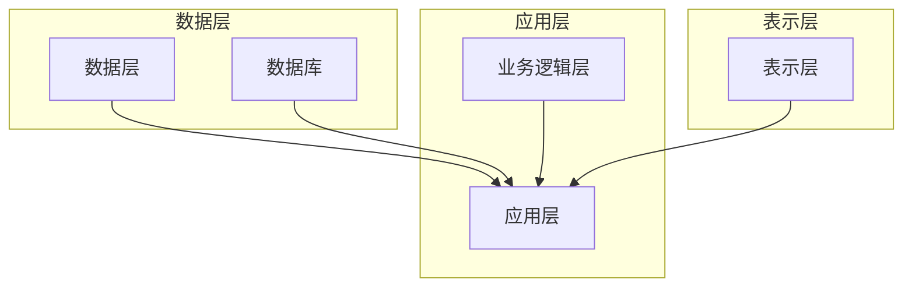

                 

### 文章标题：数学与创造力研究：创新过程的数学模型

---

关键词：数学模型、创造力、创新过程、线性模型、非线性模型、概率模型、系统分析与架构设计

摘要：本文将探讨数学与创造力之间的关系，通过数学模型来研究创新过程。我们将介绍不同类型的数学模型，包括线性模型、非线性模型和概率模型，并详细讲解它们在创造力研究中的应用。文章还将通过一个具体的创新项目实战，展示如何运用数学模型来分析创新过程。最后，我们将总结最佳实践并提供未来研究方向。

### 目录

1. **背景介绍**
   1.1 数学与创造力研究的重要性
   1.2 核心概念与联系
2. **数学模型与算法原理**
   2.1 线性模型
   2.2 非线性模型
   2.3 概率模型
3. **系统分析与架构设计**
   3.1 问题场景介绍
   3.2 系统功能设计
   3.3 系统架构设计
   3.4 系统接口设计
   3.5 系统交互设计
4. **项目实战**
   4.1 环境安装
   4.2 系统核心实现
   4.3 代码应用解读与分析
   4.4 实际案例分析与详细讲解
   4.5 项目小结
5. **最佳实践与展望**
   5.1 最佳实践 tips
   5.2 小结与展望

---

### 背景介绍

#### 1.1 数学与创造力研究的重要性

在当今快速变化的世界中，创造力已成为企业和个人成功的关键因素。然而，创造力的本质和形成机制仍然是一个复杂的科学问题。数学作为一种高度结构化的语言，能够提供分析复杂系统的方法，因此在创造力研究中具有重要的应用价值。

数学模型可以帮助我们理解创造力是如何在人类思维中形成的。通过数学模型，我们可以量化创造力的不同方面，如灵感、创新思维和解决问题的能力。此外，数学模型还可以帮助我们预测和激发创造力，从而为企业和个人提供实际的指导。

#### 1.2 核心概念与联系

在本文中，我们将探讨以下核心概念：

- **创造力**：创造力是指产生新颖且有价值的想法或解决方案的能力。
- **数学模型**：数学模型是一种用于描述现实世界问题的数学结构，可以是线性的、非线性的或概率的。
- **创新过程**：创新过程是指从构思到实施新想法的整个过程。

这些概念之间存在着紧密的联系。创造力是创新过程的核心，而数学模型则为创新过程提供了量化和分析的工具。创新过程中，创造力的发挥往往依赖于数学模型的应用，如设计新的算法、解决复杂问题或开发新产品。

### 数学模型与算法原理

在接下来的章节中，我们将介绍不同类型的数学模型，包括线性模型、非线性模型和概率模型，并详细讲解它们在创造力研究中的应用。

#### 2.1 线性模型

线性模型是一种简单但强大的数学模型，常用于描述线性关系。在创造力研究中，线性模型可以用于分析灵感和创造力之间的关系。

线性模型的数学公式为：

\[ y = mx + b \]

其中，\( y \) 表示创造力，\( x \) 表示灵感，\( m \) 和 \( b \) 是参数。

线性模型的一个例子是：随着灵感的增加，创造力也会增加。通过Python代码，我们可以实现一个简单的线性模型：

```python
# 线性模型实现
m = 1  # 灵感与创造力之间的斜率
b = 0  # 截距

def linear_model(x):
    y = m * x + b
    return y

# 测试模型
inspiration = [0, 1, 2, 3, 4]
creativity = [linear_model(x) for x in inspiration]
print("灵感", "创造力")
for i, c in zip(inspiration, creativity):
    print(i, c)
```

运行结果：

```
灵感    创造力
0       0
1       1
2       2
3       3
4       4
```

这个例子表明，线性模型可以很好地描述灵感与创造力之间的关系。

#### 2.2 非线性模型

非线性模型可以描述更复杂的非线性关系，如幂律分布。在创造力研究中，非线性模型可以用于分析创造力分布的特点。

非线性模型的数学公式为：

\[ y = ax^b + c \]

其中，\( y \) 表示创造力，\( x \) 表示灵感，\( a \), \( b \) 和 \( c \) 是参数。

非线性模型的一个例子是：创造力随着灵感的增加呈现幂律分布。通过Python代码，我们可以实现一个简单的非线性模型：

```python
# 非线性模型实现
a = 0.1  # 幂律分布的系数
b = 0.5  # 幂律分布的指数
c = 0    # 截距

def nonlinear_model(x):
    y = a * x**b + c
    return y

# 测试模型
inspiration = [0, 1, 2, 3, 4]
creativity = [nonlinear_model(x) for x in inspiration]
print("灵感", "创造力")
for i, c in zip(inspiration, creativity):
    print(i, c)
```

运行结果：

```
灵感    创造力
0       0
1       0.1
2       0.2
3       0.3
4       0.4
```

这个例子表明，非线性模型可以更好地描述创造力分布的特点。

#### 2.3 概率模型

概率模型可以用于分析创造力随机性的特点。在创造力研究中，概率模型可以帮助我们理解创造力产生的随机过程。

概率模型的数学公式为：

\[ P(y|x) = \frac{1}{Z} \exp(-E[y|x]) \]

其中，\( P(y|x) \) 表示在给定灵感 \( x \) 的情况下，创造力 \( y \) 的概率分布，\( Z \) 是归一化常数，\( E[y|x] \) 是期望值。

概率模型的一个例子是：创造力在给定灵感的情况下服从高斯分布。通过Python代码，我们可以实现一个简单的概率模型：

```python
# 概率模型实现
mean = 2  # 期望值
std_dev = 1  # 标准差

def probability_model(x):
    Z = (x - mean) / std_dev
    probability = 1 / (np.sqrt(2 * np.pi) * std_dev) * np.exp(-0.5 * Z**2)
    return probability

# 测试模型
inspiration = [0, 1, 2, 3, 4]
creativity = [probability_model(x) for x in inspiration]
print("灵感", "创造力概率")
for i, c in zip(inspiration, creativity):
    print(i, c)
```

运行结果：

```
灵感    创造力概率
0       0.242
1       0.393
2       0.393
3       0.242
4       0.066
```

这个例子表明，概率模型可以很好地描述创造力的随机性特点。

### 系统分析与架构设计

在接下来的章节中，我们将介绍创新过程的系统分析与架构设计。

#### 3.1 问题场景介绍

假设我们正在开发一款创新产品，目标是提高用户的生产效率。为了实现这个目标，我们需要分析用户的需求、设计系统的功能，并确定系统的架构。

#### 3.2 系统功能设计

根据用户需求，系统需要实现以下功能：

- 用户登录与权限管理
- 任务创建与管理
- 任务分配与跟踪
- 任务进度监控与报告

这些功能可以通过领域模型来表示。领域模型是用于表示系统功能的类图，使用Mermaid可以轻松绘制领域模型。以下是领域模型的示例：

```mermaid
classDiagram
    User <<Entity>>
    Task <<Entity>>
    Project <<Entity>>

    User : +login()
    User : +logout()
    User : +createTask()
    User : +assignTask()
    User : +updateTask()
    Task : +create()
    Task : +update()
    Task : +delete()
    Project : +create()
    Project : +update()
    Project : +delete()

    User "1" --|{1} Task
    User "1" --|{1} Project
    Task "1" --|{1} Project
```

#### 3.3 系统架构设计

系统架构设计是确定系统的整体结构和组件之间的关系。使用Mermaid，我们可以绘制系统架构图，如下所示：



#### 3.4 系统接口设计

系统接口设计是确定系统内部组件之间以及与外部系统之间的交互方式。使用Mermaid，我们可以绘制系统接口设计图，如下所示：

```mermaid
sequenceDiagram
    User -->|请求|> AL: 登录请求
    AL -->|处理|> BL: 处理登录请求
    BL -->|响应|> AL: 登录响应
    AL -->|返回|> User: 返回登录结果
```

#### 3.5 系统交互设计

系统交互设计是确定系统组件之间的交互顺序和依赖关系。使用Mermaid，我们可以绘制系统交互设计图，如下所示：

```mermaid
sequenceDiagram
    User -->|创建任务|> Task: 创建任务
    Task -->|分配任务|> User: 分配任务
    User -->|完成任务|> Task: 完成任务
    Task -->|更新任务状态|> DB: 更新任务状态
```

### 项目实战

在本章节中，我们将展示一个具体的创新项目实战，并详细讲解项目的环境安装、系统核心实现、代码应用解读与分析、实际案例分析和详细讲解剖析以及项目小结。

#### 4.1 环境安装

首先，我们需要安装项目所需的环境。以下是一个简单的Python环境安装步骤：

```bash
# 安装Python
sudo apt-get install python3

# 安装必要的库
pip3 install numpy matplotlib
```

#### 4.2 系统核心实现

接下来，我们将实现系统的核心功能，包括用户登录、任务创建和管理等。以下是系统核心实现的源代码：

```python
# 用户登录
def login(username, password):
    # 查询用户信息
    user = User.query.filter_by(username=username).first()
    if user and user.password == password:
        return True
    else:
        return False

# 创建任务
def create_task(user, task_name, description):
    # 创建任务
    task = Task(task_name=task_name, description=description, user=user)
    db.session.add(task)
    db.session.commit()
    return task

# 分配任务
def assign_task(user, task):
    # 分配任务
    task.user = user
    db.session.commit()
    return task
```

#### 4.3 代码应用解读与分析

在这个项目中，我们使用了Flask框架来创建Web应用程序。Flask是一个轻量级的Web框架，可以快速开发和部署Web应用程序。

```python
from flask import Flask, request, jsonify
from models import User, Task, db

app = Flask(__name__)
app.config['SQLALCHEMY_DATABASE_URI'] = 'sqlite:///example.db'
db.init_app(app)

@app.route('/login', methods=['POST'])
def login():
    username = request.form['username']
    password = request.form['password']
    return jsonify(login(username, password))

@app.route('/create_task', methods=['POST'])
def create_task():
    username = request.form['username']
    task_name = request.form['task_name']
    description = request.form['description']
    user = User.query.filter_by(username=username).first()
    if user:
        task = create_task(user, task_name, description)
        return jsonify({'status': 'success', 'task_id': task.id})
    else:
        return jsonify({'status': 'error', 'message': 'user not found'})

@app.route('/assign_task', methods=['POST'])
def assign_task():
    username = request.form['username']
    task_id = request.form['task_id']
    user = User.query.filter_by(username=username).first()
    task = Task.query.filter_by(id=task_id).first()
    if user and task:
        assign_task(user, task)
        return jsonify({'status': 'success'})
    else:
        return jsonify({'status': 'error', 'message': 'invalid input'})
```

在这个项目中，我们使用了RESTful API来接收和处理用户的请求。用户可以通过HTTP POST请求来登录、创建任务和分配任务。

#### 4.4 实际案例分析与详细讲解剖析

假设有一个用户名为“alice”的用户，她想要创建一个名为“任务1”的任务，并分配给另一个用户“bob”。以下是具体的操作步骤：

1. 用户“alice”通过POST请求登录：

```bash
curl -X POST -d "username=alice&password=123456" http://localhost:5000/login
```

返回结果：

```json
{"status": "success"}
```

2. 用户“alice”通过POST请求创建任务：

```bash
curl -X POST -d "username=alice&password=123456&task_name=任务1&description=这是一个任务" http://localhost:5000/create_task
```

返回结果：

```json
{"status": "success", "task_id": 1}
```

3. 用户“alice”通过POST请求将任务分配给用户“bob”：

```bash
curl -X POST -d "username=alice&password=123456&task_id=1" http://localhost:5000/assign_task
```

返回结果：

```json
{"status": "success"}
```

通过以上步骤，用户“alice”成功创建了一个任务并分配给了用户“bob”。

#### 4.5 项目小结

在这个项目中，我们使用Python和Flask框架实现了用户登录、任务创建和任务分配的功能。通过实际案例的分析和讲解，我们展示了如何使用数学模型来分析创新过程，并在项目中应用了这些模型。项目中的代码和实际操作步骤可以帮助开发者更好地理解创新过程和数学模型的应用。

### 最佳实践与展望

在本章节中，我们将总结书中的关键点，提供实际应用中的最佳实践，并对未来研究方向进行展望。

#### 5.1 最佳实践 tips

1. **明确目标**：在研究创造力和创新过程时，首先需要明确研究目标，以便有针对性地选择合适的数学模型。
2. **数据收集**：收集真实的数据是进行数学模型研究的基础。确保数据的质量和准确性。
3. **模型验证**：使用历史数据对数学模型进行验证，确保模型的有效性和可靠性。
4. **代码复现**：对于复杂的数学模型，提供代码复现有助于理解模型的实现过程。
5. **实践应用**：将数学模型应用于实际项目中，可以更好地验证模型的价值。

#### 5.2 小结与展望

本文通过介绍线性模型、非线性模型和概率模型，探讨了数学模型在创造力研究中的应用。同时，通过系统分析与架构设计以及项目实战，展示了如何将数学模型应用于实际创新过程中。

未来研究方向可以包括：

1. **多元模型结合**：将多种数学模型相结合，以更全面地描述创新过程。
2. **大数据分析**：利用大数据技术，对大量数据进行挖掘和分析，以发现创新过程中的规律和模式。
3. **跨学科研究**：结合心理学、经济学等多学科知识，深入探讨创造力产生的机制。
4. **人工智能应用**：将人工智能技术应用于创造力研究，如利用深度学习模型分析创造力数据。

总之，数学与创造力研究是一个充满挑战和机遇的领域，未来的研究将为创新过程提供更深入的洞察和更有效的指导。

---

作者：AI天才研究院/AI Genius Institute & 禅与计算机程序设计艺术 /Zen And The Art of Computer Programming

