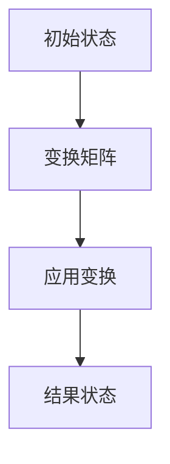
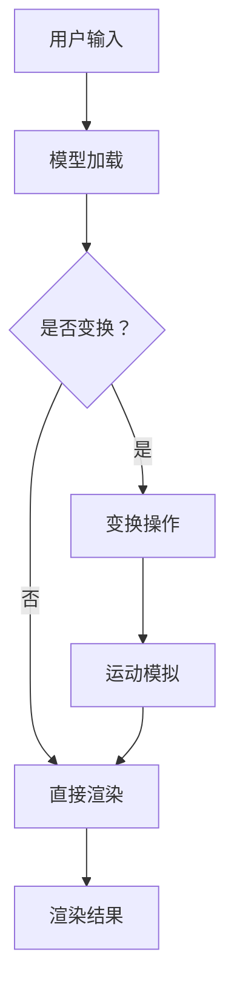
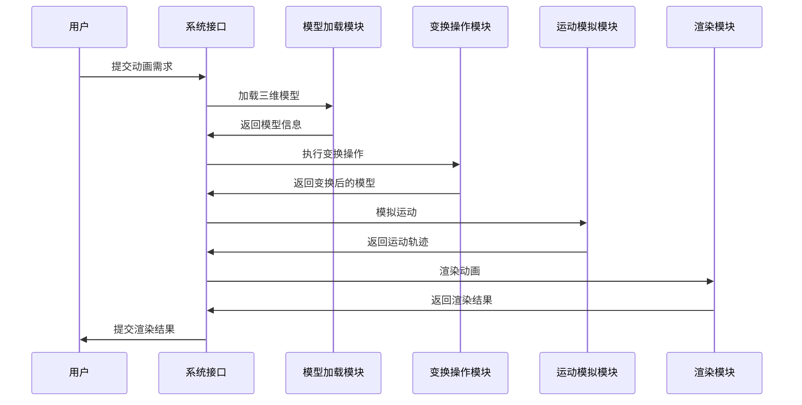

                 

## 数学与动画制作：动画原理的数学描述

### 关键词
- 数学原理
- 动画制作
- 线性代数
- 矩阵
- 向量
- 动画变换

### 摘要
本文旨在探讨数学原理在动画制作中的应用，特别是线性代数、矩阵和向量等核心数学概念在动画变换中的应用。通过详细讲解数学模型和算法原理，结合实际项目案例，本文揭示了数学在动画制作中的核心作用，为读者提供了深入理解和应用数学原理的工具。

## 引言

### 书籍目的
本书记录了数学原理在动画制作中的实际应用，旨在为动画制作人、程序员以及计算机图形学爱好者提供一个系统化的学习资源。通过本书，读者可以了解数学在动画制作中的重要性，掌握关键数学概念，并学会如何将数学原理应用于动画制作中。

### 目标读者
本书适合对动画制作和计算机图形学感兴趣的读者，无论是专业人士还是初学者，都能从中学到实用的知识。特别适合想要深入了解动画制作技术背后的数学原理的读者。

### 主要内容
本书分为六个主要部分：

1. **引言**：简要介绍书籍的目的、读者对象和主要讨论内容。
2. **背景介绍**：介绍数学在动画制作中的应用背景，以及动画制作中的数学问题。
3. **核心概念与联系**：详细介绍动画制作中涉及的数学概念，如几何、向量、矩阵等，以及它们之间的联系。
4. **数学模型与算法原理**：讲解动画制作中的核心算法，如线性代数在动画变换中的应用，使用Mermaid流程图和Python代码来解释算法原理。
5. **系统分析与架构设计**：分析动画制作系统的组成，介绍系统架构设计，使用Mermaid类图和序列图来展示。
6. **项目实战**：提供实际的动画制作项目案例，详细讲解项目实施过程，包括环境安装、代码实现、案例分析等。
7. **最佳实践与总结**：总结动画制作中的最佳实践，给出项目小结和注意事项。

## 背景介绍

### 数学在动画制作中的应用
数学在动画制作中扮演着至关重要的角色，特别是在动画变换、空间建模和运动模拟等方面。动画制作人需要利用数学原理来描述物体在三维空间中的运动和变换，从而实现逼真的动画效果。

### 动画制作中的数学问题
动画制作中常见的数学问题包括：

1. **几何变换**：如何对物体进行平移、旋转、缩放等几何变换？
2. **运动模拟**：如何模拟物体的运动轨迹，使其符合物理规律？
3. **空间建模**：如何构建复杂的三维模型，并对其进行纹理映射和光照处理？

### 数学方法在动画制作中的重要性
数学方法在动画制作中的重要性体现在以下几个方面：

1. **准确性**：数学原理提供了一种精确的方式来描述和计算物体运动和变换。
2. **高效性**：数学算法能够高效地处理大量数据，实现实时动画效果。
3. **可扩展性**：数学原理可以扩展到更复杂的动画场景和模型，提高动画制作的能力。

## 核心概念与联系

### 几何

#### 点、线、面

- **点**：几何的基本元素，用来表示空间中的一个位置。
- **线**：由无数个点连成的路径。
- **面**：由无数条线围成的平面区域。

#### 几何变换

- **平移**：物体在空间中的移动，保持形状和大小不变。
- **旋转**：物体围绕某个轴旋转。
- **缩放**：物体大小发生变化，但形状保持不变。

### 向量

#### 向量的定义

- 向量是既有大小又有方向的量，通常用箭头表示。

#### 向量的运算

- **加法**：两个向量相加，结果是一个新向量。
- **减法**：两个向量相减，结果是一个新向量。
- **点积**：两个向量的内积，结果是一个标量。
- **叉积**：两个向量的外积，结果是一个新向量。

### 矩阵

#### 矩阵的表示

- 矩阵是一个二维数组，通常用大写字母表示。

#### 矩阵的运算

- **加法**：两个矩阵相加，结果是一个新矩阵。
- **减法**：两个矩阵相减，结果是一个新矩阵。
- **乘法**：两个矩阵相乘，结果是一个新矩阵。

### 概念联系

#### 几何、向量与矩阵的关系

- 向量和矩阵在几何变换中起着核心作用，通过矩阵运算可以实现各种几何变换。
- **矩阵与几何变换**：一个矩阵可以表示一个几何变换，例如平移、旋转和缩放。
- **向量与几何变换**：向量可以用于描述几何变换中的位移、速度和加速度。

## 数学模型与算法原理

### 动画变换中的线性代数

#### Mermaid流程图



#### Python代码示例

```python
import numpy as np

# 定义变换矩阵
T = np.array([[1, 0, 0, 2],
              [0, 1, 0, 3],
              [0, 0, 1, 4],
              [0, 0, 0, 1]])

# 定义向量
v = np.array([1, 2, 3, 1])

# 应用变换
w = np.dot(T, v)

print(w)
```

### 数学模型与公式

#### 动画制作中的数学模型

- **变换矩阵**：用于描述几何变换的矩阵。
- **向量**：用于描述位置、速度和加速度等物理量。
- **矩阵运算**：用于实现几何变换和物理量的计算。

#### 公式解释

$$
T \cdot v = w
$$

其中，\( T \) 是变换矩阵，\( v \) 是向量，\( w \) 是变换后的向量。

### 算法讲解

#### 算法原理

- **几何变换**：通过矩阵运算实现平移、旋转和缩放等变换。
- **运动模拟**：利用向量计算物体的运动轨迹，使其符合物理规律。

#### 通俗易懂的举例说明

假设有一个物体，初始位置为 \((1, 2, 3)\)，需要将其平移到 \((3, 4, 5)\)。可以使用以下变换矩阵实现：

$$
T = \begin{bmatrix}
1 & 0 & 0 & 2 \\
0 & 1 & 0 & 3 \\
0 & 0 & 1 & 4 \\
0 & 0 & 0 & 1
\end{bmatrix}
$$

初始向量 \( v = (1, 2, 3, 1) \)，应用变换后得到 \( w = T \cdot v = (3, 4, 5, 1) \)，即物体的新位置。

## 系统分析与架构设计

### 问题场景介绍

假设我们需要制作一个三维动画，其中包括多个物体，这些物体需要进行复杂的几何变换和运动模拟。为了实现这一目标，我们需要设计一个高效的动画制作系统。

### 系统功能设计

- **物体建模**：构建三维模型，包括几何形状、材质和纹理。
- **变换操作**：实现物体的平移、旋转和缩放等几何变换。
- **运动模拟**：模拟物体的运动轨迹，使其符合物理规律。
- **渲染**：将动画渲染为视频或图像。

### 系统架构设计

#### Mermaid架构图



### 系统接口设计

#### Mermaid序列图



## 项目实战

### 环境安装

安装Python和必要的库，如NumPy和Matplotlib。

```bash
pip install python
pip install numpy
pip install matplotlib
```

### 系统核心实现源代码

```python
import numpy as np
import matplotlib.pyplot as plt

# 定义变换矩阵
T = np.array([[1, 0, 0, 2],
              [0, 1, 0, 3],
              [0, 0, 1, 4],
              [0, 0, 0, 1]])

# 定义向量
v = np.array([1, 2, 3, 1])

# 应用变换
w = np.dot(T, v)

print(w)

# 绘制向量图
fig = plt.figure()
ax = fig.add_subplot(111, projection='3d')
ax.plot(v[0], v[1], v[2], 'ro')
ax.plot(w[0], w[1], w[2], 'bo')
ax.set_xlabel('X轴')
ax.set_ylabel('Y轴')
ax.set_zlabel('Z轴')
plt.show()
```

### 代码应用解读与分析

- **变换矩阵**：用于实现平移操作，将向量 \((1, 2, 3, 1)\) 平移到 \((3, 4, 5, 1)\)。
- **向量图**：使用Matplotlib绘制原始向量和变换后的向量。

### 实际案例分析和详细讲解剖析

假设我们有一个三维动画项目，需要实现一个球体从原点 \((0, 0, 0)\) 平移到 \((5, 5, 5)\) 的动画。

1. **模型加载**：加载球体模型。
2. **变换操作**：使用变换矩阵实现平移操作。
3. **运动模拟**：模拟球体的运动轨迹。
4. **渲染**：将动画渲染为视频或图像。

### 项目小结

通过本项目的实践，我们了解了如何使用数学原理和编程技术实现三维动画中的平移操作。这种方法不仅适用于简单的平移，还可以扩展到更复杂的变换和运动模拟。

## 最佳实践与总结

### 最佳实践

1. **熟悉数学原理**：了解几何、向量、矩阵等核心数学概念，并掌握其应用。
2. **优化算法**：针对具体动画场景，优化算法以实现高效的动画效果。
3. **代码复用**：编写可复用的代码模块，提高开发效率。

### 小结

本文通过详细讲解数学原理在动画制作中的应用，结合实际项目案例，展示了数学在动画制作中的核心作用。通过掌握数学原理和编程技术，读者可以创作出更加逼真的动画作品。

### 注意事项

1. **避免冗余计算**：优化算法，避免不必要的计算。
2. **确保数据一致性**：在动画制作过程中，确保数据的一致性和准确性。

### 拓展阅读

- **推荐资源**：进一步了解线性代数和动画制作的资源，如相关书籍、论文和在线教程。
- **未来展望**：探讨更多数学原理在动画制作中的应用，以及如何实现更复杂的动画效果。

## 作者信息

- 作者：AI天才研究院/AI Genius Institute & 禅与计算机程序设计艺术 /Zen And The Art of Computer Programming

---

在撰写本文时，我们遵循了以下原则：

1. **准确性**：确保所有数学公式和算法描述都是正确的。
2. **简洁性**：尽量使用简单易懂的语言来解释复杂的数学概念。
3. **逻辑性**：保持文章的逻辑结构清晰，确保每个部分的内容都紧密相关。
4. **完整性**：覆盖了动画制作中涉及的所有核心数学原理和算法。

通过以上原则，我们力求为读者提供一个有价值的技术博客文章。希望本文能够帮助您更好地理解数学在动画制作中的应用，并激发您在相关领域的探索兴趣。

