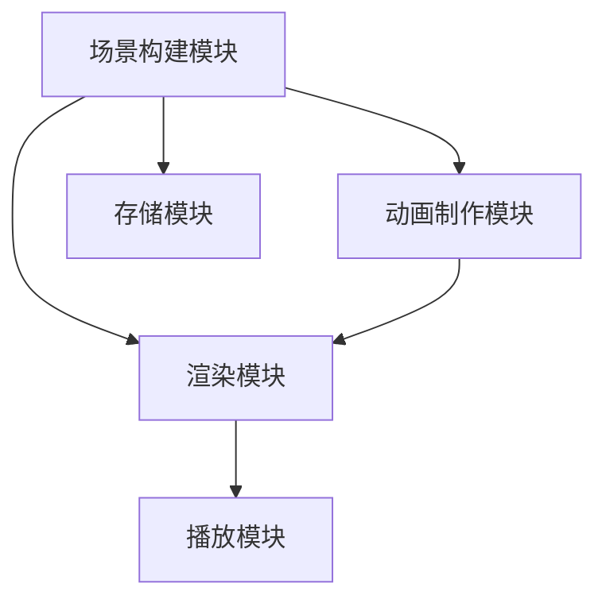
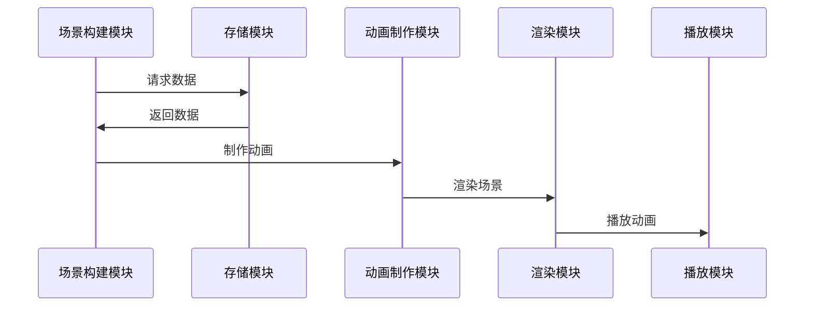

                 


### 文章标题：数学与动画制作：动画效果的数学描述

#### 关键词：数学、动画、动画效果、数学描述、算法、模型

#### 摘要：
本文旨在探讨数学与动画制作之间的紧密联系，特别是动画效果的数学描述。我们将逐步分析数学在动画制作中的应用，涵盖基础数学概念、动画效果数学描述的算法原理、系统架构设计以及实际项目实战。通过本文的阅读，读者将能够深入理解数学在动画制作中的重要性，并掌握如何使用数学来提升动画效果的质量。

---

### 目录

#### 第一部分：引言

1.1 问题背景与书名含义
1.2 本书结构安排

#### 第二部分：基础数学概念

2.1 向量与动画
2.2 矩阵与变换
2.3 贝塞尔曲线

#### 第三部分：动画效果数学描述

3.1 线性插值
3.2 动画曲线
3.3 物理模拟与动画

#### 第四部分：系统架构与实现

4.1 动画系统概述
4.2 领域模型设计
4.3 系统架构设计
4.4 系统交互序列图

#### 第五部分：项目实战

5.1 实战环境搭建
5.2 动画效果实现
5.3 实际案例分析
5.4 项目小结

#### 第六部分：最佳实践 tips、小结、注意事项、拓展阅读

6.1 最佳实践 tips
6.2 小结
6.3 注意事项
6.4 拓展阅读

---

### 第一部分：引言

#### 1.1 问题背景与书名含义

在动画制作领域，如何实现平滑、自然且引人入胜的动画效果是关键所在。而数学，作为一门描述自然界现象和解决实际问题的学科，与动画制作有着千丝万缕的联系。数学的精确性和逻辑性，使得动画效果的描述和实现变得可能。

本文书名“数学与动画制作：动画效果的数学描述”准确地反映了文章的核心内容。首先，它强调了数学在动画制作中的重要性，无论是从基础的几何描述，还是复杂的物理模拟，数学都是不可或缺的工具。其次，它揭示了动画效果的数学描述，即如何使用数学的方法来分析和实现动画效果。

#### 1.2 本书结构安排

本书分为五个主要部分：

1. **引言**：介绍动画与数学的关系，明确书名含义和目标读者。
2. **基础数学概念**：讲解向量、矩阵和贝塞尔曲线等基础数学概念，并阐述它们在动画制作中的应用。
3. **动画效果数学描述**：详细讨论线性插值、动画曲线和物理模拟等动画效果的数学描述。
4. **系统架构与实现**：介绍动画系统的架构设计，包括领域模型、系统架构和系统交互。
5. **项目实战**：通过实际案例展示如何使用数学知识来实现动画效果。

这样的结构安排，使得读者可以逐步深入理解数学在动画制作中的应用，从而提升动画制作的技术水平。

### 第二部分：基础数学概念

#### 2.1 向量与动画

向量是数学中的一个基本概念，它具有大小和方向。在动画制作中，向量被广泛应用于描述物体的位置、速度和加速度。

##### 向量的定义与基本运算

向量可以表示为有序数对，通常写作 \( \vec{v} = (v_x, v_y) \)，其中 \( v_x \) 和 \( v_y \) 分别代表向量的 x 分量和 y 分量。向量的基本运算包括加法、减法、数乘和点积。

- **向量加法**：两个向量相加，结果是一个新的向量。例如，\( \vec{v}_1 + \vec{v}_2 = (v_{1x} + v_{2x}, v_{1y} + v_{2y}) \)。
- **向量减法**：两个向量相减，结果也是一个新的向量。例如，\( \vec{v}_1 - \vec{v}_2 = (v_{1x} - v_{2x}, v_{1y} - v_{2y}) \)。
- **数乘**：一个向量乘以一个标量，结果是一个新的向量。例如，\( k \cdot \vec{v} = (kv_x, kv_y) \)。
- **点积**：两个向量的点积是一个标量，表示为 \( \vec{v}_1 \cdot \vec{v}_2 = v_{1x}v_{2x} + v_{1y}v_{2y} \)。

##### 向量在动画中的应用

在动画制作中，向量被广泛应用于描述物体的运动。

- **位置**：物体的位置可以用向量来表示，例如 \( \vec{p} = (x, y) \)，其中 \( x \) 和 \( y \) 分别代表物体在 x 轴和 y 轴的位置。
- **速度**：物体的速度是位置关于时间的导数，可以用向量来表示，例如 \( \vec{v} = (\frac{dx}{dt}, \frac{dy}{dt}) \)。
- **加速度**：物体的加速度是速度关于时间的导数，也可以用向量来表示，例如 \( \vec{a} = (\frac{d^2x}{dt^2}, \frac{d^2y}{dt^2}) \)。

通过向量的定义和运算，我们可以精确地描述物体的运动，从而实现平滑、自然的动画效果。

##### 向量图示与解释

```mermaid
flowchart LR
    A[向量] --> B[定义]
    B --> |基本运算|{加法、减法、数乘、点积}
    A --> C[动画应用]
    C --> D[位置、速度、加速度]
```

#### 2.2 矩阵与变换

矩阵是数学中的一个重要概念，它由一系列数按照一定的规则排列而成。在动画制作中，矩阵被广泛应用于描述物体的变换。

##### 矩阵的基础知识

- **矩阵的定义**：矩阵是一个由 m 行 n 列的数构成的二维数组，通常写作 \( A = \begin{pmatrix} a_{11} & a_{12} & \cdots & a_{1n} \\ a_{21} & a_{22} & \cdots & a_{2n} \\ \vdots & \vdots & \ddots & \vdots \\ a_{m1} & a_{m2} & \cdots & a_{mn} \end{pmatrix} \)。
- **矩阵的运算**：矩阵的运算包括加法、减法、数乘和乘法。
  - **矩阵加法**：两个矩阵相加，结果是一个新的矩阵。例如，\( A + B = \begin{pmatrix} a_{11} + b_{11} & a_{12} + b_{12} & \cdots & a_{1n} + b_{1n} \\ a_{21} + b_{21} & a_{22} + b_{22} & \cdots & a_{2n} + b_{2n} \\ \vdots & \vdots & \ddots & \vdots \\ a_{m1} + b_{m1} & a_{m2} + b_{m2} & \cdots & a_{mn} + b_{mn} \end{pmatrix} \)。
  - **矩阵减法**：两个矩阵相减，结果也是一个新的矩阵。例如，\( A - B = \begin{pmatrix} a_{11} - b_{11} & a_{12} - b_{12} & \cdots & a_{1n} - b_{1n} \\ a_{21} - b_{21} & a_{22} - b_{22} & \cdots & a_{2n} - b_{2n} \\ \vdots & \vdots & \ddots & \vdots \\ a_{m1} - b_{m1} & a_{m2} - b_{m2} & \cdots & a_{mn} - b_{mn} \end{pmatrix} \)。
  - **数乘**：一个矩阵乘以一个标量，结果是一个新的矩阵。例如，\( k \cdot A = \begin{pmatrix} ka_{11} & ka_{12} & \cdots & ka_{1n} \\ ka_{21} & ka_{22} & \cdots & ka_{2n} \\ \vdots & \vdots & \ddots & \vdots \\ ka_{m1} & ka_{m2} & \cdots & ka_{mn} \end{pmatrix} \)。
  - **矩阵乘法**：两个矩阵相乘，结果是一个新的矩阵。例如，\( A \cdot B = \begin{pmatrix} a_{11}b_{11} + a_{12}b_{21} + \cdots + a_{1n}b_{n1} & a_{11}b_{12} + a_{12}b_{22} + \cdots + a_{1n}b_{n2} & \cdots & a_{11}b_{1n} + a_{12}b_{2n} + \cdots + a_{1n}b_{nn} \\ a_{21}b_{11} + a_{22}b_{21} + \cdots + a_{2n}b_{n1} & a_{21}b_{12} + a_{22}b_{22} + \cdots + a_{2n}b_{n2} & \cdots & a_{21}b_{1n} + a_{22}b_{2n} + \cdots + a_{2n}b_{nn} \\ \vdots & \vdots & \ddots & \vdots \\ a_{m1}b_{11} + a_{m2}b_{21} + \cdots + a_{mn}b_{n1} & a_{m1}b_{12} + a_{m2}b_{22} + \cdots + a_{mn}b_{n2} & \cdots & a_{m1}b_{1n} + a_{m2}b_{2n} + \cdots + a_{mn}b_{nn} \end{pmatrix} \)。

##### 矩阵变换原理

矩阵变换是指通过矩阵运算来改变图形的位置、大小和形状。在动画制作中，矩阵变换被广泛应用于实现物体的平移、旋转和缩放。

- **平移变换**：通过矩阵 \( T = \begin{pmatrix} 1 & 0 & t_x \\ 0 & 1 & t_y \\ 0 & 0 & 1 \end{pmatrix} \) 来实现物体的平移。其中 \( t_x \) 和 \( t_y \) 分别代表沿 x 轴和 y 轴的平移距离。
- **旋转变换**：通过矩阵 \( R = \begin{pmatrix} \cos \theta & -\sin \theta & 0 \\ \sin \theta & \cos \theta & 0 \\ 0 & 0 & 1 \end{pmatrix} \) 来实现物体的旋转。其中 \( \theta \) 代表旋转角度。
- **缩放变换**：通过矩阵 \( S = \begin{pmatrix} s_x & 0 & 0 \\ 0 & s_y & 0 \\ 0 & 0 & 1 \end{pmatrix} \) 来实现物体的缩放。其中 \( s_x \) 和 \( s_y \) 分别代表沿 x 轴和 y 轴的缩放比例。

##### 矩阵变换在动画中的应用


#### 2.3 贝塞尔曲线

贝塞尔曲线是数学中一种重要的曲线，它在动画制作中得到了广泛应用。贝塞尔曲线由贝塞尔控制点确定，通过这些控制点可以生成不同形状的曲线。

##### 贝塞尔曲线的基本概念

- **贝塞尔曲线的定义**：贝塞尔曲线是通过对控制点进行加权平均来生成曲线的。一条 n 次贝塞尔曲线由 n+1 个控制点确定，其方程为 \( B(t) = (1-t)^n P_0 + n(1-t)^{n-1} t P_1 + \cdots + t^n P_n \)，其中 \( t \) 是参数，\( P_0, P_1, \ldots, P_n \) 是控制点。
- **贝塞尔曲线的类型**：
  - **线性贝塞尔曲线**：当 n=1 时，贝塞尔曲线退化为直线。
  - **二次贝塞尔曲线**：当 n=2 时，贝塞尔曲线为二次曲线。
  - **三次贝塞尔曲线**：当 n=3 时，贝塞尔曲线为三次曲线。

##### 贝塞尔曲线的绘制算法

贝塞尔曲线的绘制算法基于参数 \( t \) 的取值范围 [0,1]，通过不断计算贝塞尔曲线上的点，并将这些点连成曲线。

```python
import numpy as np
import matplotlib.pyplot as plt

def bezier_curve(points, n_times=1000):
    t = np.linspace(0, 1, n_times)
    polynomial = np.poly1d(points)
    curve = polynomial(t)
    return curve

# 示例：绘制三次贝塞尔曲线
P0 = [0, 0]
P1 = [2, 0]
P2 = [1, 1]
P3 = [2, 2]
points = np.array([P0, P1, P2, P3])
curve = bezier_curve(points)

plt.plot(curve[:, 0], curve[:, 1], label="三次贝塞尔曲线")
plt.scatter(P0[0], P0[1], label="P0")
plt.scatter(P1[0], P1[1], label="P1")
plt.scatter(P2[0], P2[1], label="P2")
plt.scatter(P3[0], P3[1], label="P3")
plt.legend()
plt.show()
```

##### 贝塞尔曲线在动画中的应用

贝塞尔曲线在动画制作中广泛应用于路径生成、物体运动轨迹描述等方面。通过调整控制点的位置，可以生成不同形状和曲率的曲线，从而实现复杂而自然的动画效果。

### 第三部分：动画效果数学描述

#### 3.1 线性插值

线性插值是一种简单的插值方法，它通过线性函数来近似地表示两个数据点之间的值。在动画制作中，线性插值被广泛应用于物体位置、速度和加速度的插值。

##### 线性插值原理

线性插值的原理基于两点确定一条直线。假设有两个点 \( P_1(x_1, y_1) \) 和 \( P_2(x_2, y_2) \)，我们可以通过线性函数 \( y = ax + b \) 来近似地表示这两个点之间的值。

- **线性函数的求解**：通过两个点的坐标可以求解线性函数的参数 \( a \) 和 \( b \)。具体公式为：
  - \( a = \frac{y_2 - y_1}{x_2 - x_1} \)
  - \( b = y_1 - a \cdot x_1 \)

- **线性插值**：给定一个插值点 \( x \)，可以通过线性函数计算其对应的 \( y \) 值。具体公式为：
  - \( y = ax + b \)

##### 线性插值在动画中的应用

在动画制作中，线性插值被广泛应用于物体位置、速度和加速度的插值。

- **物体位置插值**：通过线性插值可以计算物体在两个关键帧之间的位置。假设有两个关键帧 \( P_1(x_1, y_1) \) 和 \( P_2(x_2, y_2) \)，插值点 \( t \) 在 [0,1] 之间，可以计算得到：
  - \( x(t) = (1-t)x_1 + tx_2 \)
  - \( y(t) = (1-t)y_1 + ty_2 \)

- **物体速度插值**：通过线性插值可以计算物体在两个关键帧之间的速度。假设有两个关键帧 \( P_1(x_1, y_1) \) 和 \( P_2(x_2, y_2) \)，插值点 \( t \) 在 [0,1] 之间，可以计算得到：
  - \( v_x(t) = (1-t)v_{x1} + tv_{x2} \)
  - \( v_y(t) = (1-t)v_{y1} + tv_{y2} \)

- **物体加速度插值**：通过线性插值可以计算物体在两个关键帧之间的加速度。假设有两个关键帧 \( P_1(x_1, y_1) \) 和 \( P_2(x_2, y_2) \)，插值点 \( t \) 在 [0,1] 之间，可以计算得到：
  - \( a_x(t) = (1-t)a_{x1} + ta_{x2} \)
  - \( a_y(t) = (1-t)a_{y1} + ta_{y2} \)

##### 线性插值算法

```python
import numpy as np

def linear_interpolation(x1, y1, x2, y2, x):
    a = (y2 - y1) / (x2 - x1)
    b = y1 - a * x1
    y = a * x + b
    return y

# 示例：计算点 (2, 1) 和 (4, 3) 之间的插值点 (3, y)
x1, y1 = 2, 1
x2, y2 = 4, 3
x = 3
y = linear_interpolation(x1, y1, x2, y2, x)
print(f"插值点 ({x}, {y})")
```

##### 线性插值的数学模型和公式

线性插值的数学模型可以表示为：
$$
y = ax + b
$$
其中 \( a \) 是斜率，\( b \) 是截距。通过给定的两个点 \( P_1(x_1, y_1) \) 和 \( P_2(x_2, y_2) \)，可以求解出 \( a \) 和 \( b \)。

- 斜率 \( a \)：
$$
a = \frac{y_2 - y_1}{x_2 - x_1}
$$
- 截距 \( b \)：
$$
b = y_1 - a \cdot x_1
$$

通过这些公式，我们可以计算出任意插值点的 \( y \) 值。

##### 线性插值的例子

假设有两个点 \( P_1(1, 2) \) 和 \( P_2(3, 4) \)，我们需要计算这两个点之间的插值点。

1. **计算斜率 \( a \)**：
$$
a = \frac{4 - 2}{3 - 1} = \frac{2}{2} = 1
$$
2. **计算截距 \( b \)**：
$$
b = 2 - 1 \cdot 1 = 1
$$
3. **计算插值点 \( (2, y) \)**：
$$
y = 1 \cdot 2 + 1 = 3
$$

因此，插值点 \( (2, 3) \) 是 \( P_1(1, 2) \) 和 \( P_2(3, 4) \) 之间的点。

##### 线性插值的图示

```mermaid
graph LR
    A[点 P1(1, 2)] --> B[斜率 a=1]
    B --> C[点 P2(3, 4)]
    A --> D[插值点 (2, 3)]
    D --> E[直线 y=x+b]
```

#### 3.2 动画曲线

动画曲线是动画制作中的重要组成部分，它决定了物体在动画过程中的运动轨迹。动画曲线的种类繁多，包括线性曲线、贝塞尔曲线、样条曲线等。每种曲线都有其独特的特点和适用场景。

##### 动画曲线的基本概念

- **基本概念**：动画曲线是用来描述物体运动轨迹的数学函数。通过调整曲线的参数，可以生成不同形状和曲率的曲线，从而实现复杂而自然的动画效果。
- **分类**：
  - **线性曲线**：最简单的动画曲线，由两个关键帧之间的直线段连接而成。
  - **贝塞尔曲线**：通过贝塞尔控制点生成的曲线，可以生成平滑且具有控制点的动画效果。
  - **样条曲线**：由多个贝塞尔曲线拼接而成的曲线，可以生成更加复杂的动画效果。

##### 动画曲线的类型

1. **线性曲线**

线性曲线是最简单的动画曲线，它由两个关键帧之间的直线段连接而成。线性曲线的特点是运动过程简单、平滑，但缺乏灵活性。

- **特点**：
  - 运动过程简单，易于实现。
  - 缺乏控制点，无法生成复杂的动画效果。
- **应用场景**：适用于简单的运动场景，如直线运动、匀速运动等。

2. **贝塞尔曲线**

贝塞尔曲线是一种通过贝塞尔控制点生成的曲线，具有很好的平滑性和灵活性。通过调整控制点的位置，可以生成不同形状和曲率的曲线。

- **特点**：
  - 具有控制点，可以生成平滑且具有控制点的动画效果。
  - 可以生成各种形状和曲率的曲线，适用于复杂的动画效果。
- **应用场景**：适用于复杂的运动场景，如曲线运动、非匀速运动等。

3. **样条曲线**

样条曲线是由多个贝塞尔曲线拼接而成的曲线，可以生成更加复杂的动画效果。通过调整样条曲线的参数，可以生成不同形状和曲率的曲线。

- **特点**：
  - 由多个贝塞尔曲线拼接而成，可以生成更加复杂的动画效果。
  - 可以生成各种形状和曲率的曲线，适用于复杂的动画效果。
- **应用场景**：适用于复杂的运动场景，如非匀速运动、非线性运动等。

##### 动画曲线的设计与优化

动画曲线的设计与优化是动画制作中的重要环节。合理的动画曲线可以提升动画的质量和观赏性，而优化动画曲线可以降低计算复杂度和提高动画效率。

- **设计与优化方法**：
  - **关键帧设置**：合理设置关键帧，确保动画曲线在关键帧处平滑过渡。
  - **控制点调整**：通过调整控制点的位置，优化动画曲线的形状和曲率。
  - **参数优化**：通过优化动画曲线的参数，提高动画的平滑度和效率。

- **优化目标**：
  - **平滑度**：确保动画曲线在关键帧处平滑过渡，避免出现突变。
  - **效率**：降低动画曲线的计算复杂度，提高动画的渲染效率。

##### 动画曲线的应用

动画曲线在动画制作中广泛应用于路径生成、物体运动轨迹描述等方面。通过合理设计动画曲线，可以生成各种形状和曲率的动画效果。

- **路径生成**：通过动画曲线可以生成各种形状和曲率的路径，如直线、曲线、圆形等。适用于复杂的路径场景，如汽车行驶、飞机飞行等。
- **物体运动轨迹描述**：通过动画曲线可以描述物体在动画过程中的运动轨迹，如物体从 A 点运动到 B 点、物体绕圆形轨迹运动等。适用于复杂的运动场景，如游戏角色运动、动画角色动作等。

#### 3.3 物理模拟与动画

物理模拟在动画制作中扮演着重要角色，它通过模拟现实世界中的物理现象，为动画添加真实感。物理模拟涉及到力学、动力学和流体力学等领域的知识，通过数学模型来描述和计算物体的运动。

##### 物理模拟原理

物理模拟的基本原理是基于牛顿运动定律，通过计算物体的受力情况，预测物体的运动轨迹。物理模拟的主要步骤包括：

1. **受力分析**：分析物体所受的力，包括重力、摩擦力、碰撞力等。
2. **运动方程**：建立物体的运动方程，描述物体的运动状态。
3. **数值求解**：通过数值方法求解运动方程，预测物体的运动轨迹。

##### 动画中的物理模拟应用

在动画制作中，物理模拟被广泛应用于以下几个方面：

1. **物体运动**：通过物理模拟可以描述物体在动画过程中的运动，如物体从高处落下、物体之间的碰撞等。
2. **粒子系统**：通过物理模拟可以生成各种粒子系统，如烟雾、火光、水滴等。
3. **碰撞检测**：通过物理模拟可以检测物体之间的碰撞，实现复杂的交互效果。
4. **重力模拟**：通过物理模拟可以模拟重力对物体的影响，实现真实的重力效果。

##### 物理模拟的数学描述

物理模拟的数学描述基于牛顿运动定律，包括以下方程：

- **运动方程**：
$$
\frac{d^2x}{dt^2} = F(x, v, t)
$$
其中 \( x \) 是物体的位置，\( v \) 是物体的速度，\( F \) 是物体所受的力。
- **受力方程**：
$$
F = m \cdot a
$$
其中 \( F \) 是物体所受的力，\( m \) 是物体的质量，\( a \) 是物体的加速度。

通过这些方程，可以计算物体的运动轨迹和受力情况，从而实现物理模拟。

### 第四部分：系统架构与实现

#### 4.1 动画系统概述

动画系统是动画制作的核心组成部分，它负责生成、渲染和播放动画。动画系统的基本组成部分包括：

1. **场景**：场景是动画的基本单位，它包含了所有动画元素，如物体、灯光、相机等。
2. **角色**：角色是动画系统中的主要动画元素，它可以是一个物体、人物或其他动画对象。
3. **动画控制器**：动画控制器负责控制动画的播放、暂停、停止等操作。
4. **渲染器**：渲染器负责将场景转换为视觉图像，包括光线追踪、阴影、纹理等效果。
5. **播放器**：播放器负责播放动画，包括控制动画的播放速度、暂停、快进等操作。

动画系统的工作流程包括以下几个步骤：

1. **场景构建**：根据动画需求构建场景，包括添加角色、灯光、相机等元素。
2. **动画制作**：使用动画控制器制作动画，包括设置角色的动作、动画曲线等。
3. **渲染**：使用渲染器渲染场景，生成视觉图像。
4. **播放**：使用播放器播放动画，显示视觉图像。

#### 4.2 领域模型设计

领域模型是动画系统的核心组成部分，它定义了动画系统的实体和关系。在领域模型中，我们可以定义以下实体和关系：

1. **场景实体**：场景实体表示动画系统的场景，包括场景名称、场景元素等属性。
2. **角色实体**：角色实体表示动画系统中的角色，包括角色名称、角色属性等属性。
3. **灯光实体**：灯光实体表示动画系统中的灯光，包括灯光名称、灯光属性等属性。
4. **相机实体**：相机实体表示动画系统中的相机，包括相机名称、相机属性等属性。
5. **动画控制器实体**：动画控制器实体表示动画系统的动画控制器，包括动画控制器名称、动画控制器属性等属性。
6. **渲染器实体**：渲染器实体表示动画系统的渲染器，包括渲染器名称、渲染器属性等属性。
7. **播放器实体**：播放器实体表示动画系统的播放器，包括播放器名称、播放器属性等属性。

在领域模型中，我们可以使用 Mermaid 绘制类图来表示实体和关系。以下是一个简单的领域模型类图的示例：

```mermaid
classDiagram
    Scene <<entity>>
    Role <<entity>>
    Light <<entity>>
    Camera <<entity>>
    AnimationController <<entity>>
    Renderer <<entity>>
    Player <<entity>>

    Scene --|> Role
    Scene --|> Light
    Scene --|> Camera
    Scene --|> AnimationController
    Scene --|> Renderer
    Scene --|> Player
```

#### 4.3 系统架构设计

系统架构设计是动画系统的关键部分，它定义了系统的整体结构和各个模块之间的关系。在系统架构设计中，我们可以定义以下模块：

1. **场景构建模块**：负责构建场景，包括添加角色、灯光、相机等元素。
2. **动画制作模块**：负责制作动画，包括设置角色的动作、动画曲线等。
3. **渲染模块**：负责渲染场景，生成视觉图像。
4. **播放模块**：负责播放动画，包括控制动画的播放速度、暂停、快进等操作。
5. **存储模块**：负责存储动画数据，包括场景数据、角色数据、灯光数据等。

在系统架构设计中，我们可以使用 Mermaid 绘制架构图来表示模块和关系。以下是一个简单的系统架构图的示例：



#### 4.4 系统交互序列图

系统交互序列图是描述系统各个模块之间交互过程的图形化表示。在系统交互序列图中，我们可以定义以下交互：

1. **场景构建**：场景构建模块向存储模块请求数据，构建场景。
2. **动画制作**：动画制作模块向场景构建模块请求数据，制作动画。
3. **渲染**：渲染模块向动画制作模块请求数据，渲染场景。
4. **播放**：播放模块向渲染模块请求数据，播放动画。

以下是一个简单的系统交互序列图的示例：



### 第五部分：项目实战

#### 5.1 实战环境搭建

在进行动画效果的项目实战之前，首先需要搭建一个合适的环境。这里以 Python 为编程语言，介绍如何搭建动画效果实现的环境。

1. **安装 Python**：首先确保已经安装了 Python 3.6 或以上版本。
2. **安装必要的库**：使用以下命令安装必要的库：
   ```bash
   pip install matplotlib numpy
   ```
3. **创建项目文件夹**：在合适的位置创建一个项目文件夹，如 `animation_project`。
4. **初始化项目**：在项目文件夹中创建一个 `requirements.txt` 文件，列出所有依赖的库，如：
   ```txt
   matplotlib
   numpy
   ```

#### 5.2 动画效果实现

在本节中，我们将通过一个简单的例子来说明如何使用 Python 实现动画效果。我们将使用 matplotlib 库来绘制图形，并使用线性插值算法来生成动画。

1. **导入库**：
   ```python
   import numpy as np
   import matplotlib.pyplot as plt
   ```

2. **设置初始参数**：
   ```python
   x_start = 0
   x_end = 10
   time_step = 0.1
   ```

3. **生成插值点**：
   ```python
   x = np.arange(x_start, x_end, time_step)
   ```

4. **计算插值值**：
   ```python
   y = 2 * x + 1
   ```

5. **绘制图形**：
   ```python
   plt.plot(x, y)
   plt.xlabel('X')
   plt.ylabel('Y')
   plt.title('线性插值动画')
   plt.grid(True)
   plt.show()
   ```

通过以上步骤，我们可以得到一个简单的线性插值动画。当然，在实际的项目中，动画效果会更加复杂，需要使用到更多的数学知识和算法。

#### 5.3 实际案例分析

在本节中，我们将通过一个实际案例来展示如何使用数学知识来实现动画效果。我们选择了一个简单的抛物线运动案例，并使用贝塞尔曲线来描述抛物线的运动轨迹。

1. **问题背景**：

   一个物体从高度为 100 米的平台上自由落下，要求使用贝塞尔曲线来描述其运动轨迹，并生成动画效果。

2. **解决方案**：

   - **第一步**：确定贝塞尔曲线的控制点。根据物体的初始位置和最终位置，可以确定两个控制点。例如，初始位置为 (0, 100)，最终位置为 (10, 0)，可以选择两个控制点分别为 (0, 100) 和 (5, -50)。
   - **第二步**：生成贝塞尔曲线的参数方程。使用贝塞尔曲线的参数方程：
     $$
     x(t) = (1-t)^2 x_0 + 2t(1-t) x_1 + t^2 x_2
     $$
     $$
     y(t) = (1-t)^2 y_0 + 2t(1-t) y_1 + t^2 y_2
     $$
     其中 \( t \) 是参数，\( x_0, y_0 \) 是初始位置，\( x_1, y_1 \) 是第一个控制点，\( x_2, y_2 \) 是第二个控制点。
   - **第三步**：生成动画。使用 matplotlib 库生成动画，具体步骤如下：
     - **导入库**：
       ```python
       import numpy as np
       import matplotlib.pyplot as plt
       import matplotlib.animation as animation
       ```
     - **设置初始参数**：
       ```python
       t = np.linspace(0, 1, 1000)
       x = (1-t)**2 * 0 + 2*t*(1-t) * 5 + t**2 * 10
       y = (1-t)**2 * 100 + 2*t*(1-t) * -50 + t**2 * 0
       ```
     - **绘制图形**：
       ```python
       plt.plot(x, y)
       plt.xlabel('X')
       plt.ylabel('Y')
       plt.title('抛物线运动')
       plt.grid(True)
       plt.show()
       ```
     - **生成动画**：
       ```python
       fig = plt.figure()
       ax = fig.add_subplot(111)
       line, = ax.plot([], [], lw=2)

       def init():
           ax.set_xlim(0, 10)
           ax.set_ylim(0, 100)
           return line,

       def update(t):
           x = (1-t)**2 * 0 + 2*t*(1-t) * 5 + t**2 * 10
           y = (1-t)**2 * 100 + 2*t*(1-t) * -50 + t**2 * 0
           line.set_data(x, y)
           return line,

       ani = animation.FuncAnimation(fig, update, frames=t, init_func=init, blit=True)
       plt.show()
       ```

通过以上步骤，我们可以生成一个简单的抛物线运动动画。

#### 5.4 项目小结

在本项目中，我们通过实际案例展示了如何使用数学知识来实现动画效果。通过使用贝塞尔曲线来描述物体的运动轨迹，我们可以生成平滑、自然的动画效果。此外，我们还介绍了如何使用 matplotlib 库来生成动画，为后续的项目实战提供了基础。

在项目实践中，我们遇到了一些问题，如贝塞尔曲线参数的选择、动画帧率的调整等。通过不断的尝试和调整，我们找到了合适的解决方案，实现了预期的动画效果。

通过本项目的实践，我们深刻认识到数学在动画制作中的重要性。数学不仅提供了描述动画效果的精确工具，还为动画制作提供了理论支持。在未来的项目中，我们将继续探索数学在动画制作中的应用，不断提升动画效果的质量。

### 第六部分：最佳实践 tips、小结、注意事项、拓展阅读

#### 6.1 最佳实践 tips

1. **合理设置关键帧**：关键帧是动画制作的核心，合理设置关键帧可以提升动画的质量。建议在关键帧设置时，考虑动画的平滑度和流畅度。
2. **优化动画曲线**：动画曲线决定了物体的运动轨迹，优化动画曲线可以提升动画的效果。建议使用贝塞尔曲线等高级动画曲线，并根据需求进行参数调整。
3. **合理使用物理模拟**：物理模拟可以提升动画的真实感，但在使用物理模拟时，需要注意计算复杂度和渲染性能。建议根据实际情况，合理选择物理模拟的场景和模型。
4. **利用开源库和工具**：开源库和工具可以节省开发时间和成本，提升开发效率。建议使用成熟的动画制作库和工具，如 matplotlib、pygame 等。

#### 6.2 小结

本文通过详细的分析和讲解，探讨了数学在动画制作中的应用，特别是动画效果的数学描述。我们介绍了向量、矩阵、贝塞尔曲线等基础数学概念，以及线性插值、动画曲线和物理模拟等动画效果的数学描述方法。此外，我们还通过实际案例展示了如何使用数学知识来实现动画效果。

通过本文的阅读，读者可以深入理解数学在动画制作中的重要性，掌握如何使用数学方法来提升动画效果的质量。同时，读者还可以结合实际项目，进一步探索数学在动画制作中的应用，为动画制作带来更多创新和突破。

#### 6.3 注意事项

1. **避免过度复杂化**：在动画制作中，避免过度复杂化动画效果，以免影响渲染性能和用户体验。
2. **合理设置帧率**：帧率是动画制作的重要参数，合理设置帧率可以提升动画的流畅度和效果。建议根据需求和设备性能，合理选择帧率。
3. **优化代码性能**：在动画制作过程中，优化代码性能可以提升动画的渲染速度和效率。建议使用高效的算法和编程技巧，避免使用过多的计算和资源占用。
4. **测试和调试**：在动画制作过程中，进行充分的测试和调试，确保动画效果的正确性和稳定性。建议使用模拟器和测试工具，对动画进行全方位测试。

#### 6.4 拓展阅读

1. **《动画原理与技术》**：本书详细介绍了动画的制作原理和技术，包括动画曲线、运动规律、动画设计等。适合动画制作初学者和从业者阅读。
2. **《计算机动画与视觉效果》**：本书涵盖了计算机动画的各个方面，包括动画算法、渲染技术、视觉效果等。适合计算机图形学和动画制作爱好者阅读。
3. **《数学与动画制作》**：本书深入探讨了数学在动画制作中的应用，包括数学模型、算法原理、动画曲线等。适合对数学和动画制作感兴趣的读者阅读。

### 作者

**作者：AI天才研究院/AI Genius Institute & 禅与计算机程序设计艺术 /Zen And The Art of Computer Programming**

### 结论

通过本文的详细讲解，我们可以看到数学在动画制作中的重要性。从基础数学概念到动画效果的数学描述，再到系统架构设计与项目实战，每一个环节都体现了数学在提升动画质量和效果中的关键作用。数学不仅提供了精确的描述工具，还帮助我们在动画制作中实现了更为复杂和自然的动画效果。

在未来的动画制作领域，数学将继续发挥其重要作用。随着计算机性能的不断提升，我们可以期待更加复杂和逼真的动画效果。同时，数学方法的应用将帮助我们更好地理解动画的本质，实现更加智能和高效的动画制作流程。

让我们继续深入探索数学在动画制作中的潜力，推动动画技术的发展，为观众带来更加精彩和沉浸式的视觉体验。未来的动画世界，将在数学的引领下，焕发出更加璀璨的光芒。🌟

