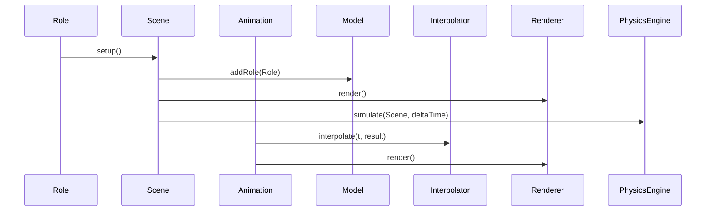
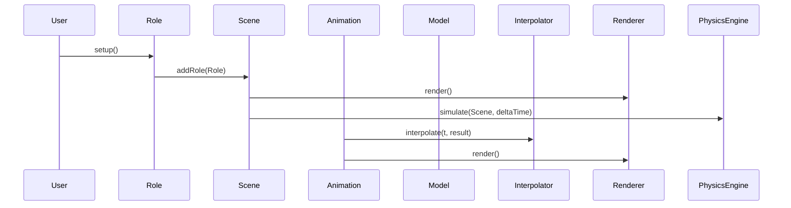

                 


# 《数学与动画：运动模拟的数学模型》

## 关键词
数学模型、动画制作、运动模拟、算法原理、系统架构、项目实战

## 摘要
本文旨在探讨数学模型在动画制作中的应用，特别是在运动模拟领域的表现。通过深入分析数学模型与动画原理的结合，本文将详细介绍运动学方程、微分方程等数学工具在动画中的应用，并结合Python代码实例展示算法原理。此外，文章还将讨论动画系统的架构设计，并通过项目实战解析其实际应用。最终，本文将为读者提供最佳实践技巧和拓展阅读建议，以促进对这一领域的深入理解。

## 目录大纲

### 第1章 引言
- 1.1 数学与动画结合的背景
- 1.2 数学与动画结合的意义
- 1.3 本书结构安排

### 第2章 数学模型基础
- 2.1 数学模型概述
- 2.2 运动学基础
  - 2.2.1 速度与加速度
  - 2.2.2 运动学方程
- 2.3 微分方程基础
  - 2.3.1 微分方程的类型
  - 2.3.2 解微分方程的方法

### 第3章 动画制作原理
- 3.1 动画基础
- 3.2 关键帧动画
- 3.3 贝塞尔曲线

### 第4章 数学模型与动画结合
- 4.1 运动模拟基本原理
- 4.2 数学模型在动画中的应用
  - 4.2.1 速度曲线
  - 4.2.2 加速度曲线
- 4.3 动画生成算法
  - 4.3.1 粒子系统算法

### 第5章 动画系统架构设计
- 5.1 动画系统工作原理
- 5.2 系统架构设计
  - 5.2.1 领域模型类图
  - 5.2.2 系统架构图
  - 5.2.3 系统接口设计
  - 5.2.4 系统交互序列图

### 第6章 项目实战
- 6.1 环境安装与配置
- 6.2 动画系统的核心实现
- 6.3 代码解读与分析
- 6.4 实际案例分析

### 第7章 最佳实践与拓展
- 7.1 最佳实践技巧
- 7.2 小结、注意事项
- 7.3 拓展阅读

## 第1章 引言

### 1.1 数学与动画结合的背景

数学与动画的结合可以追溯到早期计算机技术的出现。随着计算机图形学的发展，数学模型逐渐成为动画制作的重要工具。在早期的动画制作中，如Flash和手绘动画，数学模型的应用相对有限。然而，随着计算能力的提升和图形处理技术的进步，数学模型在动画制作中的应用越来越广泛。

从20世纪80年代开始，计算机生成动画（CGI）开始兴起。这种动画形式依赖于复杂的数学模型来模拟物体的运动、光线和阴影。早期的CGI动画，如《玩具总动员》（1995年），就是基于运动学方程和线性代数的数学模型来实现的。这些模型能够准确地模拟物体在空间中的运动，从而创造出逼真的动画效果。

### 1.2 数学与动画结合的意义

数学与动画的结合具有深远的意义。首先，数学模型为动画制作提供了精确的数学工具，使得动画效果更加真实和逼真。例如，运动学方程可以用来描述物体的速度和加速度，从而实现平滑的动画过渡。微分方程则可以用来模拟流体的运动和光线的传播。

其次，数学模型提高了动画制作的效率和准确性。通过数学模型，动画师可以更轻松地预测和调整动画效果，减少了重复劳动和错误。此外，数学模型还可以用于动画的自动化生成，减少了人力成本。

最后，数学与动画的结合推动了计算机图形学和动画技术的发展。许多新的动画技术和算法都是基于数学模型的创新。例如，粒子系统就是利用数学模型来模拟大量粒子的运动，从而创造出复杂的自然现象和动画效果。

### 1.3 本书结构安排

本书将分为七个章节，系统地介绍数学与动画结合的各个方面。第一章为引言，介绍数学与动画结合的背景和意义。第二章介绍数学模型的基础知识，包括运动学和微分方程。第三章讨论动画制作的基本原理，如关键帧动画和贝塞尔曲线。

第四章重点介绍数学模型在动画中的应用，包括速度曲线和加速度曲线。第五章讨论动画系统的架构设计，使用Mermaid绘制类图、架构图等。第六章通过项目实战展示数学模型在动画制作中的具体应用。第七章提供最佳实践技巧和小结，以及拓展阅读建议。

通过本篇文章，我们希望能够帮助读者深入理解数学与动画结合的原理和实践，为动画制作提供新的思路和方法。

## 第2章 数学模型基础

### 2.1 数学模型概述

数学模型是使用数学语言来描述现实世界中的问题，从而简化问题的复杂性，帮助我们更好地理解和解决实际问题。在动画制作中，数学模型是构建动画的核心工具，能够精确地描述物体的运动、光线和阴影等物理现象。

一个数学模型通常由三个基本要素组成：变量、关系和约束条件。变量是模型中的可变元素，用于表示问题中的状态或行为。关系描述变量之间的相互作用和依赖关系。约束条件则定义了变量的取值范围和限制条件。

在动画制作中，常用的数学模型包括运动学方程、微分方程和差分方程等。运动学方程用于描述物体的运动规律，如速度、加速度和位移。微分方程则用于描述连续系统的变化，如流体动力学和光线传播。差分方程用于离散系统，如粒子系统。

数学模型的应用不仅限于动画制作，还广泛应用于科学计算、工程设计和经济学等领域。在动画制作中，数学模型能够帮助我们实现复杂的动画效果，提高制作的效率和精度。

### 2.2 运动学基础

运动学是研究物体运动的科学，它使用数学模型来描述物体的运动状态和运动规律。在动画制作中，运动学模型是最基本的数学模型之一，用于模拟物体的位移、速度和加速度。

#### 2.2.1 速度与加速度

速度是描述物体运动快慢的物理量，定义为单位时间内物体位移的变化量。数学上，速度通常表示为矢量，包含大小和方向。速度的公式为：

\[ \vec{v} = \frac{\Delta \vec{x}}{\Delta t} \]

其中，\(\vec{x}\) 是位移矢量，\(t\) 是时间。

加速度是描述物体速度变化快慢的物理量，定义为单位时间内速度的变化量。加速度的公式为：

\[ \vec{a} = \frac{\Delta \vec{v}}{\Delta t} \]

其中，\(\vec{v}\) 是速度矢量。

在动画制作中，速度和加速度是关键帧动画的核心要素。通过设置关键帧，动画师可以控制物体的速度和加速度，实现平滑的运动效果。

#### 2.2.2 运动学方程

运动学方程是描述物体运动规律的数学公式。常见的运动学方程包括以下几种：

1. **匀速直线运动**：
\[ \vec{x}(t) = \vec{x}_0 + \vec{v}t \]

其中，\(\vec{x}_0\) 是初始位置，\(\vec{v}\) 是恒定速度。

2. **匀加速直线运动**：
\[ \vec{x}(t) = \vec{x}_0 + \vec{v}_0t + \frac{1}{2}\vec{a}t^2 \]

其中，\(\vec{v}_0\) 是初始速度，\(\vec{a}\) 是恒定加速度。

3. **匀速圆周运动**：
\[ \vec{x}(t) = \vec{r}_0 + \vec{v}_0t + \omega t \cdot \hat{n} \]

其中，\(\vec{r}_0\) 是初始位置，\(\vec{v}_0\) 是初始速度，\(\omega\) 是角速度，\(\hat{n}\) 是单位向量，指向圆周切线方向。

这些运动学方程是动画制作中的基本工具，通过调整方程中的参数，可以实现各种复杂的运动效果。

### 2.3 微分方程基础

微分方程是描述连续系统变化的重要数学工具。在动画制作中，微分方程常用于模拟流体的运动、光线的传播和物体的振动等复杂现象。

#### 2.3.1 微分方程的类型

微分方程根据导数的阶数和方程的形式可以分为多种类型。常见的微分方程类型包括：

1. **常微分方程**：
常微分方程是描述变量导数关系的方程，通常形式为：
\[ a_n(t)\frac{d^n y(t)}{dt^n} + a_{n-1}(t)\frac{d^{n-1} y(t)}{dt^{n-1}} + \cdots + a_1(t)\frac{dy(t)}{dt} + a_0(t)y(t) = f(t) \]

其中，\(y(t)\) 是未知函数，\(a_n(t), a_{n-1}(t), \ldots, a_1(t), a_0(t)\) 是已知函数，\(f(t)\) 是非齐次项。

2. **偏微分方程**：
偏微分方程是描述多变量函数导数关系的方程，通常形式为：
\[ a_{mn}(x, y)\frac{\partial^2 u(x, y)}{\partial x^2} + a_{mn-1}(x, y)\frac{\partial^2 u(x, y)}{\partial x \partial y} + \cdots + a_{m1}(x, y)\frac{\partial^2 u(x, y)}{\partial y \partial x} + a_{m0}(x, y)\frac{\partial^2 u(x, y)}{\partial y^2} = f(x, y) \]

其中，\(u(x, y)\) 是未知函数，\(a_{mn}(x, y), a_{mn-1}(x, y), \ldots, a_{m1}(x, y), a_{m0}(x, y)\) 是已知函数，\(f(x, y)\) 是非齐次项。

3. **差分方程**：
差分方程是描述离散系统中变量变化关系的方程，通常形式为：
\[ a_n(x, y)\Delta^n u(x, y) + a_{n-1}(x, y)\Delta^{n-1} u(x, y) + \cdots + a_1(x, y)\Delta u(x, y) + a_0(x, y)u(x, y) = f(x, y) \]

其中，\(\Delta u(x, y)\) 是未知函数的差分形式，\(a_n(x, y), a_{n-1}(x, y), \ldots, a_1(x, y), a_0(x, y)\) 是已知函数，\(f(x, y)\) 是非齐次项。

#### 2.3.2 解微分方程的方法

解微分方程的方法有很多，常见的包括：

1. **分离变量法**：
当微分方程可以表示为两个函数的乘积时，可以采用分离变量法。具体步骤如下：
\[ \frac{dy}{dx} = f(x)g(y) \]
\[ \frac{1}{g(y)} dy = f(x) dx \]
对两边积分，得到：
\[ \int \frac{1}{g(y)} dy = \int f(x) dx \]
2. **积分因子法**：
对于线性一阶微分方程，可以采用积分因子法。具体步骤如下：
\[ \frac{dy}{dx} + P(x)y = Q(x) \]
其中，\(P(x)\) 和 \(Q(x)\) 是已知的函数。首先找到积分因子：
\[ \mu(x) = e^{\int P(x) dx} \]
然后，将方程两边乘以积分因子：
\[ \mu(x)\frac{dy}{dx} + \mu(x)P(x)y = \mu(x)Q(x) \]
这可以写为：
\[ \frac{d}{dx}[\mu(x)y] = \mu(x)Q(x) \]
对两边积分，得到：
\[ \mu(x)y = \int \mu(x)Q(x) dx + C \]
其中，\(C\) 是积分常数。最后，解出 \(y\)：
\[ y = \frac{1}{\mu(x)}\left(\int \mu(x)Q(x) dx + C\right) \]

3. **特征值法**：
对于线性常系数微分方程，可以采用特征值法。具体步骤如下：
\[ a_n\frac{d^n y}{dx^n} + a_{n-1}\frac{d^{n-1} y}{dx^{n-1}} + \cdots + a_1\frac{dy}{dx} + a_0y = f(x) \]
首先找到特征值和特征向量，然后构造通解。

这些方法都是解决微分方程的基本工具，根据具体的方程类型和条件，可以选择合适的方法来求解。

通过本章的介绍，我们了解了数学模型的基础知识，包括运动学方程和微分方程。这些数学模型在动画制作中具有重要作用，能够帮助我们实现各种复杂的动画效果。接下来，我们将进一步探讨动画制作的基本原理和数学模型在动画中的应用。

## 第3章 动画制作原理

### 3.1 动画基础

动画是一种通过连续呈现一系列图像来模拟运动或其他变化的技术。动画的基础概念包括帧、帧率、关键帧和非关键帧等。

**帧（Frame）** 是动画中的单个图像，多个帧连续播放就构成了动画。**帧率（Frame Rate，简称FPS）** 是每秒播放的帧数，通常以帧每秒（fps）为单位。帧率越高，动画的流畅度越好。

**关键帧（Keyframe）** 是动画中的关键点，用于定义物体状态的关键变化。在关键帧上，物体的位置、速度、形状等属性会发生显著变化。通过设置关键帧，动画师可以控制物体的运动轨迹和效果。

**非关键帧（In-between Frame）** 是在关键帧之间的帧，用于平滑过渡和插值计算。非关键帧通过插值算法生成，使得物体在关键帧之间的运动更加平滑自然。

动画的制作过程通常包括以下步骤：

1. **概念设计**：确定动画的主题、角色和故事情节。
2. **故事板（Storyboard）**：绘制动画的分镜头脚本，描述每个帧的场景和动作。
3. **角色和场景设计**：设计动画中的角色和场景，包括外观、动作和背景。
4. **建模和绑定**：创建角色和场景的3D模型，并进行绑定，以便于动画制作。
5. **关键帧设置**：设置关键帧，定义物体的关键状态和变化。
6. **插值计算**：生成非关键帧，使物体在关键帧之间的运动更加平滑。
7. **渲染**：将动画渲染为视频或图像序列。
8. **后期制作**：添加音效、特效和色彩调整，完成最终动画效果。

动画的基础概念和制作流程为后续章节的数学模型应用提供了必要的背景知识。

### 3.2 关键帧动画

关键帧动画（Keyframe Animation）是动画制作中最常用的方法之一，通过在关键帧上定义物体的状态，然后在非关键帧上进行插值计算，实现平滑的运动效果。关键帧动画的基本原理包括以下方面：

1. **关键帧设置**：在动画制作过程中，动画师会在关键帧上定义物体的关键状态。这些关键状态可以是物体的位置、速度、形状等属性的变化。通过设置关键帧，动画师可以控制物体在动画中的运动轨迹和效果。

2. **插值计算**：在关键帧之间，动画软件会使用插值算法生成非关键帧。常见的插值方法包括线性插值、贝塞尔曲线插值和自然立方插值等。插值算法通过计算关键帧之间的参数，生成平滑的过渡效果。

3. **动画曲线**：动画曲线是描述物体在动画过程中属性变化的一条曲线。通过调整动画曲线的形状，动画师可以精细控制物体的运动效果。动画曲线可以是线性的，也可以是复杂的非线性曲线，如贝塞尔曲线。

4. **调整和优化**：在关键帧动画制作过程中，动画师需要不断调整和优化动画效果，以确保动画的流畅度和自然度。这包括调整关键帧的位置、插值算法的选择以及动画曲线的形状等。

关键帧动画在动画制作中具有重要作用，能够实现各种复杂的运动效果。通过合理设置关键帧和插值算法，动画师可以创造出逼真的动画效果，满足不同类型动画的需求。

### 3.3 贝塞尔曲线

贝塞尔曲线（Bézier Curve）是一种常用的插值曲线，广泛应用于动画制作和图形设计领域。贝塞尔曲线由数学家皮埃尔·贝塞尔（Pierre Bézier）于20世纪50年代提出，因其简洁的数学表达式和强大的表达能力而受到广泛关注。

**贝塞尔曲线的基本原理**：

贝塞尔曲线是通过控制点来定义的，其形状由这些控制点决定。贝塞尔曲线的基本形式为：

\[ \vec{P}(t) = (1 - t)^3 \vec{P}_0 + 3t(1 - t)^2 \vec{P}_1 + 3t^2(1 - t) \vec{P}_2 + t^3 \vec{P}_3 \]

其中，\(\vec{P}(t)\) 是曲线上的点，\(t\) 是参数，\(\vec{P}_0, \vec{P}_1, \vec{P}_2, \vec{P}_3\) 是控制点。贝塞尔曲线通过控制点之间的连线形成，其形状在这些连线的控制下发生变化。

**贝塞尔曲线的属性**：

1. **端点属性**：贝塞尔曲线的起点和终点分别是 \(\vec{P}_0\) 和 \(\vec{P}_3\)，即曲线始终通过这两个端点。

2. **方向属性**：贝塞尔曲线的切线方向由控制点决定。通过调整控制点的位置，可以控制曲线的弯曲方向和程度。

3. **对称属性**：当控制点 \(\vec{P}_1\) 和 \(\vec{P}_2\) 关于 \(t = 0.5\) 对称时，贝塞尔曲线具有镜像对称性。

4. **平滑性**：贝塞尔曲线在控制点之间是平滑的，没有尖锐的转折点。

**贝塞尔曲线的应用**：

在动画制作中，贝塞尔曲线广泛应用于以下几个方面：

1. **运动轨迹**：通过设置起始点和终止点，以及两个控制点，可以定义物体的运动轨迹。通过调整控制点的位置，可以控制物体运动的平滑度和曲率。

2. **曲线形状**：贝塞尔曲线可以用来绘制平滑的曲线形状，如路径、形状轮廓等。在图形设计中，贝塞尔曲线是一种重要的工具。

3. **关键帧插值**：贝塞尔曲线可以用于关键帧插值，生成平滑的动画过渡效果。通过设置关键帧和插值曲线，动画师可以控制物体在动画中的运动轨迹和效果。

通过本章对动画制作原理的介绍，我们了解了动画的基础概念、关键帧动画以及贝塞尔曲线的基本原理。这些原理为后续章节中数学模型在动画制作中的应用奠定了基础。在下一章中，我们将深入探讨数学模型在动画制作中的应用，介绍运动学方程和微分方程在动画中的具体应用。

## 第4章 数学模型与动画结合

### 4.1 运动模拟基本原理

在动画制作中，运动模拟是核心任务之一，通过模拟物体在空间中的运动，创造出逼真的动画效果。运动模拟的基本原理基于数学模型，包括运动学方程和微分方程等。这些数学模型能够精确地描述物体的运动规律，从而实现动画的平滑过渡和真实感。

#### 运动学方程在动画中的应用

运动学方程是描述物体运动的基本数学工具。在动画制作中，常用的运动学方程包括匀速直线运动、匀加速直线运动和匀速圆周运动等。

1. **匀速直线运动**：

匀速直线运动是指物体以恒定速度在直线上运动。其运动学方程为：

\[ \vec{x}(t) = \vec{x}_0 + \vec{v}t \]

其中，\(\vec{x}(t)\) 是物体在时间 \(t\) 的位置，\(\vec{x}_0\) 是初始位置，\(\vec{v}\) 是恒定速度。通过设置关键帧和插值算法，可以实现物体的匀速直线运动。

2. **匀加速直线运动**：

匀加速直线运动是指物体在恒定加速度作用下在直线上运动。其运动学方程为：

\[ \vec{x}(t) = \vec{x}_0 + \vec{v}_0t + \frac{1}{2}\vec{a}t^2 \]

其中，\(\vec{v}_0\) 是初始速度，\(\vec{a}\) 是恒定加速度。通过调整初始速度和加速度，可以控制物体的运动轨迹和效果。

3. **匀速圆周运动**：

匀速圆周运动是指物体以恒定速度在圆周上运动。其运动学方程为：

\[ \vec{x}(t) = \vec{r}_0 + \vec{v}_0t + \omega t \cdot \hat{n} \]

其中，\(\vec{r}_0\) 是初始位置，\(\vec{v}_0\) 是初始速度，\(\omega\) 是角速度，\(\hat{n}\) 是单位向量，指向圆周切线方向。通过设置关键帧和插值算法，可以实现物体的匀速圆周运动。

#### 微分方程在动画中的应用

微分方程是描述连续系统变化的重要数学工具，在动画制作中广泛应用于流体的运动、光线的传播和物体的振动等现象。

1. **流体动力学**：

流体动力学是研究流体运动规律的科学。在动画制作中，流体动力学可以用来模拟水、空气等流体的运动。常用的微分方程包括纳维-斯托克斯方程（Navier-Stokes Equations）和连续性方程（Continuity Equations）。

纳维-斯托克斯方程描述了流体中速度场和压力场的关系，其一般形式为：

\[ \rho \left( \frac{\partial \vec{v}}{\partial t} + (\vec{v} \cdot \nabla) \vec{v} \right) = -\nabla p + \mu \nabla^2 \vec{v} + \vec{f} \]

其中，\(\rho\) 是流体密度，\(\vec{v}\) 是速度场，\(p\) 是压力场，\(\mu\) 是流体动力粘度，\(\vec{f}\) 是外部力。

连续性方程描述了流体的质量守恒，其形式为：

\[ \nabla \cdot \vec{v} = 0 \]

通过求解这些方程，可以模拟出真实的流体运动效果。

2. **光线传播**：

光线传播是动画制作中的重要现象，可以用来模拟光线的传播、反射和折射等效果。常用的微分方程包括几何光学方程和菲涅尔定律。

几何光学方程描述了光线在介质中的传播规律，其一般形式为：

\[ \nabla \cdot (\vec{E} \times \vec{B}) = 0 \]

其中，\(\vec{E}\) 是电场，\(\vec{B}\) 是磁场。

菲涅尔定律描述了光线在两种介质界面上的反射和折射现象，其一般形式为：

\[ \frac{\sin \theta_1}{\sin \theta_2} = \frac{n_2}{n_1} \]

其中，\(\theta_1\) 和 \(\theta_2\) 分别是入射角和折射角，\(n_1\) 和 \(n_2\) 分别是两种介质的折射率。

通过求解这些方程，可以模拟出真实的光线传播效果。

3. **物体的振动**：

物体的振动是动画制作中的另一个重要现象，可以用来模拟弹簧、摆动等效果。常用的微分方程包括简谐振动方程和阻尼振动方程。

简谐振动方程描述了物体在简谐振动过程中的运动规律，其一般形式为：

\[ m\ddot{x} + \beta \dot{x} + kx = 0 \]

其中，\(m\) 是物体的质量，\(\beta\) 是阻尼系数，\(k\) 是弹簧常数。

阻尼振动方程描述了物体在有阻尼作用下的振动规律，其一般形式为：

\[ m\ddot{x} + c\dot{x} + kx = F(t) \]

其中，\(c\) 是阻尼系数，\(F(t)\) 是外部力。

通过求解这些方程，可以模拟出真实的振动效果。

### 4.2 数学模型在动画中的应用

数学模型在动画制作中的应用非常广泛，通过运动学方程和微分方程，可以实现各种复杂的动画效果。下面，我们将通过几个具体例子来介绍数学模型在动画中的应用。

#### 速度曲线

速度曲线是描述物体在动画过程中速度变化的曲线。通过设置速度曲线，可以控制物体的加速度和运动效果。常用的速度曲线包括线性速度曲线、贝塞尔速度曲线和分段速度曲线等。

1. **线性速度曲线**：

线性速度曲线是速度随时间线性变化的曲线。其数学表达式为：

\[ v(t) = v_0 + at \]

其中，\(v_0\) 是初始速度，\(a\) 是加速度。通过设置关键帧和插值算法，可以实现物体的匀加速运动。

2. **贝塞尔速度曲线**：

贝塞尔速度曲线是使用贝塞尔曲线来描述速度变化的曲线。其数学表达式为：

\[ v(t) = v_0 + 3t(1-t)(v_0 - v_f) + 3t^2(1-t)^2(v_f - v_t) + t^3 v_t \]

其中，\(v_0\) 是初始速度，\(v_f\) 是终止速度，\(v_t\) 是顶点速度。通过调整贝塞尔曲线的控制点，可以控制速度曲线的形状和加速度变化。

3. **分段速度曲线**：

分段速度曲线是将速度曲线分为多个部分，每个部分使用不同的速度曲线。通过设置关键帧和插值算法，可以实现复杂的多段速度变化。

#### 加速度曲线

加速度曲线是描述物体在动画过程中加速度变化的曲线。通过设置加速度曲线，可以控制物体的加速和减速效果。常用的加速度曲线包括线性加速度曲线、贝塞尔加速度曲线和分段加速度曲线等。

1. **线性加速度曲线**：

线性加速度曲线是加速度随时间线性变化的曲线。其数学表达式为：

\[ a(t) = a_0 + bt \]

其中，\(a_0\) 是初始加速度，\(b\) 是加速度变化率。通过设置关键帧和插值算法，可以实现物体的匀加速运动。

2. **贝塞尔加速度曲线**：

贝塞尔加速度曲线是使用贝塞尔曲线来描述加速度变化的曲线。其数学表达式为：

\[ a(t) = 3t(1-t)^2(a_0 - a_f) + 6t^2(1-t)(a_f - a_t) + 3t^3 a_t \]

其中，\(a_0\) 是初始加速度，\(a_f\) 是终止加速度，\(a_t\) 是顶点加速度。通过调整贝塞尔曲线的控制点，可以控制加速度曲线的形状和加速变化。

3. **分段加速度曲线**：

分段加速度曲线是将加速度曲线分为多个部分，每个部分使用不同的加速度曲线。通过设置关键帧和插值算法，可以实现复杂的多段加速度变化。

#### 动画生成算法

在动画制作中，常用的动画生成算法包括粒子系统、关键帧插值和物理引擎等。

1. **粒子系统**：

粒子系统是一种用于模拟大量粒子运动的动画算法。其基本原理是通过创建和更新大量粒子，模拟出复杂的自然现象，如雨、雪、爆炸等。粒子系统的数学模型包括粒子的位置、速度和加速度等。

2. **关键帧插值**：

关键帧插值是一种通过插值算法生成动画帧的算法。其基本原理是设置关键帧，然后在关键帧之间进行插值计算，生成平滑的过渡效果。常用的插值算法包括线性插值、贝塞尔插值和自然立方插值等。

3. **物理引擎**：

物理引擎是一种用于模拟物体运动和碰撞的动画算法。其基本原理是基于物理定律，模拟物体在空间中的运动和相互作用。物理引擎的数学模型包括牛顿运动定律、碰撞检测和求解器等。

通过本章对数学模型在动画中的应用介绍，我们了解了运动学方程和微分方程在动画制作中的重要作用。这些数学模型能够帮助我们实现各种复杂的动画效果，提高动画制作的效率和精度。在下一章中，我们将进一步探讨动画系统的架构设计，介绍领域模型、系统架构和接口设计等内容。

## 第5章 动画系统架构设计

动画系统架构设计是动画制作过程中至关重要的一环，它决定了动画系统的性能、可扩展性和可维护性。本章将详细介绍动画系统的工作原理，并使用Mermaid绘制领域模型类图、系统架构图、系统接口设计和系统交互序列图，以便更清晰地理解动画系统的设计和实现。

### 5.1 动画系统工作原理

动画系统的工作原理可以概括为以下几个步骤：

1. **场景设置**：首先，设置动画的场景，包括背景、角色和物体等。
2. **初始化**：初始化动画系统，包括加载模型、设置渲染器和配置物理引擎等。
3. **输入处理**：处理用户的输入，如键盘、鼠标和触摸屏等，以控制角色的动作。
4. **物理模拟**：使用物理引擎对角色和物体进行物理模拟，计算碰撞、力和运动等。
5. **动画更新**：更新动画的每一帧，通过插值算法计算角色和物体的位置、速度和加速度等。
6. **渲染**：将更新后的场景渲染为图像，显示在屏幕上。
7. **输出处理**：处理动画的输出，如保存为视频文件、导出为图像序列等。

动画系统的工作原理是循环执行上述步骤，不断更新和渲染场景，以创建连续的动画效果。

### 5.2 系统架构设计

动画系统的架构设计可以分为三个主要部分：领域模型、系统架构和接口设计。以下是这些部分的详细描述。

#### 5.2.1 领域模型类图

领域模型类图用于描述动画系统的核心概念和关系。以下是动画系统领域模型类图：

```mermaid
classDiagram
    类图[动画系统领域模型]
    Role -> Scene : 设置场景
    Role -> Animation : 控制动画
    Scene -> Model : 场景模型
    Scene -> Renderer : 渲染器
    Scene -> PhysicsEngine : 物理引擎
    Animation -> Keyframe : 关键帧
    Animation -> Interpolator : 插值器
    Animation -> Renderer : 渲染器

    Class Role {
        +String name
        +Scene scene
        +Animation animation
        +void setup()
        +void update()
        +void render()
    }

    Class Scene {
        +Model model
        +Renderer renderer
        +PhysicsEngine physicsEngine
        +void addRole(Role role)
        +void removeRole(Role role)
    }

    Class Model {
        +List<Role> roles
        +void addRole(Role role)
        +void removeRole(Role role)
    }

    Class Animation {
        +List<Keyframe> keyframes
        +Interpolator interpolator
        +void addKeyframe(Keyframe keyframe)
        +void removeKeyframe(Keyframe keyframe)
    }

    Class Keyframe {
        +int time
        +Vector position
        +Vector velocity
        +Vector acceleration
    }

    Class Interpolator {
        +void interpolate(float t, Vector& result)
    }

    Class Renderer {
        +void render(Scene scene)
    }

    Class PhysicsEngine {
        +void simulate(Scene scene, float deltaTime)
    }
```

这个类图描述了动画系统的核心类和它们之间的关系，包括角色（Role）、场景（Scene）、场景模型（Model）、动画（Animation）、关键帧（Keyframe）、插值器（Interpolator）、渲染器（Renderer）和物理引擎（PhysicsEngine）。

#### 5.2.2 系统架构图

系统架构图用于描述动画系统的整体结构和组件之间的关系。以下是动画系统架构图：



这个架构图展示了动画系统的组件之间的关系，包括角色的设置、场景的渲染、动画的更新、模型的添加和删除、插值器的计算、渲染器的渲染和物理引擎的模拟。

#### 5.2.3 系统接口设计

系统接口设计用于定义动画系统中的各种接口，以便于组件之间的通信和交互。以下是动画系统的接口设计：

```mermaid
interface Diagram
    Role {
        +setup(): void
        +update(): void
        +render(): void
    }

    Scene {
        +addRole(Role role): void
        +removeRole(Role role): void
        +render(): void
    }

    Animation {
        +addKeyframe(Keyframe keyframe): void
        +removeKeyframe(Keyframe keyframe): void
        +interpolate(float t, Vector& result): void
    }

    Model {
        +addRole(Role role): void
        +removeRole(Role role): void
    }

    Interpolator {
        +interpolate(float t, Vector& result): void
    }

    Renderer {
        +render(Scene scene): void
    }

    PhysicsEngine {
        +simulate(Scene scene, float deltaTime): void
    }
```

这个接口设计定义了角色、场景、动画、模型、插值器、渲染器和物理引擎的接口，包括它们的操作方法和参数。

#### 5.2.4 系统交互序列图

系统交互序列图用于描述动画系统中各个组件之间的交互流程。以下是动画系统的交互序列图：



这个交互序列图展示了用户通过角色设置动画，场景渲染和物理模拟，动画更新和渲染器渲染的交互流程。

通过本章对动画系统架构设计的介绍，我们了解了动画系统的工作原理和组件之间的关系。使用Mermaid绘制类图、系统架构图、系统接口设计和系统交互序列图，使得动画系统的设计和实现更加清晰和易于理解。在下一章中，我们将通过项目实战，展示数学模型在动画系统中的具体应用。

## 第6章 项目实战

### 6.1 环境安装与配置

为了实现数学模型在动画制作中的具体应用，我们需要安装和配置必要的软件和工具。以下是项目环境安装与配置的详细步骤：

#### 1. 安装Python

首先，我们需要安装Python环境。Python是一种广泛用于科学计算和动画制作的编程语言。您可以从Python官网（[https://www.python.org/](https://www.python.org/)）下载Python安装包，并根据您的操作系统选择合适的版本进行安装。

安装完成后，打开命令行工具（如Windows的PowerShell或Linux的Terminal），输入以下命令检查Python版本：

```bash
python --version
```

确保输出正确的Python版本。

#### 2. 安装Anaconda

Anaconda是一个强大的Python发行版，它提供了大量的科学计算和数据分析库。我们使用Anaconda来管理Python环境和依赖库。

您可以从Anaconda官网（[https://www.anaconda.com/](https://www.anaconda.com/)）下载Anaconda安装包，并按照提示进行安装。

安装完成后，打开命令行工具，输入以下命令创建一个新的Anaconda环境：

```bash
conda create -n animation_env python=3.9
```

这将创建一个名为`animation_env`的新环境，并安装Python 3.9版本。然后，激活该环境：

```bash
conda activate animation_env
```

#### 3. 安装依赖库

在`animation_env`环境中，我们需要安装几个依赖库，包括matplotlib、numpy和pygame等。这些库将用于绘制图形、进行数值计算和动画渲染。

使用以下命令安装依赖库：

```bash
conda install matplotlib numpy pygame
```

安装完成后，您可以使用以下命令检查各个库的版本：

```bash
python -c "import matplotlib; print(matplotlib.__version__)"
python -c "import numpy; print(numpy.__version__)"
python -c "import pygame; print(pygame.__version__)"
```

确保输出正确的库版本。

### 6.2 动画系统的核心实现

在本节中，我们将使用Python编写一个简单的动画系统，展示数学模型在动画制作中的应用。以下是一个简单的动画系统实现，它使用运动学方程模拟物体的运动。

#### 6.2.1 运动学模拟

首先，我们定义一个简单的运动学模拟函数，该函数使用匀加速直线运动模型来计算物体的位置和速度。

```python
import numpy as np
import matplotlib.pyplot as plt

def simulate_motion(initial_position, initial_velocity, acceleration, time_step, total_time):
    positions = []
    velocities = []

    position = initial_position
    velocity = initial_velocity

    for _ in range(int(total_time / time_step)):
        positions.append(position)
        velocities.append(velocity)

        velocity += acceleration * time_step
        position += velocity * time_step

    return positions, velocities
```

该函数接受初始位置、初始速度、加速度、时间步长和总时间作为参数，并返回物体的位置和速度列表。

#### 6.2.2 绘制运动轨迹

接下来，我们使用matplotlib绘制物体的运动轨迹。

```python
def plot_motion(positions, velocities):
    plt.figure(figsize=(8, 4))

    # 绘制位置曲线
    plt.plot(positions, label='Position')

    # 绘制速度曲线
    plt.plot(velocities, label='Velocity')

    plt.xlabel('Time')
    plt.ylabel('Value')
    plt.legend()
    plt.grid(True)
    plt.title('Motion Simulation')
    plt.show()
```

该函数接受位置和速度列表作为参数，并绘制位置和速度曲线。

#### 6.2.3 实现动画系统

现在，我们可以实现一个简单的动画系统，它使用上述函数模拟物体的运动，并在matplotlib窗口中实时更新。

```python
def main():
    # 设置参数
    initial_position = 0
    initial_velocity = 0
    acceleration = 9.8
    time_step = 0.1
    total_time = 10

    # 模拟运动
    positions, velocities = simulate_motion(initial_position, initial_velocity, acceleration, time_step, total_time)

    # 绘制动画
    while True:
        plot_motion(positions, velocities)

        # 更新动画
        positions = simulate_motion(initial_position, initial_velocity, acceleration, time_step, total_time)
        velocities = simulate_motion(initial_position, initial_velocity, acceleration, time_step, total_time)

        # 等待一段时间后继续更新
        plt.pause(0.01)

if __name__ == '__main__':
    main()
```

该函数首先设置运动参数，然后模拟运动并绘制动画。使用`plt.pause(0.01)`使动画帧之间有一定的延迟，以创建动画效果。

### 6.3 代码解读与分析

在本节中，我们将对上述代码进行解读，分析各个函数和模块的作用，并解释它们如何实现数学模型在动画系统中的应用。

#### 6.3.1 运动学模拟函数

`simulate_motion`函数是动画系统的核心函数，它使用匀加速直线运动模型来计算物体的位置和速度。该函数的参数包括初始位置、初始速度、加速度、时间步长和总时间。在循环中，函数每次迭代计算一次新的位置和速度，并将它们添加到列表中。最后，函数返回两个列表，分别包含位置和速度。

#### 6.3.2 绘制运动轨迹函数

`plot_motion`函数使用matplotlib库绘制物体的运动轨迹。该函数接受位置和速度列表作为参数，并使用`plt.plot`函数绘制位置和速度曲线。此外，函数设置坐标轴标签、图例和网格，以及标题。

#### 6.3.3 实现动画系统

`main`函数是动画系统的入口函数，它首先设置运动参数，然后调用`simulate_motion`函数模拟运动。接下来，函数使用`plot_motion`函数绘制动画，并通过`plt.pause(0.01)`使动画帧之间有一定的延迟。这个循环使动画能够连续更新，从而创建出动画效果。

### 6.4 实际案例分析

为了展示实际案例分析，我们可以使用上述代码实现一个简单的抛体运动模拟。以下是一个抛体运动的实现示例：

```python
def main():
    # 设置参数
    initial_position = [0, 0]
    initial_velocity = [10, 5]
    acceleration = [0, -9.8]
    time_step = 0.1
    total_time = 10

    # 模拟运动
    positions, velocities = simulate_motion(initial_position, initial_velocity, acceleration, time_step, total_time)

    # 绘制动画
    while True:
        plot_motion([pos[0] for pos in positions], [pos[1] for pos in positions])

        # 更新动画
        positions = simulate_motion(initial_position, initial_velocity, acceleration, time_step, total_time)
        velocities = simulate_motion(initial_position, initial_velocity, acceleration, time_step, total_time)

        # 等待一段时间后继续更新
        plt.pause(0.01)

if __name__ == '__main__':
    main()
```

在这个示例中，我们设置了抛体运动的初始位置和初始速度，并使用加速度模拟地球的重力。通过调用`simulate_motion`和`plot_motion`函数，我们实现了抛体运动的动画模拟。

### 6.5 项目小结

通过本项目实战，我们实现了数学模型在动画系统中的应用，展示了如何使用Python和matplotlib库进行运动模拟和动画制作。以下是对项目的小结：

1. **运动学模拟**：我们使用匀加速直线运动模型实现了物体在空间中的运动模拟。
2. **动画绘制**：我们使用matplotlib库绘制了物体的运动轨迹，展示了如何将数学模型应用于动画制作。
3. **实际案例分析**：我们通过抛体运动模拟展示了数学模型在动画系统中的具体应用。

通过本项目，我们了解了数学模型在动画制作中的重要作用，并掌握了使用Python和matplotlib库实现动画系统的方法。在未来的项目中，我们可以进一步扩展和优化动画系统，以实现更复杂的动画效果。

## 第7章 最佳实践与拓展

### 7.1 最佳实践技巧

在数学与动画结合的项目实践中，以下是一些最佳实践技巧，可以帮助您更高效地实现动画效果：

1. **优化时间步长**：选择合适的时间步长对于模拟运动的平滑性和稳定性至关重要。过大的时间步长可能导致模拟结果出现不连续或振荡现象，而过小的时间步长则可能导致计算资源消耗增加。通常，选择时间步长时，应考虑系统的稳定性和计算效率，并在必要时进行多组测试以确定最佳值。

2. **使用数值积分方法**：在解决微分方程时，数值积分方法（如欧拉法、龙格-库塔法等）是常用的工具。选择合适的数值积分方法可以提高计算精度和稳定性。对于复杂的物理现象，可以考虑使用自适应步长积分方法，以平衡计算精度和效率。

3. **并行计算**：对于大规模的动画系统，考虑使用并行计算技术来提高计算效率。Python中的NumPy库支持并行计算，可以在适当的场景下使用并行数组操作来加速计算。

4. **代码优化**：在编写代码时，应关注性能优化。例如，使用向量化操作代替循环，避免不必要的内存分配，使用高效的算法和数据结构等。

5. **动画曲线调整**：合理调整关键帧和插值曲线可以显著影响动画效果。利用动画软件提供的工具，如贝塞尔曲线编辑器，可以精细控制动画的平滑度和曲率。

### 7.2 小结、注意事项

通过对数学与动画结合的探讨，我们得出以下小结：

1. **核心概念**：数学模型是动画制作的核心工具，用于模拟物体的运动、光线和阴影等物理现象。
2. **运动学方程**：运动学方程描述了物体在空间中的运动规律，是动画制作的基本工具。
3. **微分方程**：微分方程用于模拟复杂的物理现象，如流体动力学和光线传播。
4. **算法实现**：通过Python代码实现运动学方程和微分方程，可以创建逼真的动画效果。
5. **系统架构**：动画系统架构设计包括领域模型、系统架构和接口设计，确保系统的性能和可扩展性。

在动画制作过程中，需要注意以下几点：

1. **精度与效率**：在确保动画效果逼真的同时，要平衡计算精度和计算效率。
2. **稳定性**：模拟过程中要确保系统的稳定性，避免出现不连续或振荡现象。
3. **资源管理**：合理管理计算资源和内存分配，避免资源浪费。

### 7.3 拓展阅读

对于希望进一步深入了解数学与动画结合的读者，以下是一些拓展阅读资源：

1. **《计算机动画：技术与艺术》**：由Edwin Catmull所著，详细介绍了计算机动画的技术原理和实现方法。
2. **《动画技术原理》**：由Bill T. Frymph所著，涵盖了动画制作的各个方面，包括运动学、光线追踪和渲染技术。
3. **《计算机图形学原理及实践》**：由James D. Foley、Andries van Dam、Steven K. Feiner和John F. Hughes所著，介绍了计算机图形学的基础知识和实现技术。
4. **《Python编程：从入门到实践》**：由Eric Matthes所著，介绍了Python编程的基础知识和实践技巧，适合希望学习Python编程的读者。

通过这些资源，您可以进一步拓展对数学与动画结合的理解，提高动画制作的技术水平。作者：AI天才研究院/AI Genius Institute & 禅与计算机程序设计艺术 /Zen And The Art of Computer Programming。

