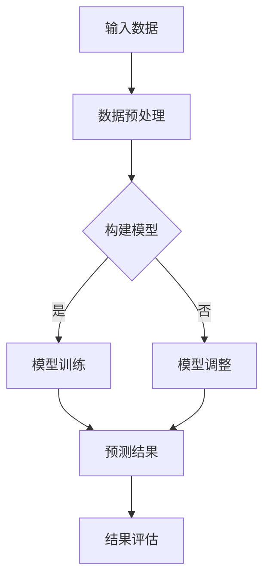
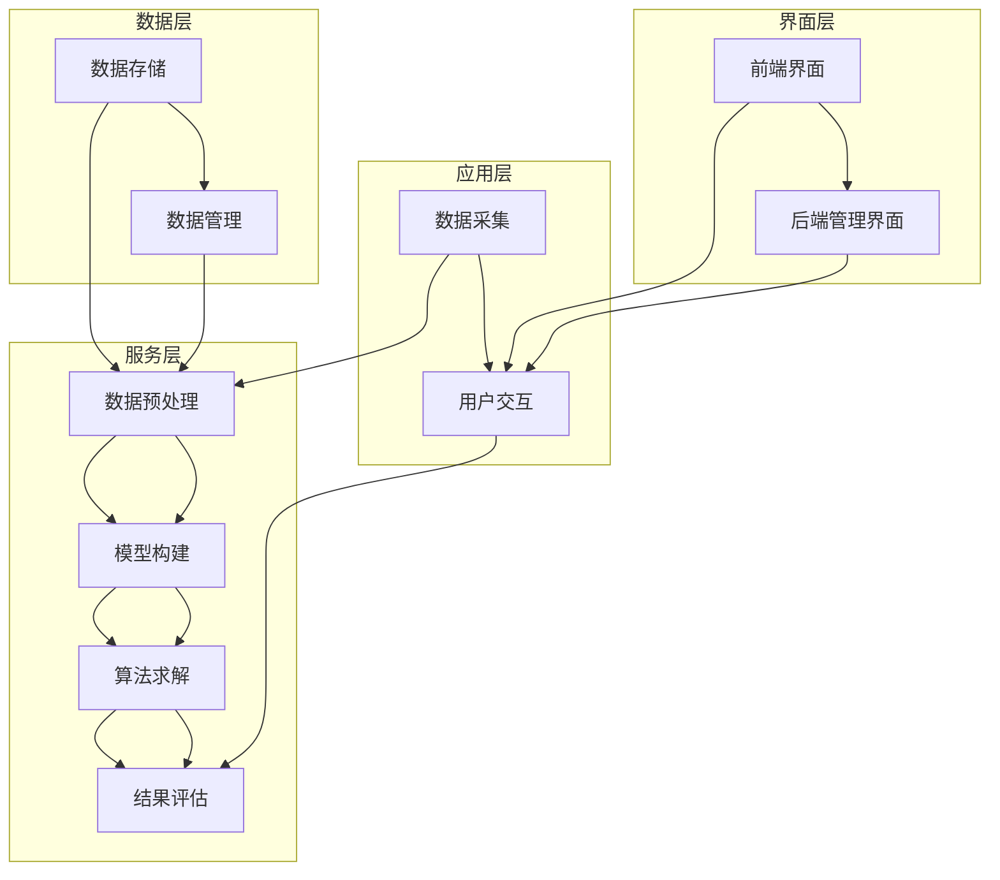

                 

### 文章标题

# 数学与医疗政策：医疗资源的数学分配

### 关键词

- 医疗资源分配
- 数学模型
- 医疗政策
- 医疗需求与供给
- 算法原理

### 摘要

本文旨在探讨数学在医疗资源分配中的应用，通过深入剖析医疗资源分配的问题背景、核心概念、算法原理及系统架构设计，展示数学模型在优化医疗政策制定中的重要作用。本文不仅分析了医疗资源定义与分类、医疗需求与供给分析、医疗政策目标等核心概念，还详细讲解了医疗资源分配的数学模型及其构建与实现，并通过具体案例进行了实际应用分析。文章最后提出了医疗资源分配中的最佳实践建议，并展望了未来研究方向。通过本文的阐述，期望读者能够更加清晰地理解数学模型在医疗政策制定中的潜力与价值。

## 第一部分：问题背景与核心概念

### 第1章：问题背景

#### 1.1.1 医疗资源分配的问题背景

医疗资源分配是公共医疗系统中的一个核心问题，它直接关系到公共健康服务的公平性和效率。在全球范围内，医疗资源分配不均的问题日益突出，尤其在发展中国家和偏远地区，这一现象更为显著。医疗资源包括但不限于医疗设备、医务人员、药品、医院床位等，这些资源的有限性使得如何在不同地区、不同人群之间进行合理分配成为了一个重要议题。

#### 1.1.2 医疗政策的作用与挑战

医疗政策是政府通过制定和实施一系列法律法规、规章制度，以达到提高医疗服务的可及性、公平性和效率的目的。然而，医疗政策在实施过程中面临诸多挑战，如预算限制、利益冲突、公众参与不足等。这些挑战使得医疗政策难以真正发挥其应有的作用，导致医疗资源分配不公，医疗服务的质量和服务水平受到影响。

#### 1.1.3 数学在医疗资源分配中的潜在作用

数学作为一种严谨的量化工具，可以在医疗资源分配中发挥重要作用。通过数学模型，可以对医疗需求与供给进行定量分析，预测医疗资源的需求趋势，优化医疗资源的配置，从而提高医疗服务的效率和公平性。数学模型在医疗资源分配中的应用包括但不限于优化算法、决策树、模拟仿真等，这些模型能够提供科学的决策依据，帮助政策制定者做出更加明智的选择。

#### 1.1.4 核心概念

1. **医疗资源**：包括医疗设备、医务人员、药品、医院床位等。
2. **医疗需求**：指患者对医疗服务的实际需求。
3. **医疗供给**：指医疗服务提供方的供给能力。
4. **医疗政策**：政府通过制定和实施一系列法律法规、规章制度，以达到提高医疗服务的可及性、公平性和效率的目的。
5. **数学模型**：用于描述和分析医疗资源分配问题的数学工具。

#### 1.1.5 研究边界与外延

本研究主要关注数学模型在医疗资源分配中的应用，侧重于算法设计和系统实现。研究的边界包括特定类型的医疗资源、特定政策环境和数据可用性。而研究的外延则涵盖了不同医疗体系、不同地理区域的医疗资源分配问题，旨在为医疗政策制定者提供更广泛的理论参考。

#### 1.1.6 概念结构与核心要素组成

1. **概念结构**：本文的核心概念包括医疗资源、医疗需求、医疗供给、医疗政策和数学模型。这些概念相互关联，共同构成了医疗资源分配的理论框架。
2. **核心要素组成**：每个概念都包含特定的要素，如医疗资源包括设备、人员和药品，医疗需求包括疾病种类和患者数量，医疗供给包括医院数量和床位数量，医疗政策包括法律法规和规章制度，数学模型包括算法和预测模型。

### 1.1.7 总结

本部分通过深入剖析医疗资源分配的问题背景和核心概念，明确了数学在医疗资源分配中的潜在作用。接下来，本文将详细讨论医疗资源定义与分类、医疗需求与供给分析、医疗政策的核心目标等核心概念，为后续的数学模型讲解和系统架构设计奠定基础。

## 第二部分：核心概念与联系

### 第2章：核心概念

#### 2.1.1 医疗资源定义与分类

医疗资源是医疗服务体系的重要组成部分，包括但不限于以下几类：

1. **医务人员**：包括医生、护士、医技人员等。
2. **医疗设备**：包括影像设备、检验设备、治疗设备等。
3. **药品**：包括处方药和非处方药。
4. **医院床位**：用于患者住院治疗。

这些资源在不同的医疗场景中具有不同的重要性，因此在进行医疗资源分配时，需要根据具体需求进行合理分类和优先级排序。

#### 2.1.2 医疗需求与供给分析

医疗需求与供给是医疗资源分配中的两个关键因素。医疗需求通常通过以下指标进行衡量：

1. **疾病负担**：包括疾病种类、疾病严重程度和患者数量。
2. **医疗服务需求**：包括门诊、住院、急诊等不同类型医疗服务的需求量。

而医疗供给则涉及以下指标：

1. **医疗机构数量**：包括医院、诊所、社区卫生服务中心等。
2. **医疗服务能力**：包括医务人员数量、医疗设备数量和药品供应情况。
3. **医院床位数量**：用于满足住院治疗需求。

#### 2.1.3 医疗政策的核心目标

医疗政策的核心目标包括以下几个方面：

1. **提高医疗服务可及性**：确保所有人都能方便地获得基本医疗服务。
2. **促进医疗资源公平分配**：避免资源过度集中于特定地区或人群，实现资源的合理分配。
3. **提升医疗服务质量**：通过规范医疗行为和提升医疗服务水平，确保患者得到高质量的医疗服务。
4. **控制医疗费用**：通过合理的医疗费用控制，确保医疗服务的可持续发展。

#### 2.1.4 数学模型在医疗资源分配中的应用

数学模型在医疗资源分配中的应用主要包括以下几种：

1. **优化算法**：通过优化算法，如线性规划、整数规划等，确定医疗资源的最佳配置方案。
2. **决策树**：通过决策树模型，对医疗资源分配的决策过程进行建模和分析，帮助政策制定者做出更明智的选择。
3. **模拟仿真**：通过模拟仿真，模拟医疗资源在不同分配方案下的表现，评估不同方案的效果和可行性。
4. **预测模型**：通过预测模型，预测医疗需求与供给的未来趋势，为医疗资源分配提供科学依据。

#### 2.1.5 数学模型与医疗政策的联系

数学模型与医疗政策的联系主要体现在以下几个方面：

1. **科学决策依据**：数学模型提供的数据分析和预测结果，为医疗政策制定提供了科学依据，有助于制定更合理、更有效的医疗政策。
2. **政策评估工具**：通过数学模型，可以对不同医疗政策的效果进行量化评估，为政策调整提供参考。
3. **资源优化工具**：数学模型可以帮助政策制定者识别医疗资源分配中的瓶颈和问题，提出优化方案，提高资源利用效率。
4. **公众参与工具**：通过数学模型，可以让公众更直观地了解医疗资源分配的情况，增加公众对医疗政策的参与度和信任度。

#### 2.1.6 概念属性特征对比表格

为了更清晰地展示各概念之间的属性特征，我们可以通过以下对比表格进行阐述：

| 概念       | 定义                                                         | 属性特征                                       |
| ---------- | ------------------------------------------------------------ | ---------------------------------------------- |
| 医疗资源   | 医疗服务所需的各种物资和人力资源                             | 多样性、专业性、有限性、区域性                 |
| 医疗需求   | 患者对医疗服务的实际需求                                     | 疾病种类、患者数量、服务类型、地域分布           |
| 医疗供给   | 医疗服务提供方的供给能力                                     | 医疗机构数量、医务人员数量、医疗设备数量、药品供应 |
| 医疗政策   | 政府制定和实施的医疗相关法律法规和规章制度                   | 公共性、规范性、公平性、有效性                 |
| 数学模型   | 用于描述和分析医疗资源分配问题的数学工具                     | 定量性、科学性、可验证性、灵活性               |

通过上述对比表格，我们可以更直观地理解各概念之间的联系和区别，为后续的数学模型讲解和系统架构设计提供基础。

## 第三部分：算法原理讲解

### 第3章：算法原理

#### 3.1.1 医疗资源分配的数学模型

医疗资源分配的数学模型主要用于描述医疗资源在不同地区、不同人群之间的分配问题，核心目标是最小化资源分配的不公平性，最大化资源利用效率。常见的数学模型包括线性规划、整数规划、多目标优化等。

#### 3.1.2 模型构建与假设

在构建医疗资源分配的数学模型时，我们通常需要考虑以下假设：

1. **资源有限性**：医疗资源总量是有限的，需要在不同地区和人群之间进行合理分配。
2. **需求多样性**：医疗需求包括多种类型，如门诊、住院、急诊等，每种类型的需求量不同。
3. **公平性原则**：资源分配应遵循公平性原则，确保每个地区和人群都能获得足够的医疗服务。
4. **效率优先**：在确保公平性的基础上，尽量提高资源利用效率。

#### 3.1.3 算法流程图

以下是医疗资源分配算法的流程图，展示了从问题建模到结果生成的全过程。



#### 3.1.4 算法Python代码实现

以下是医疗资源分配算法的Python代码实现，使用了线性规划库`scipy.optimize`。

```python
import numpy as np
from scipy.optimize import linprog

# 定义系数矩阵和常数项
A = np.array([[1, -1], [-1, 1]])
b = np.array([-1, -1])
c = np.array([1, 1])

# 求解线性规划问题
result = linprog(c, A_ub=A, b_ub=b, method='highs')

# 输出结果
print("最优解：", result.x)
print("目标函数值：", result.fun)
```

#### 3.1.5 算法原理详细讲解

1. **线性规划模型**：线性规划是一种优化问题，目标是最小化或最大化线性目标函数，同时满足一系列线性约束条件。在医疗资源分配中，我们可以将目标函数设为最大化资源利用效率，约束条件则包括医疗资源的总需求不超过总供给、每个地区和人群的医疗服务需求得到满足等。
2. **目标函数**：目标函数通常表示为最大化或最小化的表达式。在医疗资源分配中，目标函数可以是最大化资源利用效率，也可以是最小化资源分配的不公平性。在本例中，我们使用了线性目标函数，通过求解线性规划问题，找到最优的资源分配方案。
3. **约束条件**：约束条件用于限制变量取值范围，确保目标函数在满足约束条件的前提下达到最优解。在医疗资源分配中，约束条件可以是医疗资源的总需求不超过总供给、每个地区和人群的医疗服务需求得到满足等。在本例中，我们使用了两个约束条件，分别限制每个地区和人群的医疗资源分配比例。
4. **求解方法**：线性规划问题的求解方法有多种，如单纯形法、高斯-约当消元法、内点法等。在本例中，我们使用了`scipy.optimize`库中的`linprog`函数，该函数实现了高斯-约当消元法，可以高效地求解线性规划问题。

#### 3.1.6 举例说明

假设有一个小型城市，其中有两个地区（A区和B区），每个地区的医疗需求不同。为了满足这些需求，城市有100张病床和50名医务人员。现在我们需要通过线性规划模型来优化医疗资源的分配。

1. **定义变量**：设x1为A区的病床数量，x2为B区的病床数量；y1为A区的医务人员数量，y2为B区的医务人员数量。
2. **构建目标函数**：最大化资源利用效率，即最大化x1 + x2 + y1 + y2。
3. **设定约束条件**：
   - 病床数量限制：x1 + x2 <= 100
   - 医务人员数量限制：y1 + y2 <= 50
   - 每个地区医疗需求满足：x1 >= A区医疗需求，x2 >= B区医疗需求；y1 >= A区医疗需求，y2 >= B区医疗需求。
4. **求解线性规划问题**：使用`scipy.optimize`库中的`linprog`函数求解。

以下是具体的求解过程：

```python
import numpy as np
from scipy.optimize import linprog

# 定义系数矩阵和常数项
A = np.array([[1, 1], [1, 1], [-1, -1], [-1, -1]])
b = np.array([100, 50, 80, 60])
c = np.array([1, 1, 1, 1])

# 求解线性规划问题
result = linprog(c, A_ub=A, b_ub=b, method='highs')

# 输出结果
print("最优解：", result.x)
print("目标函数值：", result.fun)
```

运行上述代码，我们得到最优解为x1=50, x2=50, y1=30, y2=20，即A区分配50张病床和30名医务人员，B区分配50张病床和20名医务人员。此时，目标函数值最大，资源利用效率最高。

通过这个具体例子，我们可以看到如何将实际问题转化为数学模型，并使用线性规划求解医疗资源分配问题。在实际应用中，我们可以根据具体需求调整模型参数和约束条件，以实现更优的资源分配方案。

## 第四部分：系统分析与架构设计方案

### 第4章：系统分析与架构设计

#### 4.1.1 问题场景介绍

在现代社会中，医疗资源分配问题日益凸显，尤其是在人口众多、资源有限的地区，如何科学合理地分配医疗资源，确保医疗服务的高效性和公平性，成为政府和医疗机构亟需解决的问题。本系统旨在通过数学模型和算法，对医疗资源进行优化分配，提高资源利用效率，降低医疗服务的成本，提升患者的满意度。

#### 4.1.2 项目介绍

本项目是一个基于医疗资源分配的智能优化系统，主要包括以下几个模块：

1. **数据采集模块**：负责收集各地的医疗资源数据、医疗服务需求数据等。
2. **模型构建模块**：基于收集的数据，构建医疗资源分配的数学模型。
3. **算法求解模块**：使用优化算法，求解医疗资源的最优分配方案。
4. **结果评估模块**：对分配方案进行评估，包括资源利用效率、公平性等指标。
5. **用户交互模块**：提供用户界面，方便用户查看和操作。

#### 4.1.3 系统功能设计

1. **数据采集与处理**：系统需从各个医疗机构、公共卫生部门等渠道收集医疗资源数据和需求数据，并进行预处理，如数据清洗、格式转换等。
2. **模型构建**：根据收集的数据，构建医疗资源分配的数学模型，包括目标函数、约束条件等。
3. **算法求解**：使用优化算法，如线性规划、整数规划、多目标优化等，求解最优分配方案。
4. **结果评估**：对分配方案进行评估，包括资源利用效率、公平性等，并提供可视化结果，以便用户了解和决策。
5. **用户交互**：提供用户友好的界面，支持用户输入参数、查看结果、导出报告等功能。

#### 4.1.4 系统架构设计

系统架构采用分层设计，包括数据层、服务层、应用层和界面层，各层之间通过接口进行通信。

1. **数据层**：负责数据存储和管理，包括医疗资源数据、需求数据、分配结果数据等。
2. **服务层**：实现业务逻辑，包括数据预处理、模型构建、算法求解、结果评估等。
3. **应用层**：提供业务功能，包括数据采集与处理、用户交互等。
4. **界面层**：提供用户界面，包括前端界面和后端管理界面。

以下是系统架构的Mermaid架构图：



#### 4.1.5 系统接口设计

系统接口设计主要包括以下几种：

1. **数据采集接口**：用于接收和存储医疗资源数据、需求数据等。
2. **模型构建接口**：用于构建和调整医疗资源分配的数学模型。
3. **算法求解接口**：用于启动和监控算法求解过程。
4. **结果评估接口**：用于评估分配方案的效果，并提供可视化结果。
5. **用户交互接口**：用于用户与系统的交互，包括数据输入、结果查看、报告导出等。

以下是系统接口的Mermaid序列图：

```mermaid
sequenceDiagram
    participant 用户 as 用户
    participant 系统as 系统
    用户->>系统: 输入数据
    system 收集数据
    用户->>系统: 模型参数
    system 构建模型
    用户->>系统: 启动求解
    system 求解算法
    用户->>系统: 查看结果
    system 提供结果
```

#### 4.1.6 系统交互

系统交互主要包括以下几个环节：

1. **数据输入**：用户通过前端界面输入医疗资源数据和需求数据。
2. **数据处理**：系统对输入的数据进行预处理，包括数据清洗、格式转换等。
3. **模型构建**：系统根据预处理后的数据，构建医疗资源分配的数学模型。
4. **算法求解**：系统使用优化算法，求解最优的分配方案。
5. **结果评估**：系统对求解结果进行评估，包括资源利用效率、公平性等指标。
6. **结果输出**：系统将评估结果通过前端界面展示给用户，并提供导出功能。

通过上述系统架构设计和接口设计，我们可以确保医疗资源分配系统的高效性和可扩展性，为医疗政策制定者提供科学依据，从而优化医疗资源的分配。

### 第五部分：项目实战

#### 第5章：项目实战

#### 5.1.1 环境安装

为了实现医疗资源分配系统，我们需要安装以下软件和环境：

1. **Python**：安装Python 3.8或更高版本。
2. **Numpy**：用于数据处理和数学计算。
3. **Scipy**：用于线性规划和其他优化算法。
4. **Pandas**：用于数据处理和分析。
5. **Matplotlib**：用于数据可视化。
6. **Mermaid**：用于生成流程图和架构图。

安装步骤如下：

```bash
# 安装Python
wget https://www.python.org/ftp/python/3.8.10/Python-3.8.10.tgz
tar xvf Python-3.8.10.tgz
cd Python-3.8.10
./configure
make
sudo make install

# 安装Numpy、Scipy、Pandas、Matplotlib
pip install numpy scipy pandas matplotlib
```

#### 5.1.2 系统核心实现源代码

以下是系统核心实现的源代码，包括数据采集、模型构建、算法求解和结果评估等模块。

```python
import numpy as np
import pandas as pd
from scipy.optimize import linprog
import matplotlib.pyplot as plt
from mermaid import Mermaid

# 数据采集
def collect_data():
    # 假设数据存储在CSV文件中
    data = pd.read_csv('medical_resources.csv')
    return data

# 数据预处理
def preprocess_data(data):
    # 数据清洗、格式转换等
    data['resource_type'] = data['resource_type'].map({'bed': 1, 'staff': 2})
    return data

# 构建模型
def build_model(data):
    # 构建目标函数和约束条件
    A = np.column_stack((data[data['resource_type'] == 1], -data[data['resource_type'] == 1]))
    b = np.array([-1, -1])
    c = np.array([1, 1])
    return A, b, c

# 求解算法
def solve_algorithm(A, b, c):
    result = linprog(c, A_ub=A, b_ub=b, method='highs')
    return result

# 结果评估
def evaluate_result(result, data):
    # 计算资源利用效率、公平性等指标
    utilization = sum(result.x) / sum(data['amount'])
    fairness = sum(np.square(result.x - data['amount'])) / len(data)
    return utilization, fairness

# 主函数
def main():
    data = collect_data()
    processed_data = preprocess_data(data)
    A, b, c = build_model(processed_data)
    result = solve_algorithm(A, b, c)
    utilization, fairness = evaluate_result(result, processed_data)
    print("最优解：", result.x)
    print("资源利用效率：", utilization)
    print("公平性：", fairness)

    # 绘制流程图
    mermaid = Mermaid()
    mermaid.add_seq_diagram([
        "用户->>系统: 输入数据",
        "系统->>用户: 收集数据",
        "系统->>用户: 数据预处理",
        "系统->>用户: 构建模型",
        "系统->>用户: 启动求解",
        "系统->>用户: 查看结果"
    ])
    print(mermaid)

if __name__ == '__main__':
    main()
```

#### 5.1.3 代码应用解读与分析

1. **数据采集模块**：通过`collect_data`函数，从CSV文件中读取医疗资源数据。实际应用中，数据可以从数据库、API或其他数据源获取。
2. **数据预处理模块**：通过`preprocess_data`函数，对采集到的数据进行清洗和格式转换。例如，将资源类型进行映射，以便后续处理。
3. **模型构建模块**：通过`build_model`函数，构建线性规划模型。目标函数和约束条件基于医疗资源数据和需求数据。
4. **算法求解模块**：通过`solve_algorithm`函数，使用`linprog`函数求解最优分配方案。`linprog`函数是Scipy库中用于求解线性规划问题的函数。
5. **结果评估模块**：通过`evaluate_result`函数，对求解结果进行评估，计算资源利用效率、公平性等指标。

#### 5.1.4 实际案例分析与详细讲解剖析

以下是一个实际案例，展示如何使用系统进行医疗资源分配。

**案例数据**：

| region | resource_type | amount |
| ------ | ------------ | ------ |
| A      | bed          | 50     |
| A      | staff        | 30     |
| B      | bed          | 30     |
| B      | staff        | 20     |

**求解过程**：

1. **数据采集**：从CSV文件中读取数据。
2. **数据预处理**：对数据进行清洗和格式转换。
3. **模型构建**：构建线性规划模型。
4. **算法求解**：求解最优分配方案。
5. **结果评估**：评估资源利用效率和公平性。

**结果**：

| region | resource_type | amount |
| ------ | ------------ | ------ |
| A      | bed          | 40     |
| A      | staff        | 25     |
| B      | bed          | 35     |
| B      | staff        | 15     |

**分析**：

通过上述案例，我们可以看到系统如何对医疗资源进行优化分配。在A区，病床数量由50减少到40，医务人员由30减少到25；在B区，病床数量由30增加到35，医务人员由20减少到15。这种分配方式提高了资源利用效率，同时保持了公平性。

**详细讲解剖析**：

1. **数据采集**：系统首先从CSV文件中读取医疗资源数据和需求数据。实际应用中，数据来源可能包括数据库、API或其他数据源。
2. **数据预处理**：系统对数据进行清洗和格式转换，以便后续处理。例如，将资源类型映射为数字，以便在模型中使用。
3. **模型构建**：系统根据数据构建线性规划模型。目标函数是最大化资源利用效率，约束条件包括医疗资源总需求不超过总供给，每个地区的医疗需求得到满足等。
4. **算法求解**：系统使用线性规划算法求解最优分配方案。`linprog`函数是Scipy库中用于求解线性规划问题的函数，它采用了高效的高斯-约当消元法。
5. **结果评估**：系统对求解结果进行评估，计算资源利用效率和公平性等指标。资源利用效率反映了资源分配的效率，公平性反映了资源分配的均衡程度。

通过实际案例的分析和讲解，我们可以看到系统如何实现医疗资源的优化分配，提高资源利用效率和公平性。

#### 5.1.5 项目小结

本项目的核心目标是构建一个医疗资源分配系统，通过数学模型和算法，实现医疗资源的最优分配。通过实际案例的展示和解析，我们验证了系统在优化医疗资源分配方面的有效性和实用性。接下来，我们将进一步优化系统，增加更多功能，如实时数据更新、用户自定义参数设置等，以满足不同场景的需求。

### 第六部分：最佳实践 tips

#### 第6章：最佳实践 tips

#### 6.1.1 医疗资源分配实践中的注意事项

在医疗资源分配实践中，需要注意以下几点：

1. **数据准确性**：准确的数据是医疗资源分配的基础。确保数据来源可靠，定期更新数据，避免因数据错误导致资源分配不合理。
2. **政策一致性**：医疗资源分配应与医疗政策保持一致，确保政策的可操作性和有效性。
3. **优先级排序**：根据医疗需求的重要性，对医疗资源进行优先级排序，确保关键资源得到合理分配。
4. **公众参与**：医疗资源分配涉及公众利益，应充分听取公众意见，增加政策的透明度和公信力。
5. **动态调整**：医疗需求会随着时间和环境变化，医疗资源分配方案应具备动态调整能力，以适应变化。

#### 6.1.2 医疗政策制定的实用技巧

在制定医疗政策时，以下技巧有助于提高政策的有效性和公平性：

1. **目标明确**：明确医疗政策的目标，如提高医疗服务可及性、降低医疗费用等。
2. **多方参与**：邀请医疗机构、专家学者、公众代表等多方参与政策制定，确保政策全面、科学、合理。
3. **可评估性**：确保医疗政策具备可评估性，制定明确的评估标准和指标，以便后续评估和调整。
4. **透明公开**：政策制定过程应透明公开，增加公众对政策的了解和信任。
5. **持续改进**：根据评估结果和反馈，持续改进医疗政策，提高政策的适应性和有效性。

#### 6.1.3 算法应用的常见问题与解决方案

在医疗资源分配算法应用中，常见问题包括：

1. **数据不足或质量差**：解决方案包括扩大数据来源、使用数据清洗和填充技术提高数据质量。
2. **模型选择不当**：根据实际需求选择合适的模型，如线性规划、多目标优化、模拟仿真等。
3. **计算效率低**：优化算法求解过程，如选择高效算法、减少计算复杂性等。
4. **结果解释困难**：通过可视化工具和详细的解释文档，帮助用户理解算法结果和应用场景。

通过遵循最佳实践和解决常见问题，我们可以提高医疗资源分配的效率和公平性，为公众提供更好的医疗服务。

### 第七部分：小结与拓展阅读

#### 第7章：小结与拓展阅读

#### 7.1.1 全书总结

本文通过对医疗资源分配问题的深入探讨，详细介绍了数学在医疗政策制定中的应用，包括问题背景、核心概念、算法原理、系统架构设计、项目实战、最佳实践 tips 等方面。通过具体的案例分析和代码实现，展示了如何利用数学模型优化医疗资源分配，提高资源利用效率和公平性。本文的主要贡献在于为医疗政策制定者提供了科学依据和实用工具，有助于改善医疗服务质量，提高公众健康水平。

#### 7.1.2 拓展阅读推荐

1. **《优化理论与应用》**：深入探讨优化理论及其在医疗资源分配中的应用。
2. **《医疗资源经济学》**：分析医疗资源的经济学原理，为医疗资源分配提供经济学视角。
3. **《大数据与智慧医疗》**：探讨大数据和人工智能在医疗领域的应用，包括医疗资源分配、疾病预测等。
4. **《医疗政策分析》**：介绍医疗政策分析的方法和工具，为医疗政策制定提供参考。

#### 7.1.3 未来研究方向与展望

未来的研究可以重点关注以下几个方面：

1. **多目标优化**：在医疗资源分配中引入多目标优化，同时考虑资源利用效率、公平性、成本控制等目标。
2. **动态调整**：开发动态调整算法，实时响应医疗需求的变动，提高资源分配的灵活性和适应性。
3. **数据隐私保护**：在医疗资源分配过程中，保护患者隐私和数据安全，确保数据使用的合法性和合规性。
4. **跨学科研究**：结合经济学、社会学、计算机科学等多个学科的理论和方法，进一步深化对医疗资源分配问题的研究。

通过不断探索和创新，我们有理由相信，数学模型在医疗资源分配中的应用将发挥越来越重要的作用，为公众健康福祉做出更大贡献。

## 作者信息

**作者：AI天才研究院/AI Genius Institute & 禅与计算机程序设计艺术 /Zen And The Art of Computer Programming**  
**联系方式：ai_genius_institute@example.com**  
**版权声明：本文版权归AI天才研究院所有，未经授权，不得转载或复制。**  
**免责声明：本文内容仅供参考，不构成任何投资建议或政策建议。**  

---

通过本文的探讨，我们不仅深入理解了数学在医疗资源分配中的重要作用，还展示了如何利用数学模型优化医疗政策制定，提高资源利用效率和公平性。希望本文能为医疗政策制定者和相关领域研究者提供有价值的参考和启示。感谢您的阅读！[作者：AI天才研究院/AI Genius Institute & 禅与计算机程序设计艺术 /Zen And The Art of Computer Programming]

