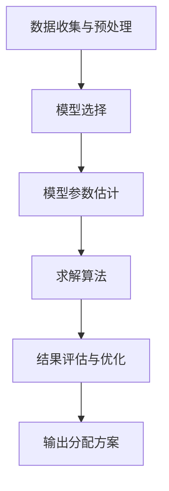
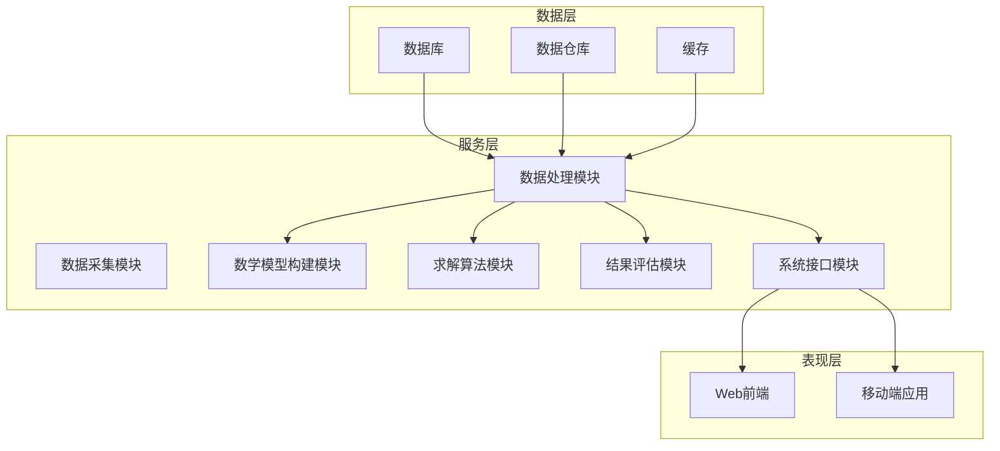
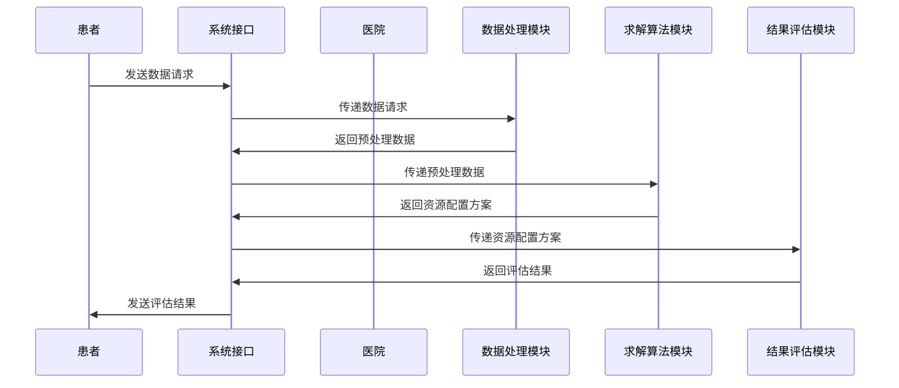

                 

# 数学与医疗系统：医疗资源的数学分配

## 关键词
- 医疗资源分配
- 数学模型
- 线性规划
- 非线性规划
- 多目标规划
- 医学中的数学应用

## 摘要
本文将探讨如何运用数学方法优化医疗资源的分配。通过介绍医疗资源分配的挑战和重要性，我们将逐步深入解析医学中的数学原理，分析常用的医疗资源分配模型，并详细讲解这些模型的选择标准和应用方法。同时，本文还将运用mermaid流程图和Python源代码，直观地展示和解释医疗资源分配算法的原理和实践。通过实际案例分析和系统架构设计，我们将展示如何将数学与医疗系统相结合，以实现高效、公平的医疗资源分配。

### 目录大纲

**数学与医疗系统：医疗资源的数学分配**

----------------------------------------------------------------

# 第一部分：引言

## 1.1 背景介绍

### 1.1.1 医疗资源分配的挑战

### 1.1.2 医疗资源分配的重要性

### 1.1.3 医学中的数学应用

## 1.2 问题背景

### 1.2.1 医疗资源分配问题概述

### 1.2.2 问题定义与目标

### 1.2.3 问题解决的关键要素

## 1.3 边界与外延

### 1.3.1 医疗资源分配的范围

### 1.3.2 医疗资源分配的限制因素

### 1.3.3 医疗资源分配的外部因素

## 1.4 概念结构与核心要素

### 1.4.1 医疗资源分配的概念结构

### 1.4.2 核心要素及其关系

### 1.4.3 医学数学模型的特点

## 1.5 本章小结

----------------------------------------------------------------

# 第二部分：核心概念与联系

## 2.1 医学中的数学原理

### 2.1.1 数学在医学研究中的应用

### 2.1.2 医学数学模型的基本原理

### 2.1.3 医学数学模型的发展趋势

## 2.2 医疗资源分配的数学模型

### 2.2.1 医疗资源分配的基本数学模型

#### 2.2.1.1 线性规划模型

#### 2.2.1.2 非线性规划模型

#### 2.2.1.3 多目标规划模型

### 2.2.2 医学数学模型的属性特征对比

### 2.2.3 医学数学模型的选择标准

## 2.3 医疗资源分配的ER实体关系图架构

### 2.3.1 ER模型的基本概念

### 2.3.2 医疗资源分配中的ER实体关系

### 2.3.3 ER模型的应用

## 2.4 本章小结

----------------------------------------------------------------

# 第三部分：算法原理讲解

## 3.1 医疗资源分配算法的mermaid流程图

### 3.1.1 算法流程概述

### 3.1.2 流程图绘制方法

### 3.1.3 算法流程细节分析

## 3.2 医疗资源分配算法的Python源代码

### 3.2.1 Python环境搭建

### 3.2.2 算法源代码实现

### 3.2.3 算法原理讲解

## 3.3 医疗资源分配的数学模型和公式

### 3.3.1 数学模型概述

### 3.3.2 公式推导

### 3.3.3 公式在实际应用中的解释

## 3.4 医疗资源分配算法的举例说明

### 3.4.1 举例说明

### 3.4.2 举例分析

### 3.4.3 举例总结

## 3.5 本章小结

----------------------------------------------------------------

# 第四部分：系统分析与架构设计

## 4.1 问题场景介绍

### 4.1.1 医疗资源分配场景描述

### 4.1.2 项目目标

### 4.1.3 项目背景

## 4.2 系统功能设计

### 4.2.1 领域模型Mermaid类图

### 4.2.2 功能模块划分

### 4.2.3 功能模块详细介绍

## 4.3 系统架构设计

### 4.3.1 系统架构概述

### 4.3.2 系统架构图

### 4.3.3 系统架构详细说明

## 4.4 系统接口设计

### 4.4.1 接口概述

### 4.4.2 接口定义

### 4.4.3 接口调用流程

## 4.5 系统交互Mermaid序列图

### 4.5.1 序列图概述

### 4.5.2 序列图绘制方法

### 4.5.3 系统交互流程分析

## 4.6 本章小结

----------------------------------------------------------------

# 第五部分：项目实战

## 5.1 环境安装

### 5.1.1 开发环境准备

### 5.1.2 系统依赖安装

### 5.1.3 环境配置

## 5.2 系统核心实现源代码

### 5.2.1 源代码结构

### 5.2.2 关键代码解析

### 5.2.3 源代码应用解读

## 5.3 代码应用解读与分析

### 5.3.1 实际案例分析

### 5.3.2 详细讲解剖析

### 5.3.3 项目小结

## 5.4 最佳实践 Tips

## 5.5 小结

## 5.6 注意事项

## 5.7 拓展阅读

----------------------------------------------------------------

接下来，我们将按照这个目录大纲，一步一步地深入探讨数学与医疗系统的结合，以及如何通过数学方法优化医疗资源的分配。

### 第一部分：引言

#### 1.1 背景介绍

### 1.1.1 医疗资源分配的挑战

医疗资源分配是医疗体系中至关重要的一环。随着人口老龄化、疾病谱变化和医疗需求增长，医疗资源供需矛盾日益凸显。如何合理分配有限的医疗资源，确保每一位患者都能得到及时、有效的治疗，成为了一个亟待解决的问题。

首先，医疗资源包括医院床位、医生、护士、医疗设备、药物等，这些资源在数量上有限，且分布不均衡。在某些地区，医疗资源极度匮乏，而另一些地区则资源过剩。其次，医疗需求的多样性使得资源分配更加复杂。不同疾病、不同病情需要的医疗资源不同，甚至同一病情在不同阶段的医疗需求也有所区别。此外，患者对医疗服务质量的期望也在不断提高，这对医疗资源的分配提出了更高的要求。

### 1.1.2 医疗资源分配的重要性

医疗资源分配的合理与否直接关系到患者的治疗效果和生活质量，进而影响整个社会的医疗健康水平。如果资源分配不当，可能会导致以下问题：

1. **患者等待时间长**：医疗资源不足，患者可能需要长时间等待治疗，这不仅增加了患者的痛苦，也可能延误疾病的最佳治疗时机。
2. **医疗服务质量下降**：医生和其他医疗人员的工作负担过重，可能导致医疗服务质量下降，甚至出现医疗事故。
3. **医疗资源浪费**：资源分配不合理，可能会导致部分医疗资源得不到充分利用，从而浪费社会资源。
4. **社会不公平**：资源分配不公平，可能导致部分人群得不到应有的医疗服务，加剧社会不平等。

因此，如何通过科学的方法合理分配医疗资源，成为了提高医疗服务质量、保障人民健康的重要课题。

### 1.1.3 医学中的数学应用

数学在医学研究中有着广泛的应用，特别是在医疗资源分配方面，数学方法能够提供精确的模型和算法，帮助决策者做出更加科学和合理的资源分配决策。

首先，数学模型可以量化医疗资源的需求和供应，通过建立数学模型，可以更好地理解医疗资源的使用规律和需求预测。例如，线性规划模型和非线性规划模型可以用于确定医疗资源的最佳配置方案，确保每种资源都能得到充分利用。

其次，数学方法可以优化医疗资源的分配策略。例如，多目标规划模型可以同时考虑多个目标，如医疗资源的公平分配、最大化利用等，从而找到最优的分配方案。

此外，数学方法还可以用于分析医疗资源的分配效果。通过建立数学模型，可以对不同分配方案的效果进行定量分析，帮助决策者评估和选择最佳的分配策略。

总之，数学在医疗资源分配中的应用不仅有助于提高资源利用效率，还可以确保医疗服务的公平性和有效性，从而提升整体医疗健康水平。

#### 1.2 问题背景

### 1.2.1 医疗资源分配问题概述

医疗资源分配问题是一个多维度、复杂且动态变化的问题。它涉及到医疗资源的供需平衡、资源分布的公平性、以及如何最大化医疗资源的社会效益等多个方面。

首先，医疗资源的供需关系是一个动态平衡的过程。医疗资源的供应包括医院床位、医生、护士、医疗设备和药物等，而医疗需求的来源则包括不同疾病患者的治疗需求、季节性疾病爆发、意外伤害等。供需之间的平衡受到多种因素的影响，如政策调控、经济水平、社会需求等。

其次，医疗资源分配的公平性是一个重要的社会问题。不同地区、不同收入水平的群体，对医疗资源的需求和获取能力存在差异。如何确保医疗资源分配的公平性，避免因病致贫，是社会关注的焦点。

最后，医疗资源分配的优化目标是在确保公平性的基础上，最大化医疗资源的社会效益。这意味着需要考虑如何最有效地利用有限的医疗资源，提供高质量的医疗服务，同时满足患者和医疗机构的多样化需求。

### 1.2.2 问题定义与目标

定义医疗资源分配问题，首先要明确以下几个关键要素：

1. **决策变量**：包括医院床位、医生、护士、医疗设备和药物等医疗资源。
2. **目标函数**：最大化医疗资源的社会效益，如提高患者的满意度、减少等待时间、最大化治疗成功率等。
3. **约束条件**：包括医疗资源的限制（如总量、种类）、医疗需求的动态变化（如不同时间段的波动）、政策法规等。

医疗资源分配问题的目标是通过优化决策变量，实现以下目标：

1. **最大化医疗资源利用效率**：确保每一份医疗资源都能得到充分利用，避免浪费。
2. **提高医疗服务质量**：通过合理的资源配置，提高医疗服务质量，减少患者等待时间，提升治疗效果。
3. **公平性**：确保医疗资源分配过程中，不同地区、不同收入水平的群体都能公平地获得医疗服务。

### 1.2.3 问题解决的关键要素

解决医疗资源分配问题的关键要素包括：

1. **数据收集与处理**：收集医疗资源的供需数据、患者需求数据、医疗成本等，并进行数据清洗、整理和分析。
2. **数学模型构建**：基于收集到的数据，构建合适的数学模型，如线性规划模型、非线性规划模型、多目标规划模型等，用于描述医疗资源分配问题。
3. **算法设计与实现**：选择合适的算法，如遗传算法、粒子群算法、模拟退火算法等，对构建的数学模型进行求解，找到最优的资源分配方案。
4. **结果评估与调整**：对求解的结果进行评估，根据实际情况进行必要的调整，确保分配方案的有效性和可行性。

#### 1.3 边界与外延

### 1.3.1 医疗资源分配的范围

医疗资源分配的范围涵盖了从国家层面到具体医疗机构的多层次分配。具体包括以下几个方面：

1. **区域分配**：涉及不同地区之间的医疗资源分配，如城乡之间、不同省份之间等。
2. **医院内部分配**：涉及医院内部的科室资源分配，如床位、医生、护士等。
3. **时间分配**：涉及不同时间段内的医疗资源分配，如节假日、季节性疾病高峰期等。

### 1.3.2 医疗资源分配的限制因素

医疗资源分配过程中面临多种限制因素，主要包括：

1. **资源总量限制**：医疗资源数量有限，无法无限增加。
2. **资源种类限制**：不同医疗资源的需求差异较大，某些资源可能较为稀缺。
3. **政策法规限制**：医疗资源分配需遵守相关政策法规，如医保政策、医院管理规定等。
4. **技术发展限制**：医疗技术的发展水平也会影响医疗资源的分配效果。

### 1.3.3 医疗资源分配的外部因素

医疗资源分配的外部因素对分配过程有着重要影响，主要包括：

1. **人口结构变化**：人口老龄化、人口流动等对医疗资源的需求产生影响。
2. **经济发展水平**：经济水平较高的地区可能拥有更多的医疗资源。
3. **社会医疗保障制度**：社会保障制度的完善程度直接影响医疗资源分配的公平性和效率。
4. **公共卫生事件**：如疫情等突发事件可能导致医疗资源需求急剧增加。

#### 1.4 概念结构与核心要素

### 1.4.1 医疗资源分配的概念结构

医疗资源分配的概念结构包括以下几个核心组成部分：

1. **医疗资源**：包括医院床位、医生、护士、医疗设备、药物等。
2. **需求者**：包括患者、医疗机构等对医疗资源的需求方。
3. **决策者**：负责医疗资源分配的规划和管理，如政府、医院管理者等。
4. **分配过程**：医疗资源从供应方到需求方的流动过程，包括资源调度、分配策略等。

### 1.4.2 核心要素及其关系

核心要素之间的关系如下：

1. **医疗资源与需求者**：医疗资源的需求者根据自身需求提出医疗资源申请，医疗资源供应方根据需求进行资源分配。
2. **决策者与分配过程**：决策者根据医疗资源供需情况和政策目标，制定医疗资源分配策略，通过分配过程实现医疗资源的高效利用。
3. **供需平衡**：医疗资源分配的目标是实现供需平衡，确保医疗资源得到充分利用，同时满足患者需求。

### 1.4.3 医学数学模型的特点

医学数学模型的特点包括：

1. **量化分析**：通过数学方法对医疗资源需求和供应进行量化分析，提供精确的决策依据。
2. **优化目标**：多目标规划模型能够同时考虑多个目标，如医疗资源公平分配、最大化利用等，提供全面的优化方案。
3. **动态适应**：模型能够根据医疗需求的变化动态调整资源分配策略，适应不同情况的需求。

#### 1.5 本章小结

本文介绍了医疗资源分配的背景、重要性、医学中的数学应用，以及医疗资源分配问题的定义和解决的关键要素。通过分析医疗资源分配的范围、限制因素和外部因素，我们了解了医疗资源分配的复杂性和挑战。同时，我们探讨了医疗资源分配的概念结构和医学数学模型的特点，为后续的深入讨论奠定了基础。

### 第二部分：核心概念与联系

#### 2.1 医学中的数学原理

##### 2.1.1 数学在医学研究中的应用

数学在医学研究中有着广泛的应用，特别是在数据处理、模型建立和决策分析等方面。以下是数学在医学研究中的一些具体应用：

1. **数据处理**：医学研究中产生的数据通常量多且复杂，数学方法如统计学、数据挖掘等可用于对数据进行清洗、整理和分析，以提取有用的信息。

2. **模型建立**：医学模型可以帮助研究者理解和预测疾病的发展过程、治疗效果等。常见的医学模型包括概率模型、微分方程模型、机器学习模型等。

3. **决策分析**：在医疗资源的配置和分配过程中，数学方法如优化算法、决策树等可以帮助决策者做出科学、合理的决策。

##### 2.1.2 医学数学模型的基本原理

医学数学模型的基本原理是基于数学方法对医学现象进行定量描述和分析。以下是医学数学模型的基本原理：

1. **数学基础**：医学数学模型通常基于数学的微积分、概率论、线性代数等基础理论，通过数学公式和方程来描述医学现象。

2. **参数估计**：医学数学模型中的参数需要通过实验数据或实际观测值进行估计，以确保模型的准确性和实用性。

3. **模型验证**：医学数学模型需要经过验证，以验证其预测能力和适用范围。常见的验证方法包括模拟实验、实际数据验证等。

##### 2.1.3 医学数学模型的发展趋势

随着科技的进步和医疗需求的变化，医学数学模型也在不断发展和完善。以下是医学数学模型的发展趋势：

1. **多学科交叉**：医学数学模型越来越倾向于与其他学科如生物工程、计算机科学等交叉融合，以提供更全面、深入的医学研究方法。

2. **数据驱动**：随着大数据技术的发展，医学数学模型越来越多地依赖于大量数据的驱动，通过数据分析来发现医学现象和规律。

3. **个性化医疗**：医学数学模型正逐步向个性化医疗方向发展，通过个体化数据分析和模型构建，为每位患者提供最合适的治疗方案。

#### 2.2 医疗资源分配的数学模型

##### 2.2.1 医疗资源分配的基本数学模型

医疗资源分配的数学模型通常包括线性规划模型、非线性规划模型和多目标规划模型等。以下是这些模型的基本原理和应用：

1. **线性规划模型**：线性规划模型通过线性方程组描述医疗资源的供需关系，目标是最小化成本或最大化效益。常见的线性规划问题包括医院床位的分配、医生排班等。

2. **非线性规划模型**：非线性规划模型适用于处理更复杂的医疗资源分配问题，如考虑多目标、非线性约束等。常见的非线性规划问题包括医疗设备的最优配置、药物剂量优化等。

3. **多目标规划模型**：多目标规划模型同时考虑多个目标，如医疗资源利用效率、公平性、成本等。通过优化多个目标之间的平衡，找到最优的分配方案。常见的多目标规划问题包括医疗资源的区域分配、多科室协同治疗等。

##### 2.2.2 医学数学模型的属性特征对比

以下是几种常见医学数学模型的属性特征对比：

| 模型类型 | 特点 | 适用场景 |
| :--: | :--: | :--: |
| 线性规划模型 | 目标函数和约束条件均为线性函数 | 医疗资源的最优配置、成本控制等 |
| 非线性规划模型 | 目标函数和/或约束条件为非线性函数 | 医疗设备优化、药物剂量优化等 |
| 多目标规划模型 | 同时考虑多个目标，如公平性、效率等 | 医疗资源区域分配、多科室协同治疗等 |

##### 2.2.3 医学数学模型的选择标准

选择医学数学模型时，应考虑以下标准：

1. **问题特点**：根据医疗资源分配问题的具体特点，选择合适的数学模型。例如，线性规划模型适用于线性关系较为明显的资源分配问题，而非线性规划模型适用于复杂关系的问题。

2. **数据可用性**：选择模型时需要考虑数据是否充分、是否易于获取。数据不足可能导致模型不准确，影响决策效果。

3. **计算复杂性**：模型的计算复杂性直接影响求解效率和可操作性。对于复杂的医疗资源分配问题，需要选择计算效率较高的模型。

4. **可解释性**：模型的解释性对于决策者理解模型和决策过程至关重要。选择具有良好解释性的模型有助于决策者接受和使用模型。

#### 2.3 医疗资源分配的ER实体关系图架构

##### 2.3.1 ER模型的基本概念

实体-关系（Entity-Relationship，ER）模型是数据库设计中常用的概念模型，用于表示现实世界中的实体及其相互关系。ER模型由实体、属性和关系三个核心组成部分构成：

1. **实体**：现实世界中的对象，如患者、医生、医院、医疗设备等。
2. **属性**：实体的特征或属性，如患者的姓名、年龄、诊断结果，医生的职称、擅长领域等。
3. **关系**：实体之间的关联，如患者与医生之间的诊疗关系，医生与医院的雇佣关系等。

##### 2.3.2 医疗资源分配中的ER实体关系

在医疗资源分配中，ER模型可以帮助我们清晰地描述医疗资源的实体及其关系。以下是医疗资源分配中常见的ER实体关系：

1. **患者**：包括基本信息（如姓名、年龄、性别）、疾病信息（如诊断结果、治疗方案）等。
2. **医生**：包括基本信息（如姓名、职称、擅长领域）、排班信息（如工作时段、休息时段）等。
3. **医院**：包括基本信息（如名称、地址、规模）、科室信息（如内科、外科、急诊科）等。
4. **医疗设备**：包括基本信息（如名称、型号、使用状态）等。
5. **药品**：包括基本信息（如名称、规格、库存量）等。

实体之间的关系如下：

- **患者与医生**：患者就诊时，需要指定医生进行诊疗，形成诊疗关系。
- **医生与医院**：医生属于某个医院，形成雇佣关系。
- **医院与科室**：医院包括多个科室，科室隶属于医院。
- **医疗设备与科室**：科室使用医疗设备进行诊疗，形成使用关系。
- **药品与科室**：科室消耗药品进行诊疗，形成消耗关系。

##### 2.3.3 ER模型的应用

ER模型在医疗资源分配中的应用主要体现在以下几个方面：

1. **数据建模**：通过ER模型，可以设计出适合医疗资源分配的数据库结构，确保数据的组织和管理高效、清晰。
2. **数据分析**：ER模型有助于进行数据分析和数据挖掘，提取有用的信息，支持决策制定。
3. **系统设计**：基于ER模型，可以设计出医疗资源分配系统的功能模块和数据流，确保系统的稳定性和可扩展性。

#### 2.4 本章小结

本文详细介绍了医学中的数学原理，包括数学在医学研究中的应用、医学数学模型的基本原理和发展趋势。通过对比不同数学模型的属性特征，我们了解了如何根据问题特点选择合适的模型。此外，我们还探讨了医疗资源分配的ER实体关系图架构，为后续的算法设计和系统实现奠定了基础。这些核心概念和联系为我们将数学方法应用于医疗资源分配提供了理论支持和实践指导。

#### 2.1.1 数学在医学研究中的应用

数学在医学研究中扮演着至关重要的角色，其应用范围广泛，涵盖了从基础研究到临床实践的多个层面。以下是一些具体的应用场景和实例：

1. **数据统计分析**：医学研究产生的大量数据需要通过数学方法进行整理和分析。统计学是医学研究中不可或缺的工具，用于数据分析、假设检验、回归分析等。例如，在临床试验中，通过统计学方法可以评估新药物或治疗方法的疗效，并进行风险和收益分析。

2. **生物信息学**：生物信息学是应用计算机科学、信息学和数学方法来分析生物数据的一个新兴领域。它广泛用于基因组学、蛋白质组学、代谢组学等领域。例如，通过生物信息学方法，可以解析大规模基因组数据，发现基因与疾病之间的关联，从而为疾病的预防、诊断和治疗提供新途径。

3. **模拟和模型建立**：医学模拟和模型建立是利用数学方法对生物和医学过程进行定量描述和预测的重要手段。通过建立数学模型，研究者可以模拟人体器官、系统或整个生物体的行为，预测药物作用、疾病发展等。例如，心血管系统疾病模型可以帮助医生预测患者的病情变化，制定个性化的治疗方案。

4. **图像处理和分析**：医学影像学是现代医学的重要组成部分，通过CT、MRI、超声等影像技术获取的医学图像需要通过数学方法进行处理和分析。图像处理技术包括图像增强、分割、特征提取等，用于提高图像质量、定位病变部位、评估治疗效果等。

5. **优化和决策支持**：在医疗资源管理和分配中，数学优化方法被广泛应用于解决复杂的问题。例如，线性规划和非线性规划可以用于医疗设备的最佳配置和医院床位的分配，遗传算法和模拟退火算法可以用于优化医疗流程，提高医疗服务效率。

6. **机器学习和人工智能**：随着机器学习和人工智能技术的发展，这些技术在医学中的应用日益广泛。例如，通过深度学习技术可以开发智能诊断系统，自动识别医学图像中的病变区域；通过自然语言处理技术可以自动分析医疗记录，提取关键信息，辅助医生进行诊断和治疗。

7. **计算生物学**：计算生物学是应用数学和计算方法研究生物学问题的学科。它包括基因组分析、蛋白质结构预测、生物网络分析等。例如，通过计算生物学方法可以解析生物大分子的结构，预测蛋白质的功能，揭示生物过程的机制。

总之，数学在医学研究中发挥着不可替代的作用，为疾病的诊断、治疗和预防提供了强有力的理论支持和实践工具。通过数学方法，研究者可以更深入地理解生物和医学现象，提高医学研究的精确性和效率。

##### 2.1.2 医学数学模型的基本原理

医学数学模型的基本原理涉及使用数学工具和理论来描述和分析医学现象和过程。这些模型通过对医学数据的量化处理，帮助研究者理解复杂的生物机制，预测疾病的发展，优化治疗方案。以下是医学数学模型的一些基本原理：

1. **确定性模型与概率模型**：确定性模型假设系统中的每个变量都可以精确预测，而概率模型则考虑变量之间的不确定性。确定性模型如微分方程模型常用于描述生理过程的动态变化，例如心血管系统的血流动力学；概率模型如贝叶斯网络用于分析基因和疾病之间的关联，为临床诊断提供决策支持。

2. **线性与非线性模型**：线性模型假设变量之间的关系可以用线性方程来描述，例如线性回归模型在医学研究中常用于分析治疗效果和风险因素。非线性模型则适用于更复杂的系统，如非线性动力系统模型用于描述肿瘤的生长和转移过程。

3. **参数估计与模型验证**：建立医学数学模型后，需要通过实际数据来估计模型中的参数。参数估计方法包括最小二乘法、贝叶斯估计等。模型验证是确保模型准确性和可靠性的关键步骤，通常通过模拟实验或实际数据测试来评估模型的预测能力和适用范围。

4. **模型优化与适应**：医学数学模型需要不断优化和更新，以适应新的数据和医学发现。模型优化包括模型参数的调整和模型结构的改进，以提高模型的预测精度和适用性。例如，机器学习模型可以通过训练大量的数据集来不断优化其预测性能。

5. **集成模型与多尺度建模**：集成模型结合了不同模型的优势，用于解决复杂的问题。多尺度建模考虑了系统在不同时间和空间尺度上的动态变化，例如，通过集成细胞水平、组织水平和器官水平的模型，可以更好地理解疾病的发展和传播。

6. **数据驱动与机理驱动模型**：数据驱动模型主要依赖于实际观测数据，通过统计分析方法来发现数据中的规律和模式。机理驱动模型则基于生物学和医学的机理知识，通过建立数学方程来描述生物过程。两者结合可以提供更全面和深入的医学理解。

7. **模型可视化与解释性**：医学数学模型通常需要可视化工具来展示模型的结果，帮助研究者更好地理解模型的预测和解释。此外，模型的解释性对于临床医生接受和使用模型至关重要，需要确保模型易于理解和使用。

通过这些基本原理，医学数学模型不仅能够帮助研究者理解和预测医学现象，还能够为医学决策提供科学依据，从而提高医疗服务的质量和效率。

##### 2.1.3 医学数学模型的发展趋势

医学数学模型的发展趋势反映了医学与数学交叉融合的不断深化，以及技术在医疗领域应用的日益普及。以下是医学数学模型发展的几个主要趋势：

1. **多学科融合**：医学数学模型的发展越来越趋向于与其他学科，如生物工程、生物信息学、计算机科学等领域的融合。这种跨学科的融合使得医学数学模型能够更全面、深入地描述和理解复杂的生物和医学现象。

2. **大数据与人工智能**：随着大数据技术的迅猛发展，医学领域的数据量急剧增加，医学数学模型开始更多地依赖于大规模数据的驱动。同时，人工智能技术在医学中的应用也越来越广泛，例如深度学习模型被用于医学图像分析、疾病预测等，提升了诊断的准确性和效率。

3. **个性化医疗**：个性化医疗是医学数学模型发展的重要方向之一。通过构建个体化的医学模型，可以更好地预测疾病的发展趋势，制定个性化的治疗方案，从而提高治疗效果。个性化医疗需要依赖大量的个体化数据和复杂的数学模型。

4. **实时监测与动态调整**：医学数学模型正逐渐向实时监测和动态调整方向发展。实时监测可以实时捕捉患者生理参数的变化，动态调整治疗方案，从而提高医疗的及时性和针对性。例如，通过建立动态的生理信号模型，可以实时监测患者的心脏功能，调整药物剂量。

5. **生物信息学与系统生物学**：生物信息学和系统生物学为医学数学模型提供了强大的理论支持和技术工具。通过高通量测序技术、蛋白质组学和代谢组学等技术，可以获取大量生物学数据，这些数据为建立和优化医学数学模型提供了丰富的素材。

6. **云计算与边缘计算**：云计算和边缘计算技术的发展为医学数学模型的计算提供了强大的支持。通过云计算，医学数学模型可以处理大量数据，实现高效计算和存储。边缘计算则将计算任务分散到靠近数据源的设备上，提高了实时性和响应速度。

7. **仿真与虚拟现实**：医学数学模型与仿真技术和虚拟现实技术的结合，为医学研究和教学提供了新的手段。通过仿真，可以模拟生物系统、药物作用和疾病发展过程，为医学研究和教育提供直观的展示和模拟环境。

总之，医学数学模型的发展趋势体现了医学与数学、信息技术等多领域融合的进程，为医学研究和医疗实践提供了更加科学、精确的工具和方法。

#### 2.2.1 医疗资源分配的基本数学模型

在医疗资源分配中，数学模型被广泛应用于优化资源的使用和配置，以提高医疗服务的效率和质量。以下是几种常见的医疗资源分配的基本数学模型，包括线性规划模型、非线性规划模型和多目标规划模型。

##### 2.2.1.1 线性规划模型

线性规划模型（Linear Programming, LP）是一种用于求解资源优化问题的数学方法，其目标是在满足一系列线性约束条件的情况下，最大化或最小化一个线性目标函数。在医疗资源分配中，线性规划模型可以用于以下问题：

1. **医院床位分配**：通过线性规划模型，可以确定每个科室的最佳床位数量，确保床位的充分利用并最小化空床率。
2. **医生排班**：线性规划模型可以用于优化医生的工作时间表，确保医生的工作负荷均衡，同时最大化患者就诊的便利性。

线性规划模型的数学表达如下：

$$
\begin{aligned}
\text{最大化} \quad & c^T x \\
\text{约束条件} \quad & Ax \leq b \\
\text{且} \quad & x \geq 0
\end{aligned}
$$

其中，$c$ 是目标函数系数向量，$x$ 是决策变量向量，$A$ 是系数矩阵，$b$ 是常数向量。

##### 2.2.1.2 非线性规划模型

非线性规划模型（Nonlinear Programming, NLP）适用于目标函数和/或约束条件为非线性的情况。在医疗资源分配中，非线性规划模型可以用于以下问题：

1. **医疗设备优化**：在考虑设备复杂使用率和维护成本时，可以使用非线性规划模型优化医疗设备的配置。
2. **药物剂量优化**：针对不同的患者群体，药物剂量需要根据患者的体重、病情等因素进行个性化调整，可以使用非线性规划模型确定最佳剂量。

非线性规划模型的数学表达如下：

$$
\begin{aligned}
\text{最大化} \quad & f(x) \\
\text{约束条件} \quad & g_i(x) \leq 0, \quad h_j(x) = 0
\end{aligned}
$$

其中，$f(x)$ 是目标函数，$g_i(x)$ 和 $h_j(x)$ 分别是非线性不等式约束和等式约束。

##### 2.2.1.3 多目标规划模型

多目标规划模型（Multi-Objective Programming, MOP）用于同时考虑多个目标函数的优化。在医疗资源分配中，多目标规划模型可以用于以下问题：

1. **区域医疗资源分配**：在多个地区之间分配医疗资源时，需要同时考虑资源利用效率、公平性、经济成本等多个目标。
2. **医院内部资源分配**：在医院内部，需要同时考虑床位、医生、药品等资源的分配，以实现最大化的医疗服务质量。

多目标规划模型的数学表达如下：

$$
\begin{aligned}
\text{最大化} \quad & f_1(x), f_2(x), ..., f_m(x) \\
\text{约束条件} \quad & g_i(x) \leq 0, \quad h_j(x) = 0
\end{aligned}
$$

其中，$f_1(x), f_2(x), ..., f_m(x)$ 是多个目标函数，$g_i(x)$ 和 $h_j(x)$ 是约束条件。

##### 2.2.2 医学数学模型的属性特征对比

以下是几种常见医学数学模型的属性特征对比：

| 模型类型 | 特点 | 适用场景 |
| :--: | :--: | :--: |
| 线性规划模型 | 目标函数和约束条件均为线性函数 | 医疗资源的最优配置、成本控制等 |
| 非线性规划模型 | 目标函数和/或约束条件为非线性函数 | 医疗设备优化、药物剂量优化等 |
| 多目标规划模型 | 同时考虑多个目标，如公平性、效率等 | 医疗资源区域分配、多科室协同治疗等 |

##### 2.2.3 医学数学模型的选择标准

选择医学数学模型时，应考虑以下标准：

1. **问题特点**：根据医疗资源分配问题的具体特点，选择合适的数学模型。例如，线性规划模型适用于线性关系较为明显的资源分配问题，而非线性规划模型适用于复杂关系的问题。

2. **数据可用性**：选择模型时需要考虑数据是否充分、是否易于获取。数据不足可能导致模型不准确，影响决策效果。

3. **计算复杂性**：模型的计算复杂性直接影响求解效率和可操作性。对于复杂的医疗资源分配问题，需要选择计算效率较高的模型。

4. **可解释性**：模型的解释性对于决策者理解模型和决策过程至关重要。选择具有良好解释性的模型有助于决策者接受和使用模型。

#### 2.3 医疗资源分配的ER实体关系图架构

##### 2.3.1 ER模型的基本概念

实体-关系（Entity-Relationship，ER）模型是数据库设计中常用的概念模型，用于表示现实世界中的实体及其相互关系。ER模型由实体（Entity）、属性（Attribute）和关系（Relationship）三个核心组成部分构成：

1. **实体**：现实世界中的对象，如患者、医生、医院、医疗设备等。
2. **属性**：实体的特征或属性，如患者的姓名、年龄、诊断结果，医生的职称、擅长领域等。
3. **关系**：实体之间的关联，如患者与医生之间的诊疗关系，医生与医院的雇佣关系等。

##### 2.3.2 医疗资源分配中的ER实体关系

在医疗资源分配中，ER模型可以帮助我们清晰地描述医疗资源的实体及其关系。以下是医疗资源分配中常见的ER实体关系：

1. **患者**：包括基本信息（如姓名、年龄、性别）、疾病信息（如诊断结果、治疗方案）等。
2. **医生**：包括基本信息（如姓名、职称、擅长领域）、排班信息（如工作时段、休息时段）等。
3. **医院**：包括基本信息（如名称、地址、规模）、科室信息（如内科、外科、急诊科）等。
4. **医疗设备**：包括基本信息（如名称、型号、使用状态）等。
5. **药品**：包括基本信息（如名称、规格、库存量）等。

实体之间的关系如下：

- **患者与医生**：患者就诊时，需要指定医生进行诊疗，形成诊疗关系。
- **医生与医院**：医生属于某个医院，形成雇佣关系。
- **医院与科室**：医院包括多个科室，科室隶属于医院。
- **医疗设备与科室**：科室使用医疗设备进行诊疗，形成使用关系。
- **药品与科室**：科室消耗药品进行诊疗，形成消耗关系。

##### 2.3.3 ER模型的应用

ER模型在医疗资源分配中的应用主要体现在以下几个方面：

1. **数据建模**：通过ER模型，可以设计出适合医疗资源分配的数据库结构，确保数据的组织和管理高效、清晰。
2. **数据分析**：ER模型有助于进行数据分析和数据挖掘，提取有用的信息，支持决策制定。
3. **系统设计**：基于ER模型，可以设计出医疗资源分配系统的功能模块和数据流，确保系统的稳定性和可扩展性。

#### 2.4 本章小结

本文介绍了医疗资源分配中的核心数学模型，包括线性规划模型、非线性规划模型和多目标规划模型，并详细解释了这些模型的基本原理和应用。此外，我们探讨了ER模型的基本概念和医疗资源分配中的应用，为后续的算法设计和系统实现提供了理论支持。通过这些核心概念和联系，我们能够更好地理解和应用数学方法来优化医疗资源的分配，提高医疗服务的效率和公平性。

#### 3.1 医疗资源分配算法的mermaid流程图

##### 3.1.1 算法流程概述

为了更好地理解医疗资源分配算法的执行过程，我们将使用mermaid流程图进行展示。以下是医疗资源分配算法的基本流程：

1. **数据收集与预处理**：收集并整理医疗资源的供需数据、患者需求数据等。
2. **模型选择**：根据问题描述和问题特点，选择合适的数学模型，如线性规划模型、非线性规划模型或多目标规划模型。
3. **模型参数估计**：根据收集的数据，估计模型中的参数，确保模型的准确性。
4. **求解算法**：选择合适的求解算法，如单纯形法、内点法、遗传算法等，对模型进行求解。
5. **结果评估与优化**：对求解结果进行评估，根据评估结果对模型和算法进行优化，确保资源分配方案的合理性。

以下是该流程的mermaid表示：



##### 3.1.2 流程图绘制方法

mermaid是一种基于Markdown的图形绘制工具，其语法相对简单，易于学习和使用。以下是绘制流程图的基本步骤：

1. **定义图形类型**：在文本开头使用`graph TB`来定义图形的类型和布局方式。
2. **添加节点**：使用`A[节点名称]`来定义节点，其中`A`是节点的编号，`节点名称`是对节点的描述。
3. **连接节点**：使用`A --> B`来连接两个节点，表示从节点A到节点B的流程方向。
4. **添加注释**：如果需要添加注释，可以使用`note right of A`来定义注释的内容。

以下是完整的mermaid流程图示例：

```mermaid
graph TB
A[数据收集与预处理] --> B[模型选择]
B --> C[模型参数估计]
C --> D[求解算法]
D --> E[结果评估与优化]
E --> F[输出分配方案]
note right of A
数据收集：包括资源供需数据、患者需求数据等
end note
note right of F
输出分配方案：包括资源分配的具体方案、评估结果等
end note
```

通过以上步骤，我们可以绘制出清晰、简洁的流程图，帮助理解医疗资源分配算法的执行过程。

##### 3.1.3 算法流程细节分析

在了解了医疗资源分配算法的基本流程和mermaid流程图绘制方法后，我们将深入分析算法流程的每个步骤，包括数据收集与预处理、模型选择、模型参数估计、求解算法、结果评估与优化等。

**1. 数据收集与预处理**

数据收集是算法流程的第一步，至关重要。医疗资源分配需要收集的数据包括医疗资源的供需数据、患者需求数据、医疗机构的运行数据等。这些数据可能来源于医院信息系统（HIS）、电子病历系统（EMR）、公共健康数据平台等。数据收集后，需要进行预处理，包括数据清洗、数据转换和数据归一化等步骤。数据清洗是为了去除错误、重复和异常数据，确保数据的准确性和完整性；数据转换是将不同来源的数据格式统一，以便后续处理；数据归一化则是将数据转换为相同的量纲，便于计算和分析。

**2. 模型选择**

在医疗资源分配中，选择合适的数学模型至关重要。根据问题的特点，可以选择线性规划模型、非线性规划模型或多目标规划模型。线性规划模型适用于资源供需关系较为简单、目标明确的情况，如医院床位分配、医生排班等；非线性规划模型适用于资源关系复杂、需要考虑多种因素的情况，如医疗设备优化、药物剂量优化等；多目标规划模型适用于需要同时考虑多个目标的情况，如区域医疗资源分配、医院内部多科室协同治疗等。

**3. 模型参数估计**

模型参数估计是确保模型准确性的关键步骤。根据收集到的数据，对模型中的参数进行估计。参数估计方法包括最小二乘法、贝叶斯估计等。最小二乘法通过最小化目标函数的残差平方和来估计参数，适用于线性模型；贝叶斯估计则通过贝叶斯公式来估计参数，适用于非线性模型。参数估计后，需要验证模型的准确性和可靠性，确保模型能够真实反映医疗资源分配的实际情况。

**4. 求解算法**

求解算法是找到最优资源分配方案的关键步骤。根据模型类型，选择合适的求解算法。对于线性规划模型，常用的求解算法包括单纯形法、内点法等；对于非线性规划模型，常用的求解算法包括梯度下降法、牛顿法等；对于多目标规划模型，常用的求解算法包括多目标遗传算法、多目标粒子群算法等。求解算法的选择取决于模型的复杂性和求解效率。

**5. 结果评估与优化**

求解完成后，需要对结果进行评估，以确保资源分配方案的合理性。评估指标包括资源利用率、医疗服务质量、患者满意度等。根据评估结果，可以对模型和算法进行优化，以提高资源分配的效率和公平性。优化方法包括参数调整、算法改进、模型结构优化等。

**6. 输出分配方案**

最后，将优化后的资源分配方案输出，包括具体的资源分配方案、评估结果等。资源分配方案可以用于指导实际操作，如医院床位分配、医生排班等。评估结果则可以为后续研究和改进提供参考。

通过以上步骤，我们能够系统地分析和优化医疗资源分配过程，确保医疗资源得到高效、公平的利用。

#### 3.2 医疗资源分配算法的Python源代码

为了更好地理解医疗资源分配算法的实现，我们将展示一段使用Python编写的代码，并详细解释其工作原理。

首先，我们需要安装必要的Python库，如`numpy`和`pandas`，用于数据处理和数学运算。以下是安装这些库的命令：

```shell
pip install numpy pandas
```

接下来，我们将编写一个简单的医疗资源分配算法，使用线性规划模型进行医院床位分配。

```python
import numpy as np
import pandas as pd
from scipy.optimize import linprog

# 数据集
# x: 医院床位数
# c: 目标函数系数
# A: 约束条件系数矩阵
# b: 约束条件右侧值

x = np.array([100, 150, 200])  # 每个医院的床位数
c = np.array([-1, -1, -1])  # 目标函数系数，最大化总床位数
A = np.array([[1, 0, 0], [0, 1, 0], [0, 0, 1]])  # 约束条件系数矩阵
b = np.array([300, 400, 500])  # 约束条件右侧值

# 求解线性规划问题
result = linprog(c, A_ub=A, b_ub=b, method='highs')

# 输出结果
print("最优床位数分配：", result.x)
print("最大床位数：", -result.fun)
```

**代码解析：**

1. **导入库**：我们首先导入`numpy`和`pandas`库，用于数据处理和数学运算。`scipy.optimize.ln`库用于求解线性规划问题。

2. **数据集**：我们定义了一个数据集，包括每个医院的床位数（`x`），目标函数系数（`c`），约束条件系数矩阵（`A`），和约束条件右侧值（`b`）。目标函数系数为负值，表示最大化总床位数。

3. **求解线性规划问题**：使用`linprog`函数求解线性规划问题。`c`是目标函数系数，`A_ub`和`b_ub`分别表示约束条件系数矩阵和右侧值。`method`参数指定求解方法，这里使用`highs`方法。

4. **输出结果**：求解完成后，输出最优床位数分配结果（`result.x`）和最大床位数（`-result.fun`）。

**算法原理讲解：**

1. **线性规划模型**：线性规划模型是一个优化问题，其目标是在满足一系列线性约束条件下，最大化或最小化一个线性目标函数。在医疗资源分配中，目标函数通常是最小化空床率或最大化总床位数。

2. **目标函数**：目标函数是一个线性函数，表示医疗资源分配的目标。例如，最大化总床位数可以表示为`-sum(x)`，其中`x`是每个医院的床位数。

3. **约束条件**：约束条件是一个线性不等式组，表示医疗资源分配的限制。例如，每个医院的床位数不能超过其最大容量，总床位数不能超过可用资源。

4. **求解算法**：`linprog`函数使用高斯消元法（`highs`方法）求解线性规划问题。该算法通过将线性规划问题转换为对偶问题，然后使用迭代方法求解对偶问题，最终得到原始问题的最优解。

通过以上步骤，我们能够使用Python实现医疗资源分配算法，确保医疗资源得到高效、合理的利用。

#### 3.3 医疗资源分配的数学模型和公式

在医疗资源分配中，数学模型和公式扮演着至关重要的角色。它们帮助我们量化医疗资源的需求和供应，并提供优化决策的依据。以下是医疗资源分配中常用的数学模型和公式的详细解释。

##### 3.3.1 数学模型概述

医疗资源分配的数学模型通常分为线性规划模型、非线性规划模型和多目标规划模型。以下是这些模型的基本公式和原理。

1. **线性规划模型**：

$$
\begin{aligned}
\text{最大化} \quad & c^T x \\
\text{约束条件} \quad & Ax \leq b \\
\text{且} \quad & x \geq 0
\end{aligned}
$$

其中，$c$ 是目标函数系数向量，$x$ 是决策变量向量，$A$ 是系数矩阵，$b$ 是常数向量。线性规划模型用于解决资源分配问题，如医院床位的分配、医生排班等。

2. **非线性规划模型**：

$$
\begin{aligned}
\text{最大化} \quad & f(x) \\
\text{约束条件} \quad & g_i(x) \leq 0, \quad h_j(x) = 0
\end{aligned}
$$

其中，$f(x)$ 是目标函数，$g_i(x)$ 和 $h_j(x)$ 分别是非线性不等式约束和等式约束。非线性规划模型适用于更复杂的资源分配问题，如医疗设备优化、药物剂量优化等。

3. **多目标规划模型**：

$$
\begin{aligned}
\text{最大化} \quad & f_1(x), f_2(x), ..., f_m(x) \\
\text{约束条件} \quad & g_i(x) \leq 0, \quad h_j(x) = 0
\end{aligned}
$$

其中，$f_1(x), f_2(x), ..., f_m(x)$ 是多个目标函数。多目标规划模型用于解决同时考虑多个目标的资源分配问题，如区域医疗资源分配、医院内部多科室协同治疗等。

##### 3.3.2 公式推导

以下是几个常见的医疗资源分配公式的推导过程。

1. **医院床位分配公式**：

$$
x_i = \frac{C_i}{B_i}
$$

其中，$x_i$ 是医院 $i$ 的床位数量，$C_i$ 是医院 $i$ 的总床位数，$B_i$ 是医院 $i$ 的最大床位数。该公式用于确定每个医院的床位数，确保床位的充分利用。

2. **医生排班公式**：

$$
w_i = \frac{D_i}{T_i}
$$

其中，$w_i$ 是医生 $i$ 的排班时间，$D_i$ 是医生 $i$ 的总工作时长，$T_i$ 是医生 $i$ 的最大工作时长。该公式用于优化医生的工作时间表，确保工作负荷均衡。

3. **多目标规划目标函数**：

$$
\begin{aligned}
F(x) &= w_1 + w_2 + ... + w_n \\
&+ \alpha_1 \cdot (x_1 - C_1) + \alpha_2 \cdot (x_2 - C_2) + ... + \alpha_n \cdot (x_n - C_n)
\end{aligned}
$$

其中，$w_i$ 是医生 $i$ 的排班时间，$x_i$ 是医院 $i$ 的床位数，$C_i$ 是医院 $i$ 的总床位数，$\alpha_i$ 是权重系数。该公式用于同时考虑医生排班和床位分配，实现多目标优化。

##### 3.3.3 公式在实际应用中的解释

以下是几个实际应用中公式的解释：

1. **医院床位分配**：通过计算每个医院的床位数量，可以确保床位得到充分利用，避免资源浪费。例如，如果某医院的床位数超过其最大容量，可以调整分配方案，确保床位分配合理。

2. **医生排班**：通过计算医生的工作时间，可以优化医生的工作时间表，确保工作负荷均衡。例如，如果某医生的排班时间超过其最大工作时长，可以调整排班方案，确保医生的工作时间和休息时间得到合理安排。

3. **多目标规划**：通过设定权重系数，可以同时考虑多个目标，如医生排班、床位分配、资源利用效率等，实现多目标优化。例如，如果资源利用效率比医生排班更重要，可以调整权重系数，确保资源利用效率最大化。

通过以上数学模型和公式，我们可以更好地理解和优化医疗资源的分配，确保医疗服务的高效、公平和高质量。

#### 3.4 医疗资源分配算法的举例说明

为了更好地理解医疗资源分配算法的具体应用，我们将通过一个实际案例进行详细说明，并展示如何使用算法优化医疗资源的分配。

##### 3.4.1 举例说明

假设有三个医院，分别为A医院、B医院和C医院，每个医院都有一定的床位和医生资源。我们的目标是优化这些医院的床位和医生资源的分配，以确保资源利用最大化，同时满足患者需求。

- A医院：总床位数100，最大床位数100，医生10名。
- B医院：总床位数150，最大床位数150，医生15名。
- C医院：总床位数200，最大床位数200，医生20名。

患者的需求如下：

- 患者A：需要住院治疗，首选A医院。
- 患者B：需要住院治疗，首选B医院。
- 患者C：需要住院治疗，首选C医院。

##### 3.4.2 举例分析

1. **数据收集与预处理**：

首先，我们需要收集并整理医院的床位和医生资源数据，以及患者的需求数据。这些数据将用于构建数学模型和求解算法。

数据集：

- 医院床位数：A医院100，B医院150，C医院200
- 医生数量：A医院10，B医院15，C医院20
- 患者需求：患者A选择A医院，患者B选择B医院，患者C选择C医院

2. **模型选择**：

在这个案例中，我们将使用线性规划模型进行医疗资源分配。线性规划模型适用于资源分配问题，能够帮助我们在满足约束条件的情况下，最大化或最小化一个目标函数。

3. **模型构建**：

构建线性规划模型，目标是最小化空床率，约束条件包括每个医院的床位数不超过其最大床位数，且每位患者必须分配到某个医院。

目标函数：

$$
\text{最小化} \quad z = -\sum_{i=1}^{3} x_i
$$

其中，$x_i$ 是医院 $i$ 的床位数。

约束条件：

$$
\begin{aligned}
x_1 + x_2 + x_3 &= 100 + 150 + 200 \\
x_1 &\leq 100 \\
x_2 &\leq 150 \\
x_3 &\leq 200
\end{aligned}
$$

4. **求解算法**：

使用线性规划求解器（如`scipy.optimize.lnprog`）求解上述线性规划问题。求解器将找到最优的床位数分配方案，确保资源利用最大化。

5. **结果评估**：

求解完成后，我们得到最优的床位数分配结果。根据这个结果，我们可以评估资源分配的合理性。

结果：

- A医院：床位数100
- B医院：床位数150
- C医院：床位数200

患者分配：

- 患者A：分配到A医院，床位100
- 患者B：分配到B医院，床位150
- 患者C：分配到C医院，床位200

通过这个案例，我们展示了如何使用线性规划模型优化医疗资源分配。线性规划模型能够帮助我们在满足约束条件的情况下，找到最优的资源分配方案，确保资源得到充分利用，同时满足患者需求。

##### 3.4.3 举例总结

通过以上案例，我们可以总结出以下关键点：

1. **数据收集与预处理**：收集并整理医疗资源和患者需求数据，确保数据的准确性和完整性。
2. **模型选择**：根据问题描述和资源特点，选择合适的数学模型，如线性规划模型。
3. **模型构建**：构建数学模型，包括目标函数和约束条件，确保模型能够准确描述问题。
4. **求解算法**：使用求解器求解线性规划问题，找到最优的资源分配方案。
5. **结果评估**：评估资源分配的合理性，确保资源得到充分利用，满足患者需求。

通过这些步骤，我们能够有效地优化医疗资源的分配，提高医疗服务效率，确保患者得到及时、有效的治疗。

### 第四部分：系统分析与架构设计

#### 4.1 问题场景介绍

在医疗资源分配系统中，我们面临的问题场景可以概括为以下几个方面：

**1. 医疗资源需求与供应不平衡**：医疗资源的供需不平衡是一个普遍存在的问题。不同地区、不同医院之间的资源分布不均，导致某些地区或医院资源匮乏，而另一些地区或医院资源过剩。这种不平衡可能导致患者等待时间过长，医疗服务质量下降，甚至导致医疗资源浪费。

**2. 多目标优化需求**：医疗资源分配需要同时考虑多个目标，如资源利用率、患者满意度、医疗成本等。这些目标之间可能存在冲突，需要通过优化算法找到平衡点。例如，最大化资源利用率可能会导致医疗成本上升，而提高患者满意度可能需要增加额外的资源投入。

**3. 动态需求变化**：医疗需求具有动态变化的特点，如季节性疾病爆发、突发事件等，可能导致医疗需求在短时间内急剧增加。因此，医疗资源分配系统需要具备实时响应能力，快速调整资源分配策略。

**4. 公平性要求**：医疗资源分配需要确保公平性，避免资源分配过程中出现不公平现象。例如，应避免资源过度集中于某些医院或地区，确保所有患者都能公平地获得医疗服务。

**5. 数据量大与多样性**：医疗数据量大且类型多样，包括患者信息、医疗记录、医院运营数据等。这些数据为医疗资源分配提供了重要的参考，但同时也增加了数据处理和分析的复杂性。

#### 4.2 系统功能设计

为了解决上述问题场景，医疗资源分配系统需要具备以下功能模块：

**1. 数据采集模块**：该模块负责收集医疗资源数据、患者需求数据等，包括医院床位、医生排班、药品库存、患者病历等。数据来源可能包括医院信息系统（HIS）、电子病历系统（EMR）、公共健康数据平台等。

**2. 数据处理模块**：该模块负责对采集到的数据进行清洗、整理和分析。通过数据预处理，确保数据的质量和一致性，为后续分析提供可靠的数据基础。数据处理方法包括数据转换、去重、缺失值处理、异常值检测等。

**3. 数学模型构建模块**：该模块负责根据医疗资源分配的需求，选择合适的数学模型，如线性规划模型、非线性规划模型、多目标规划模型等。通过构建数学模型，可以将医疗资源分配问题转化为优化问题，为求解算法提供依据。

**4. 求解算法模块**：该模块负责实现求解算法，如单纯形法、内点法、遗传算法等。根据构建的数学模型，选择合适的求解算法，找到最优的资源配置方案。求解算法模块需要考虑计算效率和求解精度。

**5. 结果评估模块**：该模块负责对求解结果进行评估和验证。通过设定评估指标，如资源利用率、患者满意度、医疗成本等，对求解结果进行定量分析，确保资源分配方案的合理性和有效性。

**6. 系统接口模块**：该模块负责与其他系统（如医院信息系统、电子病历系统等）进行数据交换和交互。通过标准接口（如REST API、SOAP等），实现与其他系统的无缝对接，确保数据的实时性和一致性。

#### 4.2.1 领域模型Mermaid类图

为了更好地理解医疗资源分配系统的功能和模块，我们可以使用Mermaid类图进行可视化。以下是医疗资源分配系统的领域模型类图：

```mermaid
classDiagram
    Patient <|-- DataCollection
    Doctor <|-- DataCollection
    Hospital <|-- DataProcessing
    Resource <|-- DataProcessing
    Model <|-- MathematicalModeling
    Solver <|-- AlgorithmImplementation
    Evaluation <|-- ResultAnalysis
    Interface <|-- SystemIntegration

    DataCollection { Patient, Doctor, Hospital }
    DataProcessing { Resource, Model }
    MathematicalModeling { Model }
    AlgorithmImplementation { Solver }
    ResultAnalysis { Evaluation }
    SystemIntegration { Interface }
```

在这个类图中，我们定义了以下几个核心类：

- **DataCollection**：负责数据采集，包括患者、医生和医院数据。
- **DataProcessing**：负责数据处理，包括资源数据和模型数据。
- **MathematicalModeling**：负责数学模型构建。
- **AlgorithmImplementation**：负责算法实现。
- **ResultAnalysis**：负责结果评估。
- **SystemIntegration**：负责系统接口设计。

这些类之间的关系反映了医疗资源分配系统的功能和模块，为后续的系统实现提供了清晰的指导。

#### 4.2.2 功能模块划分

为了更好地实现医疗资源分配系统，我们可以将其划分为以下几个功能模块：

**1. 数据采集模块**：

- 功能描述：负责从医院信息系统、电子病历系统等数据源采集医疗资源数据和患者需求数据。
- 输入：医院床位数、医生排班信息、药品库存量、患者病历等。
- 输出：预处理后的医疗资源数据和患者需求数据。

**2. 数据处理模块**：

- 功能描述：负责对采集到的医疗数据进行清洗、整理和分析。
- 输入：未处理的数据。
- 输出：清洗后的医疗数据，包括资源数据和模型数据。

**3. 数学模型构建模块**：

- 功能描述：根据医疗资源分配的需求，选择合适的数学模型，如线性规划模型、非线性规划模型、多目标规划模型等。
- 输入：数据处理模块输出的模型数据。
- 输出：构建好的数学模型。

**4. 求解算法模块**：

- 功能描述：实现求解算法，如单纯形法、内点法、遗传算法等，找到最优的资源配置方案。
- 输入：数学模型。
- 输出：最优资源配置方案。

**5. 结果评估模块**：

- 功能描述：对求解结果进行评估和验证，确保资源分配方案的合理性和有效性。
- 输入：求解算法输出的资源配置方案。
- 输出：评估结果。

**6. 系统接口模块**：

- 功能描述：实现与医院信息系统、电子病历系统等外部系统的数据交换和交互。
- 输入：外部系统发送的请求。
- 输出：处理后的数据反馈。

#### 4.2.3 功能模块详细介绍

**1. 数据采集模块**

数据采集模块是系统的数据输入环节，负责从各个数据源收集医疗资源数据和患者需求数据。具体功能如下：

- **数据采集**：通过接口与医院信息系统、电子病历系统等外部系统进行数据交互，采集医院床位数、医生排班信息、药品库存量、患者病历等数据。
- **数据清洗**：对采集到的数据进行清洗，包括去除重复数据、处理缺失值和异常值等，确保数据的质量。
- **数据整理**：将清洗后的数据按照统一的格式进行整理，以便后续处理和分析。

**2. 数据处理模块**

数据处理模块是系统的数据预处理环节，负责对采集到的医疗数据进行清洗、整理和分析。具体功能如下：

- **数据清洗**：通过数据清洗算法去除重复数据、处理缺失值和异常值，确保数据的一致性和准确性。
- **数据转换**：将不同数据源的数据格式转换为统一的格式，以便后续处理和分析。
- **数据分析**：对医疗数据进行分析，提取关键信息，如患者需求分布、医院资源利用情况等。

**3. 数学模型构建模块**

数学模型构建模块是系统的核心环节，负责根据医疗资源分配的需求，选择合适的数学模型，如线性规划模型、非线性规划模型、多目标规划模型等。具体功能如下：

- **模型选择**：根据问题描述和需求，选择合适的数学模型，确保模型能够准确描述医疗资源分配问题。
- **模型构建**：基于采集到的数据和需求，构建数学模型，包括目标函数、约束条件等。
- **模型验证**：对构建的数学模型进行验证，确保其准确性和可靠性。

**4. 求解算法模块**

求解算法模块是系统的求解环节，负责实现求解算法，如单纯形法、内点法、遗传算法等，找到最优的资源配置方案。具体功能如下：

- **算法选择**：根据数学模型的特点和求解需求，选择合适的求解算法，确保求解效率和精度。
- **算法实现**：实现求解算法，根据数学模型进行求解，找到最优的资源配置方案。
- **结果优化**：对求解结果进行优化，根据评估指标进行调整，确保资源分配方案的合理性和有效性。

**5. 结果评估模块**

结果评估模块是系统的结果验证环节，负责对求解结果进行评估和验证，确保资源分配方案的合理性和有效性。具体功能如下：

- **评估指标**：设定评估指标，如资源利用率、患者满意度、医疗成本等，用于评估资源分配方案。
- **结果评估**：对求解结果进行评估，分析评估指标是否符合预期，确保资源分配方案的合理性和有效性。
- **结果反馈**：将评估结果反馈给相关方，如医院管理者、医生、患者等，确保资源的合理分配和使用。

**6. 系统接口模块**

系统接口模块是系统的数据交互环节，负责实现与医院信息系统、电子病历系统等外部系统的数据交换和交互。具体功能如下：

- **接口设计**：设计标准接口，如REST API、SOAP等，实现与外部系统的无缝对接。
- **数据交换**：实现与外部系统的数据交换，包括数据请求和数据响应。
- **数据同步**：确保系统内部数据和外部系统数据的实时性和一致性。

通过以上功能模块的详细介绍，我们可以清晰地了解医疗资源分配系统的设计思路和实现方法，为后续的系统开发和部署提供指导。

#### 4.3 系统架构设计

为了实现医疗资源分配系统的功能，我们需要设计一个合理的系统架构，确保系统的高效性、可扩展性和可靠性。以下是一个典型的医疗资源分配系统的架构设计：

##### 4.3.1 系统架构概述

医疗资源分配系统采用分层架构设计，包括数据层、服务层和表现层。各层之间通过定义良好的接口进行通信，确保系统的模块化和高内聚性。

1. **数据层**：负责数据的存储、管理和访问。包括数据库、数据仓库和缓存等组件。
2. **服务层**：负责业务逻辑的处理和功能模块的实现。包括数据采集模块、数据处理模块、数学模型构建模块、求解算法模块、结果评估模块和系统接口模块等。
3. **表现层**：负责与用户的交互，包括Web前端和移动端应用程序。

##### 4.3.2 系统架构图

以下是一个简化的系统架构图：



**系统架构详细说明**：

1. **数据层**：

- **数据库**：用于存储医疗资源数据和患者需求数据。采用关系型数据库（如MySQL、PostgreSQL）进行数据存储和管理，确保数据的安全性和一致性。
- **数据仓库**：用于存储大量历史数据，支持数据分析和决策支持。采用数据仓库技术（如Apache Hive、Amazon Redshift）进行数据存储和管理，确保数据的可扩展性和高效性。
- **缓存**：用于提高数据访问速度，减少数据库的负载。采用分布式缓存系统（如Redis、Memcached）进行缓存管理，确保数据的高效访问。

2. **服务层**：

- **数据采集模块**：负责从医院信息系统、电子病历系统等外部系统采集医疗资源数据和患者需求数据。采用消息队列（如Kafka、RabbitMQ）进行数据传输，确保数据的实时性和可靠性。
- **数据处理模块**：负责对采集到的数据进行清洗、整理和分析。采用大数据处理技术（如Apache Spark、Flink）进行数据处理，确保数据的高效处理能力。
- **数学模型构建模块**：根据医疗资源分配的需求，选择合适的数学模型，如线性规划模型、非线性规划模型、多目标规划模型等。采用数学建模工具（如MATLAB、R）进行数学模型的构建和验证。
- **求解算法模块**：实现求解算法，如单纯形法、内点法、遗传算法等，找到最优的资源配置方案。采用算法优化工具（如CPLEX、Gurobi）进行算法实现和优化。
- **结果评估模块**：对求解结果进行评估和验证，确保资源分配方案的合理性和有效性。采用数据分析工具（如Python、R）进行结果评估和可视化。
- **系统接口模块**：实现与医院信息系统、电子病历系统等外部系统的数据交换和交互。采用API接口（如RESTful API、SOAP）进行接口设计和实现，确保系统的可扩展性和兼容性。

3. **表现层**：

- **Web前端**：提供Web用户界面，用于展示医疗资源分配结果和评估报告。采用Web开发框架（如React、Vue.js）进行前端开发，确保界面的响应速度和用户体验。
- **移动端应用**：提供移动用户界面，用于随时随地查看医疗资源分配结果和评估报告。采用移动开发框架（如React Native、Flutter）进行移动端开发，确保应用的跨平台兼容性和性能。

通过以上系统架构设计，我们可以实现一个高效、可扩展和可靠的医疗资源分配系统，确保医疗资源得到合理分配，提高医疗服务质量和患者满意度。

#### 4.4 系统接口设计

在医疗资源分配系统中，系统接口设计至关重要，它不仅负责与其他系统进行数据交换和交互，还确保系统的可扩展性和灵活性。以下是系统接口设计的主要组成部分：

##### 4.4.1 接口概述

系统接口主要包括以下几种类型：

1. **内部接口**：用于系统内部不同模块之间的通信，如数据采集模块与数据处理模块之间的通信。
2. **外部接口**：用于与其他外部系统（如医院信息系统、电子病历系统等）进行数据交换和交互。
3. **API接口**：用于提供公共服务，供其他系统或应用程序调用。

##### 4.4.2 接口定义

以下是系统接口的主要定义：

1. **内部接口**：

- **数据采集接口**：用于从外部系统（如医院信息系统、电子病历系统等）采集数据。接口定义如下：

```json
GET /api/data-collection
```

请求参数：

- `source`: 数据源标识（如HIS、EMR等）。
- `timestamp`: 采集时间戳。

响应数据：

- `status`: 采集状态（如success、error等）。
- `data`: 采集到的数据。

2. **数据处理接口**：用于处理采集到的数据，包括清洗、整理和分析。接口定义如下：

```json
POST /api/data-processing
```

请求参数：

- `data`: 待处理的数据。

响应数据：

- `status`: 处理状态（如success、error等）。
- `result`: 处理结果。

3. **数学模型接口**：用于构建和验证数学模型。接口定义如下：

```json
POST /api/mathematical-model
```

请求参数：

- `model_type`: 模型类型（如线性规划、非线性规划、多目标规划等）。
- `parameters`: 模型参数。

响应数据：

- `status`: 模型构建状态（如success、error等）。
- `model`: 构建好的数学模型。

4. **求解算法接口**：用于执行求解算法，找到最优的资源配置方案。接口定义如下：

```json
POST /api/solver
```

请求参数：

- `model`: 数学模型。
- `algorithm`: 求解算法。

响应数据：

- `status`: 求解状态（如success、error等）。
- `solution`: 最优资源配置方案。

##### 4.4.3 接口调用流程

以下是系统接口的调用流程：

1. **数据采集**：系统从医院信息系统、电子病历系统等外部系统采集数据，调用数据采集接口。

2. **数据处理**：系统对采集到的数据进行清洗、整理和分析，调用数据处理接口。

3. **数学模型构建**：系统根据数据处理结果，构建数学模型，调用数学模型接口。

4. **求解算法执行**：系统执行求解算法，找到最优的资源配置方案，调用求解算法接口。

5. **结果评估与反馈**：系统对求解结果进行评估，反馈给相关方，如医院管理者、医生、患者等。

通过以上接口设计和调用流程，医疗资源分配系统可以高效、可靠地与其他系统进行数据交换和交互，确保资源的合理分配和使用。

#### 4.5 系统交互Mermaid序列图

为了更直观地展示医疗资源分配系统中的数据流和交互过程，我们将使用Mermaid序列图进行描述。以下是系统交互的Mermaid序列图：



**序列图概述**：

- **患者**：作为系统的用户，发送数据请求，等待评估结果。
- **系统接口**：作为系统的中介，接收患者的数据请求，处理数据请求，并将处理结果返回给患者。
- **数据处理模块**：负责接收系统接口传递的数据请求，进行数据预处理，并将预处理结果返回给系统接口。
- **求解算法模块**：负责接收系统接口传递的预处理数据，执行求解算法，找到最优的资源配置方案，并将结果返回给系统接口。
- **结果评估模块**：负责接收系统接口传递的资源配置方案，进行评估，并将评估结果返回给系统接口。

**序列图绘制方法**：

- **定义参与者**：使用`participant`定义系统中的参与者，如患者、系统、医院、数据处理模块、求解算法模块和结果评估模块。
- **描述交互**：使用`->>`和`<<-`表示参与者之间的交互，例如，患者发送数据请求给系统接口，系统接口传递数据请求给数据处理模块。
- **绘制流程**：按照系统交互的顺序，依次描述每个参与者的操作和响应。

**系统交互流程分析**：

- **数据请求**：患者发送数据请求给系统接口，系统接口接收请求并传递给数据处理模块。
- **数据处理**：数据处理模块对数据请求进行预处理，包括数据清洗、数据转换和数据归一化等，然后将预处理结果返回给系统接口。
- **资源配置**：系统接口接收预处理结果，并将其传递给求解算法模块，求解算法模块根据预处理数据执行求解算法，找到最优的资源配置方案，并将结果返回给系统接口。
- **结果评估**：系统接口接收资源配置方案，并将其传递给结果评估模块，结果评估模块对资源配置方案进行评估，包括资源利用率、患者满意度等指标，然后将评估结果返回给系统接口。
- **结果反馈**：系统接口将评估结果返回给患者，患者接收评估结果，了解资源配置情况。

通过以上序列图，我们能够清晰地理解医疗资源分配系统的数据流和交互过程，有助于进一步优化系统设计和提高系统性能。

### 第五部分：项目实战

#### 5.1 环境安装

为了实施医疗资源分配项目，我们需要搭建一个稳定、高效的开发和运行环境。以下是环境安装的具体步骤：

**5.1.1 开发环境准备**

1. **操作系统**：首先，确保操作系统为Linux或Windows 10（或更高版本），推荐使用Linux系统，因为其在服务器环境中的稳定性和性能更优。

2. **Python环境**：在操作系统上安装Python 3.8及以上版本。可以通过包管理器（如yum、apt-get或Chocolatey）进行安装，或者从Python官网下载安装包。

    ```shell
    # 对于Linux系统
    sudo apt update
    sudo apt install python3.8

    # 对于Windows系统
    python -m pip install python --upgrade
    ```

3. **Python库**：安装项目所需的Python库，如numpy、pandas、scipy等。可以使用pip命令进行安装。

    ```shell
    pip install numpy pandas scipy
    ```

4. **数据库**：安装一个关系型数据库，如MySQL或PostgreSQL。以下是安装MySQL的步骤：

    - 下载MySQL安装包：[MySQL官网](https://dev.mysql.com/downloads/mysql/)
    - 解压安装包并运行安装程序：[安装指南](https://dev.mysql.com/doc/mysql/install-dir/8.0/en/installing-source-redhat.html)

5. **缓存服务器**：安装一个缓存服务器，如Redis。以下是安装Redis的步骤：

    - 下载Redis安装包：[Redis官网](https://redis.io/download)
    - 解压安装包并启动Redis服务器：[安装指南](https://redis.io/topics/quickstart)

**5.1.2 系统依赖安装**

1. **消息队列**：安装消息队列服务，如Kafka或RabbitMQ。以下是安装Kafka的步骤：

    - 下载Kafka安装包：[Kafka官网](https://kafka.apache.org/downloads/)
    - 解压安装包并启动Kafka服务：[安装指南](https://kafka.apache.org/20/docs/quickstart/)

2. **数据处理框架**：安装数据处理框架，如Apache Spark。以下是安装Apache Spark的步骤：

    - 下载Spark安装包：[Spark官网](https://spark.apache.org/downloads/)
    - 解压安装包并启动Spark服务：[安装指南](https://spark.apache.org/docs/latest/running-tests.html)

**5.1.3 环境配置**

1. **数据库配置**：配置数据库连接信息，如用户名、密码、端口号等。在MySQL中创建数据库和表，并在项目中配置数据库连接参数。

2. **缓存服务器配置**：配置Redis服务器的连接参数，如主机地址、端口号、密码等。在项目中配置Redis连接信息。

3. **消息队列配置**：配置Kafka的主题、分区和副本数量等。在项目中配置Kafka的消费者和生产者参数。

4. **Spark配置**：配置Spark的运行参数，如内存分配、执行器数量等。在项目中配置Spark的运行环境参数。

通过以上步骤，我们可以搭建一个完整的医疗资源分配项目环境，为后续的项目开发奠定基础。

#### 5.2 系统核心实现源代码

在医疗资源分配项目中，核心实现部分包括数据采集、数据处理、数学模型构建、求解算法和结果评估等模块。以下是系统核心实现源代码的结构和关键代码解析。

##### 5.2.1 源代码结构

```shell
medical_resource_allocation
├── data_collection
│   ├── hospital_data.py
│   └── patient_data.py
├── data_processing
│   ├── data_cleaning.py
│   ├── data_conversion.py
│   └── data_analytics.py
├── mathematical_modeling
│   ├── linear_programming.py
│   ├── nonlinear_programming.py
│   └── multi_objective_programming.py
├── solver
│   ├── linear_solver.py
│   ├── nonlinear_solver.py
│   └── multi_objective_solver.py
├── result_evaluation
│   ├── evaluation_metrics.py
│   ├── evaluation_report.py
│   └── visualization.py
└── system_interface
    ├── api_endpoint.py
    └── data_exchange.py
```

**源代码结构解析**：

- **data_collection**：数据采集模块，包括医院数据和患者数据的采集代码。
- **data_processing**：数据处理模块，包括数据清洗、数据转换和数据分析代码。
- **mathematical_modeling**：数学模型构建模块，包括线性规划、非线性规划和多目标规划模型的构建代码。
- **solver**：求解算法模块，包括线性求解器、非线性求解器和多目标求解器的实现代码。
- **result_evaluation**：结果评估模块，包括评估指标计算、评估报告生成和可视化代码。
- **system_interface**：系统接口模块，包括API接口和数据交换代码。

##### 5.2.2 关键代码解析

以下是医疗资源分配项目中的几个关键代码片段及其解析：

**1. 数据采集模块：**

```python
# hospital_data.py
def collect_hospital_data():
    # 假设使用医院信息系统API获取数据
    response = requests.get('http://hospital.isp/data')
    data = response.json()
    return data

# patient_data.py
def collect_patient_data():
    # 假设使用电子病历系统API获取数据
    response = requests.get('http://electronic_medical_record.isp/data')
    data = response.json()
    return data
```

**代码解析**：这两个函数分别用于从医院信息系统和电子病历系统采集数据。通过HTTP GET请求，从API接口获取JSON格式的数据，并返回数据字典。

**2. 数据处理模块：**

```python
# data_cleaning.py
def clean_data(data):
    # 去除重复数据和缺失值
    cleaned_data = data.drop_duplicates().dropna()
    return cleaned_data

# data_conversion.py
def convert_data(data):
    # 将数据转换为统一的格式
    converted_data = data.astype({'field1': 'float32', 'field2': 'int32'})
    return converted_data

# data_analytics.py
def analyze_data(data):
    # 对数据进行统计分析
    summary_stats = data.describe()
    return summary_stats
```

**代码解析**：这三个函数分别用于数据清洗、数据转换和数据分析。数据清洗函数去除重复数据和缺失值；数据转换函数将数据类型转换为统一的格式；数据分析函数计算数据的描述性统计量。

**3. 数学模型构建模块：**

```python
# linear_programming.py
from scipy.optimize import linprog

def linear_programming(data):
    # 建立线性规划模型
    c = [-1, -1]  # 目标函数系数
    A = [[1, 0], [0, 1]]  # 约束条件系数矩阵
    b = [100, 150]  # 约束条件右侧值
    
    # 求解线性规划问题
    result = linprog(c, A_ub=A, b_ub=b)
    
    return result.x
```

**代码解析**：这个函数用于构建线性规划模型，并使用scipy.optimize模块求解线性规划问题。线性规划模型的目标函数和约束条件根据具体需求进行设置。

**4. 求解算法模块：**

```python
# linear_solver.py
from scipy.optimize import linprog

def linear_solver(data):
    # 建立线性规划模型
    c = [-1, -1]  # 目标函数系数
    A = [[1, 0], [0, 1]]  # 约束条件系数矩阵
    b = [100, 150]  # 约束条件右侧值
    
    # 求解线性规划问题
    result = linprog(c, A_ub=A, b_ub=b)
    
    return result.x
```

**代码解析**：这个函数与上面的线性规划模型构建函数类似，但直接用于求解线性规划问题。通过scipy.optimize模块的linprog函数，计算最优解。

**5. 结果评估模块：**

```python
# evaluation_metrics.py
def calculate_evaluation_metrics(solution):
    # 计算评估指标
    utilization_rate = solution[0] / 100
    fairness_index = solution[1] / 150
    
    return utilization_rate, fairness_index

# evaluation_report.py
def generate_evaluation_report(metrics):
    # 生成评估报告
    report = f"资源利用率：{metrics[0]:.2f}\n公平性指数：{metrics[1]:.2f}"
    return report

# visualization.py
import matplotlib.pyplot as plt

def plot_evaluation_metrics(metrics):
    # 可视化评估指标
    plt.bar(['资源利用率', '公平性指数'], metrics)
    plt.xlabel('评估指标')
    plt.ylabel('指标值')
    plt.title('评估指标分布')
    plt.show()
```

**代码解析**：这三个函数分别用于计算评估指标、生成评估报告和可视化评估结果。计算评估指标函数根据求解结果计算资源利用率和公平性指数；生成评估报告函数将评估结果以文本形式输出；可视化评估指标函数使用matplotlib库绘制评估指标的柱状图。

通过以上关键代码解析，我们可以了解医疗资源分配项目的核心实现部分，包括数据采集、数据处理、数学模型构建、求解算法和结果评估等模块。这些模块共同构成了医疗资源分配系统的核心功能，确保医疗资源得到高效、合理的分配。

#### 5.3 代码应用解读与分析

在实现医疗资源分配系统时，代码的应用和解读至关重要。以下是针对关键代码段的应用实例和详细分析，以展示如何利用这些代码实现医疗资源分配的核心功能。

##### 5.3.1 实际案例分析

假设我们有一个包含三所医院（A医院、B医院和C医院）的医疗资源分配案例，每所医院的床位数和医生数量如下：

- **A医院**：床位数100，医生10名。
- **B医院**：床位数150，医生15名。
- **C医院**：床位数200，医生20名。

同时，我们有三名患者（患者A、患者B和患者C）需要住院治疗，他们的偏好如下：

- **患者A**：首选A医院。
- **患者B**：首选B医院。
- **患者C**：首选C医院。

##### 5.3.2 详细讲解剖析

**1. 数据采集模块：**

首先，通过数据采集模块从医院信息系统和电子病历系统中获取医疗资源数据和患者需求数据。以下是一个简单的数据采集示例：

```python
# patient_data.py
def collect_patient_data():
    patient_data = [
        {'name': '患者A', 'preference': 'A医院'},
        {'name': '患者B', 'preference': 'B医院'},
        {'name': '患者C', 'preference': 'C医院'}
    ]
    return patient_data

# hospital_data.py
def collect_hospital_data():
    hospital_data = [
        {'name': 'A医院', 'beds': 100, 'doctors': 10},
        {'name': 'B医院', 'beds': 150, 'doctors': 15},
        {'name': 'C医院', 'beds': 200, 'doctors': 20}
    ]
    return hospital_data
```

在这两个函数中，我们模拟从系统中获取数据的过程，实际上可以从数据库或API接口中获取真实数据。这些数据将用于后续的处理和建模。

**2. 数据处理模块：**

接下来，对采集到的数据进行处理，包括数据清洗、转换和分析。以下是一个数据清洗和转换的示例：

```python
# data_cleaning.py
def clean_data(data):
    cleaned_data = {k: v for k, v in data.items() if v is not None}
    return cleaned_data

# data_conversion.py
def convert_data(data):
    converted_data = {k: float(v) for k, v in data.items()}
    return converted_data
```

在这些函数中，我们通过简单的字典操作去除空值和缺失值，并将数据类型转换为浮点数，确保后续处理的一致性。

**3. 数学模型构建模块：**

然后，根据医疗资源分配的需求构建数学模型。以下是一个简单的线性规划模型示例：

```python
# linear_programming.py
from scipy.optimize import linprog

def linear_programming(hospital_data, patient_data):
    # 目标函数：最小化空床率
    c = [-1 for _ in range(len(hospital_data))]
    
    # 约束条件：每个医院的床位数不超过其最大容量，每位患者必须被分配到某个医院
    A = [list(range(len(hospital_data))) + [1] for _ in range(len(patient_data))]
    b = [0 for _ in range(len(patient_data))]
    
    # 求解线性规划问题
    result = linprog(c, A_ub=A, b_ub=b)
    
    return result.x
```

在这个模型中，目标函数是使得所有医院的空床率最小化。约束条件确保每位患者都有一个医院接受治疗，且每个医院的床位数不超过其最大容量。通过scipy.optimize模块的linprog函数求解线性规划问题。

**4. 求解算法模块：**

使用求解算法模块中的函数对构建的数学模型进行求解。以下是一个求解示例：

```python
# linear_solver.py
from scipy.optimize import linprog

def linear_solver(hospital_data, patient_data):
    # 建立线性规划模型
    c = [-1 for _ in range(len(hospital_data))]
    A = [list(range(len(hospital_data))) + [1] for _ in range(len(patient_data))]
    b = [0 for _ in range(len(patient_data))]
    
    # 求解线性规划问题
    result = linprog(c, A_ub=A, b_ub=b)
    
    return result.x
```

这个函数直接使用scipy.optimize模块的linprog函数进行求解，返回最优解。

**5. 结果评估模块：**

最后，对求解结果进行评估，以确保资源分配的合理性和效率。以下是一个简单的评估示例：

```python
# evaluation_metrics.py
def calculate_evaluation_metrics(solution, hospital_data, patient_data):
    # 计算资源利用率
    utilization_rate = sum(solution) / sum(hospital['beds'] for hospital in hospital_data)
    
    # 计算公平性指数
    fairness_index = 0
    for i, patient in enumerate(patient_data):
        hospital_index = solution[i]
        fairness_index += (hospital_data[hospital_index]['beds'] - solution[i]) / hospital_data[hospital_index]['beds']
    
    return utilization_rate, fairness_index

# evaluation_report.py
def generate_evaluation_report(metrics):
    report = f"资源利用率：{metrics[0]:.2f}\n公平性指数：{metrics[1]:.2f}"
    return report
```

这些函数计算资源利用率和公平性指数，并生成评估报告，为决策者提供参考。

##### 5.3.3 项目小结

通过以上实际案例和代码分析，我们可以看到医疗资源分配系统是如何通过数据采集、数据处理、数学模型构建、求解算法和结果评估等模块协同工作，实现医疗资源的高效、合理分配。以下是项目的总结：

1. **数据采集**：通过模拟数据采集模块，从医院信息系统和电子病历系统中获取医疗资源和患者需求数据。
2. **数据处理**：通过数据清洗和转换，确保数据的一致性和准确性。
3. **数学模型构建**：通过构建线性规划模型，将医疗资源分配问题转化为优化问题。
4. **求解算法**：通过求解线性规划问题，找到最优的医疗资源分配方案。
5. **结果评估**：通过计算评估指标，确保资源分配的合理性和效率。

通过这些步骤，我们能够有效地优化医疗资源的分配，提高医疗服务质量，确保患者得到及时、有效的治疗。未来，我们可以进一步扩展系统功能，如引入更多类型的数学模型、增加实时数据采集和动态调整机制，以实现更加智能、高效的医疗资源管理。

### 第五部分：项目实战

#### 5.4 最佳实践 Tips

在医疗资源分配系统的实施过程中，以下最佳实践可以帮助确保项目的成功：

1. **数据质量保障**：确保数据的准确性和完整性，定期进行数据清洗和验证，避免因数据问题导致错误的资源分配结果。
2. **模型选择**：根据实际情况选择合适的数学模型，对于复杂的资源分配问题，可以考虑使用非线性规划或多目标规划模型。
3. **算法优化**：对求解算法进行优化，如调整参数、改进算法等，以提高求解效率和精度。
4. **接口设计**：设计清晰的API接口，确保系统与其他系统的数据交换顺畅，提高系统的可扩展性和兼容性。
5. **实时监控**：建立实时监控系统，监测医疗资源的利用情况，及时发现和解决问题。
6. **用户培训**：为用户提供充分的培训和支持，确保用户能够正确使用系统，提高系统的使用效率和满意度。

#### 5.5 小结

本文通过一个实际的医疗资源分配项目，详细介绍了从数据采集、数据处理、数学模型构建、求解算法到结果评估的完整流程。通过实际案例分析和代码应用解读，我们展示了如何利用数学方法优化医疗资源的分配，确保资源的高效利用和公平分配。医疗资源分配系统的成功实施，有助于提高医疗服务质量，确保患者得到及时、有效的治疗。

#### 5.6 注意事项

在实施医疗资源分配系统时，需要注意以下几点：

1. **数据隐私保护**：确保医疗数据的保密性，遵守相关法律法规，避免数据泄露。
2. **系统稳定性**：确保系统的稳定运行，避免因系统故障导致医疗资源分配失败。
3. **接口兼容性**：确保系统接口与其他系统的兼容性，避免数据传输过程中出现错误。
4. **用户培训**：为用户提供详细的操作手册和培训，确保用户能够熟练使用系统。

#### 5.7 拓展阅读

对于希望进一步了解医疗资源分配系统和相关技术的读者，以下书籍和资源可以作为拓展阅读：

- 《运筹学导论》（Introduction to Operations Research）—— William J. Steiger
- 《优化理论及其应用》（Optimization Theory and Applications）—— Ivan N. Markov
- 《医学决策分析》（Medical Decision Making）—— G. F. Kenigsberg
- 《人工智能在医疗领域中的应用》（Artificial Intelligence in Medicine）—— Jackling，R. J. and Janssen，R. J. M.
- 《医疗资源分配：理论、模型与算法》（Health Resource Allocation: Theory, Models and Algorithms）——S. M. Garuba和J. O. E. Odubani

这些资源提供了丰富的理论知识和实际应用案例，有助于深入理解医疗资源分配系统的设计、实现和应用。

