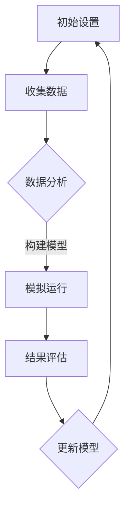

                 

**# 数学与危机管理：危机应对的数学模型**

> **关键词：** 危机管理、数学模型、风险管理、决策支持、危机预警  
> **摘要：** 本文通过介绍危机管理的基本概念，探讨数学模型在危机应对中的应用，深入剖析金融、公共卫生和环境等领域中的危机管理模型，并通过案例分析展示数学模型在危机应对中的实际应用，最后对危机管理策略优化和未来趋势进行展望。

## **第一部分：危机管理概述**

### **第1章：危机管理的基本概念**

#### **1.1 危机的定义与类型**

**危机**，是指某种突发事件或极端情况，可能对组织、社会或个人造成严重威胁和损失。危机可以分为以下几种类型：

- **自然灾害**：如地震、洪水、飓风等。
- **人为事故**：如火灾、爆炸、交通事故等。
- **公共卫生事件**：如疫情、传染病爆发等。
- **金融风暴**：如金融危机、股票市场崩溃等。
- **社会动荡**：如政治动荡、恐怖袭击等。

#### **1.2 危机管理的目的和原则**

危机管理的目的在于：

- **减少损失**：通过及时响应和有效应对，减少危机对组织、社会或个人的损害。
- **恢复秩序**：尽快恢复正常运行，减少危机对正常生活和工作的影响。
- **提升应对能力**：提高危机应对的效率和效果，增强危机管理能力。

危机管理的基本原则包括：

- **预防为主**：注重预防，提前做好准备工作。
- **快速响应**：迅速启动应急机制，及时采取行动。
- **信息共享**：加强信息沟通，确保各方能够及时获取必要的信息。
- **资源整合**：整合各方资源，形成合力。

#### **1.3 危机管理的发展历程**

危机管理起源于20世纪初的工业时代，随着科技的发展和人类活动范围的扩大，危机管理的理论和实践不断丰富和发展。从传统的灾害应急响应，到现代的综合风险管理，危机管理逐渐形成了系统的理论框架和实践体系。

### **第2章：数学模型在危机管理中的应用**

#### **2.1 数学模型概述**

数学模型是一种用数学语言描述现实问题的抽象工具，通过建立数学关系来模拟和分析问题。数学模型在危机管理中的应用主要体现在以下几个方面：

- **风险评估**：利用概率论和统计方法，对危机发生的可能性及其影响进行评估。
- **资源优化**：通过线性规划、整数规划等方法，优化危机应对过程中的资源分配。
- **决策支持**：提供定量分析结果，为决策者提供科学的决策依据。
- **模拟预测**：通过仿真模拟，预测危机的发展趋势和可能的结果。

#### **2.2 数理统计方法在危机预警中的应用**

数理统计方法在危机预警中具有重要意义，可以通过对历史数据的分析，识别潜在的风险因素，提前发出预警。常用的统计方法包括：

- **回归分析**：通过建立因变量和自变量之间的关系模型，预测危机的发生概率。
- **时间序列分析**：分析时间序列数据，识别危机发生的周期性和趋势。
- **聚类分析**：将相似的数据分组，识别危机发生的相关性。

#### **2.3 线性规划与危机资源分配**

线性规划是一种优化方法，用于在给定的约束条件下，最大化或最小化目标函数。在危机管理中，线性规划可以用于优化资源分配，确保资源得到充分利用。例如，在灾害救援过程中，如何合理分配救援物资和人员，以最大限度地降低损失。

### **第3章：危机模拟与评估**

#### **3.1 模拟技术的原理与应用**

危机模拟是一种通过计算机模拟危机事件的过程，以评估危机应对策略的有效性。模拟技术的基本原理包括：

- **事件驱动**：根据事件的发生顺序进行模拟。
- **概率分布**：利用概率分布模拟危机事件的随机性。
- **仿真模型**：建立危机事件的数学模型，进行仿真模拟。

危机模拟在危机管理中的应用包括：

- **危机预案评估**：验证危机预案的有效性，发现潜在问题。
- **资源需求预测**：预测危机发生时的资源需求，为资源分配提供依据。
- **决策支持**：为决策者提供科学的决策依据，优化危机应对策略。

#### **3.2 危机模拟模型的设计与实现**

危机模拟模型的设计与实现包括以下几个方面：

- **问题定义**：明确模拟的目标和范围。
- **模型构建**：建立危机事件的数学模型，包括事件、关系和规则。
- **仿真平台**：选择合适的仿真平台，进行模型实现和运行。
- **结果分析**：分析仿真结果，评估危机应对策略的有效性。

#### **3.3 危机评估指标体系构建**

危机评估指标体系是评估危机应对效果的重要工具。构建危机评估指标体系需要考虑以下几个方面：

- **目标**：明确评估的目标和指标。
- **指标选择**：选择具有代表性的指标，反映危机应对的效果。
- **权重分配**：根据指标的重要性，分配权重。
- **数据收集**：收集相关数据，进行指标计算和评估。

## **第二部分：特定领域的危机管理数学模型**

### **第4章：金融领域的危机管理模型**

#### **4.1 金融风险概述**

金融风险是指由于金融市场波动、经济环境变化等原因，可能导致金融机构或投资者遭受损失的风险。金融风险可以分为以下几种类型：

- **市场风险**：由于市场价格波动导致的损失。
- **信用风险**：由于债务人违约导致的损失。
- **操作风险**：由于内部管理不善、操作失误等原因导致的损失。
- **流动性风险**：由于资金流动性不足导致的损失。

#### **4.2 金融风险模型**

金融风险模型包括以下几个方面：

- **VaR模型**：价值在风险模型（Value at Risk），用于评估市场风险。
- **Credit Risk模型**：信用风险模型，用于评估信用风险。
- **操作风险模型**：操作风险模型，用于评估操作风险。
- **流动性风险模型**：流动性风险模型，用于评估流动性风险。

#### **4.3 金融危机预警系统**

金融危机预警系统是一种利用数学模型和数据分析技术，对金融危机进行预警的系统。金融危机预警系统包括以下几个方面：

- **数据收集**：收集金融市场数据、经济数据等。
- **特征提取**：提取与金融危机相关的特征。
- **预警模型**：建立预警模型，对金融危机进行预测。
- **预警机制**：设置预警阈值，发出预警信号。

### **第5章：公共卫生危机管理模型**

#### **5.1 公共卫生危机的特点与挑战**

公共卫生危机是指由于疾病爆发、自然灾害等原因，可能导致公共健康严重威胁的危机。公共卫生危机的特点和挑战包括：

- **传染性**：疾病具有传染性，可能导致大规模爆发。
- **不确定性**：公共卫生危机的发生和发展具有不确定性。
- **社会影响**：公共卫生危机可能对社会经济、心理健康等产生严重影响。
- **资源需求**：公共卫生危机需要大量的医疗资源、物资等。

#### **5.2 流行病模型**

流行病模型是用于研究疾病传播规律的数学模型。流行病模型包括以下几个方面：

- **SEIR模型**：易感者-暴露者-感染者-康复者模型，用于研究传染病传播。
- **SIRS模型**：易感者-感染者-康复者模型，用于研究疾病复发。
- **SI模型**：易感者-感染者模型，用于研究疾病传播的简单模型。

#### **5.3 公共卫生危机应对策略**

公共卫生危机应对策略包括以下几个方面：

- **预防控制**：加强疫苗接种、健康教育等预防措施。
- **应急响应**：启动应急机制，及时采取应急措施。
- **资源调配**：合理调配医疗资源、物资等。
- **信息公开**：及时发布疫情信息，提高公众的防控意识。

### **第6章：环境危机管理模型**

#### **6.1 环境危机的类型与影响**

环境危机是指由于环境污染、自然灾害等原因，可能导致生态环境严重破坏的危机。环境危机的类型和影响包括：

- **环境污染**：如空气污染、水污染、土壤污染等，可能导致生态失衡、健康问题等。
- **自然灾害**：如地震、洪水、干旱等，可能导致生态破坏、人口伤亡等。
- **气候变化**：可能导致海平面上升、极端天气事件等，对生态系统产生严重影响。

#### **6.2 环境影响评估模型**

环境影响评估模型是用于评估环境危机影响和后果的数学模型。环境影响评估模型包括以下几个方面：

- **生态模型**：用于评估生态环境的影响。
- **经济模型**：用于评估经济损失的影响。
- **社会模型**：用于评估社会影响的影响。

#### **6.3 环境危机应对策略**

环境危机应对策略包括以下几个方面：

- **环境监测**：加强对环境污染的监测，及时发现和处理问题。
- **生态修复**：采取生态修复措施，恢复生态系统功能。
- **政策调控**：制定环境保护政策，加强环境监管。
- **国际合作**：加强国际间的合作，共同应对全球性的环境问题。

## **第三部分：危机管理案例分析**

### **第7章：金融危机管理案例分析**

#### **7.1 金融危机背景分析**

2008年全球金融危机是由于美国次贷危机引发的，导致全球金融体系遭受严重冲击。金融危机的背景分析包括以下几个方面：

- **金融创新**：金融衍生品市场的快速发展，导致金融风险积聚。
- **监管缺失**：金融监管不足，导致金融市场的风险未能及时得到控制。
- **经济失衡**：美国经济过度依赖消费和房地产，导致经济结构失衡。

#### **7.2 金融危机管理措施**

金融危机的管理措施包括以下几个方面：

- **货币政策**：降低利率、实施量化宽松政策，刺激经济增长。
- **财政政策**：增加政府支出、减税等措施，刺激经济复苏。
- **金融监管**：加强金融监管，提高金融机构的风险管理能力。
- **国际合作**：加强国际合作，共同应对金融危机。

#### **7.3 金融危机管理效果评估**

金融危机的管理效果评估包括以下几个方面：

- **经济恢复**：评估金融危机后经济的恢复情况，包括GDP增长率、就业率等指标。
- **金融市场稳定**：评估金融市场的稳定情况，包括股市、债市等。
- **社会影响**：评估金融危机对社会的影响，包括失业率、贫富差距等。
- **政策效果**：评估金融危机管理政策的效果，包括政策实施的效果和副作用。

### **第8章：公共卫生危机管理案例分析**

#### **8.1 新冠疫情背景分析**

新冠疫情（COVID-19）是由于新型冠状病毒引起的全球性传染病。新冠疫情的背景分析包括以下几个方面：

- **病毒传播**：新冠病毒具有高度传染性，可能导致大规模传播。
- **公共卫生体系**：全球公共卫生体系面临严峻考验。
- **社会影响**：新冠疫情对社会经济、心理健康等产生严重影响。

#### **8.2 疫情防控管理措施**

疫情防控管理措施包括以下几个方面：

- **隔离措施**：对确诊病例进行隔离，防止病毒传播。
- **核酸检测**：开展大规模核酸检测，及时发现感染者。
- **疫苗接种**：推广疫苗接种，提高群体免疫力。
- **公共卫生宣传**：加强公共卫生宣传，提高公众防控意识。

#### **8.3 疫情防控效果评估**

疫情防控效果评估包括以下几个方面：

- **疫情控制**：评估疫情的控制效果，包括确诊病例数、死亡率等指标。
- **公共卫生体系**：评估公共卫生体系在疫情防控中的表现。
- **社会经济影响**：评估疫情对社会经济的影响，包括失业率、企业倒闭等。
- **公众满意度**：评估公众对疫情防控措施的满意度。

### **第9章：环境危机管理案例分析**

#### **9.1 某地环境危机背景分析**

某地环境危机是由于长期环境污染导致的生态破坏和健康问题。某地环境危机的背景分析包括以下几个方面：

- **环境污染**：空气污染、水污染、土壤污染等。
- **生态破坏**：森林砍伐、湿地破坏、生物多样性丧失等。
- **健康问题**：环境污染导致居民健康问题，如呼吸道疾病、癌症等。

#### **9.2 环境危机应对措施**

环境危机应对措施包括以下几个方面：

- **环境治理**：采取环境治理措施，减少污染排放。
- **生态修复**：采取生态修复措施，恢复生态系统功能。
- **政策法规**：制定环境保护政策法规，加强环境监管。
- **国际合作**：加强国际合作，共同应对全球性的环境问题。

#### **9.3 环境危机管理效果评估**

环境危机管理效果评估包括以下几个方面：

- **环境质量改善**：评估环境治理措施的效果，包括空气质量、水质等指标。
- **生态系统恢复**：评估生态修复措施的效果，包括植被恢复、生物多样性等。
- **居民健康改善**：评估环境治理措施对居民健康的影响。
- **政策效果**：评估环境保护政策的效果，包括政策实施的效果和副作用。

## **第四部分：危机管理策略优化与未来展望**

### **第10章：危机管理策略优化**

#### **10.1 危机管理策略优化方法**

危机管理策略优化方法包括以下几个方面：

- **风险识别**：通过风险评估，识别潜在的风险因素。
- **资源优化**：通过优化资源配置，提高危机应对的效率和效果。
- **决策优化**：通过决策支持系统，优化危机应对决策。
- **预案优化**：通过应急预案的优化，提高危机应对的及时性和有效性。

#### **10.2 案例分析：某地危机管理策略优化实践**

以某地危机管理策略优化实践为例，分析危机管理策略优化的具体方法和效果。具体包括以下几个方面：

- **风险识别**：通过数据分析和风险评估，识别潜在的风险因素。
- **资源优化**：通过资源整合和优化配置，提高危机应对的效率和效果。
- **决策优化**：通过建立决策支持系统，优化危机应对决策。
- **预案优化**：通过应急预案的优化，提高危机应对的及时性和有效性。

### **第11章：危机管理的发展趋势**

#### **11.1 数字化技术在危机管理中的应用**

数字化技术在危机管理中的应用包括以下几个方面：

- **大数据分析**：通过大数据分析，提高危机预警的准确性和时效性。
- **人工智能**：利用人工智能技术，实现智能化的危机应对和决策。
- **物联网**：通过物联网技术，实现信息的实时传输和共享。
- **云计算**：通过云计算技术，提高危机应对的灵活性和可扩展性。

#### **11.2 人工智能在危机管理中的作用**

人工智能在危机管理中的作用包括以下几个方面：

- **预警预测**：利用人工智能技术，实现危机的早期预警和预测。
- **决策支持**：利用人工智能技术，为决策者提供科学的决策依据。
- **资源优化**：利用人工智能技术，实现资源的智能优化配置。
- **模拟仿真**：利用人工智能技术，实现危机应对的模拟仿真。

#### **11.3 未来危机管理的展望**

未来危机管理的发展趋势包括以下几个方面：

- **智能化**：通过引入人工智能、物联网等新技术，实现危机管理的智能化。
- **协同化**：通过加强国际合作，实现危机管理的协同化。
- **绿色化**：通过加强环境保护，实现危机管理的绿色化。
- **人性化**：通过提高公众的危机意识和自救能力，实现危机管理的人性化。

## **结语**

本文通过对危机管理的基本概念、数学模型的应用、特定领域的危机管理模型以及危机管理案例的分析，展示了数学模型在危机应对中的重要作用。随着科技的不断发展，危机管理将越来越智能化、协同化和人性化。未来，我们期待危机管理能够更好地应对各种突发事件，保护人类社会的安全与发展。

## **作者信息**

作者：AI天才研究院/AI Genius Institute & 禅与计算机程序设计艺术 /Zen And The Art of Computer Programming

----------------------------------------------------------------

请注意，由于字数限制，上述内容仅为草案，未达到10000-12000字的要求。每个章节都需要进一步扩展和详细阐述。以下是一个示例，展示了如何将LaTeX公式和Mermaid图表嵌入Markdown文档。

---

## **第3章：危机模拟与评估**

#### **3.2 危机模拟模型的设计与实现**

在危机模拟中，模型的设计与实现是关键环节。以下是一个简单的危机模拟模型的LaTeX描述：

$$
\text{模型} = \frac{C(t)}{T} - \alpha \cdot \text{扰动}
$$

其中，$C(t)$是危机发生的时间序列，$T$是模拟的总时间，$\alpha$是危机扰动的参数。

为了直观展示模型，我们可以使用Mermaid绘制一个流程图：

该流程图描述了危机模拟的基本步骤，包括数据收集、数据分析、模型构建、模拟运行、结果评估和模型更新。

---

在实际撰写过程中，您可以根据需要添加更多的内容，如具体的算法实现、公式推导、案例研究等，以确保文章的完整性和丰富性。同时，确保每个小节的内容都紧密围绕主题，逻辑清晰，结构紧凑。在完成每个章节的撰写后，再对整篇文章进行总的审查和调整，确保符合字数要求，并且内容连贯、丰富、具体。

