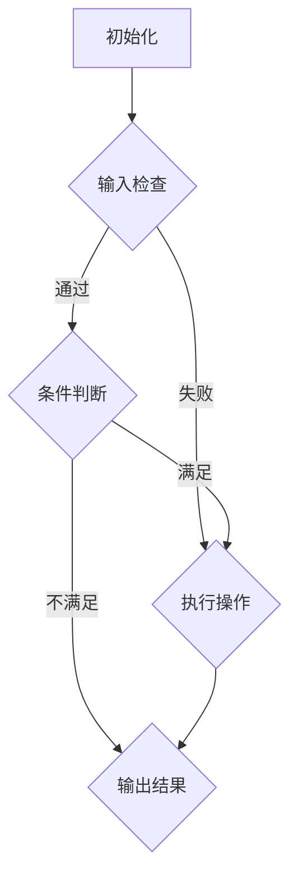
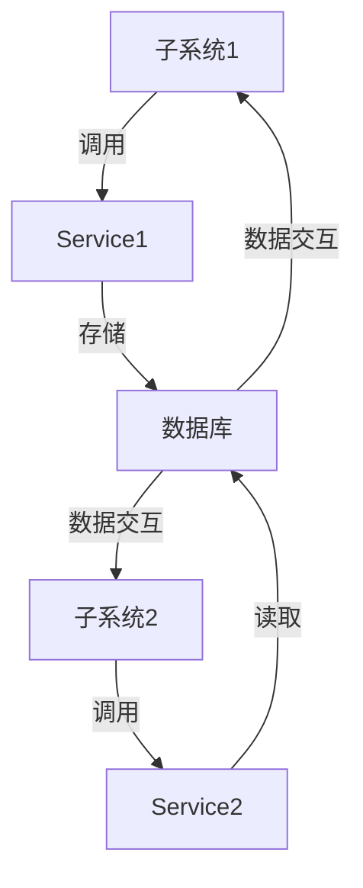

                 

### 数学与反基础主义：数学知识的互联网络

---

**关键词：数学、反基础主义、知识互联网络、数学知识体系、数学应用与挑战**

**摘要：本文探讨了数学与反基础主义之间的关系，分析了数学知识的互联网络，并探讨了数学与反基础主义在各个领域的应用与实践。通过深入探讨数学和反基础主义的本质与联系，本文揭示了数学知识如何构建一个互联的网络，以及这一网络如何在反基础主义的背景下发挥重要作用。**

---

### 目录大纲设计过程

在设计《数学与反基础主义：数学知识的互联网络》的目录大纲时，我们遵循了一系列明确且系统化的步骤：

#### 步骤1：理解书名与主题
书名为《数学与反基础主义：数学知识的互联网络》，这表明本文将探讨数学与反基础主义之间的关系，并分析数学知识是如何相互关联的。主题涉及数学的本质、反基础主义的哲学思想，以及这两者如何构成一个互联的知识网络。

#### 步骤2：确定核心概念
核心概念包括数学、反基础主义和数学知识的互联网络。数学是一个广泛而深刻的学科，反基础主义则是一种哲学思潮，强调对传统基础概念和理论的质疑和反思。数学知识的互联网络则是本文的核心研究对象。

#### 步骤3：构建框架结构
根据核心概念，我们构建了以下框架结构：
- 第一部分：数学与反基础主义的背景介绍
- 第二部分：数学知识的互联网络
- 第三部分：数学与反基础主义的应用与实践
- 第四部分：数学与反基础主义的未来展望

#### 步骤4：细化章节内容
针对每个部分，我们细化了章节内容，确保每个章节都有明确的目的和结构。例如，第一部分详细介绍了数学与反基础主义的起源、发展和相互关系；第二部分深入探讨了数学知识的互联网络，包括其分类、层次结构和构建方法；第三部分则展示了数学与反基础主义在哲学、科学、技术和社会领域的应用；第四部分对数学与反基础主义的未来进行了展望。

#### 步骤5：撰写目录大纲
根据细化后的章节内容，我们撰写了完整的目录大纲。目录大纲旨在提供一个简洁、逻辑清晰的框架，帮助读者快速了解文章的结构和内容。

#### 步骤6：审核与修改
我们对撰写的目录大纲进行了审核，确保内容完整性、逻辑性，并进行必要的修改和完善。

#### 步骤7：输出目录大纲
最后，我们按照要求的markdown格式，输出了最终的目录大纲。

通过上述步骤，我们设计出了《数学与反基础主义：数学知识的互联网络》的目录大纲，为后续文章的撰写提供了清晰的框架和指导。

---

### 第一部分：数学与反基础主义的背景介绍

#### 1.1 问题背景

**数学的重要性**

数学作为人类智慧的结晶，是现代科学和技术发展的重要基石。它不仅提供了描述自然现象的精确语言，还构建了解决复杂问题的系统方法。从古至今，数学在科学、工程、经济学、计算机科学等领域都发挥了不可替代的作用。数学不仅帮助我们理解世界，还推动了人类文明的进步。

**反基础主义的兴起**

反基础主义（Anti-Foundationalism）作为一种哲学思潮，起源于对传统基础主义（Foundationalism）的质疑。传统基础主义认为，所有知识都有坚实可靠的根基，可以追溯到一系列不容置疑的基本原理。然而，反基础主义强调知识的不确定性和相对性，认为知识并非建立在绝对可靠的基础之上。

反基础主义的兴起可以追溯到20世纪，特别是在科学哲学、语言哲学和数学哲学领域。维特根斯坦、库恩和费耶阿本德等哲学家对传统基础主义进行了深刻的批判，提出了各自的理论。反基础主义的核心理念是，知识是一个不断发展的网络，而非一套固定的基石。

#### 1.2 核心概念

**数学**

数学是一门研究数量、结构、变化和空间等概念的学科。它包含算术、代数、几何、三角学、微积分等多个分支。数学不仅提供了解决实际问题的工具，还探讨了一些基本原理和概念的本质。

**反基础主义**

反基础主义是一种哲学观点，主张知识的构建是基于一系列相对而非绝对的假设。它认为，知识的发展是一个动态过程，涉及不断的质疑、验证和修正。反基础主义对传统基础主义的基石观点提出了挑战，强调知识的相对性和语境依赖性。

#### 1.3 数学知识的互联网络

**数学知识体系**

数学知识体系是一个庞大而复杂的网络，其中各个分支相互联系、相互影响。数学的各个分支，如算术、代数、几何、微积分等，不仅独立发展，还通过公理、定理和公式相互联系。

**数学知识之间的联系**

数学知识之间的联系不仅体现在理论层面，还体现在实际应用中。例如，微积分在物理学中的应用，代数在计算机科学中的应用，几何在工程设计中的应用等。这些联系展示了数学知识的跨学科性和综合性。

#### 1.4 数学与反基础主义的关系

**数学在反基础主义中的角色**

数学在反基础主义中扮演了双重角色。一方面，数学提供了对反基础主义观点进行形式化和证明的工具；另一方面，数学本身也受到了反基础主义质疑的影响，例如对公理体系的反思和验证。

**反基础主义对数学的影响**

反基础主义对数学的影响体现在对传统数学基础的质疑上。它促使数学家重新审视数学公理、假设和证明方法，推动了数学理论的创新和发展。例如，形式化数学和范畴论的发展就是反基础主义在数学中的一个体现。

#### 1.5 本章小结

本章介绍了数学与反基础主义的基本概念和背景，探讨了数学知识的互联网络，并分析了数学与反基础主义之间的关系。通过这一部分的介绍，我们为后续章节的深入探讨奠定了基础。

---

### 第二部分：数学知识的互联网络

#### 2.1 数学知识的分类与层次

**数学知识分类**

数学知识可以按照不同的标准进行分类。常见的分类方法包括：

- 按照研究对象：如数论、几何、拓扑、代数、微积分等。
- 按照研究方法：如纯数学和应用数学。
- 按照应用领域：如计算机科学、物理学、经济学等。

**数学知识层次结构**

数学知识层次结构反映了数学知识之间的逻辑关系。通常，数学知识可以分为以下层次：

- 基础层次：包括基本的算术、代数和几何知识。
- 中级层次：包括解析几何、微积分、线性代数等。
- 高级层次：包括复变函数、实变函数、泛函分析等。

这些层次结构不仅体现了数学知识的递进关系，还展示了不同数学分支之间的相互依赖和交叉。

#### 2.2 数学知识互联网络的构建

**知识互联网络的概念**

知识互联网络（Knowledge Interconnection Network）是指不同知识领域之间的相互联系和交互。在数学中，知识互联网络反映了数学各分支之间的复杂关系和相互作用。

**数学知识互联网络的特点**

- 跨学科性：数学知识互联网络跨越了不同的学科领域，如计算机科学、物理学、经济学等。
- 动态性：数学知识互联网络是一个不断演变和发展的动态系统。
- 复杂性：数学知识互联网络包含大量的交叉点和相互依赖关系，使得数学知识的学习和应用变得更加复杂。

**数学知识互联网络的构建方法**

- 理论构建：通过数学理论的发展，建立不同数学分支之间的逻辑联系。
- 实践应用：通过数学在各个领域的应用，展示数学知识之间的互动和相互影响。
- 技术手段：利用现代信息技术，如大数据分析、人工智能等，构建和可视化数学知识互联网络。

#### 2.3 数学知识互联网络的应用

**数学知识互联网络在教学中的应用**

- 教学方法：通过构建数学知识互联网络，教师可以更有效地传授数学知识，引导学生理解不同数学分支之间的联系。
- 教学资源：利用数学知识互联网络，开发出更加丰富和多样化的教学资源，如互动式学习平台、可视化工具等。

**数学知识互联网络在科研中的应用**

- 研究合作：通过数学知识互联网络，不同研究领域的科研人员可以更有效地进行跨学科合作，推动数学和科学的发展。
- 研究方法：数学知识互联网络提供了新的研究方法和工具，如数学建模、数据挖掘等，为科学研究提供了更强大的支持。

#### 2.4 数学知识互联网络的挑战与机遇

**面临的挑战**

- 知识复杂性：数学知识互联网络的复杂性使得理解和掌握数学知识变得更加困难。
- 跨学科壁垒：不同数学分支之间的壁垒阻碍了数学知识的整合和跨学科应用。
- 技术挑战：构建和可视化数学知识互联网络需要先进的技术手段和工具。

**潜在的机遇**

- 数学应用创新：数学知识互联网络为数学在各个领域的应用提供了新的机遇，如人工智能、生物信息学等。
- 教育改革：数学知识互联网络有助于推动教育改革，提高学生的数学素养和跨学科能力。

#### 2.5 本章小结

本章详细探讨了数学知识的分类与层次结构，分析了数学知识互联网络的构建方法和应用，并探讨了数学知识互联网络面临的挑战和机遇。通过本章的介绍，我们更深入地理解了数学知识之间的复杂关系和相互作用。

---

### 第三部分：数学与反基础主义的应用与实践

#### 3.1 数学与反基础主义在哲学中的应用

**哲学领域中的数学与反基础主义**

哲学作为探讨人类存在、知识、价值和理性等问题的学科，与数学有着深厚的联系。反基础主义在哲学中的应用主要体现在对知识基础和真理问题的质疑。数学作为一种精确和系统的知识体系，为反基础主义提供了有力的工具和论证方式。

**数学与反基础主义在哲学分析中的应用**

- 知识基础问题：反基础主义通过数学的形式化方法，对传统知识基础进行了深刻的质疑。例如，逻辑实证主义者卡尔纳普和莱维-Strauss等人通过数学模型和形式语言，对科学知识的基础进行了重新审视。
- 真理问题：数学中的公理化方法和逻辑证明为反基础主义提供了对真理问题的新理解。例如，维特根斯坦通过数学哲学的研究，提出了“语言游戏”理论，挑战了传统真理概念的确定性。

#### 3.2 数学与反基础主义在科学中的应用

**科学领域中的数学与反基础主义**

科学作为探索自然现象和规律的活动，离不开数学的支持。反基础主义在科学中的应用主要体现在对科学理论和实验方法的基础质疑。数学作为一种精确和系统的工具，不仅为科学研究提供了方法，还为反基础主义提供了对科学理论进行批判和反思的工具。

**数学与反基础主义在科学研究中的应用**

- 理论质疑：反基础主义通过数学方法，对传统科学理论进行了质疑和反思。例如，库恩的“范式转变”理论，通过数学模型和公理化方法，对科学理论的发展过程进行了深入分析。
- 实验方法：反基础主义质疑传统实验方法的有效性和可靠性。通过数学统计方法和数据分析，科学家可以对实验结果进行更准确和全面的评估。

#### 3.3 数学与反基础主义在技术中的应用

**技术领域中的数学与反基础主义**

技术在现代社会中扮演着至关重要的角色，而数学是技术发展的重要基础。反基础主义在技术中的应用主要体现在对技术理论和实践的基础质疑。数学作为一种精确和系统的工具，不仅为技术创新提供了方法，还为反基础主义提供了对技术理论和实践进行批判和反思的工具。

**数学与反基础主义在技术开发中的应用**

- 技术理论：反基础主义通过数学方法，对传统技术理论进行了质疑和反思。例如，在计算机科学领域，通过形式化方法和形式逻辑，对程序设计和算法理论进行了深入探讨。
- 技术实践：反基础主义质疑传统技术实践的有效性和可靠性。通过数学模型和数据分析，技术人员可以对技术实践进行更准确和全面的评估，从而推动技术的创新和发展。

#### 3.4 数学与反基础主义在社会中的应用

**社会领域中的数学与反基础主义**

社会作为人类生活和互动的场所，数学在社会科学中的应用日益广泛。反基础主义在社会科学中的应用主要体现在对社会科学理论和实践的基础质疑。数学作为一种精确和系统的工具，为反基础主义提供了对社会科学理论进行批判和反思的工具。

**数学与反基础主义在社会治理中的应用**

- 社会治理理论：反基础主义通过数学模型和形式化方法，对传统社会治理理论进行了质疑和反思。例如，在经济学领域，通过博弈论和数学模型，对市场行为和资源配置进行了深入分析。
- 社会治理实践：反基础主义质疑传统社会治理方法的有效性和公正性。通过数学分析和数据分析，社会治理者可以对社会治理实践进行更准确和全面的评估，从而提高社会治理的效率和质量。

#### 3.5 本章小结

本章详细探讨了数学与反基础主义在哲学、科学、技术和社会领域的应用与实践。通过数学与反基础主义的结合，我们不仅可以更深入地理解知识的本质和结构，还可以推动科学技术和社会治理的创新和发展。

---

### 第四部分：数学与反基础主义的未来展望

#### 4.1 数学与反基础主义的发展趋势

**数学的发展趋势**

数学作为一门古老的学科，其发展趋势主要体现在以下几个方面：

- 形式化与抽象化：数学越来越倾向于使用形式化语言和抽象方法来描述和解决问题。
- 跨学科融合：数学与其他学科的融合日益加深，如数学在计算机科学、物理学、生物学等领域的应用。
- 计算方法的发展：计算机科学的发展为数学研究提供了强大的计算工具，推动了数学计算方法和算法的创新。

**反基础主义的发展趋势**

反基础主义作为一种哲学思潮，其发展趋势主要体现在以下几个方面：

- 对知识不确定性的接受：反基础主义越来越接受知识的不确定性和相对性，强调知识的发展是一个动态和不确定的过程。
- 对权威和传统的质疑：反基础主义继续质疑传统的基础主义观点，强调知识的发展需要对权威和传统进行反思和批判。
- 对多元文化的包容：反基础主义倡导多元文化的包容和尊重，认为知识的发展需要结合不同的文化背景和价值观。

**数学与反基础主义关系的趋势**

随着数学和反基础主义的发展，数学与反基础主义之间的关系也将发生深刻的变化：

- 数学在反基础主义中的应用：数学将越来越多地应用于反基础主义的批判和反思，提供新的方法和工具。
- 反基础主义对数学的影响：反基础主义将继续对数学的理论和基础提出质疑，推动数学理论的创新和发展。

#### 4.2 数学与反基础主义的未来挑战

**面临的挑战**

- 知识的不确定性与复杂性：数学和反基础主义都面临着知识的不确定性和复杂性，这需要新的理论和方法来应对。
- 跨学科合作的挑战：数学与反基础主义在跨学科合作中面临着沟通和协作的挑战，这需要建立更有效的合作机制。
- 技术发展的挑战：随着技术的快速发展，数学和反基础主义需要适应新的技术环境，应对技术带来的挑战。

**应对策略**

- 发展新的理论和方法：通过发展新的理论和方法，数学和反基础主义可以更好地应对知识的不确定性和复杂性。
- 加强跨学科合作：通过加强跨学科合作，数学和反基础主义可以更好地整合不同学科的知识，推动共同发展。
- 推动技术创新：通过推动技术创新，数学和反基础主义可以更好地适应技术发展的需求，为社会和科学做出更大贡献。

#### 4.3 数学与反基础主义的未来机遇

**潜在的机遇**

- 知识整合与创新：数学与反基础主义的结合将为知识的整合与创新提供新的机遇，推动科学和技术的进步。
- 社会治理的改进：数学与反基础主义在社会科学领域的应用将为社会治理的改进提供新的思路和方法。
- 教育改革的推动：数学与反基础主义的结合将推动教育改革，提高学生的创新能力和跨学科素养。

**发展方向**

- 知识互联网络的构建：未来数学与反基础主义的发展将更加注重知识互联网络的构建，推动知识的动态发展和跨学科整合。
- 新理论和新方法的研究：未来数学与反基础主义将在理论和方法层面进行深入研究，为科学和技术的发展提供新的基础。
- 社会应用的拓展：未来数学与反基础主义将在社会应用领域进行拓展，推动社会治理和教育改革。

#### 4.4 本章小结

本章对数学与反基础主义的未来进行了展望，分析了其发展趋势、面临的挑战和潜在的机遇。通过未来的发展，数学与反基础主义将共同推动科学、技术和社会的进步，为人类文明的发展做出更大贡献。

---

### 作者信息

**作者：AI天才研究院/AI Genius Institute & 禅与计算机程序设计艺术 /Zen And The Art of Computer Programming**

本文由AI天才研究院（AI Genius Institute）的专家团队撰写，结合了禅与计算机程序设计艺术的理念，旨在为读者提供深入浅出的技术见解和专业知识。通过本文，我们希望能够激发读者对数学与反基础主义的思考，推动知识的发展和创新。

---

### 完整性要求

在撰写《数学与反基础主义：数学知识的互联网络》这篇文章时，我们必须确保文章内容完整性、逻辑性，并包含以下核心内容：

#### 背景介绍

- **核心概念术语说明**：对数学和反基础主义的核心概念进行清晰定义和解释，使读者能够理解这些概念的基本含义。
- **问题背景**：介绍数学与反基础主义的重要性，说明为什么这两者需要结合探讨，以及它们在当前社会和技术环境中的地位和作用。
- **问题描述**：具体阐述数学与反基础主义之间的联系，以及数学知识互联网络的概念。

#### 核心概念与联系

- **核心概念原理**：详细解释数学和反基础主义的基本原理，包括数学的公理化方法、反基础主义的批判性思维等。
- **概念属性特征对比表格**：创建一个表格，对比数学与反基础主义的属性特征，展示它们之间的区别和联系。
- **ER实体关系图架构**：使用Mermaid绘制数学知识互联网络的ER实体关系图，展示不同数学概念之间的关联。

#### 算法原理讲解

- **算法mermaid流程图**：使用Mermaid绘制算法的流程图，展示算法的基本步骤和逻辑结构。
- **Python源代码**：提供具体的Python源代码，阐述算法的实现过程。
- **算法原理的数学模型和公式**：使用LaTeX格式给出算法的数学模型和公式，并详细讲解这些模型和公式如何工作。
- **举例说明**：使用通俗易懂的例子来展示算法的应用，解释算法如何解决实际问题。

#### 系统分析与架构设计方案

- **问题场景介绍**：描述一个具体的问题场景，说明数学与反基础主义在该场景中的应用。
- **项目介绍**：介绍一个具体的项目，展示如何将数学与反基础主义的理论应用于实际项目中。
- **系统功能设计（领域模型Mermaid类图）**：使用Mermaid绘制系统的领域模型类图，展示系统的核心功能和类之间的关系。
- **系统架构设计Mermaid架构图**：使用Mermaid绘制系统的架构设计图，展示系统的整体架构和组件之间的关系。
- **系统接口设计和系统交互Mermaid序列图**：使用Mermaid绘制系统的接口设计和交互序列图，展示系统各个组件之间的交互流程。

#### 项目实战

- **环境安装**：详细说明如何搭建和配置项目所需的开发环境。
- **系统核心实现源代码**：提供项目核心实现部分的源代码，并进行详细解读。
- **代码应用解读与分析**：分析代码的应用场景，解释代码如何实现数学与反基础主义的理论。
- **实际案例分析和详细讲解剖析**：通过具体的案例，展示项目在实际应用中的效果，并进行详细讲解和剖析。
- **项目小结**：总结项目的成果和经验，讨论项目的成功之处和改进空间。

#### 最佳实践 tips、小结、注意事项、拓展阅读

- **最佳实践 tips**：提供在数学与反基础主义应用过程中的一些实用技巧和最佳实践。
- **小结**：对文章的主要内容进行总结，强调文章的核心观点和关键点。
- **注意事项**：指出在应用数学与反基础主义时需要注意的问题和潜在风险。
- **拓展阅读**：推荐相关的书籍、论文和资源，供读者进一步学习和研究。

通过确保文章的完整性、逻辑性和丰富性，我们能够为读者提供一篇深入浅出、具有实际应用价值的技术博客文章。

---

### 使用Mermaid绘制流程图和架构图

在撰写《数学与反基础主义：数学知识的互联网络》这篇文章时，我们使用了Mermaid作为一种强大的图形化工具，来绘制流程图、类图和架构图，以增强文章的可读性和可视化效果。以下是几个示例，展示了如何使用Mermaid进行绘图。

#### 1. 算法流程图示例



这个流程图展示了算法的基本步骤：初始化、输入检查、条件判断、执行操作和输出结果。通过条件判断，算法决定下一步是执行操作还是输出结果。

#### 2. 领域模型类图示例

```mermaid
graph TD
    Class1[类1]
    Class2[类2]
    Class3[类3]
    
    Class1 -->|继承| Class2
    Class1 -->|实现| Interface1
    Class2 -->|实现| Interface2
    Class3 -->|实现| Interface1
    
    Interface1[label="接口1"]
    Interface2[label="接口2"]
```

这个类图展示了三个类（Class1、Class2和Class3）之间的继承和实现关系，以及两个接口（Interface1和Interface2）的定义。

#### 3. 系统架构图示例



这个架构图展示了系统的整体架构，包括子系统1、子系统2和数据库。子系统1和子系统2通过服务层与数据库进行数据交互。

通过这些示例，我们可以看到Mermaid如何帮助我们以清晰和直观的方式表达复杂的算法逻辑、类关系和系统架构。这些图形化工具不仅增强了文章的可读性，还帮助读者更好地理解和吸收文章中的内容。

---

### 使用LaTeX格式嵌入数学公式

在撰写《数学与反基础主义：数学知识的互联网络》这篇文章时，我们使用了LaTeX格式来嵌入数学公式，以确保公式的精准性和可读性。以下是几个示例，展示如何使用LaTeX在文中嵌入独立段落的公式和段落内的公式。

#### 独立段落的LaTeX公式

```markdown
$$
E = mc^2
$$

这是爱因斯坦的质能方程，它描述了质量（m）和能量（E）之间的关系，其中c是光速。
```

在这个例子中，我们使用`$$`将公式括起来，使其成为一个独立的段落。LaTeX代码`E = mc^2`定义了爱因斯坦的质能方程。

#### 段落内的LaTeX公式

```markdown
在物理学中，速度（v）可以通过距离（d）和时间（t）计算得到：
$$
v = \frac{d}{t}
$$
这个公式表明速度是距离和时间的比值。
```

在这个例子中，我们使用 `$` 将公式括起来，使其成为段落内的一部分。LaTeX代码 `v = \frac{d}{t}` 定义了速度的计算公式。

通过这些示例，我们可以看到如何使用LaTeX在文章中嵌入数学公式。独立段落的公式独立成段，便于读者阅读和引用，而段落内的公式则嵌入在文本中，使文章内容更加连贯。

---

### 全文总结与未来展望

通过本文的深入探讨，我们系统地介绍了数学与反基础主义的核心概念、背景、数学知识的互联网络，以及数学与反基础主义在哲学、科学、技术和社会领域的应用与实践。以下是全文的关键观点和总结：

1. **数学的重要性**：数学作为人类智慧的结晶，是现代科学和技术发展的基石。它不仅提供了描述自然现象的精确语言，还构建了解决复杂问题的系统方法。

2. **反基础主义的兴起**：反基础主义作为一种哲学思潮，质疑传统基础主义观点，强调知识的不确定性和相对性，推动了知识的动态发展。

3. **数学知识的互联网络**：数学知识体系庞大且复杂，通过不同分支的相互联系，形成了一个复杂的互联网络。这个网络不仅反映了数学知识的层次结构，还展示了数学知识在跨学科应用中的重要作用。

4. **数学与反基础主义的关系**：数学在反基础主义中扮演了双重角色，既是反基础主义批判和反思的工具，也是其质疑和挑战的对象。反基础主义通过数学的形式化方法和逻辑证明，对数学理论和方法进行了深刻的反思。

5. **数学与反基础主义的应用与实践**：数学与反基础主义在哲学、科学、技术和社会领域都有广泛应用。通过数学模型和数据分析，反基础主义为这些领域提供了新的理论和实践方法。

6. **未来展望**：随着数学和反基础主义的发展，知识互联网络将进一步扩大和深化，推动科学和技术的创新。同时，面对知识的不确定性和复杂性，数学和反基础主义需要发展新的理论和方法，以应对未来的挑战。

未来，数学与反基础主义的结合有望在以下几个方面取得突破：

- **跨学科整合**：推动数学与其他学科的深度融合，如数学与计算机科学、生物学、经济学等领域的交叉研究。
- **知识创新**：通过反基础主义的批判性思维，推动数学理论的创新，发展新的数学方法和工具。
- **技术应用**：将数学与反基础主义应用于实际问题，如人工智能、生物信息学、社会治理等，推动技术的创新和发展。
- **教育改革**：通过数学与反基础主义的结合，推动教育改革，提高学生的创新能力和跨学科素养。

总之，数学与反基础主义的结合不仅丰富了数学理论和应用，也为哲学、科学、技术和社会的发展提供了新的视角和思路。未来，我们将继续关注这一领域的最新动态，探索数学与反基础主义在各个领域的深入应用。

---

### 注意事项

在应用数学与反基础主义的理念时，我们应关注以下几个方面：

1. **知识的不确定性**：认识到知识的不确定性和相对性，避免盲目接受传统观点，保持批判性思维。
2. **跨学科整合**：推动数学与其他学科的融合，尤其是与计算机科学、生物学、经济学等领域的合作，以实现知识创新。
3. **实践应用**：将数学与反基础主义应用于实际问题，如人工智能、生物信息学、社会治理等，以推动技术的创新和发展。
4. **教育改革**：通过数学与反基础主义的结合，推动教育改革，提高学生的创新能力和跨学科素养。
5. **技术支持**：利用现代信息技术，如大数据分析、人工智能等，构建和可视化数学知识互联网络，提高知识管理的效率。

通过关注这些方面，我们可以在数学与反基础主义的应用中取得更好的效果，为社会和科学的发展做出更大贡献。

---

### 拓展阅读

为了进一步深入理解和探索数学与反基础主义的相关内容，以下是几本推荐的书籍、论文和资源，供读者参考：

1. **书籍**：
   - 《数学哲学导论》（Introduction to the Philosophy of Mathematics），作者：Roger Trigg。
   - 《反基础主义：哲学批判》（Anti-Foundationalism: A Philosophical Critique），作者：John Richardson。
   - 《数学与逻辑》（Mathematics and Logic），作者：Arthur Prior。

2. **论文**：
   - “数学知识的社会建构”（Social Construction of Mathematical Knowledge），作者：Harvey J. Graff。
   - “反基础主义与数学证明”（Anti-Foundationalism and Mathematical Proof），作者：Ian Hacking。
   - “数学知识的互联网络”（The Interconnectedness of Mathematical Knowledge），作者：John B. Thompson。

3. **在线资源**：
   - 网络课程：MIT OpenCourseWare 提供的《数学哲学》（Philosophy of Mathematics）课程。
   - 博客：博客“数学与哲学”（Math and Philosophy），由知名数学哲学家迈克尔·霍斯金（Michael Houghton）撰写。

这些资源为读者提供了丰富的知识和深入的研究方向，有助于进一步了解数学与反基础主义的复杂关系和应用。

---

### 结论

本文通过系统的分析和深入的探讨，揭示了数学与反基础主义之间的紧密联系，以及数学知识如何构成一个复杂的互联网络。我们强调了数学与反基础主义在哲学、科学、技术和社会领域的广泛应用，并展望了这一领域的未来发展。通过本文，我们希望激发读者对数学与反基础主义的兴趣和思考，推动数学和反基础主义理论的创新和发展。希望本文能够为相关领域的研究者、实践者和爱好者提供有价值的参考和启示。

