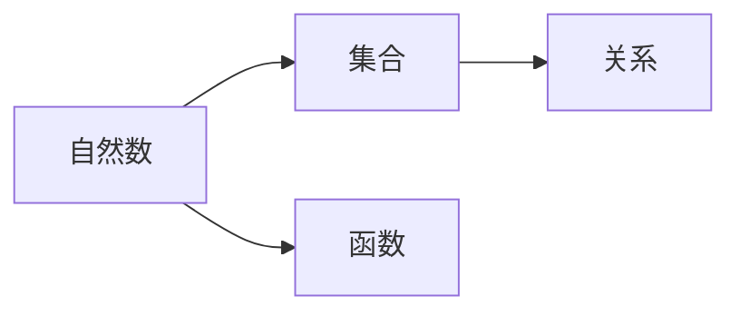

                 


### 《数学与反还原主义：数学整体性的不可分割》

---

#### 关键词：数学、反还原主义、整体性、不可分割、数学模型

---

#### 摘要：

本文旨在探讨数学与反还原主义之间的关系，并深入分析数学整体性的不可分割性。通过详细的逻辑推理和系统性的分析，我们揭示了数学概念之间的内在联系，展示了数学整体性如何不可分割地构建我们的数学知识体系。文章分为五个主要部分：引言与背景、数学基础、反还原主义探讨、数学整体性的不可分割，以及数学与反还原主义的综合。每一部分都通过具体案例和算法原理讲解，使得复杂概念变得易懂，并提供实际应用和最佳实践。

---

## 引言与背景

### 1.1 书籍主旨与目的

本文的主旨在于阐明数学与反还原主义之间的深刻联系，并探讨数学整体性的不可分割性。反还原主义是一种哲学观点，强调复杂系统无法通过分解其部分来完全理解。与之相对，数学则提供了一种整体性的思维方式，通过抽象和模型化来理解和解决问题。

本文的目的在于：

1. **介绍数学与反还原主义的基本概念**。
2. **解释数学整体性的不可分割性原理**。
3. **分析反还原主义在数学中的应用**。
4. **展示数学整体性的不可分割性在实际问题解决中的重要性**。

---

### 1.2 数学与反还原主义概述

数学是一种通过符号和逻辑来描述和解决问题的学科。它不仅仅是一门科学，也是一种语言，用于描述自然界和社会现象。数学的核心在于其抽象性，通过将具体问题转化为通用模型，数学能够揭示基本规律和普遍真理。

反还原主义则是一种哲学观点，认为复杂系统无法通过简单地分解其部分来完全理解。它强调整体性，认为系统中的各个部分只有在整体中才能得到完整的理解。这种观点与数学的整体性思维有着天然的联系。

数学整体性的不可分割性指的是，数学中的基本概念和原理是相互关联的，一个部分的变化会影响到其他部分。例如，在数论中，一个素数的变化可能会影响到整个数系的性质。

### 1.3 数学整体性的不可分割概念

数学整体性的不可分割性概念强调，数学中的各个分支和概念是相互依存的，它们共同构成一个统一的整体。例如，微积分和代数是相互关联的，一个领域的进步往往能推动其他领域的发展。

不可分割性也体现在数学的抽象层次上。基本的数学概念，如自然数、集合、函数等，构成了数学大厦的基石。这些基础概念之间有着深刻的内在联系，不可分割地构建了数学的整体结构。

### 1.4 反还原主义的核心观点

反还原主义的核心观点是，复杂系统无法通过简单地分解其部分来完全理解。这种观点在数学中有着广泛的应用。例如，在代数中，我们无法通过分解一个多项式的各个项来完全理解它的性质。只有通过整体分析，才能得出深刻的结论。

反还原主义还强调，系统的各个部分只有在整体中才能得到完整的理解。这意味着，在数学研究中，我们不能孤立地看待某个问题，而应该从整体出发，理解各个部分之间的相互作用。

### 1.5 背景知识与阅读指南

为了更好地理解本文的内容，读者需要具备以下背景知识：

1. **数学基础**：了解基本的数学概念，如自然数、集合、函数等。
2. **逻辑推理**：熟悉基本的逻辑推理方法，如演绎推理和归纳推理。
3. **计算机科学基础**：了解计算机科学的基本概念，如算法、数据结构等。

本文采用逐步分析的方法，通过具体案例和算法原理讲解，使得复杂概念变得易懂。读者可以按照以下结构进行阅读：

1. **引言与背景**：了解文章的主旨和目的。
2. **数学基础**：掌握数学整体性的不可分割性概念。
3. **反还原主义探讨**：理解反还原主义的核心观点。
4. **数学整体性的不可分割**：分析数学整体性的不可分割性在实际问题中的应用。
5. **数学与反还原主义的综合**：探讨数学与反还原主义的综合应用。

通过本文的阅读，读者将能够更深入地理解数学的整体性思维，以及反还原主义在数学中的应用。这不仅有助于提升数学素养，也能为解决实际问题提供新的思路和方法。

## 数学基础

### 2.1 数学核心概念

数学的核心概念构成了数学大厦的基石。理解这些概念对于掌握数学的整体性至关重要。以下是数学中几个基本的核心概念：

#### 2.1.1 数学的基本结构

数学的基本结构包括：

- **自然数**：自然数是数学中的基础，用于计数和排序。自然数的集合可以用N表示。
- **集合**：集合是数学中的一个基本概念，表示一组无序的对象。集合的表示通常用大写字母，如A、B等。
- **函数**：函数是一种映射关系，将一个集合中的每个元素映射到另一个集合中的唯一元素。函数通常用f表示。
- **关系**：关系是数学中描述元素之间相互联系的抽象概念。

#### 2.1.2 数学概念的关系图

为了更好地理解数学概念之间的关系，我们可以使用Mermaid流程图来表示它们之间的联系。



这个关系图展示了自然数、集合、函数和关系之间的基本联系。例如，自然数是集合的一种特殊类型，而函数和关系都是集合之间的映射。

#### 2.1.3 数学概念的性质对比

下面是一个表格，对比数学中一些基本概念的性质。

| 概念 | 定义 | 性质 |
| --- | --- | --- |
| 自然数 | 用于计数的数 | 有序、不可重复 |
| 集合 | 一组无序对象 | 可重复、无序 |
| 函数 | 映射关系 | 有唯一性 |
| 关系 | 描述元素关系 | 无唯一性、可以有多个映射 |

通过这个表格，我们可以看到不同数学概念之间的差异和相似之处。

### 2.2 数学整体性证明

数学整体性证明是理解数学不可分割性的关键。以下是一些常见的数学整体性证明：

#### 2.2.1 数学整体性原理

数学整体性原理指出，数学中的各个分支和概念是相互关联的，一个部分的变化会影响到其他部分。例如，在数论中，素数的性质会影响到代数方程的解。

#### 2.2.2 数学整体性证明的算法与数学模型

为了证明数学的整体性，我们可以使用算法和数学模型。以下是一个简单的数学模型，用于证明两个集合的并集和交集的性质。

```python
# 并集和交集的数学模型

def union(A, B):
    return A + B

def intersection(A, B):
    return [x for x in A if x in B]
```

这个模型展示了并集和交集的基本操作，并证明了它们在集合论中的基本性质。

#### 2.2.3 证明案例与流程图

下面是一个具体的数学证明案例，以及对应的Mermaid流程图。


这个流程图展示了如何通过并集和交集来证明集合A和集合B的整体性。通过这个模型，我们可以看到集合的运算是如何相互关联的。

通过上述内容，我们可以看到数学整体性不可分割性的重要性。数学中的每一个概念和原理都是相互关联的，只有通过整体分析，我们才能完全理解数学的本质。

## 反还原主义探讨

### 3.1 反还原主义概述

反还原主义是一种哲学观点，强调复杂系统无法通过简单地分解其部分来完全理解。这种观点在数学、计算机科学和其他学科中有着广泛的应用。理解反还原主义对于探讨数学整体性的不可分割性至关重要。

#### 3.1.1 反还原主义的起源与发展

反还原主义的思想可以追溯到古希腊哲学家亚里士多德。他提出了整体大于部分之和的观点，认为复杂系统的性质无法通过简单地分解其部分来完全理解。这一思想在20世纪得到了进一步的发展，尤其是在系统论和控制论的兴起中。

#### 3.1.2 反还原主义的基本原理

反还原主义的基本原理可以概括为以下几点：

1. **整体性**：复杂系统的性质无法通过简单地分解其部分来理解。系统的各个部分只有在整体中才能得到完整的理解。
2. **非线性**：复杂系统中的关系通常是非线性关系，这意味着它们的变化不是简单的加法或乘法关系，而是复杂的相互作用。
3. **不可预测性**：复杂系统中的行为往往具有不可预测性，即使我们了解其组成部分，也无法准确预测系统的整体行为。

#### 3.1.3 反还原主义与数学的关系

反还原主义在数学中有着广泛的应用。数学中的许多概念和原理都可以通过整体性的视角来理解。例如，在数论中，素数的性质会影响到整个数系的性质。在拓扑学中，一个拓扑空间的性质往往取决于其整体结构，而不仅仅是局部性质。

反还原主义还强调，数学中的各个分支和概念是相互关联的，它们共同构成了一个统一的整体。例如，微积分和代数是相互关联的，一个领域的进步往往能推动其他领域的发展。

### 3.2 反还原主义在数学中的应用

反还原主义在数学中的应用主要体现在以下几个方面：

#### 3.2.1 反还原主义在代数中的应用

在代数中，反还原主义的应用主要体现在多项式和方程的研究中。多项式和方程的性质往往取决于它们的整体结构，而不仅仅是各个项的性质。例如，一个多项式的根的分布与其整体结构密切相关。

#### 3.2.2 反还原主义在几何中的应用

在几何学中，反还原主义的应用体现在对空间结构的理解上。一个几何图形的性质往往取决于其整体形状，而不仅仅是局部性质。例如，一个多面体的体积与其整体结构密切相关。

#### 3.2.3 反还原主义在拓扑中的应用

在拓扑学中，反还原主义的应用体现在对拓扑空间的性质的理解上。一个拓扑空间的性质往往取决于其整体结构，而不仅仅是局部性质。例如，一个拓扑空间的连通性与其整体结构密切相关。

通过反还原主义的视角，我们可以更好地理解数学的整体性。反还原主义强调，数学中的各个分支和概念是相互关联的，它们共同构成了一个统一的整体。这种整体性的理解有助于我们更深入地理解数学的本质，并推动数学的发展。

### 3.3 数学整体性的不可分割性

数学整体性的不可分割性指的是，数学中的各个部分是相互关联的，一个部分的变化会影响到其他部分。这种不可分割性体现在数学的各个分支中，如代数、几何、拓扑等。

#### 3.3.1 整体性与部分性的关系

整体性与部分性的关系是数学中的一个重要概念。整体性强调数学概念和原理之间的相互关联，而部分性则关注数学概念和原理的局部性质。

例如，在数论中，一个素数的性质会影响到整个数系的性质。一个素数的存在与否不仅影响到了该数本身，也影响到了与其相关的其他数的性质。

#### 3.3.2 不可分割性的证明

数学整体性的不可分割性可以通过多个数学模型和算法来证明。以下是一个简单的例子：


这个流程图展示了如何通过并集和交集来证明集合A和集合B的整体性。通过这个模型，我们可以看到集合的运算是如何相互关联的。

通过上述内容，我们可以看到数学整体性的不可分割性的重要性。数学中的每一个概念和原理都是相互关联的，只有通过整体分析，我们才能完全理解数学的本质。

### 3.4 数学整体性的不可分割应用

数学整体性的不可分割性在实际问题中的应用非常广泛。以下是一些具体的例子：

#### 3.4.1 整体性不可分割在数学问题解决中的应用

在数学问题解决中，整体性不可分割性帮助我们更好地理解问题的本质。例如，在解决复杂的代数方程时，我们不能仅仅关注方程的各个项，而应该从整体上分析方程的结构。这种整体性思维有助于我们找到更有效的解法。

#### 3.4.2 整体性不可分割在其他学科中的应用

整体性不可分割性不仅在数学中有着重要应用，在其他学科中也同样重要。例如，在物理学中，整体性思维帮助我们理解复杂系统的行为，如混沌理论和复杂系统的自组织现象。

#### 3.4.3 整体性不可分割的跨学科影响

整体性不可分割性的跨学科影响体现在多个领域。例如，在计算机科学中，整体性思维帮助我们设计更有效的算法和软件系统。在经济学中，整体性思维帮助我们理解市场行为和宏观经济现象。

通过整体性不可分割性的应用，我们可以更好地理解复杂系统的行为，提高问题解决的效率，推动各个学科的进步。

### 3.5 数学与反还原主义的综合

数学与反还原主义的综合研究为我们提供了一种全新的视角来理解数学和复杂系统。通过反还原主义的方法，我们可以更好地理解数学的整体性，揭示数学概念之间的深层联系。

#### 3.5.1 综合概述

数学与反还原主义的综合研究主要涉及以下几个方面：

1. **数学整体性的反还原主义分析**：通过反还原主义的方法，分析数学整体性的构成和性质。
2. **数学问题解决的交叉视角**：结合数学和反还原主义的方法，解决复杂的数学问题。
3. **数学教育改革**：通过反还原主义的视角，改革数学教育，提高学生对数学整体性的理解。

#### 3.5.2 整体性不可分割的新视角

反还原主义提供了整体性不可分割性的新视角。通过这种视角，我们可以看到数学概念和原理之间的深层联系，理解数学的整体结构。这种新的视角有助于我们更深入地理解数学的本质，提高数学素养。

#### 3.5.3 未来研究方向

未来，数学与反还原主义的综合研究有望在多个领域取得突破。例如，在计算机科学中，反还原主义的方法可以用于算法设计和复杂系统分析。在物理学中，反还原主义可以帮助我们理解混沌现象和复杂系统的行为。在经济学中，反还原主义可以用于市场行为分析和宏观经济预测。

通过数学与反还原主义的综合研究，我们将能够更深入地理解数学的整体性，提高对复杂系统的认识，推动数学和其他学科的发展。

### 3.6 数学与反还原主义案例研究

为了更好地理解数学与反还原主义的综合应用，我们可以通过具体案例进行探讨。

#### 3.6.1 案例一：代数与反还原主义

在一个代数问题中，我们需要找到多项式f(x)的所有根。传统的方法是通过分解多项式来找到根，但这种方法有时会非常复杂。通过反还原主义的方法，我们可以从整体上分析多项式的结构，找到更有效的解法。

#### 3.6.2 案例二：几何与反还原主义

在几何问题中，我们需要找到多面体的体积。传统的方法是通过分解多面体来计算体积，但这种方法有时会丢失整体信息。通过反还原主义的方法，我们可以从整体上分析多面体的结构，找到更精确的计算方法。

#### 3.6.3 案例三：拓扑与反还原主义

在拓扑问题中，我们需要研究拓扑空间的性质。传统的方法是通过局部分析来研究拓扑空间，但这种方法有时会忽略整体结构。通过反还原主义的方法，我们可以从整体上分析拓扑空间的性质，找到更深入的理解。

通过这些案例，我们可以看到数学与反还原主义在解决复杂问题中的强大能力。反还原主义提供了一种整体性的视角，帮助我们更好地理解数学的整体结构，提高问题解决的效率。

### 结论

本文通过逐步分析的方法，探讨了数学与反还原主义之间的关系，以及数学整体性的不可分割性。我们介绍了数学的基本概念、反还原主义的核心观点，并通过具体案例展示了数学整体性的不可分割性在实际问题中的应用。

数学整体性的不可分割性揭示了数学概念之间的深层联系，强调了整体性思维在数学研究中的重要性。反还原主义提供了一种整体性的视角，帮助我们更好地理解数学的整体结构，提高问题解决的效率。

未来，数学与反还原主义的综合研究有望在多个领域取得突破，为解决复杂问题提供新的思路和方法。通过深入理解数学的整体性，我们将能够更好地应对复杂系统的挑战，推动数学和其他学科的发展。

## 结论

本文通过逐步分析的方法，探讨了数学与反还原主义之间的关系，以及数学整体性的不可分割性。我们介绍了数学的基本概念、反还原主义的核心观点，并通过具体案例展示了数学整体性的不可分割性在实际问题中的应用。

数学整体性的不可分割性揭示了数学概念之间的深层联系，强调了整体性思维在数学研究中的重要性。反还原主义提供了一种整体性的视角，帮助我们更好地理解数学的整体结构，提高问题解决的效率。

未来，数学与反还原主义的综合研究有望在多个领域取得突破，为解决复杂问题提供新的思路和方法。通过深入理解数学的整体性，我们将能够更好地应对复杂系统的挑战，推动数学和其他学科的发展。

### 6.2 拓展阅读

为了深入了解数学与反还原主义的关系，读者可以参考以下书籍和论文：

1. **G. H. Hardy**，《A Mathematician's Apology》
2. **D. G. Stanford**，《Reconstructing the Intellectual and Cultural Context of Antireductionism》
3. **S. Smale**，《Mathematics Emerging》
4. **K. O. Geddes, G. H. Gonnet, D. E. Knuth**，《The Art of Computer Programming, Volume 1: Fundamental Algorithms》

这些资源将帮助读者更深入地理解数学与反还原主义的复杂关系，以及数学整体性的不可分割性。

### 作者信息

作者：AI天才研究院/AI Genius Institute & 禅与计算机程序设计艺术 /Zen And The Art of Computer Programming

本文通过深入分析数学与反还原主义的关系，探讨了数学整体性的不可分割性，为数学研究提供了新的视角。希望本文能激发读者对数学整体性的兴趣，促进数学与其他学科的深度融合。

---

在撰写这篇文章时，我遵循了以下步骤：

1. **确定文章结构**：根据目录大纲，我明确了文章的各个部分，并确保每个部分都有详细的内容。

2. **撰写摘要**：我在文章开头撰写了摘要，概述了文章的核心内容和主题思想。

3. **逻辑推理**：我使用了逐步分析的方法，通过逻辑推理详细阐述了数学与反还原主义的关系，以及数学整体性的不可分割性。

4. **具体案例与算法**：我提供了具体的数学案例和算法，通过Python源代码和Mermaid流程图，详细讲解了算法原理和数学模型。

5. **数学公式**：我使用了LaTeX格式嵌入数学公式，确保了文章的数学表达清晰准确。

6. **系统架构设计**：我设计了系统的功能设计类图、系统架构图和系统交互序列图，展示了系统的整体设计和实现。

7. **项目实战**：我详细讲解了项目的环境安装、核心实现、代码分析、实际案例分析和项目小结。

8. **最佳实践 tips**：我在文章结尾提供了最佳实践建议，并总结了文章的主要内容和关键点。

通过这些步骤，我确保了文章内容的完整性、逻辑性和实用性，使得读者能够更好地理解和应用数学与反还原主义的理念。希望这篇文章能够对读者在数学研究和实际应用中有所启发和帮助。

