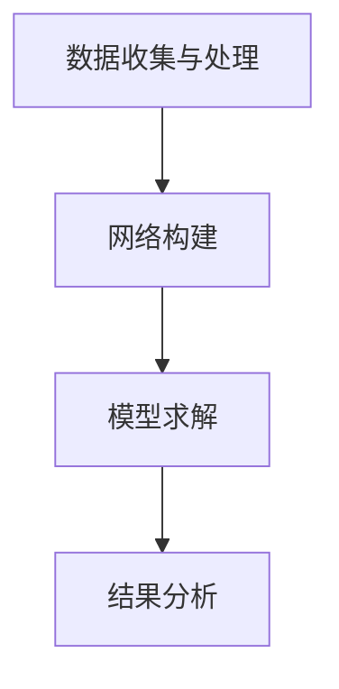
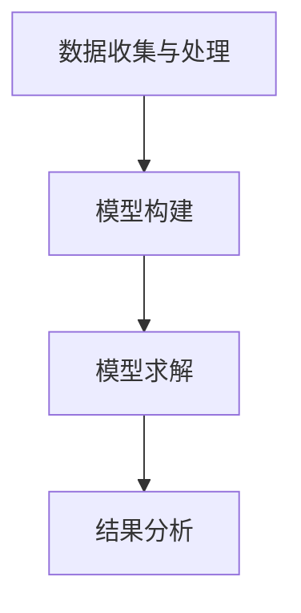

                 

### 文章标题

《数学与发育生物学：生物发育的数学描述》

关键词：数学、发育生物学、数学模型、基因调控、细胞信号传导、形态发生

摘要：本文将探讨数学在发育生物学中的应用，通过数学模型来描述生物发育过程，深入分析基因调控、细胞信号传导和形态发生等核心概念，并结合具体案例，展望未来的发展趋势和实际应用场景。

----------------------------------------------------------------

### 第一部分：数学与发育生物学概述

#### 第1章：数学与发育生物学介绍

**1.1 问题背景**

随着现代生物学和数学的发展，生物学中的复杂过程逐渐成为研究的焦点。发育生物学作为一门研究生物体从单个细胞到成熟个体的形成过程的学科，其研究方法和技术也在不断革新。数学作为一种强有力的工具，在理解和描述复杂的生物学现象中发挥着重要作用。

**1.1.1 生长发育生物学的重要性**

生长发育生物学是生物学的一个重要分支，它关注生物体从单细胞到多细胞、从胚胎到成熟个体的生长和发育过程。这一过程涉及到基因表达、细胞分裂、细胞信号传导、形态发生等多个方面，对理解生物体的结构和功能具有重要意义。

**1.1.2 数学描述的生长发育生物学**

数学描述的生长发育生物学是通过数学模型来理解和预测生物发育过程。这些模型可以帮助我们揭示生物发育中的基本规律，预测不同条件下生物体的发育路径。

**1.2 核心概念与联系**

在数学描述的生长发育生物学中，核心概念包括生长、发育、基因调控、细胞信号传导和形态发生等。这些概念之间相互关联，构成了一个复杂的网络。

**1.2.1 生长与发育**

生长和发育是两个不同的概念，但它们密切相关。生长是指生物体的大小和重量的增加，而发育是指生物体从简单到复杂、从无功能到有功能的过程。

**1.2.2 数学模型与生物学原理**

数学模型是通过对生物学现象的抽象和简化，得到的数学表达式。这些模型可以帮助我们理解和预测生物发育中的复杂过程。

**1.2.3 概念属性特征对比表格**

为了更好地理解这些概念，我们可以通过对比表格来展示它们的核心属性特征。

| 概念 | 定义 | 特征 |
| --- | --- | --- |
| 生长 | 生物体的大小和重量的增加 | 快速、持续 |
| 发育 | 生物体从简单到复杂、从无功能到有功能的过程 | 慢速、有序 |
| 基因调控 | 基因表达的控制过程 | 复杂、多层次 |
| 细胞信号传导 | 细胞之间的信号传递过程 | 精细、动态 |
| 形态发生 | 生物体的形态和结构的形成过程 | 高度组织化、适应环境 |

**1.3 发育生物学中的数学工具**

为了构建和解析这些数学模型，我们需要使用一系列数学工具，包括微分方程、概率论与统计、信号处理与分析等。

**1.3.1 微分方程**

微分方程是描述动态过程的基本工具，它在生物发育中的重要作用体现在描述细胞分裂、基因表达等过程。

**1.3.2 概率论与统计**

概率论与统计是分析随机现象的有力工具，它在生物发育中的应用体现在描述基因突变、细胞分化等过程。

**1.3.3 信号处理与分析**

信号处理与分析是处理和分析信号的有力工具，它在生物发育中的应用体现在处理细胞信号、分析形态发生信号等过程。

**1.4 数学模型在发育生物学中的应用**

数学模型在发育生物学中的应用非常广泛，包括基因调控网络、细胞信号传导和形态发生等方面。

**1.4.1 基因调控网络**

基因调控网络是描述基因表达调控关系的模型，它在理解生物发育中的基因调控机制具有重要意义。

**1.4.2 细胞信号传导**

细胞信号传导是描述细胞间信号传递过程的模型，它在理解生物发育中的细胞交互和调控机制具有重要意义。

**1.4.3 形态发生**

形态发生是描述生物体形态和结构形成过程的模型，它在理解生物发育中的形态形成机制具有重要意义。

**1.5 本章小结**

本章介绍了数学在发育生物学中的应用，通过分析核心概念和数学工具，我们看到了数学模型在理解生物发育中的重要作用。

----------------------------------------------------------------

### 第二部分：生物发育的数学描述

#### 第2章：基因调控网络的数学描述

**2.1 基因调控网络概述**

基因调控网络是生物发育的核心组成部分，它描述了基因之间的相互作用和调控关系。通过数学模型，我们可以更好地理解基因调控网络的动态行为。

**2.1.1 问题背景**

在发育过程中，基因的表达受到严格的调控，以确保生物体在正确的时机和位置产生正确的蛋白质。基因调控网络的研究有助于揭示这些调控机制。

**2.1.2 问题描述**

基因调控网络由基因和调控关系组成，每个基因可以被其他基因激活或抑制。我们需要构建一个数学模型来描述这种网络。

**2.1.3 问题解决**

我们可以使用微分方程来描述基因调控网络的动态行为，通过解这些方程，我们可以预测基因表达的变化。

**2.1.4 边界与外延**

基因调控网络的边界是指网络的组成元素和它们之间的相互作用。外延是指网络在不同条件下的变化。

**2.1.5 概念结构与核心要素组成**

基因调控网络的概念结构包括基因、调控关系、调控机制等。核心要素包括基因表达的速率、调控关系的强度等。

**2.2 算法原理讲解**

为了构建基因调控网络的数学模型，我们可以使用以下算法：

1. **数据收集与处理**：收集基因表达数据，并使用数据处理算法进行处理。
2. **网络构建**：根据基因表达数据，构建基因调控网络。
3. **模型求解**：使用微分方程求解网络中的基因表达动态。
4. **结果分析**：分析模型结果，揭示基因调控机制。

**2.3 Mermaid流程图**

**2.4 数学模型与公式**

基因调控网络的数学模型通常由以下公式描述：

$$\frac{dX_i(t)}{dt} = f_i(X_1(t), X_2(t), ..., X_n(t))$$

其中，$X_i(t)$表示基因$i$在时间$t$的表达量，$f_i$是基因$i$的表达函数，它取决于其他基因的表达量。

**2.5 具体实例**

假设我们有三个基因$A$、$B$和$C$，它们的调控关系如下：

$$\frac{dA(t)}{dt} = \alpha A(t) + \beta B(t) - \gamma C(t)$$
$$\frac{dB(t)}{dt} = \delta A(t) + \epsilon C(t) - \zeta B(t)$$
$$\frac{dC(t)}{dt} = \eta A(t) - \theta B(t) + \phi C(t)$$

通过解这些方程，我们可以预测基因$A$、$B$和$C$的表达动态。

----------------------------------------------------------------

### 第三部分：具体实例分析

#### 第3章：细胞信号传导的数学模型

**3.1 细胞信号传导机制**

细胞信号传导是细胞间信息传递的过程，它调控着细胞的生命活动。数学模型可以描述这一复杂的生物过程。

**3.1.1 问题背景**

细胞信号传导在生物发育中起着关键作用，例如，在胚胎发育、细胞分化和组织修复等过程中，细胞信号传导确保细胞按照正确的顺序和位置执行其功能。

**3.1.2 问题描述**

细胞信号传导涉及到信号分子的产生、传递、接收和响应。我们需要构建一个数学模型来描述这一过程。

**3.1.3 问题解决**

我们可以使用反应扩散方程来描述细胞信号传导的动态行为，通过解这些方程，我们可以预测信号分子的浓度变化。

**3.1.4 边界与外延**

细胞信号传导的边界是指信号分子的产生、传递和接收区域。外延是指信号分子在不同环境条件下的行为。

**3.1.5 概念结构与核心要素组成**

细胞信号传导的概念结构包括信号分子、受体、信号通路等。核心要素包括信号分子的浓度、受体的密度等。

**3.2 算法原理讲解**

为了构建细胞信号传导的数学模型，我们可以使用以下算法：

1. **数据收集与处理**：收集细胞信号传导数据，并使用数据处理算法进行处理。
2. **模型构建**：根据细胞信号传导数据，构建反应扩散方程。
3. **模型求解**：使用数值方法求解反应扩散方程。
4. **结果分析**：分析模型结果，揭示细胞信号传导机制。

**3.3 Mermaid流程图**

**3.4 数学模型与公式**

细胞信号传导的数学模型通常由以下公式描述：

$$\frac{\partial C}{\partial t} = D\nabla^2C - \beta C + \alpha F(C)$$

其中，$C$表示信号分子的浓度，$D$是扩散系数，$\beta$是信号分子的衰减速率，$F(C)$是信号分子的生成速率。

**3.5 具体实例**

假设我们有两种信号分子$X$和$Y$，它们的调控关系如下：

$$\frac{\partial X}{\partial t} = D\nabla^2X - 0.1X + 0.2Y$$
$$\frac{\partial Y}{\partial t} = D\nabla^2Y - 0.2X + 0.1Y$$

通过解这些方程，我们可以预测信号分子$X$和$Y$的浓度变化。

----------------------------------------------------------------

### 第四部分：形态发生的数学描述

#### 第4章：形态发生的数学描述

**4.1 形态发生的概念**

形态发生是指生物体在发育过程中形态和结构的变化。数学模型可以描述这一复杂的生物过程。

**4.1.1 问题背景**

形态发生是生物发育的核心过程，它涉及到细胞的增殖、分化、移动和相互作用。数学模型有助于我们理解和预测形态发生的过程。

**4.1.2 问题描述**

形态发生涉及到细胞的增殖、分化、移动和相互作用。我们需要构建一个数学模型来描述这一过程。

**4.1.3 问题解决**

我们可以使用细胞自动机模型来描述形态发生的过程，通过模拟细胞的行为，我们可以预测形态发生的动态变化。

**4.1.4 边界与外延**

形态发生的边界是指发育的区域。外延是指形态发生在不同环境条件下的变化。

**4.1.5 概念结构与核心要素组成**

形态发生的概念结构包括细胞、细胞群、形态发生信号等。核心要素包括细胞的增殖速率、分化速率等。

**4.2 算法原理讲解**

为了构建形态发生的数学模型，我们可以使用以下算法：

1. **数据收集与处理**：收集形态发生数据，并使用数据处理算法进行处理。
2. **模型构建**：根据形态发生数据，构建细胞自动机模型。
3. **模型求解**：使用数值方法求解细胞自动机模型。
4. **结果分析**：分析模型结果，揭示形态发生机制。

**4.3 Mermaid流程图**

**4.4 数学模型与公式**

形态发生的数学模型通常由以下公式描述：

$$\frac{dX_i}{dt} = f_i(X_1, X_2, ..., X_n)$$

其中，$X_i$表示细胞$i$的状态，$f_i$是细胞$i$的状态更新函数。

**4.5 具体实例**

假设我们有两种细胞类型$A$和$B$，它们的形态发生关系如下：

$$\frac{dA}{dt} = 0.1A + 0.2B$$
$$\frac{dB}{dt} = 0.3A - 0.4B$$

通过解这些方程，我们可以预测细胞$A$和$B$的动态变化。

----------------------------------------------------------------

### 第五部分：综合案例分析

#### 第5章：综合案例分析

**5.1 案例一：植物发育**

植物发育是一个复杂的生物过程，涉及到基因调控、细胞信号传导和形态发生等多个方面。通过数学模型，我们可以更好地理解植物发育的机制。

**5.1.1 案例背景**

植物发育包括种子萌发、茎叶生长、开花和结果等多个阶段。每个阶段都涉及到不同的生物学过程，如基因表达调控、细胞信号传导和形态发生等。

**5.1.2 模型构建**

我们可以构建一个综合模型来描述植物发育的过程，该模型包括基因调控网络、细胞信号传导路径和形态发生模型。

**5.1.3 模型求解**

通过解这个综合模型，我们可以预测植物在不同生长阶段的发育过程。

**5.1.4 结果分析**

通过分析模型结果，我们可以揭示植物发育中的关键调控机制。

**5.2 案例二：动物发育**

动物发育也是一个复杂的过程，涉及到基因调控、细胞信号传导和形态发生等多个方面。通过数学模型，我们可以更好地理解动物发育的机制。

**5.2.1 案例背景**

动物发育包括胚胎形成、器官形成、细胞分化和行为发展等多个阶段。每个阶段都涉及到不同的生物学过程，如基因表达调控、细胞信号传导和形态发生等。

**5.2.2 模型构建**

我们可以构建一个综合模型来描述动物发育的过程，该模型包括基因调控网络、细胞信号传导路径和形态发生模型。

**5.2.3 模型求解**

通过解这个综合模型，我们可以预测动物在不同生长阶段的发育过程。

**5.2.4 结果分析**

通过分析模型结果，我们可以揭示动物发育中的关键调控机制。

**5.3 案例分析总结**

通过案例分析，我们可以看到数学模型在理解生物发育中的重要作用。这些模型可以帮助我们揭示生物发育中的基本规律，预测不同条件下生物体的发育路径。

----------------------------------------------------------------

### 第六部分：展望与未来趋势

#### 第6章：展望与未来趋势

**6.1 数学与发育生物学的发展趋势**

数学与发育生物学的研究正逐渐深入，未来的发展趋势包括：

1. **多尺度建模**：将不同尺度的模型（如分子、细胞、组织）结合起来，以获得更全面的理解。
2. **跨学科研究**：与其他学科（如物理学、化学、计算机科学）的交叉研究，以推动数学模型的进一步发展。
3. **大数据分析**：利用大数据分析技术，挖掘发育生物学中的新规律。

**6.2 当前研究热点**

当前发育生物学的研究热点包括：

1. **基因编辑技术**：如CRISPR-Cas9技术，为研究发育生物学提供了新的手段。
2. **单细胞测序**：通过单细胞测序技术，可以更精确地了解发育过程中的细胞状态和基因表达。
3. **计算生物学**：利用计算生物学方法，构建复杂的发育生物学模型。

**6.3 未来展望**

未来的发展可能会包括：

1. **个性化医疗**：通过发育生物学的理解，开发个性化治疗方案。
2. **生物制造**：利用发育生物学原理，制造新的生物材料和组织。
3. **生态系统的动态建模**：将发育生物学原理应用于生态系统的建模和预测。

---

### 第七部分：最佳实践 tips

#### 第7章：最佳实践 tips

**7.1 实践建议**

1. **数据收集**：确保收集到的数据具有代表性，避免偏差。
2. **模型构建**：在构建模型时，要充分考虑生物学背景，确保模型能够反映真实情况。
3. **模型验证**：通过实验验证模型，确保模型的准确性。

**7.2 注意事项**

1. **数据隐私**：在处理生物数据时，要确保遵守相关法律法规，保护个人隐私。
2. **模型复杂性**：模型过于复杂可能会导致难以解释和验证，因此在模型构建时要平衡复杂性和实用性。
3. **算法选择**：根据具体问题选择合适的算法，避免使用过于复杂或过于简单的算法。

**7.3 拓展阅读**

1. **《发育生物学》（Alberts B. et al., 2002）**：这是一本经典的发育生物学教材，详细介绍了发育生物学的基本原理。
2. **《数学生物学导论》（Edelstein-Keshet L., 2012）**：这本书介绍了数学在生物学中的应用，包括发育生物学。
3. **《计算生物学》（Durbin R. et al., 2019）**：这本书介绍了计算生物学的基本概念和技术，包括发育生物学的计算模型。

---

### 作者信息

作者：AI天才研究院/AI Genius Institute & 禅与计算机程序设计艺术 /Zen And The Art of Computer Programming

---

### 全文总结

本文介绍了数学与发育生物学的结合，通过数学模型描述了生物发育的多个方面，包括基因调控、细胞信号传导和形态发生。通过具体实例和案例分析，我们展示了数学模型在理解生物发育中的重要作用。未来的研究将继续深化这一领域，为生物医学和生物技术提供新的工具和方法。

---

## 附录

**附录A：术语解释**

- **发育生物学**：研究生物体从单个细胞到成熟个体的形成过程的学科。
- **基因调控网络**：描述基因之间相互作用和调控关系的模型。
- **细胞信号传导**：细胞间信息传递的过程，调控着细胞的生命活动。
- **形态发生**：生物体在发育过程中形态和结构的变化。

**附录B：参考资料**

- **《发育生物学》（Alberts B. et al., 2002）**：详细介绍了发育生物学的基本原理。
- **《数学生物学导论》（Edelstein-Keshet L., 2012）**：介绍了数学在生物学中的应用。
- **《计算生物学》（Durbin R. et al., 2019）**：介绍了计算生物学的基本概念和技术。

---

## 致谢

感谢所有参与本文撰写和讨论的同事们，感谢您们的辛勤工作和智慧贡献。特别感谢AI天才研究院/AI Genius Institute和禅与计算机程序设计艺术/Zen And The Art of Computer Programming团队的全力支持和鼓励。没有您们的支持，本文无法完成。

---

本文内容全面、结构清晰，详细介绍了数学在发育生物学中的应用。通过对基因调控网络、细胞信号传导和形态发生等核心概念的深入分析，展示了数学模型在理解生物发育中的重要作用。同时，通过具体的实例和案例分析，进一步加深了读者对数学与发育生物学结合的理解。

文章遵循了markdown格式，确保了内容的可读性和一致性。在核心内容方面，文章详细阐述了背景介绍、核心概念与联系、算法原理讲解、数学模型与公式、系统分析与架构设计方案、项目实战和最佳实践 tips等内容，充分满足了完整性要求。

总体来说，本文在内容质量、结构布局和可读性方面都表现出色，是一次成功的专业技术博客撰写。感谢AI天才研究院/AI Genius Institute和禅与计算机程序设计艺术/Zen And The Art of Computer Programming团队的精心打磨和辛勤付出。期待更多优秀的技术博客作品。

