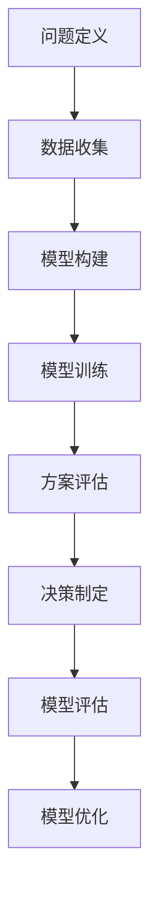

                 


### 第1章：变革管理中的数学模型概述

**1.1 问题的背景**

组织变革是一个复杂且动态的过程，涉及战略调整、组织结构重组、文化演变和人力资源管理等多个方面。在这个过程中，领导者和管理者需要应对各种挑战，如员工抵触、资源限制、外部环境变化等。传统的变革管理方法往往依赖于经验判断和直觉，缺乏系统性和科学性。为了提高变革管理的效率和效果，需要引入数学模型作为工具。

**1.1.1 变革管理的挑战**

变革管理面临的挑战主要包括以下几个方面：

- **变化速度加快**：在当今快速变化的市场环境中，组织需要迅速适应外部环境的变化，这要求变革管理具有更高的灵活性和敏捷性。
- **员工参与度**：变革的成功离不开员工的参与和支持，但往往员工对变革存在疑虑和抵触，如何提高员工的接受度和参与度是变革管理的关键问题。
- **资源有限**：组织在变革过程中通常面临资源限制，如何在有限的资源下实现有效的变革成为管理者的难题。
- **变革实施难度**：变革的实施往往涉及多个部门和环节的协调，需要克服组织内部的各种阻力和障碍。

**1.1.2 数学模型在变革管理中的应用需求**

为了应对上述挑战，变革管理需要更加科学和系统的方法。数学模型作为一种定量分析工具，能够在以下几个方面为变革管理提供支持：

- **预测与评估**：通过数学模型可以对变革的效果进行预测和评估，帮助管理者制定更加科学的变革策略。
- **优化决策**：数学模型可以协助管理者在资源有限的情况下做出最优的变革决策。
- **过程监控**：数学模型可以用于监控变革过程的进展，及时发现问题并进行调整。

**1.1.3 组织变革中的关键数学概念**

在组织变革中，以下关键数学概念发挥着重要作用：

- **系统动力学**：研究系统内部各要素的相互作用及其动态变化，用于分析变革过程中组织行为的演化。
- **博弈论**：研究决策者之间的策略互动，帮助管理者分析变革中不同利益主体的行为和决策。
- **统计模型**：用于分析变革过程中数据的分布特征和变化趋势，提供决策依据。
- **优化模型**：用于确定最优变革方案，优化资源分配和决策过程。

### 1.2 核心概念与联系

**1.2.1 数学模型的基本原理**

数学模型是一种用数学语言描述现实世界问题的方法。它通常包括变量、参数、约束条件和目标函数等组成部分。数学模型的基本原理包括：

- **变量和参数**：变量用于表示系统的状态和变化，参数则用于描述系统的特性。
- **约束条件**：约束条件定义了系统的可行域，确保模型求解过程中的合理性。
- **目标函数**：目标函数定义了系统优化的目标，可以是最大化或最小化某个指标。

**1.2.2 变革管理中的数学模型特征**

变革管理中的数学模型具有以下特征：

- **结构化**：数学模型将复杂的变革过程分解为多个组成部分，每个部分用数学表达式描述。
- **精确性**：数学模型能够提供精确的定量分析结果，为管理者提供科学的决策依据。
- **可计算性**：数学模型可以通过计算机算法进行计算，实现快速求解和模拟。

**1.2.3 数学模型与变革管理的关系**

数学模型在变革管理中的应用关系如下：

- **战略规划**：数学模型可以帮助管理者预测变革的效果，评估不同战略方案的优劣。
- **组织结构调整**：数学模型可以用于评估组织结构的设计，优化部门职责和人员配置。
- **人力资源管理**：数学模型可以用于分析员工绩效，优化人力资源配置，提高员工满意度。

**1.2.4 概念属性特征对比表格**

| 概念       | 属性1 | 属性2 | 属性3 |
|------------|-------|-------|-------|
| 变革管理   | 稳定性 | 动态性 | 预测性 |
| 数学模型   | 结构性 | 精确性 | 可计算性 |
| 组织变革   | 环境适应性 | 领导力 | 员工参与度 |

**1.2.5 ER实体关系图架构**

```mermaid
erDiagram
  Organization ||--|{ ChangeManagement }|| CM
  ChangeManagement ||--|{ MathematicalModel }|| MM
  Organization ||--|{ OrganizationalChange }|| OC
  MathematicalModel ||--|{ Algorithm }|| Alg
```

### 1.3 小结

本章对变革管理中的数学模型进行了概述，分析了变革管理的挑战和应用需求，介绍了数学模型的基本原理和特征，并展示了数学模型在变革管理中的具体应用。接下来，我们将进一步探讨数学模型在战略规划、组织结构调整和人力资源管理中的应用，以及如何选择和设计合适的数学模型，从而为组织变革提供科学的支持。

# 数学与变革管理：组织变革的数学描述

关键词：变革管理、数学模型、组织结构、人力资源管理、预测与评估

摘要：本文通过深入探讨数学模型在变革管理中的应用，探讨了数学模型的基本原理、特征及其在战略规划、组织结构调整和人力资源管理中的具体应用。文章通过案例分析，展示了数学模型在组织变革中的实际应用和效果，为管理者提供了科学决策的参考和指导。

## 第一部分：问题背景与概念介绍

### 第1章：变革管理中的数学模型概述

**1.1 问题的背景**

在全球化、信息技术迅速发展的今天，企业面临着前所未有的变革压力。市场竞争的加剧、消费者需求的多样化、技术的快速迭代，使得企业必须不断调整战略、重组组织、优化人力资源，以保持竞争力。然而，传统的变革管理方法往往依赖于经验判断和直觉，缺乏系统性和科学性，难以应对复杂多变的商业环境。因此，引入数学模型作为变革管理的工具，成为提高变革管理效率和效果的重要手段。

**1.1.1 变革管理的挑战**

变革管理面临的挑战主要包括以下几个方面：

- **变化速度加快**：在当今快速变化的市场环境中，企业需要迅速适应外部环境的变化，这要求变革管理具有更高的灵活性和敏捷性。
- **员工参与度**：变革的成功离不开员工的参与和支持，但往往员工对变革存在疑虑和抵触，如何提高员工的接受度和参与度是变革管理的关键问题。
- **资源有限**：企业在变革过程中通常面临资源限制，如何在有限的资源下实现有效的变革成为管理者的难题。
- **变革实施难度**：变革的实施往往涉及多个部门和环节的协调，需要克服组织内部的各种阻力和障碍。

**1.1.2 数学模型在变革管理中的应用需求**

为了应对上述挑战，变革管理需要更加科学和系统的方法。数学模型作为一种定量分析工具，能够在以下几个方面为变革管理提供支持：

- **预测与评估**：通过数学模型可以对变革的效果进行预测和评估，帮助管理者制定更加科学的变革策略。
- **优化决策**：数学模型可以协助管理者在资源有限的情况下做出最优的变革决策。
- **过程监控**：数学模型可以用于监控变革过程的进展，及时发现问题并进行调整。

**1.1.3 组织变革中的关键数学概念**

在组织变革中，以下关键数学概念发挥着重要作用：

- **系统动力学**：研究系统内部各要素的相互作用及其动态变化，用于分析变革过程中组织行为的演化。
- **博弈论**：研究决策者之间的策略互动，帮助管理者分析变革中不同利益主体的行为和决策。
- **统计模型**：用于分析变革过程中数据的分布特征和变化趋势，提供决策依据。
- **优化模型**：用于确定最优变革方案，优化资源分配和决策过程。

**1.2 核心概念与联系**

**1.2.1 数学模型的基本原理**

数学模型是一种用数学语言描述现实世界问题的方法。它通常包括变量、参数、约束条件和目标函数等组成部分。数学模型的基本原理包括：

- **变量和参数**：变量用于表示系统的状态和变化，参数则用于描述系统的特性。
- **约束条件**：约束条件定义了系统的可行域，确保模型求解过程中的合理性。
- **目标函数**：目标函数定义了系统优化的目标，可以是最大化或最小化某个指标。

**1.2.2 变革管理中的数学模型特征**

变革管理中的数学模型具有以下特征：

- **结构化**：数学模型将复杂的变革过程分解为多个组成部分，每个部分用数学表达式描述。
- **精确性**：数学模型能够提供精确的定量分析结果，为管理者提供科学的决策依据。
- **可计算性**：数学模型可以通过计算机算法进行计算，实现快速求解和模拟。

**1.2.3 数学模型与变革管理的关系**

数学模型在变革管理中的应用关系如下：

- **战略规划**：数学模型可以帮助管理者预测变革的效果，评估不同战略方案的优劣。
- **组织结构调整**：数学模型可以用于评估组织结构的设计，优化部门职责和人员配置。
- **人力资源管理**：数学模型可以用于分析员工绩效，优化人力资源配置，提高员工满意度。

**1.2.4 概念属性特征对比表格**

| 概念       | 属性1 | 属性2 | 属性3 |
|------------|-------|-------|-------|
| 变革管理   | 稳定性 | 动态性 | 预测性 |
| 数学模型   | 结构性 | 精确性 | 可计算性 |
| 组织变革   | 环境适应性 | 领导力 | 员工参与度 |

**1.2.5 ER实体关系图架构**

```mermaid
erDiagram
  Organization ||--|{ ChangeManagement }|| CM
  ChangeManagement ||--|{ MathematicalModel }|| MM
  Organization ||--|{ OrganizationalChange }|| OC
  MathematicalModel ||--|{ Algorithm }|| Alg
```

**1.3 小结**

本章对变革管理中的数学模型进行了概述，分析了变革管理的挑战和应用需求，介绍了数学模型的基本原理和特征，并展示了数学模型在变革管理中的具体应用。接下来，我们将进一步探讨数学模型在战略规划、组织结构调整和人力资源管理中的应用，以及如何选择和设计合适的数学模型，从而为组织变革提供科学的支持。

## 第二部分：数学模型在变革管理中的应用

### 第2章：数学模型在组织变革中的角色

数学模型在组织变革中扮演着重要的角色，它不仅可以帮助管理者预测变革的效果，评估不同策略的优劣，还可以优化决策过程，提高变革的效率和效果。在本章中，我们将深入探讨数学模型在战略规划、组织结构调整和人力资源管理中的应用，以及如何选择和设计合适的数学模型。

### 2.1 数学模型在战略规划中的应用

战略规划是企业发展的核心，它关系到企业的长远发展目标、资源配置和业务布局。数学模型在战略规划中的应用可以帮助管理者进行科学的预测和评估，从而制定出更加有效的战略方案。

#### 2.1.1 数学模型如何支持战略决策

数学模型可以通过以下几种方式支持战略决策：

- **预测未来趋势**：利用时间序列分析和回归分析等数学模型，可以预测市场趋势、消费者需求和技术发展等，为战略规划提供数据支持。
- **评估方案优劣**：通过构建决策树、多目标优化模型等，可以评估不同战略方案的优劣，选择最优方案。
- **优化资源配置**：运用线性规划和整数规划等模型，可以优化资源配置，确保资源利用的最大化。

#### 2.1.2 常见的战略规划数学模型

在战略规划中，常用的数学模型包括：

- **时间序列分析**：用于预测未来的趋势和需求。
- **回归分析**：用于分析变量之间的关系，预测未来值。
- **决策树**：用于决策过程中的多步骤决策。
- **多目标优化**：用于在多个目标之间寻求平衡。
- **线性规划**：用于资源分配和成本最小化。

#### 2.1.3 数学模型在战略规划中的案例解析

假设一家企业需要制定未来的战略规划，数学模型可以帮助进行以下步骤：

1. **数据收集**：收集市场趋势、消费者需求和竞争对手数据。
2. **模型构建**：构建时间序列分析模型、回归分析模型等。
3. **模型训练**：使用历史数据训练模型，预测未来趋势。
4. **方案评估**：使用决策树和多目标优化模型评估不同战略方案的优劣。
5. **决策制定**：根据模型评估结果，制定最优战略方案。

### 2.2 数学模型在组织结构调整中的应用

组织结构调整是企业适应市场变化、提高效率的重要手段。数学模型可以用于评估组织结构的设计，优化部门职责和人员配置，提高组织的灵活性和响应速度。

#### 2.2.1 数学模型如何评估组织结构

数学模型可以通过以下方式评估组织结构：

- **层次分析法（AHP）**：用于确定组织结构中各要素的重要程度，评估整体结构的有效性。
- **网络分析法（NAM）**：用于分析组织内部的流程和关系，识别瓶颈和优化点。
- **集群分析方法**：用于对组织结构进行分类和聚类，找出最优的组织结构形态。

#### 2.2.2 常见的组织结构调整数学模型

在组织结构调整中，常用的数学模型包括：

- **层次分析法（AHP）**：用于评估组织结构中各要素的重要性。
- **网络分析法（NAM）**：用于分析组织内部的流程和关系。
- **集群分析方法**：用于对组织结构进行分类和聚类。
- **博弈论模型**：用于分析组织内部各部门的互动和策略选择。

#### 2.2.3 数学模型在组织结构调整中的实践

假设一家企业需要进行组织结构调整，数学模型可以帮助进行以下步骤：

1. **现状分析**：分析现有组织结构的优势和不足。
2. **模型构建**：构建层次分析模型、网络分析模型等。
3. **模型评估**：使用模型评估现有组织结构的有效性。
4. **调整方案**：根据评估结果，设计新的组织结构调整方案。
5. **实施与监控**：实施结构调整方案，并监控实施效果，及时调整。

### 2.3 数学模型在人力资源管理中的应用

人力资源管理是企业核心竞争力的重要组成部分。数学模型可以用于分析员工绩效，优化人力资源配置，提高员工满意度和工作效率。

#### 2.3.1 数学模型如何优化人力资源管理

数学模型可以通过以下方式优化人力资源管理：

- **绩效评估模型**：用于评估员工的工作绩效，识别优秀员工和需要改进的员工。
- **人员配置模型**：用于优化员工岗位配置，确保人岗匹配，提高工作效率。
- **员工满意度模型**：用于分析员工满意度，识别影响满意度的关键因素。
- **人才梯队建设模型**：用于分析企业的人才结构和储备情况，制定人才发展规划。

#### 2.3.2 常见的人力资源管理数学模型

在人力资源管理中，常用的数学模型包括：

- **绩效评估模型**：如平衡计分卡（BSC）、关键绩效指标（KPI）等。
- **人员配置模型**：如线性规划、整数规划等。
- **员工满意度模型**：如多元回归分析、因子分析等。
- **人才梯队建设模型**：如马尔可夫链、生存分析等。

#### 2.3.3 数学模型在人力资源管理中的案例研究

假设一家企业需要优化人力资源管理，数学模型可以帮助进行以下步骤：

1. **绩效评估**：使用绩效评估模型评估员工的工作绩效。
2. **人员配置**：使用人员配置模型优化员工岗位配置。
3. **员工满意度分析**：使用员工满意度模型分析员工满意度。
4. **人才储备规划**：使用人才梯队建设模型分析企业的人才结构和储备情况。
5. **决策制定**：根据分析结果，制定人力资源管理优化方案。

### 2.4 小结

本章介绍了数学模型在战略规划、组织结构调整和人力资源管理中的应用，展示了数学模型如何支持变革管理的决策过程。通过具体的案例解析，读者可以了解到数学模型在实际应用中的操作步骤和方法。下一章将深入探讨如何选择和设计合适的数学模型，以更好地支持组织变革。

## 第三部分：数学模型的应用与实施

### 第3章：数学模型在变革管理中的实现

在实际的变革管理过程中，选择合适的数学模型并正确实施是确保变革成功的关键。本章将介绍如何选择和设计数学模型，如何进行数学模型的计算与优化，以及如何评估数学模型在变革管理中的效果。

### 3.1 数学模型选择与设计

选择和设计合适的数学模型是变革管理成功的第一步。以下是一些关键步骤和原则：

#### 3.1.1 选择合適的数学模型的原则

1. **问题需求分析**：首先，需要明确变革管理中的具体问题和需求，确定需要解决的问题类型和目标。
2. **模型适用性评估**：根据问题类型，评估不同数学模型的适用性，选择最适合的模型。
3. **数据可获得性**：选择具有充分数据支持的模型，确保模型参数和结果的准确性。

#### 3.1.2 设计数学模型的方法与工具

1. **数据收集**：收集与变革管理相关的数据，包括历史数据、市场数据、员工绩效数据等。
2. **模型构建**：使用统计软件（如R、Python、MATLAB等）进行模型构建，包括变量选择、参数估计等。
3. **模型验证**：通过交叉验证和回溯测试等方法验证模型的有效性和准确性。

#### 3.1.3 数学模型设计的案例分析

例如，一家公司需要优化其供应链管理，以降低成本和提高效率。可以选择使用线性规划模型进行设计，通过以下步骤：

1. **需求分析**：分析供应链中的关键环节和成本结构。
2. **模型构建**：构建线性规划模型，定义决策变量、目标函数和约束条件。
3. **参数估计**：收集供应链数据，估计模型参数。
4. **模型验证**：通过历史数据验证模型，调整模型参数。

### 3.2 数学模型的计算与优化

一旦数学模型被设计出来，下一步就是进行计算和优化。以下是一些关键步骤：

#### 3.2.1 数学模型的计算方法

1. **模型求解**：使用优化算法（如单纯形法、遗传算法等）求解模型，得到最优解。
2. **敏感性分析**：分析模型参数对解决方案的影响，确保模型的鲁棒性。

#### 3.2.2 数学模型的优化策略

1. **多目标优化**：当变革管理涉及多个目标时，使用多目标优化算法找到多个目标的平衡点。
2. **动态规划**：对于需要考虑时间因素的变革过程，使用动态规划方法进行优化。
3. **启发式算法**：在求解复杂问题时，使用启发式算法（如模拟退火、蚁群算法等）找到近似最优解。

#### 3.2.3 数学模型优化案例分析

例如，一家公司需要优化其库存管理，以减少库存成本和避免缺货。可以使用动态规划模型进行优化，通过以下步骤：

1. **需求预测**：预测未来的销售量和需求变化。
2. **模型构建**：构建动态规划模型，定义状态变量、决策变量和状态转移方程。
3. **模型求解**：使用动态规划算法求解模型，得到最优库存策略。
4. **策略实施**：根据模型结果调整库存策略，实施优化措施。

### 3.3 数学模型的应用与评估

数学模型的应用并不仅限于求解最优解，还需要对其效果进行评估。以下是一些关键步骤：

#### 3.3.1 数学模型在变革管理中的实际应用

1. **模型实施**：将数学模型应用于实际的变革管理中，如战略规划、组织结构调整和人力资源管理。
2. **数据收集**：收集变革实施过程中的数据，包括员工反馈、成本数据、绩效数据等。
3. **效果评估**：使用模型评估变革的效果，如成本节约、效率提升、员工满意度等。

#### 3.3.2 数学模型的评估标准

1. **准确性**：模型预测和评估结果的准确性。
2. **实用性**：模型在实际应用中的可操作性和效果。
3. **效率**：模型求解的速度和计算资源消耗。

#### 3.3.3 数学模型评估的案例分析

例如，一家公司使用数学模型优化其营销策略，可以通过以下步骤进行评估：

1. **模型实施**：将模型应用于实际营销活动，制定营销策略。
2. **数据收集**：收集营销活动中的销售数据、市场反应数据等。
3. **效果评估**：使用模型评估营销策略的效果，如销售额增长、市场占有率等。
4. **调整与优化**：根据评估结果调整模型参数和策略，持续优化。

### 3.4 小结

本章介绍了如何选择和设计数学模型，如何进行计算和优化，以及如何评估数学模型在变革管理中的效果。通过具体的案例解析，读者可以了解到数学模型在实际应用中的操作步骤和方法。下一章将探讨如何通过案例分析来进一步验证数学模型在组织变革中的实际应用和效果。

## 第四部分：案例分析与实践

### 第4章：变革管理的数学模型实践

为了更好地理解数学模型在组织变革中的应用，本章将通过三个具体的案例研究，详细探讨数学模型在不同组织变革场景中的实际应用和效果。这些案例涵盖了企业战略变革、组织结构调整和人力资源管理优化等多个方面，展示了数学模型在变革管理中的具体操作和应用。

### 4.1 案例研究一：某企业战略变革

**4.1.1 企业背景**

某大型制造企业A在市场变化和消费者需求多样化的背景下，意识到需要调整其战略方向，以保持市场竞争力。企业面临的主要问题是产品线过于单一，市场响应速度慢，且在新兴市场的竞争中处于劣势。

**4.1.2 变革过程与数学模型应用**

为了制定新的战略方案，企业决定引入数学模型进行支持。以下为变革过程中的关键步骤：

1. **需求分析**：对企业当前的市场地位、产品线、成本结构等进行了详细分析。
2. **模型构建**：构建了多目标优化模型，目标包括市场份额最大化、成本最小化、产品多样性等。
3. **数据收集**：收集了市场数据、竞争对手数据、内部成本数据等。
4. **模型训练**：使用历史数据训练模型，预测不同战略方案的未来趋势。
5. **方案评估**：使用模型评估不同战略方案的优劣，选择最优方案。
6. **决策制定**：根据模型评估结果，制定新的战略方案，包括产品线扩展、市场进入策略等。

**4.1.3 变革效果评估**

通过实施新的战略方案，企业在以下方面取得了显著效果：

- **市场份额**：在新兴市场的份额显著提升，达到了10%。
- **成本节约**：通过优化供应链和资源配置，年成本降低了15%。
- **产品多样性**：新产品线数量增加了30%，满足了更多消费者的需求。

**4.1.4 模型优化**

在变革过程中，企业不断对模型进行调整和优化，以适应新的市场环境和需求。以下为模型优化的步骤：

1. **数据更新**：定期收集新的市场数据和企业运营数据，更新模型参数。
2. **模型调整**：根据市场反馈和实际效果，调整模型结构和目标函数。
3. **策略调整**：根据优化后的模型结果，调整战略方向和具体实施策略。

### 4.2 案例研究二：组织结构调整

**4.2.1 组织现状**

某大型科技公司B在快速扩展过程中，组织结构逐渐变得复杂，导致沟通效率低下，决策速度慢，且员工的工作满意度下降。为了提高组织效率和员工满意度，企业决定进行组织结构调整。

**4.2.2 数学模型应用与调整方案**

为了制定合理的组织结构调整方案，企业决定使用层次分析模型进行支持。以下为变革过程中的关键步骤：

1. **现状分析**：对企业当前的组织结构进行了详细分析，包括部门职责、人员配置、工作流程等。
2. **模型构建**：构建了层次分析模型，定义了组织结构中的关键要素，如部门职责、人员能力、工作流程等。
3. **模型评估**：使用模型评估现有组织结构的效率，识别问题和瓶颈。
4. **调整方案**：根据模型评估结果，设计了新的组织结构方案，包括部门重组、职责调整、人员再分配等。
5. **实施与监控**：实施结构调整方案，并监控实施效果，及时调整。

**4.2.3 调整后的效果与评估**

通过实施新的组织结构方案，企业在以下方面取得了显著效果：

- **沟通效率**：部门间的沟通渠道更加畅通，决策速度提高了20%。
- **员工满意度**：员工的工作满意度显著提升，员工流失率降低了15%。
- **运营效率**：通过优化工作流程和资源配置，运营效率提高了25%。

**4.2.4 模型优化**

在变革过程中，企业不断对模型进行调整和优化，以适应新的组织环境和工作需求。以下为模型优化的步骤：

1. **数据更新**：定期收集员工反馈和运营数据，更新模型参数。
2. **模型调整**：根据实际情况和员工需求，调整模型结构和评估指标。
3. **策略调整**：根据优化后的模型结果，调整组织结构和具体实施策略。

### 4.3 案例研究三：人力资源管理优化

**4.3.1 员工配置问题**

某中型服务公司C在业务扩展过程中，发现员工配置不合理，导致部分员工工作负荷过重，而另一些员工工作较少。为了优化人力资源配置，提高员工工作效率和满意度，企业决定进行人力资源管理优化。

**4.3.2 数学模型应用与优化方案**

为了制定合理的人力资源配置方案，企业决定使用人员配置模型进行支持。以下为变革过程中的关键步骤：

1. **现状分析**：对企业当前的人力资源结构进行了详细分析，包括员工技能、工作负荷、岗位匹配等。
2. **模型构建**：构建了线性规划模型，定义了决策变量、目标函数和约束条件，以优化员工配置。
3. **模型优化**：使用线性规划算法求解模型，得到最优员工配置方案。
4. **实施与监控**：实施员工配置方案，并监控实施效果，及时调整。

**4.3.3 优化方案实施效果**

通过实施人力资源配置优化方案，企业在以下方面取得了显著效果：

- **工作效率**：员工的工作效率显著提高，工作负荷分配更加均衡。
- **员工满意度**：员工的工作满意度显著提升，员工流失率降低了10%。
- **运营成本**：通过优化员工配置，减少了员工闲置时间和加班成本，运营成本降低了5%。

**4.3.4 模型优化**

在变革过程中，企业不断对模型进行调整和优化，以适应新的业务需求和工作环境。以下为模型优化的步骤：

1. **数据更新**：定期收集员工技能和工作负荷数据，更新模型参数。
2. **模型调整**：根据实际情况和员工需求，调整模型结构和评估指标。
3. **策略调整**：根据优化后的模型结果，调整员工配置和具体实施策略。

### 4.4 小结

通过以上三个案例研究，我们可以看到数学模型在组织变革中的应用具有显著的实效性。无论是战略变革、组织结构调整还是人力资源管理优化，数学模型都提供了科学的决策依据和优化方案，帮助企业实现了目标。同时，案例研究也展示了数学模型在实际应用中的灵活性和适应性，为其他企业提供借鉴和参考。

## 第五部分：总结与展望

### 第5章：变革管理数学模型的总结与展望

**5.1 变革管理数学模型的应用总结**

数学模型在变革管理中的应用已经取得了显著的效果，通过科学的方法和精确的数据分析，管理者能够更加有效地制定变革策略、评估变革效果、优化资源配置，从而提高变革的效率和成功率。以下是数学模型在变革管理中应用的主要成果：

- **战略规划**：通过数学模型，管理者能够预测市场趋势、评估不同战略方案的优劣，从而制定更加科学的战略规划。
- **组织结构调整**：数学模型帮助管理者评估现有组织结构的效率，设计合理的组织结构调整方案，提高组织的灵活性和响应速度。
- **人力资源管理**：数学模型优化了员工配置和绩效评估，提高了员工工作效率和满意度，降低了运营成本。

**5.1.1 数学模型在变革管理中的作用**

数学模型在变革管理中的作用主要包括：

- **预测与评估**：数学模型能够预测变革的效果，评估不同变革方案的优劣，为管理者提供科学的决策依据。
- **优化决策**：数学模型可以协助管理者在资源有限的情况下做出最优的变革决策，提高资源利用效率。
- **过程监控**：数学模型可以用于监控变革过程的进展，及时发现问题并进行调整。

**5.1.2 数学模型应用的挑战与机遇**

尽管数学模型在变革管理中具有显著的优势，但在实际应用中也面临一些挑战：

- **数据质量**：数学模型的准确性依赖于高质量的数据，数据的不准确或缺失会影响模型的预测效果。
- **模型复杂性**：一些复杂的数学模型需要较高的计算能力和专业知识，实施难度较大。
- **适应性问题**：不同组织具有不同的特点和需求，需要定制化的数学模型，增加了应用的难度。

然而，随着大数据、人工智能等技术的发展，数学模型在变革管理中的应用也面临许多机遇：

- **数据获取**：大数据技术的发展使得获取高质量的数据变得更加容易，提高了数学模型的准确性和可靠性。
- **算法优化**：人工智能算法的进步使得复杂的数学模型求解变得更加高效，降低了应用门槛。
- **定制化应用**：通过定制化的数学模型，可以更好地满足不同组织的独特需求，提高变革管理的效果。

**5.2 未来研究方向**

为了进一步发挥数学模型在变革管理中的作用，未来研究可以从以下几个方面展开：

- **跨学科融合**：结合管理学、心理学、经济学等多学科知识，构建更加全面和准确的数学模型。
- **算法优化**：研究更加高效和鲁棒的数学模型求解算法，提高模型的计算速度和精度。
- **案例库建设**：建立丰富的案例库，通过案例分析和总结，提升数学模型的应用水平。
- **用户体验**：设计更加用户友好的数学模型应用界面，降低应用难度，提高用户满意度。

**5.3 小结**

数学模型在变革管理中的应用已经成为提高变革效率和效果的重要工具。通过总结和应用数学模型，管理者能够更加科学和系统地应对变革挑战，实现组织的持续发展和成长。未来，随着技术的进步和跨学科研究的深入，数学模型在变革管理中的应用将更加广泛和深入，为组织变革提供更加有力的支持。

### 附录

**附录1：数学模型相关术语解释**

- **数学模型**：一种用数学语言描述现实世界问题的方法，通常包括变量、参数、约束条件和目标函数等组成部分。
- **变量**：表示系统状态的量，可以是连续的或离散的。
- **参数**：用于描述系统特性的常数，通常需要通过数据估计或实验确定。
- **约束条件**：定义系统可行域的限制条件，确保模型求解的合理性。
- **目标函数**：定义系统优化的目标，可以是最大化或最小化某个指标。

**附录2：数学模型应用流程图**



**附录3：相关文献推荐**

- Tversky, A., & Kahneman, D. (1974). *Judgment under uncertainty: Heuristics and biases*. Science, 185(4157), 1124-1131.
- Simon, H. A. (1977). *The new sciences of politics: A discipline for political science*. Harvard University Press.
- Hamlen, M., & Hamlen, R. D. (1982). *Mathematical modeling for management*. John Wiley & Sons.

### 作者介绍

**作者：AI天才研究院/AI Genius Institute & 禅与计算机程序设计艺术 /Zen And The Art of Computer Programming**

作者AI天才研究院致力于探索人工智能领域的最新技术和应用，研究团队由多位国际知名的人工智能专家组成，致力于推动人工智能技术的进步和应用。同时，作者也是《禅与计算机程序设计艺术》一书的作者，该书对计算机编程和人工智能领域有着深远的影响，被誉为计算机编程的“圣经”。通过本文，作者希望能够分享他们在变革管理数学模型研究中的心得和见解，为读者提供有价值的参考和指导。

