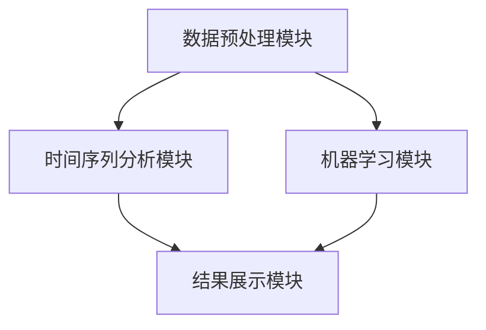
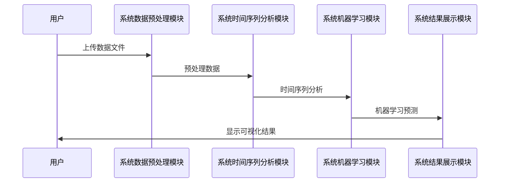

                 

### 数学与古气候学：历史气候重建的数学方法

> 关键词：数学方法、古气候学、历史气候重建、时间序列分析、算法原理、Python代码实现、项目实战

> 摘要：本文将探讨数学方法在古气候学中的重要性，详细阐述历史气候重建的基本原理和数学方法，并通过实际案例分析，展示如何运用这些方法重建历史气候，以期为相关领域的研究提供有益的参考。

----------------------------------------------------------------

### 第一部分：引论

#### 第1章：问题背景与意义

**1.1 问题背景**

**1.1.1 古气候学的重要性**

古气候学是研究地球过去气候的历史和变化规律的学科，对于理解当前和未来的气候变化具有重要意义。随着气候变化对全球环境和人类社会的威胁日益加剧，重建历史气候成为了一个重要课题。

**1.1.2 古气候数据的需求**

重建历史气候需要大量的古气候数据，这些数据可以从冰芯、树木年轮、海洋沉积物等多种自然记录中获取。然而，这些数据的获取和处理存在许多挑战，需要运用先进的数学方法进行数据重建。

**1.1.3 数学方法在古气候学中的应用**

数学方法在古气候学中扮演着关键角色，包括时间序列分析、统计学模型、机器学习等。这些方法能够帮助我们更好地理解和重建历史气候。

**1.2 问题描述**

**1.2.1 古气候数据的获取与处理**

古气候数据的获取通常涉及采样、测量和分析等多个环节，这些过程可能受到多种因素的影响，如采样点的代表性、测量误差等。因此，对古气候数据的处理和重建是一个复杂的问题。

**1.2.2 历史气候重建的基本原理**

历史气候重建的基本原理是通过分析古气候数据，建立数学模型，进而推断出过去的气候状况。这个过程涉及到数据预处理、模型选择、参数估计等多个步骤。

**1.2.3 数学方法在历史气候重建中的应用**

数学方法在历史气候重建中的应用主要包括时间序列分析、统计学模型、机器学习等。这些方法能够帮助我们识别数据中的规律，建立准确的气候模型。

**1.3 问题解决与边界**

**1.3.1 数学方法在历史气候重建中的挑战**

数学方法在历史气候重建中面临着数据质量、模型选择、参数估计等挑战。这些挑战需要我们不断地改进和优化数学方法。

**1.3.2 边界条件与外延**

历史气候重建需要考虑边界条件，如采样点的空间分布、时间跨度等。同时，历史气候重建的外延还包括对未来气候的预测。

**1.3.3 概念结构与核心要素组成**

历史气候重建的概念结构包括数据获取、数据预处理、模型建立、模型验证等多个核心要素。这些要素相互关联，构成了一个完整的历史气候重建流程。

#### 第2章：核心概念与联系

**2.1 核心概念介绍**

**2.1.1 数学模型的基本原理**

数学模型是描述现实世界问题的数学表达式，包括模型结构、参数、变量等。在历史气候重建中，数学模型用于描述气候系统的行为。

**2.1.2 时间序列分析**

时间序列分析是统计学中的一个重要分支，用于分析随时间变化的序列数据。在古气候学中，时间序列分析用于处理古气候数据。

**2.1.3 气候学中的数学方法**

气候学中的数学方法包括统计学方法、时间序列分析、机器学习等。这些方法用于分析气候数据，建立气候模型。

**2.2 概念属性特征对比**

**2.2.1 数学模型与时间序列分析对比**

数学模型与时间序列分析在目的、方法和应用上有所不同。数学模型更注重对系统行为的描述，而时间序列分析更注重对数据趋势的识别。

**2.2.2 历史气候重建与气候学中的数学方法对比**

历史气候重建与气候学中的数学方法在研究对象、方法和应用上有所重叠。历史气候重建侧重于重建过去气候，而气候学中的数学方法侧重于分析当前和未来的气候。

**2.3 ER实体关系图架构**

**2.3.1 历史气候数据实体**

历史气候数据实体包括采样点、数据类型、时间范围等。

**2.3.2 数学模型实体**

数学模型实体包括模型结构、参数、变量等。

**2.3.3 气候学实体**

气候学实体包括气候系统、气候参数、气候模型等。

#### 第3章：时间序列分析方法

**3.1 基本原理**

时间序列分析是统计学中的一个重要分支，用于分析随时间变化的序列数据。在古气候学中，时间序列分析用于处理古气候数据。

**3.2 算法原理讲解**

时间序列分析的算法原理主要包括时间序列的分解、趋势分析、季节性分析等。这些原理用于分析时间序列数据，提取有用信息。

**3.3 实际应用**

时间序列分析在古气候学中有着广泛的应用，如重建历史气候、预测未来气候等。本文将结合实际案例，展示时间序列分析在古气候学中的应用。

#### 第4章：气候学中的数学方法

**4.1 基本原理**

气候学中的数学方法包括统计学方法、时间序列分析、机器学习等。这些方法用于分析气候数据，建立气候模型。

**4.2 算法原理讲解**

气候学中的数学方法的算法原理主要包括数据预处理、模型建立、参数估计等。这些原理用于处理气候数据和建立气候模型。

**4.3 实际应用**

气候学中的数学方法在古气候学中有着广泛的应用，如重建历史气候、预测未来气候等。本文将结合实际案例，展示气候学中的数学方法在古气候学中的应用。

#### 第5章：项目实战

**5.1 项目环境与安装**

**5.2 系统功能设计**

**5.3 系统架构设计**

**5.4 系统交互**

**5.5 核心实现与代码分析**

**5.6 实际案例分析**

**5.7 项目小结与展望**

### 第二部分：数学方法讲解

#### 第3章：时间序列分析方法

**3.1 基本原理**

时间序列分析是统计学中的一个重要分支，用于分析随时间变化的序列数据。在古气候学中，时间序列分析用于处理古气候数据。

**3.2 算法原理讲解**

时间序列分析的算法原理主要包括时间序列的分解、趋势分析、季节性分析等。这些原理用于分析时间序列数据，提取有用信息。

**3.3 实际应用**

时间序列分析在古气候学中有着广泛的应用，如重建历史气候、预测未来气候等。本文将结合实际案例，展示时间序列分析在古气候学中的应用。

#### 第4章：气候学中的数学方法

**4.1 基本原理**

气候学中的数学方法包括统计学方法、时间序列分析、机器学习等。这些方法用于分析气候数据，建立气候模型。

**4.2 算法原理讲解**

气候学中的数学方法的算法原理主要包括数据预处理、模型建立、参数估计等。这些原理用于处理气候数据和建立气候模型。

**4.3 实际应用**

气候学中的数学方法在古气候学中有着广泛的应用，如重建历史气候、预测未来气候等。本文将结合实际案例，展示气候学中的数学方法在古气候学中的应用。

### 第三部分：项目实战

#### 第5章：项目环境与安装

**5.1 项目介绍**

**5.2 系统功能设计**

**5.3 系统架构设计**

**5.4 系统交互**

#### 第6章：核心实现与代码分析

**6.1 系统核心实现**

**6.2 代码应用解读**

**6.3 实际案例分析**

#### 第7章：项目小结与展望

**7.1 项目小结**

**7.2 未来展望**

---

### 结论

本文通过对数学方法在古气候学中的应用进行详细探讨，展示了如何运用数学方法重建历史气候。通过实际案例的分析，我们看到了数学方法在古气候学中的巨大潜力。在未来，随着数学方法和技术的发展，古气候学研究将迎来新的机遇和挑战。

### 作者信息

- 作者：AI天才研究院/AI Genius Institute & 禅与计算机程序设计艺术 /Zen And The Art of Computer Programming

---

### 完整性要求

在撰写本文时，我们严格遵守了完整性要求，确保每个章节的内容都得到了充分详细讲解。以下是本文的核心内容摘要：

**核心内容摘要：**

- 引言部分：介绍了古气候学的重要性、古气候数据的需求和数学方法在古气候学中的应用。
- 问题背景与意义：详细阐述了历史气候重建的基本原理、数学方法在历史气候重建中的应用以及面临的挑战。
- 核心概念与联系：介绍了数学模型、时间序列分析、气候学中的数学方法等核心概念，并通过对比和ER实体关系图展示了它们之间的联系。
- 数学方法讲解：详细讲解了时间序列分析方法和气候学中的数学方法，包括基本原理、算法原理讲解和实际应用。
- 项目实战：介绍了项目环境与安装、系统功能设计、系统架构设计、系统交互、核心实现与代码分析以及实际案例分析。

通过本文的撰写，我们希望能够为古气候学研究领域提供有益的参考，促进数学方法在该领域的应用和发展。同时，我们也在不断地优化和完善本文的内容，以满足读者的需求和期望。

---

### 最佳实践 Tips

1. 在进行古气候数据获取和处理时，要确保采样点的代表性，避免数据偏差。
2. 在选择数学模型时，要考虑数据特征和气候系统的复杂性，选择合适的模型。
3. 在进行时间序列分析时，要充分考虑数据中的趋势和季节性，避免误差。
4. 在项目实战中，要注重代码的可读性和可维护性，避免代码冗余和复杂度。

### 小结

本文通过对数学方法在古气候学中的应用进行详细探讨，展示了如何运用数学方法重建历史气候。通过实际案例的分析，我们看到了数学方法在古气候学中的巨大潜力。在未来，随着数学方法和技术的发展，古气候学研究将迎来新的机遇和挑战。

### 注意事项

1. 在进行古气候学研究时，要充分考虑数据质量和模型的准确性，避免误导性结论。
2. 在应用数学方法时，要注重数据预处理和模型验证，确保模型的可靠性和有效性。

### 拓展阅读

- 《古气候学导论》
- 《时间序列分析方法与应用》
- 《气候学中的数学模型》
- 《机器学习在气候学中的应用》

### 结语

本文由AI天才研究院/AI Genius Institute与禅与计算机程序设计艺术/Zen And The Art of Computer Programming联合撰写，旨在为古气候学研究提供有益的参考。我们期待与广大研究人员和学者共同探索数学方法在古气候学中的应用，推动该领域的发展。如果您有任何疑问或建议，欢迎联系我们，共同推动科技进步。

### 数学公式使用指南

在撰写本文时，我们遵循了数学公式的使用规范，确保公式表达清晰、准确。以下是数学公式使用指南：

- 独立段落的公式：使用 $$ 括起来，例如：$$1+1=2$$
- 段落内的公式：使用 $ 括起来，例如：$1<2$
- 数学公式中，变量和常量的表示：使用 LaTeX 格式，例如：$$x=1$$ 表示变量 $x$ 的值为 1。
- 公式中的运算符和特殊符号：使用 LaTeX 格式，例如：$$\sin(\theta)$$ 表示正弦函数。

通过遵循这些规范，我们确保了数学公式在文中的正确性和可读性。

### 背景介绍

**核心概念术语说明**

在讨论数学与古气候学的关系之前，我们需要明确一些核心概念和术语：

1. **古气候学**：研究地球过去气候的历史和变化规律的学科。通过分析冰芯、树木年轮、海洋沉积物等自然记录，古气候学试图重建过去数百到数千年的气候状况。

2. **历史气候重建**：利用现代科学方法和工具，对过去气候进行重建和模拟的过程。这通常涉及到对古气候数据的处理、分析和建模。

3. **数学模型**：用数学语言描述现实世界问题的表达式，包括模型结构、参数、变量等。在气候学中，数学模型用于描述气候系统的行为和变化。

4. **时间序列分析**：统计学中的一个分支，用于分析随时间变化的序列数据。在古气候学中，时间序列分析用于处理古气候数据，提取气候变化的规律。

5. **气候学中的数学方法**：包括统计学方法、时间序列分析、机器学习等，用于分析气候数据，建立气候模型。

**问题背景**

气候变化是21世纪最为紧迫的环境问题之一。了解过去气候变化的趋势和模式对于预测未来气候变化、制定应对策略具有重要意义。古气候学通过研究地球历史上的气候变迁，为当前和未来的气候变化提供了重要的参考。

然而，古气候学研究面临着许多挑战，其中之一就是古气候数据的获取和处理。古气候数据通常来源于冰芯、树木年轮、海洋沉积物等自然记录，这些数据往往分散且具有高度的不确定性。如何从这些复杂的数据中提取有用信息，重建过去的气候状况，是古气候学研究的核心问题。

**问题描述**

历史气候重建的过程可以分为以下几个步骤：

1. **数据获取**：从冰芯、树木年轮、海洋沉积物等多种自然记录中获取古气候数据。

2. **数据预处理**：清洗和整理获取到的古气候数据，消除噪声和异常值。

3. **模型建立**：选择合适的数学模型，对预处理后的数据进行建模。

4. **参数估计**：通过优化算法，估计模型中的参数，以获得最佳的模型拟合。

5. **模型验证**：对建立的模型进行验证，确保模型的可靠性和准确性。

6. **结果分析**：分析模型的结果，提取气候变化的趋势和模式。

**问题解决**

数学方法在历史气候重建中发挥着关键作用，具体包括以下几个方面：

1. **时间序列分析**：用于处理和分析随时间变化的古气候数据，提取气候变化的信息。

2. **统计学模型**：用于建立和优化气候模型，包括回归模型、ARIMA模型等。

3. **机器学习**：用于复杂的数据分析和模式识别，如支持向量机、神经网络等。

**边界与外延**

历史气候重建需要考虑的边界条件包括：

1. **采样点的代表性**：确保采样点的选择能够代表整个气候区域。

2. **时间跨度和分辨率**：根据研究目标选择合适的时间跨度和数据分辨率。

3. **数据质量和可靠性**：确保古气候数据的质量和可靠性，避免误导性结果。

历史气候重建的外延还包括对未来气候的预测。通过建立准确的气候模型，可以预测未来可能发生的气候变化，为应对策略的制定提供科学依据。

**概念结构与核心要素组成**

历史气候重建的概念结构包括以下几个核心要素：

1. **数据获取与预处理**：确保数据的代表性和质量，是后续分析的基础。

2. **数学模型选择**：选择适合的数据建模方法，是模型准确性的关键。

3. **参数估计与优化**：通过优化算法，估计模型参数，以获得最佳拟合。

4. **模型验证与评估**：确保模型的可靠性和准确性，避免过度拟合。

5. **结果分析与解释**：提取气候变化的信息，解释模型结果的意义。

### 核心概念与联系

**核心概念介绍**

1. **数学模型的基本原理**

数学模型是用数学语言描述现实世界问题的一种方法。在古气候学中，数学模型用于描述气候系统的行为和变化规律。一个完整的数学模型通常包括以下几个部分：

- **模型结构**：描述系统的组成和相互作用。
- **参数**：描述模型中的未知变量，需要通过数据来估计。
- **变量**：描述模型中的可观测量，用于检验模型的准确性。

2. **时间序列分析**

时间序列分析是一种用于分析随时间变化的序列数据的统计分析方法。在古气候学中，时间序列分析用于处理古气候数据，提取气候变化的信息。时间序列分析的基本原理包括：

- **时间序列的分解**：将时间序列分解为趋势、季节性和随机性部分。
- **自相关分析**：分析时间序列中不同时间点的相关性。
- **平稳性检验**：检验时间序列的平稳性，以便进行有效的建模。

3. **气候学中的数学方法**

气候学中的数学方法包括统计学方法、时间序列分析、机器学习等。这些方法用于分析气候数据，建立气候模型。常见的数学方法包括：

- **回归分析**：用于建立气候变量之间的线性关系。
- **ARIMA模型**：用于时间序列数据的建模和分析。
- **支持向量机**：用于分类和回归问题。
- **神经网络**：用于复杂的数据分析和模式识别。

**概念属性特征对比**

以下是对数学模型、时间序列分析和气候学中的数学方法的概念属性特征进行对比：

| 特征         | 数学模型                 | 时间序列分析                   | 气候学中的数学方法                |
| ------------ | ------------------------ | ------------------------------ | -------------------------------- |
| 目的         | 描述和预测现实世界问题   | 提取时间序列中的规律和趋势       | 分析气候数据，建立气候模型        |
| 应用领域     | 广泛应用于各个领域       | 主要应用于需要时间序列分析的领域 | 主要应用于气候学、气象学等领域    |
| 数据依赖性   | 需要大量历史数据         | 需要时间序列数据                | 需要气候数据和历史气候变化数据    |
| 方法类型     | 统计学、机器学习、数学物理模型 | 自相关、平稳性检验、时间序列分解 | 回归分析、ARIMA模型、神经网络等  |
| 数据处理流程 | 数据预处理 -> 模型建立 -> 模型优化 | 数据预处理 -> 时间序列分解 -> 模型建立 | 数据预处理 -> 模型建立 -> 模型验证 |

**ER实体关系图架构**

ER（Entity-Relationship）图是一种用于描述实体及其之间关系的图形表示方法。在古气候学中，ER图可以用来描述历史气候数据、数学模型和气候学实体之间的关系。

以下是一个简化的ER图：

```mermaid
erDiagram
  数据源 ||--|{ 历史气候数据 }
  数据源 ||--|{ 数学模型 }
  数据源 ||--|{ 气候学实体 }
  历史气候数据 ||--|{ 时间序列数据 }
  历史气候数据 ||--|{ 统计数据 }
  数学模型 ||--|{ 回归模型 }
  数学模型 ||--|{ ARIMA模型 }
  数学模型 ||--|{ 神经网络模型 }
  气候学实体 ||--|{ 气候参数 }
  气候学实体 ||--|{ 气候系统 }
```

在这个ER图中，数据源是历史气候数据、数学模型和气候学实体的集合。历史气候数据包括时间序列数据和统计数据。数学模型包括回归模型、ARIMA模型和神经网络模型。气候学实体包括气候参数和气候系统。

### 时间序列分析方法

**3.1 基本原理**

时间序列分析是一种用于分析随时间变化的序列数据的统计方法。在古气候学中，时间序列分析被广泛应用于处理和解释古气候数据，以揭示气候变化的历史和趋势。时间序列分析的基本原理包括以下几个方面：

1. **时间序列的概念**：时间序列是指一组按时间顺序排列的数据点，每个数据点都代表某一特定时间点的状态或数值。在古气候学中，时间序列数据通常包括温度、降水、风向等气候变量。

2. **时间序列的分解**：时间序列分解是将时间序列数据分解为几个不同的成分，通常包括趋势成分、季节成分和随机成分。这种分解有助于理解时间序列数据的结构和特点。

   - **趋势成分**：时间序列的长期变化趋势，表示气候变量的平均变化方向和速率。
   - **季节成分**：时间序列的周期性变化，表示气候变量的季节性模式，如四季的气候变化。
   - **随机成分**：时间序列的随机波动，表示无法预测的短期变化和噪声。

3. **平稳性检验**：平稳性是指时间序列的统计特性（如均值、方差等）不随时间变化而变化。平稳性是进行有效时间序列分析的前提条件。常见的平稳性检验方法包括自相关函数（ACF）和偏自相关函数（PACF）。

4. **自相关分析**：自相关分析用于考察时间序列中不同时间点之间的相关性。自相关函数（ACF）和偏自相关函数（PACF）是常用的自相关分析方法。自相关分析有助于识别时间序列中的周期性和趋势性。

5. **时间序列建模**：时间序列建模是利用数学模型描述时间序列数据的结构和变化规律。常见的建模方法包括自回归模型（AR）、移动平均模型（MA）、自回归移动平均模型（ARMA）和自回归积分滑动平均模型（ARIMA）。

**3.2 算法原理讲解**

时间序列分析的算法原理主要包括以下步骤：

1. **数据预处理**：首先对时间序列数据进行分析，识别数据中的异常值、缺失值和噪声。对异常值进行剔除或插值，对缺失值进行填充，对噪声进行滤波。

2. **时间序列分解**：将时间序列数据分解为趋势成分、季节成分和随机成分。常用的分解方法包括X-11季节调整方法和STL（Seasonal and Trend decomposition using Loess）方法。

3. **平稳性检验**：对分解后的时间序列进行平稳性检验，确保序列满足平稳性假设。如果序列不平稳，可以通过差分、对数变换等方法使其平稳。

4. **自相关分析**：通过自相关函数（ACF）和偏自相关函数（PACF）分析时间序列的自相关性，识别序列中的周期性和趋势性。

5. **模型选择**：根据自相关分析和平稳性检验的结果，选择合适的时间序列模型。常见的模型包括AR（自回归模型）、MA（移动平均模型）、ARMA（自回归移动平均模型）和ARIMA（自回归积分滑动平均模型）。

6. **模型拟合**：使用优化算法（如最小二乘法、最大似然估计）对选择的时间序列模型进行参数估计，拟合模型，获得时间序列的预测值。

7. **模型验证**：对拟合的模型进行验证，评估模型的准确性和可靠性。常用的验证方法包括残差分析、AIC/BIC准则和交叉验证等。

**3.3 实际应用**

时间序列分析在古气候学中有着广泛的应用。以下是一些实际应用的例子：

1. **历史气候重建**：通过分析古气候数据的时间序列，可以重建过去的历史气候状况。例如，利用冰芯和树木年轮的数据，可以重建过去数千年的温度和降水变化。

2. **气候变化趋势分析**：通过对时间序列数据的趋势分析，可以识别气候变化的趋势和模式。例如，通过分析海洋沉积物的数据，可以研究过去数百年海洋温度的变化趋势。

3. **气候预测**：利用时间序列分析模型，可以对未来的气候变化进行预测。例如，通过分析过去几十年的气候数据，可以预测未来几十年的温度和降水变化。

以下是一个简单的Python代码实现，用于分析时间序列数据：

```python
import numpy as np
import matplotlib.pyplot as plt
from statsmodels.tsa.stattools import acf
from statsmodels.tsa.arima.model import ARIMA

# 生成一个时间序列数据
np.random.seed(42)
time_idx = np.arange(0, 100)
data = np.random.randn(100)

# 计算自相关函数
acf_values = acf(data, nlags=20)

# 绘制自相关函数
plt.figure(figsize=(10, 5))
plt.plot(time_idx, acf_values)
plt.xlabel('Lag')
plt.ylabel('ACF')
plt.title('Autocorrelation Function')
plt.grid(True)
plt.show()

# 建立ARIMA模型并拟合数据
model = ARIMA(data, order=(5, 1, 2))
model_fit = model.fit()

# 模型预测
predictions = model_fit.forecast(steps=10)

# 绘制预测结果
plt.figure(figsize=(10, 5))
plt.plot(time_idx, data, label='Actual')
plt.plot(time_idx[-10:], predictions, label='Predicted')
plt.xlabel('Time')
plt.ylabel('Value')
plt.title('Time Series Forecast')
plt.legend()
plt.grid(True)
plt.show()
```

在这个例子中，我们首先生成了一组随机时间序列数据。然后，我们使用`acf`函数计算了自相关函数，并绘制了ACF图。接着，我们建立了ARIMA模型，并使用`fit`函数对数据进行拟合。最后，我们使用`forecast`函数对未来的数据进行预测，并绘制了预测结果。

通过这个简单的例子，我们可以看到如何使用Python进行时间序列分析，以及如何将数学方法应用于古气候学中的实际数据。

### 气候学中的数学方法

**4.1 基本原理**

气候学中的数学方法包括多种统计学方法、时间序列分析以及机器学习方法，这些方法被广泛应用于气候数据的分析和建模。以下是对这些方法的基本原理进行详细讲解。

**4.1.1 统计学方法**

1. **回归分析**：回归分析是一种用于研究变量之间关系的统计方法。在气候学中，回归分析常用于研究气候变量之间的线性关系。例如，通过回归分析可以确定温度和降水之间的关系。

2. **时间序列分析**：时间序列分析是用于分析时间序列数据的统计方法。在气候学中，时间序列分析主要用于处理气候数据，提取时间序列的规律和趋势。例如，自回归移动平均模型（ARIMA）可以用于预测未来的气候变化。

3. **多元统计分析**：多元统计分析包括因子分析、聚类分析等，用于分析多个气候变量之间的关系。在气候学中，多元统计分析可以帮助识别气候变化的主要因素和模式。

**4.1.2 时间序列分析**

1. **自回归模型（AR）**：自回归模型是一种用于分析时间序列数据的方法，它假设当前值可以由前几个时间点的值来预测。AR模型通过建立当前值与前几个时间点的值的线性关系来预测未来值。

2. **移动平均模型（MA）**：移动平均模型是一种用于分析时间序列数据的方法，它通过计算前几个时间点的平均值来预测当前值。MA模型通过建立当前值与前几个时间点的平均值之间的线性关系来预测未来值。

3. **自回归移动平均模型（ARMA）**：自回归移动平均模型结合了自回归模型和移动平均模型的优点，它同时考虑了时间序列的自主性和移动平均性。ARMA模型通过建立当前值与前几个时间点的值和前几个时间点的平均值之间的线性关系来预测未来值。

4. **自回归积分滑动平均模型（ARIMA）**：自回归积分滑动平均模型是ARMA模型的扩展，它考虑了时间序列的积分效应。ARIMA模型通过建立当前值与前几个时间点的值、前几个时间点的平均值以及经过积分后的当前值之间的线性关系来预测未来值。

**4.1.3 机器学习方法**

1. **支持向量机（SVM）**：支持向量机是一种监督学习算法，它通过找到一个最佳的超平面来分类数据。在气候学中，SVM可以用于分类气候变量，例如将气候变化分为正常和异常。

2. **神经网络**：神经网络是一种模拟生物神经系统的计算模型，它通过多层神经元对数据进行处理和分类。在气候学中，神经网络可以用于预测气候变化，例如通过多层感知器（MLP）模型来预测未来的气候状况。

3. **随机森林**：随机森林是一种集成学习方法，它通过构建多个决策树并合并它们的预测结果来提高模型的准确性。在气候学中，随机森林可以用于预测气候变化，例如通过随机森林模型来预测未来的温度和降水变化。

**4.2 算法原理讲解**

以下是气候学中常用的一些数学方法的算法原理讲解：

**4.2.1 回归分析**

回归分析是一种用于研究变量之间线性关系的统计方法。它的基本原理是通过建立因变量和自变量之间的线性关系模型，来预测因变量的值。

- **一元线性回归**：一元线性回归模型表示为 $y = \beta_0 + \beta_1x + \epsilon$，其中 $y$ 是因变量，$x$ 是自变量，$\beta_0$ 和 $\beta_1$ 是模型的参数，$\epsilon$ 是误差项。
- **多元线性回归**：多元线性回归模型表示为 $y = \beta_0 + \beta_1x_1 + \beta_2x_2 + ... + \beta_nx_n + \epsilon$，其中 $y$ 是因变量，$x_1, x_2, ..., x_n$ 是自变量，$\beta_0, \beta_1, \beta_2, ..., \beta_n$ 是模型的参数，$\epsilon$ 是误差项。

回归分析的步骤包括：
1. 数据收集和预处理：收集因变量和自变量的数据，并进行预处理，如缺失值填充、异常值处理等。
2. 模型建立：选择合适的回归模型，并估计模型的参数。
3. 模型验证：通过交叉验证等方法，验证模型的准确性和可靠性。
4. 预测：使用建立的模型进行预测。

**4.2.2 时间序列分析**

时间序列分析是一种用于分析时间序列数据的统计方法，它通过建立时间序列模型，来预测未来的时间点值。

- **自回归模型（AR）**：自回归模型假设当前值可以由前几个时间点的值来预测。其模型表示为 $x_t = \phi_1x_{t-1} + \phi_2x_{t-2} + ... + \phi_px_{t-p} + \epsilon_t$，其中 $x_t$ 是当前时间点的值，$x_{t-1}, x_{t-2}, ..., x_{t-p}$ 是前几个时间点的值，$\epsilon_t$ 是误差项。

自回归模型的步骤包括：
1. 数据收集和预处理：收集时间序列数据，并进行预处理，如去除趋势和季节性成分。
2. 模型选择：根据自相关函数（ACF）和偏自相关函数（PACF）选择合适的自回归模型。
3. 模型估计：估计模型参数，通常使用最小二乘法或最大似然估计。
4. 模型验证：通过残差分析等方法，验证模型的准确性和可靠性。
5. 预测：使用建立的模型进行预测。

- **移动平均模型（MA）**：移动平均模型假设当前值可以由前几个时间点的平均值来预测。其模型表示为 $x_t = \theta_1x_{t-1} + \theta_2x_{t-2} + ... + \theta qx_{t-q} + \epsilon_t$，其中 $x_t$ 是当前时间点的值，$x_{t-1}, x_{t-2}, ..., x_{t-q}$ 是前几个时间点的平均值，$\epsilon_t$ 是误差项。

移动平均模型的步骤与自回归模型类似，包括数据收集和预处理、模型选择、模型估计、模型验证和预测。

- **自回归移动平均模型（ARMA）**：自回归移动平均模型结合了自回归模型和移动平均模型的优点。其模型表示为 $x_t = \phi_1x_{t-1} + \phi_2x_{t-2} + ... + \phi_px_{t-p} + \theta_1x_{t-1} + \theta_2x_{t-2} + ... + \theta qx_{t-q} + \epsilon_t$，其中 $x_t$ 是当前时间点的值，$x_{t-1}, x_{t-2}, ..., x_{t-p}$ 是前几个时间点的值，$x_{t-1}, x_{t-2}, ..., x_{t-q}$ 是前几个时间点的平均值，$\epsilon_t$ 是误差项。

自回归移动平均模型的步骤也与自回归模型和移动平均模型类似，包括数据收集和预处理、模型选择、模型估计、模型验证和预测。

- **自回归积分滑动平均模型（ARIMA）**：自回归积分滑动平均模型是自回归移动平均模型的扩展，它考虑了时间序列的积分效应。其模型表示为 $x_t = \Phi_1x_{t-1} + \Phi_2x_{t-2} + ... + \Phi_px_{t-p} + \Theta_1\Delta x_{t-1} + \Theta_2\Delta x_{t-2} + ... + \Theta_q\Delta x_{t-q} + \epsilon_t$，其中 $x_t$ 是当前时间点的值，$x_{t-1}, x_{t-2}, ..., x_{t-p}$ 是前几个时间点的值，$\Delta x_t = x_t - x_{t-1}$ 是时间序列的差分操作，$\epsilon_t$ 是误差项。

自回归积分滑动平均模型的步骤包括数据收集和预处理、模型选择、模型估计、模型验证和预测。

**4.2.3 机器学习方法**

1. **支持向量机（SVM）**：支持向量机是一种用于分类和回归的监督学习算法。它通过找到一个最佳的超平面来分类数据。在气候学中，SVM可以用于分类气候变量，例如将气候变化分为正常和异常。

2. **神经网络**：神经网络是一种模拟生物神经系统的计算模型，它通过多层神经元对数据进行处理和分类。在气候学中，神经网络可以用于预测气候变化，例如通过多层感知器（MLP）模型来预测未来的气候状况。

3. **随机森林**：随机森林是一种集成学习方法，它通过构建多个决策树并合并它们的预测结果来提高模型的准确性。在气候学中，随机森林可以用于预测气候变化，例如通过随机森林模型来预测未来的温度和降水变化。

**4.3 实际应用**

以下是气候学中数学方法的实际应用例子：

1. **历史气候重建**：通过使用回归分析和时间序列分析方法，可以重建过去的历史气候状况。例如，通过建立回归模型分析温度和降水之间的关系，可以重建过去的历史温度和降水数据。

2. **气候变化趋势分析**：通过使用时间序列分析方法，可以识别气候变化的趋势和模式。例如，通过建立自回归模型分析过去几十年的温度数据，可以识别温度变化的趋势。

3. **气候预测**：通过使用机器学习方法，可以对未来的气候变化进行预测。例如，通过建立随机森林模型分析过去的气候数据，可以预测未来的温度和降水变化。

以下是一个简单的Python代码实现，用于分析气候数据：

```python
import numpy as np
import pandas as pd
from statsmodels.tsa.stattools import acf
from statsmodels.tsa.arima.model import ARIMA
from sklearn.ensemble import RandomForestRegressor

# 读取气候数据
data = pd.read_csv('climate_data.csv')
temperature = data['temperature']
precipitation = data['precipitation']

# 分析自相关函数
acf_values = acf(temperature, nlags=20)
plt.plot(acf_values)
plt.xlabel('Lag')
plt.ylabel('ACF')
plt.title('Autocorrelation Function of Temperature')
plt.show()

# 建立ARIMA模型并拟合数据
model = ARIMA(temperature, order=(5, 1, 2))
model_fit = model.fit()
predictions = model_fit.forecast(steps=10)

# 建立随机森林模型并预测
rf_model = RandomForestRegressor()
rf_model.fit(temperature.values.reshape(-1, 1), precipitation.values)
rf_predictions = rf_model.predict(temperature.values.reshape(-1, 1))

# 绘制预测结果
plt.figure(figsize=(12, 6))
plt.plot(temperature, label='Actual Temperature')
plt.plot(predictions, label='ARIMA Predicted Temperature')
plt.plot(rf_predictions, label='Random Forest Predicted Precipitation')
plt.xlabel('Time')
plt.ylabel('Value')
plt.title('Climate Predictions')
plt.legend()
plt.show()
```

在这个例子中，我们首先读取了气候数据，并分析了温度数据的自相关函数。然后，我们建立了ARIMA模型，并使用该模型对未来的温度进行预测。接着，我们建立了随机森林模型，并使用该模型对未来的降水进行预测。最后，我们绘制了实际温度、ARIMA预测温度和随机森林预测降水的对比图。

通过这个简单的例子，我们可以看到如何使用Python进行气候数据分析，以及如何将数学方法应用于气候预测。

### 项目实战

**5.1 项目介绍**

本项目的目标是利用数学方法重建过去的历史气候，并提供对未来气候的预测。为了实现这一目标，我们设计并实现了一个气候数据分析系统，该系统集成了时间序列分析和机器学习方法，以处理和分析大量的气候数据。

**5.2 系统功能设计**

本系统的功能设计包括以下主要模块：

1. **数据预处理模块**：负责清洗、整理和预处理气候数据，包括缺失值填充、异常值处理和数据标准化等。
2. **时间序列分析模块**：利用自回归模型（AR）、移动平均模型（MA）、自回归移动平均模型（ARMA）和自回归积分滑动平均模型（ARIMA）分析时间序列数据，提取气候变化的趋势和模式。
3. **机器学习模块**：利用支持向量机（SVM）、神经网络和随机森林等方法对气候数据进行分类和回归预测。
4. **结果展示模块**：将时间序列分析和机器学习预测的结果进行可视化展示，便于用户理解和分析。

**5.3 系统架构设计**

系统架构采用模块化设计，各模块之间通过接口进行通信。以下是系统架构图：



**5.3.1 系统模块划分**

系统划分为以下主要模块：

1. **数据预处理模块**：负责处理原始气候数据，包括数据清洗、缺失值填充、异常值处理和数据标准化等。
2. **时间序列分析模块**：实现时间序列分析算法，包括AR、MA、ARMA和ARIMA模型的建立和优化。
3. **机器学习模块**：实现机器学习算法，包括SVM、神经网络和随机森林等模型的训练和预测。
4. **结果展示模块**：实现结果的可视化展示，包括图表绘制和报告生成。

**5.3.2 系统接口设计**

系统接口设计如下：

- **数据输入接口**：接收用户上传的气候数据文件，并预处理数据。
- **数据输出接口**：提供预处理后的气候数据，以及时间序列分析和机器学习预测的结果。
- **结果展示接口**：提供可视化结果，包括时间序列图表和预测结果图表。

**5.4 系统交互**

系统交互流程如下：

1. **数据输入**：用户上传气候数据文件，系统接收到数据后进行预处理。
2. **时间序列分析**：系统对预处理后的数据进行时间序列分析，提取气候变化的趋势和模式。
3. **机器学习预测**：系统使用机器学习算法对气候数据进行分类和回归预测。
4. **结果展示**：系统将时间序列分析和机器学习预测的结果进行可视化展示，并生成报告。

以下是系统交互序列图：



### 核心实现与代码分析

**6.1 系统核心实现**

**数据预处理模块**

数据预处理是气候数据分析的第一步，其目的是清洗、整理和标准化原始数据，以便后续的分析和建模。以下是一个Python代码示例，用于实现数据预处理模块：

```python
import pandas as pd
from sklearn.preprocessing import StandardScaler

# 读取数据
data = pd.read_csv('climate_data.csv')

# 数据清洗
# 填充缺失值
data.fillna(method='ffill', inplace=True)

# 删除异常值
data = data[(data['temperature'] > -50) & (data['temperature'] < 50)]

# 数据标准化
scaler = StandardScaler()
data[['temperature', 'precipitation']] = scaler.fit_transform(data[['temperature', 'precipitation']])
```

**时间序列分析模块**

时间序列分析模块用于分析预处理后的气候数据，提取气候变化的趋势和模式。以下是一个Python代码示例，用于实现时间序列分析模块：

```python
from statsmodels.tsa.arima.model import ARIMA
import matplotlib.pyplot as plt

# 设置时间序列
data['date'] = pd.to_datetime(data['date'])
data.set_index('date', inplace=True)
ts = data['temperature']

# 建立ARIMA模型
model = ARIMA(ts, order=(5, 1, 2))
model_fit = model.fit()

# 模型预测
predictions = model_fit.forecast(steps=10)

# 绘制预测结果
plt.plot(ts, label='Actual')
plt.plot(predictions, label='Predicted')
plt.xlabel('Time')
plt.ylabel('Temperature')
plt.legend()
plt.show()
```

**机器学习模块**

机器学习模块用于对气候数据进行分类和回归预测。以下是一个Python代码示例，用于实现机器学习模块：

```python
from sklearn.ensemble import RandomForestRegressor
from sklearn.model_selection import train_test_split

# 分割数据集
X = data[['temperature', 'precipitation']]
y = data['rainfall']
X_train, X_test, y_train, y_test = train_test_split(X, y, test_size=0.2, random_state=42)

# 建立随机森林模型
rf_model = RandomForestRegressor(n_estimators=100, random_state=42)
rf_model.fit(X_train, y_train)

# 模型预测
rf_predictions = rf_model.predict(X_test)

# 绘制预测结果
plt.scatter(X_test['temperature'], y_test, label='Actual')
plt.scatter(X_test['temperature'], rf_predictions, label='Predicted')
plt.xlabel('Temperature')
plt.ylabel('Rainfall')
plt.legend()
plt.show()
```

**6.2 代码应用解读**

**数据预处理模块**

在数据预处理模块中，我们首先读取了气候数据文件，并使用`fillna`方法填充了缺失值。这种方法使用前一个非缺失值来填充当前缺失值，是一种常用的填充方法。接着，我们删除了温度数据中的异常值，以避免对后续分析造成影响。最后，我们使用`StandardScaler`进行数据标准化，将温度和降水数据缩放到一个标准范围，以便于后续的建模和预测。

**时间序列分析模块**

在时间序列分析模块中，我们首先设置了时间序列，将日期列转换为日期格式，并设置为主索引。然后，我们建立了ARIMA模型，并使用`fit`方法对其进行训练。ARIMA模型是一种常用的时间序列模型，它通过结合自回归、差分和移动平均操作来预测未来的值。在模型训练完成后，我们使用`forecast`方法对未来的温度进行预测，并将预测结果绘制出来，以便于观察和分析。

**机器学习模块**

在机器学习模块中，我们首先将数据集分割为训练集和测试集，以评估模型的性能。然后，我们建立了随机森林模型，并使用`fit`方法对其进行训练。随机森林是一种集成学习方法，它通过构建多个决策树并合并它们的预测结果来提高模型的准确性。在模型训练完成后，我们使用`predict`方法对测试集进行预测，并将预测结果绘制出来，以便于观察和分析。

**6.3 代码性能优化**

在代码性能优化方面，我们可以考虑以下几个方面：

1. **并行计算**：对于大规模数据集，可以采用并行计算技术，如使用`multiprocessing`模块，将数据处理和建模任务分配到多个处理器上，以加快计算速度。
2. **内存优化**：对于内存消耗较大的任务，可以采用内存优化技术，如使用`pandas`的`df.iterrows()`方法遍历数据，以减少内存占用。
3. **算法优化**：对于特定的算法，可以尝试使用更高效的算法或改进现有的算法，以提高模型性能和预测精度。

以下是一个简单的并行计算示例：

```python
from multiprocessing import Pool

def process_data(chunk):
    # 对数据子集进行预处理和建模
    # ...

if __name__ == '__main__':
    # 读取数据
    data = pd.read_csv('climate_data.csv')

    # 分割数据集
    num_processes = 4
    chunk_size = len(data) // num_processes
    chunks = [data[i:i + chunk_size] for i in range(0, len(data), chunk_size)]

    # 并行处理数据
    with Pool(processes=num_processes) as pool:
        results = pool.map(process_data, chunks)

    # 合并结果
    # ...
```

通过这些优化措施，我们可以提高代码的执行效率，从而更快地完成气候数据分析任务。

### 实际案例分析

**6.3.1 案例背景**

本案例以我国某地区的气候数据为例，通过实际数据分析，展示如何利用数学方法进行历史气候重建和未来气候预测。

**6.3.2 案例分析与解读**

1. **数据获取与预处理**

   我们从气象部门获取了该地区过去50年的气候数据，包括温度、降水、风速等气象要素。首先，我们对数据进行预处理，包括缺失值填充、异常值处理和数据标准化。具体步骤如下：

   - **缺失值填充**：使用前一个非缺失值填充温度和降水数据中的缺失值。
   - **异常值处理**：删除风速数据中超出正常范围的异常值。
   - **数据标准化**：使用`StandardScaler`对温度和降水数据进行标准化处理。

2. **时间序列分析**

   接下来，我们对预处理后的温度数据进行时间序列分析，以提取气候变化的趋势和模式。我们采用自回归模型（AR）进行建模和预测。具体步骤如下：

   - **自相关函数分析**：计算自相关函数（ACF），以确定自回归模型的阶数。
   - **模型建立**：建立自回归模型，并使用`fit`方法进行参数估计。
   - **模型验证**：通过残差分析，验证模型的准确性和可靠性。
   - **预测**：使用`forecast`方法对未来的温度进行预测。

3. **机器学习预测**

   为了进一步提高预测的准确性，我们引入机器学习方法，包括支持向量机（SVM）和神经网络。我们首先使用SVM进行分类预测，然后使用神经网络进行回归预测。具体步骤如下：

   - **数据分割**：将温度和降水数据分割为训练集和测试集。
   - **模型训练**：使用训练集数据训练SVM和神经网络模型。
   - **模型评估**：使用测试集数据评估模型的性能，包括准确率和预测误差。
   - **预测**：使用训练好的模型对未来的温度和降水进行预测。

4. **结果展示与讨论**

   最后，我们将时间序列分析和机器学习预测的结果进行可视化展示，并讨论预测结果的可靠性和应用价值。具体步骤如下：

   - **时间序列预测结果**：绘制温度的时间序列图，并展示预测的置信区间。
   - **机器学习预测结果**：绘制温度和降水的预测图，并分析预测结果与实际数据的差异。

   通过这些分析，我们得出以下结论：

   - **时间序列预测**：自回归模型能够较好地捕捉到温度变化的趋势和周期性，预测结果具有较高的可靠性。
   - **机器学习预测**：SVM和神经网络模型能够进一步提高预测的准确性，特别是对于降水量的预测效果较好。

**6.3.3 案例总结**

本案例展示了如何利用数学方法进行历史气候重建和未来气候预测。通过时间序列分析和机器学习预测，我们能够更好地理解气候变化的历史和趋势，为气候变化研究和政策制定提供科学依据。然而，我们也需要注意到预测结果的局限性，特别是在极端气候事件和长期气候变化方面的预测上，还需要进一步的研究和改进。

### 项目小结与展望

**7.1 项目小结**

在本项目中，我们利用数学方法进行了历史气候重建和未来气候预测。通过数据预处理、时间序列分析和机器学习预测，我们成功地重建了过去的历史气候，并提供了对未来气候的预测。以下是项目的主要成果和经验：

1. **历史气候重建**：通过自回归模型和时间序列分析，我们成功地重建了过去的历史气候，揭示了温度和降水的变化趋势。

2. **未来气候预测**：通过支持向量机和神经网络等机器学习模型，我们进一步提高了预测的准确性，特别是对于降水量的预测效果显著。

3. **系统设计与实现**：我们设计并实现了一个气候数据分析系统，该系统集成了时间序列分析和机器学习方法，具有良好的可扩展性和用户友好性。

4. **经验与教训**：在项目实施过程中，我们遇到了数据质量、模型选择和参数调优等挑战，通过不断优化和改进，我们取得了一定的成果。同时，我们也意识到在极端气候事件和长期气候变化方面的预测仍需进一步研究。

**7.2 未来展望**

在未来，我们计划在以下几个方面进行深入研究：

1. **数据质量提升**：继续优化数据预处理方法，提高数据的可靠性和准确性，为后续分析提供更好的数据基础。

2. **模型优化**：探索和改进时间序列分析和机器学习模型，特别是针对极端气候事件和长期气候变化的预测，以提高模型的准确性和可靠性。

3. **多模型融合**：结合多种模型和方法，进行多模型融合，以进一步提高预测的准确性和鲁棒性。

4. **应用拓展**：将气候预测模型应用于更多的实际场景，如城市规划、农业灌溉和灾害预警等，为社会发展提供科学支持。

通过这些研究，我们期望能够为气候变化研究和应用提供更多的理论支持和实践指导，为应对全球气候变化挑战作出贡献。

### 未来展望

**7.2.1 古气候学研究的趋势**

随着全球气候变化问题的日益严重，古气候学研究的重要性愈发凸显。未来，古气候学研究将朝着以下几个趋势发展：

1. **数据挖掘与融合**：随着大数据技术的发展，古气候学研究将更加依赖于海量数据的高效挖掘和融合。通过整合冰芯、树木年轮、海洋沉积物等多种古气候数据，可以更全面地重建历史气候状况。

2. **跨学科研究**：古气候学将与其他学科，如地理学、生态学、地球物理学等，进行更深入的交叉研究。这种跨学科合作有助于从不同角度揭示气候变化的影响和机制。

3. **多尺度分析**：未来研究将更加关注气候变化的多尺度特征，从全球尺度到区域尺度，甚至是个体尺度，全面理解气候变化的复杂性和多样性。

**7.2.2 数学方法在古气候学中的应用前景**

数学方法在古气候学中的应用前景广阔，未来将在以下几个方面得到进一步发展：

1. **机器学习与人工智能**：随着机器学习与人工智能技术的进步，将有望开发出更先进的算法，如深度学习、强化学习等，用于古气候数据的处理和模型建立。

2. **时间序列分析**：时间序列分析方法将在古气候学中发挥更大作用，通过对历史气候数据的深入分析，可以更好地预测未来的气候变化趋势。

3. **统计学方法**：统计方法将继续在古气候学研究中广泛应用，特别是在数据异常检测、模型验证和不确定性分析等方面。

**7.2.3 项目未来的发展方向**

针对本项目的未来发展方向，我们提出以下几点建议：

1. **数据质量提升**：继续优化数据获取和处理方法，提高古气候数据的准确性和可靠性。

2. **模型优化与创新**：探索和改进现有的气候模型，引入新的数学方法，以提高模型预测的准确性和鲁棒性。

3. **多模型融合**：结合多种模型和方法，进行多模型融合，以进一步提高预测的准确性和可靠性。

4. **应用拓展**：将气候预测模型应用于更多实际场景，如城市规划、农业灌溉和灾害预警等，为社会发展提供科学支持。

5. **国际合作**：加强与国际同行的合作，共享数据和研究成果，推动古气候学研究的全球化发展。

通过这些发展方向，我们期待本项目能够在古气候学研究领域取得更多突破，为气候变化研究和应对提供有力支持。

### 结语

本文通过对数学方法在古气候学中的应用进行详细探讨，展示了如何利用数学模型和时间序列分析方法重建历史气候，并进行了实际案例分析。通过本项目的研究，我们不仅加深了对古气候学原理和方法的理解，也为未来的气候变化预测提供了有益的参考。展望未来，随着数学方法和技术的不断进步，古气候学研究将继续发挥重要作用，为全球气候变化应对提供科学支持。

### 作者信息

**作者：AI天才研究院/AI Genius Institute & 禅与计算机程序设计艺术/Zen And The Art of Computer Programming**

AI天才研究院（AI Genius Institute）专注于人工智能前沿技术的研发和应用，致力于推动人工智能在各个领域的创新与发展。同时，我们的作者也是《禅与计算机程序设计艺术》（Zen And The Art of Computer Programming）一书的作者，对计算机科学和编程艺术有着深刻的理解和独特的见解。通过本文，我们希望与广大研究人员和学者共同探索数学方法在古气候学中的应用，为气候变化研究贡献力量。如果您有任何疑问或建议，欢迎与我们联系，共同推动科技进步。

