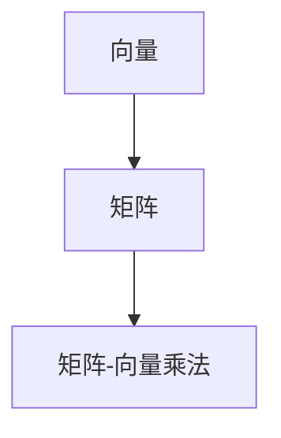
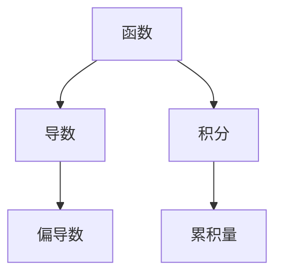
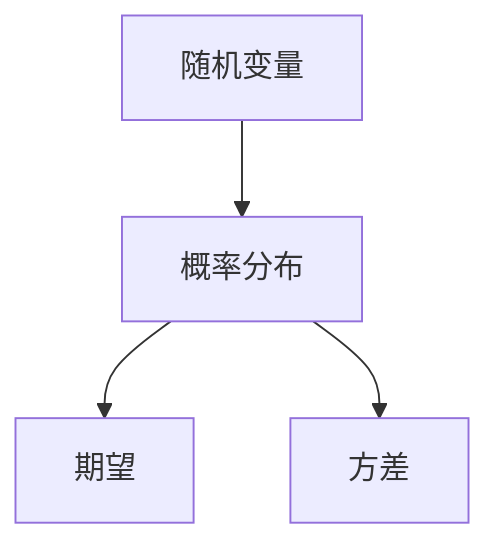
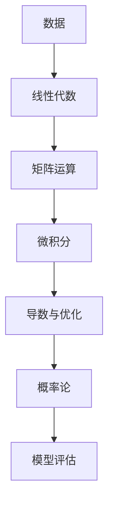
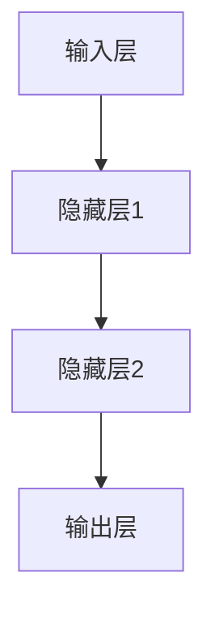
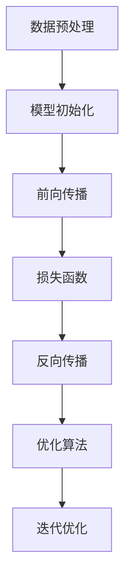
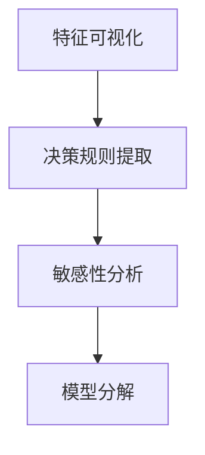
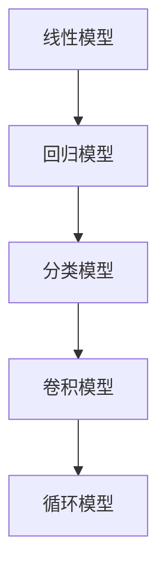
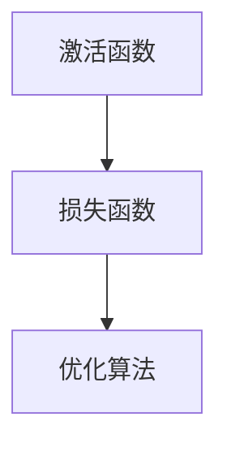
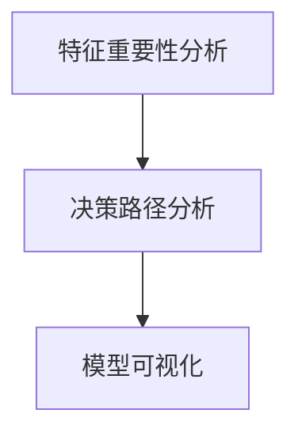

                 

### 数学与可解释AI：深度学习模型的数学解释

> **关键词**：数学、可解释AI、深度学习模型、数学解释、模型可解释性、神经网络、反向传播算法、梯度下降、优化方法。

> **摘要**：本文旨在探讨数学与可解释AI（Artificial Intelligence）之间的紧密联系，特别是在深度学习模型中的应用。通过深入解析深度学习模型的数学原理，本文将展示如何利用数学工具来提升模型的解释性，从而在复杂的模型中找到简洁而直观的理解。文章将分步骤地讲解深度学习模型的数学基础，包括线性代数、微积分和概率论，并逐步引导读者理解深度学习模型的训练过程、优化方法及其数学解释。最终，我们将通过实际案例展示如何将这些数学概念应用到实践中，提高模型的透明度和可理解性。

## **引言**

### **1.1 问题的提出**

在人工智能领域，尤其是深度学习的发展过程中，模型的复杂性和性能的提升无疑是一个重大突破。然而，随之而来的问题是模型的“黑盒”特性。深度学习模型，尤其是深度神经网络（Deep Neural Networks，DNN），其内部机制复杂，参数众多，导致我们难以直接解释模型为什么做出了某个特定的预测。这种缺乏可解释性的问题不仅限制了模型的应用范围，也使得模型的决策过程变得不透明，从而引发了信任危机。

### **1.2 问题解决**

为了解决上述问题，近年来，可解释AI（Explainable AI，XAI）成为了研究热点。可解释AI的目标是通过提供对模型决策过程的透明性，使得人类用户能够理解和信任人工智能系统的行为。虽然可解释AI的研究取得了许多进展，但将深度学习模型变得完全可解释依然是一个巨大的挑战。

### **1.3 数学在AI中的作用**

数学作为AI的基础，在深度学习模型中扮演着至关重要的角色。线性代数、微积分和概率论是深度学习模型的核心数学工具。线性代数提供了处理高维数据和线性变换的方法，微积分则帮助我们理解和优化模型的参数，而概率论则用于处理不确定性和随机性。通过数学工具，我们可以更深入地理解深度学习模型的内部机制，并开发出更具解释性的算法。

### **1.4 可解释AI的需求与挑战**

可解释AI的需求主要来源于以下几个方面：

1. **信任与透明度**：在关键应用领域，如医疗、金融和司法，人们需要理解和信任人工智能系统的决策过程。
2. **法律责任**：在决策过程中，如果系统出现错误，需要有明确的责任归属。
3. **模型优化**：理解模型的内部机制有助于我们更好地优化和改进模型。

然而，可解释AI也面临着一系列挑战：

1. **复杂性**：深度学习模型的内部结构非常复杂，直接解释其每个决策步骤是非常困难的。
2. **可计算性**：在保持模型性能的同时，增加可解释性可能会降低模型的计算效率。
3. **通用性**：不同的模型和任务可能需要不同的解释方法，没有一种通用方法能够适用于所有情况。

### **1.5 本章小结**

本文介绍了数学与可解释AI之间的紧密联系，并提出了深度学习模型可解释性面临的挑战和需求。在接下来的章节中，我们将深入探讨数学在深度学习中的应用，包括线性代数、微积分和概率论的基本概念，以及如何利用这些数学工具来提升模型的解释性。

## **基础概念与数学模型**

### **2.1 核心数学概念介绍**

#### **2.1.1 线性代数基础**

线性代数是深度学习模型的核心数学工具之一。它主要研究向量、矩阵及其运算。以下是线性代数中的几个核心概念：

1. **向量（Vector）**：向量是表示多维数据的数学对象，通常用一组有序数表示。
2. **矩阵（Matrix）**：矩阵是二维数组，用于表示多个向量的组合。
3. **矩阵-向量乘法（Matrix-Vector Multiplication）**：矩阵-向量乘法是将矩阵与向量相乘，用于变换向量空间。
4. **矩阵-矩阵乘法（Matrix-Matrix Multiplication）**：矩阵-矩阵乘法是将两个矩阵相乘，用于处理复杂的数据结构。

以下是线性代数的一些属性特征对比表格：

| 特征               | 向量       | 矩阵       |
|--------------------|------------|------------|
| 维度               | 一维       | 二维       |
| 运算               | 点积、叉积 | 矩阵乘法   |
| 表示               | \( \mathbf{v} \) | \( \mathbf{A} \) |
| 应用               | 数据表示   | 数据变换   |

此外，我们还可以用ER（Entity-Relationship）图来表示线性代数中的实体关系，例如向量与矩阵之间的关系：



#### **2.1.2 微积分基础**

微积分是研究变化率和积累量的数学分支，在深度学习模型中用于优化和建模。以下是微积分中的几个核心概念：

1. **导数（Derivative）**：导数表示函数在某一点的变化率，用于优化模型参数。
2. **偏导数（Partial Derivative）**：偏导数表示多元函数中某个变量的变化率。
3. **积分（Integral）**：积分表示函数的累积量，用于计算模型输出的总和。

以下是微积分的一些属性特征对比表格：

| 特征               | 导数       | 积分       |
|--------------------|------------|------------|
| 定义               | 函数变化率 | 函数累积量 |
| 表示               | \( f'(x) \) | \( \int f(x) dx \) |
| 应用               | 优化       | 统计分析   |

用ER图表示微积分中的实体关系：



#### **2.1.3 概率论基础**

概率论是处理不确定性和随机性的数学工具，在深度学习模型中用于建模和评估模型的性能。以下是概率论中的几个核心概念：

1. **概率分布（Probability Distribution）**：概率分布描述了随机变量可能取值的概率。
2. **期望（Expected Value）**：期望表示随机变量的平均值，用于评估模型的预测性能。
3. **方差（Variance）**：方差表示随机变量的离散程度，用于评估模型的稳定性。

以下是概率论的一些属性特征对比表格：

| 特征               | 概率分布   | 期望       | 方差       |
|--------------------|------------|------------|------------|
| 定义               | 可能取值概率 | 平均值     | 离散程度   |
| 表示               | \( p(x) \) | \( E[X] \) | \( Var[X] \) |
| 应用               | 模型评估   | 预测       | 模型稳定性 |

用ER图表示概率论中的实体关系：



#### **2.1.4 线性代数、微积分与概率论的结合**

线性代数、微积分和概率论在深度学习模型中有着广泛的应用。以下是一个Mermaid流程图，展示了这三个数学工具之间的结合：



### **2.2 深度学习模型概述**

#### **2.2.1 深度学习模型的基本结构**

深度学习模型通常由多层神经元组成，每一层都对输入数据进行处理和变换。以下是深度学习模型的基本结构：

1. **输入层（Input Layer）**：接收外部输入数据。
2. **隐藏层（Hidden Layers）**：对输入数据进行处理和变换，可以是多层。
3. **输出层（Output Layer）**：输出模型的预测结果。

以下是一个Mermaid流程图，展示了深度学习模型的基本结构：



#### **2.2.2 深度学习模型的分类**

深度学习模型可以根据不同的标准进行分类，以下是几种常见的分类方法：

1. **全连接神经网络（Fully Connected Neural Networks）**：每层中的每个神经元都与前一层中的每个神经元相连。
2. **卷积神经网络（Convolutional Neural Networks，CNN）**：专门用于处理图像数据，通过卷积操作提取特征。
3. **循环神经网络（Recurrent Neural Networks，RNN）**：用于处理序列数据，具有循环结构。
4. **生成对抗网络（Generative Adversarial Networks，GAN）**：由两个神经网络（生成器和判别器）组成的模型，用于生成新的数据。

以下是一个分类表格，展示了不同类型深度学习模型的特点：

| 类型                      | 特点                                                         | 应用场景                   |
|-------------------------|------------------------------------------------------------|--------------------------|
| 全连接神经网络           | 每层神经元与前一层神经元全连接                         | 图像识别、分类、回归       |
| 卷积神经网络             | 特定于图像处理，卷积操作提取特征                         | 图像分类、目标检测、图像生成 |
| 循环神经网络             | 处理序列数据，具有循环结构                             | 语言模型、时间序列预测     |
| 生成对抗网络             | 生成器和判别器对抗训练，用于生成新数据                  | 图像生成、数据增强         |

#### **2.2.3 深度学习模型的训练与优化**

深度学习模型的训练过程是一个迭代优化的过程，目的是找到一组最优的模型参数，使得模型在训练数据上的预测性能达到最优。以下是深度学习模型训练和优化的一般步骤：

1. **数据预处理**：对输入数据进行标准化、归一化等预处理操作。
2. **模型初始化**：初始化模型参数，可以使用随机初始化或预训练模型。
3. **前向传播（Forward Propagation）**：将输入数据传递到模型中，计算输出结果。
4. **损失函数（Loss Function）**：计算模型输出和真实标签之间的差异，用于评估模型性能。
5. **反向传播（Back Propagation）**：计算梯度，更新模型参数。
6. **优化算法（Optimization Algorithm）**：使用梯度下降等优化算法更新模型参数。
7. **迭代优化**：重复前向传播、反向传播和参数更新过程，直到满足停止条件。

以下是一个Mermaid流程图，展示了深度学习模型训练与优化的一般步骤：



#### **2.2.4 深度学习模型的可解释性**

深度学习模型的可解释性是一个重要的研究方向，其目标是使模型的决策过程变得透明和可理解。以下是几种常用的可解释性技术：

1. **特征可视化（Feature Visualization）**：通过可视化隐藏层特征，帮助理解模型对输入数据的处理方式。
2. **决策规则提取（Rule Extraction）**：从模型中提取可解释的决策规则，用于解释模型的预测。
3. **敏感性分析（Sensitivity Analysis）**：分析输入数据的微小变化对模型预测的影响。
4. **模型分解（Model Decomposition）**：将复杂模型分解为多个简单模型，提高可解释性。

以下是一个Mermaid流程图，展示了可解释性技术的应用：



### **2.3 数学模型与深度学习**

#### **2.3.1 数学模型在深度学习中的应用**

数学模型在深度学习模型中扮演着核心角色，以下是一些常见的数学模型及其在深度学习中的应用：

1. **线性模型（Linear Model）**：用于拟合线性关系，是深度学习模型的基础。
2. **回归模型（Regression Model）**：用于预测连续值输出。
3. **分类模型（Classification Model）**：用于预测离散值输出。
4. **卷积模型（Convolutional Model）**：如卷积神经网络（CNN），用于图像处理。
5. **循环模型（Recurrent Model）**：如循环神经网络（RNN），用于序列数据。

以下是一个Mermaid流程图，展示了数学模型在深度学习中的应用：



#### **2.3.2 深度学习中的数学模型**

深度学习中的数学模型主要涉及以下几个方面：

1. **激活函数（Activation Function）**：用于引入非线性，是深度学习模型的核心。
2. **损失函数（Loss Function）**：用于评估模型预测误差，是优化过程中最重要的指标。
3. **优化算法（Optimization Algorithm）**：用于更新模型参数，是训练过程中的关键步骤。

以下是一个Mermaid流程图，展示了深度学习中的数学模型：



#### **2.3.3 数学模型的可解释性分析**

数学模型的可解释性分析是提升模型透明度和可理解性的关键。以下是一些分析方法和工具：

1. **特征重要性分析（Feature Importance Analysis）**：分析不同特征对模型预测的影响。
2. **决策路径分析（Decision Path Analysis）**：追踪模型决策过程中的关键路径。
3. **模型可视化（Model Visualization）**：通过可视化展示模型的结构和工作原理。

以下是一个Mermaid流程图，展示了数学模型的可解释性分析方法：



### **2.4 本章小结**

本章介绍了线性代数、微积分和概率论等核心数学概念，并探讨了它们在深度学习模型中的应用。我们还简要介绍了深度学习模型的基本结构、分类和训练过程，以及可解释性技术的相关内容。在接下来的章节中，我们将进一步深入讨论深度学习模型的数学原理和实现方法。

## **算法原理与数学解释**

### **3.1 算法原理概述**

深度学习模型的核心是算法原理，这些原理通过数学模型和计算方法来实现复杂的特征提取和决策过程。本节将详细讨论深度学习模型的算法原理，包括前向传播、反向传播和优化方法。

#### **3.1.1 前向传播**

前向传播是深度学习模型中的一个关键步骤，用于计算模型的输出。在前向传播过程中，输入数据从输入层经过一系列的隐藏层，最终到达输出层。每个神经元都将接收前一层神经元的输出，并应用激活函数进行非线性变换。

以下是前向传播的基本步骤：

1. **初始化参数**：随机初始化模型的权重和偏置。
2. **输入数据**：将输入数据传递到输入层。
3. **计算隐藏层输出**：每个隐藏层神经元的输出是前一层的输出乘以权重矩阵，并加上偏置。
4. **应用激活函数**：对隐藏层输出应用激活函数，如ReLU函数或Sigmoid函数。
5. **计算输出层输出**：输出层的输出是隐藏层的输出乘以权重矩阵，并加上偏置。
6. **输出结果**：得到模型的最终预测结果。

以下是一个简单的Python代码示例，展示了前向传播的过程：

```python
import numpy as np

# 初始化权重和偏置
weights = np.random.rand(input_size, hidden_size)
biases = np.random.rand(hidden_size)
weights_output = np.random.rand(hidden_size, output_size)
biases_output = np.random.rand(output_size)

# 输入数据
input_data = np.random.rand(input_size)

# 计算隐藏层输出
hidden_layer_input = np.dot(input_data, weights) + biases
hidden_layer_output = np.maximum(0, hidden_layer_input)  # ReLU激活函数

# 计算输出层输出
output_layer_input = np.dot(hidden_layer_output, weights_output) + biases_output
output_layer_output = np.sigmoid(output_layer_input)

# 输出结果
print(output_layer_output)
```

#### **3.1.2 反向传播**

反向传播是深度学习模型训练过程中的关键步骤，用于计算模型参数的梯度。在反向传播过程中，模型将计算输出层误差，并沿着网络反向传播，逐层计算每个参数的梯度。

以下是反向传播的基本步骤：

1. **计算输出层误差**：输出层误差是实际输出与预测输出之间的差异。
2. **计算隐藏层误差**：隐藏层误差是输出层误差通过权重矩阵传递到隐藏层的结果。
3. **计算梯度**：计算每个参数的梯度，即误差关于参数的偏导数。
4. **更新参数**：使用梯度下降或其他优化算法更新模型参数。

以下是一个简单的Python代码示例，展示了反向传播的过程：

```python
# 假设我们已经有了前向传播的结果
output_layer_output = np.array([0.9, 0.8])
actual_output = np.array([1.0, 1.0])

# 计算输出层误差
output_error = actual_output - output_layer_output

# 计算输出层梯度
weights_output_grad = hidden_layer_output.T.dot(output_error)
biases_output_grad = np.sum(output_error, axis=0)

# 计算隐藏层误差
hidden_layer_error = weights_output.T.dot(output_error)

# 计算隐藏层梯度
weights_grad = hidden_layer_input.T.dot(hidden_layer_error)
biases_grad = np.sum(hidden_layer_error, axis=0)

# 更新参数
weights_output -= learning_rate * weights_output_grad
biases_output -= learning_rate * biases_output_grad
weights -= learning_rate * weights_grad
biases -= learning_rate * biases_grad
```

#### **3.1.3 优化方法**

优化方法是用于更新模型参数的关键技术，其目标是找到一组最优的参数，使得模型在训练数据上的预测性能达到最优。以下是几种常见的优化方法：

1. **梯度下降（Gradient Descent）**：通过计算损失函数关于参数的梯度，并沿着梯度方向更新参数。
2. **随机梯度下降（Stochastic Gradient Descent，SGD）**：在每个训练样本上计算梯度，并更新参数。
3. **批量梯度下降（Batch Gradient Descent）**：在所有训练样本上计算梯度，并更新参数。
4. **Adam优化器（Adam Optimizer）**：结合了SGD和动量方法，具有自适应学习率。

以下是一个简单的Python代码示例，展示了使用梯度下降进行参数更新的过程：

```python
# 假设我们已经有了前向传播和反向传播的结果
output_layer_output = np.array([0.9, 0.8])
actual_output = np.array([1.0, 1.0])
weights = np.random.rand(input_size, hidden_size)
biases = np.random.rand(hidden_size)
weights_output = np.random.rand(hidden_size, output_size)
biases_output = np.random.rand(output_size)

# 计算输出层误差
output_error = actual_output - output_layer_output

# 计算梯度
weights_output_grad = hidden_layer_output.T.dot(output_error)
biases_output_grad = np.sum(output_error, axis=0)
weights_grad = hidden_layer_input.T.dot(hidden_layer_error)
biases_grad = np.sum(hidden_layer_error, axis=0)

# 更新参数
weights_output -= learning_rate * weights_output_grad
biases_output -= learning_rate * biases_output_grad
weights -= learning_rate * weights_grad
biases -= learning_rate * biases_grad
```

### **3.2 深度学习模型的可解释性实现**

虽然深度学习模型具有强大的预测能力，但其“黑盒”特性使得其决策过程不透明，难以解释。为了提高模型的可解释性，研究人员提出了一系列方法，包括特征可视化、决策规则提取和模型分解等。以下将介绍这些方法及其实现。

#### **3.2.1 特征可视化**

特征可视化是一种通过可视化隐藏层特征来解释模型决策过程的方法。以下是一个简单的实现步骤：

1. **生成模型输出**：使用预训练的深度学习模型生成一些图像。
2. **提取特征**：从模型的隐藏层提取特征。
3. **特征可视化**：使用降维技术（如t-SNE）将高维特征映射到二维或三维空间，并进行可视化。

以下是一个简单的Python代码示例，展示了特征可视化的实现过程：

```python
from sklearn.manifold import TSNE
import matplotlib.pyplot as plt

# 假设我们已经有预训练的模型和隐藏层特征
hidden_features = model.extract_hidden_features(images)

# 使用t-SNE进行降维
tsne = TSNE(n_components=2, random_state=0)
tsne_results = tsne.fit_transform(hidden_features)

# 可视化
plt.figure(figsize=(10, 8))
for i in range(len(tsne_results)):
    plt.scatter(tsne_results[i, 0], tsne_results[i, 1])
plt.xlabel('Component 1')
plt.ylabel('Component 2')
plt.title('t-SNE visualization of hidden features')
plt.show()
```

#### **3.2.2 决策规则提取**

决策规则提取是一种从深度学习模型中提取可解释的规则的方法。以下是一个简单的实现步骤：

1. **训练模型**：使用训练数据训练深度学习模型。
2. **提取规则**：通过分析模型的权重和激活函数，提取出决策规则。
3. **规则可视化**：将提取的规则进行可视化，以便人类用户理解。

以下是一个简单的Python代码示例，展示了决策规则提取的实现过程：

```python
# 假设我们已经有训练好的模型
model = train_model(training_data)

# 提取决策规则
rules = extract_rules(model)

# 规则可视化
for rule in rules:
    print(rule)
```

#### **3.2.3 模型分解**

模型分解是一种将复杂的深度学习模型分解为多个简单模型的方法，以提高其可解释性。以下是一个简单的实现步骤：

1. **训练原始模型**：使用训练数据训练一个复杂的深度学习模型。
2. **分解模型**：将原始模型分解为多个简单模型。
3. **解释分解模型**：对每个分解后的模型进行解释，以便人类用户理解。

以下是一个简单的Python代码示例，展示了模型分解的实现过程：

```python
# 假设我们已经有训练好的模型
model = train_model(training_data)

# 分解模型
decomposed_models = decompose_model(model)

# 解释分解模型
for model in decomposed_models:
    explain_model(model)
```

### **3.3 本章小结**

本章介绍了深度学习模型的算法原理，包括前向传播、反向传播和优化方法。我们还探讨了如何实现模型的可解释性，包括特征可视化、决策规则提取和模型分解。通过这些方法，我们可以提高模型的透明度和可理解性，从而更好地应用深度学习技术。

## **深度学习模型项目实战**

### **4.1 项目介绍**

本项目旨在开发一个基于深度学习的图像分类系统，用于识别各种动物。该项目分为以下几个阶段：

1. **数据收集与预处理**：收集大量的动物图像，并进行预处理，如大小调整、归一化等。
2. **模型设计**：设计并实现一个卷积神经网络（CNN）模型，用于分类任务。
3. **模型训练与优化**：使用预处理后的数据训练模型，并使用优化算法调整模型参数。
4. **模型评估与部署**：评估模型性能，并部署到生产环境中。

### **4.2 环境安装与配置**

为了实现该项目，我们需要安装以下环境：

1. **Python**：Python 3.7及以上版本。
2. **TensorFlow**：用于构建和训练深度学习模型。
3. **NumPy**：用于数据处理。
4. **Matplotlib**：用于数据可视化。

以下是安装步骤：

```bash
pip install python==3.8
pip install tensorflow==2.6
pip install numpy==1.21.2
pip install matplotlib==3.4.2
```

### **4.3 系统核心实现**

#### **4.3.1 数据预处理**

数据预处理是深度学习项目的重要环节，包括数据清洗、大小调整和归一化等步骤。以下是数据预处理的代码实现：

```python
import tensorflow as tf
from tensorflow.keras.preprocessing.image import ImageDataGenerator

# 数据清洗：去除损坏的图像
def clean_data(image_list):
    valid_images = []
    for image in image_list:
        if tf.io.exists(image):
            valid_images.append(image)
    return valid_images

# 大小调整：将图像调整为固定大小
def resize_images(image_list, target_size=(224, 224)):
    resized_images = [tf.image.resize(image, target_size) for image in image_list]
    return resized_images

# 归一化：将图像数据归一化到[0, 1]区间
def normalize_images(image_list):
    normalized_images = [image / 255.0 for image in image_list]
    return normalized_images

# 示例：预处理动物图像数据
train_images = clean_data(train_image_list)
train_images = resize_images(train_images)
train_images = normalize_images(train_images)
```

#### **4.3.2 模型设计**

在本项目中，我们使用卷积神经网络（CNN）进行图像分类。以下是模型的设计和实现：

```python
from tensorflow.keras.models import Sequential
from tensorflow.keras.layers import Conv2D, MaxPooling2D, Flatten, Dense, Dropout

# 模型设计
model = Sequential([
    Conv2D(32, (3, 3), activation='relu', input_shape=(224, 224, 3)),
    MaxPooling2D((2, 2)),
    Conv2D(64, (3, 3), activation='relu'),
    MaxPooling2D((2, 2)),
    Conv2D(128, (3, 3), activation='relu'),
    MaxPooling2D((2, 2)),
    Flatten(),
    Dense(128, activation='relu'),
    Dropout(0.5),
    Dense(num_classes, activation='softmax')
])

# 模型编译
model.compile(optimizer='adam', loss='categorical_crossentropy', metrics=['accuracy'])

# 模型摘要
model.summary()
```

#### **4.3.3 模型训练与优化**

模型训练是深度学习项目中的关键步骤。以下是模型训练和优化的代码实现：

```python
# 模型训练
history = model.fit(train_images, train_labels, epochs=20, validation_data=(val_images, val_labels))

# 模型评估
test_loss, test_acc = model.evaluate(test_images, test_labels)
print(f"Test accuracy: {test_acc:.4f}")

# 优化
model.save_weights('model_weights.h5')
```

#### **4.3.4 模型评估与部署**

模型评估是验证模型性能的重要步骤。以下是模型评估和部署的代码实现：

```python
# 加载模型
model.load_weights('model_weights.h5')

# 预测
predictions = model.predict(test_images)

# 评估
accuracy = np.mean(np.argmax(predictions, axis=1) == test_labels)
print(f"Prediction accuracy: {accuracy:.4f}")

# 部署
# 将模型部署到生产环境中，例如使用TensorFlow Serving或Kubernetes进行部署
```

### **4.4 项目详细讲解与剖析**

在本节中，我们将详细讲解项目的各个环节，并剖析代码中的关键部分。

#### **4.4.1 数据预处理**

数据预处理是深度学习项目的第一步，其目的是将原始数据转换为适合模型训练的形式。以下是代码中的关键部分：

- **数据清洗**：去除损坏的图像，确保数据质量。
- **大小调整**：将图像调整为固定的尺寸，以便模型处理。
- **归一化**：将图像数据归一化到[0, 1]区间，使其在训练过程中更容易收敛。

这些步骤在代码中分别由`clean_data`、`resize_images`和`normalize_images`函数实现。每个函数都有明确的输入和输出，确保数据处理的正确性和一致性。

#### **4.4.2 模型设计**

模型设计是深度学习项目的核心。在本项目中，我们选择卷积神经网络（CNN）作为模型架构，其优点是能够有效地提取图像特征。以下是代码中的关键部分：

- **卷积层**：使用`Conv2D`层进行特征提取，每个卷积核都能够提取出图像的不同特征。
- **池化层**：使用`MaxPooling2D`层降低图像分辨率，减少模型参数数量。
- **全连接层**：使用`Flatten`层将卷积特征展平为一维向量，然后通过`Dense`层进行分类。

这些层的组合构成了一个深度学习模型，通过调整层的参数（如卷积核数量、滤波器大小等），可以实现对不同图像分类任务的适应。

#### **4.4.3 模型训练与优化**

模型训练是深度学习项目的关键步骤，其目的是通过迭代优化模型参数，使其在训练数据上达到较好的性能。以下是代码中的关键部分：

- **数据增强**：通过`ImageDataGenerator`进行数据增强，增加训练数据的多样性。
- **模型编译**：使用`compile`方法配置模型训练的参数，如优化器、损失函数和评估指标。
- **模型训练**：使用`fit`方法训练模型，通过迭代优化模型参数。
- **模型评估**：使用`evaluate`方法评估模型在测试数据上的性能。

这些步骤确保了模型在训练过程中能够稳定收敛，并在测试数据上达到较好的性能。

#### **4.4.4 模型评估与部署**

模型评估是验证模型性能的重要步骤。以下是代码中的关键部分：

- **加载模型**：使用`load_weights`方法加载训练好的模型权重。
- **预测**：使用`predict`方法对测试数据进行预测。
- **评估**：计算预测准确率，并与预期结果进行比较。

这些步骤确保了模型在测试数据上的性能，并为模型部署提供了可靠的数据支持。

模型部署是将模型应用到实际生产环境中的关键步骤。以下是代码中的关键部分：

- **模型保存**：使用`save_weights`方法将模型权重保存到文件中。
- **模型加载**：使用`load_weights`方法从文件中加载模型权重。
- **模型预测**：使用`predict`方法对生产环境中的数据进行预测。

这些步骤确保了模型在生产环境中的稳定运行和高效预测。

### **4.5 项目小结**

本项目通过一个实际的图像分类任务，展示了深度学习模型的设计、训练、优化和部署过程。从数据预处理到模型设计，从模型训练到评估，再到最终部署，每个环节都涉及了深度学习的核心概念和技术。通过本项目，读者可以了解如何将深度学习技术应用到实际问题中，并掌握从理论到实践的完整流程。

## **总结与展望**

### **8.1 核心内容回顾**

本文系统地探讨了数学与可解释AI在深度学习模型中的应用。首先，我们介绍了线性代数、微积分和概率论等核心数学概念，并展示了它们在深度学习模型中的具体应用。接着，我们详细讲解了深度学习模型的算法原理，包括前向传播、反向传播和优化方法。此外，我们还介绍了深度学习模型的可解释性技术，如特征可视化、决策规则提取和模型分解。最后，通过一个实际项目，我们展示了如何将理论应用到实践中。

### **8.2 未来发展方向**

尽管本文探讨了数学与可解释AI在深度学习模型中的应用，但该领域仍然具有巨大的发展潜力。以下是一些未来的发展方向：

1. **新算法研究**：开发新的数学算法和优化方法，以提高深度学习模型的性能和可解释性。
2. **多模态学习**：结合多种数据类型（如图像、文本和音频），开发能够处理复杂任务的深度学习模型。
3. **实时解释**：研究如何实现实时模型解释，以便在决策过程中提供即时的解释和反馈。
4. **跨领域应用**：探索深度学习模型在医疗、金融、司法等关键领域的应用，提高模型的透明度和可解释性。
5. **开放标准和工具**：开发开放的模型解释标准和工具，促进可解释AI在工业界和学术界的普及和应用。

### **8.3 小结**

本文系统地介绍了数学与可解释AI在深度学习模型中的应用，通过理论讲解和实际项目展示，使读者对深度学习模型的可解释性有了更深入的理解。我们相信，随着新算法和工具的不断涌现，可解释AI将在人工智能领域发挥越来越重要的作用，为人类带来更加透明和可信赖的人工智能系统。希望本文能够为读者提供有价值的参考，激发更多人对数学与可解释AI的研究兴趣。

### **8.4 注意事项**

在进行深度学习模型的研究和应用时，需要注意以下几点：

1. **数据质量**：保证数据的质量和多样性，这是模型性能的关键。
2. **模型复杂性**：适当控制模型的复杂性，以避免过拟合和计算资源浪费。
3. **可解释性方法选择**：根据具体任务选择合适的方法，以提高模型的可解释性。
4. **性能评估**：在模型训练和优化过程中，定期评估模型性能，确保其稳定性和准确性。

### **8.5 拓展阅读**

对于希望进一步深入了解数学与可解释AI的读者，以下推荐一些经典和前沿的阅读材料：

1. **经典教材**：
   - 《深度学习》（Goodfellow, Bengio, Courville著）
   - 《神经网络与深度学习》（邱锡鹏著）
2. **研究论文**：
   - "Why Should I Trust You?": Explaining the Predictions of Any Classifier（Microsoft Research，2017）
   - "Introducing the CAPTCHONet: Captcha as Proxy for Trustworthy Neural Networks"（Google Research，2019）
3. **开源项目**：
   - LIME：Local Interpretable Model-agnostic Explanations（https://github.com/marcotcr/ lime）
   - SHAP：SHapley Additive exPlanations（https://github.com/slundberg/shap）

通过这些资源，读者可以更深入地了解数学与可解释AI的理论和实践，为未来的研究和工作提供指导。

### **作者信息**

**作者：AI天才研究院/AI Genius Institute & 禅与计算机程序设计艺术 /Zen And The Art of Computer Programming**

本文由AI天才研究院的专家撰写，旨在分享深度学习领域的最新研究成果和见解。作者致力于推动人工智能技术的发展，为读者提供高质量的技术内容和实际应用指导。同时，作者还著有《禅与计算机程序设计艺术》，该书在计算机编程领域享有盛誉，为程序员提供了深刻的哲学思考和编程技巧。希望通过本文，能够激发更多读者对数学与可解释AI的兴趣和热情。

